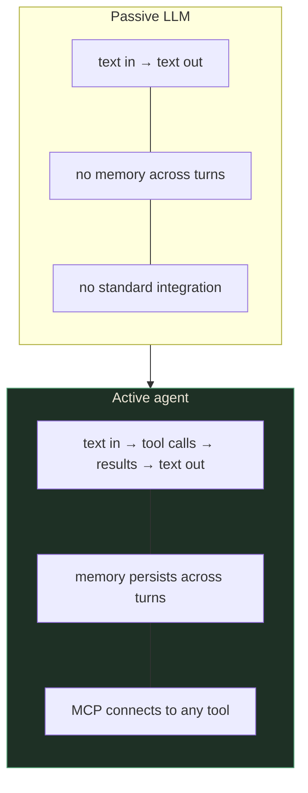
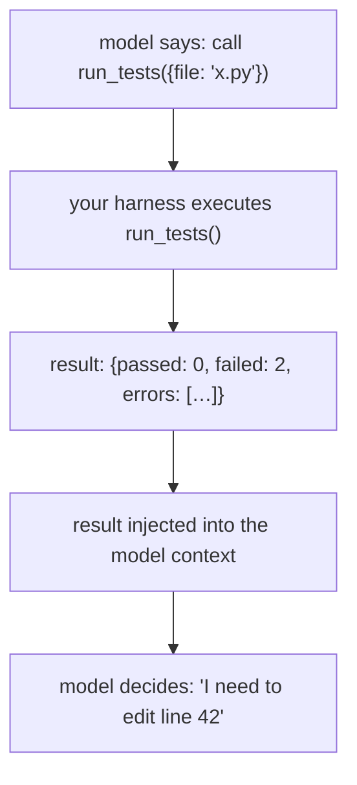
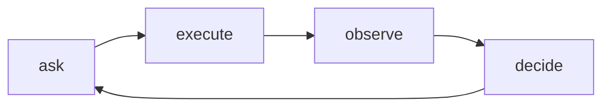
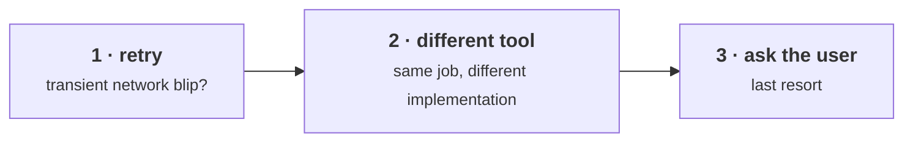
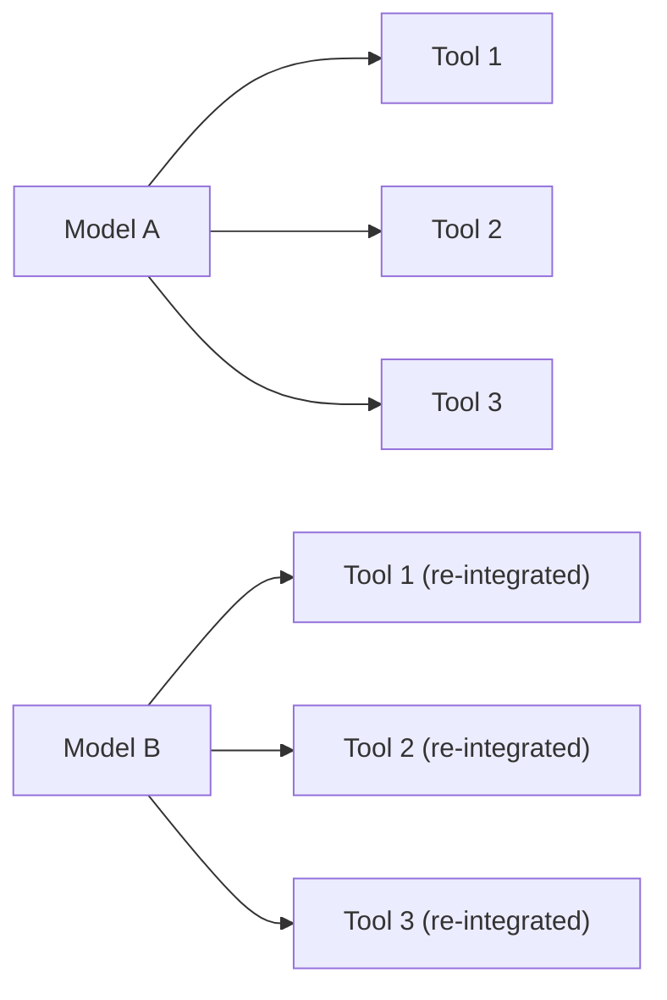
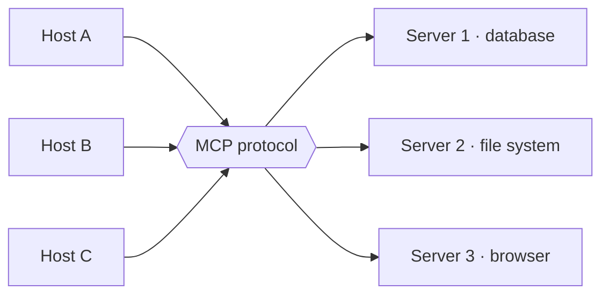
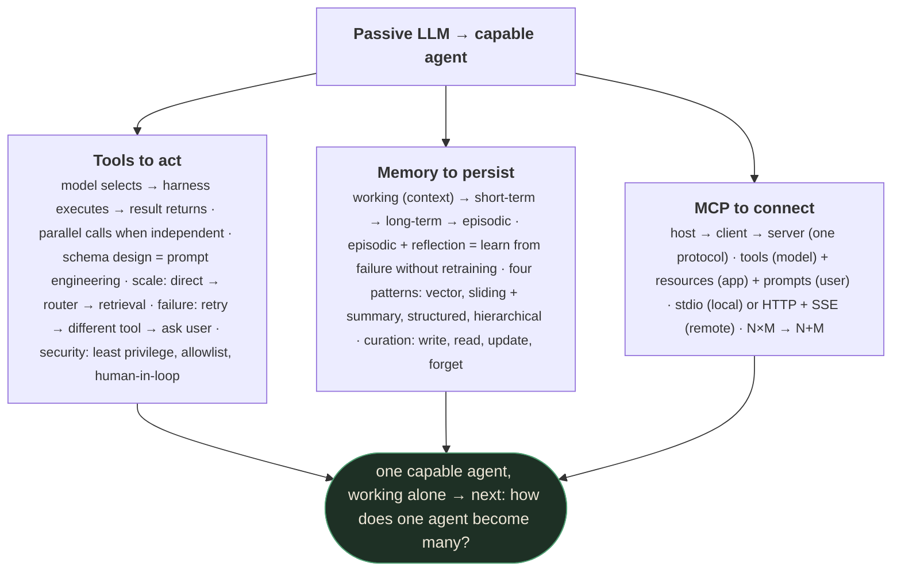

# Agentic AI — Part 2: Tools, Memory, and MCP

> Runtime ~32:00. Originally drafted from `slides_deduped/` (21 slides) with OCR + transcript
> verification, then **audited against the raw 52-frame capture** in
> `output/Lecture_28 - Bonus Module Agentic AI Part 2/` per this project's standard methodology
> (see project memory `slides-deduped-is-lossy`) — no missing named framework was found; the deck's
> own three-part structure (Tools/Memory/MCP) matches this file's sections closely. Instructor:
> **Harsh Agarwal**, Applied Scientist, International ML team at Amazon — confirmed from the slide
> nameplate. This module covers the three capabilities that turn a language model into an agent:
> tools to act, memory to persist, and a protocol (MCP) to connect them.

---

## What you'll understand after reading this

1. **Explain why LLMs need tools** — the four limitations (knowledge cutoff, compute, action, accuracy) and how tools solve each.
2. **Describe the tool-calling loop** — declare schema, model selects, code executes, result returns — and why the model never runs anything itself.
3. **Design good tool schemas** — clear descriptions, minimal required params, enums over free text, examples in descriptions.
4. **Choose a tool routing strategy** — direct selection vs. router vs. retrieval, based on toolbox size.
5. **Handle tool failures gracefully** — retry → different tool → ask user, with timeouts and graceful degradation.
6. **Apply security principles** — least privilege, allowlisting, human-in-the-loop for destructive actions.
7. **Distinguish context window from memory** — why context is bounded/volatile and real memory persists across sessions.
8. **Describe the four tiers of memory** — working, short-term, long-term, episodic — and where each lives.
9. **Explain episodic memory and reflection** — how agents learn from failure without retraining.
10. **Compare four memory implementation patterns** — vector store, sliding window + summary, structured, hierarchical.
11. **Explain MCP's architecture** — host, client, server roles; tools, resources, prompts capabilities.
12. **Distinguish MCP from function calling** — protocol layer vs. mechanism, and when each is appropriate.

---

## Before we start: what you need to know

### Prerequisite 1 — This lecture assumes Part 1's agent loop

This file builds directly on [`agentic-ai-01.md`](agentic-ai-01.md): the agent loop (think → act →
observe), the distinction between chatbot/copilot/agent, and error compounding are all used here
without re-derivation. If those are unfamiliar, read Part 1 first.

### Prerequisite 2 — JSON, briefly

A **tool schema** (§4) is written as **JSON** — a plain-text format for structured data, built from
nested `{key: value}` objects and `[item, item]` lists, with typed values (strings, numbers,
booleans). You don't need to write JSON by hand for this lecture, but you do need to recognize that
"the model emits a JSON tool call" means the model outputs text like `{"tool": "search_orders",
"email": "user@example.com"}` — a structured, machine-parseable request, not free prose.

### Prerequisite 3 — REST APIs, briefly

Several examples in this lecture (§1, §14) assume a basic notion of an **API call** — a request sent
to some external service (e.g., "call the weather API") that returns a structured response. A tool
call, at the mechanical level, is usually just this: the harness turns the model's tool-call request
into a normal API call (or a local function call) and returns the response.

---

## The big picture

Part 1 established that an agent closes the loop: Think → Act → Observe. But *what* makes it possible for an LLM to actually act? Three capabilities:



| Capability | What it enables | Section |
|-----------|----------------|---------|
| **Tools** | Act on the world — read files, run tests, call APIs | §1–§6 |
| **Memory** | Persist across time — remember past decisions and failures | §7–§10 |
| **MCP** | Connect to anything — one protocol, universal tool access | §11–§14 |

> *"What actually separates an agent from a chatbot are these very three things. Tools so it
> can act on the world. Memory so it can persist across time. And a protocol so it can connect
> to the tools without a custom integration required each time."*

---

## Part A — Tools

---

## 1. Why LLMs Need Tools

### 1.1 The four limitations

| Limitation | What's wrong | The fix |
|-----------|-------------|---------|
| **Knowledge cutoff** | Trained at some point in the past; can't know today's events | Search / retrieval tool |
| **Compute** | Fumbles exact arithmetic; predicts digits instead of calculating | Calculator / code sandbox |
| **Can't act** | Text in → text out; can't touch files, hit APIs, or click buttons | File system, browser, APIs |
| **Accuracy** | Even when it could guess, a real tool is exact; a DB query *knows* the answer | Database / structured query |

> *"Ask an LLM to multiply two big numbers. It's bound to fumble — it predicts digits instead
> of calculating."*

### 1.2 The running example: a code agent

A code agent can't fix a bug by *describing* the fix in a paragraph. It has to:
1. **Read** the file (tool call)
2. **Edit** the file (tool call)
3. **Run tests** (tool call)
4. **Observe** failures (result)
5. **Repeat** until tests pass

Talking or generating text isn't enough. The agent needs tools.

---

## 2. How Tool Calling Works

### 2.1 The four-step mechanism

| Step | Who does it | What happens |
|------|------------|-------------|
| **1. Declare** | You (developer) | Each tool gets a name, description, and JSON parameter schema |
| **2. Select** | Model | Trained on tool-use data; emits a structured call (not prose) |
| **3. Execute** | Your code (harness) | The model *never* runs anything — the harness runs the function |
| **4. Return** | Harness → model | Result goes back into context; model decides next move |



> *"The most important one that people miss a lot — the model never runs anything by itself.
> The harness sees the request and actually runs the function."*

### 2.2 The full loop



The code agent asks to run tests. The harness runs them. Failures come back as context.
The model reads the failures and decides what files to edit. The loop repeats.

---

## 3. Parallel Tool Calls

When tool calls don't depend on each other, the model requests them all in one turn and
the harness runs them concurrently:

| Scenario | Latency |
|----------|---------|
| 3 independent reads in **parallel** | 1 round trip |
| 3 independent reads **sequentially** | 3 × round trip |

**The model decides which calls are parallel and which are sequential.** If call B needs the
result of call A, the model keeps them sequential automatically.

> *"Our code agent wants to understand a bug. It reads three different files. If those reads
> don't depend on each other, we can do all three of once in one round trip, and the latency
> collapses."*

Each call is emitted as schema-constrained JSON, so arguments parse every time.

```interactive
type: animation
title: Parallel vs. sequential tool calls — time to finish
concept: Why independent tool calls should fan out in one turn instead of running one at a time
control: Toggle between "parallel" and "sequential" for the same 3 tool calls
observe: Parallel finishes at 1 round trip (all three bars complete together); sequential finishes at 3 round trips (call 1, then call 2, then call 3, back to back)
insight: The wall-clock savings come from the harness running independent calls concurrently, not from the model "being faster" — the model still emits the same 3 calls, only the execution schedule changes
fallback: The table above already gives the two reference points — parallel done @ 1 round trip, sequential done @ 3 round trips [slide 9] — the difference an animation would show is exactly the gap between those two numbers.
```

---

## 4. Tool Schema Design — The Schema Is the Prompt

> **Tool schema** — a structured description of one tool: its name, a plain-English description
> of what it does and when to use it, and a typed list of parameters it accepts.
>
> *In everyday words:* it's the "instruction label" on a function, written for the model instead
> of for a human programmer — the model never sees your code, only this label.
>
> *Concretely:* `{"name": "search_orders", "description": "Find a customer's orders by email. Use
> for 'where is my order' questions.", "parameters": {"email": {"type": "string", "required":
> true}, "status": {"type": "string", "enum": ["open", "shipped", "all"]}}}`.
>
> *Why it exists:* the model can't read your source code or guess your function's intent from its
> name alone — without a schema, it has no way to know a tool exists, what it does, or what
> arguments it expects.

This is a critical insight: **when you give a model tools, the schema you write *is* the
prompt.** The model learns which tools to call and with what arguments purely by reading
your descriptions.

### 4.1 Bad vs. good schema

| | Bad | Good |
|---|---|---|
| **Name** | `get_data` | `search_orders` |
| **Description** | "gets data" | "Find a customer's orders by email. Use for 'where is my order' questions." |
| **Param q** | `type: string` | `email: type: string, required` + `status: enum[open, shipped, all]` |

### 4.2 Design principles

| Principle | Why |
|-----------|-----|
| **Clear descriptions** | Model picks tools by reading these — vague text → wrong call |
| **Minimal required params** | Every required field is another chance for the model to fail |
| **Enums over free text** | Where the value comes from a fixed set, constrain it |
| **Examples in description** | Measurably improves tool selection accuracy |

> *"Treat your tool schemas like prompt engineering — because that's exactly what they are."*

---

## 5. Scaling Tool Access [slide 16]

When you have hundreds or thousands of tools, the model can't reason well over a giant menu.
Three strategies:

| Strategy | How it works | Scales to |
|----------|-------------|-----------|
| **Direct selection** | Dump all tools into context, let the model pick | "Fine up to a few dozen tools" (the deck's own wording — no more precise ceiling is given) |
| **Router** | A cheap model classifies intent first; expose only the relevant subset | Qualitatively "much flatter" cost/error growth than direct selection — no numeric ceiling stated on the deck |
| **Retrieval** | Embed every tool description; fetch top-k most relevant per query | Qualitatively "nearly flat" cost/error growth — the deck's chosen approach for very large toolboxes, again with no numeric ceiling stated |

```
Cost & error rate vs. number of tools:

Direct:    ████████████████████████ (blows up)
Router:    ████████████████ (much flatter)  
Retrieval: ██████████ (nearly flat)
```

> ⚠️ **The slide gives one precise number, not three** [slide 16] — "fine up to a few dozen tools"
> is the deck's own wording for direct selection. Router and retrieval are shown only as relative
> *shapes* on a cost/error-rate-vs-tools curve (flatter, flattest), with no numeric tool-count
> ceiling stated for either. Treat "~100 tools" or "1000+ tools" as illustrative round numbers you
> might reach for in practice, not values this deck actually gives — don't cite them as if sourced.

> *"The naive approach is fine until it isn't — post a dozen tools, as your toolbox explodes
> you need to either route or retrieve."*

```interactive
type: graph
title: Cost & error rate vs. number of tools
concept: Why the tool-access strategy that works at small scale breaks at large scale
control: Drag "tools available" from a few to many
observe: The direct-selection curve climbs steeply as tools increase; the router curve climbs much more slowly; the retrieval curve stays nearly flat
insight: All three strategies work fine at small scale — the curves only diverge once the toolbox grows large, which is exactly why "just dump everything in context" quietly breaks in production long after it worked fine in a demo
fallback: The ASCII bar chart above (direct ████████████████████████ vs. router ████████████████ vs. retrieval ██████████) already encodes the same three relative growth rates a graph would animate — read the bar lengths as the three curves' shapes at high tool count.
```

---

## 6. Tool Failure Handling and Security

### 6.1 The escalation ladder

When a tool fails, recover in order — cheapest and most automatic first:



| Failure type | Recovery |
|-------------|---------|
| Execution fails | Retry → different tool → ask user |
| Malformed parameters | Feed validation error back to model → self-corrects |
| Timeout | Bound every call; hung tool must not hang the agent |
| Tool unavailable | Graceful degradation: answer without it, be honest |

> *"A good agent treats a failed call as information, not a dead end."*

### 6.2 Security — every tool is an attack surface

| Principle | What it means |
|-----------|--------------|
| **Least privilege** | Give each tool the narrowest scope — a read tool should never write |
| **Allowlisting** | Name exactly which tools an agent may call; default to deny |
| **Human-in-the-loop** | Destructive or irreversible actions (delete data, send money) → pause for approval |

> **Least privilege** — a security rule that says every tool should be granted only the narrowest
> access it actually needs to do its job, never more.
>
> *In everyday words:* don't hand someone your whole house key when they only need to water one
> plant — give them access to exactly that plant and nothing else.
>
> *Concretely:* a tool that looks up a customer's order status should have read-only database
> access scoped to the orders table; it should not also be able to write to that table or read the
> payments table, even if it's technically the "same database."
>
> *Why it exists:* every tool an agent can call is a potential point of failure — if the model
> hallucinates a bad call, gets tricked by a prompt injection (§15 in Part 3), or a tool's own logic
> has a bug, the *narrowest possible scope* on that tool bounds how much damage any single mistake
> can do.

> *"Every tool you give an agent is a hole that you have punched in the sandbox. Grant the
> least that works."*

---

## Part B — Memory

---

## 7. Why Memory Matters

### 7.1 The problem: stateless agents redo everything

| Agent type | Behavior over session |
|-----------|----------------------|
| **Stateless** (no memory) | Re-derives everything each turn; repeats mistakes; work done climbs linearly |
| **With memory** | Builds on what it knows; work done plateaus; stops repeating dead ends |

```
Work redone per turn over a session:

Stateless:    /  /  /  /  /  /  /  (keeps climbing)
With memory:  /──/──/────────────── (flattens out)
```

```interactive
type: graph
title: Work redone per turn, over a session
concept: Why a stateless agent gets slower and more error-prone the longer a session runs
control: Drag "turn number" forward across a session
observe: The stateless curve keeps climbing (more re-derivation every turn); the with-memory curve rises briefly then flattens out
insight: The cost of statelessness isn't fixed — it compounds with session length, so a demo that looks fine at turn 3 can be re-deriving most of its own past work by turn 20
fallback: The ASCII sketch above ("stateless: / / / / / / / (keeps climbing)" vs. "with memory: /──/──/────────────── (flattens out)") already shows the same two shapes a graph would animate.
```

### 7.2 Context window ≠ memory

| | Context window | Real memory |
|---|---|---|
| Lifetime | Current session only | Across sessions |
| Capacity | Bounded, fills up | Scalable (external store) |
| Volatility | Vanishes when session ends | Persists indefinitely |
| Use | Working scratchpad | Learned facts, preferences, past failures |

> *"Context window is large, but bounded, and it's going to vanish the moment the session ends.
> Real memory means persisting what matters so the next session starts ahead."*

### 7.3 The three verbs of memory

1. **Store** — decide what's worth keeping (keyword: *not everything*)
2. **Recall** — surface the right memory at the right moment (retrieval)
3. **Drop** — actively remove what's wrong or outdated

---

## 8. Four Tiers of Memory [slide 25–26]

Sorted by how long they last and where they live. This taxonomy is the deck's own citation of
**MemGPT** (Packer et al., "MemGPT: Towards LLMs as Operating Systems," arXiv:2310.08560, 2023) —
visible in the slide's footer — which frames an LLM's context window the way an OS treats RAM:
a small, fast, volatile tier backed by larger, slower, persistent storage tiers underneath it.

| Tier | What it stores | Lifetime | Location |
|------|---------------|----------|----------|
| **Working** | Current conversation + scratchpad | Current turn | Context window |
| **Short-term** | Summarized history, key decisions | Within session | Summarized context |
| **Long-term** | User preferences, learned facts | Across sessions | External database |
| **Episodic** | Past experiences, failure lessons | Indefinite | External store (reflection-style) |

> **Episodic memory** — a persistent record of specific past attempts and their outcomes,
> especially failures, stored as text and re-injected into future prompts.
>
> *In everyday words:* it's the agent's own diary of "what I tried and what happened" — not facts
> about the world (that's long-term memory), but facts about the agent's *own history*.
>
> *Concretely:* "Attempt 1: tried to parse the CSV assuming a header row; failed because this file
> has none. Lesson: check for a header before parsing." — this sentence, stored once, is what
> episodic memory actually looks like.
>
> *Why it exists:* without it, an agent that fails a task and retries has no way to avoid repeating
> the exact same mistake — every attempt would start from zero, wasting the one thing a failure
> actually produces: information about what doesn't work.

> *"Last time I tried approach X and it failed because of Y" — that's episodic memory, and it
> lets an agent learn from failure without any retraining.*

---

## 9. Episodic Memory and Reflection

This is genuinely powerful — the agent gets better between attempt 1 and attempt 2 without
touching any weights or doing any fine-tuning.

### 9.1 The reflection loop

```
Attempt 1:
  Agent tries to fix a bug → fails
  Agent REFLECTS: "I failed because I forgot to handle the null case"
  → Reflection stored in episodic memory

Attempt 2:
  Episodic memory pulled back into context BEFORE attempt
  Agent already knows what NOT to do
  → Agent succeeds, tests pass green
```

### 9.2 Why this works

- The agent remembers its own mistake and doesn't repeat it
- No retraining, no fine-tuning — just context engineering
- Shares the "learn from your own output" spirit of **STaR** (`GenAI & LLM Part 2 §13`, Zelikman et
  al. 2022), but by a genuinely different mechanism: **STaR retrains** the model's weights on its
  own self-generated rationales, while reflection here only **re-injects a written lesson into the
  prompt at inference time** — the weights never change. Same instinct (bootstrap improvement from
  the model's own attempts), opposite mechanism (gradient update vs. context engineering).

> *"The difference between an agent that keeps banging its head on the same wall forever and
> the one that actually gets somewhere."*

---

## 10. Memory Implementation Patterns

Four common patterns, each trading off recall quality against cost/complexity:

| Pattern | How it works | Best for |
|---------|-------------|---------|
| **Vector store** | Embed everything; retrieve by semantic similarity | "Have I seen something like this before?" |

> **Vector store** — a database that stores each piece of text as a numeric vector (an
> "embedding") capturing its meaning, and lets you retrieve the stored items whose meaning is
> closest to a new query.
>
> *In everyday words:* instead of searching for exact keyword matches, you search by "what this
> means" — two sentences that say the same thing in different words end up as nearby vectors.
>
> *Concretely:* store "user reported checkout button not responding on mobile Safari" as a vector;
> later, a new query "customer says the buy button doesn't work on their iPhone" retrieves it even
> though the two sentences share almost no exact words.
>
> *Why it exists:* an agent's memory of past experiences is written in free-form natural language,
> not fixed keys — semantic similarity search is the only practical way to ask "have I seen
> something like this before?" over a growing pile of unstructured text.

| **Sliding window + summary** | Keep recent turns word-for-word; compress older into running summary | Simple, effective baseline |
| **Structured memory** | Extract entities/facts into typed store (name, plan, preferences) | Exact variables, no drift |
| **Hierarchical** | Detailed for recent past; fuzzy/abstract for distant past | Mimics human memory |

> *"You'll often need to combine all of these — a vector store for episodic recall plus
> structured memory for hard facts is a really common pairing."*

### Memory curation operations

| Operation | What it does |
|-----------|-------------|
| **Write** | Decide what's worth keeping (not everything!) |
| **Read** | Surface the right memory at the right moment (retrieval problem) |
| **Update** | When a fact changes, revise it (user switched plans → update) |
| **Forget** | Actively remove wrong or outdated information |

### Three caveats

1. **Curation** — knowing what to keep vs. tossing everything
2. **Relevance** — pulling the right memory at the right time (retrieval)
3. **Timeliness** — *"the world changes and memory does not"* [slide 34], unless you actively
   update it. ⚠️ *Author's gloss, not a direct quote:* a memory that's gone stale can actively
   mislead the agent into repeating an outdated assumption with false confidence — arguably worse
   than having no memory and reasoning from scratch each time.

---

## Part C — MCP (Model Context Protocol)

---

## 11. The Problem MCP Solves

> **MCP (Model Context Protocol)** — an open, standardized protocol that lets any AI model connect
> to any tool or data source through a common interface, instead of a custom integration for every
> model-tool pairing.
>
> *In everyday words:* it's a universal connector — like USB-C letting any laptop charge from any
> charger, instead of every phone brand needing its own plug.
>
> *Concretely:* a database team ships one "database MCP server." Any host — a chat app using
> Claude, one using GPT, one using Gemini — can now query that database, because all three speak
> MCP, without the database team writing three separate integrations.
>
> *Why it exists:* before MCP, connecting $N$ models to $M$ tools required roughly $N \times M$
> custom integrations (see the diagram below) — a combinatorial cost that made every new tool or
> every new model expensive to add to the ecosystem.

Before MCP, every model had to integrate every tool by hand:



**Before MCP:** N models × M tools = **N×M** bespoke connections, each rebuilt per model.

Every tool has a different API, auth flow, and parameter schema. You're rewriting the same
integration over and over.

### The USB-C analogy

Think of when every device had its own charger — Motorola, BlackBerry, Samsung all different.
Then USB-C: one standard connector. MCP is USB-C for AI tools.



**After MCP:** N hosts + M servers = **N+M**, with one protocol — like USB-C for AI tools.

> *"You collapse from N×M to N+M — from an entangled mesh to a clean hub."*

```interactive
type: diagram
title: N×M before MCP vs. N+M after
concept: Why a shared protocol layer changes the integration math, not just the convenience
control: Toggle between "before MCP" and "after MCP"
observe: Before: every host connects directly to every server (a full mesh, N×M lines). After: every host and server connects only to the protocol layer (N+M lines total)
insight: The saving isn't just fewer lines on a diagram — it means a tool builder and a model builder never have to coordinate with each other at all, because both only need to speak MCP once
fallback: The two ASCII diagrams above ("Before MCP" and "After MCP") already show the same mesh-vs-hub contrast a toggle would animate — count the connection lines in each to see the N×M vs. N+M difference directly.
```

---

## 12. MCP Architecture — Three Roles

| Role | What it is | Example |
|------|-----------|---------|
| **Host** | The app you use | IDE, chat client, code agent |
| **Client** | Lives inside the host; one per server; speaks the protocol | Protocol adapter |
| **Server** | Expresses capabilities (tools, data, prompts) | Database server, file system server |

The key insight: **a team can build and ship an MCP server without touching any model.**
The database team ships a database server — they don't care whether you're using Claude,
GPT, or Gemini.


> *"Tool builders and model builders never have to coordinate. That's how the ecosystem
> scales."*

---

## 13. Three MCP Capabilities

| Capability | What it exposes | Who controls it |
|-----------|----------------|----------------|
| **Tools** | Callable functions with schemas (what we covered in Part A) | **Model** — decides which to call and when |
| **Resources** | Readable data — files, API responses, DB rows | **App** — decides what data to feed in |
| **Prompts** | Reusable prompt templates (`/review-pr`, `/summarize`) | **User** — triggers them |

> *"The model picks tools, the app provides resources, and the user fires prompts. Three
> different parties in control."*

---

## 14. MCP Transports and Ecosystem

### 14.1 Two transports

| Transport | Where the server lives | Use case |
|----------|----------------------|---------|
| **stdio** (standard in/out) | Local subprocess on your machine | Local files, git, scripts |
| **HTTP + SSE** (streamable HTTP) | Remote server on the network | Hosted multi-user SaaS tools |

> **stdio / HTTP+SSE** — the two "pipes" an MCP client and server can talk over: **stdio**
> (standard input/output) pipes messages between two processes running on the same machine;
> **HTTP+SSE** (HTTP with Server-Sent Events) sends messages over the network with a persistent
> stream for the server to push updates back.
>
> *In everyday words:* stdio is like passing notes between two people in the same room; HTTP+SSE
> is like a phone call where either side can talk at any time — same conversation, different
> distance.
>
> *Concretely:* a local git-tools MCP server your IDE spawns as a subprocess uses stdio; a
> centrally-hosted company-wide search server that many users' agents connect to over the internet
> uses HTTP+SSE.
>
> *Why it exists:* MCP needs a transport that works whether the server is a lightweight script
> running next to your editor or a shared, always-on service — the protocol on top (tools,
> resources, prompts) is identical either way, so your agent code doesn't need to know or care
> which transport is underneath it.

Your agent code does not change between them. Swapping a local tool for a remote tool is
just a config detail — same protocol, different pipe.

### 14.2 Why MCP matters

| Benefit | Description |
|---------|------------|
| **Build once** | Works with any compatible host |
| **Discovery** | Agent can ask server at runtime "what tools do you have?" |
| **Composability** | Chain several servers together (file system + DB + browser) |
| **Capability-based security** | Host grants only the access it needs to |

### 14.3 Ecosystem adoption

MCP was created by Anthropic in 2024. Crucially, it got adopted by **OpenAI, Google,
Microsoft, Amazon** — the competitors. Now thousands of community servers exist, built
natively into Claude Code, VS Code, and JetBrains.

> *"A standard wins when building to it is easier than building around it. Once your
> competitors start adopting your standard, it has real impact."*

---

## 15. MCP vs. Function Calling

Common misconception: MCP *is* function calling. They're related but different layers:

| | Function Calling | MCP |
|---|---|---|
| **Level** | Mechanism (how one model calls one tool) | Ecosystem (protocol connecting many) |
| **Scope** | Model-specific, provider-specific | Model-agnostic, universal |
| **Discovery** | Hardcoded | Runtime discoverable |
| **When to use** | One model, few fixed tools | Many tools, multiple hosts |

Under the hood, an MCP host takes discovered tools and turns them into ordinary function
calls for whatever model it's using. **MCP feeds function calling.**

> *"If you've got one model and a few fixed tools, function calling works great — MCP is
> overkill. If you've got many tools and want to work across hosts, that's when you reach
> MCP."*

---

## 16. Module Recap



---

## Interview prep — Amazon Applied Scientist

<details><summary><b>1. Why can't an LLM fix a bug without tools? What four limitations do tools address?</b></summary>

An LLM is text-in, text-out. It can't access the file system (can't read/edit files), can't
execute code (can't run tests), has a knowledge cutoff (can't know current state), and its
predictions are approximate (a database query knows the answer; an LLM guesses). Tools give
it search for knowledge, calculators for compute, file systems and APIs for action, and
databases for exact answers. Without tools, the LLM can only *describe* a fix — it can't
*implement* one.
</details>

<details><summary><b>2. Why is "the schema is the prompt" such an important insight?</b></summary>

When you give a model tools, it decides which to call and with what arguments *solely* by
reading the schema descriptions — there's no other signal. A vague description like "gets data"
with a parameter named "q" gives the model no guidance; it'll guess and probably guess wrong.
A clear description like "Find a customer's orders by email. Use for 'where is my order'
questions" with typed, enum-constrained parameters gives the model precise guidance. The
schema *is* the prompt — it needs the same care as prompt engineering.
</details>

<details><summary><b>3. Design the tool routing strategy for an e-commerce platform with 500 tools.</b></summary>

Direct selection won't work — 500 schemas stuffed into context is expensive and error-prone.
Use a two-tier approach: (1) A cheap classifier model routes the user's intent to a category
(billing, inventory, shipping, etc.), then (2) expose only the ~20 tools in that category to
the main model. For the main model's tool calls, use retrieval: embed all 500 tool descriptions,
and for each query fetch the top-5 most relevant. This keeps cost and error rate flat regardless
of total toolbox size.
</details>

<details><summary><b>4. What's the difference between context window and memory? Why does it matter?</b></summary>

Context window is the current conversation — large but bounded, volatile, vanishes when the
session ends. Memory persists across sessions via external stores. Context is working memory;
memory is long-term knowledge. The distinction matters because an agent without memory restarts
from zero every session — it redoes all work, repeats all mistakes, and never builds on past
experience. Real memory (long-term preferences, episodic failure lessons) lets the agent start
each session ahead.
</details>

<details><summary><b>5. Explain episodic memory and the reflection loop. How does an agent improve without retraining?</b></summary>

Episodic memory stores past experiences — what was attempted, what happened, and why it failed.
After a failure, the agent writes a short self-reflection ("I failed because I forgot to handle
X") and stores it. On retry, the reflection is injected into context before the next attempt.
The agent enters attempt 2 already knowing what not to do. It avoids the same dead end and
succeeds. The model weights never change — all learning happens through context engineering.
This shares STaR's "learn from your own output" spirit (`GenAI & LLM Part 2 §13`) but not its
mechanism: STaR retrains on self-generated rationales; reflection only re-injects a lesson into
context at inference time.
</details>

<details><summary><b>6. Explain MCP's architecture. Why did it collapse N×M to N+M?</b></summary>

MCP has three roles: host (the app), client (protocol adapter inside the host), and server
(exposes tools/data). Before MCP, every model had to integrate every tool individually (N×M).
With MCP, tool builders ship MCP servers (model-agnostic) and host builders speak MCP
(tool-agnostic). A database team ships a server without knowing which model is used. The host
discovers tools at runtime. This collapses to N+M connections through one standard protocol —
like USB-C replacing every device having its own charger.
</details>

<details><summary><b>7. When should you use MCP vs. plain function calling?</b></summary>

Function calling is the mechanism: one model, few fixed tools, hardcoded wiring. Use it when
you have a single model with a small, stable tool set — MCP would be overkill. MCP is the
ecosystem: many tools, multiple hosts, runtime discovery, composability across vendors. Use it
when your toolbox grows beyond a dozen tools, when you want tools to work across different
models/hosts, or when you need runtime tool discovery. Under the hood, MCP feeds function
calling — the host discovers MCP tools and converts them to function calls for whatever model
it uses.
</details>

<details><summary><b>8. A tool call fails validation and the agent retries with a different tool. How should episodic memory interact with this recovery, and what's the risk of getting it wrong?</b></summary>

This combines §6.1's escalation ladder with §9's episodic memory. If the agent stores "tool X
failed for this task type" as an episodic lesson, future attempts at similar tasks can skip
straight to the working alternative — genuine learning without retraining. The risk (per §10's
"timeliness" caveat) is over-generalizing a one-off failure: if tool X failed because of a
transient outage, not a real incompatibility, a stale lesson would wrongly avoid a perfectly good
tool forever. The fix is to record *why* the tool failed (transient vs. structural), not just
*that* it failed, so recall can distinguish the two cases.
</details>

<details><summary><b>9. You're designing an MCP server for a tool with a destructive action (deleting records). Which security principle from §6.2 applies, and how does it interact with MCP's host/client/server split from §12?</b></summary>

§6.2's human-in-the-loop and least-privilege principles apply directly, but MCP's architecture
changes *where* they're enforced: the server should scope the tool as narrowly as possible
(least privilege) regardless of which host calls it, but the pause-for-approval gate is a *host*
concern (§12's "Host" role), since different hosts may want different approval UX. This is a case
where the tool-level security guarantee (server) and the human-approval workflow (host) are
deliberately split across MCP's roles rather than both living in the tool.
</details>

<details><summary><b>10. When would you choose a router (§5) over a vector-store memory pattern (§10) for helping the model use the right tool at the right time — and could you use both together?</b></summary>

These solve different problems that look similar: a router (§5) selects which *tools* are exposed
to the model this turn, based on classifying the current request's intent. A vector-store memory
pattern (§10) recalls *past experiences* ("have I seen something like this before?"), which can
include which tool worked last time for a similar task. In practice you'd combine them: the router
narrows the toolbox by category, and episodic/vector memory further biases tool selection within
that category based on what has worked historically — §10 explicitly notes combining memory
patterns is common, and the same logic extends to combining a scaling strategy with a memory
pattern.
</details>

### Depth probes

- *"§5's cost curves show retrieval scaling nearly flat as the toolbox grows — what's the hidden
  cost retrieval pays that direct selection doesn't?"* — retrieval requires embedding and indexing
  every tool description up front, and its per-query cost is now a vector search plus however many
  candidate tools get returned — it trades away direct selection's simplicity (dump everything into
  context) for an extra retrieval step, which is cheap at scale but isn't free at small scale, which
  is exactly why direct selection remains preferred while the toolbox is still small ("a few dozen
  tools," per the deck's own wording — see §5's ⚠️ note on why no numeric ceiling is claimed for
  router or retrieval).
- *"Episodic memory (§9) stores 'I failed because of Y' as text. What happens if that lesson is
  wrong or was only true in one specific context?"* — this is the same staleness risk §10's three
  caveats name directly (timeliness: "stale memory is worse than no memory"). A wrong or
  overly-specific lesson injected into every future prompt can actively mislead the agent in a new
  context where the original failure's cause doesn't apply — which is why the "forget" operation
  (§10's memory curation) needs to actively prune lessons, not just accumulate them indefinitely.

### Applied scenario — Amazon customer-support agent with MCP-backed tools

**Framing:** Amazon wants a customer-support agent that can look up an order, check a return policy,
and issue a refund — using tools that different internal teams (Orders, Policy, Payments) each own
and maintain independently.

**Why MCP, not just function calling (§15):** three different teams own three different backend
systems, and the support agent might eventually need to run on multiple hosts (a chat widget, an
internal agent console, a mobile app). Per §15's own guidance, this is exactly the "many tools,
multiple hosts" case that justifies MCP over hardcoded function calling — each team ships its own
MCP server (an Orders server, a Policy server, a Payments server) without ever coordinating with
whichever model or host ends up calling it (§12's "tool builders and model builders never have to
coordinate").

**Tool schema design (§4):** the refund tool specifically needs the schema-design discipline of §4.2
— a clear description ("issue a refund for a specific order; requires manager approval above $100"),
minimal required parameters, and an enum for refund reason rather than free text, since the model's
tool selection accuracy depends entirely on how well these are written.

**Memory (§7–§10):** long-term memory (§8) should store a customer's known preferences and past
issue history across sessions, so a returning customer doesn't have to re-explain context; episodic
memory (§9) is the natural fit for the agent learning "last time a return like this needed a photo
first" without retraining.

**Security (§6.2):** the refund tool is a textbook case for **human-in-the-loop** — a destructive,
hard-to-reverse action (money leaving the business) should pause for approval above a threshold, per
§6.2's principle, not be left to full automation regardless of the agent's confidence.

**Failure modes:** a poorly-scoped Payments MCP server that grants more than "issue a refund up to
$X" (violating least privilege, §6.2) turns one compromised or confused tool call into a much larger
financial exposure than intended.

**What you'd ship:** three narrowly-scoped MCP servers (Orders, Policy, Payments), each following
least-privilege and allowlisting, exposed to a single support-agent host over stdio (internal,
local) or HTTP+SSE (if the servers are centrally hosted), with human approval gated on refund amount.

**Leadership Principle tie-in:** **Ownership** — letting the Payments team own and evolve their MCP
server independently of whichever model or host calls it is a direct instance of §12's "teams ship
servers without touching any model." **Insist on the Highest Standards** — least-privilege tool
scoping (§6.2) on a refund-issuing tool is exactly the kind of guardrail that's cheap to add early
and expensive to retrofit after an incident.

---

## Glossary

- **Allowlisting** — naming exactly which tools an agent may call; default to deny.
- **Circuit breaker** — stop calling a failed tool for a cooldown period; prevents cascading failure.
- **Context window** — the current conversation in memory; bounded, volatile, session-scoped.
- **Episodic memory** — memory of past experiences with reflection-style lessons ("tried X, failed because Y").
- **Graceful degradation** — answering without a tool when it's unavailable; being honest about limitations.
- **Hierarchical memory** — detailed for recent past, fuzzy/abstract for distant past (mimics human memory).
- **Human-in-the-loop** — pausing for human approval before irreversible actions.
- **Least privilege** — giving each tool the narrowest scope that does the job.
- **MCP (Model Context Protocol)** — Anthropic's open protocol for universal tool connectivity (N×M → N+M).
- **Memory curation** — the four operations: write, read, update, forget.
- **Parallel tool calls** — requesting multiple independent tool calls in one turn; harness runs concurrently.
- **Reflection** — self-analysis after failure, stored in episodic memory, injected on retry.
- **Router** — cheap classifier that routes intent to the relevant tool subset.
- **Schema-constrained JSON** — tool parameters emitted in a parseable format; ensures arguments validate every time.
- **Short-term memory** — within-session memory: recent turns word-for-word, older turns summarized.
- **stdio** — MCP transport where the server is a local subprocess; fast, private.
- **Structured memory** — typed store for entities/facts (user name, plan, preferences); exact, no drift.
- **Tool schema** — name + description + JSON parameter definition; functions as the prompt for tool selection.
- **Vector store** — embed everything; retrieve by semantic similarity; best for "have I seen this before?"
- **Working memory** — the current context window; fast but bounded.

---

## Check yourself

1. Why can't an LLM multiply two large numbers correctly? What tool fixes this? *(§1)*
2. Describe the four-step tool-calling mechanism. Who executes the tool — the model or the harness? *(§2)*
3. When should tool calls be parallel vs. sequential? How does the model decide? *(§3)*
4. Why is "the schema is the prompt" an important insight? Give a bad and good example. *(§4)*
5. Compare direct selection, router, and retrieval strategies for tool access. When does each break down? *(§5)*
6. What's the escalation ladder when a tool fails? *(§6)*
7. Why is context window not the same as memory? *(§7)*
8. Describe the four tiers of memory and where each lives. *(§8)*
9. How does episodic memory + reflection enable learning without retraining? *(§9)*
10. What are the four memory implementation patterns? When would you use vector store vs. structured memory? *(§10)*
11. What three roles does MCP define? What does each control? *(§12)*
12. Explain the difference between MCP tools, resources, and prompts. *(§13)*
13. When should you use MCP vs. plain function calling? *(§15)*

---

## Going deeper

1. **Packer et al. (2023), "MemGPT: Towards LLMs as Operating Systems," arXiv:2310.08560** —
   ✅ confirmed directly in the footer of `slide_025.jpg`/`slide_026.jpg`, and independently
   re-verified via WebSearch: authors Charles Packer, Sarah Wooders, Kevin Lin, Vivian Fang,
   Shishir G. Patil, Ion Stoica, Joseph E. Gonzalez; arXiv:2310.08560, submitted Oct 2023. `solid`.
   This is the actual source of §8's four-tier memory taxonomy (working/short-term/long-term/
   episodic), modeled explicitly on OS memory hierarchies (RAM vs. disk).

2. **Anthropic (2024), "Model Context Protocol Specification"** — ✅ verified via WebSearch: MCP
   was introduced by Anthropic in November 2024; the official spec lives at
   modelcontextprotocol.io/specification/latest. `solid`. Defines the protocol formally.

3. **LangChain docs, "Tool Use / Function Calling"** — ⚠️ this is a live, versioned documentation
   site rather than a fixed citable paper — the general existence and subject matter are correct,
   but no single stable title/date/URL can be "confirmed" the way a paper can. Point readers to
   the current LangChain docs site rather than treating this as a dated reference. `solid`.

4. **OpenAI (2023), "Function calling and other API updates"** — ⚠️ this is a product/API blog
   announcement rather than a paper; the pattern and rough date (mid-2023, alongside GPT-4 function
   calling) are correct, but the exact post title should be re-checked against OpenAI's blog before
   citing verbatim. `solid`.

5. **Shinn et al. (2023), "Reflexion: Language Agents with Verbal Reinforcement Learning"**
   — ✅ verified via WebSearch: authors Noah Shinn, Federico Cassano, Edward Berman, Ashwin
   Gopinath, Karthik Narasimhan, Shunyu Yao; arXiv:2303.11366; published NeurIPS 2023. `hard`.
   Foundational — the paper behind the reflection/episodic memory pattern.

6. **Anthropic (2024), "Building Effective Agents"** — ✅ verified via WebSearch: authored by Erik
   Schluntz and Barry Zhang at Anthropic, published **December 2024** (the file's prior "2025" date
   was off by a year — corrected here). `solid`. Covers tool design, failure handling, and
   production patterns.

7. **Google (2025), "Agent-to-Agent Protocol (A2A)"** — ✅ verified via WebSearch: Google announced
   the Agent2Agent (A2A) protocol on April 9, 2025 at Google Cloud Next; contributed to the Linux
   Foundation in June 2025. `solid`. Google's competing standard for agent interoperability,
   mentioned in Part 3.

> ⚠️ **verify this** — items 3 and 4 point to living documentation/blog pages rather than fixed
> papers, so their exact title wording should be re-checked against the current page before quoting
> it verbatim; all other items above are now confirmed against their primary source (author list,
> arXiv ID, or announcement date), with item 6's year corrected from 2025 to 2024.
