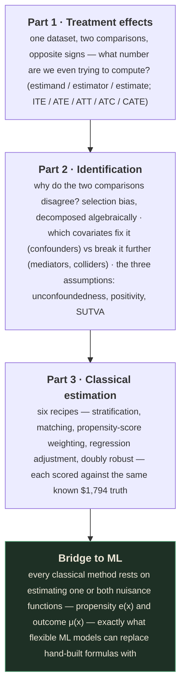
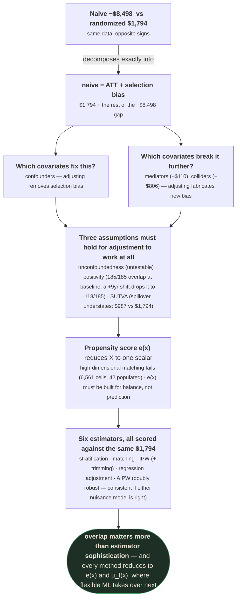

# Causal Inference — Part 2: Treatment Effects, Identification, and Classical Estimation

> Runtime ~57:00. Built from the raw capture in `output/Lecture_22 - Module 7 Causal Inference Part
> 2/` (90 raw frames), not `slides_deduped/` — see project memory `slides-deduped-is-lossy`.
> Instructor not named in the webcam tile. This is a **different deck lineage** from Lecture 21 —
> interactive, dark-themed, and built entirely around **one real running dataset** (the National
> Supported Work job-training program, mid-1970s) rather than citations to separate papers. Every
> method introduced is immediately scored against that dataset's known randomized-trial answer,
> **ATT ≈ +$1,794**, which is why this file cites in-slide numbers rather than external papers.
>
> ⚠️ **verify this** — the "National Supported Work" mid-1970s job-training dataset with these exact
> figures ($6,349 trainee earnings, $4,555 control earnings, ATT ≈ $1,794) is widely known in the
> causal inference literature as the dataset from LaLonde (1986), "Evaluating the Econometric
> Evaluations of Training Programs." This attribution is **not stated on the lecture's own slides**
> (no citation is shown), so it is offered here only as likely background context, not a transcribed
> fact.

---

## What you'll understand after reading this

1. **Reproduce, on one real dataset, how a randomized-trial estimate and a naive observational
   comparison can have opposite signs** — and explain exactly which assumption the naive comparison
   silently violates.
2. **Distinguish estimand, estimator, and estimate**, and diagnose whether a wrong answer comes from
   a wrong target or a careless procedure.
3. **Compute and distinguish all five treatment-effect estimands** (ITE, ATE, ATT, ATC, CATE) from a
   single dataset, and choose the correct one for a given business question.
4. **Decompose a naive comparison algebraically into "ATT + selection bias"**, and explain what
   "balancing a covariate" does to each term.
5. **Classify a candidate control variable as a confounder, mediator, or collider**, and predict
   whether adjusting for it fixes or breaks the estimate — with real, contrasting dollar figures for
   each case.
6. **State the three identifying assumptions** (unconfoundedness, positivity, SUTVA) precisely, and
   give a concrete violation of each drawn from the same running example.
7. **Explain why exact matching fails in high dimensions** (the curse of dimensionality), with the
   dataset's own $3^8=6{,}561$-cells-vs-42-populated-cells result.
8. **Derive and apply the propensity score**, explain why it should never be built to maximize
   prediction of treatment, and compute an inverse-probability-weighted estimate.
9. **Explain doubly robust (AIPW) estimation** and why it's consistent if *either* of two models is
   correctly specified.
10. **Read a full comparison table of six estimators against one known truth**, and explain why
    overlap — not estimator choice — turned out to be the dominant driver of accuracy in this
    example.

---

## Before we start: what you need to know

### Prerequisite 1 — This lecture assumes Lecture 21's vocabulary

This file builds directly on
[`causal-inference-01.md`](causal-inference-01.md): potential outcomes ($Y_i(1), Y_i(0)$), the
do-operator, DAGs, confounders, and the fundamental problem of causal inference are all used here
without re-derivation. If $\{Y(0),Y(1)\}$ or $P(Y\mid\text{do}(X))$ are unfamiliar, read Part 1
first.

### Prerequisite 2 — Standardized Mean Difference (SMD)

> **SMD (Standardized Mean Difference)** — the gap between two groups' means on some covariate,
> divided by a pooled standard deviation, so the gap is measured in "how many standard deviations
> apart" rather than in raw units.
>
> *Why it exists:* raw gaps aren't comparable across variables measured in different units (dollars
> vs. years vs. percentages). SMD puts every covariate's imbalance on the same scale, so you can rank
> "which covariate is most imbalanced" directly. A common rule of thumb, used in this lecture, treats
> $|\text{SMD}| > 0.1$ as a meaningful imbalance worth worrying about.

### Prerequisite 3 — Logistic regression, briefly

The propensity score (§7) is typically estimated by **logistic regression**: a model that outputs a
number between 0 and 1, interpreted as a probability, by fitting a linear combination of covariates
through a sigmoid function. If this is unfamiliar in detail, all you need for this lecture is: logistic
regression takes a set of covariates $X$ and produces $\hat e(x)\in(0,1)$, an estimated probability —
exactly the shape of number the propensity score needs.

### Prerequisite 4 — Weighted average, briefly

Several formulas in this lecture (stratification, IPW) are **weighted averages**: instead of averaging
every observation equally, each observation or group is multiplied by a "weight" reflecting its
importance or size, then summed. $\sum_k w_k \cdot v_k$ with $\sum_k w_k = 1$ is a weighted average —
know this shape, because §8's stratification formula and §10's IPW formula are both instances of it.

---

## The big picture

Lecture 21 established the theory: $P(Y\mid X)\ne P(Y\mid\text{do}(X))$, and identification requires
either randomization or the right assumptions plus the right graphical structure. This lecture
**operationalizes** that theory on one real dataset, in three acts:



Because every method is tested against the *same* real, known answer, this lecture teaches causal
inference less as a set of formulas to memorize and more as a series of **empirically verifiable
claims** — "here's what happens to the number when we do X" — which is unusual and worth taking
advantage of while studying it.

---

## 1. A Job-Training Experiment — the Dataset Everything Is Judged Against

**The question:** does a temporary paid job raise later earnings?

**The setup:** National Supported Work programme, mid-1970s. $T$: enrolled (1) or not (0). $Y$: 1978
earnings.

**A coin flip decided enrolment.** Trainees earned \$6,349 (average), controls \$4,555: **gap
\$1,794.**

*"The programme raised earnings by ≈ \$1,794 per person. Coin flip made groups alike, so the gap is
the real effect."*

🧪 **Baseline covariate balance, confirming the randomization worked:**

| Covariate | Trainees ($T{=}1$) | Controls ($T{=}0$) |
|---|---|---|
| Prior-year earnings | \$2,096 | \$2,107 |
| Age (years) | 26 | 25 |
| Share married | 19% | 15% |
| No high-school degree | 71% | 84% |

*"Dots aligned: the raw \$1,794 gap is the causal effect. This is the real effect; every later
method is judged against it."*

> 💡 **Key insight — why this dataset is used as a teaching device.** Because the trainees and
> controls were assigned by a coin flip, they are — by the argument in Lecture 21 §9 — statistically
> identical on *every* characteristic, observed or not, except treatment. This makes \$1,794 a known,
> trustworthy ground truth. The rest of the lecture repeatedly asks: **if we pretend we didn't have
> the coin flip, and instead had to recover this number from a non-randomized comparison, how close
> could each method get?**

---

## 2. Two Estimates of One Treatment Effect

*"The same job-training data gives opposite signs under two comparisons."*

- **Randomised trial:** $\text{ATT}\approx+\$1{,}794$. Random assignment makes the gap causal.
- **Usually no coin flip.** A non-randomised comparison — here, replacing the randomized control
  group with a survey-based comparison group drawn from the general population — gives:

$$\hat\Delta = \mathbb{E}[Y\mid T{=}1] - \mathbb{E}[Y\mid T{=}0] \approx -\$8{,}498$$

**Opposite sign: the naive comparison says training *cut* earnings.** Same programme, two answers.

> ⚠️ **This single contrast is the motivating puzzle for the entire remaining lecture.** Nothing about
> the *program* changed between these two numbers — only the comparison group did (a randomized
> control group vs. a survey-drawn comparison group of people who didn't opt into the program). Every
> tool introduced from here on is aimed at explaining and then correcting exactly this kind of
> discrepancy.

---

## 3. Estimand, Estimator, Estimate — One Causal Number Is Really Three Things

*"One causal number is really three things: the target, the rule, the answer."*

| | **Estimand** (the target) | **Estimator** (the rule) | **Estimate** (the answer) |
|---|---|---|---|
| Definition | The effect a decision asks for, fixed *before* any data. Here, training on earnings: $\theta = \mathbb{E}[Y(1)-Y(0)\mid T{=}1]$ | The procedure turning data into a number, $\hat\theta = g(\text{data})$ | The value this dataset returns under that rule |

*"Two ways to be wrong: the wrong **target** or a **careless rule**."*

🧪 **Worked example, made concrete on the running data:** Using the naive (careless) rule
$\hat\theta = g(\text{data}) = -\$8{,}498$ against the fixed estimand (target) $\theta=\$1{,}794$
gives a **gap to target of \$10,292** — the estimator's answer landed over ten thousand dollars from
the number it was actually supposed to be estimating.

> 💡 **Key insight — why this distinction matters practically.** A large gap between an estimate and
> the truth could mean the *procedure* was careless (a fixable estimator problem — e.g., forgetting to
> adjust for a confounder) or it could mean the *estimand itself* was wrong for the question being
> asked (e.g., computing an ATE when the business question actually needs an ATT). Diagnosing which
> failure occurred is the necessary first step before trying to fix anything — this is exactly the
> distinction §4's five estimands and §6's selection-bias decomposition are built to help you make.

---

## 4. Treatment-Effect Estimands — the Same Unit-Level Effect, Averaged Differently

*"The same unit-level effect, averaged over a different set of units."* All five estimands share the
same building block, the individual treatment effect $\tau_i = Y_i(1) - Y_i(0)$ — they differ only in
*which units* get averaged over.

| Estimand | Formula | Averaged over | Interpretation |
|---|---|---|---|
| **ITE** | $\tau_i = Y_i(1)-Y_i(0)$ | One unit | *"The effect we want for one unit. Never measured."* |
| **ATE** | $\text{ATE}=\mathbb{E}[Y(1)-Y(0)]$ | All units (~445 in this dataset) | *"One policy set for the whole population."* |
| **ATT** | $\text{ATT}=\mathbb{E}[Y(1)-Y(0)\mid T{=}1]$ | The 185 treated units only | *"Retaining a programme for those who already take it."* |
| **ATC** | $\text{ATC}=\mathbb{E}[Y(1)-Y(0)\mid T{=}0]$ | The 260 control units only | *"Extending a programme to the currently untreated."* — "what the 260 controls would have gained" |
| **CATE($x$)** | $\tau(x)=\mathbb{E}[Y(1)-Y(0)\mid X{=}x]$ | Units sharing covariate value $x$ | *"Targeting by subgroups. A group average, not one unit."* |

> 🎯 **Interview framing — choosing the right estimand for a business question.** ATT answers *"was
> this worth it, for the people who actually got it?"* — the right estimand if you're deciding whether
> to **keep running** an existing, opt-in program. ATC answers *"what would we gain by expanding this
> to people not currently getting it?"* — the right estimand for an **expansion** decision. ATE answers
> *"what if we mandated this for everyone?"* — appropriate only if you can imagine forcing the whole
> population through it. CATE is the estimand behind **personalization**: which subgroup benefits most,
> for targeting decisions.

### 4.1 Conditioning on a covariate — removing its imbalance

*"Hold a covariate fixed so it cannot explain the treated-control gap."*

$$\tau(x) = \mathbb{E}[Y(1)-Y(0)\mid X{=}x]$$

Two equivalent uses of this same formula:

- **Within a slice:** hold $X$ constant so it cannot drive the gap — compute the effect *separately*
  within each value of $X$.
- **Balance the mix:** reweight so both arms share the same $X$ distribution: $\sum_x
  \hat\tau(x)P(X{=}x)$ — average the per-slice effects back together, but weighted so the reweighted
  population looks the same on both arms.

*"Either way $X$ stops being a competing explanation. Per-slice = effect **at** $x$ (heterogeneity);
one number assumes a **constant** effect."*

🧪 **Worked example — splitting by marital status** (within-slice view): ATE overall = **\$1,794**.
Within "Married": **CATE = \$3,709**. Within "Not married": **CATE = \$1,373**.

🧪 **Worked example — splitting by age** (balance-the-mix view): reweighting the control arm to
match the treated arm's age distribution gives **balanced estimate \$1,802** — very close to the
\$1,794 truth, with the underlying subgroup CATEs being **\$3,101 (age ≥ 25)** and **\$370 (age <
25)**.

> 💡 **Key insight.** The overall ATE (\$1,794) is not a description of "the effect everyone gets" —
> it's an *average* over subgroups whose true effects can differ substantially (\$3,709 vs. \$1,373;
> \$3,101 vs. \$370). This heterogeneity is exactly what CATE is designed to surface, and it's also
> the reason "balance the mix" reweighting recovers something very close to the true ATE: it forces
> the comparison to be apples-to-apples within each subgroup before combining.

---

## 5. Selection Bias and Its Two Families

*"The treated and untreated differ for reasons other than the treatment, so the raw comparison is
contaminated."*

> **Selection bias** — groups differ *before* treatment, contaminating the raw gap.

Two distinct sources, both producing selection bias:

- **(a) Groups unlike to begin with** — the treated and control populations genuinely differ on
  relevant characteristics before any treatment happens (e.g., a survey-drawn comparison group vs. an
  RCT control group).
- **(b) Analyst *creates* bias via a wrong control variable** — adjusting for the wrong kind of
  variable (covered fully in §6.1's mediator/collider discussion) manufactures bias that wasn't there
  to begin with.

🧪 **Worked example — how badly the groups differ, measured by SMD:**

| Covariate | Trainees | Survey controls | \|SMD\| |
|---|---|---|---|
| Earnings, '75 (\$) | \$1,532 | \$13,651 | **1.75** |
| Earnings, '74 (\$) | \$2,096 | \$14,017 | **1.57** |
| Share married | 19% | 71% | **1.23** |
| No high-school degree | 30% | 71% | **0.90** |
| Age (years) | 25.8 | 33.2 | **0.80** |
| Schooling (years) | 10.3 | 12.0 | **0.68** |

*"SMD exceeds 1 on several rows"* — far above the 0.1 rule-of-thumb threshold from Prerequisite 2,
confirming these groups are severely imbalanced before treatment even enters the picture. *"Balance
the selected covariates: -\$8,498 naive, none balanced → moves toward the truth +\$1,794."*

### 5.1 Decomposing the Naive Estimate

*"Balance the groups covariate by covariate and the estimate moves toward the truth."*

$$\underbrace{\mathbb{E}[Y\mid T{=}1]-\mathbb{E}[Y\mid T{=}0]}_{\text{naive}} = \text{ATT} + \underbrace{\mathbb{E}[Y(0)\mid T{=}1]-\mathbb{E}[Y(0)\mid T{=}0]}_{\text{selection bias}}$$

**Words before symbols:** the naive gap you'd naturally compute splits, exactly, into two pieces
added together — the **real causal effect on the treated** (ATT), and a **selection bias term**
comparing what the *treated* group's untreated outcome $Y(0)$ would have been to what the *control*
group's actual untreated outcome $Y(0)$ is. The second term has nothing to do with the treatment's
effect — it's purely the pre-existing gap between the two groups.

- **ATT:** the real effect on the treated, $+\$1{,}794$.
- **Selection bias:** the baseline gap before training — **controls already out-earned trainees.**
- **Balance a covariate, remove its share; close the gap, only the effect remains.**

🧪 **Worked example — balancing covariates one at a time, watching the estimate move:** *"Family
(a). Could adding more controls always help, or could a wrong one open a new gap?"* — with all 8
covariates balanced, the estimate after balancing lands essentially at the true **\$1,794**.

> 💡 **Key insight — this decomposition is the algebraic proof of §2's puzzle.** The naive \$-8,498
> comparison isn't "wrong" in some vague sense — it is *literally* $\$1{,}794 + (\text{a large
> negative selection-bias term})$. Balancing covariates (§8 onward gives the concrete recipes)
> works by driving that second term toward zero, leaving only the first term — the actual causal
> effect — behind.

---

## 6. Good and Bad Controls

*"Adding a covariate can create bias that was not there before."*

> **Opposite mistakes:** confounding **omits** a cause; bad controls **include** the wrong variable.

Using the running DAG $T\to M\to Y$ (mediator), $T\to Y$ (direct causal effect), $T\to C\leftarrow Y$
(collider):

- **Mediator** $T\to M\to Y$: on the causal path. **Controlling absorbs part of the effect.**
- **Collider** $T\to C\leftarrow Y$: conditioning **opens a spurious path** — the exact collider-bias
  mechanism from Lecture 21 §5.
- **Even a clean trial breaks if you condition on a post-treatment variable.**
- A pure **predictor of $T$ only** (unrelated to $Y$): unbiased, but **inflates variance** — it costs
  you statistical precision without introducing bias, a different and milder problem than the other
  two.

🧪 **Worked example, with the actual estimates:**

| Control choice | Result on this dataset |
|---|---|
| No bad control (correctly adjust for confounders only) | **estimate on truth \$1,794** — recovers the experimental truth |
| Control for $M$ (the mediator) | **biased estimate -\$110** |
| Control for $C$ (the collider) | **biased estimate -\$806** — *"collider opens a spurious path, fabricating a shift"* |

> ⚠️ **The single most expensive mistake this section warns against.** *"Adjust for confounders and
> predictors of $Y$; never mediators, colliders, or post-treatment variables."* Both wrong-variable
> choices swing the dataset's estimate substantially away from the \$1,794 truth (to -\$110 and -\$806
> respectively) — and critically, **there is no purely statistical signal in the data that flags this
> as a mistake.** Both bad-control estimates look like ordinary numbers; only knowledge of the causal
> graph (is this variable a mediator? a collider? a confounder?) tells you which controls are safe.
> This is why Lecture 21 §5's chain/fork/collider classification is a prerequisite for this entire
> lecture, not optional background.

---

## 7. Unconfoundedness

*"Conditional on the recorded covariates, assignment is as good as random."*

> *"A trial **buys** comparability. Observational work has to **assume** it."*

> **Unconfoundedness** — given $X$, treatment carries no extra information on outcomes.

$$\{Y(0),Y(1)\} \perp T \mid X$$

- **Untestable:** concerns the never-observed $Y(0)$ of the treated.
- An **unrecorded cause $U$** drives both $T$ and $Y$: an open **back-door path**.
- **Stronger $U$ drifts the estimate further from truth. Data cannot say how much.**

🧪 **Worked demonstration:** with hidden-cause strength set to "none," the estimate sits exactly at
the truth: **estimate \$1,794** matching **truth +\$1,794**. As the strength of a simulated hidden
confounder $U$ increases, the estimate drifts progressively away from \$1,794 — and nothing in the
observed data itself signals that this drift is happening.

```interactive
type: slider
title: Hidden-confounder strength vs. estimate drift
concept: Unconfoundedness is untestable — the data can look exactly the same whether or not a hidden confounder exists
control: "Strength of hidden cause U" slider, from "none" to progressively stronger
observe: The estimate (starts at $1,794, matching the known truth) drifts away from the truth as the slider is dragged upward — with no signal anywhere in the observed data that this drift is happening
insight: A dataset with a strong hidden confounder and a dataset with none can produce identical-looking observed data — the gap between "estimate" and "truth" only becomes visible here because the slide is simulating a ground truth you would never actually have access to. In real observational work you cannot run this slider — you can only ever assume you're near "none."
fallback: The lecture's own slide shows a DAG (T → Y, with an unobserved node U feeding a dashed back-door path into both T and Y) next to a "Strength of hidden cause U" slider and a live estimate readout. At "none," estimate ($1,794) exactly matches truth (+$1,794); the reader can reason through why increasing U's strength would open the back-door path further and drift the estimate, exactly as this section's prose describes.
```

> ⚠️ **The single most important honesty point in the entire lecture.** Unlike positivity (§7.1) or
> SUTVA (§7.2), unconfoundedness is fundamentally **untestable** from the data you have — it concerns
> $Y(0)$ for the treated group, which by the fundamental problem of causal inference (Lecture 21 §3.2)
> is never observed for anyone in that group. Every adjustment method in §8–§11 *assumes*
> unconfoundedness; none of them can verify it. This is the sense in which observational causal
> inference always rests on an assumption a randomized trial doesn't need.

### 7.1 Positivity and Common Support

*"Where the two age distributions overlap, every trainee has a comparable control."*

> **Positivity** — both arms possible at every covariate value.

$$0 < P(T{=}1\mid X{=}x) < 1 \quad\text{for all } x$$

- Need a **treated and untreated** example of each kind of person.
- Where ages **overlap**, each trainee has a comparable control.
- An age with **only one arm** is **extrapolated**: no counterpart exists.
- **Outside common support, data alone cannot settle the question.**

🧪 **Worked example:** at the real, **unshifted baseline** ("shift control ages older by: 0 yrs"),
the chart reads *"trainees with a comparable control: **185 of 185**"* — full positivity holds for
this covariate in the actual dataset; every trainee's age has at least one comparable control.
The slide then runs an interactive simulation: dragging the "shift control ages older by" slider to
**+9 years** (an artificial, hypothetical shift of the control population's age distribution, not a
property of the real data) shrinks the count to *"trainees with a comparable control: **118 of
185**"* — 67 of 185 trainees (36%) would fall outside the age range where any comparable control
exists, **if** the control population's ages were shifted this way. Shifting the slider progressively
older shrinks the green "common support" region and grows the red "control-only ages" /
"trainee-only ages" regions directly on the chart — a visual, quantified demonstration that
positivity is a *property of the specific data at hand* (which can hold at baseline and still be
fragile to plausible shifts), not a theoretical abstraction.

```interactive
type: slider
title: Shift control ages older — positivity under stress
concept: Positivity (common support) can hold perfectly at baseline and still be fragile to a plausible population shift
control: "Shift control ages older by" slider, from 0 to +9 years
observe: The age-distribution histogram's shaded "common support" (green) region shrinks while the "control-only" / "trainee-only" (red) regions grow; the live count reads "185 of 185" at 0 years and drops to "118 of 185" at +9 years
insight: Positivity is not a yes/no property of a method — it's a property of the specific data at hand, and it can be excellent today (185/185 real trainees have a comparable control) while being one plausible demographic shift away from a serious violation (118/185, a 36% loss of common support). A reader who only sees the 185/185 baseline number would miss how fragile that overlap actually is.
fallback: The lecture's own slide shows an overlapping-histogram chart of trainee ages (orange) vs. control ages (teal), a live "trainees with a comparable control: N of 185" counter, and the "shift control ages older by" slider. At 0 years (the real, unshifted data) the counter reads 185 of 185 — full positivity holds. Dragging to +9 years (a simulated, hypothetical shift, not the real data) drops the counter to 118 of 185, exactly as described in the worked example above.
```

### 7.2 SUTVA

*"A single well-defined treatment, with no interference between units."*

> **SUTVA (Stable Unit Treatment Value Assumption)** — no interference across units; one well-defined
> treatment version.

$$Y_i = Y_i(T_i)$$

- If treatment **leaks** to a control, the gap **understates** the true effect.
- Randomisation fixes *assignment*, not effects transmitted *between* units.
- **Marketplace example:** one seller's coupon empties a rival's stock.

🧪 **Worked example — interference between units, made concrete:** if a treated unit's action
lifts an "untreated neighbour's" outcome by 45% via spillover (interference), the **measured \$987
understates the true \$1,794** — the interference doesn't just add noise, it systematically biases the
measured effect *toward zero*, because part of the treatment's true impact leaked into the "control"
group's outcome, shrinking the observed treated-vs-control gap.

```interactive
type: simulator
title: Spillover toggle — SUTVA violated
concept: SUTVA is a distinct failure mode from unconfoundedness/positivity — it's about one unit's outcome leaking into another unit's measured outcome, not about assignment or overlap
control: "Interference between units" toggle — "No spillover" vs. "Spillover leaks"
observe: With "No spillover" selected, the diagram shows the control unit's outcome as unaffected and the measured effect exactly equals the true effect ($1,794). Switching to "Spillover leaks" adds a dashed interference arrow from the treated unit to its "untreated" neighbour, the neighbour's outcome is lifted 45%, and the measured effect drops to $987 — a $807 understatement of the true $1,794
insight: SUTVA violations don't just add noise like a confounder would — they systematically bias the estimate toward zero (make a real effect look smaller than it is), because part of the treatment's true impact has leaked into the group you're using as your counterfactual baseline. Randomizing who gets treated fixes *assignment* bias; it does nothing to stop one unit's treatment from spilling onto another unit's outcome.
fallback: The lecture's own slide shows two treated/control unit icons connected by an "interference between units" toggle. "No spillover" (baseline): the control's outcome is marked "unaffected," measured effect = true effect $1,794. "Spillover leaks" (toggled): a dashed arrow appears from treated to control labeled "interference," the control's outcome is marked "lifted 45%," and the readout changes to "measured $987 understates true $1,794" — exactly the numbers in the worked example above.
```

> 💡 **Key insight — this is a genuinely different failure mode from unconfoundedness and
> positivity.** Unconfoundedness is about whether treatment assignment is related to outcomes;
> positivity is about whether both arms exist at every covariate value; SUTVA is about whether one
> unit's *outcome* can be affected by *another* unit's *treatment status* — a leakage/spillover
> problem, not a confounding problem. All three must hold simultaneously for the adjustment methods
> in §8 onward to correctly recover a causal effect.

---

## 8. Stratification (Subclassification)

*"Partition on the covariates, then average the within-bucket gaps."*

> **Stratification** — split into $K$ buckets on covariate $X$. Here: **age, four bins.**

- **Partition, do not pair:** every unit drops into one bin, treated and control pooled.
- Within a bin, $e(x)$ is roughly constant, so $\bar Y_{1,k} - \bar Y_{0,k}$ compares **like with
  like**.
- **Combine:** weight each bin gap by treated share $n_{1,k}/n_1$:

$$\widehat{\text{ATT}} = \sum_{k=1}^{K} \frac{n_{1,k}}{n_1}\big(\bar Y_{1,k}-\bar Y_{0,k}\big)$$

*weighted average of within-bin treated-minus-control gaps*

🧪 **Worked example — age alone barely helps:** stratifying on age into 4 bins (16–24, 24–32,
32–40, 40–56) gives a **stratified estimate (age-adjusted) of −\$8,279** — barely different from the
naive −\$8,498, and still the wrong sign. *"Age alone barely moves the naive number: prior earnings
carries the bias."*

> ⚠️ **The lesson this specific result teaches.** Stratifying on *any* covariate does not guarantee
> progress — it only removes the imbalance in *that specific* covariate as an explanation for the gap.
> Since age wasn't the dominant source of imbalance here (recall §5's SMD table: prior earnings had
> SMD 1.57–1.75, far larger than age's 0.80), stratifying on age alone leaves almost all the selection
> bias intact. This is a concrete, numeric warning against assuming "I adjusted for *something*" is
> the same as "I adjusted for *enough*."

---

## 9. Matching

*"Impute each trainee's missing control outcome from its nearest neighbour."*

> **Matching** — take the nearest control $j(i)$'s outcome as $\widehat{Y_i(0)}$.

- **One-to-one:** each trainee paired to a single control.
- **Distance on covariates:** age and prior earnings, $\|X_i-X_j\|$.
- **Not scale-invariant:** standardise, or earnings drowns age (since earnings is measured in
  thousands of dollars and age in single-digit-to-double-digit years, an unstandardized distance
  metric would let earnings differences completely dominate the match, effectively ignoring age).
- **Average imputed gaps:**

$$\widehat{\text{ATT}} = \frac{1}{n_1}\sum_{i:T_i=1}\big(Y_i - Y_{j(i)}\big)$$

🧪 **Worked example, two covariates (age + prior earnings):** matching on these two covariates alone
gives **−\$3,550**, *"short of truth. Omitted causes remain."* — matching on only two of the eight
imbalanced covariates from §5's table still leaves most of the selection bias uncorrected.

> ⚠️ **This −\$3,550 figure is a small, 6-trainee toy walkthrough illustrating the *mechanism*, not
> the real estimator's output on the full sample.** The slide this comes from is explicitly titled
> "All 6 trainees paired to their nearest twin" — a deliberately tiny demonstration of how
> nearest-neighbor pairing works, step by step. The *actual* full-185-trainee nearest-neighbor
> matching result — the one used everywhere else in this file, including §15's scoreboard — is
> **\$2,037** (gap \$243 from the \$1,794 truth), a dramatically better result. Don't read −\$3,550 as
> "matching on age + prior earnings gets you within \$5,344 of the truth on this dataset" — it
> doesn't; it's a mechanism illustration on 6 units, not the real method's performance.

> ⚠️ **Caution, stated directly:** *"nearest-neighbour matching is biased in finite samples."* Even
> with the *correct* set of covariates, matching each treated unit to its single nearest (but not
> identical) control introduces a small residual bias, because "nearest" is rarely "identical" — this
> is a known, structural limitation of the method, not a bug specific to this dataset.

### 9.1 What Stratification and Matching Share

*"Both need identifying conditions and the same recipe offers."*

- Both rest on the same $\{Y(0),Y(1)\}\perp T\mid X$ requirement (unconfoundedness) and overlap
  (positivity).
- **Stratification: bucket average.** Matching: nearest twin.
- Same conditions, **different weighting**: stratification averages within a *coarse* bin (many
  units pool together); matching pairs one-to-one (finer, but only as fine as the nearest available
  neighbour allows).
- **Different variance: strict target the ATE, the ATT** — the specific choice of which estimand each
  is naturally suited to compute can differ. Both attach $\hat Y(0)$ from neighbours. **Could we model
  it directly?** — this question is the explicit pivot into §11's regression adjustment.

---

## 10. The Curse of Dimensionality

*"Cells grow exponentially; the sample does not."*

- **Exact matching:** each trainee in the **same cell** as a control.
- **Coarsen $p$ traits into 3 levels; cells grow as $3^p$:**

$$\#\text{cells} = 3^p \implies 3^8 = 6{,}561$$

- Cells grow **exponentially**; sample stays at **185 trainees.**
- At $p=8$: only **42 cells hold both groups (0.6%).**
- **Curse of dimensionality:** each trait empties cells further.

🧪 **Worked example, the full progression** (traits matched on, $p$, from 1 to 8):

| $p$ (traits) | Cells created ($3^p$) | Cells holding both groups |
|---|---|---|
| 1 | 3 | ~2 |
| 4 | 81 | ~12 |
| 8 | **6,561** | **42** (0.6%) |

> 💡 **Key insight — this is the exact structural argument behind [Dimensionality Reduction Part
> 1](../Dimensionality%20Reduction/dimensionality-reduction-01.md)'s "curse of dimensionality" for
> kNN (corrected from a previous "Lecture 20" mislabel — that lecture is Sequential Learning Part 3;
> the curse-of-dimensionality/kNN argument is actually Lecture 07, Dimensionality Reduction Part 1),
> applied here to causal inference.** Exact matching on even a modest number
> of coarsened traits creates a combinatorially exploding number of possible cells, while the actual
> sample size stays fixed. Once cells vastly outnumber data points, almost every cell is either empty
> or contains only one arm — leaving no like-with-like comparison possible for most units. This is
> precisely the motivation for reducing $X$ to a single scalar summary — the propensity score (§11) —
> rather than matching on raw, high-dimensional covariates directly.

---

## 11. Propensity Score

*"One scalar summary of the covariates that the estimate can hinge on."*

- **Exact matches infeasible in high dimensions** (§10's direct motivation).

> **Propensity score** — probability of treatment given covariates.

$$e(x) = P(T{=}1\mid X{=}x)$$

- **Reduces $X$ to a single scalar** in $(0,1)$ via logistic regression.
- **Equal $e(x)$ makes units comparable, even if raw traits differ.**
- **Goal is balance, not prediction:** include every **confounder**, not the best predictor of $T$.
- **Strong $T$-predictor pushes scores to extremes, inflating weights.**

🧪 **Worked example — confounders-only vs. adding a strong T-predictor:**

| Model spec | Result |
|---|---|
| Confounders only | Heaviest control holds 47.6% of the weighted mean; **ATT = \$1,057** |
| + a strong $T$-predictor | Heaviest control holds 71.9% of the weighted mean (extreme concentration); **ATT = \$733** |

> ⚠️ **The single most counterintuitive design rule in this section, worth internalizing.** It is
> tempting to build the propensity model to predict treatment as *accurately as possible* — but this
> is exactly the wrong goal. Including a variable that predicts $T$ very strongly (but isn't a genuine
> confounder of the $Y$ relationship) pushes propensity scores toward 0 or 1 for many units, which
> (as §12 shows) inflates the weights those units carry to dangerous extremes. **The goal is balance
> across covariates that matter for $Y$, not predictive accuracy for $T$.**

---

## 12. Inverse-Probability Weighting (IPW)

*"Each unit's score $e(x)$ determines its weight and its influence on the estimate."*

- **Weight each unit by the inverse of its assignment probability.**

$$\widehat{\text{ATT}} = \underbrace{\frac{\sum_i T_iY_i}{\sum_i T_i}}_{\hat{\mathbb{E}}[Y(1)\mid T=1]} - \underbrace{\frac{\sum_i (1-T_i)\frac{e(X_i)}{1-e(X_i)}Y_i}{\sum_i (1-T_i)\frac{e(X_i)}{1-e(X_i)}}}_{\hat{\mathbb{E}}[Y(0)\mid T=1]}$$

*Horvitz-Thompson ATT: trainee mean minus odds-weighted control mean.*

**Words before symbols:** the treated group's own mean earnings needs no reweighting (it's just the
plain average of treated outcomes). The control group's mean is reweighted so that controls who
*looked* more like a typical trainee (i.e., had higher $e(x)$, a higher probability of being treated
given their covariates) count for more — pulling the weighted control mean toward what the treated
group's untreated outcome would plausibly have looked like.

- **Odds weight $e/(1-e)$ spikes** as a control looks treatment-like.
- **Low-overlap units carry enormous weight.**

🧪 **Worked example, extreme concentration:** *"2 of 185 controls (1.1%) carry 66.3% of the control
weight"* — just two atypical control units, whose covariates happen to make them look unusually
treatment-like, dominate two-thirds of the entire weighted control estimate.

### 12.1 Extreme Weights and Trimming

*"Near-zero propensity scores let one unit dominate the estimate."*

- $e(x)$ near 0 makes $1/e(x)$ **explode**; ATT mirrors this for near-1 controls.
- **Untrimmed: one trainee carries 16.7% of the weighted estimate** (\$1,173 total).
- **Estimate depends on a single observation:** high variance, unstable.
- **Trimming caps extreme weights, trading variance for bias with no rule for how much.**
- **Principled alternatives:** **Stabilised weights** $P(T)/e(X)$ (same target, smaller variance);
  **overlap weights** $e(x)(1-e(x))$ (smooth downweighting instead of a hard cap).

> 💡 **Key insight — trimming is a bias-variance trade you must choose, not a solved problem.**
> Capping extreme weights reduces the variance (one freak observation can no longer single-handedly
> swing the estimate) but changes *which population* the estimate now describes (you've implicitly
> dropped or downweighted the least-comparable units), which introduces its own bias relative to the
> original estimand. The slide is explicit that there's "no rule for how much" to trim — this is a
> judgment call, not a formula.

### 12.2 Weighting versus Matching on the Score

*"The same $e(x)$, two uses with different theoretical standing."*

- **Weighting on the score:** Horvitz-Thompson is **consistent** under standard assumptions.
- **PS matching can worsen balance;** not the recommended estimator.
- Matching on the score **builds intuition only.**
- Both need the same $\{Y(0),Y(1)\}\perp T\mid X$ and overlap. **A good $e(x)$ matters more than the
  estimator.**

🧪 **Worked comparison, where each landed:**

| Method | Estimate | Gap from truth (\$1,794) |
|---|---|---|
| Naive | −\$8,498 | \$10,292 |
| IPW | \$1,173 | \$621 |
| **IPW trimmed** | **\$1,238** | **\$556** |

*"IPW trimmed is \$556 below the trial truth (\$1,794)."* Trimming the extreme weights identified in
§12.1 measurably improved the estimate's proximity to the known truth on this dataset.

---

## 13. Regression Adjustment (Standardisation)

*"Model the outcome instead of the treatment."*

- **IPW modelled treatment; regression adjustment models the outcome:** fit $\hat\mu_t(x) =
  \mathbb{E}[Y\mid T{=}t,X{=}x]$, impute the missing arm.

$$\widehat{\text{ATE}} = \frac{1}{n}\sum_{i=1}^{n}\big[\hat\mu_1(X_i) - \hat\mu_0(X_i)\big]$$

- **Added assumption:** correct **functional form** for $\hat\mu_t$.
- **Reports a gap at every $x$, even where one arm has no data.**
- **Beyond support it extrapolates:** matching *refuses*, IPW *diverges*, regression *still prints a
  number* — a meaningfully different (and riskier) failure mode than the other two methods.
- **One nuisance each: IPW trusts $e(x)$, regression trusts $\hat\mu_t(x)$.** Next: **combine both.**

🧪 **Worked example — the danger of silent extrapolation:** restricting the fitted regression line to
controls only up to **age 50** (near the edge of the trainee age range) still lets the model print a
**regression estimate of −\$8,427** at that boundary — a confidently stated number in a region where
the underlying data support is thin (the chart's own log-scale bar count of "controls kept within ±3
yr of each age" shows this region has far fewer supporting observations than the dense middle of the
age range).

> ⚠️ **The core warning of this section, worth remembering as a general principle.** Unlike matching
> (which simply has no neighbor to offer, and therefore no estimate, when support is missing) and IPW
> (whose weights explicitly blow up and signal instability when overlap is poor), a regression model
> will happily extrapolate a smooth curve into regions with little or no real data — and the output
> looks exactly as confident and well-formatted as an output backed by solid data. **A regression-based
> causal estimate always needs a companion check of where the covariate support actually is**, or it
> can silently report a number in a region the data can't actually speak to.

---

## 14. Doubly Robust Estimation (AIPW)

*"An outcome regression corrected by an inverse-probability term, consistent if either nuisance model
is right."*

- **Prior estimators rely on a single nuisance; this combines both.**

$$\hat\psi_a = \frac{1}{n}\sum_i\left[\hat\mu_a(X_i) + \frac{\mathbb{1}\{T_i{=}a\}}{\hat e_a(X_i)}\big(Y_i-\hat\mu_a(X_i)\big)\right]$$

**Words before symbols:** start from the regression prediction $\hat\mu_a(X_i)$ (§13's approach), then
*correct* it with an inverse-probability-weighted residual term — how far off the regression's
prediction was for units actually observed in arm $a$, weighted by the inverse propensity. If the
regression model is already correct, that correction term averages to roughly zero and does no harm.
If the regression model is wrong but the propensity model is right, the correction term does the
work of fixing the regression's mistake.

- **Effect estimate:** $\hat\psi_1 - \hat\psi_0 \approx +\$1{,}269$.
- **Double robustness:** consistent if **either** $\hat\mu_a$ or $\hat e_a$ is correct.
- **Bias is the product of the two errors.** Foundation for **Neyman orthogonality** and **DML**
  (Double/Debiased Machine Learning).
- **If both wrong, can be worse; the fast rate also needs cross-fitting.**

🧪 **Worked demonstration — the four-cell "nuisance specification" grid:**

| | Propensity ✓ | Propensity ✗ |
|---|---|---|
| **Outcome ✓** | **both correct** → consistent | outcome only → **consistent** |
| **Outcome ✗** | propensity only → **consistent** | both wrong → **biased** |

Three of the four cells are consistent — only the "both wrong" cell fails. With both models
deliberately misspecified, the demo shows a **both-wrong estimate carrying extra bias**, away from
the \$1,794 truth, versus the correctly specified AIPW estimate landing at **\$1,269**.

> 💡 **Key insight — "doubly robust" names a genuine, provable property, not just marketing.** The
> table above is the concrete meaning of "doubly robust": you get a *consistent* (asymptotically
> correct) estimate as long as **at least one** of the two models — the outcome model $\hat\mu_a$ or
> the propensity model $\hat e_a$ — is correctly specified. You don't need to know *in advance* which
> one is right; AIPW protects you either way, at the cost of needing both models fit in the first
> place. This is exactly why it's presented as the natural endpoint of the "one nuisance each" limit
> ation named at the end of §13.

---

## 15. Estimates Compared — The Full Scoreboard

*"Each estimator on the job-training data, measured against the randomised-trial truth."*

$$\text{gap} = |\widehat{\text{ATT}} - \text{ATT}|$$

*distance from each estimate to the known truth line*

| Estimator | Estimate | Gap from truth (\$1,794) |
|---|---|---|
| Naive comparison | **−\$8,498** | \$10,292 — **wrong-signed** |
| Regression adjust | \$699 | \$1,095 |
| 5-strata on propensity | −\$129 | \$1,923 |
| Nearest-neighbour match | \$2,037 | \$243 |
| IPW (weighting) | \$1,173 | \$621 |
| IPW + trim to overlap | \$1,238 | \$556 |
| **AIPW (doubly robust)** | **\$1,269** | **\$525 — closest to truth** |

- **Truth:** $\widehat{\text{ATT}}\approx+\$1{,}794$.
- **Naive** −\$8,498, wrong in sign.
- **Adjustment recovers the sign:** matching, weighting, AIPW all land near truth.
- **AIPW +\$1,269:** consistent if either nuisance correct.
- **Overlap matters more than estimator choice.**
- **Every bar rests on two models: who trains, what each would earn.**

> 💡 **Key insight — the single most important empirical finding of the whole lecture, stated
> directly.** *"Overlap matters more than estimator choice."* Notice that nearest-neighbour matching
> (gap \$243) actually *outperformed* several more theoretically sophisticated methods here (5-strata:
> gap \$1,923; plain IPW: gap \$621) on *this specific dataset* — not because matching is generally
> superior, but because the sample happened to have reasonably good overlap for the covariates
> matching used. No estimator, however sophisticated, can fully compensate for poor covariate overlap
> (§7.1's positivity) — this is why the lecture spent an entire section on positivity/common support
> before ever introducing an estimation method.

---

## 16. From Classical Estimation to Machine Learning

*"Bucketing, matching and reweighting all rest on the same two functions to be learned."*

| Nuisance Function 1 — **Propensity** | Nuisance Function 2 — **Outcome** |
|---|---|
| $e(x) = P(T{=}1\mid X{=}x)$ | $\mu_t(x) = \mathbb{E}[Y\mid T{=}t, X{=}x]$ |
| "Who was likely to train, given covariates $X$." | "What each unit would earn in arm $t$ at covariates $X$." |

- **A few traits by hand; with hundreds, both must be learned.**
- **Flexible ML models estimate $e(x)$ and $\mu_t(x)$ in place of hand-built fits.**
- **Caveat: better prediction is not the same as a better effect estimate.**

> 🎯 **The explicit bridge to the next lecture.** Every method in §8–§14 — stratification, matching,
> propensity weighting, regression adjustment, AIPW — is, underneath, an estimate of one or both of
> exactly these two functions: $e(x)$ and $\mu_t(x)$. With only a handful of covariates (as in this
> dataset), hand-built logistic regression and linear models suffice. With hundreds of covariates,
> flexible machine learning models (random forests, gradient boosting, neural networks) become
> necessary to estimate these same two functions well — but the closing caveat is worth taking
> seriously: a model that is excellent at *predicting* $T$ or $Y$ is not automatically excellent at
> producing an unbiased *causal effect estimate*, for exactly the reason §11 warned about (a strong
> $T$-predictor inflates weights) and §6 warned about (a strong $Y$-predictor can still be a mediator
> or collider). This tension is presumably the starting point of Lecture 23.

---

## Putting it together



Three threads run through this lecture:

1. **Every abstract claim is immediately cashed out as a real number on the same dataset.** This is
   what distinguishes this lecture from Lecture 21's citation-driven theory: "selection bias" isn't
   just defined, it's decomposed algebraically and then shown moving the estimate from −\$8,498
   toward +\$1,794 as covariates are balanced one at a time; "doubly robust" isn't just asserted, it's
   demonstrated across all four cells of the correct/incorrect specification grid with actual dollar
   figures.
2. **Adjusting for a covariate is not automatically progress — it depends entirely on the covariate's
   causal role**, and this lecture is unusually generous with contrasting concrete numbers to make
   that point stick: age alone (a genuine but weak confounder here) barely moves the estimate
   (-\$8,279); the mediator control produces -\$110; the collider control produces -\$806; the full
   confounder set recovers \$1,794. Four different outcomes from four different choices of "what to
   control for," on the identical dataset.
3. **"Overlap matters more than estimator choice" is the lecture's single most important, and most
   underrated, empirical lesson.** It's tempting to treat estimator selection (matching vs. IPW vs.
   AIPW vs. regression) as the central skill in causal inference. This lecture's own scoreboard
   (§15) shows a simpler, more basic estimator (nearest-neighbor matching) beating more
   sophisticated ones on this dataset, purely because of how the specific covariates happened to
   overlap — a direct empirical argument for checking positivity (§7.1) before investing effort in
   estimator sophistication.

---

## Interview prep — Amazon Applied Scientist

### Core questions

<details><summary><b>1. Why can the same dataset produce a randomized-trial estimate of +$1,794 and a naive observational estimate of -$8,498 for the same program?</b></summary>

The randomized-trial estimate compares the trainee group to a genuinely randomized control group,
which by construction is statistically identical to the treated group on every characteristic except
treatment — making the raw gap causal. The naive observational estimate instead compares trainees to
a non-randomized comparison group (e.g., a survey sample) that differs substantially on pre-treatment
characteristics (prior earnings, age, marital status, education) — these pre-existing differences,
not the treatment, drive most of the observed gap, which is why it can even flip sign.
</details>

<details><summary><b>2. Decompose the naive estimator into its two algebraic pieces and explain what each represents.</b></summary>

$\mathbb{E}[Y\mid T{=}1]-\mathbb{E}[Y\mid T{=}0] = \text{ATT} + \big(\mathbb{E}[Y(0)\mid T{=}1] -
\mathbb{E}[Y(0)\mid T{=}0]\big)$. The first term, ATT, is the real causal effect on the treated. The
second term, selection bias, is the pre-existing gap in what the two groups' *untreated* outcomes
would have looked like — nothing to do with the treatment's effect, purely a baseline difference
between who ended up treated and who didn't.
</details>

<details><summary><b>3. A colleague wants to control for every available covariate to "be safe." Using the mediator and collider examples from this dataset, explain the risk.</b></summary>

On this exact dataset, controlling for a mediator (a variable on the causal path between training and
earnings) produced a biased estimate of -\$110, because part of the treatment's true effect gets
absorbed into "explained by the mediator" rather than counted as the treatment's effect. Controlling
for a collider (a variable jointly caused by both training and earnings) produced a biased estimate of
-\$806, because conditioning on a collider opens a spurious statistical path that didn't exist before.
Neither mistake is visible from the data alone — both require knowing the variable's causal role from
domain knowledge or a DAG, not from statistical properties of the variable itself.
</details>

<details><summary><b>4. Why is unconfoundedness described as "untestable," and what's the practical consequence?</b></summary>

Unconfoundedness, $\{Y(0),Y(1)\}\perp T\mid X$, is a statement about the never-jointly-observed
potential outcomes — specifically, it requires that the treated group's *unobserved* $Y(0)$ behaves
like the control group's $Y(0)$ once $X$ is accounted for, and $Y(0)$ for the treated group is never
actually seen (the fundamental problem of causal inference). The practical consequence is that no
amount of data exploration can confirm this assumption holds; an unrecorded confounder $U$ can always
be silently biasing the estimate, and the degree of bias grows with $U$'s strength in a way the
observed data cannot reveal.
</details>

<details><summary><b>5. What specifically does positivity require, and what does this dataset show about how fragile it can be?</b></summary>

Positivity requires $0 < P(T{=}1\mid X{=}x) < 1$ for every covariate value $x$ — both a treated and an
untreated example must exist for every "kind of person" in the data. In this dataset's real,
unshifted baseline, positivity actually holds well for age: **all 185 of 185** trainees have a
comparable control within the overlapping age range. The lecture then runs a simulation — shifting
the control population's ages progressively older — to show how fragile that overlap can be: an
artificial **+9-year shift** of the control ages drops the count to just **118 of 185 (64%)**, with
the remaining 36% now falling in age ranges where no comparable control exists at all, meaning any
estimate for those units would rely on extrapolation rather than genuine like-with-like comparison.
The lesson is two-sided: this particular real dataset has good overlap on age, but positivity is a
fragile, data-specific property that a fairly small distributional shift can break.
</details>

<details><summary><b>6. Explain the curse of dimensionality's specific numeric consequence for exact matching in this dataset, and how the propensity score fixes it.</b></summary>

Coarsening 8 covariates into 3 levels each creates $3^8=6{,}561$ possible cells, but the sample has
only 185 trainees — so only 42 cells (0.6%) actually contain both a treated and control unit,
leaving the vast majority of possible covariate combinations with no valid like-with-like comparison.
The propensity score fixes this by collapsing the entire 8-dimensional covariate vector into a single
scalar, $e(x)=P(T{=}1\mid X{=}x)$ — two units with equal (or similar) propensity scores are treated as
comparable, regardless of how their raw covariates differ, avoiding the exponential cell-emptying
problem entirely.
</details>

<details><summary><b>7. Why should a propensity model be built to include confounders rather than to maximize prediction of treatment?</b></summary>

The propensity score's purpose is to produce *balance* — comparable groups after weighting or
stratifying — not to predict treatment assignment as accurately as possible. Including a variable that
strongly predicts treatment but isn't a genuine confounder of the outcome pushes many units' scores
toward the extremes (near 0 or 1), which inflates inverse-probability weights and destabilizes the
estimate (as shown directly in this dataset, where 2 of 185 controls ended up carrying 66.3% of the
total control weight) — worsening precision without improving, and potentially harming, the validity
of the causal estimate.
</details>

<details><summary><b>8. What does "doubly robust" mean precisely, and what's the one scenario where AIPW is not guaranteed correct?</b></summary>

AIPW is consistent (asymptotically unbiased) if *at least one* of its two nuisance models — the
outcome regression $\hat\mu_a(x)$ or the propensity model $\hat e_a(x)$ — is correctly specified; you
don't need to know in advance which one is right. The one scenario without this guarantee is when
*both* models are misspecified simultaneously — in that case AIPW's bias is the *product* of the two
individual errors, and the estimate can end up worse than either single-nuisance method alone.
</details>

<details><summary><b>9. [Combines concepts] On this dataset, nearest-neighbor matching (gap $243) outperformed 5-strata propensity stratification (gap $1,923) and even plain IPW (gap $621). Does this mean matching is generally the better method?</b></summary>

No — the lecture's own conclusion is that "overlap matters more than estimator choice." Matching's
strong performance here reflects that the specific covariates it matched on (age and prior earnings)
happened to have reasonably good overlap between arms for this dataset, not that nearest-neighbor
matching is theoretically superior to propensity-based or doubly robust methods in general. A
different dataset with poorer overlap on those same covariates, or better overlap on covariates
matching didn't use, could easily reverse this ranking — the lesson is to check positivity/overlap
directly rather than assuming any one estimator is uniformly best.
</details>

<details><summary><b>10. [Combines concepts] Explain why regression adjustment's ability to "still print a number" beyond the region of covariate overlap is specifically dangerous, contrasted with matching and IPW's behavior in the same situation.</b></summary>

Outside common support, matching has no comparable neighbor to offer and simply cannot produce an
estimate for that unit, and IPW's weights explicitly explode toward infinity as the propensity score
approaches 0 or 1 — both failure modes are visible and hard to ignore. Regression adjustment, by
contrast, fits a smooth functional form and will happily extrapolate that curve into regions with
thin or no data (as shown directly in this dataset's age-50 example, still confidently printing
-\$8,427), producing an output that looks exactly as well-formed as a properly supported estimate.
This is why a regression-based causal estimate always needs an explicit, separate check of where the
actual covariate support lies — the method itself provides no built-in warning signal.
</details>

### Depth probes

- *"IPW's untrimmed estimate had one trainee carrying 16.7% of the weighted estimate — what does
  trimming trade away to fix this, and why is there 'no rule for how much'?"* — trimming reduces
  variance (no single freak observation can dominate) at the cost of bias (you've implicitly changed
  which population the estimate describes, by excluding or downweighting the least-comparable units),
  and there's no universal rule because the right trade-off point depends on how much bias vs.
  variance the specific downstream decision can tolerate — a judgment call, not a closed-form answer.
- *"Why does the propensity-score-matching result explicitly get called out as 'not the recommended
  estimator' even though weighting on the identical score is called consistent?"* — because matching
  on a fitted score is a nearest-neighbor procedure inheriting the same finite-sample bias issue as
  raw covariate matching (§9's caution), while weighting is a smooth, asymptotically justified
  estimator (Horvitz-Thompson) — same underlying score, different statistical properties depending on
  how it's used.
- *"The lecture says stronger unobserved confounders 'drift the estimate further from truth, and data
  cannot say how much' — what does this imply about presenting a single point-estimate causal effect
  from observational data?"* — a responsible presentation should accompany any observational causal
  estimate with sensitivity analysis (how large would an unobserved confounder need to be to
  overturn the conclusion?) rather than presenting a single number with false precision, since the
  data alone cannot rule out the presence of such a confounder.

### Whiteboard-ready derivations

1. **The naive-estimate decomposition** — §5.1: derive
   $\mathbb{E}[Y\mid T{=}1]-\mathbb{E}[Y\mid T{=}0] = \text{ATT} + (\mathbb{E}[Y(0)\mid T{=}1] -
   \mathbb{E}[Y(0)\mid T{=}0])$ by adding and subtracting $\mathbb{E}[Y(0)\mid T{=}1]$ inside the
   naive gap, then group terms.
2. **The stratification formula as a weighted average** — §8: reproduce
   $\widehat{\text{ATT}}=\sum_k \frac{n_{1,k}}{n_1}(\bar Y_{1,k}-\bar Y_{0,k})$, and explain why the
   weight $n_{1,k}/n_1$ (treated share in bin $k$) rather than total share is the correct weighting
   for targeting the ATT specifically.
3. **Why the curse of dimensionality's cell count grows as $3^p$** — §10: for $p$ coarsened covariates
   each split into 3 levels, the number of distinct combinations is $3\times3\times\cdots\times3=3^p$
   (multiplication principle), while the number of *units* available to populate those cells stays
   fixed at the sample size — explaining why populated-cell fraction collapses as $p$ grows.

### Applied scenario — Amazon fulfillment-center process change

**Framing:** Amazon wants to know whether a new pick-path optimization deployed in some fulfillment
centers (but not others, due to a staggered rollout rather than randomization) causally reduced order
processing time.

**Data:** Observational — processing times from centers that adopted the new pick-path system at
different times, plus centers that haven't adopted it yet, with covariates like center size, average
staff tenure, order volume, and inventory density.

**Model:** This maps directly onto the lecture's framework. The "naive" comparison (adopted vs.
not-yet-adopted centers' raw average processing times) risks exactly the selection-bias problem in
§5 — centers that adopt new systems earlier may systematically differ (better-resourced, more
tech-forward management, different baseline volume) from later adopters, echoing the survey-vs-RCT
comparison-group gap in §2. Before computing anything, apply §6's good/bad control discipline:
adjust for center size, tenure, and volume (plausible confounders of both adoption timing and
processing speed) but explicitly avoid adjusting for any post-adoption operational metric that the
pick-path change itself would affect (a mediator) or any metric jointly caused by adoption and speed
(a potential collider, e.g., a composite "efficiency score" computed partly from processing time
itself). Given plausibly many covariates, follow §16's bridge directly: estimate the propensity
$e(x)=P(\text{adopted}\mid X)$ and the outcome model $\mu_t(x)$ with flexible ML models rather than
hand-built logistic/linear fits, then combine them via **AIPW** (§14) for robustness to either model
being imperfectly specified — and explicitly check **positivity** (§7.1) first: are there
early-adopter-type centers with no late-adopter counterpart of similar size/volume, or vice versa?

**Metric:** The estimated ATT (average effect on centers that actually adopted) is likely the right
estimand if the business question is "should we keep/expand the rollout to more centers," per §4's
estimand-choice guidance — not ATE, unless a company-wide mandate to *all* centers regardless of fit
is genuinely being considered.

**Failure modes:** Unmeasured confounders — e.g., a center's overall management quality, which
could drive both earlier adoption *and* independently better processing times — would violate
unconfoundedness (§7) with no way to detect this from the data alone; this is exactly the scenario
where, if a true randomized or quasi-randomized rollout order is available, it should be strongly
preferred over any purely observational estimate.

**What you'd ship:** An AIPW estimate with explicit propensity overlap diagnostics reported alongside
the effect size (following §15's lesson that overlap matters more than estimator sophistication), plus
a sensitivity analysis for the untestable unconfoundedness assumption rather than a single unqualified
point estimate.

**Leadership Principle tie-in:** **Insist on the Highest Standards** — explicitly checking positivity
and refusing to report an extrapolated effect estimate for fulfillment centers outside the range of
covariate overlap (echoing §13's regression-adjustment warning) is exactly the discipline that
separates a defensible causal claim from a superficially confident but unsupported one. **Dive Deep**
— correctly distinguishing a genuine confounder (center size) from a mediator (a post-adoption
operational metric) before deciding what to adjust for requires exactly the causal-graph reasoning
this lecture builds, not a reflexive "control for everything available."

---

## Glossary

- **AIPW (Augmented Inverse Probability Weighting)** — the doubly robust estimator combining an
  outcome regression with an inverse-probability-weighted correction term.
- **ATC (Average Treatment effect on the Controls)** — $\mathbb{E}[Y(1)-Y(0)\mid T{=}0]$, the average
  effect the untreated group would have gained had they been treated.
- **ATE (Average Treatment Effect)** — $\mathbb{E}[Y(1)-Y(0)]$, averaged over the whole population.
- **ATT (Average Treatment effect on the Treated)** — $\mathbb{E}[Y(1)-Y(0)\mid T{=}1]$, averaged over
  units that actually received treatment.
- **CATE (Conditional Average Treatment Effect)** — $\tau(x)=\mathbb{E}[Y(1)-Y(0)\mid X{=}x]$, the
  effect within a covariate-defined subgroup.
- **Curse of dimensionality (matching context)** — the exponential growth in the number of covariate
  cells relative to a fixed sample size, which empties nearly every cell of one or both treatment
  arms.
- **Doubly robust** — a property of an estimator that remains consistent if either of two nuisance
  models (propensity, outcome) is correctly specified.
- **Estimand** — the causal target, fixed before seeing any data.
- **Estimate** — the numeric answer a specific dataset returns under a chosen estimator.
- **Estimator** — the procedure/rule that converts data into an estimate.
- **ITE (Individual Treatment Effect)** — $\tau_i=Y_i(1)-Y_i(0)$, the per-unit effect, never directly
  observed.
- **IPW (Inverse-Probability Weighting)** — reweighting units by the inverse of their estimated
  treatment-assignment probability to construct a balanced comparison.
- **Overlap / common support** — the region of covariate space where both treated and control units
  are observed.
- **Positivity** — the assumption $0<P(T{=}1\mid X{=}x)<1$ for all $x$; both treatment arms possible
  at every covariate value.
- **Propensity score** — $e(x)=P(T{=}1\mid X{=}x)$, the probability of treatment given covariates.
- **Regression adjustment (standardisation)** — estimating the causal effect by directly modeling the
  outcome as a function of treatment and covariates, then imputing missing potential outcomes.
- **Selection bias** — the pre-treatment difference between treated and control groups that
  contaminates a raw outcome comparison.
- **SMD (Standardized Mean Difference)** — a covariate imbalance measure, in units of pooled standard
  deviations.
- **Stratification (subclassification)** — partitioning units into covariate-defined bins and
  averaging within-bin treated-minus-control gaps.
- **SUTVA (Stable Unit Treatment Value Assumption)** — no interference between units; one well-defined
  treatment version per unit.
- **Trimming** — capping or discarding units with extreme propensity-score-derived weights to control
  estimator variance.
- **Unconfoundedness** — $\{Y(0),Y(1)\}\perp T\mid X$; given covariates, treatment assignment carries
  no extra information about potential outcomes.

---

## Check yourself

1. Explain, using the actual dollar figures, why the randomized-trial ATT and the naive comparison on
   this dataset have opposite signs. *(§1–§2)*
2. Distinguish estimand, estimator, and estimate, and explain the two distinct ways an estimate can be
   wrong. *(§3)*
3. Name all five treatment-effect estimands and give a distinct business question each one answers.
   *(§4)*
4. Write the naive-estimate decomposition formula from memory and explain both terms. *(§5.1)*
5. Given a control variable, determine whether adjusting for it is safe (confounder), harmful
   (mediator/collider), or merely costly (pure predictor of $T$), and cite the dataset's own numeric
   evidence for each case. *(§6)*
6. Explain why unconfoundedness is untestable while positivity and SUTVA can at least be partially
   checked from data. *(§7, §7.1, §7.2)*
7. Work through the curse-of-dimensionality calculation for $p=6$ coarsened covariates at 3 levels
   each, and state what fraction of cells this dataset's earlier example found populated at $p=8$.
   *(§10)*
8. State the propensity-score design rule that contradicts the intuitive "predict $T$ as accurately as
   possible" instinct, and explain why. *(§11)*
9. Write the IPW ATT formula and explain what "2 of 185 controls carry 66.3% of the control weight"
   demonstrates about it. *(§12)*
10. Explain what "doubly robust" specifically guarantees, and under what single condition that
    guarantee fails. *(§14)*
11. From the full comparison table, identify which estimator landed closest to the known truth, and
    explain the lecture's own stated reason why matching outperformed some more sophisticated methods.
    *(§15)*
12. Explain how classical stratification, matching, IPW, and AIPW all reduce to estimating the same
    two functions, and name both. *(§16)*

---

## Going deeper

1. **LaLonde (1986), "Evaluating the Econometric Evaluations of Training Programs with Experimental
   Data"** ⚠️ **verify this** — not cited directly on the lecture's own slides, but the dataset
   (National Supported Work programme, mid-1970s, ATT ≈ \$1,794) matches this well-known benchmark
   dataset in the causal inference literature. `solid` if the attribution is correct — treat as
   background context pending confirmation, not a transcribed citation.
2. **Rosenbaum & Rubin (1983), "The Central Role of the Propensity Score in Observational Studies for
   Causal Effects"** ⚠️ not named on the slides — the foundational propensity-score paper, added here
   from general field knowledge as the primary source for §11–§12. `solid`.
3. **Horvitz & Thompson (1952), "A Generalization of Sampling Without Replacement from a Finite
   Universe"** ⚠️ not named on the slides — the IPW formula in §12 is explicitly labeled
   "Horvitz-Thompson" on the lecture's own slide, so this is the paper that name refers to. `hard`.
4. **Robins, Rotnitzky, Zhao (1994), "Estimation of Regression Coefficients When Some Regressors Are
   Not Always Observed"** ⚠️ not named on the slides — a foundational doubly-robust/AIPW paper, added
   from general field knowledge as background for §14. `hard`.
5. **Chernozhukov et al. (2018), "Double/Debiased Machine Learning for Treatment and Structural
   Parameters"** — **named directly on the slide** as "Neyman orthogonality and DML" [slide 85].
   `hard` · the natural next read given §16's explicit bridge from classical estimation to ML-based
   nuisance function estimation.

> ⚠️ **verify this** — only item 5 (DML/Neyman orthogonality) is explicitly named on the lecture's own
> slides. Items 1–4 are added from general causal-inference field knowledge to support concepts the
> lecture uses (the dataset, propensity scores, Horvitz-Thompson weighting, doubly robust estimation)
> but does not itself cite by author/year — treat them as suggested background reading, not
> transcribed lecture citations.
