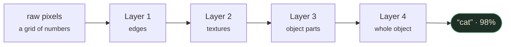
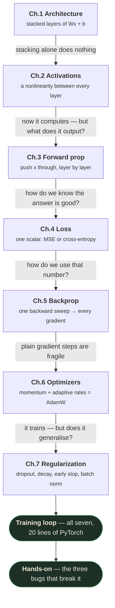
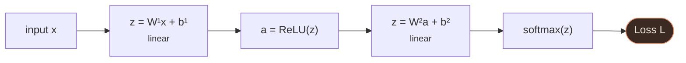
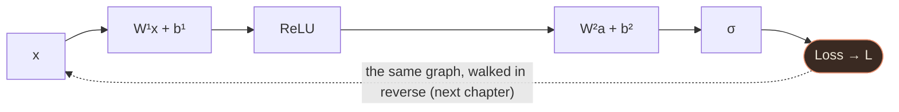
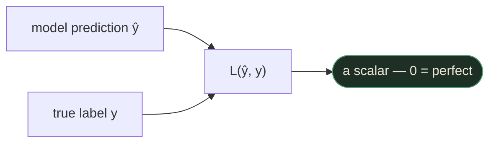
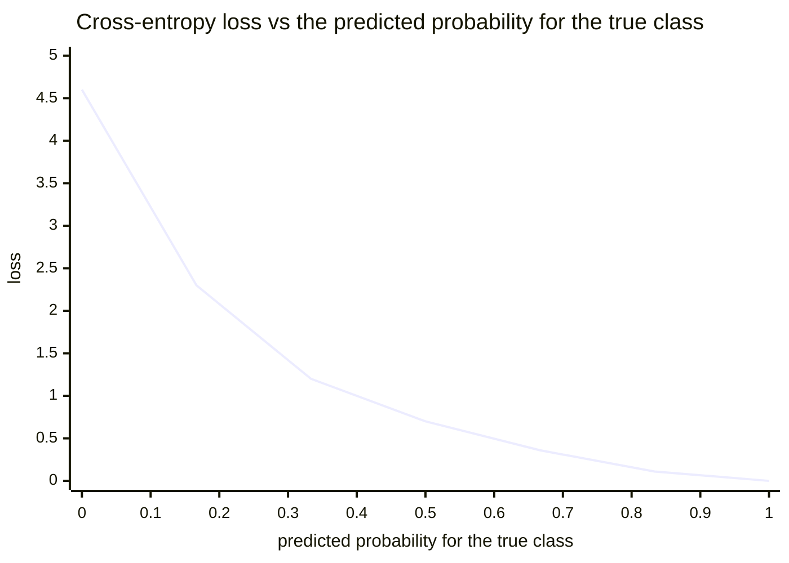
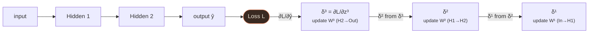
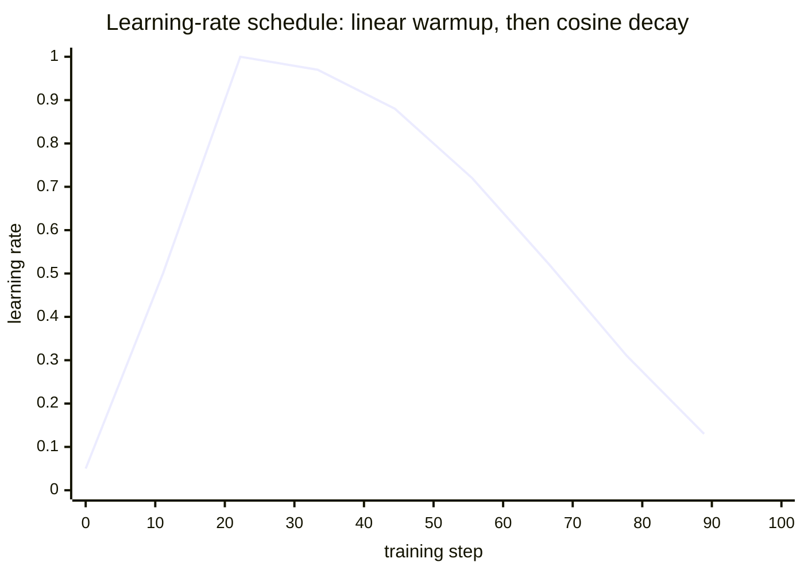
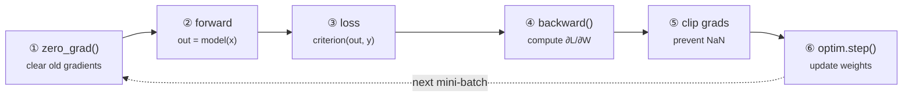
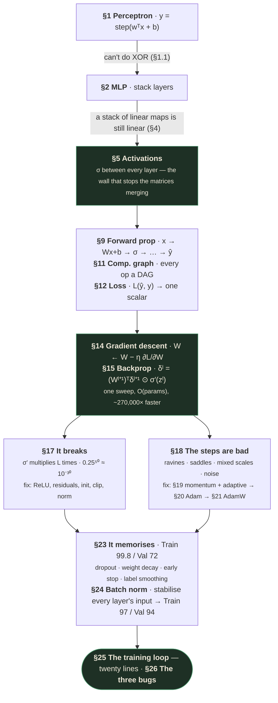

# Deep Neural Networks — Part 1
### Deep Learning Fundamentals — how networks are built, how they learn, and how to train them well

> ⚠️ **Capture note — read once, then forget it.**
>
> Written from the **raw capture** in `output/Lecture_04 - Module 2 Deep Neural Network Part 1/`
> (107 frames), not from `slides_deduped/` (49 images, mostly mid-build duplicates). See
> [`../Supervised Learning/README.md`](../Supervised%20Learning/README.md) for why the deduped set
> is untrustworthy.
>
> **This deck is unusually easy to verify.** Every slide carries a page number in its footer
> (`5 / 43`, `28 / 43`, …), so the deck length is known exactly: **43 slides**. The raw capture
> yields **42 of them** — 33 content slides plus 9 chapter dividers. Frames are cited as `[f46]` =
> `slide_046.jpg`, with video timestamp.
>
> **The only thing missing is slide 43.** The recording ends at **44:11** with slide **42 / 43**
> (*Key takeaways*) still on screen. Slide 43 was never displayed. Given that 42 is the recap and
> the deck's structure puts nothing after it, this is almost certainly a closing/thank-you card —
> but I have not seen it, so I am not describing it.
>
> Nothing else in this document is reconstructed. Every slide is accounted for:
>
> | Ch | Slides | Content |
> |---|---|---|
> | — | 1–3 | Title · Why deep networks changed everything · Depth builds features |
> | **1** | 4–8 | Perceptron → MLP → what a layer computes → concept check |
> | **2** | 9–13 | Why activations · Sigmoid & Tanh · ReLU/GELU/Softmax · concept check |
> | **3** | 14–17 | Forward propagation · a forward pass by hand · the computational graph |
> | **4** | 18–21 | What a loss is · MSE & cross-entropy · why CE wins |
> | **5** | 22–26 | Gradient descent · backprop derived · two passes · vanishing/exploding |
> | **6** | 27–32 | Why SGD isn't enough · momentum & adaptive · Adam · AdamW · comparison |
> | **7** | 33–35 | Overfitting & four fixes · Batch Normalization |
> | — | 36–38 | The complete training loop (diagram, then code) |
> | — | 39–41 | Hands-on: three bugs · fixing an overfitting model |
> | — | 42–43 | Key takeaways · *(slide 43 never shown)* |
>
> **No instructor is named anywhere in this file.** Unlike Parts 2 and 3, this deck's 107 raw frames
> (checked including the closing slide) contain no nameplate, title-card credit, or spoken
> self-introduction — there is genuinely no instructor identity to recover, not an oversight.

---

## How to read this document

| Layer | What it is | How to use it |
|---|---|---|
| **Main body** | The teaching. Every concept built from zero. | Read linearly, once, slowly. |
| **🧪 Worked examples** | Real numbers to a real answer. | Do them on paper *first*. |
| **`interactive` blocks** | Machine-readable specs for the animated web version. | Skip on first read. |
| **Glossary + Check yourself** | Recall layer. | Come back weekly. |

Callout legend: 📚 background the slide assumed · 💡 key insight · ⚠️ careful · 🧪 worked example ·
🎯 interview · 🔬 research opportunity

**Where this sits.** Module 1 (Supervised Learning, Parts 1–3) gave you the whole classical
pipeline: problem framing, splits and leakage, bias–variance, linear and logistic regression,
losses, optimisers, metrics, and the tree/ensemble family that wins on tabular data. This lecture
starts Module 2 and changes the subject: instead of choosing a model family, you now **build** one,
out of a single repeated block, and the interesting question becomes *how does a stack of these
learn anything at all?*

Three things carry over and are used constantly here, so keep them within reach:

- **Bias–variance** (Supervised Learning Part 1 §8–11) — §23's regularisation section is one long application of it.
- **Cross-entropy and softmax** (Supervised Learning Part 2 §6–7) — re-derived here from the deep-learning side, with
  the gradient argument the earlier lecture didn't give.
- **The optimiser lineage** (Supervised Learning Part 2 §13) — Part 2 listed eight optimiser names; this lecture
  actually derives four of them. Where they overlap I go deeper here and cross-reference back.

---

## What you'll understand after reading this

By the end of this document you will be able to:

1. **Explain what changed in 2012** in one sentence that an interviewer would accept, with the
   actual ImageNet numbers.
2. **State the perceptron's update rule and its exact limitation**, and prove that XOR is not
   linearly separable rather than asserting it.
3. **Prove that a stack of linear layers collapses to one linear layer**, and compute how many
   parameters you wasted by stacking them.
4. **Read `h = σ(Wx + b)` and immediately state every shape involved**, including which dimension of
   `W` is which — the single most common source of PyTorch bugs.
5. **State the Universal Approximation Theorem precisely** — including the three things it does
   *not* promise — and explain why we build deep networks anyway.
6. **Derive why the sigmoid's gradient maxes out at exactly 0.25**, and multiply that out to see a
   50-layer network's gradient vanish to $10^{-30}$.
7. **Choose an activation for any layer of any architecture** from a four-criterion test, and
   explain the dying-ReLU failure and its fix.
8. **Run a complete forward pass by hand** — matrix multiply, ReLU, sigmoid, binary cross-entropy —
   ending in a real loss value.
9. **Explain what `loss.backward()` actually does** in terms of a DAG recorded during the forward
   pass, and why training needs ~3× the memory of inference.
10. **Derive backpropagation** — the error-signal recurrence and both weight-gradient formulas —
    and explain why it costs the same as one forward pass instead of one pass *per weight*.
11. **Prove that cross-entropy's gradient is $\hat y - y$ while MSE's is throttled by $\sigma'(z)$**,
    and use that to explain why CE is the classification default.
12. **Use the $\ln K$ sanity check** to distinguish a data-pipeline bug from a learning-rate problem
    in the first ten seconds of a training run.
13. **Write down Adam from momentum and RMSProp**, explain what bias correction is correcting, and
    say precisely what AdamW fixed.
14. **Diagnose the three canonical training bugs** — oscillating loss, jittery validation accuracy,
    loss going NaN — from their symptoms alone.
15. **Write the complete PyTorch training loop from memory**, all six per-batch steps plus the
    per-epoch block, and say what breaks if you omit each one.

---

## Before we start: what you need to know

This deck moves fast and assumes six things. All six are taught here from zero.

### Prerequisite 1 — Vectors, matrices, and the shape rules

Everything in a neural network is a matrix multiply. If that operation is fuzzy, nothing later will
land.

> **Vector** — an ordered list of numbers. $\mathbf{x} = [1.0,\ 2.0]$ is a 2-vector.
>
> *Concretely:* one training example with two features is a 2-vector. One MNIST image is a
> 784-vector (28 × 28 pixels flattened).

> **Matrix** — a rectangular grid of numbers, written (rows × columns).
>
> *Concretely:* $W = \begin{bmatrix} 0.5 & -0.3 \\ 0.8 & 0.1\end{bmatrix}$ is a 2×2 matrix.

**Matrix–vector multiply.** $W\mathbf{x}$ takes the **dot product of each row of $W$ with $\mathbf{x}$**,
and stacks the results:

$$\begin{bmatrix} 0.5 & -0.3 \\ 0.8 & 0.1\end{bmatrix}\begin{bmatrix}1.0 \\ 2.0\end{bmatrix}
= \begin{bmatrix} 0.5(1.0) + (-0.3)(2.0) \\ 0.8(1.0) + 0.1(2.0)\end{bmatrix}
= \begin{bmatrix} 0.5 - 0.6 \\ 0.8 + 0.2\end{bmatrix} = \begin{bmatrix} -0.1 \\ 1.0\end{bmatrix}$$

(That is the actual first step of §9's worked example — you have already done part of it.)

**The shape rule, which is the whole game:**

$$(m \times n) \cdot (n \times 1) = (m \times 1)$$

The **inner dimensions must match** and they cancel; the outer dimensions survive. A matrix of shape
(4 × 3) times a 3-vector gives a 4-vector. This is why `nn.Linear(3, 4)` holds a weight matrix of
shape **(4, 3)** — output dimension first.

> ⚠️ **The bug this prevents.** `nn.Linear(in_features, out_features)` takes dimensions in the order
> **(in, out)**, but stores `weight` with shape **(out, in)**. So `nn.Linear(784, 256).weight.shape`
> is `torch.Size([256, 784])`. Every PyTorch user is confused by this once. The reason is that the
> forward pass computes `x @ W.T + b` — you can see exactly this in the deck's own code `[f48]`:
> `z1 = x @ W1.T + b1  # (B,784)@(784,256)ᵀ`.

**Element-wise operations.** Written $\odot$ (the Hadamard product): multiply matching positions,
no dot products. $[1, 2, 3] \odot [4, 5, 6] = [4, 10, 18]$. Activations are element-wise, and so is
one term of the backprop recurrence in §15 — that $\odot$ is not a typo.

**Transpose.** $A^\top$ flips rows and columns: $(m\times n) \to (n \times m)$. It shows up in
backprop because gradients flow backwards through a multiply, and reversing a matrix multiply means
transposing.

### Prerequisite 2 — Derivatives, gradients, and the chain rule

📚 **Background the deck assumed entirely.** Chapter 5 is built on the chain rule and never states
it.

> **Derivative** $\frac{df}{dx}$ — how much $f$ changes when you nudge $x$ a tiny bit. The slope.
>
> *In everyday words:* if $\frac{df}{dx} = 3$, then increasing $x$ by 0.01 increases $f$ by about
> 0.03.
>
> *Concretely:* $f(x) = x^2$ has $\frac{df}{dx} = 2x$. At $x = 5$ the slope is 10.

> **Partial derivative** $\frac{\partial f}{\partial x}$ — the same thing when $f$ has several
> inputs: nudge $x$, hold everything else fixed.

> **Gradient** $\nabla f$ — the vector of all partial derivatives at once. It points in the
> direction of **steepest increase**.
>
> *Why it exists:* it answers "which way is uphill, and how steep?" in one object. Gradient descent
> is just "walk the other way."

**The chain rule** — the one piece of calculus this entire lecture rests on:

$$\frac{dz}{dx} = \frac{dz}{dy}\cdot\frac{dy}{dx}$$

> The rule says: **if $x$ affects $y$, and $y$ affects $z$, then the effect of $x$ on $z$ is the
> product of the two effects.**
>
> *In everyday words:* if pressing the pedal increases speed 3× and speed increases fuel use 2×,
> then pressing the pedal increases fuel use 6×.
>
> *Concretely:* $z = y^2$ and $y = 3x$. Then $\frac{dz}{dy} = 2y$ and $\frac{dy}{dx} = 3$, so
> $\frac{dz}{dx} = 2y \cdot 3 = 6y = 18x$. Check by substituting first: $z = (3x)^2 = 9x^2$, so
> $\frac{dz}{dx} = 18x$ ✓.

**A neural network is a long chain of functions.** Input → multiply → activate → multiply →
activate → … → loss. To learn how the *first* weight matrix affects the *final* loss, you multiply
together every derivative along the path. That is all backpropagation is, and §15 does it properly.

**Two derivatives used constantly here, both derived rather than quoted:**

*Sigmoid.* With $\sigma(z) = \frac{1}{1+e^{-z}}$, write $u = 1 + e^{-z}$ so $\sigma = u^{-1}$. Then
$\frac{d\sigma}{dz} = -u^{-2}\cdot\frac{du}{dz} = -u^{-2}(-e^{-z}) = \frac{e^{-z}}{(1+e^{-z})^2}$.
Now split it: $\frac{e^{-z}}{(1+e^{-z})^2} = \frac{1}{1+e^{-z}}\cdot\frac{e^{-z}}{1+e^{-z}}$, and
since $\frac{e^{-z}}{1+e^{-z}} = 1 - \sigma(z)$,

$$\boxed{\sigma'(z) = \sigma(z)\,(1 - \sigma(z))}$$

*ReLU.* With $\text{ReLU}(z) = \max(0, z)$: for $z > 0$ the function is $z$, so the slope is
**1**. For $z < 0$ the function is the constant 0, so the slope is **0**. At exactly $z = 0$ it is
undefined; every framework picks 0 and it has never mattered, because hitting exactly 0.0 in
floating point has probability ~0.

### Prerequisite 3 — Exponentials, logs, and why $\log$ appears in every loss

$e \approx 2.71828$. $e^0 = 1$, $e^1 = 2.718$, $e^{-1} = 0.368$, $e^{-\infty} = 0$. The exponential
is always **positive** — which is exactly why softmax uses it (§7).

The natural log $\ln$ is its inverse: $\ln(1) = 0$, $\ln(e) = 1$, and critically
$\ln(x) \to -\infty$ as $x \to 0^+$.

> 💡 **That last fact is the entire reason cross-entropy works.** CE for one example is
> $-\ln(\hat p_{\text{true}})$. If the model assigns probability 0.99 to the right answer, the loss
> is $-\ln(0.99) = 0.01$ — nearly nothing. If it assigns 0.001, the loss is $-\ln(0.001) = 6.9$ —
> enormous. **A confident wrong answer is punished without limit.** That asymmetry is designed, not
> incidental.

Two values worth memorising because §13's sanity check uses them: $\ln(2) = 0.693$ and
$\ln(10) = 2.303$.

### Prerequisite 4 — The supervised setup, in this lecture's notation

Carried over from Part 1, restated in the notation slide `[f63]` fixes for Chapter 5:

| Symbol | Read it as | What it means |
|---|---|---|
| $\mathbf{x}$ | "x" | One input example, a vector of features. |
| $y$ | "y" | The true label for that example. |
| $\hat y$ | "y-hat" | The model's prediction. |
| $W^l,\ \mathbf{b}^l$ | "W-el, b-el" | Weight matrix and bias vector of **layer $l$**. |
| $z^l = W^l a^{l-1} + \mathbf{b}^l$ | "z-el" | The **pre-activation** of layer $l$ — after the multiply, before the nonlinearity. |
| $a^l = \sigma(z^l)$ | "a-el" | The **activation** of layer $l$ — after the nonlinearity. $a^0 = \mathbf{x}$. |
| $L$ | "L" | The loss — one scalar for the whole prediction. |
| $\eta$ | "eta" | The learning rate. |

> ⚠️ **Superscripts here are layer indices, not powers.** $W^2$ means "the weight matrix of layer 2",
> never "W squared". The deck uses this convention throughout and so does most of the literature. The
> one place it genuinely means a power is $\beta_1^t$ in Adam's bias correction (§20), where $t$ is
> the step count — and that is worth flagging, because it trips people up.

The distinction between $z$ and $a$ looks pedantic and is not. Backprop's error signal is defined as
$\partial L/\partial z$, **not** $\partial L / \partial a$, and the whole recurrence depends on which
one you mean.

### Prerequisite 5 — Parameters vs hyperparameters, in a network

A quick recap because the vocabulary shifts slightly in deep learning.

| | Examples here | Who sets it |
|---|---|---|
| **Parameters** | Every entry of every $W^l$ and $\mathbf{b}^l$ | Learned by gradient descent |
| **Hyperparameters** | Learning rate, number of layers, layer widths, dropout rate, batch size, weight decay | You, before training |

A `MLP(784, 256, 10)` has **269,322 parameters** (§4 counts them) and roughly **six**
hyperparameters. The parameters are found by the optimiser; the hyperparameters are found by you,
by search (Supervised Learning Part 3 §12).

### Prerequisite 6 — What a "moving average" is

📚 Used without definition in Chapter 6, three times.

> **Exponential moving average (EMA)** — a running summary of a stream of numbers that weights
> recent values more heavily than old ones:
>
> $$v_t = \beta v_{t-1} + (1-\beta)\,g_t$$
>
> *In everyday words:* "mostly what I thought before, nudged toward what I just saw."
>
> *Concretely:* with $\beta = 0.9$, each new value contributes 10% and everything previously
> accumulated is kept at 90%.
>
> *Why it exists:* it smooths noise without storing history. You keep exactly one number, not a
> window of the last $n$.

**How far back does it remember?** Expanding the recursion, the value from $k$ steps ago carries
weight $(1-\beta)\beta^k$. Summing the geometric series gives an effective window of about

$$\frac{1}{1-\beta}\ \text{steps}$$

So $\beta = 0.9$ averages roughly the **last 10** gradients; $\beta = 0.999$ (Adam's default
$\beta_2$) averages roughly the **last 1,000**. That number explains every momentum hyperparameter
you will ever set.

> ⚠️ **The catch, which is exactly what Adam's bias correction fixes (§20).** If you initialise
> $v_0 = 0$, then $v_1 = (1-\beta)g_1 = 0.1 g_1$ — one tenth of the true value. The EMA starts
> **biased toward zero** and takes ~$\frac{1}{1-\beta}$ steps to warm up. With $\beta_2 = 0.999$
> that's a thousand steps of being wrong.

---

## The big picture

The deck's opening claim `[f5]` (2:18) is the frame for everything that follows:

> For 50 years, AI meant humans hand-engineering what a model should look for.
> **In 2012, one network ended that — and the entire field reorganized around it.**

| | **Classical ML** · pre-2012 | **Deep learning** · 2012 onwards |
|---|---|---|
| Who finds the features | **Humans hand-craft them**; the model just draws a boundary on top | **The network learns them itself** |
| Vision | SIFT, HOG, edge detectors | Feed raw pixels → end-to-end |
| NLP | Parse trees, POS taggers, n-grams | Feed raw text → end-to-end |
| Speech | MFCCs, formant extraction | Feed raw audio → end-to-end |
| Reuse | **Months of expert work per task — and none of it transfers** | One architecture reused across every domain |
| Scaling | Plateaus | Accuracy keeps climbing with data + compute |

> **The 2012 hammer:** on ImageNet, error collapsed **26% → 16%** overnight, passed **human level
> (≈5%)** by 2015, and sits near **~3%** today. The verdict was final — **learned features beat
> hand-designed features whenever data is plentiful.**

Two things about that paragraph are worth slowing down on.

**First, "none of it transfers" is the real indictment of the old way.** A team could spend six
months building excellent features for pedestrian detection, and *zero percent* of that work helped
with face detection. Deep learning's headline is accuracy; its actual economic story is that the
same architecture, the same optimiser, and the same training loop work on images, text, audio,
protein structures, and chess. The slide's own list makes the point: *"Same recipe powers AlexNet,
BERT, GPT, AlphaFold, Stable Diffusion."*

**Second, "whenever data is plentiful" is a real condition, not a hedge.** With 500 labelled rows and
30 tabular features, gradient-boosted trees will still beat a neural network (Supervised Learning Part 3 §8.3). This
lecture is about a tool, and the tool has a domain.

### And the mechanism, in one picture

Slide 3 `[f7]` (3:34) explains *why* learned features win:



Each layer combines the previous layer's features into something more abstract.

> A deep network isn't one big classifier — it's a **pipeline of feature detectors**, each built
> from the one before. Nobody programs these in; **they emerge from data.**
>
> The same principle holds everywhere: in language, early layers learn characters and word-pieces,
> deeper layers learn syntax, then meaning. **Stacking simple learned transforms is what turns raw
> data into understanding.**

> 💡 **The insight to carry into every later section.** Depth is not "more capacity." Depth is
> **composition** — layer $l$ gets to build its features out of layer $l-1$'s features rather than
> out of raw pixels. §3 quantifies what that buys you, and §5 shows that without a nonlinearity
> between the layers, the composition silently collapses and you get none of it.

### The eight chapters as one argument



Each chapter exists because the previous one left something broken. That is a genuinely good deck
structure and it is worth reading the lecture that way.

---

## 1. The perceptron (1958)

Slide 5 `[f11]` (5:08). The starting point: one neuron.

> The simplest neural network is a **single neuron**. It takes the inputs $x_1,\dots,x_n$,
> multiplies each by a learned **weight** $w_i$ (how much that input matters), sums them, adds a
> **bias** $b$ (a tunable threshold), and finally applies a **step function** that outputs 1 if the
> sum is positive and 0 otherwise.

Words first.

> The formula says: **score the input by a weighted vote, then fire if the score clears a
> threshold.**

$$y = \text{step}\left(\sum_{i=1}^{n} w_i x_i + b\right) = \text{step}(\mathbf{w}^\top\mathbf{x} + b)$$

| Symbol | Read it as | What it means |
|---|---|---|
| $x_i$ | "x sub i" | The $i$-th input feature. |
| $w_i$ | "w sub i" | Learned weight on that feature — how much it matters, and in which direction. |
| $b$ | "b" | Bias. A learned constant added to every input. |
| $\mathbf{w}^\top\mathbf{x}$ | "w transpose x" | Compact form of $\sum_i w_i x_i$ — the dot product. |
| $\text{step}(\cdot)$ | "step" | 1 if the argument is $> 0$, else 0. |
| $y$ | "y" | The output: a hard 0 or 1. |

**What the bias actually does**, since "tunable threshold" is terse. Without $b$, the neuron fires
when $\mathbf{w}^\top\mathbf{x} > 0$ — a boundary that must pass through the origin. With $b$, it
fires when $\mathbf{w}^\top\mathbf{x} > -b$, so the boundary can sit anywhere. **The bias is what
lets the decision boundary move off the origin.** Take it away and you have constrained your model
for no reason. This is the same role the intercept plays in linear regression (Supervised Learning Part 1 §12).

In code `[f11]`:

```python
import torch, torch.nn as nn

# A perceptron is just a linear layer + a threshold
perceptron = nn.Linear(in_features=3, out_features=1)
z = perceptron(x)              # weighted sum:  w·x + b
y = (z > 0).float()            # step activation → 0 or 1
```

> 💡 **Note what this reveals about PyTorch.** `nn.Linear` *is* the weighted-sum-plus-bias. There is
> nothing else in it. Every layer of every network in this lecture is this one object, repeated.

### 1.1 The limitation, and why it mattered so much

> **The limitation:** because the decision is based on a single weighted sum, a perceptron can only
> carve the input space with **one straight line**. That is enough for AND and OR, but it **cannot
> learn XOR** — no straight line separates XOR's two classes. Minsky & Papert proved this in 1969,
> and the disappointment that followed triggered the first "AI winter." The fix, decades later, was
> simply to **stack** neurons.

📚 **The deck asserts XOR is not linearly separable. Here is the proof**, because "you should be
able to derive it, not recall it" is the standard for these notes.

XOR on two binary inputs:

| $x_1$ | $x_2$ | XOR |
|---|---|---|
| 0 | 0 | **0** |
| 0 | 1 | **1** |
| 1 | 0 | **1** |
| 1 | 1 | **0** |

Suppose some $w_1, w_2, b$ separated them, firing exactly when $w_1x_1 + w_2x_2 + b > 0$. Then all
four rows must hold simultaneously:

$$\begin{aligned}
(0,0) \to 0: &\quad b \le 0 &&(1)\\
(0,1) \to 1: &\quad w_2 + b > 0 &&(2)\\
(1,0) \to 1: &\quad w_1 + b > 0 &&(3)\\
(1,1) \to 0: &\quad w_1 + w_2 + b \le 0 &&(4)
\end{aligned}$$

Add (2) and (3):

$$w_1 + w_2 + 2b > 0$$

From (4), $w_1 + w_2 \le -b$. Substituting:

$$-b + 2b > 0 \quad\Longrightarrow\quad b > 0$$

which **contradicts (1)**. No such $w_1, w_2, b$ exists. ∎

Geometrically: the two 1s sit on one diagonal of the unit square, the two 0s on the other. Any
straight line you draw puts at least one point on the wrong side.

```svg
<svg viewBox="0 0 300 250" role="img" aria-label="XOR is not linearly separable" font-family="system-ui,sans-serif">
  <style>.ax{stroke:#4C4739;stroke-width:1.4}.t{fill:#7C7361;font-size:12px}
    .c1{fill:#8CDCA6}.c0{fill:none;stroke:#B4AA95;stroke-width:1.8}
    .try{stroke:#E89170;stroke-width:1.6;stroke-dasharray:5 4}.lab{fill:#B4AA95;font-size:11.5px}</style>
  <line class="ax" x1="40" y1="200" x2="260" y2="200"/><line class="ax" x1="40" y1="30" x2="40" y2="200"/>
  <text class="t" x="264" y="204">x₁</text><text class="t" x="34" y="26" text-anchor="end">x₂</text>
  <text class="t" x="40" y="218" text-anchor="middle">0</text><text class="t" x="220" y="218" text-anchor="middle">1</text>
  <text class="t" x="30" y="204" text-anchor="end">0</text><text class="t" x="30" y="54" text-anchor="end">1</text>
  <circle class="c1" cx="40" cy="50" r="7"/><circle class="c1" cx="220" cy="200" r="7"/>
  <circle class="c0" cx="220" cy="50" r="7"/><circle class="c0" cx="40" cy="200" r="7"/>
  <line class="try" x1="30" y1="230" x2="250" y2="20"/>
  <text class="lab" x="150" y="240" text-anchor="middle">any straight line gets one point wrong</text>
</svg>
```

Filled = class 1, open = class 0. XOR: the two classes sit on opposite diagonals, so no single line separates them.

> 💡 **Why this piece of 1969 history is worth knowing.** Minsky & Papert's result was *correct*.
> The field's mistake was in the inference drawn from it: they proved a single-layer perceptron
> can't do XOR, and the community concluded neural networks were a dead end. The multi-layer fix was
> already conceivable — what was missing was an efficient way to **train** multiple layers, which is
> backpropagation (§15), popularised in 1986. **The gap between "we know the fix" and "we can
> actually do it" was seventeen years, and it cost the field a decade of funding.**
>
> 🎯 A good answer to *"why did neural networks take so long to work?"* names three separate
> bottlenecks, not one: the **algorithm** (backprop, 1986), the **data** (ImageNet, 2009), and the
> **compute** (GPUs, ~2010). AlexNet in 2012 was the first time all three were present at once.

---

## 2. The multi-layer perceptron

Slide 6 `[f13]` (6:03).

> **Problem:** XOR is **not linearly separable** — no single straight line splits the two classes,
> so one perceptron can never solve it however long you train.
>
> **Solution: stack neurons into layers.** Wire many neurons into **layers** — an input layer, one
> or more **hidden layers**, and an output layer — with a **nonlinear activation** between them.
> Each hidden neuron learns its own boundary, and stacking them lets the network **bend and fold**
> the input space until the classes become separable. This is the **Multi-Layer Perceptron**.

```svg
<svg viewBox="0 0 460 220" role="img" aria-label="A 3-4-4-2 fully connected network" font-family="system-ui,sans-serif">
  <style>.n{fill:#2C2820;stroke:#8CDCA6;stroke-width:1.5}.e{stroke:#4C4739;stroke-width:1}
    .cap{fill:#B4AA95;font-size:11.5px}.hd{fill:#7C7361;font-size:11px;text-transform:uppercase;letter-spacing:.06em}</style>
  <g class="hd"><text x="40" y="16" text-anchor="middle">input</text><text x="180" y="16" text-anchor="middle">hidden 1</text><text x="320" y="16" text-anchor="middle">hidden 2</text><text x="440" y="16" text-anchor="middle">output</text></g>
  <g class="e">
    <line x1="40" y1="70" x2="180" y2="45"/><line x1="40" y1="70" x2="180" y2="90"/><line x1="40" y1="70" x2="180" y2="135"/><line x1="40" y1="70" x2="180" y2="180"/>
    <line x1="40" y1="115" x2="180" y2="45"/><line x1="40" y1="115" x2="180" y2="90"/><line x1="40" y1="115" x2="180" y2="135"/><line x1="40" y1="115" x2="180" y2="180"/>
    <line x1="40" y1="160" x2="180" y2="45"/><line x1="40" y1="160" x2="180" y2="90"/><line x1="40" y1="160" x2="180" y2="135"/><line x1="40" y1="160" x2="180" y2="180"/>
    <line x1="180" y1="45" x2="320" y2="45"/><line x1="180" y1="45" x2="320" y2="90"/><line x1="180" y1="45" x2="320" y2="135"/><line x1="180" y1="45" x2="320" y2="180"/>
    <line x1="180" y1="90" x2="320" y2="45"/><line x1="180" y1="90" x2="320" y2="90"/><line x1="180" y1="90" x2="320" y2="135"/><line x1="180" y1="90" x2="320" y2="180"/>
    <line x1="180" y1="135" x2="320" y2="45"/><line x1="180" y1="135" x2="320" y2="90"/><line x1="180" y1="135" x2="320" y2="135"/><line x1="180" y1="135" x2="320" y2="180"/>
    <line x1="180" y1="180" x2="320" y2="45"/><line x1="180" y1="180" x2="320" y2="90"/><line x1="180" y1="180" x2="320" y2="135"/><line x1="180" y1="180" x2="320" y2="180"/>
    <line x1="320" y1="45" x2="440" y2="90"/><line x1="320" y1="45" x2="440" y2="135"/><line x1="320" y1="90" x2="440" y2="90"/><line x1="320" y1="90" x2="440" y2="135"/>
    <line x1="320" y1="135" x2="440" y2="90"/><line x1="320" y1="135" x2="440" y2="135"/><line x1="320" y1="180" x2="440" y2="90"/><line x1="320" y1="180" x2="440" y2="135"/>
  </g>
  <g class="n">
    <circle cx="40" cy="70" r="9"/><circle cx="40" cy="115" r="9"/><circle cx="40" cy="160" r="9"/>
    <circle cx="180" cy="45" r="9"/><circle cx="180" cy="90" r="9"/><circle cx="180" cy="135" r="9"/><circle cx="180" cy="180" r="9"/>
    <circle cx="320" cy="45" r="9"/><circle cx="320" cy="90" r="9"/><circle cx="320" cy="135" r="9"/><circle cx="320" cy="180" r="9"/>
    <circle cx="440" cy="90" r="9"/><circle cx="440" cy="135" r="9"/>
  </g>
  <text class="cap" x="230" y="212" text-anchor="middle">every edge is a learned weight · each layer = matrix multiply + bias + activation</text>
</svg>
```

**"Bend and fold" is the right mental image and worth making concrete.** A single neuron draws one
straight cut. Four neurons in a hidden layer draw four straight cuts, and the next layer gets to
form **weighted combinations of which side of each cut you're on**. Combining half-planes gives you
convex regions; combining those gives you arbitrary regions. XOR needs exactly two cuts and one
combination — a 2 → 2 → 1 network solves it easily.

### 2.1 Universal Approximation, stated honestly

> **Universal Approximation Theorem:** an MLP with just one hidden layer and enough neurons can
> approximate **any** continuous function to arbitrary accuracy. So why build deep networks instead
> of one very wide layer? Because **depth is exponentially more parameter-efficient** — a deep net
> reuses the features learned in early layers to build richer ones later, reaching the same accuracy
> with far fewer weights. That efficiency is the entire reason the field is called **deep** learning.

The theorem is real (Cybenko 1989 for sigmoids; Hornik 1991 more generally). But it is quoted far
more often than it is understood, and the gap is a favourite interview probe.

> ⚠️ **Three things the Universal Approximation Theorem does *not* say.**
>
> **1. It doesn't say how many neurons.** "Enough neurons" can mean exponentially many in the input
> dimension. A one-hidden-layer network that matches a 20-layer ResNet might need more neurons than
> there are atoms available to store them.
>
> **2. It doesn't say you can find those weights.** It is an *existence* theorem about
> representation. It says a good weight configuration exists; it says nothing about whether gradient
> descent will ever reach it from a random initialisation. Representability and learnability are
> different properties.
>
> **3. It doesn't say the result will generalise.** Approximating a function on your training points
> is not the same as approximating it on new points. A lookup table also fits the training data
> perfectly.
>
> 🎯 **Interview.** *"If one hidden layer is universal, why go deep?"* The strong answer is the
> slide's — **parameter efficiency through feature reuse** — plus the honest caveat that UAT is an
> existence result about representation only, and says nothing about optimisation or generalisation.
> Candidates who cite UAT as though it settles the architecture question have read the theorem and
> not thought about it.

### 🧪 Worked example — why depth is parameter-efficient

Take the deck's own quiz architecture (§4) and cost out two ways of getting from 100 inputs to 10
outputs.

**Deep and narrow — three layers with a hidden width of 50:**

| Layer | Weights | Biases | Total |
|---|---|---|---|
| `Linear(100, 50)` | $100\times50 = 5{,}000$ | 50 | 5,050 |
| `Linear(50, 50)` | $50\times50 = 2{,}500$ | 50 | 2,550 |
| `Linear(50, 10)` | $50\times10 = 500$ | 10 | 510 |
| | | | **8,110** |

**Shallow and wide — one hidden layer, matched to the same parameter budget:**

To get 8,110 parameters with a single hidden layer of width $h$: $100h + h + 10h + 10 = 111h + 10$.
Setting that equal to 8,110 gives $h = 73$.

So the same budget buys either **three layers of width 50** or **one layer of width 73**. The
theorem says the width-73 network *can* represent anything the deep one can, given enough width —
but at equal parameter count, the deep network composes 50 features into 50 richer features into the
answer, while the wide one gets exactly one round of feature-building. On any task with hierarchical
structure — which is nearly all real perceptual data — the deep one wins, and the gap grows with
the depth of the hierarchy in the data.

> 💡 **The one-sentence version:** width lets you memorise more patterns; **depth lets you build
> patterns out of patterns.** Real data is compositional (edges → textures → parts → objects), so
> depth matches the structure of the problem.

---

## 3. What a layer actually computes

Slide 7 `[f15]` (7:24). This is the most mechanically important slide in Chapter 1.

> A layer does three things in order: **multiply** the input vector by a weight matrix $W$, **add** a
> bias vector $\mathbf{b}$, then **apply** a nonlinear activation $\sigma$ element-wise.

$$\mathbf{h} = \sigma(W\mathbf{x} + \mathbf{b})$$

| Symbol | Read it as | Shape | What it means |
|---|---|---|---|
| $\mathbf{x}$ | "x" | (input_dim,) | The layer's input. |
| $W$ | "W" | (output_dim × input_dim) | The learned weights. |
| $\mathbf{b}$ | "b" | (output_dim,) | The learned biases, one per output neuron. |
| $\sigma$ | "sigma" | — | The activation, applied **element-wise**. |
| $\mathbf{h}$ | "h" | (output_dim,) | The layer's output — the next layer's input. |

> $W$ has shape (output_dim × input_dim) — there is **one row per output neuron**, and that row
> holds the weights connecting every input to that neuron.

Written out for a 3 → 4 layer:

$$\begin{bmatrix}h_1\\h_2\\h_3\\h_4\end{bmatrix} = \sigma\left(
\begin{bmatrix}
w_{11} & w_{12} & w_{13}\\
w_{21} & w_{22} & w_{23}\\
w_{31} & w_{32} & w_{33}\\
w_{41} & w_{42} & w_{43}
\end{bmatrix}
\begin{bmatrix}x_1\\x_2\\x_3\end{bmatrix}
+ \begin{bmatrix}b_1\\b_2\\b_3\\b_4\end{bmatrix}\right)$$

> Read each row as one neuron's "feature detector." Because the whole layer is a single matrix
> multiply, it maps perfectly onto GPU hardware — which is built to do massively parallel matmuls,
> and is exactly why deep learning became practical.

That last sentence is the whole hardware story in one line, and it deserves unpacking.

> 💡 **Why the matrix formulation is the point, not a convenience.** You could compute those four
> neurons with a `for` loop over four dot products. Mathematically identical; practically useless.
> A GPU has thousands of cores that all do the same arithmetic on different data simultaneously. One
> matrix multiply is *exactly* that shape of work — every output element is an independent dot
> product. A `for` loop is not, and runs on one core.
>
> The entire field is downstream of this: **deep learning took off when someone noticed that the
> operation neural networks need is the operation graphics cards were already built to do.** The
> 2012 AlexNet result was in large part a CUDA-implementation result.

**And it extends to batches.** Stack $B$ examples as rows of a matrix $X$ of shape (B × input_dim);
then $XW^\top + \mathbf{b}$ computes **all $B$ examples' layers at once** — matrix × matrix instead
of matrix × vector. That is why batch size exists as a knob, and why bigger batches use the GPU more
efficiently.

### 3.1 The MLP in PyTorch, and its parameter count

```python
class MLP(nn.Module):
    def __init__(self, d_in, d_h, d_out):
        super().__init__()
        self.net = nn.Sequential(
            nn.Linear(d_in, d_h),    # W¹x + b¹
            nn.ReLU(),               # nonlinearity
            nn.Linear(d_h, d_h),     # W²· + b²
            nn.ReLU(),
            nn.Linear(d_h, d_out),   # logits
        )
    def forward(self, x):
        return self.net(x)

model = MLP(784, 256, 10)   # ~269k params
```

### 🧪 Verify the parameter count

Never accept a parameter count you haven't checked — it is the fastest way to catch an architecture
you didn't build the way you thought.

| Layer | Weights | Biases | Subtotal |
|---|---|---|---|
| `Linear(784, 256)` | $784\times256 = 200{,}704$ | 256 | 200,960 |
| `Linear(256, 256)` | $256\times256 = 65{,}536$ | 256 | 65,792 |
| `Linear(256, 10)` | $256\times10 = 2{,}560$ | 10 | 2,570 |
| **Total** | | | **269,322** |

Which is the slide's "~269k params" ✓.

In code: `sum(p.numel() for p in model.parameters())`.

> 💡 **Where the parameters live is worth noticing.** The first layer holds **74.6%** of all
> parameters (200,960 / 269,322), purely because 784 inputs is a lot. This is a general pattern in
> MLPs on raw high-dimensional input, and it is one reason convolutional layers exist — they share
> weights across spatial positions instead of connecting every pixel to every neuron.

> ⚠️ **The line to notice, which the slide flags in its own callout:**
>
> > **Without the ReLUs** the three `Linear` layers would collapse into a single matrix — depth
> > would buy nothing.
>
> That is the subject of §5, and it is the most important idea in Chapter 2.

---

## 4. 🎯 Concept check — does depth alone help?

Slide 8 `[f19]` (8:17). The deck's first quiz, and it is well-chosen.

> You stack 3 linear layers with no activation:
> `Linear(100,50) → Linear(50,50) → Linear(50,10)`. What is the effective model?
>
> **A.** A 3-layer deep network learning hierarchical features
> **B.** Equivalent to a single `Linear(100,10)` — depth is wasted without nonlinearity
> **C.** Untrainable — gradients won't flow
> **D.** Three separate linear classifiers

**Answer: B.**

> Without nonlinearity, $W^3(W^2(W^1\mathbf{x})) = (W^3W^2W^1)\mathbf{x} = W_{\text{eff}}\mathbf{x}$.
> A composition of linear maps is linear — extra parameters, zero extra representational power.
> **Activations are what make depth meaningful.**

**Work the shapes to see it's not a trick.** $W^1$ is (50 × 100), $W^2$ is (50 × 50), $W^3$ is
(10 × 50). Their product:

$$\underbrace{(10\times50)}_{W^3}\cdot\underbrace{(50\times50)}_{W^2}\cdot\underbrace{(50\times100)}_{W^1} = (10 \times 100)$$

A single (10 × 100) matrix — **exactly the shape of `Linear(100, 10)`**. The composition doesn't
merely *behave* like one linear layer; it *is* one, and you can compute the equivalent matrix
explicitly with two matrix multiplies.

**Now count the cost.** From §2's table, the three-layer stack has **8,110** parameters. The
equivalent `Linear(100, 10)` has $100\times10 + 10 = $ **1,010**.

$$\text{You spent } 8{,}110 \text{ parameters to buy } 1{,}010 \text{ parameters' worth of model} — 8\times \text{ the memory, } 8\times \text{ the compute, identical capability.}$$

> ⚠️ **Why C is a tempting wrong answer, and worth being able to reject.** Gradients flow *fine*
> through a stack of linear layers — the chain rule works, `backward()` returns finite numbers,
> training converges. It converges to the best linear model, which is the point. The failure is
> **representational**, not optimisational. Confusing "can't learn this function" with "can't train"
> is a common and revealing error.

> 🎯 **This question in an interview.** It is asked constantly, in exactly this form. The full-credit
> answer states the collapse algebraically, gives the resulting shape, and names the consequence:
> *"a composition of linear maps is a linear map, so the model class is unchanged — you've bought
> parameters, not power."* The bonus point is noticing that this is precisely why the *bias* also
> collapses: $W^2(W^1x + b^1) + b^2 = W^2W^1x + (W^2b^1 + b^2)$, so the biases fold into one
> effective bias too.

```interactive
type: simulator
title: Watch the layers collapse
concept: A stack of linear layers is a single linear layer
control: A toggle for "activations on / off", and a slider for depth (1 to 5 layers)
observe: Left — the decision boundary drawn on a 2-D XOR-like dataset; right — the effective matrix W_eff computed live by multiplying the stack, with its shape displayed
insight: With activations off, adding layers changes the parameter count and leaves the boundary a straight line no matter the depth; flip activations on and the same depth immediately bends the boundary
fallback: The algebra in §4 plus the parameter table in §2 make the same point: 8,110 parameters buying 1,010 parameters' worth of model.
```

---

## 5. Why we need activations at all

Slide 10 `[f24]` (10:02). Chapter 2's thesis.

> An activation is the small nonlinear function applied to every neuron's output, right after the
> matrix multiply. It looks minor — but **without it, depth is an illusion.**

| **Problem — without activation** | **Solution — nonlinearity** |
|---|---|
| $f(\mathbf{x}) = W^3(W^2(W^1\mathbf{x})) = W_{\text{eff}}\mathbf{x}$ | $f(\mathbf{x}) = \sigma(W^3\,\sigma(W^2\,\sigma(W^1\mathbf{x})))$ |
| A stack of linear layers **collapses into one** — the product $W^3W^2W^1$ is just another matrix. So a 100-layer net would have the exact same power as a single layer. | Insert a nonlinear $\sigma$ after each layer and the layers **no longer collapse**. Each one **bends** the feature space a little. |
| It can only ever draw **straight boundaries**: no XOR, no curves, no vision, no language. Adding depth buys you nothing. | Stack enough bends and the network can carve **arbitrarily complex regions** — this is what makes a deep net a **universal function approximator**. |

**Why the nonlinearity blocks the collapse.** The collapse worked because matrix multiplication is
associative: $W^3(W^2(W^1x))$ can be re-bracketed as $(W^3W^2W^1)x$. Insert $\sigma$ and you get
$\sigma(W^3\,\sigma(W^2\,\sigma(W^1x)))$ — there is no way to move $W^3$ past the $\sigma$, because
$\sigma(Wx) \ne W\sigma(x)$ for any nonlinear $\sigma$. **The activation is a wall between the
matrices that stops them merging.** That is the entire mechanism, and stating it that way makes it
impossible to forget.

### 5.1 The four criteria — the deck's best organising idea

> **What makes a good activation?**
> **(1) non-linear**, so depth adds power ·
> **(2) a gradient that doesn't vanish**, so deep layers keep learning ·
> **(3) cheap to compute**, since it runs on every neuron, every step ·
> **(4) helps training converge fast and stay stable**.

This is a genuinely good framework, because it makes the next two slides a *comparison* rather than
a list to memorise. Every activation in §6 and §7 is scored against these four, and every historical
transition (sigmoid → tanh → ReLU → GELU) is one of them being fixed.

| | Non-linear | Gradient survives | Cheap | Stable |
|---|---|---|---|---|
| **Sigmoid** | ✓ | ✗ — peaks at 0.25 | ✗ — needs $e^{-z}$ | ✗ — not zero-centered |
| **Tanh** | ✓ | ✗ — saturates past \|z\|>2 | ✗ — two exponentials | ✓ — zero-centered |
| **ReLU** | ✓ | ✓ — exactly 1 for $z>0$ | ✓ — one comparison | ✓ mostly (dying ReLU) |
| **Leaky ReLU** | ✓ | ✓ — always nonzero | ✓ | ✓ |
| **GELU** | ✓ | ✓ — smooth | ~ — needs erf/tanh approx | ✓ |

Read down the "Cheap" column and the entire history of the field falls out: **sigmoid needs an
exponential per neuron per layer per step; ReLU needs one comparison.** At a trillion neuron-steps
per training run, that is not a micro-optimisation.

---

## 6. Sigmoid and tanh — and why they lost

Slide 11 `[f26]` (11:32).

> The earliest activations were smooth S-shaped "squashing" functions — the standard for decades.
> Understanding **why they fell out of favour** motivates everything after.

### 6.1 Sigmoid

$$\sigma(z) = \frac{1}{1+e^{-z}}$$

- Squashes into $(0, 1)$, so the output **reads as a probability**.
- **Gradient peaks at only 0.25** and is near-zero for large $|z|$.
- Multiplied across layers, that tiny gradient **vanishes**.

```python
# only on a binary output / gate
out = torch.sigmoid(logit)
```

📚 **Deriving the 0.25**, because the deck states it and it is the most quotable number in the
chapter.

From Prerequisite 2, $\sigma'(z) = \sigma(z)(1-\sigma(z))$. Let $s = \sigma(z) \in (0,1)$ and
maximise $g(s) = s(1-s) = s - s^2$:

$$g'(s) = 1 - 2s = 0 \quad\Longrightarrow\quad s = \tfrac12 \quad\Longrightarrow\quad g(\tfrac12) = \tfrac12\cdot\tfrac12 = \boxed{0.25}$$

And $s = 0.5$ happens at $z = 0$. So **the very best the sigmoid can ever do is shrink the gradient
to a quarter**, and that only at one point; everywhere else it is worse. This is the number that
kills it, and §17 multiplies it out across 50 layers.

**The other, subtler problem: sigmoid is not zero-centered.** Its output is always positive. So
every input to the next layer is positive, which means every weight in that layer receives a
gradient of the same sign on a given example. The weights can only all-increase or all-decrease
together, forcing the optimiser to zig-zag rather than move diagonally. Tanh fixes exactly this.

### 6.2 Tanh

$$\tanh(z) = \frac{e^z - e^{-z}}{e^z + e^{-z}}$$

- Range $(-1, 1)$ and **zero-centered** ✓ — gradients behave better than sigmoid.
- **Gradient reaches 1.0** at the origin — a stronger signal.
- Still **saturates** for $|z| > 2$ → deep tanh nets still vanish.

```python
# common inside RNN hidden states
h = torch.tanh(W @ x + b)
```

The derivative is $\tanh'(z) = 1 - \tanh^2(z)$, which at $z=0$ gives $1 - 0 = \mathbf{1.0}$ — four
times the sigmoid's best. Better, and still not enough: at $z = 2$, $\tanh(2) = 0.964$, so the
gradient is $1 - 0.929 = 0.071$. **Past $|z| = 2$ you are back to killing the signal**, and pre-activations
routinely exceed 2 in a trained network.

> 💡 **The relationship between them, which explains why tanh is "sigmoid but centered":**
> $\tanh(z) = 2\sigma(2z) - 1$. It is a sigmoid stretched vertically by 2, shifted down by 1, and
> compressed horizontally by 2. Same shape, same saturation problem, better centering — which is
> exactly what the four criteria predict.

### 6.3 The verdict

> **Never use sigmoid or tanh in the hidden layers of a deep network** — their gradients vanish.
> They survive only in specific spots: sigmoid on a binary output or gate, tanh inside RNN cells.
> For hidden layers, we need something that doesn't saturate → **ReLU**, next.

> ⚠️ **"Never in hidden layers" is right, but know the two exceptions and *why* they're exceptions.**
>
> **Sigmoid on a binary output** — here you *want* the squash into $(0,1)$, because you want a
> probability. And it's the final layer, so there is no downstream layer for the small gradient to
> be multiplied through. In practice you don't even call it: `nn.BCEWithLogitsLoss` folds the sigmoid
> into the loss for numerical stability (Supervised Learning Part 2 §6).
>
> **Sigmoid/tanh in LSTM and GRU gates** — a gate needs to output "how much to let through", which
> is *inherently* a number in $(0,1)$. Saturation is the desired behaviour: a gate that saturates at
> 1 is a gate that's fully open. These are cases where the property that makes sigmoid bad for
> hidden layers is exactly the property the job requires.

---

## 7. ReLU, GELU and softmax — what you'll actually use

Slide 12 `[f29]` (13:20). The modern set.

$$\text{ReLU} = \max(0, z) \qquad\qquad \text{Leaky} = \max(\alpha z, z)$$

> - **ReLU** passes positives, zeros negatives. No saturation (grad = 1), sparse, cheap — **~6×
>   faster** than sigmoid (2012). The default for CNN/MLP hidden layers.
> - **Dying ReLU:** a neuron stuck negative has grad 0 forever. **Leaky ReLU** gives negatives a
>   small slope α so a little gradient always survives.
> - **GELU** — a smooth ReLU (no hard kink); the Transformer default (BERT, GPT, LLaMA, ViT).
> - **Softmax** — the **output** activation: turns logits into a probability distribution that sums
>   to 1.

```python
a = F.relu(z)   # or F.leaky_relu(z, 0.01), F.gelu(z)
```

And the reference table, which is worth memorising outright:

| Function | Range | Grad | Where to use it |
|---|---|---|---|
| **Sigmoid** | (0,1) | ≤ 0.25 | **Output only** — binary classification & LSTM/GRU gates |
| **Tanh** | (−1,1) | ≤ 1.0 | **RNN hidden states** — zero-centered, but avoid in deep stacks |
| **ReLU** | [0,∞) | 0 or 1 | **Default hidden** layer for CNNs & MLPs |
| **Leaky ReLU** | (−∞,∞) | α or 1 | Hidden layers **when ReLUs are dying** |
| **GELU** | ≈(−0.17,∞) | smooth | **Hidden layers of Transformers** (the LLM default) |
| **Softmax** | (0,1), Σ=1 | — | **Multi-class output** layer |

### 7.1 Why ReLU works, in four properties

**1. The gradient is exactly 1 on the positive side.** Not 0.25, not 0.9 — **1**. Multiply a hundred
of them together and you get 1. This single fact is why networks went from ~8 layers to ~150 layers
in three years.

**2. It's one comparison.** `max(0, z)` on a GPU is a single instruction. `1/(1+exp(-z))` is a
transcendental function call. The slide's "~6× faster than sigmoid (2012)" is the AlexNet paper's
own measured figure for reaching 25% training error on CIFAR-10.

**3. It produces sparsity.** Roughly half of a randomly-initialised layer's pre-activations are
negative, so about half the neurons output exactly zero for any given input. Different inputs
activate different subsets — a form of automatic, data-dependent capacity control.

**4. It's not actually differentiable at 0, and nobody cares.** The left derivative is 0, the right
is 1. Frameworks return 0. Since $z$ is a float, $P(z = 0.0\text{ exactly}) \approx 0$.

### 7.2 Dying ReLU, and the fix

> **Dying ReLU:** a neuron stuck negative has grad 0 forever.

Here is the death spiral in full, because "stuck" is doing a lot of work in that sentence.

Suppose a neuron's pre-activation $z$ is negative for **every** training example. Then:
1. Its output is 0 for every example.
2. Its local gradient $\partial a/\partial z$ is 0 for every example.
3. So by the chain rule, the gradient reaching its weights is 0 × (something) = **0**.
4. So the optimiser never updates those weights.
5. So $z$ stays negative for every example. **Go to 1.**

The neuron is permanently dead. It contributes nothing to the forward pass and receives nothing in
the backward pass. It is a parameter you are paying to store and never using.

**How does it happen?** Usually a large gradient step pushes the bias very negative — which is why
dying ReLU correlates strongly with too-high learning rates. In a badly-tuned network, 40% of units
can die.

**Leaky ReLU:** $\max(\alpha z, z)$ with $\alpha \approx 0.01$. On the negative side the gradient is
$\alpha$ instead of 0 — tiny, but **nonzero**, so step 3 above yields a small non-zero update and
the neuron can crawl back to life. That's the entire fix, and it costs nothing.

> 💡 **Diagnostic you can run today.** After a few epochs:
> ```python
> with torch.no_grad():
>     a = F.relu(model.hidden(x_batch))
>     dead = (a == 0).all(dim=0).float().mean()
>     print(f"{dead:.1%} of units never fire on this batch")
> ```
> A few percent is normal and healthy — that's the sparsity. Above ~20% means you should lower the
> learning rate or switch to Leaky ReLU.

### 7.3 GELU

> **GELU** — a smooth ReLU (no hard kink); the Transformer default (BERT, GPT, LLaMA, ViT).

$$\text{GELU}(z) = z \cdot \Phi(z)$$

where $\Phi$ is the standard normal CDF — the probability that a standard Gaussian draw is less than
$z$. Read it as: *"pass the input through, scaled by how likely it is to be positive."*

- At $z = 2$: $\Phi(2) = 0.977$, so GELU(2) $= 1.95$ — almost the same as ReLU's 2.
- At $z = 0$: $\Phi(0) = 0.5$, so GELU(0) $= 0$ — same as ReLU.
- At $z = -0.5$: $\Phi(-0.5) = 0.309$, so GELU(−0.5) $= -0.154$ — **negative, where ReLU gives 0.**

That negative region is the whole difference. It gives GELU a **minimum around $z \approx -0.75$**
(value ≈ −0.17, which is the table's odd-looking lower bound), and a smooth, everywhere-nonzero
gradient. No hard kink means no discontinuity in the derivative, which empirically helps the very
deep, very sensitive optimisation of Transformer training.

> ⚠️ **Is GELU actually better than ReLU?** In Transformers, consistently and reproducibly — enough
> that every major LLM uses it or a close relative (SwiGLU in LLaMA). In CNNs and MLPs, the
> difference is small and often within noise, and ReLU's speed usually wins. **Use GELU because you
> are building a Transformer, not because it is "the better activation."**
>
> 🔬 **Genuinely open:** *why* smooth activations help Transformers specifically is not settled. The
> usual explanations (better-behaved loss landscape, the small negative region acting as a soft
> gate) are plausible post-hoc stories rather than established mechanisms.

### 7.4 Softmax — and the note that saves you a bug

$$\text{softmax}(\mathbf{z})_k = \frac{e^{z_k}}{\sum_j e^{z_j}}$$

Supervised Learning Part 3 §9.3 derived this in full and worked an example by hand; the short version is: exponentiate
to force positivity, divide by the total to force summing to 1.

> **Note:** at training time you usually don't call `softmax` yourself — `nn.CrossEntropyLoss`
> applies it internally for numerical stability. Use `torch.softmax` only when you explicitly need
> probabilities at inference.

That note is the setup for the next slide, which is the best quiz in the deck.

---

## 8. 🎯 Concept check — spot the bug

Slide 13 `[f35]` (14:58).

> A colleague writes this to train a classifier. What's wrong?
>
> ```python
> probs = torch.softmax(model(x), dim=1)   # apply softmax
> loss  = nn.CrossEntropyLoss()(probs, labels)  # then cross-entropy
> ```
>
> **A.** Nothing — correct usage
> **B.** Softmax is applied twice (CE applies it internally) → wrong gradients, instability
> **C.** The dim should be 0
> **D.** You must call `.backward()` first

**Answer: B.**

> `nn.CrossEntropyLoss` applies log-softmax internally. Pre-softmaxing means
> $\text{softmax}(\text{softmax}(z))$ — output is squashed toward uniform and gradients shrink.
> **Always pass raw logits.**

### 🧪 Watch the double softmax destroy the signal

This is the bug's real danger: **it does not crash, and the loss does go down.** It just trains far
worse than it should, and nothing tells you why.

Take a confident 3-class prediction, logits $\mathbf{z} = [5.0,\ 1.0,\ 1.0]$.

**First softmax.** $e^5 = 148.41$, $e^1 = 2.718$, $e^1 = 2.718$. Sum $= 153.85$.

$$\mathbf{p} = [0.9646,\ 0.0177,\ 0.0177]$$

A strong, confident prediction. Now `CrossEntropyLoss` receives $\mathbf{p}$ and treats it as
logits.

**Second softmax.** $e^{0.9646} = 2.6238$, $e^{0.0177} = 1.0179$, $e^{0.0177} = 1.0179$.
Sum $= 4.6596$.

$$\mathbf{p}' = [0.5631,\ 0.2184,\ 0.2184]$$

**Compare what the model said with what the loss function sees:**

| | True class prob | Loss $-\ln p$ |
|---|---|---|
| Model's actual belief | **0.9646** | 0.036 |
| What CE receives | **0.5631** | 0.574 |
| Uniform (no information) | 0.3333 | 1.099 |

The model was 96% confident. The loss function was told it was 56% confident. **Sixteen times the
loss it deserved**, and — far worse — the gradient is computed from $\mathbf{p}'$, so the correction
sent back is wrong in magnitude for every example.

And notice the direction of the damage: the squash is **strongest for confident predictions**.
Examples the model has already learned get the largest spurious gradient, so the bug actively fights
your best-learned examples. The model still trains, just to a worse optimum, and the symptom is
"accuracy plateaus lower than it should" — the hardest kind of bug to notice.

> 💡 **The general rule this teaches, which is worth more than the specific bug:** in PyTorch, losses
> ending in `WithLogitsLoss`, and `CrossEntropyLoss` itself, **want raw logits**. They fold the
> sigmoid/softmax inside for numerical stability (the log-sum-exp trick — Supervised Learning Part 2 §7). If you find
> yourself applying an output activation before a loss, stop and check the docs.
>
> | You want | Loss | Feed it |
> |---|---|---|
> | Multi-class | `nn.CrossEntropyLoss()` | **raw logits** + integer class indices |
> | Binary | `nn.BCEWithLogitsLoss()` | **raw logits** |
> | Binary, already sigmoided | `nn.BCELoss()` | probabilities (avoid — less stable) |
> | Probabilities at inference | — | `torch.softmax(logits, dim=1)` |

> 🎯 A very common interview question is *"what's the difference between `CrossEntropyLoss` and
> `NLLLoss`?"* Answer: `CrossEntropyLoss` = `LogSoftmax` + `NLLLoss` fused into one op. So
> `CrossEntropyLoss(logits, y)` ≡ `NLLLoss(log_softmax(logits), y)`. Fusing them is what makes it
> numerically stable.

---

## 9. Forward propagation

Slide 15 `[f44]` (17:37). Chapter 3 opens the question Chapter 1 set up: we have layers, we have
activations — how do we get an answer out?

> **Problem:** We have an input $\mathbf{x}$ and a set of learned weights $\{W^l, \mathbf{b}^l\}$ for
> every layer. How do we actually turn them into a prediction $\hat y$ the model can be scored on?
>
> **Solution: forward propagation.** Push the input through the layers **one at a time**, in order.
> Each layer's output becomes the next layer's input. Every step is the same recipe — a **matrix
> multiply, then a nonlinear activation** — so the whole forward pass is just that block repeated.



> Read the pipeline left to right: the input is linearly transformed, passed through an activation,
> transformed again, and finally turned into class probabilities by softmax. The very last step
> compares that prediction to the true answer with a **loss**. **Inference stops at the prediction;
> training continues into the loss so the network can be corrected.**

> 💡 **That last sentence is the cleanest definition of the difference between training and
> inference you'll get.** Same computation, different stopping point. At inference you want $\hat y$
> and you stop. At training you keep going one more step to get $L$ — a single number — because a
> single number is the only thing you can take a gradient of. Everything in Chapters 4 and 5 exists
> to turn that one number back into corrections for 269,322 individual weights.

---

## 10. 🧪 A forward pass, entirely by hand

Slide 16 `[f46]` (18:38). This is the worked example the whole first half builds to — do it on paper
before reading on.

> Let's trace a real example all the way through. We have a tiny 2-layer network classifying a single
> sample, with input $\mathbf{x} = [1.0,\ 2.0]$. Follow the three cards left to right — hidden layer,
> output layer, then the loss.

### Layer 1 (hidden)

$$W^1 = \begin{bmatrix}0.5 & -0.3\\ 0.8 & 0.1\end{bmatrix}, \qquad \mathbf{b}^1 = \mathbf{0}$$

**Step 1 — the matrix multiply.** Each row of $W^1$ dotted with $\mathbf{x}$:

$$\mathbf{z}^1 = W^1\mathbf{x} = \begin{bmatrix}0.5(1.0) + (-0.3)(2.0)\\ 0.8(1.0) + 0.1(2.0)\end{bmatrix}
= \begin{bmatrix}0.5 - 0.6\\ 0.8 + 0.2\end{bmatrix} = \begin{bmatrix}-0.1\\ 1.0\end{bmatrix}$$

(Bias is zero here, so nothing to add.)

**Step 2 — ReLU, element-wise.**

$$\mathbf{a}^1 = \text{ReLU}(\mathbf{z}^1) = \begin{bmatrix}\max(0, -0.1)\\ \max(0, 1.0)\end{bmatrix} = \begin{bmatrix}0\\ 1.0\end{bmatrix}$$

> ReLU clips the negative −0.1 to 0; the positive 1.0 passes through unchanged.

> 💡 **Pause on what just happened.** Hidden neuron 1 is now **switched off** for this input. It
> contributes nothing to the output, and — critically for §15 — it will receive **zero gradient**
> from this example. Half this layer just went dark. That's ReLU's sparsity in action on a
> two-neuron network, and it's also exactly the mechanism that becomes "dying ReLU" if it happens
> for *every* input rather than this one.

### Layer 2 (output)

$$W^2 = [0.4,\ 0.7], \qquad b^2 = 0.1$$

**Step 3 — multiply and add bias.**

$$z^2 = 0.4(0) + 0.7(1.0) + 0.1 = 0 + 0.7 + 0.1 = \mathbf{0.8}$$

**Step 4 — sigmoid, to turn the score into a probability.**

$$\hat y = \sigma(0.8) = \frac{1}{1+e^{-0.8}} = \frac{1}{1 + 0.4493} = \frac{1}{1.4493} = \mathbf{0.69}$$

> Sigmoid squashes 0.8 into a probability: the model is **69% confident** the label is 1.

### Loss

**Step 5 — binary cross-entropy against the true label $y = 1$.**

$$L = -[\,y\log\hat y + (1-y)\log(1-\hat y)\,]$$

With $y = 1$ the second term vanishes entirely ($1 - y = 0$), leaving:

$$L = -\log(0.69) = \mathbf{0.371}$$

> A single number measuring "how wrong." But what **is** this loss, and why this exact formula? →
> next chapter.

### Reading the result

**Is 0.371 good?** Here is the scale to judge it against — and this comparison is worth internalising
because it is how you read a loss curve.

| Model's $\hat y$ | Loss $-\ln \hat y$ | Verdict |
|---|---|---|
| 0.99 | 0.010 | Nearly perfect |
| 0.90 | 0.105 | Confident and right |
| **0.69** | **0.371** | **Right, but hedging** |
| 0.50 | 0.693 | No information — a coin flip |
| 0.10 | 2.303 | Confidently wrong |
| 0.01 | 4.605 | Catastrophically wrong |

So 0.371 is a network that has the right answer but isn't sure. Which is exactly what you'd expect
from untrained weights that happen to lean the right way.

**Verify it in code:**

```python
import torch, torch.nn.functional as F
x  = torch.tensor([1.0, 2.0])
W1 = torch.tensor([[0.5, -0.3], [0.8, 0.1]]);  b1 = torch.zeros(2)
W2 = torch.tensor([0.4, 0.7]);                 b2 = torch.tensor(0.1)

z1 = W1 @ x + b1          # tensor([-0.1000,  1.0000])
a1 = F.relu(z1)           # tensor([ 0.0000,  1.0000])
z2 = W2 @ a1 + b2         # tensor(0.8000)
y  = torch.sigmoid(z2)    # tensor(0.6900)
L  = -torch.log(y)        # tensor(0.3711)
```

> ⚠️ **One honest note on the arithmetic.** $\sigma(0.8) = 0.68997\ldots$, and the slide rounds to
> 0.69. Carrying full precision, $-\ln(0.68997) = 0.37111$; using the rounded 0.69,
> $-\ln(0.69) = 0.37106$. Both round to **0.371**, so the slide is right either way — but if you
> compute this in code and get 0.3711 rather than exactly 0.371, that is rounding, not an error.

```interactive
type: simulator
title: The forward pass, one step at a time
concept: How an input becomes a prediction and then a loss
control: Sliders for both inputs x₁, x₂ and for the four weights of W¹; a dropdown for the hidden activation (ReLU / sigmoid / tanh / none)
observe: Each stage's value updating live — z¹, a¹, z², ŷ, L — with the ReLU clipping shown as a visible cut, and dead (zeroed) neurons greying out
insight: Watch a¹₁ go dark the moment z¹₁ crosses below zero, and watch the loss curve steepen as ŷ moves away from the true label — the two mechanisms Chapters 2 and 4 are about, visible in one picture
fallback: The five hand-computed steps in §10 plus the loss-scale table give the same trace at one fixed input.
```

---

## 11. The computational graph

Slide 17 `[f48]` (19:24). The bridge from Chapter 3 to Chapter 5, and the thing that makes autograd
comprehensible instead of magic.

> As it runs, the forward pass records a **directed acyclic graph (DAG)** of every operation. For now
> it just produces the prediction — but because each node also remembers its inputs, this same graph
> is what makes learning possible later.



```python
def forward(x, W1, b1, W2, b2):
    z1 = x @ W1.T + b1       # (B,784)@(784,256)ᵀ
    a1 = torch.relu(z1)      # max(0, z1)
    z2 = a1 @ W2.T + b2      # (B,256)@(256,10)ᵀ
    return z2                # raw logits (B,10)

# In practice you just call:
logits = model(x)
loss   = nn.CrossEntropyLoss()(logits, y)
```

> **PyTorch autograd** builds this graph automatically while the forward pass runs — you never write
> it by hand. **How** it's used to train the network is the subject of the next chapter.

### 11.1 Unpacking the three words in "directed acyclic graph"

- **Graph** — nodes (values) connected by edges (operations).
- **Directed** — edges have a direction: $x$ flows into $W^1x + b^1$, not the reverse.
- **Acyclic** — no loops. You can order the nodes so every node comes after its inputs. That is
  what makes a single reverse sweep possible: you can process nodes in exactly reverse order and
  every node's downstream gradient is already known when you reach it.

> 💡 **"Each node also remembers its inputs" is the sentence to hold onto.** This is not free. The
> ReLU node must store which entries were positive; the matmul node must store $a^{l-1}$ to compute
> $\partial L/\partial W^l$ later (§15 shows why). Those stored values are called **saved tensors**
> or **activations**, and they are why training uses far more memory than inference — quantified in
> §16.

### 11.2 What `requires_grad` actually means

📚 **Background the deck assumed.** Autograd doesn't track everything — it tracks what you tell it
to.

```python
x = torch.tensor([1.0, 2.0])                        # requires_grad=False (default)
W = torch.tensor([[0.5, -0.3]], requires_grad=True) # tracked

z = W @ x         # z.requires_grad == True  (contagious: any tracked input taints the output)
z.backward()      # walks the graph backwards, accumulating into W.grad
print(W.grad)     # tensor([[1., 2.]])   ← which is exactly x, since ∂(Wx)/∂W = xᵀ
```

Three rules that follow, and each one is a bug you will otherwise hit:

1. **`requires_grad` is contagious forward.** Any operation touching a tracked tensor produces a
   tracked output. This is how one flag on your parameters causes the entire graph to be recorded.
2. **`.backward()` frees the graph by default.** Calling it twice raises
   `RuntimeError: Trying to backward through the graph a second time`. You wanted
   `retain_graph=True`, or more likely you have a bug.
3. **`torch.no_grad()` switches recording off**, which is why every validation loop is wrapped in
   it (§25). Without it you build a graph you never use, and pay full training memory to do
   inference.

> ⚠️ **The silent memory leak this causes.** Accumulating a loss for logging with
> `total += loss` keeps the *entire graph* alive, because `loss` is a tracked tensor holding
> references to every activation that produced it. Do that across 500 batches and you will run out
> of GPU memory for no reason at all. The fix is one method call: `total += loss.item()` (or
> `loss.detach()`). This is one of the most common real-world PyTorch bugs and it does not look like
> a bug — it looks like your model being too big.

---

## 12. What a loss function is

Slide 19 `[f54]` (20:34). Chapter 4.

> **Problem:** The forward pass gives us a prediction $\hat y$ — but is it any good? To **improve**
> the network we first need to **measure how wrong it is**, as a single number we can push down.
>
> **Solution: the loss function.** A loss $L(\hat y, y)$ compares the prediction $\hat y$ to the true
> answer $y$ and returns one scalar: **0 = perfect, larger = worse**. Training is then a clear goal —
> **find the weights that make the average loss over the data as small as possible.**



> 💡 **"A single number" is a requirement, not a stylistic choice.** Gradient descent needs
> $\partial L / \partial W$. A derivative is only defined for a scalar-valued function. If your
> "loss" were a vector — say, per-class errors — there would be no single direction to descend. The
> whole apparatus of Chapters 5 and 6 requires that everything the model did on this batch has been
> collapsed into **one real number**. That collapse is a modelling decision, and it is where you
> encode what you actually care about.

### 12.1 The task → loss → output layer table

> **Different tasks need different losses**, each paired with a matching output layer:

| Task | Loss function | Output layer | PyTorch |
|---|---|---|---|
| Binary classification | Binary cross-entropy | Sigmoid | `nn.BCEWithLogitsLoss()` |
| Multi-class ($K$ classes) | Cross-entropy | Linear (raw logits) | `nn.CrossEntropyLoss()` |
| Regression | MSE / Huber | Linear | `nn.MSELoss()` |
| Ranking / similarity | Triplet / contrastive | Normalized embeddings | `nn.TripletMarginLoss()` |

**Read the "Output layer" column carefully — it is the part people skip and the part that breaks.**
The loss and the output layer are a *matched pair*, and mismatching them is the origin of most
"my model won't train" reports:

- **Regression with a sigmoid output** caps your predictions at 1.0. If your targets are house
  prices, the model literally cannot express the answer.
- **Classification with a linear output and MSE** is §13's entire subject — it trains, badly.
- **Binary classification with `BCELoss` after your own sigmoid** works but is numerically fragile;
  `BCEWithLogitsLoss` on raw logits is the stable version.
- **Ranking with unnormalized embeddings** makes the margin meaningless, since distances can be
  scaled arbitrarily by growing the embedding norm.

> ⚠️ **Note what row 4 implies.** Not every task is "predict a number" or "predict a class."
> Ranking and similarity — which is most of search, recommendations, and face recognition — use a
> loss over *triples* of examples (anchor, positive, negative) rather than over one example and its
> label. Part 2's framework still applies; the input to the loss is just a different shape.

---

## 13. MSE and cross-entropy — and why CE wins

Slides 20–21 `[f56]`, `[f59]` (21:31, 23:16). The two workhorses, then the argument between them.

> Almost everything reduces to two losses: **MSE** for predicting numbers, **cross-entropy** for
> predicting classes.

### 13.1 Mean Squared Error

> Predicting a continuous value (price, temperature). Penalize the **squared distance** between
> prediction and target.

$$L_{\text{MSE}} = \frac{1}{n}\sum_{i=1}^{n}(\hat y_i - y_i)^2$$

| Symbol | Read it as | What it means |
|---|---|---|
| $n$ | "n" | Number of examples in the batch. |
| $\hat y_i$ | "y-hat sub i" | Model's prediction for example $i$. |
| $y_i$ | "y sub i" | True value for example $i$. |
| $(\hat y_i - y_i)^2$ | "squared error" | Squared so sign doesn't matter and big errors dominate. |

> Zero when $\hat y = y$; grows **quadratically** as the prediction drifts away. Output layer is
> plain linear (no activation).

Supervised Learning Part 2 §2 derived MSE from maximum likelihood under Gaussian noise and proved it optimises toward
the **mean**. Both results still hold; nothing here contradicts them.

### 13.2 Cross-entropy

> Predicting a class. The model outputs a probability $\hat y_i$ per class; CE rewards putting
> **high probability on the true class**.

$$L_{\text{CE}} = -\sum_{i=1}^{K} y_i \log(\hat y_i) = -\log(\hat y_{\text{true}})$$

> With one-hot labels only the true class survives the sum, so CE is just $-\log$ of the probability
> assigned to the correct answer.

**Why the sum collapses.** A one-hot label for class 2 of 3 is $\mathbf{y} = [0, 1, 0]$. So

$$-\sum_i y_i\log\hat y_i = -(0\cdot\log\hat y_1 + 1\cdot\log\hat y_2 + 0\cdot\log\hat y_3) = -\log\hat y_2$$

Every term except the true class is multiplied by zero. **The general $K$-class formula and the
simple $-\log(\text{prob of right answer})$ are the same thing**, which is worth knowing because
you'll see both written and might think they're different losses.

> 💡 **A consequence people miss: CE never looks at the probabilities you assigned to the wrong
> classes.** Only the true class's probability enters the loss. It *indirectly* punishes wrong-class
> mass because softmax forces the total to 1 — putting probability elsewhere necessarily takes it
> from the true class. But there is no direct term for "how you distributed your errors," which is
> why label smoothing (§23) exists as a separate mechanism.

### 13.3 Why cross-entropy wins — the gradient argument

Slide 21 `[f59]` is the most important slide in Chapter 4, and its argument is the one to be able to
reproduce.

> CE punishes confident wrong answers **harshly**: as the probability on the true class falls toward
> 0, the loss shoots to infinity.



As the model's confidence in the correct answer falls toward 0, the penalty rises without bound — a wrong-and-certain prediction is punished arbitrarily hard.

> **The decisive difference: the gradient.** Take a badly wrong prediction ($\hat y \approx 0$ when
> the true $y = 1$) and compare the gradient each loss sends back:
>
> - **Cross-entropy:** $\dfrac{\partial L}{\partial z} = \hat y - y \approx -1$ — a full-strength correction.
> - **MSE:** $\dfrac{\partial L}{\partial z} = 2(\hat y - y)\,\sigma'(z) \approx 0$ — the flat $\sigma'(z)$ term **kills** it.
>
> So CE delivers the **strongest** push exactly when the model is **most wrong**; MSE goes quiet
> precisely when a big correction is needed. That single property is why CE is the classification
> default.

📚 **The deck states both gradients. Here they are derived**, because this is the single best
"do you actually understand this" question in the lecture.

**Setup.** Binary case: pre-activation $z$, prediction $\hat y = \sigma(z)$, true label $y \in \{0,1\}$.

**Cross-entropy.** $L = -[y\log\hat y + (1-y)\log(1-\hat y)]$.

Differentiate with respect to $\hat y$:

$$\frac{\partial L}{\partial \hat y} = -\frac{y}{\hat y} + \frac{1-y}{1-\hat y}
= \frac{-y(1-\hat y) + \hat y(1-y)}{\hat y(1-\hat y)}
= \frac{\hat y - y}{\hat y(1-\hat y)}$$

Now chain through the sigmoid, using $\sigma'(z) = \sigma(z)(1-\sigma(z)) = \hat y(1-\hat y)$:

$$\frac{\partial L}{\partial z} = \frac{\partial L}{\partial \hat y}\cdot\frac{\partial \hat y}{\partial z}
= \frac{\hat y - y}{\hat y(1-\hat y)} \cdot \hat y(1-\hat y) = \boxed{\hat y - y}$$

**The $\hat y(1-\hat y)$ cancels exactly.** ∎

**MSE.** $L = (\hat y - y)^2$ with the same $\hat y = \sigma(z)$:

$$\frac{\partial L}{\partial z} = \frac{\partial L}{\partial \hat y}\cdot\frac{\partial \hat y}{\partial z}
= 2(\hat y - y)\cdot\sigma'(z) = \boxed{2(\hat y - y)\,\hat y(1-\hat y)}$$

**No cancellation.** The $\sigma'(z)$ factor survives. ∎

### 🧪 Put numbers in and watch MSE die

Confidently wrong: the true label is $y = 1$ but the model predicts $\hat y = 0.01$.

| | Cross-entropy | MSE |
|---|---|---|
| Gradient formula | $\hat y - y$ | $2(\hat y - y)\hat y(1-\hat y)$ |
| Substituting | $0.01 - 1$ | $2(0.01-1)(0.01)(0.99)$ |
| **Gradient** | **−0.990** | **−0.0196** |

**Cross-entropy sends a correction 50× larger.**

Now push it further — $\hat y = 0.001$, an even more confident error:

| | Cross-entropy | MSE |
|---|---|---|
| Gradient | $0.001 - 1 = \mathbf{-0.999}$ | $2(-0.999)(0.001)(0.999) = \mathbf{-0.001996}$ |

**500× larger.** And the pattern is the disaster: **the more confidently wrong the model is, the
weaker MSE's correction becomes.** MSE has a vanishing-gradient problem built into the loss itself,
entirely separate from the activation-driven one in §17.

Meanwhile CE's gradient $\hat y - y$ is beautifully behaved: it is **bounded in $[-1, 1]$**, it is
**exactly the error**, and it is **largest precisely when the error is largest**. It is hard to
design a better correction signal.

> 💡 **Say this in an interview and you're done:** *"With a sigmoid or softmax output, cross-entropy's
> gradient with respect to the logit is exactly $\hat y - y$ — the $\sigma'$ term cancels. MSE keeps
> that $\sigma'$ factor, which goes to zero exactly when the model is confidently wrong, so MSE
> stops learning right when it most needs to."* The derivation is four lines and you should be able
> to do it on a whiteboard.

### 13.4 The $\ln K$ sanity check — the most immediately useful thing in the deck

> **Sanity check you'll use constantly:** before training, an untrained $K$-class model spreads
> probability evenly, so the initial loss should be $\approx \ln(K)$ (for 10 classes,
> $\ln 10 \approx 2.3$). If step-0 loss is far higher (say 15.2), it's almost always a
> **data-pipeline bug** — one-hot labels passed where integer indices are expected, misaligned
> data/labels, or a double softmax — **not your learning rate.**

**Why $\ln K$.** At initialisation the weights are small random numbers, so all $K$ logits are
roughly equal, so softmax outputs roughly $1/K$ for every class — including the true one. Then

$$L = -\log\left(\frac{1}{K}\right) = \log K$$

| $K$ | Expected step-0 loss |
|---|---|
| 2 | $\ln 2 = 0.69$ |
| 10 | $\ln 10 = 2.30$ |
| 100 | $\ln 100 = 4.61$ |
| 1,000 | $\ln 1000 = 6.91$ |
| 50,000 (LLM vocab) | $\ln 50000 = 10.82$ |

> 💡 **How to use it, as a decision rule.** Print the loss at step 0, before any update.
>
> | Step-0 loss (K=10) | Diagnosis |
> |---|---|
> | ≈ 2.30 | ✅ Healthy. Pipeline is sound. Now tune the learning rate. |
> | **Much higher** (10, 15, 50…) | ❌ **Pipeline bug.** Labels misaligned, wrong label format, wrong number of output units, double softmax. **Do not touch the learning rate.** |
> | **Much lower** (0.5, 0.1) | ❌ **Leakage.** The model already knows the answer — a target leaked into the features, or you're evaluating on training data. |
> | NaN immediately | ❌ Bad init, or a log of zero somewhere. |
>
> This costs one `print` and eliminates entire days of misdirected debugging. It is the single most
> valuable practical item in this lecture.

> ⚠️ **The specific bug the deck names is worth spelling out.** `nn.CrossEntropyLoss` expects
> **integer class indices** (shape `(B,)`, values in `0..K-1`), *not* one-hot vectors. Passing
> one-hot vectors of shape `(B, K)` doesn't always error — in recent PyTorch it's interpreted as
> soft/probabilistic targets — and quietly produces a wrong, much larger loss. That is the "15.2"
> the slide alludes to.

---

## 14. Gradient descent

Slide 23 `[f63]` (24:43). Chapter 5 opens.

> **Problem:** A fresh network has **random weights**, so its loss is high. Learning means
> **adjusting those weights** to make the loss smaller. But in which direction should each weight
> move, and by how much?
>
> **Solution: gradient descent.** The gradient $\frac{\partial L}{\partial W}$ points in the
> direction that **increases** the loss fastest. So step the opposite way — downhill — by a small
> learning rate $\eta$:

$$W \leftarrow W - \eta\,\frac{\partial L}{\partial W}$$

| Symbol | Read it as | What it means |
|---|---|---|
| $W$ | "W" | A weight (or the whole weight matrix — the rule is element-wise). |
| $\eta$ | "eta" | Learning rate. How big a step to take. |
| $\frac{\partial L}{\partial W}$ | "partial L by partial W" | How much the loss changes per unit change in this weight. |
| $\leftarrow$ | "is updated to" | Assignment, not equality. |

> Repeat for every weight, every batch, and the loss rolls downhill toward a minimum.

```svg
<svg viewBox="0 0 420 220" role="img" aria-label="Gradient descent rolling down a loss curve" font-family="system-ui,sans-serif">
  <style>.ax{stroke:#4C4739;stroke-width:1.4}.t{fill:#7C7361;font-size:11.5px}
    .curve{fill:none;stroke:#B4AA95;stroke-width:2}.pt{fill:#8CDCA6}.arr{stroke:#8CDCA6;stroke-width:1.5}
    .lab{fill:#B4AA95;font-size:11px}</style>
  <line class="ax" x1="34" y1="190" x2="400" y2="190"/><line class="ax" x1="34" y1="20" x2="34" y2="190"/>
  <text class="t" x="380" y="205">weight</text><text class="t" x="28" y="24" text-anchor="end">loss L</text>
  <path class="curve" d="M50,40 C110,180 150,190 210,175 C270,160 320,60 390,30"/>
  <g class="pt">
    <circle cx="66" cy="70" r="4"/><circle cx="92" cy="120" r="4"/><circle cx="120" cy="158" r="4"/><circle cx="152" cy="177" r="4"/><circle cx="188" cy="180" r="4"/><circle cx="214" cy="176" r="4"/>
  </g>
  <path class="arr" d="M66,70 L92,120" marker-end="url(#a)"/><path class="arr" d="M120,158 L152,177" marker-end="url(#a)"/>
  <defs><marker id="a" markerWidth="7" markerHeight="7" refX="5" refY="3" orient="auto"><path d="M0,0L6,3L0,6z" fill="#8CDCA6"/></marker></defs>
  <text class="lab" x="66" y="58" text-anchor="middle">start</text>
  <text class="lab" x="205" y="168" text-anchor="middle">minimum</text>
  <text class="lab" x="220" y="210">each step = one −η·gradient update</text>
</svg>
```

**Why the minus sign.** The gradient points *uphill* by definition — it is the direction of steepest
*increase*. We want to decrease the loss, so we go the opposite way. That single minus sign is the
entire difference between learning and unlearning, and inverting it is a real bug people ship.

**Why $\eta$ is needed at all.** The gradient tells you a *direction* and a local *rate*, but it is
only accurate infinitesimally close to the current point. Take a full-size step along it and you may
overshoot the valley entirely. $\eta$ scales the step down to a region where the linear
approximation still roughly holds. Supervised Learning Part 2 §11 derived the exact divergence threshold on a quadratic
($\eta < 2/L''$); the intuition is the same here.

---

## 15. Backpropagation, derived

Slide 24 `[f66]` (26:27). The mathematical core of the lecture.

> **Problem:** Gradient descent needs $\frac{\partial L}{\partial W^l}$ for **every** weight in
> **every** layer. Estimating each one by nudging the weight and re-running the forward pass would
> take one full pass **per weight** — hopeless for millions of parameters.
>
> **Solution: backpropagation.** The **chain rule** lets us compute **all** gradients in a **single
> backward sweep**. Total cost is $O(\text{parameters})$ — about the same as one forward pass. This
> is what made training deep networks practical at all.

### 15.1 First, appreciate the problem

The naive alternative is **finite differences**: for each weight, nudge it by $\epsilon$, re-run the
whole forward pass, and see how much the loss moved.

$$\frac{\partial L}{\partial w_i} \approx \frac{L(w_i + \epsilon) - L(w_i)}{\epsilon}$$

For our modest `MLP(784, 256, 10)` with **269,322** parameters, one gradient computation would need
269,322 forward passes. At (generously) 1 ms per forward pass that is **4.5 minutes per gradient
step**. A single epoch of 500 batches would take **37 hours**. Backprop does the same job in about
the time of *one* forward pass — call it 1 ms.

$$\textbf{A speedup of roughly } 270{,}000\times.$$

That is not an optimisation. That is the difference between the field existing and not existing.

> 💡 Finite differences isn't useless, though: it's the standard way to **verify** an
> analytically-derived gradient (`torch.autograd.gradcheck` does exactly this). Too slow to train
> with, perfect for testing a custom `autograd.Function`.

### 15.2 The error signal

> Define each layer's **error signal** $\delta^l = \frac{\partial L}{\partial z^l}$. Backprop is a
> **recurrence** — layer $l$ reuses what layer $l+1$ already computed.

> **$\delta^l$ in words:** *how much the loss would change if this layer's pre-activation changed.*
> It is "how wrong layer $l$'s output was," measured in loss-units.

Note it is defined against $z^l$ (**pre**-activation), not $a^l$. That choice is what makes the
recurrence clean.

### 15.3 The recurrence

$$\delta^l = \underbrace{(W^{l+1})^\top \delta^{l+1}}_{\text{passed back from next layer}} \;\odot\; \underbrace{\sigma'(z^l)}_{\text{local}}$$

| Symbol | Read it as | What it means |
|---|---|---|
| $\delta^l$ | "delta el" | Error signal at layer $l$. |
| $(W^{l+1})^\top$ | "W-el-plus-one transpose" | Next layer's weights, transposed — routes error backwards. |
| $\delta^{l+1}$ | "delta el plus one" | Error already computed for the next layer. |
| $\odot$ | "element-wise times" | Hadamard product — position by position, no dot products. |
| $\sigma'(z^l)$ | "sigma-prime of z-el" | Derivative of this layer's activation at its own pre-activation. |

**Read the two factors, because they are two genuinely different ideas.**

**The transpose term $(W^{l+1})^\top\delta^{l+1}$ — "how much of the next layer's blame is mine?"**
In the forward pass, $W^{l+1}$ sent layer $l$'s outputs *forward* to layer $l+1$. Neuron $j$ of
layer $l$ influenced neuron $k$ of layer $l+1$ with strength $W^{l+1}_{kj}$. So when neuron $k$ turns
out to be wrong by $\delta^{l+1}_k$, neuron $j$'s share of that blame is proportional to the same
weight. Summing over all $k$ that $j$ fed into is *exactly* a multiply by $(W^{l+1})^\top$.

> 💡 **The transpose is not a technicality — it's the meaning.** Forward, $W$ routes *values* left to
> right. Backward, $W^\top$ routes *blame* right to left, through the very same connections, weighted
> the very same way. A connection that mattered a lot for the prediction carries a lot of blame for
> the error. That symmetry is the whole elegance of backprop.

**The local term $\sigma'(z^l)$ — "could this neuron even have helped?"** If the neuron is saturated
(sigmoid at $z = 10$, $\sigma' \approx 0$) or switched off (ReLU at $z < 0$, $\sigma' = 0$), then
nudging its pre-activation changes nothing downstream. It gets zero blame regardless of how wrong
the network was — correctly, because it wasn't participating.

> ⚠️ **This one factor is the vanishing-gradient problem (§17).** Every layer you travel backwards
> multiplies in another $\sigma'(z^l)$. With sigmoid, that is a factor of at most 0.25 per layer. The
> recurrence that makes backprop efficient is the same recurrence that makes deep networks
> untrainable with the wrong activation.

### 15.4 The weight gradients

> Then each layer's weight gradient drops out immediately from its own error signal:

$$\frac{\partial L}{\partial W^l} = \delta^l\,(a^{l-1})^\top \qquad\qquad \frac{\partial L}{\partial \mathbf{b}^l} = \delta^l$$

**Why $\frac{\partial L}{\partial W^l} = \delta^l (a^{l-1})^\top$.** Since $z^l = W^l a^{l-1} + b^l$,
a single entry is $z^l_j = \sum_k W^l_{jk}a^{l-1}_k + b^l_j$. So

$$\frac{\partial z^l_j}{\partial W^l_{jk}} = a^{l-1}_k$$

and by the chain rule,

$$\frac{\partial L}{\partial W^l_{jk}} = \frac{\partial L}{\partial z^l_j}\cdot\frac{\partial z^l_j}{\partial W^l_{jk}} = \delta^l_j\, a^{l-1}_k$$

Assembling all $(j,k)$ into a matrix is precisely the outer product $\delta^l (a^{l-1})^\top$. ∎

**Why $\frac{\partial L}{\partial \mathbf{b}^l} = \delta^l$.** Because
$\frac{\partial z^l_j}{\partial b^l_j} = 1$. The bias adds directly to the pre-activation with
coefficient 1, so its gradient *is* the error signal. ∎

> 💡 **Read the weight-gradient formula out loud and it explains three separate things:**
>
> $$\text{weight gradient} = (\text{how wrong this layer was}) \times (\text{what this layer received})$$
>
> **1. Why a weight from a dead neuron never updates.** If $a^{l-1}_k = 0$ — as hidden neuron 1 was
> in §10's worked example — then $\partial L/\partial W^l_{jk} = 0$ for every $j$. Zero input,
> zero gradient, no update.
>
> **2. Why the forward pass must store its activations.** Computing $\partial L/\partial W^l$
> requires $a^{l-1}$ — a value from the forward pass. This is the memory cost §16 quantifies. You
> literally cannot do the backward pass without keeping the forward pass's intermediate results.
>
> **3. Why input scaling matters so much.** The gradient is *proportional* to the incoming
> activation. Feed a feature with values around 10,000 and its weights get gradients 10,000× larger
> than a feature around 1. That's the entire argument for input normalisation — and for batch norm
> (§24), which enforces it at every layer instead of just the first.

> So the work is never repeated: $\delta^{l+1}$ (computed for the **next** layer) is multiplied into
> $\delta^l$ for the **previous** layer. One sweep from output to input gives every gradient.

```interactive
type: animation
title: One backward sweep
concept: The δ recurrence, and why backprop costs one pass instead of one pass per weight
control: Step-through buttons (forward ▶, backward ◀) and a dropdown for the hidden activation
observe: The forward pass lighting up left→right storing each aˡ; then the backward pass lighting up right→left, showing δˡ computed from δˡ⁺¹, with the (Wˡ⁺¹)ᵀδˡ⁺¹ and σ′(zˡ) factors displayed separately at each layer, and each weight gradient filling in as δˡ(aˡ⁻¹)ᵀ
insight: The same weights carry values forward and blame backward — and switching the activation to sigmoid makes the δ values visibly shrink by ~4× per layer, which IS the vanishing gradient
fallback: The derivation in §15.3–15.4 plus the ASCII sweep diagram in §16, and the 0.25^L table in §17.1 for the sigmoid case.
```

**That last line is the efficiency claim, and now it's obvious why it holds.** Each layer does an
$O(\text{its own parameters})$ amount of work — one matrix multiply for the recurrence, one outer
product for the weight gradient — and each layer's work is done exactly once. Summing over layers
gives $O(\text{total parameters})$: the same order as the forward pass.

---

## 16. Two passes, one step

Slide 25 `[f69]` (28:01). What the whole cycle looks like in code and in memory.

> The forward pass already computed every activation $a^l$. Now the **backward pass** sweeps
> **right → left**: each layer computes its gradient $\partial L/\partial W^l$ from the layer after
> it, and updates its weights.



The forward pass computes the prediction; one backward sweep then hands every layer its gradient.

> In code, the whole step is 5 lines:

```python
optimizer.zero_grad()             # clear old grads
logits = model(x_batch)           # forward (stores aˡ)
loss   = criterion(logits, y_batch)  # compute L
loss.backward()                   # backprop: ∂L/∂Wˡ for all l
optimizer.step()                  # Wˡ ← Wˡ − η·∂L/∂Wˡ
```

> `loss.backward()` runs the entire right→left sweep above automatically. Each layer reuses the
> activation $a^l$ the forward pass stored — which is why **training needs ~3× the memory of
> inference** (weights + activations + gradients).

### 16.1 The 3× memory claim, unpacked

📚 The deck states it in a parenthesis. It's worth understanding because it's the number that
determines what batch size fits on your GPU.

| What's in memory | Present at inference? | Present at training? | Roughly how big |
|---|---|---|---|
| **Weights** ($W^l, b^l$) | ✓ | ✓ | 1× model size |
| **Gradients** ($\partial L/\partial W^l$) | ✗ | ✓ | 1× model size — one gradient per parameter |
| **Optimizer state** ($m, v$ for Adam) | ✗ | ✓ | **2× model size** — see §20 |
| **Activations** ($a^l$ for every layer) | transient — freed as you go | ✓ **all kept** | scales with **batch size × depth** |

So "3×" is the rough headline (weights + gradients + activations), and with Adam it is really more
like **4×** before activations are even counted, because Adam stores two extra buffers per
parameter.

> ⚠️ **Activations are the term that actually bites, and it's the one people forget.** Weights and
> gradients are fixed by the model. Activations scale with **batch size**. This is why:
> - Training OOMs but inference is fine on the same model.
> - Halving the batch size fixes an OOM immediately.
> - `torch.no_grad()` around validation is not optional at large batch sizes.
> - **Gradient checkpointing** exists — recompute activations during the backward pass instead of
>   storing them, trading ~30% more compute for a large memory saving. It's how people fine-tune
>   models that "don't fit."

### 16.2 Why `zero_grad()` is line one — and the bug it prevents

📚 **The deck shows the line and never explains it.** This is the #1 PyTorch beginner bug and it is
`Bug 1` on the deck's own debugging slide (§26), so it's worth getting right here.

**PyTorch *accumulates* gradients.** `loss.backward()` does `p.grad += new_gradient`, not
`p.grad = new_gradient`. Without `zero_grad()`, batch 2's gradient is added to batch 1's, batch 3's
to that, and so on. By batch 50 you are stepping along the sum of fifty different batches' gradients
— a step roughly 50× too large, in a stale direction.

**Why would a framework do that?** Because it makes **gradient accumulation** possible, which is how
you simulate a large batch on a small GPU:

```python
for i, (x, y) in enumerate(loader):
    loss = criterion(model(x), y) / ACCUM_STEPS
    loss.backward()                     # accumulate, deliberately
    if (i + 1) % ACCUM_STEPS == 0:
        optimizer.step()
        optimizer.zero_grad()           # only now
```

With `ACCUM_STEPS=4` and batch size 8, you get the gradient of an effective batch of 32 while never
holding more than 8 examples' activations. This is standard practice in LLM training, and it is the
reason the default is accumulate-don't-overwrite.

> 💡 The symptom of forgetting `zero_grad()` is distinctive: **loss oscillating wildly and growing**,
> often within the first epoch. If you see that, check line one before you touch the learning rate.

---

## 17. When gradients vanish or explode

Slide 26 `[f73]` (30:41). The failure mode that kept networks shallow for decades.

> Deep nets multiply many factors. If each is <1 or >1, the product collapses or blows up.

### 17.1 Vanishing

$$\prod \frac{\partial a^l}{\partial z^l} \le 0.25^L \quad\text{(sigmoid)} \qquad\qquad 0.25^{50} \approx 10^{-30}$$

> Early layers stop learning entirely.

**Where it comes from.** Unroll the recurrence from §15.3 across $L$ layers. Every step backwards
multiplies in another $\sigma'(z^l)$. With sigmoid, §6.1 proved $\sigma' \le 0.25$ **always**. So the
gradient reaching layer 1 from layer $L$ is at most $0.25^L$ times what left the output.

### 🧪 Compute it, and watch the network die layer by layer

$\log_{10}(0.25) = -0.60206$, so $0.25^L = 10^{-0.60206L}$:

| Depth $L$ | $0.25^L$ | What this means |
|---|---|---|
| 1 | $2.5\times10^{-1}$ | Fine |
| 5 | $9.8\times10^{-4}$ | Noticeably slow |
| 10 | $9.5\times10^{-7}$ | Layer 1 learns ~million× slower than layer 10 |
| 20 | $9.1\times10^{-13}$ | Effectively frozen |
| **50** | $\mathbf{7.9\times10^{-31}}$ | **Below float32's smallest normal number ($\approx1.2\times10^{-38}$)? No — but well below any useful update** |

The slide's $0.25^{50} \approx 10^{-30}$ ✓.

> 💡 **What "vanishing gradient" looks like in practice, and why it's confusing.** The network does
> *not* fail loudly. Loss goes down, accuracy improves — the **last few layers** are training fine.
> The early layers are effectively frozen at their random initialisation, so a 50-layer network
> behaves like a 5-layer network sitting on top of 45 layers of random projection. You are paying for
> depth you aren't getting. The tell is exactly the deck's concept check below: gradient norms
> falling off a cliff as you go back through the layers.

### 17.2 Exploding

> If the factors are > 1, the product blows up: $1.1^{100} \approx 13{,}780$.
> Gradients overflow → weights become **NaN**, training diverges.

```python
# fix: gradient clipping
torch.nn.utils.clip_grad_norm_(model.parameters(), max_norm=1.0)
```

Check: $\log_{10}(1.1) = 0.0413927$, times 100 = $4.13927$, so $10^{4.139} = 13{,}781$ ✓.

**How NaN actually arrives**, because the causal chain matters for debugging:

1. Gradient norm reaches ~$10^{30}$.
2. The update $\eta \cdot \text{grad}$ is astronomically large.
3. Weights become huge (or `inf` — float32 overflows above $\approx 3.4\times10^{38}$).
4. Next forward pass produces `inf` activations.
5. `inf - inf` or `0 × inf` somewhere in the loss → **`NaN`**.
6. `NaN` propagates to every weight through the next backward pass. **The model is permanently
   destroyed** — NaN times anything is NaN, and no gradient step recovers it.

> ⚠️ **Once you see NaN, the run is over.** Restart from a checkpoint; there is no fixing it in
> place. This is why people checkpoint frequently and why `clip_grad_norm_` is cheap insurance.

**What gradient clipping does.** It computes the global norm across all parameters,
$\|g\| = \sqrt{\sum_i g_i^2}$, and if $\|g\| > \texttt{max\_norm}$, rescales the *entire* gradient:

$$g \leftarrow g \cdot \frac{\texttt{max\_norm}}{\|g\|}$$

> 💡 **Crucially it rescales, it does not truncate.** The *direction* of the gradient is completely
> preserved; only the magnitude is capped. That's why `clip_grad_norm_` is safe to leave on
> permanently — on a healthy step where $\|g\| < \texttt{max\_norm}$ it does literally nothing. There
> is also `clip_grad_value_`, which clamps each component independently and *does* change the
> direction; prefer the norm version.

### 17.3 The five solutions

> - **ReLU** → gradient = 1 for $z>0$
> - **Residuals** $y = F(x) + x$ (grad highway)
> - **Good init** — He / Xavier
> - **Gradient clipping**
> - **Batch / Layer norm** (Ch. 7)

Each attacks a different link in the chain:

**ReLU** removes the shrinking factor. $\sigma' = 1$ exactly on the positive side, so
$1^{50} = 1$. **This is the single most important fix and it's why §7 mattered.**

**Residual connections** give the gradient a bypass. If $y = F(x) + x$, then
$\frac{\partial y}{\partial x} = \frac{\partial F}{\partial x} + 1$. That **+1** means the gradient
always has a path to flow through with factor 1, regardless of what $F$ does. Even if
$\partial F/\partial x \to 0$, the total doesn't vanish. This is the ResNet insight and it's what
took networks from ~20 layers to 150+.

**Good initialisation** sets the starting scale so the product of factors starts near 1 rather than
drifting. **He initialisation** (for ReLU) draws weights from $\mathcal{N}(0, 2/n_{\text{in}})$; the
factor 2 compensates for ReLU zeroing half its inputs. **Xavier/Glorot** (for tanh/sigmoid) uses
$2/(n_{\text{in}} + n_{\text{out}})$. PyTorch's defaults are reasonable, which is why you rarely set
this by hand — but it's the answer to "why does initialisation matter?"

**Gradient clipping** caps the explosion side only. It does nothing for vanishing.

**Normalization layers** keep each layer's inputs in a well-behaved range, which keeps activations
out of the saturating regions. §24.

### 17.4 🎯 Concept check

> `layers[0].grad.norm() = 1.2e-18` but `layers[-1].grad.norm() = 0.45`. What is happening?
>
> **Answer:** Classic **vanishing gradient**. The last layer is healthy (0.45) but the signal is
> multiplied by many small factors before reaching layer 0. Fix: ReLU/GELU instead of sigmoid,
> residual connections, or normalization layers (covered in Ch. 7).

**The ratio is the diagnostic.** $0.45 / 1.2\times10^{-18} = 3.75\times10^{17}$. The first layer's
gradient is **375 quadrillion times smaller** than the last layer's. With any sane learning rate,
layer 0's weights are not moving at all.

> 💡 **Turn this into a diagnostic you actually run.** Print the gradient norm per layer once per
> epoch:
> ```python
> for name, p in model.named_parameters():
>     if p.grad is not None:
>         print(f"{name:30s} {p.grad.norm():.2e}")
> ```
> **What healthy looks like:** norms within one or two orders of magnitude of each other across
> layers. **Vanishing:** they fall monotonically and steeply as you go earlier. **Exploding:** they
> rise steeply, or you see `inf`/`nan`. This is a five-line check that will save you far more time
> than it costs, and it's the kind of instrumentation an interviewer is delighted to hear you
> mention unprompted.

---

## 18. Why vanilla SGD isn't enough

Slide 28 `[f77]` (32:00). Chapter 6 opens by listing what breaks.

> Plain SGD takes a fixed-size step straight down the current gradient. That simple rule breaks down
> on real loss surfaces:
>
> - **Ravines** — in long narrow valleys it bounces across the steep walls instead of moving along the floor.
> - **Saddle points** — where the gradient is ≈ 0 it stalls, even though that point isn't a minimum.
> - **Mixed scales** — one global learning rate can't suit parameters that need very different step sizes.
> - **Noise** — each mini-batch gives only a noisy estimate of the true gradient, so steps jitter.

$$\text{SGD:}\qquad \theta \leftarrow \theta - \eta\nabla_\theta L$$

```svg
<svg viewBox="0 0 620 210" role="img" aria-label="SGD zig-zags across a ravine" font-family="system-ui,sans-serif">
  <style>.c{fill:none;stroke:#4C4739;stroke-width:1.2}.zig{fill:none;stroke:#E89170;stroke-width:1.8}
    .want{fill:none;stroke:#8CDCA6;stroke-width:2}.ttl{fill:#EDE6D7;font-size:12px;font-weight:700}.lab{fill:#B4AA95;font-size:11px}</style>
  <g transform="translate(20,14)">
    <text class="ttl" x="130" y="10" text-anchor="middle">what SGD does</text>
    <ellipse class="c" cx="130" cy="95" rx="120" ry="34"/><ellipse class="c" cx="130" cy="95" rx="80" ry="22"/><ellipse class="c" cx="130" cy="95" rx="40" ry="11"/>
    <path class="zig" d="M20,60 L60,128 L92,64 L120,124 L146,72 L168,116 L188,84 L204,106 L216,92 L226,98"/>
    <text class="lab" x="130" y="160" text-anchor="middle">zig-zag across the steep axis, slow net progress</text>
  </g>
  <g transform="translate(340,14)">
    <text class="ttl" x="130" y="10" text-anchor="middle">what you want</text>
    <ellipse class="c" cx="130" cy="95" rx="120" ry="34"/><ellipse class="c" cx="130" cy="95" rx="80" ry="22"/><ellipse class="c" cx="130" cy="95" rx="40" ry="11"/>
    <path class="want" d="M14,95 L232,95" marker-end="url(#w)"/>
    <defs><marker id="w" markerWidth="8" markerHeight="8" refX="6" refY="3" orient="auto"><path d="M0,0L7,3L0,6z" fill="#8CDCA6"/></marker></defs>
    <text class="lab" x="130" y="160" text-anchor="middle">straight along the gentle valley floor</text>
  </g>
</svg>
```

> **What we want** — the next few optimizers each add one of these ingredients:
> **Momentum** (average gradients over time to smooth noise and accelerate) ·
> **Adaptive rates** (give every parameter its own learning rate) ·
> **Robustness** (work well without painstaking LR tuning) ·
> **Generalization** (settle into flat minima that perform well on unseen data).

**Take the four failures one at a time, because each maps to a specific fix.**

**Ravines.** Picture a loss surface shaped like a long narrow valley — steep across, gently sloping
along. The gradient at any point mostly points *across* the valley (that's where the steepness is),
not *along* it (where you actually need to go). So SGD ping-pongs off the walls, making rapid
progress in the direction that doesn't matter and crawling in the one that does.

```
   across the valley (steep)           what SGD does           what you want
        ╲         ╱                     ╲╱╲╱╲╱╲╱               ────────────►
         ╲       ╱                    zig-zag, slow            straight along
          ╲_____╱                     net progress             the floor
       along the valley (gentle)
```

This is the classic **ill-conditioning** problem: the ratio between the largest and smallest
curvature. **Momentum fixes it** — the across-valley components alternate sign and cancel in the
average; the along-valley component is consistent and accumulates.

**Saddle points.** A point where the gradient is zero but which is a minimum in some directions and a
*maximum* in others — shaped like a horse's saddle. SGD sees $\nabla L \approx 0$ and stops.

> 💡 **In high dimensions, saddle points are the real enemy — not local minima.** For a random
> critical point in $d$ dimensions, being a local minimum requires *all* $d$ curvature directions to
> be positive. If each is positive with probability ~½, that's $2^{-d}$ — astronomically unlikely for
> $d = 269{,}322$. Almost every flat point is a saddle. This overturned a long-held belief that deep
> networks were hard to train because of bad local minima; the modern understanding (Dauphin et al.,
> 2014) is that they're hard because of saddles and plateaus. **Momentum carries you through them**
> — you arrive with velocity and coast past the flat spot.

**Mixed scales.** In a real network, some parameters (early-layer weights on rare features) get tiny
gradients while others (output-layer biases) get large ones. One global $\eta$ is either too big for
the second group or too small for the first. **Adaptive rates fix it** — per-parameter step sizes.

**Noise.** The mini-batch gradient is an unbiased but noisy estimate of the true gradient (Part 2
§12). With batch size $B$, the noise scales as $1/\sqrt{B}$. **Momentum fixes this too** — averaging
over time is a cheap substitute for averaging over more examples.

---

## 19. Two upgrades: momentum and adaptive rates

Slide 29 `[f79]` (33:07).

### 19.1 Momentum — fix the direction

> Step along a running **velocity** (a moving average of past gradients), not the raw noisy
> gradient. Zig-zags cancel; the consistent direction accelerates — like a ball rolling downhill.

$$v_t = \beta v_{t-1} + \nabla L \qquad\qquad \theta \leftarrow \theta - \eta\,v_t$$

```svg
<svg viewBox="0 0 560 160" role="img" aria-label="SGD oscillates, momentum smooths" font-family="system-ui,sans-serif">
  <style>.ttl{fill:#EDE6D7;font-size:12px;font-weight:700}
    .sgd{fill:none;stroke:#E89170;stroke-width:1.8}.mom{fill:none;stroke:#8CDCA6;stroke-width:2}.ax{stroke:#4C4739;stroke-width:1.2}</style>
  <g transform="translate(20,16)">
    <text class="ttl" x="120" y="10" text-anchor="middle">plain SGD — oscillates</text>
    <line class="ax" x1="0" y1="70" x2="240" y2="70"/>
    <path class="sgd" d="M0,70 C20,20 40,120 60,70 C80,25 100,115 120,70 C140,30 160,110 180,70 C200,40 220,100 240,72"/>
  </g>
  <g transform="translate(300,16)">
    <text class="ttl" x="120" y="10" text-anchor="middle">+ momentum — smooth</text>
    <line class="ax" x1="0" y1="70" x2="240" y2="70"/>
    <path class="mom" d="M0,70 C40,66 70,52 110,44 C150,38 190,36 240,35"/>
  </g>
</svg>
```

Momentum accumulates a running average of past gradients: the oscillating components cancel, the consistent downhill component adds up.

```
   SGD (oscillates)              + momentum (smooth)
      ╱╲    ╱╲                     ___________
     ╱  ╲  ╱  ╲                  ╱
    ╱    ╲╱    ╲               ╱
```

**Why the zig-zags cancel — the arithmetic.** Suppose the across-valley gradient component alternates:
$+1, -1, +1, -1, \dots$, while the along-valley component is steadily $+0.1$.

With $\beta = 0.9$, tracking the across-valley velocity:

| $t$ | $\nabla L$ | $v_t = 0.9v_{t-1} + \nabla L$ |
|---|---|---|
| 1 | +1 | 1.000 |
| 2 | −1 | −0.100 |
| 3 | +1 | +0.910 |
| 4 | −1 | −0.181 |
| 5 | +1 | +0.837 |

Oscillating but damped — and crucially, **not growing**. Meanwhile the along-valley velocity:

| $t$ | $\nabla L$ | $v_t$ |
|---|---|---|
| 1 | +0.1 | 0.100 |
| 2 | +0.1 | 0.190 |
| 3 | +0.1 | 0.271 |
| 4 | +0.1 | 0.344 |
| 5 | +0.1 | 0.410 |

**Steadily accumulating.** By step 5 the useful direction has velocity 0.41 from gradients of only
0.1 — a **4.1× amplification** — while the useless direction is being suppressed.

**The limit.** For a constant gradient $g$, the velocity converges to the geometric series
$v_\infty = g(1 + \beta + \beta^2 + \cdots) = \frac{g}{1-\beta}$. With $\beta = 0.9$ that is
$\mathbf{10g}$ — **momentum gives you a 10× effective step in any consistently-downhill direction**,
for free. That factor $\frac{1}{1-\beta}$ is the same effective-window number from Prerequisite 6,
and it's why $\beta = 0.9$ is the near-universal default: it's a 10× speedup that's still stable.

> ⚠️ **This is also why you must lower the learning rate when you turn momentum on.** If your tuned
> SGD used $\eta = 0.1$, then SGD+momentum at $\beta = 0.9$ takes effective steps of $10\eta = 1.0$
> and will diverge. Rule of thumb: **divide $\eta$ by $\frac{1}{1-\beta}$** when adding momentum.

### 19.2 Adaptive rates — fix the step size

> Give **every parameter its own learning rate**: divide by the recent root-mean-square of its
> gradient (RMSProp). Big-gradient params take smaller steps; tiny-gradient params take larger ones.

$$\theta \leftarrow \theta - \frac{\eta}{\sqrt{s_t} + \epsilon}\nabla L$$

where $s_t$ is an EMA of the squared gradient: $s_t = \alpha s_{t-1} + (1-\alpha)(\nabla L)^2$.

```python
RMSprop(params, lr=1e-3, alpha=0.99)
```

> Handles features at different scales and dampens ravine oscillation automatically.

| Symbol | Read it as | What it means |
|---|---|---|
| $s_t$ | "s sub t" | EMA of the **squared** gradient — a per-parameter estimate of recent magnitude. |
| $\sqrt{s_t}$ | "root s" | The RMS (root-mean-square) of recent gradients. |
| $\epsilon$ | "epsilon" | Tiny constant (~$10^{-8}$) so you never divide by zero. |

**Why divide by the RMS.** Dividing by the typical magnitude **normalises the step to roughly $\eta$
regardless of gradient scale.** If a parameter's gradients are consistently around 100, dividing by
$\sqrt{s} \approx 100$ gives a step of ~$\eta$. If another's are around 0.001, it also gets a step of
~$\eta$. **Every parameter moves at the same rate in its own units.**

> 💡 **A subtlety worth knowing: this makes the step size nearly scale-free.** If you multiplied a
> feature by 1,000, its gradients would scale by 1,000, and $\sqrt{s_t}$ would scale by 1,000 too —
> the update is unchanged. Adaptive optimisers are far more robust to un-normalised inputs than SGD
> is. That doesn't make normalisation unnecessary, but it explains why Adam "just works" on messy
> data where SGD needs careful tuning.

**Why squared, then square-rooted, rather than just averaging $|\nabla L|$?** Squaring makes it sign-
independent without an absolute value (which is non-differentiable at 0), it weights large gradients
more heavily, and it makes the EMA an estimate of the *second moment* — the quantity that appears in
the theory. The square root then brings it back to the units of the gradient so the division is
dimensionally sensible.

> **Adam combines both** — momentum's direction and RMSProp's per-parameter step size — into the
> optimizer everyone actually uses. That's the next slide.

---

## 20. Adam = momentum + RMSProp

Slide 30 `[f81]` (34:04).

$$m_t = \beta_1 m_{t-1} + (1-\beta_1)\nabla L \qquad\qquad v_t = \beta_2 v_{t-1} + (1-\beta_2)(\nabla L)^2$$

$$\hat m_t = \frac{m_t}{1-\beta_1^t} \qquad \hat v_t = \frac{v_t}{1-\beta_2^t} \qquad \theta \leftarrow \theta - \eta\frac{\hat m_t}{\sqrt{\hat v_t}+\epsilon}$$

```python
optimizer = torch.optim.Adam(
    model.parameters(),
    lr=1e-3,              # default works well
    betas=(0.9, 0.999),
    eps=1e-8)
# stores m and v per param → ~2× model memory
```

> Adam combines both previous ideas into one optimizer — momentum's direction **and** RMSProp's
> per-parameter step size:
>
> - **1st moment $m$** — a smoothed average of the gradient (the momentum part: **which way** to go).
> - **2nd moment $v$** — a smoothed average of the squared gradient (the RMSProp part: **how big** a step).
> - **Bias correction** ($\hat m, \hat v$) — since $m$ and $v$ start at 0, they're biased toward 0
>   early on; dividing by $1-\beta^t$ corrects this cold start.
> - The net effect: **fast, stable convergence with very little tuning** — which is why Adam is the
>   go-to default.

| Symbol | Read it as | What it means |
|---|---|---|
| $m_t$ | "m sub t" | First moment — EMA of the gradient. Direction. |
| $v_t$ | "v sub t" | Second moment — EMA of the squared gradient. Scale. |
| $\beta_1$ | "beta one" | Decay for $m$. Default **0.9** → ~10-step window. |
| $\beta_2$ | "beta two" | Decay for $v$. Default **0.999** → ~1000-step window. |
| $t$ | "t" | Step count, starting at 1. **A power here, not a layer index.** |
| $\hat m_t, \hat v_t$ | "m-hat, v-hat" | Bias-corrected versions. |

### 🧪 Bias correction, worked — what exactly is being corrected

This is the part of Adam people repeat without understanding, so let's do it numerically.

Suppose the true gradient is a constant $g = 1.0$ every step, and $\beta_2 = 0.999$, $v_0 = 0$.

**Without correction:**

| Step $t$ | $v_t = 0.999v_{t-1} + 0.001(1.0)^2$ | $\sqrt{v_t}$ | Effective step $\eta/\sqrt{v_t}$ |
|---|---|---|---|
| 1 | 0.001000 | 0.0316 | **31.6 η** |
| 2 | 0.001999 | 0.0447 | 22.4 η |
| 10 | 0.009955 | 0.0998 | 10.0 η |
| 100 | 0.09521 | 0.3086 | 3.24 η |
| 1000 | 0.63230 | 0.7952 | 1.26 η |
| ∞ | 1.00000 | 1.0000 | 1.00 η |

**At step 1 the step is 31.6× too large.** The denominator $\sqrt{v}$ hasn't warmed up, so Adam
divides by a number far smaller than the true gradient scale. Early updates are enormous and can
destroy the initialisation before training begins.

**With correction**, at $t=1$: $\hat v_1 = \frac{v_1}{1-\beta_2^1} = \frac{0.001}{1-0.999} = \frac{0.001}{0.001} = 1.0$ ✓

And for $m$ at $t=1$: $\hat m_1 = \frac{m_1}{1-\beta_1^1} = \frac{0.1 \times 1.0}{1 - 0.9} = \frac{0.1}{0.1} = 1.0$ ✓

**Both recover the true value exactly on step 1.** So the first update is

$$\eta\frac{\hat m_1}{\sqrt{\hat v_1}} = \eta\frac{1.0}{1.0} = \eta$$

**exactly $\eta$ — as intended.** And as $t$ grows, $\beta^t \to 0$, so $1 - \beta^t \to 1$ and the
correction fades away harmlessly.

> 💡 **The one-sentence explanation.** An EMA initialised at zero underestimates by a factor of
> $(1-\beta^t)$ at step $t$. Bias correction divides by exactly that factor, so the estimate is
> unbiased from step 1 onward. Without it, Adam's first ~1,000 steps take wildly oversized steps —
> which is exactly the failure mode §22's "watch out" box describes.

**The memory cost, made concrete.** Adam stores $m$ and $v$ per parameter — both the same size as the
parameters themselves. For our 269,322-parameter MLP in float32:

| | Size |
|---|---|
| Parameters | 269,322 × 4 B = **1.08 MB** |
| Gradients | **1.08 MB** |
| Adam's $m$ | **1.08 MB** |
| Adam's $v$ | **1.08 MB** |
| **Total** | **4.31 MB — 4× the model** |

Trivial here. For a 7-billion-parameter LLM: 28 GB of weights becomes **112 GB** before a single
activation is stored. This is why optimizer-state sharding (ZeRO, FSDP) exists, and why people
sometimes use 8-bit Adam.

---

## 21. AdamW — decoupled weight decay

Slide 31 `[f83]` (35:18). Labelled **"THE 2026 DEFAULT"**, and it is.

> Weight decay (L2 regularization) keeps weights small to prevent overfitting. **The problem with
> classic Adam + L2:** the decay term gets folded into the gradient and then divided by Adam's
> adaptive denominator $\sqrt{\hat v}$ — so parameters with large gradients are barely regularized
> while others are over-regularized. AdamW fixes this by **decoupling** the decay from the adaptive
> step.

| **Adam + L2 (broken)** | **AdamW (fixed)** |
|---|---|
| $\theta \leftarrow \theta - \eta\dfrac{\hat m + \lambda\theta}{\sqrt{\hat v}+\epsilon}$ | $\theta \leftarrow \theta - \eta\left(\dfrac{\hat m}{\sqrt{\hat v}+\epsilon} + \lambda\theta\right)$ |
| The $\lambda\theta$ decay sits **inside** the division, so its strength varies per parameter. | The decay is applied **directly** to the weights, outside the division — uniform regularization for all. |

```python
optimizer = torch.optim.AdamW(model.parameters(),
    lr=3e-4,               # typical for Transformers
    betas=(0.9, 0.95),     # β₂=0.95 for LLMs
    weight_decay=0.01)     # decoupled λ
```

> Trains GPT-4, LLaMA, BERT, Stable Diffusion — virtually every large 2026 model. **Always pair it
> with a learning-rate schedule:** a short **warmup** (ramp the LR up gently so early noisy gradients
> don't blow up) followed by **cosine decay** (anneal it down so the model settles into a good
> minimum).

### 🧪 The bug, in numbers

Take two parameters with very different gradient scales, $\lambda = 0.01$, $\eta = 10^{-3}$.

- Parameter A: large gradients, so $\sqrt{\hat v_A} = 10$. Current value $\theta_A = 1.0$.
- Parameter B: tiny gradients, so $\sqrt{\hat v_B} = 0.01$. Current value $\theta_B = 1.0$.

**Adam + L2 — how much decay does each actually receive?** The decay contribution to the update is
$\eta\frac{\lambda\theta}{\sqrt{\hat v}}$:

| | $\sqrt{\hat v}$ | Decay applied |
|---|---|---|
| A | 10 | $10^{-3}\cdot\frac{0.01 \times 1.0}{10} = 1\times10^{-6}$ |
| B | 0.01 | $10^{-3}\cdot\frac{0.01 \times 1.0}{0.01} = 1\times10^{-3}$ |

**Parameter B is regularized 1,000× more strongly than A** — purely because its gradients happen to
be small, which has nothing whatever to do with whether it should be regularized.

**AdamW** — the decay term is $\eta\lambda\theta = 10^{-3}\times0.01\times1.0 = 1\times10^{-5}$ for
**both**. Uniform, as intended. ∎

> 💡 **Why "decoupled" is the exactly right word.** In AdamW the weight decay is no longer part of
> the gradient at all — it's a separate shrink-toward-zero applied after the adaptive step. That
> means $\lambda$ now means the same thing regardless of $\eta$ or the gradient scale, so it is
> *tunable* in a way it wasn't before. Loshchilov & Hutter's 2017 paper is titled
> *"Decoupled Weight Decay Regularization"* and this is the entire content of it.
>
> ⚠️ **The practical consequence:** `Adam(..., weight_decay=0.01)` and `AdamW(..., weight_decay=0.01)`
> are **different algorithms**, not aliases. If you're using Adam with weight decay, you almost
> certainly want AdamW. There is essentially no modern reason to prefer plain Adam + L2.

### 21.1 Warmup and cosine decay

📚 **The deck says "always pair it with" and doesn't explain either.** Both are one line and both
matter.

**Warmup.** For the first few hundred steps, ramp $\eta$ linearly from ~0 up to its target.

*Why:* §20's table showed Adam's bias correction makes early steps enormous, and early gradients are
the noisiest they will ever be (random weights, no learned structure). Warmup keeps the first steps
tiny until $\hat v$ has seen enough data to be a meaningful scale estimate. Without it, Adam can take
a catastrophic first step it never recovers from — the NaN spike §22 warns about.

**Cosine decay.** Anneal $\eta$ from its peak down to ~0 following a cosine curve:

$$\eta_t = \eta_{\min} + \tfrac12(\eta_{\max}-\eta_{\min})\left(1 + \cos\left(\frac{t}{T}\pi\right)\right)$$

*Why:* early in training you want big steps to travel across the landscape; late in training you want
tiny steps to settle precisely into a minimum rather than bouncing around it. Cosine is smooth (no
sudden drops that jolt the optimiser) and it spends proportionally more time at both the high and low
ends than a linear ramp does.

Check the endpoints: at $t=0$, $\cos(0) = 1$, so $\eta = \eta_{\max}$ ✓. At $t=T$, $\cos(\pi) = -1$,
so $\eta = \eta_{\min}$ ✓.



The first few percent of steps ramp the rate up from near zero (so early, badly-scaled gradients don't blow the weights out); the rest is a smooth cosine glide back down.

```python
from torch.optim.lr_scheduler import CosineAnnealingLR
scheduler = CosineAnnealingLR(optimizer, T_max=50)   # the deck's own choice, §25
```

---

## 22. Optimizer comparison

Slide 32 `[f85]` (36:08). The cheat sheet.

| Optimizer | Adaptive LR | Momentum | Extra memory | Best for |
|---|---|---|---|---|
| **SGD** | ✗ | ✗ | 0 | Simple problems |
| **SGD + Momentum** | ✗ | ✓ | 1× params | CNNs + LR scheduling |
| **RMSProp** | ✓ | ✗ | 1× params | RNNs, non-stationary |
| **Adam** | ✓ | ✓ | 2× params | Fast prototyping |
| **AdamW** | ✓ | ✓ | 2× params | **Transformers, LLMs (default)** |

> **Practical advice:** start with AdamW (lr=3e-4, wd=0.01) + warmup + cosine decay. For a CNN
> chasing max accuracy, switch to SGD+Momentum (lr=0.1, m=0.9) + step decay for final runs. Adam
> converges **faster**; SGD+Momentum often **generalizes better** on vision.
>
> **Watch out:** AdamW with **no warmup** often spikes to NaN in the first ~100 steps — early on, the
> bias correction divides by a tiny $1-\beta^t$ and amplifies noisy gradients into huge updates. A
> short linear warmup fixes it.

> 💡 **The "Adam converges faster, SGD generalizes better" trade is real and worth being able to
> discuss.** It's one of the more interesting open questions in optimisation.
>
> The observation is robust on vision benchmarks: an SGD+momentum run, tuned properly and given
> enough epochs, often ends up 0.5–1% more accurate than the AdamW run that got there in a third of
> the time. The usual explanation is that Adam's per-parameter normalisation lets it dive into
> **sharp** minima that fit the training data very precisely, while SGD's uniform, noisier steps
> can't stay in a narrow basin and end up in **flatter** minima that generalise better. The deck's
> own wording — "settle into flat minima that perform well on unseen data" `[f77]` — is exactly this
> hypothesis.
>
> 🔬 **But treat the flat-minima story as a hypothesis, not a fact.** Sharp-vs-flat is
> reparameterisation-dependent (Dinh et al., 2017 showed you can make a minimum arbitrarily sharp
> without changing the function), and the AdamW-vs-SGD gap narrows substantially when both are tuned
> equally hard. This is a genuinely open area, and saying so is a better interview answer than
> asserting the flat-minima explanation as settled.

| If you are… | use |
|---|---|
| prototyping, or anything Transformer-shaped | **AdamW**, lr 3e-4, warmup + cosine — done |
| doing vision and need the last 0.5 % | prototype on AdamW, final runs on **SGD + momentum** |
| memory-constrained (a huge model) | **SGD + M** (1× state, not 2×), or 8-bit Adam |
| training an RNN / non-stationary objective | **RMSProp** or **Adam** |

**The practical decision rule** most teams actually follow:

```
Prototyping, or anything Transformer-shaped?     →  AdamW, lr=3e-4, warmup + cosine.  Done.
Vision, and you need the last 0.5%?              →  Prototype on AdamW, final runs on SGD+M.
Memory-constrained (huge model)?                 →  SGD+M (1× state, not 2×), or 8-bit Adam.
RNN / non-stationary objective?                  →  RMSProp or Adam.
```

---

## 23. Overfitting, and four ways to fight it

Slide 34 `[f89]` (37:35). Chapter 7.

> **Problem: overfitting.** A model with enough capacity can **memorize** the training set —
> including its noise — instead of learning patterns that generalize. The tell-tale sign is a big
> train/validation gap: **Train acc 99.8% · Val acc 72%**. Regularization techniques deliberately
> make training a little harder so the model is forced to learn robust, general features.

That 27.8-point gap is the number to recognise. It is not "the model needs more training" — it is
"the model has memorised 60,000 images and learned nothing transferable."

### 23.1 Dropout

> During training, randomly zero a fraction of activations each step. No neuron can depend on any
> specific other neuron, so the network learns redundant, robust features. It's automatically turned
> off at eval time.

```python
nn.Dropout(0.3)   # drop 30% of units
model.train()     # dropout ON
model.eval()      # dropout OFF
```

**The mechanism, stated more precisely than the slide does.** Each forward pass, each activation is
independently set to 0 with probability $p$. Because a different random subset is dropped every
step, a neuron cannot rely on any particular partner being present — it must encode something
useful on its own. This breaks **co-adaptation**, where groups of neurons learn to only work
together.

**Two things the slide leaves out that you'll be asked about:**

**1. Inverse scaling.** If you drop 30% of activations at training time, the expected sum reaching
the next layer is 30% smaller — so train and eval would see different input scales. PyTorch fixes
this by dividing surviving activations by $(1-p)$ **during training** ("inverted dropout"), so the
expectation matches and eval needs no adjustment at all. That's why `model.eval()` simply switches
dropout off rather than rescaling anything.

**2. It's an implicit ensemble.** A network with $n$ dropout-able units defines $2^n$ possible
sub-networks. Training samples from them; inference uses the full network, which approximates
averaging over all of them. That's Srivastava et al.'s (2014) framing, and it connects dropout
directly to the bagging idea from Supervised Learning Part 3 §6 — many weak models averaged.

> ⚠️ **`model.eval()` vs `model.train()` is not cosmetic, and forgetting it is `Bug 2` in §26.**
> It changes the behaviour of dropout (on/off) and batch norm (batch statistics vs running
> statistics). Evaluate in `train()` mode and your validation numbers will be noisy and wrong.
> Train in `eval()` mode and you get no regularization at all.

**Typical values:** 0.5 for wide fully-connected layers (the original paper's choice), 0.1–0.3 for
Transformers, and often **none at all** in modern CNNs, where batch norm plus data augmentation
already regularize enough.

### 23.2 L2 and L1 penalties

> Add a penalty on weight size to the loss. **L2** (weight decay) shrinks all weights smoothly
> toward zero; **L1** pushes many exactly to zero, giving a sparse model.

```python
# L2 = weight decay (built into AdamW)
AdamW(p, weight_decay=0.01)

# L1 (added manually to the loss)
l1 = sum(w.abs().sum() for w in p)
loss = ce + 1e-5*l1
```

Supervised Learning Part 1 §14 derived *why* L1 gives exact zeros and L2 never does, from the shape of the penalty
derivatives. The result carries over unchanged: L2's derivative $2\lambda w$ shrinks *proportionally*
and so never reaches zero, while L1's derivative $\lambda\,\text{sign}(w)$ is constant and so pushes
right through zero.

> 💡 **In deep learning, L2 is used constantly and L1 almost never.** Two reasons. First, sparsity in
> a neural network's weights isn't very useful — you can't skip the multiply unless the sparsity is
> *structured*, and unstructured sparsity doesn't speed up a GPU. Second, L2 is already free: it's
> the `weight_decay` argument you were going to pass to AdamW anyway. If you want a smaller network,
> pruning or distillation beats L1.

> ⚠️ **Don't apply weight decay to biases or normalization parameters.** Decaying a bias toward zero
> restricts where the decision boundary can sit, for no regularization benefit; decaying batch norm's
> $\gamma$ and $\beta$ fights the very thing they exist to do. Most serious training scripts build
> two parameter groups:
> ```python
> decay     = [p for n,p in model.named_parameters() if p.dim() >= 2]
> no_decay  = [p for n,p in model.named_parameters() if p.dim() <  2]
> optimizer = AdamW([{'params': decay,    'weight_decay': 0.01},
>                    {'params': no_decay, 'weight_decay': 0.0}], lr=3e-4)
> ```
> This is standard in every LLM training repo and is the kind of detail that signals you've actually
> trained models.

### 23.3 Early stopping

> Watch validation loss each epoch. Once it stops improving for a set number of epochs
> ("patience"), stop training — before the model starts memorizing.

```python
if val_loss < best:
    best = val_loss; wait = 0
else:
    wait += 1
    if wait >= 10: break
```

**Why patience, rather than stopping the first time validation loss rises?** Because validation loss
is noisy — it fluctuates epoch to epoch even while the underlying trend is still improving. Stopping
on the first uptick would end most runs prematurely. Patience of 5–20 epochs waits for a *sustained*
plateau.

> ⚠️ **The trap: the code above tracks `best` but doesn't save the corresponding weights.** When you
> break out after 10 patience epochs, your model is 10 epochs *past* its best point. You must also
> checkpoint:
> ```python
> if val_loss < best:
>     best, wait = val_loss, 0
>     torch.save(model.state_dict(), 'best.pt')   # ← the line that's missing
> ...
> model.load_state_dict(torch.load('best.pt'))    # restore before testing
> ```
> The deck's snippet is a fragment for illustration, but shipping it as written costs you the
> improvement early stopping was supposed to protect.

### 23.4 The two bonus techniques, and the payoff

> These combine freely, and two more help a lot: **label smoothing**
> (`nn.CrossEntropyLoss(label_smoothing=0.1)`) softens over-confident targets, and **data
> augmentation** expands the effective dataset. After applying regularization, our example improves
> to **Train 97% · Val 94%** — a much healthier, more honest gap.

**Label smoothing**, since the deck only names it. Instead of a one-hot target $[0, 1, 0]$, use
$[0.033, 0.933, 0.033]$ — i.e. replace $1$ with $1-\epsilon$ and distribute $\epsilon$ across the
other $K-1$ classes. (With $\epsilon = 0.1$ and $K = 3$: true class gets $1 - 0.1 = 0.9$... plus
its share; conventions differ slightly, but the effect is the same.)

*Why it helps:* with a hard one-hot target, the loss $-\log \hat y_{\text{true}}$ is only minimised
as $\hat y_{\text{true}} \to 1$, which requires the true logit to run off to $+\infty$. The model is
pushed to be **infinitely confident**, forever. That drives enormous weights, poor calibration
(Supervised Learning Part 3 §14), and brittleness. Label smoothing gives the loss a finite minimum at a sensible
confidence level, so the logits stop growing.

**The headline result** is the one to remember:

| | Train | Val | Gap |
|---|---|---|---|
| **Before** — no regularization | 99.8% | 72% | **27.8 points** |
| **After** — regularized | 97% | 94% | **3 points** |

Train accuracy *fell* by 2.8 points. Validation accuracy *rose* by 22. **That trade is the entire
purpose of regularization**, and it is Part 1's bias–variance decomposition showing up in a deep
network: you deliberately added bias to buy a much larger reduction in variance.

---

## 24. Batch normalization

Slide 35 `[f93]` (38:53). Structured as problem → what → how.

> **1 · The problem — internal covariate shift:** as earlier layers update, the distribution of
> inputs to later layers keeps shifting. Every layer chases a moving target → unstable, slow
> training, tiny usable LR.
>
> **2 · What it is:** For each feature, subtract the mini-batch mean and divide by its standard
> deviation, so the activations entering the next layer have a stable mean 0 / variance 1. Then a
> learned scale $\gamma$ and shift $\beta$ let the network recover any distribution it actually
> needs — so normalizing costs no representational power.
>
> $$\hat x = \frac{x - \mu_B}{\sqrt{\sigma_B^2 + \epsilon}}, \qquad y = \gamma\hat x + \beta$$
>
> **3 · How it helps:** Stabilizes layer-input distributions, so no layer chases a moving target ·
> Lets you use **much higher learning rates** → faster training · Acts as a **mild regularizer**,
> since batch statistics add a little noise · **Smooths the loss landscape**, making optimization
> easier and less sensitive to initialization.

| Symbol | Read it as | What it means |
|---|---|---|
| $\mu_B$ | "mu B" | Mean of this feature **across the mini-batch**. |
| $\sigma_B^2$ | "sigma-B squared" | Variance of this feature across the mini-batch. |
| $\epsilon$ | "epsilon" | ~$10^{-5}$, prevents division by zero. |
| $\gamma$ | "gamma" | **Learned** scale, one per feature. |
| $\beta$ | "beta" | **Learned** shift, one per feature. |

```python
model = nn.Sequential(
    nn.Linear(784, 256), nn.BatchNorm1d(256), nn.ReLU(),   # norm BEFORE activation
    nn.Linear(256, 10))
# BN tracks running mean/var → behaves differently in train vs eval, so:
model.train()   # uses batch statistics
model.eval()    # uses running statistics
```

### 24.1 Why $\gamma$ and $\beta$ exist — the point people miss

Normalising to mean 0 / variance 1 sounds unambiguously good, but it **destroys information**. What
if a layer genuinely needs its outputs centred at 3 with a spread of 0.1? Forcing 0/1 would prevent
that.

$\gamma$ and $\beta$ give it back. If the optimal thing really is the original distribution, the
network can learn $\gamma = \sigma_B$ and $\beta = \mu_B$, which **exactly undoes** the
normalisation. So batch norm can always represent the identity.

> 💡 **The design principle here is worth stealing.** Normalisation is applied *unconditionally*, and
> then the network is given learnable parameters to opt back out. You get the optimisation benefit by
> default and lose no representational power — the network decides, per feature, how much
> normalisation it actually wants. **A normalisation layer with no learnable affine would be a real
> constraint; with it, it's free.**

### 24.2 Train mode vs eval mode — the trap

This is the single most important operational fact about batch norm.

**At training time**, BN uses *this mini-batch's* mean and variance. So a given example's output
**depends on which other examples happen to be in its batch.** That's the source of the "mild
regularizer" effect — it's noise injection.

**At inference time**, that's unacceptable. You may be classifying one image; there is no batch to
compute statistics from, and your prediction must not depend on what else was submitted alongside
it. So BN maintains **running estimates** of the mean and variance (EMAs over training batches) and
uses those, frozen, in eval mode.

> ⚠️ **Three real failures this causes.**
>
> **1. Forgetting `model.eval()`** → your validation numbers use batch statistics, so they're noisy
> and depend on batch composition. This is `Bug 2` in §26.
>
> **2. Batch size 1 in training mode** → the batch variance of a single example is 0, so you divide
> by $\sqrt{\epsilon}$ and outputs explode. BN needs a reasonably sized batch (≥16 is a common floor;
> ≥32 is safer).
>
> **3. Train/inference skew when your production batch distribution differs from training's** — the
> running statistics were estimated on training data, so a shifted input distribution silently
> degrades things. This is a genuine production failure mode.

### 24.3 Where to put it, and what replaced it

**Order.** The deck's code puts BN **before** the activation: `Linear → BatchNorm → ReLU`. That's the
original paper's placement and remains the common default. `Linear → ReLU → BatchNorm` also works and
occasionally does better. It is one of the field's long-running, low-stakes arguments; use the
deck's order unless you have a reason.

> ⚠️ **One real consequence of putting BN after a Linear layer: the Linear's bias becomes
> redundant.** BN immediately subtracts the mean, which cancels any constant the bias added, and then
> $\beta$ re-adds a learnable constant. So the bias is doing nothing. Set `bias=False` on a `Linear`
> or `Conv2d` that feeds directly into a BN — it saves parameters and is what every well-written
> ResNet implementation does.

**And the successor.** BN is dominant in CNNs and essentially absent from Transformers, which use
**LayerNorm** instead. The difference:

| | Normalizes across | Batch-dependent? | Used in |
|---|---|---|---|
| **BatchNorm** | The **batch**, per feature | ✓ — needs a decent batch size | CNNs |
| **LayerNorm** | The **features**, per example | ✗ — each example is independent | Transformers, RNNs |

LayerNorm won for sequence models because it doesn't care about batch size and doesn't care that
sequences have different lengths — each token is normalised using only its own feature vector. No
running statistics, no train/eval discrepancy. Chapter 7's "Batch / Layer norm" line in the
vanishing-gradient solutions (§17.3) is pointing at both.

---

## 25. The complete training loop

Slides 37–38 `[f97]`, `[f99]` (39:55 → 40:59). Everything assembled.

### 25.1 The six steps

> **PER MINI-BATCH — these six steps run in order, then repeat over the whole dataset.**



Once per epoch, after all batches: `scheduler.step()` · validate · early-stop check.

> Six steps per batch — **clear → forward → loss → backward → clip → update** — then once per epoch,
> decay the LR, check validation, and stop early if it plateaus.

**What breaks if you omit each one** — this table is the fastest route to understanding why the loop
has the shape it does:

| Step | Omit it and… |
|---|---|
| ① `zero_grad()` | Gradients accumulate across batches → wild oscillation, divergence (§16.2, Bug 1) |
| ② forward | Nothing to compute a loss from |
| ③ loss | No scalar → nothing to differentiate |
| ④ `backward()` | `p.grad` stays `None`; `step()` does nothing; **the model never learns and never errors** |
| ⑤ clip | Exposed to exploding gradients → NaN (§17.2, Bug 3) |
| ⑥ `step()` | Gradients computed and discarded; weights never move |

> 💡 **Omitting ④ or ⑥ produces the most confusing bug in deep learning: training that runs perfectly
> and learns nothing.** No exception, no warning, loss flat forever. If your loss is exactly constant
> from step 1, check that `backward()` and `step()` are both being called, and that they're inside
> the batch loop rather than accidentally outside it.

### 25.2 The whole thing in PyTorch

Slide 38 `[f99]` — the payoff slide of the lecture.

> Everything from the last six chapters lives here. Read it as four blocks: **(1)** build the model
> with its activations, batch-norm and dropout; **(2)** pick the loss, the AdamW optimizer and an LR
> scheduler; **(3)** the inner loop — zero grads → forward → loss → backward → clip → step; **(4)**
> the per-epoch validation + early-stopping check.

```python
# 1 — model
model = nn.Sequential(
    nn.Linear(784, 512), nn.BatchNorm1d(512), nn.ReLU(), nn.Dropout(0.3),
    nn.Linear(512, 512), nn.BatchNorm1d(512), nn.ReLU(), nn.Dropout(0.3),
    nn.Linear(512, 10))

# 2 — loss, optimizer (AdamW = decoupled L2), scheduler
criterion = nn.CrossEntropyLoss(label_smoothing=0.1)
optimizer = AdamW(model.parameters(), lr=1e-3, weight_decay=0.01)
scheduler = CosineAnnealingLR(optimizer, T_max=50)
best_val, wait = float('inf'), 0                      # for early stopping

# 3 — training loop
for epoch in range(50):
    model.train()                                     # dropout + BN on
    for x, y in train_loader:
        optimizer.zero_grad()                         # clear grads
        loss = criterion(model(x), y)                 # forward + loss
        loss.backward()                               # backprop
        nn.utils.clip_grad_norm_(model.parameters(), 1.0)   # anti-explosion
        optimizer.step()                              # update weights
    scheduler.step()                                  # decay LR

    model.eval()                                      # dropout + BN off
    with torch.no_grad():
        val = sum(criterion(model(x), y) for x, y in val_loader)
    if val < best_val: best_val, wait = val, 0        # early stopping
    else:
        wait += 1
        if wait >= 10: break
```

**Every chapter is visible in those twenty lines.** Trace them:

| Chapter | Where it appears |
|---|---|
| 1 · Architecture | `nn.Linear(784, 512)` — the stacked layers |
| 2 · Activations | `nn.ReLU()` between every pair of Linears |
| 3 · Forward prop | `model(x)` |
| 4 · Loss | `nn.CrossEntropyLoss(...)` — note it gets **raw logits**, §8 |
| 5 · Backprop | `loss.backward()`, and `clip_grad_norm_` for §17 |
| 6 · Optimizers | `AdamW(...)` + `CosineAnnealingLR` |
| 7 · Regularization | `Dropout(0.3)`, `BatchNorm1d`, `weight_decay=0.01`, `label_smoothing=0.1`, early stopping |

> 💡 **Notice the final layer: `nn.Linear(512, 10)` with no activation after it.** That is deliberate
> and it is the §8 lesson made structural — `CrossEntropyLoss` applies log-softmax internally, so
> the model must end in raw logits. If you catch yourself appending `nn.Softmax()` to a
> classification model, you have written the deck's bug.

> ⚠️ **Two things in this snippet are simplified for the slide and shouldn't be copied verbatim.**
> **(1)** `sum(criterion(...) for ...)` builds a graph — inside `no_grad()` it's safe here, but the
> habit is dangerous (§11.2). **(2)** Early stopping doesn't save the best weights (§23.3), so the
> model you finish with isn't the model that scored `best_val`.

```interactive
type: simulator
title: The training loop, with the pieces removable
concept: What each component of the training loop actually contributes
control: Toggles for dropout, batch norm, weight decay, gradient clipping, LR schedule, and zero_grad(); a slider for learning rate
observe: Train and validation loss curves drawing live, plus a per-layer gradient-norm bar chart updating each epoch
insight: Turn off zero_grad() and watch loss explode within an epoch; turn off dropout and watch the train/val gap open from 3 points to 28; raise the LR without clipping and watch the gradient bars run to NaN — each component's absence has its own distinctive signature
fallback: The omit-it table in §25.1, the before/after regularization numbers in §23.4, and the three bug signatures in §26.
```

---

## 26. Three bugs you will hit this week

Slide 40 `[f103]` (41:57). The most immediately useful slide in the deck.

> These three account for a huge share of "my model won't train" problems. Each has an obvious
> symptom and a one-line fix — learn to recognize them and you'll save hours.

### Bug 1 · Loss oscillates wildly

```python
# BROKEN — grads accumulate
for x, y in loader:
    loss = criterion(model(x), y)
    loss.backward()
    optimizer.step()
    # missing zero_grad()!

# FIX
    optimizer.zero_grad()   # ← at top
```

> PyTorch **accumulates** gradients by default; without zeroing them, each step adds to the last and
> updates go haywire.

**Signature:** loss jumps around erratically and trends *upward*, usually within the first epoch. §16.2
explains the mechanism and why the accumulate-by-default behaviour exists.

### Bug 2 · Validation accuracy jitters

```python
# BROKEN — still in train mode
model.train()
with torch.no_grad():
    preds = model(x_test)
    # dropout/BN active → noisy

# FIX
model.eval()   # ← deterministic
```

> `eval()` turns dropout off and switches batch-norm to its running statistics, so predictions
> become deterministic.

**Signature:** validation accuracy differs between runs on identical data, or is inexplicably worse
than training accuracy early on. Note the broken code *does* use `no_grad()` — that's the subtlety.
`no_grad()` controls **gradient tracking**; `eval()` controls **layer behaviour**. They are
independent and you need both.

| | `torch.no_grad()` | `model.eval()` |
|---|---|---|
| Controls | Whether the graph is recorded | How dropout and BN behave |
| Saves | Memory and time | Nothing |
| Affects correctness | No | **Yes** |

### Bug 3 · Loss → NaN

```python
# BROKEN — LR too high, no clip
opt = AdamW(p, lr=0.1)
# grads explode by step 5

# FIX
opt = AdamW(p, lr=3e-4)
nn.utils.clip_grad_norm_(p, 1.0)
```

> A too-high LR makes gradients explode; a saner LR plus clipping caps the update size and keeps
> training stable.

**Signature:** loss is finite for a few steps, then `inf`, then `nan` and stays there forever. §17.2
traces the exact causal chain. Note `lr=0.1` is a perfectly reasonable learning rate **for
SGD+momentum** and catastrophic for AdamW — because adaptive methods have already normalised the
gradient scale, they need a learning rate ~100× smaller. Copying an LR across optimizers is a real
and common mistake.

### 26.1 The diagnostic table

Consolidating this with everything earlier — this is the table to keep:

| Symptom | Most likely cause | First thing to check |
|---|---|---|
| Loss oscillates upward, epoch 1 | Missing `zero_grad()` | Line 1 of the batch loop |
| Loss → NaN after a few steps | Exploding gradients / LR too high | LR appropriate for *this* optimizer; add clipping |
| Loss exactly flat from step 0 | `backward()` or `step()` not called, or not in the loop | Print `p.grad` after `backward()` |
| **Step-0 loss ≫ ln(K)** | **Data-pipeline bug** | Label format, alignment, double softmax (§13.4) |
| Step-0 loss ≪ ln(K) | Leakage | Is a target in your features? |
| Val accuracy jitters between runs | `model.eval()` missing | The validation block |
| Train 99% / Val 72% | Overfitting | Add dropout, weight decay, early stopping (§23) |
| Early-layer grad norms ~1e-18 | Vanishing gradients | Activation choice, residuals, norm layers (§17) |
| Loss decreasing but very slowly | LR too low, or vanishing gradients | LR sweep; per-layer gradient norms |
| Training OOMs, inference fine | Activation memory | Halve batch size; check `no_grad()` in validation |

---

## 27. Fixing an overfitting model — the workflow

Slide 41 `[f105]` (42:41).

| **Before — no regularization** | **After — regularized** |
|---|---|
| **Train 99.8% · Val 72%** | **Train 97% · Val 94%** |
| ```model = nn.Sequential(```<br>`  nn.Linear(784, 512), nn.ReLU(),`<br>`  nn.Linear(512, 512), nn.ReLU(),`<br>`  nn.Linear(512, 10))`<br>`opt = Adam(p, lr=1e-3)`<br>*# no dropout, no weight decay* | ```model = nn.Sequential(```<br>`  nn.Linear(784,512), nn.ReLU(), nn.Dropout(0.3),`<br>`  nn.Linear(512,512), nn.ReLU(), nn.Dropout(0.3),`<br>`  nn.Linear(512, 10))`<br>`opt = AdamW(p, lr=1e-3, weight_decay=0.01)`<br>*# + early stopping on val loss* |

> **Workflow:** first **overfit a single batch** to prove the model can learn → then add
> regularization one piece at a time, watching the train/val gap shrink.

**That workflow line is the most valuable practical advice in the lecture, and it deserves
expansion.**

### 27.1 Step 1 — overfit a single batch

Before you worry about generalisation, prove your model, loss, and optimiser can learn *anything*:

```python
x, y = next(iter(train_loader))       # one batch, then throw the loader away
for step in range(500):
    optimizer.zero_grad()
    loss = criterion(model(x), y)
    loss.backward()
    optimizer.step()
    if step % 50 == 0: print(step, loss.item())
```

**If the loss does not go to ≈0, stop.** You have a bug, not a modelling problem. A network with
269,322 parameters can trivially memorise 32 examples — if it can't, then something is broken:
labels misaligned, `backward()` not called, learning rate absurd, a layer frozen,
`requires_grad=False` somewhere.

> 💡 **Why this is the right first step.** It **separates optimisation bugs from generalisation
> problems**, which are completely different investigations, and it does so in about thirty seconds.
> Almost nobody does it and almost everybody should. It is also an excellent thing to describe in an
> interview, because it shows you debug systematically rather than by changing hyperparameters and
> hoping.

### 27.2 Step 2 — add regularization one piece at a time

**One at a time**, so you can attribute the effect:

| Order | Add | Watch |
|---|---|---|
| 1 | Nothing — baseline | Establish the actual train/val gap |
| 2 | Weight decay (`AdamW(wd=0.01)`) | Free; already in your optimizer |
| 3 | Dropout (start 0.2–0.3) | Gap should narrow; train acc will drop |
| 4 | Early stopping | Pick the right epoch automatically |
| 5 | Label smoothing / augmentation | Last few points |

Adding four things at once and seeing the gap close tells you nothing about *which* mattered, and
leaves you carrying regularization you didn't need.

> ⚠️ **Know when the diagnosis is the opposite one.** A 28-point gap is overfitting and this section
> applies. But **Train 65% / Val 63%** is *underfitting* — a small gap with both numbers low —
> and adding dropout there will make it strictly worse. Underfitting wants **more** capacity, longer
> training, or a higher learning rate. Read the gap *and* the level, not just the gap. This is Part 1
> §8's two-number diagnostic, unchanged.

---

## 28. Key takeaways

Slide 42 `[f107]` (44:11) — the deck's own recap, reproduced verbatim as a revision card.

| | |
|---|---|
| **Architecture** | An MLP is just stacked linear layers with activations between them. Each layer is a matrix-multiply + bias + nonlinearity, and with depth the stack becomes a universal function approximator. |
| **Training** | Every model follows the same cycle: forward pass → compute loss → backward pass (chain rule) → update weights. Autograd handles the calculus for you; your job is the architecture and the recipe. |
| **Activations** | They make depth meaningful. Use ReLU for MLP/CNN hidden layers, GELU for Transformers, Sigmoid for binary outputs, Softmax for multi-class — and never sigmoid/tanh in deep hidden layers. |
| **Loss** | The loss defines the objective. Use cross-entropy for classification (it gives strong gradients when the model is most wrong) and MSE for regression. Always pass **raw logits** to `CrossEntropyLoss`. |
| **Optimization** | AdamW + linear warmup + cosine decay is the 2026 default that trains nearly every large model. Gradient clipping prevents NaN blow-ups; switch to SGD+Momentum when squeezing out maximum vision accuracy. |
| **Generalization** | Fight overfitting with dropout, weight decay, early stopping and batch norm. Sanity-check training by confirming the initial loss is ≈ ln K and by watching gradient norms stay healthy. |

---

## Putting it together

### The dependency map



### Five threads

**Thread 1 — Three separate things in this lecture are "a product of many factors."** The linear-layer
collapse ($W^3W^2W^1$, §4), the vanishing gradient ($0.25^{50}$, §17), and momentum's geometric series
($\frac{1}{1-\beta} = 10$, §19). Products of many terms either collapse, explode, or converge —
depending entirely on whether the typical factor is below, above, or handled. **Most of deep
learning's engineering is about keeping repeated multiplications near 1.** ReLU's gradient of exactly
1, residual connections' +1, batch norm's variance-1 output, and gradient clipping's norm cap are all
the same move.

**Thread 2 — The forward pass and the backward pass are mirror images through the same weights.**
Forward, $W$ routes values left→right. Backward, $W^\top$ routes blame right→left, through the same
connections, weighted identically (§15.3). This symmetry is why backprop costs the same as inference
and why the activations must be saved (§16.1). Understand the mirror and you never need to memorise
the formulas.

**Thread 3 — Every gradient in this lecture is (how wrong) × (what came in).** Cross-entropy's
$\hat y - y$ (§13.3). The weight gradient $\delta^l(a^{l-1})^\top$ (§15.4). The bias gradient $\delta^l$
(nothing came in but a constant 1). Once you see the pattern, three separate results become one, and
the corollaries follow for free: zero input → zero gradient; large input → large gradient, hence
normalisation.

**Thread 4 — Nearly every "watch out" in this lecture is a train/eval mismatch.** Dropout must be off
at eval. Batch norm must use running statistics at eval. `no_grad()` must be on at eval. Softmax must
be *absent* at training and *present* at inference. Four different mechanisms, one recurring class of
bug — and it's why `model.train()` / `model.eval()` exist as explicit, easy-to-forget switches.

**Thread 5 — The right first question is always "is this optimisation or generalisation?"** They look
similar from the loss curve and have opposite fixes. Can't fit the training data → optimisation
problem: check the pipeline with the $\ln K$ test, check gradient norms, try to overfit a single batch,
raise capacity or learning rate. Fits training but not validation → generalisation problem: add
dropout, decay, early stopping. **Applying a generalisation fix to an optimisation problem is the most
common way people make a struggling model worse**, and §27.2's warning about underfitting is that
mistake in its most concrete form.

---

## Interview prep — Amazon Applied Scientist

### Core questions

Ranked easy → hard. Questions 8–12 require combining two concepts.

---

<details>
<summary><b>1.</b> Why do neural networks need activation functions?</summary>

Because without them, depth does nothing.

A linear layer computes $W\mathbf{x} + \mathbf{b}$. Stack three and you get
$W^3(W^2(W^1\mathbf{x})) = (W^3W^2W^1)\mathbf{x}$ — matrix multiplication is associative, so the
three matrices collapse into one. With shapes (10×50)(50×50)(50×100) you get a single (10×100)
matrix: **exactly `Linear(100, 10)`**. You've spent 8,110 parameters to buy a model with 1,010
parameters' worth of expressive power. The biases fold too:
$W^2(W^1x + b^1) + b^2 = W^2W^1x + (W^2b^1 + b^2)$.

An activation $\sigma$ blocks this, because $\sigma(Wx) \ne W\sigma(x)$ for any nonlinear $\sigma$ —
there's no way to move a weight matrix past it, so the matrices can't merge.

**The failure is representational, not optimisational** — worth stating, because "gradients won't
flow" is a tempting wrong answer. Gradients flow fine through a linear stack; it trains perfectly,
just to the best *linear* model.
</details>

<details>
<summary><b>2.</b> Why did ReLU replace sigmoid in hidden layers?</summary>

Mainly the gradient, secondarily the cost.

$\sigma'(z) = \sigma(z)(1-\sigma(z))$, which you maximise by setting $s(1-s)$'s derivative
$1-2s = 0$, giving $s = 0.5$ and a maximum of $0.5 \times 0.5 = \mathbf{0.25}$. So the sigmoid's
*best case* is shrinking the gradient to a quarter, and everywhere away from $z=0$ it's much worse.

Backprop multiplies one such factor per layer. Fifty layers gives at most $0.25^{50} \approx 10^{-30}$
— the early layers receive essentially zero gradient and never train. ReLU's derivative is **exactly
1** for $z > 0$, and $1^{50} = 1$. That's what let networks go from ~8 layers to 150+.

Secondarily: ReLU is one comparison, sigmoid is a transcendental function call. The AlexNet paper
measured ~6× faster convergence on CIFAR-10.

The cost is **dying ReLU** — a unit whose pre-activation is negative for every input has zero
gradient forever, so it never recovers. Leaky ReLU gives the negative side slope $\alpha \approx 0.01$
so a little gradient always survives.
</details>

<details>
<summary><b>3.</b> Explain backpropagation.</summary>

It's the chain rule applied to the computational graph, arranged so no work is repeated.

Define each layer's error signal $\delta^l = \partial L/\partial z^l$ — how much the loss changes if
that layer's pre-activation changes. Then:

$$\delta^l = (W^{l+1})^\top\delta^{l+1} \odot \sigma'(z^l)$$

Two factors, two meanings. $(W^{l+1})^\top\delta^{l+1}$ is *"how much of the next layer's blame is
mine"* — the same weights that routed values forward now route blame backward, transposed.
$\sigma'(z^l)$ is *"could this neuron even have helped"* — a saturated or switched-off neuron gets
zero blame, correctly.

Then each weight gradient falls out immediately:
$\partial L/\partial W^l = \delta^l (a^{l-1})^\top$ and $\partial L/\partial b^l = \delta^l$.

**The efficiency claim:** the alternative — finite differences, nudging each weight and re-running
the forward pass — costs one forward pass *per parameter*. For a 269,322-parameter MLP at 1 ms per
pass that's 4.5 minutes per gradient step. Backprop does it in one sweep, $O(\text{parameters})$ —
roughly **270,000× faster**. That's the difference between the field existing and not.
</details>

<details>
<summary><b>4.</b> Why is cross-entropy preferred over MSE for classification?</summary>

Because of what happens to the gradient when the model is confidently wrong.

With $\hat y = \sigma(z)$:

- **CE:** $\frac{\partial L}{\partial \hat y} = \frac{\hat y - y}{\hat y(1-\hat y)}$, and chaining
  through $\sigma'(z) = \hat y(1-\hat y)$ makes the denominators cancel **exactly**, leaving
  $\frac{\partial L}{\partial z} = \hat y - y$.
- **MSE:** $\frac{\partial L}{\partial z} = 2(\hat y - y)\sigma'(z)$ — no cancellation, the
  $\sigma'$ survives.

Now put in a confidently-wrong prediction, $\hat y = 0.01$ when $y = 1$:

| | Gradient |
|---|---|
| CE | $0.01 - 1 = -0.99$ |
| MSE | $2(-0.99)(0.01)(0.99) = -0.0196$ |

CE's correction is **50× larger**. At $\hat y = 0.001$ it's 500× larger. **MSE gets quieter exactly
as the model gets more wrong** — it has a vanishing-gradient problem built into the loss itself,
independent of the activation one.

CE's gradient is also beautifully behaved: bounded in $[-1,1]$, exactly equal to the error, largest
when the error is largest.
</details>

<details>
<summary><b>5.</b> What's the difference between Adam and AdamW?</summary>

Where the weight decay is applied relative to the adaptive denominator.

**Adam + L2** folds $\lambda\theta$ into the gradient, so it goes *through* the division:
$\theta \leftarrow \theta - \eta\frac{\hat m + \lambda\theta}{\sqrt{\hat v}+\epsilon}$.

**AdamW** applies it directly to the weights, *outside* the division:
$\theta \leftarrow \theta - \eta\left(\frac{\hat m}{\sqrt{\hat v}+\epsilon} + \lambda\theta\right)$.

**Why it matters:** the effective decay in Adam+L2 is $\eta\lambda\theta/\sqrt{\hat v}$, so it
depends on each parameter's own gradient magnitude. Take two parameters with $\sqrt{\hat v} = 10$ and
$\sqrt{\hat v} = 0.01$: the second gets **1,000× more** regularization, purely because its gradients
happen to be small — which has nothing to do with whether it should be regularized. AdamW gives both
exactly $\eta\lambda\theta$.

The practical consequence is that $\lambda$ becomes a meaningful, tunable quantity instead of one
that interacts unpredictably with the gradient scale. `Adam(weight_decay=0.01)` and
`AdamW(weight_decay=0.01)` are **different algorithms**, and there's essentially no modern reason to
prefer the former.
</details>

<details>
<summary><b>6.</b> What does batch norm do, and why does it behave differently at train and eval time?</summary>

For each feature it subtracts the mini-batch mean and divides by the batch standard deviation, then
applies a **learned** scale $\gamma$ and shift $\beta$:
$\hat x = \frac{x-\mu_B}{\sqrt{\sigma_B^2+\epsilon}}$, $y = \gamma\hat x + \beta$.

The $\gamma,\beta$ pair is the part people skip and it's the point: normalising to mean 0 / variance 1
would *remove* the network's ability to choose a distribution, so you hand that ability straight back
as learnable parameters. The network can set $\gamma = \sigma_B$, $\beta = \mu_B$ to recover the
original exactly — **normalisation costs zero representational power**.

Benefits: stabilises each layer's input distribution so no layer chases a moving target, permits much
higher learning rates, acts as a mild regularizer (batch statistics are noisy), and smooths the loss
landscape.

**Train vs eval:** at training it uses *this batch's* statistics, so an example's output depends on
which other examples share its batch. That's unacceptable at inference — you may be classifying a
single image, and predictions must not depend on what else was submitted. So BN keeps running EMAs of
mean and variance during training and uses those, frozen, in `eval()` mode. Forgetting `model.eval()`
gives noisy, batch-dependent validation numbers.
</details>

<details>
<summary><b>7.</b> Your loss goes to NaN after a few hundred steps. Walk me through it.</summary>

Almost always exploding gradients. The chain is: gradient norm reaches ~$10^{30}$ → the update
$\eta\cdot g$ is astronomically large → weights become huge or `inf` (float32 overflows above
$3.4\times10^{38}$) → the next forward pass produces `inf` activations → some `inf - inf` or
`0 × inf` in the loss gives `NaN` → NaN propagates to every weight on the next backward pass.

**Once NaN is in the weights the run is dead** — NaN times anything is NaN. Restart from a
checkpoint; there's no in-place fix.

What I'd check, in order:

1. **Learning rate for the optimizer I'm actually using.** `lr=0.1` is fine for SGD+momentum and
   catastrophic for AdamW — adaptive methods have already normalised the gradient scale, so they
   want ~100× smaller. Copying an LR between optimizers is a common cause.
2. **Warmup.** AdamW with no warmup often spikes to NaN in the first ~100 steps: the bias correction
   divides by a tiny $1-\beta^t$ and amplifies early noisy gradients into enormous updates. A short
   linear warmup fixes it.
3. **Gradient clipping.** `clip_grad_norm_(params, 1.0)` rescales the whole gradient when its norm
   exceeds the cap, preserving direction. It's free on healthy steps, so leave it on.
4. **`log(0)` in the loss** — a custom loss, or a manual softmax followed by `log`. Use the fused
   `CrossEntropyLoss` instead of hand-rolling it.
5. **Bad data** — a NaN or inf in the input batch.

I'd instrument first: print the global gradient norm each step, and I'd expect to see it climb for
several steps before the NaN, which distinguishes explosion from a bad input.
</details>

<details>
<summary><b>8.</b> 🔗 You start a 10-class training run and the step-0 loss is 15.2. What do you do?</summary>

*(Combines §13.4 with §26.)*

**I don't touch the learning rate.** An untrained 10-class model spreads probability evenly, so it
assigns ~0.1 to the true class and the loss should be $-\ln(0.1) = \ln 10 \approx 2.30$. Getting
15.2 means $\hat y_{\text{true}} \approx e^{-15.2} \approx 2.5\times10^{-7}$ — the model is
assigning near-zero probability to the correct class *before it has learned anything*. Random weights
cannot do that. **Something is wrong with the data pipeline, not the optimisation.**

The four candidates:

1. **Wrong label format.** `nn.CrossEntropyLoss` expects integer class indices of shape `(B,)`, not
   one-hot vectors of shape `(B, K)`. Passing one-hot doesn't always error — it can be silently
   interpreted as soft targets — and produces a wrong, inflated loss.
2. **Misaligned data and labels.** A shuffle applied to one and not the other. Every label is wrong,
   so the model is being scored against noise.
3. **Double softmax.** Applying `torch.softmax` before `CrossEntropyLoss`, which applies log-softmax
   internally. The output gets squashed toward uniform and gradients shrink.
4. **Wrong number of output units** — 10 classes but the last layer emits a different width.

**How I'd isolate it in two minutes:** print one batch's `y` — are they integers in `0..9` or
vectors? Print `logits.shape` — is it `(B, 10)`? Then take a single batch and try to overfit it: if
the loss won't reach ~0 on 32 examples, it's definitely a pipeline bug, not a capacity or LR problem.

The general principle: **the $\ln K$ check separates pipeline bugs from optimisation problems in one
`print` statement**, and they're completely different investigations. Step-0 loss much *lower* than
$\ln K$ is the mirror-image finding — that's leakage.
</details>

<details>
<summary><b>9.</b> 🔗 Why does training need ~3× the memory of inference, and what would you do if it OOMs?</summary>

*(Combines §11.1, §15.4, §16.1 and §20.)*

Three things are resident during training that aren't during inference, and one of them is the
subtle one.

**Weights** (1×) are needed for both. **Gradients** (1×) — one per parameter. **Optimizer state** —
for Adam/AdamW, $m$ and $v$, so **2×** more. That's already 4× the model before we get to the real
term.

**Activations.** From §15.4, $\partial L/\partial W^l = \delta^l(a^{l-1})^\top$ — computing a layer's
weight gradient *requires* the activation that layer received during the forward pass. So the forward
pass can't discard its intermediates; autograd saves them all. At inference each layer's output is
freed as soon as the next layer consumes it.

**Activations are the term that scales with batch size**, which is why training OOMs while inference
on the same model is fine, and why halving the batch size fixes it immediately.

What I'd try, cheapest first:

1. **Halve the batch size**, and use gradient accumulation to keep the effective batch the same —
   `loss / N` accumulated over N micro-batches, stepping once. Exactly the behaviour that makes
   `zero_grad()` necessary is what makes this possible.
2. **Check `torch.no_grad()` wraps the validation loop.** Without it you build a full graph you never
   use.
3. **Check for `total += loss` instead of `total += loss.item()`** — that keeps every batch's entire
   graph alive and looks exactly like "the model is too big."
4. **Mixed precision** (`torch.autocast` + `GradScaler`) — roughly halves activation memory.
5. **Gradient checkpointing** — don't store activations, recompute them in the backward pass. ~30%
   more compute for a large memory saving.
6. **Optimizer state sharding** (ZeRO/FSDP) or 8-bit Adam, if the 2× optimizer state is what's
   killing you — which it is for large models.
</details>

<details>
<summary><b>10.</b> 🔗 Train accuracy 99.8%, validation 72%. Diagnose and fix.</summary>

*(Combines §23 with Part 1's bias–variance decomposition.)*

A 27.8-point gap with very high train accuracy is textbook **overfitting** — the model has enough
capacity to memorise the training set including its noise. In bias–variance terms this is a
variance problem, and the fix is to trade some bias for a lot of variance reduction.

**Before changing anything, I'd confirm it's not leakage or a broken split** — a gap that large can
also mean the validation set is distributed differently, or that the split was done after some
preprocessing step (Supervised Learning Part 3 §15). Cheap to check, embarrassing to miss.

Then I'd add regularization **one piece at a time**, so I can attribute each effect:

1. **Weight decay** — free, it's already an AdamW argument. Start at 0.01.
2. **Dropout** — 0.2–0.3 after each hidden layer. Watch the gap narrow and train accuracy fall;
   that fall is the point, not a problem.
3. **Early stopping** on validation loss with patience ~10 — *and save the best checkpoint*, because
   stopping after 10 patience epochs leaves you 10 epochs past your best model.
4. **Label smoothing** (0.1) and **data augmentation** for the last points.

The deck's own numbers show the target: **Train 97% / Val 94%** — train accuracy fell 2.8 points,
validation rose 22.

**The thing I'd flag:** this diagnosis depends on the *level* as well as the gap. Train 65% / Val 63%
is a small gap with both numbers low — that's **underfitting**, and adding dropout would make it
strictly worse. Underfitting wants more capacity, longer training, or a higher learning rate. Reading
the gap without the level is how people make struggling models worse.
</details>

<details>
<summary><b>11.</b> 🔗 If one hidden layer is a universal approximator, why do we build deep networks?</summary>

*(Combines §2.1 with §5 and the feature-hierarchy argument.)*

Because the theorem is about *representation*, and it's silent on the three things that actually
matter.

**What it says:** a one-hidden-layer MLP with enough neurons can approximate any continuous function
to arbitrary accuracy.

**What it doesn't say:**
- **How many neurons.** "Enough" can be exponential in the input dimension.
- **That you can find those weights.** It's an existence result. Gradient descent from a random init
  may never reach the configuration it promises exists. Representability ≠ learnability.
- **That it will generalise.** Fitting the training points isn't fitting the function. A lookup table
  also fits the training data perfectly.

**Why depth wins in practice:** parameter efficiency through **feature reuse**. A deep network builds
layer $l$'s features out of layer $l-1$'s features rather than out of raw input — edges → textures →
parts → objects. Real perceptual data is compositional, so depth matches the structure of the
problem.

Concretely: three layers of width 50 (100→50→50→10) is 8,110 parameters; the same budget buys one
hidden layer of width 73. The deep one gets two rounds of feature-building, the wide one gets one.

**And it only works because of activations** — without a nonlinearity between them the depth
collapses to a single matrix and you get none of the composition. UAT and the collapse result are two
halves of the same story: depth is *potentially* powerful, and the activation is what unlocks it.
</details>

<details>
<summary><b>12.</b> 🔗 A colleague's model trains but plateaus below where you'd expect. Where do you look?</summary>

*(Combines §8, §13.4, §17, §23 and §27 — this is the synthesis question.)*

I'd want to know **which of two problems it is** before doing anything, because they have opposite
fixes: can't fit the *training* data (optimisation), or fits training but not validation
(generalisation). I'd ask for the train and validation curves first.

**If training accuracy is also low — optimisation:**

1. **The $\ln K$ check on step-0 loss.** If it's far above $\ln K$, stop everything: it's a
   pipeline bug and no amount of tuning will help.
2. **Try to overfit a single batch.** 500 steps on 32 examples should drive the loss to ~0. If it
   can't, the bug is in the model/loss/optimizer wiring, not the data or the capacity. This takes
   thirty seconds and separates two completely different investigations.
3. **Per-layer gradient norms.** If early layers are at 1e-18 while the last is at 0.45, that's
   vanishing gradients — check for sigmoid/tanh in hidden layers, and consider residuals or norm
   layers.
4. **The double-softmax bug.** If there's a `softmax` before `CrossEntropyLoss`, the loss sees
   squashed probabilities and the gradient is wrong in magnitude — worst for the examples the model
   has learned best. It doesn't crash, the loss still falls, and it plateaus low. **This symptom
   matches the question exactly**, so it's the first thing I'd grep for.
5. **Learning rate too low**, or a schedule that decayed too fast.

**If training accuracy is high and validation is low — generalisation:** that's question 10.

**And I'd check the boring things**, because they're common: is `model.train()` set during training?
Is `backward()` inside the batch loop? Is the last layer the right width? Are some parameters frozen
by an accidental `requires_grad=False`?
</details>

---

### Depth probes

The follow-ups that come after a good first answer.

| They asked | The probe | What a strong answer contains |
|---|---|---|
| "Activations add nonlinearity" | "Show me the collapse algebraically." | $W^3(W^2(W^1x)) = (W^3W^2W^1)x$; shapes (10×50)(50×50)(50×100) → (10×100) = `Linear(100,10)`; biases fold too. |
| "Sigmoid gradients vanish" | "Why 0.25 exactly?" | $\sigma' = \sigma(1-\sigma)$; maximise $s(1-s)$ → $s=0.5$ → 0.25, at $z=0$. |
| "ReLU fixes vanishing gradients" | "What does ReLU break?" | Dying ReLU — a permanently-negative unit has zero gradient forever, so it never recovers. Leaky ReLU's $\alpha$ keeps a little alive. |
| "Backprop uses the chain rule" | "Why is it $O(\text{params})$ and not $O(\text{params}^2)$?" | $\delta^{l+1}$ is computed once and reused for $\delta^l$; each layer does work proportional to its own parameters, exactly once. |
| "The error signal is $\delta^l$" | "Why define it on $z^l$ and not $a^l$?" | It makes the recurrence clean — $\sigma'(z^l)$ appears once, locally, and the weight gradient falls out as an outer product. |
| "CE gives better gradients" | "Derive both." | CE: $\frac{\hat y-y}{\hat y(1-\hat y)}\cdot\hat y(1-\hat y) = \hat y-y$. MSE: $2(\hat y-y)\sigma'(z)$, no cancellation. |
| "Adam has bias correction" | "What's biased, and by how much?" | An EMA from zero underestimates by $(1-\beta^t)$. At $t=1$ with $\beta_2=0.999$, $\sqrt v$ is 31.6× too small, so the step is 31.6× too big. |
| "Use AdamW" | "What's the actual bug in Adam+L2?" | Decay divided by $\sqrt{\hat v}$ → small-gradient params get up to 1000× more regularization than large-gradient ones. |
| "AdamW needs warmup" | "Why specifically?" | Early steps: bias correction divides by a tiny $1-\beta^t$ and amplifies the noisiest gradients of the run into huge updates → NaN in ~100 steps. |
| "Batch norm normalizes" | "Doesn't that destroy information?" | It would — that's what $\gamma,\beta$ are for. Setting $\gamma=\sigma_B$, $\beta=\mu_B$ recovers the original exactly, so it costs zero representational power. |
| "Dropout prevents overfitting" | "What happens at eval time, and why?" | It's switched off. PyTorch uses inverted dropout — divides by $(1-p)$ during *training* — so expectations match and eval needs no rescaling. |
| "Call `zero_grad()`" | "Why is accumulate the default?" | So you can do gradient accumulation: N micro-batches, one step, simulating a large batch on a small GPU. Standard in LLM training. |
| "Use `no_grad()` for validation" | "Is that the same as `eval()`?" | No — independent. `no_grad()` stops graph recording (memory/speed). `eval()` changes dropout and BN behaviour (correctness). You need both. |
| "UAT says one layer suffices" | "So why go deep?" | Parameter efficiency via feature reuse — plus the three things UAT doesn't promise: neuron count, learnability, generalisation. |

---

### Whiteboard-ready derivations

The three to produce cold, in order of how often they come up.

#### D1 — Cross-entropy's gradient is $\hat y - y$

*Ninety seconds. The most-asked derivation in deep learning interviews.*

**Setup.** $z$ = logit, $\hat y = \sigma(z)$, $L = -[y\log\hat y + (1-y)\log(1-\hat y)]$.

**Step 1 — differentiate the loss w.r.t. the prediction.**
$$\frac{\partial L}{\partial \hat y} = -\frac{y}{\hat y} + \frac{1-y}{1-\hat y}
= \frac{-y(1-\hat y) + \hat y(1-y)}{\hat y(1-\hat y)} = \frac{\hat y - y}{\hat y(1-\hat y)}$$

(Expand the numerator to check: $-y + y\hat y + \hat y - \hat y y = \hat y - y$ ✓)

**Step 2 — the sigmoid's derivative.** $\sigma'(z) = \sigma(z)(1-\sigma(z)) = \hat y(1-\hat y)$.

**Step 3 — chain them.**
$$\frac{\partial L}{\partial z} = \frac{\hat y - y}{\hat y(1-\hat y)}\cdot\hat y(1-\hat y) = \boxed{\hat y - y}$$

**Say the punchline:** *"The $\hat y(1-\hat y)$ cancels exactly. Compare MSE, where you get
$2(\hat y-y)\sigma'(z)$ and the $\sigma'$ survives — so at $\hat y = 0.01$ with $y=1$, CE sends
−0.99 and MSE sends −0.0196, a 50× difference, and it gets worse the more wrong the model is. That's
why CE is the classification default."*

#### D2 — The backprop recurrence

*Two minutes. The one that separates people who've read about backprop from people who understand it.*

**Step 1 — define.** $\delta^l = \dfrac{\partial L}{\partial z^l}$.

**Step 2 — the recurrence**, by the chain rule through $z^{l+1} = W^{l+1}a^l + b^{l+1}$ and
$a^l = \sigma(z^l)$:

$$\delta^l = \underbrace{(W^{l+1})^\top\delta^{l+1}}_{\text{blame routed back}} \odot \underbrace{\sigma'(z^l)}_{\text{local gate}}$$

**Step 3 — the weight gradient.** Since $z^l_j = \sum_k W^l_{jk}a^{l-1}_k + b^l_j$, we get
$\partial z^l_j/\partial W^l_{jk} = a^{l-1}_k$, so

$$\frac{\partial L}{\partial W^l_{jk}} = \delta^l_j\,a^{l-1}_k \quad\Longrightarrow\quad \frac{\partial L}{\partial W^l} = \delta^l(a^{l-1})^\top, \qquad \frac{\partial L}{\partial \mathbf{b}^l} = \delta^l$$

**Say the punchline:** *"The transpose is the meaning, not a technicality — forward, $W$ routes
values left to right; backward, $W^\top$ routes blame right to left through the same connections
with the same weights. And the weight gradient is (how wrong this layer was) × (what it received),
which is why a dead neuron's weights never update and why input scale matters so much."*

#### D3 — Vanishing gradients, quantified

*Sixty seconds. Usually a warm-up, and easy to make impressive.*

$$\sigma'(z) = \sigma(z)(1-\sigma(z)), \qquad \max_s\, s(1-s) \text{ at } s = \tfrac12 \;\Rightarrow\; \sigma' \le 0.25$$

Backprop multiplies one factor per layer, so across $L$ layers the gradient shrinks by at most
$0.25^L$.

$$\log_{10}(0.25^{50}) = 50 \times (-0.602) = -30.1 \quad\Longrightarrow\quad 0.25^{50} \approx 8\times10^{-31}$$

**Say the punchline:** *"So layer 0 gets a gradient $10^{30}$ times smaller than layer 50 — it never
moves. ReLU's derivative is exactly 1, and $1^{50} = 1$. That single change is why depth became
possible. Residual connections do the same job differently: $\partial(F(x)+x)/\partial x = \partial F/\partial x + 1$,
and that +1 guarantees a path with factor 1 no matter what $F$ does."*

---

### Applied scenario — Alexa wake-word detection

**The ask.** Build the on-device model that decides whether a 1-second audio clip contains the wake
word "Alexa." It runs continuously on an Echo device: always listening, never uploading audio until
it fires.

**Framing.** Binary classification on a fixed-length audio window, but the constraints dominate the
modelling:

- **It runs on every second of audio, forever, on a small ARM chip.** Latency and energy are hard
  constraints, not preferences. This immediately bounds the architecture — a few hundred thousand
  parameters, not a few hundred million.
- **The class balance is extreme.** In a day of household audio there might be 20 true wake words
  among ~86,400 one-second windows — roughly **1 in 4,000**.
- **The two errors have wildly different costs.** A *false negative* is a customer saying "Alexa"
  and being ignored — visible, annoying, and it happens in front of them. A *false positive* is the
  device waking up and streaming audio it shouldn't — a **privacy incident**, and far worse for
  trust than an ignored request.

That asymmetry is the whole problem, and it means this is not a "maximise accuracy" task.

**Architecture.** Input is a mel-spectrogram — roughly a 40 × 100 image. So a small CNN, not the MLP
of this lecture, though every principle here applies unchanged.

- **ReLU** hidden activations (§7) — the device has no budget for transcendental functions per
  neuron per frame, and GELU's smoothness buys nothing here.
- **Batch norm** (§24) — but with a real caveat: BN's train/eval discrepancy is dangerous on-device.
  The running statistics were estimated on training audio; if the deployment acoustic environment
  differs systematically (a noisy kitchen, a large room), those frozen statistics are wrong. I'd
  consider LayerNorm or GroupNorm, which don't carry batch statistics at all.
- **Sigmoid output + `BCEWithLogitsLoss`** (§12.1) — binary task, and the fused loss keeps it
  numerically stable.
- **Small.** Depth over width (§2.1), since parameter efficiency is the constraint.

**Data and the imbalance.** With 1-in-4,000 positives, plain cross-entropy is dominated by easy
negatives — the loss is essentially "correctly identify silence," which the model learns in an hour
and then stops improving on what matters. Three things I'd do, from Supervised Learning Part 3 §10 and this lecture:

1. **Class weighting** — `pos_weight` in `BCEWithLogitsLoss`, which is exactly the $N/(K n_k)$ idea.
2. **Hard negative mining** — deliberately oversample the negatives the model currently gets wrong:
   "Alexis," "a Lexus," TV dialogue, and the device's own speech.
3. **Heavy augmentation** — this is also a regularizer (§23.4). Room impulse responses, background
   noise at varied SNR, speed and pitch perturbation, and far-field simulation. Augmentation is
   doing more work here than dropout would.

**Training recipe**, straight from §25: AdamW with warmup and cosine decay, gradient clipping at 1.0,
early stopping on validation, and — before any of it — **overfit a single batch** (§27.1) to prove
the pipeline works. With a binary task the $\ln K$ check is $\ln 2 = 0.693$; if step-0 loss isn't
near that, the label pipeline is wrong.

**Metric.** Not accuracy — predicting "no wake word" always scores 99.975%. The operating metric is
**false accepts per hour at a fixed false-reject rate**, which is how the speech field actually
reports this. I'd fix the false-reject rate at whatever the product tolerates (say 2%) and minimise
false accepts there, then tune the decision threshold on calibrated probabilities to hit it. Note
that thresholding is free and reversible (Supervised Learning Part 3 §10.3) — I'd exhaust that before touching the model.

**Failure modes I'd instrument for:**

| Failure | Mechanism | What I'd watch |
|---|---|---|
| **Dying ReLUs after quantization** | int8 quantization shifts pre-activations; units that were marginally positive go permanently negative | Fraction of always-zero units, measured post-quantization on real audio |
| **BN statistics mismatch** | Running mean/var estimated on training acoustics, deployed into different rooms | Per-device false-accept rate; consider norm layers without running stats |
| **Accent and voice skew** | Training data under-represents some voices → higher false-reject for them | **Per-cohort** false-reject rate, not just the aggregate. This is the fairness issue that matters most here and the aggregate metric hides it completely. |
| **Adversarial/TV triggers** | Broadcast audio saying "Alexa" wakes millions of devices at once | Correlated wake spikes across devices; hard-negative mining on broadcast audio |
| **Overfitting to recording conditions** | Model learns the microphone, not the word | Held-out *devices*, not just held-out clips — the split must be by recording condition |

That last row is the one I'd raise unprompted: **the split has to be grouped by speaker and by
device**, or the model memorises voices and recording chains and validation is meaningless. It's the
same grouped-split issue as Supervised Learning Part 3 §11.3, in a different costume.

**What I'd ship.** A two-stage cascade, which is the standard design and follows directly from the
cost asymmetry: a **tiny, permissive first-stage model** on-device tuned for very high recall (it's
allowed false accepts), and a **larger second-stage verifier** that only runs on the ~1-in-10,000
windows the first stage flags. The first stage spends almost no energy and rarely misses; the second
stage has the capacity to reject the near-misses. This gets you the false-accept rate of a big model
at roughly the energy of a small one — and it's exactly the kind of systems-level answer that
distinguishes a strong applied-science candidate from someone who only optimises the model.

---

### Leadership Principles tie-in

**Dive Deep.** The double-softmax bug (§8) does not crash, does not warn, and the loss still goes
down — it just squashes confident predictions toward uniform, hitting hardest on the examples the
model has learned best. Finding it means understanding what `CrossEntropyLoss` does internally rather
than treating it as a black box. *Evidence:* "Our classifier plateaued 4 points below a comparable
baseline. Rather than tuning hyperparameters, I traced the gradient magnitudes and found we were
applying softmax before a loss that applies log-softmax internally — one deleted line recovered the
gap."

**Insist on the Highest Standards.** The $\ln K$ check (§13.4) costs one `print` statement and
distinguishes a data-pipeline bug from a learning-rate problem before a single GPU-hour is spent.
Making that a standard first step is a small habit with a large payoff. *Evidence:* "I added a
step-0 loss assertion to our training template — if the initial loss isn't within tolerance of
ln(K), the run aborts with a message. It has caught three label-alignment bugs that would otherwise
have burned days of cluster time."

**Bias for Action.** "Overfit a single batch first" (§27.1) takes thirty seconds and definitively
separates an optimisation bug from a generalisation problem — two investigations that look identical
from the loss curve and have opposite fixes. *Evidence:* "Instead of a week-long hyperparameter
sweep, I spent thirty seconds proving the model couldn't overfit 32 examples, which located the bug
in our data loader rather than our architecture."

**Learn and Be Curious.** The Adam-vs-SGD generalisation gap (§22) is genuinely unsettled — the
flat-minima explanation is a plausible hypothesis, not an established mechanism, and the gap narrows
when both are tuned equally hard. Knowing where the field's confident-sounding claims are actually
open is its own skill. *Evidence:* "I read the original AdamW and sharp-minima papers rather than
relying on folk wisdom, which changed how we set weight decay and stopped us from cargo-culting an
SGD final-run stage that wasn't buying us anything on our task."

---

## Glossary

| Term | Definition |
|---|---|
| **Activation** | The nonlinear function applied element-wise after a layer's matrix multiply. What stops a stack of linear layers collapsing into one. |
| **AdamW** | Adam with weight decay applied *directly* to the weights instead of through the adaptive denominator. The 2026 default for Transformers and LLMs. |
| **Adam** | Optimizer combining momentum (1st moment $m$) with RMSProp's per-parameter scaling (2nd moment $v$), plus bias correction. Stores 2× model size in state. |
| **Autograd** | PyTorch's automatic differentiation. Records a DAG during the forward pass; `backward()` walks it in reverse. |
| **Backpropagation** | Computing every gradient in one reverse sweep via the chain rule, at $O(\text{parameters})$ cost — the same order as one forward pass. |
| **Batch normalization** | Normalize each feature over the mini-batch, then apply learned scale $\gamma$ and shift $\beta$. Uses batch statistics in `train()`, running estimates in `eval()`. |
| **Bias** (parameter) | The learned constant $b$ added after the multiply. What lets a decision boundary sit off the origin. |
| **Bias correction** | Adam's division by $1-\beta^t$, which un-biases an EMA that started at zero. Without it the first step is ~31× too large. |
| **Chain rule** | $\frac{dz}{dx} = \frac{dz}{dy}\frac{dy}{dx}$. The one piece of calculus backpropagation is built from. |
| **Computational graph** | The DAG of operations recorded during the forward pass, with each node's inputs saved so gradients can be computed later. |
| **Cross-entropy** | $-\log$ of the probability assigned to the true class. Its gradient w.r.t. the logit is exactly $\hat y - y$. |
| **DAG** | Directed acyclic graph. Acyclicity is what makes a single ordered reverse sweep possible. |
| **Dropout** | Randomly zero a fraction $p$ of activations during training; off at eval. Breaks co-adaptation; approximates an ensemble of $2^n$ sub-networks. |
| **Dying ReLU** | A unit whose pre-activation is negative for every input: output 0, gradient 0, never updates, permanently dead. Fixed by Leaky ReLU. |
| **Early stopping** | Halt when validation loss stops improving for `patience` epochs. **Must** be paired with checkpointing the best weights. |
| **EMA** | Exponential moving average, $v_t = \beta v_{t-1} + (1-\beta)g_t$. Effective window ≈ $\frac{1}{1-\beta}$ steps. |
| **Epoch** | One full pass over the training set. |
| **Exploding gradient** | Repeated factors > 1 compound ($1.1^{100} \approx 13{,}780$) → inf weights → NaN → run is unrecoverable. |
| **Forward propagation** | Pushing the input through the layers in order to produce a prediction. Inference stops here; training continues into the loss. |
| **GELU** | $z\cdot\Phi(z)$ — a smooth ReLU with a small negative region. The Transformer default (BERT, GPT, LLaMA, ViT). |
| **Gradient** | Vector of partial derivatives; points in the direction of steepest *increase*, which is why gradient descent subtracts it. |
| **Gradient accumulation** | Calling `backward()` over several micro-batches before one `step()`, simulating a large batch on limited memory. |
| **Gradient checkpointing** | Discard activations in the forward pass and recompute them in the backward pass. ~30% more compute for much less memory. |
| **Gradient clipping** | Rescale the gradient when its global norm exceeds a cap. **Preserves direction**, caps magnitude, free on healthy steps. |
| **He initialization** | Weights from $\mathcal{N}(0, 2/n_{\text{in}})$. The 2 compensates for ReLU zeroing half its inputs. Xavier/Glorot is the tanh/sigmoid analogue. |
| **Hidden layer** | Any layer between input and output. "Hidden" because its values are never observed directly. |
| **Label smoothing** | Replace one-hot targets with $1-\epsilon$ / $\epsilon$-spread. Stops the loss demanding infinite confidence, improving calibration. |
| **Layer normalization** | Normalize across *features* per example rather than across the batch. Batch-size-independent — the Transformer standard. |
| **Leaky ReLU** | $\max(\alpha z, z)$, $\alpha \approx 0.01$. Keeps a small gradient on the negative side so dead units can recover. |
| **Learning rate** ($\eta$) | Step size in gradient descent. Must be ~100× smaller for adaptive optimizers than for SGD. |
| **Logit** | The raw pre-softmax/pre-sigmoid output. **What you pass to `CrossEntropyLoss`.** |
| **Momentum** | Step along an EMA of past gradients. Zig-zags cancel, consistent directions accumulate to $\frac{1}{1-\beta}$× amplification. |
| **MLP** | Multi-Layer Perceptron. Stacked fully-connected layers with nonlinear activations between them. |
| **MSE** | $\frac1n\sum(\hat y_i - y_i)^2$. The regression default. Its gradient is throttled by $\sigma'(z)$ if used for classification. |
| **Perceptron** | The 1958 single neuron: $\text{step}(\mathbf{w}^\top\mathbf{x} + b)$. Can only draw one straight boundary; cannot learn XOR. |
| **Pre-activation** ($z^l$) | The value after the multiply and bias, **before** the activation. Backprop's error signal is defined against this, not $a^l$. |
| **ReLU** | $\max(0, z)$. Gradient exactly 1 for $z>0$, one comparison to compute. The default for CNN/MLP hidden layers. |
| **Residual connection** | $y = F(x) + x$. The $+1$ in the derivative guarantees a gradient path with factor 1 regardless of $F$ — the ResNet insight. |
| **RMSProp** | Divide the step by an EMA of the squared gradient, giving every parameter its own effective learning rate. |
| **Saddle point** | A critical point that's a minimum in some directions and a maximum in others. In high dimensions these vastly outnumber local minima. |
| **Sigmoid** | $1/(1+e^{-z})$. Range (0,1), gradient **≤ 0.25**. Output layer / gates only — never deep hidden layers. |
| **Softmax** | $e^{z_k}/\sum_j e^{z_j}$. Turns logits into a distribution summing to 1. Applied internally by `CrossEntropyLoss` — don't apply it yourself. |
| **Tanh** | $(e^z-e^{-z})/(e^z+e^{-z})$. Zero-centered, gradient ≤ 1.0, still saturates past $|z|>2$. RNN hidden states. |
| **Universal Approximation Theorem** | One hidden layer with enough neurons can approximate any continuous function. Says nothing about how many neurons, whether you can find them, or generalisation. |
| **Vanishing gradient** | Repeated factors < 1 compound ($0.25^{50}\approx10^{-30}$) → early layers stop learning while later layers train fine. |
| **Warmup** | Ramp the LR up from ~0 over the first few hundred steps. Prevents Adam's bias-corrected early steps from blowing up. |
| **Weight decay** | L2 regularization. In AdamW, applied directly to weights outside the adaptive division — which is what makes $\lambda$ meaningful. |
| **`zero_grad()`** | Clears accumulated gradients. Required because PyTorch **accumulates** by default — which is what enables gradient accumulation. |

---

## Check yourself

Each question names the section that answers it.

**Architecture (§1–4)**

1. Prove XOR is not linearly separable. *(§1.1)*
2. What does the bias term let a neuron do that it otherwise couldn't? *(§1)*
3. Name the three separate bottlenecks that delayed neural networks, with their approximate dates. *(§1.1)*
4. `nn.Linear(784, 256)` — what is `.weight.shape`, and why isn't it (784, 256)? *(Prereq 1)*
5. State the Universal Approximation Theorem, then state three things it does not promise. *(§2.1)*
6. Given a budget of 8,110 parameters from 100 inputs to 10 outputs, compare three layers of width 50 against one hidden layer. Which and why? *(§2)*
7. Count the parameters of `MLP(784, 256, 10)` layer by layer. *(§3.1)*
8. Which layer holds most of those parameters, and why does that motivate convolutions? *(§3.1)*
9. Prove that `Linear(100,50) → Linear(50,50) → Linear(50,10)` with no activations equals `Linear(100,10)`, and show the biases fold too. *(§4)*
10. Why is "untrainable — gradients won't flow" the wrong answer to that question? *(§4)*

**Activations (§5–8)**

11. Why does inserting $\sigma$ between layers prevent the collapse? *(§5)*
12. List the four criteria for a good activation and score sigmoid against all four. *(§5.1)*
13. Derive $\sigma'(z) = \sigma(z)(1-\sigma(z))$, then derive its maximum. *(Prereq 2, §6.1)*
14. Why is tanh better than sigmoid, and why is it still not good enough? *(§6.2)*
15. Give the two legitimate uses of sigmoid and explain why the property that disqualifies it elsewhere is the property those uses need. *(§6.3)*
16. Walk the dying-ReLU death spiral in five steps. *(§7.2)*
17. Compute GELU(−0.5) and say what ReLU would give. *(§7.3)*
18. A colleague applies `torch.softmax` then `nn.CrossEntropyLoss`. Compute what happens to logits [5, 1, 1]. *(§8)*
19. Why is the double-softmax bug worst for the examples the model has learned best? *(§8)*

**Forward pass and loss (§9–13)**

20. Run the §10 forward pass from $\mathbf{x} = [1.0, 2.0]$ to the final loss without looking. *(§10)*
21. In that example, which hidden neuron is switched off, and what gradient will it receive? *(§10, §15.4)*
22. What are the three words in "directed acyclic graph" each doing? *(§11.1)*
23. Why does `total += loss` leak memory but `total += loss.item()` not? *(§11.2)*
24. For each row of the task→loss→output-layer table, say what breaks if you use the wrong output layer. *(§12.1)*
25. Show that the $K$-class CE formula collapses to $-\log \hat y_{\text{true}}$ under one-hot labels. *(§13.2)*
26. Derive $\partial L/\partial z$ for both CE and MSE, and evaluate both at $\hat y = 0.01$, $y=1$. *(§13.3)*
27. Why should an untrained 10-class model have loss ≈ 2.30? What does 15.2 mean? What does 0.5 mean? *(§13.4)*

**Backprop (§14–17)**

28. Why the minus sign in $W \leftarrow W - \eta\partial L/\partial W$? *(§14)*
29. How many forward passes would finite differences need for a 269,322-parameter model, and how long at 1 ms each? *(§15.1)*
30. Write the backprop recurrence and explain what each of its two factors means. *(§15.3)*
31. Why is the transpose in $(W^{l+1})^\top$ the meaning rather than a technicality? *(§15.3)*
32. Derive $\partial L/\partial W^l = \delta^l(a^{l-1})^\top$ from $z^l_j = \sum_k W^l_{jk}a^{l-1}_k + b^l_j$. *(§15.4)*
33. That formula explains three things at once. Name them. *(§15.4)*
34. List everything resident in memory during training but not inference, and say which term scales with batch size. *(§16.1)*
35. Why does PyTorch accumulate gradients by default? *(§16.2)*
36. Compute $0.25^{20}$ and say what it means for a 20-layer sigmoid network. *(§17.1)*
37. Trace the six steps from a large gradient norm to unrecoverable NaN. *(§17.2)*
38. Does gradient clipping change the gradient's direction? Which variant does? *(§17.2)*
39. Explain how residual connections prevent vanishing gradients, using the derivative. *(§17.3)*
40. `layers[0].grad.norm()=1.2e-18`, `layers[-1].grad.norm()=0.45`. Compute the ratio and diagnose. *(§17.4)*

**Optimizers (§18–22)**

41. Draw a ravine and explain why SGD zig-zags. Which upgrade fixes it? *(§18)*
42. Why are saddle points a bigger problem than local minima in high dimensions? *(§18)*
43. With $\beta=0.9$ and a constant gradient, what does the velocity converge to? *(§19.1)*
44. If your tuned SGD used $\eta = 0.1$, what should $\eta$ be after adding momentum 0.9? *(§19.1)*
45. Why does RMSProp divide by $\sqrt{s_t}$ rather than $s_t$? *(§19.2)*
46. Compute $\hat m_1$ and $\hat v_1$ at step 1 and show the first Adam step is exactly $\eta$. *(§20)*
47. Without bias correction, how many times too large is Adam's first step with $\beta_2=0.999$? *(§20)*
48. Compute Adam's memory footprint for a 7B-parameter model in float32. *(§20)*
49. Two parameters have $\sqrt{\hat v} = 10$ and $0.01$. Compute the decay each receives under Adam+L2 and under AdamW. *(§21)*
50. Check that cosine decay gives $\eta_{\max}$ at $t=0$ and $\eta_{\min}$ at $t=T$. *(§21.1)*
51. Why does AdamW without warmup often NaN in the first ~100 steps? *(§22)*
52. State the Adam-vs-SGD generalisation trade *and* why the usual explanation isn't settled. *(§22)*

**Regularization and training (§23–28)**

53. Why does PyTorch divide by $(1-p)$ during training rather than at eval? *(§23.1)*
54. Why should weight decay skip biases and normalization parameters? *(§23.2)*
55. What's missing from the deck's early-stopping snippet? *(§23.3)*
56. Why does label smoothing exist — what does a hard one-hot target demand of the logits? *(§23.4)*
57. Why do $\gamma$ and $\beta$ mean batch norm costs no representational power? *(§24.1)*
58. Give three concrete failures caused by batch norm's train/eval difference. *(§24.2)*
59. Why is a `Linear` layer's bias redundant if batch norm follows it? *(§24.3)*
60. Name the six per-batch steps in order, and what breaks if you omit each. *(§25.1)*
61. In the §25.2 code, why does the last layer have no activation? *(§25.2)*
62. Give the distinctive signature of each of the three bugs. *(§26)*
63. `no_grad()` vs `eval()` — what does each control, and do you need both? *(§26)*
64. Why overfit a single batch before anything else? *(§27.1)*
65. Train 65% / Val 63%. Should you add dropout? *(§27.2)*

**Synthesis**

66. Name the three places in this lecture where "a product of many factors" appears. *(Thread 1)*
67. Which three gradient formulas are all "(how wrong) × (what came in)"? *(Thread 3)*
68. Name four train/eval mismatches this lecture warns about. *(Thread 4)*
69. Given only a loss curve, how do you tell an optimisation problem from a generalisation problem? *(Thread 5)*

---

## Going deeper

Ranked by importance. Difficulty: `intro` · `solid` · `hard`.

### Tier 1 — read these

1. **Karpathy, "A Recipe for Training Neural Networks" (2019, blog)** · `intro`
   The practical counterpart to Chapters 5–7, and the best single thing you can read after this
   lecture. §27's "overfit a single batch first" workflow is from here, expanded into a full
   methodology. Free, ~30 minutes, and it will change how you debug.

2. **Nielsen, *Neural Networks and Deep Learning*, Ch. 2 ("How the backpropagation algorithm works")**
   · `solid`
   Free online. The clearest derivation of §15 anywhere, building the four backprop equations one at
   a time with the intuition attached to each. If D2 didn't fully land, read this chapter.

3. **Goodfellow, Bengio & Courville, *Deep Learning*, Ch. 6 (feedforward networks), 8 (optimization)**
   · `solid`→`hard`
   Free online at deeplearningbook.org. Ch. 6 covers §1–§13 rigorously; Ch. 8 is the definitive
   treatment of §18–§22 including the saddle-point analysis. The reference text.

4. **Karpathy, "Neural Networks: Zero to Hero" — the micrograd video** · `intro`→`solid`
   Builds a working autograd engine in ~100 lines of Python, live. The single fastest way to make
   §11 and §15 stop feeling like magic, because you write the backward pass yourself.

### Tier 2 — the primary sources

5. **Krizhevsky, Sutskever & Hinton, "ImageNet Classification with Deep CNNs" (NeurIPS 2012)** · `solid`
   AlexNet — the paper §0 is about. Worth reading for how much of it is engineering: the ReLU choice,
   the dual-GPU split, dropout, and the augmentation scheme. The "~6× faster than sigmoid" figure is
   from §4.1 here.

6. **Loshchilov & Hutter, "Decoupled Weight Decay Regularization" (ICLR 2019)** · `solid`
   The AdamW paper. Short, and its entire content is §21's argument — that Adam+L2 and AdamW are
   different algorithms and the difference matters. Note the ICLR year is 2019 though the arXiv
   preprint is 2017.

7. **Kingma & Ba, "Adam: A Method for Stochastic Optimization" (ICLR 2015)** · `solid`
   The Adam paper. §2's derivation of bias correction is exactly §20's argument, done properly.

8. **Ioffe & Szegedy, "Batch Normalization" (ICML 2015)** · `solid`
   The BN paper. Read it alongside **Santurkar et al., "How Does Batch Normalization Help
   Optimization?" (NeurIPS 2018)**, which presents evidence *against* the internal-covariate-shift
   explanation the original paper gives — and which this deck repeats. A good lesson in how a
   technique can work brilliantly for reasons other than the ones originally proposed.

9. **He et al., "Deep Residual Learning for Image Recognition" (CVPR 2016)** · `solid`
   ResNet. The $y = F(x) + x$ fix from §17.3, and the paper that took networks past 150 layers.

### Tier 3 — visual and hands-on

10. **3Blue1Brown, "Neural Networks" series (4 videos)** · `intro`
    The best visual intuition for §1–§3 and §15 available. Watch before or alongside this document,
    not instead of it — it builds intuition without the algebra.

11. **TensorFlow Playground (playground.tensorflow.org)** · `intro`
    Ten minutes here makes §4 and §5 permanent: switch the activation to "Linear" and watch the
    boundary stay straight no matter how many layers you add.

12. **The PyTorch "Deep Learning with PyTorch: A 60 Minute Blitz" tutorial** · `intro`
    The official autograd walkthrough. Covers §11.2's `requires_grad` semantics properly.

**On citations:** all three previously-flagged citations below have since been checked directly
against primary sources (arXiv / publisher pages) and are confirmed accurate as stated; the flags
are kept, converted to confirmations, so a reader can see the verification happened rather than
just trusting a bare citation.

> ✅ **Verified** — the Universal Approximation Theorem attribution. Cybenko, *"Approximation by
> superpositions of a sigmoidal function,"* **Mathematics of Control, Signals and Systems**, 1989,
> proved it for sigmoidal activations; Hornik, *"Approximation capabilities of multilayer feedforward
> networks,"* **Neural Networks**, 1991, generalised it to arbitrary bounded, non-constant activation
> functions. Both titles, authors and years confirmed directly against the papers. (Several
> closely-related results from other authors exist in this period — e.g. Funahashi 1989 — but the
> two attributed here are correctly named and dated.)
>
> ✅ **Verified** — Dauphin, Pascanu, Gulcehre, Cho, Ganguli & Bengio (2014), *"Identifying and
> attacking the saddle point problem in high-dimensional non-convex optimization,"* **NeurIPS
> (NIPS) 2014**. Lead author, title and venue all confirmed directly against the NeurIPS proceedings.
>
> ✅ **Verified** — Dinh, Pascanu, S. Bengio & Y. Bengio (2017), *"Sharp Minima Can Generalize For
> Deep Nets,"* **ICML 2017** (PMLR vol. 70, pp. 1019–1028; also arXiv:1703.04933). Confirmed directly
> against the ICML proceedings — note the two "Bengio" co-authors are different people (Samy Bengio
> and Yoshua Bengio), not a repeated name.
