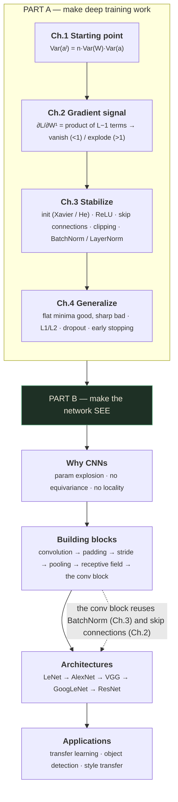
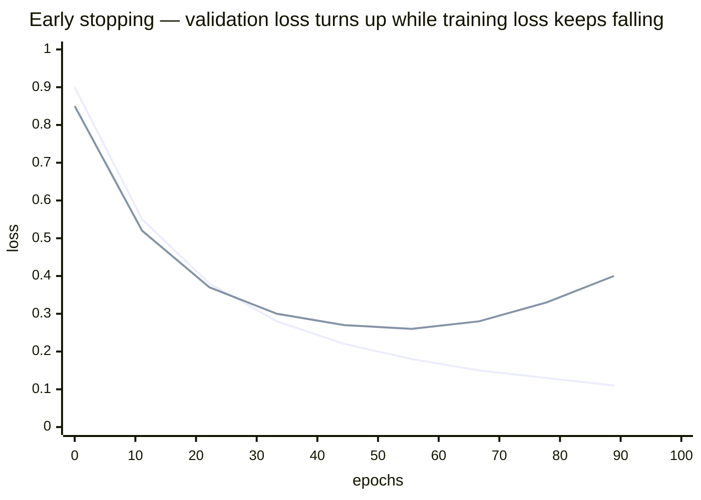
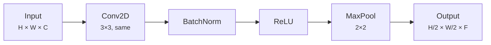
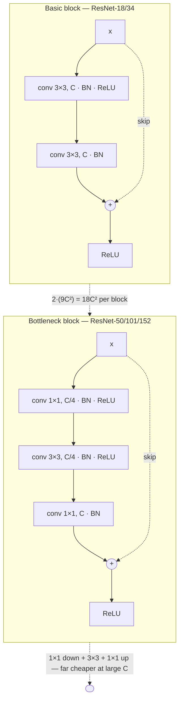
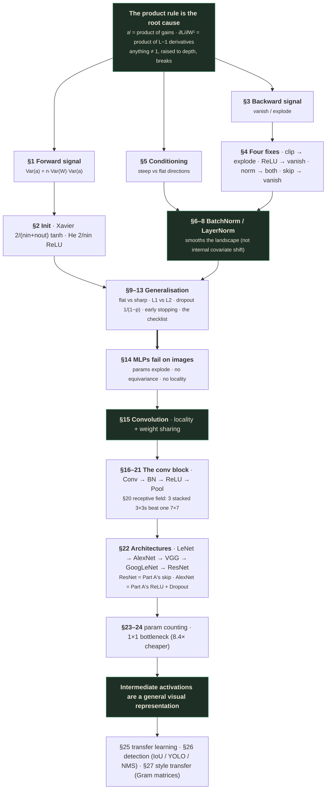

# Deep Neural Networks — Part 2
### Two decks in one session: how to make a deep network trainable, and how to make it see

---

## 📋 About this lecture and its capture

This session is **two separate decks back to back**, which is unusual for this course and worth
knowing before you start:

| | Deck | Runtime | Structure |
|---|---|---|---|
| **Part A** | **Training Deep Networks** — *Initialization, Gradients & Regularization* | 0:00 – 20:41 | 4 chapters |
| **Part B** | **Convolutional Neural Networks** — *Building Blocks & Architectures* | 20:41 – 48:08 | 2 parts |

These notes keep that split. Part A finishes the story Part 1 started — Part 1 taught you the
*machinery* of a network (layers, activations, loss, backprop, optimizers); Part A tells you what
else has to be true for that machinery to actually converge in a **deep** network. Part B then
changes subject entirely and builds the convolutional architecture from scratch.

Unlike Part 1's deck, **this one carries no page numbers in its footer**, so the exact deck length
cannot be read off a slide. Reconstructed from the raw capture in `output/`, the two decks together
contain **40 distinct slide states** (24 in Part A, 16 in Part B, counting chapter dividers).

> ⚠️ **Three capture gaps — read this before you trust the notes**
>
> The capture samples the video whenever the picture changes, plus a forced sample every 90 seconds.
> Three slides animated their body in *after* their title landed, and the next sample arrived only
> once the slide had already advanced. In each case the title was captured and the body was not:
>
> | Slide | Captured at | Next sample | What is missing |
> |---|---|---|---|
> | **Layer Normalization** | 12:06 (title only) | 13:33 (next slide) | The entire body — formula, the "normalize across features, not across the batch" contrast, the NLP/Transformer motivation |
> | **L1 & L2 Regularization** | 16:11 (title, intro, formula, L1 block) | 17:41 (next slide) | The **L2 (Ridge)** explanation block that pairs with the L1 block |
> | **Output Size Formula** | 27:34 (title only) | 29:04 (next slide) | The formula itself and any worked numbers |
>
> **What I did about it.** In all three cases the missing content is a *standard, unambiguous*
> result, and the surrounding slides constrain what it must have said — the Output Size Formula
> slide, for instance, sits between a convolution demo whose numbers are 5×5 → 3×3 and a Padding
> slide that already states $P = \lfloor K/2 \rfloor$ gives same-size output. So I teach all three
> in full, and mark each with a **🩹 badge** meaning *"taught from the standard result, not read off
> the slide."* Nothing is invented; nothing is silently skipped. Where the deck would probably have
> phrased something differently, I say so.
>
> A fourth, weaker caveat: between **27:34 and 32:05** the change-detector went quiet and only the
> forced 90-second samples exist. Those landed on *Output Size Formula → Padding → Stride →
> Pooling*, a coherent sequence with no obvious hole — but a slide displayed for well under 90
> seconds in that window would not have been captured. I have no positive evidence of one.
>
> **A note on the `[slide N, T:TT]` citations below.** `N` is this document's own sequential count
> of the 40 distinct slide states (1–40, in viewing order) — it is *not* the raw filename number in
> `output/Lecture_05 - Module 2 Deep Neural Network Part 2/` (this deck has no page-number footer,
> so states were reconstructed by clustering raw frames on the timestamp gap, and several raw frames
> can map to one numbered state). The timestamp is the more precise pointer if you go looking for the
> source frame yourself; treat `slide N` as a human-readable label for "the Nth distinct thing shown,"
> not a `slide_00N.jpg` filename.

---

## How to read this document

Part A and Part B are genuinely independent. If you are revising for an interview and short on time:

- **"Why won't my deep net train?"** → Part A, §1–§8.
- **CNN questions** → Part B, §14–§27. Of those, **§16, §20 and §23 are the ones you will be asked to
  *compute*,** not just describe.
- **Everything in a `🧪 Worked example` block should be reproducible by you on paper.** That is the
  difference between "I've read about BatchNorm" and "I can show you what it does to these four
  numbers."

Section numbering runs continuously across both parts, so cross-references are unambiguous.

---

## What you'll understand after reading this

- You'll be able to **derive** why activation variance multiplies by $n \cdot \mathrm{Var}(W)$ at
  every layer, and use that one fact to explain both dead networks and NaN losses.
- You'll be able to state Xavier and He initialization, **derive the factor of 2 in He from ReLU's
  behaviour**, and say exactly what goes wrong when you pair the wrong one with the wrong activation.
- You'll be able to write an early layer's gradient as a product of $L-1$ terms and compute, with
  real numbers, how fast a 20-layer sigmoid network dies.
- You'll be able to name the four fixes for gradient instability and explain **which fixes vanishing,
  which fixes exploding, and which fixes neither**.
- You'll be able to write the BatchNorm equations from memory, normalise four numbers by hand, and
  explain why $\gamma$ and $\beta$ are not redundant.
- You'll be able to argue *both sides* of "why does BatchNorm work" — internal covariate shift and
  landscape smoothing — and say which the evidence currently favours.
- You'll be able to explain why L1 produces exactly-zero weights and L2 does not, **by comparing
  their gradients**, and demonstrate it on a single weight in two lines of arithmetic.
- You'll be able to derive the $\frac{1}{1-p}$ in inverted dropout from the requirement that the
  expected activation is unchanged.
- You'll be able to compute a convolution by hand, predict any layer's output size, and count the
  parameters of any conv or fully-connected layer.
- You'll be able to derive the receptive-field recurrence and explain the VGG argument — why three
  stacked 3×3 filters beat one 7×7 — in both parameters and nonlinearity.
- You'll be able to explain what a 1×1 convolution does and why it saves 36× on a real layer.
- You'll be able to choose between feature extraction, fine-tuning and full fine-tuning given a
  dataset size and a domain, and justify the choice.
- You'll be able to explain IoU, YOLO's grid formulation and non-max suppression well enough to
  whiteboard a detection pipeline.
- You'll be able to explain neural style transfer as *optimising pixels instead of weights*, and say
  what a Gram matrix captures and why it is spatially blind.

---

## Before we start: what you need to know

Part 1 taught the network's machinery. This lecture leans on **six** things it either introduced
briefly or assumed outright. If you can already do all six, skim to *The big picture*.

### Prerequisite 1 — Variance, and the one rule that makes this whole lecture work

> **Variance** — a single number saying how spread out a set of values is.
>
> *In everyday words:* if you measure everyone's height in a room, the **mean** tells you the typical
> height and the **variance** tells you whether they're all nearly identical or wildly different.
>
> *Concretely:* the numbers $\{2, 4, 6, 8\}$ have mean $5$. Deviations from the mean: $-3, -1, 1, 3$.
> Square them: $9, 1, 1, 9$. Average the squares: $\frac{9+1+1+9}{4} = 5$. So the variance is
> $\mathbf{5}$ and the **standard deviation** (its square root, back in the original units) is
> $\sqrt{5} \approx 2.236$.
>
> *Why it exists:* you cannot say "the signal is dying" without a number for how big the signal is.
> Variance is that number.

Formally, for a random variable $X$:

$$\mathrm{Var}(X) = \mathbb{E}\left[(X - \mathbb{E}[X])^2\right] = \mathbb{E}[X^2] - \left(\mathbb{E}[X]\right)^2$$

| Symbol | Read it as | What it means |
|---|---|---|
| $\mathbb{E}[\cdot]$ | "expected value of" | The long-run average. For a finite set of numbers, just the mean. |
| $X$ | "ex" | The quantity whose spread we're measuring — here, an activation or a weight. |
| $\mathrm{Var}(X)$ | "variance of X" | Average squared distance from the mean. |

**Three rules you need, and only three:**

**Rule 1 — scaling.** $\mathrm{Var}(cX) = c^2\,\mathrm{Var}(X)$. Doubling every number *quadruples*
the variance, because variance is built from *squared* distances.

**Rule 2 — sums of independent variables.** If $X_1, \dots, X_n$ are independent,
$\mathrm{Var}(X_1 + \dots + X_n) = \mathrm{Var}(X_1) + \dots + \mathrm{Var}(X_n)$. Variances add. If
all $n$ share the same variance $v$, the sum has variance $n \cdot v$.

**Rule 3 — products of independent, zero-mean variables.** If $X$ and $Y$ are independent and **both
have mean zero**, then

$$\mathrm{Var}(XY) = \mathbb{E}[X^2Y^2] - \left(\mathbb{E}[XY]\right)^2 = \mathbb{E}[X^2]\,\mathbb{E}[Y^2] - 0 = \mathrm{Var}(X)\,\mathrm{Var}(Y)$$

The step $\mathbb{E}[X^2Y^2] = \mathbb{E}[X^2]\mathbb{E}[Y^2]$ is allowed because independence lets
expectations of products factor. The step $\mathbb{E}[XY] = \mathbb{E}[X]\mathbb{E}[Y] = 0$ requires
**both means to be zero** — which is exactly why initialization schemes always centre the weights at
zero, and exactly why §1's analysis is stated as holding "for i.i.d. zero-mean weights independent of
zero-mean inputs."

> 💡 Rules 2 and 3 together are the entire mathematical content of §1. Everything else there is
> bookkeeping.

### Prerequisite 2 — The normal distribution and $\mathcal{N}(0, \sigma^2)$ notation

> **Normal (Gaussian) distribution** — the bell-curve recipe for picking random numbers, where values
> near the centre are common and values far out are rare.
>
> *In everyday words:* ask a thousand people to draw a 10 cm line freehand; the lengths cluster near
> 10 cm with a few outliers each side. That shape is the normal distribution.
>
> *Concretely:* $\mathcal{N}(0, 0.01)$ means "centred at 0, variance 0.01". Variance 0.01 means
> standard deviation $\sqrt{0.01} = 0.1$, so roughly 68% of draws land in $[-0.1, +0.1]$ and roughly
> 95% land in $[-0.2, +0.2]$.
>
> *Why it exists:* you must fill a weight matrix with *something* before training starts, and that
> something has to be random (see below) and small.

**The notation trap.** $\mathcal{N}(\mu, \sigma^2)$ conventionally takes the **variance** as its
second argument, not the standard deviation. PyTorch's `torch.normal` and `nn.init.normal_`, by
contrast, take **`std`**. So `W ~ N(0, 2/n)` from a paper becomes
`nn.init.normal_(W, std=math.sqrt(2/n))` in code. Getting this wrong squares or square-roots your
initialization scale, and it is a genuinely common bug.

> 📚 **Background the slide assumed** — *why random at all?*
>
> Why not initialize every weight to the same value, say 0.01? Because then **every neuron in a layer
> computes exactly the same thing**, receives exactly the same gradient, and updates identically —
> forever. A 512-neuron layer would behave like a 1-neuron layer for the entire run. This is the
> **symmetry breaking** problem, and randomness is the only cheap cure. Biases *can* safely start at
> zero, because the weights already break the symmetry.

### Prerequisite 3 — The chain rule as a product across layers

Part 1 derived backpropagation. The one consequence this lecture needs is that the gradient reaching
an **early** layer is a **product** of many per-layer terms:

$$\frac{\partial L}{\partial W^{[1]}} = \underbrace{\frac{\partial L}{\partial a^{[L]}} \cdot \frac{\partial a^{[L]}}{\partial a^{[L-1]}} \cdots \frac{\partial a^{[2]}}{\partial a^{[1]}}}_{\text{a chain of } L-1 \text{ links}} \cdot \frac{\partial a^{[1]}}{\partial W^{[1]}}$$

| Symbol | Read it as | What it means |
|---|---|---|
| $L$ in $\partial L$ | "the loss" | The single number measuring how wrong the network is. |
| $L$ as a layer index | "layer L" | The last layer. The deck overloads the letter; context disambiguates — inside $\partial L$ it's the loss, in a superscript bracket it's the depth. |
| $a^{[\ell]}$ | "a superscript ell" | The activation (output) of layer $\ell$. |
| $W^{[\ell]}$ | "W superscript ell" | The weight matrix of layer $\ell$. |
| $\partial$ | "partial" | Derivative with respect to one variable, holding the others fixed. |

**Why products are dangerous.** Multiply twenty numbers that are each $0.5$ and you get
$9.5 \times 10^{-7}$. Multiply twenty that are each $1.5$ and you get $3327$. Sums degrade
gracefully; **products explode or collapse**. Every pathology in Part A follows from that sentence.

### Prerequisite 4 — Fan-in and fan-out

> **Fan-in** ($n_{\text{in}}$) — how many numbers flow *into* one neuron.
> **Fan-out** ($n_{\text{out}}$) — how many neurons that neuron's output flows *out to*.

*Concretely:* `nn.Linear(256, 512)` has $n_{\text{in}} = 256$ and $n_{\text{out}} = 512$. Each of the
512 output neurons sums 256 weighted inputs.

For a convolutional layer the counting differs, and people get it wrong:
$n_{\text{in}} = K \times K \times C_{\text{in}}$ (the number of values one filter touches at one
position) and $n_{\text{out}} = K \times K \times C_{\text{out}}$.

*Why it exists:* fan-in tells you **how many independent random terms get summed**, and by Rule 2,
summing $n$ independent terms multiplies the variance by $n$. That link is why every initialization
formula has an $n$ in the denominator.

### Prerequisite 5 — The loss landscape, and what "poorly conditioned" means

> **Loss landscape** — picture the loss as terrain. Every setting of the weights is a location; the
> loss there is the altitude. Training is walking downhill.
>
> *In everyday words:* you're blindfolded on a hillside and can only feel the slope under your feet.
> Gradient descent is "feel the slope, step downhill, repeat."
>
> *Concretely:* with 2 weights the landscape is a literal 3D surface. With 25 million weights it's a
> surface in 25-million-dimensional space — but the intuition transfers.

> **Poorly conditioned** — the landscape is far steeper in some directions than others: a valley that
> is a near-vertical cliff left-to-right and a nearly flat trough front-to-back.
>
> *In everyday words:* you're in a narrow canyon. Step too big and you bounce off the walls; step
> small enough to be safe on the walls and you crawl along the floor.
>
> *Concretely:* if $L = 100w_1^2 + 0.01w_2^2$, the gradient in $w_1$ is $10{,}000\times$ larger than in
> $w_2$. Any learning rate small enough not to diverge in $w_1$ makes $w_2$ take essentially forever.
>
> *Why it exists as a concept:* it names the single reason "just tune the learning rate" fails. There
> is no one good learning rate for a badly conditioned problem. **Chapter 3 of this deck exists
> entirely to fix conditioning.**

### Prerequisite 6 — Bernoulli random variables

> **Bernoulli($q$)** — a coin flip returning 1 with probability $q$ and 0 with probability $1-q$.
>
> *Concretely:* Bernoulli(0.5) is a fair coin; Bernoulli(0.9) returns 1 nine times out of ten.
>
> Its expected value is exactly $q$: $\mathbb{E}[\text{Bernoulli}(q)] = 1 \cdot q + 0 \cdot (1-q) = q$.

That one fact is all you need, and you need it in §11 (dropout).

---

## The big picture

Part 1 ended with a working training loop: forward pass, loss, backward pass, optimizer step. Run
that loop on a 3-layer network and it works. Run it on a **50-layer** network and, historically, it
did not — for roughly fifteen years nobody could reliably train deep networks even though the
algorithm had been published in 1986.

The agenda slide poses the question exactly right:

> *"Now: what else does gradient-based optimization need to converge to a good solution in deep
> networks?"* [slide 6, 1:32]

Part A's answer is **four things**, and the deck's four chapters read as one escalating argument:

1. **Starting Point** — the optimizer must *begin* somewhere the gradients are informative. Get the
   initial weight scale wrong and the signal is dead (or infinite) before the first step. → §1–§2
2. **Gradient Signal** — even from a good start, the gradient must *survive the trip back* through
   many layers without vanishing or exploding. → §3–§4
3. **Stabilize Training** — even with a live gradient, the landscape must be *well-conditioned*
   enough that a reasonable step size is safe. → §5–§8
4. **Generalize** — even with fast, stable convergence, the point you converge to must be the *right
   kind* of minimum: one that describes the world, not the training set. → §9–§13

Notice the shape of that argument: each chapter exists because the previous chapter's success is not
sufficient. Good initialization doesn't guarantee live gradients; live gradients don't guarantee a
trainable landscape; a trainable landscape doesn't guarantee generalization. **That is the honest
answer to "why are there so many training tricks?" — they are not a grab-bag, they are four
different failures.**

Part B then switches subject. Everything in Part 1 and Part A applies to a *fully-connected* network,
which treats its input as a flat list of numbers. Images are not a flat list of numbers, and
pretending they are costs you three things — parameters, translation equivariance, and locality. The
convolution is the fix, and Part B builds it from the operation up, through the architectures
(LeNet → AlexNet → VGG → GoogLeNet → ResNet), to three applications (transfer learning, object
detection, style transfer).

### The connection between the two halves

They are not unrelated. The single most important architectural idea in Part B — **ResNet's skip
connection** — is introduced in Part A §4 as the fourth solution to vanishing gradients. Part B's
canonical conv block contains a **BatchNorm** layer, which Part A §6 derives. Part B is, in a real
sense, the first architecture family that could only exist *because* Part A's problems were solved.

### The whole lecture in one diagram



---

# PART A — Training Deep Networks

*Deck: "Training Deep Networks — Initialization, Gradients & Regularization", 0:00–20:41.*

---

## 1. Why initialization matters

**The intuition first.** Before training, you have to put *some* numbers in the weight matrices. It
feels like a throwaway detail — surely the optimizer will fix whatever you start with? For a 3-layer
network, roughly yes. For a 50-layer network, absolutely not, and the reason is that the signal
passing through the layers gets multiplied by roughly the same factor at every layer. Any factor
that isn't almost exactly 1 becomes catastrophic when raised to the 50th power.

The slide states the goal precisely [slide 11, 3:11]:

> *"For gradient-based optimization to work, every layer must receive useful gradient signal. This
> requires that activation magnitudes neither vanish nor explode as they propagate. The quantity that
> controls this is the **variance of activations**, which compounds multiplicatively across layers."*

### 1.1 The variance recurrence, derived

**What the equation says in words:** *the spread of a layer's outputs equals the spread of the
previous layer's outputs, multiplied by the spread of this layer's weights, multiplied by how many
inputs each neuron sums.*

$$\mathrm{Var}(a^{[\ell]}) = n^{[\ell-1]} \cdot \mathrm{Var}(W^{[\ell]}) \cdot \mathrm{Var}(a^{[\ell-1]})$$

| Symbol | Read it as | What it means |
|---|---|---|
| $\mathrm{Var}(a^{[\ell]})$ | "variance of the activations at layer ℓ" | How spread out this layer's outputs are. If it goes to 0 the layer is dead; if it explodes the layer saturates or overflows. |
| $n^{[\ell-1]}$ | "n of layer ℓ minus 1" | The **fan-in**: how many inputs each neuron in layer $\ell$ sums over — i.e. the width of the previous layer. |
| $\mathrm{Var}(W^{[\ell]})$ | "variance of the weights at layer ℓ" | The scale you chose at initialization. **This is the only term you control.** |
| $\mathrm{Var}(a^{[\ell-1]})$ | "variance of the previous activations" | What arrived from below. |

**Now the derivation.** The slide states this for a *linear pre-activation*
$z^{[\ell]} = W^{[\ell]} a^{[\ell-1]}$, assuming i.i.d. zero-mean weights independent of zero-mean
inputs. Write out one neuron's pre-activation as an explicit sum over its $n$ inputs:

$$z_i = \sum_{j=1}^{n} W_{ij}\, a_j$$

**Step 1 — variance of one product term.** $W_{ij}$ and $a_j$ are independent and both zero-mean, so
Rule 3 from Prerequisite 1 applies directly:

$$\mathrm{Var}(W_{ij} a_j) = \mathrm{Var}(W_{ij}) \cdot \mathrm{Var}(a_j) = \mathrm{Var}(W)\,\mathrm{Var}(a)$$

(dropping subscripts because all weights share one distribution and all inputs share another).

**Step 2 — variance of the sum.** The $n$ terms are independent, so by Rule 2 their variances add.
All $n$ have the same variance, so the sum's variance is $n$ times one term's:

$$\mathrm{Var}(z_i) = \sum_{j=1}^{n} \mathrm{Var}(W_{ij} a_j) = n \cdot \mathrm{Var}(W)\,\mathrm{Var}(a)$$

That is the slide's formula. $\blacksquare$

> 💡 **The whole of Chapter 1 in one line.** Define the **per-layer gain**
> $g = n \cdot \mathrm{Var}(W)$. Then $\mathrm{Var}(a^{[\ell]}) = g \cdot \mathrm{Var}(a^{[\ell-1]})$,
> so after $\ell$ layers, $\mathrm{Var}(a^{[\ell]}) = g^{\ell} \cdot \mathrm{Var}(a^{[0]})$. The
> variance is a **geometric sequence in depth**. Everything else is deciding what $g$ should be — and
> the answer is obviously $g = 1$.

### 1.2 The three regimes the slide draws

The slide shows three rows of bar charts across five layers L1→L5 [slide 11]:

| Regime | What happens to activations | What happens to gradients | The slide's label |
|---|---|---|---|
| $n \cdot \mathrm{Var}(W) < 1$ | Variance shrinks; bars get shorter each layer until nothing is left | Gradients **vanish** | "all ≈ 0 (dead)" |
| $n \cdot \mathrm{Var}(W) > 1$ | Variance grows; activations get pushed to the flat ends of the activation function | Gradients **vanish** (because $\tanh' \approx 0$ out there) | "all at ±1 (saturated)" |
| $n \cdot \mathrm{Var}(W) = 1$ | Variance constant; activations stay well-distributed | Gradients **informative** ✓ | "stable ✓" |

> ⚠️ **The row that trips people up is the middle one.** Too-large weights cause *vanishing*
> gradients, not exploding ones, when the activation is $\tanh$ or sigmoid. Why? Because a huge
> pre-activation lands in the flat tail of $\tanh$, where the derivative is essentially zero, and
> that zero derivative kills the gradient. Large weights cause **exploding** gradients when the
> activation is unbounded (ReLU) or when you're looking at the raw product of weight matrices. Both
> are true; which one you see depends on the activation. An interviewer asking "does a too-large
> initialization make gradients explode or vanish?" is testing exactly this.

The slide's conclusion, boxed at the bottom:

$$\boxed{\text{To maintain stable gradients across all layers, initialize such that } \mathrm{Var}(W) = 1/n_{\text{in}}}$$

which is just $g = n \cdot \mathrm{Var}(W) = 1$ rearranged.

### 🧪 Worked example — a 20-layer network, three initializations

Take a 20-layer fully-connected network, every layer 256 wide, so $n = 256$ throughout. Assume for
now a linear (or near-linear) activation, so the recurrence applies cleanly. Start with input
variance $\mathrm{Var}(a^{[0]}) = 1$.

**Case A — "small" weights, $\sigma = 0.05$.**

$$\mathrm{Var}(W) = 0.05^2 = 0.0025 \qquad g = 256 \times 0.0025 = 0.64$$

After 20 layers:

$$\mathrm{Var}(a^{[20]}) = 0.64^{20} = 1.33 \times 10^{-4}$$

Check that by hand: $0.64^2 = 0.4096$; $0.64^4 = 0.4096^2 = 0.16777$; $0.64^8 = 0.16777^2 = 0.028147$;
$0.64^{16} = 0.028147^2 = 7.9228 \times 10^{-4}$; and $0.64^{20} = 0.64^{16} \times 0.64^{4} =
7.9228\times10^{-4} \times 0.16777 = \mathbf{1.329 \times 10^{-4}}$.

In standard deviations, the signal has shrunk by $\sqrt{1.329\times10^{-4}} = 0.01153$, i.e. **the
last layer's activations are 87× smaller than the input's**. Every gradient flowing back is scaled
down by comparable factors. The network is, for practical purposes, dead.

**Case B — "not that big" weights, $\sigma = 0.1$.**

$$\mathrm{Var}(W) = 0.01 \qquad g = 256 \times 0.01 = 2.56$$

$$\mathrm{Var}(a^{[20]}) = 2.56^{20} = e^{20 \ln 2.56} = e^{20 \times 0.9400} = e^{18.80} = 1.46 \times 10^{8}$$

Activations have grown by a factor of about $\sqrt{1.46\times10^8} = 12{,}000$ in standard deviation.
With $\tanh$ they are all pinned at $\pm 1$ and the network learns nothing; with ReLU and float32 you
are a few more layers away from `inf`, and one backward pass away from `nan`.

**Note how small the difference in $\sigma$ was: 0.05 versus 0.1.** A factor of 2 in the
initialization standard deviation is the difference between $10^{-4}$ and $10^{8}$. That is the
entire argument for why initialization is not a detail.

**Case C — the principled choice, $\mathrm{Var}(W) = 1/n$.**

$$\mathrm{Var}(W) = \frac{1}{256} = 0.00390625 \quad \Rightarrow \quad \sigma = 0.0625 \qquad g = 256 \times \frac{1}{256} = 1$$

$$\mathrm{Var}(a^{[20]}) = 1^{20} \times 1 = \mathbf{1}$$

Perfectly preserved, at any depth. **This is why the formula is $1/n_{\text{in}}$ and not some
tuned constant** — it is the unique value that makes the geometric sequence constant.

### Where people get confused

- **"Isn't this only about the forward pass?"** No. The backward pass has its own variance
  recurrence, and it involves $n_{\text{out}}$ rather than $n_{\text{in}}$, because the gradient at a
  neuron sums contributions from all the neurons it fed. That asymmetry is precisely what Xavier's
  $\frac{2}{n_{\text{in}} + n_{\text{out}}}$ is compromising between — see §2.
- **"The derivation assumes linearity — so it's useless for real networks."** It assumes the
  activation is *approximately* linear near zero. $\tanh$ has slope $\approx 1$ at the origin, so if
  activations stay small the assumption holds well. ReLU is exactly linear on half its domain, which
  is why He's correction is a single clean factor of 2 rather than something messy. The assumption is
  a good one *while the network is behaving*, which is exactly when you need it.
- **"Adam will fix a bad initialization anyway."** Adam rescales the *step size* per parameter; it
  does not resurrect a gradient that is numerically zero, and it does not un-saturate a $\tanh$. It
  buys you tolerance, not immunity.

### Why this matters

Every framework's default initializer implements this analysis. `nn.Linear` in PyTorch defaults to
Kaiming-uniform with `a=math.sqrt(5)`, which works out to a fan-in-scaled uniform distribution.
Most of the time you never think about it — until you write a custom layer, or load weights into a
differently-shaped model, or build something 100 layers deep, and suddenly your loss is `nan` at step
3. The first thing to check is the initialization.

```interactive
type: slider
title: Variance propagation through depth
concept: Why n·Var(W) must equal 1
control: A slider for the initialization std σ (0.01 → 0.20) and a slider for depth (1 → 50 layers)
observe: A bar chart of activation variance per layer, log-scaled, plus a live readout of the gain g = n·Var(W) and the final-layer variance
insight: The transition from "dead" to "exploded" happens over a tiny range of σ, and the width of the safe band shrinks as depth grows — which is exactly why depth made initialization go from a detail to a crisis
fallback: The worked example above, which computes the three cases (σ=0.05 → 1.3e-4, σ=0.1 → 1.5e8, σ=1/√n → exactly 1) at 20 layers
```

---

## 2. Xavier and He initialization

We know we want $n \cdot \mathrm{Var}(W) = 1$. The remaining question is: **$n$ counted how, and does
the activation function change the answer?** The slide's opening line is the key one [slide 13, 5:23]:

> *"The required $\mathrm{Var}(W)$ depends on the activation function, because each activation passes
> signal differently."*

### 2.1 Xavier (Glorot) — for tanh and sigmoid

$$W \sim \mathcal{N}\!\left(0,\ \frac{2}{n_{\text{in}} + n_{\text{out}}}\right)$$

| Symbol | Read it as | What it means |
|---|---|---|
| $n_{\text{in}}$ | "fan in" | Number of inputs to each neuron in this layer. |
| $n_{\text{out}}$ | "fan out" | Number of neurons in this layer (= number of outputs each input feeds). |
| $\frac{2}{n_{\text{in}} + n_{\text{out}}}$ | — | Twice the reciprocal of the *average* of the two, i.e. $1/\overline{n}$ where $\overline{n} = \frac{n_{\text{in}}+n_{\text{out}}}{2}$. |

**Where the compromise comes from — derive it.** There are two variance-preservation demands, and
they conflict:

- **Forward pass:** to keep activation variance constant, §1 gives $n_{\text{in}}\mathrm{Var}(W) = 1$,
  i.e. $\mathrm{Var}(W) = 1/n_{\text{in}}$.
- **Backward pass:** the gradient at a neuron in layer $\ell-1$ is a sum over the $n_{\text{out}}$
  neurons it fed in layer $\ell$. Running the identical Rule-2 + Rule-3 argument on that sum gives
  $n_{\text{out}}\mathrm{Var}(W) = 1$, i.e. $\mathrm{Var}(W) = 1/n_{\text{out}}$.

You cannot satisfy both unless $n_{\text{in}} = n_{\text{out}}$. Xavier takes the **harmonic-style
compromise**: instead of $1/n_{\text{in}}$ or $1/n_{\text{out}}$, use the reciprocal of their average,
$\frac{2}{n_{\text{in}}+n_{\text{out}}}$. When the two are equal it reduces to $1/n$ exactly, and
when they differ it sits between the two demands. That is the whole content of the Xavier formula.

The slide's justification for using it with $\tanh$: *"tanh is approximately linear near zero (slope
≈ 1), so input variance passes through."* If $\tanh$ behaves like the identity near the origin, the
linear derivation of §1 applies unchanged, and no correction factor is needed.

The slide also names the alternative: *"The fan-in-only variant $\mathcal{N}(0, 1/n_{\text{in}})$
preserves forward-pass variance only."* That's the version that satisfies the forward demand exactly
and ignores the backward one.

### 2.2 He (Kaiming) — for ReLU

$$W \sim \mathcal{N}\!\left(0,\ \frac{2}{n_{\text{in}}}\right)$$

The slide's justification: *"ReLU outputs 0 for all negative inputs, killing exactly half the signal.
The factor of 2 compensates: $\mathrm{Var}(\mathrm{ReLU}(z)) = \frac{1}{2}\mathrm{Var}(z)$."*

**Derive the factor of 2 properly.** Let $z$ be zero-mean and **symmetric** about zero (true if the
weights are zero-mean Gaussian and the inputs are symmetric). ReLU is $\max(0, z)$. Then:

$$\mathbb{E}\left[\mathrm{ReLU}(z)^2\right] = \mathbb{E}\left[z^2 \cdot \mathbb{1}[z > 0]\right]$$

By symmetry, $z^2$ has the same distribution whether $z$ is positive or negative, and $z > 0$ happens
exactly half the time. So this expectation is exactly half of $\mathbb{E}[z^2]$:

$$\boxed{\mathbb{E}\left[\mathrm{ReLU}(z)^2\right] = \tfrac{1}{2}\,\mathbb{E}[z^2]}$$

ReLU halves the **second moment**. To keep the second moment constant across layers we therefore need
the linear part to *double* it, i.e. $n \cdot \mathrm{Var}(W) = 2$, giving
$\mathrm{Var}(W) = 2/n_{\text{in}}$. $\blacksquare$

> ⚠️ **A precision point the slide glosses, and a good depth-probe answer.** The slide writes
> $\mathrm{Var}(\mathrm{ReLU}(z)) = \frac{1}{2}\mathrm{Var}(z)$. Strictly, that is *not* exactly true,
> because $\mathrm{ReLU}(z)$ is not zero-mean — it is non-negative, so it has a positive mean, and
> variance subtracts the squared mean. For $z \sim \mathcal{N}(0, \sigma^2)$:
>
> $$\mathbb{E}[\mathrm{ReLU}(z)] = \frac{\sigma}{\sqrt{2\pi}}, \qquad \mathbb{E}[\mathrm{ReLU}(z)^2] = \frac{\sigma^2}{2}$$
>
> $$\mathrm{Var}(\mathrm{ReLU}(z)) = \frac{\sigma^2}{2} - \frac{\sigma^2}{2\pi} = \sigma^2\left(0.5 - 0.1592\right) = 0.341\,\sigma^2$$
>
> So the *variance* is multiplied by $0.341$, not $0.5$. The **second moment** is what is multiplied
> by exactly $0.5$ — and the second moment is the quantity He et al. actually track, precisely
> because ReLU breaks the zero-mean assumption that would make the two interchangeable. The slide's
> statement is the standard shorthand and gets you the right formula; knowing *why* it's shorthand is
> the difference between reciting He initialization and understanding it.

### 2.3 The mismatch penalty

The slide's closing box [slide 13] is the practically useful part:

> *"**Mismatch penalty:** Xavier + ReLU → variance halves each layer (collapse within a few layers).
> He + tanh → initial variance growth is too fast, leading to saturation."*

Both directions, quantified:

| Pairing | Per-layer gain $g$ | After 10 layers | Symptom |
|---|---|---|---|
| **He + ReLU** ✓ | $\frac{2}{n} \cdot n \cdot \frac{1}{2} = 1$ | variance $\times\,1$ | Healthy |
| **Xavier(fan-in) + ReLU** ✗ | $\frac{1}{n} \cdot n \cdot \frac{1}{2} = 0.5$ | $0.5^{10} = 0.00098$ | Signal down $1000\times$; deep layers dead |
| **Xavier + tanh** ✓ | $\approx 1$ | $\approx 1$ | Healthy |
| **He + tanh** ✗ | $\approx \frac{2}{n} \cdot n = 2$ | $2^{10} = 1024$ | Activations saturate at $\pm1$; $\tanh' \to 0$; gradients die |

Note the delicious symmetry: **both mismatches end in dead gradients**, by opposite mechanisms. One
collapses the signal, the other saturates the nonlinearity.

### 🧪 Worked example — initializing a real layer three ways

`nn.Linear(512, 256)` — so $n_{\text{in}} = 512$, $n_{\text{out}} = 256$.

| Scheme | Variance | Standard deviation | PyTorch |
|---|---|---|---|
| Xavier (Glorot) | $\frac{2}{512+256} = \frac{2}{768} = 0.002604$ | $\sqrt{0.002604} = \mathbf{0.05103}$ | `nn.init.xavier_normal_(W)` |
| Xavier, fan-in only | $\frac{1}{512} = 0.001953$ | $\mathbf{0.04419}$ | `nn.init.normal_(W, std=0.04419)` |
| He (Kaiming) | $\frac{2}{512} = 0.003906$ | $\sqrt{0.003906} = \mathbf{0.0625}$ | `nn.init.kaiming_normal_(W, nonlinearity='relu')` |

He's std is $\sqrt{2} = 1.414\times$ larger than fan-in Xavier's — the square root of the factor-of-2
correction. That's the entire practical difference between the two, and it is enough to make or break
a 30-layer ReLU network.

```python
import torch, torch.nn as nn, math

layer = nn.Linear(512, 256)

# He / Kaiming — the correct choice for a ReLU network
nn.init.kaiming_normal_(layer.weight, mode='fan_in', nonlinearity='relu')
nn.init.zeros_(layer.bias)          # biases start at zero; weights already break symmetry

print(layer.weight.std().item())    # ~0.0625  == sqrt(2/512)

# Xavier / Glorot — the correct choice for a tanh network
tanh_layer = nn.Linear(512, 256)
nn.init.xavier_normal_(tanh_layer.weight, gain=nn.init.calculate_gain('tanh'))
```

> 💡 `nn.init.calculate_gain('relu')` returns $\sqrt{2}$ and `calculate_gain('tanh')` returns
> $5/3$. PyTorch expresses every scheme as "the base Xavier/He formula times an activation-dependent
> gain", which is a tidy way to see that *the only thing the activation changes is one multiplier*.

### Where people get confused

- **"Xavier and Glorot are two different methods."** Same method. Xavier Glorot is one person; the
  paper is Glorot & Bengio (2010). Likewise **He and Kaiming** — Kaiming He, one person, He et al.
  (2015). Interviewers occasionally use the names interchangeably to see if you flinch.
- **"He initialization is for ReLU, so I can't use it with GELU/SiLU/LeakyReLU."** You can, and
  people do. Those activations also zero out (or heavily shrink) roughly half the input range, so the
  factor of 2 is approximately right. For LeakyReLU with negative slope $\alpha$, the exact factor is
  $\frac{2}{1 + \alpha^2}$ — which PyTorch implements as `kaiming_normal_(..., a=alpha)`.
- **"With BatchNorm everywhere, initialization doesn't matter."** It matters much less — that is one
  of BatchNorm's real selling points, and the slide in §5 says so ("careful initialization becomes
  critical" is listed as a *symptom* that normalization cures). But the very first forward pass still
  has to produce finite numbers, and networks without normalization (many Transformers' residual
  branches, most small MLPs) still depend on it entirely.

### 💼 Interview questions

- *"Why is the variance $2/n$ and not $1/n$ for ReLU?"* — Because ReLU halves the second moment, so
  the linear part must double it. Derive it from $\mathbb{E}[\mathrm{ReLU}(z)^2] = \frac12\mathbb{E}[z^2]$.
- *"Why does Xavier use both fan-in and fan-out?"* — Forward-pass preservation wants $1/n_{\text{in}}$,
  backward-pass preservation wants $1/n_{\text{out}}$; the average is the compromise.
- *"What if I initialize all weights to zero?"* — Symmetry is never broken; every neuron in a layer
  stays identical forever. Note that this is a *different* failure from the variance argument.

---

## 3. Vanishing and exploding gradients

Chapter 1 was about the *forward* signal at *initialization*. Chapter 2 makes the same argument for
the *backward* signal at *any point in training* — and this is the one that has a name everyone knows.

The slide's framing [slide 16, 6:45]:

> *"Chapter 1 showed that bad initialization causes activation variance to shrink or explode. The same
> problem applies to gradients during backpropagation. The gradient for an early layer is a product of
> terms across all subsequent layers."*

**What the equation says in words:** *to find out how the loss changes when you nudge a weight in the
very first layer, you have to multiply together one derivative for every single layer between that
weight and the output.*

$$\frac{\partial L}{\partial W^{[1]}} = \frac{\partial L}{\partial a^{[L]}} \cdot \underbrace{\frac{\partial a^{[L]}}{\partial a^{[L-1]}} \cdots \frac{\partial a^{[2]}}{\partial a^{[1]}}}_{\text{product of } L-1 \text{ terms}} \cdot \frac{\partial a^{[1]}}{\partial W^{[1]}}$$

The slide's three bullets are the entire diagnosis:

- **"Each factor involves $W^{[\ell]}$ and $\sigma'$ (activation derivative)"** — every link in the
  chain is a weight matrix times an activation slope. Both are things you control.
- **"If each factor < 1: the product decays exponentially toward 0 — vanishing gradients. Early
  layers stop learning."**
- **"If each factor > 1: the product grows exponentially — exploding gradients. Loss diverges to NaN
  within a few steps."**

> 💡 **The asymmetry that makes vanishing worse than exploding.** Exploding gradients announce
> themselves: your loss becomes `nan` in under ten steps and you cannot miss it. Vanishing gradients
> are **silent** — the loss goes down (the last few layers still learn fine), the run completes, the
> model is mediocre, and nothing anywhere logs an error. A 50-layer network whose first 40 layers
> never moved from their random initialization looks exactly like a 10-layer network that trained
> normally. This is why the historical fix order was *exploding first* (clipping, 1990s) and
> *vanishing much later* (ReLU 2011, BatchNorm 2015, ResNet 2015).

### 🧪 Worked example — how fast a sigmoid network dies

The next slide gives us the number we need: **sigmoid's derivative satisfies
$\sigma'(x) \le 0.25$, with the maximum at $x = 0$.**

> 📚 **Background the slide assumed** — *where does 0.25 come from?*
>
> The sigmoid is $\sigma(x) = \frac{1}{1 + e^{-x}}$ and its derivative has the tidy form
> $\sigma'(x) = \sigma(x)\left(1 - \sigma(x)\right)$. Write $s = \sigma(x) \in (0,1)$; then
> $\sigma' = s(1-s)$, a downward parabola in $s$ with its maximum where $s = 0.5$, giving
> $\sigma' = 0.5 \times 0.5 = 0.25$. And $s = 0.5$ happens exactly when $x = 0$. So **0.25 is not an
> empirical observation, it's the exact maximum of a parabola**, and it is attained only at the single
> point $x = 0$. Everywhere else it is strictly smaller.

Now take a 20-layer sigmoid network and be **maximally generous**: assume every single unit sits
exactly at its best point $x = 0$, so every activation derivative is the full 0.25. Assume the weight
factors are all exactly 1 (also generous). Then the gradient reaching layer 1 is scaled by:

$$0.25^{\,20} = \left(\frac{1}{4}\right)^{20} = \frac{1}{4^{20}} = \frac{1}{1.0995 \times 10^{12}} = \mathbf{9.09 \times 10^{-13}}$$

Interpretation: if the gradient at the last layer is $1.0$, the gradient at the first layer is
$0.0000000000009$. With a learning rate of $10^{-3}$, the first layer's weights move by
$9 \times 10^{-16}$ per step. In float32 (which resolves about $10^{-7}$ relative), **that update
rounds to zero**. The first layer is frozen at its random initialization for the entire run.

Layer by layer, so you can see the collapse:

| Layers back from output | Gradient scale | Comment |
|---|---|---|
| 1 | $0.25$ | Fine |
| 2 | $0.0625$ | Fine |
| 5 | $9.8 \times 10^{-4}$ | Learning $1000\times$ slower than the top |
| 10 | $9.5 \times 10^{-7}$ | Effectively frozen |
| 20 | $9.1 \times 10^{-13}$ | Numerically zero |

**The exploding side, same arithmetic.** Suppose each factor is $1.5$ instead (large weights, ReLU
so no saturation cap):

$$1.5^{\,20} = 3327 \qquad 1.5^{\,50} = 6.4 \times 10^{8}$$

A gradient of $6.4 \times 10^8$ times a learning rate of $10^{-3}$ is a weight update of $640{,}000$.
The next forward pass produces `inf`, the loss becomes `nan`, and every parameter in the model is
`nan` one step later, because `nan` propagates through every operation it touches.

### Where people get confused

- **"Vanishing gradients mean the gradient is exactly zero."** No — it means the gradient is
  *exponentially smaller for early layers than for late ones*. The network still trains; it just
  trains only its top few layers. That's why the symptom is "adding layers doesn't help", not "loss
  doesn't move".
- **"ReLU eliminates vanishing gradients."** It eliminates the *activation-derivative* contribution
  ($\mathrm{ReLU}'(x) = 1$ for $x > 0$), which is the dominant one for sigmoid. It does **not**
  eliminate the *weight-matrix* contribution — if your weight matrices have spectral norm well below
  1, the product still shrinks. ReLU removes the guaranteed $4\times$-per-layer shrinkage; it does not
  make the product magically equal 1.
- **"This is only a problem for very deep networks."** It's a problem for *any* long multiplicative
  chain, which crucially includes **RNNs unrolled over time**. A 100-step sequence is a 100-link chain
  even if the model has only 2 layers. That is the entire motivation for LSTM/GRU gating, and it
  comes up in Module 6 (Sequential Learning).

```interactive
type: graph
title: Gradient magnitude by depth
concept: Exponential decay/growth of the backprop product
control: A slider for the per-layer factor (0.1 → 2.0) and a slider for network depth (2 → 60)
observe: A log-scale plot of gradient magnitude versus layer index, with a shaded band marking float32's representable range
insight: The curve is a straight line on a log axis — the failure is exponential, so there is no depth at which "a bit more tuning" saves a factor below 1. Only changing the factor itself works.
fallback: The table above, which computes 0.25^n for n = 1, 2, 5, 10, 20 and shows the collapse to 9.1e-13
```

---

## 4. The four solutions to gradient instability

The slide [slide 19, 8:27] lists four fixes. The crucial thing to notice — and the thing the slide
does not say out loud — is that **they address different halves of the problem**:

| # | Solution | Fixes vanishing? | Fixes exploding? | Mechanism |
|---|---|---|---|---|
| 1 | Gradient clipping | ❌ No | ✅ Yes | Caps the gradient's norm after the fact |
| 2 | ReLU instead of sigmoid/tanh | ✅ Yes | ❌ No (arguably worsens) | Removes the ≤0.25 activation-derivative factor |
| 3 | Normalization (BatchNorm/LayerNorm) | ✅ Yes | ✅ Yes | Re-centres activations away from saturated regions every layer |
| 4 | Residual / skip connections | ✅ Yes | ➖ Neutral | Adds an identity path with derivative exactly 1 |

### 4.1 Gradient clipping

> *"When gradient norms exceed a threshold, rescale them to a maximum value. Prevents exploding
> updates but does not fix vanishing."*

```python
loss.backward()
torch.nn.utils.clip_grad_norm_(params, max_norm=1.0)   # exactly as the slide writes it
optimizer.step()
```

**What it actually computes.** It forms the global norm across all parameters,
$\|g\| = \sqrt{\sum_i g_i^2}$, and if $\|g\| > \tau$ it rescales *every* gradient by the same factor
$\tau / \|g\|$. Note the two properties that follow:

- The **direction is preserved exactly** — only the magnitude changes. This is why norm clipping is
  preferred to value clipping (`clip_grad_value_`), which clamps each coordinate independently and
  therefore rotates the update direction.
- It is a **no-op** on any step where $\|g\| \le \tau$. So it is pure insurance: costless when things
  are fine, decisive when they aren't. That is why you should essentially always have it on for
  RNNs and Transformers.

**Where it must go:** after `loss.backward()` and before `optimizer.step()`. Put it before the
backward pass and there are no gradients to clip; put it after the step and you've already taken the
bad step.

### 4.2 ReLU instead of sigmoid/tanh

> *"ReLU has gradient = 1 for all positive inputs (no multiplicative shrinkage). Sigmoid has
> $\sigma'(x) \le 0.25$ (maximum at $x=0$), so the activation derivative alone contributes a 4×
> shrinkage factor per layer, making vanishing gradients very likely."*

The phrase "**4× shrinkage factor per layer**" is the number to remember — it means a 10-layer
sigmoid net has *at best* $4^{-10} \approx 10^{-6}$ of the gradient at the bottom, before you even
consider the weights. Part 1 covered ReLU's other properties (sparsity, cheapness, dying-ReLU and the
LeakyReLU/GELU fixes); here it appears purely as a gradient-flow device.

### 4.3 Normalization

> *"Re-centers and re-scales activations at every layer, preventing them from drifting into saturated
> regions. Covered in detail in Chapter 3."*

This is §6–§8's subject. The one-line version: initialization gets the variance right *at step 0*,
but nothing stops it drifting at step 10,000. Normalization re-imposes the correct variance **at every
forward pass, forever**, which is why it turns initialization from critical into merely advisable.

### 4.4 Residual / skip connections

> *"Add the input directly to the output: $y = F(x) + x$. The gradient becomes
> $\frac{\partial y}{\partial x} = F'(x) + I$, providing a direct identity path for gradients. Even
> when $F'(x) \approx 0$ (vanishing), gradients still flow through the identity path. This is the key
> idea behind ResNet."*

**This is the single most important line in Part A, and it deserves a full derivation.**

Ordinarily a layer computes $y = F(x)$ and the backward pass multiplies by $F'(x)$. Stack 50 of them
and you multiply 50 such terms — the §3 disaster.

A residual block instead computes $y = F(x) + x$. Differentiate:

$$\frac{\partial y}{\partial x} = \frac{\partial F(x)}{\partial x} + \frac{\partial x}{\partial x} = F'(x) + I$$

| Symbol | Read it as | What it means |
|---|---|---|
| $F(x)$ | "F of x" | The **residual branch** — whatever the block's conv/BN/ReLU stack computes. |
| $x$ | "x" | The **skip** (identity/shortcut) path: the block's input, added unchanged to its output. |
| $I$ | "the identity" | The identity matrix — the derivative of $x$ with respect to itself. |
| $F'(x)$ | "F prime of x" | The Jacobian of the residual branch. |

Now stack $n$ such blocks. The end-to-end derivative is a product of $n$ terms of the form
$(F'_i + I)$. Expand it and the crucial term appears:

$$\prod_{i=1}^{n} \left(F'_i + I\right) = I + \sum_i F'_i + \sum_{i<j} F'_i F'_j + \cdots$$

**The leading term is $I$, and it does not depend on any $F'_i$ at all.** Even if every single
residual branch has collapsed to $F'_i \approx 0$, the product is still $\approx I$ — the gradient
arrives at layer 1 *undiminished*. The identity path is a gradient superhighway that no amount of
depth can shrink.

> 💡 **The reframing that makes ResNet obvious.** With $y = F(x) + x$, a block that has nothing useful
> to add can learn $F \approx 0$ and become a pass-through. So a 50-layer ResNet can always *emulate*
> a 10-layer network by zeroing out 40 blocks — meaning **adding depth can never make the achievable
> training loss worse**. Without skip connections that is false in practice: He et al. (2015) showed a
> plain 56-layer CNN with *higher training error* than a plain 20-layer one. That result — the
> **degradation problem** — is not overfitting (training error, not test error, got worse); it is an
> optimization failure, and it is exactly what the slide in §5 means by "adding layers makes things
> worse."

### Where people get confused

- **"Skip connections work by making the network shallower."** More precisely: they make the
  *effective* depth of the gradient path shorter without making the *representational* depth
  shorter. One reading (Veit et al., 2016) is that a ResNet behaves like an ensemble of many
  shallower paths of varying length. ⚠️ That interpretation is one influential view, not a settled
  consensus — present it as a perspective, not a fact.
- **"You add $x$ to $F(x)$, so the shapes must match."** Yes — and when they don't (because the block
  changed the channel count or halved the spatial size), the shortcut needs a projection, typically a
  1×1 convolution with matching stride. That is `downsample` in torchvision's ResNet. §24 explains 1×1
  convolutions.
- **"Clipping fixes vanishing too, since it normalizes the gradient."** No. Clipping only ever
  *reduces* a gradient norm; it never increases one. A vanished gradient stays vanished.

### 💼 Interview questions

- *"Your 40-layer network trains to a worse training loss than your 15-layer one. Diagnose it."* —
  This is the degradation problem, not overfitting (check: it's *training* loss). Reach for skip
  connections and normalization, not for more regularization.
- *"Which of the four fixes helps exploding gradients?"* — Clipping (directly), normalization
  (indirectly, by bounding activations). ReLU does not; skip connections are roughly neutral.
- *"Where exactly in the training loop does `clip_grad_norm_` go and why?"* — Between `backward()` and
  `step()`, because it operates on populated `.grad` fields and must precede the update.

---

## 5. The problem: training instability

Chapter 3 opens by naming four symptoms you'd actually observe, then diagnosing all four with one
cause [slide 23, 10:10]:

| Symptom (the slide's words) | What you'd see in your logs |
|---|---|
| **"Training requires very small learning rates"** — *increasing the LR even slightly causes loss to diverge. Convergence is slow.* | LR 1e-4 works, 3e-4 gives `nan`. Training takes days. |
| **"Careful initialization becomes critical"** — *slight changes in weight init cause completely different training outcomes. The network is fragile.* | Two runs with different seeds give 91% and 43% accuracy. |
| **"Adding layers makes things worse"** — *deeper networks are harder to train, even when they should have more capacity.* | The degradation problem from §4.4. |
| **"Loss oscillates unpredictably"** — *instead of smooth descent, the loss curve is noisy and jumpy, especially in early epochs.* | A loss curve that looks like a seismograph. |

And the boxed root cause:

> *"Root cause: the optimization landscape is poorly conditioned. Steep in some directions, flat in
> others. Small steps are safe but slow; large steps overshoot. **We need to smooth the landscape.**"*

> 💡 **Why this slide is the best-designed one in the deck.** It refuses to present normalization as a
> trick. It first establishes a *measurable pathology* (four observable symptoms), then a *mechanism*
> (ill-conditioning), and only then a *cure*. That is the shape of every good answer to "why do we use
> X?" in an interview: symptom → mechanism → cure. Copy the structure.

The conditioning story connects directly back to Prerequisite 5. If the loss is
$L = 100w_1^2 + 0.01w_2^2$, gradient descent's largest stable learning rate is set by the *steepest*
direction, while the time to converge is set by the *flattest*. The ratio of those two — the
**condition number** — is the number of steps you're doomed to spend. Smoothing the landscape means
shrinking that ratio.

---

## 6. Batch Normalization

**Intuition first.** Each layer is trying to learn a function of its inputs. But its inputs are the
*previous* layer's outputs, which are changing every single step as the previous layer learns. It is
like trying to learn to catch a ball while someone keeps changing the ball's weight. BatchNorm's move
is blunt and effective: **before each layer sees its input, force that input to have mean 0 and
variance 1.** Now the *scale* of what arrives is fixed, no matter what the layers below are doing.

### 6.1 The equations

**What they say in words:** *for each feature, subtract the mean of that feature over the current
mini-batch and divide by its standard deviation over that mini-batch; then let the network scale and
shift the result by two learned numbers.*

$$\hat{x}_i = \frac{x_i - \mu_B}{\sqrt{\sigma_B^2 + \epsilon}}, \qquad y_i = \gamma \hat{x}_i + \beta$$

| Symbol | Read it as | What it means |
|---|---|---|
| $x_i$ | "x sub i" | One activation value — the $i$-th example's value for this particular feature/channel. |
| $\mu_B$ | "mu sub B" | Mean of this feature **over the mini-batch** $B$. $\mu_B = \frac{1}{m}\sum_{i=1}^m x_i$. |
| $\sigma_B^2$ | "sigma squared sub B" | Variance of this feature over the mini-batch. |
| $\epsilon$ | "epsilon" | A tiny constant (PyTorch default $10^{-5}$) added so you never divide by zero when a feature is constant across the batch. |
| $\hat{x}_i$ | "x hat sub i" | The normalized value: mean 0, variance 1 across the batch. |
| $\gamma$ | "gamma" | **Learned** scale, one per feature. Initialized to 1. |
| $\beta$ | "beta" | **Learned** shift, one per feature. Initialized to 0. |
| $y_i$ | "y sub i" | What actually gets passed on. |
| $m$ | "m" | The mini-batch size. |

**Note carefully what is averaged over.** For an activation tensor of shape
$(N, C, H, W)$ — batch, channels, height, width — `BatchNorm2d` computes **one $\mu$ and one $\sigma$
per channel**, averaging over $N \times H \times W$ values. It does *not* average over channels. So a
BatchNorm2d(128) layer holds exactly 128 $\gamma$'s, 128 $\beta$'s, 128 running means and 128 running
variances: **256 learnable parameters and 256 buffers.**

### 6.2 How this smooths the landscape

The slide's explanation is unusually careful and worth quoting in full [slide 26, 12:03]:

> *"**How this smooths the landscape:** without normalization, a weight update in layer $\ell$ changes
> the magnitude of inputs to layer $\ell+1$, which changes gradients for all subsequent layers
> unpredictably. By re-normalizing after each layer, the output distribution stays bounded regardless
> of what earlier layers do. This decouples layers from each other, making the gradient for each layer
> more predictable and the effective loss surface smoother (fewer sharp curvature changes)."*

Unpack the key word: **decouples**. Without BN, the effective scale of layer $\ell+1$'s input is a
function of every weight in layers $1 \dots \ell$. That coupling is exactly what makes the loss
surface have wildly different curvature in different directions — a big move in an early layer's
weights rescales everything downstream. With BN, layer $\ell+1$'s input has variance 1 *whatever*
layers $1\dots\ell$ did. The cross-layer coupling through scale is severed.

### 6.3 Why $\gamma$ and $\beta$ exist

The slide's bullet: *"$\gamma, \beta$: learnable scale and shift so the network retains
expressiveness."*

**The point people miss.** Forcing every layer's input to mean 0 / variance 1 is a *constraint*, and
constraints destroy expressiveness. Concretely: sigmoid is nearly linear on $[-1, 1]$, so if you
guarantee that every input to a sigmoid has variance 1, you have quietly turned your nonlinear network
into a nearly-linear one. $\gamma$ and $\beta$ hand the decision back to the network: if it wants
variance 4 and mean $-2$ at some layer, it can learn $\gamma = 2, \beta = -2$.

**The strongest form of the argument:** because $\gamma = \sqrt{\sigma_B^2 + \epsilon}$ and
$\beta = \mu_B$ would exactly undo the normalization, **BatchNorm with $\gamma,\beta$ can represent
the identity function.** So adding a BN layer can never reduce what the network is able to express —
it can only change what is *easy to optimize*. That is the clean way to say it in an interview.

### 6.4 The train/eval trap

The slide's bullet: *"**Side effect:** mini-batch estimates of $\mu$ and $\sigma$ inject noise, acting
as mild regularization."* — and the code comments spell out the consequence:

```python
nn.BatchNorm2d(num_channels)   # place after conv/linear, before activation (original convention)
model.eval()                   # inference: uses stored running mean/var instead of batch stats
# Note: pre-activation placement (BN before conv) is also common, e.g. in pre-act ResNets
```

**Why two modes are unavoidable.** In training, $\mu_B$ and $\sigma_B$ come from the current
mini-batch. At inference you may be handed **one** image — a batch of size 1 has variance 0, so
normalizing by it is meaningless (and produces exactly $\beta$ for every input, destroying the
prediction). So BatchNorm maintains an exponential moving average of $\mu$ and $\sigma^2$ during
training and uses those frozen statistics at eval time.

| | Training mode (`model.train()`) | Eval mode (`model.eval()`) |
|---|---|---|
| $\mu, \sigma$ come from | The current mini-batch | Stored running averages |
| Output for a given input | Depends on the other examples in the batch | Deterministic |
| Running stats | Updated | Frozen |

> ⚠️ **The bug this causes, and it is extremely common.** Forget `model.eval()` before validation and
> two things go wrong at once: your BatchNorm layers normalize with validation-batch statistics (so
> your reported accuracy depends on your validation batch size and shuffling), *and* your running
> statistics get polluted by validation data. The symptom is a validation accuracy that changes when
> you change the eval batch size — which is nonsense, and is the diagnostic fingerprint. Forget
> `model.train()` afterwards and your next training epoch runs with frozen statistics and disabled
> dropout, which usually looks like "training loss suddenly got suspiciously good."

> 💡 The *noise* the slide mentions is not a bug you tolerate — it's a feature. Each example's
> normalized value depends on which other examples happened to share its batch, which is a random
> perturbation, which is regularization. It is also why BatchNorm and Dropout together sometimes
> underperform either alone: you're stacking two noise sources.

### 🧪 Worked example — BatchNorm on four numbers

One channel, batch of 4. Activations for that channel: $x = [2, 4, 6, 8]$. Take $\gamma = 1$,
$\beta = 0$, $\epsilon = 10^{-5}$.

**Step 1 — batch mean.**

$$\mu_B = \frac{2 + 4 + 6 + 8}{4} = \frac{20}{4} = 5$$

**Step 2 — batch variance.** Deviations: $-3, -1, 1, 3$. Squares: $9, 1, 1, 9$.

$$\sigma_B^2 = \frac{9 + 1 + 1 + 9}{4} = \frac{20}{4} = 5$$

**Step 3 — the denominator.** $\sqrt{5 + 0.00001} = \sqrt{5.00001} = 2.23607$ (the $\epsilon$ changes
nothing here, which is the normal case).

**Step 4 — normalize.**

$$\hat{x} = \left[\frac{-3}{2.23607}, \frac{-1}{2.23607}, \frac{1}{2.23607}, \frac{3}{2.23607}\right] = [-1.3416,\ -0.4472,\ 0.4472,\ 1.3416]$$

**Check:** mean $= 0$ ✓ (the values are symmetric). Variance $= \frac{1.8+0.2+0.2+1.8}{4} = \frac{4.0}{4} = 1$ ✓.

**Step 5 — scale and shift.** With $\gamma = 1, \beta = 0$, $y = \hat{x}$ unchanged.

**Now redo step 5 with learned parameters** $\gamma = 2, \beta = 3$:

$$y = 2\hat{x} + 3 = [0.3168,\ 2.1056,\ 3.8944,\ 5.6832]$$

Mean $= \frac{0.3168+2.1056+3.8944+5.6832}{4} = \frac{12.0}{4} = \mathbf{3} = \beta$ ✓, and standard
deviation $= 2 = \gamma$ ✓. The learned parameters recover exactly the mean and spread the network
asked for.

```python
import torch, torch.nn as nn

bn = nn.BatchNorm1d(1)                     # one feature
x  = torch.tensor([[2.], [4.], [6.], [8.]])

bn.train()
print(bn(x).squeeze())        # tensor([-1.3416, -0.4472,  0.4472,  1.3416])

with torch.no_grad():                       # set gamma=2, beta=3
    bn.weight.fill_(2.0); bn.bias.fill_(3.0)
print(bn(x).squeeze())        # tensor([0.3168, 2.1056, 3.8944, 5.6832])

print(bn.running_mean, bn.running_var)      # updated by the train-mode passes above
bn.eval()
print(bn(x).squeeze())        # different! now uses running stats, not batch stats
```

### Where people get confused

- **"BatchNorm normalizes the inputs to the network."** No — it normalizes the activations *inside*
  the network, at every layer that has one. Normalizing the network's *input data* is a separate,
  also-useful thing.
- **"It normalizes each example."** No — it normalizes each *feature across the batch*. The
  distinction is the entire difference between BatchNorm and LayerNorm (§7).
- **"BatchNorm has no parameters, it's just arithmetic."** It has $2C$ learnable parameters
  ($\gamma, \beta$) plus $2C$ non-learnable buffers (running mean and variance). Those buffers live in
  `state_dict()`, which is why a checkpoint of a BN network is bigger than its parameter count
  suggests.
- **"Small batches are fine."** They are not. With batch size 2, $\mu_B$ and $\sigma_B$ are estimated
  from two numbers and are wildly noisy. This is the single biggest practical weakness of BatchNorm
  and the direct reason GroupNorm and LayerNorm exist for detection, segmentation and NLP, where large
  batches are often impossible.

```interactive
type: simulator
title: BatchNorm on a live batch
concept: What normalization does to a distribution, and what gamma/beta give back
control: Drag eight activation values on a number line; sliders for gamma and beta
observe: Two aligned histograms — raw values above, normalized-and-affine output below — with live readouts of batch mean, batch variance, output mean and output std
insight: The output mean always equals beta and the output std always equals gamma, no matter what you do to the inputs. That is the precise sense in which BatchNorm "decouples" a layer from everything beneath it.
fallback: The worked example above: [2,4,6,8] → [-1.34, -0.45, 0.45, 1.34], and with gamma=2, beta=3 → mean exactly 3, std exactly 2
```

---

## 7. 🩹 Layer Normalization

> ⚠️ **Capture gap.** This slide's title was captured at **12:06** and its body never was — the
> deck advanced before the next sample. Everything below is the **standard** definition of Layer
> Normalization, taught in full, but it is *not* transcribed from the slide. The deck's own framing is
> known from two other slides: the agenda [slide 6] lists Chapter 3 as *"Batch Normalization & Layer
> Normalization"*, and the gradient-instability slide [slide 19] groups them as *"Normalization
> (BatchNorm / LayerNorm): re-centers and re-scales activations at every layer."* The Complete Picture
> slide [slide 38] adds: *"BatchNorm / LayerNorm smooth the loss landscape. Enables higher learning
> rates."* So the deck treats them as siblings; the contrast below is mine.

**The one-sentence difference:** BatchNorm normalizes **one feature across many examples**; LayerNorm
normalizes **one example across its features**.

That's it. Same two-step recipe (standardize, then affine); different axis.

$$\hat{x}_i = \frac{x_i - \mu}{\sqrt{\sigma^2 + \epsilon}}, \qquad y_i = \gamma_i \hat{x}_i + \beta_i$$

$$\mu = \frac{1}{d}\sum_{j=1}^{d} x_j, \qquad \sigma^2 = \frac{1}{d}\sum_{j=1}^{d}(x_j - \mu)^2$$

| Symbol | Read it as | What it means |
|---|---|---|
| $d$ | "d" | The number of features in **this one example's** vector (e.g. 768 for a BERT-base hidden state). |
| $\mu, \sigma^2$ | — | Computed over the $d$ features of a **single** example. **No other example is involved.** |
| $\gamma_i, \beta_i$ | — | Still learned, still one per feature — so LayerNorm also has $2d$ parameters. |

### 7.1 The comparison table to memorise

| | **BatchNorm** | **LayerNorm** |
|---|---|---|
| Normalizes over | The batch dimension (and H, W for images) | The feature dimension of one example |
| Statistics depend on | Other examples in the batch | Only this example |
| Batch size 1 | ❌ Breaks (variance 0) | ✅ Works identically |
| Different train/eval behaviour | ✅ Yes — running stats needed | ❌ **No** — same computation always |
| Variable sequence length | ❌ Awkward (padding pollutes statistics) | ✅ Natural |
| Learnable params | $2C$ (per channel) | $2d$ (per feature) |
| Dominant use | CNNs / vision | Transformers / NLP / RNNs |
| Regularizing noise | ✅ Yes (batch sampling) | ❌ No |

> 💡 **The row that explains why every Transformer uses LayerNorm.** "Statistics depend on: only this
> example." A language model processes sequences of wildly different lengths, is served one request at
> a time at inference, and generates tokens autoregressively where each step's batch composition is
> arbitrary. Every one of those breaks BatchNorm and none of them touch LayerNorm. Add the fact that
> LayerNorm has *no train/eval discrepancy at all* — its output for a given input is the same in both
> modes — and the choice makes itself.

### 🧪 Worked example — the same numbers, both ways

Two examples, each with four features:

$$\text{Example 1} = [2, 4, 6, 8], \qquad \text{Example 2} = [10, 10, 10, 10]$$

**BatchNorm** normalizes *down the columns* (feature 1 across both examples, feature 2 across both, …):

- Feature 1: values $\{2, 10\}$, mean 6, variance $\frac{16+16}{2} = 16$, std 4 → normalized $-1$ and $+1$.
- Feature 2: values $\{4, 10\}$, mean 7, variance 9, std 3 → $-1$ and $+1$.
- Feature 3: values $\{6, 10\}$, mean 8, variance 4, std 2 → $-1$ and $+1$.
- Feature 4: values $\{8, 10\}$, mean 9, variance 1, std 1 → $-1$ and $+1$.

Result: Example 1 → $[-1,-1,-1,-1]$, Example 2 → $[+1,+1,+1,+1]$. **Every feature of example 1 became
identical — all its internal structure was destroyed**, because with a batch of 2 the normalization has
only two points per feature to work with.

**LayerNorm** normalizes *across the rows*:

- Example 1: mean 5, variance 5, std 2.2361 → $[-1.342, -0.447, 0.447, 1.342]$ — **the relative shape
  of the features is preserved.**
- Example 2: mean 10, variance 0, std $\sqrt{0 + 10^{-5}} = 0.00316$ → $[0, 0, 0, 0]$ (all deviations
  are exactly 0, so $\epsilon$ saves the division and every output is 0).

This is the cleanest demonstration of the difference I know: with a small batch, BatchNorm annihilated
example 1's internal structure while LayerNorm kept it exactly.

```python
import torch, torch.nn as nn
x = torch.tensor([[2., 4., 6., 8.], [10., 10., 10., 10.]])

nn.BatchNorm1d(4)(x)   # tensor([[-1., -1., -1., -1.], [1., 1., 1., 1.]])
nn.LayerNorm(4)(x)     # tensor([[-1.3416, -0.4472, 0.4472, 1.3416], [0., 0., 0., 0.]])
```

### Where people get confused

- **"LayerNorm is BatchNorm with batch size 1."** Tempting, and wrong. BatchNorm with batch size 1
  still normalizes *per channel over H×W*; LayerNorm normalizes *over the whole feature vector*. For a
  1-D input they coincide only in degenerate cases.
- **"RMSNorm is the same thing."** RMSNorm (used in LLaMA, T5 and most recent LLMs) drops the mean
  subtraction and divides by the root-mean-square only. It is cheaper and empirically as good. ⚠️
  This is beyond the deck; mention it only as "the modern variant", not as what the lecture taught.
- **"Pre-norm vs post-norm is a detail."** In deep Transformers it is not — pre-norm (LayerNorm
  *inside* the residual branch, before the sublayer) is what makes 100-layer Transformers trainable
  without a learning-rate warmup. Again beyond this deck.

---

## 8. Why does BatchNorm work?

This slide [slide 28, 13:36] is the intellectually honest highlight of the deck, and it opens with a
sentence that should be in more lectures:

> *"The theoretical explanation is still evolving."*

### 8.1 The original claim — internal covariate shift

> *"**Original claim: "Internal Covariate Shift" (Ioffe & Szegedy, 2015).** Hypothesis: normalizing
> reduces the shifting distribution of layer inputs. **Widely cited but now considered an incomplete
> explanation.**"*

> **Internal covariate shift (ICS)** — the claim that as earlier layers update, the *distribution* of
> the inputs arriving at later layers keeps changing, forcing those later layers to constantly re-adapt.
>
> *In everyday words:* you're learning to hit a moving target, and every time you adjust, someone
> moves the target again.
>
> *Concretely:* at step 100, layer 5 receives values roughly in $[-2, 2]$. At step 5,000, after layers
> 1–4 have changed, it receives values roughly in $[-40, 60]$. Whatever layer 5 learned about the first
> range is now partly wrong.
>
> *Why it was proposed:* it is an intuitive story that neatly explains why forcing a fixed
> distribution would help. It was the motivating hypothesis in the original BatchNorm paper — the
> paper's *title* contains it.

### 8.2 The current understanding — landscape smoothing

> *"**Current understanding: Landscape smoothing (Santurkar et al., 2018).** BatchNorm makes the loss
> surface more Lipschitz-smooth. Gradients change less abruptly, enabling larger step sizes. **This
> holds even when internal covariate shift increases.**"*

> 📚 **Background the slide assumed** — *what "Lipschitz-smooth" means*
>
> A function is **Lipschitz continuous** with constant $K$ if it never changes faster than $K$:
> $|f(a) - f(b)| \le K|a-b|$. A function is **$\beta$-smooth** (the property that matters here) if its
> *gradient* is Lipschitz: $\|\nabla f(a) - \nabla f(b)\| \le \beta\|a - b\|$.
>
> *In everyday words:* the slope doesn't change abruptly. No cliffs, no kinks — the terrain curves
> gently.
>
> *Why you should care:* the largest learning rate gradient descent can safely use is
> $\eta < 2/\beta$. **A smaller $\beta$ literally licenses a larger learning rate.** So "BatchNorm
> makes the loss more smooth" and "BatchNorm lets you use a 10× higher learning rate" are the same
> statement, and that is the whole practical payoff.

**The killer detail is the last sentence: "This holds even when internal covariate shift increases."**
Santurkar et al. ran the decisive experiment — they *deliberately injected* noise after BatchNorm
layers to make the distribution shift *worse* than the un-normalized baseline. Under the ICS
hypothesis, that network should train badly. It trained fine. The proposed mechanism was therefore
neither necessary nor, apparently, the operative one.

> 💡 **Why this matters beyond BatchNorm.** This is a well-documented case where a technique's stated
> mechanism was wrong while the technique itself was extremely right. It is a good answer to
> "tell me about a time your mental model was wrong" *and* a good demonstration of scientific
> hygiene: the paper that proposed ICS is still a great paper; the community simply tested its
> explanation and found a better one. **Say "the original explanation is now contested" rather than
> reciting ICS as fact — interviewers who know this field notice.**

**Further reading**, exactly as listed on the slide:

- Santurkar et al., *"How Does Batch Normalization Help Optimization?"* (NeurIPS 2018)
- Bjorck et al., *"Understanding Batch Normalization"* (NeurIPS 2018)

### 💼 Interview question

*"Why does BatchNorm work?"* — The model answer is not one mechanism, it's the history. Say: it was
introduced to reduce internal covariate shift; that explanation is now considered incomplete, since
Santurkar et al. (2018) showed the benefit persists when ICS is deliberately increased; the currently
favoured account is that BN smooths the loss landscape, which permits larger learning rates. Then add
the two secondary effects that nobody disputes: it decouples layers' scales, and its batch-estimate
noise acts as mild regularization.

---

## 9. What does "generalize" mean?

Chapters 1–3 got you *to* a minimum, fast and reliably. Chapter 4 asks a different question: **is it
a good minimum?** The slide's framing [slide 32, 14:41]:

> *"The loss landscape has many minima. Not all are equal."*

| The slide's two categories | | |
|---|---|---|
| **Wide, flat minima → good generalization** | *"Small perturbations (new data) don't change the loss much. The solution captures the **underlying pattern**."* | |
| **Sharp, narrow minima → poor generalization (overfitting)** | *"Tiny perturbations cause the loss to spike. The solution has memorized the specific **noise in the training set**."* | |

And the boxed conclusion:

> *"Regularization biases the optimizer toward **flatter, simpler solutions** that are stable under the
> natural variation in real data."*

**Why flatness implies generalization — the argument, not the assertion.** The training loss and the
test loss are *different functions*, because they average over different samples. But they are
computed from the same distribution, so they are *similar* functions — the test loss surface is
approximately the training loss surface, nudged slightly.

Now picture that nudge:

```svg
<svg viewBox="0 0 620 220" role="img" aria-label="Sharp versus flat minimum under a small shift" font-family="system-ui,sans-serif">
  <style>.ttl{fill:#EDE6D7;font-size:12.5px;font-weight:700}.tr{fill:none;stroke:#8CDCA6;stroke-width:2}
    .te{fill:none;stroke:#E89170;stroke-width:1.8;stroke-dasharray:5 4}.ax{stroke:#4C4739;stroke-width:1.2}
    .pt{fill:#EDE6D7}.lab{fill:#B4AA95;font-size:11px}</style>
  <g transform="translate(20,16)">
    <text class="ttl" x="130" y="10" text-anchor="middle">Sharp minimum</text>
    <line class="ax" x1="10" y1="150" x2="250" y2="150"/>
    <path class="tr" d="M40,40 L125,140 L210,40"/>
    <path class="te" d="M75,40 L160,140 L245,40"/>
    <circle class="pt" cx="125" cy="140" r="3.5"/><circle class="pt" cx="119" cy="66" r="3.5"/>
    <text class="lab" x="130" y="180" text-anchor="middle">small shift → large loss increase</text>
  </g>
  <g transform="translate(350,16)">
    <text class="ttl" x="130" y="10" text-anchor="middle">Flat minimum</text>
    <line class="ax" x1="10" y1="150" x2="250" y2="150"/>
    <path class="tr" d="M30,60 C90,140 160,140 230,60"/>
    <path class="te" d="M55,60 C115,140 185,140 255,60"/>
    <circle class="pt" cx="130" cy="132" r="3.5"/><circle class="pt" cx="130" cy="122" r="3.5"/>
    <text class="lab" x="130" y="180" text-anchor="middle">small shift → tiny loss increase</text>
  </g>
</svg>
```

Solid = train loss, dashed = test loss (the same landscape, shifted a little). In a sharp minimum your point is now up the wall; in a flat one it is still near the bottom.

In a **sharp** minimum, a small horizontal shift of the surface moves you a long way *up*, because the
walls are steep. In a **flat** minimum, the same shift barely changes your altitude. **The
generalization gap is (roughly) the sharpness times the shift.** That is the whole argument, and it is
enough to answer the interview question.

> ⚠️ **Be careful how confidently you say this.** The flat-minima story is a genuinely useful
> intuition and is well-supported empirically (Keskar et al., 2017, is the standard reference for the
> large-batch/sharp-minima connection). But Dinh et al. (2017) showed that for ReLU networks you can
> *reparameterize* a network to make any minimum arbitrarily sharp without changing the function it
> computes at all — so "sharpness" as naively measured is not a well-defined property of the solution.
> The field has since worked on scale-invariant sharpness measures. **The honest interview answer is:
> "flat minima generalize better is a strong empirical regularity with a good intuition behind it, but
> naive sharpness measures are known to be reparameterization-dependent."** That answer is
> significantly better than either reciting the story or dismissing it.

> 👉 **See also.** [`Dimensionality Reduction`](../Dimensionality%20Reduction/) reuses this exact
> flat-vs-sharp and overfitting framing when discussing regularized latent-space training — worth
> revisiting this section if that later material feels like it's repeating an argument you've seen.

### 📚 Background the deck assumed — overfitting, in one paragraph

> **Overfitting** — when a model learns patterns that exist in the training data but not in the world.
>
> *In everyday words:* a student who memorizes the answers to last year's exam paper. Perfect score on
> that paper, no ability on this year's.
>
> *Concretely:* fit a degree-15 polynomial through 16 noisy data points and it passes through every
> one exactly — training error 0 — while wiggling absurdly between them. Ask it for a value at a new
> $x$ and it returns nonsense.
>
> *Why it exists:* any model with more capacity than the pattern requires will spend the surplus
> capacity fitting the noise. Module 1's bias–variance decomposition (see
> [`../Supervised Learning/supervised-learning-01.md`](../Supervised%20Learning/supervised-learning-01.md))
> is the formal treatment; this chapter is four practical countermeasures.

---

## 10. 🩹 L1 and L2 regularization

> ⚠️ **Partial capture gap.** The slide's title, intro, the combined formula and the **L1 (Lasso)**
> block were captured at 16:11. The matching **L2 (Ridge)** block was not — the deck advanced at 17:41
> before another sample. The L2 treatment below follows the standard result and mirrors the structure
> of the captured L1 block. Everything attributed to the slide with a quotation is verbatim; the L2
> subsection is marked 🩹.

**Intuition first.** The slide's opening [slide 34, 16:11]:

> *"Large weights allow the model to fit sharp, complex decision boundaries that match training noise
> exactly. Penalizing weight magnitude forces the optimizer toward simpler functions that generalize
> better (flatter minima)."*

Read that as a direct continuation of §9: *large weights* ⇒ *sharp boundaries* ⇒ *sharp minima* ⇒
*poor generalization*. So shrink the weights.

**What the equation says in words:** *don't just minimise the task loss — minimise the task loss plus
a fine proportional to how big your weights are.*

$$\mathcal{L}_{\text{total}} = \mathcal{L}_{\text{task}} + \lambda \underbrace{\sum_i |w_i|}_{\text{L1 penalty}} \qquad \text{or} \qquad \mathcal{L}_{\text{total}} = \mathcal{L}_{\text{task}} + \frac{\lambda}{2}\underbrace{\sum_i w_i^2}_{\text{L2 penalty}}$$

| Symbol | Read it as | What it means |
|---|---|---|
| $\mathcal{L}_{\text{task}}$ | "L task" | The loss you actually care about — cross-entropy, MSE, whatever. |
| $\lambda$ | "lambda" | The **regularization strength**. A hyperparameter. $\lambda = 0$ is no regularization; large $\lambda$ drives all weights toward 0 and underfits. |
| $\sum_i \lvert w_i \rvert$ | "sum of absolute w" | The **L1 norm** of the weights. |
| $\sum_i w_i^2$ | "sum of w squared" | The squared **L2 norm** of the weights. |
| $\frac{\lambda}{2}$ | "lambda over two" | The $\frac{1}{2}$ is a convenience: it cancels when you differentiate $w^2$, leaving a clean gradient of $\lambda w$. |

> 💡 Note what is *not* in the sum: **biases**. Standard practice regularizes weights only. A bias
> shifts the function without adding complexity to its shape, so penalizing it buys nothing and can
> hurt. In PyTorch this means building two parameter groups if you want to be correct about it.

### 10.1 L1 (Lasso) — the captured block

> *"Gradient of the penalty is $\lambda \cdot \mathrm{sign}(w)$ (constant magnitude). Pushes small
> weights to exactly 0. Produces sparse models."*

**Derive it.** $\frac{d}{dw}|w| = \mathrm{sign}(w)$ for $w \ne 0$ — the absolute value is a V, whose
slope is $-1$ on the left and $+1$ on the right. So the penalty's gradient is $\lambda\,\mathrm{sign}(w)$:
**the same size no matter how small $w$ is.** That single property is the whole story of L1.

$$w \leftarrow w - \eta\left[\frac{\partial \mathcal{L}_{\text{task}}}{\partial w} + \lambda\,\mathrm{sign}(w)\right]$$

The regularization term subtracts a **fixed amount** $\eta\lambda$ from $|w|$ every step. A weight at
$0.001$ loses the same absolute amount as a weight at $10$. So small weights get driven through zero
and stick there. **That is why L1 produces exact zeros — i.e. sparsity, i.e. automatic feature
selection.**

> 📚 $\mathrm{sign}(w)$ is undefined at $w = 0$ (the V has a corner). Frameworks return 0 there, and
> the theoretically correct object is the *subgradient*, any value in $[-1, 1]$. In practice
> `torch.sign(0.) == 0.`, which conveniently means a weight sitting exactly at zero receives no
> regularization push and stays put.

### 10.2 🩹 L2 (Ridge)

$$\frac{d}{dw}\left(\frac{\lambda}{2}w^2\right) = \lambda w$$

The gradient is **proportional to $w$**. Contrast that with L1's constant. The update becomes:

$$w \leftarrow w - \eta\left[\frac{\partial \mathcal{L}_{\text{task}}}{\partial w} + \lambda w\right] = \underbrace{(1 - \eta\lambda)}_{\text{shrink factor}} w - \eta\frac{\partial \mathcal{L}_{\text{task}}}{\partial w}$$

**L2 multiplies the weight by $(1-\eta\lambda)$ every step** — which is why it is called **weight
decay**. Multiplication by a number slightly less than 1 approaches zero *asymptotically* and reaches
it *never*. So L2 gives you many small weights and **no exact zeros**.

| | **L1 (Lasso)** | **L2 (Ridge / weight decay)** |
|---|---|---|
| Penalty | $\lambda\sum\lvert w_i\rvert$ | $\frac{\lambda}{2}\sum w_i^2$ |
| Gradient | $\lambda\,\mathrm{sign}(w)$ — constant | $\lambda w$ — proportional |
| Effect per step | Subtract a fixed amount | Multiply by $(1-\eta\lambda)$ |
| Produces | **Exact zeros → sparse model** | Many small weights, **no zeros** |
| Solution uniqueness | Can be non-unique with correlated features (picks one arbitrarily) | Unique; spreads weight across correlated features |
| Use when | You want feature selection / an interpretable, compressible model | You want general-purpose smoothing — **the default in deep learning** |
| In PyTorch | Add manually to the loss | `weight_decay=` in the optimizer, or AdamW |

### 🧪 Worked example — watch L1 zero a weight and L2 fail to

One weight, currently $w = 0.01$ (a genuinely unimportant weight). Set $\lambda = 0.1$, learning rate
$\eta = 0.1$. To isolate the regularizer, assume the task gradient at this weight is 0.

**L2:**

$$w \leftarrow 0.01 - 0.1 \times (0.1 \times 0.01) = 0.01 - 0.0001 = \mathbf{0.0099}$$

Next step: $0.0099 \times 0.99 = 0.009801$. Then $0.0097$, $0.0096$… Each step multiplies by
$1 - \eta\lambda = 0.99$. After 100 steps: $0.01 \times 0.99^{100} = 0.01 \times 0.366 = 0.00366$.
After 1000 steps: $0.01 \times 0.99^{1000} = 0.01 \times 4.3\times10^{-5} = 4.3\times10^{-7}$.
**Small. Never zero.**

**L1:**

$$w \leftarrow 0.01 - 0.1 \times (0.1 \times \mathrm{sign}(0.01)) = 0.01 - 0.1 \times 0.1 = 0.01 - 0.01 = \mathbf{0}$$

**Zero in a single step.** And now that $w = 0$, $\mathrm{sign}(0) = 0$, so the penalty stops pushing
and the weight stays there unless the task gradient revives it.

**Now repeat for a genuinely important weight, $w = 5.0$:**

- L2: $5.0 - 0.1 \times (0.1 \times 5.0) = 5.0 - 0.05 = 4.95$ — a **1%** haircut, proportional to size.
- L1: $5.0 - 0.01 = 4.99$ — a **0.2%** haircut, the same absolute $0.01$ as the tiny weight got.

**There is the asymmetry in one line.** L1 punishes small and large weights by the same *absolute*
amount, so small ones die. L2 punishes them by the same *relative* amount, so nothing dies but
everything shrinks.

```python
# L2: built into every optimizer
opt = torch.optim.SGD(model.parameters(), lr=0.1, weight_decay=0.1)
# ...or, correctly decoupled from adaptive scaling (see Part 1 §21):
opt = torch.optim.AdamW(model.parameters(), lr=3e-4, weight_decay=0.01)

# L1: must be added to the loss by hand
l1 = sum(p.abs().sum() for n, p in model.named_parameters() if 'bias' not in n)
loss = criterion(out, y) + 0.1 * l1
```

> 💡 **The link back to Part 1 §21.** Part 1 derived **AdamW**, whose entire point is that adding an
> L2 term to the loss and applying weight decay directly to the parameters are *not the same thing*
> once the optimizer rescales gradients adaptively. Adam divides the gradient — including the
> L2 contribution — by $\sqrt{v}$, so weights with large gradient history get *less* decay, which is
> backwards. AdamW decouples them. So "L2 regularization" and "weight decay" are identical for plain
> SGD and different for Adam, and knowing which you're using is a real question.

### Where people get confused

- **"L1 gives sparsity because of the diamond-shaped constraint region."** That's the classic
  geometric picture (the L1 ball has corners on the axes, so the optimum lands on one), and it's
  correct. The gradient argument above is the same fact seen from the optimization side, and it is
  easier to state under pressure. Know both.
- **"More regularization is always safer."** No — $\lambda$ too large underfits. The signature is
  training *and* validation loss both plateauing high, versus overfitting's low-training /
  high-validation split.
- **"L1 + L2 together is a hack."** It's **Elastic Net**, a legitimate and named method: penalty
  $\lambda_1\sum|w_i| + \frac{\lambda_2}{2}\sum w_i^2$. It gets L1's sparsity while keeping L2's
  stable handling of correlated features.

---

## 11. Dropout: training an ensemble

**Intuition first.** Suppose a neuron in your network becomes indispensable — some downstream neuron
has learned to rely entirely on it. That's brittle: the network has built a chain of single points of
failure, each finely co-adapted to the others. Dropout attacks this by **randomly deleting neurons
during training**, so no neuron can ever rely on any particular other one being present.

The slide's title says the other half: *"Dropout: Training an Ensemble."* [slide 35, 17:41]

> *"Each training step, randomly zero out neurons with probability $p$."*

**What the equation says in words:** *multiply each activation by a coin flip that keeps it with
probability $1-p$, then divide by $1-p$ so that on average nothing changed in size.*

$$\hat{a}_i = \frac{a_i \cdot \mathrm{Bernoulli}(1-p)}{1-p}$$

| Symbol | Read it as | What it means |
|---|---|---|
| $a_i$ | "a sub i" | The activation of neuron $i$ before dropout. |
| $p$ | "p" | **Drop** probability. PyTorch's `nn.Dropout(p=0.5)` drops with probability $p$. |
| $\mathrm{Bernoulli}(1-p)$ | "Bernoulli of one minus p" | A 0/1 coin flip that returns **1 (keep) with probability $1-p$**. |
| $\frac{1}{1-p}$ | "one over one minus p" | The **inverted-dropout** rescaling. This is the piece worth understanding. |
| $\hat{a}_i$ | "a hat sub i" | What the next layer receives. |

### 11.1 Deriving the $\frac{1}{1-p}$

**Why any rescaling is needed.** If you drop half the neurons and do nothing else, the sum arriving at
the next layer is roughly half its usual size. The next layer's weights were tuned for the full-size
input. Every layer downstream now sees a systematically shrunken signal — and at test time, when
nothing is dropped, it suddenly sees a *doubled* one. Train and test would be computing different
functions.

**The fix, derived.** Demand that the expected value of the dropped-out activation equals the original:

$$\mathbb{E}[\hat{a}_i] = \mathbb{E}\left[\frac{a_i \cdot \mathrm{Bernoulli}(1-p)}{1-p}\right] = \frac{a_i}{1-p}\,\mathbb{E}\left[\mathrm{Bernoulli}(1-p)\right] = \frac{a_i}{1-p}\,(1-p) = a_i \quad \checkmark$$

using only Prerequisite 6's fact that $\mathbb{E}[\mathrm{Bernoulli}(q)] = q$. The scaling
$\frac{1}{1-p}$ is not a tuning constant — **it is the unique factor that makes the expectation
invariant.** $\blacksquare$

**Why it's called *inverted* dropout.** The original 2014 formulation did no scaling at training time
and instead multiplied activations by $(1-p)$ at *test* time. Inverted dropout moves the correction
into training, which means **inference is a plain forward pass with nothing special in it** — no
scaling, no branches. That is strictly better for deployment, and it is what every framework does now.
The slide's diagram says it: *"Inference: **All neurons ON** (no scaling needed)."*

### 11.2 The ensemble interpretation

The slide's diagram shows three mini-networks labelled Batch 1, Batch 2, Batch 3, each with a
different subset of neurons greyed out. That picture is the argument:

A network with $n$ droppable neurons has $2^n$ possible subnetworks. Every training step samples one
at random and takes a gradient step on it. At test time, using all neurons with the $\frac{1}{1-p}$
scaling already applied is a cheap approximation to **averaging the predictions of all $2^n$
subnetworks**. Ensembles reliably beat single models; dropout is an ensemble that costs one model's
worth of compute and memory.

For a modest layer of 100 neurons, $2^{100} \approx 10^{30}$ subnetworks — vastly more than the number
of training steps, so essentially every step trains a subnetwork that has never been seen before and
will never be seen again. The weight sharing between them is what makes it work at all.

### 🧪 Worked example — one dropout layer, by hand

Layer activations $a = [2, 4, 6, 8]$, drop probability $p = 0.5$, so keep probability $1-p = 0.5$.

**Training step 1.** Sample four coin flips: mask $= [1, 0, 1, 0]$.

$$\hat{a} = \frac{[2, 4, 6, 8] \odot [1, 0, 1, 0]}{0.5} = \frac{[2, 0, 6, 0]}{0.5} = [4, 0, 12, 0]$$

**Training step 2.** New flips: mask $= [0, 1, 1, 1]$.

$$\hat{a} = \frac{[0, 4, 6, 8]}{0.5} = [0, 8, 12, 16]$$

**Sanity check the expectation for neuron 1.** It is kept half the time (value $2/0.5 = 4$) and dropped
half the time (value 0):

$$\mathbb{E}[\hat{a}_1] = 0.5 \times 4 + 0.5 \times 0 = \mathbf{2} = a_1 \quad \checkmark$$

**Inference.** No mask, no scaling: output is $[2, 4, 6, 8]$ — matching the training-time expectation
exactly. That is the property the $\frac{1}{1-p}$ bought.

```python
import torch, torch.nn as nn
torch.manual_seed(0)
drop = nn.Dropout(p=0.5)
a = torch.tensor([2., 4., 6., 8.])

drop.train()
print(drop(a))                  # e.g. tensor([ 4.,  0., 12.,  0.]) — scaled by 1/(1-p) = 2
print(drop(a))                  # different mask every call

drop.eval()
print(drop(a))                  # tensor([2., 4., 6., 8.]) — identity, exactly as the slide says

# Empirically confirm the expectation is preserved:
drop.train()
print(torch.stack([drop(a) for _ in range(100_000)]).mean(0))   # ≈ tensor([2., 4., 6., 8.])
```

### Where people get confused

- **"`p` is the keep probability."** In PyTorch, TensorFlow ≥2 and the slide's formula, `p` is the
  **drop** probability. Original TensorFlow 1's `tf.nn.dropout` took `keep_prob`, which is the source
  of a lot of very confusing legacy code. Always check.
- **"Dropout at test time gives better results."** It gives *different* results every call, which is
  a bug unless you are deliberately doing **MC Dropout** — running $N$ stochastic forward passes to
  get an uncertainty estimate. That's a real technique, but it is opt-in.
- **"Just apply dropout everywhere."** Standard practice: $p = 0.5$ on wide fully-connected layers,
  $p = 0.1$–$0.3$ on Transformer sublayers, and **rarely on convolutional layers** — adjacent pixels
  in a feature map are highly correlated, so dropping individual activations removes much less
  information than you'd think. `nn.Dropout2d` (which drops entire channels) is the convolutional
  variant that actually works.
- **"Dropout and BatchNorm compose fine."** Often they don't. The classic analysis (Li et al., 2019)
  is a **variance shift**: dropout changes the variance of activations between train and test, and
  BatchNorm's running statistics — collected during training — then don't match what arrives at test
  time. The practical consequence is why modern CNNs use BatchNorm and skip dropout in conv blocks
  entirely, keeping it only for the classifier head if at all.

```interactive
type: animation
title: Dropout as an ensemble
concept: Why random deletion prevents co-adaptation
control: A step button that advances one training batch, plus a slider for p
observe: The same small network redrawn each step with a different random subset greyed out; a running counter of "distinct subnetworks visited"; and a toggle to inference mode showing all neurons on with no rescaling
insight: At p=0.5 on a 10-neuron layer you can watch the counter climb past 1000 without repeating — the model is training an astronomically large ensemble with one model's worth of weights
fallback: The worked example above: mask [1,0,1,0] gives [4,0,12,0], mask [0,1,1,1] gives [0,8,12,16], and the expectation of neuron 1 is 0.5×4 + 0.5×0 = 2, exactly its undropped value
```

---

## 12. Early stopping

The slide's one-liner is the best summary anyone has written of it [slide 36, 19:11]:

> *"Stop the optimizer **before** it overfits. The cheapest regularizer."*

The diagram shows the canonical picture: training loss descending monotonically, validation loss
descending then turning up, with a green **STOP HERE** marker at the minimum of the validation curve
and an "Overfitting zone" shaded to its right.



**Green = training loss** (always falls). **Orange = validation loss** — it bottoms out, then turns up as the model starts fitting noise. Stop at the orange minimum.

**Why the two curves diverge.** Training loss can always be reduced further, because the model can
always memorise another training example. Validation loss stops improving once the model has extracted
all the *generalizable* signal, and starts worsening once it begins fitting training-set noise. **The
gap between the two curves is the overfitting, and the minimum of the validation curve is the moment
before it starts.**

**Why it counts as regularization.** Every gradient step moves the weights further from their small
random initialization. Stopping early keeps the weights closer to the origin — which is, loosely, what
L2 does explicitly. For a linear model with gradient descent, this correspondence can be made exact:
early stopping at step $t$ is equivalent to L2 regularization with a $\lambda$ that depends on $t$ and
the learning rate. In a deep network the correspondence is only qualitative, but the intuition
transfers.

The slide gives working code, reproduced exactly:

```python
best_val_loss, patience_counter = float('inf'), 0
for epoch in range(max_epochs):
    val_loss = evaluate(model)
    if val_loss < best_val_loss:
        best_val_loss = val_loss
        patience_counter = 0
        torch.save(model.state_dict(), 'best.pt')
    else:
        patience_counter += 1
        if patience_counter >= patience: break
```

**Read the three design decisions in that code:**

1. **`patience`** — you do *not* stop at the first bad epoch. Validation loss is noisy; a single uptick
   is usually sampling noise, not overfitting. Patience of 5–10 epochs is typical. This is the
   hyperparameter that matters.
2. **`torch.save(...)` inside the improvement branch** — you save the checkpoint at the *best* epoch,
   not at the epoch where you stop. When you break out after `patience` bad epochs, the model in memory
   is the *worst* recent one; `best.pt` on disk is the one you want. Forgetting this line silently
   costs you `patience` epochs of quality.
3. **`evaluate(model)` on a validation set, not the test set** — if you select the stopping epoch using
   test data, your test score is no longer an unbiased estimate of anything. You have leaked.

> ⚠️ **The failure mode nobody warns you about.** Early stopping interacts badly with learning-rate
> schedules. With cosine decay, the validation loss often plateaus or *rises slightly* in the middle of
> training and then drops sharply as the learning rate anneals near the end. Patience-based stopping
> will cut the run off right before the payoff. If you use a schedule, either set patience generously
> or disable early stopping and just keep the best checkpoint.

### 💼 Interview question

*"Rank the four regularizers by how much they cost you."* — Early stopping is free (it *saves*
compute). L2 is nearly free (one extra term). Dropout costs a little compute and typically needs more
epochs to converge, since each step trains a subnetwork. L1 is cheap but changes the solution's
character (sparsity), so it's a modelling decision rather than a pure regularization dial.

---

## 13. The complete picture

The closing slide of Part A [slide 38, 20:50] is the whole deck compressed into four rows, and it is
worth memorising as a checklist:

| Chapter | The slide's summary |
|---|---|
| **Starting Point (Initialization)** | *"Xavier (tanh) / He (ReLU). Place the optimizer where gradients are informative."* |
| **Gradient Signal (Vanishing/Exploding)** | *"ReLU, gradient clipping, skip connections. Keep the optimizer's direction reliable across all layers."* |
| **Stabilize Training (Normalization)** | *"BatchNorm / LayerNorm smooth the loss landscape. Enables higher learning rates."* |
| **Generalize (Regularization)** | *"L1/L2, Dropout, Early Stopping. Bias toward flat minima that capture the true data distribution, not training noise."* |

Notice the verbs, which encode the argument: **place** the optimizer (where you start) → **keep** the
direction reliable (what survives the trip) → **smooth** the landscape (what you're walking on) →
**bias** toward flat minima (where you end up).

> 💡 **The debugging checklist this gives you.** When a deep network won't train, walk the four
> chapters in order, because each depends on the ones before it:
>
> 1. **Loss is `nan` in the first few steps?** → Initialization or exploding gradients. Check your
>    init scheme matches your activation; add `clip_grad_norm_`; lower the LR.
> 2. **Loss drops then flatlines high, and deeper is worse?** → Vanishing gradients / degradation.
>    Check ReLU (not sigmoid) in hidden layers; add normalization; add skip connections.
> 3. **Loss descends but only with a tiny LR, and oscillates?** → Conditioning. Add BatchNorm or
>    LayerNorm, then raise the LR — that is the point of adding it.
> 4. **Training loss great, validation loss bad?** → Generalization. Now, and only now, reach for
>    dropout, weight decay and early stopping.
>
> Reaching for step 4 when your problem is step 2 is the single most common wasted week in applied
> deep learning: adding dropout to a network whose early layers were never learning in the first
> place makes it strictly worse.

---

# PART B — Convolutional Neural Networks

*Deck: "Convolutional Neural Networks — Building Blocks & Architectures", 20:41–48:08.*

The agenda [slide 41, 21:10] splits it in two:

| | Section | Budget | Covers |
|---|---|---|---|
| **1** | **CNN Building Blocks** | ~15 min | Convolution, Padding, Stride, Pooling, Receptive Field |
| **2** | **CNN Architectures and Applications** | ~15 min | Evolution, Parameters, 1×1 Convs, Transfer Learning, Detection, Style Transfer |

Before either, the deck grounds the topic in production systems.

---

## 14. Why CNNs? — three things a fully-connected layer gets wrong

### 14.1 Where this actually gets used

The deck opens Part B with concrete Amazon-flavoured systems [slide 43, 22:57], and these are worth
knowing because **they are the natural raw material for an applied-scientist interview answer**:

| System | What the CNN does |
|---|---|
| **Product Image Classification** | *"Automatically categorizing millions of product images into taxonomies, detecting image quality issues (blurriness, watermarks, incorrect orientation) before listing goes live."* |
| **Visual Search** | *"'Shop the look' — take a photo of an item, CNN extracts visual features, retrieves similar products from catalog. **Feature embeddings from intermediate CNN layers serve as the representation.**"* |
| **Fulfillment Center Robotics** | *"Object detection and segmentation for robotic picking — identifying item boundaries, estimating grasp points, reading package labels in real-time on conveyor belts."* |
| **Content Moderation** | *"Detecting policy-violating images across marketplace listings, reviews, and ads at scale (millions of images per day)."* |

> 💡 The Visual Search row quietly states the most reusable idea in Part B: **an intermediate CNN layer's
> activations are a useful general-purpose representation of an image.** Not the final classification —
> the *middle* of the network. §25 (transfer learning) and §27 (style transfer) are both applications
> of that single observation, and it is the reason a CNN trained on ImageNet classes is useful for
> tasks that have nothing to do with those classes.

### 14.2 The three failures of a fully-connected layer

The slide's framing [slide 47, 24:32]:

> *"Images have spatial structure that fully-connected layers completely ignore."*

**Failure 1 — Parameter explosion.**

> *"a 224×224×3 image has 150,528 inputs. One hidden layer of 1000 neurons requires over 150 million
> parameters for just that single layer."*

Check the arithmetic: $224 \times 224 \times 3 = 150{,}528$ inputs. Times 1000 neurons, plus 1000
biases: $150{,}528 \times 1000 + 1000 = \mathbf{150{,}529{,}000}$ parameters. For **one layer**. For
scale: that single layer has more parameters than all of ResNet-50 (25.6M) six times over, and at 4
bytes each it is 600 MB of weights.

The convolutional alternative for the first layer of a real CNN — 64 filters of size 3×3×3:

$$64 \times (3 \times 3 \times 3 + 1) = 64 \times 28 = \mathbf{1{,}792 \text{ parameters}}$$

That is a factor of **84,000× fewer**, and the conv layer arguably does more useful work.

**Failure 2 — No translation equivariance.**

> *"an MLP treats a cat in the top-left corner as an entirely different pattern from the same cat
> shifted to the bottom-right."*

> **Translation equivariance** — shift the input, and the output shifts the same way.
>
> *In everyday words:* if you move the cat 50 pixels right, the "cat detected here" signal moves 50
> pixels right too. The detector doesn't have to be re-learned for each position.
>
> *Concretely:* an MLP's weight connecting input pixel (0,0) to hidden neuron 5 is a completely
> different number from the weight connecting pixel (100,100) to that neuron. Nothing ties them
> together, so a pattern learned at one location transfers to no other location. A CNN uses **the same
> kernel weights at every position**, so a pattern learned anywhere is detected everywhere.
>
> *Why it matters:* without it, your training set must contain every object at every position. With
> it, one example teaches all positions.

> ⚠️ **Equivariance, not invariance — and interviewers do ask.** Convolution is *equivariant*: shift
> the input and the feature map shifts identically. It is not *invariant* — the output is not
> unchanged. **Invariance** comes later, from pooling (which discards precise position within a
> window) and especially from global pooling before the classifier. Saying "CNNs are translation
> invariant" is the common, slightly wrong answer; "convolution is equivariant, pooling buys
> invariance" is the right one.

**Failure 3 — No local structure.**

> *"an MLP considers pixel (0,0) and pixel (223,223) as equally related, even though nearby pixels
> share far more information."*

Flattening an image throws away the fact that it *was* a grid. Pixel (0,0) and pixel (0,1) are
adjacent in reality but, after flattening, are just two of 150,528 coordinates with no more
relationship than any other pair. The MLP would have to rediscover the concept of adjacency from data.
A convolution builds it into the architecture: a kernel only ever looks at a small contiguous
neighbourhood.

> 💡 **The unifying way to say this in an interview.** All three failures are the same failure: an MLP
> has no **inductive bias** for images. A convolution hard-codes three assumptions — *locality*
> (features are local), *stationarity* (a feature worth detecting here is worth detecting there), and
> *compositionality* (big features are made of small features). Those assumptions are true of natural
> images, so hard-coding them costs nothing and saves enormously. That framing also tells you when
> CNNs are the *wrong* choice: on data where those assumptions are false (tabular features in
> arbitrary column order, for instance), a convolution is worse than useless.

---

## 15. The convolution operation

> *"A small kernel slides across the input, computing element-wise products and summing at each
> position."* [slide 49, 27:31]

> **Kernel (or filter)** — a small grid of numbers, typically 3×3, that acts as a pattern detector.
>
> *In everyday words:* a stencil you slide over the image. At each position you multiply what's under
> the stencil by the stencil's numbers and add up the result — one number saying "how much does this
> spot look like my pattern?"
>
> *Concretely:* the kernel $\begin{bmatrix} -1 & 0 & 1 \\ -1 & 0 & 1 \\ -1 & 0 & 1\end{bmatrix}$
> outputs a large positive number wherever the image is dark on the left and bright on the right —
> i.e. it is a **vertical edge detector**. In a classical vision system a human chose those nine
> numbers. In a CNN they are **learned parameters**, and that is the entire difference.
>
> *Why it exists:* it applies the same small detector everywhere, which gives you both weight sharing
> (few parameters) and translation equivariance (position-independent detection) in one operation.

### 🧪 Worked example — the deck's own 5×5 convolution, computed in full

The slide shows an interactive demo with these exact numbers. Let's reproduce every output cell.

**Input (5×5):**

```
      c0  c1  c2  c3  c4
 r0 [  1   0   1   2   1 ]
 r1 [  0   1   2   0   2 ]
 r2 [  1   2   1   0   1 ]
 r3 [  2   0   1   2   0 ]
 r4 [  0   1   0   1   2 ]
```

**Kernel (3×3)** — this is the "X" / cross pattern:

```
[ 1  0  1 ]
[ 0  1  0 ]
[ 1  0  1 ]
```

**Output (3×3)** — the slide shows $\begin{bmatrix} 5 & 6 & 4 \\ 7 & 4 & 5 \\ 2 & 5 & 6\end{bmatrix}$.
Let's derive it.

The output is 3×3 because the 3×3 kernel has 3 valid horizontal positions and 3 valid vertical
positions in a 5×5 input (§16 formalises this).

**Output[0][0]** — kernel over rows 0–2, cols 0–2:

```
input patch      kernel        products
[ 1  0  1 ]     [ 1 0 1 ]     1·1 + 0·0 + 1·1
[ 0  1  2 ]  ⊙  [ 0 1 0 ]  =  0·0 + 1·1 + 2·0
[ 1  2  1 ]     [ 1 0 1 ]     1·1 + 2·0 + 1·1
```

$$= 1 + 0 + 1 + 0 + 1 + 0 + 1 + 0 + 1 = \mathbf{5} \quad \checkmark$$

**Output[0][1]** — rows 0–2, cols 1–3: patch $\begin{bmatrix}0&1&2\\1&2&0\\2&1&0\end{bmatrix}$

$$0{\cdot}1 + 1{\cdot}0 + 2{\cdot}1 + 1{\cdot}0 + 2{\cdot}1 + 0{\cdot}0 + 2{\cdot}1 + 1{\cdot}0 + 0{\cdot}1 = 0 + 2 + 2 + 2 = \mathbf{6} \quad \checkmark$$

**Output[0][2]** — rows 0–2, cols 2–4: patch $\begin{bmatrix}1&2&1\\2&0&2\\1&0&1\end{bmatrix}$

$$1 + 1 + 0 + 1 + 1 = \mathbf{4} \quad \checkmark$$

(only the four corners and centre contribute, since the kernel is zero elsewhere: $1 + 1 + 0 + 1 + 1 = 4$.)

**Output[1][0]** — rows 1–3, cols 0–2: patch $\begin{bmatrix}0&1&2\\1&2&1\\2&0&1\end{bmatrix}$

corners + centre $= 0 + 2 + 2 + 1 + 2 = \mathbf{7} \quad \checkmark$

**Output[1][1]** — rows 1–3, cols 1–3: patch $\begin{bmatrix}1&2&0\\2&1&0\\0&1&2\end{bmatrix}$

$= 1 + 0 + 1 + 0 + 2 = \mathbf{4} \quad \checkmark$

**Output[1][2]** — rows 1–3, cols 2–4: patch $\begin{bmatrix}2&0&2\\1&0&1\\1&2&0\end{bmatrix}$

$= 2 + 2 + 0 + 1 + 0 = \mathbf{5} \quad \checkmark$

**Output[2][0]** — rows 2–4, cols 0–2: patch $\begin{bmatrix}1&2&1\\2&0&1\\0&1&0\end{bmatrix}$

$= 1 + 1 + 0 + 0 + 0 = \mathbf{2} \quad \checkmark$

**Output[2][1]** — rows 2–4, cols 1–3: patch $\begin{bmatrix}2&1&0\\0&1&2\\1&0&1\end{bmatrix}$

$= 2 + 0 + 1 + 1 + 1 = \mathbf{5} \quad \checkmark$

**Output[2][2]** — rows 2–4, cols 2–4. This is the one the slide displays worked out in full:

> $1{\times}1 + 0{\times}0 + 1{\times}1 + 1{\times}0 + 2{\times}1 + 0{\times}0 + 0{\times}1 + 1{\times}0 + 2{\times}1 = \mathbf{6}$

patch $\begin{bmatrix}1&0&1\\1&2&0\\0&1&2\end{bmatrix}$, corners + centre $= 1 + 1 + 2 + 0 + 2 = \mathbf{6}$ ✓

**All nine cells reproduce the slide's output exactly:**

$$\begin{bmatrix} 5 & 6 & 4 \\ 7 & 4 & 5 \\ 2 & 5 & 6 \end{bmatrix}$$

```python
import torch, torch.nn.functional as F
x = torch.tensor([[1.,0,1,2,1],[0,1,2,0,2],[1,2,1,0,1],[2,0,1,2,0],[0,1,0,1,2]])
k = torch.tensor([[1.,0,1],[0,1,0],[1,0,1]])
print(F.conv2d(x[None, None], k[None, None]).squeeze())
# tensor([[5., 6., 4.],
#         [7., 4., 5.],
#         [2., 5., 6.]])
```

### 15.1 The two properties the slide draws out

> - *"**Locality:** each output pixel depends only on a small region of the input"*
> - *"**Weight sharing:** the same kernel is applied at every position — fewer parameters, same
>   detector everywhere"*

These map exactly onto failures 3 and 2 from §14. Locality answers "no local structure"; weight
sharing answers both "parameter explosion" and "no translation equivariance" at once — the same nine
numbers do all nine positions.

> ⚠️ **The pedantic point that is occasionally a real interview question.** What deep learning calls
> "convolution" is mathematically **cross-correlation**: true convolution flips the kernel 180° first.
> Since the kernel is *learned*, the flip is irrelevant — the network just learns the flipped kernel —
> so every framework implements cross-correlation and calls it convolution. Know the distinction;
> don't be precious about it.

```interactive
type: animation
title: The sliding kernel
concept: How a convolution produces each output cell
control: Step Forward / Auto-play / Reset (mirroring the slide's own demo), plus an editable kernel
observe: The 3x3 window sweeping the 5x5 input, the nine products written out under it, and the corresponding output cell filling in
insight: Watching the same nine kernel numbers produce all nine output cells is the fastest way to internalise weight sharing — and editing the kernel to [[-1,0,1],[-1,0,1],[-1,0,1]] shows a vertical-edge detector light up on vertical structure only
fallback: The nine hand-computed cells above, which reproduce the slide's output matrix [[5,6,4],[7,4,5],[2,5,6]] exactly
```

---

## 16. 🩹 The output size formula

> ⚠️ **Capture gap.** This slide's title was captured at **27:34** and its body never was. The formula
> below is the standard result, and it is tightly constrained by the deck's own numbers — it must
> produce 5×5 → 3×3 for the §15 demo, 4×4 → 2×2 for the §19 pooling demo, and "same size" for
> $P = \lfloor K/2 \rfloor$ per the §17 padding slide. All three check out below.

**What the formula says in words:** *count how many positions the kernel can occupy along one axis:
take the padded input length, subtract the kernel length (that's how much room the kernel's left edge
can travel), divide by the step size, and add one for the starting position.*

$$O = \left\lfloor \frac{W + 2P - K}{S} \right\rfloor + 1$$

| Symbol | Read it as | What it means |
|---|---|---|
| $O$ | "O" | Output size along this axis (height and width computed separately if they differ). |
| $W$ | "W" | Input size along this axis. |
| $P$ | "P" | Padding added to **each** side — hence $2P$ total. |
| $K$ | "K" | Kernel size along this axis. |
| $S$ | "S" | Stride: how many pixels the kernel moves per step. |
| $\lfloor \cdot \rfloor$ | "floor" | Round down. A partial window at the end is discarded, not padded. |

**Derive the $+1$, since it's the part people fumble.** Put the kernel's left edge at position 0. The
last legal position for the left edge is $W + 2P - K$ (any further and the kernel hangs off the end).
The kernel moves in steps of $S$, so the legal positions are $0, S, 2S, \dots$, up to
$W + 2P - K$. The number of such positions is $\left\lfloor\frac{W+2P-K}{S}\right\rfloor + 1$ — the
$+1$ counts position 0 itself. It's the classic fencepost: 5 fence posts have 4 gaps between them.

### 🧪 Worked example — the formula against every number in this deck

**1. The §15 convolution demo.** $W = 5$, $K = 3$, $P = 0$, $S = 1$:

$$O = \left\lfloor\frac{5 + 0 - 3}{1}\right\rfloor + 1 = 2 + 1 = \mathbf{3} \quad \checkmark \text{ (the slide's output is 3×3)}$$

**2. The §19 pooling demo.** $W = 4$, $K = 2$, $P = 0$, $S = 2$:

$$O = \left\lfloor\frac{4 + 0 - 2}{2}\right\rfloor + 1 = 1 + 1 = \mathbf{2} \quad \checkmark \text{ (the slide's output is 2×2)}$$

**3. Same padding, as §17 defines it.** $K = 3$ so $P = \lfloor 3/2 \rfloor = 1$, $S = 1$, any $W$:

$$O = \left\lfloor\frac{W + 2 - 3}{1}\right\rfloor + 1 = W - 1 + 1 = \mathbf{W} \quad \checkmark \text{ (output size = input size, exactly as claimed)}$$

**4. The §22 conv block's `MaxPool2d(kernel_size=2, stride=2)`,** applied to a 224×224 input:

$$O = \left\lfloor\frac{224 - 2}{2}\right\rfloor + 1 = 111 + 1 = \mathbf{112} \quad \checkmark \text{ ("spatial dims halve")}$$

**5. A case where the floor bites.** $W = 7$, $K = 3$, $P = 0$, $S = 2$:

$$O = \left\lfloor\frac{7 - 3}{2}\right\rfloor + 1 = 2 + 1 = \mathbf{3}$$

The kernel occupies columns 0–2, 2–4, 4–6. Column 6 is the last one used, so nothing is lost here. But
try $W = 8$: $\left\lfloor\frac{8-3}{2}\right\rfloor + 1 = 2 + 1 = 3$ — the kernel covers columns 0–6
and **column 7 is silently dropped**. That is what the floor means, and it is why odd input sizes with
even strides need care.

**6. Full ResNet-50 stem, as a realistic multi-stage trace.** Input 224×224:

| Layer | $K$ | $S$ | $P$ | Calculation | Output |
|---|---|---|---|---|---|
| `conv1` | 7 | 2 | 3 | $\lfloor(224 + 6 - 7)/2\rfloor + 1 = \lfloor 111.5\rfloor + 1$ | **112** |
| `maxpool` | 3 | 2 | 1 | $\lfloor(112 + 2 - 3)/2\rfloor + 1 = 55 + 1$ | **56** |
| `layer1` | 3 | 1 | 1 | $\lfloor(56 + 2 - 3)/1\rfloor + 1 = 55 + 1$ | **56** |
| `layer2` | 3 | 2 | 1 | $\lfloor(56 + 2 - 3)/2\rfloor + 1 = 27 + 1$ | **28** |
| `layer3` | 3 | 2 | 1 | $\lfloor(28 + 2 - 3)/2\rfloor + 1 = 13 + 1$ | **14** |
| `layer4` | 3 | 2 | 1 | $\lfloor(14 + 2 - 3)/2\rfloor + 1 = 6 + 1$ | **7** |

224 → 112 → 56 → 56 → 28 → 14 → **7**, which is exactly the 7×7 spatial size ResNet-50 feeds into its
global average pool. **These are the real numbers of a real network, computed from one formula.**

```python
import torch.nn as nn, torch
def out_size(W, K, S, P): return (W + 2*P - K)//S + 1
print(out_size(5,3,1,0), out_size(4,2,2,0), out_size(224,7,2,3))   # 3 2 112

# verify against the framework
x = torch.zeros(1, 3, 224, 224)
print(nn.Conv2d(3, 64, 7, stride=2, padding=3)(x).shape)   # torch.Size([1, 64, 112, 112])
```

> 💡 **Memorise this formula.** It is the single most likely thing you will be asked to compute on a
> whiteboard in a CNN interview, and unlike most things you can derive on the spot, a fencepost error
> here is instantly visible and looks careless.

---

## 17. Padding

> *"Add zeros around the input border to control output size and preserve edge information."*
> [slide 51, 29:04]

**Valid padding ($P = 0$)** — the slide:

> *"No padding applied. The output shrinks with each convolution. Border pixels contribute to fewer
> output values, so edge information is progressively lost through the network."*

Two distinct costs there, and people usually only name the first:

1. **Shrinkage.** With $K = 3$, each layer removes 2 from each spatial dimension. Starting at 224, a
   20-layer network with no padding ends at $224 - 40 = 184$; at 100 layers you'd hit zero. Padding is
   what makes deep stacks geometrically possible at all.
2. **Edge under-representation.** The corner pixel of a 5×5 input participates in exactly **one** of
   the nine output values in §15's example. The centre pixel participates in **all nine**. So without
   padding the network systematically pays less attention to the borders — and repeated over many
   layers, edge information is progressively discarded.

**Same padding ($P = \lfloor K/2 \rfloor$)** — the slide:

> *"Output has the same spatial dimensions as input (when stride=1 and K is odd, which is standard).
> Every input pixel contributes equally. This is the most common choice in modern architectures."*

Verified in §16's worked case 3. The two caveats in that sentence both matter:

- **"when stride=1"** — with $S = 2$, same padding gives you half the input size, not the same size.
  The name refers to the $S = 1$ behaviour.
- **"and K is odd"** — this is why **kernels are almost always odd-sized** (1, 3, 5, 7). With even $K$,
  $\lfloor K/2 \rfloor$ pads asymmetrically and there is no exact centre pixel, so the output is
  half-pixel shifted relative to the input. Odd kernels have a well-defined centre; even ones don't.
  If an interviewer asks "why 3×3 and not 2×2 or 4×4?", *that* is the geometric half of the answer
  (§20's parameter argument is the other half).

| $K$ | $P$ for same padding | Common name |
|---|---|---|
| 1 | 0 | 1×1 conv (§24) — never changes spatial size |
| 3 | 1 | The workhorse |
| 5 | 2 | Older architectures, and Inception branches |
| 7 | 3 | Usually only the network's first layer (ResNet's `conv1`) |

> 📚 **Background the slide assumed** — *why zeros specifically?*
>
> Zero-padding is the default because it's cheap and, after normalization, zero is roughly the mean
> activation, so it injects minimal signal. Alternatives exist and matter in specific domains:
> **reflection padding** (mirror the border inward) avoids the artificial dark edge that zeros create
> and is standard in image-generation and style-transfer networks; **replication padding** repeats the
> edge pixel. PyTorch offers all three via `padding_mode=`. The deck teaches zeros, which is right for
> classification.

---

## 18. Stride

> *"How many pixels the kernel moves at each step. Larger stride produces smaller output."*
> [slide 52, 30:34]

> **Stride = 1** — *"The kernel moves one pixel at a time. Maximum overlap between adjacent receptive
> fields. Output dimensions are approximately the same as input (with same padding)."*

> **Stride = 2** — *"The kernel skips every other position. Output is roughly half the input size in
> each spatial dimension. This is an efficient way to downsample feature maps."*

**Why downsampling is desirable at all**, which the slide doesn't spell out — three reasons:

1. **Compute.** Halving both spatial dimensions quarters the number of positions, so a stride-2 layer
   costs roughly **4× less** than the same layer at stride 1. In a deep network this is the difference
   between trainable and not.
2. **Receptive field growth.** §20 shows that stride *multiplies* the rate at which the receptive field
   grows. Without downsampling, reaching a receptive field that covers a 224×224 image with 3×3
   kernels would take over 100 layers.
3. **Abstraction.** Early layers should answer "is there an edge at exactly this pixel?"; late layers
   should answer "is there a dog somewhere in this region?". Reducing spatial resolution while
   increasing channel depth is the architecture *expressing* that shift from *where* to *what*.

**Stride vs pooling — the modern take.** Both downsample. Strided convolution is *learned* (the network
chooses which information to keep); max-pooling is *fixed*. Recent architectures increasingly replace
pooling with stride-2 convolutions for exactly that reason (Springenberg et al.'s "All Convolutional
Net" is the early argument, and ResNet already downsamples with strided convs rather than pooling
inside its stages). The deck teaches both, which reflects the canonical block in §22.

---

## 19. Pooling

> *"Downsamples feature maps while retaining the most important information. **No learnable
> parameters.**"* [slide 53, 32:02]

That bolded phrase is the defining property: pooling is a fixed function. It has no weights, receives
no gradient of its own, and adds nothing to your parameter count.

**Max Pooling** — *"Takes the maximum value in each window. Preserves the strongest activations — the
most 'detected' features."*

**Average Pooling** — *"Takes the mean. Smoother output. Global Average Pooling (over the full spatial
extent) is commonly used as the final layer before classification."*

### 🧪 Worked example — the deck's own 4×4 pooling demo, both ways

**Input (4×4)**, exactly as the slide shows it, with a 2×2 window and stride 2:

```
[ 1  3 | 2  4 ]
[ 5  6 | 7  8 ]
--------+------
[ 3  2 | 1  0 ]
[ 1  2 | 3  4 ]
```

Output size, by §16: $\lfloor(4-2)/2\rfloor + 1 = 2$. Four non-overlapping windows.

**Average pooling** — the state the slide displays (*"Average of each 2×2 region — smoother output"*):

| Window | Values | Mean | Slide shows |
|---|---|---|---|
| top-left | 1, 3, 5, 6 | $\frac{15}{4} = 3.75$ | **3.8** ✓ |
| top-right | 2, 4, 7, 8 | $\frac{21}{4} = 5.25$ | **5.3** ✓ |
| bottom-left | 3, 2, 1, 2 | $\frac{8}{4} = 2$ | **2** ✓ |
| bottom-right | 1, 0, 3, 4 | $\frac{8}{4} = 2$ | **2** ✓ |

$$\text{AvgPool} = \begin{bmatrix} 3.75 & 5.25 \\ 2 & 2 \end{bmatrix}$$

**Max pooling** on the same input:

| Window | Values | Max |
|---|---|---|
| top-left | 1, 3, 5, 6 | **6** |
| top-right | 2, 4, 7, 8 | **8** |
| bottom-left | 3, 2, 1, 2 | **3** |
| bottom-right | 1, 0, 3, 4 | **4** |

$$\text{MaxPool} = \begin{bmatrix} 6 & 8 \\ 3 & 4 \end{bmatrix}$$

**Read the difference off the two matrices.** Max pooling returns 6 and 8 in the top row — it reports
*the strongest evidence found anywhere in the window*, and completely ignores the weak values around
it. Average pooling returns 3.75 and 5.25 — lower, and sensitive to every value. If a feature detector
fires strongly at exactly one pixel, max pooling passes that signal on undiminished and average pooling
dilutes it by 4×. **That is why max pooling dominates in feature extraction** (you want "is this
feature present *anywhere* here?") and average pooling dominates at the very end (you want "how much of
this feature is in the image *overall*?").

```python
import torch, torch.nn.functional as F
x = torch.tensor([[1.,3,2,4],[5,6,7,8],[3,2,1,0],[1,2,3,4]])[None, None]
print(F.max_pool2d(x, 2).squeeze())   # tensor([[6., 8.], [3., 4.]])
print(F.avg_pool2d(x, 2).squeeze())   # tensor([[3.7500, 5.2500], [2.0000, 2.0000]])
```

### 19.1 Global Average Pooling — the detail worth extra attention

The slide mentions it in one clause; it deserves more, because it is the single change that killed the
parameter explosion in §23.

**GAP replaces the flatten-then-huge-FC-layer pattern.** Take a final feature map of shape
$7 \times 7 \times 512$:

- **Old way (VGG):** flatten to $7 \times 7 \times 512 = 25{,}088$ values, then
  `nn.Linear(25088, 4096)` — **102.8 million parameters** (computed exactly in §23).
- **GAP way (ResNet, and everything after):** average each channel over its whole 7×7 extent, giving
  512 numbers, then `nn.Linear(512, 1000)` — **513,000 parameters**. A **200× reduction**, and it also
  makes the network accept any input size, since GAP collapses whatever spatial extent it's given.

```python
nn.AdaptiveAvgPool2d(1)   # -> (N, C, 1, 1) from any (N, C, H, W). This one line is ResNet's head.
```

> ⚠️ **The lossy thing pooling does, and the domain where it's unacceptable.** Max pooling discards
> *where* within the window the maximum was. For classification that's a feature — it's precisely the
> translation invariance from §14. For **semantic segmentation**, where you must label every pixel, it
> is a problem, and architectures like U-Net exist partly to route the discarded spatial detail around
> the pooling via skip connections. Whether pooling's information loss is a feature or a bug depends
> entirely on the task.

---

## 20. Receptive field

> *"The region of the original input that influences a single output neuron. Grows with depth."*
> [slide 55, 33:38]

**Intuition first.** A neuron in the first conv layer, using a 3×3 kernel, sees exactly 9 input pixels.
A neuron in the second layer sees a 3×3 patch of *first-layer* neurons — each of which saw 9 input
pixels. So the second-layer neuron indirectly sees a larger patch of the original image. **The
receptive field is how much of the original image one neuron ultimately depends on**, and it is the
right way to think about what a layer can possibly detect: a neuron whose receptive field is 5×5 pixels
cannot detect a face, no matter how well trained it is.

The slide's diagram shows the progression:

| Layer | Feature map | Receptive field |
|---|---|---|
| Input (7×7) | 7×7 | **1×1** per pixel |
| After 3×3 conv | 5×5 | **3×3** |
| After another 3×3 conv | 3×3 | **5×5** |

### 20.1 The recurrence, derived

**What the formula says in words:** *this layer's receptive field is the previous layer's receptive
field, plus the extra reach the kernel adds — and that extra reach is scaled up by every stride
already applied beneath it.*

$$RF_{\ell} = RF_{\ell-1} + (K_{\ell} - 1) \times \prod_{j=1}^{\ell-1} S_j$$

| Symbol | Read it as | What it means |
|---|---|---|
| $RF_{\ell}$ | "receptive field at layer ℓ" | How many input pixels across one neuron at layer $\ell$ depends on. |
| $K_{\ell}$ | "K at layer ℓ" | This layer's kernel size. |
| $S_j$ | "S at layer j" | Layer $j$'s stride. |
| $\prod_{j=1}^{\ell-1} S_j$ | "product of strides below" | Often called the **jump** — how many input pixels one step at layer $\ell$ corresponds to. |

**Derive it.** A neuron at layer $\ell$ pools over $K_\ell$ neurons at layer $\ell-1$. Adjacent
$(\ell-1)$-neurons have receptive fields offset by the jump $j_{\ell-1} = \prod_{i<\ell} S_i$ — that's
what the jump *means*. So $K_\ell$ of them, spanning $K_\ell - 1$ gaps, cover the first one's receptive
field plus $(K_\ell - 1)$ jumps of extra territory:

$$RF_\ell = RF_{\ell-1} + (K_\ell - 1)\, j_{\ell-1} \qquad \blacksquare$$

With all strides 1, the product is 1 and the formula collapses to $RF_\ell = RF_{\ell-1} + K_\ell - 1$
— just "add $K-1$ per layer."

### 🧪 Worked example A — three 3×3 layers, reproducing the slide's key insight

All strides 1, so every jump is 1.

$$RF_0 = 1$$
$$RF_1 = 1 + (3-1)\times 1 = \mathbf{3}$$
$$RF_2 = 3 + (3-1)\times 1 = \mathbf{5}$$
$$RF_3 = 5 + (3-1)\times 1 = \mathbf{7}$$

Which is exactly the slide's boxed claim:

> *"**Key insight:** stacking three 3×3 layers gives a 7×7 receptive field but with fewer parameters
> per filter (3 × 9 = 27 weights vs 49) and more nonlinearity (3 ReLUs vs 1)."*

**Verify both halves of the claim.**

*Parameters* (per single-channel filter): three 3×3 kernels are $3 \times 9 = \mathbf{27}$ weights; one
7×7 kernel is $\mathbf{49}$. The stack uses **45% fewer weights** for the same reach.

With realistic channel counts $C$ in and $C$ out — this is the form the §23 slide quotes:

$$\text{three } 3{\times}3: \quad 3 \times (3 \times 3 \times C \times C) = \mathbf{27C^2}$$
$$\text{one } 7{\times}7: \quad 7 \times 7 \times C \times C = \mathbf{49C^2}$$

**45% fewer parameters, identical receptive field.** For $C = 256$: $27 \times 65{,}536 = 1.77$M
versus $49 \times 65{,}536 = 3.21$M.

*Nonlinearity:* the 7×7 filter is one linear operation followed by one ReLU. The three-layer stack has
a ReLU after each convolution — **three** nonlinearities. Since a composition of linear maps is just
another linear map (Part 1 §5 made this argument), more interleaved nonlinearities means a strictly
richer function class. **You get more expressive power for less parameters.** That is the VGG thesis in
one sentence, and it is why the entire field standardised on 3×3.

### 🧪 Worked example B — with a stride, where the formula earns its complexity

Architecture: `conv3x3(s=1) → maxpool2x2(s=2) → conv3x3(s=1)`.

| $\ell$ | Layer | $K$ | $S$ | jump $\prod_{j<\ell} S_j$ | $RF_\ell = RF_{\ell-1} + (K-1)\times \text{jump}$ |
|---|---|---|---|---|---|
| 0 | input | — | — | 1 | $1$ |
| 1 | conv 3×3 | 3 | 1 | 1 | $1 + 2\times1 = \mathbf{3}$ |
| 2 | maxpool 2×2 | 2 | 2 | 1 | $3 + 1\times1 = \mathbf{4}$ |
| 3 | conv 3×3 | 3 | 1 | $1\times2 = 2$ | $4 + 2\times2 = \mathbf{8}$ |

**Look at what the stride did.** The third layer is an ordinary 3×3 conv, identical to the first — but
because a stride-2 pool sits beneath it, it adds **4** to the receptive field instead of 2. Every
downsampling step permanently doubles the leverage of every layer above it.

**This is why downsampling is architecturally essential, not just an efficiency trick.** Without any
stride, growing the receptive field to cover a 224×224 image with 3×3 convolutions takes
$(224-1)/2 = 112$ layers. With five stride-2 stages, the jump reaches 32 and each subsequent 3×3 layer
adds 64 pixels of reach — you cover the image in a couple of dozen layers. That is the real reason
architectures halve the spatial resolution five times.

```python
def receptive_field(layers):           # layers = [(K, S), ...]
    rf, jump = 1, 1
    for K, S in layers:
        rf += (K - 1) * jump
        jump *= S
    return rf

print(receptive_field([(3,1)]*3))               # 7   — the VGG claim
print(receptive_field([(3,1),(2,2),(3,1)]))     # 8   — worked example B
print(receptive_field([(7,2),(3,2)] + [(3,1),(3,1)]*8))   # a ResNet-ish stack
```

### Where people get confused

- **"Bigger receptive field is always better."** No. A neuron whose receptive field already exceeds the
  input image is wasting capacity, and the *effective* receptive field is much smaller than the
  theoretical one — Luo et al. (2016) showed it has a roughly Gaussian profile, so central pixels
  dominate and the theoretical corners contribute almost nothing.
- **"Receptive field and output size are the same idea."** They're inverse: output size is *how many*
  neurons a layer has; receptive field is *how much each one sees*. Downsampling shrinks the first and
  grows the second.
- **"Two 3×3s are strictly better than one 5×5."** They have the same receptive field, fewer
  parameters and more nonlinearity — but two 3×3 layers store an extra intermediate activation map,
  so at inference the memory cost can be higher, and two kernel launches can be slower than one on
  some hardware. VGG's argument is about parameters and expressiveness, not wall-clock.

```interactive
type: diagram
title: Receptive field, traced backwards
concept: How one output neuron's dependency cone widens with depth
control: Click any neuron in the rightmost layer (mirroring the slide's own "click any neuron" hint); toggle a stride-2 layer on and off
observe: The dependency cone highlighted backwards through every layer to the input, with the RF number updating at each stage
insight: Toggling the stride-2 layer visibly doubles the width of every cone above it — which is the formula's product-of-strides term, seen rather than computed
fallback: Worked examples A and B above: three 3x3 layers give RF 7 with 27 weights vs 49; inserting one stride-2 pool makes the next 3x3 layer add 4 instead of 2, giving RF 8
```

---

## 21. A typical conv block

> *"The standard building block repeated throughout modern CNNs."* [slide 57, 34:33]



```python
nn.Sequential(
    nn.Conv2d(in_channels=64, out_channels=128,
              kernel_size=3, stride=1, padding=1),   # same padding
    nn.BatchNorm2d(128),                             # normalize activations
    nn.ReLU(inplace=True),                           # non-linearity
    nn.MaxPool2d(kernel_size=2, stride=2)            # downsample 2x
)
```

The slide's two bullets:

> - *"**Conv then BN then ReLU then Pool** — the canonical ordering in nearly all architectures"*
> - *"Spatial dims halve, channel depth doubles at each stage — common design pattern"*

**Justify the ordering, because "it's canonical" is not an answer:**

1. **Conv before BN** — BN needs something to normalize; and since BN will subtract the mean anyway,
   the convolution's bias term is *redundant*. That's why you'll see `bias=False` on every conv layer
   that precedes a BatchNorm in torchvision's ResNet — the bias would be immediately cancelled by
   $-\mu_B$, so it's free parameters doing nothing.
2. **BN before ReLU** — this is the original 2015 convention, and the logic is that BN centres the
   pre-activations near zero, which puts roughly half of them on ReLU's positive side. Normalize
   *after* ReLU and you're normalizing a distribution that's already been truncated at zero, so it has
   a large positive mean and BN spends its capacity undoing that. ⚠️ The slide's own code comment flags
   that this is not settled: *"pre-activation placement (BN before conv) is also common, e.g. in
   pre-act ResNets"* — He et al.'s 2016 follow-up ("Identity Mappings in Deep Residual Networks")
   found BN→ReLU→Conv trains better in very deep residual nets, because it keeps the skip path a pure
   identity. Both orderings are defensible; know that the question is open.
3. **Pool last** — downsample after you've extracted features, not before. Pooling first would throw
   away resolution the convolution hasn't yet used.

**Justify the "halve spatial, double channels" pattern.** Each stage quarters the spatial extent
($H/2 \times W/2$) and doubles the channels, so the activation tensor's total size *halves* at each
stage: $\frac{1}{4} \times 2 = \frac{1}{2}$. Compute stays roughly balanced across stages instead of
being dominated by the first. Meanwhile the representation shifts from "many positions, few feature
types" to "few positions, many feature types" — exactly the *where* → *what* transition from §18.

> 💡 `inplace=True` on ReLU overwrites the input tensor instead of allocating a new one, saving
> activation memory. It is safe here because nothing else needs the pre-ReLU values — but it will throw
> a runtime error if the tensor is needed for another branch's backward pass, which is why you can't
> use it blindly everywhere.

---

## 22. The evolution of CNN architectures

The slide's table [slides 60–61, 36:03] is the field's history in five rows. **Learn it — this is
straightforwardly memorisable and comes up constantly.**

| Architecture | Year | Depth | Params | Key Innovation |
|---|---|---|---|---|
| **LeNet-5** | 1998 | 5 | 60K | First practical CNN (digits) |
| **AlexNet** | 2012 | 8 | 60M | GPU training, ReLU, Dropout |
| **VGG-16** | 2014 | 16 | 138M | Uniform 3×3 filters, depth |
| **GoogLeNet** | 2014 | 22 | 6.8M | Inception module (multi-scale) |
| **ResNet-50** | 2015 | 50 | 25.6M | Skip connections (residual) |

And the boxed conclusion:

> *"Networks got deeper (5 to 152 layers) while getting smarter about parameter usage. **Architecture
> design matters more than raw scale.**"*

> 💡 **Read the Params column, not the Depth column — that's where the story is.** Depth rises
> monotonically: 5 → 8 → 16 → 22 → 50. Parameters do *not*: 60K → 60M → 138M → **6.8M** → 25.6M. VGG-16
> is the peak of brute force, and GoogLeNet — published the *same year*, twice as deep — used **20×
> fewer parameters and won**. That single non-monotonicity is the entire argument of the boxed
> conclusion, and it is the answer to "what changed between 2014 and 2015?"

### 22.1 The three insights the slide draws out

**VGG insight** [slide 61]:

> *"Two 3×3 convolutions = one 5×5 receptive field, fewer parameters (18C² vs 25C²), more
> nonlinearity."*

Verify: two 3×3 layers each mapping $C$ channels to $C$: $2 \times (3\times3\times C \times C) =
\mathbf{18C^2}$. One 5×5: $5 \times 5 \times C \times C = \mathbf{25C^2}$. **28% fewer parameters**,
same receptive field (by §20's recurrence: $1 + 2 + 2 = 5$ ✓), two ReLUs instead of one. This is the
same argument §20 made for three 3×3 vs one 7×7 ($27C^2$ vs $49C^2$), one layer shallower.

**Inception insight** [slide 61]:

> *"1×1 bottlenecks + parallel multi-scale branches. 6.8M params vs AlexNet's 60M with better
> accuracy."*

Two separate ideas bundled:

- **Parallel multi-scale branches** — instead of choosing whether a layer should use a 1×1, 3×3 or 5×5
  kernel, an Inception module runs *all of them side by side plus a pooling branch* and concatenates
  the results along the channel axis. The network learns how much to weight each scale. It stops
  treating kernel size as a hyperparameter you must guess.
- **1×1 bottlenecks** — the thing that makes the above affordable. Covered in full in §24.

**ResNet insight** [slide 61]:

> *"$y = F(x) + x$. Skip connections provide an identity gradient path. Won ILSVRC 2015."*

This is Part A §4.4's equation, arriving as an architecture. The slide's diagram, partly visible in the
capture, is captioned: *"ResNet Basic Block (ResNet-18/34). ResNet-50+ uses bottleneck blocks (1×1,
3×3, 1×1)."*

> ⚠️ **Capture note.** The ResNet block diagram at the bottom of this slide is only partially visible
> in the recording (the slide scrolls and the frame catches the top of it). Its caption is legible and
> quoted above; the diagram's internal labels are not. Here is the standard structure it describes —
> flagged as reconstruction:



The bottleneck's logic is §24's: squeeze the channels down with a 1×1, do the expensive 3×3 work in the
narrow space, expand back with another 1×1. It's why ResNet-50 (50 layers) has only 25.6M parameters
while VGG-16 (16 layers) has 138M.

### 22.2 The narrative arc, told properly

Each architecture exists because the previous one hit a wall:

- **LeNet-5 (1998)** proved convolutions work — on 32×32 greyscale digits, at 60K parameters. Then the
  field stalled for 14 years for the reasons Part 1 §1 covers: no data, no compute, and sigmoid
  activations that vanished gradients.
- **AlexNet (2012)** won ImageNet by a margin so large (top-5 error 15.3% vs the runner-up's 26.2%) it
  restarted the field. Its innovations are the slide's three: **GPU training** (compute), **ReLU**
  (Part A §4.2 — the gradient fix), **Dropout** (Part A §11 — the overfitting fix for 60M parameters).
  Notice that two of AlexNet's three innovations are Part A topics. ⚠️ Verify the exact error figures
  before quoting them in an interview; the 15.3%/26.2% pair is widely cited and I believe it correct,
  but do not stake an answer on the decimals.
- **VGG-16 (2014)** asked "what if we just use 3×3 everywhere and go deeper?" and got a clean,
  uniform, highly transferable architecture — at the cost of 138M parameters, **90% of which sit in
  three fully-connected layers** (§23 computes this).
- **GoogLeNet (2014)** attacked exactly that cost. Multi-scale branches, 1×1 bottlenecks, and global
  average pooling instead of giant FC layers: 6.8M parameters, better accuracy.
- **ResNet (2015)** attacked depth itself. Once skip connections solved the degradation problem, 152
  layers became trainable, and the ImageNet classification error dropped below the commonly-cited human
  benchmark. **ResNet is still the default backbone in 2026** for a large fraction of production vision
  systems — it is not a historical artefact.

> 🔬 **Research opportunity — is the CNN era over?** Vision Transformers (Dosovitskiy et al., 2021)
> match or beat CNNs on large datasets by discarding convolution's inductive bias entirely and learning
> spatial relationships with attention. But ConvNeXt (Liu et al., 2022) showed a CNN modernised with
> the Transformer's *training recipe* (not architecture) matches ViT — suggesting a good part of the
> gap was training procedure, not architecture. The honest current position: **ViTs win with enormous
> data, CNNs remain more sample-efficient and cheaper at small-to-medium scale, and the two have been
> converging.** This is genuinely open, and saying so — with those two references — is a strong answer
> to "what do you think about CNNs vs Transformers for vision?"

---

## 23. Filter dimensions and parameter counting

> *"A single convolutional filter is a 3D volume: $F \times F \times C_{in}$. Applying $K$ such filters
> produces $K$ output channels."* [slide 64, 39:30]

**The 3D point is the one people miss.** A "3×3 filter" applied to a 64-channel input is **not** 9
numbers — it is $3 \times 3 \times 64 = 576$ numbers. It spans the *full depth* of the input volume
always. The kernel size only describes its spatial footprint; its depth is dictated by the input.

### 23.1 The two formulas

**Conv layer parameters:**

$$K \times \left(F \times F \times C_{in} + 1\right)$$

| Symbol | Read it as | What it means |
|---|---|---|
| $K$ | "K" | Number of filters = number of **output** channels. |
| $F$ | "F" | Spatial size of the filter (the "3" in 3×3). |
| $C_{in}$ | "C in" | Number of input channels. |
| $+1$ | — | *"the +1 is one bias per filter"* — one bias shared across every spatial position of that output channel. |

**Note what is absent from this formula: $H$ and $W$.** A conv layer's parameter count is **completely
independent of the input's spatial size**. The same layer costs the same whether you feed it 32×32 or
4096×4096 images. That is weight sharing, stated numerically, and it is the single biggest structural
difference from an FC layer.

**FC layer parameters:**

$$n_{in} \times n_{out} + n_{out}$$

Every input connects to every output, plus one bias per output.

### 🧪 Worked example — the slide's two calculations, verified

**Conv layer:** `nn.Conv2d(64, 128, kernel_size=3)`

$$128 \times (3 \times 3 \times 64 + 1) = 128 \times (576 + 1) = 128 \times 577 = \mathbf{73{,}856}$$

Matches the slide's `# Params = 128 x (3 x 3 x 64 + 1) = 73,856` ✓

**FC layer (VGG's bottleneck):** `nn.Linear(7*7*512, 4096)`

$$7 \times 7 \times 512 = 25{,}088 \text{ inputs}$$
$$25{,}088 \times 4096 + 4096 = 102{,}760{,}448 + 4{,}096 = \mathbf{102{,}764{,}544}$$

Matches the slide's `# Params = 7x7x512 x 4096 + 4096 = 102,764,544` ✓

**And the ratio, which is the slide's boxed punchline:**

> *"One FC layer in VGG has **1,400× more parameters** than a conv layer doing far more spatial work.
> This is why modern CNNs minimize or eliminate FC layers entirely."*

$$\frac{102{,}764{,}544}{73{,}856} = \mathbf{1{,}391} \approx 1{,}400\times \quad \checkmark$$

**Sit with what that means.** The conv layer processes an entire feature map at every spatial position
— thousands of positions, each a 576-way dot product — for 73,856 parameters. The FC layer performs
*one* matrix multiply, at *one* position, for 102.8 million. VGG-16's total is 138M, and this **single
layer is 74% of it**. The three FC layers together are ~90% of VGG-16.

That number is why §19.1's Global Average Pooling was such an important change: replacing that one FC
layer with GAP + `Linear(512, 1000)` takes it from 102.8M parameters to 513K.

### 🧪 Worked example — count a whole small CNN

Let's count every parameter in the network you'd actually write for CIFAR-10 (32×32×3 input, 10
classes):

```python
net = nn.Sequential(
    nn.Conv2d(3,   32, 3, padding=1), nn.BatchNorm2d(32),  nn.ReLU(), nn.MaxPool2d(2),  # 32x32 -> 16x16
    nn.Conv2d(32,  64, 3, padding=1), nn.BatchNorm2d(64),  nn.ReLU(), nn.MaxPool2d(2),  # 16x16 -> 8x8
    nn.Conv2d(64, 128, 3, padding=1), nn.BatchNorm2d(128), nn.ReLU(), nn.MaxPool2d(2),  #   8x8 -> 4x4
    nn.AdaptiveAvgPool2d(1), nn.Flatten(), nn.Linear(128, 10),
)
```

| Layer | Calculation | Params |
|---|---|---|
| `Conv2d(3, 32, 3)` | $32 \times (3\times3\times3 + 1) = 32 \times 28$ | 896 |
| `BatchNorm2d(32)` | $2 \times 32$ ($\gamma$ and $\beta$) | 64 |
| `Conv2d(32, 64, 3)` | $64 \times (3\times3\times32 + 1) = 64 \times 289$ | 18,496 |
| `BatchNorm2d(64)` | $2 \times 64$ | 128 |
| `Conv2d(64, 128, 3)` | $128 \times (3\times3\times64 + 1) = 128 \times 577$ | 73,856 |
| `BatchNorm2d(128)` | $2 \times 128$ | 256 |
| `Linear(128, 10)` | $128 \times 10 + 10$ | 1,290 |
| **Total** | | **94,986** |

```python
print(sum(p.numel() for p in net.parameters()))   # 94986
```

Under 95K parameters for a network that reaches ~90% on CIFAR-10. Compare the §14 fully-connected
alternative: 150M parameters for *one layer* on a larger image. **That contrast is the whole argument
for convolution, in numbers.**

> 💡 **The FLOP formula, which the slide doesn't give but interviewers ask for.** Parameters measure
> memory; **FLOPs** measure compute, and they behave completely differently. For a conv layer producing
> an $H_{out} \times W_{out}$ output:
>
> $$\text{FLOPs} \approx K \times F \times F \times C_{in} \times H_{out} \times W_{out}$$
>
> (counting a multiply-add as one). Note $H_{out}$ and $W_{out}$ *are* in this formula, unlike the
> parameter count. **So an early conv layer has few parameters but enormous FLOPs** (large spatial
> extent), while a late FC layer has enormous parameters but few FLOPs (one position). VGG-16's FC
> layers are 90% of its parameters and only ~1% of its compute. If someone asks "which layer is the
> bottleneck?", the correct first question is **"bottleneck in memory or in latency?"** — they have
> different answers.

---

## 24. 1×1 convolutions

> *"A 1×1 conv does not look at spatial neighbors. It is a linear combination across channels at each
> spatial position."* [slide 67, 41:04]

**Intuition first.** It sounds useless — a 1×1 kernel just multiplies each pixel by a number, surely?
That's true *per channel*, and it misses the point. At each spatial position the 1×1 conv takes the
full **vector of $C_{in}$ channel values** at that position and produces a new vector of $C_{out}$
values from it. It is a **fully-connected layer applied independently at every pixel, with shared
weights**. It does nothing spatially and everything channel-wise.

The slide's three uses:

> - *"**Reduce channel depth (bottleneck):** shrink 256 channels to 64 before expensive 3×3/5×5
>   convolutions"*
> - *"**Add nonlinearity** without changing spatial dimensions (1×1 conv + ReLU)"*
> - *"**Cross-channel interaction:** mix information between feature maps at each spatial location"*

### 🧪 Worked example — the slide's 36× saving, verified and interpreted

**Bottleneck version:** `nn.Conv2d(256, 64, kernel_size=1)`

$$64 \times (1 \times 1 \times 256 + 1) = 64 \times 257 = \mathbf{16{,}448}$$

Matches the slide ✓

**Full-depth 3×3:** `nn.Conv2d(256, 256, kernel_size=3, padding=1)`

$$256 \times (3 \times 3 \times 256 + 1) = 256 \times 2{,}305 = \mathbf{590{,}080}$$

Matches the slide's `590,080 (36x more)` ✓ — and $590{,}080 / 16{,}448 = 35.9 \approx 36$ ✓

**Now the honest bit, which the slide itself insists on:**

> *"**Used in:** Inception (bottleneck before 3×3/5×5), ResNet (bottleneck blocks), MobileNet
> (pointwise convolution), NiN (Network in Network). **Note: most of the 36× savings comes from
> reducing the output channel count (64 vs 256), not just the kernel size. The 1×1 conv is a
> dimensionality reduction step.**"*

That note is doing real work — it is the deck pre-empting a wrong conclusion. Decompose the 36×:

- Kernel size $3\times3 \to 1\times1$: a factor of **9**.
- Output channels $256 \to 64$: a factor of **4**.
- $9 \times 4 = 36$. ✓

So the 1×1 is not magic compression; it's a **channel-count reduction that happens to use the cheapest
possible kernel**. Getting this right is a genuinely differentiating interview answer, because the
naive version ("1×1 convs are cheap so they save parameters") is both common and wrong about the
mechanism.

### 🧪 Worked example — the bottleneck sandwich, which is where the real saving lives

The comparison above isn't quite fair, because a 1×1 producing 64 channels doesn't do the same job as a
3×3 producing 256. The real architectural pattern is the **sandwich**: squeeze, work, expand.

**Naive:** one `Conv2d(256, 256, 3, padding=1)` → **590,080** params.

**Bottleneck (ResNet-50's actual block):**

| Step | Layer | Calculation | Params |
|---|---|---|---|
| Squeeze | `Conv2d(256, 64, 1)` | $64 \times (1{\cdot}1{\cdot}256 + 1) = 64\times257$ | 16,448 |
| Work | `Conv2d(64, 64, 3, padding=1)` | $64 \times (3{\cdot}3{\cdot}64 + 1) = 64\times577$ | 36,928 |
| Expand | `Conv2d(64, 256, 1)` | $256 \times (1{\cdot}1{\cdot}64 + 1) = 256\times65$ | 16,640 |
| | | **Total** | **70,016** |

$$\frac{590{,}080}{70{,}016} = \mathbf{8.4\times \text{ fewer parameters}}$$

— and the block still takes 256 channels in, returns 256 channels out, and applies a genuine 3×3
spatial operation in the middle. Plus it has *three* ReLUs instead of one, so it is arguably more
expressive. **This is exactly why ResNet-50 has 25.6M parameters and VGG-16 has 138M.**

```python
import torch.nn as nn
naive = nn.Conv2d(256, 256, 3, padding=1)
bottleneck = nn.Sequential(nn.Conv2d(256, 64, 1), nn.ReLU(),
                           nn.Conv2d(64, 64, 3, padding=1), nn.ReLU(),
                           nn.Conv2d(64, 256, 1))
n = lambda m: sum(p.numel() for p in m.parameters())
print(n(naive), n(bottleneck), n(naive)/n(bottleneck))   # 590080 70016 8.428...
```

### Where people get confused

- **"A 1×1 conv is a no-op."** Only if $C_{in} = C_{out} = 1$. With many channels it is a learned
  linear map on the channel vector — a genuinely powerful operation.
- **"It's the same as a fully-connected layer."** It is an FC layer *applied identically at every
  spatial position with shared weights*, which keeps translation equivariance and keeps the parameter
  count independent of $H, W$. A real FC layer on the flattened map would have neither property.
- **"Depthwise separable convolution is the same idea."** Related, not the same. MobileNet's depthwise
  separable conv = a **depthwise** conv (one $F\times F$ kernel per channel, no channel mixing) followed
  by a **pointwise** 1×1 (all channel mixing, no spatial). It factorises the spatial and channel work
  into two cheap steps; the 1×1 is its second half.

---

## 25. Transfer learning

> *"Train on a large dataset (ImageNet: 1.2M images, 1000 classes). The conv layers learn general
> visual features. Reuse them for new tasks with limited data."* [slide 70, 42:43]

**Why this works at all**, which is the part worth understanding rather than memorising: a CNN's early
layers learn **edge and colour-blob detectors**; middle layers learn **textures and simple shapes**;
late layers learn **task-specific object parts**. The first two categories are not specific to
ImageNet's 1000 classes — *any* natural-image task needs edge detectors. So you are reusing genuinely
general machinery, and only the last part is task-bound. That gradient of generality is exactly what
determines how much of the network to freeze.

### 25.1 The three strategies

| Strategy | The slide's description | When |
|---|---|---|
| **Feature extraction** *(freeze all conv layers)* | *"Only train a new classification head. Best when you have very little data. Pretrained features are used as-is."* | Hundreds of examples |
| **Fine-tuning** *(unfreeze later layers)* | *"Train the new head + later conv layers with a small learning rate. Best with moderate data. Earlier layers keep generic features, later layers adapt."* | Thousands |
| **Full fine-tune** *(unfreeze everything)* | *"Train all layers with a small learning rate. Best with lots of data in a domain that differs from ImageNet."* | Tens of thousands+, or a very different domain |

> 💡 **The decision rule the slide implies but doesn't state as a rule.** Two axes: **how much data**
> and **how similar the domain**.
>
> ```
>                        │ SIMILAR to ImageNet    │ DIFFERENT from ImageNet
>   ─────────────────────┼────────────────────────┼──────────────────────────
>    LITTLE data         │ Feature extraction     │ Feature extraction from an
>                        │ (freeze all)           │ EARLIER layer + train head
>   ─────────────────────┼────────────────────────┼──────────────────────────
>    LOTS of data        │ Fine-tune later layers │ Full fine-tune
>                        │                        │ (or train from scratch)
> ```
>
> The awkward cell is little-data-different-domain (medical imaging, satellite, X-ray). Fine-tuning
> overfits; feature extraction from the *final* layer gives features tuned to the wrong thing. The
> standard move is to extract from a **middle** layer, where features are generic textures rather than
> ImageNet object parts.

The slide's code, reproduced exactly:

```python
# Load pretrained ResNet-50
model = torchvision.models.resnet50(weights='IMAGENET1K_V2')

# Replace classification head for your task
model.fc = nn.Linear(2048, num_classes)

# Optionally freeze early layers
for param in model.parameters():
    param.requires_grad = False
model.fc.requires_grad_(True)
```

**Read the three lines:**

1. `weights='IMAGENET1K_V2'` — the modern torchvision API. (The old `pretrained=True` is deprecated;
   `V2` denotes weights retrained with an improved recipe, which are meaningfully better than `V1`.)
2. `model.fc = nn.Linear(2048, num_classes)` — 2048 is ResNet-50's feature dimension after global
   average pooling. Replacing `.fc` is all it takes to repoint the network at a new label set. **The
   new layer is randomly initialized, which is why it needs a higher learning rate than the pretrained
   body.**
3. `requires_grad = False` on everything, then `True` on the head — that's feature extraction. For
   fine-tuning you'd unfreeze `model.layer4` (and possibly `layer3`) as well.

> ⚠️ **Three practical traps the slide's code doesn't show, all of which will cost you a day.**
>
> 1. **You must use the pretrained model's normalization statistics.** ImageNet models expect inputs
>    normalized with `mean=[0.485, 0.456, 0.406]`, `std=[0.229, 0.224, 0.225]`. Feed raw
>    $[0,1]$ pixels and the network sees an input distribution it has never seen. Symptom: a
>    pretrained model performing near chance. `weights.transforms()` gives you the correct pipeline.
> 2. **Frozen ≠ inactive for BatchNorm.** Setting `requires_grad = False` stops $\gamma$ and $\beta$
>    from being *learned*, but the running statistics **still update in train mode**, silently drifting
>    your "frozen" features toward your new data's statistics. If you want a truly frozen backbone you
>    must also call `.eval()` on it. This is a classic silent bug, and Part A §6.4 is why it happens.
> 3. **Use a much smaller learning rate for pretrained layers than for the new head.** A common setup
>    is `1e-3` for the head and `1e-5`–`1e-4` for the backbone (discriminative learning rates, via two
>    parameter groups). One large step at the standard learning rate can destroy features that took
>    a GPU-week to learn — the phenomenon is called **catastrophic forgetting**.

### 💼 Interview question

*"You have 800 labelled X-ray images and need a pneumonia classifier. Walk me through it."* — Little
data, very different domain: the awkward cell. Start with an ImageNet-pretrained ResNet as a feature
extractor but pull features from an intermediate block rather than the final one; train a small head;
use heavy augmentation and cross-validation because 800 images will not give you a trustworthy
validation split. Mention that ImageNet normalization still applies even though X-rays are greyscale
(replicate the channel three times). If a domain-specific pretrained model exists (e.g. one trained on
CheXpert), prefer it — pretraining domain matters more than pretraining scale here. That answer
demonstrates you have actually done this rather than read about it.

---

## 26. Object detection basics

> *"Three levels of visual recognition:"* [slide 73, 44:42]
>
> - *"**Classification:** 'What is in the image?' (one label for the whole image)"*
> - *"**Localization:** 'Where is the object?' (one bounding box + class)"*
> - *"**Detection:** 'Where are all objects?' (multiple boxes + classes + confidences)"*

The jump from localization to detection is the hard one, and for a structural reason worth naming:
classification and localization have a **fixed-size output** (one label; four box coordinates), so a
plain network can emit them. Detection has a **variable-size output** — you don't know in advance
whether the image contains 0 or 40 objects — and a fixed-size network cannot directly produce a
variable-length list. Every detection architecture is, at bottom, a different answer to that problem.

### 26.1 IoU — the metric

> *"Measures overlap between predicted and ground-truth bounding boxes.
> $\mathrm{IoU} = \frac{\text{Area of Overlap}}{\text{Area of Union}}$. IoU >= 0.5 is typically
> considered a correct detection."*

$$\mathrm{IoU} = \frac{|A \cap B|}{|A \cup B|}$$

| Symbol | Read it as | What it means |
|---|---|---|
| $A$ | "A" | The predicted box. |
| $B$ | "B" | The ground-truth box. |
| $\lvert A \cap B \rvert$ | "area of the intersection" | Area covered by both boxes. |
| $\lvert A \cup B \rvert$ | "area of the union" | Area covered by either box $= |A| + |B| - |A \cap B|$. |

**Why divide by the union rather than by either box?** Because dividing by the prediction's area would
reward tiny boxes inside the object (a 1-pixel box has perfect "overlap fraction"), and dividing by the
ground truth's area would reward enormous boxes that swallow the whole image. The union punishes both
failure modes at once: it is the only denominator that makes IoU $= 1$ if and only if the boxes are
identical. IoU is bounded in $[0, 1]$ and is scale-invariant.

### 🧪 Worked example — compute an IoU

Ground truth box $B$: corners $(10, 10)$ to $(50, 50)$ — so $40 \times 40 = \mathbf{1600}$ px².
Prediction $A$: corners $(30, 30)$ to $(70, 70)$ — also $40 \times 40 = \mathbf{1600}$ px².

**Intersection.** Take the max of the left edges and the min of the right edges, and likewise
vertically:

$$x_{\text{left}} = \max(10, 30) = 30, \qquad x_{\text{right}} = \min(50, 70) = 50$$
$$y_{\text{top}} = \max(10, 30) = 30, \qquad y_{\text{bottom}} = \min(50, 70) = 50$$

$$|A \cap B| = (50-30) \times (50-30) = 20 \times 20 = \mathbf{400}$$

**Union.**

$$|A \cup B| = 1600 + 1600 - 400 = \mathbf{2800}$$

**IoU.**

$$\mathrm{IoU} = \frac{400}{2800} = \mathbf{0.143}$$

Well below the 0.5 threshold, so this counts as a **false positive** — even though the two boxes are
the same size and their centres are only 28 px apart. **IoU is a demanding metric, and that surprises
people.** For a sense of scale: two identical-size boxes offset by *half* a box width in one direction
only give $\mathrm{IoU} = \frac{0.5}{1.5} = 0.33$ — still a miss.

```python
def iou(a, b):                       # boxes as (x1, y1, x2, y2)
    ix1, iy1 = max(a[0], b[0]), max(a[1], b[1])
    ix2, iy2 = min(a[2], b[2]), min(a[3], b[3])
    inter = max(0, ix2 - ix1) * max(0, iy2 - iy1)
    area = lambda z: (z[2]-z[0]) * (z[3]-z[1])
    return inter / (area(a) + area(b) - inter)

print(iou((30,30,70,70), (10,10,50,50)))   # 0.14285714285714285
```

### 26.2 YOLO — the single-shot formulation

> *"Divide image into a G × G grid. Each cell predicts bounding boxes, confidence scores, and class
> probabilities in one forward pass. Real-time detection at 30+ FPS."*

**The idea that makes it fast.** Earlier detectors (R-CNN and its descendants) were **two-stage**:
first propose ~2000 candidate regions, then run a classifier on each one. That's 2000 forward passes
per image — seconds, not milliseconds. YOLO's insight is to make detection a **single regression
problem over a fixed grid**: divide the image into $G \times G$ cells, and have each cell directly
output its boxes, confidences and class probabilities. One forward pass, whole image, done.

That is also how it solves the variable-output problem from above: the output *is* fixed-size (a
$G \times G \times (\text{boxes} \times 5 + \text{classes})$ tensor); the variable-length list of
detections is produced afterwards, by thresholding the confidences and running NMS.

**The classic trade-off:** single-stage detectors (YOLO, SSD, RetinaNet) are fast and slightly less
accurate; two-stage detectors (Faster R-CNN) are slower and slightly more accurate. That gap has
narrowed a lot since 2016. ⚠️ The "30+ FPS" figure on the slide reflects YOLO's original claim; modern
YOLO versions run far faster on modern hardware, and any specific FPS number is hardware-dependent —
quote it as "real-time", not as a benchmark.

### 26.3 Non-max suppression

> *"Multiple cells may detect the same object. Keep the highest-confidence box, discard any remaining
> box with IoU > threshold against it. Repeat for the next highest-confidence box until all boxes are
> either selected or suppressed."*

This is a complete algorithm specification. Write it out:

```
NMS(boxes, scores, threshold):
    sort boxes by score, descending
    keep = []
    while boxes is not empty:
        b = boxes.pop(0)              # highest remaining score
        keep.append(b)
        boxes = [x for x in boxes if IoU(x, b) <= threshold]
    return keep
```

**Why it's needed:** a large object straddles several grid cells, and each of them confidently reports
it. Without NMS you'd return six overlapping boxes for one car. NMS is a greedy de-duplication pass.

**Read the threshold as a dial with a real trade-off.** A *low* threshold (0.3) suppresses
aggressively — cleaner output, but two genuinely adjacent objects (two people standing shoulder to
shoulder, boxes overlapping at IoU 0.4) get merged into one detection. A *high* threshold (0.7) keeps
both, and also keeps duplicates. Typical is **0.45–0.5**, and crowded scenes are exactly where it
hurts.

> 💡 NMS is applied **per class** — you don't want a "person" box suppressing an overlapping "backpack"
> box. That detail is a good tell for whether someone has implemented detection or only read about it.

**The slide closes with the production tie-back:**

> *"**In practice:** object detection powers fulfillment center robotics (identifying packages),
> autonomous navigation (detecting obstacles), and content moderation (locating specific regions within
> images)."*

---

## 27. Neural style transfer

> *"Combine the content of one image with the artistic style of another, using CNN layer activations as
> the representation."* [slide 76, 46:37]

**Why this closes the deck.** It is the most vivid possible demonstration of §14.1's quiet claim — that
intermediate CNN activations are a general-purpose visual representation. Style transfer uses a
pretrained CNN for a task it was never trained on, never updates a single weight, and still works.

### 27.1 Content loss

> *"$J_{content} = \|a^{[\ell]}(C) - a^{[\ell]}(G)\|^2$ — activations of generated image $G$ should
> match content image $C$ at a chosen deeper layer. Deeper layers capture objects and layout, not pixel
> details."*

| Symbol | Read it as | What it means |
|---|---|---|
| $C$ | "C" | The **content** image — the photo whose *subject* you want to keep. |
| $G$ | "G" | The **generated** image — the thing being optimised. |
| $a^{[\ell]}(X)$ | "the layer-ℓ activations of X" | The feature map produced when image $X$ is passed through the frozen CNN. |
| $\|\cdot\|^2$ | "squared norm" | Sum of squared differences over every element of the feature map. |

**Why a *deep* layer, specifically.** Match at the pixel level and $G$ is forced to *be* $C$ — no room
for restyling. Match at a deep layer and you only require that $G$ *activates the same high-level
detectors* as $C$: same objects, same arrangement, but the low-level texture is unconstrained and free
to become the style image's. **The choice of layer is the dial between "keeps the photo" and "goes
fully abstract."**

### 27.2 Style loss and the Gram matrix

> *"Compare Gram matrices (channel-channel correlations) between style image $S$ and generated image
> $G$ across multiple layers. The Gram matrix captures texture and pattern information independent of
> spatial arrangement."*

> 📚 **Background the slide assumed** — *what a Gram matrix is and why it destroys spatial information*
>
> Take a layer's activations, shape $C \times H \times W$. Flatten the spatial dimensions to get a
> matrix $F$ of shape $C \times (HW)$ — one row per channel, listing that channel's response at every
> position. The **Gram matrix** is
>
> $$G = F F^{\top}, \qquad G_{ij} = \sum_{k=1}^{HW} F_{ik}F_{jk}$$
>
> so $G$ is $C \times C$ and $G_{ij}$ measures **how much channel $i$ and channel $j$ fire together**.
>
> *In everyday words:* "whenever the swirl detector fires, does the blue detector also fire?" That
> co-occurrence pattern is what we mean by artistic style.
>
> **And here is the crucial structural point:** the sum runs over $k$, the spatial index, and then
> throws it away. $G_{ij}$ records *that* two features co-occur, never *where*. Shuffle the image's
> patches around and the Gram matrix barely changes. **That is precisely why it captures texture rather
> than content** — style is what survives when you discard spatial arrangement. The slide's phrase
> "independent of spatial arrangement" is not a side note; it's the mechanism.
>
> *Concretely, in two lines:*
> ```python
> F = feat.flatten(2).squeeze(0)     # (C, H*W)
> gram = F @ F.T / F.shape[1]        # (C, C), normalized by the number of positions
> ```
> Style loss is then $\|G(S) - G(G)\|^2$, summed across **several** layers — shallow layers capture
> fine brushstroke texture, deep layers capture larger compositional motifs, and using both gives style
> at multiple scales.

### 27.3 Optimization — the part that flips your mental model

> *"$J(G) = \alpha \cdot J_{content} + \beta \cdot J_{style}$. Start from noise or the content image.
> Backpropagate into the pixels of $G$ directly. **CNN weights are frozen, only the image pixels are
> updated.**"*

| Symbol | Read it as | What it means |
|---|---|---|
| $\alpha$ | "alpha" | Weight on content. Raise it to keep the photo recognisable. |
| $\beta$ | "beta" | Weight on style. Raise it for a more aggressive restyling. The **ratio** $\alpha/\beta$ is the only knob that matters. |
| $J(G)$ | "J of G" | Total loss — a function of the *image*, not of any weights. |

**This is the conceptual payload of the whole section.** In every other thing in this module, the
image is fixed and the weights are the variables. Here it is exactly inverted: **the weights are fixed
and the image is the variable.** The gradient $\frac{\partial J}{\partial G}$ is a tensor the same
shape as the image, telling you how to change each pixel to reduce the loss. You run gradient descent
on a picture.

Nothing in backpropagation cares about the distinction — it computes the derivative of a scalar with
respect to anything upstream that has `requires_grad=True`. Setting that flag on the image instead of
the weights is the entire implementation difference:

```python
for p in vgg.parameters():
    p.requires_grad_(False)               # freeze the network
G = content.clone().requires_grad_(True)  # the IMAGE is the parameter
opt = torch.optim.Adam([G], lr=0.01)      # optimize pixels, not weights
```

The slide's closing box states the moral:

> *"**Key concept:** this uses a pretrained CNN (typically VGG-19) as a fixed feature extractor. The CNN
> is not being trained. Intermediate layer activations serve as a perceptual representation of
> 'content' and 'style,' illustrating why pretrained CNN features are powerful general visual
> representations."*

> 💡 **Why VGG-19 and not ResNet?** VGG is still the standard backbone for style transfer and
> perceptual losses even though it lost the accuracy race a decade ago. The usual explanation is that
> its plain, uniform, un-normalized stack of 3×3 convolutions produces smoother, more spatially
> coherent feature maps than a residual network's, whose skip connections mix scales. ⚠️ This is a
> widely-repeated practitioner explanation rather than a settled theoretical result — present it as
> "the common account", not as established fact. The empirical part (VGG works better here) is not in
> doubt.
>
> The broader idea — using a frozen pretrained network's activations as a **perceptual loss** rather
> than comparing pixels — is far bigger than style transfer. It underpins super-resolution,
> image-to-image translation, and the LPIPS metric.

```interactive
type: slider
title: The content/style trade-off
concept: What alpha/beta actually controls
control: A single slider for log10(alpha/beta), plus a dropdown for which VGG layer supplies the content loss
observe: The generated image re-rendering across the range — from "the photo, lightly tinted" at high alpha/beta through to "pure texture, subject unrecognisable" at low
insight: The transition is not gradual and symmetric; there is a narrow band where the result looks like art rather than either a filtered photo or noise, and moving the content layer deeper widens that band
fallback: The description above — high alpha keeps the photo, high beta abstracts it, and a deeper content layer loosens the constraint from "be this image" to "activate the same object detectors as this image"
```

---

## 28. Key takeaways

The deck's closing slide [slide 78, 48:04]:

| | The slide's words |
|---|---|
| **CNNs exploit spatial structure** | *"Local connectivity, weight sharing, and compositionality. The canonical block is Conv, BatchNorm, ReLU, Pool."* |
| **Architecture design matters more than size** | *"Skip connections unlock depth (ResNet). 1×1 bottlenecks cut computation (Inception). Small filters stacked deep beat large filters (VGG)."* |
| **Transfer learning is the default** | *"Pretrained features are general. Fine-tune for your task. You almost never train from scratch."* |
| **CNNs power detection and generation** | *"Object detection (YOLO), style transfer, visual search. The same conv features serve classification, localization, and creative applications."* |

> 💡 Row 3 is the most practically load-bearing sentence in Part B. **"You almost never train from
> scratch"** is not hedging — for the overwhelming majority of real vision problems, starting from
> pretrained weights is both faster and *better*, and proposing to train from scratch in an interview
> without a specific reason (a genuinely novel domain, a genuinely enormous dataset, a licensing
> constraint) is a signal you haven't shipped a vision model.

---

## Putting it together



### Walking the diagram

**Everything in Part A descends from one fact: depth turns per-layer effects into products.** A network
is a composition, and composition means multiplication — of variance gains going forward, of
derivatives going backward. A per-layer factor of 0.9 is unremarkable; $0.9^{50} = 0.005$ is fatal.
Every chapter of Part A is a different way of forcing that per-layer factor to be 1.

- **§1–§2 set it to 1 at step zero.** $\mathrm{Var}(a^{[\ell]}) = n\,\mathrm{Var}(W)\,\mathrm{Var}(a^{[\ell-1]})$
  gives you the dial; $\mathrm{Var}(W) = 1/n$ (Xavier) or $2/n$ (He, because ReLU halves the second
  moment) sets it.
- **§3–§4 keep it near 1 during training.** Initialization is a one-time fix; weights move. ReLU
  removes the guaranteed 4× per-layer shrinkage of sigmoid; clipping caps the explosion; **skip
  connections add an identity term $I$ to the product, so the leading term of $\prod(F'_i + I)$ is $I$
  and survives any depth.**
- **§5–§8 fix the shape of the terrain, not just the signal's size.** Even a healthy gradient is
  useless if the landscape is a canyon. Normalization decouples each layer's input scale from
  everything beneath it, which smooths the surface, which licenses a larger learning rate — that chain
  is the actual payoff, and §8's honest account (landscape smoothing, *not* internal covariate shift)
  is the current best explanation.
- **§9–§13 choose *which* minimum.** Flat minima are stable under the small perturbation that turns
  the training distribution into the test distribution. L1 (constant gradient → exact zeros), L2
  (proportional gradient → shrinkage), dropout (an ensemble of $2^n$ subnetworks, scaled by
  $\frac{1}{1-p}$ so the expectation is unchanged) and early stopping all bias the optimizer that way.

**Part B is a different kind of argument.** It doesn't fix a failure of optimization; it fixes a
failure of *representation*. An MLP has no inductive bias for images, so §14's three costs are
unavoidable. Convolution injects locality, stationarity and compositionality directly into the
architecture — and every building block in §16–§21 is bookkeeping around that one operation: how big
is the output (§16), what happens at the edges (§17), how fast do we downsample (§18–§19), and how much
of the image does one neuron eventually see (§20).

**Then §22 shows the two halves meeting.** AlexNet's headline innovations were ReLU and Dropout — Part
A topics. ResNet's was the skip connection — a Part A topic. The canonical conv block contains a
BatchNorm — a Part A topic. **The architectures of 2012–2015 are precisely the architectures that
became trainable once Part A's problems were solved.** That is not a coincidence; it is the causal
structure of the period.

**And §23–§27 show the payoff compounding.** Once you can count parameters (§23) you can see that
1×1 bottlenecks (§24) are what let ResNet be 50 layers deep at a fifth of VGG's parameter count. And
once a network like that has been trained on ImageNet, its *intermediate activations* turn out to be a
general representation of visual content — which is simultaneously the mechanism behind transfer
learning (§25), the feature extractor in visual search (§14.1), and the "perceptual" representation
that makes style transfer possible (§27). **One trained network, four unrelated applications, zero
retraining.**

---

## Interview prep — Amazon Applied Scientist

### Core questions

<details>
<summary><b>1. (Easy)</b> Why can't you initialize all the weights of a neural network to zero?</summary>

Every neuron in a layer would compute an identical output, receive an identical gradient, and perform
an identical update — forever. The layer would be functionally equivalent to a single neuron for the
entire run. This is the **symmetry breaking** problem, and random initialization is the cure.

**Note that this is a different problem from the variance problem.** Zero-init fails because of
symmetry; badly-scaled random init fails because of the variance recurrence. Both are wrong, for
unrelated reasons. Biases *can* be initialized to zero, because the weights already break the symmetry.
</details>

<details>
<summary><b>2. (Easy)</b> What is the difference between BatchNorm and LayerNorm, and when do you use each?</summary>

BatchNorm normalizes **one feature across the examples in a batch**; LayerNorm normalizes **one
example across its features**. Same recipe (standardize, then learned scale-and-shift), different axis.

The consequences all follow from that one difference:

- BatchNorm's statistics depend on the other examples in the batch, so it degrades badly at small
  batch sizes and needs separate train/eval behaviour (running statistics). LayerNorm's don't, so it
  works at batch size 1 and behaves identically in both modes.
- BatchNorm handles variable sequence lengths badly (padding pollutes the statistics); LayerNorm
  doesn't care.
- BatchNorm's batch-estimate noise is a mild regularizer; LayerNorm has none.

**In practice:** BatchNorm for CNNs, LayerNorm for Transformers/NLP/RNNs. The reason every Transformer
uses LayerNorm is that language models serve one request at a time with variable lengths, which breaks
every BatchNorm assumption at once.
</details>

<details>
<summary><b>3. (Easy)</b> Why do we use 3×3 kernels almost everywhere instead of 5×5 or 7×7?</summary>

Two independent reasons.

**Parameters and expressiveness.** Three stacked 3×3 layers have the same 7×7 receptive field
($1 \to 3 \to 5 \to 7$ by the recurrence) but use $27C^2$ parameters instead of $49C^2$ — 45% fewer —
*and* apply three ReLUs instead of one, so they represent a strictly richer function class. Two 3×3s
versus one 5×5 is the same argument: $18C^2$ vs $25C^2$. This is the VGG thesis.

**Geometry.** Odd kernel sizes have a well-defined centre pixel, so "same" padding
$P = \lfloor K/2 \rfloor$ is symmetric and the output aligns with the input. Even kernels pad
asymmetrically and half-pixel-shift the feature map. 3 is the smallest odd size that sees any spatial
neighbourhood at all (1×1 sees none).
</details>

<details>
<summary><b>4. (Medium)</b> Derive the factor of 2 in He initialization.</summary>

The variance recurrence says the per-layer gain is $n\,\mathrm{Var}(W)$, and we want it to be 1. But
ReLU sits between layers and attenuates the signal, so we need the linear part to over-compensate by
exactly ReLU's attenuation factor.

For $z$ zero-mean and symmetric,

$$\mathbb{E}[\mathrm{ReLU}(z)^2] = \mathbb{E}[z^2 \cdot \mathbb{1}[z>0]] = \tfrac{1}{2}\mathbb{E}[z^2]$$

by symmetry: $z^2$ is identically distributed on each side of zero, and $z > 0$ half the time. So ReLU
halves the second moment. To keep the second moment constant across layers we need
$n\,\mathrm{Var}(W) = 2$, hence $\mathrm{Var}(W) = 2/n_{\text{in}}$. $\blacksquare$

**Depth probe you should be ready for: "you said second moment, not variance — why?"** Because
$\mathrm{ReLU}(z)$ is not zero-mean (it's non-negative), so its variance isn't its second moment. The
exact variance factor is $\frac{1}{2} - \frac{1}{2\pi} \approx 0.341$, not $0.5$. He et al. track the
second moment precisely to avoid that complication. Knowing this distinguishes you from someone who
memorised the formula.
</details>

<details>
<summary><b>5. (Medium)</b> Why does L1 regularization produce sparse models and L2 doesn't?</summary>

Compare the gradients of the penalties.

L1's penalty $\lambda|w|$ has gradient $\lambda\,\mathrm{sign}(w)$ — **constant magnitude, regardless of
$w$**. So each step subtracts a fixed absolute amount $\eta\lambda$ from $|w|$. A weight at 0.001 is
pushed by the same amount as a weight at 10, so small weights hit zero and stop there.

L2's penalty $\frac{\lambda}{2}w^2$ has gradient $\lambda w$ — **proportional to $w$**. The update
becomes $w \leftarrow (1 - \eta\lambda)w - \eta\nabla\mathcal{L}$: a multiplicative shrinkage. Repeated
multiplication by a number just below 1 approaches zero asymptotically and reaches it never.

**Demonstrate it with numbers** (this is what makes the answer land): $w = 0.01$, $\lambda = 0.1$,
$\eta = 0.1$, task gradient 0. L2 gives $0.01 - 0.0001 = 0.0099$; L1 gives $0.01 - 0.01 = 0$ in one
step.

The geometric picture (the L1 ball is a diamond with corners on the axes, so the constrained optimum
tends to land on a corner where some coordinates are exactly zero) is the same fact from the other
direction. Know both; lead with the gradient argument, because it's faster to state.
</details>

<details>
<summary><b>6. (Medium)</b> Derive the 1/(1-p) scaling in dropout. Why is it applied at training time rather than test time?</summary>

**The derivation.** We want dropout not to change the expected magnitude of what the next layer
receives. With $\hat{a}_i = \frac{a_i \cdot \mathrm{Bernoulli}(1-p)}{1-p}$:

$$\mathbb{E}[\hat{a}_i] = \frac{a_i}{1-p}\,\mathbb{E}[\mathrm{Bernoulli}(1-p)] = \frac{a_i}{1-p}(1-p) = a_i$$

$\frac{1}{1-p}$ is the unique factor that makes this hold — it isn't tuned, it's forced.

**Why at training time.** The original formulation scaled by $(1-p)$ at *test* time instead. Moving the
correction into training ("inverted dropout") makes **inference a completely plain forward pass** — no
scaling, no special case, no branch. That matters for deployment, for exporting to ONNX/TensorRT, and
for making `model.eval()` a true no-op for dropout layers. Every framework does it this way now.
</details>

<details>
<summary><b>7. (Medium)</b> Given a 224×224×3 input, trace the spatial dimensions through ResNet-50's stem.</summary>

Using $O = \lfloor(W + 2P - K)/S\rfloor + 1$:

- `conv1`: $K{=}7, S{=}2, P{=}3$ → $\lfloor(224 + 6 - 7)/2\rfloor + 1 = 111 + 1 = \mathbf{112}$
- `maxpool`: $K{=}3, S{=}2, P{=}1$ → $\lfloor(112 + 2 - 3)/2\rfloor + 1 = 55 + 1 = \mathbf{56}$
- `layer1` ($S{=}1$): stays **56**
- `layer2` ($S{=}2$): $\lfloor(56 + 2 - 3)/2\rfloor + 1 = 27 + 1 = \mathbf{28}$
- `layer3` ($S{=}2$): → $\mathbf{14}$
- `layer4` ($S{=}2$): → $\mathbf{7}$

Then global average pooling collapses 7×7 to 1×1, giving the 2048-dimensional feature vector that
`model.fc` consumes.

**The tell that you actually know this:** mention that the parameter count of every one of those layers
is independent of the spatial sizes you just computed — but the *FLOPs* are not.
</details>

<details>
<summary><b>8. (Medium–hard)</b> Why does BatchNorm work? Be careful.</summary>

Do not answer "it reduces internal covariate shift" and stop. The full answer is a short history:

1. **The original claim** (Ioffe & Szegedy, 2015) was internal covariate shift — that normalizing
   stabilizes the shifting distribution of each layer's inputs.
2. **That explanation is now considered incomplete.** Santurkar et al. (2018) deliberately injected
   noise *after* BatchNorm layers to make distributional shift worse than the un-normalized baseline;
   the network still trained well. The proposed mechanism turned out not to be the operative one.
3. **The currently favoured account is landscape smoothing.** BatchNorm makes the loss surface more
   Lipschitz-smooth, so gradients change less abruptly. Since the maximum stable learning rate for
   gradient descent scales as $2/\beta$ for a $\beta$-smooth function, *smoother directly means you can
   use a larger learning rate* — which is the observed practical benefit.
4. **Two secondary effects nobody disputes:** it decouples each layer's input scale from the layers
   beneath it, and the noise in its mini-batch estimates acts as mild regularization.

Saying "the original explanation is contested" is itself the signal the interviewer is looking for.
</details>

<details>
<summary><b>9. (Hard — combines two concepts)</b> Your 40-layer CNN reaches a *worse training loss* than your 15-layer version. What's happening, and what do you change?</summary>

**First, note what the question said: *training* loss.** That rules out overfitting immediately, and
this is the trap — most people reach for regularization. Overfitting is low training loss with high
validation loss. Higher *training* loss with more capacity is an **optimization** failure, and it has a
name: the **degradation problem** (He et al., 2015, observed exactly this with plain 20- vs 56-layer
CNNs).

**The mechanism:** the gradient reaching early layers is a product of ~40 per-layer terms. If those
terms average even slightly below 1, the product is exponentially small and the early layers never move
from their initialization. The 40-layer network is effectively a badly-initialized 15-layer network.

**What I'd change, in order:**

1. **Add skip connections.** $y = F(x) + x$ makes the derivative $F'(x) + I$; the identity term
   survives any depth, so the gradient reaches layer 1 undiminished. This is the decisive fix, and it
   also means a deeper network can always emulate a shallower one by learning $F \approx 0$ — so depth
   can no longer hurt.
2. **Verify normalization is present and correctly placed.** BatchNorm after each conv keeps
   activations out of saturated regions and smooths the landscape.
3. **Check the initialization matches the activation.** He (not Xavier) for a ReLU network — Xavier
   with ReLU halves the variance per layer, which at 40 layers is a factor of $10^{-12}$.
4. **Instrument before guessing.** Log per-layer gradient norms (`p.grad.norm()` for each layer). If
   they fall off geometrically with depth, you have confirmed the diagnosis rather than assumed it. If
   they're *uniform* and the problem persists, look at the learning rate and the data pipeline instead.

**What I would NOT do:** add dropout or weight decay. Regularizing a network whose early layers are
already frozen makes it strictly worse.
</details>

<details>
<summary><b>10. (Hard — combines two concepts)</b> You freeze a pretrained ResNet's backbone with <code>requires_grad = False</code> and train only the head. Your validation accuracy still drifts between epochs. Why?</summary>

**BatchNorm.** `requires_grad = False` stops $\gamma$ and $\beta$ from receiving gradient updates — but
it does **not** stop the running mean and variance buffers from updating, because those aren't
parameters and aren't updated by the optimizer. They're updated by the *forward pass*, whenever the
module is in train mode.

So every training epoch, your "frozen" backbone's normalization statistics drift toward your new
dataset's distribution. The features change even though no parameter does. That's your drift.

**The fix:** put the backbone in eval mode as well as freezing it.

```python
for p in backbone.parameters():
    p.requires_grad_(False)
backbone.eval()          # <- the missing line: freezes running stats too
```

and remember that `model.train()` at the top of your epoch loop will silently undo it, so re-apply
`backbone.eval()` after it (or override `train()` on your module).

**This question combines Part A §6.4 with Part B §25**, which is why it's a good one: it requires you to
know that BatchNorm has *two* kinds of state and that only one of them is a parameter.
</details>

<details>
<summary><b>11. (Hard — combines two concepts)</b> A 1×1 convolution has no spatial extent. Explain, with numbers, why it is one of the most important operations in modern CNNs.</summary>

A 1×1 conv is a **learned linear map on the channel vector, applied identically at every spatial
position** — a fully-connected layer over channels, with weight sharing across space. It does zero
spatial work and all channel work.

Its importance is that it makes **channel count cheap to change**, which lets you do expensive spatial
work in a low-dimensional space. The bottleneck sandwich:

| | Layer | Params |
|---|---|---|
| Naive | `Conv2d(256, 256, 3, padding=1)` | $256 \times (9\cdot256 + 1) = \mathbf{590{,}080}$ |
| Squeeze | `Conv2d(256, 64, 1)` | $64 \times 257 = 16{,}448$ |
| Work | `Conv2d(64, 64, 3, padding=1)` | $64 \times 577 = 36{,}928$ |
| Expand | `Conv2d(64, 256, 1)` | $256 \times 65 = 16{,}640$ |
| | **Bottleneck total** | **70,016** |

**8.4× fewer parameters**, same 256-in/256-out interface, still a genuine 3×3 spatial operation, and
three nonlinearities instead of one. This is ResNet-50's actual block, and it is why ResNet-50 has
25.6M parameters while VGG-16 has 138M despite being three times deeper.

**The precision point that separates a good answer from a great one:** in the deck's simpler
comparison (a 1×1 producing 64 channels vs a 3×3 producing 256, a 36× gap), *most of the saving is the
channel reduction, not the kernel size.* $9 \times 4 = 36$: a factor of 9 from $3{\times}3 \to
1{\times}1$ and a factor of 4 from $256 \to 64$ output channels. Saying "1×1 convs are cheap" misses
the mechanism; the 1×1 is a **dimensionality reduction step** that happens to use the cheapest kernel.
</details>

<details>
<summary><b>12. (Hard)</b> Explain neural style transfer in a way that shows you understand what is being optimised.</summary>

**The inversion is the whole answer: the weights are frozen and the image is the parameter.**

You take a CNN pretrained on ImageNet (conventionally VGG-19) and freeze it entirely. You define two
losses on its *activations*:

- **Content loss** $J_{content} = \|a^{[\ell]}(C) - a^{[\ell]}(G)\|^2$ at a chosen deep layer. Deep
  layers encode objects and layout rather than pixels, so matching there constrains *what is in the
  image* without constraining *how it looks*.
- **Style loss** compares **Gram matrices** across several layers. The Gram matrix
  $G_{ij} = \sum_k F_{ik}F_{jk}$ measures how much channel $i$ and channel $j$ co-fire. Crucially the
  sum runs over the spatial index $k$ and then discards it — so the Gram matrix records *that* features
  co-occur, never *where*. That spatial blindness is exactly why it captures texture rather than
  content.

Then minimise $J(G) = \alpha J_{content} + \beta J_{style}$ **with respect to the pixels of $G$**.
Backpropagation doesn't care what it differentiates with respect to; you set `requires_grad=True` on
the image tensor instead of on the parameters, and run Adam on `[G]`.

**Why it matters beyond the pretty pictures:** it is a proof that a network trained to classify 1000
ImageNet categories has learned a general perceptual representation of images. That is the same fact
that makes transfer learning and visual-search embeddings work, and it generalises into the idea of a
**perceptual loss** — used in super-resolution, image-to-image translation, and the LPIPS metric.
</details>

### Depth probes — the follow-up when your first answer is good

| Your good answer | The probe | What they want |
|---|---|---|
| "He init uses $2/n$ for ReLU" | *"What about GELU? SiLU? LeakyReLU?"* | That you know the 2 comes from "ReLU kills half the signal", so it's approximate for smooth activations, and exactly $\frac{2}{1+\alpha^2}$ for LeakyReLU with slope $\alpha$. |
| "Skip connections fix vanishing gradients" | *"Show me why, algebraically."* | $\frac{\partial}{\partial x}(F(x) + x) = F'(x) + I$; expanding $\prod(F'_i + I)$ leaves $I$ as the leading term, independent of every $F'_i$. |
| "Flat minima generalize better" | *"Is that actually true?"* | That you know Dinh et al. (2017) showed ReLU networks can be reparameterized to make any minimum arbitrarily sharp without changing the function — so naive sharpness isn't well-defined. The empirical regularity is real; the naive measure isn't. |
| "BatchNorm normalizes activations" | *"What happens at batch size 2? At batch size 1?"* | At 2 the statistics are estimated from two numbers and are wildly noisy; at 1 the variance is 0 and the output is exactly $\beta$ regardless of input. This is the direct motivation for GroupNorm and LayerNorm. |
| "Pooling gives translation invariance" | *"Equivariance or invariance? Which does convolution give?"* | Convolution is *equivariant* (shift in → shift out). Pooling and especially global pooling buy *invariance*. Conflating them is the common error. |
| "The output size formula is $\lfloor(W+2P-K)/S\rfloor+1$" | *"Why the floor, and what does it cost you?"* | A partial window at the end is discarded, not padded. With $W{=}8, K{=}3, S{=}2$ the last column is silently dropped. |
| "Transfer learning: freeze the backbone" | *"Did you freeze the BatchNorm statistics too?"* | See question 10 — `requires_grad=False` doesn't stop running stats updating; you need `.eval()`. |
| "Dropout is an ensemble" | *"How many models, and how do you average them at test time?"* | $2^n$ subnetworks for $n$ droppable units; the test-time average is approximated by a single forward pass with all units on, which is valid because inverted dropout already made the expectations match. |

### Whiteboard-ready derivations

These three should be reproducible cold, with no notes. Practise until you can do them in under three
minutes each.

**Derivation 1 — the variance recurrence.**

```
one neuron:  z_i = Σ_{j=1..n} W_ij · a_j

step 1  W and a independent, both zero-mean
        ⇒ Var(W_ij · a_j) = Var(W)·Var(a)

step 2  n independent terms, variances add
        ⇒ Var(z_i) = n · Var(W) · Var(a)

set the gain to 1:   n·Var(W) = 1  ⇒  Var(W) = 1/n
with ReLU, E[ReLU(z)²] = ½E[z²]    ⇒  Var(W) = 2/n
```

**Derivation 2 — why skip connections save the gradient.**

```
plain block:      y = F(x)        ⇒  ∂y/∂x = F'(x)
                  n blocks         ⇒  ∏ F'_i        → 0 or ∞

residual block:   y = F(x) + x    ⇒  ∂y/∂x = F'(x) + I
                  n blocks         ⇒  ∏(F'_i + I)
                                      = I + Σ F'_i + Σ F'_i F'_j + ...
                                        ↑
                                   leading term is I, independent of every F'_i
                                   ⇒ gradient reaches layer 1 undiminished
```

**Derivation 3 — output size, receptive field, and parameter count together.** Whiteboard them as one
block, because you will usually be asked for two of the three in the same question:

```
output size    O   = ⌊(W + 2P − K)/S⌋ + 1
                     (last legal left-edge position is W+2P−K; steps of S; +1 for position 0)

receptive field RF_ℓ = RF_{ℓ−1} + (K_ℓ − 1) · ∏_{j<ℓ} S_j
                     (K neurons span K−1 gaps, each gap = the jump below)

conv params        = K · (F · F · C_in + 1)          ← no H, W anywhere
FC params          = n_in · n_out + n_out
conv FLOPs        ≈ K · F · F · C_in · H_out · W_out ← H, W back again

sanity checks:  5×5 with K=3,S=1,P=0 → 3   ✓
                three 3×3 → RF 7, 27C² vs one 7×7's 49C²   ✓
                Conv2d(64,128,3) → 128·(9·64+1) = 73,856   ✓
```

### Applied scenario — image quality gating for marketplace listings

**The problem.** Sellers upload product images. Before a listing goes live, we must automatically flag
images that violate quality standards: blurry, watermarked, wrong orientation, or containing a
policy-violating element. Volume is millions per day, and the decision must be made in under 100 ms so
it doesn't block the listing flow. This is the deck's own first production example [slide 43].

**Framing.** This is not one problem. Decompose it:

- *Blur, orientation* → cheap, near-deterministic signals. Orientation is 4-way classification;
  blur is well-served by a classical Laplacian-variance detector as a first pass. **Do not put a
  CNN where a threshold works** — that's a Frugality answer as much as an engineering one.
- *Watermark presence* → binary classification, but the evidence is a small, localized region of the
  image. Global average pooling will dilute it. Either detect (bounding box) or classify at higher
  resolution with attention to local maxima.
- *Policy violation* → multi-label classification with a very low positive rate and a high cost of
  false negatives.

**Data.** The critical fact is **extreme class imbalance** — well over 99% of uploads are fine. Three
consequences: (1) accuracy is a useless metric; use precision/recall at a fixed recall target, and
PR-AUC rather than ROC-AUC, since ROC-AUC is misleadingly flattering at this imbalance; (2) label
noise in the negative class will dominate, so audit a sample of "clean" images before trusting them;
(3) hard negative mining matters more than more data — the informative examples are the borderline
ones.

For blur specifically, **you can synthesise labels**: take known-good images and apply Gaussian blur at
varying $\sigma$. That gives you unlimited perfectly-labelled training data for one of the four tasks
at nearly zero cost.

**Model.** Start from an ImageNet-pretrained ResNet-50 (§25) — you almost never train from scratch.
Multi-head: one shared backbone, four small task-specific heads. Fine-tune `layer4` and the heads at
`1e-4` while keeping `layer1`–`layer3` frozen *and in eval mode* (§25's trap 2), since edge and texture
detectors are exactly what blur detection needs and there's no reason to disturb them.

At millions of images per day, latency and cost dominate: distil to a smaller backbone
(MobileNet/EfficientNet-B0) once the ResNet establishes the accuracy ceiling, quantise to int8, and
batch aggressively. **Quote the numbers:** ResNet-50 is 25.6M parameters; MobileNet-class backbones are
under 5M with a large fraction of the accuracy, largely thanks to §24's depthwise-separable
factorisation.

**Metric.** Two-threshold policy rather than one. Above threshold $t_{\text{high}}$: auto-reject.
Below $t_{\text{low}}$: auto-approve. Between: route to human review. Tune $t_{\text{high}}$ for
precision (a false reject blocks a legitimate seller — expensive and visible) and $t_{\text{low}}$ for
recall (a false accept puts a bad image live). Report the **human-review volume** as a first-class
metric: it is the actual operating cost of the system, and it is what a business partner will ask
about.

**Failure modes.**
- *Distribution shift* — a new product category (say, transparent packaging) reads as "blurry" to a
  model that never saw it. Monitor the score distribution per category, not just aggregate accuracy.
- *Feedback loop* — if rejected images never get labelled, your training set drifts toward the
  images the model already accepts. Deliberately sample and label a fraction of auto-rejects.
- *Adversarial sellers* — once the rule is known, watermarks get smaller and fainter. Assume this and
  retrain on recent data.
- *The BatchNorm trap* — if the backbone is frozen but left in train mode, its running statistics
  drift toward your seller-image distribution across epochs, and the model you validated is not the
  model you shipped (§25).

**What I'd ship.** V1: the classical blur detector plus a fine-tuned ResNet-50 for orientation and
watermark, two-threshold routing, human review in the middle band, and per-category monitoring.
Explicitly *not* in V1: the policy-violation head, because its cost asymmetry and label quality need a
dedicated effort and shipping it half-done is worse than not shipping it. V2: distil to MobileNet for
cost, add the policy head once labelling is trustworthy.

### Leadership Principles tie-in

**Dive Deep.** §8 is the model. The shallow answer to "why does BatchNorm work?" is internal covariate
shift, and it is the answer most candidates give. The deep answer is that the original hypothesis was
tested and found wanting — Santurkar et al. injected noise to *increase* covariate shift and the
network trained fine — and that the current account is landscape smoothing. *"When I needed BatchNorm
to explain an anomaly in our training curves, I found the standard explanation was contested, read the
2018 papers, and based our diagnosis on the smoothing account instead — which correctly predicted that
raising the learning rate would help."*

**Insist on the Highest Standards.** §25's frozen-BatchNorm trap. A frozen backbone that still updates
its running statistics produces a model that quietly differs from the one you validated. Catching that
class of silent bug — where nothing errors and the metric merely drifts — is exactly what this LP is
about. *"I added an assertion that the backbone's running statistics are unchanged after each epoch,
because a silent divergence between the validated and deployed model isn't acceptable even when the
metric looks fine."*

**Learn and Be Curious** is the natural fit for §22's ConvNeXt-vs-ViT question, and **Frugality** for
§23–§24 (the 1×1 bottleneck is 8.4× cheaper for the same interface; GAP replaced a 102.8M-parameter FC
layer with a 513K one). Pick whichever the role emphasises, but have a *specific* technical example
attached — a named result and a number — rather than a general statement about curiosity.

> 🎯 **stretch — nice to know, not expected for an intern:** the exact form of the Lipschitz-smoothness
> bound in Santurkar et al.; the reparameterization construction in Dinh et al.; implementing NMS
> efficiently on GPU (`torchvision.ops.nms`); the full Inception module's branch structure; deriving
> the depthwise-separable FLOP saving. Knowing these exist and what they claim is enough.

---

## Glossary

| Term | Definition |
|---|---|
| **1×1 convolution** | A convolution with no spatial extent — a learned linear map on the channel vector, applied identically at every position. Used for channel reduction (bottlenecks), added nonlinearity, and cross-channel mixing. §24 |
| **AlexNet** | 2012, 8 layers, 60M params. Won ImageNet by a large margin; innovations were GPU training, ReLU and dropout. §22 |
| **Average pooling** | Downsampling that takes the mean of each window. Smoother than max pooling; **global** average pooling over the whole spatial extent is the standard modern classifier head. §19 |
| **BatchNorm** | Normalizes each feature to zero mean and unit variance **across the mini-batch**, then applies a learned scale $\gamma$ and shift $\beta$. Requires separate train/eval behaviour. §6 |
| **Bernoulli($q$)** | A 0/1 coin flip returning 1 with probability $q$. $\mathbb{E}[\text{Bernoulli}(q)] = q$. Prereq 6 |
| **Bottleneck block** | 1×1 squeeze → 3×3 work → 1×1 expand. ResNet-50+'s block; 8.4× fewer parameters than a naive 3×3 at the same interface. §24 |
| **Conditioning** | How much steeper the loss is in its steepest direction than its flattest. Poor conditioning is why one learning rate can't serve all directions. Prereq 5, §5 |
| **Content loss** | $\|a^{[\ell]}(C) - a^{[\ell]}(G)\|^2$ — the style-transfer term forcing the generated image to activate the same deep-layer detectors as the content image. §27 |
| **Degradation problem** | A deeper plain network reaching *worse training* error than a shallower one. An optimization failure, not overfitting; solved by skip connections. §4.4, §5 |
| **Dropout** | Randomly zeroing activations with probability $p$ during training and dividing by $1-p$; approximates training an ensemble of $2^n$ subnetworks. §11 |
| **Early stopping** | Halt training at the epoch where validation loss is minimal, with a patience buffer. The cheapest regularizer. §12 |
| **Elastic Net** | L1 and L2 penalties combined — sparsity plus stable handling of correlated features. §10 |
| **Equivariance (translation)** | Shift the input, the output shifts identically. Convolution is equivariant; pooling is what buys *invariance*. §14 |
| **Exploding gradients** | The backward product grows exponentially with depth; loss diverges to NaN in a few steps. Fixed by clipping. §3 |
| **Fan-in / fan-out** | Numbers flowing into / out of one neuron. For conv: $K \times K \times C$. Prereq 4 |
| **Feature extraction** | Transfer-learning strategy: freeze all conv layers, train only a new head. For very little data. §25 |
| **Fine-tuning** | Transfer-learning strategy: unfreeze the later layers and train them at a small learning rate alongside the head. For moderate data. §25 |
| **Flat minimum** | A wide, shallow basin. Small perturbations barely change the loss, so training and test loss agree — hence better generalization. §9 |
| **FLOPs** | Floating-point operations — the compute measure. For conv, $K F^2 C_{in} H_{out} W_{out}$; note it *does* depend on spatial size, unlike the parameter count. §23 |
| **Global Average Pooling (GAP)** | Average each channel over its full spatial extent, giving one number per channel. Replaces the enormous flatten+FC head; 200× parameter reduction in VGG's case. §19.1 |
| **GoogLeNet / Inception** | 2014, 22 layers, **6.8M** params. Parallel multi-scale branches plus 1×1 bottlenecks; beat AlexNet's accuracy with 9× fewer parameters. §22 |
| **Gradient clipping** | Rescale the gradient when its norm exceeds a threshold. Fixes exploding, not vanishing. Goes between `backward()` and `step()`. §4.1 |
| **Gram matrix** | $G_{ij} = \sum_k F_{ik}F_{jk}$ — channel–channel co-occurrence, summed over and therefore blind to spatial position. This is what "style" means in style transfer. §27.2 |
| **He (Kaiming) initialization** | $W \sim \mathcal{N}(0, 2/n_{\text{in}})$. The 2 compensates for ReLU halving the second moment. Use with ReLU. §2.2 |
| **Internal covariate shift (ICS)** | The original (now contested) explanation for BatchNorm: that it stabilises the shifting input distribution of each layer. §8.1 |
| **Inverted dropout** | Applying the $1/(1-p)$ rescaling at *training* time so inference is a plain forward pass. What every framework does. §11.1 |
| **IoU (Intersection over Union)** | $\frac{|A \cap B|}{|A \cup B|}$ — bounding-box overlap. ≥ 0.5 is the usual correctness threshold. §26.1 |
| **Kernel / filter** | The small learned grid slid across the input. Its depth always spans all input channels: a "3×3" filter on 64 channels is $3\times3\times64$ numbers. §15, §23 |
| **L1 regularization (Lasso)** | Penalty $\lambda\sum|w_i|$, gradient $\lambda\,\mathrm{sign}(w)$ — constant magnitude, so small weights reach **exactly zero**. Produces sparse models. §10.1 |
| **L2 regularization (Ridge / weight decay)** | Penalty $\frac{\lambda}{2}\sum w_i^2$, gradient $\lambda w$ — proportional, so weights shrink multiplicatively and never reach zero. §10.2 |
| **LayerNorm** | Normalizes each example across **its own features**. Independent of batch composition; identical in train and eval; the standard in Transformers. §7 |
| **LeNet-5** | 1998, 5 layers, 60K params. The first practical CNN (digit recognition). §22 |
| **Lipschitz-smooth** | The gradient itself doesn't change abruptly. A $\beta$-smooth loss permits learning rates up to $\approx 2/\beta$ — which is why "BN smooths the landscape" and "BN lets you use a bigger LR" are one statement. §8.2 |
| **Locality** | Each output depends only on a small input neighbourhood. One of convolution's three built-in assumptions. §15.1 |
| **Max pooling** | Downsampling that takes the maximum of each window. Preserves the strongest activation and discards *where* in the window it was. §19 |
| **Non-max suppression (NMS)** | Greedy de-duplication of detections: keep the highest-confidence box, discard overlapping boxes above an IoU threshold, repeat. Applied per class. §26.3 |
| **Output size formula** | $O = \lfloor (W + 2P - K)/S \rfloor + 1$. The most likely thing you'll be asked to compute on a whiteboard. §16 |
| **Padding (valid / same)** | Valid ($P=0$) shrinks the output and under-represents edges. Same ($P = \lfloor K/2\rfloor$) preserves spatial size at stride 1 with odd $K$. §17 |
| **Perceptual loss** | Comparing images by their activations in a frozen pretrained network rather than pixel-by-pixel. Style transfer, super-resolution, LPIPS. §27.3 |
| **Pooling** | Fixed (unlearned) downsampling. No parameters, no gradient of its own. §19 |
| **Receptive field** | How many input pixels one neuron ultimately depends on. $RF_\ell = RF_{\ell-1} + (K_\ell - 1)\prod_{j<\ell}S_j$. §20 |
| **ResNet** | 2015, up to 152 layers, ResNet-50 = 25.6M params. Skip connections; won ILSVRC 2015; still the default backbone. §22 |
| **Residual / skip connection** | $y = F(x) + x$, so $\partial y/\partial x = F'(x) + I$. The identity term survives any depth, making very deep networks trainable. §4.4 |
| **Same padding** | See *Padding*. §17 |
| **Sharp minimum** | A narrow, steep basin. Small perturbations spike the loss, so training and test loss disagree — overfitting. §9 |
| **Stride** | How far the kernel moves per step. Stride 2 roughly halves output size, quarters compute, and doubles the jump for every layer above it. §18 |
| **Style loss** | Squared difference between the Gram matrices of the style and generated images, summed over several layers. §27.2 |
| **Symmetry breaking** | Why weights must be random: identical weights give identical neurons with identical gradients, forever. Prereq 2 |
| **Transfer learning** | Reusing an ImageNet-pretrained network's features on a new task. Three strategies by data volume and domain similarity. §25 |
| **Vanishing gradients** | The backward product decays exponentially with depth; early layers stop learning. **Silent** — no error is ever raised. §3 |
| **Variance recurrence** | $\mathrm{Var}(a^{[\ell]}) = n^{[\ell-1]}\mathrm{Var}(W^{[\ell]})\mathrm{Var}(a^{[\ell-1]})$. Chapter 1 in one line. §1.1 |
| **VGG-16** | 2014, 16 layers, 138M params — ~90% of them in three FC layers. Established the uniform-3×3 design. §22, §23 |
| **Weight sharing** | The same kernel weights applied at every position. Source of both the parameter saving and translation equivariance. §15.1 |
| **Xavier (Glorot) initialization** | $W \sim \mathcal{N}\!\left(0, \frac{2}{n_{\text{in}} + n_{\text{out}}}\right)$ — a compromise between forward and backward variance preservation. Use with tanh/sigmoid. §2.1 |
| **YOLO** | Single-shot detection: divide the image into a $G\times G$ grid and predict boxes, confidences and classes in one forward pass. §26.2 |
| **$\gamma$, $\beta$** | BatchNorm's learned scale and shift. They exist so normalization can't reduce expressiveness — with $\gamma = \sigma_B, \beta = \mu_B$ the layer becomes the identity. §6.3 |

---

## Check yourself

Work these before reading the answers. Questions 9–12 require combining two concepts.

1. A layer has fan-in 400. What initialization standard deviation gives a per-layer gain of exactly 1 with a linear activation? What about with ReLU?
2. Why does a *too-large* weight initialization cause **vanishing** gradients in a tanh network?
3. A 5-layer sigmoid network has all its units at their optimal point. By what factor is the gradient at layer 1 smaller than at layer 5?
4. You compute BatchNorm on the values $[10, 20, 30, 40]$ with $\gamma = 3$, $\beta = 1$. What is the output, and what are its mean and standard deviation?
5. Apply the output size formula: input 32×32, kernel 5, stride 1, padding 2. Then the same input with stride 2 and padding 0.
6. Count the parameters in `nn.Conv2d(128, 256, kernel_size=3)`. Then in `nn.Linear(4096, 1000)`.
7. Compute the receptive field of `conv5x5(s=1) → conv3x3(s=1)`.
8. A weight sits at $w = 0.02$. With $\lambda = 0.1$ and $\eta = 0.2$ and zero task gradient, how many steps until L1 drives it to zero? Does L2 ever?
9. **(Combines two)** You replace every 5×5 convolution in your network with two stacked 3×3 convolutions. State what happens to (a) the receptive field, (b) the parameter count, (c) the number of nonlinearities, and (d) the activation memory during training.
10. **(Combines two)** Your model trains fine at batch size 256 and diverges at batch size 4, with everything else identical. Give two distinct explanations rooted in this lecture, and say how you'd distinguish them.
11. **(Combines two)** A predicted box $(0,0)$–$(100,100)$ and a ground-truth box $(50,50)$–$(150,150)$. Compute the IoU. Would this count as a detection at the standard threshold? What would the IoU be if the prediction were half the size, $(50,50)$–$(100,100)$, sitting entirely inside the ground truth?
12. **(Combines two)** You fine-tune a pretrained ResNet-50 on 500 medical images and get 99% training accuracy and 61% validation accuracy. Name three things from *this lecture* you'd change, in priority order, and say why that order.

<details>
<summary><b>Answers</b></summary>

**1.** Linear: we need $n\,\mathrm{Var}(W) = 1$, so $\mathrm{Var}(W) = 1/400 = 0.0025$ and
$\sigma = \sqrt{0.0025} = \mathbf{0.05}$. ReLU (He): $\mathrm{Var}(W) = 2/400 = 0.005$, so
$\sigma = \sqrt{0.005} = \mathbf{0.0707}$. The ReLU version is $\sqrt{2} = 1.414\times$ larger — that
factor is the whole difference between the two schemes.

**2.** Large weights make the pre-activations large, which pushes tanh into its flat tails where
$\tanh'(x) \approx 0$. The backward pass multiplies by that near-zero derivative at every layer, so the
gradient dies. **Large initialization causes exploding gradients only when the activation is unbounded
(or when you look at the raw weight-matrix product); with a saturating activation it causes
vanishing.** This is the most counter-intuitive row of the §1.2 table.

**3.** Four layers of chain rule separate layer 1 from layer 5, so four factors of at most 0.25:
$0.25^4 = \frac{1}{256} = \mathbf{0.0039}$. The gradient at layer 1 is about **256× smaller**. (If you
answered $0.25^5$, you counted one link too many — there are $L-1 = 4$ links between 5 layers, the same
fencepost as the $+1$ in the output size formula.)

**4.** Mean $= \frac{10+20+30+40}{4} = 25$. Deviations $-15, -5, 5, 15$; squares $225, 25, 25, 225$;
variance $= \frac{500}{4} = 125$; std $= \sqrt{125} = 11.1803$.
Normalized: $[-1.3416, -0.4472, 0.4472, 1.3416]$ — **identical to the $[2,4,6,8]$ example in §6**,
because both sets are equally spaced and BatchNorm is scale- and shift-invariant.
Output $= 3\hat{x} + 1 = [-3.0249, -0.3416, 2.3416, 5.0249]$. Mean $= \mathbf{1} = \beta$ ✓,
std $= \mathbf{3} = \gamma$ ✓.

**5.** First: $O = \lfloor(32 + 4 - 5)/1\rfloor + 1 = 31 + 1 = \mathbf{32}$ — same padding for $K=5$ is
$P = \lfloor 5/2 \rfloor = 2$, so the size is preserved, as expected.
Second: $O = \lfloor(32 + 0 - 5)/2\rfloor + 1 = \lfloor 13.5 \rfloor + 1 = 13 + 1 = \mathbf{14}$. Note
the floor discarded a partial window.

**6.** Conv: $256 \times (3 \times 3 \times 128 + 1) = 256 \times 1153 = \mathbf{295{,}168}$.
Linear: $4096 \times 1000 + 1000 = \mathbf{4{,}097{,}000}$. The FC layer is ~14× more parameters while
doing far less work — the §23 lesson in miniature.

**7.** $RF_0 = 1$; $RF_1 = 1 + (5-1)\times1 = 5$; $RF_2 = 5 + (3-1)\times1 = \mathbf{7}$. Same
receptive field as three stacked 3×3s, but with $25C^2 + 9C^2 = 34C^2$ parameters instead of $27C^2$ —
so the all-3×3 stack is still the better design.

**8.** L1 subtracts $\eta\lambda = 0.2 \times 0.1 = 0.02$ per step, and $w = 0.02$, so it reaches
**exactly zero in one step**. L2 multiplies by $(1 - \eta\lambda) = 0.98$ each step:
$0.0196, 0.0192, \ldots$ — after 1000 steps $0.02 \times 0.98^{1000} = 3.4\times10^{-11}$. **Small, and
never exactly zero.** That is the sparsity difference in one calculation.

**9.** (a) **Unchanged** — $1 \to 3 \to 5$ equals $1 \to 5$. (b) **Down 28%** — $18C^2$ vs $25C^2$.
(c) **Doubled** — two ReLUs instead of one, so a strictly richer function class. (d) **Up** — you now
store an extra intermediate activation map for the backward pass. That last one is the part people
forget: VGG's argument is about parameters and expressiveness, and it costs you activation memory,
which at large batch sizes is often the binding constraint rather than parameters.

**10.** Two explanations:

- **BatchNorm.** At batch size 4, $\mu_B$ and $\sigma_B^2$ are estimated from four values and are
  extremely noisy; the normalization itself becomes a large random perturbation, and the running
  statistics collected during training won't match anything.
- **Gradient noise.** A batch of 4 gives a far noisier gradient estimate. The learning rate that was
  stable when averaging over 256 examples is now too large for the variance of the estimate. (The
  standard heuristic is that gradient noise scales as $1/\sqrt{\text{batch size}}$, so dropping 256→4
  is an 8× increase.)

**How to distinguish them:** replace every BatchNorm with GroupNorm or LayerNorm and rerun at batch
size 4. If it stabilises, it was BatchNorm. If it still diverges, lower the learning rate by 8× and see
whether that fixes it — if so, it was gradient noise. Changing one thing at a time is the point of the
answer.

**11.** Both boxes are $100 \times 100 = 10{,}000$. Intersection: $x$ from $\max(0,50)=50$ to
$\min(100,150)=100$, likewise $y$ — so $50 \times 50 = 2{,}500$. Union $= 10{,}000 + 10{,}000 - 2{,}500
= 17{,}500$. $\mathrm{IoU} = \frac{2500}{17500} = \mathbf{0.143}$ — **below 0.5, so a false positive.**

For the contained box: it is $50\times50 = 2{,}500$, entirely inside the ground truth, so the
intersection is $2{,}500$ and the union is just the ground truth's $10{,}000$.
$\mathrm{IoU} = \frac{2500}{10000} = \mathbf{0.25}$ — **also a miss**, despite being perfectly
contained with no false area at all. That's the point of dividing by the union: it punishes boxes that
are too small just as it punishes boxes that are too large.

**12.** 99% train / 61% validation is severe overfitting on 500 images. In priority order:

1. **Freeze more of the backbone.** With 500 images you are in "very little data" territory — §25 says
   feature extraction, not fine-tuning. Fine-tuning 25.6M parameters on 500 images has vastly more
   capacity than the data can constrain. **This is first because it removes the most capacity for the
   least effort.**
2. **Check that the frozen part is actually frozen** — `requires_grad = False` doesn't stop BatchNorm's
   running statistics updating; you need `.eval()` on the backbone too (§6.4, §25). This is second
   because it's a *correctness* issue: without it, step 1 doesn't do what you think it does, and you'd
   be tuning on top of a bug.
3. **Then regularize** — heavy augmentation, dropout on the head, weight decay, and early stopping with
   a patience buffer (§10–§12). This is third because regularization is a dial, and dials should be
   tuned after the architecture and the bugs are settled.

**Bonus point for the honest caveat:** with 500 images, a single validation split gives you a very
noisy estimate of that 61%. Use k-fold cross-validation before concluding anything about which of the
three changes helped. And medical imaging is a *different domain* from ImageNet, so extracting features
from an intermediate block rather than the final one is worth trying (§25's awkward cell).

</details>

---

## Going deeper

Ranked by importance. Difficulty markers: `intro` / `solid` / `hard`.

### Part A — training deep networks

1. **He, Zhang, Ren & Sun, "Delving Deep into Rectifiers: Surpassing Human-Level Performance on
   ImageNet Classification" (ICCV 2015)** — `solid`. The He-initialization source. Section 2.2 is the
   derivation in §2.2 done properly, and it is short enough to read in one sitting. Read this if you
   read only one initialization paper.
2. **He, Zhang, Ren & Sun, "Deep Residual Learning for Image Recognition" (CVPR 2016)** — `solid`. The
   ResNet paper. Figure 1 (the degradation problem — a plain 56-layer net with *higher training error*
   than a 20-layer one) is the single most persuasive plot in modern deep learning. Note this is the
   same group as #1, one year later.
3. **Santurkar, Tsipras, Ilyas & Madry, "How Does Batch Normalization Help Optimization?"
   (NeurIPS 2018)** — `hard`. The paper that dismantled the internal-covariate-shift explanation. The
   noise-injection experiment is in the first few pages and is worth reading even if you skip the
   theory. Directly cited on the deck's §8 slide.
4. **Ioffe & Szegedy, "Batch Normalization: Accelerating Deep Network Training by Reducing Internal
   Covariate Shift" (ICML 2015)** — `solid`. The original. Read it *knowing* the mechanism claim is
   contested — it's a good exercise in separating a paper's excellent contribution from its
   explanation.
5. **Glorot & Bengio, "Understanding the difficulty of training deep feedforward neural networks"
   (AISTATS 2010)** — `solid`. Xavier initialization's source, and the paper that framed the
   variance-propagation analysis this whole chapter rests on.
6. **Srivastava, Hinton, Krizhevsky, Sutskever & Salakhutdinov, "Dropout: A Simple Way to Prevent
   Neural Networks from Overfitting" (JMLR 2014)** — `intro`. Unusually readable for a JMLR paper, and
   the ensemble interpretation in §11.2 is argued much more carefully here than in any summary.
7. **Ba, Kiros & Hinton, "Layer Normalization" (arXiv 2016)** — `solid`. Fills the §7 capture gap from
   the source. Short.
8. **Bjorck, Gomes, Selman & Weinberger, "Understanding Batch Normalization" (NeurIPS 2018)** — `hard`.
   The second reference the deck lists on §8; complements Santurkar et al. with a learning-rate-focused
   analysis.
9. **Keskar, Mudigere, Nocedal, Smelyanskiy & Tang, "On Large-Batch Training for Deep Learning:
   Generalization Gap and Sharp Minima" (ICLR 2017)** — `hard`. The standard reference for §9's
   flat-vs-sharp story, and where the large-batch/sharp-minima connection comes from.
10. **Dinh, Pascanu, Bengio & Bengio, "Sharp Minima Can Generalize For Deep Nets" (ICML 2017)** —
    `hard`. The counterpoint to #9, and the reason §9 carries a ⚠️. Reading #9 and #10 together is the
    single best way to learn how to hold a contested empirical claim honestly.

### Part B — convolutional networks

11. **Simonyan & Zisserman, "Very Deep Convolutional Networks for Large-Scale Image Recognition"
    (ICLR 2015)** — `intro`. VGG. Section 2.3 is the three-3×3-beats-one-7×7 argument in §20, in the
    authors' own words. Genuinely one of the most readable architecture papers ever written.
12. **Lin, Chen & Yan, "Network In Network" (ICLR 2014)** — `solid`. Where 1×1 convolutions and global
    average pooling both originate. Short, underrated, and it makes §19.1 and §24 click at once.
13. **Szegedy et al., "Going Deeper with Convolutions" (CVPR 2015)** — `solid`. GoogLeNet/Inception.
    The 1×1-bottleneck motivation in §24 is laid out here with the arithmetic.
14. **Krizhevsky, Sutskever & Hinton, "ImageNet Classification with Deep Convolutional Neural Networks"
    (NeurIPS 2012)** — `intro`. AlexNet. Now mainly of historical interest, but reading it shows how
    much of §22's story is really Part A's story.
15. **Redmon, Divvala, Girshick & Farhadi, "You Only Look Once: Unified, Real-Time Object Detection"
    (CVPR 2016)** — `solid`. YOLO v1. Everything in §26.2 comes from here; the grid formulation is
    explained in about two pages.
16. **Gatys, Ecker & Bethge, "A Neural Algorithm of Artistic Style" (arXiv 2015; CVPR 2016 as "Image
    Style Transfer Using Convolutional Neural Networks")** — `solid`. The style-transfer source and the
    Gram-matrix formulation in §27. ⚠️ Two versions with different titles exist; cite whichever you
    actually read.
17. **LeCun, Bottou, Bengio & Haffner, "Gradient-Based Learning Applied to Document Recognition"
    (Proceedings of the IEEE, 1998)** — `hard`. LeNet-5. Long, and much of it is about document
    processing rather than CNNs, but §II is the origin of everything in Part B.

### Explainers and hands-on

18. **Dumoulin & Visin, "A guide to convolution arithmetic for deep learning" (arXiv 2016)** —
    `intro`. The definitive treatment of §16–§18, with animations for every padding/stride combination.
    **If the output size formula ever confuses you, this is the fix.**
19. **CS231n Convolutional Neural Networks for Visual Recognition (Stanford), notes on "Neural
    Networks Part 2: Setting up the Data and the Loss" and "Convolutional Networks"** — `intro`.
    Still the best free explanation of initialization and convolution arithmetic anywhere. The
    initialization section derives §1–§2 at a gentler pace than the papers.
20. **Distill.pub, "Feature Visualization" (Olah, Mordvintsev & Schubert, 2017)** — `intro`. Shows what
    CNN layers *actually* detect at each depth. This is the empirical backing for §25's claim that
    early layers are generic and late layers are task-specific — you can see it rather than take it on
    faith.
21. **PyTorch's `torchvision.models.resnet` source** — `solid`, hands-on. Read `BasicBlock`,
    `Bottleneck` and `_make_layer`. Every idea in §21–§24 appears in about 150 lines of real code,
    including the `bias=False`-before-BatchNorm detail from §21 and the 1×1 `downsample` projection
    from §4.4.
22. **Luo, Li, Urtasun & Zemel, "Understanding the Effective Receptive Field in Deep Convolutional
    Neural Networks" (NeurIPS 2016)** — `hard`. Why the *effective* receptive field is much smaller
    than the theoretical one computed in §20, with a roughly Gaussian profile. The correction to a
    formula you've just learned.
23. **Liu, Mao, Wu, Feichtenhofer, Darrell & Xie, "A ConvNet for the 2020s" (CVPR 2022)** — `solid`.
    ConvNeXt. The best single source for the §22 research note on CNNs vs Vision Transformers, because
    it isolates architecture from training recipe.

---

## 📊 Summary

| | |
|---|---|
| **Source** | `output/Lecture_05 - Module 2 Deep Neural Network Part 2` — 80 raw frames, **40 distinct slide states** across two decks |
| **Runtime** | 48:08 · Upasana Ramakrishnan |
| **Sections** | 28, numbered continuously across Part A (§1–§13) and Part B (§14–§28) |
| **Worked examples** | 17, every one carried to a final number |
| **Derivations** | Variance recurrence · Xavier's compromise · He's factor of 2 (with the second-moment correction) · the skip-connection identity term · the $1/(1-p)$ dropout scaling · the output size formula's $+1$ · the receptive-field recurrence · L1-vs-L2 gradients |
| **Interactive blocks** | 7 |
| **Interview questions** | 12 with model answers, 8 depth probes, 3 whiteboard derivations, 1 applied scenario, 4 LP tie-ins |
| **⚠️ Flags left in the file** | 3 capture gaps (Layer Normalization body, L1&L2's L2 block, Output Size Formula body — all taught from the standard result and marked 🩹) · 1 detector-quiet window (27:34–32:05) · 1 partially-captured diagram (ResNet block) · contested claims flagged at §9 (flat minima / Dinh et al.), §22 (AlexNet's exact error figures), §26.2 (YOLO's FPS claim), §27.3 (why VGG for style transfer), §4.4 (the ensemble reading of ResNet) |
