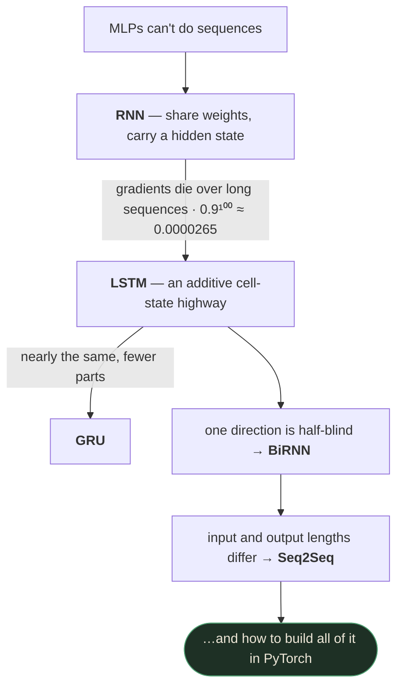
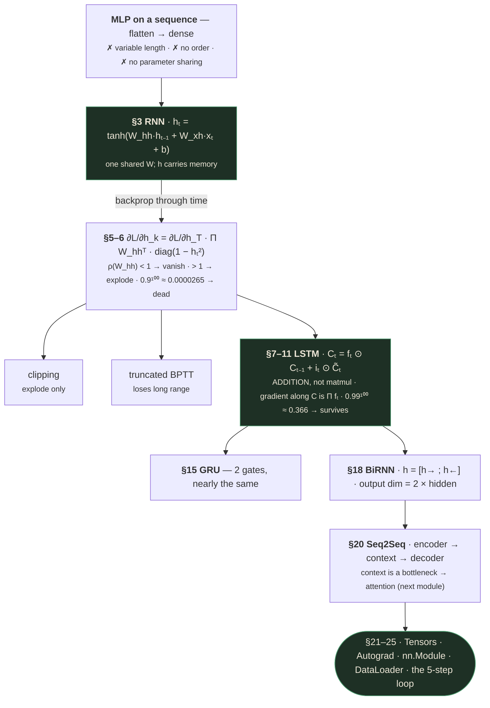
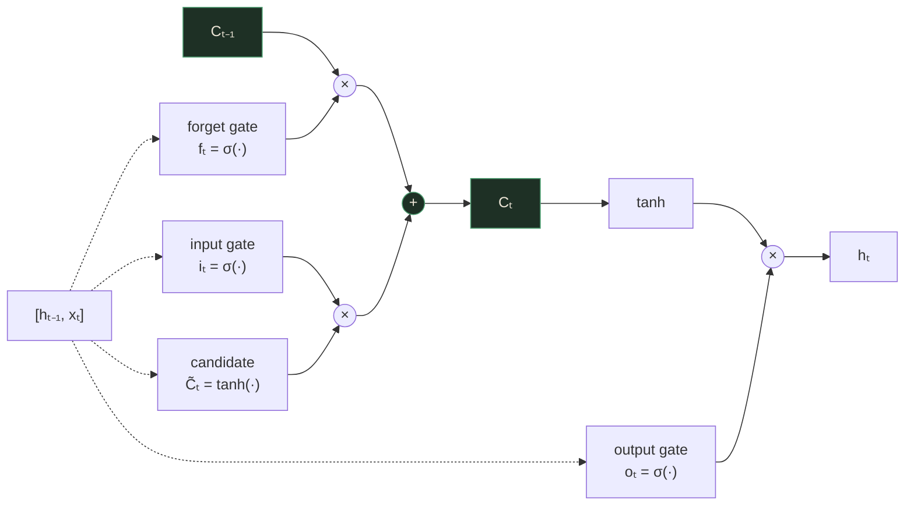
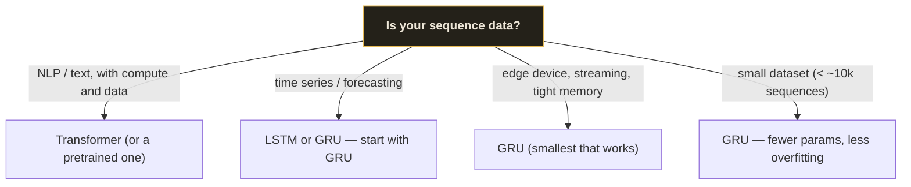
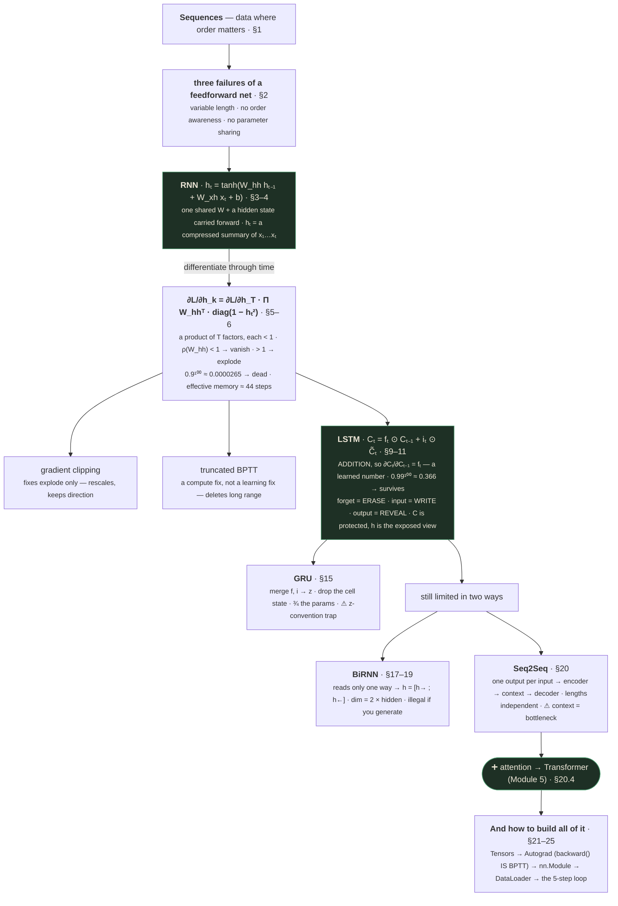

# Deep Neural Networks — Part 3
### Sequences: why feedforward networks fail on them, how gating fixes it, and how to build any of it in PyTorch

---

## 📋 About this lecture and its capture

**This lecture is not about deeper feedforward networks.** Despite the title "Deep Neural Network
Part 3", it changes subject entirely: it is the module's **recurrent-networks** lecture, followed by a
**PyTorch primer and a live hands-on demo**. If you came here looking for more CNN content, that was
Part 2.

| | Section | Runtime | Covers |
|---|---|---|---|
| **A** | Vanilla RNN and BPTT | 1:39 – 11:12 | Sequences · why MLPs fail · the RNN recurrence · vanishing gradients through time |
| **B** | LSTM and GRU | 11:25 – 25:51 | The cell state highway · three gates · equations · numeric example · GRU |
| **C** | Bidirectional RNNs | 26:21 – 30:52 | Why one direction is half-blind · BiRNN architecture · when it is illegal |
| **D** | Sequence-to-Sequence Models | 32:22 – 39:19 | Encoder–decoder · the context vector · the bottleneck |
| **E** | PyTorch Essentials | 39:30 – 43:12 | Tensors · autograd · `nn.Module` · `DataLoader` · the 5-step loop |
| **F** | Building a model in PyTorch | 43:19 – 53:42 | A live 7-step notebook, run end to end |

Reconstructed from the raw capture in `output/`, the deck contains **35 distinct slide states**, plus
roughly **10 minutes of live notebook** captured across 64 frames.

> ✅ **Capture quality: excellent — the best in this module.** The slide deck was captured
> essentially completely; every content slide has a fully-built state in the raw frames, and the
> hands-on demo was captured densely enough (64 frames over 10 minutes) that **every cell's code and
> every cell's printed output is legible**. That is why §24 below can reproduce the demo with its real
> numbers rather than describing it.
>
> Three small caveats, all minor:
>
> 1. The **"How an RNN Works" slide is a diagram, not an equation** — it shows the unrolled cells
>    processing "hello" but never writes $h_t = \tanh(\ldots)$ on screen. The recurrence *is*
>    constrained by the deck's own math slide (which shows $W_{hh}$ and the $\tanh$ derivative), so
>    §3 states the standard equation and marks it 🩹.
> 2. The **GRU slide shows only the final interpolation equation** $h_t = (1-z_t)\odot\tilde{h}_t +
>    z_t \odot h_{t-1}$, not the reset-gate or candidate equations. §15 supplies them, marked 🩹.
> 3. The demo's **final cell — a gradient-norm check — was never run on camera**. Its code is
>    legible; its output does not exist. §24 shows the code and says so.
>
> Nothing else is missing. Where I add material the deck did not cover (most importantly **attention**,
> in §20.4), it is clearly marked as an addition, not as something the lecture taught.

---

## How to read this document

The five parts build on each other in a single argument, and the argument is unusually clean:



If you are revising under time pressure: **§5–§6 and §13 are the interview core.** "Why do RNN
gradients vanish, and how exactly does LSTM fix it?" is *the* recurrent-networks question, and the
answer is a single word — **addition instead of multiplication** — that you must be able to unpack
into an equation.

Everything in a `🧪 Worked example` block should be reproducible by you on paper.

---

## What you'll understand after reading this

- You'll be able to say precisely what makes data a **sequence**, and give three reasons an MLP
  cannot handle one.
- You'll be able to write the vanilla RNN recurrence, explain what the hidden state $h_t$ actually
  contains, and say why **one** weight matrix is shared across all positions.
- You'll be able to **derive** the BPTT gradient as a product over timesteps, and explain the role of
  the spectral radius $\rho(W_{hh})$ in deciding whether it vanishes or explodes.
- You'll be able to compute how dead a gradient is after $n$ steps, and explain why $0.9^{100}$ and
  $0.99^{100}$ are the two numbers that summarise this entire lecture.
- You'll be able to write all six LSTM equations from memory, and explain each gate in terms of
  **erase / write / reveal**.
- You'll be able to work an LSTM cell update through by hand with real vectors and get the right
  answer.
- You'll be able to explain **why the additive cell-state update fixes vanishing gradients** where
  gradient clipping and truncated BPTT do not.
- You'll be able to state the GRU update, explain how it merges two of LSTM's gates into one, and
  navigate the $z$-convention trap that makes half the tutorials on the internet contradict each other.
- You'll be able to justify a BiRNN, compute its output dimension, and say exactly which tasks make
  it **illegal** rather than merely unhelpful.
- You'll be able to draw the Seq2Seq encoder–decoder, name the context vector, and explain the
  bottleneck that motivated attention.
- You'll be able to write a complete PyTorch training script from scratch — dataset, `nn.Module`,
  `DataLoader`, the 5-step loop, evaluation — and explain what every line does.
- You'll be able to predict a classifier's **initial loss** before running it, and use that as your
  first debugging check.
- You'll be able to diagnose the three most common training failures from their symptoms.

---

## Before we start: what you need to know

### Prerequisite 1 — What a sequence is, and the notation for one

> **Sequence** — an ordered list of items where the order carries meaning.
>
> *In everyday words:* a sentence is a sequence; a bag of the same words dumped on the floor is not.
>
> *Concretely:* the sentence "red running shoes" is the sequence $x_1 = $ "red", $x_2 = $ "running",
> $x_3 = $ "shoes", with length $T = 3$.
>
> *Why it exists as a concept:* almost nothing an MLP is good at is a sequence, and almost everything
> a business cares about is — text, speech, clickstreams, purchase histories, sensor readings.

**The notation used throughout this lecture:**

| Symbol | Read it as | What it means |
|---|---|---|
| $x_t$ | "x at time t" | The input at position $t$. For text, one word or character (usually as an embedding vector). |
| $T$ | "capital T" | The length of the sequence. **Varies from example to example** — that's the whole problem. |
| $h_t$ | "h at time t" | The **hidden state** after processing position $t$. The network's memory. |
| $C_t$ | "C at time t" | The **cell state** (LSTM only). A second, protected memory. |
| $h_0$ | "h zero" | The initial hidden state, usually a vector of zeros. |

Note the index $t$ is called "time" even when the sequence is not temporal. In "red running shoes",
$t=2$ is not a moment in time — it's a position. The vocabulary is inherited from speech processing
and has stuck.

### Prerequisite 2 — The product rule for gradients (recap from Part 2)

This lecture is, in a real sense, one long application of a single fact you already met in
[Part 2 §3](deep-neural-networks-02.md):

> **When gradients flow backward through $n$ stages, they get multiplied by one factor per stage. Any
> average factor other than exactly 1, raised to the power $n$, is a catastrophe.**

Part 2 applied this to *depth* — 50 stacked layers. This lecture applies it to *time* — 100 timesteps
of the same layer. The mathematics is identical; the consequence is worse, because a network only gets
so deep, while a sequence can be arbitrarily long.

$$0.9^{100} = 0.0000265 \qquad 1.1^{100} = 13{,}781$$

Two numbers, both fatal, from factors that look completely harmless.

### Prerequisite 3 — Sigmoid and tanh, and their ranges

You need these two specific facts, and this lecture leans on both constantly.

> **Sigmoid**, $\sigma(x) = \dfrac{1}{1+e^{-x}}$ — squashes any real number into $(0, 1)$.
>
> *In everyday words:* it turns "how strongly do I believe this?" into a number between 0 and 1.
>
> *Concretely:* $\sigma(0) = 0.5$, $\sigma(2) = 0.88$, $\sigma(-2) = 0.12$, $\sigma(10) = 0.99995$.
>
> *Why it matters here:* an output in $(0,1)$ is exactly what a **gate** needs — 0 means "let nothing
> through", 1 means "let everything through", and everything between is a partial opening. **Every
> gate in this lecture is a sigmoid, and that is not a coincidence.**

> **Tanh**, $\tanh(x) = \dfrac{e^x - e^{-x}}{e^x + e^{-x}}$ — squashes any real number into $(-1, +1)$.
>
> *Concretely:* $\tanh(0) = 0$, $\tanh(1) = 0.76$, $\tanh(-1) = -0.76$, $\tanh(3) = 0.995$.
>
> *Why it matters here:* an output in $(-1, +1)$ is what **content** needs — a value that can be
> positive or negative, i.e. can represent "this feature is present" *and* "this feature is
> anti-present". The deck states the division explicitly [slide 41]: *"$\sigma$ = how much (0 to 1),
> $\tanh$ = what content ($-1$ to $+1$)."* **Memorise that sentence** — it makes all six LSTM equations
> readable at a glance.

**And the derivative facts:**

$$\sigma'(x) = \sigma(x)(1 - \sigma(x)) \le 0.25 \qquad \tanh'(x) = 1 - \tanh^2(x) \le 1$$

$\tanh'$ hits its maximum of 1 only at $x = 0$ and falls off fast — at $\tanh(x) = 0.76$ the
derivative is already $1 - 0.58 = 0.42$. That decay is one of the two factors that kill RNN gradients,
and it is exactly the $\mathrm{diag}(1 - h_t^2)$ term you will see in §6.

### Prerequisite 4 — The elementwise (Hadamard) product $\odot$

> **$\odot$** — multiply two vectors **position by position**, producing a vector of the same length.
> Not a dot product (which returns one number), not a matrix product.
>
> *Concretely:* $[0.1, 0.9] \odot [0.8, -0.2] = [0.1 \times 0.8,\ 0.9 \times (-0.2)] = [0.08, -0.18]$.
>
> *Why it exists here:* it is the mathematical form of **gating**. A gate vector like $[0.1, 0.9]$
> says "let 10% of dimension 0 through, and 90% of dimension 1 through." Each memory slot is
> controlled independently. That per-dimension independence is what makes LSTM able to erase one fact
> while keeping another — and you'll see exactly that in §12's worked example.

### Prerequisite 5 — Spectral radius

> **Spectral radius** $\rho(W)$ — the largest absolute eigenvalue of a matrix $W$.
>
> *In everyday words:* the biggest amount by which repeatedly applying $W$ can stretch a vector. If
> $\rho(W) = 0.9$, then applying $W$ over and over shrinks things toward zero; if $\rho(W) = 1.1$,
> repeated application blows up.
>
> *Concretely:* for the diagonal matrix $\begin{bmatrix}0.9 & 0\\ 0 & 0.5\end{bmatrix}$ the eigenvalues
> are 0.9 and 0.5, so $\rho = 0.9$. Applying it 100 times scales the first coordinate by
> $0.9^{100} = 2.65\times10^{-5}$ and the second by $0.5^{100} \approx 10^{-30}$.
>
> *Why it matters:* it is the exact generalisation of "the factor is less than 1" from scalars to
> matrices. The slide states the criterion in these terms [slide 23], and using the phrase correctly
> in an interview signals you understand the matrix case, not just the scalar cartoon.

> 📚 **Background the slide assumed** — *eigenvalues, in one paragraph*
>
> An **eigenvector** of $W$ is a direction that $W$ does not rotate — it only stretches or shrinks it.
> The amount of stretch is the **eigenvalue**. A matrix generally has several such directions, each
> with its own eigenvalue. Repeatedly applying $W$ to a random vector, the component along the
> largest-eigenvalue direction dominates everything else, so **the largest eigenvalue determines the
> long-run behaviour**. That is why the *largest* one gets its own name.

### Prerequisite 6 — PyTorch tensor shapes, and `batch_first`

For §21–§24 you need one shape convention.

> **Tensor** — a multi-dimensional array. A scalar is 0-D, a vector 1-D, a matrix 2-D, and anything
> beyond that is just "a tensor".

For sequence models, PyTorch's RNN/LSTM/GRU modules default to shape
$(\text{seq\_len},\ \text{batch},\ \text{features})$ — **time first**, which surprises everyone. Pass
`batch_first=True` and you get $(\text{batch},\ \text{seq\_len},\ \text{features})$, which matches
every other layer in the library and is what the deck's code uses:

```python
lstm = nn.LSTM(input_size, hidden_size, batch_first=True)   # (batch, time, features)
```

> ⚠️ Getting this wrong does **not** raise an error if your batch size and sequence length happen to
> be equal — the tensor is silently transposed and your model trains on nonsense. Set
> `batch_first=True` on every recurrent module you ever create and never think about it again.

---

## The big picture

Everything you have learned in this module so far assumes **the input is a fixed-size block of numbers
that arrives all at once**. A 224×224 image is 150,528 numbers, always. A tabular row is 40 features,
always. Both Part 1's MLP and Part 2's CNN are built on that assumption.

Sequences break it in three ways at once, and the deck's "Why RNNs?" slide names all three [slide 13]:

1. **Variable length** — *"'Hi' is 2 characters. 'Please process my return for order #12345' is 40+."*
   An MLP has a fixed input size, so you must pad or truncate everything, wasting compute on the short
   ones and destroying information on the long ones.
2. **No order awareness** — *"'not bad' means 'pretty good.' 'bad not' is gibberish."* Flatten a
   sequence into a bag of features and those two are identical.
3. **No parameter sharing** — *"an MLP needs separate weights for position 1, position 2, etc."*
   Whatever the model learns about the word "not" at position 3 teaches it **nothing** about "not" at
   position 50, because those are different weights.

And the boxed answer:

> *"**RNN idea:** share ONE set of weights across all positions, and pass a hidden state forward to
> carry memory of what came before."*

**That single sentence is the entire architecture.** One weight matrix, applied at every position, plus
a memory vector that travels forward. Weight sharing solves problems 1 and 3 (the same weights work at
any position, for any length); the hidden state solves problem 2 (position $t$'s computation depends on
everything before it).

### And then the catch

The design that solves all three creates a new one. Because the same weight matrix is applied at every
step, the gradient flowing back through $T$ steps is that matrix multiplied by itself $T$ times — and
Prerequisite 2 tells you what happens to a product of $T$ nearly-identical factors. **The very weight
sharing that makes RNNs work is what makes their gradients die.**

The rest of the lecture is the response to that:

- **§7 — three responses.** Clip the gradient (helps explosion only). Truncate the backward pass (helps
  speed, loses exactly the long-range dependencies you wanted). Or change the architecture.
- **§9–§13 — LSTM changes the architecture.** It adds a second memory, the **cell state**, whose update
  is *additive* rather than multiplicative. A gradient travelling along an additive path is multiplied
  by the forget gate, not by a weight matrix and a $\tanh$ derivative. Set the forget gates near 1 and
  the gradient survives hundreds of steps.
- **§15 — GRU** does approximately the same with two gates instead of three.
- **§17–§20** then address two *representational* limits rather than optimization ones: one-directional
  reading is half-blind (BiRNN), and one-output-per-input can't translate 2 words into 3 (Seq2Seq).
- **§21–§25** hand you the tools to build any of it.

### The whole lecture in one diagram



---

# PART A — Vanilla RNN and Backpropagation Through Time

*1:39 – 11:12*

---

## 1. What is a sequence?

The deck opens with a one-line definition [slide 10, 2:36]:

> *"Data where **ORDER** matters."*

and three examples that are all Amazon systems:

| Example | The slide's words |
|---|---|
| **Product search** | *"'red running shoes' means something different from 'shoes running red'"* |
| **Customer reviews** | *"each word builds meaning on what came before"* |
| **Alexa** | *"thousands of audio frames per second, each depending on the last"* |

And the boxed key property, which is the sharpest statement of the idea in the whole deck:

> *"**Key property:** in 'red running shoes', the word 'shoes' tells you 'running' means a shoe type,
> not the action. Each element's meaning depends on context from earlier positions. RNNs give neural
> networks this ability."*

**Sit with that example, because it is doing more work than it looks.** The word "running" is
ambiguous in isolation: it could be a verb (the action) or a modifier (a category of shoe). Nothing
*about the word itself* resolves it. What resolves it is the word that comes **after**. So the meaning
of position 2 depends on position 3 — which is a dependency that a bag-of-words representation
physically cannot express, because it has thrown the positions away.

> 💡 **Notice the slide has quietly set up §17.** It says context comes "from earlier positions", but
> its own example — "shoes" disambiguating "running" — is context from a *later* position. That tension
> is exactly what Bidirectional RNNs exist to resolve, and the deck returns to it at 26:24 with a
> near-identical example ("apple laptop charger"). Spotting that the motivating example already breaks
> the stated rule is the kind of close reading that makes a lecture stick.

### Where people get confused

- **"Sequence means time series."** Time series are sequences, but so are sentences, DNA strings, and
  the sequence of pages a user visits. The requirement is *order carries meaning*, not *order is time*.
- **"Any list is a sequence."** No. A list of a customer's product categories in alphabetical order is
  a set that happens to be written down in some order; shuffling it loses nothing. If shuffling loses
  nothing, an RNN buys you nothing and you should use something simpler.

---

## 2. Why RNNs? — the three failures of a feedforward network

> *"Problems with standard feedforward networks on sequences:"* [slide 13, 4:22]

### 2.1 Variable length

> *"'Hi' is 2 characters. 'Please process my return for order #12345' is 40+. An MLP needs a fixed
> input size, so you would have to pad or truncate everything."*

An `nn.Linear(100, 64)` layer accepts exactly 100 numbers. Not 99, not 101. So to feed sentences to an
MLP you must pick a maximum length and:

- **Pad** everything shorter with zeros — wasting compute, and forcing the model to learn that a long
  tail of zeros means nothing (which it must learn from data, since nothing tells it).
- **Truncate** everything longer — throwing away the end of every long review, which is often exactly
  where the verdict is.

An RNN has no maximum length. It applies the same cell once per element and stops when the input stops.
`for t in range(len(x))` does not care that `len(x)` changed.

### 2.2 No order awareness

> *"'not bad' means 'pretty good.' 'bad not' is gibberish. If you represent text as a bag of words
> (ignoring position), an MLP cannot tell the difference. And even with positional inputs, the model
> learns nothing transferable: understanding 'not' at position 3 teaches it nothing about 'not' at
> position 50."*

Read the two halves separately, because they are two different objections:

- **First half — bag of words destroys order.** "not bad" and "bad not" have identical word counts, so
  any representation built from counts maps them to the same vector. No model, however large, can
  distinguish inputs that are literally identical.
- **Second half — and adding position doesn't fix it.** The obvious patch is to feed position as a
  feature, or to give each position its own input slot. That restores the *distinction*, but not the
  *generalisation*: the weights that process slot 3 and the weights that process slot 50 are different
  parameters, learned independently. A model that has seen "not" in slot 3 ten thousand times has
  learned nothing about slot 50.

That second point is subtler and is the one worth being able to say out loud.

### 2.3 No parameter sharing

> *"an MLP needs separate weights for position 1, position 2, etc. For long sequences this is wasteful
> and cannot generalize to unseen lengths."*

Quantify it. Suppose each word is a 300-dimensional embedding, you allow 50 positions, and your hidden
layer has 512 units:

$$\text{MLP first layer} = (50 \times 300) \times 512 = 15{,}000 \times 512 = \mathbf{7{,}680{,}000 \text{ parameters}}$$

An RNN with the same 300-dim input and 512-dim hidden state:

$$W_{xh}: 300 \times 512 = 153{,}600 \qquad W_{hh}: 512 \times 512 = 262{,}144 \qquad b: 512$$
$$\text{total} = \mathbf{416{,}256 \text{ parameters}}$$

**18× fewer parameters — and it handles a sequence of length 1000 with exactly the same weights**,
while the MLP would need a 20× bigger first layer and would still fail on length 1001.

### 2.4 The RNN idea

> *"**RNN idea:** share ONE set of weights across all positions, and pass a hidden state forward to
> carry memory of what came before."*

Two mechanisms, one sentence:

| Mechanism | Solves | How |
|---|---|---|
| **Share one weight set across all positions** | Variable length (2.1), no parameter sharing (2.3) | The same function applies at every $t$, so $T$ can be anything, and learning at one position transfers to all |
| **Pass a hidden state forward** | No order awareness (2.2) | The computation at $t$ depends on $h_{t-1}$, which depends on everything before it |

> 💡 **The comparison to make in an interview.** A CNN shares weights across **space** — the same 3×3
> kernel at every pixel (Part 2 §15). An RNN shares weights across **time** — the same cell at every
> position. They are the same idea (exploit a symmetry in the data by tying parameters) applied to two
> different symmetries: translation in space, and translation in time. That framing shows you
> understand *why* both architectures exist rather than having memorised two unrelated diagrams.

---

## 3. 🩹 How an RNN works

The slide [slide 16, 5:57] is a diagram: five RNN cells in a row, processing the string **"hello"**,
with the caption:

> *"Processing 'hello': each cell reads one character, predicts the next. Memory h accumulates
> context."*
>
> *"Same weights, applied at every timestep. Hidden state **h** carries memory forward."*
>
> and, above the diagram: *"Same weights in every cell. after seeing 'hel', $h_3$ knows enough to
> predict 'l' next"*

```svg
<svg viewBox="0 0 620 200" role="img" aria-label="An RNN unrolled over five time steps" font-family="system-ui,sans-serif">
  <style>.cell{fill:#2C2820;stroke:#8CDCA6;stroke-width:1.5}.e{stroke:#7C7361;stroke-width:1.4}
    .io{fill:#B4AA95;font-size:12px}.h{fill:#7C7361;font-size:10.5px}.note{fill:#8CDCA6;font-size:11px}</style>
  <defs><marker id="ar" markerWidth="8" markerHeight="8" refX="6" refY="3" orient="auto"><path d="M0,0L7,3L0,6z" fill="#7C7361"/></marker></defs>
  <g class="io" text-anchor="middle">
    <text x="70" y="30">"e"</text><text x="180" y="30">"l"</text><text x="290" y="30">"l"</text><text x="400" y="30">"o"</text><text x="510" y="30">"?"</text>
  </g>
  <g class="e" marker-end="url(#ar)">
    <line x1="70" y1="38" x2="70" y2="66"/><line x1="180" y1="38" x2="180" y2="66"/><line x1="290" y1="38" x2="290" y2="66"/><line x1="400" y1="38" x2="400" y2="66"/><line x1="510" y1="38" x2="510" y2="66"/>
  </g>
  <g class="cell"><rect x="40" y="70" width="60" height="46" rx="6"/><rect x="150" y="70" width="60" height="46" rx="6"/><rect x="260" y="70" width="60" height="46" rx="6"/><rect x="370" y="70" width="60" height="46" rx="6"/><rect x="480" y="70" width="60" height="46" rx="6"/></g>
  <g class="io" text-anchor="middle" font-size="11"><text x="70" y="98">RNN</text><text x="180" y="98">RNN</text><text x="290" y="98">RNN</text><text x="400" y="98">RNN</text><text x="510" y="98">RNN</text></g>
  <g class="e" marker-end="url(#ar)">
    <line x1="12" y1="93" x2="38" y2="93"/><line x1="100" y1="93" x2="148" y2="93"/><line x1="210" y1="93" x2="258" y2="93"/><line x1="320" y1="93" x2="368" y2="93"/><line x1="430" y1="93" x2="478" y2="93"/><line x1="540" y1="93" x2="574" y2="93"/>
    <line x1="70" y1="130" x2="70" y2="118"/><line x1="180" y1="130" x2="180" y2="118"/><line x1="290" y1="130" x2="290" y2="118"/><line x1="400" y1="130" x2="400" y2="118"/><line x1="510" y1="130" x2="510" y2="118"/>
  </g>
  <g class="h"><text x="6" y="90">h₀</text><text x="120" y="88">h₁</text><text x="230" y="88">h₂</text><text x="340" y="88">h₃</text><text x="450" y="88">h₄</text><text x="578" y="90">h₅</text></g>
  <g class="io" text-anchor="middle"><text x="70" y="150">"h"</text><text x="180" y="150">"e"</text><text x="290" y="150">"l"</text><text x="400" y="150">"l"</text><text x="510" y="150">"o"</text></g>
  <text class="note" x="310" y="184" text-anchor="middle">every one of these five boxes is THE SAME WEIGHTS</text>
</svg>
```

### 3.1 The recurrence

> ⚠️ **Small capture note.** This slide is a diagram; the deck never writes the recurrence equation on
> screen here. The equation below is the **standard** vanilla-RNN recurrence, and it is pinned down by
> the deck's own math slide [slide 23], which shows both $W_{hh}$ and the derivative term
> $\mathrm{diag}(1 - h_t^2)$ — and $1 - h^2$ is the derivative of $\tanh$, so the activation is
> confirmed as $\tanh$. Marked 🩹 because it is reconstructed rather than transcribed.

**What the equation says in words:** *the new memory is a squashed mixture of two things — what you
remembered a moment ago, and what you are looking at right now.*

$$h_t = \tanh\left(W_{hh}\,h_{t-1} + W_{xh}\,x_t + b_h\right)$$

$$y_t = W_{hy}\,h_t + b_y$$

| Symbol | Read it as | What it means | Shape |
|---|---|---|---|
| $h_t$ | "h at time t" | The hidden state — the network's memory after position $t$ | $(H,)$ |
| $h_{t-1}$ | "h at t minus 1" | The memory carried in from the previous step. $h_0$ is usually zeros. | $(H,)$ |
| $x_t$ | "x at time t" | The input at this position (e.g. a word embedding) | $(D,)$ |
| $W_{hh}$ | "W h h" | **The recurrent weight matrix** — how the old memory maps into the new one. The single most important object in this lecture. | $(H, H)$ |
| $W_{xh}$ | "W x h" | How the current input maps into the memory | $(H, D)$ |
| $W_{hy}$ | "W h y" | How the memory maps to an output/prediction | $(O, H)$ |
| $b_h, b_y$ | "b h", "b y" | Bias vectors | $(H,), (O,)$ |
| $\tanh$ | "tanh" | The squashing nonlinearity, keeping $h_t$ in $(-1, 1)$ | — |
| $H$ | "H" | `hidden_size`, a hyperparameter you choose (128, 256, 512…) | — |

**The single most important structural fact:** $W_{hh}$, $W_{xh}$, $W_{hy}$ and the biases have **no
subscript $t$**. There is one $W_{hh}$, not one per timestep. That is what "same weights, applied at
every timestep" means, and it is the source of both the architecture's power and its central problem.

### 3.2 What $h_t$ actually contains — unrolled

Substitute the recurrence into itself and the structure becomes visible:

$$h_1 = \tanh(W_{hh}h_0 + W_{xh}x_1 + b)$$
$$h_2 = \tanh(W_{hh}\,\underbrace{\tanh(W_{hh}h_0 + W_{xh}x_1 + b)}_{h_1} + W_{xh}x_2 + b)$$
$$h_3 = \tanh(W_{hh}\,\underbrace{\tanh(W_{hh}\tanh(\ldots) + W_{xh}x_2 + b)}_{h_2} + W_{xh}x_3 + b)$$

**Two things are now obvious that were not obvious from the diagram:**

1. $h_3$ genuinely depends on $x_1$, $x_2$ and $x_3$. It is *a compressed summary of everything seen
   so far*. That is exactly the deck's Quick Check answer in §4.
2. **$W_{hh}$ appears three times in $h_3$, nested inside three $\tanh$s.** By $h_{100}$ it appears
   one hundred times. Differentiate that and you get a product of one hundred terms — §6.

> 💡 **The reframing that makes RNNs click.** An RNN is not a new kind of network. It is a **very deep
> feedforward network in which every layer is forced to have identical weights**, and whose depth
> equals the input length. Everything you learned in Part 2 about deep networks applies here — with
> two aggravations: the depth is chosen by your *data* rather than your architecture, and you cannot
> use a different initialization or a different activation per "layer" because there is only one layer.

### 🧪 Worked example — one RNN step, entirely by hand

Take $H = 2$ (a two-dimensional memory) and $D = 2$ (two-dimensional inputs). Let:

$$W_{hh} = \begin{bmatrix} 0.5 & -0.3 \\ 0.2 & 0.8 \end{bmatrix}, \quad
W_{xh} = \begin{bmatrix} 1.0 & 0.0 \\ 0.0 & 1.0 \end{bmatrix}, \quad
b_h = \begin{bmatrix} 0 \\ 0 \end{bmatrix}, \quad
h_0 = \begin{bmatrix} 0 \\ 0 \end{bmatrix}$$

**Step 1**, with input $x_1 = [1.0,\ 0.5]$:

$$W_{hh}h_0 = \begin{bmatrix} 0 \\ 0 \end{bmatrix}, \qquad W_{xh}x_1 = \begin{bmatrix} 1.0 \\ 0.5 \end{bmatrix}$$

$$h_1 = \tanh\left(\begin{bmatrix} 1.0 \\ 0.5 \end{bmatrix}\right) = \begin{bmatrix} \tanh(1.0) \\ \tanh(0.5) \end{bmatrix} = \begin{bmatrix} \mathbf{0.7616} \\ \mathbf{0.4621} \end{bmatrix}$$

**Step 2**, with input $x_2 = [0.0,\ 1.0]$:

$$W_{hh}h_1 = \begin{bmatrix} 0.5(0.7616) + (-0.3)(0.4621) \\ 0.2(0.7616) + 0.8(0.4621) \end{bmatrix}
= \begin{bmatrix} 0.3808 - 0.1386 \\ 0.1523 + 0.3697 \end{bmatrix} = \begin{bmatrix} 0.2422 \\ 0.5220 \end{bmatrix}$$

$$W_{xh}x_2 = \begin{bmatrix} 0.0 \\ 1.0 \end{bmatrix}$$

$$h_2 = \tanh\left(\begin{bmatrix} 0.2422 \\ 1.5220 \end{bmatrix}\right) = \begin{bmatrix} \mathbf{0.2376} \\ \mathbf{0.9091} \end{bmatrix}$$

**Read what happened.** $h_2$'s first component (0.2376) is smaller than $h_1$'s (0.7616) even though
$x_2$ contributed nothing to it — the memory of $x_1$ has *already decayed* after one step, because
$W_{hh}$'s first row shrank it. Multiply that decay by a hundred steps and you have the entire problem
of this lecture, visible in two steps of arithmetic.

```python
import torch
W_hh = torch.tensor([[0.5, -0.3], [0.2, 0.8]])
W_xh = torch.eye(2)
h = torch.zeros(2)
for x in [torch.tensor([1.0, 0.5]), torch.tensor([0.0, 1.0])]:
    h = torch.tanh(W_hh @ h + W_xh @ x)
    print(h)
# tensor([0.7616, 0.4621])
# tensor([0.2376, 0.9091])
```

```interactive
type: animation
title: The unrolled RNN, processing "hello"
concept: Weight sharing across time, and how h accumulates context
control: Step through one character at a time; a toggle highlighting that the SAME W is used in every cell
observe: The hidden-state vector redrawn as a coloured bar chart after each character, plus the predicted next character
insight: Watching one bar chart mutate through five steps — with the weights visibly frozen — makes "the hidden state is a compressed summary of everything so far" concrete rather than assertive
fallback: The worked example above, which computes h1 = [0.7616, 0.4621] and h2 = [0.2376, 0.9091] by hand and shows x1's contribution already decaying after one step
```

---

## 4. 🎯 Quick check — what does $h_t$ carry?

The deck's first quiz [slide 18, 6:13]:

> **What does $h_t$ carry?**
>
> A. Only the current input
> B. A compressed summary of all inputs seen so far
> C. The exact previous input
> D. The loss gradient

<details>
<summary><b>Answer</b></summary>

**B.** The slide: *"$h_t$ is a compressed summary of $x_1, x_2, \ldots, x_t$. It accumulates
information from the entire sequence seen so far."*

**Why each wrong answer is wrong — this is the useful part:**

- **A (only the current input)** describes an MLP applied independently at each position. It is the
  thing an RNN exists to *not* be.
- **C (the exact previous input)** is a subtly attractive wrong answer, and worth understanding. $h_t$
  is a **fixed-size** vector (say 512 numbers) that must summarise a sequence of **arbitrary** length.
  So it *cannot* store anything exactly — it is a lossy compression by construction. And it is not
  restricted to $t-1$ either: $h_{t-1}$ fed into it, and $h_{t-2}$ fed into that.
- **D (the loss gradient)** confuses the forward pass with the backward pass. Gradients exist only
  during `backward()` and are stored in `.grad`, not in the hidden state.

> 💡 **The word "compressed" is the one to hold onto.** A fixed-size $h$ summarising an unbounded
> sequence means information *must* be discarded, and the network learns *what* to discard. That is
> the same observation that becomes the Seq2Seq bottleneck in §20 — where a single 512-float context
> vector must summarise an entire sentence — and the reason attention was invented.
</details>

---

## 5. Why gradients vanish

The slide [slide 20, 7:46] is the deck's best piece of exposition, and it is worth reproducing whole.
It draws eight timesteps and labels the gradient arriving at each:

| Timestep | $t$ | $t{-}1$ | $t{-}2$ | $t{-}3$ | $t{-}4$ | $t{-}5$ | $t{-}6$ | $t{-}7$ |
|---|---|---|---|---|---|---|---|---|
| Gradient | 1.000 | 0.900 | 0.810 | 0.729 | 0.656 | 0.590 | 0.531 | 0.478 |
| As a power | $0.9^0$ | $0.9^1$ | $0.9^2$ | $0.9^3$ | $0.9^4$ | $0.9^5$ | $0.9^6$ | $0.9^7$ |

> *"← gradient flows backward, shrinking 10% at each step"*
>
> *"After 100 steps: $0.9^{100} = 0.0000265$ … **gradient is DEAD**"*

And the analogy, which is the best one in the deck:

> *"Think of it like a whisper passed through 100 people. By the end, the message is gone. Each
> backward step multiplies by a factor involving $W_{hh}$ and the tanh derivative. If the combined
> effect is less than 1 at each step, the signal shrinks exponentially."*

$$\boxed{0.9^{100} = 0.0000265. \text{ The gradient is effectively zero.}}$$

### 🧪 Worked example — how far back can an RNN actually see?

The table above only goes to 7 steps, where the gradient is still a healthy 0.478. Extend it, because
the shape of the decay is the whole lesson:

| Steps back | $0.9^n$ | Interpretation |
|---|---|---|
| 1 | 0.900 | Fine |
| 5 | 0.590 | Fine |
| 10 | 0.349 | Noticeably weaker |
| 20 | 0.122 | ~8× weaker than the top |
| 50 | $5.15 \times 10^{-3}$ | Learning ~200× slower than recent steps |
| 100 | $2.65 \times 10^{-5}$ | **Dead** — the deck's number |
| 200 | $7.06 \times 10^{-10}$ | Below float32's useful resolution |

Verify the headline: $0.9^{100} = e^{100 \ln 0.9} = e^{100 \times (-0.10536)} = e^{-10.536} =
\mathbf{2.65 \times 10^{-5}}$ ✓

**Now the practical question: what counts as "too long"?** A useful rule of thumb is the number of
steps until the gradient falls to 1% of its starting value:

$$0.9^n = 0.01 \implies n = \frac{\ln 0.01}{\ln 0.9} = \frac{-4.605}{-0.10536} = \mathbf{43.7 \text{ steps}}$$

So with a per-step factor of 0.9, a vanilla RNN's **effective memory is about 44 steps**. That is
roughly one long sentence. It is nowhere near a customer's 6-month purchase history — which is exactly
the example the deck uses to open §8.

And the sensitivity to that factor is brutal:

| Per-step factor | Steps to 1% |
|---|---|
| 0.99 | **458** |
| 0.95 | 90 |
| 0.90 | 44 |
| 0.80 | 21 |
| 0.50 | 7 |

**A factor of 0.99 instead of 0.9 buys you a 10× longer memory.** Hold that thought — it is precisely
the number LSTM delivers in §13.

### The exploding side

The slide focuses on vanishing, but the same arithmetic runs the other way:

$$1.1^{100} = 13{,}781 \qquad 1.5^{100} = 4.06 \times 10^{17}$$

An exploding gradient produces `nan` within a handful of steps and is impossible to miss. **Vanishing
is the dangerous one precisely because it is silent** — the model trains, the loss goes down (the last
few timesteps learn fine), and it simply never learns anything long-range. Nothing anywhere logs an
error. This is the same asymmetry as [Part 2 §3](deep-neural-networks-02.md), and it is worth being
able to state.

```interactive
type: graph
title: Gradient decay through time
concept: Exponential decay of the BPTT product
control: A slider for the per-step factor (0.5 → 1.5) and a slider for sequence length (10 → 500)
observe: Gradient magnitude versus steps-back on a log axis, with a marker at the 1%-of-original point and a shaded "below float32 resolution" band
insight: The 1% marker moves from 7 steps to 458 steps as the factor goes 0.5 → 0.99, which makes it visceral that LSTM's contribution is exactly to move that one number
fallback: The two tables above — 0.9^n for n = 1…200, and the steps-to-1% figure for factors 0.5 through 0.99
```

---

## 6. The math behind vanishing gradients

The slide [slide 23, 9:27] gives the derivation in one line. **This is the equation to be able to
reproduce on a whiteboard.**

**What it says in words:** *to find how the loss responds to the memory at some early step $k$, you
multiply together one Jacobian per timestep between $k$ and the end — and each of those Jacobians is
the recurrent weight matrix times the tanh derivative.*

$$\frac{\partial L}{\partial h_k} = \frac{\partial L}{\partial h_T}\prod_{t=k+1}^{T}\frac{\partial h_t}{\partial h_{t-1}} = \frac{\partial L}{\partial h_T}\prod_{t=k+1}^{T} W_{hh}^{\top}\cdot\mathrm{diag}\left(1 - h_t^2\right)$$

| Symbol | Read it as | What it means |
|---|---|---|
| $\frac{\partial L}{\partial h_k}$ | "d L by d h k" | How much the loss changes if you nudge the hidden state at step $k$. **This is what has to survive.** |
| $\frac{\partial L}{\partial h_T}$ | "d L by d h T" | The gradient at the *last* step, where the loss is computed. Always healthy. |
| $\prod_{t=k+1}^{T}$ | "product from t = k+1 to T" | One factor per timestep between $k$ and the end. For $k=0, T=100$, that's **100 factors**. |
| $W_{hh}^{\top}$ | "W h h transpose" | The recurrent weight matrix, transposed (backward pass). **The same matrix every time** — that's the crux. |
| $\mathrm{diag}(1 - h_t^2)$ | "diag of one minus h squared" | A diagonal matrix of $\tanh$ derivatives, since $\frac{d}{dz}\tanh(z) = 1 - \tanh(z)^2 = 1 - h_t^2$. |

**Derive it in three steps** — this is short enough to reproduce cold:

1. **Chain rule across time.** $L$ depends on $h_T$, which depends on $h_{T-1}$, …, down to $h_k$. So
   $\frac{\partial L}{\partial h_k} = \frac{\partial L}{\partial h_T}\prod_{t=k+1}^{T}\frac{\partial h_t}{\partial h_{t-1}}$.
2. **Differentiate one link.** $h_t = \tanh(W_{hh}h_{t-1} + W_{xh}x_t + b)$. By the chain rule, the
   derivative w.r.t. $h_{t-1}$ is (tanh derivative, evaluated at the pre-activation) × (inner
   derivative $W_{hh}$). The tanh derivative applies elementwise, hence a **diagonal** matrix; and
   since $h_t = \tanh(\cdot)$, that derivative is $1 - h_t^2$.
3. **Assemble.** Each link is $\mathrm{diag}(1-h_t^2)\,W_{hh}$, transposed for the backward pass. $\blacksquare$

### 6.1 The three bullets, unpacked

> *"Each factor in the product is bounded by $\|W_{hh}\|\cdot\max(1 - h_t^2)$"*

Two multiplicative contributions per step, and **both** are usually below 1:

- $\|W_{hh}\|$ — the norm of the recurrent matrix. Standard initialization makes this modest.
- $\max(1 - h_t^2)$ — the largest possible tanh derivative. Since $h_t \in (-1, 1)$, this is at most 1,
  attained only when $h_t = 0$. As soon as the memory holds any signal at all, $h_t \ne 0$ and this
  term is strictly less than 1. At $h_t = 0.76$ it is $1 - 0.58 = 0.42$.

**So the deck's 0.9 is generous.** A network with a well-behaved $\|W_{hh}\| \approx 1$ and a hidden
state sitting around $h_t \approx 0.3$ has a per-step factor of $1 \times (1 - 0.09) = 0.91$. One with
active, saturated units at $h_t \approx 0.8$ has $1 - 0.64 = 0.36$ — and $0.36^{20}$ is
$1.3 \times 10^{-9}$. **The better the RNN is doing its job (storing strong signals), the faster its
gradients die.** That is a genuinely vicious property and a good thing to be able to point out.

> 👉 **See also.** [`Sequential Learning` §3.1](../Sequential%20Learning/sequential-learning-02.md)
> (Module 6) walks through this exact decay numerically with a fresh worked example
> ($|W_h|=0.70$, nine steps, gradient down to 4%) in the context of motivating attention over plain
> RNNs/LSTMs — the same mechanism derived here, one module later, as the reason to abandon recurrence
> rather than patch it.

> *"If spectral radius $\rho(W_{hh}) < 1$, gradients vanish exponentially"*
> *"If $\rho(W_{hh}) > 1$, gradients explode instead"*

This is the matrix version of "the factor is less than / greater than 1" (Prerequisite 5). The largest
eigenvalue governs repeated application, so $\rho(W_{hh})$ decides the fate of the product.

> ⚠️ **The tempting fix that does not work.** "Just initialize $W_{hh}$ with $\rho = 1$ exactly." People
> have tried this (it's roughly the idea behind orthogonal/identity RNN initialization, and it does
> help). Two reasons it isn't a solution:
>
> 1. **$\rho = 1$ is a knife edge.** Training moves the weights; the moment $\rho$ drifts to 0.99 or
>    1.01 you are back in exponential territory, just more slowly.
> 2. **The $\tanh$ term is still there.** Even with $\rho(W_{hh}) = 1$ exactly, the
>    $\mathrm{diag}(1-h_t^2)$ factor is below 1 whenever the state is non-zero, so the product still
>    shrinks.
>
> This is why the answer had to be architectural rather than a better initialization — and it is a
> sharp contrast with Part 2 §2, where better initialization genuinely *was* the answer for depth.

### 💼 Interview questions

- *"Why do RNN gradients vanish?"* — Write the product. Name both factors ($W_{hh}$ and the tanh
  derivative). State the spectral-radius criterion. Give the number: $0.9^{100} = 2.65\times10^{-5}$.
- *"Is this the same problem as vanishing gradients in a deep CNN?"* — Mathematically yes, structurally
  worse: in a CNN the depth is a design choice and each layer has its own weights, so per-layer fixes
  (He init, BatchNorm, skip connections) apply; in an RNN the depth is set by the data and every
  "layer" is the *same* matrix, so you cannot tune them independently.
- *"Why can't you just fix the initialization?"* — See the ⚠️ box above. Knife edge, plus the tanh term.

---

## 7. Three solutions

> [slide 26, 11:09]

| Solution | The slide's description | Verdict |
|---|---|---|
| **Gradient Clipping** | *"Cap gradient norm to a max value. Stops explosions, but doesn't fix vanishing."* | Necessary but insufficient |
| **Truncated BPTT** | *"Only backpropagate through $k$ steps. Faster, but loses long-range dependencies."* | Solves the wrong problem |
| **LSTM: The Real Fix** | *"Give gradients a highway that bypasses the multiplicative chain entirely."* | ✅ |

And the transition line into Part B:

> *"What if the gradient had a **highway** where it flows completely unchanged? That's exactly what
> LSTM does."*

### 7.1 Gradient clipping

Identical to [Part 2 §4.1](deep-neural-networks-02.md): compute the global gradient norm, and if it
exceeds a threshold, rescale everything by the same factor so the direction is preserved.

```python
loss.backward()
torch.nn.utils.clip_grad_norm_(model.parameters(), max_norm=1.0)
optimizer.step()
```

**Why it is nearly mandatory for RNNs specifically.** The exploding-gradient regime in an RNN is not
rare — the loss surface of a recurrent network has "cliffs" (Pascanu et al., 2013), regions where a
small parameter change produces an enormous loss change, because the product of $T$ matrices is
sensitive. Hitting one produces a single gigantic gradient and one step destroys the model. Clipping
turns that catastrophe into a normal step. **It is free when things are fine and decisive when they
are not, so it should be on by default in every recurrent model you train.**

But note what it cannot do: clipping only ever *reduces* a norm. A gradient of $10^{-12}$ passes
through untouched.

### 7.2 Truncated BPTT

Instead of backpropagating through all $T$ steps, backpropagate through only the last $k$ (say 20),
then detach the hidden state and carry on.

```python
h = h.detach()      # cut the graph here: the forward pass continues, the backward pass stops
```

**What you gain:** memory is $O(k)$ instead of $O(T)$, and each backward pass is fast. For a sequence
of 10,000 steps this is the difference between possible and impossible.

**What you lose is the point of the exercise.** The slide is blunt: *"loses long-range dependencies."*
If you truncate at 20 steps, no gradient ever tells the model about a dependency spanning 50 steps, so
it can never learn one. You have made the symptom (a vanishingly small gradient) into a rule (a
gradient of exactly zero) and called it a fix.

> 💡 **Say this in an interview and you will stand out:** truncated BPTT is a *compute* optimisation
> that people sometimes mistake for a *learning* fix. It makes long sequences trainable at all; it does
> not make long-range dependencies learnable. Those are different claims.

### 7.3 The setup for LSTM

The framing sentence is the one to remember:

> *"Give gradients a highway that bypasses the multiplicative chain entirely."*

Everything in Part B is an implementation of that sentence, and it is the exact same idea as ResNet's
skip connection from [Part 2 §4.4](deep-neural-networks-02.md) — **add an identity path so that the
gradient has a route that is not a product of learned matrices.** ResNet adds $x$ to $F(x)$ across
depth; LSTM adds $i_t \odot \tilde{C}_t$ to $f_t \odot C_{t-1}$ across time. Same fix, two years apart
in publication, twenty years apart in reality (LSTM 1997, ResNet 2015).

> 🎯 **That connection is a genuinely strong interview answer.** "LSTM and ResNet solve the same problem
> with the same trick, in two different directions — time and depth" demonstrates that you have
> understood the mechanism rather than memorised two architectures.

---

# PART B — LSTM and GRU

*11:25 – 25:51*

---

## 8. The long-range problem

The deck motivates LSTM with a genuinely good Amazon example [slide 30, 12:18]:

> *"Customer bought a Kindle 6 months ago, now searches for 'case'. Kindle case or phone case?"*
>
> *"The answer depends on a purchase from **6 months ago**. A vanilla RNN literally cannot learn this
> connection because the gradient has decayed to zero long before it reaches that memory."*

> *"We need an architecture where **memory can persist** for hundreds of steps without decay. That's
> LSTM."*

**Note the word "literally".** The claim is not that a vanilla RNN finds this hard, or needs more data.
It is that the learning signal connecting the outcome to the 6-month-old cause is numerically zero, so
no amount of data or training time can teach it. Put §5's arithmetic against the example: if the
customer has 500 events between the Kindle purchase and the search, the gradient reaching that purchase
is $0.9^{500} = 10^{-23}$. In float32 that is not "small", it is **exactly zero after rounding**. The
connection is not weakly learned; it is unlearnable.

> 💡 **This is the cleanest way to explain vanishing gradients to a non-specialist**, and worth
> stealing: it is not that the model *forgets*, it is that the model can never *learn* to remember,
> because the feedback that would teach it never arrives.

---

## 9. LSTM: the cell state highway

> **LSTM (Long Short-Term Memory)** — a recurrent cell with a second, protected memory channel that
> information can travel along without being multiplied by any weight matrix.
>
> *In everyday words:* a vanilla RNN rewrites its entire memory from scratch at every step. An LSTM has
> a notepad it can choose to leave alone.
>
> *Concretely:* the deck's diagram [slide 34, 16:05] draws the cell state $C$ as a **dashed horizontal
> line running straight across the top of the cell**, from $C_{t-1}$ on the left to $C_t$ on the right,
> touched by exactly two operations: one multiplication (the forget gate) and one addition (the new
> content).
>
> *Why it exists:* to give the gradient a route that is not a product of learned matrices — §7.3's
> "highway".

The slide's caption is the sentence to memorise:

> *"The cell state is a conveyor belt. Information flows unchanged unless a gate actively modifies it."*



The cell state `C` runs straight across the top: the only things that touch it are an
element-wise multiply by the forget gate and an **addition** of new content. That additive
path is why the gradient along `C` is a product of `fₜ` values — a learned number near 1 —
rather than a product of weight matrices.

### 9.1 The two states, and why there are two

This is the single most-confused point about LSTM, so take it slowly.

| | **Cell state $C_t$** | **Hidden state $h_t$** |
|---|---|---|
| Role | Long-term memory | Working output / short-term memory |
| Update | $C_t = f_t \odot C_{t-1} + i_t \odot \tilde{C}_t$ — **additive** | $h_t = o_t \odot \tanh(C_t)$ — a filtered *view* of $C$ |
| Passes through a weight matrix each step? | ❌ **No** | ✅ Yes (it's fed into the gates) |
| Passes through a $\tanh$ each step? | ❌ **No** | ✅ Yes |
| Visible outside the cell? | ❌ Internal | ✅ This is what the next layer sees |
| Gradient behaviour over $T$ steps | $\prod f_t$ — survivable | Same product-of-matrices problem as a vanilla RNN |

**The design in one sentence: $C$ is the memory you protect, $h$ is the part of it you choose to
expose.** The gradient highway is $C$, and $C$ alone. That is why the diagram draws it as a straight
line across the top while everything else happens below.

> ⚠️ **A precision point worth having.** People sometimes say "LSTM has no vanishing gradient problem."
> That's too strong. The path through $h$ still has the classic problem — it goes through weight
> matrices and $\tanh$s exactly as a vanilla RNN does. What LSTM adds is an **additional** path,
> through $C$, that does not. Gradients can take that path. So the correct statement is: *LSTM
> provides an uninterrupted gradient path, so long-range learning becomes possible; it does not delete
> the other paths.* Exactly the same caveat applies to ResNet.

---

## 10. The three gates

> *"Each gate is a sigmoid (outputs 0 to 1) that controls how much information passes through."*
> [slide 36, 17:12]

| Gate | The slide's description | What it multiplies |
|---|---|---|
| **Forget Gate** $f_t$ | *"What to **ERASE** from memory"* | The old cell state $C_{t-1}$ |
| **Input Gate** $i_t$ | *"What **NEW** info to WRITE"* | The candidate content $\tilde{C}_t$ |
| **Output Gate** $o_t$ | *"What to **REVEAL** right now"* | $\tanh(C_t)$, producing $h_t$ |

> 💡 **ERASE / WRITE / REVEAL is the mnemonic to carry into an interview.** It is better than the
> textbook names because it says what each gate *does to memory*, and it makes the fourth component
> (the candidate $\tilde{C}_t$) obviously distinct: the candidate is **what** to write; the input gate
> is **how much** of it to write.

**Why every gate is a sigmoid.** A gate's whole job is to answer "how much of this should pass?", and
that answer must live in $[0, 1]$: 0 = block completely, 1 = pass completely, 0.5 = halve it. Sigmoid
is the standard function with exactly that range. A $\tanh$ gate could output $-0.7$, which would mean
"pass a negated version of this", which is not a gate — it's a transformation. **Gates are $\sigma$
because they are valves. Content is $\tanh$ because it is information.**

**And why gates are vectors, not scalars.** $f_t$ has one number *per memory dimension*, so the cell
can erase dimension 0 while preserving dimension 1 — see §12, where exactly that happens. A scalar gate
would force an all-or-nothing choice for the entire memory and the architecture would be nearly
useless.

> 📚 **Background the deck assumed** — *"gate" is a metaphor from electronics*
>
> A gate in a circuit controls whether a signal passes. Here it is a multiplication: $g \odot v$ with
> $g$ near 0 zeroes $v$ out; with $g$ near 1 it passes $v$ through unchanged. **Crucially, the gate
> values are computed from the data** ($h_{t-1}$ and $x_t$) rather than being fixed — so the network
> learns *when* to open and close each valve, conditioned on what it is currently seeing. That is what
> makes it "learned" gating rather than a fixed decay.

---

## 11. LSTM equations

The slide [slide 41, 20:26] gives all six, prefaced by the interpretation key:

> *"$\sigma$ = how much (0 to 1), $\tanh$ = what content ($-1$ to $+1$)"*

**Forget gate — how much of the old memory to keep:**

$$f_t = \sigma\left(W_f\,[h_{t-1}, x_t] + b_f\right)$$

**Input gate and candidate — how much to write, and what to write:**

$$i_t = \sigma\left(W_i\,[h_{t-1}, x_t] + b_i\right), \qquad \tilde{C}_t = \tanh\left(W_C\,[h_{t-1}, x_t] + b_C\right)$$

**The cell state update — the boxed equation, and the heart of the architecture:**

$$\boxed{C_t = f_t \odot C_{t-1} + i_t \odot \tilde{C}_t}$$

**Output gate and hidden state — what to reveal:**

$$o_t = \sigma\left(W_o\,[h_{t-1}, x_t] + b_o\right), \qquad h_t = o_t \odot \tanh(C_t)$$

| Symbol | Read it as | What it means |
|---|---|---|
| $[h_{t-1}, x_t]$ | "h t-1 concatenated with x t" | The two vectors **stacked end to end** into one longer vector of length $H + D$. Not added, not multiplied — concatenated. |
| $W_f, W_i, W_C, W_o$ | "W f", "W i"… | Four separate weight matrices, each $(H,\ H{+}D)$. **This is why an LSTM has ~4× a vanilla RNN's parameters.** |
| $b_f, b_i, b_C, b_o$ | — | Four bias vectors, each $(H,)$ |
| $f_t, i_t, o_t$ | "f t", "i t", "o t" | Gate vectors, each in $(0,1)^H$ |
| $\tilde{C}_t$ | "C tilde t" | The **candidate** — new content proposed for memory, in $(-1,1)^H$ |
| $C_t$ | "C t" | The cell state. **Note it is NOT squashed** — no $\sigma$ or $\tanh$ wraps the boxed equation, so $C$ can grow beyond $\pm1$. That is deliberate and is discussed below. |
| $\odot$ | "elementwise product" | Prerequisite 4 |

### 11.1 Reading the boxed equation

$$C_t = \underbrace{f_t \odot C_{t-1}}_{\text{what we keep}} + \underbrace{i_t \odot \tilde{C}_t}_{\text{what we add}}$$

Four cases, all reachable because the gates are learned per-dimension:

| $f_t$ | $i_t$ | Behaviour |
|---|---|---|
| 1 | 0 | $C_t = C_{t-1}$ — **memory held perfectly**. This is the case the §14 quiz asks about. |
| 0 | 1 | $C_t = \tilde{C}_t$ — memory completely overwritten |
| 1 | 1 | $C_t = C_{t-1} + \tilde{C}_t$ — accumulate |
| 0 | 0 | $C_t = 0$ — memory wiped |

**Now compare against the vanilla RNN, because this is the entire lecture in two lines:**

$$\text{RNN: } h_t = \tanh(W_{hh}h_{t-1} + \ldots) \qquad \text{— old state goes through a matrix and a squash}$$
$$\text{LSTM: } C_t = f_t \odot C_{t-1} + \ldots \qquad\qquad\; \text{— old state is multiplied by a number in } (0,1)$$

In the RNN the old state is transformed. In the LSTM it is **scaled** — and if the scale is 1, it is
not touched at all. That is the difference between a memory that is rewritten every step and a memory
that persists.

> 💡 **Why $C$ is not squashed, and it matters.** Every other quantity here is bounded — the gates by
> $\sigma$, the candidate by $\tanh$. $C$ is not. If you wrapped the boxed equation in a $\tanh$ you
> would reintroduce exactly the derivative factor that kills vanilla RNNs, and the highway would be
> gone. The price is that $C$ can grow large over many accumulating steps; the mitigation is $h_t =
> o_t \odot \tanh(C_t)$, which squashes it **on the way out** rather than on the way through. **The
> squash is on the exit ramp, not on the highway.** That is a very good line to have ready.

### 11.2 The parameter count

Each of the four matrices is $(H,\ H+D)$ with an $(H,)$ bias, so:

$$\text{LSTM params} = 4\left[H(H + D) + H\right]$$

**Worked:** $H = 256$, $D = 300$:

$$4 \times \left[256 \times 556 + 256\right] = 4 \times [142{,}336 + 256] = 4 \times 142{,}592 = \mathbf{570{,}368}$$

The comparable vanilla RNN is $1 \times [256 \times 556 + 256] = \mathbf{142{,}592}$ — **exactly 4×
fewer**, since it has one gate-less transform instead of four.

```python
import torch.nn as nn
rnn  = nn.RNN(300, 256, batch_first=True)
lstm = nn.LSTM(300, 256, batch_first=True)
gru  = nn.GRU(300, 256, batch_first=True)
n = lambda m: sum(p.numel() for p in m.parameters())
print(n(rnn), n(lstm), n(gru))          # 142592 570368 427776
print(n(lstm)/n(rnn), n(gru)/n(rnn))    # 4.0  3.0
```

> ⚠️ PyTorch's actual count is slightly higher than the formula because it keeps **two** bias vectors
> per gate (`b_ih` and `b_hh`) for CuDNN compatibility, which is mathematically redundant — their sum
> is the single bias in the equations. The 4× and 3× ratios are exact regardless.

The slide's closing code line:

```python
# PyTorch does all 4 gates internally:
output, (h_n, c_n) = lstm(x, (h_prev, c_prev))
```

**Read the return signature, because it is the thing people get wrong:**

- `output` — the hidden state at **every** timestep, shape $(B, T, H)$. Use this for per-position tasks
  (tagging, NER, seq2seq encoders).
- `h_n` — the hidden state at the **last** timestep only, shape $(\text{layers}, B, H)$. Use this for
  whole-sequence tasks (classification).
- `c_n` — the final **cell** state, same shape. You almost never touch this except to pass it forward
  in a stateful/streaming setup.

Note `output[:, -1, :]` and `h_n[-1]` are the same tensor for a single-layer unidirectional LSTM. They
are **not** the same for a bidirectional one — see §18.3.

---

## 12. 🧪 LSTM numeric example

The deck works one cell update through with real numbers [slide 38, 18:35]. Reproduced and verified in
full, because this is the best hands-on artefact in the lecture.

**Setup.** A 2-dimensional cell state. Think of dimension 0 as a "country" slot and dimension 1 as
something else the network is tracking.

> *"Cell state holds old memory $[0.8, -0.2]$. New input: **"France"**"*

**Step 1 — the forget gate decides what to erase.**

> *"Forget gate: `f = [0.1, 0.9]` (erase country slot, keep other)"*
>
> *"`f * C_prev = [0.1*0.8, 0.9*(-0.2)] = [0.08, -0.18]`"*

Verify: $0.1 \times 0.8 = 0.08$ ✓ and $0.9 \times (-0.2) = -0.18$ ✓

**Read what this means, per dimension:**
- Dimension 0: $f = 0.1$ → keep only 10% of the old value. **The old country is being erased** to make
  room for "France".
- Dimension 1: $f = 0.9$ → keep 90%. **Whatever this dimension tracks is preserved.**

**This is the whole argument for per-dimension gates in one line of arithmetic.** A scalar forget gate
would have had to erase both or keep both.

**Step 2 — the input gate and candidate decide what to write.**

> *"Input gate + candidate: `i = [0.95, 0.1]`, `C_tilde = [0.9, 0.0]`"*
>
> *"`i * C_tilde = [0.855, 0.0]`"*

Verify: $0.95 \times 0.9 = 0.855$ ✓ and $0.1 \times 0.0 = 0.0$ ✓

- Dimension 0: the candidate proposes 0.9 (an encoding of "France"), and the input gate is wide open at
  0.95, so 0.855 gets written.
- Dimension 1: the candidate proposes nothing (0.0) and the gate is nearly shut (0.1) anyway. Nothing
  is written.

**Step 3 — the cell update.**

> *"Cell update: `C_new = [0.08, -0.18] + [0.855, 0.0] = [0.935, -0.18]`"*
>
> *"'France' is now stored in dimension 0!"*

Verify: $0.08 + 0.855 = \mathbf{0.935}$ ✓ and $-0.18 + 0.0 = \mathbf{-0.18}$ ✓

### What the three numbers tell you

| Dimension | Before | After | What happened |
|---|---|---|---|
| 0 (country slot) | 0.8 | **0.935** | Old value erased (×0.1), new value written (+0.855) — a **replacement** |
| 1 (other) | −0.2 | **−0.18** | Kept at 90%, nothing added — a near-perfect **hold** |

**Two lessons that are worth more than the arithmetic:**

1. **Erase and write are independent operations on independent dimensions.** The cell replaced one
   fact while holding another, in a single step, with no interference. A vanilla RNN cannot do this:
   its single $\tanh(W_{hh}h_{t-1} + \ldots)$ mixes every dimension of the old state into every
   dimension of the new one.
2. **Dimension 1 shows the highway working.** It went from $-0.2$ to $-0.18$ — a 10% decay, because
   this cell chose $f = 0.9$. **If the network had learned $f = 1.0$, it would still be exactly
   $-0.2$ after a thousand steps.** That is the property §13 turns into a gradient argument.

```python
import torch
C_prev  = torch.tensor([0.8, -0.2])
f       = torch.tensor([0.1,  0.9])
i       = torch.tensor([0.95, 0.1])
C_tilde = torch.tensor([0.9,  0.0])

C_new = f * C_prev + i * C_tilde
print(f * C_prev)      # tensor([ 0.0800, -0.1800])
print(i * C_tilde)     # tensor([0.8550, 0.0000])
print(C_new)           # tensor([ 0.9350, -0.1800])

# and what the cell would expose, with an output gate o = [0.8, 0.5]:
o = torch.tensor([0.8, 0.5])
print(o * torch.tanh(C_new))    # tensor([ 0.5863, -0.0891])
```

```interactive
type: simulator
title: One LSTM cell, gate by gate
concept: How the three gates independently erase, write and reveal
control: Three sliders per dimension (f, i, o) and a slider for the candidate value; a "step" button that advances time
observe: The cell state as two bars, redrawn after each step, with the forget/write contributions shown as separate stacked segments; plus the exposed h_t below
insight: Setting f = 1 and i = 0 on one dimension and stepping fifty times shows that value sitting perfectly still — which is the thing a vanilla RNN cannot do at any setting
fallback: The worked example above: [0.8, -0.2] with f = [0.1, 0.9], i = [0.95, 0.1], C̃ = [0.9, 0.0] gives [0.935, -0.18] — one dimension replaced, one held
```

---

## 13. Why LSTM fixes vanishing gradients

**This is the most important slide in the lecture** [slide 43, 21:34], and it makes its case with two
numbers:

> **Vanilla RNN:** gradient $= 0.9^{100} = 0.0000265$
>
> **LSTM cell state:** gradient $\approx 0.99^{100} = 0.366$

> *"The gradient along the cell state is $\prod f_t$ (product of forget gate values). If the forget
> gates average around 0.99, the signal survives. **No matrix multiplication, no tanh derivative on
> this path.**"*

### 13.1 Derive the claim

Differentiate the cell-state update with respect to the previous cell state. Treating the gates as
approximately constant with respect to $C_{t-1}$ (they depend on $h_{t-1}$, not on $C_{t-1}$ directly —
this is the standard simplification and it is a fair one):

$$C_t = f_t \odot C_{t-1} + i_t \odot \tilde{C}_t \implies \frac{\partial C_t}{\partial C_{t-1}} = f_t$$

Chain it across $T$ steps:

$$\frac{\partial C_T}{\partial C_k} = \prod_{t=k+1}^{T} f_t$$

**Compare to the vanilla RNN's product from §6:**

$$\text{RNN: } \prod_{t} W_{hh}^{\top}\cdot\mathrm{diag}(1 - h_t^2) \qquad\qquad \text{LSTM: } \prod_{t} f_t$$

| | Vanilla RNN | LSTM cell state |
|---|---|---|
| Each factor is | a **matrix** times a $\tanh$ derivative | a **number in $(0,1)$**, per dimension |
| Set by | the learned weights and the current activations | **a learned gate, computed fresh at each step** |
| Can the network control it? | Only indirectly, and it must trade this off against representational needs | **Directly. Raising $f$ toward 1 is the gate's only job.** |
| Can it be exactly 1? | No — $\mathrm{diag}(1-h_t^2) < 1$ whenever $h \ne 0$ | **Yes** — $\sigma$ approaches 1 for a large enough pre-activation |

**The last row is the fix.** The RNN's shrinkage is a *structural consequence* of using a squashing
nonlinearity; nothing the network can learn removes it. The LSTM's shrinkage is a *decision*, and if
the task requires long memory, gradient descent will push the forget gate's bias up until $f \approx 1$
and the decay stops. **The architecture converted an unavoidable property into a learnable parameter.**

> 👉 **See also.** This additive $\prod f_t$ trick is the same one Part 2 §17.3 used for depth (skip
> connections give $\prod(F_i'+I) \to I$) applied instead to time — and it is not the final answer:
> [`Sequential Learning` §3](../Sequential%20Learning/sequential-learning-02.md) (Module 6) shows that
> even a well-gated LSTM still decays over long enough sequences, which is the actual motivation for
> replacing the recurrent product with attention's direct, per-pair connections in
> [`GenAI & LLM`](../GenAI%20&%20LLM/) (Module 5).

### 🧪 Worked example — the two numbers, and what they buy

**Vanilla RNN**, factor 0.9 over 100 steps:

$$0.9^{100} = e^{100\ln 0.9} = e^{-10.536} = \mathbf{2.65\times10^{-5}}$$

**LSTM**, forget gates averaging 0.99:

$$0.99^{100} = e^{100\ln 0.99} = e^{100 \times (-0.01005)} = e^{-1.005} = \mathbf{0.366}$$

**The ratio:** $\dfrac{0.366}{2.65\times10^{-5}} = \mathbf{13{,}800\times}$ more gradient at step 1.

Extend it to see what the architecture actually bought:

| Steps | Vanilla ($0.9^n$) | LSTM ($0.99^n$) | LSTM, $f = 0.999$ |
|---|---|---|---|
| 10 | 0.349 | 0.904 | 0.990 |
| 50 | $5.15\times10^{-3}$ | 0.605 | 0.951 |
| 100 | $2.65\times10^{-5}$ | **0.366** | 0.905 |
| 500 | $1.3\times10^{-23}$ | $6.6\times10^{-3}$ | 0.607 |
| 1000 | $\approx 0$ | $4.3\times10^{-5}$ | **0.368** |

Read the last column. **With forget gates at 0.999, an LSTM at 1000 steps has the same gradient health
a vanilla RNN has at 100** — and the vanilla RNN's gradient at 100 was already the deck's example of
"dead". Two more nines of forget gate buy you an order of magnitude of memory.

And the deck's Kindle example, quantified: 500 events between purchase and search.

- Vanilla RNN: $0.9^{500} = 1.3\times10^{-23}$ — zero in float32. Unlearnable.
- LSTM with $f = 0.99$: $0.99^{500} = 6.6\times10^{-3}$ — small but **finite and above float32
  resolution**. Learnable, given enough examples.

```python
for f in (0.9, 0.99, 0.999):
    print(f, [f"{f**n:.3g}" for n in (10, 50, 100, 500, 1000)])
# 0.9   ['0.349', '0.00515', '2.66e-05', '1.32e-23', '1.75e-46']
# 0.99  ['0.904', '0.605',   '0.366',    '0.00657',  '4.32e-05']
# 0.999 ['0.990', '0.951',   '0.905',    '0.606',    '0.368']
```

### 13.2 The bias trick that follows from this

> 📚 **Background the slide didn't cover, and it is genuinely useful.** At initialization, $b_f = 0$
> gives $f_t \approx \sigma(\text{something near } 0) \approx 0.5$, so the memory halves every step and
> $0.5^{20} = 10^{-6}$ — the LSTM starts out as bad as a vanilla RNN and has to *learn* its way to long
> memory before it can learn anything long-range, which is a chicken-and-egg problem.
>
> The standard fix is to **initialize the forget-gate bias to 1 or 2**, so $\sigma(1) = 0.73$ or
> $\sigma(2) = 0.88$ at step zero and the cell starts out biased toward remembering. Jozefowicz et al.
> (2015) found this to be one of the highest-value single changes to LSTM training.
>
> ```python
> for name, param in lstm.named_parameters():
>     if 'bias' in name:
>         n = param.size(0)
>         param.data[n//4 : n//2].fill_(1.0)   # PyTorch packs gates as [i, f, g, o]
> ```
>
> ⚠️ The slice depends on PyTorch's internal gate ordering (input, forget, cell, output), so the forget
> gate is the **second** quarter. Verify against the current docs before relying on it.

### 💼 Interview questions

- *"How does LSTM solve vanishing gradients?"* — The cell-state update is **additive**, so the gradient
  along it is $\prod f_t$ rather than a product of weight matrices and tanh derivatives. Since $f_t$ is
  a learned sigmoid, the network can set it near 1. Give the numbers: $0.9^{100} = 2.65\times10^{-5}$
  versus $0.99^{100} = 0.366$.
- *"Does LSTM eliminate the problem entirely?"* — No. The path through $h_t$ still has it. LSTM adds an
  *additional* clean path; it doesn't remove the dirty ones. Same caveat as ResNet.
- *"What if the forget gate learns 0.5?"* — Then the LSTM is no better than a vanilla RNN over long
  ranges, which is exactly why forget-bias initialization matters.

---

## 14. 🎯 Quick check — a frozen cell state

The deck's second quiz [slide 54, 26:21]:

> **If the forget gate outputs exactly 1.0 everywhere and the input gate outputs exactly 0.0
> everywhere, what happens to the cell state?**
>
> A. Cell state resets to zero
> B. Cell state copies the input
> C. Cell state stays frozen (unchanged forever)
> D. Cell state oscillates

<details>
<summary><b>Answer</b></summary>

**C.** The slide: *"$C_t = 1\cdot C_{t-1} + 0\cdot\tilde{C}_t = C_{t-1}$. Cell state is frozen forever.
**Perfect memory, but useless since no new info enters.**"*

Substitute directly into the boxed equation:

$$C_t = f_t \odot C_{t-1} + i_t \odot \tilde{C}_t = 1 \odot C_{t-1} + 0 \odot \tilde{C}_t = C_{t-1}$$

**Why this question is better than it first appears.** It is not testing whether you can substitute two
numbers. It is testing whether you understand that the LSTM's gates define a **spectrum of behaviours**,
and that the two extremes are both degenerate:

| Configuration | Result | Verdict |
|---|---|---|
| $f = 1, i = 0$ | Perfect infinite memory | **Useless** — learns nothing new, ever |
| $f = 0, i = 1$ | Pure overwrite each step | **Useless** — this is a memoryless feedforward net |
| Learned, per-dimension, per-timestep | Some dimensions hold, others update | **The point of the architecture** |

The second half of the slide's answer — *"but useless since no new info enters"* — is what separates a
good answer from a correct one. Say both halves.

**The follow-up to be ready for:** *"So is $f = 1$ what you want?"* No — you want the network to be
*able* to reach $f \approx 1$ **on the dimensions where long memory matters**, while keeping other
dimensions free to update. Per-dimension gating (§12) is what makes that possible, and it is why the
gates are vectors.
</details>

---

## 15. 🩹 GRU: simplified LSTM

> *"Merges the forget and input gates into one 'update' gate. **2 gates total instead of LSTM's 3.**
> Fewer parameters, often similar performance."* [slide 48, 23:24]

| Gate | The slide's description |
|---|---|
| **Reset Gate** $r_t$ | *"Controls how much past to consider"* |
| **Update Gate** $z_t$ | *"Interpolates between old and new (like a slider)"* |

The boxed equation:

$$\boxed{h_t = (1 - z_t)\odot\tilde{h}_t + z_t \odot h_{t-1}}$$

with the crucial annotation:

> *"$z$ near 1 = keep old state, $z$ near 0 = adopt new candidate **(PyTorch convention)**"*

### 15.1 The two ideas GRU merges

**Idea 1 — one gate instead of two.** In LSTM, $f_t$ and $i_t$ are independent: the cell can erase
without writing, or write without erasing. GRU ties them: $z_t$ controls how much old state to keep,
and $(1-z_t)$ is automatically how much new to write. **You give up one degree of freedom and save a
gate.** The intuition is that "forget the old" and "write the new" are usually two sides of one
decision, so tying them costs little.

**Idea 2 — one state instead of two.** GRU has no separate cell state. Its $h_t$ plays both roles. That
removes the output gate too — there is no separate "how much to reveal" decision, because there is
nothing hidden to reveal.

$$\text{LSTM: } f, i, o + \tilde{C}, \text{ two states} \quad \longrightarrow \quad \text{GRU: } r, z + \tilde{h}, \text{ one state}$$

### 15.2 🩹 The equations the slide didn't show

> ⚠️ The slide shows only the interpolation. The reset gate, update gate and candidate equations below
> are the standard GRU definition (Cho et al., 2014), written in **PyTorch's convention** to match the
> slide's boxed equation. Marked 🩹.

$$r_t = \sigma\left(W_r\,[h_{t-1}, x_t] + b_r\right)$$
$$z_t = \sigma\left(W_z\,[h_{t-1}, x_t] + b_z\right)$$
$$\tilde{h}_t = \tanh\left(W_h\,[\,r_t \odot h_{t-1},\ x_t] + b_h\right)$$
$$h_t = (1 - z_t)\odot\tilde{h}_t + z_t \odot h_{t-1}$$

| Symbol | Read it as | What it means |
|---|---|---|
| $r_t$ | "r t" | **Reset gate.** Note *where* it appears: inside the candidate, multiplying $h_{t-1}$. It controls how much of the past the candidate is even allowed to see. $r \approx 0$ means "propose a new state as if the past didn't exist." |
| $z_t$ | "z t" | **Update gate.** The interpolation slider between old state and new candidate. |
| $\tilde{h}_t$ | "h tilde t" | The candidate new state. |

**Note the structural difference between the two gates**, which is the thing to actually understand:
$z_t$ acts on the *output* (mixing old and new), while $r_t$ acts on the *input to the candidate*
(deciding what the proposal is allowed to depend on). They are not two versions of the same thing.

### 15.3 ⚠️ The convention trap — read this before you read any tutorial

The deck flags it explicitly, and it is worth the flag.

| | **PyTorch (and this deck)** | **Cho et al. 2014 (the original paper)** |
|---|---|---|
| Equation | $h_t = (1-z_t)\tilde{h}_t + z_t h_{t-1}$ | $h_t = (1-z_t)h_{t-1} + z_t\tilde{h}_t$ |
| $z \to 1$ means | **keep the old state** | **take the new candidate** |
| $z \to 0$ means | take the new candidate | keep the old state |

**They are the same model** — the two differ only by relabelling $z \leftrightarrow 1-z$, which the
network absorbs by learning a sign-flipped $W_z$. But they read as opposites, and half the blog posts
on the internet use one while the other half use the other, usually without saying which.

> 💡 **Practical rule: never memorise "z near 1 means X". Memorise the structural fact that $z$ is an
> interpolation slider, and read off which end is which from whichever equation is in front of you.**
> In an interview, saying "PyTorch's convention has $z$ as the keep-gate; the original paper has it the
> other way round, so I always check the equation" is a stronger answer than confidently asserting
> either one.

### 15.4 Parameters, and the code

GRU has three weight matrices ($W_r$, $W_z$, $W_h$) to LSTM's four:

$$\text{GRU params} = 3\left[H(H+D) + H\right] \qquad \text{i.e. } \tfrac{3}{4}\text{ of an LSTM, } 3\times \text{ a vanilla RNN}$$

With $H = 256$, $D = 300$: $3 \times 142{,}592 = \mathbf{427{,}776}$ — matching the code output in §11.2.

The slide's code:

```python
# PyTorch GRU is identical in API:
gru = nn.GRU(input_size, hidden_size, batch_first=True)
output, h_n = gru(x, h_prev)
```

**Spot the one API difference from LSTM:** GRU returns `output, h_n` — a **two**-tuple, because there
is no cell state. LSTM returns `output, (h_n, c_n)`. Swapping `nn.LSTM` for `nn.GRU` in existing code
and forgetting to change the unpacking is an extremely common five-minute bug.

---

## 16. When to use what

> [slide 50, 24:36]

| | The slide's guidance |
|---|---|
| **LSTM** | *"Best for long sequences. Most parameters."* |
| **GRU** | *"Faster, fewer params, similar performance on many tasks."* |
| **Modern Default** | *"For new projects, consider newer architectures. **LSTM/GRU still dominate time-series and edge deployment.**"* |

### 16.1 Reading the third row honestly

That third bullet is doing something unusual for a course deck: it is telling you that the thing it
just taught you is **not** the first thing to reach for on a new NLP project. That is correct and
worth saying plainly.

**What replaced them, and where:**

| Domain | Current default | Why |
|---|---|---|
| NLP / text | **Transformers.** Attention removes the sequential dependency entirely, so training parallelises across the sequence, and the path between any two positions is length 1 instead of $O(T)$. | Both a modelling win and a hardware win |
| Speech | Transformers and conformers, largely | Same reasons |
| **Time series** | **LSTM/GRU are still extremely competitive** | Series are often long but low-dimensional, data is often modest, and Transformers' quadratic attention cost is punishing |
| **Edge / embedded** | **LSTM/GRU still dominate** | Constant memory per step, small parameter count, and inference is $O(T)$ not $O(T^2)$ |

> 💡 **The property that keeps recurrent models alive: constant memory per step.** An LSTM processing a
> stream holds one $h$ and one $C$, regardless of how much has come before. A Transformer must hold a
> KV cache that grows with sequence length. For a device with 256 KB of RAM processing a sensor stream
> that never ends, that is not a tuning difference — it is the difference between feasible and
> impossible.

> 🔬 **Research opportunity.** The recurrent-vs-attention question reopened around 2023–2024 with
> **state-space models** — S4, and then **Mamba** (Gu & Dao, 2023) — which are recurrent at inference
> (constant memory per step, like an LSTM) but parallelisable at training (like a Transformer), and
> which are competitive with Transformers on language at moderate scale. ⚠️ This is a fast-moving area
> and well beyond this deck; mention it as "the recurrent idea came back with a training story
> attached", not as settled. It is a strong answer to "where do you think sequence modelling is going?"

### 16.2 The decision rule



**And when you have chosen recurrent, LSTM vs GRU:** start with **GRU** (fewer parameters, faster,
usually equal), and switch to LSTM only if you have evidence that very long-range memory is the
bottleneck. The literature has never produced a decisive winner — Chung et al. (2014) compared them
carefully and concluded it is task-dependent — so treat it as a hyperparameter, not a principle.

---

# PART C — Bidirectional RNNs

*26:21 – 30:52*

---

## 17. The problem with one direction

Everything so far reads left to right. The deck now points out that this is a real limitation, using a
search query [slide 59, 28:36]:

> **Search query: "apple laptop charger"**
>
> - *"Is 'apple' the fruit or the brand? A left-to-right RNN at 'apple' has seen **no right context**.
>   It is guessing, not understanding."*
> - *"'laptop charger' resolves the ambiguity completely. The context was to the right the whole time.
>   Natural language is full of this: 'bank' in 'river bank account' vs 'river bank erosion'."*
> - *"For any task that labels each position (NER, tagging, query understanding), a forward-only RNN is
>   always half-blind. You need **both directions**."*

**Trace it concretely.** A forward RNN processing "apple laptop charger":

| $t$ | Word | $h_t$ has seen | Can it classify "apple"? |
|---|---|---|---|
| 1 | apple | {apple} | ❌ No information at all |
| 2 | laptop | {apple, laptop} | ✅ Now it could — but $h_1$ was already emitted |
| 3 | charger | {apple, laptop, charger} | ✅ Certain |

**The problem is not that the information is absent — it is that it arrives too late.** By the time the
network knows "apple" is a brand, it has already produced $h_1$ and, for a tagging task, already
labelled it. The evidence was in the sentence the whole time, sitting one position to the right.

> 💡 **Note the callback.** §1's opening example was "red running shoes", where *"the word 'shoes' tells
> you 'running' means a shoe type"* — disambiguation by a **later** word. The deck framed sequences as
> "context from earlier positions" and then immediately gave an example that violated it. §17 is where
> it pays that off. That structure — introduce a rule, quietly show a counterexample, resolve it fifteen
> minutes later — is deliberate and worth noticing.

The "bank" example is the classic linguistic one: *river bank account* vs *river bank erosion*. Same
first three words, opposite meanings, and the disambiguating word is last.

---

## 18. BiRNN architecture

> *"Two separate RNNs, independent weights. Forward reads left to right, backward reads right to left.
> At each position, concatenate both hidden states."* [slide 62, 30:49]

$$\boxed{h_t = \left[\overrightarrow{h_t}\ ;\ \overleftarrow{h_t}\right] \qquad \text{output dimension: } 2 \times \text{hidden\_size}}$$

The deck's diagram, with the annotation *"At 'apple': backward RNN already knows 'laptop charger' →
BRAND!"*:

```svg
<svg viewBox="0 0 560 220" role="img" aria-label="Bidirectional RNN" font-family="system-ui,sans-serif">
  <style>.f{fill:#2C2820;stroke:#8CDCA6;stroke-width:1.4}.b{fill:#2C2820;stroke:#93B0D6;stroke-width:1.4}
    .e{stroke:#7C7361;stroke-width:1.3}.t{fill:#B4AA95;font-size:11px}.lab{fill:#7C7361;font-size:11px}.note{fill:#8CDCA6;font-size:11px}</style>
  <defs><marker id="r" markerWidth="8" markerHeight="8" refX="6" refY="3" orient="auto"><path d="M0,0L7,3L0,6z" fill="#7C7361"/></marker></defs>
  <text class="lab" x="6" y="42">forward →</text>
  <g class="f"><rect x="90" y="26" width="70" height="34" rx="5"/><rect x="220" y="26" width="70" height="34" rx="5"/><rect x="350" y="26" width="70" height="34" rx="5"/><rect x="480" y="26" width="60" height="34" rx="5"/></g>
  <g class="e" marker-end="url(#r)"><line x1="160" y1="43" x2="218" y2="43"/><line x1="290" y1="43" x2="348" y2="43"/><line x1="420" y1="43" x2="478" y2="43"/></g>
  <g class="t" text-anchor="middle"><text x="125" y="47">h1→</text><text x="255" y="47">h2→</text><text x="385" y="47">h3→</text><text x="510" y="47">h4→</text></g>
  <text class="lab" x="6" y="104">backward ←</text>
  <g class="b"><rect x="90" y="88" width="70" height="34" rx="5"/><rect x="220" y="88" width="70" height="34" rx="5"/><rect x="350" y="88" width="70" height="34" rx="5"/><rect x="480" y="88" width="60" height="34" rx="5"/></g>
  <g class="e" marker-end="url(#r)"><line x1="220" y1="105" x2="162" y2="105"/><line x1="350" y1="105" x2="292" y2="105"/><line x1="480" y1="105" x2="422" y2="105"/></g>
  <g class="t" text-anchor="middle"><text x="125" y="109">h1←</text><text x="255" y="109">h2←</text><text x="385" y="109">h3←</text><text x="510" y="109">h4←</text></g>
  <g class="t" text-anchor="middle"><text x="125" y="150">"apple"</text><text x="255" y="150">"laptop"</text><text x="385" y="150">"charger"</text><text x="510" y="150">"usb-c"</text></g>
  <text class="note" x="280" y="188" text-anchor="middle">h = [h→ ; h←] — at position 1, h← has already read laptop, charger, usb-c</text>
</svg>
```

| Symbol | Read it as | What it means |
|---|---|---|
| $\overrightarrow{h_t}$ | "h forward at t" | The forward RNN's state — summarises $x_1 \ldots x_t$ |
| $\overleftarrow{h_t}$ | "h backward at t" | The backward RNN's state — summarises $x_T \ldots x_t$ |
| $[\,\cdot\ ;\ \cdot\,]$ | "concatenate" | Stack the two vectors end to end. **Not added, not averaged.** |
| $h_t$ | — | The combined representation, of length $2H$ |

### 18.1 The three facts to get right

**1. Two *separate* RNNs with independent weights.** Not one RNN run twice. The forward and backward
directions learn different parameters, because reading text forwards and backwards are genuinely
different tasks. A BiLSTM therefore has **exactly 2× the parameters** of the equivalent unidirectional
LSTM.

**2. The backward RNN is not "the gradient".** This confuses people. Backpropagation already flows
backward through a forward RNN — that's BPTT. The backward RNN here is a second *forward pass* that
happens to consume the sequence in reverse order. Both RNNs are then trained by ordinary
backpropagation.

**3. Concatenation, not summation.** $[\overrightarrow{h_t}; \overleftarrow{h_t}]$ keeps both
representations intact and lets the next layer weight them however it likes. Adding them would force
the two directions into the same coordinate system and destroy information for free.

### 18.2 🧪 Worked example — the shapes, which is where the bugs live

Build a NER tagger: 300-dim embeddings, hidden size 256, 9 entity tags, batch of 32 sentences of
length 20.

```python
import torch, torch.nn as nn

emb  = nn.Embedding(vocab_size, 300)
lstm = nn.LSTM(300, 256, batch_first=True, bidirectional=True)
head = nn.Linear(2 * 256, 9)     # <-- the 2 * is the entire point

x = torch.randint(0, vocab_size, (32, 20))
e = emb(x)                          # (32, 20, 300)
out, (h_n, c_n) = lstm(e)
print(out.shape)                    # torch.Size([32, 20, 512])   <- 2 x 256
print(h_n.shape)                    # torch.Size([2, 32, 256])    <- 2 directions
logits = head(out)                  # (32, 20, 9)
```

**Parameters, counted:**

$$\text{unidirectional LSTM} = 4[256(256+300) + 256] = \mathbf{570{,}368}$$
$$\text{bidirectional} = 2 \times 570{,}368 = \mathbf{1{,}140{,}736}$$
$$\text{classifier head} = 512 \times 9 + 9 = \mathbf{4{,}617}$$

> ⚠️ **The bug this causes, verbatim from the slide:** *"Just remember the output dimension doubles, so
> downstream layers must accept `2 * hidden_size`."* Writing `nn.Linear(256, 9)` after a bidirectional
> LSTM raises `RuntimeError: mat1 and mat2 shapes cannot be multiplied (640x512 and 256x9)`. That
> error message is genuinely helpful once you know to look for the doubled dimension — the 512 in it is
> your BiLSTM.

### 18.3 The `h_n` subtlety

For a **unidirectional** LSTM, `output[:, -1, :]` and `h_n[-1]` are the same vector.

For a **bidirectional** one they are not, and getting this wrong is a silent bug rather than a crash:

- `h_n` has shape $(2, B, H)$ — `h_n[0]` is the forward direction's state at the **last** timestep,
  `h_n[1]` is the backward direction's state at the **first** timestep. Both are "the end of that
  direction's pass".
- `output[:, -1, :]` has shape $(B, 2H)$ and is $[\overrightarrow{h_T};\ \overleftarrow{h_T}]$ — the
  forward state at the end (good) concatenated with the backward state at the **end**, which is the
  backward RNN having seen only the last token (nearly useless).

**For sequence classification with a BiLSTM, the correct whole-sequence summary is:**

```python
seq_repr = torch.cat([h_n[0], h_n[1]], dim=1)   # (B, 2H) — both directions fully read
```

Using `output[:, -1, :]` instead trains fine and scores slightly worse, forever, with no error. That is
the worst kind of bug and it is worth knowing about.

---

## 19. When NOT to use a BiRNN

The slide is refreshingly clear that this is a hard constraint, not a preference [slide 65, 33:31]:

> **Cannot Use (future does not exist yet)**
> *"Text generation, autocomplete, streaming speech recognition. The backward RNN needs to read what
> comes next, but in generative tasks you are creating it word by word."*

> **CAN Use (full sequence available before prediction)**
> *"Sentiment analysis, Named Entity Recognition, machine translation encoder, query understanding. Any
> task where the complete input is in hand before making decisions."*

> **PyTorch:** `nn.LSTM(bidirectional=True)`. *"One flag. Just remember the output dimension doubles,
> so downstream layers must accept `2 * hidden_size`."*

### 19.1 The test that decides it

**Ask one question: at the moment you need the prediction, does the rest of the input already exist?**

| Task | Full input available? | BiRNN? |
|---|---|---|
| Sentiment of a submitted review | ✅ Yes — the whole review is in the database | ✅ Yes |
| NER over a search query | ✅ Yes — the user pressed enter | ✅ Yes |
| Translating a submitted sentence (**encoder**) | ✅ Yes | ✅ Yes |
| Translating a sentence (**decoder**) | ❌ No — you are generating the output | ❌ **Never** |
| Autocomplete as the user types | ❌ No — that's the whole task | ❌ **Never** |
| Next-word language modelling | ❌ No | ❌ **Never** |
| Streaming speech recognition (live captions) | ❌ No | ❌ **Never** |
| Offline transcription of a recorded file | ✅ Yes — the file is complete | ✅ Yes |

**Notice the last two rows.** Speech recognition appears on both sides. It is not the *domain* that
decides, it is whether the input is complete when you must answer. Same model, same data type, opposite
verdict — that's a good thing to point out, because it shows you're applying the test rather than
memorising a list.

> ⚠️ **"Cannot" means it leaks the answer, not that it runs slowly.** If you train a bidirectional
> language model to predict token $t$, the backward RNN has already read token $t$ — so the model can
> achieve a perfect training loss by simply copying it. Your training curve looks spectacular, your
> generation is gibberish, and nothing errors. This is **label leakage** through the architecture, and
> it is the single most instructive way to understand why the constraint is hard.
>
> This is also precisely why **BERT** — which is bidirectional and *is* a language model — has to use
> **masked** language modelling: it hides the target token before letting the bidirectional encoder see
> the sentence. Understanding §19 is understanding why BERT's training objective looks the way it does,
> and that connection is worth a lot in an interview.

---

# PART D — Sequence-to-Sequence Models

*32:22 – 39:19*

---

## 20. The encoder–decoder architecture

The final architectural limit. RNNs so far emit **one output per input step**. Some tasks fundamentally
don't work that way [slide 72, 39:30]:

> *"**Problem:** input and output lengths are independent. 'I agree' (2 words) becomes 'Je suis
> d'accord' (3 words). A standard RNN outputs one thing per input step and cannot handle this
> mismatch."*


### 20.1 The three components

> *"**Encoder:** reads the entire input, produces no output, builds up a final hidden state called the
> **context vector**. One vector representing the entire input meaning."*

> *"**Decoder:** starts from the context vector and generates output one token at a time. Each output
> feeds back as input to produce the next. Stops when it generates a stop token."*

> *"**Bottleneck:** 512 floats must carry the entire meaning of the input. For short sentences this
> works. For 50+ words, quality drops sharply. Like describing a painting through a keyhole."*

| Component | Job | Key property |
|---|---|---|
| **Encoder** | Read the whole source, emit nothing | Its **final hidden state** is the only thing that survives |
| **Context vector** | Carry the entire input's meaning | **Fixed size**, regardless of input length. This is the flaw. |
| **Decoder** | Generate the target, one token at a time | **Autoregressive** — its own output at step $t$ is its input at $t{+}1$ |

**The decoupling is the point.** Because the encoder produces no per-step output and the decoder takes
no per-step input, the two lengths are completely independent. 2 words in, 3 words out, or 50 in and 4
out. Nothing in the architecture ties them.

> 📚 **Background the slide assumed** — *autoregressive generation and the stop token*
>
> "Each output feeds back as input to produce the next" is the definition of **autoregressive**
> generation, and it has two consequences the slide doesn't spell out:
>
> 1. **Generation is inherently sequential.** You cannot compute token 5 until you have token 4. This
>    is why LLM inference is slow in a way training is not — and it is the same property that makes
>    Transformers parallel during *training* (all targets known) and serial during *inference*.
> 2. **You need a way to stop.** The decoder emits a special `<EOS>` (end of sequence) token, and
>    generation halts when it does. Without it, generation never terminates. In practice you also cap
>    the length, because a badly-trained decoder can loop forever.
>
> There is also a training/inference mismatch worth knowing: during training you usually feed the
> decoder the **true** previous token rather than its own prediction — **teacher forcing** — because
> otherwise one early mistake corrupts the whole sequence and learning never gets started. But then at
> inference it must consume its own (sometimes wrong) outputs, a distribution it never saw in training.
> That gap is called **exposure bias**. ⚠️ Beyond this deck; know the term.

### 20.2 🧪 Worked example — sizing the bottleneck

The slide says *"512 floats must carry the entire meaning of the input."* Put numbers on how tight that
is.

**A 50-word English sentence.** With a 30,000-word vocabulary, the information content of one word
position is at most $\log_2(30{,}000) = 14.9$ bits, so 50 words is at most $50 \times 14.9 = 745$ bits
— and far less in practice, since language is highly predictable.

**The context vector.** 512 float32 numbers = $512 \times 32 = 16{,}384$ bits of raw capacity.

So on a naive count the vector has ~22× more capacity than the sentence needs, and the bottleneck
shouldn't exist. **It exists anyway** — and understanding why is the interesting part:

1. **Floats aren't used efficiently.** The representation is continuous and learned, not a code
   designed for capacity. Most of those 32 bits per dimension carry no usable information — small
   perturbations must not change the meaning, or training would be impossible.
2. **The encoder must compress *before knowing what the decoder will need*.** It writes the summary
   once, then the decoder asks 50 different questions of it. A summary optimised for the average
   question serves each specific question badly.
3. **Recency wins.** The encoder is an RNN, so its final state is disproportionately influenced by the
   last few tokens (§5's decay, now working against you at the representation level rather than the
   gradient level). Early source words are systematically underrepresented.

Empirically the degradation is sharp and well documented: fixed-context Seq2Seq translation quality
falls off steeply beyond ~30 tokens. The slide's *"For 50+ words, quality drops sharply"* is accurate.

> 💡 **The keyhole analogy is worth keeping.** *"Like describing a painting through a keyhole"* — you
> can see it all eventually, but only a little at a time, and you must produce your whole description
> from one glance.

### 20.3 What Seq2Seq is used for

| Task | Input | Output |
|---|---|---|
| Machine translation | Source sentence | Target sentence |
| Summarisation | Document | Summary |
| Question answering (generative) | Question + context | Answer |
| Speech recognition | Audio frames | Text |
| Code generation | Natural-language description | Code |
| **Product title normalisation** | Seller's raw title | Clean canonical title |

That last one is the Amazon-flavoured one and it is a genuine production problem: sellers write
"BRAND NEW!!! iphone 13 case shockproof ⭐⭐⭐⭐⭐ FAST SHIP" and the catalogue needs "iPhone 13 Shockproof
Case". Input and output lengths are unrelated, so it is a Seq2Seq problem.

### 20.4 ➕ What comes next — attention

> ➕ **This section is an addition, not deck content.** The deck ends Part D at the bottleneck and does
> not mention attention. But the bottleneck slide is *exactly* the motivating slide for attention in
> every treatment of this material, and leaving the story unfinished would be a disservice. Everything
> below is standard and well-established; none of it is attributed to the lecture.

The bottleneck's cause is precise: **the decoder gets one fixed vector, computed before the decoder
knew what it would need.** So the fix is equally precise: let the decoder look back at *all* the
encoder states, and choose which ones to weight at each output step.

$$\text{context}_i = \sum_{j=1}^{T} \alpha_{ij}\, h_j \qquad \text{where } \sum_j \alpha_{ij} = 1$$

| Symbol | Read it as | What it means |
|---|---|---|
| $h_j$ | "h j" | The encoder's hidden state at **source** position $j$ — all of them are kept, not just the last |
| $\alpha_{ij}$ | "alpha i j" | How much output step $i$ attends to input position $j$. Learned, and computed fresh for every $i$. |
| $\text{context}_i$ | — | A **different** context vector for every output step |

Three things change, and each maps onto one of §20.2's three causes:

1. **No fixed-size bottleneck** — the decoder sees all $T$ encoder states, so capacity grows with input
   length. (Fixes cause 1.)
2. **The summary is computed per output step, after the decoder knows what it's producing.** (Fixes
   cause 2 — the crucial one.)
3. **Every source position is one step away** from every output position, so there is no recency decay
   and no long multiplicative chain between them. (Fixes cause 3, *and* the vanishing-gradient problem
   from §5, in one stroke.)

Bahdanau et al. (2015) introduced this for translation. Vaswani et al. (2017) then observed that if
attention solves the long-range problem on its own, **the recurrence is no longer needed at all** —
hence "Attention Is All You Need", and the Transformer. **The lecture you are reading ends one step
before that door.** Module 5 (`../GenAI & LLM/`) walks through it.

> 🎯 **This is the single best "what would you do next?" answer for this lecture.** Asked "how would you
> improve a Seq2Seq model?", the strong answer is not "make it bigger" — it is *"the fixed context
> vector is the bottleneck; I'd add attention so the decoder builds a fresh context per output step
> from all encoder states, which also removes the long-range gradient path."* That answer shows you
> understand the flaw's mechanism, not just its name.

---

# PART E — PyTorch Essentials

*39:30 – 43:12*

The deck now switches from theory to tooling, and it is organised around exactly four objects. That
framing is worth keeping: **almost every PyTorch script you will ever write is these four things plus a
five-line loop.**

---

## 21. Tensors and Autograd

> [slide 76, 40:57]

> **Tensors** — *"Like NumPy arrays, but they can run on GPU and every operation is tracked in a
> computation graph. PyTorch records how each tensor was created so it can compute gradients later."*

> **Autograd** — *"When you call `loss.backward()`, PyTorch walks backward through the computation
> graph and computes the gradient of the loss with respect to every parameter. You never write gradient
> code yourself. For an LSTM with all its gates, that is an enormous amount of calculus handled
> automatically."*

> *"This is also where Backpropagation Through Time happens. `loss.backward()` unrolls the RNN across
> all timesteps and sends gradients backward through each one."*

### 21.1 What "tracked in a computation graph" means

Every operation on a tensor with `requires_grad=True` does **two** things: it computes the result, and
it records how the result was made. The recording is a node in a graph — the graph you met in
[Part 1 §11](deep-neural-networks-01.md).

```python
import torch

x = torch.tensor([2.0], requires_grad=True)
y = x ** 2                 # y = 4, and y REMEMBERS it came from squaring x
z = 3 * y                  # z = 12, and z REMEMBERS it came from 3*y

print(y.grad_fn)           # <PowBackward0 object at ...>   <- the recording
print(z.grad_fn)           # <MulBackward0 object at ...>

z.backward()               # walk the graph backwards
print(x.grad)              # tensor([12.])
```

**Verify that 12 by hand**, because doing it once makes autograd stop being magic:
$z = 3y = 3x^2$, so $\frac{dz}{dx} = 6x$, and at $x = 2$ that is $\mathbf{12}$ ✓.

**Three facts that follow from "the graph is built as you go":**

1. **The graph is dynamic** — rebuilt on every forward pass. So you can use `if`, `for` and `while` in
   your model and the graph follows. That is exactly why an RNN loop over a variable-length sequence
   works with no special machinery: the graph is simply longer this time.
2. **`.grad` accumulates.** Calling `backward()` twice *adds* the gradients rather than replacing them.
   This is why step 1 of the training loop is `zero_grad()` — see §23.
3. **The graph is freed after `backward()`.** Calling `backward()` a second time on the same graph
   raises an error unless you passed `retain_graph=True`. This surprises people writing custom
   multi-loss training.

### 21.2 The BPTT connection — the slide's best line

> *"`loss.backward()` unrolls the RNN across all timesteps and sends gradients backward through each
> one."*

**This is where §6's equation becomes a line of code.** You derived
$\frac{\partial L}{\partial h_k} = \frac{\partial L}{\partial h_T}\prod_t W_{hh}^{\top}\mathrm{diag}(1-h_t^2)$
by hand. `loss.backward()` computes exactly that product — because the forward loop built a graph node
per timestep, and walking it backward multiplies the per-step Jacobians in order.

```python
lstm = nn.LSTM(10, 20, batch_first=True)
x = torch.randn(4, 100, 10)          # batch 4, 100 TIMESTEPS
out, _ = lstm(x)
loss = out.sum()
loss.backward()                       # one call → 100 steps of BPTT, automatically
```

**There is no `bptt=True` flag.** BPTT is not a separate algorithm you enable — it is ordinary
backpropagation applied to a graph that happens to be 100 nodes long in the time direction. Being able
to say that sentence is a good sign you understand both.

> 💡 **And it tells you where the memory goes.** The graph holds every intermediate activation for every
> timestep, so a 1000-step sequence stores 1000 sets of hidden states for the backward pass. This is
> why long sequences run out of GPU memory long before they run out of compute, and it is the concrete
> reason **truncated BPTT** (§7.2) exists — `h.detach()` cuts the graph and lets the earlier
> activations be freed.

### 21.3 The three tensor operations you actually use

```python
# 1. Move to GPU — the reason tensors exist rather than NumPy arrays
device = 'cuda' if torch.cuda.is_available() else 'cpu'
x = x.to(device); model = model.to(device)     # BOTH, or you get a device mismatch error

# 2. Turn tracking off — for inference. Saves memory and time.
with torch.no_grad():
    preds = model(x)

# 3. Detach — take a value out of the graph
h = h.detach()                # truncated BPTT
value = loss.item()           # tensor -> Python float, for logging
```

> ⚠️ **The logging memory leak, and it is extremely common.** Writing
> `total_loss += loss` instead of `total_loss += loss.item()` keeps the entire computation graph alive
> for every batch of the epoch, because `total_loss` holds a reference to a graph node. Memory climbs
> steadily and you OOM at epoch 3 with no obvious cause. The demo in §24 does it correctly —
> `total_loss += loss.item()` — and that single `.item()` is worth noticing.

---

## 22. nn.Module and DataLoader

> [slide 78, 41:45]

> **nn.Module** — *"Every model inherits from `nn.Module`. It tracks all learnable parameters, lets you
> switch between training and eval mode, move to GPU with one call, and save/load weights."*

> **DataLoader** — *"Groups your dataset into mini-batches and shuffles between epochs. Mini-batch
> training is more stable than single examples and faster than full dataset. You set batch size and it
> handles the rest."*

### 22.1 What `nn.Module` gives you, concretely

The slide lists four capabilities. Here is each as the line of code it buys:

| Capability | The line it enables | What breaks without it |
|---|---|---|
| Tracks learnable parameters | `optimizer = Adam(model.parameters())` | You'd have to hand-collect every weight tensor |
| Train/eval mode | `model.train()` / `model.eval()` | Dropout and BatchNorm behave wrongly at inference ([Part 2 §6.4](deep-neural-networks-02.md)) |
| Move to GPU in one call | `model.to('cuda')` | You'd move each tensor individually and miss one |
| Save/load | `torch.save(model.state_dict(), 'm.pt')` | No checkpointing, so no early stopping |

**How the tracking actually works, because it explains a real bug:** `nn.Module` overrides
`__setattr__`. When you write `self.layer1 = nn.Linear(...)` inside `__init__`, the module intercepts
the assignment and registers that submodule. That's why `model.parameters()` knows about it.

> ⚠️ **The bug this causes.** Put layers in a plain Python list and they are **invisible** to
> `.parameters()`, so the optimizer never updates them and they silently stay at their random
> initialization forever. No error is raised.
>
> ```python
> self.layers = [nn.Linear(10, 10) for _ in range(3)]        # ❌ INVISIBLE
> self.layers = nn.ModuleList([nn.Linear(10, 10) for _ in range(3)])   # ✅
> ```
>
> The tell is a parameter count that is lower than you expect — which is exactly why the demo's Step 7
> (§24.7) prints one.

### 22.2 Why mini-batches — the slide's claim, justified

> *"Mini-batch training is more stable than single examples and faster than full dataset."*

Both halves are true and for different reasons:

| Approach | Batch size | Gradient quality | Speed |
|---|---|---|---|
| **Full batch** | All $N$ | Exact gradient, minimal noise | ❌ One update per pass over all data — glacial |
| **Single example (SGD)** | 1 | Extremely noisy | ❌ No parallelism — the GPU sits idle |
| **Mini-batch** | 32–256 | Noise $\propto 1/\sqrt{B}$ — enough to escape sharp minima, little enough to be a usable direction | ✅ Saturates the GPU |

The "more stable than single examples" half is the $1/\sqrt{B}$ variance reduction. The "faster than
full dataset" half is not about arithmetic — a full-batch pass does the *same* total arithmetic as
$N/B$ mini-batches — it is that you get $N/B$ **parameter updates** for that arithmetic instead of one.
Progress per unit compute is what matters, and mini-batching multiplies it by $N/B$.

> 💡 And a third benefit the slide doesn't mention: **the noise is a regulariser.** A noisy gradient
> cannot settle into a sharp minimum, which connects straight back to [Part 2 §9](deep-neural-networks-02.md).
> That is part of why very large batches sometimes generalise *worse* despite computing a better
> gradient — Keskar et al. (2017)'s result.

```python
from torch.utils.data import TensorDataset, DataLoader

loader = DataLoader(TensorDataset(X, Y),
                    batch_size=32,
                    shuffle=True,      # reshuffles every epoch — matters, see below
                    num_workers=4,     # parallel loading; 0 on Windows notebooks
                    drop_last=False)   # keep the final partial batch
```

> ⚠️ **`shuffle=True` is not cosmetic.** If your data is sorted by label (all class 0, then all class 1,
> …), unshuffled mini-batches are single-class, and the model's best move for each batch is to predict
> that one class. The loss oscillates violently and learning is terrible. **The deck's own "Common
> Issues" slide (§25) lists "Data not shuffled" as a cause of "Loss not decreasing"** — this is the
> mechanism behind that bullet.

---

## 23. The 5-step training loop

> *"All four pieces come together in this loop. **Every PyTorch project uses these exact steps:**"*
> [slide 80, 43:09]

| # | Step | Code | The slide's note |
|---|---|---|---|
| 1 | **Zero gradients** | `optimizer.zero_grad()` | *"clear old gradients so they do not accumulate"* |
| 2 | **Forward pass** | `logits = model(x)` | *"feed data through the model, computation graph is built"* |
| 3 | **Compute loss** | `loss = criterion(logits, y)` | *"how wrong are the predictions"* |
| 4 | **Backward pass** | `loss.backward()` | *"autograd computes all gradients"* |
| 5 | **Update weights** | `optimizer.step()` | *"Adam adjusts every parameter"* |

```python
for epoch in range(num_epochs):
    for batch_x, batch_y in train_loader:
        optimizer.zero_grad()                    # 1
        logits = model(batch_x)                  # 2
        loss   = criterion(logits, batch_y)      # 3
        loss.backward()                          # 4
        optimizer.step()                         # 5
```

**Five lines. That is the whole of supervised deep learning.** Everything else — architectures, losses,
schedulers, augmentation — is a substitution inside one of these five slots.

### 23.1 Why the order is exactly this, step by step

**Why `zero_grad()` first, and what happens without it.** PyTorch *accumulates* gradients into `.grad`
rather than overwriting them (§21.1). Skip step 1 and batch 2's gradient is added to batch 1's, batch
3's to that, and so on — so by batch 50 you are stepping in the direction of the *sum of 50 gradients*,
an effective learning rate 50× too large. The symptom is a loss that starts fine and then explodes,
which looks exactly like too high a learning rate and gets debugged in the wrong place. This is
[Part 1 §16.2](deep-neural-networks-01.md)'s bug.

> 💡 **And why accumulation is the default rather than a bug:** it enables **gradient accumulation** —
> simulating a large batch on small hardware by running $k$ forward/backward passes before one
> `step()`. That is how people fine-tune large models on one GPU, and it only works because PyTorch
> accumulates.
> ```python
> for i, (bx, by) in enumerate(loader):
>     loss = criterion(model(bx), by) / k     # scale so the sum averages correctly
>     loss.backward()                          # accumulate
>     if (i + 1) % k == 0:
>         optimizer.step(); optimizer.zero_grad()
> ```

**Why 4 before 5.** `optimizer.step()` reads `.grad`. Call it before `backward()` and `.grad` is either
`None` or stale, so you either crash or take last batch's step. Non-negotiable ordering.

**Where clipping goes.** Between 4 and 5, exactly as §7.1 said:

```python
loss.backward()                                              # 4
torch.nn.utils.clip_grad_norm_(model.parameters(), 1.0)      # 4.5 — essential for RNNs
optimizer.step()                                             # 5
```

---

# PART F — Building and training a model in PyTorch

*43:19 – 53:42*

---

## 24. 🧪 The hands-on demo, walked through with real numbers

The instructor runs a notebook — `handson_demo.ipynb`, VS Code, `demo_env (Python 3.9.6)`, PyTorch
2.0.0, CUDA unavailable (running on CPU) — building a classifier end to end in seven steps.

> *"In this notebook, we build a simple MLP (feedforward neural network) classifier from scratch using
> PyTorch. We will use all four PyTorch building blocks: Tensors, Autograd, nn.Module, and
> DataLoader."*

**Every number below is read off the notebook's actual printed output.** This is the most valuable part
of the lecture to have written down, because it gives you a complete, verified, runnable reference.

### 24.1 Step 1 — Import and setup

```python
import torch
import torch.nn as nn
import torch.nn.functional as F
from torch.utils.data import DataLoader, TensorDataset

print(f"PyTorch version: {torch.__version__}")
print(f"CUDA available: {torch.cuda.is_available()}")
```

**Output:**
```
PyTorch version: 2.0.0
CUDA available: False
```

That's the entire import surface for a standard project: `torch`, `nn`, `functional`, and two data
utilities.

### 24.2 Step 2 — Create a classification dataset

```python
n_samples = 300
n_features = 4
n_classes = 3

# Class 0: centered at [2, 2, 2, 2]
X0 = torch.randn(n_samples, n_features) + torch.tensor([2.0, 2.0, 2.0, 2.0])
# Class 1: centered at [-2, -2, 2, -2]
X1 = torch.randn(n_samples, n_features) + torch.tensor([-2.0, -2.0, 2.0, -2.0])
# Class 2: centered at [0, 0, -3, 0]
X2 = torch.randn(n_samples, n_features) + torch.tensor([0.0, 0.0, -3.0, 0.0])

X = torch.cat([X0, X1, X2], dim=0)
Y = torch.cat([torch.zeros(n_samples), torch.ones(n_samples),
               torch.full((n_samples,), 2)]).long()

# Shuffle
perm = torch.randperm(len(X))
X, Y = X[perm], Y[perm]

# Split into train and test
train_X, test_X = X[:700], X[700:]
train_Y, test_Y = Y[:700], Y[700:]
```

**Output:**
```
Training samples: 700
Test samples: 200
Input shape: torch.Size([700, 4])
Number of classes: 3

First 3 samples:
  X=[-1.5942308902740479, -1.7489540576934814, 2.1281542778015137, -2.198028802871704], Y=1
  X=[-2.795389175415039, -3.121321201324463, 2.8579769134521484, -3.6933250427246094], Y=1
  X=[-3.3461239337921143, -2.0536985397338867, 0.9177147150039673, -1.6818056106567383], Y=1
```

**Four things worth reading off this cell:**

1. **$3 \times 300 = 900$ samples, split 700/200.** ✓ The split is a plain slice *after* shuffling —
   which is why the shuffle line matters. Slicing before shuffling would have put all of class 2 in the
   test set.
2. **The classes are well-separated Gaussian blobs.** Class 0 centred at $[2,2,2,2]$ and class 1 at
   $[-2,-2,2,-2]$ are 4 units apart in three of four dimensions, with unit variance. That is a very easy
   problem — and it is deliberately easy, so the demo demonstrates the *mechanics* rather than the
   difficulty.
3. **Verify a printed sample.** The first sample is $[-1.59, -1.75, 2.13, -2.20]$ with $Y = 1$. Class
   1's centre is $[-2, -2, 2, -2]$ — every coordinate is within about 0.4 of it. ✓ Consistent.
4. **`.long()` on the labels is required, not stylistic.** `nn.CrossEntropyLoss` demands integer class
   indices of dtype `int64`. Pass floats and you get
   `RuntimeError: expected scalar type Long but found Float`.

> 💡 **Note there is no `torch.manual_seed()`.** The numbers above are from *this* run and will differ
> on yours. For anything you intend to compare against a baseline, seed it — otherwise you cannot tell
> a real improvement from run-to-run variance.

### 24.3 Step 3 — Define the model (`nn.Module`)

> *"A simple 2-layer MLP with ReLU activation."*

```python
class SimpleClassifier(nn.Module):
    def __init__(self, input_dim, hidden_dim, num_classes):
        super().__init__()
        self.layer1 = nn.Linear(input_dim, hidden_dim)
        self.relu = nn.ReLU()
        self.layer2 = nn.Linear(hidden_dim, num_classes)

    def forward(self, x):
        x = self.relu(self.layer1(x))   # Linear + ReLU
        return self.layer2(x)            # Output scores for each class

model = SimpleClassifier(input_dim=4, hidden_dim=32, num_classes=3)
print(model)
print(f"\nTotal parameters: {sum(p.numel() for p in model.parameters()):,}")
```

**Output:**
```
SimpleClassifier(
  (layer1): Linear(in_features=4, out_features=32, bias=True)
  (relu): ReLU()
  (layer2): Linear(in_features=32, out_features=3, bias=True)
)

Total parameters: 259
```

**Verify the 259 by hand** — do this, because it is the fastest sanity check you will ever run on a
model:

| Parameter | Shape | Count |
|---|---|---|
| `layer1.weight` | $(32, 4)$ | $32 \times 4 = 128$ |
| `layer1.bias` | $(32,)$ | 32 |
| `layer2.weight` | $(3, 32)$ | $3 \times 32 = 96$ |
| `layer2.bias` | $(3,)$ | 3 |
| **Total** | | $128 + 32 + 96 + 3 = \mathbf{259}$ ✓ |

Matching the notebook's Step 7 output exactly (§24.7).

**Three things this class demonstrates that are worth naming:**

1. **`super().__init__()` is mandatory.** It runs `nn.Module`'s constructor, which sets up the internal
   dictionaries that make parameter tracking work. Omit it and you get
   `AttributeError: cannot assign module before Module.__init__() call`.
2. **`self.relu = nn.ReLU()` is a stylistic choice, not a requirement.** ReLU has no parameters, so
   `F.relu(x)` in `forward` is equivalent. Registering it as a module makes it show up in `print(model)`
   — which is why the printed architecture above is legible.
3. **`forward` returns raw scores, not probabilities.** No softmax. This is the single most important
   convention in PyTorch classification, and §24.4 explains why.

### 24.4 Step 4 — DataLoader, optimizer, loss

> *"DataLoader handles batching. Adam optimizer updates weights. CrossEntropyLoss measures how wrong we
> are."*

```python
# DataLoader: batches of 32, shuffled each epoch
train_loader = DataLoader(
    TensorDataset(train_X, train_Y),
    batch_size=32,
    shuffle=True
)

# Optimizer: Adam with learning rate 0.01
optimizer = torch.optim.Adam(model.parameters(), lr=0.01)

# Loss function: Cross Entropy for classification
criterion = nn.CrossEntropyLoss()

print(f"Batches per epoch: {len(train_loader)}")
print(f"Expected initial loss: ln({n_classes}) = {torch.log(torch.tensor(float(n_classes))):.2f}")
```

**Output:**
```
Batches per epoch: 22
Expected initial loss: ln(3) = 1.10
```

**Verify both numbers.**

**Batches per epoch:** $\lceil 700 / 32 \rceil = \lceil 21.875 \rceil = \mathbf{22}$ ✓ — 21 full
batches of 32 (=672) plus one partial batch of 28. (`drop_last` defaults to `False`, so the remainder
is kept.)

**Expected initial loss:** $\ln(3) = \mathbf{1.0986} \approx 1.10$ ✓

> 💡 **This `ln(K)` line is the most useful debugging trick in the entire lecture, and it is easy to
> miss because it's one print statement.**
>
> Before training, an untrained network's outputs are essentially random, so softmax gives roughly
> uniform probabilities: $1/K$ for each of $K$ classes. Cross-entropy is $-\ln(p_{\text{true}})$, so:
>
> $$L_{\text{initial}} \approx -\ln\left(\tfrac{1}{K}\right) = \ln K$$
>
> | Classes $K$ | Expected initial loss |
> |---|---|
> | 2 | $\ln 2 = 0.693$ |
> | 3 | $\ln 3 = 1.099$ |
> | 10 | $\ln 10 = 2.303$ |
> | 1000 (ImageNet) | $\ln 1000 = 6.908$ |
>
> **How to use it:** print your loss before the first `step()` and compare.
>
> - Loss $\approx \ln K$ → your data pipeline, model and loss are wired together correctly. ✅
> - Loss **much higher** (say 15 when you expected 2.3) → the model is *confidently wrong*, which means
>   the outputs are large and the labels don't match them. Suspect shuffled/misaligned labels, wrong
>   class indexing, or an unintended softmax before the loss.
> - Loss **much lower** → you are leaking the label into the input.
>
> This one check catches a large fraction of "my model won't train" problems in thirty seconds, before
> you have burned an hour on the learning rate. [Part 1 §13.4](deep-neural-networks-01.md) covers the
> same idea.

> ⚠️ **`nn.CrossEntropyLoss` applies `log_softmax` internally.** So your model must output **raw
> logits** — as `SimpleClassifier` does. Adding `nn.Softmax(dim=1)` to the end of `forward` applies
> softmax *twice*, which flattens the distribution, shrinks the gradients toward zero, and produces a
> model that trains very slowly to a mediocre place with **no error message anywhere**.
> [Part 1 §8](deep-neural-networks-01.md) works through exactly this bug with numbers. It is one of the
> two or three most common PyTorch mistakes in existence.

**And a note on `lr=0.01`:** that is 30× larger than Adam's usual default of `3e-4`. It works here
because the problem is trivial (well-separated blobs, 259 parameters) — and you can see the consequence
in §24.5, where the model reaches 100% accuracy by epoch 5. On a real problem, `lr=0.01` with Adam
usually diverges. Don't copy it out of context.

### 24.5 Step 5 — The training loop (the 5 steps, live)

```python
print("Training...\n")

for epoch in range(20):
    total_loss = 0
    correct = 0
    total = 0

    for batch_x, batch_y in train_loader:
        # ==== THE 5-STEP LOOP ====
        optimizer.zero_grad()                  # 1. Zero gradients
        logits = model(batch_x)                # 2. Forward pass
        loss = criterion(logits, batch_y)      # 3. Compute loss
        loss.backward()                        # 4. Backward (autograd)
        optimizer.step()                       # 5. Update weights

        # Track metrics
        total_loss += loss.item()
        predictions = logits.argmax(dim=1)
        correct += (predictions == batch_y).sum().item()
        total += len(batch_y)

    avg_loss = total_loss / len(train_loader)
    accuracy = 100 * correct / total

    if (epoch + 1) % 5 == 0 or epoch == 0:
        print(f"Epoch {epoch+1:3d}: loss = {avg_loss:.3f}, accuracy = {accuracy:.1f}%")
```

**Output:**
```
Training...

Epoch   1: loss = 0.311, accuracy = 91.4%
Epoch   5: loss = 0.005, accuracy = 100.0%
Epoch  10: loss = 0.002, accuracy = 100.0%
Epoch  15: loss = 0.001, accuracy = 100.0%
Epoch  20: loss = 0.001, accuracy = 100.0%
```

**Read the trajectory, because it tells you a lot in five lines:**

| Epoch | Loss | Accuracy | Interpretation |
|---|---|---|---|
| (start) | ~1.10 | ~33% | Random — $\ln 3$ and 1-in-3 guessing |
| 1 | **0.311** | **91.4%** | After 22 updates the problem is essentially solved. This is what "well-separated blobs" means. |
| 5 | 0.005 | 100.0% | Converged |
| 20 | 0.001 | 100.0% | Nothing left to learn; it's polishing confidence on already-correct answers |

**Note what epoch 1's loss of 0.311 actually represents:** it is the *average over the epoch*, including
the very first batch where the loss was ~1.10. So the end-of-epoch-1 loss was substantially below 0.311.
Averaging over the epoch smooths the curve but hides the early steepness — worth knowing when you read
someone's training log.

**And the four metric lines are worth their own attention**, since every training script has them:

- `total_loss += loss.item()` — the `.item()` is the §21.3 memory-leak fix.
- `logits.argmax(dim=1)` — `dim=1` is the class dimension; `dim=0` would be the batch dimension and give
  nonsense. This is a real bug people ship.
- `(predictions == batch_y).sum().item()` — a boolean tensor summed to a count, then converted to a
  Python int.
- `total += len(batch_y)` rather than `+= 32` — correct, because the last batch has 28 elements.
  Hard-coding the batch size makes your accuracy slightly wrong forever.

### 24.6 Step 6 — Evaluate on the test set

```python
# Switch to eval mode (important if using dropout/batchnorm)
model.eval()

with torch.no_grad():   # No gradient tracking needed for evaluation
    test_logits = model(test_X)
    test_preds = test_logits.argmax(dim=1)
    test_accuracy = (test_preds == test_Y).float().mean().item() * 100

print(f"Test accuracy: {test_accuracy:.1f}%")
print(f"\nSample predictions:")
for i in range(10):
    print(f"  Input: {test_X[i].tolist()[:2]}...  Predicted: {test_preds[i].item()}  "
          f"Actual: {test_Y[i].item()}  {'correct' if test_preds[i] == test_Y[i] else 'wrong'}")
```

**Output:**
```
Test accuracy: 100.0%

Sample predictions:
  Input: [1.5708041191101074, 1.0182020664215088]...  Predicted: 0  Actual: 0  correct
  Input: [-4.036370754241943, -1.4753119945526123]...  Predicted: 1  Actual: 1  correct
  Input: [3.9003119468688965, 3.695080518722534]...    Predicted: 0  Actual: 0  correct
  Input: [-1.627389907836914, -3.910494804382324]...   Predicted: 1  Actual: 1  correct
  Input: [-2.8800806999206543, -3.4766340255737305]... Predicted: 1  Actual: 1  correct
  Input: [-1.2176595221712085, -1.360185146331787]...  Predicted: 1  Actual: 1  correct
  Input: [2.4334386266784667, 1.2828049552259833]...   Predicted: 0  Actual: 0  correct
  Input: [0.15824255347251892, -1.742975115776062]...  Predicted: 2  Actual: 2  correct
  Input: [2.254031181335449, 1.8209410905838013]...    Predicted: 0  Actual: 0  correct
  Input: [-1.993326187133789, -2.5435447692871094]...  Predicted: 1  Actual: 1  correct
```

**Three lines carry the lesson:**

1. **`model.eval()`** — with the comment *"important if using dropout/batchnorm"*. This model has
   neither, so it is a no-op here — but writing it anyway is the habit that saves you the day you add
   dropout. [Part 2 §6.4](deep-neural-networks-02.md) is the full story of what it prevents.
2. **`with torch.no_grad():`** — with the comment *"No gradient tracking needed for evaluation"*.
   Without it, PyTorch builds the full computation graph for all 200 test examples, wasting memory and
   time for gradients you will never use. On a large model this is the difference between fitting in
   memory and not.
3. **`.float().mean()` on a boolean tensor** — a neat idiom: booleans become 0.0/1.0, so the mean *is*
   the accuracy, in one expression.

**And read the result honestly.** 100% test accuracy is a *sanity check passing*, not a success. The
classes are Gaussian blobs 4 units apart with unit variance — a nearest-centroid classifier with no
learning at all would get roughly the same. The demo is proving the *plumbing* works. If you ever see
100% on real data, your first hypothesis should be label leakage, not brilliance.

### 24.7 Step 7 — Inspect the model

```python
# Parameter breakdown
print("Parameter count per layer:")
for name, param in model.named_parameters():
    print(f"  {name:20s} {param.numel():>6,} params  shape={list(param.shape)}")

total = sum(p.numel() for p in model.parameters())
print(f"\n  {'TOTAL':20s} {total:>6,} params")
```

**Output:**
```
Parameter count per layer:
  layer1.weight           128 params  shape=[32, 4]
  layer1.bias              32 params  shape=[32]
  layer2.weight            96 params  shape=[3, 32]
  layer2.bias               3 params  shape=[3]

  TOTAL                   259 params
```

Matching §24.3's hand calculation exactly.

> 💡 **`named_parameters()` is the debugging tool to remember.** Three things it catches immediately:
> - **A layer you forgot to register** (the `nn.ModuleList` trap from §22.1) — it simply won't appear.
> - **A shape you got backwards.** Note `layer1.weight` is `[32, 4]` — **(out_features, in_features)**,
>   the reverse of the constructor's `nn.Linear(4, 32)`. This ordering trips up everyone once, and
>   printing shapes is how you notice.
> - **A frozen parameter you didn't mean to freeze** — add `param.requires_grad` to the print.

**And the final cell:**

```python
# Check gradient norms (do one forward/backward pass)
model.train()
optimizer.zero_grad()
logits = model(train_X[:32])
loss = criterion(logits, train_Y[:32])
loss.backward()

print("Gradient norms (should be stable, not zero or huge):")
```

> ⚠️ **This cell's output was never captured** — the recording moves on before it runs. The code is
> fully legible and is reproduced above; the printed gradient norms do not exist in the capture and are
> not invented here.

**What it would have shown, and why it's the right note to end on.** Printing per-layer gradient norms
after one backward pass is the direct diagnostic for everything in Part A and [Part 2 §3](deep-neural-networks-02.md):

```python
for name, param in model.named_parameters():
    if param.grad is not None:
        print(f"  {name:20s} grad norm = {param.grad.norm().item():.6f}")
```

| What you see | Diagnosis |
|---|---|
| Norms roughly comparable across layers, order $10^{-2}$–$10^{0}$ | ✅ Healthy |
| Norms shrinking geometrically toward the input layer | **Vanishing gradients** — §5 |
| Norms $> 10^3$, or `nan` | **Exploding gradients** — add clipping (§7.1) |
| A norm of exactly 0 | That parameter is disconnected from the loss, or frozen |
| A parameter with `grad is None` | It never participated in the forward pass at all |

For a 259-parameter, 2-layer model this is uninteresting; for a 20-layer LSTM it is the first thing you
run when training misbehaves.

```interactive
type: simulator
title: The 5-step loop, stepped
concept: What each of the five lines does to the model's state
control: Five buttons — zero_grad, forward, loss, backward, step — that must be pressed in order; plus a "skip zero_grad" toggle
observe: A live view of .grad for each parameter (empty / populated / accumulated) and the parameter values themselves, updating only on step()
insight: Toggling "skip zero_grad" and pressing through three batches shows the gradient magnitudes stacking up — making the accumulation bug visible instead of theoretical
fallback: The demo above, whose real output (loss 1.10 → 0.311 → 0.005, accuracy 33% → 91.4% → 100%) shows what the loop achieves in 22 updates
```

---

## 25. Common issues

The deck closes the practical section with a debugging table [slide 148, 53:39]:

| Symptom | The slide's diagnosis |
|---|---|
| **Loss not decreasing** | *"Learning rate too high or too low. Data not shuffled. Labels mismatched with inputs."* |
| **Loss is NaN** | *"Exploding gradients. Add gradient clipping or reduce learning rate."* |
| **Train accuracy high, test accuracy low** | *"Overfitting. Add dropout, reduce model size, or get more data."* |

### 25.1 Expanding each into a procedure

**Loss not decreasing.** The slide names three causes; here is how to distinguish them in order of
cheapness:

1. **First, check the initial loss against $\ln K$ (§24.4).** If it is far off, the problem is *not* the
   learning rate — it is your labels or your loss. Fix that before touching anything else.
2. **Learning rate.** Too high oscillates or diverges; too low crawls flat. Diagnose by running 100
   steps at $10^{-5}, 10^{-4}, 10^{-3}, 10^{-2}$ and plotting — the loss-vs-lr sweep takes minutes and
   settles the question.
3. **Data not shuffled.** §22.2's mechanism: single-class batches make "predict this class" locally
   optimal. Check `shuffle=True`.
4. **Labels mismatched with inputs.** The nastiest one, because everything looks correct. Test it by
   **overfitting a single batch**: take 32 examples and train on only them for 200 steps. A correct
   pipeline reaches ~100% accuracy and ~0 loss on 32 examples with 259 parameters. If it cannot, your
   inputs and labels are not aligned. **This is the highest-value debugging technique in deep learning
   and it takes 30 seconds.**

**Loss is NaN.** Almost always exploding gradients (§7.1, [Part 2 §3](deep-neural-networks-02.md)),
especially in RNNs. In order:

1. Add `clip_grad_norm_(model.parameters(), 1.0)` between backward and step. Often sufficient on its own.
2. Reduce the learning rate 10×.
3. Check for `log(0)` or division by zero in a custom loss — add an $\epsilon$.
4. Check your inputs for `nan` (`torch.isnan(x).any()`) — a single `nan` in the data poisons every
   parameter in one step, because `nan` propagates through every operation it touches.

**Train high, test low.** This is [Part 2 §9–§13](deep-neural-networks-02.md)'s entire chapter. The
slide's three remedies map to it directly: dropout is §11, reducing model size is capacity control, more
data is the only cure that is always correct. Add **early stopping** (§12) — the deck omits it here, but
it is the cheapest of the four and should be your first move.

### 25.2 The debugging order the deck implies

> 💡 Combining this slide with the rest of the module gives a checklist worth internalising, in strict
> order — **each step is cheaper than the one after it, and each rules out the next**:
>
> 1. **Is the initial loss $\approx \ln K$?** (30 seconds) → if not, labels/loss are wrong.
> 2. **Can you overfit one batch of 32 to ~0 loss?** (30 seconds) → if not, the pipeline is broken. Do
>    not tune anything until this passes.
> 3. **Are the gradient norms sane?** (§24.7) → if they shrink with depth, it's vanishing (§5, §13); if
>    they're huge, clip.
> 4. **Does the training loss go down at all?** → if not, learning rate.
> 5. **Does the *validation* loss go down?** → if not, *now* you have an overfitting problem and may
>    reach for dropout, weight decay and early stopping.
>
> **Steps 1–4 are correctness. Step 5 is the only one that is actually about generalisation.** Reaching
> for dropout when your real problem is step 2 is the single most common wasted week in applied deep
> learning, and it is worth saying so out loud in an interview.

---

## 26. Summary

The deck's closing slide [slide 151, 56:29]:

| | The slide's words |
|---|---|
| **Vanilla RNN** | *"One set of shared weights, hidden state carries memory forward. But gradients vanish over long sequences."* |
| **LSTM and GRU** | *"Cell state highway with gates (forget, input, output). **Gradients survive via addition, not multiplication.**"* |
| **BiRNN and Seq2Seq** | *"Bidirectional gives full context. Encoder-decoder handles variable length input and output."* |
| **PyTorch** | *"Tensors, Autograd, nn.Module, DataLoader. Five step training loop. Built and trained a working classifier."* |

> 💡 **"Gradients survive via addition, not multiplication" is the sentence to leave this lecture with.**
> Six words that contain the whole of Part B, and — as [Part 2 §4.4](deep-neural-networks-02.md) showed —
> the whole of ResNet as well. If you remember one thing from this document, remember that the fix for a
> gradient dying in a long product is to give it a route that is a sum.

---

## Putting it together



### Walking the diagram

**One idea generates the first half of this lecture: a shared weight matrix applied $T$ times means a
gradient that is a product of $T$ factors.** Sharing weights is what makes an RNN work at all — it is
the answer to all three of §2's failures — and it is simultaneously what kills it. That is not a design
mistake; it is a genuine tension, and every subsequent architecture is a negotiation with it.

- **§3–§4 build the mechanism.** One matrix, one state vector, applied repeatedly. Unroll it and you
  see $W_{hh}$ appearing $T$ times, nested inside $T$ $\tanh$s.
- **§5–§6 differentiate it.** The product $\prod W_{hh}^\top \mathrm{diag}(1-h_t^2)$ has two factors per
  step, and both are essentially always below 1 — the second one *provably* so, whenever the hidden
  state carries any signal. $0.9^{100} = 2.65\times10^{-5}$: the effective memory is about 44 steps.
- **§7 rules out the easy answers.** Clipping caps explosions and does nothing for vanishing.
  Truncation makes long sequences affordable by *deleting* long-range gradients — solving the symptom by
  formalising it. Only changing the architecture is left.
- **§9–§13 change the architecture, with one idea: replace the multiplication with an addition.**
  $C_t = f_t \odot C_{t-1} + i_t\odot\tilde{C}_t$ means $\partial C_t/\partial C_{t-1} = f_t$, so the
  gradient over $T$ steps is $\prod f_t$ — a product of *learned* numbers rather than a product of
  weight matrices and squash derivatives. **The network can now choose not to forget.**
  $0.99^{100} = 0.366$.
- **§15 simplifies it.** GRU merges forget-and-input into one slider and drops the separate cell state:
  three-quarters of the parameters, usually the same accuracy.

**The second half of the lecture addresses limits that are representational rather than
optimizational**, and it is worth noticing that the character of the problems changes:

- **§17–§19 — reading in one direction is half-blind.** Two RNNs, concatenated, output dimension
  doubles. And the constraint that makes it interesting: if you are *generating* the sequence, the
  future doesn't exist, and using a BiRNN leaks the answer into the input.
- **§20 — one output per input can't translate 2 words into 3.** Encoder, context vector, decoder — the
  lengths decouple completely. But the context vector is a fixed-size hole through which an unbounded
  sentence must pass, which is the same "compressed summary" limitation from §4, now doing damage at
  the representation level rather than the gradient level. **Attention is the answer, and it turns out
  to answer §5's problem too — which is how the field got from here to Transformers.**

**And §21–§25 close the loop between theory and hands.** `loss.backward()` *is* the equation from §6 —
not an approximation of it, the same computation, run automatically over a graph the forward pass built.
The five-step loop is the entirety of supervised learning. And the demo's numbers ($\ln 3 = 1.10$ at
initialization, 259 parameters, 91.4% after 22 updates) give you a reference of what "working" looks
like, so you can recognise "not working" when you see it.

> 💡 **The single strongest thread through this document, and through Part 2 as well:** a gradient that
> must survive a long chain will die unless the chain contains an **additive** path. ResNet adds $x$
> across depth. LSTM adds $i\odot\tilde{C}$ across time. Attention goes further and makes the path
> length 1. Three architectures, twenty years apart, one insight.

---

## Interview prep — Amazon Applied Scientist

### Core questions

<details>
<summary><b>1. (Easy)</b> Why can't you just use an MLP for text?</summary>

Three reasons, and give all three:

1. **Variable length.** An MLP needs a fixed input size; sentences don't have one. You'd have to pad
   or truncate, wasting compute on short inputs and destroying information in long ones.
2. **No order awareness.** A bag-of-words representation maps "not bad" and "bad not" to the same
   vector — no model can distinguish identical inputs. And adding positional inputs doesn't fix it:
   what the model learns about "not" at position 3 uses different weights from position 50, so it
   transfers nothing.
3. **No parameter sharing.** Separate weights per position is both wasteful and unable to generalise to
   lengths you didn't train on.

**Quantify it if you can:** 50 positions × 300-dim embeddings into a 512-unit layer is 7.68M parameters
for the first layer alone; an RNN with the same dimensions is 416K and handles any length.

An RNN fixes all three with two mechanisms: one shared weight set (fixes 1 and 3) and a hidden state
passed forward (fixes 2).
</details>

<details>
<summary><b>2. (Easy)</b> What does the hidden state h_t contain?</summary>

A **compressed summary of $x_1$ through $x_t$** — everything seen so far, not just the previous input.

The word "compressed" is the load-bearing one: $h_t$ is a **fixed-size** vector (say 512 numbers)
summarising an **arbitrary-length** prefix, so it is a lossy summary by construction. The network
learns what to keep.

Unroll the recurrence to show it:
$h_2 = \tanh(W_{hh}\tanh(W_{hh}h_0 + W_{xh}x_1 + b) + W_{xh}x_2 + b)$ — $x_1$ is genuinely in there.

**And note where that compression bites again:** the Seq2Seq context vector (§20) is exactly this
limitation at sentence scale, and it is what motivated attention.
</details>

<details>
<summary><b>3. (Medium)</b> Derive why RNN gradients vanish.</summary>

Chain-rule the loss back to an early hidden state:

$$\frac{\partial L}{\partial h_k} = \frac{\partial L}{\partial h_T}\prod_{t=k+1}^{T}\frac{\partial h_t}{\partial h_{t-1}}$$

Each link comes from $h_t = \tanh(W_{hh}h_{t-1} + W_{xh}x_t + b)$, giving
$\frac{\partial h_t}{\partial h_{t-1}} = \mathrm{diag}(1 - h_t^2)\,W_{hh}$ — the $\tanh$ derivative
(diagonal, since it's elementwise) times the inner derivative. So:

$$\frac{\partial L}{\partial h_k} = \frac{\partial L}{\partial h_T}\prod_{t=k+1}^{T} W_{hh}^\top\cdot\mathrm{diag}(1 - h_t^2)$$

**Both factors are essentially always below 1:** $\mathrm{diag}(1-h_t^2) < 1$ whenever $h_t \ne 0$ (and
it *must* be non-zero for the state to carry information), and $\|W_{hh}\|$ is typically modest at
initialization. So the product decays exponentially: if the per-step factor is 0.9,
$0.9^{100} = 2.65\times10^{-5}$.

Formally, the criterion is the **spectral radius**: $\rho(W_{hh}) < 1$ → vanish, $> 1$ → explode.

**The point that shows depth:** *the better the RNN is at its job, the worse this gets.* A hidden state
carrying strong signal has $|h_t|$ near 1, so $1 - h_t^2$ is near 0 — a network that is successfully
storing information is a network whose gradients die fastest.
</details>

<details>
<summary><b>4. (Medium)</b> How exactly does LSTM fix it? Show the derivative.</summary>

**The one-sentence answer: the cell state update is additive, so the gradient along it is a product of
learned scalars rather than a product of weight matrices and tanh derivatives.**

$$C_t = f_t \odot C_{t-1} + i_t \odot \tilde{C}_t \implies \frac{\partial C_t}{\partial C_{t-1}} = f_t$$

$$\therefore \quad \frac{\partial C_T}{\partial C_k} = \prod_{t=k+1}^{T} f_t$$

Contrast with §6's $\prod W_{hh}^\top\mathrm{diag}(1-h_t^2)$. **Two differences, and the second is the
one that matters:**

1. No matrix multiplication and no $\tanh$ derivative on this path.
2. **$f_t$ is a learned sigmoid**, so the network can push it toward 1 whenever the task needs long
   memory. The RNN's shrinkage is structural and unavoidable; the LSTM's is a decision.

Numbers: $0.9^{100} = 2.65\times10^{-5}$ versus $0.99^{100} = 0.366$ — a **13,800×** difference.

**Be precise about the scope:** LSTM doesn't *eliminate* vanishing gradients. The path through $h_t$
still goes through weight matrices and $\tanh$s. It adds a **clean parallel path** through $C$, and
gradients can take it. Same caveat as ResNet's skip connection — which is the same trick, applied to
depth instead of time.
</details>

<details>
<summary><b>5. (Medium)</b> Walk me through one LSTM cell update with numbers.</summary>

Start with cell state $C_{t-1} = [0.8, -0.2]$. New input arrives that should replace what dimension 0
holds.

**Forget:** $f = [0.1, 0.9]$ → $f \odot C_{t-1} = [0.08, -0.18]$. Dimension 0 keeps only 10% (being
erased); dimension 1 keeps 90% (being preserved).

**Write:** $i = [0.95, 0.1]$, $\tilde{C} = [0.9, 0.0]$ → $i \odot \tilde{C} = [0.855, 0.0]$. Dimension 0
gets the new content; dimension 1 gets nothing.

**Update:** $C_t = [0.08, -0.18] + [0.855, 0.0] = \mathbf{[0.935, -0.18]}$

**Read the result:** dimension 0 was *replaced* (0.8 → 0.935 by way of near-total erasure and a fresh
write); dimension 1 was *held* (−0.2 → −0.18, a 10% decay).

**The point to make explicit:** this is why gates are **vectors, not scalars**. Erase and write happen
per-dimension, independently, in a single step. A vanilla RNN cannot do this — its
$\tanh(W_{hh}h_{t-1} + \ldots)$ mixes every dimension into every other. And if the network had learned
$f = 1.0$ on dimension 1, it would still be exactly $-0.2$ after a thousand steps.
</details>

<details>
<summary><b>6. (Medium)</b> LSTM vs GRU — how would you choose?</summary>

**Structural difference:** GRU merges LSTM's forget and input gates into one **update gate** $z$
(so forgetting and writing become two sides of one slider), and drops the separate cell state — which
also removes the output gate. Three matrices instead of four: **75% of LSTM's parameters**, and 3× a
vanilla RNN's.

$$h_t = (1 - z_t)\odot\tilde{h}_t + z_t \odot h_{t-1} \quad \text{(PyTorch convention)}$$

**How to choose:** start with **GRU**. Fewer parameters, faster, and the literature (Chung et al., 2014)
has never established a consistent winner — it's task-dependent. Move to LSTM if you have evidence that
very long-range memory is your bottleneck; the extra gate gives independent control of erase-vs-write,
which theoretically helps there.

On small datasets GRU's smaller capacity is an advantage for the [Part 2 §9](deep-neural-networks-02.md)
reason: less capacity, less overfitting.

**Mention the convention trap** — it shows you've actually implemented one. PyTorch has $z\to1$ meaning
"keep the old state"; the original Cho et al. paper has it the other way round. Same model, opposite
reading, and the internet is split down the middle.
</details>

<details>
<summary><b>7. (Medium)</b> When can you not use a bidirectional RNN?</summary>

**The test: at the moment you need the prediction, does the rest of the input already exist?**

- ✅ **Can use:** sentiment analysis, NER, query understanding, a translation *encoder*, offline
  transcription — the full input is in hand.
- ❌ **Cannot use:** text generation, autocomplete, next-token language modelling, a translation
  *decoder*, streaming speech recognition — you are producing the sequence, so the future doesn't exist.

**Say why "cannot" is literal, not a performance note.** If you train a bidirectional model to predict
token $t$, the backward RNN has already read token $t$. The model can minimise the loss by copying it.
Training accuracy is perfect, generation is gibberish, and nothing errors — **label leakage through the
architecture**.

**The connection that lands well:** this is precisely why **BERT** uses *masked* language modelling. It
wants bidirectional context, so it must hide the target token before the encoder sees the sentence.
Understanding this constraint is understanding BERT's training objective.

**And the implementation detail:** output dimension doubles to `2 * hidden_size`, so downstream layers
must be sized for it.
</details>

<details>
<summary><b>8. (Medium–hard)</b> What is the Seq2Seq bottleneck and how would you fix it?</summary>

**The setup:** the encoder reads the whole source and compresses it into a single fixed-size **context
vector** (its final hidden state); the decoder generates from that alone. This decouples input and
output lengths — 2 words in, 3 words out — which is the point.

**The bottleneck:** ~512 floats must carry the entire meaning of the input, and that vector is computed
**before the decoder knows what it will need**. Quality degrades sharply past ~30–50 tokens. The deck's
image: *"like describing a painting through a keyhole."*

**Three distinct causes, and being able to separate them is the strong answer:**
1. The vector is fixed-size regardless of input length.
2. It is a *single* summary, written once, serving every one of the decoder's questions.
3. It comes from an RNN, so recency dominates and early source tokens are underrepresented.

**The fix — attention.** Keep *all* the encoder states and let the decoder build a fresh weighted
context at each output step: $\text{context}_i = \sum_j \alpha_{ij}h_j$. That addresses all three:
capacity now grows with input length; the summary is computed per output step *after* the decoder knows
what it's generating; and every source position is one hop from every output position, which also
removes the long-range gradient path.

**Then close the loop:** Bahdanau et al. (2015) introduced this; Vaswani et al. (2017) observed that if
attention handles long-range dependence on its own, the recurrence is redundant — and that's the
Transformer.
</details>

<details>
<summary><b>9. (Hard — combines two concepts)</b> LSTM and ResNet were published 18 years apart for different problems. Why are they the same idea?</summary>

**Both solve a gradient dying in a long product, by adding a path that is a sum.**

| | Vanilla RNN / plain deep net | LSTM / ResNet |
|---|---|---|
| Chain is over | time / depth | same |
| Update | $h_t = \tanh(W h_{t-1} + \ldots)$ / $y = F(x)$ | $C_t = f_t\odot C_{t-1} + i_t\odot\tilde{C}_t$ / $y = F(x) + x$ |
| Derivative per stage | $W^\top\mathrm{diag}(1-h^2)$ / $F'(x)$ | $f_t$ / $F'(x) + I$ |
| Product over $n$ stages | $\to 0$ or $\infty$ | $\prod f_t$, controllable / leading term is $I$ |

**The mechanism is identical:** an additive update makes the local derivative $\approx 1$ (or exactly 1,
in ResNet's case, via the identity term), so the product over many stages doesn't collapse. In LSTM the
"1" is a *learned* gate that can approach 1; in ResNet it is the identity matrix, which is exactly 1 by
construction.

**And the third member of the family:** attention (§20.4) takes it further — instead of making the long
path survivable, it makes the path length **1**, connecting any two positions directly. That's why
Transformers have no vanishing-gradient problem over sequence length at all.

**One honest difference worth naming:** LSTM's gate is learned and can be *wrong* (a forget gate that
learns 0.5 gives you no benefit — hence forget-bias initialization), while ResNet's identity path is
unconditional. In that narrow sense ResNet's version is the more robust engineering.
</details>

<details>
<summary><b>10. (Hard — combines two concepts)</b> Your LSTM trains, loss decreases, but it never learns dependencies beyond ~20 tokens. Diagnose it.</summary>

The loss decreasing rules out an outright broken pipeline, so this is specifically a long-range failure.
Work through it in order:

1. **Are the forget gates saturated low?** Print $f_t$'s mean during a forward pass. If it sits near 0.5,
   the cell decays by half every step and $0.5^{20} = 10^{-6}$ — you have an LSTM with a vanilla RNN's
   memory. **Fix: initialize the forget-gate bias to 1 or 2** (§13.2), so $\sigma$ starts at 0.73–0.88.
   This is a known high-value change (Jozefowicz et al., 2015) and is my first guess.
2. **Is truncated BPTT silently capping it?** If your training loop calls `h.detach()` every $k$ steps,
   no gradient ever spans more than $k$ steps and the model *cannot* learn a longer dependency, however
   good the architecture is. Check $k$ against the range you need. This is §7.2's exact trap.
3. **Is gradient clipping too aggressive?** A `max_norm` that clips on most steps distorts the
   long-range signal — which is small and easily dominated by the recent-step contributions — more than
   it distorts the short-range one. Log how often clipping actually fires.
4. **Check the gradient norms directly** (§24.7): compute $\partial L/\partial h_k$ for early $k$ and
   see whether it's numerically zero. This distinguishes "the gradient never arrives" from "the gradient
   arrives and the model still doesn't use it."
5. **If the gradient *is* arriving and it still fails,** the problem is not optimization — it's capacity
   or data. Does the training set actually contain the long-range pattern often enough to learn? Would
   a bidirectional encoder or attention be more appropriate?

**What I'd try first, and why:** forget-bias init, because it's one line, costs nothing, and is the
single most common cause. **What I would not do:** add more layers or more hidden units — a capacity fix
for an optimization problem, which is [Part 2 §13](deep-neural-networks-02.md)'s classic mistake.
</details>

<details>
<summary><b>11. (Hard — combines two concepts)</b> You swap nn.LSTM for nn.GRU and your code crashes. Then you fix it and accuracy drops 4 points. What happened?</summary>

**The crash: the return signature differs.**
```python
output, (h_n, c_n) = lstm(x)   # LSTM: 2-tuple whose second element is a pair
output, h_n        = gru(x)    # GRU: no cell state, so a plain 2-tuple
```
Leaving the LSTM unpacking gives `ValueError: not enough values to unpack (expected 2, got 20)` — GRU
returned a tensor where your code expected a tuple.

**The accuracy drop has two candidate explanations, and distinguishing them is the real question:**

1. **Capacity.** GRU has **3/4** of LSTM's parameters (three weight matrices, not four). If your task
   was near the capacity limit, you just removed 25% of it. **Test:** increase GRU's `hidden_size` by
   ~15% (since parameters scale roughly with $H^2$, $\sqrt{4/3} \approx 1.15$) to match parameter count
   and re-run. If the gap closes, it was capacity.

2. **Long-range memory.** LSTM's separate cell state gives a cleaner gradient highway, and its
   independent forget and input gates let it erase without writing. GRU ties those together. If your
   task has genuinely long dependencies, that matters. **Test:** measure accuracy as a function of
   sequence length. If GRU matches LSTM on short sequences and falls behind on long ones, it's memory,
   not capacity.

**One more before concluding anything:** 4 points on a single run may be noise. Re-run both with three
seeds and compare distributions — [Part 2 §5](deep-neural-networks-02.md)'s "two seeds give 91% and
43%" is a reminder of how large seed variance can be.

**And check the learning rate.** Different architectures have different optimal learning rates; a
hyperparameter tuned for LSTM is not automatically right for GRU.
</details>

<details>
<summary><b>12. (Hard)</b> Write the complete PyTorch training loop from memory, and justify the order.</summary>

```python
model.train()
for epoch in range(num_epochs):
    for batch_x, batch_y in train_loader:
        optimizer.zero_grad()                                     # 1
        logits = model(batch_x)                                   # 2
        loss   = criterion(logits, batch_y)                       # 3
        loss.backward()                                           # 4
        torch.nn.utils.clip_grad_norm_(model.parameters(), 1.0)   # 4.5 (RNNs)
        optimizer.step()                                          # 5
        total_loss += loss.item()                                 # .item()!

    model.eval()
    with torch.no_grad():
        val_loss = evaluate(model, val_loader)
    model.train()
```

**Justify each ordering constraint** — that's what the question is actually testing:

- **`zero_grad()` first** because PyTorch *accumulates* into `.grad` rather than overwriting. Skip it
  and by batch 50 you're stepping on the sum of 50 gradients — an effective learning rate 50× too high.
  (The accumulation behaviour isn't a bug: it's what makes gradient accumulation for large effective
  batches possible.)
- **Clipping between 4 and 5**, because it operates on populated `.grad` fields and must happen before
  the update. Before `backward()` there's nothing to clip; after `step()` the bad step is already taken.
- **`.item()` on the loss** because `total_loss += loss` retains the whole computation graph for every
  batch and leaks memory until you OOM.
- **`model.eval()` + `torch.no_grad()` for validation** — the first switches dropout/BatchNorm to
  inference behaviour, the second stops graph construction. They are independent and you need both.
- **`model.train()` after** — forgetting it means the next epoch runs with dropout off and BatchNorm
  frozen, which usually shows up as a suspiciously good training loss.

**Bonus if you add it:** print the initial loss and check it against $\ln K$ before trusting anything.
</details>

### Depth probes

| Your good answer | The probe | What they want |
|---|---|---|
| "RNN gradients vanish because of the product" | *"Which of the two factors dominates?"* | Both matter, but the $\tanh$ derivative is the one you can't escape — it's $<1$ whenever $h \ne 0$, so it shrinks *more* the better the state is doing its job. |
| "LSTM fixes vanishing gradients" | *"Completely?"* | No. The path through $h$ still has the problem. LSTM adds a clean parallel path through $C$. Same caveat as ResNet. |
| "The forget gate controls memory" | *"What if it initializes at 0.5?"* | $0.5^{20} = 10^{-6}$ — the LSTM starts out as bad as a vanilla RNN and must learn its way out, a chicken-and-egg problem. Hence forget-bias init to 1–2. |
| "BiRNN gives both directions" | *"What's the output shape, and where does that bite?"* | $2\times$`hidden_size`. And `h_n` vs `output[:, -1, :]` are *different* for BiRNNs — the latter's backward half has seen only the last token. Silent bug. |
| "Seq2Seq has a bottleneck" | *"How big is the vector, and why isn't 512 floats enough?"* | 16,384 bits of raw capacity vs ~745 bits of sentence. It's not raw capacity — it's that the summary is written before the decoder's questions are known, and that recency dominates it. |
| "`loss.backward()` does BPTT" | *"Is BPTT a different algorithm?"* | No. It's ordinary backprop on a graph that happens to be long in the time direction. There is no flag to enable. |
| "Use `zero_grad()` to clear gradients" | *"Why does PyTorch accumulate by default?"* | So you can simulate a large batch with several small forward/backward passes before one `step()`. The default is a feature. |
| "GRU is faster than LSTM" | *"By how much, and why?"* | 3 weight matrices vs 4 → 75% of the parameters and roughly 75% of the matmul work per step. Also one less state tensor to move. |

### Whiteboard-ready derivations

**Derivation 1 — BPTT and why it vanishes.**
```
h_t = tanh(W_hh h_{t−1} + W_xh x_t + b)

∂h_t/∂h_{t−1} = diag(1 − h_t²) · W_hh        ← tanh′ is elementwise ⇒ diagonal

chain over time:
∂L/∂h_k = ∂L/∂h_T · Π_{t=k+1..T}  W_hh^T · diag(1 − h_t²)

each factor bounded by  ‖W_hh‖ · max(1 − h_t²)  < 1  in practice
ρ(W_hh) < 1  ⇒ vanish        ρ(W_hh) > 1  ⇒ explode
0.9^100 = 2.65e−5            ⇒ effective memory ≈ 44 steps
```

**Derivation 2 — the LSTM cell state, and why it survives.**
```
f_t = σ(W_f[h_{t−1}, x_t] + b_f)          "how much to ERASE"
i_t = σ(W_i[h_{t−1}, x_t] + b_i)          "how much to WRITE"
C̃_t = tanh(W_C[h_{t−1}, x_t] + b_C)       "WHAT to write"
──────────────────────────────────────
C_t = f_t ⊙ C_{t−1} + i_t ⊙ C̃_t          ← ADDITION
──────────────────────────────────────
o_t = σ(W_o[h_{t−1}, x_t] + b_o)          "how much to REVEAL"
h_t = o_t ⊙ tanh(C_t)

⇒ ∂C_t/∂C_{t−1} = f_t        (a learned number, not a matrix)
⇒ ∂C_T/∂C_k = Π f_t
0.99^100 = 0.366             ⇒ SURVIVES

f=1, i=0 ⇒ C_t = C_{t−1}     perfect memory (and useless — nothing enters)
```

**Derivation 3 — the parameter counts, in one block.**
```
let H = hidden_size, D = input_size,  one gate block = H(H + D) + H

RNN   = 1 × block          GRU = 3 × block          LSTM = 4 × block
bidirectional: ×2          output dim = 2H

H=256, D=300 → block = 256(556) + 256 = 142,592
  RNN 142,592 · GRU 427,776 · LSTM 570,368 · BiLSTM 1,140,736

MLP (a demo model), for contrast:
  Linear(4,32): 32×4 + 32 = 160     Linear(32,3): 3×32 + 3 = 99
  TOTAL 259  ← matches the notebook's Step 7 exactly
```

### Applied scenario — customer intent from a search-and-click session

**The problem.** Given a customer's session (search queries, clicks, add-to-carts, dwell times, in
order), predict purchase intent within the next 24 hours, so ranking and merchandising can respond.
Sessions run from 3 to 200+ events; hundreds of millions of sessions per day.

**Framing.** This is sequence classification: variable-length input, single output. Both §2's failures
apply — a bag of events loses the *order*, which is where the signal is (search → click → back →
search-refined is a very different signal from search → click → add-to-cart).

**Data.** Each event is a mixed-type record: event type (categorical), product/category ID
(high-cardinality categorical), dwell time (continuous), time since previous event (continuous).
Embed the categoricals, concatenate the continuous features, and you have a per-step vector — that's
$x_t$. Two things dominate the data work:

- **Extreme class imbalance.** Purchases are rare. So accuracy is useless; use PR-AUC and
  precision/recall at a fixed recall target. (Same reasoning as [Part 2](deep-neural-networks-02.md)'s
  applied scenario.)
- **Label definition is the hardest part, and it's not an ML problem.** "Purchase within 24h" needs a
  defensible attribution window, and the choice changes the label for a large fraction of sessions.
  Settle it with the business before modelling.

**Model.** **GRU, not LSTM** (§16): sessions are long but the horizon that matters is probably tens of
events, not hundreds, and 75% of the parameters at similar accuracy is the right trade at this volume.
**Not bidirectional** — this is the §19 test and it fails: at serving time the session is still in
progress, so the future genuinely does not exist. A BiRNN here would validate beautifully offline (the
full session is in the log) and be unservable, which is a specific and embarrassing failure mode worth
naming.

Take the final hidden state (`h_n[-1]`, not `output[:, -1, :]` — §18.3) into a small classifier head.
Bucket sessions by length so padding is minimal, and use `pack_padded_sequence` so padded steps don't
pollute the hidden state.

**Metric.** PR-AUC as the model-selection metric; precision at the operating recall for the business
decision. Report **calibration** too — if downstream systems threshold on the probability, a
well-ranked but badly-calibrated model causes problems no AUC will reveal.

**Failure modes.**
- **The BiRNN trap above** — offline/online mismatch.
- **Truncated BPTT capping the memory** (§7.2): if you truncate at 20 events for compute reasons, you
  have decided the model cannot learn anything longer. Make that an explicit decision with a measured
  cost, not a default.
- **Exploding gradients on long sessions** — clip. Always, for recurrent models (§7.1).
- **Distribution shift** — a new UI changes the event mix and the model silently degrades. Monitor the
  *input* distribution, not only the output metric.
- **Feedback loop** — the model's predictions change what gets ranked, which changes future sessions.
  Hold out a small random-serving slice to keep an unbiased training signal.

**What I'd ship.** V1: a GRU over embedded session events, `pack_padded_sequence`, gradient clipping,
PR-AUC selection, length-bucketed batching, and a monitored input distribution. Explicitly not in V1:
attention over the session. It would likely help (§20.4's argument applies — different parts of the
session matter for different customers), but it costs more at serving time and I'd want the recurrent
baseline's numbers before spending that budget.

### Leadership Principles tie-in

**Dive Deep.** §13 is the model. The shallow answer to "how does LSTM fix vanishing gradients?" is "it
has gates." The deep answer is $\partial C_t/\partial C_{t-1} = f_t$, so the gradient over $T$ steps is
$\prod f_t$ rather than a product of matrices — and therefore the forget-gate *bias initialization*
determines whether the model can learn long-range dependencies at all. *"Our sequence model wasn't
learning anything beyond ~20 steps. Rather than adding capacity, I logged the forget-gate activations,
found them sitting at 0.5, initialized the forget bias to 1, and the long-range behaviour appeared."*
That is a Dive Deep story with a mechanism, a measurement and a one-line fix.

**Are Right, A Lot** fits §19's BiRNN constraint: knowing that a bidirectional encoder is *illegal* for
a streaming task — before building it and discovering the offline/online gap in a launch review — is
exactly the kind of judgement this LP rewards. Being right early is cheaper than being right late.

**Frugality** fits §16's LSTM-vs-GRU decision (75% of the parameters for the same accuracy, at hundreds
of millions of sessions per day) and §25's debugging order — the $\ln K$ check and the overfit-one-batch
test cost 30 seconds each and routinely save days.

> 🎯 **stretch — nice to know, not expected for an intern:** deriving the full LSTM backward pass by
> hand; the exact gate ordering in cuDNN's fused kernels; `pack_padded_sequence` internals; attention
> variants (additive vs dot-product vs scaled dot-product); state-space models (S4, Mamba); exposure
> bias and scheduled sampling. Knowing these exist and roughly what they claim is enough.

---

## Glossary

| Term | Definition |
|---|---|
| **Attention** | Letting the decoder build a fresh context per output step as a weighted sum over *all* encoder states, $\sum_j \alpha_{ij}h_j$. Removes the Seq2Seq bottleneck and the long-range gradient path at once. ➕§20.4 |
| **Autograd** | PyTorch's automatic differentiation. Records every operation on a tracked tensor into a graph; `loss.backward()` walks it and fills every `.grad`. §21 |
| **Autoregressive** | Generating one token at a time, feeding each output back as the next input. Inherently sequential; requires a stop token. §20.1 |
| **`batch_first=True`** | Makes PyTorch's recurrent modules take $(\text{batch}, \text{time}, \text{features})$ instead of the default time-first ordering. Set it always. Prereq 6 |
| **BiRNN (Bidirectional RNN)** | Two independent RNNs, one forward and one backward, whose states are **concatenated** at each position: $h_t = [\overrightarrow{h_t};\overleftarrow{h_t}]$. Output dimension $2H$. §18 |
| **Bottleneck (Seq2Seq)** | The fixed-size context vector that must carry an entire input's meaning. Quality falls sharply past ~50 tokens. §20.2 |
| **BPTT (Backpropagation Through Time)** | Ordinary backprop applied to an RNN unrolled over its timesteps. **Not a separate algorithm** — `loss.backward()` does it. §6, §21.2 |
| **Candidate $\tilde{C}_t$** | LSTM's proposed new content, $\tanh(W_C[h_{t-1},x_t]+b_C)$. *What* to write, as opposed to the input gate's *how much*. §11 |
| **Cell state $C_t$** | LSTM's protected long-term memory. Updated **additively**, never passes through a weight matrix or a $\tanh$ — this is the gradient highway. §9.1 |
| **Context vector** | The encoder's final hidden state, the only thing passed to the decoder in vanilla Seq2Seq. §20.1 |
| **`detach()`** | Cuts a tensor out of the computation graph. The mechanism behind truncated BPTT. §7.2, §21.3 |
| **DataLoader** | Batches and shuffles a dataset. `shuffle=True` is not cosmetic — unshuffled sorted data gives single-class batches and terrible learning. §22.2 |
| **Encoder–decoder** | Seq2Seq's structure: encoder reads the whole input emitting nothing; decoder generates from the context. Decouples input and output lengths. §20 |
| **Exposure bias** | Training a decoder on true previous tokens (teacher forcing) but running it on its own predictions at inference — a train/test distribution mismatch. §20.1 |
| **Forget gate $f_t$** | LSTM's **ERASE** valve. $\sigma(W_f[h_{t-1},x_t]+b_f)$. Also *the* gradient-decay factor: $\partial C_t/\partial C_{t-1} = f_t$. §10, §13 |
| **Forget-bias initialization** | Setting $b_f$ to 1–2 so $f \approx 0.73$–$0.88$ at step 0, biasing the cell toward remembering. One of the highest-value single LSTM tweaks. §13.2 |
| **Gate** | A sigmoid-valued vector multiplied elementwise into a signal, controlling how much passes. Sigmoid because a valve needs $[0,1]$; a vector because each memory dimension is controlled independently. §10 |
| **Gradient accumulation** | Running $k$ forward/backward passes before one `optimizer.step()`, to simulate a large batch on small hardware. Possible only because `.grad` accumulates by default. §23.1 |
| **Gradient clipping** | Rescaling the gradient when its norm exceeds a threshold. Fixes exploding, never vanishing. Goes between `backward()` and `step()`. §7.1 |
| **GRU (Gated Recurrent Unit)** | LSTM with the forget and input gates merged into one update gate $z$ and no separate cell state. Two gates, 3/4 the parameters. §15 |
| **Hidden state $h_t$** | The RNN's memory — **a compressed summary of $x_1 \ldots x_t$**. In LSTM, a filtered view of $C_t$ rather than the memory itself. §4, §9.1 |
| **`.item()`** | Extracts a Python number from a one-element tensor, detaching it from the graph. Omitting it in a loss accumulator leaks memory. §21.3 |
| **Input gate $i_t$** | LSTM's **WRITE** valve — how much of the candidate to commit to memory. §10 |
| **LSTM** | A recurrent cell with a separate additively-updated cell state and three gates. Solves vanishing gradients over time. §9–§13 |
| **`nn.Module`** | PyTorch's base class. Tracks parameters, supports train/eval mode, `.to(device)`, and `state_dict()`. Registers submodules via `__setattr__` — which is why a plain Python list of layers is invisible. §22.1 |
| **`nn.ModuleList`** | The list container that *is* registered. Use it instead of `[]` for a list of layers. §22.1 |
| **`ln K` check** | An untrained $K$-class classifier should have loss $\approx \ln K$. The fastest available check that data, model and loss are correctly wired. §24.4 |
| **Output gate $o_t$** | LSTM's **REVEAL** valve — how much of $\tanh(C_t)$ becomes $h_t$. §10 |
| **Overfit-one-batch test** | Train on 32 examples until the loss is ~0. If it can't, your pipeline is broken. Highest value-per-second debugging technique available. §25.1 |
| **Reset gate $r_t$** | GRU's gate controlling how much of $h_{t-1}$ the *candidate* is allowed to see. Distinct in role from the update gate. §15.2 |
| **RNN (Recurrent Neural Network)** | $h_t = \tanh(W_{hh}h_{t-1} + W_{xh}x_t + b)$. One shared weight set applied at every position, plus a hidden state carried forward. §3 |
| **Sequence** | Data where order carries meaning. §1 |
| **Seq2Seq** | Encoder–decoder architecture for tasks where input and output lengths are independent. §20 |
| **Spectral radius $\rho(W)$** | The largest absolute eigenvalue. $\rho(W_{hh}) < 1$ → vanishing gradients; $> 1$ → exploding. Prereq 5, §6 |
| **Teacher forcing** | Feeding the decoder true previous tokens during training rather than its own predictions. Makes learning tractable; creates exposure bias. §20.1 |
| **Tensor** | A multi-dimensional array that can live on a GPU and records its own construction for autograd. §21 |
| **Truncated BPTT** | Backpropagating through only the last $k$ steps, then `detach()`. A **compute** optimisation that *deletes* long-range learning — not a fix for vanishing gradients. §7.2 |
| **Update gate $z_t$** | GRU's interpolation slider between old state and new candidate. ⚠️ PyTorch: $z\to1$ keeps the old state; the original paper is the opposite. §15.3 |
| **Vanishing gradients (in time)** | $\prod_t W_{hh}^\top\mathrm{diag}(1-h_t^2) \to 0$, so early timesteps receive no learning signal. **Silent** — no error is ever raised. $0.9^{100} = 2.65\times10^{-5}$. §5, §6 |
| **Weight sharing (in time)** | Applying one weight set at every position. Solves variable length and generalisation across positions — and simultaneously creates the product that vanishes. §2.4 |
| **`torch.no_grad()`** | Disables graph construction. Use for all inference and evaluation. §21.3, §24.6 |
| **`zero_grad()`** | Clears `.grad` before backward. Step 1 of the loop, because PyTorch accumulates rather than overwrites. §23.1 |
| **$\odot$ (Hadamard product)** | Elementwise multiplication. The mathematical form of gating. Prereq 4 |

---

## Check yourself

Work these before reading the answers. Questions 9–12 require combining two concepts.

1. Give three reasons an MLP cannot process a sentence, and say which RNN mechanism fixes each.
2. An RNN has $D = 200$ input features and $H = 128$ hidden units. Count its parameters. Now count an LSTM's and a GRU's with the same dimensions.
3. A vanilla RNN has a per-step gradient factor of 0.85. After how many steps is the gradient below 1% of its starting value? What if the factor is 0.995?
4. Given $C_{t-1} = [1.0, -0.5, 0.3]$, $f = [0.9, 0.2, 1.0]$, $i = [0.1, 0.8, 0.0]$, $\tilde{C} = [0.5, 0.6, -0.9]$, compute $C_t$. Then, with $o = [0.7, 0.5, 1.0]$, compute $h_t$.
5. A bidirectional LSTM has `hidden_size=64`. What is the shape of `output` for a batch of 16 sequences of length 30? What is the shape of `h_n`? What must the next `nn.Linear` accept?
6. You are training a 5-class classifier. Your loss at step 0 prints as 4.7. Is that expected? What if it printed 1.6?
7. Why does step 1 of the training loop exist? What exactly goes wrong if you delete it?
8. A colleague uses a BiLSTM for autocomplete and reports 99.8% next-token accuracy in training. What happened?
9. **(Combines two)** Explain, with equations, why LSTM's cell state and ResNet's skip connection are the same idea. Name one way in which they differ.
10. **(Combines two)** You truncate BPTT at 15 steps to fit in memory, and you also initialize the forget-gate bias to 2 to encourage long memory. A colleague says the second change is pointless. Are they right?
11. **(Combines two)** Your Seq2Seq translation model scores well on short sentences and poorly on long ones. Give two distinct explanations rooted in this lecture and say how you'd distinguish them.
12. **(Combines two)** You replace an LSTM with a GRU of the same `hidden_size` and accuracy drops. Give two explanations and design an experiment that separates them.

<details>
<summary><b>Answers</b></summary>

**1.**

| Failure | RNN mechanism that fixes it |
|---|---|
| Variable length — an MLP has a fixed input size | **Weight sharing** — the same cell applies at any $t$, so $T$ can be anything |
| No order awareness — "not bad" = "bad not" in a bag of words | **Hidden state passed forward** — position $t$'s computation depends on everything before it |
| No parameter sharing — position 3's weights teach nothing about position 50 | **Weight sharing** again — one $W$, so learning at any position transfers to all |

Note two of the three are fixed by the same mechanism, which is worth saying.

**2.** One "gate block" is $H(H+D) + H = 128(128+200) + 128 = 128 \times 328 + 128 = 41{,}984 + 128 = 42{,}112$.

- RNN: $1 \times 42{,}112 = \mathbf{42{,}112}$
- GRU: $3 \times 42{,}112 = \mathbf{126{,}336}$
- LSTM: $4 \times 42{,}112 = \mathbf{168{,}448}$

**3.** Solve $r^n = 0.01$, i.e. $n = \ln(0.01)/\ln(r)$.

- $r = 0.85$: $n = \dfrac{-4.605}{-0.1625} = \mathbf{28.3 \text{ steps}}$
- $r = 0.995$: $n = \dfrac{-4.605}{-0.005013} = \mathbf{918.7 \text{ steps}}$

**A factor 0.145 higher buys 32× the memory.** That non-linearity is exactly why LSTM's contribution —
moving the factor from ~0.9 to ~0.99 — is so large.

**4.**

$$f \odot C_{t-1} = [0.9(1.0),\ 0.2(-0.5),\ 1.0(0.3)] = [0.9,\ -0.1,\ 0.3]$$
$$i \odot \tilde{C} = [0.1(0.5),\ 0.8(0.6),\ 0.0(-0.9)] = [0.05,\ 0.48,\ 0.0]$$
$$C_t = [0.9 + 0.05,\ -0.1 + 0.48,\ 0.3 + 0.0] = \mathbf{[0.95,\ 0.38,\ 0.30]}$$

Then $\tanh(C_t) = [\tanh 0.95, \tanh 0.38, \tanh 0.30] = [0.7398,\ 0.3627,\ 0.2913]$, so

$$h_t = o \odot \tanh(C_t) = [0.7(0.7398),\ 0.5(0.3627),\ 1.0(0.2913)] = \mathbf{[0.518,\ 0.181,\ 0.291]}$$

**Read dimension 2:** $f = 1.0$ and $i = 0.0$, so $C$ passed through **exactly unchanged** ($0.3 \to
0.3$). That is §14's frozen-cell case, occurring on one dimension while the others update — which is
the whole point of per-dimension gates.

**5.**

- `output`: $(16,\ 30,\ 128)$ — batch, time, $2 \times 64$.
- `h_n`: $(2,\ 16,\ 64)$ — two directions, batch, hidden.
- The next layer must accept **128** features: `nn.Linear(128, num_classes)`.

**And for whole-sequence classification**, use `torch.cat([h_n[0], h_n[1]], dim=1)` → $(16, 128)$, not
`output[:, -1, :]`, whose backward half has read only the final token (§18.3).

**6.** Expected initial loss is $\ln K = \ln 5 = \mathbf{1.609}$.

- **4.7 is far too high.** The model is confidently wrong, meaning its outputs are large and
  anti-correlated with the labels. Suspect misaligned labels, wrong class indexing (0-based vs 1-based),
  or an accidental extra softmax before `CrossEntropyLoss`. **Do not touch the learning rate** — this
  is a wiring bug.
- **1.6 is exactly right** ✓ — the pipeline is correctly assembled.

**7.** `optimizer.zero_grad()` exists because PyTorch **accumulates** gradients into `.grad` rather than
overwriting them. Delete it and batch 2's gradient adds to batch 1's, batch 3's to that, so by batch $n$
you step in the direction of the sum of $n$ gradients — an effective learning rate $n$× too large. The
symptom (a loss that starts fine then explodes) mimics too-high a learning rate and gets misdiagnosed.

The accumulation default is deliberate: it enables **gradient accumulation** for large effective batch
sizes on small hardware.

**8.** **Label leakage through the architecture.** The backward RNN reads the sequence right to left, so
at position $t$ it has already consumed token $t$ — the very thing being predicted. The model achieves
near-perfect training accuracy by copying its own input, and generates gibberish at inference (where the
future doesn't exist). Nothing errors.

This is exactly why BERT uses **masked** language modelling: to get bidirectional context legally, it
must hide the target before the encoder sees the sentence.

**9.**

$$\text{LSTM: } C_t = f_t \odot C_{t-1} + i_t\odot\tilde{C}_t \implies \frac{\partial C_t}{\partial C_{t-1}} = f_t$$
$$\text{ResNet: } y = F(x) + x \implies \frac{\partial y}{\partial x} = F'(x) + I$$

**The same idea:** an additive update makes the local derivative $\approx 1$, so the product over many
stages doesn't collapse. LSTM does it across **time**, ResNet across **depth**. Expanding ResNet's
product, $\prod(F'_i + I) = I + \sum F'_i + \ldots$ — the leading term is $I$, independent of every
$F'_i$, so the gradient reaches layer 1 even if every residual branch has collapsed.

**One difference:** ResNet's identity path is **unconditional** — it is there by construction. LSTM's is
**learned**, so a badly-initialized forget gate ($f \approx 0.5$) gives you no benefit at all until the
network learns better. That's why forget-bias initialization matters and why ResNet needs no equivalent.

**10.** **Your colleague is right, and for a precise reason.** Truncating BPTT at 15 steps means no
gradient ever connects events more than 15 steps apart. The forget-gate bias affects how well the
*gradient* survives a long chain — but with truncation there *is* no long chain in the backward pass.
You have capped the learnable range at 15 by construction, and no architectural improvement inside that
window changes it.

**The nuance worth adding:** forget-bias init is not *harmful*, and the cell state still carries
information forward through the *forward* pass beyond 15 steps (`detach()` cuts gradients, not values).
So the model can still *use* long-range information it has somehow learned to store — it just cannot
*learn* to store it, because the teaching signal never spans that far. If you need dependencies beyond
15 steps, raise the truncation window; that is the binding constraint.

**11.** Two explanations:

- **The Seq2Seq bottleneck (§20.2).** A fixed-size context vector must carry the whole source. Longer
  source → more information through the same hole → worse. This is a *representational* limit.
- **Vanishing gradients in the encoder (§5).** With a 60-token source, gradients reaching the early
  tokens are attenuated, so the encoder never learns to represent sentence-initial content well. This is
  an *optimization* limit.

**How to distinguish them:** if it's the bottleneck, increasing the context vector's size (say 512 →
1024) should help measurably while leaving short-sentence performance unchanged. If it's the gradient,
increasing the size helps little, but switching the encoder to an LSTM/GRU with a properly initialized
forget gate (or making the encoder bidirectional, which halves the effective distance from any token to
the summary) helps.

**A cleaner discriminator:** plot BLEU (or your metric) against source length for both variants. The
bottleneck produces a smooth degradation with length; a gradient problem produces a specific weakness on
*sentence-initial* content, which you can test directly by checking whether early source words are
mistranslated more often than late ones.

**Either way, attention fixes both** — which is why it won.

**12.** Two explanations:

- **Capacity.** GRU has 3 weight matrices to LSTM's 4, so at equal `hidden_size` it has **75%** of the
  parameters.
- **Long-range memory.** LSTM's separate additive cell state and its independent forget/input gates give
  finer control over what to hold; GRU ties forgetting and writing together.

**The experiment that separates them** — two arms:

1. **Match the parameter count.** Parameters scale roughly with $H^2$, so raise GRU's hidden size by
   $\sqrt{4/3} \approx 1.15\times$ and re-run. If the gap closes, it was capacity.
2. **Stratify by sequence length.** Plot accuracy against input length for both models. Equal on short
   sequences and diverging on long ones ⇒ memory, not capacity. Uniformly worse at all lengths ⇒
   capacity.

**And before concluding anything, run both with three seeds.** A 4-point gap on single runs may be
noise; seed variance in deep learning is routinely larger than people expect.

</details>

---

## Going deeper

Ranked by importance. Difficulty markers: `intro` / `solid` / `hard`.

### The core papers

1. **Hochreiter & Schmidhuber, "Long Short-Term Memory" (Neural Computation, 1997)** — `hard`. The
   original. Notably it has **no forget gate** — that was added by Gers, Schmidhuber & Cummins in 2000
   ("Learning to Forget"), and the version everyone now calls "LSTM" is theirs. Worth knowing, because
   the forget gate is the piece §13's whole gradient argument rests on. Dense reading; the 2000 paper is
   the more approachable of the two.
2. **Olah, "Understanding LSTM Networks" (colah's blog, 2015)** — `intro`. **Read this before the
   papers.** It is the single best explanation of LSTM ever written, and the deck's cell-state-highway
   diagram is recognisably descended from its figures. Forty minutes, and everything in §9–§13 will feel
   obvious afterwards.
3. **Pascanu, Mikolov & Bengio, "On the difficulty of training recurrent neural networks"
   (ICML 2013)** — `hard`. The rigorous treatment of §6: the spectral-radius criterion, the
   "cliffs" in recurrent loss surfaces, and gradient clipping as the response. This is where the
   clipping recipe in §7.1 comes from.
4. **Cho et al., "Learning Phrase Representations using RNN Encoder-Decoder for Statistical Machine
   Translation" (EMNLP 2014)** — `solid`. Introduces **both** the GRU and the encoder–decoder
   architecture, in one paper. So §15 and §20 have the same source, which is a nice piece of history.
   ⚠️ Note its $z$ convention is the *opposite* of PyTorch's (§15.3) — a good place to see the trap for
   yourself.
5. **Sutskever, Vinyals & Le, "Sequence to Sequence Learning with Neural Networks" (NeurIPS 2014)** —
   `solid`. The other Seq2Seq paper, from the same year. Contains the famous trick of **reversing the
   source sentence** to shorten the distance between the first source word and the first target word —
   a hack that only makes sense once you understand §5, and which attention rendered obsolete a year
   later.
6. **Bahdanau, Cho & Bengio, "Neural Machine Translation by Jointly Learning to Align and Translate"
   (ICLR 2015)** — `solid`. **Attention.** Read the introduction's framing of the bottleneck and you
   will see §20.2 argued by the people who solved it. This is the paper the deck stops one step short of.
7. **Chung, Gulcehre, Cho & Bengio, "Empirical Evaluation of Gated Recurrent Neural Networks on Sequence
   Modeling" (arXiv 2014)** — `solid`. The careful LSTM-vs-GRU comparison. Its conclusion — task
   dependent, no consistent winner — is what §16 rests on, and it is a good example of a paper whose
   honest non-result is more useful than a claimed winner would have been.
8. **Jozefowicz, Zaremba & Sutskever, "An Empirical Exploration of Recurrent Network Architectures"
   (ICML 2015)** — `hard`. A large architecture search over recurrent cells. The practical takeaway is
   §13.2's forget-bias initialization, and the finding that no searched variant consistently beat a
   well-initialized LSTM.
9. **Vaswani et al., "Attention Is All You Need" (NeurIPS 2017)** — `solid`. Where this lecture's
   trajectory ends: if attention solves long-range dependence, the recurrence is unnecessary. Read it
   *after* this document and the argument will land properly rather than feeling arbitrary. Module 5
   covers it in full.

### Explainers and hands-on

10. **Karpathy, "The Unreasonable Effectiveness of Recurrent Neural Networks" (blog, 2015)** — `intro`.
    The char-RNN post. Its running example is character-level text generation — literally §3's "hello"
    diagram at scale — and its visualisations of individual hidden units learning interpretable features
    (a unit that tracks quote nesting, a unit that tracks line length) are the best available intuition
    for what $h_t$ *contains*.
11. **PyTorch's official "Deep Learning with PyTorch: A 60 Minute Blitz"** — `intro`, hands-on. Covers
    §21–§23 as an interactive tutorial. If any of tensors/autograd/`nn.Module`/`DataLoader` feels shaky,
    this is the fastest fix.
12. **PyTorch docs for `nn.LSTM` and `nn.GRU`** — `intro`, reference. Read the **Inputs/Outputs** section
    carefully once. It is the authoritative source for §18.3's `h_n`-vs-`output` distinction, the
    bidirectional shapes, and the exact gate ordering in the weight tensors (needed for §13.2's bias
    trick).
13. **PyTorch tutorial, "NLP From Scratch: Translation with a Sequence to Sequence Network and
    Attention"** — `solid`, hands-on. Builds §20 and §20.4 from scratch, including attention-weight
    visualisations that make the alignment concrete. The best way to convert §20 from a diagram into
    something you have run.
14. **Distill.pub, "Attention and Augmented Recurrent Neural Networks" (Olah & Carter, 2016)** — `intro`.
    Interactive visualisations of attention, adaptive computation time, and neural Turing machines.
    Excellent for the §20.4 material specifically.
15. **Goodfellow, Bengio & Courville, *Deep Learning*, Chapter 10** — `hard`. The textbook treatment of
    recurrent networks. Section 10.7 ("The Challenge of Long-Term Dependencies") is §5–§6 done rigorously,
    and 10.10 covers LSTM/GRU. Free online.

### Where the field went next

16. **Gu & Dao, "Mamba: Linear-Time Sequence Modeling with Selective State Spaces" (2023)** — `hard`.
    State-space models: recurrent at inference (constant memory per step, like an LSTM) but
    parallelisable at training (like a Transformer). ⚠️ Fast-moving area; read it as "the recurrent idea
    returned with a training story", not as settled. Relevant to §16's research note.
17. **Devlin et al., "BERT: Pre-training of Deep Bidirectional Transformers for Language Understanding"
    (NAACL 2019)** — `solid`. Read specifically for the **masked language modelling** objective, and you
    will see §19's constraint being worked around explicitly. Understanding why BERT masks is
    understanding why a BiRNN cannot be a language model.

---

## 📊 Summary

| | |
|---|---|
| **Source** | `output/Lecture_06 - Module 2 Deep Neural Network Part 3` — 153 raw frames, **35 distinct slide states** plus ~10 min of live notebook |
| **Runtime** | 57:25 · Rudra Singh |
| **Sections** | 26, across six parts (A: RNN · B: LSTM/GRU · C: BiRNN · D: Seq2Seq · E: PyTorch · F: hands-on demo) |
| **Worked examples** | 11, every one carried to a final number, plus a **complete 7-step notebook reproduced with its real printed output** |
| **Derivations** | The RNN recurrence unrolled · the BPTT product and its two shrinking factors · $\partial C_t/\partial C_{t-1} = f_t$ and $\prod f_t$ · the LSTM/GRU/RNN parameter formulas · the $\ln K$ initial-loss result · why $\mathrm{diag}(1-h_t^2) < 1$ whenever the state carries signal |
| **Interactive blocks** | 4 |
| **Interview questions** | 12 with model answers, 8 depth probes, 3 whiteboard derivations, 1 applied scenario, 3 LP tie-ins |
| **Cross-references** | To [Part 1](deep-neural-networks-01.md) (§11 computational graph, §13.4 the $\ln K$ check, §16.2 the `zero_grad` bug) and [Part 2](deep-neural-networks-02.md) (§3 vanishing gradients, §4.4 skip connections, §6.4 train/eval mode, §9 flat minima) |
| **⚠️ Flags left in the file** | 3 capture notes (the RNN recurrence is reconstructed 🩹 · the GRU reset/candidate equations are reconstructed 🩹 · the demo's final gradient-norm cell was never run on camera) · 1 explicit addition (➕ attention, §20.4, clearly marked as not deck content) · convention warnings at §15.3 (GRU's $z$) and Prereq 6 (`batch_first`) · uncertainty flags at §16 (state-space models), §20.1 (exposure bias) |
