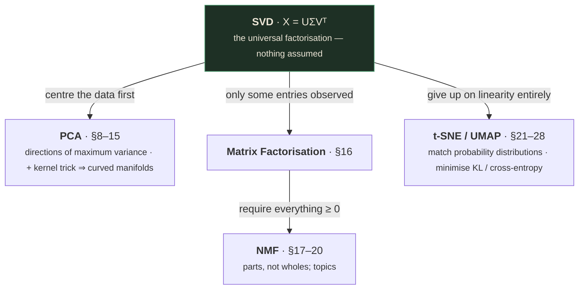
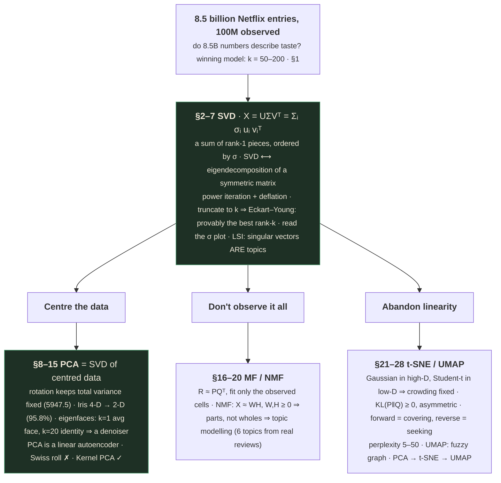
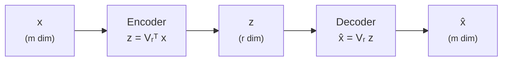
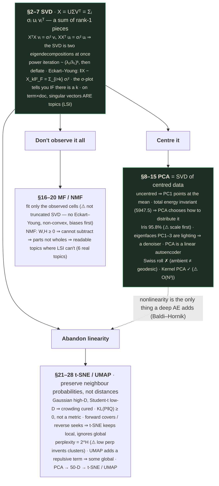

# Dimensionality Reduction — Part 2
### Feature extraction: from low-rank structure to nonlinear manifolds

---

## 📋 About this lecture and its capture

Where [Part 1](dimensionality-reduction-01.md) was mostly **feature selection** — keeping a subset of
the columns you already have — this lecture is entirely **feature extraction**: building *new*
columns as combinations of the old. It delivers four methods in 45 minutes, and it is the densest
deck in the course so far.

The title slide lays out the roadmap explicitly:

| | Topic | Runtime | The deck's own one-liner |
|---|---|---|---|
| **1** | **SVD** — *decomposition · low-rank approximation · Eckart–Young* | 4:35 – 15:48 | *"Every matrix has a low-rank skeleton. We extract it as a sum of rank-1 pieces."* |
| **2** | **PCA** — *variance · centering · eigenfaces · kernel PCA* | 15:48 – 29:08 | *"SVD of centred data. Finds the directions of maximum variance — and projects there."* |
| **3** | **MF · NMF** — *latent factors · biased predictor · parts decomposition* | 29:08 – 35:16 | *"Factorise a partially-observed or non-negative matrix into latent factors and parts."* |
| **4** | **t-SNE · UMAP** — *KL divergence · perplexity · cross-entropy* | 35:16 – 45:11 | *"When linear methods fail on curved manifolds — match probability distributions instead."* |

And the sentence that organises all four [slide 8, 4:31]:

> *"The first three methods (SVD, PCA, MF / NMF) reduce dimension from $m$ to a small $k$ using
> **linear factorisations**. The last (t-SNE / UMAP) takes a $k$-dimensional representation down to
> 2-D for visualisation, using **non-linear methods**."*

The deck contains **35 distinct slide states** (27 content slides, 4 section dividers, title, outline,
motivation, and a closing card).

> ✅ **Capture quality: excellent.** 90 raw frames over 45 minutes. Every content slide has a
> fully-built state; every equation, figure caption and citation is legible. Like Part 1's deck, this
> one **cites its own sources on nearly every slide** (Koren–Bell–Volinsky 2009, Cattell 1966,
> Marchenko–Pastur 1967, Turk & Pentland 1991, Schölkopf et al. 1998, Lee & Seung 1999/2000, Hofmann
> 1999, van der Maaten & Hinton 2008, McInnes et al. 2018, Bishop PRML), which makes the *Going
> deeper* section verifiable rather than reconstructed. **No content gaps.**
>
> Three of the slides are **live interactive demos** (the SVD rank slider, the PCA axis rotator, the
> t-SNE perplexity sweep). The capture caught them at multiple settings, so §6, §9 and §26 reproduce
> real numbers from two or more states of each rather than describing them.
>
> The instructor is **Charul Paliwal** — named in the webcam tile, unlike Part 1's unattributed deck.

> ⚠️ **A notation warning that matters more than usual — read this before §8.**
>
> **This deck transposes the data matrix relative to Part 1.** Part 1 used $X$ as $n \times p$
> (samples × features), which is the scikit-learn convention. This deck uses $X$ as $m \times n$ with
> **$m$ = features and $n$ = samples** [slide 33] — the classical linear-algebra convention.
>
> The consequence is not cosmetic. In this deck the principal components are the **columns of $U$**;
> in Part 1 they were the **columns of $V$**. Both are correct for their own layout, and swapping them
> silently gives you the sample-space vectors instead of the feature-space ones.
>
> | | Part 1 (and sklearn) | **This deck** |
> |---|---|---|
> | $X$ shape | $n \times p$ (samples × features) | $m \times n$ (**features × samples**) |
> | Principal components are | columns of **$V$** | columns of **$U$** |
> | Variance along PC$_i$ | $\lambda_i = s_i^2/n$ | $\sigma_i^2/n$ |
>
> These notes follow **the deck's** convention throughout §1–§20, and flag the crossing points. If you
> only remember one thing: **the principal components live in feature space, so they are the columns
> of whichever factor has one row per feature.** Check the shape, not the letter.

---

## How to read this document

The four topics are not four unrelated methods — they are one idea plus three modifications:



If you are revising under time pressure: **§2, §8 and §23 are the interview core.** "What is the
SVD?", "How is PCA computed and why centre first?", and "What is KL divergence and why is it
asymmetric?" are the three questions this lecture is most likely to be examined on.

**§23–§25 (KL divergence) are worth reading even if you never touch t-SNE.** The deck uses t-SNE as
the excuse to teach KL properly, and the *Where KL shows up* slide lists VAEs, knowledge distillation,
PPO/TRPO and mutual information — so this section is load-bearing for Modules 5 and 8 as well.

Everything in a `🧪 Worked example` block should be reproducible by you on paper.

---

## What you'll understand after reading this

- You'll be able to state the SVD, name what $U$, $\Sigma$ and $V$ each are, and **derive** the two key
  identities $X^\top X v_i = \sigma_i^2 v_i$ and $XX^\top u_i = \sigma_i^2 u_i$.
- You'll be able to explain the SVD as a **sum of rank-1 pieces**, and state the Eckart–Young theorem
  that makes truncation provably optimal.
- You'll be able to run **power iteration** by hand, explain why it converges to the top eigenvector,
  and say what determines its speed.
- You'll be able to compute truncated-SVD storage, compression ratio and reconstruction error for a
  real image, and match the deck's own demo numbers.
- You'll be able to read a singular-value plot and tell a genuinely low-rank matrix from pure noise —
  and say what the Marchenko–Pastur law contributes.
- You'll be able to explain **why PCA centres the data first**, and what specifically goes wrong if
  you don't.
- You'll be able to show that total variance is invariant under rotation, and use that to explain what
  PCA is actually choosing.
- You'll be able to interpret eigenfaces, explain why PC1–PC3 encode illumination rather than identity,
  and use PCA as a **denoiser**.
- You'll be able to explain PCA as a **linear autoencoder with tied weights**, and say precisely what a
  deep autoencoder adds.
- You'll be able to explain why PCA fails on a Swiss roll in terms of **ambient versus geodesic
  distance**, and how the kernel trick fixes it without ever constructing $\varphi$.
- You'll be able to set up recommendation as **matrix completion**, write the low-rank model, and
  explain why you fit only on observed entries.
- You'll be able to explain why non-negativity produces **parts rather than wholes**, and why that
  makes NMF topics interpretable where PCA components are not.
- You'll be able to write the KL divergence, prove it is non-negative, and explain **why it is
  asymmetric** — including which direction is mode-covering and which is mode-seeking.
- You'll be able to derive $H(P,Q) = H(P) + \mathrm{KL}(P\|Q)$ and explain why minimising
  cross-entropy *is* minimising KL.
- You'll be able to write t-SNE's three steps, explain why the low-D similarity uses a Student-t, and
  say what the **crowding problem** is.
- You'll be able to define perplexity, explain it as "effective number of neighbours", and say what
  you must never conclude from a t-SNE plot.
- You'll be able to compare PCA, t-SNE and UMAP on what each preserves, and choose between them.

---

## Before we start: what you need to know

### Prerequisite 1 — Matrix shapes, and this deck's transposed convention

Re-read the ⚠️ box above; it is the single highest-value thing on this page. In summary:

| Symbol | Read it as | What it means | Shape |
|---|---|---|---|
| $X$ | "X" | The data matrix, **features × samples** in this deck | $m \times n$ |
| $m$ | "m" | Number of **features** (Part 1 called this $p$ or $d$) | — |
| $n$ | "n" | Number of **samples** | — |
| $k$ or $r$ | "k" / "r" | The reduced dimension you keep. The deck uses both. | — |

> 💡 **The shape check that never lets you down.** A principal component is a *direction in feature
> space*, so it must have $m$ entries — one per feature. Look at which factor has $m$ rows: in this
> deck that's $U$; in sklearn's layout it's $V^\top$'s rows (i.e. `pca.components_`). **Never memorise
> the letter; always check the shape.**

### Prerequisite 2 — Orthonormal matrices, and what they do

> **Orthonormal matrix** — a square matrix whose columns are mutually perpendicular and each of length
> 1. Equivalently, $U^\top U = UU^\top = I$.
>
> *In everyday words:* a pure **rotation** (possibly with a reflection). It reorients your coordinate
> system without stretching, squashing or distorting anything.
>
> *Concretely:* $\begin{bmatrix}\cos\theta & -\sin\theta\\ \sin\theta & \cos\theta\end{bmatrix}$
> rotates the plane by $\theta$. Its columns are unit length and perpendicular ✓.

**The one property everything depends on: orthonormal matrices preserve length.**

$$\|Ux\|^2 = (Ux)^\top(Ux) = x^\top U^\top U x = x^\top x = \|x\|^2$$

**And therefore they preserve total variance**, which is §9's punchline: rotating your coordinate axes
cannot change how much total spread the data has. It can only change **how that fixed total is
distributed among the axes** — and PCA is the choice of rotation that concentrates as much of it as
possible into the first few.

### Prerequisite 3 — Rank, and the rank-1 building block

> **Rank** of a matrix — the number of genuinely independent directions it contains.
>
> *Concretely:* $\begin{bmatrix}1&2\\2&4\end{bmatrix}$ has rank **1**, because the second row is just
> twice the first — there is really only one direction of information here.

> **Rank-1 matrix** — one that can be written as $uv^\top$ for column vectors $u$ and $v$: an **outer
> product**.
>
> *Concretely:* $u = \begin{bmatrix}1\\2\end{bmatrix}$, $v = \begin{bmatrix}3\\4\end{bmatrix}$ gives
>
> $$uv^\top = \begin{bmatrix}1\\2\end{bmatrix}\begin{bmatrix}3 & 4\end{bmatrix} = \begin{bmatrix}3 & 4\\ 6 & 8\end{bmatrix}$$
>
> Note what just happened to the storage: the $2\times2$ result needs 4 numbers, but $u$ and $v$ need
> only $2 + 2 = 4$. At $1000 \times 1000$ the comparison is **1,000,000 versus 2,000** — and *that* is
> the entire economic argument for the SVD.
>
> *Why it exists as a concept:* the SVD writes any matrix as a **sum of rank-1 pieces**, ordered by
> importance. Truncating that sum is what low-rank approximation *is*.

### Prerequisite 4 — Eigenvectors and eigenvalues (recap)

[Part 1 §28](dimensionality-reduction-01.md) covered this. The one-line recap: $Av = \lambda v$ says
$v$ is a direction that $A$ **stretches without rotating**, by the factor $\lambda$. For a symmetric
matrix, the eigenvalues are real and the eigenvectors can be chosen orthonormal (the **spectral
theorem**) — and both $X^\top X$ and $XX^\top$ are symmetric, which is exactly why §2's key identities
are useful.

### Prerequisite 5 — The Frobenius norm

> **Frobenius norm** $\|A\|_F$ — the ordinary Euclidean length of a matrix, if you flattened it into
> one long vector.
>
> $$\|A\|_F = \sqrt{\sum_{i,j}A_{ij}^2}$$
>
> *Concretely:* $\left\|\begin{bmatrix}3&4\\0&0\end{bmatrix}\right\|_F = \sqrt{9+16} = 5$.
>
> *Why it matters here:* it's how "how good is this approximation?" gets measured. The deck's demo
> reports $\|X - X_k\|_F / \|X\|_F$ — the **relative reconstruction error**. And there is a beautiful
> identity: $\|X\|_F^2 = \sum_i \sigma_i^2$, so the Frobenius norm is completely determined by the
> singular values. §4 uses it.

### Prerequisite 6 — Probability distributions and expectation, for §21–§28

The last quarter of the lecture is about matching **distributions** rather than reconstructing
matrices, so:

> **Probability distribution** — an assignment of non-negative numbers to outcomes, summing to 1.
>
> *Concretely:* a fair die is $p(1) = \cdots = p(6) = 1/6$.

> **Expectation** $\mathbb{E}_{x\sim P}[f(x)] = \sum_x P(x)f(x)$ — the average of $f$, **weighted by
> how likely each outcome is under $P$**.
>
> *Why the subscript matters, and it matters enormously in §24:* $\mathbb{E}_{x\sim P}$ and
> $\mathbb{E}_{x\sim Q}$ average the same function against different weights and give different
> answers. **The whole forward-vs-reverse KL asymmetry is exactly this.**

You also need **entropy** — $H(P) = -\sum_x P(x)\log P(x)$, the bits needed to describe an outcome —
which [Part 1 Prereq 4](dimensionality-reduction-01.md) covers.

---

## The big picture

[Part 1](dimensionality-reduction-01.md) ended by establishing that the covariance matrix's
eigenvectors are the data cloud's principal axes, and stopped. This lecture picks up exactly there and
does four things with it.

**First, it generalises.** The eigendecomposition only works on square symmetric matrices. Your data
matrix is neither. The **SVD** is the generalisation that works on *any* matrix — rectangular,
non-symmetric, rank-deficient — and it factors it into a rotation, a scaling, and another rotation.
Its most useful reading is as a **sum of rank-1 pieces ordered by importance**, because then
"compress" simply means "stop summing early", and the Eckart–Young theorem says that truncation is
**provably the best possible** approximation of that rank.

The motivating example is chosen well: a Netflix ratings matrix with **8.5 billion entries** of which
**100 million** are observed. Do 8.5 billion numbers really describe human taste? The winning Netflix
Prize model used **50–200 latent factors**. The answer is no.

**Second, it specialises.** PCA is nothing more than *the SVD of centred data*. That single sentence
buys you: directions of maximum variance, the eigenfaces of a face dataset, a denoiser, and — via
the observation that PCA is a **linear autoencoder** — the conceptual ancestor of representation
learning. And it fails in one specific, visualisable way: on a **Swiss roll**, where straight-line
distance through the ambient space is the wrong metric. **Kernel PCA** fixes that by doing PCA in a
lifted space it never actually constructs.

**Third, it relaxes the assumptions.** Real matrices are not fully observed (recommendation: >99% of
entries missing) and are often non-negative (word counts, pixel intensities, ratings). **Matrix
factorization** fits only the observed cells and predicts the rest. Adding a non-negativity constraint
gives **NMF**, which changes the *character* of what you learn: because you can only add, never
subtract, the components become **parts rather than wholes** — and that is why NMF gives interpretable
topics where PCA gives ghostly signed eigenfaces.

**Fourth, it abandons linearity.** Everything above finds a *flat* subspace. Visualisation in 2-D of
genuinely curved data needs something else, and t-SNE and UMAP replace "preserve distances" with
**"preserve neighbourhood probabilities"** — turning dimensionality reduction into a
distribution-matching problem solved by minimising KL divergence.

### The whole lecture in one diagram



---

# PART 1 — Singular Value Decomposition

*4:35 – 15:48*

---

## 1. The motivating question

> *"Consider a matrix $X$ of 480,189 Netflix users × 17,770 movies — approximately **8.5 billion
> entries**, of which only ~100 million are observed. **Do 8.5 billion parameters truly describe user
> preferences?**"* [slide 13, 6:59]

*Check the arithmetic:* $480{,}189 \times 17{,}770 = 8{,}532{,}958{,}530 \approx \mathbf{8.5}$ billion ✓.
And $100\text{M} / 8.53\text{B} = \mathbf{1.17\%}$ — consistent with the slide's footnote of *"1.18%
density"* (the small gap is because the real Netflix Prize training set held 100,480,507 ratings, not
an even 100 million; $100{,}480{,}507/8{,}532{,}958{,}530 = 1.178\% \approx 1.18\%$ exactly).

The three bullets frame the whole of Part 1:

> - *"Can the rows / columns of $X$ be written as combinations of a small set of **basis vectors**?"*
> - *"If yes, the matrix is effectively **low-rank** — and SVD finds the best such basis."*
> - *"SVD answers three closely-related questions at once:*
>   *— What is the best rank-$k$ approximation of $X$?*
>   *— What are the natural axes of $X$'s row and column space?*
>   *— How much information does each axis carry?"*

And the footnote that answers the rhetorical question:

> *"Netflix Prize: 480,189 users × 17,770 movies, ~100M observed ratings (1.18% density). **Winning
> model used $k$ = 50–200 latent factors.** (Koren–Bell–Volinsky, IEEE Computer 2009.)"*

> 💡 **Sit with the compression that implies.** 8.5 billion possible numbers, and 50–200 numbers per
> user and per movie suffice to predict ratings better than any prior method. That is a **compression
> ratio of roughly $10^7$**, and it is empirical evidence for [Part 1's manifold
> hypothesis](dimensionality-reduction-01.md) in a domain where nobody designed the low-dimensional
> structure — it just turned out that human taste is describable by a few dozen numbers, most of which
> have no name.
>
> **The three questions in bullet 3 are the same question asked three ways**, and noticing that is the
> point of the slide. "Best rank-$k$ approximation", "natural axes", and "information per axis" are
> answered by $U$, $V$ and $\Sigma$ respectively — three outputs of a single factorisation.

---

## 2. The SVD

> [slide 16, 8:51]

$$X = U\Sigma V^\top = \sum_{i=1}^{r}\sigma_i\, u_i v_i^\top$$

> - *"$\mathbf{U} \in \mathbb{R}^{m\times m}$ — orthonormal, columns are **left singular vectors**."*
> - *"$\mathbf{V} \in \mathbb{R}^{n\times n}$ — orthonormal, columns are **right singular vectors**."*
> - *"$\mathbf{\Sigma}$ — $m \times n$, zero except for $\sigma_1 \ge \sigma_2 \ge \cdots \ge \sigma_r > 0$ on the diagonal."*
> - *"$r = \mathrm{rank}(X)$ — number of non-zero singular values."*

| Symbol | Read it as | What it means | Shape |
|---|---|---|---|
| $X$ | "X" | Any matrix at all. **No assumptions** — not square, not symmetric, not full rank. | $m\times n$ |
| $U$ | "U" | Rotation in **feature space**. Its columns are an orthonormal basis for $X$'s column space. | $m\times m$ |
| $\Sigma$ | "Sigma" (capital) | Diagonal scaling. The $\sigma_i$ say **how much** each direction matters. | $m\times n$ |
| $V^\top$ | "V transpose" | Rotation in **sample space**. | $n\times n$ |
| $\sigma_i$ | "sigma sub i" | The $i$-th **singular value**. Always $\ge 0$, sorted descending. | scalar |
| $u_i, v_i$ | "u sub i", "v sub i" | The $i$-th columns of $U$ and $V$. | $m\times1$, $n\times1$ |
| $r$ | "r" | The rank: how many $\sigma_i$ are non-zero. | — |

### 2.1 The two readings, and why the second one is the useful one

**Reading 1 — as three operations.** $X = U\Sigma V^\top$ says: *any* linear map is a **rotation, then
an axis-aligned scaling, then another rotation.** That's a remarkable structural fact — it means every
matrix, however messy it looks, is doing something geometrically simple in the right pair of
coordinate systems. It is the same rotate–scale–rotate reading as
[Part 1 §29](dimensionality-reduction-01.md)'s $\Sigma = V\Lambda V^\top$, generalised to
non-symmetric, non-square matrices (which need **two different** rotations rather than one used twice).

**Reading 2 — as a sum of rank-1 pieces.**

$$X = \sigma_1 u_1v_1^\top + \sigma_2 u_2v_2^\top + \cdots + \sigma_r u_rv_r^\top$$

**This is the reading the deck leads with, and it is the one that makes everything else obvious.**
Each term $\sigma_i u_iv_i^\top$ is a rank-1 matrix (Prereq 3) — the simplest non-trivial matrix there
is — and they are ordered by importance, because $\sigma_1 \ge \sigma_2 \ge \cdots$.

**So "compress" just means "stop summing early."** Keep the first $k$ terms and you have the best
possible rank-$k$ approximation (§4). No search, no optimisation — the ordering already did the work.

### 2.2 🧪 The key identities, derived

The slide's *Key identities* box is the bridge from SVD back to the eigen-machinery of Part 1:

$$X^\top X\, v_i = \sigma_i^2\, v_i \qquad\qquad XX^\top u_i = \sigma_i^2 u_i$$

> *"SVD ↔ eigendecomposition of a symmetric matrix."*

**Derive the first one in two lines.** Substitute $X = U\Sigma V^\top$:

$$X^\top X = (U\Sigma V^\top)^\top(U\Sigma V^\top) = V\Sigma^\top U^\top U \Sigma V^\top = V\Sigma^\top\Sigma V^\top = V\Sigma^2 V^\top$$

using $U^\top U = I$. That last expression is exactly an eigendecomposition of the symmetric matrix
$X^\top X$: eigenvectors $V$, eigenvalues $\Sigma^2$. Reading off column $i$ gives
$X^\top X v_i = \sigma_i^2 v_i$. $\blacksquare$

**The second is the mirror image:**

$$XX^\top = U\Sigma V^\top V \Sigma^\top U^\top = U\Sigma^2 U^\top \implies XX^\top u_i = \sigma_i^2 u_i \quad\blacksquare$$

> 💡 **Three consequences worth stating explicitly, because each gets used later:**
>
> 1. **Singular values are square roots of eigenvalues.** $\sigma_i = \sqrt{\lambda_i}$ where
>    $\lambda_i$ is an eigenvalue of $X^\top X$. That's why the deck writes $\sigma_i^2$ everywhere
>    variance appears.
> 2. **You never need to form $X^\top X$.** The SVD of $X$ hands you both eigendecompositions at once.
>    This is [Part 1 §29.3](dimensionality-reduction-01.md)'s conditioning argument in reverse:
>    forming $X^\top X$ squares the condition number, so going directly to the SVD is numerically
>    better. §3's algorithm makes it concrete.
> 3. **$\sigma_i \ge 0$ always**, because $X^\top X$ is PSD (it's a Gram matrix) so its eigenvalues are
>    non-negative and their square roots are real. Unlike eigenvalues, singular values can never be
>    negative or complex — **which is why the SVD exists for every matrix while the eigendecomposition
>    does not.**

### 2.3 📚 Background the slide assumed — the Eckart–Young theorem

The deck's roadmap card names *"Eckart–Young"* under the SVD topic, and it is the theorem that makes
§4's truncation more than a heuristic. It deserves stating even though no slide states it.

> **Eckart–Young(–Mirsky) theorem.** Let $X_k = \sum_{i=1}^{k}\sigma_i u_iv_i^\top$ be the truncated
> SVD. Then for **every** matrix $B$ of rank $\le k$:
>
> $$\|X - X_k\|_F \le \|X - B\|_F, \qquad\text{and}\qquad \|X - X_k\|_F = \sqrt{\sum_{i=k+1}^{r}\sigma_i^2}$$

**In words: truncating the SVD is not *a* good rank-$k$ approximation — it is provably *the best*
one**, and the error you incur is exactly the energy in the singular values you discarded.

*Why that matters practically:* you can compute your reconstruction error **before** deciding what to
keep, straight from the singular values, without ever forming the approximation. §6's demo displays
exactly this as *"cumulative $\sigma^2$"*.

> ⚠️ The theorem holds for the Frobenius norm and for the spectral norm. It does **not** extend to
> arbitrary norms, and — importantly for §16 — it does **not** hold when entries are missing. Matrix
> completion is a genuinely harder problem than truncated SVD, and conflating them is a real error.

```interactive
type: animation
title: Rebuilding a matrix one rank-1 piece at a time
concept: The SVD as an ordered sum, and why truncation is compression
control: A step button that adds the next sigma_i u_i v_i^T term, plus a jump-to-k slider
observe: Three panels side by side — the single rank-1 piece being added, the running partial sum X_k, and the residual X − X_k — with the Frobenius error and cumulative sigma-squared updating
insight: The first few pieces visibly carry the structure while later ones are speckle; watching the residual go from "the whole image" to "faint noise" in about twenty steps is the Eckart–Young theorem made visual
fallback: §6's butterfly demo numbers: k=5 stores 1,285 numbers with 30.4% error and 90.78% cumulative sigma-squared; k=20 stores 5,140 with 14.6% error and 97.86%
```

---

## 3. Computing the SVD

> *"Multiplying a random vector by a matrix over and over **amplifies** its top eigendirection and
> crushes the rest."* [slide 19, 10:26]

The slide gives a three-step algorithm, and it is worth working through because it explains both *how*
and *how fast*.

### 3.1 Step 1 — reduce the SVD to a symmetric eigenproblem

$$X^\top X = V\Sigma^2V^\top, \qquad XX^\top = U\Sigma^2 U^\top$$

> *"Both are symmetric · eigenvalues = $\sigma_i^2$ · eigenvectors give you V (or U)."*

That's §2.2's identities, now used as an algorithm: **turn the hard non-symmetric problem into a
symmetric one you know how to solve.**

### 3.2 Step 2 — power iteration

> *"Let $A = XX^\top$."*
>
> $$\text{start } \hat{u}_0 \text{ random}; \quad \text{for } k = 1, 2, \ldots: \quad \hat{u}_k = \frac{A\hat{u}_{k-1}}{\|A\hat{u}_{k-1}\|}$$
>
> *"↳ the estimate $\hat u_k \to u_{(1)}$, the top eigenvector of A (with high probability)."*
>
> $$\sigma_{(1)} = \sqrt{u_{(1)}^\top A\, u_{(1)}}\ \cdot\ v_{(1)} = X^\top u_{(1)} / \sigma_{(1)}$$
>
> *"Rate: error shrinks by $(\lambda_{(2)}/\lambda_{(1)})^k$ per step. **Big gap → fast.**"*

**Why it works — the proof is three lines and it is genuinely elegant.**

Write the random starting vector in the eigenbasis of $A$ (possible because $A$ is symmetric, so its
eigenvectors span the space):

$$\hat u_0 = c_1u_1 + c_2u_2 + \cdots + c_mu_m$$

Apply $A$ once. Each eigenvector is just scaled by its own eigenvalue:

$$A\hat u_0 = c_1\lambda_1u_1 + c_2\lambda_2u_2 + \cdots$$

Apply it $k$ times:

$$A^k\hat u_0 = c_1\lambda_1^ku_1 + c_2\lambda_2^ku_2 + \cdots = \lambda_1^k\left[c_1u_1 + c_2\left(\frac{\lambda_2}{\lambda_1}\right)^ku_2 + \cdots\right]$$

**Every ratio $\lambda_i/\lambda_1$ is less than 1, so raising it to the $k$-th power sends it to
zero.** Only the $u_1$ term survives; normalising at each step keeps the length at 1. $\blacksquare$

> 💡 **And there's the convergence rate, read straight off the algebra:** the largest surviving
> contaminant decays as $(\lambda_2/\lambda_1)^k$. **A big spectral gap means fast convergence; a small
> gap means slow.** Which is exactly the slide's last line — and it is a nice instance of the *same*
> geometric-decay arithmetic that ran through
> [DNN Part 3 §5](../Deep%20Neural%20Networks/deep-neural-networks-03.md) and
> [Part 1 §1.2](dimensionality-reduction-01.md), except here **you want the decay** and it is doing
> useful work for you.

### 🧪 Worked example — power iteration by hand

$$A = \begin{bmatrix}3 & 1\\ 1 & 3\end{bmatrix}$$

Its eigenvalues are $\lambda_1 = 4$ (eigenvector $(1,1)/\sqrt2$) and $\lambda_2 = 2$ (eigenvector
$(1,-1)/\sqrt2$). *Check:* trace $= 6 = 4 + 2$ ✓; det $= 9 - 1 = 8 = 4\times2$ ✓.

Start deliberately badly, at $\hat u_0 = (1, 0)$ — which is a 50/50 mix of both eigenvectors:

| Step | $A\hat u_{k-1}$ | Normalised $\hat u_k$ | Angle to $(0.7071, 0.7071)$ |
|---|---|---|---|
| 1 | $(3, 1)$ | $(0.9487, 0.3162)$ | 26.6° |
| 2 | $(3.162, 1.897)$ | $(0.8575, 0.5145)$ | 14.0° |
| 3 | $(3.087, 2.401)$ | $(0.7893, 0.6139)$ | 6.9° |
| 4 | $(2.982, 2.631)$ | $(0.7497, 0.6617)$ | 3.4° |
| 5 | $(2.911, 2.734)$ | $(0.7292, 0.6849)$ | 1.7° |

*Verify step 1:* $A(1,0)^\top = (3\cdot1 + 1\cdot0,\ 1\cdot1 + 3\cdot0) = (3,1)$ ✓, and
$\|(3,1)\| = \sqrt{10} = 3.1623$, so $\hat u_1 = (0.9487, 0.3162)$ ✓.

**The angle halves every step** — and it should, because the predicted rate is
$\lambda_2/\lambda_1 = 2/4 = \mathbf{0.5}$ per step. 26.6 → 14.0 → 6.9 → 3.4 → 1.7 ✓. The theory and
the arithmetic agree exactly.

```python
import numpy as np
A = np.array([[3., 1.], [1., 3.]])
u = np.array([1., 0.])
for k in range(5):
    u = A @ u
    u /= np.linalg.norm(u)
    print(k+1, u.round(4), np.degrees(np.arccos(u @ [0.7071, 0.7071])).round(1))
```

### 3.3 Step 3 — deflate for the next triple

$$A - \sigma_{(1)}^2 u_{(1)}u_{(1)}^\top \longrightarrow u_{(2)}$$

> *"Subtract the top eigendirection from A; power-iterate again for $(\sigma_{(2)}, u_{(2)}, v_{(2)})$.
> Repeat for the top $r$ triples."*

**Why subtraction works.** $A = \sum_i\lambda_iu_iu_i^\top$ (its spectral decomposition). Subtract the
first term and you are left with $\sum_{i\ge2}\lambda_iu_iu_i^\top$ — a matrix with **the same
eigenvectors but with $\lambda_1$ replaced by 0**. So the second eigenvector is now the top one, and
power iteration finds it.

> ⚠️ **Naive deflation accumulates numerical error.** Each subtraction introduces rounding, and by the
> tenth deflation your "orthogonal" directions may be measurably non-orthogonal. Production code uses
> **block methods** (find several vectors at once) or **Krylov subspace methods** (Lanczos, Arnoldi)
> instead, with explicit reorthogonalisation. Deflation is the right *teaching* algorithm and the wrong
> *production* one.

### 3.4 What actually runs, per the slide's footnote

> *"In practice: dense `numpy.linalg.svd` → LAPACK divide-and-conquer at $\mathcal{O}(mn\cdot\min(m,n))$.
> Sparse top-$k$ → ARPACK / Lanczos. Huge low-rank → randomised SVD at $\mathcal{O}(mnk)$,
> Halko–Martinsson."*

| Situation | Method | Cost |
|---|---|---|
| Dense, want everything | LAPACK divide-and-conquer (`numpy.linalg.svd`) | $\mathcal{O}(mn\min(m,n))$ |
| Sparse, want top $k$ | ARPACK / Lanczos (`scipy.sparse.linalg.svds`) | Depends on sparsity |
| Huge, low-rank, want top $k$ | **Randomised SVD** (`sklearn.utils.extmath.randomized_svd`) | $\mathcal{O}(mnk)$ |

> 💡 **The randomised SVD is the one worth knowing about**, because it turns an $\mathcal{O}(mn^2)$
> problem into $\mathcal{O}(mnk)$ and is what sklearn's `PCA(svd_solver='randomized')` uses. Its idea
> is a single sentence: **project $X$ onto a small random subspace, orthonormalise, and do the exact
> SVD of the tiny result.** It works because a random projection preserves the dominant directions with
> high probability (Johnson–Lindenstrauss). §18's figure caption — *"Eigenfaces - PCA using randomized
> SVD"* — is this method actually being used in the deck's own figure.

---

## 4. Truncated SVD

> *"Keep the top $k$ singular values"* [slide 21, 11:48]

$$X \approx U_k\Sigma_kV_k^\top, \qquad \underbrace{(m\times k)}_{U_k}\ \underbrace{(k\times k)}_{\Sigma_k}\ \underbrace{(k\times n)}_{V_k^\top}$$

> *"Storage drops from $m\cdot n$ to $k(m + n + 1)$. For a $1000\times1000$ matrix at $k = 50$, that is
> **100 050** numbers — about **10%** of the original 1 000 000."*

*Verify:* $50 \times (1000 + 1000 + 1) = 50 \times 2001 = \mathbf{100{,}050}$ ✓, and
$100{,}050 / 1{,}000{,}000 = \mathbf{10.005\%}$ ✓.

**Where the $(m + n + 1)$ comes from:** each retained triple costs $m$ numbers for $u_i$, $n$ for
$v_i$, and **1** for $\sigma_i$. Multiply by $k$ triples.

### 4.1 🧪 When truncation actually saves you anything

The break-even point is where $k(m+n+1) = mn$, i.e.

$$k^* = \frac{mn}{m+n+1}$$

For a square $m\times m$ matrix that's $k^* \approx m/2$. **So truncated SVD only compresses if the
useful rank is less than about half the matrix dimension** — and if it isn't, storing $U$, $\Sigma$
and $V$ costs *more* than storing $X$.

| Matrix | $k^*$ (break-even) | Compression at $k = 50$ |
|---|---|---|
| $1000\times1000$ | 500 | **10.0×** |
| $10{,}000\times100$ | 99 | 1.98× |
| $128\times128$ (§6's butterfly) | 63.7 | 3.2× at $k{=}20$ |
| $480{,}189\times17{,}770$ (Netflix) | 17,136 | 343× at $k{=}50$ |

> 💡 **The Netflix row is the interesting one and it's worth doing out loud.** At $k = 50$:
> $50\times(480{,}189 + 17{,}770 + 1) = 50 \times 497{,}960 = \mathbf{24{,}898{,}000}$ numbers, versus
> 8.53 billion — a **343× reduction**, and it *also* fills in the 98.8% of entries you never observed.
> That second part is the real product; the compression is a side effect. (§16 is careful about why
> this is matrix *completion* rather than truncated SVD.)

---

## 5. Picking $k$ — read the singular-value plot

> *"Plot $\sigma_1, \sigma_2, \sigma_3, \ldots$ as a bar chart ($i$ on the x-axis, $\sigma_i$ on the
> y-axis). The **shape** of the plot tells you whether there is a rank to truncate to, and where."*
> [slide 23, 13:16]

The slide is a **two-panel comparison**, and it is the most instructive figure in the lecture:

| | **Butterfly image** (128×128 grey-scale) | **Random matrix** (128×128, Gaussian noise) |
|---|---|---|
| Shape | $\sigma_1 \approx 13{,}500$, then a **cliff** to ~3,500 and a long flat tail | Smooth decay from ~22 to ~10 across 60 indices |
| The slide's caption | *"$\sigma_1$ is huge, $\sigma_2\ldots\sigma_{20}$ drop fast, then a long flat tail. The image is effectively low-rank: keep the top ~20, drop the tail."* | *"All $\sigma_i$ are within a factor of ~2 — no elbow — **the matrix has no low-rank structure to find.**"* |
| Verdict | ✅ Truncate at ~20 | ❌ Nothing to truncate |

> 💡 **This is the single most useful diagnostic in the whole module, and it is criminally
> underused.** Before you run PCA and report "95% variance explained", **look at the spectrum**. If it
> looks like the right panel, your 95% is arbitrary — you are keeping 95% of *noise* — and no choice of
> $k$ is defensible. If it looks like the left panel, the elbow tells you $k$ and the decision is easy.
>
> It is also the direct empirical test of [Part 1 §7's manifold
> hypothesis](dimensionality-reduction-01.md): **a sharp spectral drop *is* low intrinsic
> dimension**, measured rather than assumed.

### 5.1 📚 Background — the Marchenko–Pastur law, and why the right panel matters

The slide's footnote cites two things:

> *"'Scree plot' heuristic: Cattell, Multivariate Behav. Res. 1(2), 1966. The random-matrix spectrum is
> described by the **Marchenko–Pastur law (1967)**, which gives a theoretically grounded noise
> [threshold]."*

The scree-plot heuristic is exactly [Part 1 §30](dimensionality-reduction-01.md)'s elbow rule — and
"heuristic" is the operative word: it's a judgement call.

**Marchenko–Pastur upgrades it from a heuristic to a test.** The law says that for a random
$m\times n$ matrix with i.i.d. entries of variance $\sigma^2$, as $m, n \to \infty$ with
$m/n \to \gamma$, the eigenvalues of $\frac1n X^\top X$ converge to a **known distribution supported on
$[\sigma^2(1-\sqrt\gamma)^2,\ \sigma^2(1+\sqrt\gamma)^2]$.**

That upper endpoint is a **principled noise threshold**: singular values below it are consistent with
pure noise; those above it are not. So instead of squinting for an elbow, you can ask *"is
$\sigma_i^2$ above the Marchenko–Pastur edge?"* and get a defensible answer.

> ⚠️ Two caveats worth flagging. The law is **asymptotic**, so it's a good guide at $m, n$ in the
> hundreds and unreliable at $m, n \approx 20$. And it assumes i.i.d. entries — real "noise" is often
> correlated (spatially in images, temporally in sensors), which shifts the edge. Treat the threshold
> as a much better heuristic than the elbow, not as proof.

---

## 6. 🧪 Live demo — the rank slider

The deck runs an interactive demo on a 128×128 greyscale butterfly photograph, and the capture caught
it at **two** settings. Both are reproduced here with their real readouts [slides 24–25, 13:20–14:49].

**The setup**, from the slide's caption:

> *"Original is a 128 × 128 image (**16,384 numbers**). At $k$ = 20 we store only
> $k\cdot(2\cdot128 + 1) = 5{,}140$ numbers (≈ 3× compression) and reconstruct the butterfly cleanly."*

*Verify:* $128\times128 = \mathbf{16{,}384}$ ✓, and $20 \times (256 + 1) = 20\times257 = \mathbf{5{,}140}$ ✓.

### The two captured states, side by side

| | **$k = 5$** | **$k = 20$** |
|---|---|---|
| Storage | **1,285** numbers | **5,140** numbers |
| Compression | **12.8× smaller** | **3.2× smaller** |
| $\|X - X_k\|_F/\|X\|_F$ | **0.304** | **0.146** |
| Cumulative $\sigma^2$ | **90.78%** | **97.86%** |
| What you see | Blocky smears; the butterfly is not recognisable | The butterfly is clean; wings, body and background all legible |

**Verify every number:**

- $k=5$: $5\times257 = \mathbf{1{,}285}$ ✓, and $16{,}384/1{,}285 = \mathbf{12.75} \approx 12.8\times$ ✓
- $k=20$: $16{,}384/5{,}140 = \mathbf{3.187} \approx 3.2\times$ ✓

**And check the two error columns against Eckart–Young (§2.3), which predicts a relationship between
them.** The theorem says $\|X - X_k\|_F^2 = \sum_{i>k}\sigma_i^2$, so the **squared** relative error is
exactly the *discarded* fraction of $\sum\sigma_i^2$:

$$\left(\frac{\|X-X_k\|_F}{\|X\|_F}\right)^2 = 1 - \text{cumulative }\sigma^2$$

| $k$ | Relative error | Error² | $1 - $ cumulative $\sigma^2$ | Match? |
|---|---|---|---|---|
| 5 | 0.304 | **0.0924** | $1 - 0.9078 = \mathbf{0.0922}$ | ✅ |
| 20 | 0.146 | **0.0213** | $1 - 0.9786 = \mathbf{0.0214}$ | ✅ |

**Both agree to three decimal places.** That is Eckart–Young verified on the deck's own live demo, and
it is a genuinely satisfying check to be able to run.

```interactive
type: slider
title: Live demo — drag the rank slider
concept: Reconstruction quality as a continuous function of the truncation rank k
control: A draggable k-slider (range 1 to "full") plus quick-select buttons for k = 1, 5, 20, 40, 80, full
observe: The "Rank-k reconstruction" panel sharpens from an unrecognisable blocky smear toward the clean original as k rises; the storage, compression, relative-error, and cumulative-σ² readouts update live; and the orange highlighted region of the log-scale singular-value spectrum bar chart grows to cover exactly the first k bars
insight: Most of the reconstruction's value arrives in the first few singular values — quadrupling k from 5 to 20 only halves the error, because cumulative σ² is already at 90.78% by k=5 — which is the rate–distortion curve from §6.1 made visible rather than tabulated
fallback: Two captured states of the same slide. At k=5 (button highlighted, slider near the left): "Rank-5 reconstruction" is a blocky, unrecognisable smear; storage 1285 numbers, compression 12.8× smaller, ‖X−X_k‖_F/‖X‖_F = 0.304, cumulative σ² = 90.78%. At k=20: "Rank-20 reconstruction" is a clean, legible butterfly; storage 5140 numbers, compression 3.2× smaller, relative error 0.146, cumulative σ² = 97.86%. In both frames the right-hand panel shows the log-scale singular-value spectrum with the first k bars highlighted in orange against the rest in grey.
```

### 6.1 The lesson the two states teach together

Going from $k=5$ to $k=20$ **quadruples the storage** (1,285 → 5,140) and **halves the error**
(0.304 → 0.146). That's the classic shape of a rate–distortion curve: **each extra bit buys less than
the one before.** Cumulative $\sigma^2$ makes it starker still — the first 5 components buy 90.78%, and
the next 15 buy only 7.08% more.

> 💡 **The practical rule this gives you:** most of the value is in the first few components, and the
> right $k$ is wherever the marginal component stops buying anything you can see. **That's the elbow
> from §5, arrived at from the cost side rather than the spectrum side.**

```python
import numpy as np
from scipy import datasets

X = datasets.face(gray=True)[:128, :128].astype(float)
U, S, Vt = np.linalg.svd(X, full_matrices=False)

for k in (5, 20, 40, 80):
    Xk = U[:, :k] @ np.diag(S[:k]) @ Vt[:k, :]
    rel = np.linalg.norm(X - Xk) / np.linalg.norm(X)
    cum = (S[:k]**2).sum() / (S**2).sum()
    print(f"k={k:3d}  store={k*(2*128+1):6d}  compress={16384/(k*257):5.1f}x  "
          f"rel_err={rel:.3f}  cum_sigma2={cum:.4f}  check: {rel**2:.4f} vs {1-cum:.4f}")
```

---

## 7. Application — Latent Semantic Indexing

> *"Apply truncated SVD to a **term × document** matrix. The top $k$ singular vectors — where $k$ is
> the number of topics you choose to keep — become the **topics**."* [slide 29, 15:44]

$$X \approx U_k\Sigma_kV_k^\top$$

The slide's figure is a live three-step animation on a real term-document matrix; the captured final
state shows the payoff:

> *"**Step 3 / 3.** Reorder words too. **Block structure emerges** — environment, immigration, space,
> medical, defense. Each block is one column of $U$; $\sigma$ values give topic strength."*

The visible word list clusters exactly as described: `air · pollution · power · environmental` /
`illegal · immigration · amnesty · aliens` / `shuttle · space · launch · booster` /
`health · drug · blood · study` / `defense · nuclear · arms · treaty`.

### 7.1 Why this works, and what each factor becomes

| Factor | Shape | What it means for LSI |
|---|---|---|
| $U_k$ | terms × $k$ | **Each column is a topic**, expressed as a weighting over words |
| $\Sigma_k$ | $k\times k$ | **Topic strength** — how much of the corpus each topic accounts for |
| $V_k^\top$ | $k$ × documents | **Each column is a document's topic mixture** |

**The mechanism in one sentence:** words that co-occur across the same documents end up with similar
rows in $X$, and the SVD — which is looking for directions that explain lots of variance — finds a
single direction that covers all of them at once. **A "topic" is not something LSI was told to find;
it is what a maximum-variance direction in a term-document matrix looks like.**

### 7.2 💡 The thing LSI buys you that word matching cannot

**Synonymy and polysemy.** A user searching for *"car"* gets no keyword match on a document containing
only *"automobile"*. But "car" and "automobile" appear in the same documents, so in the $k$-dimensional
topic space **their vectors are close** — and cosine similarity retrieves the document anyway.

That is the whole reason LSI (Deerwester et al., 1990) was a landmark in information retrieval:
**it matches on meaning rather than on strings**, by the simple expedient of projecting into a space
where co-occurring words are near each other.

> 💡 **And notice what LSI is, viewed from 2026:** it is a **word embedding**, produced by matrix
> factorisation, twenty-five years before word2vec. The lineage LSI → LSA → word2vec → GloVe →
> contextual embeddings is direct, and Levy & Goldberg (2014) proved that word2vec's skip-gram with
> negative sampling is *implicitly factorising* a shifted PMI matrix — i.e. it is doing the same thing
> LSI does, with a different weighting. **Saying this in an interview lands well**, because it connects
> a "classical" method to the modern stack rather than filing it under history.

> ⚠️ **LSI's real limitations, worth knowing:** the components are **signed**, so a "topic" can have
> negative word weights, which are hard to interpret ("this topic is *anti*-nuclear"?). §19's NMF fixes
> exactly this by forbidding negatives — and the two slides are 20 minutes apart in the same lecture
> for that reason. LSI also gives every document a single fixed representation regardless of context,
> which is what contextual embeddings later fixed.

---

# PART 2 — Principal Component Analysis

*15:48 – 29:08*

---

## 8. PCA — find the best low-dimensional representation

> **Setup.** *"Data matrix $X$ is $m \times n$ ($m$ features, $n$ samples). We want a small number of
> directions $r \ll m$ that capture most of the variation — the **principal components**. Project the
> data onto these $r$ directions and discard the rest."* [slide 33, 17:16]

$$\tilde X = U\Sigma V^\top$$

> - *"**Centre first.** $\tilde X = X - \mu$ — subtract the column mean. Otherwise the top singular
>   vector points to the mean, not to the direction of variation."*
> - *"**Run SVD.** The first $r$ columns of $U$ are the principal components; $\sigma_i^2/n$ is the
>   variance along $\mathrm{PC}_i$."*

**That is the entire definition of PCA, and it is two lines.** Everything in §9–§15 is a consequence.

> ⚠️ **Recall the transposed convention** (front-matter warning). Because $X$ here is *features ×
> samples*, $U$'s columns have $m$ entries — one per feature — so **$U$ holds the principal
> components**. In sklearn's layout ($n\times p$) the same objects are the rows of
> `pca.components_`. Same vectors, different letter.

### 8.1 Why centring is not optional — the failure it prevents

The slide's phrasing is precise and worth unpacking: *"Otherwise the top singular vector points to the
mean, not to the direction of variation."*

**Here is the mechanism.** The SVD finds the direction $u$ maximising $\|X^\top u\|^2$ — the total
squared projection. For **uncentred** data, that total decomposes into two parts:

$$\sum_{i} (u^\top x_i)^2 = \underbrace{n\,(u^\top\mu)^2}_{\text{how far the cloud is from the origin}} + \underbrace{\sum_i \left(u^\top(x_i-\mu)\right)^2}_{\text{how spread out the cloud is}}$$

**The first term has nothing to do with variance.** If the data sits far from the origin — mean
$(1000, 1000)$, say — that term is enormous, and the maximiser is simply $u \approx \mu/\|\mu\|$: a
vector pointing at the centroid. PC1 becomes "the direction the data happens to be sitting in", which
is an artefact of where you put the origin and carries no information about structure.

Centring kills the first term ($\mu = 0$), leaving only the variance. **Then and only then does
"maximum singular value" mean "maximum variance."**

### 🧪 Worked example — what uncentred PCA actually returns

Three points, tightly clustered far from the origin:

$$x_1 = (100, 100), \quad x_2 = (101, 100), \quad x_3 = (99, 100)$$

The real structure is obvious: **all the variation is horizontal.** The true PC1 is $(1, 0)$.

**Uncentred.** The mean is $(100, 100)$, which is enormous compared to the spread ($\pm 1$
horizontally, $0$ vertically). The dominant term in the sum above is $n(u^\top\mu)^2$, maximised at

$$u \approx \frac{(100,100)}{\|(100,100)\|} = (0.707, 0.707)$$

**PC1 comes back at 45°** — pointing at the centroid, and telling you nothing. Worse, it reports a
huge "explained variance" because $\sigma_1^2$ is dominated by the offset.

**Centred.** Subtract $(100,100)$: the data becomes $(0,0)$, $(1,0)$, $(-1,0)$. Now

$$\Sigma = \frac13\begin{bmatrix}0 & 1 & -1\\0&0&0\end{bmatrix}\begin{bmatrix}0&0\\1&0\\-1&0\end{bmatrix} = \frac13\begin{bmatrix}2&0\\0&0\end{bmatrix} = \begin{bmatrix}0.667 & 0\\ 0 & 0\end{bmatrix}$$

PC1 $= (1, 0)$ with $\lambda_1 = 0.667$; PC2 $= (0,1)$ with $\lambda_2 = 0$. **Correct** ✓ — and it
correctly reports the data as intrinsically 1-dimensional.

```python
import numpy as np
from sklearn.decomposition import PCA
X = np.array([[100., 100.], [101., 100.], [99., 100.]])

print(PCA(n_components=2).fit(X).components_[0])   # [1. 0.] — sklearn centres for you

# what happens without centring:
U, S, Vt = np.linalg.svd(X, full_matrices=False)
print(Vt[0])                                        # ≈ [0.707 0.707] — points at the mean
```

> ⚠️ **`sklearn.decomposition.PCA` centres automatically. `TruncatedSVD` deliberately does not** — it
> is built for sparse data where centring would destroy sparsity and blow up memory. **Using
> `TruncatedSVD` on dense uncentred data reproduces exactly this bug**, silently. Same warning as
> [Part 1 §29.3](dimensionality-reduction-01.md); it recurs because the mistake recurs.

### 8.2 The figure's "significant / noise" split

The slide's diagram partitions each factor into a "significant" block and a "noise" block:
$U$ is split vertically, $S$ diagonally, $V^\top$ horizontally.

**Read it as: truncation is a coordinated slice through all three factors at the same $r$.** You keep
the first $r$ columns of $U$, the top-left $r\times r$ of $\Sigma$, and the first $r$ rows of $V^\top$
— and dropping any one of them without the others is a shape error. It's §4's truncated SVD, drawn.

---

## 9. Building the PCA axes — the interactive demo

> *"Find the line that keeps the most variance"* [slides 34–36, 17:20–19:35]
>
> *"Drag $\theta$ to rotate the projection line (orange). PC2 is automatically perpendicular (teal).
> Variance on each line is shown live."*

The capture caught this demo at **two angles**, and comparing them proves something important.

| | **$\theta = 0°$** | **$\theta = 31°$** |
|---|---|---|
| var on PC1 axis | 4164.5 | **5367.9** |
| var on PC2 axis | 1783.0 | **579.6** |
| **total energy** | **5947.5** | **5947.5** |
| % on PC1 | 70.0% | **90.3%** |
| % on PC2 | 30.0% | 9.7% |

**Check both rows:** $4164.5 + 1783.0 = \mathbf{5947.5}$ ✓ and
$5367.9 + 579.6 = \mathbf{5947.5}$ ✓.

### 9.1 💡 The total energy never changes — and that is the whole point

**Look at the middle row. Rotating the axes moved 1,203 units of variance from PC2 to PC1, and the
total stayed at exactly 5947.5.**

That is Prereq 2's fact — orthonormal rotations preserve length, hence total variance — observed live.
And it reframes what PCA is doing:

$$\textbf{PCA does not create variance. It chooses how to DISTRIBUTE a fixed total among the axes.}$$

The slide says it in its own footnote: *"$\mathrm{var}_{PC1} + \mathrm{var}_{PC2}$ = total energy.
**PC1 maximises $\mathrm{var}_{PC1}$; PC2 takes what remains, orthogonal [to it].**"*

**So the optimisation problem PCA solves is a *concentration* problem, not a *maximisation* problem in
any absolute sense.** You cannot get more total spread; you can only pile more of it onto the first
few axes so that dropping the rest costs less. That is also why *maximise retained variance* and
*minimise reconstruction error* are the same objective ([Part 1
§31.2](dimensionality-reduction-01.md)) — the two pieces sum to a constant.

> 🎯 **This is an excellent thing to say when asked "what does PCA actually do?"** The weak answer is
> "finds directions of maximum variance." The strong answer is: *"total variance is invariant under
> rotation, so PCA is choosing the rotation that concentrates as much of that fixed total as possible
> into the leading axes — which is simultaneously the rotation that minimises what you lose by
> truncating."*

### 9.2 The residuals view

The demo has a `show residuals` toggle, which draws the perpendicular distance from each point to the
PC1 line.

**That toggle is the visual proof of the maximise-variance ≡ minimise-error duality.** As you rotate
toward the best angle, the projections spread out (variance grows) *and* the residual segments shorten
(error falls) — simultaneously, because they are the two halves of a fixed total. Pearson (1901)
derived PCA by minimising those residuals; Hotelling (1933) by maximising the spread. **The demo shows
both derivations happening at once.**

> ⚠️ **And note which distance is being minimised.** PCA minimises **perpendicular** distance to the
> line. Ordinary least-squares regression minimises **vertical** distance ($y$-residuals only). They
> give **different lines** on the same data, and confusing them is a classic error. The distinction has
> a name — PCA's version is **total least squares** or orthogonal regression — and it matters whenever
> both variables are measured with error.

```interactive
type: slider
title: Rotate the axes, watch the variance redistribute
concept: Total variance is invariant; PCA chooses how to concentrate it
control: A theta slider rotating the projection line (PC2 follows perpendicular), plus a residuals toggle
observe: Live readouts of var on PC1, var on PC2, and their total — with the total visibly frozen — plus the perpendicular residual segments growing and shrinking
insight: The total stays pinned at 5947.5 no matter what you do, which makes it unmistakable that PCA is redistributing a fixed budget rather than extracting more of anything; and the residuals shrink exactly as the PC1 variance grows, showing the max-variance / min-error duality in one motion
fallback: The two captured states — theta=0 gives 4164.5 / 1783.0 (70.0% / 30.0%), theta=31 gives 5367.9 / 579.6 (90.3% / 9.7%), and both total exactly 5947.5
```

---

## 10. 🧪 Worked example — Iris

The deck runs PCA on the classic Iris dataset [slides 37–40, 19:39–21:07].

**The setup:** *"150 flowers, 50 of each species. Each flower is described by four measurements: sepal
length, sepal width, petal length, petal width — a point in $\mathbb{R}^4$."*
**The question:** *"Can two principal components reveal the species structure?"*

### The result

> - *"PC1 explains **72.8%** of variance, PC2 **23.0%** — together **95.8%**. The 4-D dataset is
>   faithfully reduced to 2-D."*
> - *"Standardise first (units differ). **Without standardisation PC1 alone explains 92.5%** because
>   petal length's raw variance dominates."*

The scree plot alongside reads **73.0% · 22.9% · 3.7% · 0.5%**, with a cumulative line hitting
**95.8%** at PC2.

*Check:* $73.0 + 22.9 + 3.7 + 0.5 = \mathbf{100.1\%}$ — rounding. And $73.0 + 22.9 = \mathbf{95.9\%}$
versus the text's 95.8%.

> ⚠️ **The bullet text and the plot disagree in the first decimal** (72.8/23.0 versus 73.0/22.9). Both
> sum to ~95.8–95.9%, so this is rounding or a slightly different preprocessing between the two panels
> — not an error that matters. The slide's own footnote says *"Variance numbers reproducible via
> `sklearn.datasets.load_iris`"*, so you can settle it yourself; **quote 95.8% for the pair and don't
> stake anything on the decimals of the individual components.**

### 10.1 The standardisation lesson, which is the real content of this slide

**92.5% versus 72.8% for PC1** is an enormous difference, produced entirely by whether you scaled.

**Why:** Iris's four features are all in centimetres but have very different *spreads* — petal length
ranges over roughly 1–7 cm while sepal width spans about 2–4.4 cm. PCA maximises variance, and raw
variance is dominated by whichever feature happens to have the widest range. **Without standardising,
PC1 is essentially "petal length" wearing a disguise.**

This is exactly [Part 1 §16's](dimensionality-reduction-01.md) `height_m` vs `height_mm` argument, now
with a real dataset attached. Standardising first means you are running PCA on the **correlation**
matrix instead of the covariance matrix.

| | Covariance PCA (no scaling) | Correlation PCA (standardised) |
|---|---|---|
| Each feature contributes | in proportion to its **raw variance** | **equally** |
| Use when | all features share a unit *and* relative scale is meaningful (pixels, returns in %) | features have different units or wildly different ranges |
| Iris result | PC1 = 92.5% (dominated by petal length) | PC1 = 72.8%, PC2 = 23.0% |

> 💡 **Neither is "correct" in the abstract — they answer different questions.** Covariance PCA asks
> *"which direction has the most raw spread?"*; correlation PCA asks *"which direction has the most
> spread once every feature is on equal footing?"* The mistake is not choosing one; it is **not
> knowing you chose**, because `sklearn.decomposition.PCA` scales nothing by default and will silently
> hand you the covariance version.

### 10.2 Reading the PC-space plot

The scatter shows **setosa cleanly separated** on the left, with **versicolor and virginica adjacent
and slightly overlapping** on the right.

> 💡 **Two things worth noticing, and the second is the more important one.**
>
> First: PCA **never saw the species labels** — it is unsupervised. The separation emerged from the
> geometry of the measurements alone, which is direct evidence that the species differ in their
> morphology in a way that dominates the variance.
>
> Second, and this is the caveat: **that is not guaranteed and you should not expect it.** PCA
> maximises variance, not class separation. It found the species structure here because in Iris the
> two happen to align. When they don't — the low-variance-signal case from [Part 1
> §7.2](dimensionality-reduction-01.md) — PCA will cheerfully report 95% variance explained while
> having discarded the discriminative direction. **If separation is the goal, LDA optimises for it
> directly.** Iris is a *favourable* example, and treating it as typical is how people end up
> disappointed by PCA on their own data.

```python
from sklearn.datasets import load_iris
from sklearn.preprocessing import StandardScaler
from sklearn.decomposition import PCA

X = load_iris().data
print(PCA().fit(X).explained_variance_ratio_)                        # ~[0.925, 0.053, ...]
print(PCA().fit(StandardScaler().fit_transform(X)).explained_variance_ratio_)  # ~[0.730, 0.229, ...]
```

---

## 11. Eigenfaces — PCA on faces

> [slide 43, 22:42] · Cites **M. Turk & A. Pentland, "Face recognition using eigenfaces", CVPR 1991**

> - *"Olivetti / AT&T dataset: **40 people × 10 photos**, 64 × 64 grey-scale (**4,096-dim per image**)."*
> - *"**PC1–PC3 capture global illumination and pose; later PCs encode finer identity features.**"*

The figure shows the **mean face** plus the first ten components with their variance shares:

| | PC1 | PC2 | PC3 | PC4 | PC5 | PC6 | PC7 | PC8 | PC9 | PC10 |
|---|---|---|---|---|---|---|---|---|---|---|
| **% var** | 23.8 | 14.0 | 8.0 | 5.0 | 3.6 | 3.2 | 2.4 | 2.0 | 2.0 | 1.7 |

*Cumulative:* the first ten account for **65.7%** of the variance of a 4,096-dimensional space.

*Check the dataset arithmetic:* $40 \times 10 = \mathbf{400}$ images ✓, each $64\times64 =
\mathbf{4{,}096}$ pixels ✓.

### 11.1 💡 Why PC1–PC3 are illumination and not identity

**This is the slide's most instructive sentence and it deserves the mechanism, because it is a general
lesson about PCA rather than a fact about faces.**

Ask what varies most across 400 face photographs. Not identity — **lighting**. Move the lamp and
*every pixel* changes together, by a lot. Change the person and the pixels change by much less, and in
a much more localised way. PCA sorts by variance, so **the lighting direction wins PC1.**

Look at the images and you can see it: PC1 is a smooth left–right brightness gradient; PC2 a top–bottom
one. They are illumination maps, not faces.

> 💡 **The general lesson, and this is the one to carry away:** *PCA finds what varies most, which is
> often a nuisance factor rather than the signal you care about.* Lighting in faces. Scanner
> calibration in MRI. Batch effects in genomics. Time-of-day in clickstreams. **The largest source of
> variance in a real dataset is very frequently something you would rather remove.**
>
> Which yields a genuinely useful and slightly counter-intuitive technique: **discard PC1–PC3 and keep
> PC4 onwards.** In face recognition this is standard practice — the first few components are
> illumination, so dropping them makes recognition *more* robust, not less. It is the exact opposite of
> "keep the top $k$", and knowing when to invert the rule is a sign you understand what the rule is for.

### 11.2 The compression, stated plainly

An eigenface representation replaces **4,096 numbers per image** with **$k$ coefficients**. At $k=100$
that is a **41× reduction**, and — per §12 — the identity is still recognisable.

That was the 1991 contribution: face recognition became a nearest-neighbour search in a
100-dimensional space instead of a 4,096-dimensional one, which was the difference between feasible
and infeasible on the hardware of the time.

---

## 12. Face reconstruction as $k$ grows

> [slide 46, 24:16]
>
> - *"At $k$ = 1 we have the **average face**. At $k$ = 20 the **identity emerges**."*
> - *"The same projection can be used as a **denoiser**: project onto the top-$k$ subspace and back;
>   high-frequency noise is filtered."*

The figure shows one face reconstructed at $k = 1, 5, 20, 50, 150$ beside the original: blurry and
generic at $k=1$, recognisably the right person by $k=20$, sharpening thereafter.

### 12.1 Why $k = 1$ is the average face

The reconstruction is $\hat x = \mu + \sum_{i=1}^{k}z_iu_i$. At $k=1$ you have the mean **plus one
correction along the illumination direction** — and since §11 showed PC1 is lighting, the result is
"the average face, lit like this one." Identity information lives in the components PCA ranked lower,
which is why it takes until $k \approx 20$ to arrive.

### 12.2 🧪 The denoiser, and why it works

**The claim:** project onto the top-$k$ subspace and back, and noise is removed.

**The mechanism, in one line:** signal is **concentrated** in a few directions (that's the manifold
hypothesis); noise is **spread evenly** across all of them. So discarding $m - k$ directions removes
$\frac{m-k}{m}$ of the noise and only $\sum_{i>k}\lambda_i / \sum_i\lambda_i$ of the signal — and if
the spectrum decays, the second fraction is far smaller than the first.

**Put numbers on it.** Take $m = 4096$ dimensions, keep $k = 100$:

- **Noise removed:** noise is isotropic, so each direction carries $1/4096$ of it. Discarding 3,996
  directions removes $3996/4096 = \mathbf{97.6\%}$ of the noise energy.
- **Signal removed:** if the top 100 components carry, say, 90% of the signal variance, you lose
  **10%**.

**Net effect: signal-to-noise ratio improves by roughly $\frac{0.90}{0.024} / \frac{1.0}{1.0} \approx
37\times$.** That is why the projection denoises rather than merely blurs.

> 💡 **And this is precisely [Part 1 §6's](dimensionality-reduction-01.md) third goal — noise
> reduction — with a mechanism attached.** It is also the counter-intuitive case where **throwing
> information away makes the model better**, and having the arithmetic ready makes that claim
> convincing rather than hand-wavy.

```python
import numpy as np
from sklearn.datasets import fetch_olivetti_faces
from sklearn.decomposition import PCA

X = fetch_olivetti_faces().data          # (400, 4096)
noisy = X + np.random.normal(0, 0.15, X.shape)

pca = PCA(n_components=100).fit(X)
denoised = pca.inverse_transform(pca.transform(noisy))   # project down, lift back

for name, A in [("noisy", noisy), ("denoised", denoised)]:
    print(name, np.abs(A - X).mean().round(4))           # denoised is markedly closer to X
```

---

## 13. The encoder–decoder view of PCA

**This is the slide that connects the whole module to deep learning** [slide 48, 24:52].



> *"PCA is a **linear autoencoder with tied weights**. Encoder: $z = U_r^\top x$. Decoder:
> $\hat x = U_r z$. Equivalent to minimising $\|X - U_rU_r^\top X\|^2$. **A deep autoencoder
> generalises this by replacing the linear maps with neural networks — the conceptual ancestor of
> representation learning.**"*

> ⚠️ **The slide's diagram writes $V_r$ and its caption writes $U_r$.** Given the deck's
> features × samples convention (front matter), **$U_r$ is correct** — the encoder must map an
> $m$-dimensional feature vector down to $r$, so it needs the factor with $m$ rows. Read the caption,
> not the box.

### 13.1 What "tied weights" means and why it matters

> **Tied weights** — the decoder's matrix is the **transpose** of the encoder's, rather than a separate
> set of learned parameters.

Encoder $U_r^\top$, decoder $U_r$. One matrix does both jobs, so there are $m \times r$ parameters
instead of $2mr$.

**Why it's automatic here:** $U$ is orthonormal, so $U_r^{-1} = U_r^\top$ on the subspace. The inverse
of the encoder *is* its transpose — you get the decoder for free.

### 13.2 🧪 The comparison table that makes the analogy precise

| | **PCA** | **Deep autoencoder** |
|---|---|---|
| Encoder | $z = U_r^\top x$ — one linear map | $z = f_\theta(x)$ — a neural network |
| Decoder | $\hat x = U_r z$ — the transpose | $\hat x = g_\phi(z)$ — another network |
| Objective | $\min\|X - U_rU_r^\top X\|_F^2$ | $\min\|X - g_\phi(f_\theta(X))\|^2$ |
| Solution | **Closed form** — an SVD | Gradient descent, local minima |
| Latent space | Orthogonal, ordered by variance | Entangled, unordered |
| Can capture | **Flat subspaces only** | **Curved manifolds** |
| Uniqueness | Unique up to sign | Many equivalent solutions |

> 💡 **The theorem behind the analogy, worth stating because it makes it exact rather than loose:** a
> single-hidden-layer autoencoder with **linear** activations and squared loss has, as its global
> optimum, exactly the PCA subspace (Baldi & Hornik, 1989). It won't recover the individual
> components in order — it finds *the same subspace*, in some rotation — but the subspace is
> identical.
>
> **So the nonlinearity is doing all the extra work.** Remove it and a deep autoencoder collapses to
> PCA, for exactly the same reason a network of stacked linear layers collapses to one matrix
> ([DNN Part 1 §5](../Deep%20Neural%20Networks/deep-neural-networks-01.md)). **Two chapters of this
> course, three months apart, resting on the identical algebraic fact.**

> 🎯 **"How is PCA related to autoencoders?" is a common interview question**, and the strong answer
> has three parts: (1) PCA *is* a linear autoencoder with tied weights; (2) the equivalence is a
> theorem, not an analogy — the linear autoencoder's global optimum is the PCA subspace; (3) therefore
> what a deep autoencoder adds is precisely the ability to fit **curved** manifolds, which is §14's
> subject. Ending on that link shows you know why the next slide exists.

---

## 14. When PCA fails — curved manifolds

> *"The Swiss roll is intrinsically 2-D but lives on a curved surface in $\mathbb{R}^3$. PCA can only
> fit a **flat plane** — so it folds the layers on top of each other."* [slide 50, 25:44]

The figure is the canonical demonstration: a rolled sheet in 3-D, colour-coded along its length, and
beside it PCA's 2-D projection where the colours **overlap in a spiral** — distant parts of the sheet
landing on top of each other.

> **The problem.** *"Two points on different layers of the roll are **close** in 3-D straight-line
> distance but **far** along the surface. PCA respects only straight-line distance, so it cannot tell
> them apart."*
>
> **The fix — Kernel PCA.** *"Lift the data into a higher-dimensional feature space where the curved
> structure becomes linear, then run ordinary PCA there."*

### 14.1 Ambient versus geodesic distance

> **Ambient distance** — straight-line distance through the surrounding space.
> **Geodesic distance** — distance measured *along the surface*.
>
> *In everyday words:* the ambient distance from London to Sydney is a straight line **through the
> Earth's core** (~12,000 km). The geodesic distance is the flight path over the surface (~17,000 km).
> Only one of them is a distance anyone can travel.
>
> *On the Swiss roll:* two points on adjacent layers of the roll are perhaps 0.1 apart in ambient
> distance and 10 apart geodesically. **They are neighbours in $\mathbb{R}^3$ and opposite ends of the
> sheet in reality.**

**PCA only knows ambient distance** — it is built from $X^\top X$, which is a matrix of inner products,
which is a matrix of straight-line relationships. So it has no way to know the roll is rolled.

> 💡 **This is the same distinction [Part 1 §7.3](dimensionality-reduction-01.md) flagged when citing
> Isomap** — and it is the single fault line that separates the two halves of the extraction world:
>
> | | Uses **ambient** distance | Uses **geodesic** / neighbourhood structure |
> |---|---|---|
> | Methods | PCA, SVD, MF, NMF, classical MDS | Isomap, LLE, **t-SNE**, **UMAP**, kernel PCA |
> | Finds | Flat subspaces | Curved manifolds |
> | Covered in | §1–§20 | §15, §21–§28 |
>
> **Every method in the right-hand column exists because of the Swiss roll picture.** Knowing that one
> figure explains an entire literature is worth more than knowing any individual method in it.

---

## 15. Kernel PCA

> *"Lift the data into a higher-dimensional feature space chosen so the curved structure becomes
> **linear**, then run ordinary PCA there."* [slide 52, 27:07] · Cites **B. Schölkopf, A. Smola,
> K.-R. Müller, "Nonlinear Component Analysis as a Kernel Eigenvalue Problem", Neural Computation
> 10(5), 1998**

The figure shows **two concentric circles** — a case PCA cannot separate at all — and the caption:

> *"Two concentric circles. PCA cannot separate them. **Kernel PCA (RBF) sends the inner ring to a
> tight corner and spreads the outer — linearly separable.**"*

### 15.1 The kernel trick

> *"**PCA depends only on inner products between data points.** Replace every $\langle x_i, x_j\rangle$
> with the kernel value $k(x_i, x_j) = \langle\varphi(x_i), \varphi(x_j)\rangle$, and the procedure
> runs entirely in the lifted feature space **without constructing $\varphi$**."*

**Read the two sentences as a syllogism, because that is what makes the trick work:**

1. PCA's input is a matrix of inner products (that's what $X^\top X$ is).
2. A kernel function computes inner products *in a lifted space* without ever visiting it.
3. Therefore feeding PCA a kernel matrix runs PCA in the lifted space, for the price of evaluating $k$.

> 📚 **Background the slide assumed — a concrete $\varphi$, to make the trick believable.**
>
> Take the polynomial kernel $k(a, b) = (a^\top b)^2$ in 2-D and expand it:
>
> $$(a_1b_1 + a_2b_2)^2 = a_1^2b_1^2 + 2a_1a_2b_1b_2 + a_2^2b_2^2 = \varphi(a)^\top\varphi(b)$$
>
> $$\text{where}\quad \varphi(x) = \left(x_1^2,\ \sqrt2\,x_1x_2,\ x_2^2\right)$$
>
> **So one multiplication and one squaring computed an inner product in a 3-dimensional space we never
> constructed.** For the RBF kernel $k(a,b) = \exp(-\gamma\|a-b\|^2)$ the corresponding $\varphi$ is
> **infinite-dimensional** — and the kernel is still one exponential to evaluate. That is the entire
> magic, and it is not really magic: it is just noticing that you only ever needed the inner products.

**And this is exactly the mechanism the deck's own live demo shows** [slide 54, 28:23]: two concentric
circles mapped by the degree-2 polynomial kernel

> *"Map $(x, y) \to (x^2,\ \sqrt2\cdot x\!\cdot\! y,\ y^2)$. Then $k(a,b) = (a^\top b)^2 =
> (a\cdot b)^2$ — verifiable by expanding the dot product. In feature space, $\varphi_a + \varphi_b \in
> \mathbb{R}^3$; inner and outer circles sit on **parallel planes** — a hyperplane separates them."*

**Why the circles separate:** a point on the inner circle has $x^2 + y^2 = r_{\text{in}}^2$; a point on
the outer has $x^2 + y^2 = r_{\text{out}}^2$. In the lifted coordinates, the first and third
coordinates **sum to a constant that differs between the rings** — so the two circles lie on two
parallel planes, and a plane between them separates them perfectly. The curve became linear by
changing what the coordinates mean.

### 15.2 The three-step algorithm

> 1. **Gram matrix.** *"$K_{ij} = k(x_i, x_j)$, size $N \times N$. Common kernels: RBF, polynomial,
>    cosine."*
> 2. **Centre in feature space.** *"$K' = K - 1_NK - K1_N + 1_NK1_N$ ($1_N$ has every entry $1/N$)."*
> 3. **Eigendecompose.** *"$K'\alpha^{(k)} = N\lambda_k\alpha^{(k)}$. Project new $x$:
>    $y_k(x) = \sum_i \alpha_i^{(k)}k(x_i, x)$."*

**Step 2 is the one to understand, because it looks arbitrary and isn't.** §8 established that PCA
requires centred data. But you cannot centre in the lifted space — you never constructed it, so you
cannot compute $\bar\varphi$. That formula is **centring expressed purely in terms of the kernel
matrix**: it subtracts the row means, the column means, and adds back the grand mean, which is
algebraically identical to having centred $\varphi(x)$ before forming inner products. It is the
kernel-trick move applied to the centring step itself.

### 15.3 ⚠️ The costs, which the slide doesn't mention

| | PCA | **Kernel PCA** |
|---|---|---|
| Matrix eigendecomposed | $m\times m$ (features) | **$N\times N$ (samples)** |
| Cost | $\mathcal{O}(m^3)$ | **$\mathcal{O}(N^3)$**, and $\mathcal{O}(N^2)$ memory |
| At $N = 100{,}000$ | fine | $10^{10}$ matrix entries — **40 GB**. Infeasible. |
| Inverse transform | Exact and trivial | **Hard** — the "pre-image problem", only approximable |
| Hyperparameters | none | kernel choice **and** its parameters, tuned blind |

> ⚠️ **The scaling flip is the headline: kernel PCA's cost depends on the number of *samples*, not
> features.** That inverts PCA's usual economics and makes kernel PCA a small-to-medium-data method.
> It is why, in practice, people reach for UMAP or an autoencoder on large datasets and kernel PCA
> rarely appears in production pipelines despite being theoretically elegant.
>
> **And the pre-image problem is the subtler cost.** You can map forward into the lifted space, but
> there is generally **no point in the original space** whose lift equals a given lifted point — so
> `inverse_transform` is an approximation solved by its own optimisation. That rules kernel PCA out for
> denoising-and-reconstructing workflows like §12's, where the round trip is the whole point.

```python
from sklearn.decomposition import PCA, KernelPCA
from sklearn.datasets import make_circles

X, y = make_circles(n_samples=400, factor=0.3, noise=0.05, random_state=0)
PCA(n_components=2).fit_transform(X)                              # still two nested circles
KernelPCA(n_components=2, kernel='rbf', gamma=10).fit_transform(X)  # separated
```

---

# PART 3 — Matrix & Non-Negative Matrix Factorization

*29:08 – 35:16*

---

## 16. Recommendation as matrix completion

> [slide 58, 30:24]

The slide's figure is a user × item rating heatmap with the title *"only 18.5% filled (rest
unknown)"* — and even that is generous compared to reality:

> - *"The user × item matrix is overwhelmingly sparse — **Netflix Prize 98.8%**, **MovieLens 25M
>   99.75%**, **Amazon-scale > 99.9999%**."*
> - *"The full matrix is **never observed**; only a small, biased sample is."*
> - *"**Low-rank assumption**: a few latent factors (genre, style, price tier) explain most ratings.
>   Factor the observed cells and predict the rest."*

> **The model.** *"Assume the ratings matrix is low-rank: $R_{m\times n} \approx P_{m\times r}
> Q_{n\times r}^\top$, with $r \ll \min(m,n)$. Each row of $\mathbf{P}$ is a user's vector in
> $\mathbb{R}^r$; each row of $\mathbf{Q}$ is an item's vector in the same space. The predicted rating
> is the inner product: $\hat r_{ui} = \mathbf{p}_u^\top\mathbf{q}_i$. **Fit P and Q on the observed
> entries; use the same formula to fill in the rest.**"*

| Symbol | Read it as | What it means | Shape |
|---|---|---|---|
| $R$ | "R" | The ratings matrix. **Mostly unknown.** | $m\times n$ |
| $P$ | "P" | User factors — row $u$ is user $u$'s taste vector | $m\times r$ |
| $Q$ | "Q" | Item factors — row $i$ is item $i$'s attribute vector | $n\times r$ |
| $\mathbf{p}_u^\top\mathbf{q}_i$ | "p u dot q i" | Predicted rating: **how well this user's tastes align with this item's attributes** | scalar |
| $r$ | "r" | Number of latent factors. Netflix winner: **50–200** (§1). | — |

### 16.1 💡 Why this is *not* truncated SVD, and why that distinction is the whole section

**It is extremely tempting to say "just run SVD on $R$."** You cannot, and understanding why is the
most valuable thing on this slide.

| | Truncated SVD (§4) | **Matrix completion** |
|---|---|---|
| Input | A **fully observed** matrix | A matrix that is **99% unknown** |
| Objective | $\min\|X - X_k\|_F^2$ over **all** entries | $\min\sum_{(u,i)\in\Omega}(r_{ui} - \mathbf{p}_u^\top\mathbf{q}_i)^2$ over **observed** entries only |
| Solution | **Closed form** — Eckart–Young guarantees optimality | **No closed form.** Non-convex; solved by SGD or ALS |
| Guarantee | Provably optimal | Local optimum; needs regularization |

**Why you can't just impute the missing entries and run SVD.** Fill them with zeros and you have told
the model that *every unrated item was rated zero* — which for a 99%-sparse matrix means the
factorisation spends all its capacity explaining a fiction. Fill them with the mean and you have
flattened exactly the variation you were trying to model. **The missing entries are not values to
guess before fitting; they are the thing you are fitting *toward*.**

So the objective sums over $\Omega$, the observed set, and nothing else:

$$\min_{P,Q}\ \sum_{(u,i)\in\Omega}\left(r_{ui} - \mathbf{p}_u^\top\mathbf{q}_i\right)^2 + \lambda\left(\|P\|_F^2 + \|Q\|_F^2\right)$$

**The regularization term is not optional here.** With 99% of entries missing, $P$ and $Q$ have far
more free parameters than there are observations to constrain them, so unregularised MF overfits
immediately — it is the $p \gg n$ regime from [Part 1 §4.1](dimensionality-reduction-01.md), in
matrix form.

> ⚠️ **And Eckart–Young does not apply.** §2.3's optimality theorem assumes a fully observed matrix.
> Once entries are missing, the problem is **non-convex** and provably hard in general. Saying "SVD
> solves recommendation" in an interview is a real error; saying *"MF is SVD-shaped but is a different
> and harder problem because the matrix is incomplete"* is the correct and more impressive answer.

### 16.2 What the latent factors mean

> *"a few latent factors (genre, style, price tier) explain most ratings"*

**The factors are learned, not specified.** Nobody tells the model about genre. It discovers that a
handful of directions explain the observed ratings, and those directions often turn out to be
interpretable after the fact — one axis correlates with action-vs-drama, another with
mainstream-vs-arthouse.

> 💡 **But most of them are not interpretable, and the honest version of this claim matters.**
> "Genre, style, price tier" is the *hopeful* reading. In the Netflix winner's 50–200 factors, a few
> aligned with recognisable concepts and the rest were combinations with no human name. **The model
> does not need them to be interpretable; you do, and you often don't get it.** Same caveat as [Part 1
> §8's](dimensionality-reduction-01.md) note on extraction versus selection interpretability.

### 16.3 📚 Background — the "biased predictor" the roadmap card mentions

The title-slide roadmap lists *"latent factors · **biased predictor** · parts decomposition"* under
this topic. The bias part deserves stating because it is the single highest-value practical addition
to the plain model.

**The plain model $\hat r_{ui} = \mathbf{p}_u^\top\mathbf{q}_i$ ignores two obvious effects:** some
users rate everything highly, and some items are simply better than others. Neither is an
*interaction*; both are constants. Making the model learn them through the interaction term wastes
capacity.

**The fix — add explicit bias terms:**

$$\hat r_{ui} = \underbrace{\mu}_{\text{global mean}} + \underbrace{b_u}_{\text{user bias}} + \underbrace{b_i}_{\text{item bias}} + \underbrace{\mathbf{p}_u^\top\mathbf{q}_i}_{\text{interaction}}$$

*Concretely:* the global mean rating is 3.7; Alice is a harsh rater ($b_u = -0.3$); *The Godfather* is
widely loved ($b_i = +0.9$). Before considering Alice's specific tastes at all, predict
$3.7 - 0.3 + 0.9 = \mathbf{4.3}$. The interaction term then only has to explain the *deviation* from
that.

**Koren, Bell & Volinsky (2009) — the deck's own §1 citation — report that biases alone account for a
large share of the achievable improvement**, before any latent factors. It is the cheapest win in
recommender systems and it is why every production implementation has it.

---

## 17. Non-Negative Matrix Factorization

> *"Same factorisation shape as MF — with **one added constraint: every entry must be $\ge 0$**."*
> [slide 60, 31:23] · Cites **D. Lee & H. S. Seung, "Learning the parts of objects by non-negative
> matrix factorization", Nature 401, 1999**

$$X \approx WH, \qquad W \ge 0,\ H \ge 0$$

$$x_j \approx Wh_j = \sum_{k=1}^{r}W_{:,k}H_{kj}$$

| Symbol | Read it as | What it means | Shape |
|---|---|---|---|
| $X$ | "X" | The data — must itself be non-negative | $m\times n$ |
| $W$ | "W" | The **basis** — each column is one component/part | $m\times r$ |
| $H$ | "H" | The **coefficients** — column $j$ says how to mix the parts to rebuild sample $j$ | $r\times n$ |
| $W_{:,k}$ | "column k of W" | The $k$-th part | $m\times1$ |
| $\ge 0$ | — | **Every entry.** This one constraint changes everything. | — |

The slide's footnote gives the optimisation:

> *"Objective: minimise $\|X - WH\|_F^2$ subject to $W, H \ge 0$; solved by **multiplicative updates**
> (Lee & Seung, NIPS 2000)."*

### 17.1 🧪 Reading the second equation — the sentence that explains §18

$$x_j \approx \sum_{k=1}^{r}W_{:,k}H_{kj}$$

**In words: every data point is a non-negative weighted sum of the parts.**

Compare that to what PCA/SVD gives you:

$$\text{PCA: } x_j \approx \mu + \sum_k z_{kj}u_k \quad\text{with } z_{kj} \in \mathbb{R} \ \text{(any sign)}$$
$$\text{NMF: } x_j \approx \sum_k H_{kj}W_{:,k} \quad\text{with } H_{kj} \ge 0,\ W_{:,k} \ge 0$$

**The single difference is that NMF cannot subtract.** And that turns out to change the *character* of
the learned components completely — which is §18's whole subject.

*Concretely, why "cannot subtract" is such a strong constraint:* suppose a component contains a bright
region where the data has a dark one. PCA fixes it by giving that component a **negative** coefficient
in that sample. NMF cannot — so it must instead learn components that are **only ever present or
absent**, never cancelled. That forces them to be localised.

### 17.2 📚 Background — multiplicative updates

The slide names the algorithm without giving it, and it is short and elegant enough to state:

$$H \leftarrow H \odot \frac{W^\top X}{W^\top WH}, \qquad W \leftarrow W \odot \frac{XH^\top}{WHH^\top}$$

(all operations elementwise; $\odot$ is the Hadamard product).

> 💡 **Why multiplicative rather than additive updates — this is the clever bit.** Gradient descent
> subtracts, so a step can push an entry negative and violate the constraint, requiring a projection
> back. **Multiplicative updates multiply by a non-negative ratio, so a non-negative entry stays
> non-negative automatically.** The constraint is enforced by the *form* of the update rather than by
> policing it afterwards.
>
> ⚠️ The flip side: **an entry that reaches exactly zero can never come back**, since $0 \times
> \text{anything} = 0$. So NMF is sensitive to initialisation — which is why sklearn defaults to
> **NNDSVD** (Non-negative Double SVD) initialisation rather than random, and why §20's slide records
> `NNDSVD init` in its footnote.

### 17.3 ⚠️ NMF is not unique, and PCA is

PCA's solution is unique up to sign (the eigenvectors of a matrix with distinct eigenvalues are
determined). **NMF's is not.** For any invertible non-negative $B$ with non-negative inverse,
$WH = (WB)(B^{-1}H)$ is an equally good factorisation.

**The practical consequences:**
- Different random seeds give **different components**. Run it twice, get two topic sets.
- There is no canonical ordering — NMF components have no equivalent of "PC1 is the most important".
- Comparing NMF runs requires matching components up first.

**What to do:** fix the seed, use NNDSVD init (deterministic), and if the components are the
deliverable, check stability across seeds the same way [Part 1 §22.3](dimensionality-reduction-01.md)
recommends bootstrapping Lasso's feature selection.

---

## 18. Why non-negativity matters — parts, not wholes

> *"Same 400 face images, same rank-6 decomposition — **the basis images look completely
> different**."* [slide 62, 32:16]

The figure is a direct side-by-side on the Olivetti faces from §11:

| | **Eigenfaces — PCA (randomized SVD)** | **Non-negative components — NMF** |
|---|---|---|
| Colorbar | $-0.04 \to +0.04$ · **signed** | $0 \to +0.8$ · **non-negative** |
| What each basis image looks like | Ghostly whole faces; grey where zero, with bright *and* dark regions | Localised bright patches — a nose region, a mouth region, an eyes-and-glasses region |
| How a face is built | Add and **subtract** whole-face templates until they cancel into the right one | **Add** parts together, like assembling a collage |

**This is the experiment that made Lee & Seung's 1999 paper famous**, and its title is the finding:
*"Learning the parts of objects by non-negative matrix factorization."*

### 18.1 Why the constraint produces localisation

**PCA's components are global because cancellation is available.** A signed basis can afford
whole-face templates whose errors cancel when combined — indeed, orthogonality *forces* later
components to have both signs, since they must be perpendicular to everything before them.

**NMF's components are local because cancellation is forbidden.** If a component is bright in a region
where a particular face is dark, there is **no way to remove it** — you can only turn it down to zero,
which also removes it everywhere else. So a component that is bright over a large area will be wrong
for most faces and rarely usable. The cheapest way to reconstruct many faces from a non-negative
budget is to make each component **bright in a small region and zero elsewhere** — then it can be
switched on for the faces that have that feature and off for the rest.

$$\boxed{\textbf{Additive-only reconstruction forces sparse, localised, additive parts.}}$$

### 18.2 🧪 The lesson in miniature

Reconstruct the number **7** from a rank-2 budget.

**With signs allowed (PCA-style):** basis $\{8,\ -1\}$ gives $7 = 8 - 1$. The parts (8 and $-1$) are
not features of 7 at all — they are a signed trick that happens to cancel correctly.

**Without signs (NMF-style):** you need $7 = a + b$ with $a, b \ge 0$: basis $\{5, 2\}$, or
$\{4, 3\}$. **Every part is genuinely *contained in* the answer.**

That is the whole difference: PCA's components are *coordinates in a basis*; NMF's are *ingredients in
a recipe*. Coordinates can be negative; ingredients cannot.

### 18.3 Which one you actually want

| | Prefer **PCA** | Prefer **NMF** |
|---|---|---|
| Data | Any sign | **Non-negative** (counts, pixels, TF-IDF, spectra, ratings) |
| Goal | Maximum variance in fewest dimensions; denoising; whitening | **Interpretable components** |
| Components | Orthogonal, ordered, unique, signed | Non-orthogonal, unordered, non-unique, **additive and localised** |
| Optimality | Provably optimal (Eckart–Young) | Local optimum only |
| Reconstruction | Better at equal $r$ | Slightly worse at equal $r$ |

> 💡 **You are trading reconstruction quality for interpretability, and doing it deliberately.** At
> equal rank, PCA reconstructs better — it has to, since Eckart–Young says nothing beats it and NMF is
> solving a *constrained* version of the same problem. **NMF pays that price on purpose**, because a
> topic you can read is worth more than 2% less reconstruction error when the components are the
> deliverable. §19–§20 are that trade paying off.

```interactive
type: simulator
title: Rebuild a face — with and without minus signs
concept: Why forbidding subtraction forces localised, additive parts
control: Six sliders, one per component, and a toggle switching the basis between PCA (signed, sliders span −1 to +1) and NMF (non-negative, sliders span 0 to +1)
observe: The six basis images above the sliders and the running reconstruction below, with the current error
insight: In PCA mode the basis images are ghostly whole faces and getting a good reconstruction needs sliders on both sides of zero — you are cancelling. In NMF mode the basis images are a nose, a mouth, an eyes-and-glasses patch, and you build the face by switching parts on. The same rank, the same data, and a completely different kind of component.
fallback: §18's side-by-side figure — same 400 faces, same rank 6, PCA's colorbar runs −0.04 to +0.04 (signed) while NMF's runs 0 to +0.8 (non-negative), and the basis images look nothing alike

```

---

## 19. NMF for topic modelling

> *"Apply $X \approx WH$ to a **term × document** matrix. **Each column of $W$ is a topic; each column
> of $H$ is a document's topic mixture.**"* [slide 64, 32:48]

$$\underbrace{X}_{\text{terms}\times\text{docs}} \approx \underbrace{W}_{\text{terms}\times r} \underbrace{H}_{r\times\text{docs}}$$

The slide labels $X$ as **TF-IDF** and $W$'s columns as **topics**.

> **Why it works.** *"Documents on the same theme (e.g. NASA reviews) all have high TF-IDF on the same
> words: {space, launch, shuttle, ...}. Under a rank-$r$ **additive** budget, the cheapest
> reconstruction is for NMF to dedicate **one column of W** to those co-occurring words and switch it
> on for those documents via H. **That column is the topic.**"*

> 💡 **That paragraph is the best short explanation of topic modelling I have seen on a slide**, and
> what makes it good is that it explains topics as an *emergent consequence of the optimisation*
> rather than as something the method was told to find. Nobody defines "topic". The cheapest way to
> spend a limited additive budget on a corpus where certain words co-occur **is** to allocate one
> component to each co-occurring group. Topics are what a rank-constrained non-negative factorisation
> of a term-document matrix looks like.

### 19.1 📚 Background the slide assumed — TF-IDF

> **TF-IDF** — *term frequency × inverse document frequency*. A weighting that says: a word matters in
> a document if it appears **often in that document** but **rarely across the corpus**.
>
> $$\text{tf-idf}(t, d) = \underbrace{\text{count}(t, d)}_{\text{TF}} \times \underbrace{\log\frac{N}{\text{docs containing } t}}_{\text{IDF}}$$
>
> *Concretely:* "the" appears in every document, so its IDF is $\log(N/N) = 0$ — it is zeroed out
> automatically, without a stopword list. "shuttle" appears in 20 of 10,000 documents, so its IDF is
> $\log(500) = 6.2$ — a single occurrence counts heavily.
>
> *Why it matters here:* TF-IDF is **non-negative by construction**, which is what makes the matrix
> eligible for NMF at all. And it has already suppressed the uninformative high-frequency words, so
> NMF's limited rank budget is spent on words that discriminate.

### 19.2 The comparison with §7's LSI

Both apply a rank-$r$ factorisation to a term × document matrix. The difference is the sign constraint,
and it is decisive for interpretability:

| | **LSI (truncated SVD)** — §7 | **NMF** — §19 |
|---|---|---|
| Factorisation | $X \approx U_k\Sigma_kV_k^\top$ | $X \approx WH$ |
| Component entries | **Signed** | **Non-negative** |
| A "topic" reads as | A weighting with positive *and negative* words | A weighting with **only positive** words |
| Interpretable? | Hard — what is an "anti-nuclear" topic? | **Yes — just list the top-weighted words** |
| Orthogonal components? | Yes | No |
| Unique? | Yes (up to sign) | **No** (§17.3) |

> 💡 **The interpretability gap is the entire reason NMF displaced LSI for topic modelling.** §20's
> table is only readable *because* the weights are non-negative — you can print the top words of a
> column and have a topic. Do the same for an LSI component and you get a list with signs that nobody
> can explain to a stakeholder.

**And the slide's footnote adds a genuinely deep connection:**

> *"sklearn user guide §2.5.6. **With KL loss, NMF is provably equivalent to probabilistic LSA**
> (Hofmann 1999)."*

NMF with the Frobenius loss minimises squared error; NMF with the **generalised KL divergence** loss is
mathematically equivalent to **pLSA**, a proper probabilistic topic model — and pLSA is the direct
ancestor of **LDA** (Latent Dirichlet Allocation). So the lineage runs LSI → NMF → pLSA → LDA, and this
one footnote is the bridge between the linear-algebra and probabilistic views of topic modelling.

> ⚠️ **Note the loss choice is a real decision, not a default to accept.** `sklearn.decomposition.NMF`
> defaults to `beta_loss='frobenius'`. Setting `beta_loss='kullback-leibler'` gives you the pLSA
> equivalence and is usually better for count data — because squared error assumes Gaussian noise, and
> word counts are not Gaussian.

---

## 20. 🧪 Example — topics from customer reviews

> [slide 66, 33:26]
>
> Footnote: *"**Amazon Polarity dataset**; TF-IDF (**4,000 features**, English stopwords +
> review-filler list); **NMF rank 6**, Frobenius loss, **NNDSVD init**."*

The result — six topics, each shown as its top-weighted words, with font size indicating weight:

| **Topic 1** | **Topic 2** | **Topic 3** | **Topic 4** | **Topic 5** | **Topic 6** |
|---|---|---|---|---|---|
| **book** | **movie** | **cd** | **work** | **game** | **read** |
| reading | movies | album | dvd | games | books |
| written | film | music | item | play | story |
| author | watch | songs | quality | fun | novel |
| recommend | action | song | price | graphics | love |
| interesting | acting | love | money | played | series |
| pages | story | sound | little | playing | school |
| life | plot | best | better | money | reading |

### 20.1 What to read out of this table

**Four of the six topics are product categories** and they are unmistakable: books (1), films (2),
music (3), games (5). Nobody supplied category labels — the model was given TF-IDF vectors and a rank
budget of 6, and product categories fell out because reviews of the same category share vocabulary.

**Topic 4 is the interesting one.** `work · dvd · item · quality · price · money · little · better` is
not a category at all — it is **a complaint about value for money**, cutting across every product
type. That is a *sentiment/aspect* dimension rather than a topical one, and it is exactly the kind of
finding that makes unsupervised topic modelling worth running: you would not have thought to look for
it.

**Topics 1 and 6 overlap** — both are about books (`book/reading/written/author` versus
`read/books/story/novel`). At rank 6 the model has spent two of its six columns on one domain, likely
because books dominate the corpus. Raising or lowering $r$ would merge or further split them.

> 💡 **That last observation is the practical lesson about choosing $r$ for NMF, and it differs from
> PCA's.** There is no scree plot here — NMF components are unordered and don't decompose the variance
> additively, so [Part 1 §30's](dimensionality-reduction-01.md) machinery doesn't apply. **You choose
> $r$ by reading the topics.** Too small and distinct themes get merged into incoherent mixtures; too
> large and single themes fragment into near-duplicates — exactly what topics 1 and 6 are starting to
> show. The standard quantitative proxy is **topic coherence** (do a topic's top words genuinely
> co-occur?), but the honest answer is that inspection is still the primary tool.

### 20.2 ⚠️ Note the preprocessing in the footnote, because it did a lot of work

*"English stopwords + **review-filler list**"* — beyond the standard stopwords, they removed
review-specific filler ("product", "buy", "amazon", "star", and so on).

**Without that step, the top words of every topic would be the same filler**, since those words appear
in all reviews regardless of theme and TF-IDF's IDF term only partially suppresses them. **The quality
of a topic model is dominated by its vocabulary preprocessing**, and a footnote mentioning a custom
stopword list is a sign this was done carefully rather than a detail to skim.

```python
from sklearn.feature_extraction.text import TfidfVectorizer
from sklearn.decomposition import NMF

tfidf = TfidfVectorizer(max_features=4000, stop_words='english', min_df=5)
X = tfidf.fit_transform(reviews)          # docs x terms (sklearn's orientation)

nmf = NMF(n_components=6, init='nndsvd', beta_loss='frobenius', random_state=0).fit(X)

vocab = tfidf.get_feature_names_out()
for k, comp in enumerate(nmf.components_):
    print(f"Topic {k+1}:", ", ".join(vocab[i] for i in comp.argsort()[-8:][::-1]))
```

> ⚠️ **Shape note:** sklearn's `NMF` takes `X` as *documents × terms* — the transpose of the deck's
> layout — so **`nmf.components_` (shape $r \times \text{terms}$) holds the topics**, playing the role
> the deck gives to $W$'s columns. Same objects, transposed. The front-matter warning again.

---

# PART 4 — Nonlinear visualisation: KL, t-SNE and UMAP

*35:16 – 45:11*

---

## 21. Why we need nonlinear visualisation

> *"Plotting in 2-D or 3-D is the only way to see a dataset all at once. **PCA and other linear methods
> cannot project a curved manifold without folding it.**"* [slide 70, 35:13]

> - *"**Visualisation needs 2-D or 3-D.** Anything higher cannot be seen directly."*
> - *"**PCA fails on curved manifolds.** MNIST digits projected by PCA in 2-D overlap in one cloud; by
>   t-SNE / UMAP they form ten clean clusters."*
> - *"**Where this matters in practice.** — Single-cell RNA-seq — discover cell types. — Word and image
>   embeddings — see semantic neighbourhoods. — **Foundation-model representations (CLIP, DINO) —
>   visual taxonomy of learned features.**"*

> **The plan.** *"Two methods that work on curved data: **t-SNE** (van der Maaten & Hinton 2008) and
> **UMAP** (McInnes et al. 2018). Both replace the 'preserve distances' goal with **'preserve
> neighbourhood probabilities'** — formulated using KL divergence."*

### 21.1 The reframing that makes both methods possible

**That last sentence is the pivot of the entire second half of the lecture**, and it is worth stating
as a contrast:

| | **PCA / MDS / SVD** | **t-SNE / UMAP** |
|---|---|---|
| Goal | Preserve **distances** (or variance) | Preserve **neighbourhood probabilities** |
| Question asked | "How far apart are these two points?" | "**How likely is $j$ to be $i$'s neighbour?**" |
| Objective | Squared error on distances | **KL divergence between distributions** |
| Consequence | Global geometry preserved, local structure crushed on curved data | Local structure preserved, **global geometry not trustworthy** |

**Once you turn "who is near whom" into a probability distribution, comparing two layouts becomes
comparing two distributions — and there is a standard tool for that.** That tool is KL divergence,
which is why §23–§25 exist and why they occupy three slides of a lecture nominally about
dimensionality reduction.

> 💡 **And note what the third bullet is doing.** *"Foundation-model representations (CLIP, DINO) —
> visual taxonomy of learned features"* is not a legacy application. **t-SNE and UMAP are among the
> primary tools for inspecting what a modern foundation model has learned** — you embed a dataset,
> project to 2-D, and look at what clusters together. This is a 2026 use case, not a 2008 one.

---

## 22. t-SNE — three steps

> [slide 73, 37:26] · Cites **L. van der Maaten & G. Hinton, "Visualizing Data using t-SNE", JMLR 9,
> 2008**

### Step 1 — High-D similarities (Gaussian)

$$p_{j|i} = \frac{\exp\left(-\|x_i - x_j\|^2/2\sigma_i^2\right)}{\sum_{k\ne i}\exp\left(-\|x_i-x_k\|^2/2\sigma_i^2\right)}, \qquad p_{ij} = \frac{p_{j|i} + p_{i|j}}{2N}$$

> *"$\sigma_i$ is set per point by binary search to hit a target **perplexity**."*

| Symbol | Read it as | What it means |
|---|---|---|
| $p_{j|i}$ | "p of j given i" | **The probability that point $i$ would pick $j$ as its neighbour**, if it picked in proportion to a Gaussian centred on itself. |
| $\sigma_i$ | "sigma sub i" | The Gaussian's width **for point $i$** — chosen separately for each point (§26). |
| $p_{ij}$ | "p sub i j" | The symmetrised joint probability. |
| $N$ | "N" | Number of points. The $2N$ makes $\sum_{ij}p_{ij} = 1$. |

**Two design choices in this one formula, and both matter:**

1. **The denominator normalises per point**, turning distances into a *probability distribution over
   neighbours*. That's the reframing from §21.
2. **$\sigma_i$ varies by point.** In a dense region a small $\sigma$ suffices; in a sparse region you
   need a large one to have any neighbours at all. **This is what makes t-SNE adaptive to varying
   density** — and it is also why perplexity, not $\sigma$, is the user-facing knob (§26).

**And why symmetrise?** Without it, $p_{j|i} \ne p_{i|j}$: a point in a sparse region might consider a
dense-cluster point its neighbour while the reverse is not true. That asymmetry makes outliers behave
badly. Averaging fixes it and guarantees every point contributes at least $\frac{1}{2N}$ to the total,
so no point can be ignored entirely by the layout.

### Step 2 — Low-D similarities (Student-t, $\nu = 1$)

$$q_{ij} = \frac{\left(1 + \|y_i - y_j\|^2\right)^{-1}}{\sum_{k\ne l}\left(1 + \|y_k-y_l\|^2\right)^{-1}}$$

> *"The heavy-tailed Student-t cures the **crowding problem**."*

| Symbol | Read it as | What it means |
|---|---|---|
| $y_i$ | "y sub i" | Point $i$'s position **in the 2-D map** — this is what you are solving for |
| $q_{ij}$ | "q sub i j" | The neighbour probability in the map |

### 22.1 📚 The crowding problem — the reason for the Student-t

**This is the single most important design decision in t-SNE**, and the slide gives it one clause. It
deserves the mechanism.

> **The crowding problem** — there is not enough room in 2-D to place all of a high-dimensional
> dataset's moderate-distance neighbours at their correct distances.

**Why, with a volume argument.** In $d$ dimensions, the volume within radius $r$ grows as $r^d$. So the
number of points that can sit at "moderate distance" from a given point grows explosively with $d$. In
10 dimensions a point can have a great many neighbours all at roughly the same middling distance; in
2-D, the ring at that radius has room for only a handful.

**The consequence if both distributions were Gaussian:** everything that should be at moderate distance
gets crushed inward, and the map collapses into a single blob with no visible cluster structure. This
is what the original SNE algorithm did, and it is what t-SNE was invented to fix.

**The fix.** Use a **heavy-tailed** distribution in the low-D map. The Student-t with $\nu=1$ (the
Cauchy) decays as $1/(1 + r^2)$ — **polynomially**, versus the Gaussian's $e^{-r^2}$ — **exponentially**.

| Low-D distance $r$ | Gaussian $e^{-r^2}$ | Student-t $(1+r^2)^{-1}$ | Ratio |
|---|---|---|---|
| 1 | 0.368 | 0.500 | 1.4× |
| 2 | 0.0183 | 0.200 | 10.9× |
| 5 | $1.4\times10^{-11}$ | 0.0385 | $2.8\times10^9$× |
| 10 | $3.7\times10^{-44}$ | 0.00990 | $2.7\times10^{41}$× |

**Read the last row.** To produce the *same* similarity value, a Student-t allows a vastly larger
distance than a Gaussian does. So moderately-similar points can be placed **far apart** in the map
without the loss objecting — which frees up the space that the crowding problem was taking away, and
lets genuine clusters separate.

> 💡 **The "t" in t-SNE is this choice.** SNE (2002) used a Gaussian in both spaces; t-SNE (2008)
> changed the low-D one to a Student-t and thereby made the method work. **If you can explain the
> crowding problem and the heavy tail, you have explained why t-SNE exists** — and that is a much
> better answer than reciting the three steps.

### Step 3 — Minimise KL

> *"$C = \mathrm{KL}(P\|Q) = \sum_{ij}p_{ij}\log(p_{ij}/q_{ij})$, solved by gradient descent."*

**The variables being optimised are the map positions $y_i$ themselves** — not weights, not a
projection matrix. t-SNE has no model; it directly moves 2-D points around until their neighbour
distribution matches the high-D one.

> 💡 **That is why t-SNE has no `transform` method for new data.** There is no learned mapping to
> apply — only a set of positions found for the points you gave it. Adding a new point requires
> re-running the optimisation (or a separate parametric approximation). **PCA can embed new data in a
> matrix multiply; t-SNE cannot embed it at all.** This is the single most important practical
> difference between them and it disqualifies t-SNE from any production inference path.

### 22.2 ⚠️ And it is $\mathrm{KL}(P\|Q)$, not $\mathrm{KL}(Q\|P)$ — which decides t-SNE's behaviour

The direction is deliberate and §24 explains its consequence. Forward KL is **mode-covering**: it pays
a huge penalty wherever $p_{ij}$ is large but $q_{ij} \approx 0$.

**Translated into map behaviour:** *points that are close in high-D must be placed close in the map* —
the penalty for separating true neighbours is severe. But points that are **far** in high-D
($p_{ij}\approx0$) contribute almost nothing to the loss wherever you put them.

$$\boxed{\textbf{t-SNE strongly preserves local structure and barely constrains global structure.}}$$

**That is not a bug — it is the objective, chosen on purpose.** And it is exactly why §28 says
inter-cluster distances in a t-SNE plot are unreliable. Being able to trace that practical warning back
to the *direction of the KL* is a strong sign you understand the method rather than its user manual.

---

## 23. KL divergence — definition, entropy, cross-entropy

> [slide 75, 38:54]

$$\mathrm{KL}(P\,\|\,Q) = \sum_x P(x)\log\frac{P(x)}{Q(x)} = \mathbb{E}_{x\sim P}\left[\log\frac{P(x)}{Q(x)}\right]$$

> - *"**P is the truth, Q is your approximation.** KL measures how much Q misses about P, in
>   expectation under P."*
> - *"**Non-negative**: $\mathrm{KL}(P\|Q) \ge 0$, zero iff $P = Q$ (Gibbs' inequality)."*
> - *"**Asymmetric**: $\mathrm{KL}(P\|Q) \ne \mathrm{KL}(Q\|P)$. **Not a metric — no triangle
>   inequality.**"*

And two definitional boxes plus the identity linking them:

> **Entropy** — *"bits to encode samples from P with the **best** code for P."* $H(P) = -\sum P(x)\log P(x)$
>
> **Cross-entropy** — *"bits to encode samples from P with a code optimised for Q (**wrong code**)."* $H(P,Q) = -\sum P(x)\log Q(x)$
>
> **The link.** $\boxed{H(P, Q) = H(P) + \mathrm{KL}(P\,\|\,Q)}$
>
> *"Cross-entropy = entropy of the truth + the extra cost of using Q's code. **KL is exactly that extra
> cost.** When P is fixed (e.g. one-hot labels), **minimising cross-entropy is minimising KL**."*

### 23.1 🧪 Derive the link — it is three lines and it explains every classification loss you've used

$$H(P,Q) = -\sum_x P(x)\log Q(x) = -\sum_x P(x)\log\left[\frac{Q(x)}{P(x)}\cdot P(x)\right]$$

$$= -\sum_x P(x)\log\frac{Q(x)}{P(x)} - \sum_x P(x)\log P(x) = \sum_x P(x)\log\frac{P(x)}{Q(x)} + H(P)$$

$$= \mathrm{KL}(P\|Q) + H(P) \qquad\blacksquare$$

> 💡 **This identity is why cross-entropy is *the* classification loss**, and it's worth being able to
> say out loud. What you actually want to minimise is the KL divergence between your predicted
> distribution and the truth. But $H(P)$ — the entropy of the true labels — **is a constant that does
> not depend on your model at all**. So minimising cross-entropy and minimising KL differ by a constant
> and have the identical minimiser. **You minimise cross-entropy because it's computable; you're really
> minimising KL.**
>
> With one-hot labels this gets even simpler: $P$ puts all its mass on the true class, so
> $H(P) = 0$ and cross-entropy *equals* KL exactly. Which connects directly to
> [DNN Part 1 §12–§13](../Deep%20Neural%20Networks/deep-neural-networks-01.md), where cross-entropy
> was derived from the loss side without this information-theoretic reading.

### 23.2 🧪 The coding interpretation, made concrete

The two boxes talk about "bits to encode", and that's not a metaphor — it's Shannon's source coding
theorem.

**Setup.** Four messages with true probabilities $P = (0.5, 0.25, 0.125, 0.125)$.

**Entropy — the optimal code for $P$:**

$$H(P) = -\left[0.5\log_2 0.5 + 0.25\log_2 0.25 + 2 \times 0.125\log_2 0.125\right]$$
$$= 0.5(1) + 0.25(2) + 2\times0.125(3) = 0.5 + 0.5 + 0.75 = \mathbf{1.75 \text{ bits}}$$

The optimal code assigns lengths $-\log_2 P(x)$: 1, 2, 3, 3 bits. Average length 1.75 ✓.

**Now suppose you wrongly believed $Q = (0.25, 0.25, 0.25, 0.25)$** and built a code for *that* — 2
bits for every message.

**Cross-entropy — the cost of using $Q$'s code on $P$'s data:**

$$H(P,Q) = -\sum P(x)\log_2 Q(x) = -\log_2(0.25)\sum P(x) = 2 \times 1 = \mathbf{2.0 \text{ bits}}$$

**KL — the excess:**

$$\mathrm{KL}(P\|Q) = H(P,Q) - H(P) = 2.0 - 1.75 = \mathbf{0.25 \text{ bits}}$$

**Verify directly from the definition:**

$$\mathrm{KL} = 0.5\log_2\tfrac{0.5}{0.25} + 0.25\log_2\tfrac{0.25}{0.25} + 2\times0.125\log_2\tfrac{0.125}{0.25}$$
$$= 0.5(1) + 0.25(0) + 2\times0.125(-1) = 0.5 + 0 - 0.25 = \mathbf{0.25} \quad\checkmark$$

**So "KL = 0.25 bits" has a completely concrete meaning: you waste a quarter of a bit per message by
using the wrong model.** That is what a KL divergence *is*, and it is a much better answer than "a
measure of distance between distributions" — which is also wrong, per §23.3.

### 23.3 Why non-negative, and why not a metric

**Non-negativity (Gibbs' inequality).** By Jensen's inequality applied to the concave $\log$:

$$-\mathrm{KL}(P\|Q) = \sum_x P(x)\log\frac{Q(x)}{P(x)} \le \log\sum_x P(x)\frac{Q(x)}{P(x)} = \log\sum_x Q(x) = \log 1 = 0$$

so $\mathrm{KL} \ge 0$, with equality only when $Q(x)/P(x)$ is constant — i.e. $P = Q$. $\blacksquare$

**Why it is not a metric.** It fails **two** of the three metric axioms:

| Axiom | Does KL satisfy it? |
|---|---|
| $d(P,Q) \ge 0$, $= 0$ iff $P = Q$ | ✅ Yes (Gibbs) |
| **Symmetry** $d(P,Q) = d(Q,P)$ | ❌ **No** — §24 is entirely about this |
| **Triangle inequality** $d(P,R) \le d(P,Q) + d(Q,R)$ | ❌ **No** |

> ⚠️ **"KL distance" is a phrase you should not use**, and interviewers notice. It is a *divergence*:
> it measures how one distribution diverges from another, in a directed way. The asymmetry is not a
> defect to be apologised for — §24 shows it is **load-bearing**, and choosing the wrong direction
> gives you a materially different algorithm.

---

## 24. Forward vs reverse KL — the asymmetry matters

**This is the best slide in the lecture** [slide 77, 40:20]. It cites *Bishop, PRML §10.1.2* and shows
the canonical experiment: fit a **unimodal Gaussian $Q$** to a **bimodal target $P$**, once in each KL
direction.

| | **Forward KL$(P\|Q)$ → mode-COVERING** | **Reverse KL$(Q\|P)$ → mode-SEEKING** |
|---|---|---|
| Objective | $\min_Q \sum P(x)\log[P(x)/Q(x)]$ | $\min_Q \sum Q(x)\log[Q(x)/P(x)]$ |
| Expectation under | **P** | **Q** |
| Heavy penalty when | *"$P > 0$ but $Q \approx 0$"* → **Q must cover every mode of P** | *"$Q > 0$ but $P \approx 0$"* → **Q must stay inside P's support** |
| Behaviour | *"Q spreads out, averages over modes — **zero-avoiding**"* | *"Q contracts onto one mode, ignores the rest — **zero-forcing**"* |
| The figure shows | A wide Gaussian straddling both peaks, with its own peak in the **empty valley between them** | A narrow Gaussian sitting exactly on **one** of the two peaks, ignoring the other |
| Also called | mean-seeking | mode-seeking |

### 24.1 🧪 Why the asymmetry produces exactly these behaviours

**The whole thing follows from noticing which distribution the expectation is taken under.** Read the
definition again:

$$\mathrm{KL}(P\|Q) = \mathbb{E}_{x\sim P}\left[\log\frac{P}{Q}\right] \qquad \mathrm{KL}(Q\|P) = \mathbb{E}_{x\sim Q}\left[\log\frac{Q}{P}\right]$$

**Forward — the average is weighted by $P$.** So we only ever evaluate the integrand at places where
$P$ has mass. Consider a point where $P(x) = 0.3$ and $Q(x) = 0.001$:

$$\text{contribution} = 0.3 \times \log\frac{0.3}{0.001} = 0.3 \times \log(300) = 0.3 \times 5.70 = \mathbf{1.71}$$

Enormous. Now let $Q(x) \to 0$ and the contribution $\to \infty$. **$Q$ cannot afford to be near-zero
anywhere $P$ is positive — it must cover everything, hence "zero-avoiding".** With a unimodal $Q$ and a
bimodal $P$, the only way to cover both peaks is to be wide enough to span them — which puts $Q$'s own
peak in the valley, exactly as the figure shows.

**Reverse — the average is weighted by $Q$.** Now regions where $Q(x) = 0$ contribute **nothing**,
because the whole term is multiplied by $Q(x)$:

$$\lim_{Q\to0}Q\log\frac{Q}{P} = 0$$

**So $Q$ can simply ignore an entire mode of $P$ for free**, by putting zero mass there. What it
*cannot* do is put mass where $P$ has none — that costs $Q\log(Q/0) \to \infty$. Hence "zero-forcing":
$Q$ retreats onto one mode and stays strictly inside $P$'s support.

$$\boxed{\textbf{Forward KL: } Q \text{ must be non-zero wherever } P \text{ is. Reverse KL: } Q \text{ must be zero wherever } P \text{ is.}}$$

> 💡 **The mnemonic worth memorising:** *forward covers, reverse seeks.* Or in one sentence: **the
> distribution in the second slot must not have zeros where the first slot has mass.**

### 24.2 Why this determines t-SNE's character

t-SNE minimises $\mathrm{KL}(P\|Q)$ — **forward**. So:

- **High-D neighbours ($p_{ij}$ large) must be map neighbours ($q_{ij}$ large)** — the penalty for
  separating them is severe. **Local structure is protected.**
- **High-D non-neighbours ($p_{ij}\approx0$)** contribute $\approx 0$ regardless of where they land.
  **Global structure is unconstrained.**

**Which is exactly §28's warning, derived rather than asserted:** in a t-SNE plot, *within*-cluster
structure is meaningful and *between*-cluster distances are not.

> 🎯 **"Why is KL asymmetric and does it matter?" is a genuinely good interview question**, and the
> strong answer is this slide compressed: it's asymmetric because the expectation is taken under a
> different distribution in each direction; forward is mode-covering/zero-avoiding and reverse is
> mode-seeking/zero-forcing; and the choice is *load-bearing* — a VAE uses reverse KL (so posteriors
> can be over-confident and modes get dropped), while maximum-likelihood training is forward KL (so
> models over-generalise and put mass on nonsense). **Same quantity, opposite failure modes.**

```interactive
type: slider
title: Fit one Gaussian to two peaks, in each KL direction
concept: Forward KL is mode-covering; reverse KL is mode-seeking
control: A toggle between minimising KL(P||Q) and KL(Q||P); sliders for Q's mean and standard deviation; a slider for how far apart P's two modes sit
observe: P (bimodal, shaded) with Q (unimodal, line) drawn over it, the current divergence value, and a shaded readout of where the integrand is contributing most
insight: Under forward KL the integrand lights up wherever P has mass and Q does not, so dragging Q onto one peak sends the loss up sharply — Q is forced wide, with its own peak in the empty valley. Under reverse KL the region Q abandons contributes exactly nothing, so the same drag costs nothing and Q happily collapses onto one mode. Same two distributions, opposite optimum.
fallback: §24's table and figure — forward KL gives a wide Gaussian straddling both peaks with its own maximum in the valley between them, reverse KL gives a narrow Gaussian sitting on one peak and ignoring the other; and the Check-yourself calculation where KL(P||Q) = 0.737 bits while KL(Q||P) = 0.531 bits on the same pair

```

---

## 25. Where KL shows up

> [slide 79, 40:56] — five places, and this is the slide that makes §23–§24 worth reading even if you
> never run t-SNE.

**1. VAE training.**

$$\log p(x) \ge \mathbb{E}_{q(z|x)}\left[\log p(x|z)\right] - \mathrm{KL}\left(q(z|x)\,\|\,p(z)\right)$$

> *"**Reverse KL** → encoder posterior regularised toward the prior."*

This is the **ELBO** (evidence lower bound). The KL term pulls the encoder's per-example posterior
toward the prior, and because it is **reverse** KL, §24 predicts the known failure mode: **posterior
collapse / mode-dropping**, where the encoder ignores parts of the latent space. That is not folklore —
it is the zero-forcing behaviour, exactly as derived.

**2. Knowledge distillation** (Hinton, Vinyals, Dean 2015).

$$\mathcal{L}_{KD} = T^2\cdot\mathrm{KL}\left(\mathrm{softmax}(z^T/T)\ \|\ \mathrm{softmax}(z^S/T)\right)$$

> *"Temperature T surfaces **'dark knowledge'**."*

> 📚 **What "dark knowledge" means, since the slide only names it.** A teacher network's *full output
> distribution* carries more than its top-1 answer: shown a picture of a "2", it might give 0.9 to
> "2", 0.09 to "7" and 0.001 to "cat" — encoding that 2s resemble 7s far more than cats. **That
> similarity structure is the dark knowledge**, and it is a far richer training signal than a one-hot
> label. Raising the temperature $T$ softens the softmax and amplifies those small probabilities so
> they contribute to the loss; the $T^2$ prefactor rescales the gradients to compensate.

**3. PPO / TRPO.**

> *"constrain $\mathrm{KL}(\pi_{\text{old}}\|\pi_{\text{new}}) \le \delta$ — **bound policy step
> size**."*

The core idea of trust-region policy optimisation: don't let the new policy be too different from the
old, measured in KL. **Module 8 (Reinforcement Learning) needs this**, and it is also the mechanism
behind RLHF's KL penalty against the reference model in LLM alignment.

**4. Mutual information.**

$$I(X;Y) = \mathrm{KL}\left(p(x,y)\ \|\ p(x)p(y)\right)$$

> *"— distance of joint from independence."*

> 💡 **This connects straight back to [Part 1 §18](dimensionality-reduction-01.md)**, where mutual
> information appeared as a feature-selection filter and its second form was
> $\sum p(x,y)\log\frac{p(x,y)}{p(x)p(y)}$ — which is *literally* the KL definition with
> $P = p(x,y)$ and $Q = p(x)p(y)$. **MI is the KL divergence between the joint and what the joint would
> be if the variables were independent.** And that instantly re-derives Part 1's key property:
> $I = 0 \iff X \perp Y$, because KL is zero **iff** the two distributions are equal.
>
> Two lectures, twelve minutes of video apart, and one is the definition of the other. Spotting that is
> worth more than either fact alone.

**5. t-SNE.**

> *"loss is $\mathrm{KL}(P\|Q)$ where P, Q are pairwise similarity distributions."*

Which is §22, and the reason all of this was introduced.

> 🎯 **The reason to memorise this list:** it lets you answer *"what is KL divergence?"* with
> **"it's the object that shows up as the loss in cross-entropy classification, the regulariser in
> VAEs, the objective in distillation, the trust region in PPO, the definition of mutual information,
> and the loss in t-SNE."** That answer demonstrates breadth in one sentence, and every item on it is
> from the deck.

---

## 26. Perplexity — t-SNE's main hyperparameter

> *"Recall step 1 of t-SNE: $p_{j|i} \propto \exp(-\|x_i - x_j\|^2/2\sigma_i^2)$. The bandwidth
> $\sigma_i$ is picked per point — **but what value?** Perplexity is the knob that controls it."*
> [slide 81, 41:22]

$$\mathrm{Perp}(P_i) = 2^{H(P_i)}, \qquad H(P_i) = -\sum_j p_{j|i}\log_2 p_{j|i}$$

> - *"For each point, $\sigma_i$ is chosen by **binary search** so that $\mathrm{Perp}(P_i)$ hits a
>   target value — effectively, **each point sees a fixed number of neighbours**."*
> - *"Typical range: **5 to 50**; must satisfy perplexity $< N$."*
> - *"Small perplexity → local clusters; large → global structure. **Sweep and look at multiple
>   plots.**"*

### 26.1 🧪 Why $2^{H}$ is "the effective number of neighbours"

**The exponential-of-entropy construction is not arbitrary, and the reason is a clean one-line
calculation.**

Suppose point $i$'s neighbour distribution were **uniform over exactly $k$ points** (and zero
elsewhere). Then:

$$H(P_i) = -\sum_{j=1}^{k}\frac1k\log_2\frac1k = \log_2 k \quad\Longrightarrow\quad \mathrm{Perp} = 2^{\log_2 k} = \mathbf{k}$$

**So for a uniform-over-$k$ distribution, perplexity is exactly $k$.** For any other distribution it
interpolates smoothly, which is why it reads as *"the effective number of neighbours"* — a real-valued
generalisation of a count.

**Worked, with three cases:**

| $P_i$ | $H(P_i)$ | $\mathrm{Perp} = 2^H$ | Reading |
|---|---|---|---|
| Uniform over 5 points | $\log_2 5 = 2.322$ | **5.0** | Exactly 5 neighbours |
| Uniform over 30 points | $\log_2 30 = 4.907$ | **30.0** | Exactly 30 |
| $(0.9, 0.05, 0.03, 0.02)$ | $-[0.9(-0.152) + 0.05(-4.32) + 0.03(-5.06) + 0.02(-5.64)]$ $= 0.137 + 0.216 + 0.152 + 0.113 = 0.618$ | **1.53** | Dominated by one neighbour |

The third row is the informative one: **a highly peaked distribution has low perplexity** because one
neighbour dominates. Raising the target perplexity forces the binary search to increase $\sigma_i$,
flattening the distribution and drawing more points into the neighbourhood.

### 26.2 🧪 The live demo — perplexity sweep

The deck runs t-SNE on **300 points from three 10-D Gaussians** at four perplexities [slides 82–83,
41:26–41:38]. The capture caught two:

> *"300 points, 3 classes (colors). Same data, four perplexities — **clusters survive, shapes change,
> inter-cluster distances are not preserved.**"*

| | **perp = 5** | **perp = 80** |
|---|---|---|
| The slide's caption | *"very local. Each point sees only ~5 neighbours; **clusters fragment into sub-clumps**."* | *"broad neighbourhood; **macro-structure visible but clusters less tight**."* |
| What the plot shows | Three colour groups, each visibly broken into several loose sub-blobs | Three very tight, compact blobs, widely separated |

**Read the two together and the trade-off is plain:** low perplexity resolves fine structure but
**invents** sub-clusters that aren't there (the data was three clean Gaussians); high perplexity gives
clean macro-structure but hides any genuine within-cluster detail.

**The slide's own warning is the one to internalise:**

> *"**Always sweep perplexity and re-run with multiple seeds.** [Wattenberg et al.] 2016:
> **low-perplexity t-SNE invents clusters even in pure [noise]**."*

> ⚠️ **That is the most important sentence in Part 4.** Run t-SNE with perplexity 5 on **pure Gaussian
> noise** and you will get a picture full of distinct-looking clusters. They are artefacts of the
> algorithm, not structure in the data. **A t-SNE plot is not evidence.** It is a hypothesis generator,
> and any cluster you see must be confirmed by something else — a supervised test, a marker gene, a
> held-out metric.
>
> The reference is Wattenberg, Viégas & Johnson, *"How to Use t-SNE Effectively"*, Distill 2016, which
> is interactive and is the single best thing to read after this section.

### 26.3 The four things you must never conclude from a t-SNE plot

| ❌ Don't conclude | Why not |
|---|---|
| "These two clusters are far apart, so they're very different" | **Inter-cluster distances are meaningless** — forward KL doesn't constrain them (§24.2) |
| "This cluster is bigger, so it's more spread out" | **Cluster sizes are meaningless** — t-SNE expands sparse regions and contracts dense ones by construction |
| "There are 7 clusters" | Cluster *count* depends on perplexity, seed and iteration count. Sweep before believing it. |
| "This structure is real" | Not without confirmation. Low perplexity manufactures clusters from noise. |

```interactive
type: slider
title: Perplexity sweep — and the same sweep on pure noise
concept: What perplexity controls, and that low perplexity manufactures clusters
control: A perplexity slider (2 to 100), a re-seed button, and a toggle switching the input between three real 10-D Gaussian blobs and pure 10-D Gaussian noise
observe: The 2-D t-SNE layout, the effective-neighbour count 2^H per point, and — on the noise setting — how many apparent clusters a viewer would report
insight: On real data, low perplexity fragments three true clusters into many sub-clumps and high perplexity packs them into tight distant blobs, while the three colour groups survive throughout. On PURE NOISE at low perplexity, convincing clusters appear from nothing — and re-seeding gives a different set of them. That second observation is the reason a t-SNE plot is a hypothesis, not evidence.
fallback: §26.2's two captured states — perp 5 gives "clusters fragment into sub-clumps", perp 80 gives "macro-structure visible but clusters less tight" — plus the deck's own warning citing Wattenberg et al. (2016) that low-perplexity t-SNE invents clusters even in pure noise

```

---

## 27. UMAP

> *"Same goal as t-SNE — preserve neighborhood structure — **but with a fuzzy graph and a spring
> layout**."* [slide 86, 43:19] · Cites **L. McInnes, J. Healy, J. Melville, "UMAP", arXiv:1802.03426,
> 2018**

**High-D edge weight (asymmetric):**

$$v_{j|i} = \exp\left(-\frac{\max\left(0,\ d(x_i,x_j) - \rho_i\right)}{\sigma_i}\right)$$

> *"$\rho_i$ = distance to nearest neighbor; $\sigma_i$ chosen so $\sum_j v_{j|i} = \log_2(k)$."*

**Symmetrise (fuzzy union):**

$$v_{ij} = v_{j|i} + v_{i|j} - v_{j|i}v_{i|j}$$

**Low-D edge weight:**

$$w_{ij} = \left(1 + a\|y_i - y_j\|^{2b}\right)^{-1}$$

> *"($a$, $b$) fitted from `min_dist` and `spread`."*

**Loss — binary cross-entropy (minimise):**

$$\mathcal{L} = \sum_{i\ne j}v_{ij}\log\frac{v_{ij}}{w_{ij}} + (1 - v_{ij})\log\frac{1-v_{ij}}{1-w_{ij}}$$

> *"SGD with negative sampling."*

### 27.1 The three differences from t-SNE that actually matter

**1. The $\rho_i$ subtraction — local connectivity.** Subtracting the distance to the nearest
neighbour, then clamping at zero with $\max(0,\cdot)$, guarantees that **every point's nearest
neighbour gets weight exactly 1**. So no point is ever isolated, however sparse its region. t-SNE has
no equivalent guarantee, and this is a genuine improvement in how outliers are handled.

**2. The loss is full binary cross-entropy, not just KL.** Compare:

$$\text{t-SNE: } \sum v\log\frac{v}{w} \qquad\qquad \text{UMAP: } \sum \underbrace{v\log\frac{v}{w}}_{\text{attractive}} + \underbrace{(1-v)\log\frac{1-v}{1-w}}_{\text{REPULSIVE}}$$

**t-SNE's loss only has the attractive term.** UMAP adds a second term that explicitly penalises
placing *non*-neighbours close together.

> 💡 **That second term is why UMAP preserves more global structure**, and it is the deepest difference
> between the two methods. t-SNE says "keep neighbours together" and is silent about everything else
> (§24.2). UMAP says "keep neighbours together **and** push non-neighbours apart" — so distant points
> in high-D are actively driven apart in the map, and the large-scale layout carries some information.
> §28's figure shows the consequence.

**3. Negative sampling.** The repulsive term sums over all non-neighbour pairs, which is
$\mathcal{O}(N^2)$. UMAP samples a few negatives per positive instead — the same trick as word2vec —
which is a large part of why it is faster than t-SNE.

### 27.2 The two hyperparameters

The slide's figure is a 3×3 grid on `load_digits`, sweeping both:

> - *"**`n_neighbors`** — local ↔ global. Small → fragmented clusters. Large → macro layout.
>   **Default 15.**"*
> - *"**`min_dist`** — pack ↔ spread. Small → tight blobs. Large → spread [out]."*

The grid runs `n_neighbors` ∈ {3, 15, 50} across and `min_dist` ∈ {0.0, 0.25, 0.8} down, and the two
axes do visibly different things: moving right merges fragments into larger structures; moving down
inflates every blob without changing which points group together.

| Parameter | Analogous to | Effect |
|---|---|---|
| `n_neighbors` | t-SNE's **perplexity** | How much of the neighbourhood graph each point sees |
| `min_dist` | *(no t-SNE equivalent)* | **Purely cosmetic-ish** — how tightly points may pack in the map |

> 💡 **`min_dist` has no t-SNE counterpart and is worth understanding as separate from structure.** It
> enters through the $(a,b)$ fit in the low-D weight and controls only how tightly the layout is
> allowed to compress points, not which points are neighbours. Use small values (0.0–0.1) when you want
> tight clusters for downstream clustering; larger values (0.5+) when you want a readable picture.

### 27.3 ⚠️ UMAP has a `transform` method — and that is a real advantage

Unlike t-SNE (§22.1), **UMAP can embed new points into an existing layout** without re-running from
scratch. That makes it usable in a pipeline: fit on training data, transform new data.

> ⚠️ **But the theoretical justification is contested and worth knowing.** UMAP's paper motivates the
> algorithm with an elaborate construction from category theory and fuzzy simplicial sets. Böhm,
> Berens & Kobak (2022) argued that in practice UMAP's behaviour is explained much more simply by its
> attraction–repulsion balance and its initialisation (UMAP defaults to spectral initialisation, t-SNE
> historically to random) — and that the two methods are far closer than the papers suggest. **The
> empirical claims (faster, better global structure) hold up; the theoretical framing is disputed.**
> ⚠️ Present that as a live debate, not a settled verdict.

---

## 28. Comparing methods on handwritten digits

The closing comparison [slide 88, 44:25]: sklearn's `load_digits` (**1797 samples × 64 features**) put
through all three methods into 2-D.

| Method | The slide's verdict | What the figure shows |
|---|---|---|
| **PCA** (linear) | *"linear; **classes overlap in one big cloud**"* | A single diffuse blob; some colour gradient but no separation |
| **t-SNE** (local) | *"**clean separation** of digit classes; **inter-cluster distances unreliable**"* | Ten well-separated, roughly equal-sized islands scattered across the plane |
| **UMAP** (local + global) | *"**preserves more macro-structure** (digits 4, 7, 9 colocate as similar shapes); **often faster**"* | Tight clusters with visible *relationships* between them — some touching, some far |

### 28.1 The 4/7/9 observation is the one to notice

**UMAP places 4, 7 and 9 near each other**, and that is not an accident — those three digits genuinely
look alike when handwritten (all have a similar vertical stroke with a crossing or a loop). **UMAP's
layout is telling you something true about the data that t-SNE's does not.**

That is §27.1's repulsive term paying off. t-SNE separates the ten classes just as cleanly, but where
it puts each island is essentially arbitrary — so "4 is next to 7" carries no information in a t-SNE
plot and does carry some in a UMAP plot.

### 28.2 The choosing table

| | **PCA** | **t-SNE** | **UMAP** |
|---|---|---|---|
| Linear? | ✅ Yes | ❌ No | ❌ No |
| Preserves global structure | ✅ **Yes** (distances are real) | ❌ No | ⚠️ Partially |
| Preserves local structure | ❌ Poorly on curved data | ✅ **Excellent** | ✅ Excellent |
| Speed | ⚡ Fastest | 🐢 Slowest | ⚡ Fast |
| Embeds **new** data | ✅ Matrix multiply | ❌ **No** | ✅ `transform` |
| Deterministic | ✅ Yes | ❌ Seed-dependent | ❌ Seed-dependent |
| Interpretable axes | ✅ Loadings on features | ❌ Axes are meaningless | ❌ Axes are meaningless |
| **Use for** | Preprocessing, compression, denoising | **Exploratory visualisation** | **Exploratory visualisation**, and pipelines needing `transform` |

> 💡 **The decision rule in one line: use PCA when the output feeds a model; use t-SNE or UMAP when the
> output feeds a human.**
>
> And the standard professional workflow uses **both**: PCA down to ~50 dimensions first (fast,
> denoises, and cuts the pairwise-distance cost enormously), *then* t-SNE or UMAP from 50 to 2. The
> t-SNE paper itself recommends this, and it also mitigates [Part 1
> §2's](dimensionality-reduction-01.md) distance concentration — the neighbour computations that both
> methods depend on are more reliable at 50 dimensions than at 784.

> ⚠️ **Never feed t-SNE or UMAP output into a downstream model as features.** The axes have no meaning,
> the layout is seed-dependent, the distances are unreliable, and t-SNE cannot even embed new data. It
> is a picture for a person to look at. Using it as a preprocessing step is one of the more common
> serious errors in applied work.

```python
from sklearn.datasets import load_digits
from sklearn.decomposition import PCA
from sklearn.manifold import TSNE
import umap

X, y = load_digits(return_X_y=True)              # (1797, 64)

X50  = PCA(n_components=50).fit_transform(X)     # the standard first step

Z_pca  = PCA(n_components=2).fit_transform(X)
Z_tsne = TSNE(n_components=2, perplexity=30, init='pca', random_state=0).fit_transform(X50)
Z_umap = umap.UMAP(n_neighbors=15, min_dist=0.1, random_state=0).fit_transform(X50)
```

> 💡 Note `init='pca'` in the t-SNE call. Kobak & Linderman (2021) showed that **PCA initialisation
> substantially improves t-SNE's global structure** — much of UMAP's advantage on that axis came from
> its spectral initialisation rather than its loss. It is now sklearn's default, and it narrows the gap
> in §28.2's "preserves global structure" row considerably.

---

## Putting it together



### Walking the diagram

**Everything in this lecture is one factorisation plus a constraint.** The SVD assumes nothing: any
matrix, any shape, always exists. Its most useful reading is as a **sum of rank-1 pieces ordered by
importance**, because then compression is just early stopping — and Eckart–Young promises that early
stopping is *provably optimal*, with an error you can read off the singular values before you compute
anything. §6 verified that promise on the deck's own live demo to three decimal places.

**Add "centre the data first" and you have PCA.** That one word buys directions of maximum variance,
and §9's demo makes the mechanism unmistakable: total energy stayed pinned at 5947.5 at both angles, so
**PCA is not extracting variance — it is choosing a rotation that concentrates a fixed total into the
leading axes.** That reframing simultaneously explains why maximise-variance and minimise-error are the
same objective. The applications then follow from one idea, that intermediate representations are
general: eigenfaces, a denoiser (§12), and — via §13 — the observation that PCA *is* a linear
autoencoder, so **the only thing a deep autoencoder adds is the nonlinearity**. Baldi & Hornik proved
that in 1989, and it is the same algebraic fact that makes stacked linear layers collapse in
[DNN Part 1 §5](../Deep%20Neural%20Networks/deep-neural-networks-01.md).

**PCA fails in exactly one visualisable way, and §14 shows it.** On a Swiss roll, ambient distance and
geodesic distance disagree, and PCA only knows the first. That single picture explains the existence of
an entire literature — kernel PCA, Isomap, LLE, t-SNE, UMAP are all answers to it.

**Relax "fully observed" and you get matrix factorization**, and §16's most valuable content is the
warning that **this is not truncated SVD**. The objective sums only over observed cells, so it is
non-convex, needs regularization, and forfeits Eckart–Young's guarantee. Add "everything must be
non-negative" and the *character* of what you learn changes: because NMF cannot subtract, it cannot use
cancellation, so it is forced into **localised additive parts** rather than global signed templates.
§20's six readable topics are that constraint paying for itself.

**Abandon linearity entirely and you need a new objective**, because "preserve distances" is what fails
on curved data. t-SNE and UMAP replace it with "preserve neighbourhood probabilities" — and the moment
your objective compares two distributions, KL divergence is the natural loss. That is why a
dimensionality-reduction lecture spends three slides on information theory, and it is the best
investment in the lecture: **§24's forward-vs-reverse asymmetry directly explains why t-SNE preserves
local structure and destroys global structure**, which is otherwise an arbitrary-sounding warning in a
user manual.

> 💡 **Three threads worth carrying out of this file.**
>
> **1 — Every method here is "the SVD plus a constraint," and each constraint costs you a guarantee.**
> SVD: optimal, closed form. PCA: optimal, closed form, requires centring. MF: incomplete data, so
> non-convex and no optimality. NMF: non-negative, so non-unique and unordered. t-SNE/UMAP: nonlinear,
> so no `transform`, no determinism, no meaningful axes. **Read down that list and you can see exactly
> what each added assumption bought and what it cost.**
>
> **2 — The largest source of variance is often a nuisance.** §11's eigenfaces are illumination, not
> identity. Lighting in faces, scanner calibration in MRI, batch effects in genomics. PCA optimises
> variance, and variance is not the same as signal — which is [Part 1 §7.2's](dimensionality-reduction-01.md)
> warning arriving with a picture attached.
>
> **3 — Interpretability is a constraint you pay for.** LSI's signed components are uninterpretable;
> NMF's non-negative ones are readable and reconstruct slightly worse. t-SNE and UMAP produce beautiful
> pictures whose axes mean nothing at all. **In every case the more interpretable method is the more
> constrained one, and the constraint costs accuracy.** That trade recurs everywhere in ML and this
> lecture is an unusually clean demonstration of it.

---

## Interview prep — Amazon Applied Scientist

### Core questions

<details>
<summary><b>1. (Easy)</b> What is the SVD, and what do U, Σ and V mean?</summary>

$X = U\Sigma V^\top$ for **any** matrix — no assumptions about shape, symmetry or rank.

- $U$ ($m\times m$), orthonormal — **left singular vectors**, an orthonormal basis for the column space
- $\Sigma$ ($m\times n$), diagonal — **singular values** $\sigma_1 \ge \sigma_2 \ge \cdots \ge \sigma_r > 0$
- $V$ ($n\times n$), orthonormal — **right singular vectors**, a basis for the row space

**Give the second reading too, because it's the useful one:**

$$X = \sum_{i=1}^{r}\sigma_i u_iv_i^\top$$

**A sum of rank-1 pieces, ordered by importance.** So "compress" means "stop summing early", and
Eckart–Young says that truncation is *provably the best possible* rank-$k$ approximation with error
$\sqrt{\sum_{i>k}\sigma_i^2}$.

**And connect it to eigendecomposition:** $X^\top X = V\Sigma^2V^\top$ and $XX^\top = U\Sigma^2U^\top$,
so **the SVD gives you both eigendecompositions at once**, and $\sigma_i = \sqrt{\lambda_i}$. That's
also why the SVD exists for every matrix while the eigendecomposition doesn't: $X^\top X$ is always
symmetric PSD, so its eigenvalues are real and non-negative.
</details>

<details>
<summary><b>2. (Easy)</b> What is PCA and how do you compute it?</summary>

**PCA is the SVD of centred data.** That's the whole definition.

1. **Centre**: subtract the mean of each feature.
2. **SVD**: $\tilde X = U\Sigma V^\top$.
3. The principal components are the columns of the factor with **one row per feature**; the variance
   along PC$_i$ is $\sigma_i^2/n$.
4. **Project**: keep the top $k$.

**Two things to add that separate a good answer from a definition:**

- **Why SVD rather than eigendecomposing the covariance:** forming $X^\top X$ squares the condition
  number (costing you half your significant digits, worst at the small eigenvalues you're deciding
  about), and at $p = 100{,}000$ the covariance matrix is 40 GB. The SVD avoids both.
- **Why centring is mandatory:** the uncentred objective decomposes as
  $n(u^\top\mu)^2 + \sum(u^\top(x_i-\mu))^2$. The first term has nothing to do with variance, and if
  the data sits far from the origin it dominates — **so PC1 comes back pointing at the centroid.**
</details>

<details>
<summary><b>3. (Medium)</b> Explain the difference between PCA and NMF, and when you'd use each.</summary>

**Structurally: one constraint.** PCA/SVD components are **signed**; NMF requires $W, H \ge 0$.

**Consequentially: everything.** Because NMF cannot subtract, it cannot use cancellation. A component
that is bright where a given sample is dark can only be turned *down to zero*, which removes it
everywhere. So the cheapest way to reconstruct many samples from a non-negative budget is to make each
component **bright in a small region and zero elsewhere** — localised, additive **parts** rather than
global signed **wholes**.

**The demonstration** (Lee & Seung 1999, and the deck's own figure): same 400 faces, same rank 6. PCA
gives ghostly whole-face templates with positive and negative regions; NMF gives a nose patch, a mouth
patch, an eyes-and-glasses patch.

| | PCA | NMF |
|---|---|---|
| Components | Orthogonal, ordered, **unique**, signed | Non-orthogonal, unordered, **non-unique**, additive |
| Optimality | Provably optimal (Eckart–Young) | Local optimum |
| Interpretable | Poorly | **Yes — list the top-weighted entries** |
| Requires | Anything | **Non-negative data** |

**When:** PCA for compression, denoising and whitening; **NMF when the components are the
deliverable** — topic modelling, spectral unmixing, parts-based decomposition. And say the trade
explicitly: **at equal rank PCA reconstructs better** (it must — NMF solves a constrained version of
the same problem), and NMF pays that price on purpose to buy readability.
</details>

<details>
<summary><b>4. (Medium)</b> Why is KL divergence asymmetric, and does the direction matter?</summary>

**It's asymmetric because the expectation is taken under a different distribution in each direction.**

$$\mathrm{KL}(P\|Q) = \mathbb{E}_{x\sim P}\!\left[\log\tfrac{P}{Q}\right] \qquad \mathrm{KL}(Q\|P) = \mathbb{E}_{x\sim Q}\!\left[\log\tfrac{Q}{P}\right]$$

**Forward KL$(P\|Q)$ — mode-covering / zero-avoiding.** The average runs over places where $P$ has
mass. Where $P > 0$ and $Q \to 0$, the term $P\log(P/Q) \to \infty$. **So $Q$ cannot be near-zero
anywhere $P$ is positive — it must cover every mode**, and with a unimodal $Q$ against a bimodal $P$ it
goes wide and puts its own peak in the empty valley between them.

**Reverse KL$(Q\|P)$ — mode-seeking / zero-forcing.** The average runs over $Q$. Where $Q = 0$ the
whole term vanishes, so **$Q$ can ignore an entire mode of $P$ for free** — it contracts onto one mode
and stays strictly inside $P$'s support.

**Yes, it matters, and here's the evidence:**

| Method | Direction | Consequence |
|---|---|---|
| Maximum likelihood | Forward | Over-generalises; puts mass on implausible samples |
| **VAE** | **Reverse** | **Posterior collapse / mode-dropping** — a known, predicted failure |
| **t-SNE** | **Forward** | **Preserves local structure, ignores global** — hence "inter-cluster distances are meaningless" |

**Mnemonic: forward covers, reverse seeks.**

And add: **it's a divergence, not a distance.** It fails symmetry *and* the triangle inequality, so
"KL distance" is a phrase to avoid.
</details>

<details>
<summary><b>5. (Medium)</b> Why does t-SNE use a Student-t in low dimensions but a Gaussian in high dimensions?</summary>

**To solve the crowding problem.**

**The problem.** Volume within radius $r$ grows as $r^d$, so in high dimensions a point can have very
many neighbours all at roughly the same moderate distance. In 2-D the ring at that radius has room for
only a handful. If both distributions were Gaussian, all those moderate-distance points would be
crushed inward and the map would collapse into an undifferentiated blob — which is what the original
SNE did.

**The fix.** The Student-t ($\nu = 1$, i.e. Cauchy) decays **polynomially**, $\propto (1+r^2)^{-1}$,
versus the Gaussian's **exponential** $e^{-r^2}$.

| Low-D distance | Gaussian | Student-t |
|---|---|---|
| 2 | 0.0183 | 0.200 |
| 5 | $1.4\times10^{-11}$ | 0.0385 |
| 10 | $3.7\times10^{-44}$ | 0.00990 |

**To produce the same similarity value, the Student-t permits a vastly larger distance** — so
moderately-similar points can be placed far apart without the loss objecting, freeing the space the
crowding problem was consuming and letting genuine clusters separate.

**That heavy tail is the "t" in t-SNE** — the single change from SNE (2002) that made the method work.
</details>

<details>
<summary><b>6. (Medium)</b> When does PCA fail, and what would you use instead?</summary>

**Three distinct failure modes, and naming all three is the point:**

**1. Curved manifolds.** The Swiss roll: two points on adjacent layers are close in ambient
straight-line distance and far along the surface. PCA is built from inner products, so it only knows
ambient distance and folds the roll onto itself. → **Kernel PCA, Isomap, UMAP, autoencoders.**

**2. The signal is in a low-variance direction.** PCA is **unsupervised** — it never sees $y$. It keeps
high-variance directions on the assumption that variance = signal, so a small-amplitude but predictive
feature gets discarded while PCA reports 95% variance explained. Silent and dangerous. → **LDA, PLS,
or a supervised embedding.**

**3. The largest variance is a nuisance factor.** §11's eigenfaces: PC1–PC3 encode *lighting*, not
identity, because moving a lamp changes every pixel more than changing the person does. Same story with
batch effects in genomics and scanner calibration in MRI. → **Discard the leading components** (this is
standard in face recognition), or remove the nuisance explicitly.

**And the unglamorous fourth:** unscaled features. PCA maximises variance, and variance is
scale-dependent — Iris's PC1 goes from 92.5% to 72.8% depending purely on whether you standardised.
</details>

<details>
<summary><b>7. (Medium)</b> Explain how a recommender system uses matrix factorization, and why it isn't just SVD.</summary>

**The setup.** $R \approx PQ^\top$ with $r \ll \min(m,n)$: each user gets a taste vector
$\mathbf{p}_u \in \mathbb{R}^r$, each item an attribute vector $\mathbf{q}_i$, and the predicted rating
is $\hat r_{ui} = \mathbf{p}_u^\top\mathbf{q}_i$. Netflix: 480,189 × 17,770, **98.8% missing**, winning
model used $r = 50$–200.

**Why it isn't truncated SVD — this is the real question:**

| | Truncated SVD | Matrix completion |
|---|---|---|
| Input | **Fully observed** | 99% **unknown** |
| Objective | $\min\|X-X_k\|_F^2$ over all entries | $\min\sum_{(u,i)\in\Omega}(r_{ui} - \mathbf{p}_u^\top\mathbf{q}_i)^2$ over **observed only** |
| Solution | Closed form; Eckart–Young optimal | **Non-convex**; SGD or ALS; local optimum |

**And why you can't just impute and run SVD:** filling missing entries with zeros tells the model every
unrated item was rated zero — for a 99%-sparse matrix, the factorisation then spends all its capacity
explaining a fiction. Filling with the mean flattens exactly the variation you wanted. **The missing
entries are the target, not a preprocessing problem.**

**Two things that show production experience:**
- **Regularization is mandatory**, not optional: $+\lambda(\|P\|_F^2 + \|Q\|_F^2)$. With 99% missing you
  are firmly in $p \gg n$ and unregularised MF overfits immediately.
- **Add bias terms first**: $\hat r_{ui} = \mu + b_u + b_i + \mathbf{p}_u^\top\mathbf{q}_i$. Some users
  rate everything highly, some items are simply better — those are constants, not interactions, and
  Koren–Bell–Volinsky report they capture a large share of the achievable gain before any latent factor
  does anything.
</details>

<details>
<summary><b>8. (Medium–hard)</b> Your colleague shows a t-SNE plot with two clusters far apart and concludes they're very different populations. Respond.</summary>

**The conclusion isn't supported, and the reason is in t-SNE's objective rather than in the data.**

t-SNE minimises **forward** KL, $\mathrm{KL}(P\|Q)$. Forward KL penalises heavily where $p_{ij}$ is
large but $q_{ij} \approx 0$ — so points that are *close* in high-D must be close in the map. But pairs
that are *far* in high-D have $p_{ij}\approx0$ and therefore contribute essentially **nothing to the
loss wherever you put them.**

$$\textbf{So local structure is strongly optimised and global structure is barely constrained.}$$

**Three things that specifically cannot be read off a t-SNE plot:**
- **Inter-cluster distances** — arbitrary, per the above.
- **Cluster sizes** — t-SNE expands sparse regions and contracts dense ones by construction, so a big
  blob is not a spread-out population.
- **The number of clusters** — depends on perplexity, seed and iteration count.

**And the strongest point:** Wattenberg et al. (2016) showed that **low-perplexity t-SNE produces
convincing-looking clusters from pure Gaussian noise.** A t-SNE plot is a hypothesis generator, not
evidence.

**What I'd suggest instead:** sweep perplexity (5–50) and re-run with several seeds — structure that
survives is more likely real. Try **UMAP**, whose loss adds a repulsive term for non-neighbours and so
retains some global structure. And confirm the difference with something that doesn't depend on the
layout at all: a supervised classifier, a statistical test on the original features, or a known marker.
</details>

<details>
<summary><b>9. (Hard — combines two concepts)</b> Show that PCA is a linear autoencoder, and say precisely what a deep autoencoder adds.</summary>

**The correspondence is exact, term by term:**

| | PCA | Autoencoder |
|---|---|---|
| Encoder | $z = U_r^\top x$ | $z = f_\theta(x)$ |
| Decoder | $\hat x = U_r z$ | $\hat x = g_\phi(z)$ |
| Objective | $\min\|X - U_rU_r^\top X\|_F^2$ | $\min\|X - g_\phi(f_\theta(X))\|^2$ |

PCA is a **linear autoencoder with tied weights** — the decoder is the transpose of the encoder, which
comes for free because $U$ is orthonormal so $U_r^{-1} = U_r^\top$ on the subspace.

**And this is a theorem, not an analogy.** Baldi & Hornik (1989): a single-hidden-layer autoencoder
with **linear** activations and squared loss has, as its global optimum, exactly the PCA subspace. It
recovers the subspace in some rotation rather than the ordered components, but the subspace is
identical.

**So the nonlinearity is doing all the extra work.** Remove it and a deep autoencoder collapses to PCA
— for exactly the same reason that stacked linear layers collapse to a single matrix
([DNN Part 1 §5](../Deep%20Neural%20Networks/deep-neural-networks-01.md)). **What a deep autoencoder
adds is the ability to fit *curved* manifolds**, which is precisely §14's Swiss-roll failure.

**What you give up in exchange:** PCA has a closed-form solution, an orthogonal and variance-ordered
latent space, and uniqueness up to sign. An autoencoder has none of those — gradient descent, local
minima, an entangled and unordered latent space, and many equivalent solutions.
</details>

<details>
<summary><b>10. (Hard — combines two concepts)</b> You reduce a 100,000-sample dataset with kernel PCA and it runs out of memory. Diagnose it and give alternatives.</summary>

**Kernel PCA's cost scales with the number of *samples*, not features — which inverts PCA's economics
and is exactly the trap here.**

The algorithm eigendecomposes the **$N\times N$ Gram matrix** $K_{ij} = k(x_i,x_j)$. At
$N = 100{,}000$:

$$100{,}000^2 = 10^{10} \text{ entries} \times 8\text{ bytes} = \mathbf{80\ GB}$$

before you even attempt the $\mathcal{O}(N^3) = 10^{15}$ eigendecomposition. **It is not a tuning
problem; the method does not scale to this $N$.**

| | PCA | Kernel PCA |
|---|---|---|
| Eigendecomposes | $m\times m$ (**features**) | $N\times N$ (**samples**) |
| Cost | $\mathcal{O}(m^3)$ | $\mathcal{O}(N^3)$, $\mathcal{O}(N^2)$ memory |

**Alternatives, in the order I'd try them:**

1. **Nyström approximation** — sample $\ell \ll N$ landmark points, build the $N \times \ell$ kernel
   block, and approximate the eigendecomposition. `sklearn.kernel_approximation.Nystroem`. Cost drops
   to $\mathcal{O}(N\ell^2)$; usually the right first move.
2. **Random Fourier features** — for an RBF kernel, explicitly construct a $D$-dimensional random
   feature map whose inner products approximate the kernel (Rahimi & Recht), then run **ordinary
   linear PCA** on those features. Turns the problem back into an $\mathcal{O}(D^3)$ one.
3. **UMAP or an autoencoder** — both handle nonlinearity, both scale to $10^5$–$10^6$ easily. UMAP if
   the output is for a human; an autoencoder if it feeds a model.
4. **Subsample, then extend.** Fit kernel PCA on 10,000 points and project the rest — cheap, and often
   adequate since the leading components are usually stable under subsampling.

**One more thing I'd raise unprompted:** kernel PCA also has the **pre-image problem** — there's
generally no point in the original space whose lift equals a given lifted point, so
`inverse_transform` is only approximable. If the workflow needs a round trip (denoising, §12), kernel
PCA is the wrong tool regardless of $N$.
</details>

<details>
<summary><b>11. (Hard — combines two concepts)</b> Derive the relationship between cross-entropy and KL divergence, and explain why it matters for classification.</summary>

**The derivation is three lines:**

$$H(P,Q) = -\sum_x P(x)\log Q(x) = -\sum_x P(x)\log\left[\frac{Q(x)}{P(x)}P(x)\right]$$

$$= -\sum_x P(x)\log\frac{Q(x)}{P(x)} - \sum_x P(x)\log P(x) = \mathrm{KL}(P\|Q) + H(P)$$

$$\boxed{H(P,Q) = H(P) + \mathrm{KL}(P\|Q)}$$

**The coding reading, which makes it concrete:** cross-entropy is the bits needed to encode samples
from $P$ using a code built for $Q$. Entropy is the bits needed using the *best* code for $P$. **KL is
exactly the excess** — the waste from using the wrong code.

**Why it matters for classification.** What you actually want to minimise is the KL divergence between
your predicted distribution and the truth. But $H(P)$ — the entropy of the *labels* — **does not depend
on your model**. So minimising cross-entropy and minimising KL differ by a constant and have the
identical minimiser. **You minimise cross-entropy because it's computable; you're really minimising
KL.**

**And with one-hot labels it's even tighter:** $P$ puts all its mass on one class, so $H(P) = 0$ and
cross-entropy **equals** KL exactly.

**One line that shows extra depth:** this is also why **label smoothing** changes things. Softening
one-hot labels to $(1-\epsilon)$ on the true class makes $H(P) > 0$, so cross-entropy no longer equals
KL — and the minimum is no longer at an infinitely confident prediction. That's the mechanism by which
label smoothing prevents over-confidence.
</details>

<details>
<summary><b>12. (Hard)</b> Walk through the full pipeline for visualising a foundation model's embeddings, and justify each step.</summary>

**Setup:** 500,000 images through CLIP, giving 512-dimensional embeddings. Goal: a 2-D picture showing
what the model has learned.

**Step 1 — Normalise appropriately.** CLIP embeddings are typically used with cosine similarity, so
L2-normalise them; then Euclidean distance on the unit sphere is monotone in cosine distance and the
neighbour computations downstream mean what you want. **Do not standardise per-dimension** — that would
destroy the geometry the model learned.

**Step 2 — PCA to ~50 dimensions.** Three reasons, and giving all three is the point:
- **Speed.** t-SNE/UMAP cost is dominated by neighbour search; 512 → 50 is roughly a 10× saving.
- **Denoising.** §12's argument — noise is isotropic, signal is concentrated, so discarding 462
  low-variance directions removes proportionally far more noise than signal.
- **Distance reliability.** [Part 1 §2](dimensionality-reduction-01.md): relative contrast scales as
  $0.59/\sqrt d$, so neighbour relationships are measurably more meaningful at 50 dimensions than at
  512. **Both t-SNE and UMAP are entirely built on neighbour relationships**, so this matters more than
  it looks.

*(Check the variance retained. If 50 components hold under ~80%, reconsider — the embedding may not be
as low-rank as assumed.)*

**Step 3 — UMAP, not t-SNE.** At $N = 500{,}000$: UMAP is substantially faster, its repulsive term
retains some global structure (so "these two regions are near each other" carries information), and
crucially it has a **`transform` method** — I can fit on a sample and embed the rest, and embed new
images later without refitting.

**Step 4 — Sweep and validate.** `n_neighbors` ∈ {5, 15, 50} and `min_dist` ∈ {0.0, 0.1, 0.5}, several
seeds. **Structure that survives the sweep is more likely real.** And validate against something
independent: colour the plot by known labels, or check that nearest neighbours in the 2-D layout are
also nearest neighbours in the 512-D space (a trustworthiness score).

**Step 5 — Report honestly.** Say explicitly what cannot be read off the plot: inter-cluster distances,
cluster sizes, and the exact cluster count. And **never feed the 2-D coordinates into a downstream
model** — the axes are meaningless, the layout is seed-dependent, and this is one of the more common
serious errors in applied work.

**What I'd avoid:** t-SNE at this $N$ (slow, no `transform`); raw 512-D t-SNE without the PCA step;
and treating the picture as a result rather than as a hypothesis to test.
</details>

### Depth probes

| Your good answer | The probe | What they want |
|---|---|---|
| "SVD gives the best rank-$k$ approximation" | *"Best in what sense, and what's the error?"* | Eckart–Young, in Frobenius and spectral norm; error $=\sqrt{\sum_{i>k}\sigma_i^2}$. **And it does *not* hold with missing entries** — that's why MF is hard. |
| "PCA finds directions of maximum variance" | *"Where does the variance come from when you rotate?"* | It doesn't — **total variance is invariant** under rotation. PCA redistributes a fixed total, which is why max-variance ≡ min-reconstruction-error. |
| "Centre the data before PCA" | *"What exactly goes wrong if you don't?"* | The objective picks up $n(u^\top\mu)^2$, which has nothing to do with variance; if the data sits far from the origin **PC1 points at the centroid**. |
| "Eigenfaces capture facial features" | *"What do PC1–PC3 actually encode?"* | **Illumination**, not identity — moving a lamp changes every pixel more than changing the person does. Hence the standard trick of *discarding* the leading components for recognition. |
| "NMF gives interpretable components" | *"Why? And what does it cost?"* | It cannot subtract ⇒ no cancellation ⇒ forced into localised additive parts. Cost: **non-unique, unordered, local optimum, and worse reconstruction at equal rank.** |
| "t-SNE minimises KL divergence" | *"Which direction, and what does that imply?"* | Forward, $\mathrm{KL}(P\|Q)$ ⇒ mode-covering ⇒ **local structure protected, global unconstrained** ⇒ inter-cluster distances meaningless. |
| "Perplexity controls neighbourhood size" | *"Why is it $2^H$ specifically?"* | For a uniform-over-$k$ distribution, $H = \log_2 k$ so $2^H = k$ exactly — it's a real-valued generalisation of a neighbour count. |
| "UMAP is like t-SNE but faster" | *"What's actually different in the loss?"* | UMAP's binary cross-entropy has a **repulsive term** $(1-v)\log\frac{1-v}{1-w}$ that t-SNE lacks — that's why it keeps some global structure. Plus negative sampling for speed. |
| "Kernel PCA handles nonlinearity" | *"What does it cost you?"* | $\mathcal{O}(N^3)$ in **samples** — the scaling flips. Plus the pre-image problem: `inverse_transform` is only approximable. |
| "Use SVD for recommendations" | *"How, when 99% of entries are missing?"* | You can't directly. Matrix completion optimises over observed entries only; non-convex, needs regularization, forfeits Eckart–Young. |

### Whiteboard-ready derivations

**D1 — SVD ↔ eigendecomposition, and why PCA is computed by SVD.**
```
X = U Σ Vᵀ

XᵀX = (UΣVᵀ)ᵀ(UΣVᵀ) = V Σᵀ UᵀU Σ Vᵀ = V Σ² Vᵀ      ← UᵀU = I
XXᵀ = U Σ Vᵀ V Σᵀ Uᵀ                = U Σ² Uᵀ

⇒ XᵀX vᵢ = σᵢ² vᵢ        XXᵀ uᵢ = σᵢ² uᵢ        σᵢ = √λᵢ

⇒ the SVD of X hands you BOTH eigendecompositions, without forming either.
  Forming XᵀX squares the condition number  ⇒  half your digits, worst at
  the small σ you're deciding about. Hence sklearn's PCA runs an SVD.
```

**D2 — Cross-entropy = entropy + KL.**
```
H(P,Q) = −Σ P log Q
       = −Σ P log[ (Q/P) · P ]
       = −Σ P log(Q/P)  −  Σ P log P
       =  Σ P log(P/Q)  +  H(P)
       =  KL(P‖Q) + H(P)                        ∎

H(P) does not depend on the model ⇒ min cross-entropy ≡ min KL
one-hot labels ⇒ H(P) = 0        ⇒ cross-entropy = KL exactly
```

**D3 — Forward vs reverse KL, and hence t-SNE's behaviour.**
```
KL(P‖Q) = E_{x∼P}[log P/Q]        KL(Q‖P) = E_{x∼Q}[log Q/P]
          ▲ average under P                  ▲ average under Q

FORWARD:  P>0, Q→0  ⇒  P·log(P/Q) → ∞     ⇒  Q must COVER every mode
                                              zero-AVOIDING · mode-covering
REVERSE:  Q→0       ⇒  Q·log(Q/P) → 0     ⇒  Q may IGNORE a mode for free
                                              zero-FORCING · mode-seeking

t-SNE uses FORWARD ⇒ p_ij large forces q_ij large   (local preserved)
                   ⇒ p_ij ≈ 0 costs nothing anywhere (global unconstrained)
                   ⇒ inter-cluster distances in a t-SNE plot are MEANINGLESS
```

### Applied scenario — a visual-similarity search index for the catalogue

**The problem.** Build "shop the look": a customer photographs an item and we return visually similar
catalogue products. The catalogue is 200 million items; each has an image embedded by a pretrained
vision model into 1,024 dimensions. Latency budget for retrieval is ~50 ms; the index must be
rebuildable nightly.

**Framing.** Two distinct sub-problems that people conflate: **(a)** an *offline* representation that
supports fast approximate nearest-neighbour search, and **(b)** an *offline analysis* view for the
merchandising team to understand what the model has learned. **These need different methods**, and
saying so up front is the framing that matters — (a) needs distances to be meaningful and new items to
be embeddable; (b) needs a picture.

**For (a) — the retrieval representation.**

- **PCA to ~128 dimensions**, fitted on a sample of ~5M items. Justify with three numbers: storage
  drops 8× (200M × 1024 × 4 bytes = 820 GB → 102 GB); ANN index build and query time both scale with
  dimension; and [Part 1 §2's](dimensionality-reduction-01.md) contrast argument says neighbour
  relationships are *more* reliable at 128 than at 1024. Check the retained variance — if 128
  components hold under ~90%, raise it.
- **PCA, not UMAP** — non-negotiable here, for two reasons: it's a **matrix multiply at query time**
  (new photos must be embedded in microseconds), and its distances are meaningful, which ANN indexes
  depend on. **UMAP's `transform` exists but is far too slow for a 50 ms budget, and t-SNE has no
  transform at all.**
- **Whiten with care.** PCA whitening (dividing by $\sigma_i$) can help cosine retrieval by preventing
  the leading components from dominating — but it *amplifies* the low-variance noise directions.
  A/B it rather than assuming.
- **Then a quantised ANN index** (IVF-PQ or HNSW) on the 128-D vectors.

**For (b) — the analysis view.** UMAP on a 200k sample, after the same PCA step. `n_neighbors` swept
over {15, 50, 200}, several seeds, coloured by category. Delivered with an explicit caption saying
inter-cluster distances and cluster sizes are not interpretable.

**Metric.** Recall@k against a human-labelled relevance set — *not* reconstruction error, which
measures the wrong thing entirely. Track it **per category**: an aggregate improvement that degrades
jewellery is not shippable. Also track p99 latency and index memory, since those are the constraints
that actually bind.

**Failure modes.**
- **The nuisance-variance trap (§11).** The leading components may encode **photographic conditions** —
  background colour, lighting, whether it's a studio shot or a customer photo — rather than product
  identity. That's eigenfaces' illumination problem in a new costume, and it's the most likely reason
  retrieval underperforms. **Diagnose by checking whether nearest neighbours share a background rather
  than a product type**, and consider discarding the top few components.
- **Distribution shift between query and catalogue.** Catalogue images are studio-lit; customer photos
  are not. PCA fitted only on catalogue images may not represent query images well. Fit on a mixture.
- **Nightly rebuild drift.** PCA refitted on new data gives components in a **different rotation**, so
  the whole index must be rebuilt consistently. Freeze the projection and refit on a schedule, versioned.
- **Using UMAP output as features.** The thing I would explicitly forbid in the design doc.

**What I'd ship.** V1: PCA(128) fitted on a mixed sample and frozen, IVF-PQ index, per-category
Recall@k monitoring, and a separate UMAP analysis notebook for merchandising. Explicitly not in V1:
learned metric embeddings (better, but needs labelled pairs and a training pipeline) and whitening
(pending an A/B).

### Leadership Principles tie-in

**Dive Deep.** §24 is the model. The shallow answer to "why are t-SNE's inter-cluster distances
unreliable?" is "because t-SNE preserves local structure." The deep answer traces it to the **direction
of the KL divergence**: forward KL is mode-covering, so pairs with $p_{ij}\approx 0$ contribute nothing
to the loss wherever they land. *"Rather than repeat the folklore, I worked out why — and it also told
me that UMAP's extra repulsive term is exactly what fixes it, which is why we switched."*

**Are Right, A Lot** fits question 8 and §16: knowing that a t-SNE plot is a hypothesis generator
rather than evidence, and that "just run SVD on the ratings matrix" is wrong because Eckart–Young
doesn't survive missing entries. **Both are cases where the confident, plausible answer is the wrong
one**, and catching them before a launch review is what this LP rewards.

**Insist on the Highest Standards.** §8's centring bug and the `TruncatedSVD` trap. Uncentred PCA
returns a first component pointing at the data's centroid, reports a large explained-variance ratio,
and raises no error. Being the person who checks — and who writes the assertion that the input mean is
near zero — is exactly this.

**Invent and Simplify** fits §13: recognising that PCA *is* a linear autoencoder means you can often
replace a deep autoencoder with a closed-form SVD and get the same subspace at a fraction of the cost
and none of the tuning. **The simplification is free whenever the manifold is approximately flat**, and
knowing when that's true is the skill.

> 🎯 **stretch — nice to know, not expected for an intern:** proving Eckart–Young; the Marchenko–Pastur
> density in closed form; the convergence proof for NMF's multiplicative updates; UMAP's fuzzy
> simplicial set construction; the Barnes–Hut and FIt-SNE approximations; Nyström error bounds; the
> pre-image problem's optimisation. Knowing these exist and what they claim is enough.

---

## Glossary

| Term | Definition |
|---|---|
| **Ambient distance** | Straight-line distance through the surrounding space. What PCA uses — and why it folds a Swiss roll. §14.1 |
| **Autoencoder (linear)** | Encoder + decoder trained to reconstruct the input. **PCA *is* one, with tied weights** — a theorem (Baldi & Hornik, 1989), not an analogy. §13 |
| **Bias terms (in MF)** | $\hat r_{ui} = \mu + b_u + b_i + \mathbf{p}_u^\top\mathbf{q}_i$. Captures "harsh raters" and "good items" as constants rather than interactions. Cheapest win in recommenders. §16.3 |
| **Centring** | Subtracting the feature means. **Mandatory before PCA** — otherwise PC1 points at the centroid rather than at the direction of variation. §8.1 |
| **Cross-entropy** | $H(P,Q) = -\sum P\log Q$ — bits to encode $P$'s samples with $Q$'s code. Equals $H(P) + \mathrm{KL}(P\|Q)$. §23 |
| **Crowding problem** | High-D data has too many moderate-distance neighbours to place faithfully in 2-D; a Gaussian low-D kernel crushes them inward. **Cured by the Student-t's heavy tail.** §22.1 |
| **Deflation** | $A - \sigma^2uu^\top$ — remove the found eigendirection so power iteration finds the next. ⚠️ Accumulates numerical error; production code uses block/Krylov methods. §3.3 |
| **Eckart–Young theorem** | Truncating the SVD is **provably the best** rank-$k$ approximation, with error $\sqrt{\sum_{i>k}\sigma_i^2}$. ⚠️ **Fails when entries are missing** — which is why §16 is hard. §2.3 |
| **Eigenfaces** | PCA components of a face dataset. **PC1–PC3 encode illumination, not identity** — the standard demonstration that maximum variance ≠ signal. Turk & Pentland (1991). §11 |
| **Frobenius norm** | $\|A\|_F = \sqrt{\sum A_{ij}^2}$. Satisfies $\|X\|_F^2 = \sum_i\sigma_i^2$. Prereq 5 |
| **Geodesic distance** | Distance measured *along* a manifold. London→Sydney through the Earth (ambient) vs over the surface (geodesic). §14.1 |
| **Gram matrix** | $K_{ij} = k(x_i,x_j)$, size $N\times N$. Kernel PCA's input — and the reason it costs $\mathcal{O}(N^3)$ in **samples**. §15.2 |
| **Kernel PCA** | PCA in a lifted feature space, reached via the kernel trick without constructing $\varphi$. Handles curved manifolds. ⚠️ $\mathcal{O}(N^3)$; pre-image problem. §15 |
| **Kernel trick** | PCA depends only on inner products, so replacing $\langle x_i,x_j\rangle$ with $k(x_i,x_j)$ runs it in the lifted space for free. §15.1 |
| **KL divergence** | $\mathrm{KL}(P\|Q) = \sum P\log(P/Q)$ — the extra bits from using $Q$'s code for $P$'s data. Non-negative; **asymmetric; not a metric.** §23 |
| **Forward KL** $\mathrm{KL}(P\|Q)$ | **Mode-covering / zero-avoiding.** $Q$ must be non-zero wherever $P$ is. t-SNE and maximum likelihood use this. §24 |
| **Reverse KL** $\mathrm{KL}(Q\|P)$ | **Mode-seeking / zero-forcing.** $Q$ may ignore a mode for free. VAEs use this — hence posterior collapse. §24 |
| **LSI (Latent Semantic Indexing)** | Truncated SVD on a term × document matrix; the top singular vectors become topics. Matches on meaning rather than strings. **A word embedding, 25 years before word2vec.** §7 |
| **Marchenko–Pastur law** | Describes the singular-value spectrum of a *random* matrix, giving a **principled noise threshold** — upgrading the scree-plot elbow from heuristic to test. ⚠️ Asymptotic. §5.1 |
| **Matrix completion** | Fit a low-rank model on the **observed** entries and predict the rest. **Not truncated SVD** — non-convex, needs regularization, no Eckart–Young. §16.1 |
| **`min_dist`** | UMAP's packing parameter. Controls how tightly points may cluster in the map, not which are neighbours. No t-SNE equivalent. §27.2 |
| **Multiplicative updates** | NMF's solver. Multiplying by a non-negative ratio keeps entries non-negative **automatically**. ⚠️ An entry that hits zero can never return — hence NNDSVD init. §17.2 |
| **`n_neighbors`** | UMAP's local↔global knob. Analogous to t-SNE's perplexity. Default 15. §27.2 |
| **NMF** | $X \approx WH$ with $W, H \ge 0$. Cannot subtract ⇒ **parts, not wholes** ⇒ interpretable components. ⚠️ Non-unique, unordered, local optimum. Lee & Seung (1999). §17–§18 |
| **NNDSVD** | Non-negative Double SVD — deterministic NMF initialisation, avoiding random init's dead zeros. §17.2, §20 |
| **Perplexity** | $2^{H(P_i)}$ — t-SNE's **effective number of neighbours** (exactly $k$ for a uniform-over-$k$ distribution). Typical 5–50. ⚠️ **Low values invent clusters from noise.** §26 |
| **Power iteration** | Repeatedly apply $A$ and renormalise; converges to the top eigenvector at rate $(\lambda_2/\lambda_1)^k$. **Big spectral gap → fast.** §3.2 |
| **Pre-image problem** | Given a point in the lifted feature space, there is generally **no** original-space point that maps to it. Makes kernel PCA's `inverse_transform` approximate. §15.3 |
| **Randomised SVD** | Project onto a small random subspace, then do the exact SVD of the tiny result. $\mathcal{O}(mnk)$. Halko–Martinsson; sklearn's default for large inputs. §3.4 |
| **Rank-1 matrix** | An outer product $uv^\top$. Storing $u$ and $v$ costs $m+n$ instead of $mn$ — **the entire economic argument for the SVD.** Prereq 3 |
| **Scree plot** | Singular (or eigen-) values in descending order. A **sharp drop** means genuinely low-rank; a **flat decay** means noise with nothing to truncate to. Cattell (1966). §5 |
| **Singular value $\sigma_i$** | $\sqrt{\lambda_i}$ of $X^\top X$. Always real and $\ge 0$ — which is why the SVD exists for every matrix and the eigendecomposition doesn't. §2.2 |
| **Student-t (in t-SNE)** | The heavy-tailed low-D similarity, $\propto(1+r^2)^{-1}$. Decays **polynomially** where a Gaussian decays exponentially — that's the "t". §22.1 |
| **SVD** | $X = U\Sigma V^\top = \sum_i\sigma_iu_iv_i^\top$. Works on any matrix. Best read as **a sum of rank-1 pieces ordered by importance**. §2 |
| **t-SNE** | Match neighbour-probability distributions by minimising **forward** KL. Preserves local structure; **inter-cluster distances and cluster sizes are meaningless**; no `transform`. §22, §26 |
| **Tied weights** | Decoder = encoder transposed. Automatic in PCA because $U$ is orthonormal. §13.1 |
| **TF-IDF** | term frequency × $\log(N/\text{docs containing }t)$. Non-negative by construction — which is what makes a term-document matrix eligible for NMF. §19.1 |
| **Truncated SVD** | Keep the top $k$ triples. Storage $m\cdot n \to k(m+n+1)$. ⚠️ **`TruncatedSVD` ≠ `PCA`** — it deliberately does not centre. §4, §8.1 |
| **UMAP** | Fuzzy neighbourhood graph + spring layout. Loss is full **binary cross-entropy**, so it has a **repulsive term** t-SNE lacks ⇒ more global structure. Has `transform`. §27 |

---

## Check yourself

Work these before reading the answers. Questions 9–12 require combining two concepts.

1. A $2000 \times 500$ matrix is truncated to rank 30. How many numbers does the truncated form store, and what is the compression ratio?
2. Power iteration on a matrix with $\lambda_1 = 10$, $\lambda_2 = 9$. How many iterations to reduce the error by 100×? What if $\lambda_2 = 2$?
3. A truncated SVD at $k = 40$ reports cumulative $\sigma^2 = 0.96$. What is the relative Frobenius reconstruction error?
4. You run PCA without centring on data whose mean is $(50, 50)$ and whose variation is entirely along $(1, -1)$. What does PC1 come back as, roughly, and why?
5. In §9's demo, at $\theta = 0°$ the variances were 4164.5 and 1783.0. At the optimum they were 5367.9 and 579.6. What is the total at a third, arbitrary angle — and how do you know without computing it?
6. Compute $\mathrm{KL}(P\|Q)$ and $\mathrm{KL}(Q\|P)$ for $P = (0.5, 0.5)$ and $Q = (0.9, 0.1)$, in bits. Which is larger, and does that match §24's story?
7. A point's t-SNE neighbour distribution is uniform over 12 points. What is its perplexity? What if it were uniform over 40?
8. You have a term × document TF-IDF matrix and want interpretable topics. LSI or NMF, and why?
9. **(Combines two)** You run PCA on 10,000 face images and use the top 50 components for face *recognition*. Accuracy is mediocre. Give a specific, mechanistic hypothesis and the change you'd make.
10. **(Combines two)** A colleague replaces PCA with a 3-layer autoencoder using linear activations and reports "the same results, but it took 6 hours to train." Explain, and say what change would make the autoencoder worth its cost.
11. **(Combines two)** Your VAE generates blurry, averaged-looking samples. A colleague's GAN generates sharp samples but misses whole categories. Explain both in terms of KL divergence.
12. **(Combines two)** You must recommend items to 50M users over a 2M-item catalogue with 99.99% sparsity, and the product team asks for "PCA on the ratings matrix." Respond, and give the design you'd actually build.

<details>
<summary><b>Answers</b></summary>

**1.** Truncated storage is $k(m + n + 1) = 30 \times (2000 + 500 + 1) = 30 \times 2501 = \mathbf{75{,}030}$.

Original: $2000\times500 = 1{,}000{,}000$.

$$\text{compression} = \frac{1{,}000{,}000}{75{,}030} = \mathbf{13.3\times}$$

*(Break-even, per §4.1, is $k^* = mn/(m+n+1) = 10^6/2501 = 400$ — so anything below rank 400 saves.)*

**2.** Error shrinks by $(\lambda_2/\lambda_1)^k$ per step, so we need $(\lambda_2/\lambda_1)^k = 0.01$.

- $\lambda_2/\lambda_1 = 0.9$: $k = \dfrac{\ln 0.01}{\ln 0.9} = \dfrac{-4.605}{-0.10536} = \mathbf{43.7 \approx 44}$ iterations.
- $\lambda_2/\lambda_1 = 0.2$: $k = \dfrac{-4.605}{\ln 0.2} = \dfrac{-4.605}{-1.609} = \mathbf{2.9 \approx 3}$ iterations.

**A large spectral gap makes power iteration ~15× faster here.** And note the $0.9^{44}$ arithmetic is
the same geometric decay as [Part 1 §1](dimensionality-reduction-01.md) and
[DNN Part 3 §5](../Deep%20Neural%20Networks/deep-neural-networks-03.md) — except here you *want* the
decay.

**3.** From §6's identity, $\left(\text{relative error}\right)^2 = 1 - \text{cumulative }\sigma^2$:

$$\text{relative error} = \sqrt{1 - 0.96} = \sqrt{0.04} = \mathbf{0.20}$$

**20%.** Note how unforgiving the square root is: 96% of the *energy* retained still leaves a 20% error
in the *norm*. This is why "96% variance explained" often looks worse than it sounds.

**4.** **PC1 comes back at roughly $(0.707, 0.707)$ — pointing at the mean**, which is orthogonal to the
true direction of variation $(1,-1)/\sqrt2$. **The worst possible answer.**

**Why:** the uncentred objective is $n(u^\top\mu)^2 + \sum(u^\top(x_i-\mu))^2$. With $\mu = (50,50)$ the
first term is enormous and swamps the second, so the maximiser is $u \approx \mu/\|\mu\|$.

It would also report a huge explained-variance ratio, because $\sigma_1^2$ is dominated by the offset —
**so the diagnostic that would catch it is not the variance ratio.** Check that your input has
approximately zero column means, or just use `sklearn.decomposition.PCA`, which centres for you.
(`TruncatedSVD` does not.)

**5.** **Exactly 5947.5**, at every angle.

**How you know without computing:** rotation is an orthonormal transformation, and orthonormal
transformations preserve length, hence total variance (Prereq 2). Both captured states confirm it:
$4164.5 + 1783.0 = 5947.5$ and $5367.9 + 579.6 = 5947.5$.

**And that's the whole point of §9:** PCA cannot create variance; it chooses how to **distribute a
fixed total** among the axes. Which is also why maximising retained variance and minimising
reconstruction error are the same optimisation.

**6.** With $\log_2$:

$$\mathrm{KL}(P\|Q) = 0.5\log_2\frac{0.5}{0.9} + 0.5\log_2\frac{0.5}{0.1} = 0.5(-0.848) + 0.5(2.322) = -0.424 + 1.161 = \mathbf{0.737 \text{ bits}}$$

$$\mathrm{KL}(Q\|P) = 0.9\log_2\frac{0.9}{0.5} + 0.1\log_2\frac{0.1}{0.5} = 0.9(0.848) + 0.1(-2.322) = 0.763 - 0.232 = \mathbf{0.531 \text{ bits}}$$

**Forward (0.737) is larger than reverse (0.531)** — and yes, this matches §24. Forward KL averages
under $P$, which puts substantial mass (0.5) on the outcome where $Q$ is small (0.1), and pays heavily
for it. Reverse averages under $Q$, which puts only 0.1 on that outcome and so barely notices.

**The general principle:** forward KL punishes $Q$ for being small where $P$ isn't. Push $Q$'s second
component toward 0 and forward KL diverges to $\infty$ while reverse KL stays finite.

**7.** For a distribution uniform over $k$ points, $H = \log_2 k$, so $\mathrm{Perp} = 2^{\log_2 k} = k$.

- Uniform over 12 → perplexity **12.0**
- Uniform over 40 → perplexity **40.0**

**That exactness is why perplexity is called "the effective number of neighbours"** — it's a
real-valued generalisation of a count, and for the uniform case it *is* the count.

**8.** **NMF**, and the reason is the sign constraint.

LSI's components are **signed**, so a "topic" is a weighting containing both positive and negative
words — and nobody can explain an "anti-nuclear" topic to a stakeholder. NMF's components are
**non-negative**, so a topic is just its top-weighted words, which §20's table demonstrates is
immediately readable.

**Say the cost too:** at equal rank NMF reconstructs slightly worse (it solves a *constrained* version
of the same problem, and Eckart–Young says nothing beats the unconstrained answer), and its solution is
non-unique so different seeds give different topics. **You are buying interpretability with accuracy
and reproducibility, deliberately.** Fix the seed and use NNDSVD init.

*Bonus:* switch `beta_loss='kullback-leibler'` and NMF becomes provably equivalent to pLSA — usually
better for count data, since squared error assumes Gaussian noise and word counts are not Gaussian.

**9.** **Hypothesis: the top components are encoding illumination and pose, not identity.**

**The mechanism (§11).** PCA sorts by variance. Across a face dataset, moving the light source changes
*every pixel* substantially; changing the *person* changes fewer pixels by less. So the lighting
direction wins PC1, and PC2–PC3 typically capture pose. Your 50 components are spending their first few
— the highest-variance ones — on exactly the nuisance factor that recognition needs to be invariant to.

**How I'd confirm it before changing anything:** visualise the components as images (they should look
like smooth brightness gradients rather than faces), and check whether the PC1 coordinate correlates
with a lighting proxy such as mean image brightness.

**The change: discard PC1–PC3 and use components 4–53.** This is standard practice in the eigenfaces
literature, and it is the exact opposite of "keep the top $k$" — knowing when to invert the rule is the
point.

**Alternatives if that isn't enough:** use **LDA** instead, which is supervised and optimises for class
separation rather than variance; or normalise illumination out of the images first (histogram
equalisation, or dividing by a low-pass version of the image).

**10.** **A linear autoencoder is PCA.** Baldi & Hornik (1989): a linear autoencoder with squared loss
has, as its global optimum, exactly the PCA subspace. So identical results are the expected outcome,
not a coincidence — and the extra layers changed nothing, because a composition of linear maps is just
another linear map ([DNN Part 1 §5](../Deep%20Neural%20Networks/deep-neural-networks-01.md)).

**Why it took 6 hours:** PCA has a **closed-form** solution (one SVD, seconds). The autoencoder found
the same subspace by gradient descent, which is enormously more expensive and additionally gives you
an *entangled, unordered* latent space rather than PCA's orthogonal variance-ordered one — strictly
worse on every axis.

**What would make it worth the cost: add nonlinear activations.** That is the *only* thing a deep
autoencoder brings, and it is exactly the thing that lets it fit **curved** manifolds where PCA can
only fit flat subspaces (§14). Without nonlinearity you are paying six hours for an SVD.

**11.** **Both are direct consequences of which KL direction the objective uses.**

**The VAE (blurry, averaged) — forward-KL-like behaviour in the reconstruction term.** A VAE maximises
a likelihood under a Gaussian decoder, which is a squared-error reconstruction loss — and squared error
is minimised by the **conditional mean**. When several plausible outputs exist, the mean of them is
blurry. The generative distribution is being made to *cover* everything, so it hedges. (The ELBO's
reverse-KL term regularises the posterior toward the prior, which contributes separately by shrinking
the usable latent space.)

**The GAN (sharp, mode-dropping) — reverse-KL-like behaviour.** GAN objectives penalise generating
samples the discriminator can tell are fake — i.e. putting mass where the data has none — but impose
**no penalty for failing to cover** some of the data. That is exactly zero-forcing: the generator can
ignore an entire category for free, contract onto the modes it does well, and win. **Mode collapse is
reverse KL's signature.**

$$\textbf{Forward KL} \Rightarrow \text{cover everything} \Rightarrow \text{blurry averages}$$
$$\textbf{Reverse KL} \Rightarrow \text{be right where you are} \Rightarrow \text{sharp but incomplete}$$

⚠️ **The honest caveat:** the original GAN objective is a Jensen–Shannon divergence, not literally
reverse KL, and modern GANs use Wasserstein or hinge losses. The *mode-seeking versus mode-covering*
framing is the right intuition and is widely used — but "GANs minimise reverse KL" is a simplification.
Say the intuition and flag it as such.

**12.** **The request as stated cannot be fulfilled, and explaining why is the answer.**

**Why "PCA on the ratings matrix" doesn't work.** PCA/SVD requires a **fully observed** matrix. Yours
is 99.99% missing. And you cannot impute first: filling with zeros tells the model every unrated item
was rated zero, so the factorisation spends its entire capacity explaining a fiction; filling with the
mean flattens the exact variation you're trying to model. **The missing entries are the target, not a
preprocessing nuisance.** Eckart–Young's optimality guarantee also evaporates once entries are missing.

**What I'd build instead — matrix completion:**

$$\min_{P,Q,b}\ \sum_{(u,i)\in\Omega}\left(r_{ui} - \mu - b_u - b_i - \mathbf{p}_u^\top\mathbf{q}_i\right)^2 + \lambda\left(\|P\|_F^2 + \|Q\|_F^2 + \|b\|^2\right)$$

- **Sum over observed entries only.**
- **Bias terms first** — $\mu + b_u + b_i$ captures harsh raters and good items as constants, and
  Koren–Bell–Volinsky report they deliver a large share of the achievable gain before any latent factor
  contributes.
- **Regularization is mandatory**, not optional: with 99.99% missing you are deep in the $p\gg n$
  regime ([Part 1 §4.1](dimensionality-reduction-01.md)) and unregularised MF overfits instantly.
- **$r$ = 50–200**, per the Netflix result, tuned on a held-out set.
- **Solve with SGD or ALS** — the problem is non-convex, so no closed form.

**Three things I'd raise unprompted:**
- **Implicit feedback.** At this scale, explicit ratings are rare and biased (people rate what they
  feel strongly about). Views, clicks and purchases are far denser — which points at implicit-feedback
  MF (BPR, or ALS with confidence weights) rather than rating prediction.
- **Cold start.** New users and items have no factors at all. Needs content features or a popularity
  fallback; MF alone cannot solve it.
- **Evaluate with a ranking metric**, not RMSE. Nobody sees a predicted rating; they see a ranked list.
  Recall@k or NDCG, and split **by time**, not randomly, or you leak the future.

</details>

---

## Going deeper

Ranked by importance. Difficulty markers: `intro` / `solid` / `hard`. Items 1–10 are the deck's own
citations — unusually verifiable, since this deck cites its sources on nearly every slide.

### The deck's own citations

1. **van der Maaten & Hinton, "Visualizing Data using t-SNE" (JMLR 9, 2008)** — `solid`. The t-SNE
   paper. Section 3.2 is the crowding-problem argument that motivates the Student-t, and it is clearer
   in the original than in any summary. **Read this if you read one paper from Part 4.**
2. **Lee & Seung, "Learning the parts of objects by non-negative matrix factorization"
   (Nature 401, 1999)** — `solid`. Three pages, one figure, and that figure is §18's. A model of how
   to make a simple constraint into a memorable result. The companion NIPS 2000 paper gives the
   multiplicative-update algorithm and its convergence proof.
3. **Koren, Bell & Volinsky, "Matrix Factorization Techniques for Recommender Systems"
   (IEEE Computer, 2009)** — `intro`. The Netflix Prize winners explaining what actually worked.
   Non-technical by design, and it is where §16.3's bias terms and the $k$ = 50–200 figure come from.
   **The most readable paper on this list.**
4. **McInnes, Healy & Melville, "UMAP: Uniform Manifold Approximation and Projection"
   (arXiv:1802.03426, 2018)** — `hard`. ⚠️ The theoretical sections are heavy going (fuzzy simplicial
   sets, category theory) and their necessity is disputed — see item 15. **Read §3 for the algorithm
   and skip the topology** unless you want it.
5. **Schölkopf, Smola & Müller, "Nonlinear Component Analysis as a Kernel Eigenvalue Problem"
   (Neural Computation 10(5), 1998)** — `hard`. Kernel PCA's original. The centring-in-feature-space
   derivation (§15.2's step 2) is here and is worth seeing done properly.
6. **Turk & Pentland, "Face recognition using eigenfaces" (CVPR 1991)** — `intro`. The eigenfaces
   paper. Historically important, and short. Note that it *also* discusses discarding the leading
   components for illumination invariance — §11.1's trick is in the original.
7. **Hofmann, "Probabilistic Latent Semantic Indexing" (SIGIR 1999)** — `hard`. pLSA, and the target of
   §19.2's "NMF with KL loss is provably equivalent" footnote. The bridge from the linear-algebra view
   of topic modelling to the probabilistic one (and thence to LDA).
8. **Bishop, *Pattern Recognition and Machine Learning*, §10.1.2** — `solid`. The deck's citation for
   §24's forward-vs-reverse KL figure. Bishop's treatment is the canonical one and the figures are the
   ones everyone reproduces. Chapter 12 also covers PCA and probabilistic PCA properly.
9. **Hinton, Vinyals & Dean, "Distilling the Knowledge in a Neural Network" (NIPS workshop, 2015)** —
   `solid`. Knowledge distillation, and where "dark knowledge" comes from. Short, and the temperature
   argument (§25) is the whole idea.
10. **Cattell, "The scree test for the number of factors" (Multivariate Behavioral Research 1(2),
    1966)** and **Marchenko & Pastur (1967)** — `hard`. The heuristic and the theory behind §5's
    singular-value plot. ⚠️ Both are of historical/theoretical interest; you will get more practical
    value from item 13.

### Beyond the deck

11. **Wattenberg, Viégas & Johnson, "How to Use t-SNE Effectively" (Distill, 2016)** — `intro`. **The
    single most useful thing on this list.** Interactive, and it demonstrates the failure modes rather
    than describing them — including low-perplexity t-SNE manufacturing convincing clusters from pure
    noise (§26.2). Read it before you ever show a t-SNE plot to anyone.
12. **Halko, Martinsson & Tropp, "Finding Structure with Randomness" (SIAM Review, 2011)** — `hard`.
    Randomised SVD (§3.4), with error bounds. Long, but §1 gives the idea in a few pages and it is
    what powers `svd_solver='randomized'`.
13. **Gavish & Donoho, "The Optimal Hard Threshold for Singular Values is $4/\sqrt{3}$" (2014)** —
    `hard`. Turns §5's elbow-squinting into an actual formula: for a square matrix with unknown noise
    level, truncate at $\tau = \frac{4}{\sqrt3}\sqrt{n}\,\sigma_{\text{median}}$. **The principled
    answer to "where do I truncate?"** and far too little known.
14. **Baldi & Hornik, "Neural networks and principal component analysis" (Neural Networks, 1989)** —
    `hard`. The theorem behind §13: a linear autoencoder's global optimum is the PCA subspace. Worth
    knowing exists even if you don't read it.
15. **Böhm, Berens & Kobak, "Attraction-Repulsion Spectrum in Neighbor Embeddings" (JMLR, 2022)** —
    `solid`. Argues that t-SNE and UMAP sit on a single spectrum governed by their attraction–repulsion
    balance, and that UMAP's topological framing is not what explains its behaviour. **The counterpoint
    to item 4**, and reading them together is the honest way to hold this question.
16. **Kobak & Linderman, "Initialization is critical for preserving global data structure in both t-SNE
    and UMAP" (Nature Biotechnology, 2021)** — `solid`. Shows that much of UMAP's global-structure
    advantage came from **spectral initialisation**, not its loss — and that `init='pca'` closes most
    of the gap for t-SNE. It is why sklearn changed its default. Short and consequential.
17. **Levy & Goldberg, "Neural Word Embedding as Implicit Matrix Factorization" (NeurIPS, 2014)** —
    `hard`. Proves word2vec's skip-gram with negative sampling is implicitly factorising a shifted PMI
    matrix — i.e. it is doing what §7's LSI does with a different weighting. **The paper that makes the
    LSI → word2vec lineage rigorous.**
18. **scikit-learn User Guide §2.5 ("Decomposing signals in components")** — `intro`, hands-on. Covers
    PCA, kernel PCA, truncated SVD, NMF and LDA with runnable examples, and states the
    `TruncatedSVD` ≠ `PCA` centring difference explicitly. The `plot_faces_decomposition` example is
    the source of §18's figure — **run it yourself; it takes a minute and the contrast is striking.**
19. **Strang, *Linear Algebra and Learning from Data* (2019), Chapters I–II** — `solid`. The best
    modern textbook treatment of the SVD for an ML audience. **Section I.9, "Principal Components and
    the Best Low Rank Matrix"** (p. 71) is the Eckart–Young content, and the clearest proof I know of;
    Section I.8, "Singular Values and Singular Vectors in the SVD" (p. 56), is its immediate prerequisite.

---

## 📊 Summary

| | |
|---|---|
| **Source** | `output/Lecture_08 - Module 3 Dimensionality Reduction Part 2` — 90 raw frames, **35 distinct slide states** |
| **Runtime** | 45:11 · **Charul Paliwal** |
| **Sections** | 28, across four parts (SVD §1–§7 · PCA §8–§15 · MF/NMF §16–§20 · nonlinear visualisation §21–§28) |
| **Worked examples** | 15, every one carried to a final number |
| **Derivations** | The two SVD↔eigen identities · Eckart–Young stated with its error formula · **power iteration's convergence proved and verified by hand** (angle halving at exactly $\lambda_2/\lambda_1 = 0.5$) · the decomposition showing why uncentred PCA points at the mean · **the deck's own rank-5 and rank-20 demo numbers checked against Eckart–Young to three decimal places** · total-variance invariance under rotation · the Student-t vs Gaussian tail table · $H(P,Q) = H(P) + \mathrm{KL}$ · Gibbs' inequality via Jensen · forward-vs-reverse KL from the expectation subscript · perplexity $= 2^H = k$ for uniform-over-$k$ · the polynomial-kernel $\varphi$ expanded explicitly |
| **Interactive blocks** | 6 |
| **Interview questions** | 12 with model answers (3 combining concepts), 10 depth probes, 3 whiteboard derivations, 1 applied scenario, 4 Leadership Principles |
| **Cross-references** | To [Part 1](dimensionality-reduction-01.md) (§18 mutual information = KL, §29 the SVD conditioning argument, §30 the scree plot, §2 distance concentration, §7.2 the low-variance-signal trap) and to [DNN Part 1](../Deep%20Neural%20Networks/deep-neural-networks-01.md) (§5 linear collapse, §12 cross-entropy) |
| **⚠️ Flags left in the file** | **No capture gaps.** Notation warning: this deck **transposes** the data matrix relative to Part 1, so the PCs are $U$'s columns rather than $V$'s (front matter, §8, §13, §20.2) · a first-decimal disagreement between the Iris slide's text and its plot (§10) · Eckart–Young does **not** survive missing entries (§2.3, §16.1) · `TruncatedSVD` ≠ `PCA` (§8.1) · kernel PCA's $\mathcal{O}(N^3)$ and pre-image problem (§15.3) · NMF is non-unique (§17.3) · **low-perplexity t-SNE invents clusters from noise** (§26.2) · four things never to conclude from a t-SNE plot (§26.3) · UMAP's theoretical framing is contested (§27.3) · the GAN/reverse-KL identification is a simplification (Check yourself 11) |
