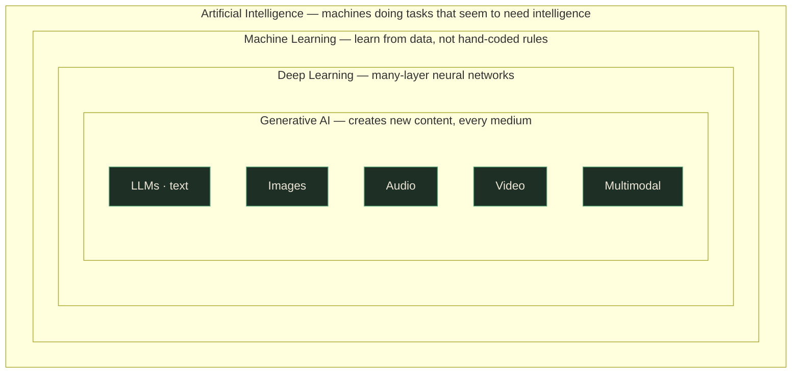
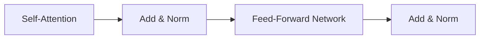
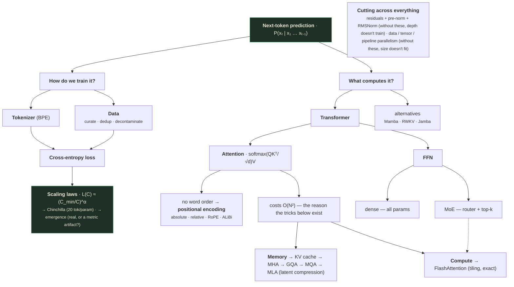

# GenAI & LLMs — Part 1: Foundations, Scale, and the Transformer

> ⚠️ **Capture note — read this once, then forget it.**
> These notes were rebuilt against the verified slide extraction at
> `slides_deduped/Lecture_14 - Module 5 Generative AI and LLMs Part 1/` (**66 deduped frames**,
> confirmed against the deck's own page counter to cover all **31 real pages** — a large upgrade
> from this file's earlier PDF-screenshot draft, which only captured ~20 of those 31 pages). All
> 66 frames were read; four real, previously-uncaptured pages — 2 ("You've already used
> Generative AI today"), 3 ("Everyone has feelings about this"), 4 ("The biggest companies on
> Earth are betting hundreds of billions on this"), and 7 ("You know deep learning. Now meet the
> model that ate NLP.") — turned out to contain real taught content. Pages 2, 3, and 4 are now
> covered in full (see the new subsection right after §2); page 7 turned out to be substantively a
> restatement of material already written up elsewhere in this file — its "one idea unfolds into
> five questions" framing is "The big picture" section, and its own five-part time-budget table is
> now correctly cited (as slide_007.jpg, not the Part-1 divider slide_008.jpg) at the end of that
> same section — so no separate subsection was needed for it. Most of the 66 deduped frames (31–65)
> are 35 build-states of one single animated Mixture-of-Experts router/expert-selection diagram
> (page 30) — one slide, heavily re-captured, not 35 distinct slides.
>
> **The one confirmed real gap:** the deck's own breadcrumb trail (visible on every §5.x slide:
> *Evolution › Transformer › Beyond › Pre-train › Families*) names a **"Pre-train" part** between
> "Beyond Transformers" and "Model families" — but its slides are **confirmed absent from the
> recording**: the deck's own page counter jumps directly from page 21 (end of "Beyond
> Transformers") to page 26 (start of "Model families & Mixture-of-Experts", labelled "Part 5" on
> its own divider slide) with no page 22–25 anywhere in either the raw 106-frame capture or the
> deduped set. This is not a capture-tool failure — the pipeline captured every frame that exists
> in the recording; the presenter appears to have skipped this part live. Because you cannot
> understand tokenization or the rest of the pre-training story without it, §14 below is a
> **written-from-scratch, clearly marked reconstruction** (`⚠️ RECONSTRUCTED SECTION`) anchored to
> the two things the deck *does* say about it (the wrap-up slide's one summary bullet, and the
> "Pre-train" breadcrumb label) — it is not a transcription of anything the presenter said, because
> nothing was recorded.

---

## What you'll understand after reading this

By the end of this document you will be able to:

1. **Explain in one sentence what an LLM actually does** — and defend why that one boring
   sentence produces essay-writing, code-generation, and translation.
2. **Draw the nesting** of AI → Machine Learning → Deep Learning → Generative AI → LLMs, and
   place any system you meet into the right box.
3. **Compute attention by hand** for a short sentence: dot products, scaling, softmax, weighted
   sum — arriving at actual numbers.
4. **Explain why attention costs $N^2$** and calculate exactly how much worse it gets when you
   double the context length.
5. **Use a scaling law to predict a model's loss before training it**, and explain why that
   single ability unlocked billion-dollar training runs.
6. **Apply the Chinchilla rule** to decide, given a fixed compute budget, how big a model should
   be and how much data it should see — and explain why modern labs deliberately break that rule.
7. **Argue both sides of the "emergent abilities" debate** and say what the evidence actually
   supports.
8. **Calculate the KV-cache memory** a model needs at inference, and explain how GQA, MQA, and
   MLA shrink it.
9. **Choose between decoder-only, encoder-only, and encoder–decoder** models for a given task,
   and justify it.
10. **Explain Mixture-of-Experts** — why a 671-billion-parameter model can cost the same to run
    as a 37-billion-parameter one.

---

## Before we start: what you need to know

The lecture assumes you already know deep learning. This section teaches **every single
prerequisite it assumed**, from zero. If you already know one, skip it. If any sentence below
stops making sense, that is exactly the sentence to slow down on.

### Prerequisite 1 — What a "model" is

> **Model** — a mathematical function with adjustable knobs, which turns an input into an output.
>
> *In everyday words:* a very elaborate vending machine. You put something in, something comes
> out, and the machine's internal settings decide what comes out.
>
> *Concretely:* the function $y = a \times x + b$ is a model. It has two knobs, $a$ and $b$. If
> $a = 3$ and $b = 1$, then feeding in $x = 2$ gives $y = 7$. Change the knobs and the same input
> gives a different answer.
>
> *Why it exists:* because we want to describe patterns in data that we cannot write down as
> explicit rules. Nobody can write the rule for "is this photo a cat", but a model with enough
> knobs can be tuned until it gets it right.

### Prerequisite 2 — What a "parameter" is

> **Parameter** — one of those adjustable knobs. A single number stored inside the model.
>
> *In everyday words:* one dial on a mixing desk with a billion dials.
>
> *Concretely:* in $y = 3x + 1$, the numbers **3** and **1** are the parameters. That model has
> **2 parameters**. GPT-3 has **175 billion** of them.
>
> *Why it exists:* parameters are *where the model's knowledge physically lives*. When people say
> a model "learned" something, they mean some parameters changed value.

When you read "**Llama 3.1 405B**", the *405B* means 405 billion parameters. That is 405 billion
individual numbers sitting in memory. At 2 bytes each, that is **810 gigabytes** just to hold the
model — which is why you cannot run it on your laptop.

### Prerequisite 3 — What "training" is

> **Training** — the process of automatically adjusting the parameters so the model's outputs get
> closer to the correct answers.
>
> *In everyday words:* tuning a radio. You turn the dial, listen to how much static there is, and
> turn it further in whichever direction reduced the static.
>
> *Concretely:* your model says the answer is **8**; the truth is **10**. It was too low, so nudge
> the parameters in the direction that raises the output. Repeat a few trillion times.
>
> *Why it exists:* nobody can hand-set 405 billion numbers. Training is the only way to find good
> values.

There are two distinct phases you must never confuse:

| Phase | What happens | How often | Who pays |
|---|---|---|---|
| **Training** | Parameters change. Extremely expensive. | Once (weeks to months on thousands of GPUs) | The lab, once |
| **Inference** | Parameters are frozen; the model just answers. | Every single time anyone uses it | Everyone, forever |

> 💡 **This distinction drives half of this lecture.** Training cost is paid once. Inference cost
> is paid on every request, forever. That asymmetry is why the field obsesses over making models
> *smaller to run* even when that makes them *more expensive to train*.

### Prerequisite 4 — Loss

> **Loss** — a single number measuring how wrong the model currently is. Lower is better; zero
> means perfect.
>
> *In everyday words:* a golf score. It is a number you are trying to drive down.
>
> *Concretely:* the model predicted **8**, the truth was **10**. One common loss is the squared
> error: $(10 - 8)^2 = 4$. If it had predicted 9, the loss would be $(10-9)^2 = 1$ — better.
>
> *Why it exists:* training needs *one* number to minimize. Loss compresses "how badly is this
> doing" into that one number, so the machinery has something to chase.

Every time you see a graph in these notes with "loss" going down, it means the model is getting
better.

### Prerequisite 5 — Gradient descent and backpropagation

> **Gradient** — for each parameter, a number saying "if you increase this parameter slightly,
> the loss goes up by this much."
>
> *In everyday words:* the slope of the ground under your feet. It tells you which way is downhill.
>
> *Concretely:* if the gradient for parameter $a$ is $+0.5$, then increasing $a$ increases the loss
> — so you should **decrease** $a$. If the gradient is $-2.0$, increasing $a$ *reduces* loss a lot,
> so increase it.
>
> *Why it exists:* with 405 billion parameters, you cannot try adjustments one at a time. The
> gradient tells you the right direction for *every parameter simultaneously*.

> **Gradient descent** — the training loop: compute the loss, compute the gradient, take a small
> step for every parameter in the downhill direction, repeat.
>
> **Backpropagation ("backprop")** — the efficient algorithm that computes those gradients. It
> works by applying the chain rule from calculus backwards through the network, from the loss at
> the output all the way back to the first layer.
>
> *In everyday words:* blame assignment. The output was wrong by 2.0. Backprop works backwards
> through the network figuring out how much of that error each parameter is responsible for.
>
> *Why it exists:* without it, computing gradients for a deep network would take one full forward
> pass *per parameter* — completely impossible at billions of parameters. Backprop gets them all
> in roughly the cost of one extra forward pass.

### Prerequisite 6 — Vectors, dot products, and why a dot product means "similarity"

> **Vector** — an ordered list of numbers.
>
> *Concretely:* $[0.2,\ -1.4,\ 0.9]$ is a 3-dimensional vector.

> **Dot product** — multiply two vectors element by element, then add everything up. The result
> is a single number.
>
> *Concretely:* $[1, 2, 3] \cdot [4, 5, 6] = (1{\times}4) + (2{\times}5) + (3{\times}6) = 4 + 10 + 18 = \mathbf{32}$.

Here is the part that matters, and almost nobody explains it: **the dot product measures
agreement in direction.**

- Two vectors pointing the **same way** → large positive dot product.
  $[1, 0] \cdot [2, 0] = 2$.
- Two vectors at **right angles** (unrelated) → dot product of zero.
  $[1, 0] \cdot [0, 5] = 0$.
- Two vectors pointing **opposite ways** → negative dot product.
  $[1, 0] \cdot [-3, 0] = -3$.

> 💡 **Remember this one fact and attention will make sense later:** *dot product = similarity
> score.* When we ask "how relevant is this word to that word", we will literally take a dot
> product of two lists of numbers.

### Prerequisite 7 — Embeddings

> **Embedding** — a vector of numbers that represents a word (or image, or anything) in a way
> where "close together" means "similar in meaning".
>
> *In everyday words:* a map of meaning. On a real map, Paris and Lyon are close because they are
> geographically near. On an embedding map, "king" and "queen" are close because they mean similar
> things.
>
> *Concretely:* a tiny 3-dimensional embedding might place
> `cat = [0.9, 0.2, -0.1]`, `dog = [0.85, 0.3, -0.2]`, `bulldozer = [-0.7, 0.9, 0.4]`.
> The dot product of `cat` and `dog` is large; `cat` and `bulldozer` is small. The model was never
> told cats and dogs are related — it discovered it from text.
>
> *Why it exists:* neural networks only do arithmetic. They cannot multiply the letters "c-a-t".
> Embeddings are the bridge from language into numbers. **Word2Vec (2013)** on the lecture's
> timeline is the moment this idea went mainstream.

The famous demonstration: $\text{king} - \text{man} + \text{woman} \approx \text{queen}$. The
*direction* from "man" to "woman" in that space encodes gender, and you can add it to other words.
That is what "meaning became geometry" means.

### Prerequisite 8 — Probability distributions and softmax

> **Probability distribution** — a set of numbers, one per option, that are all between 0 and 1
> and add up to exactly 1.
>
> *Concretely:* for a fair coin, `{heads: 0.5, tails: 0.5}`. For the next word after "The cat sat
> on the", a model might output `{mat: 0.31, floor: 0.12, roof: 0.05, ..., banana: 0.000001}`.

> **Softmax** — the function that turns *any* list of numbers into a valid probability
> distribution. Big inputs become big probabilities; the result always sums to 1.

The formula says: **take $e$ to the power of each score, then divide each result by the total, so
everything sums to one.**

$$\mathrm{softmax}(z)_i = \frac{e^{z_i}}{\sum_{j} e^{z_j}}$$

| Symbol | Read it as | What it means |
|---|---|---|
| $z$ | "zee" | The input list of raw scores (called **logits**). Can be any numbers, positive or negative. |
| $z_i$ | "zee sub i" | The $i$-th score in that list. |
| $e$ | "e" | Euler's number, $\approx 2.718$. Raising $e$ to a power is always positive — that's the point. |
| $\sum_j e^{z_j}$ | "sum over j of e to the z-j" | Add up $e^{z}$ for *every* option. This is the normalizing total. |
| $\mathrm{softmax}(z)_i$ | | The output probability for option $i$. |

**Worked example, computed fully.** Scores $z = [2.0,\ 1.0,\ 0.1]$.

```
Step 1 — exponentiate each:
  e^2.0 = 7.389
  e^1.0 = 2.718
  e^0.1 = 1.105

Step 2 — sum them:
  7.389 + 2.718 + 1.105 = 11.212

Step 3 — divide each by the sum:
  7.389 / 11.212 = 0.659
  2.718 / 11.212 = 0.242
  1.105 / 11.212 = 0.099

Result: [0.659, 0.242, 0.099]   →  sums to 1.000 ✓
```

Notice: the input gap between 2.0 and 1.0 was small, but the output gap (0.659 vs 0.242) is nearly
3×. **Softmax exaggerates differences.** That matters later — it is why attention produces sharp
"this word matters, that one doesn't" behaviour instead of mush.

### Prerequisite 9 — FLOPs

> **FLOP** — one **FL**oating-point **OP**eration: a single multiply or a single add.
>
> *In everyday words:* one unit of "arithmetic work". Like counting a recipe's effort in
> knife-chops.
>
> *Concretely:* the dot product $[1,2,3] \cdot [4,5,6]$ costs 3 multiplies + 2 adds ≈ **5 FLOPs**.
>
> *Why it exists:* it's the currency of compute. "We spent $3 \times 10^{23}$ FLOPs training this"
> is a hardware-independent way of saying how expensive a run was.

Scale reference points, so the numbers later mean something:

| Thing | Roughly how many FLOPs |
|---|---|
| Adding two numbers | $1$ |
| A modern GPU, per second | $\sim 10^{15}$ (a **petaFLOP**) |
| Training GPT-3 | $\sim 3 \times 10^{23}$ |

### Prerequisite 10 — Log scale and power laws

You will meet graphs where the axes are "log". This is not decoration; it changes what a straight
line means.

> **Log scale** — an axis where each equal step **multiplies** by a fixed factor instead of adding
> one.
>
> *Concretely:* a normal axis goes 1, 2, 3, 4, 5. A log axis goes 1, 10, 100, 1000, 10000 — with
> the same physical spacing between each.
>
> *Why it exists:* when your quantities span from 1 million to 100 billion, a normal axis crushes
> everything except the biggest value into the left edge. Log scale makes all of it visible.

> **Power law** — a relationship where one quantity is the other raised to a fixed power:
> $y = x^{\alpha}$.
>
> *In everyday words:* "every time I multiply the input by 10, the output changes by a fixed
> multiplier." Not "a fixed amount" — a fixed *multiplier*.
>
> *Concretely:* with $y = x^{-0.5}$: at $x=100$, $y = 0.1$. At $x = 10{,}000$ (100× more),
> $y = 0.01$ (10× smaller). Multiplying $x$ by 100 always divides $y$ by 10, no matter where you
> start.
>
> *Why it exists here:* because **a power law is a straight line on log-log axes**. That is the
> entire visual signature of scaling laws — you will see it in section 4.

### Prerequisite 11 — Token

This one is so central it gets its own full treatment in the pre-training section, but you need
the short version now.

> **Token** — the small chunk of text that a model actually reads and writes. Usually a word, a
> word-piece, or a punctuation mark — **not** exactly a word.
>
> *Concretely:* `"unbelievable"` might be split into three tokens: `un` + `believ` + `able`. The
> sentence `"The cat sat."` is roughly 4 tokens: `The`, ` cat`, ` sat`, `.`
>
> *Rule of thumb for English:* **1 token ≈ 0.75 words**, or **100 tokens ≈ 75 words**.

Everything an LLM does is measured in tokens: context length, price, speed, training data size.

### Prerequisite 12 — Autoregressive generation

> **Autoregressive** — generating output one piece at a time, where each new piece is produced by
> feeding all the previous pieces back in as input.
>
> *In everyday words:* writing a sentence where, before each word, you re-read everything you have
> written so far.
>
> *Concretely:*
> ```
> Input: "The cat sat on the"        → model outputs "mat"
> Input: "The cat sat on the mat"    → model outputs "."
> Input: "The cat sat on the mat."   → model outputs <end>
> ```
>
> *Why it exists:* the model only ever knows how to answer one question — "what comes next?" To
> produce a paragraph, you just ask that question repeatedly.

> 💡 **This is the single most important mechanical fact in the entire lecture.** ChatGPT writing
> you a 500-word essay is that loop running 650-ish times. There is no separate "essay module".

---

## The big picture

Here is the whole lecture in one paragraph, before any detail.

For about forty years, people built systems to do one boring thing: **given some text, guess the
next word.** The methods changed — counting tables in the 1990s, recurrent networks around 2010,
the Transformer in 2017 — but the task never changed. Then around 2020 something unexpected
happened. When researchers made that same next-word-guesser *enormous* — more parameters, more
text, more compute — it stopped being merely a next-word-guesser. It could translate, summarise,
write code, and pass exams. **Nobody trained it to do those things.** They fell out of doing the
one boring thing extremely well.

The lecture then answers five questions about that:

1. **What made scale work, and can we predict it?** → Scaling laws, Chinchilla, emergence.
2. **What is the machine actually doing inside?** → The Transformer, attention, position, and
   the engineering tricks that make it affordable.
3. **Is the Transformer the final answer?** → The quadratic wall, and Mamba/RWKV/Jamba trying to
   climb around it.
4. **What goes in before training starts?** → Data curation and tokenization. *(Confirmed never
   presented in this recording — reconstructed below from the deck's own wrap-up bullet and
   breadcrumb label; see the capture note and §14.)*
5. **What models actually exist, and how do I choose one?** → Decoder-only vs encoder-only,
   open vs closed, and Mixture-of-Experts.

One line to carry through everything: **the Transformer barely changed since 2017. Everything else
did.**

### Before the timeline: why this lecture, why now

*(slide_002.jpg, slide_003.jpg, slide_004.jpg — the deck's own three scene-setting slides, shown
right after the title card and before the historical timeline. These were missing from an earlier
draft of this file; they are real, presented content, not decoration.)*

The deck opens by establishing three things a reader should know before any technical content:

**1. You already use this (slide_002.jpg).** The presenter's point: "Generative AI" is not a
future technology — it is the tool grid you already touch daily: **ChatGPT** and **Claude** draft
your email and explain code, **Gemini** lives inside Gmail and Docs, **Copilot** writes whole
functions, **Canva AI** generates the poster, **Grammarly** rewrites your tone, **Notion AI**
summarises your notes, **Alexa+** is Amazon's own GenAI assistant, and on the build/dev side
**Cursor**, **v0**, **Replit**, **Photoshop AI**, **Figma AI**, **Suno**, **GitHub** (Copilot
review), and **Hugging Face** ("where the models live"). The slide's own framing of what changed:
*"Old AI: it recognised & ranked what already existed. New AI: it creates things that never
existed."* A meta-detail worth remembering for later discussions of what these models can do:
*"Claude generated these very slides — charts and all."*

**2. The mood is mixed, and that's fair (slide_003.jpg).** Three honest tensions, each illustrated:
- *"Will AI take my job?"* — Tech saw **~500k layoffs across 2023–2025** ⚠️ verify this (a
  lecturer-stated, fast-moving figure, not independently re-verified here — and "AI" is only *named*
  in many of these layoffs, not proven as the sole cause), and the slide's own honest take: AI
  **reshapes** roles faster than it **deletes** them.
- *"Companies, mid-2025"* — many organisations sped toward "replace everyone with an LLM," then saw
  the **monthly token bill** and swerved back to **humans + AI together**. The slide's phrase: "the
  hype meets the invoice."
- *"Every team's GenAI plan"* — the familiar arc *"just call a giant API model" → "ship it fast" →
  "it works!" → "…the bill is HOW much?"* Cost and control are the catch this lecture (KV-cache,
  MoE, quantization) exists to address.

**3. The money confirms this isn't a fad (slide_004.jpg).** ⚠️ **Every number below is the
presenter's live-2026 framing of fast-moving events (funding rounds, IPO filings) — treat the
*shape* of the picture (colossal, concentrated, multi-hundred-billion-dollar bets) as durable, and
each specific dollar figure as a snapshot that will already be stale by the time you read this.**
Who's backing whom: **Amazon → both labs** (~$8B in Anthropic/Claude, ~$50B in OpenAI, plus AI
infrastructure — backing both leaders at once); **Microsoft → OpenAI** (~$13B+, runs on Azure);
**Google & Meta build their own** (Gemini, open-weight Llama; Google also separately backs
Anthropic). The 2026–27 numbers the slide names: **OpenAI** filed for IPO (June 2026), last valued
~$850B, eyeing a ~$1T listing; **Anthropic** also filed for IPO, targeting a fall-2026 listing near
~$965B; **Big Tech AI capex in 2026–27** exceeds **$600B+** — "the largest infrastructure build-out
in history"; and **NVIDIA**, which sells the GPUs everyone trains on, is valued at **$4T+**, the
most valuable company on Earth.

> 💡 **Why this belongs before any technical content.** Section 5's Chinchilla worked example asks
> you to reason about a $10M training run as a real capital decision; §10's KV-cache crisis and
> §17's MoE section are both, underneath the math, cost-engineering problems. These three slides
> are the deck's way of saying: the technical material that follows isn't academic — it is the
> literal reason hundreds of billions of dollars are moving right now.

The deck's own agenda slide — **slide_007.jpg**, "You know deep learning. Now meet the model that
ate NLP," under the header "The next 40 minutes" (slide_008.jpg is only the one-line "Part 1 · 10
min" divider that follows it) — budgets five parts by time: **From language models to LLMs**
(10 min, §§1–6 below), **Inside the Transformer** (10 min, §§7–11), **Beyond Transformers**
(3 min, §§12–13), **Pre-training pipeline** (8 min — the confirmed-skipped part; see the capture
note above and §14), and **Model families & Mixture-of-Experts** (9 min, §§15–17). The same slide's
other framing — "one idea, predict the next token, unfolds into five questions" — is exactly the
shape of "The big picture" section just above.

---

## 1. The road here: a 75-year run-up

*(slide_005.jpg — "What changed? A 75-year run-up to this moment")*

The slide is a timeline. Timelines are easy to skim and forget, so here is what each entry
actually was and why it earned a place.

| Year | Event | Why it mattered |
|---|---|---|
| **1950** | **Turing Test** proposed | Alan Turing asked "can machines think?", decided the question was too vague, and replaced it with a testable one: *can a machine converse well enough that a human can't tell it's a machine?* This reframed intelligence as **observable behaviour**, which is still how we benchmark models. |
| **1956** | **Dartmouth workshop** coins "Artificial Intelligence" | A summer workshop that named the field. The proposal predicted significant progress in *two months*. It took seventy years. |
| **1966** | **ELIZA**, the first chatbot | A tiny rule-based program that imitated a therapist by reflecting your words back ("I feel sad" → "Why do you feel sad?"). It had **no understanding at all** — yet people confided in it. The lesson (the "ELIZA effect") is that humans over-attribute understanding to anything that talks. Keep that in mind whenever a model impresses you. |
| **1997** | **Deep Blue beats Kasparov** | IBM's chess machine beat the world champion — but by **brute-force search**, evaluating ~200 million positions per second, using hand-coded chess knowledge. It proved that superhuman performance in a narrow domain does not require learning. It was the high-water mark of the "hand-code the rules" era. |
| **2013** | **Word2Vec: word embeddings** | Meaning became geometry (Prerequisite 7). Words became vectors, and similarity became arithmetic. This is where modern NLP begins. |
| **2017** | **Transformer architecture** (Google) | The architecture this entire lecture is about. One paper, *Attention Is All You Need*. Everything after this date runs on it. |
| **2018** | **BERT & GPT-1** | The two branches of the Transformer family split here: BERT (read everything, understand) and GPT (read left-to-right, generate). Both proved **pre-train once, adapt cheaply** works. |
| **2020** | **GPT-3 shows scale works** | 175 billion parameters. The moment the field learned that *scale itself* was a strategy — you didn't need a new architecture, just a much bigger one. |
| **2022** | **ChatGPT goes mainstream** | The technology didn't change much; the **interface** did. A chat box put a research artifact in front of a hundred million people. |
| **2023** | **GPT-4, Llama, Claude, Gemini** | The competitive era. Critically, **Llama** made high-quality weights downloadable, which created the open-weight ecosystem. |
| **2025** | **Reasoning models; DeepSeek R1** | Models trained to "think" before answering — generating long internal chains of working. The new axis of improvement stopped being *size* and became *thinking time at inference*. |
| **2026** | **Claude Fable; GPT-5; IPO era** | The current moment on the slide. |

The slide colour-codes these into three eras: **deep learning + NLP** (up to ~2018), the **LLM
era** (2020–2023), and **reasoning & agents** (2025+). The caption notes: *"watch the gaps
collapse toward 2026."* The gap from Turing Test to first chatbot was 16 years. The gap from
GPT-3 to ChatGPT was 2. From ChatGPT to reasoning models, 3.

> ⚠️ **verify this** — the 2025 and 2026 entries (Claude Fable, GPT-5, "IPO era") are the
> lecturer's framing of very recent events. Treat exact dates and product names as approximate;
> the *shape* of the trend is the durable part.

> 💡 **The point of this slide isn't the dates.** It is that **three of the four most important
> entries are in the last six years.** For seventy years progress was slow and rule-based; then a
> single architecture plus scale compressed decades of expectation into a handful of years.

The slide's own control is a moving marker: *"The pulse walks the timeline; watch the gaps collapse
toward 2026."*

```interactive
type: animation
title: The pulse walks the timeline
concept: Progress didn't accelerate steadily — the gap between milestones itself shrank
control: The deck's own timeline-pulse animation, replaying left to right from 1950 to 2026
observe: A marker travels the timeline at constant speed; the milestones it passes arrive closer and closer together as it nears 2026 — 16 years between Turing Test and ELIZA, versus 2 years between GPT-3 and ChatGPT, versus 1 year between reasoning models and the current moment
insight: A constant-speed pulse hitting shrinking gaps is a more visceral way to feel "the gaps are collapsing" than reading the year numbers in a table — the same information, but the compression is something you watch happen rather than compute
fallback: The gap arithmetic already given above (16 years → 2 years → 3 years → ~1 year between successive milestone pairs) is the exact sequence of intervals this pulse's speed would visibly compress.
```

### Where people get confused

**You might think** each timeline entry replaced the last. **Actually** they compound. Word2Vec's
embeddings are still literally the first layer of a modern LLM. Transformers didn't discard
embeddings — they were built on top of them.

**You might think** Deep Blue was an early AI like today's. **Actually** it is the *opposite*
kind of system: humans wrote the chess knowledge, and the machine searched. Modern models are
given no knowledge and learn it from data. Deep Blue is the last great success of the approach
that lost.

---

## 2. The words: GenAI, LLM, and everything else

*(slide_006.jpg — "So what exactly are 'GenAI' and an 'LLM'?")*

The slide's key visual is a set of **nested boxes** — not a Venn diagram of overlapping circles,
but boxes strictly *inside* each other. Each field sits **inside** the last.



Layer by layer:

> **Artificial Intelligence (AI)** — the broad goal of machines doing things that seem to need
> human intelligence.
>
> *In everyday words:* the ambition, not a technique. "Make the machine seem smart."
>
> *Concretely:* a thermostat is not AI. A chess engine is. A spam filter is. They share no
> technology — only the ambition.
>
> *Why it exists:* it is the umbrella term from 1956. It says what we want, not how.

> **Machine Learning (ML)** — instead of hand-coding rules, learn them from data.
>
> *In everyday words:* showing instead of telling. You don't explain what spam looks like; you
> show 10,000 spam emails and let the system work it out.
>
> *Concretely:* hand-coded rule: `if subject contains "FREE MONEY" then spam`. ML instead: feed in
> labelled emails, and the system discovers *by itself* that "FREE" plus lots of capitals plus an
> unknown sender predicts spam — including patterns no human would have written down.
>
> *Why it exists:* hand-written rules break. Spammers write "F.R.E.E". A learned model adapts by
> retraining; a rule list needs a human to patch it forever.

> **Deep Learning (DL)** — machine learning built on neural networks with **many layers**.
>
> *In everyday words:* an assembly line for understanding. Each station does one simple
> transformation and hands the result on; by the end, something complicated has been built out of
> many simple steps.
>
> *Concretely:* in an image network, layer 1 detects edges, layer 4 detects shapes like circles,
> layer 10 detects "eye" and "wheel", layer 20 detects "cat" vs "car". **Nobody programmed those
> stages** — the layers organised themselves that way during training.
>
> *Why it exists:* older ML needed humans to hand-design the useful input features ("feature
> engineering"). Deep learning learns the features too. "Deep" literally just means "many layers".

> **Generative AI (GenAI)** — deep models that **create brand-new content** rather than only
> labelling content that already exists.
>
> *In everyday words:* the difference between a critic and an author. A classifier looks at a
> photo and says "cat". A generative model produces a photo of a cat that has never existed.
>
> *Concretely:*
> - *Discriminative (not GenAI):* input a photo → output the label `cat`.
> - *Generative:* input the words "a cat riding a skateboard" → output a 1024×1024 image.
>
> *Why it exists:* for decades, ML was overwhelmingly about classification and prediction —
> sorting things into buckets. Generation is a strictly harder problem: to produce a convincing
> cat you must model what cats look like *in general*, not just what separates cats from dogs.

The slide lists GenAI's media: **text, images, audio/music, video,** and **multimodal** (models
that mix them — e.g. take an image plus a question and answer in text). Named examples on the
slide: **Sora** and **Veo** (video generation), **Runway** (video tools).

> **Large Language Model (LLM)** — the slice of Generative AI **specialised for language**.
>
> *In everyday words:* the text branch of the generative family. ChatGPT, Claude, Gemini, and
> Llama all live here.
>
> *Concretely:* input "Explain gravity to a six-year-old" → output several paragraphs of new text.
>
> *Why it exists:* text is the medium with by far the most training data (the entire internet is
> text), and it is the interface humans already use for everything. Language models got big first
> because language was cheapest to collect.

### The one sentence that matters

The slide ends with a boxed note, and it is the thesis of the entire lecture:

> 💡 **Worth remembering:** an LLM learned, from enormous amounts of text, to **predict the next
> word** — and that one trick turns out to be shockingly powerful. The rest of this talk is *why*.

### Where people get confused

**You might think** "Generative AI" and "LLM" are two names for the same thing. **Actually** LLMs
are one *subset* of GenAI. An image generator is GenAI but not an LLM. Every LLM is GenAI; not
every GenAI is an LLM.

**You might think** the boxes overlap partially, like a Venn diagram. **Actually** on this slide
they are strictly nested. Every LLM is a deep learning model; every deep learning model is machine
learning; all of it is AI. There is no "LLM that isn't ML".

**You might think** "large" in LLM refers to the training data. **Actually** it conventionally
refers to the **parameter count** — though in practice big models are trained on big data too, so
both are large. There is no official threshold at which a language model becomes "large"; the term
is informal, roughly meaning "billions of parameters, trained on internet-scale text".

### 🔬 Research opportunity

The boundary of "generative" is genuinely blurry and actively debated. A classifier that outputs a
probability distribution over 1,000 labels *is* modelling a distribution. Some researchers argue
the discriminative/generative split is a historical artifact rather than a real dividing line.
Worth reading around if you like foundational questions.

---

## 3. Forty years of "guess the next word"

*(slide_009.jpg — 1.1 Evolution)*

### The constant that never changed

Every model on the slide's bar chart — from 1990s counting tables to GPT-5 — is trained to compute
exactly one thing.

**In words, the formula says: given all the tokens so far, produce a probability for every
possible token that could come next.**

$$P(x_t \mid x_1, x_2, \ldots, x_{t-1})$$

| Symbol | Read it as | What it means |
|---|---|---|
| $P(\cdot)$ | "probability of" | A number between 0 and 1. All the possible next tokens' numbers add to 1. |
| $x_t$ | "x sub t" | The token at position $t$ — **the one we're trying to predict**. |
| $x_1, \ldots, x_{t-1}$ | "x one through x t-minus-one" | Every token before it. The context. |
| $\mid$ | "**given**" | The conditioning bar. Everything to its right is what we already know. |
| $t$ | "t" | Position index in the sequence. $t=1$ is the first token. |

Read the whole thing aloud as: *"the probability of the token at position t, **given** everything
before it."*

**Concretely.** Context = `"The cat sat on the"`. So $x_1 = $ `The`, $x_2 = $ `cat`,
$x_3 = $ `sat`, $x_4 = $ `on`, $x_5 = $ `the`, and we want $x_6$. The model outputs a probability
for **every token in its vocabulary** (often 100,000+ of them):

```
P(mat    | "The cat sat on the") = 0.31
P(floor  | "The cat sat on the") = 0.12
P(chair  | "The cat sat on the") = 0.09
P(table  | "The cat sat on the") = 0.07
...
P(banana | "The cat sat on the") = 0.0000004
                                   ─────────
                       all 100,000+ sum to 1.00
```

That is the *entire* output of an LLM. One probability distribution over the vocabulary. To
generate text, you pick one (usually sampling, not always the top one), append it, and run again —
the autoregressive loop from Prerequisite 12.

> 💡 **The task never changed in forty years.** What changed was only the model's **memory** and
> its **parallelism**. Hold that as your organising idea for this section.

### The five generations

The slide shows five bars of increasing height:

#### N-gram (~1990s) — "counts; forgets after a few words"

> **N-gram model** — predict the next word by counting how often each word followed the previous
> $n{-}1$ words in a big pile of text.
>
> *In everyday words:* a giant tally chart. "In my corpus, after 'sat on the', the word 'mat'
> appeared 4,120 times and 'roof' 60 times — so 'mat' is more likely."
>
> *Concretely, a trigram ($n=3$) model:*
> ```
> Count("sat on the mat")   = 4120
> Count("sat on the roof")  =   60
> Count("sat on the ___")   = 6000   (all continuations)
>
> P(mat  | "on the") = 4120 / 6000 = 0.687
> P(roof | "on the") =   60 / 6000 = 0.010
> ```
>
> *Why it existed:* it is simple, fast, needs no training in the gradient-descent sense, and it
> genuinely worked for early speech recognition and phone keyboards.

**Its fatal flaw — and the flaw is the whole story of the next 30 years.** An n-gram has a fixed,
tiny window. A 5-gram sees **four words back and nothing more**. Consider:

> *"The doctor finished the surgery. She removed her gloves, walked to the sink, washed her
> hands, and then **___**"*

To predict sensibly you need "doctor" and "surgery", which are 15+ words back. A 5-gram literally
cannot see them. The slide's phrase is **"forgets after a few words"**.

There is a second, deeper problem: **combinatorial explosion**. With a 50,000-word vocabulary,
the number of possible 5-grams is $50{,}000^5 = 3.1 \times 10^{23}$. You will never see most of
them even once, so most counts are zero, so most predictions are undefined. This is called
**data sparsity**.

#### RNN (2010) — "a running memory, trained step-by-step"

> **Recurrent Neural Network (RNN)** — a network that reads one token at a time while carrying a
> "memory" vector forward from step to step.
>
> *In everyday words:* reading a book while keeping one running summary in your head. After each
> word you update the summary. You never re-read; you just carry the summary.
>
> *Concretely:*
> ```
> memory = [0, 0, 0]            (start blank)
> read "The"    → memory = [0.2, -0.1,  0.4]
> read "cat"    → memory = [0.7,  0.3, -0.1]
> read "sat"    → memory = [0.5,  0.8,  0.2]
> predict next word from memory = [0.5, 0.8, 0.2]
> ```
>
> *Why it exists:* it fixes the n-gram's fixed window. In principle the memory can carry
> information from *any* distance back, because it is updated at every step.

**Two flaws.**

1. **Vanishing gradients.** In practice the memory forgets. Each step multiplies the old memory
   by a matrix; after 50 steps, the influence of the first word has been multiplied 50 times and
   has typically shrunk to near-nothing. So "in principle unlimited memory" became "in practice
   about 10–20 words".
2. **Sequential training.** This is the one that killed RNNs commercially. To compute step 100 you
   need step 99, which needs step 98… You **cannot parallelise across the sequence**. A GPU with
   10,000 cores sits mostly idle waiting for one token at a time.

#### LSTM (2014) — "gated memory, longer dependencies"

> **LSTM (Long Short-Term Memory)** — an RNN with learned **gates** that explicitly decide what to
> keep, what to throw away, and what to output at each step.
>
> *In everyday words:* the running summary now has an editor. At every word the editor decides:
> "is this worth remembering? should I delete something old?"
>
> *Concretely:* reading *"The doctor… she…"*, the forget gate learns to **hold on to** the subject
> "doctor" across many words, so that "she" can be resolved correctly, while dropping filler like
> "the" and "and".
>
> *Why it exists:* the gates give gradients a protected path to flow backwards through time, which
> largely fixes vanishing gradients. LSTMs stretched useful memory from ~10 words to a few hundred.

But **flaw 2 remained**: still sequential, still cannot parallelise across the sequence. That
ceiling is what capped model size before 2017.

#### Transformer (2017) — "whole context at once, parallel training"

The Transformer's move is to **stop reading sequentially altogether**. It ingests the entire
sequence simultaneously, and lets every token look directly at every other token via attention.

Two consequences, both enormous:

1. **No distance decay.** Token 1 and token 1000 are one operation apart, not 999 steps apart.
   The "doctor…she" problem vanishes structurally.
2. **Full parallelism.** All positions compute at once, so training saturates thousands of GPUs.

> 💡 **This is the actual cause of the LLM era.** Not that Transformers were smarter per parameter
> — that they were *trainable at scale*. The slide's exact phrasing: *"which is what let scale
> happen."*

#### LLM (2020→) — "same task, scaled to billions of params"

No new architecture. Same next-token objective. Just vastly more of everything.

### Comparison table

| Model | Era | Memory reach | Trains in parallel? | Killed by |
|---|---|---|---|---|
| **N-gram** | ~1990s | ~4 words (fixed) | N/A (just counting) | Can't see far; data sparsity |
| **RNN** | 2010 | ~10–20 words in practice | ❌ No | Vanishing gradients; sequential |
| **LSTM** | 2014 | ~100s of words | ❌ No | Still sequential → can't scale |
| **Transformer** | 2017 | Full context window | ✅ Yes | (still standard) — but costs $O(N^2)$ |
| **LLM** | 2020→ | 8K → 1M+ tokens | ✅ Yes | — |

### Where people get confused

**You might think** the Transformer won because it was a better predictor per parameter.
**Actually** its decisive advantage was **parallel training**. An LSTM and a Transformer of equal
size perform comparably on small data. But you can train a 175B Transformer in weeks, and you
essentially cannot train a 175B LSTM at all. Trainability *is* the advantage.

**You might think** RNNs are dead. **Actually** they're back — Mamba and RWKV (section 11) are
modern recurrent models redesigned so they *can* train in parallel. The idea wasn't wrong; the
1990s implementation was.

**You might think** n-grams are obsolete. **Actually** they still run in low-power settings —
phone keyboards, some speech systems — where a 200 MB model that responds in microseconds beats a
better model that can't fit.

### 🎯 Interview questions

- *Why couldn't we just make LSTMs bigger instead of inventing Transformers?* → Sequential
  dependency prevents parallelisation across sequence positions; wall-clock training time scales
  with sequence length, so large-scale training is infeasible regardless of hardware budget.
- *An n-gram and an LLM both estimate $P(x_t \mid \text{context})$. What's actually different?* →
  The n-gram estimates it by **counting** exact string matches with a fixed truncated context;
  the LLM estimates it with a **learned function** over an unbounded (up to context-length)
  history, which lets it generalise to word sequences it has never seen.

---

## 4. Scaling laws: loss falls like clockwork

*(slide_010.jpg — 1.2 Scaling Laws)*

### The intuition first

Suppose you train a small model and it reaches a loss of 4.0. You train one ten times bigger and
get 3.5. Ten times bigger again: 3.0. Again: 2.5.

Notice the pattern. Each **multiplication** of compute by 10 produced the same **subtraction** of
0.5 from the loss. That is not obvious — it could have been random, or it could have plateaued
immediately. Instead it is a clean, repeatable ruler.

**Kaplan et al. (2020)** measured this across many orders of magnitude and found it held
astonishingly well.

### The formula

**In words, the formula says: the loss you end up with is set by how much compute you spend, and
it shrinks by a predictable multiplier every time you multiply your compute.**

$$L(C) \approx \left(\frac{C_{\min}}{C}\right)^{\alpha}$$

| Symbol | Read it as | What it means |
|---|---|---|
| $L$ | "loss" | How wrong the model is on average, measured on **held-out text it never trained on**. Lower is better. |
| $L(C)$ | "L of C" | The loss you get *as a function of* how much compute you spent. |
| $C$ | "compute" | Total arithmetic spent training, in **FLOPs**. |
| $C_{\min}$ | "C-min" | A reference constant, fitted from data. It sets where the curve sits vertically; it is not something you choose. |
| $\alpha$ | "alpha" | The **exponent** — the slope of the line on log-log axes. Small, typically around **0.05** for compute (⚠️ not printed on this slide — see the worked example below for the source). |
| $\approx$ | "approximately equals" | It's an empirical fit, not a law of physics. It holds well in the measured range and is not guaranteed outside it. |

### Why the graph is a straight line

The slide's chart has **test loss (log)** on the vertical axis and **compute (log scale)** on the
horizontal, and the orange line is perfectly straight. Here is why that happens — this is the
single most useful piece of math intuition in the section.

Take the logarithm of both sides of the formula:

$$\log L = \alpha \log C_{\min} - \alpha \log C$$

Compare that to the equation of a straight line, $y = mx + b$:

| Straight line | Our equation |
|---|---|
| $y$ | $\log L$ |
| $x$ | $\log C$ |
| slope $m$ | $-\alpha$ |
| intercept $b$ | $\alpha \log C_{\min}$ |

It **is** a straight line — just in log-log coordinates.

> 💡 **Whenever you see a straight line on log-log axes, a power law is hiding underneath.** This
> is a pattern-recognition skill worth internalising; it shows up throughout ML systems work.

### Worked example — predicting a model's loss before training it

> ⚠️ **verify this — not stated on the slide.** The slide (slide_010.jpg) shows only the
> qualitative log-log chart and the bare formula $L(C) \approx (C_{\min}/C)^\alpha$; it does not
> print a numeric value for $\alpha$. The value $\alpha = 0.05$ used below is taken from **Kaplan et
> al. (2020)**'s own published fit for compute, not read off this slide — it is a real, correctly
> cited number, just not a slide-sourced one, so treat it as an illustrative anchor rather than
> "the number the lecturer wrote."

Say you fit a scaling law and find $\alpha = 0.05$. You train a model with
$C_1 = 10^{21}$ FLOPs and measure $L_1 = 3.00$.

Your boss asks: *what loss would we get with $C_2 = 10^{23}$ FLOPs* — 100× the compute, roughly
$10 million of GPU time?

You do not need to train it. Take the ratio of the two predicted losses; the unknown $C_{\min}$
cancels out:

```
L2 / L1 = (C_min/C2)^α / (C_min/C1)^α
        = (C1 / C2)^α

C1 / C2 = 10^21 / 10^23 = 10^-2 = 0.01

L2 / L1 = 0.01^0.05

Compute 0.01^0.05:
  ln(0.01)          = -4.6052
  -4.6052 × 0.05    = -0.23026
  e^(-0.23026)      = 0.7943

L2 = 3.00 × 0.7943 = 2.383
```

**Answer: the 100×-compute model should reach a loss of about 2.38.**

Now flip the question, because this is how it's used in practice. *How much compute to reach
$L = 2.00$?*

```
2.00 / 3.00 = (10^21 / C2)^0.05
0.6667      = (10^21 / C2)^0.05

Raise both sides to the power 1/0.05 = 20:
0.6667^20 = 10^21 / C2

  ln(0.6667) = -0.4055
  -0.4055 × 20 = -8.109
  e^(-8.109) = 3.006 × 10^-4

3.006e-4 = 10^21 / C2
C2 = 10^21 / 3.006e-4 = 3.33 × 10^24 FLOPs
```

**Answer: about $3.3 \times 10^{24}$ FLOPs** — roughly **3,300×** the compute of the first run, to
move loss from 3.00 to 2.00.

> 💡 **Look hard at that last number.** A modest-sounding improvement in loss cost three thousand
> times the compute. The small exponent $\alpha \approx 0.05$ means **brutal diminishing returns**.
> Scaling laws are simultaneously the good news (progress is predictable) and the bad news
> (progress is exponentially expensive).

### Why this mattered so much

The slide gives three bullets. Each deserves unpacking.

**1. "For the first time you could predict a bigger model's loss before training it — so spending
$10M on compute became a calculated bet, not a gamble."**

Before 2020, deciding to spend $10M on a training run was a leap of faith; the model might come
out no better than the last one. Scaling laws let you train three small cheap models, fit the
line, extrapolate, and *know roughly what you'll get*. **This is the single fact that unlocked
industrial-scale funding for LLMs.** It converted research gambling into capital budgeting.

**2. "Smooth, not magic. Loss itself has no cliffs. It just keeps sliding down."**

There is no compute threshold where loss suddenly collapses. Keep this in mind for the emergence
debate in section 6 — the *loss* curve is smooth even when *benchmark score* curves look jumpy.

**3. "Architecture details matter far less than scale within this regime."**

Kaplan found that reasonable architectural variations — layer count vs width, minor design
choices — mattered far less than simply how much compute you spent. This was demoralising for
architecture researchers and enormously clarifying for everyone else.

> ⚠️ **The slide oversimplifies here, and you should know the caveat.** "Architecture doesn't
> matter" holds for *variations within the Transformer family in the measured range*. It is not
> a general truth. If it were, MoE, GQA, and FlashAttention — the rest of this lecture — would be
> pointless. What is true: architecture mostly changes the **constant** in front, while scale
> changes the trajectory. A better architecture shifts the line down; it rarely tilts it.

### Where people get confused

**You might think** scaling laws promise that infinite compute gives zero loss. **Actually** the
full Kaplan-style formulation includes an **irreducible loss** term — a floor set by the genuine
randomness of language. Even a perfect model cannot know whether the next word is "mat" or "rug".
The version on the slide omits that term for simplicity.

**You might think** the law is proven. **Actually** it is an **empirical fit** over a measured
range. Extrapolating far beyond where it was measured is an assumption, not a guarantee, and
whether it holds at $10^{27}$ FLOPs is a live question.

**You might think** loss is the thing users care about. **Actually** nobody buys a product because
its cross-entropy is 2.38. The link from loss to *useful behaviour* is exactly what section 6
argues about.

### 🔬 Research opportunity

Scaling laws for **data quality** rather than data quantity are under-explored: how does the
exponent change if you train on curated text versus raw web scrape? Also open — scaling laws for
**inference-time compute** (reasoning models that "think longer"), which is a much newer curve
than the training-compute one.

---

## 5. Chinchilla: most big models were under-fed

*(slide_011.jpg — 1.3 Compute-Optimal Training)*

### The question

Scaling laws say more compute → lower loss. But **compute is not one thing you buy.** You spend it
two ways:

- **Bigger model** (more parameters, $N$)
- **More data** (more training tokens, $D$)

The compute cost is, to a good approximation, their product:

**In words: total training compute is roughly six times the parameter count times the number of
training tokens.**

$$C \approx 6ND$$

| Symbol | Read it as | What it means |
|---|---|---|
| $C$ | "compute" | Total training FLOPs. |
| $N$ | "N" | Number of parameters in the model. |
| $D$ | "D" | Number of training tokens the model sees. |
| $6$ | "six" | A constant. Roughly: 2 FLOPs per parameter for the forward pass, ~4 for the backward pass. |

So given a fixed budget $C$, you face a genuine trade-off. A huge model on little data, or a small
model on tons of data? **Everyone before 2022 guessed wrong.**

### The finding (2022)

**Hoffmann et al.** (the Chinchilla paper, DeepMind) trained over 400 models at many size/data
combinations and found the compute-optimal answer:

> **Scale parameters and tokens *together* — roughly 20 tokens per parameter.**

| Model size $N$ | Chinchilla-optimal tokens $D$ |
|---|---|
| 1B | 20B |
| 7B | 140B |
| 70B | 1.4T |
| 405B | 8.1T |

### The receipts

The slide's evidence is a direct head-to-head:

| Model | Parameters | Training tokens | Tokens/param | Result |
|---|---|---|---|---|
| **Gopher** | 280B | 300B | ~1.07 | Beaten |
| **Chinchilla** | 70B | 1.4T | 20 | **Won** |

**Chinchilla is 4× smaller than Gopher and beats it on nearly every benchmark**, using the *same*
training compute. Gopher wasn't too big — it was **under-fed**. It had the capacity to learn far
more than it was ever shown.

> 💡 **The analogy that makes it stick:** Gopher is a student with a photographic memory who was
> only given three textbooks. Chinchilla is an ordinary student given sixty textbooks. Same total
> study hours. The second one knows more. Capacity you never fill is capacity you wasted.

### Worked example — planning a real training run

You have **$10^{23}$ FLOPs** of budget. What should you build?

```
Step 1 — the two constraints:
  C = 6 N D          (compute budget)
  D = 20 N           (Chinchilla ratio)

Step 2 — substitute D:
  10^23 = 6 × N × (20 N)
  10^23 = 120 N²

Step 3 — solve for N:
  N² = 10^23 / 120 = 8.333 × 10^20
  N  = sqrt(8.333e20) = 2.887 × 10^10

Step 4 — get D:
  D = 20 N = 5.77 × 10^11
```

**Answer: build a model with ≈ 28.9 billion parameters and train it on ≈ 577 billion tokens.**

Sanity-check the compute: $6 \times 2.887{\times}10^{10} \times 5.77{\times}10^{11} = 1.0 \times 10^{23}$ ✓

Now compare against the pre-Chinchilla instinct — say you'd spent the same budget on a **175B**
model instead:

```
D = C / (6N) = 10^23 / (6 × 1.75e11) = 9.52 × 10^10 = 95 billion tokens
Tokens per parameter = 95e9 / 175e9 = 0.54
```

That is **0.54 tokens per parameter — 37× under-fed** relative to Chinchilla-optimal. And that is
essentially what GPT-3 was: 175B parameters on ~300B tokens (~1.7 tokens/param). By Chinchilla's
result, a much smaller model on the same budget would have been better.

### Why *you* care: the inference argument

The slide's third bullet is the one with commercial teeth:

> **A smaller, well-fed model is cheaper to serve forever. Training is paid once; inference is
> paid every request.**

Return to Prerequisite 3's table. Suppose 70B and 280B models are equally good.

- **Training:** both cost the same (that was the premise). Paid once.
- **Inference:** the 280B model needs ~4× the compute and ~4× the memory **on every single
  request, forever**. At a billion requests a month, that difference is the entire business.

### The twist: modern models deliberately break Chinchilla

The slide's final bullet:

> **Modern open models now train *past* Chinchilla-optimal on purpose — trading training cost for
> a smaller, cheaper-to-run model.**

This looks like a contradiction. It isn't — it's optimising a *different* objective.

- **Chinchilla optimises:** best loss for a fixed **training** budget.
- **Industry optimises:** best loss for a fixed **inference** budget (or for what fits on one GPU).

If you plan to serve a model billions of times, it is rational to burn extra training compute to
make it smaller. **Llama 3 8B** was trained on ~15 trillion tokens — that is roughly **1,875
tokens per parameter**, about **94× past Chinchilla-optimal**. Wildly compute-inefficient to
train. Wonderfully cheap to run, and it fits on a consumer GPU.

> 💡 **The real lesson:** "compute-optimal" always means *optimal for a stated objective*. Change
> the objective, change the answer. Chinchilla wasn't wrong; the industry is answering a different
> question.

### Reading the slide's chart

The chart plots **final loss** (vertical) against **model size in parameters, log scale**
(horizontal), with several U-shaped curves. **Each curve is one fixed compute budget.**

- **Left side of a U (too small):** the model doesn't have enough capacity to absorb the data.
  Underfitting.
- **Right side (too big):** all the budget went into parameters, so the model saw too little data.
  Under-fed.
- **The dip:** the compute-optimal size for that budget.

Bigger budgets shift their dip **down** (better loss) and **right** (bigger optimal model). Joining
the dips gives the Chinchilla scaling line.

```interactive
type: slider
title: The Chinchilla U-curve
concept: Compute-optimal model size for a fixed training budget
control: A "model size" slider at a fixed total compute budget; a second slider to change the budget itself
observe: Final loss traces a U-shape as model size moves — too small underfits, too big starves on data; the whole U shifts down-and-right as the budget slider increases
insight: There is one specific model size that's optimal for any given compute budget — not "bigger is always better" — and that optimal size grows with the budget, which is exactly Chinchilla's empirical finding turned into something you can feel by dragging it
fallback: The static U-shaped curve description above, plus the Gopher-vs-Chinchilla head-to-head table, conveys the same point: distortion/loss rises on both the too-small and too-big sides of any fixed compute budget.
```

### Where people get confused

**You might think** "20 tokens per parameter" is a law of nature. **Actually** it's an empirical
fit from a 2022 study, dependent on the data mix, tokenizer, and architecture. Later work has
found somewhat different constants. Use 20 as an anchor, not a commandment.

**You might think** Chinchilla means "smaller models are better". **Actually** it means *for a
fixed training budget*, the optimum is smaller than people assumed. With more budget, the optimal
model is still bigger.

**You might think** you can keep adding data forever with no cost. **Actually** high-quality text
is finite. Estimates put the usable public high-quality text corpus in the low tens of trillions
of tokens, which is why data curation, multilingual data, and synthetic data have become strategic
concerns.

### 🎯 Interview questions

- *You have $10^{24}$ FLOPs. What model do you build?* → $N = \sqrt{C/120} = \sqrt{8.33{\times}10^{21}} \approx 9.1{\times}10^{10}$, so ~91B parameters on ~1.8T tokens. Then immediately note you'd deviate smaller if inference volume is high.
- *Why did Llama 3 8B train on 15T tokens when Chinchilla says 160B?* → Because the objective is inference cost, not training efficiency. Over-training buys a permanently cheaper-to-serve model.

---

## 6. Emergence: real, or a trick of the ruler?

*(slide_012.jpg — 1.4 Emergent Abilities)*

This slide is where the lecture stops reporting results and starts teaching you to think like a
researcher. Take it seriously.

### The claim (Wei et al., 2022)

> **Emergent ability** — a capability that is absent in smaller models and present in larger ones,
> in a way that could not have been predicted by extrapolating from the smaller models.

The observed pattern: on tasks like **multi-step arithmetic**, **multi-step reasoning**, and
**instruction-following**, model accuracy sits flat at roughly 0% across a wide range of sizes,
and then, past some scale, **switches on** and climbs rapidly.

*Concretely:* on 3-digit addition, models at 0.1B, 1B, and 10B parameters might all score ~0%.
At 70B, suddenly ~40%. Nothing in the small-model curve predicted that.

If true, this is startling. Loss was smooth (section 4) — yet capability appears to jump.

### The pushback (Schaeffer et al., 2023)

The rebuttal is elegant, and worth understanding in full because it is a general lesson about
measurement.

> **The claim:** many apparent "jumps" are an artifact of **all-or-nothing metrics**. Switch to a
> smoother score and the curve becomes gradual.

**Here is the mechanism, with numbers.** Suppose the task is 4-digit addition, scored by
**exact match** — the entire answer must be perfectly correct, or you score zero.

Let $p$ be the model's probability of getting a single digit right. Exact match requires all 4
digits correct, so accuracy is $p^4$:

| Per-digit accuracy $p$ | Exact-match score $p^4$ |
|---|---|
| 0.30 | 0.008 → **0.8%** |
| 0.50 | 0.063 → **6.3%** |
| 0.70 | 0.240 → **24.0%** |
| 0.90 | 0.656 → **65.6%** |
| 0.95 | 0.815 → **81.5%** |

Now read the two columns as two graphs. The **left column rises perfectly smoothly** — 0.30, 0.50,
0.70, 0.90. That is the underlying skill improving steadily, exactly as scaling laws predict.
The **right column looks like nothing, nothing, a twitch, then an explosion.** Same models. Same
improvement. Different ruler.

> 💡 **This is the whole argument.** Raising a smoothly-improving quantity to the 4th power and
> then plotting it makes smooth progress *look* discontinuous. The discontinuity was in the
> metric, not in the model.

The slide's chart shows exactly this: the **orange line** (exact-match metric) is flat then leaps;
the **black dashed line** (smooth metric) is a gentle S-curve — **and they are the same models.**

> 📚 **Background the slide assumed — what a "smooth metric" is.**
> Instead of scoring 1 if the whole answer is right and 0 otherwise, you score something
> continuous. Two common choices: **token edit distance** (how many characters away from correct?
> "1235" vs "1234" scores 0.75, not 0), or the **log-probability the model assigned to the correct
> answer** (which moves continuously even while the top-1 prediction is still wrong). Under these,
> a model that goes from "wildly wrong" to "nearly right" shows visible progress. Under exact
> match, both score zero.

### The honest take

The slide lands on the mature position, and so should you:

> **Underlying skill improves smoothly; what we *measure* can still flip sharply. Both can be
> true.**

This is not fence-sitting. It is two separate claims, both supported:

1. **Schaeffer is right about the mechanism.** Many published emergence curves do flatten under
   better metrics. This is verified and reproducible.
2. **Wei's practical point still stands.** From a user's perspective, a model that scores 0.8% on
   4-digit addition is *useless* at 4-digit addition, and one scoring 65% is *usable*. The
   transition from useless to usable genuinely is fast in terms of scale. That the underlying
   probability moved smoothly does not make the product transition less real.

**Takeaway (the slide's word):** scale reliably changes *what the model can do* — just be
sceptical of the word **"sudden"**.

### Where people get confused

**You might think** the debate is about whether models get better with scale. **Actually** nobody
disputes that. The dispute is narrowly about whether improvement is **discontinuous** and
therefore **unpredictable**.

**You might think** this is academic hair-splitting. **Actually** it has direct safety and policy
consequences. If capabilities appear *unpredictably*, you cannot know what a model will do until
you build it, which argues for caution and pre-deployment evaluation regimes. If they appear
*predictably*, you can forecast and prepare. Governments have written policy on both readings.

**You might think** "emergent" means the model developed something it wasn't trained for.
**Actually** in this literature it means only "not extrapolable from smaller models". No claim
about consciousness, intent, or spontaneity is being made — despite how the word sounds.

### 🔬 Research opportunity

This is one of the most accessible open areas in the whole lecture. Concrete projects: take a
published emergence claim, re-score it under three smooth metrics, and report whether the jump
survives. Or the harder version — build a **predictive** benchmark: can you forecast a 70B model's
score on a task from 1B/7B/13B results? Getting that right would be genuinely valuable, and it
requires no frontier compute.

### 🎯 Interview question

*A colleague shows you a benchmark chart with a sharp capability jump at 30B parameters. What are
your first two questions?* → (1) What's the metric — is it exact-match or otherwise
discontinuous? (2) What does the same chart look like under a continuous score such as
log-probability of the correct answer, or partial credit? Also worth asking: how many model sizes
were sampled, and were they log-spaced? Sparse sampling manufactures apparent jumps on its own.

---

## 7. The Transformer: text goes in, the next token comes out

*(slide_014.jpg — 2.1 The whole machine, in one breath)*

> **Transformer** — a neural network architecture (Vaswani et al., 2017) that processes **all
> tokens in parallel** using attention, instead of one-by-one like an RNN.
>
> *In everyday words:* a committee instead of a relay race. In a relay race (RNN) each runner must
> wait for the baton. In a committee, everyone reads the whole document at once and then everyone
> talks to everyone.
>
> *Concretely:* given `"The cat sat on the mat"`, an RNN processes `The`, then `cat`, then `sat`…
> in six sequential steps. A Transformer processes all six positions simultaneously, and in one
> operation lets `mat` look directly at `cat`.
>
> *Why it exists:* to remove the sequential bottleneck that made RNNs untrainable at scale, and to
> give every token direct access to every other token regardless of distance.

### The original two-part design

The 2017 paper's diagram (the tall figure on the slide) has two towers.

**Encoder (left) — reads.** It takes the full input and builds a rich internal representation of
it. Every token can see every other token, in both directions. Each encoder layer is:



**Decoder (right) — writes.** It generates output one token at a time. It has the same blocks,
plus one extra: a **cross-attention** layer that looks back at the encoder's output.

Both towers are stacked **N times** — the "Nx" on the diagram. The original paper used $N = 6$.
Modern models use 32, 80, or more layers.

> 📚 **Background the slide assumed — what a Feed-Forward Network (FFN) is.**
> Between attention layers sits an FFN, also called an MLP. It processes **each token position
> independently** — no mixing between positions — through two matrix multiplications with a
> non-linearity in between:
> ```
> FFN(x) = Linear_2( activation( Linear_1(x) ) )
> ```
> Typically it expands the dimension 4× and then contracts back: 4096 → 16384 → 4096.
> **The division of labour is the key idea:** *attention moves information between tokens; the
> FFN does the thinking within each token.* And here is the fact that matters for the MoE section
> later — **roughly two-thirds of a Transformer's parameters live in the FFNs**, not in attention.

> 📚 **Background the slide assumed — "Add & Norm".**
> Two operations bolted onto every sub-layer.
> **Add** is the **residual connection**: instead of `output = Layer(x)`, you compute
> `output = x + Layer(x)`. The layer's job becomes *adjusting* its input rather than replacing it.
> **Norm** is normalization: rescaling a vector so its numbers sit in a consistent range.
> Both are explained fully in section 10 — they look like plumbing but they are load-bearing.

### Two kinds of attention

The slide contrasts them explicitly:

| | **Self-attention** | **Cross-attention** |
|---|---|---|
| Who looks at whom | Tokens attend to **each other within the same sequence** | Decoder tokens attend to the **encoder's output** (a different group) |
| Purpose | Build context within one text | Let the output consult the input |
| Example | In "The cat sat", `sat` attends to `cat` to know who's sitting | In translation, the French word being generated attends to the English source |

### Modern LLMs threw away half of it

> **Modern LLMs (GPT, Llama, Claude) use only the decoder half — causal masking, no encoder. But
> the internal block is the same.**

This is one of the most important simplifications in the field, and it deserves explanation the
slide doesn't give.

> **Causal masking** — a rule forcing each token to attend only to tokens **at or before** its own
> position. It cannot see the future.
>
> *In everyday words:* reading a book with a sheet of paper covering everything to the right of
> where you are.
>
> *Concretely:* processing `"The cat sat on the mat"`, the token `sat` may attend to
> `The`, `cat`, `sat` — but `on`, `the`, `mat` are masked out (their attention scores are set to
> $-\infty$ before the softmax, which makes their probabilities exactly 0).
>
> *Why it exists:* the training task is *predict the next token*. If a token could see the future,
> predicting the next token would be trivial cheating — the answer is right there. The mask makes
> the task honest.

Why drop the encoder entirely? Because with a decoder-only model, **every task becomes a
text-continuation task.** You don't need a separate input-reader; you just put the input into the
prompt and let the model continue it:

```
Translation:    "English: Hello. French:"            → " Bonjour."
Summarisation:  "<article>\n\nSummary:"              → " The council voted…"
Classification: "Review: Terrible film. Sentiment:"  → " Negative"
```

One architecture, one training objective, infinite tasks — steered entirely by what you type. That
is the "big simplification" the lecture returns to in section 13.

### Where people get confused

**You might think** "decoder-only" means the model can't read input. **Actually** it reads input
perfectly well — the input is simply the first part of the sequence it's continuing. The prompt
and the generated text live in one undivided stream. "Decoder-only" describes the *masking rule*,
not an inability to read.

**You might think** the encoder is obsolete. **Actually** encoder-only models (BERT-family) are
still heavily deployed for search, ranking, and embeddings — see section 13. They're just not what
people mean by "LLM" in casual conversation.

**You might think** attention is where the model stores its knowledge. **Actually** most
parameters — and therefore most stored knowledge — are in the **FFN** layers. Attention is the
routing mechanism; the FFN is the memory.

---

## 8. Attention is just looking things up

*(slide_016.jpg — 2.2 Attention = retrieval)*

This is the core of the lecture. We'll build it slowly and then compute it by hand.

### The Netflix analogy (the slide's framing)

You open Netflix and type: **"a feel-good space adventure."**

Netflix compares your search against every title's tags, scores each one, and gives you back a
blend weighted by those scores.

The slide's exact example:

| Title | Its tags (the **Key**) | Match score |
|---|---|---|
| **Interstellar** | space · emotional · epic | **92%** |
| **The Martian** | space · funny · upbeat | **80%** |
| **Toy Story** | feel-good · fun · family | **55%** |
| **Alien** | space · horror · tense | **20%** |

Three roles, and they map exactly onto the three letters you'll see everywhere:

> **Query (Q)** — what you're looking for. *"A feel-good space adventure."*
>
> **Key (K)** — how each item advertises itself. Each movie's tags.
>
> **Value (V)** — the actual content you get back. The movie itself.

> 💡 **Why Key and Value are separate is the subtle bit.** How something *advertises itself* and
> what it *contains* are different things. A movie's tags are a short searchable summary; the film
> is two hours long. Similarly in a Transformer, the Key is a compact "what I'm about" signature
> used for matching, and the Value is the actual information passed along once matched. Splitting
> them lets the model optimise matching and content independently.

**The one twist that makes it a Transformer:** in Netflix, you are the searcher and movies are the
database. In a Transformer, **every token is both** — each token issues a query *and* offers a key
and value to everyone else. With $N$ tokens, that's $N$ searchers each scanning $N$ entries.

> 💡 **That is exactly where the $N \times N$ cost comes from**, and it drives sections 10, 11, and
> 12. Remember it.

### From analogy to formula

**In words, the formula says: score every key against every query using a dot product, shrink the
scores by the square root of the dimension, turn them into percentages with softmax, and use those
percentages to take a weighted blend of the values.**

$$\mathrm{Attn}(Q, K, V) = \mathrm{softmax}\!\left(\frac{QK^\top}{\sqrt{d}}\right)V$$

| Symbol | Read it as | What it means |
|---|---|---|
| $Q$ | "Q" / "queries" | Matrix of query vectors, one row per token. Shape $N \times d$. |
| $K$ | "K" / "keys" | Matrix of key vectors, one row per token. Shape $N \times d$. |
| $V$ | "V" / "values" | Matrix of value vectors, one row per token. Shape $N \times d_v$. |
| $K^\top$ | "K transpose" | $K$ flipped on its diagonal, so the multiplication lines up. Shape $d \times N$. |
| $QK^\top$ | "Q K transpose" | The $N \times N$ **score matrix**. Entry $(i,j)$ = how much token $i$ cares about token $j$. |
| $d$ | "d" | Dimension of each query/key vector. E.g. 64 or 128 per head. |
| $\sqrt{d}$ | "root d" | The scaling factor. Explained below — it is not decoration. |
| $\mathrm{softmax}$ | | Turns each row of scores into probabilities summing to 1. |
| $N$ | "N" | Number of tokens in the sequence. |

> 📚 **Background the slide assumed — where do Q, K, and V come from?**
> They are not given. Each token starts with one embedding vector $x$, and the model **learns
> three weight matrices** $W_Q$, $W_K$, $W_V$ that project it into three different roles:
> $$Q = xW_Q, \qquad K = xW_K, \qquad V = xW_V$$
> Those three matrices are **parameters** — trained by gradient descent like everything else. So
> "the model learns what to pay attention to" concretely means "gradient descent adjusts $W_Q$ and
> $W_K$ until the resulting dot products score the useful relationships highly."

### Why divide by $\sqrt{d}$?

The slide doesn't explain this and interviewers love asking it.

A dot product of two $d$-dimensional vectors sums $d$ products. If the components are random with
variance 1, the sum has variance $d$ — so its typical magnitude grows like $\sqrt{d}$. With
$d = 64$, scores land around ±8; with $d = 512$, around ±23.

Feed large scores into softmax and it **saturates**: one probability goes to ~1.0 and the rest to
~0.

```
softmax([2, 1, 0])    = [0.665, 0.245, 0.090]   ← useful, graded
softmax([20, 10, 0])  = [0.9999, 0.0000454, 0.000000002]  ← collapsed
```

Two problems follow. First, the model can only ever look at exactly one token instead of blending
several. Second — and worse for training — the **gradient of a saturated softmax is essentially
zero**, so learning stalls.

Dividing by $\sqrt{d}$ rescales the scores back to a sane range, independent of $d$. Hence the
architecture's full name: **scaled dot-product attention**.

> 👉 *See also:* [Sequential Learning Part 2, §9](../Sequential%20Learning/sequential-learning-02.md)
> derives this same $\sqrt{d_k}$ scaling from the variance argument in more depth, and walks the
> full Q/K/V mechanism (§6–10) from a sequence-modelling angle before the Transformer replaces
> recurrence entirely — worth reading if the derivation above moved too fast.

### Worked example — attention computed by hand

Sentence: **"The cat sat down"** — 4 tokens. We use $d = 2$ so the arithmetic is visible.
We compute the output for the token **`sat`**.

**Step 0 — the vectors** (in a real model these come from $xW_Q$ etc.; here they're given):

```
Token     Key K            Value V
──────────────────────────────────────
The      [ 0.1,  0.2]     [1.0, 0.0]
cat      [ 0.9,  0.4]     [0.0, 1.0]
sat      [ 0.3,  0.8]     [0.5, 0.5]
down     [ 0.2,  0.7]     [1.0, 1.0]

Query for "sat":  Q = [0.8, 0.5]
```

**Step 1 — dot product of the query with every key:**

```
score(sat, The)  = 0.8×0.1 + 0.5×0.2 = 0.08 + 0.10 = 0.18
score(sat, cat)  = 0.8×0.9 + 0.5×0.4 = 0.72 + 0.20 = 0.92
score(sat, sat)  = 0.8×0.3 + 0.5×0.8 = 0.24 + 0.40 = 0.64
score(sat, down) = 0.8×0.2 + 0.5×0.7 = 0.16 + 0.35 = 0.51
```

`cat` scores highest — the query direction agrees most with `cat`'s key. Good: the verb should
care about its subject.

**Step 2 — scale by $\sqrt{d} = \sqrt{2} = 1.4142$:**

```
0.18 / 1.4142 = 0.1273
0.92 / 1.4142 = 0.6505
0.64 / 1.4142 = 0.4525
0.51 / 1.4142 = 0.3606
```

**Step 3 — softmax:**

```
exponentiate:
  e^0.1273 = 1.1358
  e^0.6505 = 1.9165
  e^0.4525 = 1.5722
  e^0.3606 = 1.4342

sum = 1.1358 + 1.9165 + 1.5722 + 1.4342 = 6.0587

divide:
  The  : 1.1358 / 6.0587 = 0.1875
  cat  : 1.9165 / 6.0587 = 0.3163
  sat  : 1.5722 / 6.0587 = 0.2595
  down : 1.4342 / 6.0587 = 0.2367
                            ──────
                   sum   =  1.0000 ✓
```

**These are the attention weights.** `sat` gives 31.6% of its attention to `cat`, 26.0% to itself,
23.7% to `down`, 18.8% to `The`.

**Step 4 — weighted blend of the values:**

```
output = 0.1875×[1.0, 0.0]
       + 0.3163×[0.0, 1.0]
       + 0.2595×[0.5, 0.5]
       + 0.2367×[1.0, 1.0]

component 1 = 0.1875(1.0) + 0.3163(0.0) + 0.2595(0.5) + 0.2367(1.0)
            = 0.1875 + 0 + 0.12975 + 0.2367
            = 0.55395

component 2 = 0.1875(0.0) + 0.3163(1.0) + 0.2595(0.5) + 0.2367(1.0)
            = 0 + 0.3163 + 0.12975 + 0.2367
            = 0.68275
```

**Final answer: the new representation of `sat` is $[0.554,\ 0.683]$.**

That vector is `sat`'s embedding **enriched with context** — it now carries information about
`cat` and `down`. That, mechanically and completely, is what attention does. Repeat for all four
tokens, and you've done one attention layer.

```interactive
type: diagram
title: Attention weights lighting up
concept: Scaled dot-product attention as a weighted lookup
control: Click any token in a short sentence to make it the "query" token
observe: Every other token lights up with a brightness proportional to its attention weight for the clicked token, recomputed live
insight: Attention isn't "picking" one related word — it's always a soft blend across every token, and which tokens light up brightest changes completely depending on which token you clicked as the query
fallback: The worked hand-computation above (sat → 31.6% cat, 26.0% sat, 23.7% down, 18.8% The) is the exact static equivalent — the same four numbers a live version would light up as four different brightness levels.
```

> ⚠️ **Note on causal masking.** In a decoder-only LLM, `sat` (position 3) would **not** be allowed
> to see `down` (position 4). Its score would be set to $-\infty$, giving it weight 0, and the
> remaining three weights would be renormalised to sum to 1. I included `down` above to show the
> mechanism in its unmasked form — this is exactly what an **encoder** does.

> 📚 **Background the slide assumed — "multi-head" attention.**
> Real Transformers don't do this once. They do it **in parallel with several independent sets of
> $W_Q, W_K, W_V$** — typically 8 to 128 **heads** — then concatenate the results.
> *Why:* one attention pattern can only express one kind of relationship. With 8 heads, head 1 can
> track grammatical subjects, head 2 can track long-range topic, head 3 can look at the previous
> token, and so on. Analysis of trained models really does find heads with interpretable
> specialisations. Each head uses a smaller $d$ (e.g. model dimension 512 ÷ 8 heads = 64 per head),
> so the total cost is about the same as one big head.

### Where people get confused

**You might think** attention weights are the model's parameters. **Actually** they are
**computed fresh for every input**. The parameters are $W_Q, W_K, W_V$. Attention weights are
activations, not weights — despite the name.

**You might think** Q, K, V are three different things stored per token. **Actually** they are
three different *projections of the same token embedding*. One vector in, three views out.

**You might think** attention "understands" language. **Actually** it computes dot-product
similarity in a learned space. The impressive behaviour comes from stacking dozens of these layers
with FFNs between them, not from any single attention operation being clever.

**You might think** each token attends to one other token. **Actually** it attends to *all* of
them with varying weight. In our example `sat` did not "pick" `cat` — it took a blend that
happened to weight `cat` most.

### Why this matters

Every scaling decision downstream traces back to this operation: the KV cache exists because we
store $K$ and $V$ at inference (section 10); GQA/MQA/MLA exist to shrink that store; FlashAttention
exists because the $N \times N$ score matrix is expensive to move in memory; Mamba and RWKV exist
to avoid building it at all.

### 🎯 Interview questions

- *Why divide by $\sqrt{d}$?* → Dot-product magnitude grows with $\sqrt{d}$; without scaling,
  softmax saturates, attention collapses to one token, and gradients vanish.
- *Why are Key and Value separate matrices?* → Matching and content are different functions.
  Tying them would force the "how I advertise" representation to equal the "what I contain"
  representation, removing a degree of freedom the model uses.
- *What's the shape and cost of the score matrix?* → $N \times N$ per head per layer; computing it
  is $O(N^2 d)$ and storing it is $O(N^2)$ memory.

---

## 9. One problem: that lookup ignores word order

*(slide_017.jpg — 2.3 Positional encoding)*

### The problem, in one example

Look again at the worked example. The score for `cat` was $Q \cdot K_{cat}$ — a dot product of two
vectors. **Nothing in that calculation refers to where `cat` sits in the sentence.**

So to raw attention:

> **"Dog bites man"** and **"Man bites dog"** are **identical.**

Same tokens, same keys, same values, same dot products, same output — completely different
meaning. Attention as built so far is a **bag of words**, not a sentence reader.

This is a direct consequence of removing recurrence. An RNN got order for free, because it read in
order. The Transformer gave up order to gain parallelism, and now must **inject position back in
explicitly**.

The slide shows three approaches.

### Absolute positional encoding

> **Absolute positional encoding** — stamp each slot with a number (1, 2, 3, …) and add that
> information into the token's embedding.
>
> *In everyday words:* numbered seats. Each token wears a badge saying "I am the 5th word."
>
> *Concretely:* `The`=1, `cat`=2, `sat`=3, `on`=4, `the`=5, `mat`=6. In the original 2017 paper
> this was done with a fixed pattern of sine and cosine waves of different frequencies; GPT-2
> instead **learned** a separate vector per position.
>
> *Why it exists:* it was the first and simplest fix, and it works.

**The slide's stated flaw: "Breaks past trained length."** If you learned position vectors for
slots 1–2048, position 2049 has no vector at all. The model has literally never seen it and has no
defined behaviour. Your context window is a hard wall.

### Relative positional encoding

> **Relative positional encoding** — encode the **gap** between two tokens rather than their
> absolute slots.
>
> *In everyday words:* instead of "I'm word 5 and you're word 3", say "you are 2 words behind me."
>
> *Concretely:* the attention score between tokens gets a term depending on $i - j$. "2 back" is
> **one reusable concept** that applies identically at position 5 or position 5,000.
>
> *Why it exists:* it fixes the generalisation problem. Grammar is mostly about relative distance —
> an adjective usually precedes its noun regardless of where in the document that happens.

### RoPE — Rotary Position Embedding

This is today's default, so understand it properly.

> **RoPE (Rotary Position Embedding)** — instead of *adding* position information, **rotate** the
> query and key vectors by an angle proportional to their position.
>
> *In everyday words:* clock hands. Each token's vector is a hand on a clock face; the token at
> position 5 has its hand rotated five ticks around. When you compare two hands, what matters is
> the **angle between them** — which depends only on how far apart the positions are.
>
> *Why it exists:* it delivers *relative* position behaviour with *absolute* simplicity and no
> extra parameters.

**The mechanism, concretely.** Take a pair of components of a vector, treat them as a 2-D point,
and rotate them by angle $\theta \times m$ where $m$ is the position:

$$\begin{bmatrix} x' \\ y' \end{bmatrix} = \begin{bmatrix} \cos(m\theta) & -\sin(m\theta) \\ \sin(m\theta) & \cos(m\theta) \end{bmatrix} \begin{bmatrix} x \\ y \end{bmatrix}$$

| Symbol | Read it as | What it means |
|---|---|---|
| $x, y$ | | One pair of components from the query or key vector. |
| $m$ | "m" | The token's position in the sequence (0, 1, 2, …). |
| $\theta$ | "theta" | A fixed base angle. Different component-pairs use different $\theta$, so they rotate at different speeds — fast pairs capture nearby relationships, slow pairs capture distant ones. |
| $x', y'$ | "x prime, y prime" | The rotated components that actually go into the dot product. |

**The magic property, and the whole reason RoPE works:** rotating two vectors and then taking
their dot product gives a result that depends **only on the difference of their angles**.
Rotate $Q$ by $m\theta$ and $K$ by $n\theta$, and the dot product depends on $(m - n)\theta$ — the
*relative* distance. Absolute positions cancel out.

The slide's phrase: **"The dot product depends only on the angle difference. Gives relative for
free."**

Used by **Llama, Mistral, Qwen, Gemma** — effectively the industry default.

### ALiBi — Attention with Linear Biases

> **ALiBi** — don't touch the vectors at all. Just subtract a penalty from the attention score
> that grows linearly with distance.
>
> *In everyday words:* a hearing-distance rule. You can hear anyone in the room, but the further
> away they are, the quieter they sound.
>
> *Concretely:* $\text{score}(i,j) = Q_i \cdot K_j - s \times |i - j|$, where $s$ is a fixed
> per-head slope. A token 100 positions away gets a bigger subtraction than one 5 away.
>
> *Why it exists:* it has **no learned position vectors at all**, so there's nothing that can fail
> at unseen lengths — the penalty formula just keeps working. The slide: **"extrapolates to longer
> sequences than trained on."**

### Comparison

| Method | How it works | Extrapolates past trained length? | Used by |
|---|---|---|---|
| **Absolute** | Add a per-slot vector | ❌ Breaks hard | Original Transformer, BERT, GPT-2 |
| **Relative** | Encode the gap $i-j$ | ⚠️ Partially | T5, Transformer-XL |
| **RoPE** | Rotate Q and K by position angle | ⚠️ Partially; extends well with scaling tricks | Llama, Mistral, Qwen, Gemma |
| **ALiBi** | Linear distance penalty on scores | ✅ Designed for it | BLOOM, MPT |

### Why it matters

The slide's closing note:

> **This choice is what lets a model trained on 8K tokens stretch to 100K+. RoPE + scaling is
> today's default.**

That single design decision is the difference between a model that can read a paragraph and one
that can read an entire codebase. "RoPE + scaling" refers to techniques that stretch or interpolate
the rotation frequencies so a model trained at 8K keeps working at 128K — this is how nearly every
long-context model on the market was made.

### Where people get confused

**You might think** positional encoding is a minor implementation detail. **Actually** it is the
main lever on context length, which is the headline feature every model release advertises.

**You might think** RoPE gives unlimited context for free. **Actually** RoPE degrades past its
trained length too; it just degrades *gracefully*, and it responds well to interpolation tricks.
That is a different claim from "it extrapolates".

**You might think** position is added once at the input. **Actually** that's true for absolute
encodings, but RoPE and ALiBi are applied **inside every attention layer**, at every layer, every
time.

### 🔬 Research opportunity

Long-context is one of the most active areas. Open questions worth chasing: models score well on
"needle in a haystack" retrieval at 1M tokens but poorly on tasks requiring *reasoning across* that
context — why? And how far can RoPE frequency interpolation be pushed before quality collapses?
Both are testable on open-weight models with modest hardware.

---

## 10. Shrinking attention's memory: MHA → GQA → MQA, and MLA

*(slide_020.jpg — 2.4 Optimization · cheaper attention)*

### First: what is the KV cache, and why does it exist?

The slide's subtitle is *"At inference the cached keys & values eat GPU memory."* To understand
that sentence you need the KV cache, which the slide assumes.

> 📚 **Background the slide assumed — the KV cache.**
>
> Recall autoregressive generation. To produce token 101, the model processes tokens 1–100. To
> produce token 102, it processes tokens 1–101. Token 103: tokens 1–102.
>
> **Naively, you recompute everything every time.** Generating 1,000 tokens would mean processing
> ~500,000 token-positions. Painfully wasteful — because tokens 1–100 haven't changed, so their
> keys and values are **identical every time**.
>
> **The fix:** compute each token's $K$ and $V$ once, and keep them in GPU memory. For each new
> token you compute only *its* $Q$, $K$, $V$, append the new $K$/$V$ to the store, and attend
> against the whole store. That store is the **KV cache**.
>
> *Why it exists:* it converts generation from quadratic recomputation into linear work. Every
> production LLM serving stack uses it. **The cost is memory** — and that memory is what this
> slide is about.

Note *why only K and V*, not Q. The query is a question asked once, by the current token, and then
discarded. Keys and values are the *database entries*, and every future token needs to search them
again.

### How big does the cache get?

**In words: the cache size is two (for K and V) times the number of layers, times the number of KV
heads, times the size of each head's vector, times how many tokens are in context, times how many
bytes each number takes.**

$$\text{KV cache bytes} = 2 \times L \times H_{kv} \times d_h \times N \times b$$

| Symbol | Read it as | What it means |
|---|---|---|
| $2$ | "two" | One copy for Keys, one for Values. |
| $L$ | "L" | Number of Transformer layers. Every layer has its own cache. |
| $H_{kv}$ | "H-K-V" | Number of **KV heads** — the quantity this whole slide is about. |
| $d_h$ | "d-head" | Dimension of each head's vector, e.g. 128. |
| $N$ | "N" | Number of tokens currently in context. |
| $b$ | "b" | Bytes per number. **2** for fp16/bf16, 1 for 8-bit. |

### Worked example — a real model, real gigabytes

Take a **Llama-2-70B-like** configuration:
$L = 80$ layers, 64 query heads, $d_h = 128$, fp16 so $b = 2$. Context $N = 32{,}768$ tokens.
One user.

**Multi-Head Attention (MHA)** — every query head gets its own KV head, so $H_{kv} = 64$:

```
2 × 80 × 64 × 128 × 32768 × 2
= 2 × 80              = 160
× 64                  = 10,240
× 128                 = 1,310,720
× 32,768              = 42,949,672,960
× 2                   = 85,899,345,920 bytes

= 85.9 GB
```

**85.9 GB — for the cache of one user.** An 80 GB H100 cannot hold it, and that's *before* the
model's own 140 GB of weights. This is the crisis the slide is responding to.

**Grouped-Query Attention (GQA)** with 8 KV heads:

```
85.9 GB × (8 / 64) = 10.7 GB
```

**Multi-Query Attention (MQA)** with 1 KV head:

```
85.9 GB × (1 / 64) = 1.34 GB
```

| Variant | KV heads | Cache @ 32K ctx | vs MHA |
|---|---|---|---|
| **MHA** | 64 | **85.9 GB** | 1× |
| **GQA-8** | 8 | **10.7 GB** | **8× smaller** |
| **MQA** | 1 | **1.34 GB** | **64× smaller** |

> 💡 **Why this is a business fact, not a technical one.** With MHA you serve **one** user per
> GPU-pair. With GQA-8 you serve **eight** in the same memory. Same model quality, 8× the
> customers per dollar. That is why every major open model since Llama 2 uses GQA.

```interactive
type: slider
title: KV-cache size vs. context length
concept: Why the KV cache formula makes long context expensive, and why GQA/MQA/MLA matter more as context grows
control: A context-length slider (1K → 1M tokens) and a KV-head-count selector (MHA/GQA-8/MQA/MLA)
observe: A live GB readout of total KV-cache size, growing linearly with context length but scaling down sharply as the head-count selector moves toward MQA/MLA
insight: The KV-cache formula (§10) is linear in context length but the head-count term is where the 8×/64× savings live — at long context, the choice of attention variant is the difference between fitting on one GPU and needing a rack of them
fallback: The worked table above (MHA 85.9 GB → GQA-8 10.7 GB → MQA 1.34 GB, all at fixed 32K context) is the exact static version of one slice through this slider; re-run the formula at other context lengths by hand to see the linear scaling.
```

### The four variants

The slide's diagram shows 8 query heads on top with a shrinking number of KV heads underneath.

#### MHA — Multi-Head Attention

- **Every Q head gets its own KV head.** 8 Q heads → 8 KV heads cached.
- **Best quality, biggest KV cache.**
- The original Transformer (2017). Used by **BERT** and early **GPT** models.

#### GQA — Grouped-Query Attention

- **Share KV in small groups.** 8 Q heads → 2 KV heads, so 4 query heads share each KV head.
- **The sweet spot: near-MHA quality at a fraction of the memory.**
- Used by **Llama 3/4, Mistral, Qwen**.
- The slide calls it **"best quality/memory trade-off today"** — and it is the default in 2026.

*In everyday words:* four colleagues sharing one filing cabinet instead of each keeping a private
copy. They ask different questions (their own $Q$), but they consult the same records.

#### MQA — Multi-Query Attention

- **All Q heads share one KV head.** 8 Q heads → 1 KV head.
- **Tiny cache, slight quality trade.** Used by **PaLM, Falcon**.
- **Fastest inference but lowest quality.**

#### MLA — Multi-head Latent Attention

- **Compress K and V into a small latent vector**, store *that*, and **decompress on use**.
- Even less memory than MQA, with better quality — because it isn't throwing heads away, it's
  storing a learned compressed representation.
- Used by **DeepSeek-V2 / V3**. The slide calls it **state-of-the-art efficiency (2024+)**.

*In everyday words:* MQA throws away filing cabinets. MLA keeps all the records but stores them
zipped, unzipping on demand. You trade a little extra compute for a lot less memory.

### Where people get confused

**You might think** GQA reduces the number of attention heads. **Actually** the number of **query**
heads is unchanged — the model still computes 64 distinct attention patterns. Only the **key and
value** projections are shared. Quality holds up precisely because query diversity is preserved.

**You might think** the KV cache matters during training. **Actually** it's an inference-only
concern. Training processes the whole sequence at once with no autoregressive loop, so there's
nothing to cache.

**You might think** these variants save compute. **Actually** they primarily save **memory and
memory bandwidth**. That still makes generation much faster, because decoding one token at a time
is bandwidth-bound, not arithmetic-bound — the GPU spends most of its time waiting on memory reads,
not computing.

### 🎯 Interview questions

- *Your 70B model OOMs at 32K context with batch size 1. What do you check first?* → The KV cache.
  Compute it with the formula; if it's MHA, converting to GQA or quantizing the cache to 8-bit are
  the two biggest levers.
- *Why cache K and V but not Q?* → Q belongs to the token currently being generated and is used
  once. K and V are the searchable history every future token must consult.

---

## 11. Splitting the model across GPUs, and making each one faster

*(slide_023.jpg — 2.5 Optimization · distributed training + faster kernels)*

Five separate ideas on one slide. Each is important.

### Data parallel

> **Data parallelism** — every GPU holds a **full copy** of the model, trains on a different slice
> of the batch, and then all GPUs sync their gradients.
>
> *In everyday words:* eight students each read a different chapter of the same book, then meet to
> pool what they learned.
>
> *Concretely:* batch of 800 examples, 8 GPUs → each GPU processes 100. Each computes gradients
> from its 100. They average all eight gradient sets, and every GPU applies the same averaged
> update — so all copies stay identical.
>
> *Why it exists:* it's the simplest way to use more GPUs, and it scales throughput almost
> linearly.

The slide's limit: **"Simple and fast until the model no longer fits on one device."** Since every
GPU needs the full model plus optimizer state, a 70B model (~140 GB in fp16, plus optimizer state
often 2–3× that) simply won't fit on one 80 GB card, no matter how many cards you own.

### Model parallel

When the model doesn't fit, you must split the **model itself**. Two ways:

> **Tensor parallelism** — split each layer's **weight matrices** across GPUs. A 4096×4096 matrix
> becomes four 4096×1024 slices on four GPUs. Every GPU computes part of *every* layer, and they
> combine results at each step.
>
> *In everyday words:* four people each multiplying a quarter of the same giant spreadsheet,
> combining after every step. High communication, but no GPU sits idle.

> **Pipeline parallelism** — put **different layers** on different GPUs. Layers 1–20 on GPU 0,
> 21–40 on GPU 1, and so on. Data flows through like an assembly line.
>
> *In everyday words:* a factory line. Station 1 does the first stage and hands off.
>
> *The catch:* naively, GPU 1 idles while GPU 0 works — the "**pipeline bubble**". Real systems
> split the batch into micro-batches so all stages stay busy.

| | **Tensor parallel** | **Pipeline parallel** |
|---|---|---|
| Splits | Within each layer | Across layers |
| Communication | Very frequent (every layer) | Only at layer boundaries |
| Best used | Within one node (fast NVLink) | Across nodes (slower network) |
| Main problem | Communication overhead | Idle bubbles |

**Libraries named on the slide:** **DeepSpeed** (Microsoft), **FSDP** (PyTorch's Fully Sharded Data
Parallel), **Megatron** (NVIDIA), **NeMo** (NVIDIA), **HF Accelerate** (Hugging Face). In practice
large runs combine all three parallelism types at once — data + tensor + pipeline, often called
**3D parallelism**.

### FlashAttention

> 📚 **Background the slide assumed — GPU memory hierarchy.**
> A GPU has two kinds of memory, and the difference is everything here:
> - **HBM** (High Bandwidth Memory) — the big one. ~80 GB, ~3 TB/s. Large but comparatively slow.
> - **SRAM** (on-chip cache) — ~20 MB, ~19 TB/s. Tiny but ~6× faster.
>
> Think of HBM as a warehouse across the yard and SRAM as the workbench in front of you. Fetching
> from the warehouse dominates your time; work done at the bench is nearly free by comparison.

> **FlashAttention (Dao et al., 2022)** — reorganise the attention computation so the huge
> $N \times N$ score matrix is **never written to HBM**. Instead, process attention in tiles small
> enough to live in SRAM.
>
> *In everyday words:* instead of hauling the entire warehouse inventory to your bench, sorting
> it, and hauling it back, you bring one shelf at a time, process it at the bench, and keep a
> running total.
>
> *Concretely:* at $N = 8192$, the score matrix is $8192^2 = 67$ million numbers **per head per
> layer** — 134 MB in fp16. Standard attention writes that to HBM and reads it back several times.
> FlashAttention never materialises it.
>
> *Why it exists:* the slide states the insight exactly — **"the bottleneck is moving the N×N score
> matrix between GPU HBM and compute cores."** Attention was never compute-bound; it was
> memory-bound. Fixing the data movement, not the arithmetic, was the win.

**The result the slide reports: "Same exact output, 2–4× faster, far less memory."**

> 💡 **Emphasise "same exact output."** FlashAttention is not an approximation. It computes
> mathematically identical attention — using an online softmax that maintains running maximum and
> sum values so tiles can be combined without ever seeing all scores at once. Free speed with zero
> quality cost is vanishingly rare in ML; this is one of the few genuine cases.

### RMSNorm + Pre-norm

> 📚 **Background the slide assumed — what normalization is and why networks need it.**
> As data flows through many layers, the numbers can drift — growing toward infinity or shrinking
> toward zero. Either wrecks training. **Normalization** rescales a vector at each step so its
> values stay in a stable range.
>
> **LayerNorm**, the standard method, does two things: subtract the mean (**centering**), then
> divide by the standard deviation (**scaling**).

> **RMSNorm** — drops the mean-centering from LayerNorm and only divides by the root-mean-square.
>
> **In words: divide each number in the vector by the square root of the average of the squared
> values.**
>
> $$\mathrm{RMSNorm}(x) = \frac{x}{\sqrt{\frac{1}{n}\sum_{i=1}^{n} x_i^2}} \cdot g$$
>
> | Symbol | Read it as | What it means |
> |---|---|---|
> | $x$ | "x" | The input vector. |
> | $x_i$ | "x sub i" | Its $i$-th component. |
> | $n$ | "n" | How many components the vector has. |
> | $\sum x_i^2$ | "sum of x-i squared" | Square every component and add them up. |
> | $g$ | "g" | A learned per-dimension gain (scaling) parameter. |
>
> *Concretely:* $x = [3, 4]$. Mean of squares $= (9 + 16)/2 = 12.5$. $\sqrt{12.5} = 3.536$.
> Output (before $g$) $= [3/3.536,\ 4/3.536] = [0.849,\ 1.131]$.
>
> *Why it exists:* it turns out the mean-centering step contributed little. Dropping it removes
> one pass over the data. The slide: **"Cheaper, just as stable."** Used by Llama, Mistral, and
> most modern models.

> **Pre-norm** — normalize **before** each sub-layer instead of after.
>
> ```
> Post-norm (2017):  x → Attention → Add → Norm
> Pre-norm (modern): x → Norm → Attention → Add
> ```
>
> *Why it matters:* with post-norm, the normalization sits directly on the residual path, and
> gradients get rescaled every layer on the way back. With pre-norm, the residual path stays
> **clean and unnormalized** all the way from the loss to layer 1. The slide: **"Keeps gradients
> clean so you can stack 100+ layers without instability."**
>
> Historically, post-norm Transformers needed careful learning-rate warmup to train at all beyond
> ~12 layers. Pre-norm made deep stacks routine.

### Residual connections

> **Residual connection (skip connection)** — each block **adds** its output to its input rather
> than replacing it: `output = x + Block(x)`.
>
> *In everyday words:* editing a document with tracked changes instead of rewriting from scratch.
> The original survives; the layer contributes an edit.
>
> *Concretely:* if a layer's output is a bad idea, the network can learn to make `Block(x) ≈ 0`,
> and the input passes through untouched. Without the residual, every layer is forced to transform,
> and a bad layer corrupts everything downstream.
>
> *Why it exists:* gradients. During backprop, the gradient through `x + Block(x)` is
> `1 + (gradient through Block)`. **That constant 1 gives gradients a direct, undiminished path
> straight down the stack** — they never vanish, no matter how deep. The slide: **"Gradients flow
> straight down the stack, no vanishing."**

The slide's verdict: **"Without them, deep Transformers simply won't train. The unsung hero."**
That is not hyperbole. Residual connections (from ResNet, 2015) are arguably the single innovation
that made depth possible at all — and they cost zero parameters.

### Where people get confused

**You might think** FlashAttention approximates attention to go faster. **Actually** it is exact —
it's a memory-access optimisation, not a mathematical one.

**You might think** data parallelism and model parallelism are alternatives. **Actually** large
runs use both simultaneously, plus pipeline parallelism.

**You might think** normalization and residuals are minor plumbing. **Actually** without residuals
you cannot train deep networks at all, and without pre-norm you cannot stack 100 layers stably.
They are load-bearing structure.

### 🎯 Interview question

*You're training a 13B model on 8×A100 (80 GB). Which parallelism strategy?* → 13B in fp16 is
26 GB of weights, but with Adam optimizer states and gradients you're looking at roughly 6–8×
that (~160–200 GB), so it doesn't fit on one card. Use FSDP/ZeRO to shard optimizer state and
parameters across the 8 GPUs while keeping the data-parallel structure — you avoid tensor
parallelism's communication cost entirely at this scale.

---

## 12. The quadratic wall: double the sequence → 4× the work

*(slide_025.jpg — 3.1 The quadratic wall)*

### Why attention is $O(N^2)$

> 📚 **Background the slide assumed — Big-O notation.**
> $O(\cdot)$ describes **how cost grows as the input grows**, ignoring constants.
> - $O(N)$ — "linear". Double the input, double the work.
> - $O(N^2)$ — "quadratic". Double the input, **quadruple** the work.
> - $O(1)$ — "constant". Input size doesn't matter.
>
> We drop constants because at large $N$ the growth *shape* dominates everything else. An
> $O(N^2)$ algorithm always loses to an $O(N)$ one eventually, however fast its inner loop.

Recall from section 8: every token attends to every other token. With $N$ tokens that's
$N \times N$ pairs. The score matrix has $N^2$ entries — you must compute all of them and store
them.

**The growth, tabulated.** This is the slide's point made concrete:

| Context length $N$ | Score-matrix entries $N^2$ | vs previous row |
|---|---|---|
| 1,000 | 1,000,000 | — |
| 2,000 | 4,000,000 | **4×** |
| 4,000 | 16,000,000 | **4×** |
| 8,000 | 64,000,000 | **4×** |
| 32,000 | 1,024,000,000 | 16× vs 8K |
| 128,000 | 16,384,000,000 | 256× vs 8K |
| 1,000,000 | 1,000,000,000,000 | — |

The slide's headline number: at **1M tokens** of context, that's **$10^{12}$ operations per
layer**. Multiply by 80 layers and you have $8 \times 10^{13}$ operations for a *single forward
pass* — just for the attention scores, ignoring everything else.

> 💡 **This one fact explains the shape of the entire industry.** Long context is expensive not
> linearly but quadratically, so every 10× increase in context costs 100× more. GQA, FlashAttention,
> sparse attention, Mamba, and RWKV all exist because of this single line.

### The alternative: $O(N)$

> **State-space model (SSM)** — a model that carries a **fixed-size state vector** forward through
> the sequence, updating it at each token, rather than comparing all pairs.
>
> *In everyday words:* a running summary again — like an RNN. Each new word updates the summary;
> the summary never grows.
>
> *Concretely:* whether the sequence is 1,000 or 1,000,000 tokens long, the state might be a
> fixed 64-dimensional vector. Processing token 1,000,000 costs exactly what processing token 5
> cost.
>
> *Why it exists:* fixed state → constant work per token → **$O(N)$ total.** Double the sequence,
> double the work. Not quadruple.

The slide's chart makes this visual: **Transformer $O(N^2)$ is the orange parabola** curving
steeply upward; **SSM/RNN $O(N)$ is the teal straight line.**

### The trade-off — this is the honest part

The slide's third bullet:

> **Linear models are fast but can't do arbitrary lookup the way attention can. Hybrids try to get
> both.**

Think about why. With attention, if token 900,000 needs the exact wording of token 12, it computes
a dot product with token 12's key directly and retrieves its value — **perfect recall at arbitrary
distance**, because the full history is still there to be searched.

An SSM has compressed all 899,999 previous tokens into one fixed-size state. If token 12's detail
wasn't judged important enough to keep at the time, **it is gone.** There is nothing to retrieve.

> 💡 **The trade-off is fundamental, not an engineering gap.** Attention keeps everything and pays
> $O(N^2)$ to search it. SSMs keep a summary and pay $O(N)$ — but a fixed-size summary of an
> unbounded history must lose information. You cannot have unbounded recall with bounded state.
> That is information theory, not implementation.

This is precisely why "needle in a haystack" tests — hiding one specific fact in a huge context and
asking for it — are the standard benchmark where linear-attention models struggle and full
attention shines.

### Where people get confused

**You might think** FlashAttention solved the quadratic problem. **Actually** it made attention
2–4× faster with far less memory, but the work is **still $O(N^2)$**. A better constant on the same
growth curve — hugely valuable, not a fix.

**You might think** RNNs and SSMs are the same thing. **Actually** an SSM is an RNN with structure
chosen so the recurrence can be computed **in parallel during training** (via a scan or convolution
formulation). That is precisely what old RNNs could not do, and it is the whole reason SSMs are
viable now.

---

## 13. Three families trying to dethrone the Transformer

*(slide_026.jpg — 3.2 Alternative architectures)*

### Mamba (SSM)

> **Mamba** — a **selective** state-space model: it learns to decide, at each token, what to write
> into and keep in its state.
>
> *In everyday words:* the running summary now has a bouncer. Earlier SSMs updated the state the
> same way regardless of content. Mamba's update **depends on the input**, so it can say "this word
> matters, store it" or "filler, ignore it."
>
> *Concretely:* reading *"The patient's blood type is O-negative, and the weather was nice"*,
> selectivity lets it retain "O-negative" while largely discarding the weather clause.
>
> *Why it exists:* input-independent SSMs were fast but weak at content-based reasoning. Making
> the state update selective closed much of the gap with attention.

The slide's three claims:
- **Selective state space — chooses what to remember at each step.**
- **Linear time, no N×N matrix.**
- **Matches Transformer quality up to 3B params.**

> ⚠️ **That last claim carries an implicit caveat, and it's the important one.** "Up to 3B" is a
> real ceiling in the results, not an arbitrary stopping point. Above that scale, pure Mamba has
> generally not been shown to match Transformers, particularly on retrieval-heavy tasks. Treat
> Mamba as **promising and proven at small-to-mid scale**, not as a demonstrated replacement at
> frontier scale.

### RWKV

> **RWKV** (pronounced "RwaKuv") — an **RNN that trains like a Transformer**.
>
> *In everyday words:* it has two personalities. During training it behaves like a parallelisable
> Transformer; during inference it behaves like a constant-memory RNN. You get fast training *and*
> cheap generation.
>
> *Why it exists:* to break the historic dilemma — RNNs were cheap to run but impossible to train
> at scale; Transformers were trainable but expensive to run. RWKV is engineered so the same math
> admits both a parallel form and a recurrent form.

The slide's specifics:
- **Time Mix + Channel Mix replaces attention.** *Time Mix* blends information across positions
  (attention's job); *Channel Mix* blends across feature dimensions (the FFN's job).
- **Token shift** — each block mixes the current token's representation with the previous one, a
  cheap way to give the model local positional awareness.
- **Open-source, scaled to 14B params.**

The practical payoff: constant memory per token at inference — **no KV cache at all**. Section 10's
85.9 GB problem simply does not exist.

### Jamba (Hybrid)

> **Jamba** — interleave Mamba layers with occasional attention layers in one model.
>
> *In everyday words:* hire cheap generalists for most of the work and a few expensive specialists
> for the hard parts. Most layers do cheap linear mixing; a few attention layers provide exact
> lookup where it's needed.

The slide's specifics:
- **7 Mamba layers : 1 Attention layer.**
- **Mamba for cheap local mixing, attention for global recall.**
- **Production-deployed by AI21, 52B MoE.**

> 💡 **The hybrid ratio is the interesting engineering insight.** You only need *occasional*
> full attention to recover most of the retrieval ability. Seven-eighths of the layers pay $O(N)$
> and one-eighth pays $O(N^2)$, so total cost is dominated by the cheap layers while quality stays
> near full-attention. It's an 87.5% discount for a small quality concession.

### Comparison

| | **Transformer** | **Mamba** | **RWKV** | **Jamba** |
|---|---|---|---|---|
| Cost in $N$ | $O(N^2)$ | $O(N)$ | $O(N)$ | Mostly $O(N)$ |
| Memory at inference | Grows with context (KV cache) | Constant | Constant | Small cache |
| Exact long-range lookup | ✅ Excellent | ⚠️ Limited | ⚠️ Limited | ✅ Good |
| Parallel training | ✅ | ✅ | ✅ | ✅ |
| Proven scale | Trillions of params | ~3B | ~14B | 52B (MoE) |

### The honest verdict

The Transformer has **not** been dethroned. As of this lecture, every frontier model — GPT, Claude,
Gemini, Llama — is a Transformer. The alternatives are real, improving, and deployed in niches
(especially long-context and edge inference), but the slide's framing is accurate: they are
**"trying to dethrone"**, not "have dethroned".

### 🔬 Research opportunity

The hybrid ratio is wide open. Why 7:1? Would 15:1 work? Does the optimal ratio depend on task or
scale? Should attention layers be evenly spaced or concentrated at particular depths? These are
cheap to ablate on small models and genuinely under-explored — a strong candidate for a first
research project.

---

## 14. ⚠️ The pre-training pipeline — data, tokens, objectives

> ⚠️ **RECONSTRUCTED SECTION — NOT FROM THE CAPTURED SLIDES.**
>
> The lecture's agenda lists **"4. Pre-training pipeline — data, tokens, objectives (8 min)"**, and
> the wrap-up slide says *"A model is its data. Curation, dedup, decontamination, and the tokenizer
> decide quality before training starts."* But **no slides from Part 4 were captured** — the
> section IDs jump straight from 3.2 to 5.1.
>
> Everything below is **standard, well-established material** that I have written to fill the gap,
> anchored to the exact topics the agenda and wrap-up name. It is **not** a transcription of what
> the lecturer said. **If the recording is still available, re-screenshot slides ~22–28 and check
> this section against them** — especially any specific numbers or dataset names the lecturer used.

You cannot understand the rest of the lecture without this material, so here it is in full.

### 14.1 Tokenization — how text becomes numbers

Section 3 said models predict "the next token". Here's what a token actually is and where it comes
from.

> **Tokenization** — the process of chopping raw text into the discrete units a model reads.
>
> *In everyday words:* deciding on the alphabet the model is allowed to think in.
>
> *Why it exists:* neural networks operate on numbers with a fixed-size vocabulary. You must map
> arbitrary text onto a finite list of known symbols.

**Why not just use words?** Three fatal problems:

1. **Unbounded vocabulary.** New words appear constantly — names, typos, slang, `covid`, `rizz`.
   Any fixed word list will meet words it has never seen (**out-of-vocabulary**) and be helpless.
2. **No shared structure.** `run`, `runs`, `running`, `runner` would be four unrelated entries with
   nothing linking them.
3. **Multilingual disaster.** Chinese has no spaces; German compounds words indefinitely.

**Why not just use characters?** It solves all three, but sequences become ~5× longer, and since
attention is $O(N^2)$, that's ~25× the attention cost. Each character also carries very little
meaning, forcing the model to spend layers reassembling words.

**The compromise: subword tokenization.** Common words get one token; rare words get split into
meaningful pieces.

> **Byte-Pair Encoding (BPE)** — the dominant subword algorithm. It starts from individual
> characters and repeatedly merges the most frequent adjacent pair, until it reaches the target
> vocabulary size.

**Worked example — BPE learning merges from a tiny corpus:**

```
Corpus word counts:  "low" ×5,  "lower" ×2,  "newest" ×6,  "widest" ×3

Start — every word split into characters:
  l o w        ×5
  l o w e r    ×2
  n e w e s t  ×6
  w i d e s t  ×3

Count adjacent pairs:
  (l,o) = 5+2 = 7
  (o,w) = 5+2 = 7
  (e,s) = 6+3 = 9      ← most frequent
  (s,t) = 6+3 = 9      ← tied
  (w,e) = 2+6 = 8
  ...

Merge 1: (e,s) → "es"
  n e w es t   ×6
  w i d es t   ×3

Merge 2: (es,t) → "est"       (count 9)
  n e w est    ×6
  w i d est    ×3

Merge 3: (l,o) → "lo"          (count 7)
  lo w         ×5
  lo w e r     ×2

Merge 4: (lo,w) → "low"        (count 7)
  low          ×5
  low e r      ×2

Final vocabulary now includes: l, o, w, e, r, n, s, t, i, d, es, est, lo, low
```

Notice what happened: **"est" was discovered as a unit** — a real English suffix — purely from
frequency counting. Nobody told the algorithm about morphology. And `"lowest"`, a word never seen
in the corpus, can now be tokenized as `low` + `est`. **That is the whole point: no word is ever
out-of-vocabulary, because worst case you fall back to characters.**

**Practical facts to remember:**

| Fact | Value |
|---|---|
| Typical vocabulary size | 32,000 – 256,000 tokens |
| English rule of thumb | 1 token ≈ 0.75 words; 1,000 tokens ≈ 750 words |
| Code | More tokens per character (whitespace, symbols) |
| Non-English languages | Often 2–3× more tokens for the same meaning |

> 💡 **That last row has real consequences.** If a tokenizer was trained mostly on English, a Hindi
> or Thai sentence may need 3× the tokens for the same content. That means **3× the API cost, 3×
> the latency, and effectively 3× less context window** for those users. Tokenizer design is a
> fairness issue, not just an efficiency one.

> ⚠️ **Tokenization is also why LLMs fail at seemingly trivial tasks.** Ask a model how many "r"s
> are in "strawberry" and it may fail — because it never sees the letters. It sees something like
> `str` + `aw` + `berry`. Counting characters inside a token is genuinely hard for it. Similarly,
> arithmetic suffers because numbers tokenize inconsistently (`1234` might be one token, `12345`
> two). These are **tokenizer artifacts**, not reasoning failures.

### 14.2 Data curation — "a model is its data"

**Pre-training** is the first, biggest, most expensive training stage: predicting the next token
over a vast general corpus. What goes into that corpus decides almost everything.

The wrap-up slide names four steps.

**1. Curation — choosing the sources.**

A typical mix (proportions vary by lab and are often secret):

| Source | Rough share | Why included |
|---|---|---|
| Filtered web crawl (e.g. Common Crawl) | 60–70% | Volume and breadth |
| Books | 5–15% | Long-range coherence, quality prose |
| Code (GitHub) | 5–20% | Improves reasoning — including on non-code tasks |
| Wikipedia / reference | 3–5% | Dense factual accuracy |
| Academic papers, Q&A sites | 5–10% | Technical depth |

Raw web crawl is mostly unusable — spam, boilerplate, machine translation, adult content, SEO
sludge. Labs run aggressive quality filters, often training a small classifier to score "does this
look like a page a person would cite?"

> 💡 **Including code improves general reasoning.** This is a robust, slightly surprising finding.
> Code is text with strict logical structure and verifiable correctness, and training on it appears
> to improve performance on non-code reasoning tasks too.

**2. Deduplication ("dedup") — removing repeated text.**

The web is enormously redundant: the same article is syndicated across hundreds of sites, licences
and boilerplate repeat millions of times.

*Why it matters:* text that appears 1,000 times gets 1,000× the training signal. The model
**memorises** it rather than learning general patterns. Dedup measurably improves quality *and*
reduces verbatim regurgitation of training data — a privacy and copyright concern as well as a
quality one.

*How:* exact-match hashing for identical documents, plus fuzzy methods like **MinHash** to catch
near-duplicates that differ by a few words.

**3. Decontamination — removing test data from training data.**

> **Contamination** — when text from an evaluation benchmark appears in the training data.
>
> *Why it matters:* if the MMLU or GSM8K questions are in the training set, a high score proves
> memorisation, not ability. The benchmark becomes meaningless.
>
> *How:* search the training corpus for n-gram overlaps with every known benchmark and remove
> matches.

> ⚠️ **Be sceptical of benchmark scores generally.** Decontamination is imperfect, benchmarks leak
> onto the web continuously after publication, and paraphrased versions evade n-gram matching. This
> is a major reason the field increasingly relies on **held-out** and **freshly-written**
> evaluations.

**4. The tokenizer** — trained on this data before the model is, as described in 14.1. Note it is
effectively **frozen forever**: changing it invalidates every trained weight, so a tokenizer
mistake is permanent for that model family.

### 14.3 The training objective — cross-entropy loss

We know the task is next-token prediction. Here is the actual loss function, which section 4 kept
referring to.

> **Cross-entropy loss** — the standard loss for predicting a category. It is the **negative
> logarithm of the probability the model assigned to the correct answer.**

**In words: look at what probability the model gave to the token that actually came next; take its
logarithm; flip the sign. Then average over all tokens.**

$$\mathcal{L} = -\frac{1}{T}\sum_{t=1}^{T} \log P(x_t \mid x_1, \ldots, x_{t-1})$$

| Symbol | Read it as | What it means |
|---|---|---|
| $\mathcal{L}$ | "loss" | The single number training minimises. |
| $T$ | "T" | How many tokens we're averaging over. |
| $\sum_{t=1}^{T}$ | "sum from t equals 1 to T" | Add up the contribution of every position. |
| $P(x_t \mid \ldots)$ | "P of x-t given…" | The probability the model assigned to the **token that actually occurred**. |
| $\log$ | "log" | Natural logarithm. |
| $-$ | "minus" | Because $\log$ of a number below 1 is negative, and we want loss positive. |
| $\frac{1}{T}$ | "one over T" | Averaging, so loss doesn't depend on sequence length. |

**Why the logarithm?** Two reasons, both worth knowing.

1. **It punishes confident wrongness enormously.** Assign 0.01 to the correct token and the loss is
   $-\log(0.01) = 4.61$. Assign 0.0001 and it's $9.21$. Being confidently wrong is far worse than
   being uncertain — exactly the incentive you want.
2. **It turns products into sums.** The probability of a whole sequence is the product of each
   token's probability; taking logs converts that into a sum, which is numerically stable and
   differentiable.

**Worked example, computed fully.** Three tokens; the model assigned these probabilities to the
tokens that actually occurred:

```
token 1 ("cat"):   P = 0.5
token 2 ("sat"):   P = 0.8
token 3 ("mat"):   P = 0.1

Negative log of each:
  -ln(0.5) = 0.6931
  -ln(0.8) = 0.2231
  -ln(0.1) = 2.3026

Sum     = 0.6931 + 0.2231 + 2.3026 = 3.2188
Average = 3.2188 / 3 = 1.0729
```

**Loss = 1.073.** Token 3 dominated — the model was confident-ish and wrong, and paid for it.

**Sanity anchors for loss values:**

| Loss | What it means |
|---|---|
| $0$ | Perfect — probability 1.0 on every correct token. Never happens. |
| $\approx 11.5$ | Random guessing over a 100,000-token vocabulary ($-\log(1/100000)$). |
| $\approx 3.0$ | A weak language model. |
| $\approx 2.0$ | A strong modern LLM. |

> 💡 **Now section 4's numbers mean something.** When the scaling-law chart showed loss dropping
> from 4.0 to 2.0, that is the model going from "roughly $e^{-4} = 1.8\%$ average probability on
> the right token" to "roughly $e^{-2} = 13.5\%$" — a 7.4× improvement in how much probability
> mass lands on truth.

### 14.4 Perplexity

> **Perplexity** — cross-entropy loss exponentiated. Interpretable as "how many options is the
> model effectively choosing between?"
>
> $$\text{Perplexity} = e^{\mathcal{L}}$$
>
> *Concretely:* loss 2.0 → perplexity $e^2 = 7.4$. The model is about as uncertain as if it were
> picking uniformly among 7.4 equally likely words at each step.
>
> *Why it exists:* "loss = 2.0" is abstract; "effectively choosing among 7 words" is intuitive.
> It's the same information in friendlier units. Lower is better.

### Where people get confused

**You might think** pre-training data is a solved commodity. **Actually** it is the most guarded
secret at every major lab. Architectures are published; data mixes almost never are. When two
models of the same size differ in quality, **the data is usually why**.

**You might think** more data is always better. **Actually** more *high-quality, deduplicated*
data is better. Adding low-quality text can actively hurt. Several small models have beaten much
larger ones purely on data quality.

**You might think** cross-entropy is specific to language. **Actually** it is the standard loss for
essentially all classification. Next-token prediction is just classification over the vocabulary.

---

## 15. Three shapes, three jobs

*(slide_028.jpg — 5.1 Architecture taxonomy)*

The slide's framing: **which half of the Transformer you keep decides what the model is good for.**

### Decoder-only

- **Causal mask:** each token attends only left (to earlier tokens).
- **Generates** one token at a time, autoregressively.
- **One model does everything via prompting.**
- **The dominant shape since GPT-3 (2020).**
- Examples on the slide: **GPT-4, Llama 3, Claude, Gemini.**

*Best for:* anything that produces text — chat, code, summarisation, translation, reasoning.

### Encoder-only

- **Bidirectional:** every token sees the **full** input, both directions.
- **Produces embeddings; doesn't generate text.**
- **Best for classification, NER, search, retrieval.**
- **Still widely deployed for ranking & embedding.**
- Examples: **BERT, RoBERTa, DeBERTa, E5.**

> 📚 **Background the slide assumed — NER.**
> **Named Entity Recognition:** labelling which spans of text are people, organisations, places,
> dates. *"**Tim Cook** [PERSON] visited **Berlin** [LOCATION] in **March** [DATE]."*

> 💡 **Why bidirectional is better for understanding.** Take *"The bank was steep."* A decoder-only
> model processing `bank` has not yet seen `steep`, so it must guess between the financial and
> river-side meanings. An encoder sees the entire sentence at once and resolves it immediately.
> For *understanding* tasks that's a genuine advantage; for *generation* it's impossible, because
> at generation time the future doesn't exist yet.

> 💡 **Encoder-only models are not obsolete — they're everywhere, invisibly.** Every semantic
> search bar, every RAG retrieval step, every recommendation ranker likely runs a BERT-family
> encoder. They are ~100× cheaper than an LLM and better at the job. When you need a *vector for
> a document*, not a *conversation*, you want an encoder.

### Encoder–Decoder

- **Encoder reads** the input bidirectionally; **decoder generates** via **cross-attention**.
- **Translation, summarization, speech.**
- **The original Transformer (Vaswani 2017).**
- Examples: **T5, BART, mT5, Whisper.**

*Why it survives:* when input and output are genuinely different objects — audio in, text out
(Whisper); German in, English out — a dedicated reader plus a dedicated writer is a clean fit.

### Comparison

| | **Decoder-only** | **Encoder-only** | **Encoder–Decoder** |
|---|---|---|---|
| Attention | Causal (left only) | Bidirectional | Bidirectional + causal + cross |
| Output | Generated text | Vectors / labels | Generated text |
| Trained by | Next-token prediction | Masked-token prediction | Sequence-to-sequence |
| Killer app | Chat, code, reasoning | Search, ranking, classification | Translation, ASR |
| Examples | GPT-4, Llama 3, Claude, Gemini | BERT, RoBERTa, DeBERTa, E5 | T5, BART, mT5, Whisper |

> 📚 **Background the slide assumed — how BERT is trained.**
> Encoder-only models can't be trained on next-token prediction, because seeing the whole input
> makes the answer visible. Instead they use **masked language modelling**: hide ~15% of tokens at
> random and train the model to reconstruct them.
> `"The [MASK] sat on the mat"` → predict `cat`. Using both left and right context is now legitimate
> — and it's exactly what makes the resulting embeddings so good.

### The big simplification

The slide's closing banner:

> **The field converged on decoder-only. Scale one generative model and steer it with prompts.**

Worth pausing on *why* that convergence happened, because it wasn't obvious in 2019:

1. **One model, all tasks.** Reformulate any task as text continuation and you never train a
   task-specific model again.
2. **Training data is free.** Next-token prediction needs no labels — every document on the
   internet is training data. Encoder–decoder setups often want paired data (English↔French),
   which is scarce.
3. **Scaling laws applied cleanly** to this simple objective.
4. **In-context learning appeared.** A decoder-only model can be taught a new task *inside the
   prompt*, with examples, with no retraining at all. Nobody predicted this.

### Where people get confused

**You might think** decoder-only models can't understand, only generate. **Actually** they
understand very well — they just do it left-to-right. At sufficient scale that limitation matters
much less than expected, which is a large part of why the field converged.

**You might think** encoder-only models are outdated tech. **Actually** they dominate production
retrieval and ranking by volume of queries served. Different job, not older job.

### 🎯 Interview question

*You need to search 10 million documents semantically. Which architecture?* → An encoder-only
embedding model (E5, BERT-family). You pre-compute one vector per document offline and compare with
nearest-neighbour search at query time. Using an LLM would be thousands of times more expensive and
worse at the task. A decoder-only LLM might then *read* the top-5 retrieved documents to compose an
answer — that's RAG, and it uses both architectures for what each is good at.

---

## 16. Open-weight vs closed — who ships what

*(slide_029.jpg — 5.2 The landscape)*

### Closed / API-only — "weights stay with the provider"

- Named on the slide: **Claude Opus 4** (Anthropic), **GPT-5** (OpenAI), **Gemini 2.5** (Google),
  **Amazon Nova**.
- **Pros:** top-tier quality; nothing to host.
- **Cons:** per-token cost; **data leaves your boundary**; no fine-tune control.

### Open-weight — "download and run yourself"

- Named on the slide: **Llama 4** (Meta), **DeepSeek R1/V3**, **Qwen 3** (Alibaba),
  **Gemma 3** (Google), **Mistral**.
- **Pros:** data stays in-house; fine-tunable; cheaper at scale.
- **Cons:** you run the infrastructure; **check the license**.

### The crucial vocabulary point

The slide's footer note is the part people get wrong, so it gets its own treatment:

> **You usually get the *weights*, rarely the training data or full recipe — and licenses vary from
> permissive (Apache 2.0) to use-restricted. Read it before you ship.**

> **Open-weight** — the trained parameter values are downloadable.
>
> **Open-source** (in the traditional sense) — you'd also get the training data, the training code,
> and the full reproducible recipe.
>
> **Almost no major "open" model is open-source by that stricter definition.** You get the
> finished cake, not the recipe. That's why the careful term is **open-weight**, and you should use
> it.

**Licenses actually differ in ways that matter commercially:**

| License type | Example | What it means |
|---|---|---|
| **Apache 2.0 / MIT** | Mistral 7B, Qwen (some) | Genuinely permissive. Commercial use, modification, redistribution — fine. |
| **Custom / use-restricted** | Llama (community license), Gemma | Usually free for most uses, but with conditions — e.g. extra terms above a user threshold, or usage-policy restrictions. |
| **Non-commercial** | Various research releases | Research only. Shipping a product on it is a license violation. |

> ⚠️ **This is a real legal exposure, not a formality.** Building a product on a model whose
> license forbids your use case is a genuine problem discovered late. Read the license before
> the architecture review, not after.

### The decision framework the slide implies

| If you… | Choose |
|---|---|
| Need the absolute best quality and low volume | **Closed API** |
| Handle regulated data that can't leave your network | **Open-weight, self-hosted** |
| Serve enormous volume with a narrow task | **Open-weight**, fine-tuned and quantized |
| Are prototyping | **Closed API** (fastest to try), migrate later |
| Need to fine-tune on proprietary data | **Open-weight** |

> ⚠️ **verify this** — model names and version numbers here (Claude Opus 4, GPT-5, Gemini 2.5,
> Llama 4, Qwen 3, Gemma 3) are as printed on the slide at the time of the lecture. This part of
> the landscape changes every few months. **Check current model cards before making any decision
> based on this table.** The *framework* is durable; the *names* are not.

---

## 17. Mixture-of-Experts: the scaling dilemma, solved

*(slide_030.jpg — 5.3 Mixture-of-Experts, "The scaling dilemma — and who solved it"; the mechanism
walkthrough right after this continues on slide_031.jpg onward, one heavily-animated slide
re-captured 35 times — see the note at "How it works — the router" below.)*

### The dilemma

The slide states it as a clean opposition.

**Dense model problem:**
- **Every parameter fires for every token.**
- **Llama 3.1 405B → 405B FLOPs per token.**
- **More knowledge = proportionally more compute.**
- **Cost grows linearly with parameters.**

> 📚 **Background the slide assumed — what "dense" means.**
> A **dense** model is a normal one: every weight participates in every forward pass, for every
> token. It is the default, and it's why we haven't needed the word until now.

The bind: knowledge lives in parameters, so more knowledge requires more parameters — and in a
dense model, more parameters means proportionally more compute on **every single token**. You
cannot buy knowledge without buying compute.

**MoE solution:**
- **Huge model, only activate a fraction per token.**
- **Like 1000 specialists — each task needs only 2–3.**
- **Knowledge of 671B, cost of 37B.**
- **Total params ≠ active params.**

### The core idea

> **Mixture-of-Experts (MoE)** — replace the FFN in a Transformer layer with **many** parallel
> FFNs ("experts"), plus a small **router** that picks a few of them per token. Only the chosen
> experts compute anything.
>
> *In everyday words:* a hospital. It employs cardiologists, neurologists, and orthopaedists. A
> patient with a broken arm sees the orthopaedist. The hospital *has* all that expertise; any one
> patient *uses* a fraction of it. You get the knowledge of the whole hospital at the cost of one
> appointment.
>
> *Concretely:* 8 experts, top-2 routing. The token `"protein"` might go to experts 3 and 7; the
> token `"def"` to experts 1 and 4. Each token uses 2 of 8 → **25% of the FFN compute**.
>
> *Why it exists:* to break the link between "how much the model knows" and "how much it costs to
> run a token" — the slide's exact phrasing, **"total params ≠ active params."**

> 💡 **Why the FFN and not attention?** Recall from section 7 that roughly two-thirds of a
> Transformer's parameters live in the FFN blocks. That's where the knowledge is, so that's what
> you replicate. Attention stays shared — it's routing machinery, and every token needs it.

### How it works — the router

*(slide_031.jpg onward — "How it works: Router + Experts". This is one single animated slide,
re-captured 35 times by the deduplication pipeline (slide_031.jpg–slide_065.jpg, deck page 30 in
every case) as the presenter clicks through which 2 of 6 experts light up orange for a new example
token each time — not 35 distinct slides, one slide shown live with many worked examples.)*

The slide gives four numbered steps:

**1. Router.** A learned network scores all experts. Picks **top-k** (k=2).
**2. Experts.** Each is a standard FFN block. Replicated N times (**8–256**).
**3. Combine.** Weighted sum of the active experts' outputs.
**4. Balance.** An **auxiliary loss** spreads tokens evenly across experts.

**Step by step, concretely.** A token's vector arrives at the MoE layer:

```
Step 1 — the router scores every expert (it's just a small matrix multiply):
  Expert 1: 2.4
  Expert 2: 0.3
  Expert 3: 1.9
  Expert 4: 0.1
  Expert 5: -0.5
  Expert 6: 0.8

Step 2 — keep the top-2:  Expert 1 (2.4) and Expert 3 (1.9)

Step 3 — softmax over just those two:
  e^2.4 = 11.023
  e^1.9 =  6.686
  sum   = 17.709
  weight(E1) = 11.023 / 17.709 = 0.6224
  weight(E3) =  6.686 / 17.709 = 0.3776

Step 4 — run ONLY those two experts, then blend:
  output = 0.6224 × Expert1(x) + 0.3776 × Expert3(x)

Experts 2, 4, 5, 6 do no work at all. They stay dark.
```

```interactive
type: simulator
title: MoE router picking top-k
concept: Sparse routing — only the top-k scored experts run for any given token
control: Type or pick a different input token; a k-slider (top-1 through top-4)
observe: The router's per-expert scores recompute, the top-k experts light up orange while the rest stay dark, and the softmax-over-selected-experts weights update live
insight: Which experts light up changes with every token — the deck's own animated slide (slide_031.jpg onward) shows this same thing 35 times over, each time with a different pair of experts active, which is exactly the point: routing is a per-token, per-forward-pass decision, not a fixed assignment
fallback: The worked 6-expert, top-2 example above (Expert 1 and Expert 3 selected, weights 0.6224/0.3776) is one frozen frame of what this control animates; the deck's own 35 re-captured frames are 35 more such frozen frames with different experts highlighted each time.
```

### Why step 4 (balance) is necessary

> **Auxiliary load-balancing loss** — an extra penalty added to the training loss that punishes the
> router for sending too many tokens to the same experts.
>
> *Why it exists:* without it, MoE training **collapses**. It's a rich-get-richer feedback loop: an
> expert that's slightly better early receives more tokens, so it trains more, so it gets better,
> so it receives even more. Within a short time a handful of experts do all the work and the rest
> are dead weight — you have paid for a 671B model and are using a 40B one.
>
> *How:* the auxiliary loss measures how uneven the token distribution across experts is and adds
> that to the loss, so gradient descent actively pushes the router toward even usage.

> 💡 **This is the detail that separates people who've read about MoE from people who've built it.**
> The routing idea is simple; making training *stable* is the hard part, and load balancing is the
> centre of it.

### Worked example — what MoE actually saves

**DeepSeek-V3**, from the slide: **671B total → 37B active**, 256 experts, top-2.

```
Dense 671B model, per token:
  FLOPs ≈ 2 × 671e9 = 1.342e12 = 1.34 TFLOPs

MoE, per token (only 37B active):
  FLOPs ≈ 2 × 37e9  = 7.4e10   = 0.074 TFLOPs

Compute saving = 671 / 37 = 18.1× cheaper per token
```

But **memory tells the opposite story**:

```
All 671B parameters must be resident in memory,
because any token might route to any expert.

fp16 weights: 671e9 × 2 bytes = 1.342e12 bytes = 1.34 TB
```

**So: 18× less compute, but you still need 1.34 TB of memory.** That is roughly 17 H100 GPUs just
to hold the weights.

> 💡 **MoE trades memory for compute.** This is the trade-off to state in an interview. It's a
> brilliant deal if you have many GPUs and want throughput; it's useless if you're memory-limited.
> It is why MoE dominates at datacenter scale and is rare on edge devices.

### The models on the slide

| Model | Total params | Active params | Experts | Note |
|---|---|---|---|---|
| **DeepSeek-V3** | 671B | 37B | 256, top-2 | Matches GPT-4 class |
| **Mixtral 8×7B** | 46.7B | 12.9B | 8, top-2 | Beats Llama 2 70B dense |
| **GPT-4 / GPT-5** | ~1.8T | ~220B | 16 (reported) | Not confirmed by OpenAI |
| **Gemini 2.5** | — | — | MoE + sparse attention | 1M+ token context; Google's flagship |

> ⚠️ **verify this** — the GPT-4/GPT-5 row is explicitly marked on the slide as **"reported"** and
> **"not confirmed by OpenAI."** These numbers come from industry rumour and leaks. Do not state
> them as fact; the slide doesn't, and neither should you.

> 💡 **Read the Mixtral row carefully — it's the clearest demonstration, and the arithmetic teaches
> you what MoE actually replicates.** The name "8×7B" sounds like $8 \times 7 = 56$B parameters,
> but the true total is **46.7B**. The gap exists because **only the FFN blocks are replicated
> into 8 experts** — the attention layers, embeddings, and normalization are **shared**, counted
> once, not eight times. For the same reason, activating "2 of 8 experts" does not mean $2 \times 7
> = 14$B active; it means **12.9B**, since the shared components are counted once rather than twice.
> The headline result: **Mixtral beats the dense Llama 2 70B while activating only 12.9B parameters
> per token** — better quality at roughly one-fifth the inference compute.

### Where people get confused

**You might think** each expert specialises in a human-recognisable topic (one for medicine, one
for code). **Actually** learned routing is mostly **not** interpretable that way. Analysis of
trained MoEs often finds experts specialising by shallow features — token type, syntax, language —
rather than clean semantic domains. The "1000 specialists" line on the slide is a useful intuition,
not a description of what's found inside.

**You might think** MoE makes models cheaper to deploy overall. **Actually** it makes them cheaper
in **compute per token** and *more* expensive in **memory**. Whether that's a win depends entirely
on your hardware constraint.

**You might think** routing is decided once per prompt. **Actually** it happens **per token, per
layer**. A 60-layer MoE routes every single token 60 separate times, and different layers may pick
different experts for the same token.

**You might think** MoE is new. **Actually** the idea dates to 1991 (Jacobs et al.), and its modern
Transformer form to Shazeer et al. 2017 — the same year as the Transformer itself. It took until
~2023 for the engineering to become practical at scale.

### 🎯 Interview questions

- *Why does MoE need an auxiliary loss?* → Without it, routing collapses onto a few experts through
  a rich-get-richer dynamic, wasting the majority of the parameters.
- *A 671B MoE with 37B active — how much GPU memory to serve it?* → All 671B must be resident:
  ~1.34 TB in fp16, so ~17 × 80 GB GPUs for weights alone, plus KV cache and activations. The
  compute saving doesn't reduce the memory footprint at all.
- *When would you pick dense over MoE?* → When memory-constrained (edge, single GPU), when you need
  simple, predictable latency, or when fine-tuning — MoE fine-tuning is meaningfully trickier
  because you must keep routing balanced on the new data.

---

## Putting it together

Everything in this lecture hangs off **one objective** and **one cost problem**. Here is the
dependency structure:



**Walking through it in words.**

Everything starts with **one objective**: predict the next token. To train on that objective you
need two things — a **tokenizer** to turn text into discrete symbols, and **data**, curated and
deduplicated and decontaminated. The objective is scored by **cross-entropy loss**, and the
behaviour of that loss as you spend more compute is what **scaling laws** describe. Scaling laws
immediately raise two follow-ups: given a budget, how do you split it between model and data
(**Chinchilla**: ~20 tokens per parameter), and does capability appear smoothly or suddenly
(**emergence**, and the metric-artifact rebuttal).

On the other branch, something has to actually compute the prediction. That is the **Transformer**,
which alternates two operations: **attention**, which moves information *between* tokens, and the
**FFN**, which does the processing *within* each token. The FFN can be **dense** (every parameter
fires) or **MoE** (a router picks a few experts) — and MoE exists purely to break the link between
knowledge and per-token cost.

Attention has **two structural problems**, and almost every remaining topic is a response to one of
them. Problem one: **it ignores word order**, because a dot product doesn't know about position.
The fix is **positional encoding** — absolute, then relative, then **RoPE** (rotation, today's
default) and **ALiBi** (distance penalty, best extrapolation). Problem two: **it costs $O(N^2)$**.
That cost shows up in two currencies. In **memory**, at inference, as the **KV cache** — attacked
by **GQA → MQA → MLA**. In **compute**, attacked by **FlashAttention**, which doesn't reduce the
$O(N^2)$ work but stops the score matrix from ever leaving fast on-chip memory. And if you find the
whole quadratic bargain unacceptable, you go around it entirely — **Mamba, RWKV, Jamba** — accepting
weaker arbitrary lookup in exchange for linear cost.

Underneath all of it sit the unglamorous parts that make the rest possible: **residual connections**
and **pre-norm RMSNorm**, without which a 100-layer stack will not train at all, and **data, tensor,
and pipeline parallelism**, without which a 405B model will not fit on any machine you can buy.

### The five ideas the lecture wants you to carry forward

*(slide_066.jpg — Wrap-up)*

1. **Scale is the story.** One objective — next-token prediction — plus predictable scaling laws
   got us here.
2. **The Transformer barely changed;** the engineering around it (**GQA, FlashAttention, RoPE,
   RMSNorm**) did the heavy lifting.
3. **N×N attention is the cost driver** — it's why GQA, long-context tricks, and Mamba all exist.
4. **A model is its data.** Curation, dedup, decontamination, and the tokenizer decide quality
   before training even starts.
5. **Decoder-only + MoE is the modern default:** one generative model, scaled cheaply, steered by
   prompts.

**Next up (per the final slide):** now that you know what's *inside*, the next module covers how to
**use, adapt, and serve** these models in practice.

---

## Interview prep — Amazon Applied Scientist

### Core questions

<details>
<summary><b>1. (Easy)</b> Why do we divide attention scores by $\sqrt{d}$?</summary>

A dot product of two $d$-dimensional vectors with unit-variance components has variance $d$, so its
typical magnitude grows like $\sqrt{d}$. Feeding large, unscaled scores into softmax saturates it —
one weight goes to ~1.0 and the rest to ~0 — which both collapses attention onto a single token and
kills the gradient (a saturated softmax has near-zero gradient, so learning stalls). Dividing by
$\sqrt{d}$ keeps scores in a sane range regardless of $d$, which is why the operation's full name is
**scaled** dot-product attention.
</details>

<details>
<summary><b>2. (Easy)</b> What is the KV cache, and why do we cache K and V but never Q?</summary>

Autoregressive generation reprocesses the whole prefix at every step; naively, generating 1,000
tokens costs ~500,000 token-position computations. The keys and values of already-generated tokens
never change, so computing them once and storing them (the **KV cache**) converts this into linear
work. Q is never cached because it belongs to the *current* token only, used once and discarded — K
and V are the searchable history that every future token must consult again.
</details>

<details>
<summary><b>3. (Medium)</b> Derive the Chinchilla-optimal model size for a $10^{23}$-FLOP training budget.</summary>

Two equations: the compute-cost approximation $C \approx 6ND$, and Chinchilla's empirical ratio
$D = 20N$. Substituting: $C = 6N(20N) = 120N^2$, so $N = \sqrt{C/120}$. For $C = 10^{23}$:
$N = \sqrt{10^{23}/120} = \sqrt{8.33\times10^{20}} \approx 2.89\times10^{10}$ — about **28.9 billion
parameters**, trained on $D = 20N \approx 5.8\times10^{11}$ — about **577 billion tokens**.
</details>

<details>
<summary><b>4. (Medium)</b> Compare GQA, MQA, and MLA on the quality/memory trade-off.</summary>

All three shrink the KV cache by reducing how many distinct KV projections are stored relative to
query heads. **MHA** (every query head has its own KV head) gives the best quality and the largest
cache. **MQA** (all query heads share one KV head) gives the smallest cache and the fastest inference
but the largest quality hit. **GQA** (small groups of query heads share a KV head) sits in between and
is today's default (Llama 3/4, Mistral, Qwen) because it recovers nearly all of MHA's quality at a
fraction of the memory — e.g. 8× smaller than MHA at 8 KV heads on a 64-head model. **MLA**
(DeepSeek-V2/V3) does better than either by compressing K/V into a small learned latent and
decompressing on use, rather than discarding heads outright — even less memory than MQA with better
quality, at the cost of a little extra compute.
</details>

<details>
<summary><b>5. (Medium)</b> A benchmark chart shows a model's accuracy jumping sharply at 30B parameters. Is this "emergence," and how would you check?</summary>

Maybe — but the first thing to check is the **metric**. Wei et al.'s emergence claims are largely
measured with all-or-nothing metrics like exact match. If a task requires getting $k$ independent
sub-parts right (e.g. all 4 digits of an addition), and per-part accuracy $p$ improves smoothly, the
exact-match score $p^k$ can look flat-then-explosive even though $p$ itself never jumped — Schaeffer
et al.'s rebuttal. **The check:** re-plot the same models under a continuous score (token edit
distance, or log-probability of the correct answer). If the curve becomes a smooth S-curve, the
"emergence" was a property of the ruler, not the model. If it stays sharp under a smooth metric too,
that's a stronger case for a genuine discontinuity.
</details>

<details>
<summary><b>6. (Hard — combines two concepts)</b> Why is attention $O(N^2)$, and what do Mamba and RWKV give up to become $O(N)$?</summary>

Attention computes a similarity score between **every pair** of tokens ($Q K^\top$ is $N\times N$), so
doubling the sequence quadruples the work and the score-matrix memory. State-space models like Mamba
instead carry a **fixed-size state vector** forward, updating it once per token — cost per token is
constant, so total cost is $O(N)$ regardless of sequence length. The trade-off is fundamental, not an
engineering gap: attention keeps the *entire* history explicitly and can retrieve any single token's
exact content at arbitrary distance; an SSM has compressed everything before the current position into
one fixed-size vector, so any specific detail not deemed important enough to keep at the time is
**permanently gone**. You cannot have unbounded exact recall with bounded state — that's an
information-theoretic limit, which is exactly why "needle in a haystack" retrieval is the benchmark
where linear-attention models still struggle.
</details>

<details>
<summary><b>7. (Hard — combines two concepts)</b> Llama 3 8B was trained on ~15T tokens — about 94× past the ~160B Chinchilla-optimal figure for an 8B model. Was that a mistake?</summary>

No — it's optimizing a different objective. **Chinchilla optimizes for the best loss at a fixed
*training* budget.** Once you know you'll serve a model billions of times, the objective that actually
matters is the best loss at a fixed **inference** budget (or "smallest model that fits my target
hardware and my quality bar"). Training compute is paid once; inference compute is paid on every
request forever (Prerequisite 3). Spending extra training compute to shrink the model — training a
smaller model far past its Chinchilla-optimal token budget — is a rational trade when serving volume
dominates the total cost, which is exactly the industry's current position on all widely-served
open-weight models.
</details>

<details>
<summary><b>8. (Hard — combines two concepts)</b> DeepSeek-V3 has 671B total parameters, 37B active, and needs 32K tokens of KV cache per user with GQA (8 KV heads, 80 layers analog to the worked example). Roughly how much total GPU memory do you need to serve one user, and what does MoE change about that number?</summary>

Two separate memory pools, and MoE only shrinks one of them. **Weights:** because any token might
route to any expert, **all 671B parameters must be resident** regardless of how many are active per
token — at fp16, $671\times10^9\times2\text{ bytes} \approx 1.34$ TB, roughly 17×80GB GPUs just to
hold weights. **KV cache:** unaffected by MoE at all — it depends only on attention's own head
configuration (§10's formula, $2\times L\times H_{kv}\times d_h\times N\times b$), scaled with GQA the
same way a dense model's would be. **The lesson:** MoE trades *compute per token* for *memory*, not
memory for memory — you still pay the full weight-memory bill even though each token only touches 37B
of the 671B parameters, and the KV-cache bill is a completely separate, additive cost on top.
</details>

<details>
<summary><b>9. (Hard)</b> Derive why RoPE gives attention a "relative position for free" property.</summary>

RoPE rotates a pair of vector components by an angle $m\theta$, where $m$ is the token's position:
$R(m\theta)\begin{bmatrix}x\\y\end{bmatrix}$, a standard 2D rotation matrix. The key fact is that
rotation preserves dot products up to the *difference* of the rotation angles: rotating query $Q$ by
$m\theta$ and key $K$ by $n\theta$ and then taking their dot product gives a result depending only on
$(m-n)\theta$ — algebraically, $R(m\theta)^\top R(n\theta) = R((n-m)\theta)$, since rotation matrices
compose by adding angles and $R(\alpha)^\top = R(-\alpha)$. The absolute positions $m$ and $n$ cancel;
only their difference survives. That is exactly the "relative position" behaviour, achieved with zero
extra learned parameters and applied fresh inside every attention layer.
</details>

<details>
<summary><b>10. (Hard)</b> Why does including code in pre-training data improve performance on non-code reasoning tasks?</summary>

This is an empirical, somewhat surprising finding rather than something derivable from first
principles, so the honest answer names it as such: code is text with unusually strict logical and
compositional structure (nested scopes, explicit variable bindings, verifiable correctness), and
training on a lot of it appears to transfer some of that structured-reasoning capability to tasks that
look nothing like code. The mechanistic "why" is still an open research question — a fair answer
should say what's empirically robust versus what's still speculative, rather than inventing a
first-principles justification the field doesn't actually have.
</details>

### Depth probes

- *You said GQA "recovers nearly all of MHA's quality" — how would you actually verify that for a
  model you're about to ship, rather than trust the literature?* → Run the same eval suite (perplexity
  on held-out text, plus downstream task accuracy) on both configurations before committing; "nearly
  all" is a claim about aggregate benchmarks, not a guarantee for your specific workload.
- *If scaling laws are this predictable, why doesn't every lab train the exact same optimal model?* →
  Because "optimal" depends on the objective (training-compute-optimal vs. inference-compute-optimal
  vs. fastest-to-market), on data availability (highest-quality text is finite), and on hardware
  constraints (what actually fits and runs fast on the target deployment).
- *You claimed Mamba "matches Transformer quality up to 3B params" — what would make you suspicious of
  that claim at 70B?* → The claim is a real, bounded empirical result, not a proof; above the tested
  range, especially on retrieval-heavy tasks, there's no evidence either way, and the trade-off's
  information-theoretic argument (Q6) predicts SSMs should specifically struggle with exact long-range
  recall regardless of scale.
- *Why is FlashAttention "free" speed — what would you look for to check that claim is actually true
  before relying on it?* → Confirm it's a memory-access reordering, not an approximation — check that
  outputs are bit-for-bit (or numerically) identical to standard attention on a test case, not just
  that downstream accuracy looks similar.
- *A colleague argues MoE is strictly better than dense models because "you get more capacity for the
  same compute." What's missing from that argument?* → Memory. Total parameter count still has to be
  resident regardless of how few are active per token, so MoE is a compute-for-memory trade, not a free
  lunch — it wins when you're compute-bound with spare memory, and loses on memory-constrained hardware
  (edge devices, single-GPU serving).
- *What would change your mind about the "decoder-only has won" narrative in §15?* → Evidence that
  encoder-only or encoder-decoder architectures pull meaningfully ahead on a task class decoder-only
  structurally struggles with — dense retrieval/embeddings already show this (BERT-family models still
  dominate there), which is itself the honest caveat to "decoder-only won."

### Whiteboard-ready derivations

**D1 — Scaled dot-product attention, one worked position.**
```
Q = query for "sat" = [0.8, 0.5]
K_cat = [0.9, 0.4],  V_cat = [0.0, 1.0]   (one of several keys/values)

score(sat, cat) = Q·K_cat = 0.8(0.9) + 0.5(0.4) = 0.92
scaled = 0.92 / sqrt(d) = 0.92 / sqrt(2) = 0.6505

softmax over ALL scored tokens (not shown here — see §8's full 4-token example)
  → weight_cat = 0.3163  (one row of the softmax output)

output_component_from_cat = weight_cat × V_cat = 0.3163 × [0.0, 1.0] = [0, 0.3163]
  (summed with every other token's weighted V to get the final output vector)

⇒ attention output = weighted BLEND of all tokens' values, weights set by
  scaled query-key similarity, normalized to sum to 1 by softmax.
```

**D2 — Chinchilla-optimal split of a compute budget.**
```
C ≈ 6ND                (compute cost approximation)
D = 20N                 (Chinchilla empirical ratio)

C = 6N(20N) = 120N²
N = sqrt(C / 120)
D = 20N

Sanity check: plug N, D back into 6ND and confirm you recover C.
```

**D3 — RoPE's relative-position identity.**
```
R(θ) = [[cos θ, -sin θ], [sin θ, cos θ]]        (2D rotation matrix)

Rotate query by position m:  Q' = R(mθ) Q
Rotate key by position n:    K' = R(nθ) K

Q'ᵀ K' = Qᵀ R(mθ)ᵀ R(nθ) K
        = Qᵀ R(-mθ) R(nθ) K            (rotation matrices: R(α)ᵀ = R(-α))
        = Qᵀ R(nθ - mθ) K              (rotations compose by ADDING angles)
        = Qᵀ R((n-m)θ) K

⇒ the dot product depends only on (n − m), the RELATIVE position —
  absolute positions m, n never appear on their own after the algebra.
```

### Applied scenario — a low-latency shopping assistant on Alexa

**The problem.** Build a conversational shopping assistant that answers product questions
("does this blender handle ice?"), voice-first, on a fixed hardware/latency budget, serving many
millions of concurrent Alexa devices.

**Framing.** This is a decoder-only LLM problem (§15) — one generative model steered entirely by a
system prompt plus retrieved product data, not a bespoke architecture per task. The two competing
constraints from the very start of this lecture (Prerequisite 3) dominate every downstream choice:
**quality** (must answer correctly and not hallucinate specs) versus **inference cost paid on every
single request, forever**, at a scale where even small per-request savings compound into enormous
totals.

**Model choice.** Given the volume, this is squarely an "optimize for inference budget, not training
budget" case (§5's Chinchilla-vs-industry distinction) — deliberately over-train a smaller model well
past its Chinchilla-optimal token budget so it's cheap enough to serve at Alexa's scale, exactly the
Llama-3-8B pattern. **GQA (not MHA)** for the attention mechanism, since voice sessions are typically
short-context but extremely high request-volume — the KV-cache savings compound across millions of
concurrent sessions even at modest context lengths. **MoE is a bad fit here**: it trades compute for
*memory*, but the deployment target is edge-adjacent, latency-sensitive infrastructure (§17's own
"rare on edge devices" caveat) where holding all experts resident is the wrong trade.

**Data.** Product catalog data, past return/complaint text, and voice-transcribed Q&A pairs — with the
tokenizer question (§14) genuinely mattering here: voice input is noisier and more multilingual than
typed web text, so a tokenizer trained mostly on English web text would burn more tokens (and
therefore more latency and cost) per non-English utterance, a real fairness and cost issue at global
scale.

**Metric.** Task-success rate (did the answer actually resolve the customer's question, human-graded
on a sample) as the primary metric, not perplexity — perplexity measures fluency, not whether the
blender answer was *true*. Track p50/p99 latency separately, since voice interactions have a much
harder real-time ceiling than a chat UI.

**Failure modes.** Hallucinated product specs (a decoder-only model will confidently continue text
even when it doesn't know the true capacity of a specific blender) — mitigate with retrieval grounding
rather than trusting parametric knowledge for anything price- or spec-specific. Long-tail
non-English/accented queries costing disproportionately more tokens (the tokenizer-fairness issue
above) and therefore disproportionately more latency for exactly the customers already least well
served.

**What I'd ship first.** A GQA-based decoder-only model, deliberately over-trained past
Chinchilla-optimal for its target device footprint, with retrieval-grounded answers for anything
spec-specific, instrumented from day one on task-success rate and p99 latency broken out by language
— not aggregate accuracy alone, because an aggregate number can hide exactly the tail failure that
matters most for a global voice product.

### Leadership Principles tie-in

**Frugality.** The entire Chinchilla-vs-inference-cost tension (§5) *is* a frugality argument made
mathematically precise: "do more with less" translates directly into "pick the model size that
minimizes total cost across the product's real request volume, not the one that minimizes training
compute alone." Deliberately over-training a smaller model to cut inference cost, even though it costs
more up front to train, is frugality applied correctly — optimizing total cost of ownership, not the
most visible line item.

**Insist on the Highest Standards.** §6's emergence debate is a direct example: accepting a
benchmark chart's sharp jump at face value, without checking whether the metric itself (exact match vs.
a continuous score) could be manufacturing the appearance of a discontinuity, is exactly the kind of
plausible-but-unverified claim this principle exists to catch before it drives a real deployment or
funding decision.

> 🎯 **stretch — nice to know, not expected for an intern:** the full derivation of why FlashAttention's
> online softmax needs no materialized $N\times N$ matrix; 3D parallelism's exact communication-volume
> trade-offs between tensor and pipeline splits; the precise ablation methodology behind Kaplan et
> al.'s and Hoffmann et al.'s fitted exponents; RWKV's exact Time-Mix/Channel-Mix equations.

---

## Glossary

Every term introduced in this lecture, alphabetically. One line each — your quick-reference layer.

| Term | One-line definition |
|---|---|
| **ALiBi** | Positional method that subtracts a penalty from attention scores proportional to token distance; extrapolates past trained length. |
| **Attention** | Operation where each token scores every other token by dot product and takes a weighted blend of their values. |
| **Autoregressive** | Generating output one token at a time, feeding each output back in as input. |
| **Auxiliary load-balancing loss** | Extra MoE training penalty that stops the router from over-using a few experts. |
| **Backpropagation** | The chain-rule algorithm that computes gradients for every parameter efficiently. |
| **BERT** | Encoder-only model (2018) trained by masked-token prediction; still standard for search and embeddings. |
| **BPE (Byte-Pair Encoding)** | Tokenizer algorithm that repeatedly merges the most frequent adjacent symbol pair. |
| **Causal mask** | Rule preventing a token from attending to any position after itself. |
| **Chinchilla** | 2022 result that compute-optimal training uses ~20 tokens per parameter. |
| **Contamination** | Benchmark test data leaking into training data, inflating scores. |
| **Context window** | The maximum number of tokens a model can attend to at once. |
| **Cross-attention** | Attention where the decoder attends to the encoder's output rather than its own sequence. |
| **Cross-entropy loss** | Negative log of the probability assigned to the correct token; the LLM training objective. |
| **Decoder-only** | Architecture keeping only the causal-masked generative half of the Transformer. Modern default. |
| **Deduplication** | Removing repeated documents from training data to prevent memorisation. |
| **Dense model** | A model where every parameter is used for every token (the opposite of MoE). |
| **Decontamination** | Removing benchmark test data from the training corpus. |
| **Dot product** | Element-wise multiply then sum of two vectors; measures directional agreement. |
| **Embedding** | A vector representing a token, where geometric closeness means semantic similarity. |
| **Emergent ability** | A capability absent in small models and present in large ones, not predictable by extrapolation. |
| **Encoder-only** | Architecture keeping only the bidirectional reading half; outputs vectors, not text. |
| **Expert** | One of the parallel FFN blocks in a Mixture-of-Experts layer. |
| **FFN (Feed-Forward Network)** | The per-token processing block between attention layers; holds most parameters. |
| **FlashAttention** | Exact attention implementation that tiles the computation to keep the score matrix in fast on-chip SRAM. |
| **FLOP** | One floating-point operation; the unit of compute. |
| **GQA (Grouped-Query Attention)** | Several query heads share one KV head; today's best quality/memory trade-off. |
| **Gradient** | For each parameter, how much the loss changes if you increase it slightly. |
| **Gradient descent** | Training loop that repeatedly steps every parameter downhill in loss. |
| **HBM** | A GPU's large, comparatively slow main memory (~80 GB). |
| **Inference** | Running a trained model to get answers; parameters are frozen. Paid on every request. |
| **Jamba** | Hybrid architecture interleaving Mamba and attention layers, 7:1. |
| **Key (K)** | The vector describing what a token offers, used for matching against queries. |
| **KV cache** | Stored keys and values from previous tokens, avoiding recomputation during generation. |
| **LayerNorm** | Normalization that subtracts the mean and divides by the standard deviation. |
| **LLM** | A generative model specialised for language. |
| **Log scale** | An axis where equal steps multiply rather than add. |
| **Loss** | A single number measuring how wrong the model is. Lower is better. |
| **LSTM** | Gated RNN (1997/2014-era popularity) that holds memory across longer spans. |
| **Mamba** | Selective state-space model with linear cost and input-dependent state updates. |
| **Masked language modelling** | BERT's training task: hide ~15% of tokens and reconstruct them. |
| **MHA (Multi-Head Attention)** | Standard attention where every query head has its own KV head. |
| **MLA (Multi-head Latent Attention)** | Compresses KV into a latent vector before caching; DeepSeek-V2/V3. |
| **MoE (Mixture-of-Experts)** | Layer with many parallel FFN experts and a router that activates only a few per token. |
| **MQA (Multi-Query Attention)** | All query heads share a single KV head; smallest cache, some quality loss. |
| **Multi-head attention** | Running several independent attention operations in parallel and concatenating. |
| **N-gram model** | Predicts the next word by counting how often it followed the previous n−1 words. |
| **NER** | Named Entity Recognition — labelling people, places, organisations, dates in text. |
| **Next-token prediction** | The single objective all LLMs are trained on. |
| **Parameter** | One adjustable number inside a model; where knowledge is stored. |
| **Perplexity** | Exponentiated loss; "how many options is the model effectively choosing between". |
| **Positional encoding** | Any mechanism injecting word-order information into attention. |
| **Power law** | Relationship of the form $y = x^\alpha$; a straight line on log-log axes. |
| **Pre-norm** | Normalizing before each sub-layer rather than after; enables 100+ layer stacks. |
| **Pre-training** | The large first training stage on general text, before any task-specific adaptation. |
| **Query (Q)** | The vector describing what a token is looking for. |
| **Residual connection** | Adding a block's input to its output; gives gradients an undiminished path. |
| **RMSNorm** | Normalization dividing by root-mean-square, skipping mean-centering. Cheaper than LayerNorm. |
| **RNN** | Network reading one token at a time while carrying a memory vector forward. |
| **RoPE** | Rotary Position Embedding — rotates Q and K by a position-dependent angle so scores depend on relative distance. |
| **Router** | Small learned network in an MoE layer that scores experts and picks the top-k. |
| **RWKV** | Architecture trainable in parallel like a Transformer but runnable recurrently like an RNN. |
| **Scaled dot-product attention** | Attention with the $1/\sqrt{d}$ scaling factor; the standard form. |
| **Scaling law** | Empirical power-law relationship between compute/data/parameters and loss. |
| **Self-attention** | Attention where tokens attend to others within the same sequence. |
| **Softmax** | Function converting any list of scores into probabilities summing to 1. |
| **SRAM** | A GPU's tiny, very fast on-chip memory (~20 MB). |
| **SSM (State-Space Model)** | Model carrying a fixed-size state forward; linear cost in sequence length. |
| **Token** | The chunk of text a model reads and writes; typically a word-piece. |
| **Tokenization** | Splitting text into tokens. |
| **Training** | Adjusting parameters to reduce loss. Paid once. |
| **Transformer** | Architecture processing all tokens in parallel via attention (Vaswani et al., 2017). |
| **Value (V)** | The vector containing a token's actual content, retrieved once matched. |
| **Vanishing gradient** | Gradients shrinking toward zero as they propagate back, stalling learning in deep or recurrent nets. |
| **Word2Vec** | 2013 method that turned words into vectors where similarity is geometric. |

---

## Check yourself

Twelve questions, easy → hard. Questions **9–12** require combining two or more concepts.

1. In one sentence, what is the training objective of every model discussed in this lecture?

2. Why can't an n-gram model handle the sentence *"The doctor finished the surgery. She removed her
   gloves, walked to the sink, washed her hands, and then ___"*?

3. Compute $\mathrm{softmax}([1.0,\ 2.0,\ 3.0])$ to three decimal places.

4. Attention gave `"Dog bites man"` and `"Man bites dog"` identical outputs. Why, and what fixes it?

5. Why is the attention score divided by $\sqrt{d}$? What goes wrong without it?

6. A model has 30B parameters. According to Chinchilla, how many training tokens should it see, and
   how many FLOPs will that cost?

7. What is a KV cache, and why do we cache K and V but not Q?

8. State the difference between "open-weight" and "open-source" as the lecture uses the terms.

9. **(Combines two concepts)** A colleague says: *"Scaling laws show loss falls smoothly, but this
   benchmark shows a sharp capability jump at 30B parameters. That proves emergence is real."*
   Explain, with a numerical illustration, why both observations can be true without emergence
   being discontinuous.

10. **(Combines two concepts)** You serve a 70B model with 80 layers, 64 query heads, head
    dimension 128, in fp16. You need 32K context. Calculate the KV cache for MHA. Then explain
    which architectural change from this lecture you would apply, calculate the new size, and
    state what you give up.

11. **(Combines two concepts)** DeepSeek-V3 has 671B total parameters and 37B active. Your
    colleague says *"great, so we can serve it on the same hardware as a 37B dense model."*
    Explain precisely why this is wrong, with numbers, and state what MoE actually trades away.

12. **(Combines three concepts)** You must build a system that answers questions over 10 million
    internal documents, in a bank that forbids data leaving its network. Choose the architecture
    family for retrieval and the model type for generation, justify both against the lecture's
    taxonomy and licensing discussion, and identify the one cost that will dominate at scale.

<details><summary><b>Answers</b></summary>

**1.** Predict the next token given all previous tokens: $P(x_t \mid x_1, \ldots, x_{t-1})$. The
model outputs a probability distribution over the entire vocabulary, and is trained with
cross-entropy loss to put high probability on the token that actually occurred.

**2.** An n-gram has a fixed window of $n-1$ words. A 5-gram sees only the four preceding words —
here, `"and then"` and a couple more. The words that determine the answer, **"doctor"** and
**"surgery"**, are more than 15 tokens back and are simply outside what the model can see. It also
suffers data sparsity: with a 50K vocabulary, the number of possible 5-grams ($\approx 3\times10^{23}$)
vastly exceeds any corpus, so most counts are zero.

**3.**
```
e^1.0 = 2.718     e^2.0 = 7.389     e^3.0 = 20.086
sum = 2.718 + 7.389 + 20.086 = 30.193

2.718  / 30.193 = 0.090
7.389  / 30.193 = 0.245
20.086 / 30.193 = 0.665

Answer: [0.090, 0.245, 0.665]   (sums to 1.000 ✓)
```

**4.** Attention computes dot products between query and key vectors. Nothing in a dot product
refers to position, so permuting the tokens permutes the outputs identically — attention alone is a
bag of words. The fix is **positional encoding**: absolute (a per-slot vector, breaks past trained
length), relative (encodes the gap $i-j$), **RoPE** (rotates Q and K by a position-dependent angle
so the dot product depends only on the angle difference — today's default), or **ALiBi** (subtracts
a distance-proportional penalty from scores; extrapolates best).

**5.** The dot product of two $d$-dimensional vectors has magnitude growing like $\sqrt{d}$. Large
scores saturate the softmax — one weight goes to ≈1.0, the rest to ≈0. Two failures follow:
attention degenerates to hard selection of a single token instead of a useful blend, and the
gradient of a saturated softmax is ≈0, so learning stalls. Dividing by $\sqrt{d}$ keeps score
magnitudes stable regardless of $d$.

**6.**
```
Tokens:  D = 20 × N = 20 × 30e9 = 6.0 × 10^11  = 600 billion tokens
Compute: C = 6ND = 6 × 30e9 × 600e9
           = 6 × 1.8e22
           = 1.08 × 10^23 FLOPs
```

**7.** The KV cache stores the keys and values computed for every previous token, so generating
token $t+1$ doesn't require recomputing tokens $1 \ldots t$ from scratch — turning quadratic
recomputation into linear work. We cache K and V but not Q because **K and V are the searchable
database**, consulted by every future token, while **Q belongs to the single token currently being
generated** and is discarded immediately after use.

**8.** **Open-weight** means the trained parameter values are downloadable — you get the finished
model. **Open-source**, strictly, would also include the training data, training code, and full
reproducible recipe. Almost no major "open" model meets the stricter bar: you get the cake, not the
recipe. Licenses also vary from genuinely permissive (Apache 2.0) to use-restricted, and must be
read before shipping.

**9.** Both are true because they measure different things. Let $p$ be the model's per-digit
accuracy on 4-digit addition, and suppose it improves smoothly with scale: 0.30 → 0.50 → 0.70 →
0.90. Under **exact-match** scoring, the reported number is $p^4$:

```
p = 0.30 → 0.008 =  0.8%
p = 0.50 → 0.063 =  6.3%
p = 0.70 → 0.240 = 24.0%
p = 0.90 → 0.656 = 65.6%
```

The underlying skill rose in **even steps of 0.20**. The reported metric went 0.8% → 6.3% → 24% →
66% — which plots as flat-then-explosive. **The discontinuity is in the ruler, not the model**
(Schaeffer et al. 2023). The colleague's two observations are consistent: loss and underlying skill
move smoothly, while an all-or-nothing metric flips sharply. Note the practical caveat still
stands: from a user's point of view, 0.8% accuracy is useless and 66% is usable, so the
*product* transition is genuinely fast even though the *mechanism* is smooth.

**10.**
```
MHA cache = 2 × L × H_kv × d_h × N × b
          = 2 × 80 × 64 × 128 × 32768 × 2
          = 85,899,345,920 bytes
          = 85.9 GB
```
That exceeds a single 80 GB H100 — before the model's own ~140 GB of weights. **Apply
Grouped-Query Attention (GQA)** with 8 KV heads:
```
85.9 GB × (8/64) = 10.7 GB     → 8× smaller
```
**What you give up:** the 64 query heads now share only 8 key/value projections, so the model has
less independent K/V diversity — a small quality cost, empirically near-negligible, which is why
Llama 3/4, Mistral, and Qwen all use it. Going further to MQA (1 KV head) gives 1.34 GB but a
larger quality drop. Note also that GQA must be chosen **at training time** — you cannot convert a
trained MHA model to GQA without retraining or a conversion procedure plus fine-tuning.

**11.** Wrong because MoE reduces **compute**, not **memory**. Any token may route to any expert, so
**all 671B parameters must be resident in GPU memory** at all times:
```
671e9 × 2 bytes (fp16) = 1.342e12 bytes = 1.34 TB
→ ~17 × 80 GB GPUs for weights alone, plus KV cache and activations.

A dense 37B model:
37e9 × 2 = 74 GB  → fits on a single 80 GB GPU.
```
What MoE genuinely buys is compute per token: $2 \times 37\text{e}9 = 0.074$ TFLOPs versus
$2 \times 671\text{e}9 = 1.34$ TFLOPs for a dense 671B — **18× cheaper per token**. So **MoE trades
memory for compute**: excellent when you have many GPUs and want throughput, useless when you are
memory-constrained. That is why MoE dominates datacenter serving and is essentially absent on edge
devices.

**12.** *Retrieval:* an **encoder-only** embedding model (BERT-family, E5). Encoders are
bidirectional, produce a single vector per document, and are ~100× cheaper than an LLM. You embed
all 10M documents once, offline, and do nearest-neighbour search at query time. Using a
decoder-only LLM to score documents would be thousands of times more expensive and worse at the
task.

*Generation:* a **decoder-only** model, and because data cannot leave the network it must be
**open-weight and self-hosted** — Llama, Qwen, Mistral, or DeepSeek — not a closed API. Critically,
**check the license**: some open-weight licenses are use-restricted, and a bank's compliance review
will look at this. Prefer Apache 2.0 if the choice is close.

*Together this is RAG*, and it uses each architecture for what it's good at: the encoder finds the
relevant documents; the decoder reads the top-k and writes the answer.

*The dominant cost at scale:* the **KV cache**, because RAG stuffs retrieved documents into the
prompt and drives context length up — and cache size grows **linearly with context and with every
concurrent user**. From the section-10 formula, a 70B MHA model at 32K context is 85.9 GB *per
user*. Choose a GQA model, quantize the cache, and cap retrieved context. (Note that the raw
*attention compute* is $O(N^2)$, but for concurrent serving it is cache memory that runs out first.)

</details>

---

## Going deeper

Ranked by importance for someone learning this material. Difficulty is relative to where you are
after reading these notes.

### Tier 1 — read these

1. **"Attention Is All You Need"** — Vaswani et al., 2017. [arxiv.org/abs/1706.03762](https://arxiv.org/abs/1706.03762)
   *The Transformer paper. Everything in sections 7–9 is here.* **Difficulty: medium.** Short (11
   pages) and surprisingly readable. Read sections 3.1–3.3 carefully; skip the machine-translation
   results on a first pass.

2. **"The Illustrated Transformer"** — Jay Alammar. [jalammar.github.io/illustrated-transformer](https://jalammar.github.io/illustrated-transformer/)
   *Not a paper — the best visual explanation of attention that exists.* **Difficulty: easy.**
   If any part of section 8 didn't land, read this before anything else.

3. **"Scaling Laws for Neural Language Models"** — Kaplan et al., 2020. [arxiv.org/abs/2001.08361](https://arxiv.org/abs/2001.08361)
   *The paper behind section 4.* **Difficulty: medium.** The figures carry the argument — you can
   get most of the value from the plots and captions alone.

4. **"Training Compute-Optimal Large Language Models"** (Chinchilla) — Hoffmann et al., 2022.
   [arxiv.org/abs/2203.15556](https://arxiv.org/abs/2203.15556)
   *The 20-tokens-per-parameter result.* **Difficulty: medium.** A model of careful empirical
   work; worth studying for its methodology as much as its finding.

### Tier 2 — the debate and the engineering

5. **"Emergent Abilities of Large Language Models"** — Wei et al., 2022. [arxiv.org/abs/2206.07682](https://arxiv.org/abs/2206.07682)
   *The claim in section 6.* **Difficulty: easy.** Mostly plots.

6. **"Are Emergent Abilities of Large Language Models a Mirage?"** — Schaeffer et al., 2023.
   [arxiv.org/abs/2304.15004](https://arxiv.org/abs/2304.15004)
   *The rebuttal. Read immediately after #5 — the pair is a masterclass in how to interrogate a
   published result.* **Difficulty: easy-medium.** NeurIPS 2023 best paper.

7. **"FlashAttention: Fast and Memory-Efficient Exact Attention with IO-Awareness"** — Dao et al.,
   2022. [arxiv.org/abs/2205.14135](https://arxiv.org/abs/2205.14135)
   *Section 11.* **Difficulty: hard.** The idea is simple; the implementation detail is not. Read
   the introduction and Figure 1 even if you skip the rest.

8. **"GQA: Training Generalized Multi-Query Transformer Layers"** — Ainslie et al., 2023.
   [arxiv.org/abs/2305.13245](https://arxiv.org/abs/2305.13245)
   *Why every modern model uses GQA.* **Difficulty: easy.** Short and practical.

9. **"RoFormer: Enhanced Transformer with Rotary Position Embedding"** — Su et al., 2021.
   [arxiv.org/abs/2104.09864](https://arxiv.org/abs/2104.09864)
   *RoPE, section 9.* **Difficulty: hard** if you follow the math; **easy** if you read for the
   idea. The rotation intuition matters more than the derivation.

### Tier 3 — architecture alternatives and MoE

10. **"Mamba: Linear-Time Sequence Modeling with Selective State Spaces"** — Gu & Dao, 2023.
    [arxiv.org/abs/2312.00752](https://arxiv.org/abs/2312.00752)
    *Section 13.* **Difficulty: hard.** State-space theory is a genuine prerequisite. Read the
    intro and the motivation for selectivity; the hardware-aware scan section can wait.

11. **"Outrageously Large Neural Networks: The Sparsely-Gated Mixture-of-Experts Layer"** —
    Shazeer et al., 2017. [arxiv.org/abs/1701.06538](https://arxiv.org/abs/1701.06538)
    *The origin of modern MoE, section 17. Note the year — the same year as the Transformer.*
    **Difficulty: medium.**

12. **"Switch Transformers"** — Fedus et al., 2021. [arxiv.org/abs/2101.03961](https://arxiv.org/abs/2101.03961)
    *MoE made practical; the clearest treatment of load balancing.* **Difficulty: medium.**

13. **"Mixtral of Experts"** — Jiang et al., 2024. [arxiv.org/abs/2401.04088](https://arxiv.org/abs/2401.04088)
    *A real, open MoE model with the numbers from section 17.* **Difficulty: easy.** More a
    technical report than a paper.

### Tier 4 — build one

14. **"Let's build GPT: from scratch, in code, spelled out"** — Andrej Karpathy (YouTube, ~2 hours).
    *Writing a working GPT in ~300 lines while he explains every line.* **Difficulty: medium** —
    requires Python, no ML background needed.
    **This is the single highest-value item on this list.** Nothing converts "I read about
    attention" into "I understand attention" faster than implementing it.

15. **nanoGPT** — Karpathy. [github.com/karpathy/nanoGPT](https://github.com/karpathy/nanoGPT)
    *A clean, small, genuinely trainable GPT implementation.* **Difficulty: medium.** Read
    `model.py` alongside section 7 of these notes; every block maps directly.

16. **"The Annotated Transformer"** — Harvard NLP. [nlp.seas.harvard.edu/annotated-transformer](https://nlp.seas.harvard.edu/annotated-transformer/)
    *The 2017 paper line-by-line with working PyTorch beside each paragraph.* **Difficulty:
    medium-hard.**

> 💡 **If you only do three things:** read *The Illustrated Transformer*, watch Karpathy's
> build-GPT video, then re-read section 8 of these notes and redo the worked example with your own
> numbers. That combination takes an afternoon and will put you ahead of most people who have only
> read about this.


