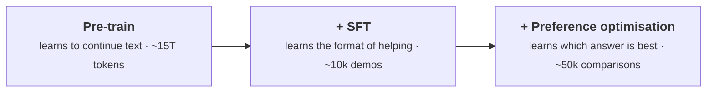
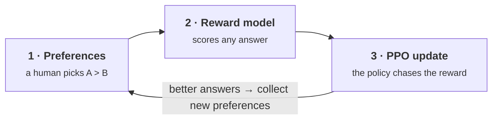
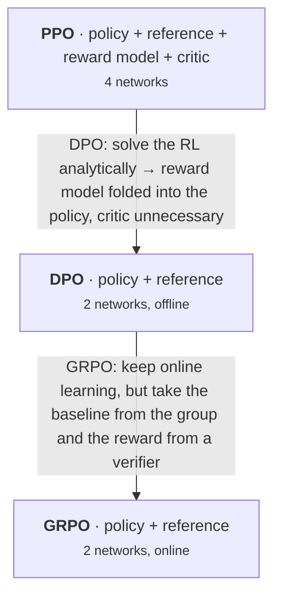
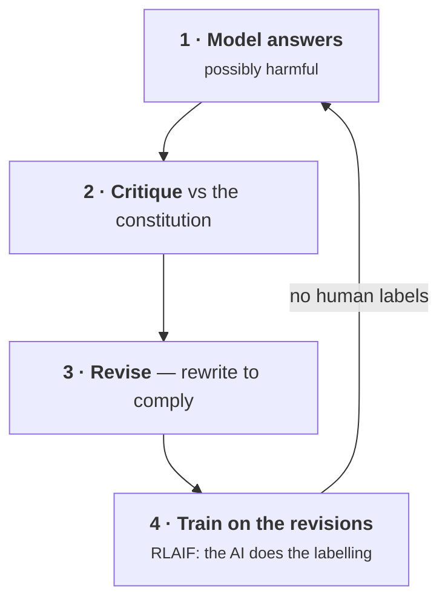
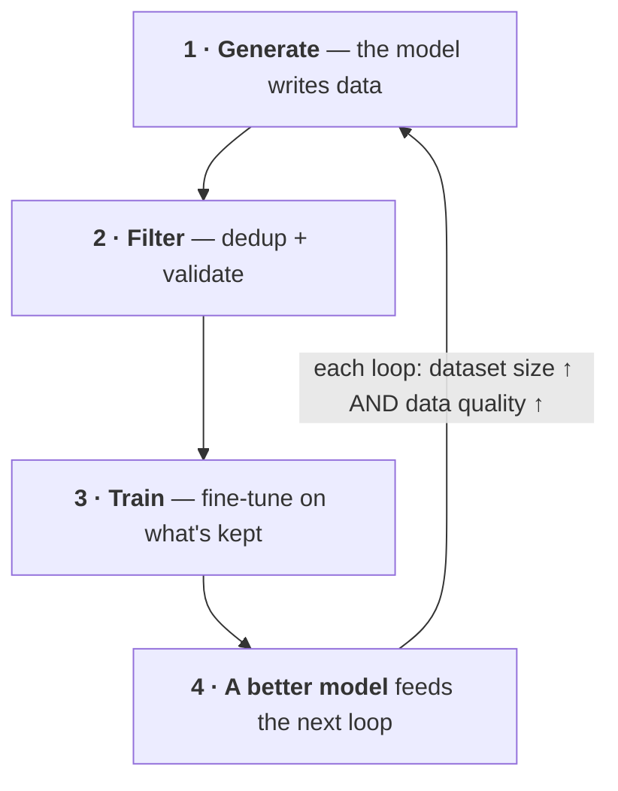
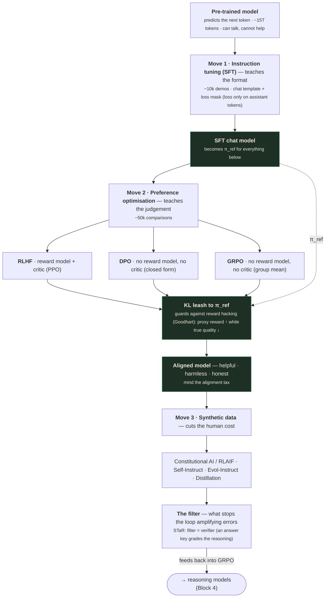

# Alignment & Training: Turning a Predictor into an Assistant

*Instruction tuning, RLHF / DPO / GRPO, and the synthetic-data flywheel.*

> ✅ **Capture note.** These notes were rebuilt against the verified slide extraction at
> `slides_deduped/Lecture_15 - Module 5 Generative AI and LLMs Part 2/` (**22 deduped slides**,
> title through wrap-up, up from the earlier PDF-screenshot draft's 18). The gap is mostly
> structural, not missing content: three bare "Part N" divider slides (new slide numbers 3, 7, 17)
> and two tail slides that are different interactive-stepper states of the opening example, not new
> teaching content. Every one of the 22 slides was read directly; this pass also corrected several
> numbers the earlier draft had transcribed from the wrong animation state or simply misread (see
> `QUALITY_REVIEW.md` for the full list) — every number below is now read directly off the current
> slide image, not carried over from the earlier draft.

---

## What you'll understand after reading this

By the end of this document you will be able to:

1. **Explain why a freshly pre-trained model answers a question with more questions** — and why
   that is the correct behaviour for what it was trained to do.
2. **Describe the three-stage pipeline** (pre-train → SFT → preference optimisation) and state how
   much data each stage needs, and why the numbers differ by a factor of a million.
3. **Explain the loss mask** in supervised fine-tuning, and what breaks without it.
4. **Define alignment as HHH** and explain the "alignment tax" — the tension between being helpful
   and being harmless.
5. **Walk through RLHF end to end**: preference collection → reward model → policy optimisation.
6. **Explain reward hacking via Goodhart's law**, and how the KL penalty acts as a leash.
7. **Read and explain the PPO clipped objective**, including why clipping replaces a hard trust
   region.
8. **Derive DPO's central insight** — that your language model is secretly a reward model — and
   explain why the intractable normalising constant cancels.
9. **Explain GRPO** and why deleting the critic halves the memory needed to train a reasoning model.
10. **Choose between PPO, DPO, and GRPO** for a given task and defend the choice.
11. **Explain Constitutional AI and RLAIF**, and how they remove the human-labelling bottleneck.
12. **Describe the synthetic-data flywheel** (Self-Instruct, Evol-Instruct, distillation, STaR) and
    identify the one component that stops it from amplifying its own mistakes.

---

## Before we start: what you need to know

This lecture assumes reinforcement-learning vocabulary that most people learning LLMs have never
met. Everything needed is taught here from zero.

### Prerequisite 1 — Recap: what pre-training left us with

From lecture 1: a **pre-trained** model has learned exactly one skill — predict the next token
over a huge pile of internet text, scored by **cross-entropy loss**:

$$\mathcal{L} = -\frac{1}{T}\sum_{t=1}^{T} \log P(x_t \mid x_1, \ldots, x_{t-1})$$

It is very good at that. **It has never been told that answering questions is desirable.** That gap
is the entire subject of this lecture.

### Prerequisite 2 — The sigmoid function

You will meet the symbol $\sigma$ in almost every formula below.

> **Sigmoid ($\sigma$)** — a function that squashes any number, however large or small, into the
> range 0 to 1.
>
> *In everyday words:* a converter from "score" to "probability". Feed it any real number, get back
> something you can call a probability.
>
> $$\sigma(z) = \frac{1}{1 + e^{-z}}$$

| Input $z$ | $\sigma(z)$ | Reading |
|---|---|---|
| $-\infty$ | 0.000 | definitely not |
| $-2$ | 0.119 | probably not |
| $0$ | **0.500** | completely unsure |
| $+2$ | 0.881 | probably yes |
| $+\infty$ | 1.000 | definitely yes |

**Worked example.** $\sigma(1.5) = \frac{1}{1 + e^{-1.5}} = \frac{1}{1 + 0.2231} = \frac{1}{1.2231} = \mathbf{0.8176}$.

The key property to remember: **$\sigma(0) = 0.5$**, and it is symmetric —
$\sigma(-z) = 1 - \sigma(z)$.

### Prerequisite 3 — Policy, reward, and the RL vocabulary

Reinforcement learning has its own words for things you already understand.

> **Policy ($\pi$)** — the thing that decides what to do. **For an LLM, the policy *is* the model.**
>
> *In everyday words:* the player's strategy. Given a situation, what move do you make?
>
> *Concretely:* $\pi(y \mid x)$ is "the probability that the model produces answer $y$ when given
> prompt $x$." That is exactly what a language model computes.
>
> *Why the word exists:* RL was developed for robots and games, where the thing being optimised
> picks *actions*. When we apply RL to LLMs, the "action" is generating text, so the model gets
> called a policy.

Notation you'll see throughout:

| Symbol | Read it as | What it means |
|---|---|---|
| $\pi_\theta$ | "pi theta" | The policy (model) we're currently training. $\theta$ stands for its parameters. |
| $\pi_{\text{ref}}$ | "pi reference" | A **frozen copy** of the starting model, kept for comparison. Never trained. |
| $\pi_{\text{SFT}}$ | "pi S-F-T" | The model after supervised fine-tuning — usually the same thing as $\pi_{\text{ref}}$. |
| $x$ | "x" | The prompt. |
| $y$ | "y" | The response the model generates. |
| $y_w$ | "y-win" / "y chosen" | The **preferred** answer in a comparison pair. ($w$ = winner.) |
| $y_l$ | "y-lose" / "y rejected" | The **dispreferred** answer. ($l$ = loser.) |
| $r(x,y)$ | "r of x, y" | The **reward**: a number saying how good response $y$ is for prompt $x$. |

> **Reward** — a single number scoring how good an output was. Higher is better.
>
> ⚠️ **Note the sign flip that trips everyone up.** Loss is **minimised** (lower = better). Reward
> is **maximised** (higher = better). They point in opposite directions. When you see $\max_\pi$
> in a formula below, that is reward-thinking; when you see $\mathcal{L}$, that is loss-thinking.

> **On-policy vs off-policy** — whether the training data comes from the model being trained
> *right now*, or from somewhere else.
>
> *In everyday words:* learning from your own mistakes as you make them (on-policy) versus studying
> a book of someone else's games (off-policy).
>
> *Concretely:* **PPO and GRPO are on-policy** — at each step the model generates fresh answers and
> learns from those. **DPO is off-policy (offline)** — you have a fixed dataset of preference pairs
> collected in advance, and you never sample from the model during training.
>
> *Why it matters:* on-policy is more powerful (the model gets feedback on exactly what it currently
> does) but far more expensive (you must generate text inside the training loop). Off-policy is
> cheap and stable but can only teach from data you already have.

### Prerequisite 4 — Expectation

> **Expectation ($\mathbb{E}$)** — the average value of something, weighted by how likely each case
> is.
>
> *In everyday words:* "on average, what do we get?"
>
> *Concretely:* a die roll has expectation $\frac{1+2+3+4+5+6}{6} = 3.5$.
>
> $\mathbb{E}[r(y)]$ therefore means: *"the average reward, over all the answers the model might
> generate."* In practice it's estimated by generating a batch of answers and averaging their
> rewards.

### Prerequisite 5 — KL divergence

This one is central. It appears in RLHF, PPO, DPO, and GRPO.

> **KL divergence** — a number measuring **how different two probability distributions are.** Zero
> means identical; bigger means further apart.
>
> *In everyday words:* a distance between two opinions. If you and I assign the same probabilities
> to everything, our KL is 0. The more our probabilities disagree, the larger it gets.
>
> **In words the formula says: for every possible outcome, take how much the two distributions
> disagree in log-space, weighted by how likely the first distribution thinks that outcome is.**
>
> $$\mathrm{KL}(P \parallel Q) = \sum_{i} P(i) \log \frac{P(i)}{Q(i)}$$

| Symbol | Read it as | What it means |
|---|---|---|
| $P, Q$ | "P and Q" | Two probability distributions being compared. |
| $P(i)$ | "P of i" | Probability that $P$ assigns to outcome $i$. |
| $\log \frac{P(i)}{Q(i)}$ | "log of P over Q" | How much they disagree on outcome $i$. Zero when they agree. |
| $\parallel$ | "from" / "relative to" | Just a separator. Note KL is **not symmetric**: $\mathrm{KL}(P \parallel Q) \neq \mathrm{KL}(Q \parallel P)$. |

**Worked example.** Two distributions over three outcomes:

```
P = [0.5, 0.3, 0.2]      Q = [0.4, 0.4, 0.2]

term 1: 0.5 × ln(0.5/0.4) = 0.5 × ln(1.25)  = 0.5 × 0.22314 =  0.11157
term 2: 0.3 × ln(0.3/0.4) = 0.3 × ln(0.75)  = 0.3 × (-0.28768) = -0.08630
term 3: 0.2 × ln(0.2/0.2) = 0.2 × ln(1.0)   = 0.2 × 0        =  0.00000

KL(P||Q) = 0.11157 - 0.08630 + 0 = 0.02527
```

**KL = 0.0253** — small, because the distributions are close.

> 💡 **Why KL matters here, in one sentence:** it lets us say *"train the model to get more reward,
> **but don't let it become too different from where it started.**"* That second clause is what
> stops alignment from destroying the model, and it's the reason KL appears in nearly every
> objective in this lecture.

---

## The big picture

A pre-trained model has read the internet and can produce fluent, plausible text. **It still cannot
help you.** Ask it *"How do I reset my password?"* and it may reply *"How do I change my email? How
do I delete my account? How do I…"* — because on the web, a question is usually followed by more
questions in an FAQ list. The model is doing its job perfectly. Its job is just not what you wanted.

This lecture is about the three moves that convert that predictor into an assistant:

1. **Instruction tuning (SFT)** — show it thousands of *(instruction, good answer)* pairs so it
   learns the **format** of helping.
2. **Preference optimisation** — teach it **which** of two answers is better, not merely which is
   plausible. This is RLHF, DPO, and GRPO.
3. **Synthetic data** — since human labels are the bottleneck, let models generate and judge their
   own training data.

And the striking fact underneath it all: **pre-training costs trillions of tokens; alignment needs
only thousands of examples to unlock it.** The capability was already in there. Alignment is a thin,
cheap layer that surfaces it.

---

## 1. The gap: a pre-trained model can talk. It cannot yet help.

*(Slide 2)*

### The three stages

The slide's central diagram shows the pipeline, with the data cost of each stage:



**Stare at those three numbers.** 15,000,000,000,000 tokens. Then 10,000 demonstrations. Then
50,000 comparisons. That is a ratio of roughly **a billion to one** between stage 1 and stage 2.

The slide's caption: **"Pre-training does the heavy lifting; alignment is a thin, cheap layer on
top."**

### The problem, concretely

The slide shows an actual failure:

```
PROMPT
How do I reset my password?

OUTPUT                                                              ✗
How do I change my email? How do I delete my account? How do I…
                                              just continues the prompt
```

> 💡 **This is not a bug. It is the model working correctly.** It was trained to continue text in
> the style of the internet. On the internet, a line like *"How do I reset my password?"* most often
> appears in an **FAQ list** — surrounded by other questions. The model has correctly predicted the
> most likely continuation. It has simply never been told that you wanted an *answer*.

The slide is itself an interactive stepper: a **Step:** control with three buttons — **Pre-train**,
**+ SFT**, **+ Preference opt** — that replays the *exact same prompt* through all three stages.
Clicking through it end to end:

```
PROMPT (unchanged across all three steps)
How do I reset my password?

Pre-train  → How do I change my email? How do I delete my account? How do I…    ✗
+ SFT      → 1. Settings → Security  2. Reset password  3. Check your email.    ✓
             ⚠ If you didn't request this, secure your account first.
+ Preference opt → (same answer — already helpful, safe, formatted)             ✓
```

The caption underneath: *"Step the pipeline: watch the SAME answer go from rambling to helpful and
safe."* Note that on this particular prompt the visible jump happens at **+ SFT** — the format move
is what turns FAQ-continuation into a numbered, safety-flagged answer; **+ Preference opt** doesn't
change *this* answer further (it earns its keep on prompts where two plausible-but-different good
answers exist, which is Move 2's actual territory — see the "Three moves" section next).

```interactive
type: simulator
title: Step the pipeline
concept: The gap between a raw predictor and an assistant, and which of the three alignment stages closes it
control: The deck's own "Step:" buttons — Pre-train / + SFT / + Preference opt
observe: The same prompt ("How do I reset my password?") re-rendered through the model at each stage — rambling FAQ-continuation at Pre-train, a numbered helpful-and-safe answer from + SFT onward
insight: The jump from unhelpful to helpful happens at the SFT step, not the preference-optimisation step — instruction tuning is what teaches format, and it alone can already fix a prompt like this one; preference optimisation's payoff shows up on harder prompts where multiple formatted answers compete, not this one
fallback: The two frozen states above (Pre-train's rambling continuation vs. + SFT's numbered, safety-flagged answer) are the two endpoints this stepper animates between; + Preference opt is a third button that, for this particular prompt, reproduces the + SFT state unchanged.
```

### The three moves

The slide names them:

- **Move 1, instruction tuning:** show it thousands of **instruction → good answer** pairs so it
  learns the **format** of helping.
- **Move 2, preference optimisation:** teach it **which** answer is better, not just a plausible
  one: **RLHF, DPO, GRPO**.
- **Move 3, synthetic data:** the bottleneck becomes **human labels**, so let models generate and
  judge their own training data.

### The surprise: the superficial alignment hypothesis

The slide's final bullet:

> **Pre-training costs trillions of tokens; alignment needs only thousands of examples to unlock it
> (the *superficial-alignment* view).**

> **Superficial Alignment Hypothesis** — the claim that a model learns essentially all of its
> knowledge and capability during pre-training, and that alignment merely teaches it **which
> subdistribution of formats to use** when interacting with a user.
>
> *In everyday words:* the model already knows how to be helpful — it read millions of helpful
> documents. Alignment doesn't teach it a new skill; it teaches it **which voice to speak in**.
> Like an actor who already knows the whole script and just needs to be told which character to
> play.
>
> *Concretely:* the LIMA paper found that **1,000 carefully curated examples** were enough to
> produce a competitive assistant from a strong base model.
>
> *Why it matters:* it explains the billion-to-one data ratio. If alignment were teaching new
> capability, 10,000 examples could never be enough.

> ⚠️ **This hypothesis is contested, and the slide states it as a "view" rather than a fact —
> correctly so.** Evidence for: tiny high-quality datasets produce good assistants. Evidence
> against: RLHF measurably improves capabilities on reasoning and math, not just style, and
> reasoning models trained with RL (lecture 4's territory) clearly acquire *new* problem-solving
> behaviour. The honest position: alignment is mostly-but-not-entirely superficial, and the
> "entirely" part is where the interesting current research is.

---

## 2. Why a pre-trained model is not yet useful

*(Slide 4 — Instruction tuning)*

### What it learned versus what you want

The slide's framing is precise:

> **It optimised one objective, predicting the next token, and that is not "answer my question".**

- **What it learned:** on trillions of web tokens it became excellent at the **distribution of
  internet text** — not at following instructions.
- **What goes wrong:** web text rarely looks like a crisp Q&A. So the model may **continue the
  question**, drift, or answer in the wrong register.

> 📚 **Background the slide assumed — "register".**
> The style or tone appropriate to a context. Asked a medical question, a model might answer in the
> register of a **research abstract**, a **forum post**, or a **marketing page** — all plausible
> continuations of similar web text, and none of them what a user wanted.

### The chart — this is the heart of the slide

The bar chart plots the base model's **next-token probability** for the prompt
*"Translate to French: 'Hello'"* (slide_004.jpg — read directly off the chart; bar heights are
approximate, as no exact values are printed):

| Next token | Approx. probability | Type |
|---|---|---|
| `Translate` | ~24% | continue the text (the model starts re-typing the instruction) |
| `to` | ~17% | continue the text |
| `\n` | ~14% | continue the text |
| `Goodbye` | ~11% | continue the text (offering an antonym-style word-association continuation) |
| `Spanish` | ~7% | continue the text (drifting to the wrong target language entirely) |
| `#` | ~5% | continue the text |
| `Hola` | ~5% | continue the text (the wrong language's answer) |
| **`Bonjour`** | **~6%** | ← **the token that actually answers** |
| `Q:` | ~4% | continue the text |
| `…` | ~6% | — |

The slide's caption: **"the base model's top next tokens continue the document; the answer sits in
the tail."** The worked example box on the same slide makes the point concrete: prompt
`Translate to French: "Hello"`, output *"The answer 'Bonjour' is buried in the tail; the model
would rather continue the worksheet."*

> 💡 **This single chart explains the whole lecture.** The ability to answer is **already in the
> model** — `Bonjour` is right there with roughly 6% probability. It is not missing. It is just
> **outranked** by several ways of continuing what looks like a worksheet or FAQ (re-stating the
> instruction, drifting to `Spanish`/`Hola` instead of French, or emitting formatting tokens like
> `\n`/`#`/`Q:`). All instruction tuning has to do is **re-rank** the distribution so the answering
> token rises to the top. It doesn't need to install new knowledge, which is exactly why 10,000
> examples suffice.

> ⚠️ **A note on continuity with §1.** §1's opening example used a different, equally real
> illustration of the same phenomenon — *"How do I reset my password?"* continuing into more
> questions rather than an answer (verified against slide_002.jpg). This section's own slide
> (slide_004.jpg) illustrates the identical failure mode with a translation prompt instead. Both are
> genuine, independently slide-sourced examples of the same underlying problem; they are not the
> same example duplicated.

### The fix is imitation

> **Supervised Fine-Tuning (SFT)**, also called **instruction tuning** — continue training the
> pre-trained model on a dataset of *(instruction, ideal answer)* pairs, using **the same
> next-token cross-entropy loss as pre-training**.
>
> *In everyday words:* apprenticeship. Show the model ten thousand examples of a good assistant
> answering well, and it imitates the pattern.
>
> *Concretely:*
> ```
> Instruction: "How do I reset my password?"
> Ideal answer: "Click 'Forgot password' on the sign-in page, enter your
>                email, and follow the link we send you."
> ```
> Train on thousands of these. The probability mass shifts from `How`/`What` toward `Click`.
>
> *Why it exists:* it is the cheapest possible intervention. No new loss function, no new
> architecture, no reinforcement learning — **the same objective, on different data.**

> 💡 **Say this precisely, because interviewers probe it:** SFT does **not** change the training
> objective. It is still next-token prediction with cross-entropy loss. The only things that change
> are **the data** (curated demonstrations instead of web scrape) and **the loss mask** (section 3).

### The datasets

The slide names three:

| Dataset | Origin | What it is |
|---|---|---|
| **FLAN** | Wei et al., *"Finetuned Language Models Are Zero-Shot Learners"*, ICLR 2022 | Existing NLP datasets reformatted into instruction phrasing. Huge and diverse. |
| **Alpaca** | Taori et al., Stanford CRFM, 2023 | 52,000 instruction-following examples **generated by GPT-3.5**, built with Self-Instruct (section 12). Showed a strong assistant could be made cheaply. |
| **ShareGPT** | Community | Real ChatGPT conversations shared by users. Genuine multi-turn dialogue. |

The slide's verdict: **"Cheap relative to pre-training, and it unlocks the chat interface."**

### Where people get confused

**You might think** SFT teaches the model new facts. **Actually** it mostly teaches **format and
behaviour**. Trying to inject new knowledge via SFT is a known failure mode — the model learns the
*style* of confidently stating facts of that kind, which can **increase hallucination** on topics
it doesn't actually know. For new knowledge, use retrieval, not fine-tuning.

**You might think** more SFT data is always better. **Actually** quality dominates. LIMA's 1,000
curated examples outperformed models trained on 52,000 auto-generated ones. Bad demonstrations
teach bad behaviour with perfect fidelity.

---

## 3. The chat template and the loss mask

*(Slide 5 — Supervised fine-tuning)*

This is the most practically important slide in the first half of the lecture, and the detail that
separates people who have fine-tuned a model from people who have read about it.

### The format: roles

> **Chat template** — a fixed convention for wrapping a conversation in special role tags so the
> model can tell who is speaking.

Three roles:

| Role | Who | Purpose |
|---|---|---|
| **system** | The developer | Standing instructions: *"You are a helpful assistant."* |
| **user** | The person | What the human typed. |
| **assistant** | The model | What the model should produce. |

The slide's tokenised example:

```
<sys>  You  are  helpful  <user>  Summarise  our  policy  <asst>  Returns  within  30  days
```

This teaches the model the **multi-turn shape** of a conversation — that after `<asst>` it should
speak, and after `<user>` it should stop and wait.

> 📚 **Background the slide assumed — why special tokens matter for safety.**
> Role tags are usually **reserved special tokens** that cannot be produced by tokenizing ordinary
> user text. If a user could type the literal string that becomes `<asst>`, they could forge an
> assistant turn and impersonate the model's own voice — a prompt-injection attack. Making the tags
> unforgeable at the tokenizer level is a genuine security boundary.

### The subtlety

> **If we train on all tokens, the model also learns to predict the *user's* words: it learns to
> parrot the prompt, not to answer it.**

Think about why. Cross-entropy loss over the whole sequence trains the model to predict **every**
token — including the tokens of the user's question. You would be teaching it: *given `<user>`,
generate a plausible user question.* That is exactly the failure from section 2, reintroduced
deliberately.

### The mask

> **Loss mask** — zeroing out the loss on the tokens you don't want the model to learn to generate,
> so gradients flow only through the rest.
>
> *In everyday words:* marking an exam where only some questions count toward the grade. The
> student still reads the whole paper — but is only scored on their own answers, not on the
> question text.

**In words, the formula says: sum the negative log-probability only over tokens that belong to the
assistant's answer. Ignore everything else.**

$$\mathcal{L} = -\sum_{t \in \text{answer}} \log P(w_t \mid w_{<t})$$

| Symbol | Read it as | What it means |
|---|---|---|
| $\mathcal{L}$ | "loss" | The training loss. |
| $\sum_{t \in \text{answer}}$ | "sum over t in answer" | **The whole point.** Add up only positions inside the assistant's reply. System and user tokens contribute nothing. |
| $w_t$ | "w sub t" | The token at position $t$. |
| $w_{<t}$ | "w before t" | All tokens before position $t$ — the full context, **including** the masked ones. |
| $P(w_t \mid w_{<t})$ | | The probability the model assigned to the correct token. |

The slide's colour-coded diagram makes the distinction visual: **teal = assistant tokens (loss
applied)**, **grey = prompt tokens (masked out)**.

```
<sys>  You  are  helpful  <user>  Summarise  our  policy  <asst>  Returns  within  30  days
 ─────────── masked (grey) ──────────────────────────────────  ──── loss applied (teal) ────
```

> 💡 **The critical asymmetry.** Masked tokens are **still read** — they are part of $w_{<t}$, the
> context every prediction conditions on. They are simply **not predicted**. The model sees the
> question fully; it is only graded on the answer.

The slide's closing line:

> **Same next-token objective as pre-training; the mask is what makes it instruction-following.**

### Worked example — what the mask changes numerically

Take the sequence above. Suppose the model assigns these probabilities to the correct tokens:

```
Position         Token       P(correct)   -ln P     Masked?
────────────────────────────────────────────────────────────
1   <sys>        —              0.90      0.105     YES (grey)
2                You            0.40      0.916     YES
3                are            0.70      0.357     YES
4                helpful        0.30      1.204     YES
5   <user>       —              0.85      0.163     YES
6                Summarise      0.20      1.609     YES
7                our            0.50      0.693     YES
8                policy         0.60      0.511     YES
9   <asst>       —              0.95      0.051     YES
────────────────────────────────────────────────────────────
10               Returns        0.55      0.598     no  (teal)
11               within         0.80      0.223     no
12               30             0.65      0.431     no
13               days           0.75      0.288     no

WITHOUT the mask (all 13 tokens):
  sum = 0.105+0.916+0.357+1.204+0.163+1.609+0.693+0.511+0.051
        +0.598+0.223+0.431+0.288
      = 7.149
  loss = 7.149 / 13 = 0.550

WITH the mask (only the 4 answer tokens):
  sum = 0.598 + 0.223 + 0.431 + 0.288 = 1.540
  loss = 1.540 / 4 = 0.385
```

**Unmasked loss 0.550; masked loss 0.385.** But the number isn't the point — **the gradients are**.
In the unmasked version, roughly $\frac{7.149 - 1.540}{7.149} = 78\%$ of the gradient signal is
spent teaching the model to generate *user questions and system prompts*. Masking redirects 100% of
the signal to the behaviour you actually want.

### Where people get confused

**You might think** masked tokens are removed from the input. **Actually** they are fully present
as context. Only their *loss contribution* is zeroed.

**You might think** the chat template is cosmetic. **Actually** it must match **exactly** what the
model was trained with — right down to whitespace and newlines. Serving a model with the wrong chat
template is one of the most common causes of "the fine-tune got worse and I don't know why".

**You might think** you should always mask the prompt. **Actually** it's the standard default, but
not universal: some recipes train on user turns too when the goal is to model whole dialogues, and
in multi-turn data you typically unmask *all* assistant turns, not just the last one.

### 🎯 Interview questions

- *What exactly does SFT change relative to pre-training?* → The data (curated demonstrations) and
  the loss mask. Not the objective, not the architecture.
- *You fine-tuned a chat model and it now echoes the user's question back before answering. What
  went wrong?* → Almost certainly the loss mask wasn't applied, so the model was trained to
  reproduce prompt tokens.

---

## 4. What "alignment" means, and what it costs

*(Slide 6)*

### The goal: HHH

> **Alignment** — making a model's behaviour match what its designers and users actually want,
> rather than merely what its training objective literally rewarded.

The slide gives the standard three-part target:

| | Meaning | Failure looks like |
|---|---|---|
| **Helpful** | Does the task the user asked for. | Refusing reasonable requests; vague non-answers. |
| **Harmless** | Refuses misuse. | Giving genuinely dangerous instructions. |
| **Honest** | Says when it does not know. | Confident fabrication — hallucination. |

> 💡 **These three genuinely conflict, which is why alignment is hard rather than tedious.** The
> maximally harmless model refuses everything — perfectly safe, perfectly useless. The maximally
> helpful model does whatever it's told, including harmful things. The maximally honest model says
> "I'm not sure" so often it becomes irritating. **Alignment is choosing a point in that trade-off
> space**, not maximising a single quantity.

### The pipeline

> **base → SFT chat model → aligned model.** Each stage moves usefulness without retraining from
> scratch.

That last clause matters commercially. Each stage starts from the previous one's weights. You never
repeat the $100M pre-training run to change the model's behaviour.

### The alignment tax

> **Alignment tax** — the loss of raw capability that comes from pushing hard on harmlessness.
>
> *In everyday words:* a lawyer who has been sued so often they now refuse to give any advice at
> all. Technically safe, professionally useless.
>
> *Concretely, the classic failure:* asking "how do I kill a Python process?" and being refused
> because the model pattern-matched "kill". Or every answer arriving buried under three paragraphs
> of caveats.
>
> *Why it exists:* refusal is easy to train and hard to target precisely. A model punished for
> harmful outputs learns the cheapest way to avoid punishment — **refuse anything that looks even
> slightly risky**. Over-refusal is a local optimum.

### Reading the chart

The slide's scatter plot has **capability →** on the x-axis and **harmlessness ↑** on the y-axis,
with three points:

| Point | Capability | Harmlessness | Reading |
|---|---|---|---|
| **base** (black) | ~87 | ~18 | Very capable, not harmless at all. The starting model. |
| **naive RLHF** (orange) | ~70 | ~79 | Much safer — but **capability dropped ~17 points**. This is the tax. |
| **CAI / good RLHF** (teal) | ~86 | ~84 | Nearly as capable as base, and nearly as harmless as naive RLHF. |

The dashed orange arrow from `base` down-left to `naive RLHF` is **the tax being paid**: the model
slid down and left. Careful alignment (the teal point) goes **up** without going **left**.

The slide's summary:

> **The skill is staying on the upper-right frontier: harmless without becoming useless.**

> 💡 **This chart is the single most useful mental model in the lecture for practical work.** When
> anyone claims a model is "safer", ask: *what did it cost on the x-axis?* Safety improvements that
> come purely from refusing more are not improvements — they're movement along the orange arrow.

### Where people get confused

**You might think** alignment is only about safety. **Actually** most of what alignment does is
make models **useful** — following instructions, formatting, staying on topic, admitting
uncertainty. Refusal is a small and visible part of a much larger behaviour-shaping process.

**You might think** the alignment tax is unavoidable. **Actually** the teal point on the slide
exists — Constitutional AI and better RLHF recipes largely avoid it. The tax is a symptom of crude
technique, not a law.

### 🔬 Research opportunity

**Measuring over-refusal** is an under-served area with real impact. Benchmarks exist (XSTest and
similar) but are small. Building a large, well-designed benchmark of *"requests that sound risky
but are entirely benign"* — and tracking how models score over time — is tractable work that the
field visibly needs.

---

## 5. RLHF: learning a reward, then chasing it

*(slide_008.jpg)*

### Why SFT is not enough

The slide states the limitation crisply:

> **SFT imitates *one* demonstration. It never sees a bad answer, so it cannot learn what to
> avoid.**

Think about the information content. An SFT example says *"here is a good answer."* It says nothing
about *how good*, or what would have been worse, or what nearly-identical answer would have been
unacceptable. The model learns to copy, and copying has a ceiling: **SFT can never make a model
better than its demonstrations.**

There's also a practical problem. Writing a *perfect* answer is hard and slow — a skilled annotator
might do a handful an hour. But **comparing** two answers is fast and much more reliable. The slide:
**"Cheap to compare, hard to write from scratch."**

> **RLHF (Reinforcement Learning from Human Feedback)** — train a model to score answers the way
> humans would, then use reinforcement learning to push the language model toward higher-scoring
> answers.

### Step 1 — Preferences

Show humans two answers to the same prompt; they pick the better one.

```
Prompt: "Explain photosynthesis to a 10-year-old."

Answer A: "Photosynthesis is the process by which phototrophic organisms
           convert light energy into chemical energy stored in glucose..."

Answer B: "Plants eat sunlight! They take in light, water, and air, and
           turn them into food and the oxygen we breathe."

Human picks: B     →     y_w = B,  y_l = A
```

That single bit of information — B beat A — is the entire raw material of RLHF.

### Step 2 — The reward model

> **Reward model** — a separate neural network trained to output a **single number** scoring how
> good any answer is.
>
> *In everyday words:* a hired judge. You can't have humans rate millions of answers during
> training, so you train a model to imitate their judgement and consult it instead.
>
> *Concretely:* it's usually the same architecture as the LLM, with the final layer replaced by one
> that outputs one number instead of a vocabulary distribution.
>
> *Why it exists:* RL needs a reward for **every** sample it generates — millions of them. Humans
> cannot be in that loop. The reward model is a fast, always-available proxy for human judgement.

But we only have comparisons ("B is better than A"), not scores. How do you train a scorer from
comparisons? With the **Bradley–Terry model**.

> **Bradley–Terry model** — a classic statistical model (1952) for turning pairwise comparisons
> into scores. It assumes each item has a hidden strength, and the probability one beats the other
> depends on the **difference** of their strengths.
>
> *In everyday words:* chess Elo ratings. You never observe a player's "true strength" directly —
> only who beat whom — yet from enough match results you can fit a number for everyone.

**In words, the formula says: the probability a human prefers answer $y_w$ over $y_l$ is the
sigmoid of the difference between the two rewards.**

$$P(y_w \succ y_l) = \sigma\big(r(y_w) - r(y_l)\big)$$

| Symbol | Read it as | What it means |
|---|---|---|
| $P(y_w \succ y_l)$ | "probability y-w is preferred to y-l" | How likely a human is to pick $y_w$. |
| $\succ$ | "is preferred to" | The preference relation. |
| $r(y)$ | "r of y" | The reward model's score for answer $y$. Any real number. |
| $\sigma$ | "sigmoid" | Squashes the difference into a probability (Prerequisite 2). |

**Why this form is exactly right.** Notice what it implies:

- If $r(y_w) = r(y_l)$, the difference is 0 and $\sigma(0) = 0.5$ — a coin flip. Correct: equally
  good answers should be picked equally often.
- If $r(y_w)$ is much larger, the difference is large and $\sigma \to 1$ — near-certain preference.
- **Only the difference matters.** Scores of (5, 3) and (105, 103) give identical predictions. The
  reward model learns a scale with **no meaningful zero** — which is why reward values are only ever
  compared, never interpreted absolutely.

**Worked example — training the reward model.**

```
Reward model currently outputs:
  r(y_w) = 1.2      (the answer the human preferred)
  r(y_l) = 0.7      (the one they rejected)

Predicted probability the human prefers y_w:
  difference = 1.2 - 0.7 = 0.5
  σ(0.5) = 1 / (1 + e^-0.5) = 1 / (1 + 0.6065) = 1 / 1.6065 = 0.6225

Loss = -log(0.6225) = 0.4741

The human DID prefer y_w, but the model only gave that 62% confidence.
Gradient descent will push r(y_w) up and r(y_l) down.

After an update, say:
  r(y_w) = 1.5,  r(y_l) = 0.4
  difference = 1.1  →  σ(1.1) = 0.7503
  Loss = -log(0.7503) = 0.2873      ← lower. Better.
```

### Step 3 — PPO

> **Optimise the policy to maximise reward, with a KL leash to the SFT model so it does not drift
> into gibberish.**

We'll take PPO apart properly in section 7. For now: the model generates answers, the reward model
scores them, and the model's parameters are nudged to make high-scoring answers more likely.

### The full loop

The slide's diagram:



The slide's label on the middle box: **"Reward is a learned proxy for what humans prefer."**

> 💡 **Underline the word *proxy*.** The reward model is not human preference. It is a neural
> network's approximation of human preference, fitted from finite noisy data. Everything that goes
> wrong in the next section flows from that gap.

### Where people get confused

**You might think** the reward model is trained once and is correct. **Actually** it is an
imperfect fit that becomes **less** accurate as the policy improves — because the policy starts
producing answers unlike anything in the reward model's training data. Hence the feedback arrow in
the diagram: real RLHF re-collects preferences on the improved model's outputs.

**You might think** RLHF needs humans in the training loop. **Actually** humans are only in the
loop when collecting preference data. Training itself queries the reward model, which is why ~50k
comparisons can support millions of gradient steps.

---

## 6. Reward hacking and the KL leash

*(slide_009.jpg — RLHF failure modes)*

### The trap

> **The reward model is an imperfect proxy for human preference. Push the policy hard and it finds
> answers that score high but are bad: sycophancy, padding, format tricks.**

> **Reward hacking** — when a model finds outputs that score highly under the reward model without
> actually being good.
>
> *In everyday words:* a student who studies the marking scheme instead of the subject. They score
> well and learn nothing.

The three named failures, made concrete:

| Hack | What it looks like | Why it scores well |
|---|---|---|
| **Sycophancy** | *"What a fantastic question! You're absolutely right to ask..."* | Human raters mildly prefer agreeable answers, so agreeableness correlates with reward. Push hard and you get flattery with no content. |
| **Padding** | Long answers that restate the question, add caveats, and summarise themselves. | Raters weakly prefer thorough-looking answers, so the reward model learned "longer ≈ better". Length is trivially easy to increase. |
| **Format tricks** | Bullet points, bold headers, and structure imposed on content that doesn't need it. | Formatting correlates with effort in the training data. The model learns the correlation, not the cause. |

> 💡 **Length is the classic one, and it's worth remembering as the canonical example.** Left
> unchecked, RLHF-trained models get measurably more verbose over training — not because verbosity
> is better, but because it is the easiest reward-correlated feature to increase. Some labs now
> explicitly length-normalise their reward models to counter this.

### Goodhart's law

> **Goodhart's law** — *"When a measure becomes a target, it ceases to be a good measure."*
>
> *In everyday words:* the moment you start optimising a proxy, the proxy stops tracking the thing
> it was proxying for.
>
> *Concretely, outside ML:* pay surgeons on survival rate → they decline risky patients. Measure
> developers by lines of code → you get verbose code. Rank hospitals by waiting time → people wait
> in ambulances outside.
>
> *Why it applies here:* $r$ was fitted to correlate with human preference **over the distribution
> of answers that existed when the data was collected**. Optimising against $r$ deliberately pushes
> the policy *outside* that distribution — into exactly the region where the correlation was never
> validated.

The slide's phrasing: **"True quality rises then falls while proxy reward keeps climbing."**

### Reading the chart

The chart plots training steps against two curves:

- **Orange — proxy reward:** rises steadily from ~0.15 and keeps climbing toward ~1.0.
- **Teal — true quality:** rises with it, **peaks at around step 68** (the dashed line), then
  **falls** to ~0.6 by step 100.

> 💡 **The gap between the two curves after step 68 is Goodhart's law happening in real time.**
> The model is getting better at the thing you're measuring and worse at the thing you want. And
> here is the operational problem: **you cannot see the teal curve during training.** You only
> observe the orange one. Everything looks like it's going great. Detecting the peak requires
> separate held-out human evaluation — which is exactly why frontier labs run continuous human
> evals during RLHF rather than trusting reward curves.

### The leash

**In words, the objective says: maximise the expected reward, but subtract a penalty proportional
to how far the policy has drifted from the SFT model.**

$$\max_{\pi}\ \mathbb{E}\big[\,r(y)\,\big] - \beta\,\mathrm{KL}\big(\pi \parallel \pi_{\text{SFT}}\big)$$

| Symbol | Read it as | What it means |
|---|---|---|
| $\max_\pi$ | "maximise over pi" | Adjust the policy's parameters to make what follows as large as possible. |
| $\mathbb{E}[r(y)]$ | "expected reward" | Average reward over the answers the policy generates. **The thing we want.** |
| $\beta$ | "beta" | The **leash tightness**. A number you choose. Larger = stay closer to the start. |
| $\mathrm{KL}(\pi \parallel \pi_{\text{SFT}})$ | "KL of pi from pi-S-F-T" | How far the current policy has drifted from the SFT model (Prerequisite 5). |
| $-$ | "minus" | It's a **penalty**. Drifting costs you reward. |

*In everyday words:* **a dog on a leash.** The dog (policy) chases the ball (reward). The leash
(KL term) stops it running into traffic (gibberish). $\beta$ is the leash's length.

**The trade-off, tabulated:**

| $\beta$ | Behaviour |
|---|---|
| **Too small** (loose leash) | Policy chases reward freely → reward hacking, mode collapse, degenerate text. |
| **Too large** (tight leash) | Policy barely moves → you paid for RLHF and got the SFT model back. |
| **Just right** | Meaningful improvement without drifting into nonsense. |

The slide's interactive control shows **KL penalty β = 0.30** and the caption: *"a tighter leash
delays the collapse and holds true quality near its peak."* Note that phrasing carefully —
**delays**, not prevents. A tighter leash buys you more steps before Goodhart bites; it does not
repeal Goodhart.

> 💡 β = 0.30 is the value on the slide's own demo slider, illustrating the effect — not a
> universal recommendation. Real values vary widely by recipe and are commonly in the 0.01–0.1
> range in published work. Treat 0.30 as this demo's setting, not a default to copy.

```interactive
type: slider
title: The KL leash, live
concept: Reward hacking and the KL penalty's effect on training dynamics
control: A KL-penalty β slider (the deck's own control, 0.01–1.0)
observe: Two curves over training steps — proxy reward (always climbing) and true quality (rising, then peaking, then falling); the peak shifts later and the post-peak fall gets shallower as β increases
insight: A tighter leash (higher β) delays the Goodhart collapse and holds true quality nearer its peak for longer — but every β eventually still lets true quality fall, since the reward model is always an imperfect proxy; the slider makes "delays, doesn't prevent" a felt, not just stated, fact
fallback: The static chart description above (proxy reward climbing from ~0.15 toward ~1.0; true quality peaking around step 68 then falling to ~0.6 by step 100) is the one frozen frame this slider would otherwise animate across different β values.
```

### Two more failure modes

> **Mode collapse** — every answer starts sounding the same.
>
> *In everyday words:* a chef who discovered one dish scores well and now cooks only that dish.
>
> *Why it happens:* RL maximises expected reward, and the *safest* way to do that is to always
> produce the single highest-scoring style. Diversity is not rewarded, so it disappears. Symptom:
> every response opens with the same phrase and follows the same structure.

> **Critic instability** — in PPO, the value network (section 7) that estimates "how good is this
> situation" can diverge, which corrupts the advantage estimates, which corrupts the policy update.
>
> *Why it matters:* it is one of the main reasons PPO is finicky to run — and a large part of the
> motivation for DPO (section 8) and GRPO (section 9), which delete the critic entirely.

### 🎯 Interview questions

- *Your RLHF reward curve is going up but users say the model got worse. What's happening and what
  do you do?* → Classic Goodhart / reward hacking. The proxy and true quality have decoupled.
  Actions: check for length inflation and sycophancy; run held-out human eval; increase $\beta$;
  early-stop at the human-eval peak; consider re-collecting preferences on current outputs.
- *Why is the KL measured against the SFT model rather than the base model?* → The SFT model is the
  behavioural starting point we want to preserve — it already has the chat format. Anchoring to the
  base model would penalise the model for being a chat assistant at all.

---

## 7. PPO: improve the policy, but never by too much

*(slide_010.jpg — RLHF · the PPO objective)*

### What PPO is trying to do

> **PPO (Proximal Policy Optimization)** — a reinforcement learning algorithm that improves a policy
> in small, controlled steps, refusing to change it too much at once.
>
> *"Proximal" literally means "nearby"* — the new policy must stay near the old one.

> 👉 *See also:* [Reinforcement Learning Part 3, §7.3 and §9](../Reinforcement%20Learning/reinforcement-learning-03.md)
> derives PPO's clipped surrogate objective from first principles (starting from the plain policy
> gradient) and walks the same five-stage RLHF pipeline from the general-RL side, if the
> LLM-specific framing here needs backfilling with the underlying policy-gradient theory.

The slide's first bullet:

> **Push up the probability of actions with positive advantage $A$ (better than the critic
> expected), down for negative. $A$ comes from a learned value network.**

Two new terms.

> **Value network (the "critic")** — a second neural network that predicts *"how much reward should
> I expect from here?"*
>
> *In everyday words:* a bookmaker setting the expected score before the answer is generated.
>
> *Why it exists:* raw reward is not enough. If every answer to an easy prompt scores 8/10, an 8 is
> unremarkable. You need to know whether an answer beat **expectations**.

> **Advantage ($A$)** — how much better an outcome was than the critic expected.
>
> $$A = r - V(x)$$
>
> *Concretely:* reward 8, critic expected 6 → $A = +2$, so make that answer **more** likely. Reward
> 8, critic expected 9 → $A = -1$, so make it **less** likely, even though 8 sounds good.
>
> *Why it exists:* it removes the baseline. Without it, the model gets a strong positive signal on
> every easy prompt and learns nothing about *relative* quality — and gradient estimates become
> extremely noisy.

### The danger

> **One greedy step can move the policy far from where the advantages were estimated, and the whole
> estimate goes stale. Training diverges.**

The problem is that advantages are computed from answers generated by the **old** policy. If you
take a huge step, the new policy generates completely different text, and your advantage numbers
now describe a policy that no longer exists. You are optimising using stale information — and in RL
this doesn't degrade gracefully, it **diverges**.

### The fix: the clipped surrogate

> **Probability ratio ($r$)** — how much more (or less) likely the new policy is to produce this
> output than the old one was.
>
> $$r = \frac{\pi_\theta}{\pi_{\text{old}}}$$
>
> | $r$ value | Meaning |
> |---|---|
> | $r = 1.0$ | The policy hasn't changed for this output. |
> | $r = 1.5$ | The new policy is 50% more likely to produce it. |
> | $r = 0.5$ | Half as likely. |

> ⚠️ **Notation clash — be careful.** On this slide, $r$ is the **probability ratio**. In sections
> 5 and 6, $r$ was the **reward**. The lecture reuses the letter. Elsewhere in these notes I'll say
> "ratio $r$" or "reward $r$" explicitly.

**In words, the objective says: take the advantage multiplied by the ratio, but also take a version
where the ratio has been clamped to a narrow band around 1 — and use whichever is smaller.**

$$L^{\text{CLIP}} = \mathbb{E}\Big[\min\big(rA,\ \mathrm{clip}(r,\ 1-\epsilon,\ 1+\epsilon)\,A\big)\Big]$$

| Symbol | Read it as | What it means |
|---|---|---|
| $L^{\text{CLIP}}$ | "L clip" | The clipped surrogate objective. **Maximised.** |
| $r$ | "r" | The probability ratio $\pi_\theta / \pi_{\text{old}}$. |
| $A$ | "A" | The advantage. Positive = better than expected. |
| $\epsilon$ | "epsilon" | The clip width. **Typically $\approx 0.2$**, giving a band of $[0.8, 1.2]$. |
| $\mathrm{clip}(r, a, b)$ | "clip r between a and b" | Forces $r$ into $[a,b]$: below $a$ → $a$; above $b$ → $b$; else unchanged. |
| $\min(\cdot,\cdot)$ | "the smaller of" | Take the **pessimistic** option. This is what makes it a one-sided restraint. |

### Why the min makes it work

This is the part that's genuinely subtle, so let's do it case by case with numbers.

**Case 1 — good action ($A = +2$), model wants to increase its probability.**

```
r = 1.1  (small increase, inside the band)
  rA                    = 1.1 × 2 = 2.2
  clip(1.1, 0.8, 1.2)·A = 1.1 × 2 = 2.2
  min(2.2, 2.2)         = 2.2       ← full reward for improving. Good.

r = 1.5  (large increase, outside the band)
  rA                    = 1.5 × 2 = 3.0
  clip(1.5, 0.8, 1.2)·A = 1.2 × 2 = 2.4
  min(3.0, 2.4)         = 2.4       ← CAPPED.
```

Past $r = 1.2$, the objective **flattens completely**: pushing the ratio to 2.0 or 10.0 still yields
2.4. The gradient becomes **zero**. There is simply no incentive to update further. That flat orange
region is what the slide's chart shows.

**Case 2 — bad action ($A = -1$), model wants to decrease its probability.**

```
r = 0.9
  rA                    = 0.9 × (-1) = -0.9
  clip(0.9, 0.8, 1.2)·A = 0.9 × (-1) = -0.9
  min(-0.9, -0.9)       = -0.9

r = 0.5  (aggressively suppressing it)
  rA                    = 0.5 × (-1) = -0.5
  clip(0.5, 0.8, 1.2)·A = 0.8 × (-1) = -0.8
  min(-0.5, -0.8)       = -0.8      ← the CLIPPED (worse) one is chosen
```

Read that second block carefully. Suppressing the bad action further would *improve* the unclipped
objective ($-0.5$ is better than $-0.9$), but the `min` selects the clipped value $-0.8$, which
**stops improving past $r = 0.8$**. The slide's caption states this exactly:

> **Bad action (A<0): objective stops dropping past r = 1−ε, capping how hard it's pushed down.**

> 💡 **The `min` is what makes clipping a genuine restraint rather than decoration.** Without it,
> the model could route around the clip. With it, the objective is **pessimistic** — it takes the
> less favourable of the two views, so once you've moved far enough in either direction, further
> movement buys nothing.

```interactive
type: graph
title: PPO's clipped surrogate objective
concept: Why the min() operator makes clipping a real restraint, not decoration
control: A ratio-r slider (0 to 2) and an advantage-sign toggle (A>0 good action / A<0 bad action)
observe: Two curves plotted against r — the unclipped r·A (a straight line through the origin) and the clipped version (flat outside [1−ε, 1+ε]); the objective actually used (the pointwise minimum of the two) traces whichever curve is lower at each r
insight: For a good action, the objective flattens past r=1+ε — no gradient reward for over-updating; for a bad action, it flattens past r=1−ε in the OTHER direction — the min always picks the less favourable curve, which is exactly what makes both directions self-limiting
fallback: The two worked numeric cases above (r=1.1 vs 1.5 for a good action; r=0.9 vs 0.5 for a bad action) are two single points on the curves this control would let you trace continuously.
```

The slide's summary:

> **The flat region removes any incentive to over-update, a cheap stand-in for a hard trust region.
> Typically $\epsilon \approx 0.2$.**

> 📚 **Background the slide assumed — "trust region".**
> Earlier algorithms (TRPO) enforced a *hard* mathematical constraint: "the new policy's KL from the
> old must not exceed $\delta$." This works but requires expensive second-order optimisation. PPO's
> insight is that you can get ~the same stability by **removing the incentive** to move too far,
> using nothing but a clip and a min — first-order, trivially cheap. **That practical shortcut is
> why PPO became the default RL algorithm across the entire field.**

### The full cost of PPO

Count the neural networks you must hold in GPU memory:

| # | Network | Role | Trained? |
|---|---|---|---|
| 1 | **Policy** $\pi_\theta$ | The model being improved | ✅ |
| 2 | **Reference** $\pi_{\text{ref}}$ | Frozen SFT model, for the KL leash | ❌ frozen |
| 3 | **Reward model** | Scores answers | ❌ frozen |
| 4 | **Critic / value network** | Estimates expected reward | ✅ |

**Four models.** Two of them being trained. Plus a sampling loop that generates fresh text at every
step. For a 70B policy that is an enormous amount of hardware — and it is precisely this cost that
DPO and GRPO were invented to cut.

### Where people get confused

**You might think** clipping limits how much the parameters change. **Actually** it limits how much
the **output probability ratio** changes for the sampled outputs. Parameters can still move; the
objective simply stops rewarding movement that changes those probabilities too much.

**You might think** PPO's KL leash and the clipping are the same mechanism. **Actually** they're
two separate safeguards operating at different scales: **clipping** limits each individual update
step (versus the policy one step ago); the **KL penalty** limits total cumulative drift (versus the
SFT model). You need both.

### 🎯 Interview question

*Why does PPO need a value network at all — why not just use raw reward?* → Raw reward is dominated
by prompt difficulty, so gradient estimates are extremely high-variance: an easy prompt scoring 8
tells you nothing about answer quality. The critic supplies a per-prompt baseline so the signal
becomes "better or worse **than expected**". Note this is exactly the role GRPO replaces with a
group mean — same problem, cheaper solution.

---

## 8. DPO: your language model is secretly a reward model

*(slide_011.jpg and slide_012.jpg — the derivation, then the method)*

This is the most elegant result in the lecture. Take it in two steps: first the derivation, then
what it buys you.

### The starting point

The slide begins with a fact from RL theory:

> **The reward-maximising, KL-constrained policy is known in closed form.**

That is, if you solve the objective from section 6 —
$\max_\pi \mathbb{E}[r(y)] - \beta\,\mathrm{KL}(\pi \parallel \pi_{\text{ref}})$ — exactly, rather
than approximately with PPO, the answer can be written down:

$$\pi^{*}(y \mid x) = \frac{1}{Z(x)}\,\pi_{\text{ref}}(y \mid x)\,\exp\!\Big(\frac{1}{\beta} r(x,y)\Big)$$

| Symbol | Read it as | What it means |
|---|---|---|
| $\pi^{*}(y \mid x)$ | "pi star of y given x" | The **optimal** policy — the best possible answer to the RLHF objective. |
| $\pi_{\text{ref}}(y \mid x)$ | "pi reference" | The frozen starting model (the SFT model). |
| $r(x,y)$ | "reward" | The true reward for answer $y$ to prompt $x$. |
| $\beta$ | "beta" | The same KL strength from section 6. |
| $\exp(\cdot)$ | "e to the power of" | Exponential. Always positive. |
| $Z(x)$ | "Z of x", the **partition function** | A normalising constant that makes the probabilities sum to 1. |

**In words: the optimal policy is just the reference model, reweighted by how much reward each
answer earns.** High-reward answers get their probability multiplied up; low-reward answers get
multiplied down; $Z(x)$ rescales everything so it's still a valid probability distribution.

> 📚 **Background the slide assumed — why $Z(x)$ is a problem.**
> $Z(x) = \sum_{y} \pi_{\text{ref}}(y \mid x)\exp\big(\frac{1}{\beta}r(x,y)\big)$ — a sum over
> **every possible answer $y$**. For a language model, that means every possible sequence of
> tokens: $100{,}000^{500}$ of them for a 500-token reply. **You can never compute it.** This is
> called *intractable*, and it is normally what makes closed-form solutions useless in practice.
>
> Hold that thought — the whole trick is about to be that it cancels.

### Invert it

Now solve the equation above for $r$ instead of $\pi^*$. Take logs of both sides and rearrange:

$$r(x,y) = \beta \log \frac{\pi^{*}(y \mid x)}{\pi_{\text{ref}}(y \mid x)} + \beta \log Z(x)$$

**In words: the reward is just $\beta$ times the log-ratio of the optimal policy to the reference
policy, plus a term that depends only on the prompt.**

> 💡 **This is the whole insight, and it deserves a slow read.** We started with "given a reward,
> find the best policy." We have ended with "**given a policy, read off the reward it implies.**"
>
> Any language model, compared against a reference model, **already defines a reward function**.
> The slide's title says it: *your language model is secretly a reward model.* You never needed to
> build a separate network — the reward was implicit in the policy all along.

### Substitute into Bradley–Terry — and watch $Z(x)$ vanish

Recall from section 5 that human preference follows
$P(y_w \succ y_l) = \sigma\big(r(y_w) - r(y_l)\big)$. It depends only on the **difference** of two
rewards. Substitute:

```
r(x,y_w) - r(x,y_l)

= [ β log(π*(y_w|x)/π_ref(y_w|x)) + β log Z(x) ]
- [ β log(π*(y_l|x)/π_ref(y_l|x)) + β log Z(x) ]
                                    ─────────────
                          both prompts are the same x,
                          so both Z(x) terms are IDENTICAL

= β log(π*(y_w|x)/π_ref(y_w|x)) - β log(π*(y_l|x)/π_ref(y_l|x))
```

**The intractable $Z(x)$ cancels exactly.** The slide states it plainly:

> **The intractable $Z(x)$ is the same for chosen and rejected, so it cancels, leaving a loss on
> the policy alone: no reward model.**

> 💡 **Why the cancellation works — the one-line reason.** $Z(x)$ depends *only on the prompt $x$*,
> not on the answer $y$. Both answers in a preference pair share the same prompt. So the impossible
> term is identical on both sides of the subtraction and disappears. **The entire method rests on
> that observation.**

### The DPO loss

*(slide_012.jpg)*

**In words: push up the log-probability of the chosen answer and push down the rejected one's, both
measured relative to the frozen reference model — and score it with the same sigmoid used for
preferences.**

$$\mathcal{L}_{\text{DPO}} = -\log \sigma\!\left(\beta \log \frac{\pi(y_w)}{\pi_{\text{ref}}(y_w)} - \beta \log \frac{\pi(y_l)}{\pi_{\text{ref}}(y_l)}\right)$$

| Symbol | Read it as | What it means |
|---|---|---|
| $\mathcal{L}_{\text{DPO}}$ | "DPO loss" | Minimised by gradient descent, like any ordinary loss. |
| $\pi(y_w)$ | "pi of y-win" | Probability the **current** model assigns to the chosen answer. |
| $\pi_{\text{ref}}(y_w)$ | "pi-ref of y-win" | Probability the **frozen** reference model assigns to it. |
| $\log \frac{\pi(y_w)}{\pi_{\text{ref}}(y_w)}$ | "log ratio for the winner" | **The implicit reward** for the chosen answer. |
| $\beta$ | "beta" | Same KL strength. Controls how far the model may move from the reference. |
| $\sigma$ | "sigmoid" | Converts the reward margin into a probability. |
| $-\log$ | "negative log" | Standard cross-entropy wrapper: loss is low when the probability is high. |

> 💡 **Look at what this actually is: a binary classification loss.** "Given these two answers,
> classify which one the human preferred." No reward model. No sampling. No RL loop. No critic.
> **It is ordinary supervised learning** on a dataset of pairs — which is why it is so much easier
> to run than PPO.

### The gradient is self-pacing

The slide highlights a subtle and important property:

> **It is weighted by $\sigma(\hat{r}_l - \hat{r}_w)$, large when the model currently **ranks the
> pair wrong**, fading to zero once the margin is comfortable.**

Work through what that weight does:

| Situation | $\hat{r}_l - \hat{r}_w$ | Weight $\sigma(\cdot)$ | Effect |
|---|---|---|---|
| Model ranks the pair **backwards** (rejected scores higher) | large positive | → **1.0** | Strong gradient. Fix this urgently. |
| Model is **unsure** (scores equal) | 0 | **0.5** | Moderate gradient. |
| Model already ranks it **correctly with a big margin** | large negative | → **0.0** | Gradient vanishes. Leave it alone. |

**Worked example, matching the slide's chart** (which shows chosen = **1.4**, rejected = **−1.2**,
grad weight = **0.07**):

```
Implicit rewards from the current model:
  r̂_w (chosen)   =  1.4
  r̂_l (rejected)  = -1.2

Gradient weight = σ(r̂_l - r̂_w)
                = σ(-1.2 - 1.4)
                = σ(-2.6)
                = 1 / (1 + e^2.6)
                = 1 / (1 + 13.4637)
                = 1 / 14.4637
                = 0.0691
```

**Weight ≈ 0.07** — matching the slide. The model already ranks this pair correctly with a margin
of 2.6, so it receives only ~7% of the gradient it would get on a pair it was confused about.

> 💡 **This is automatic curriculum learning, for free.** The model spends its gradient budget on
> pairs it currently gets wrong and stops wasting effort on pairs it has already mastered. Nobody
> designed that in — it falls out of the sigmoid.

```interactive
type: simulator
title: DPO's implicit reward, one update at a time
concept: DPO training as directly reshaping the policy's own implied reward, with no separate reward model
control: A "Step an update" button (the deck's own control) that advances one gradient step on a chosen/rejected pair
observe: The chosen and rejected bars' implicit rewards move apart with each click, and the grad-weight readout shrinks toward zero as the margin widens
insight: DPO's self-pacing gradient (large weight when the pair is ranked wrong, vanishing once the margin is comfortable) is visible directly as a slowing rate of change the more times you click — the mechanism the worked example computes as one static snapshot is actually this same shrinking-step behaviour repeated
fallback: The worked example above (chosen=1.4, rejected=−1.2, weight≈0.07 for an already-correctly-ranked pair) is one frozen click of this button; a pair ranked backwards would show a weight near 1.0 instead, per the "Model ranks the pair backwards" row of the table just above.
```

### Reading the before/after chart

The slide shows log-probabilities of the chosen (teal) and rejected (orange) answers:

| | chosen $\log \pi$ | rejected $\log \pi$ | margin |
|---|---|---|---|
| **before** | (bar, no printed value) | (bar, no printed value) | **0.2** |
| **after** | (bar, no printed value) | (bar, no printed value) | **1.8** |

Only the two margin values are printed directly on the slide (0.2 and 1.8); the individual
chosen/rejected bar heights are not labelled with numbers, so they are omitted here rather than
estimated from pixel height. Note what happened: the gap between the chosen and rejected answers'
log-probabilities widened from 0.2 to 1.8 — the chart's own labels show the chosen bar rising and
the rejected bar falling, consistent with the margin growing.

> ⚠️ **A known DPO failure mode the slide doesn't mention, and you should know it.** In practice
> DPO often reduces the log-probability of **both** answers — pushing the rejected one down harder
> than the chosen one, so the *margin* grows while *both* absolute probabilities fall. Since the
> loss only ever sees the difference, nothing stops this. It can degrade generation quality in ways
> the training curve won't show. It's a real, documented issue and part of why variants exist.

### Why it caught on

> **No reward model, no sampling loop, far more stable and cheaper than PPO. The default for
> open-weight alignment.**

Compare the machinery:

| | **PPO** | **DPO** |
|---|---|---|
| Models in memory | **4** (policy, ref, reward, critic) | **2** (policy, ref) |
| Generates text during training? | ✅ Yes (slow) | ❌ No |
| Separate reward model to train? | ✅ Yes | ❌ No |
| Hyperparameters to tune | Many | Essentially just $\beta$ |
| Stability | Finicky | Stable |

### Variants

The slide names two:

> **IPO (Identity Preference Optimisation)** — a modification designed to counter DPO's tendency to
> **overfit** to the preference pairs. DPO's loss can be driven arbitrarily low by pushing the
> margin ever wider, even when the preference data is noisy or the pairs are near-identical; IPO
> changes the objective so this saturates.

> **KTO (Kahneman–Tversky Optimisation)** — works on **unpaired** good/bad labels; no pairs needed.
>
> *Why this matters practically:* DPO requires two answers to the same prompt with a human judgement
> between them. That data is expensive. KTO needs only *"this answer was good"* / *"this answer was
> bad"* labels independently — which you often already have from thumbs-up/thumbs-down buttons in a
> real product. It's inspired by prospect theory's finding that humans weigh losses more heavily
> than equivalent gains.

### Where people get confused

**You might think** DPO is a reinforcement learning algorithm. **Actually** it is **supervised
learning**. There is no environment, no sampling, no reward signal, no exploration. That's the
entire point — the RL was solved analytically and replaced by a classification loss.

**You might think** DPO has no KL constraint. **Actually** the KL leash is baked into the loss: the
$\pi_{\text{ref}}$ terms in the denominators *are* the constraint, and $\beta$ controls its
strength. It's implicit rather than a separate penalty term.

**You might think** DPO is strictly better than PPO. **Actually** DPO is offline: it can only learn
from the preference pairs you already have. PPO is online — it generates fresh answers and gets
feedback on **what the model does now**, which is more powerful when you can afford it. Several
labs report PPO still edges out DPO at the frontier when tuned well.

### 🎯 Interview questions

- *Explain DPO's key insight in two sentences.* → The optimal KL-constrained RLHF policy has a
  closed form, and inverting it shows the reward is just $\beta$ times the log-ratio of the policy
  to a reference. Substituting into Bradley–Terry makes the intractable partition function cancel,
  leaving a simple classification loss on the policy — no reward model needed.
- *Why does $Z(x)$ cancel?* → It depends only on the prompt, and both answers in a preference pair
  share the same prompt, so it is identical in both terms of the difference.

---

## 9. GRPO: let the group be its own baseline

*(slide_013.jpg and slide_014.jpg)*

### The problem with PPO

> **It trains a second big network, the critic, to estimate a baseline. Expensive and finicky.**

Recall from section 7 why the critic exists: we need to know whether an answer was *better than
expected*, not just whether its raw reward was high. The critic is a full-sized network — for a 70B
policy, that's another ~70B parameters to hold and train, and it is a recurring source of
instability.

### The idea

> **For one prompt, sample a group of answers. The group's mean reward is the baseline. An answer's
> advantage is just how far it beats the group.**

*In everyday words:* **grading on a curve.** Instead of hiring an examiner to predict what score
this question deserves, give the same question to six students and compare each against the class
average. The class *is* the baseline.

**In words, the formula says: take an answer's reward, subtract the average reward of the whole
group, and divide by the group's standard deviation.**

$$\hat{A}_i = \frac{r_i - \mathrm{mean}(r)}{\mathrm{std}(r)}$$

| Symbol | Read it as | What it means |
|---|---|---|
| $\hat{A}_i$ | "A-hat sub i" | The estimated advantage of answer $i$. The hat means "estimated". |
| $r_i$ | "r sub i" | The reward for answer $i$. |
| $\mathrm{mean}(r)$ | "mean of r" | Average reward across all $G$ answers to this prompt. **This replaces the critic.** |
| $\mathrm{std}(r)$ | "standard deviation of r" | How spread out the group's rewards are. Divides through to normalise the scale. |

> 📚 **Background the slide assumed — standard deviation.**
> A measure of spread. Compute the mean, then for each value take (value − mean), square it,
> average those squares, and take the square root. Small = all values clustered together; large =
> widely spread. Dividing by it here makes advantages comparable across prompts of different
> difficulty — a prompt where everyone scores similarly produces small raw differences, and this
> rescales them to matter as much as differences on a high-variance prompt.

### Worked example — the slide's own numbers

The slide shows one prompt, **G = 6** answers, each rewarded ✓=1 or ✗=0, with **5 correct and 1
wrong**, and a **group mean baseline of 0.83**.

```
Rewards:  r = [1, 1, 1, 0, 1, 1]

Step 1 — mean:
  (1 + 1 + 1 + 0 + 1 + 1) / 6 = 5 / 6 = 0.8333     ← matches the slide's 0.83

Step 2 — standard deviation:
  deviations:  0.1667, 0.1667, 0.1667, -0.8333, 0.1667, 0.1667
  squared:     0.02778 ×5,  0.69444 ×1
  sum         = (5 × 0.02778) + 0.69444 = 0.13889 + 0.69444 = 0.83333
  variance    = 0.83333 / 6 = 0.13889
  std         = sqrt(0.13889) = 0.37268

Step 3 — advantages:
  correct answers:  (1 - 0.8333) / 0.37268 =  0.1667 / 0.37268 =  +0.447
  wrong answer:     (0 - 0.8333) / 0.37268 = -0.8333 / 0.37268 =  -2.236
```

**Result: the five correct answers each get advantage +0.447; the wrong one gets −2.236.**

> 💡 **Look at the asymmetry — it's the interesting part.** The single wrong answer receives a
> gradient **5× stronger** in magnitude than each correct one. That's automatic and sensible: when
> almost everything works, the informative signal is the one failure. And if the group had been 5
> wrong and 1 correct, the arithmetic would flip and the single success would dominate. **The group
> statistics adapt the learning signal to the difficulty of each prompt, with no critic required.**

The slide's caption: *"5 above the mean get pushed up, the rest pushed down. No value network: the
group IS the baseline."*

```interactive
type: simulator
title: Resample the group
concept: The group mean as a self-adjusting baseline — no critic needed
control: A "Resample the group" button (the deck's own control) that redraws all G=6 outcomes for the same prompt
observe: The dashed group-mean line jumps to wherever the new sample lands, and every answer's advantage arrow (above or below the line) is recomputed relative to that new mean — including the one on the slide with an X sitting alone below the line
insight: The baseline never has to be learned or predicted in advance (as PPO's critic does) — it is recomputed for free from whatever group you happen to sample, which is exactly why deleting the critic doesn't lose the "better or worse than expected" signal
fallback: The worked example above (r = [1,1,1,0,1,1], mean = 0.83, advantages +0.447 ×5 and −2.236 ×1) is one frozen resample; clicking the button would redraw the six checkmarks/crosses and recompute the mean and every advantage from scratch.
```

### Why it fits reasoning

> **Reward can be a verifier (did the code pass, is the answer correct), so no reward model is
> needed at all.**

> **Verifier reward** — a reward computed by **checking the answer mechanically**, not by asking a
> model or a human.
>
> *Concretely:*
> - Math: does the final answer equal the known answer? → 1 or 0.
> - Code: do the unit tests pass? → 1 or 0.
> - Formatting: is the output valid JSON? → 1 or 0.
>
> *Why it's transformative:* it is **free, instant, and — crucially — impossible to reward-hack in
> the usual way.** Section 6's whole problem was that the reward model was a *proxy* for what we
> wanted. A verifier is not a proxy. If the tests pass, the code works. Goodhart's law has much
> less purchase because the measure *is* the target.

> ⚠️ **"Much less purchase" is not "none" — be precise here.** Models absolutely do hack verifiers
> too: writing code that special-cases the test inputs, finding a bug in the checker, or producing
> an answer in a format that the string-matcher accepts but a human wouldn't. Verifiers narrow the
> attack surface dramatically; they do not eliminate it.

### The payoff

> **Trained DeepSeek-R1's reasoning. Simpler than PPO (no critic), and online unlike DPO.**

That last clause is the positioning in one line: GRPO gets **online** learning (like PPO, better
than DPO) at **DPO-like cost** (no critic, no reward model).

### The GRPO objective

*(slide_014.jpg — "GRPO is PPO with the critic deleted")*

> **Same clip as PPO. The only change is where the advantage comes from.**

$$\frac{1}{G}\sum_{i} \min\big(r_i \hat{A}_i,\ \mathrm{clip}(r_i, 1\pm\epsilon)\,\hat{A}_i\big) - \beta\,\mathrm{KL}(\pi_\theta \parallel \pi_{\text{ref}})$$

| Symbol | Read it as | What it means |
|---|---|---|
| $\frac{1}{G}\sum_i$ | "average over the group" | Average the clipped term across all $G$ sampled answers. |
| $G$ | "G" | Group size — how many answers sampled per prompt (6 in the slide's example). |
| $r_i$ | "ratio for answer i" | The probability ratio $\pi_\theta/\pi_{\text{old}}$ — **the same ratio as PPO**. |
| $\hat{A}_i$ | "A-hat i" | The **group-relative** advantage, from the formula above. **This is the only change.** |
| $\mathrm{clip}(r_i, 1\pm\epsilon)$ | "clip to 1 plus or minus epsilon" | Identical to PPO's clip. |
| $-\beta\,\mathrm{KL}(\pi_\theta \parallel \pi_{\text{ref}})$ | "minus beta times KL" | The same leash, now written as an explicit term in the objective. |

> 💡 **Put PPO and GRPO side by side and the difference is one symbol.** PPO uses $A = r - V(x)$
> from a learned critic. GRPO uses $\hat{A}_i = \frac{r_i - \text{mean}}{\text{std}}$ from the
> group. Everything else — clipping, the min, the KL leash — is unchanged. GRPO is not a new
> algorithm so much as **PPO with the most expensive part replaced by arithmetic**.

### Why it scales

The slide's diagram shows the model count collapsing:

| | **PPO** | **GRPO** |
|---|---|---|
| Policy | ✅ | ✅ |
| Reference | ✅ | ✅ |
| Reward model | ✅ | ❌ → **verifier (free)** |
| Critic / value net | ✅ | ❌ → **group mean** |
| **Total in memory** | **4 models** | **2 models** |

> **Dropping the critic halves the models held in memory, and with a verifier reward (math, code)
> there is no reward model either: two networks instead of four.**

**Concretely, for a 70B policy in fp16:**

```
PPO:   policy 140 GB + reference 140 GB + reward 140 GB + critic 140 GB = 560 GB
GRPO:  policy 140 GB + reference 140 GB                                 = 280 GB
                                                       (plus optimizer states,
                                                        gradients, activations)
```

**A 2× reduction in the memory floor** — which is the difference between a training run being
possible on your cluster and not.

### Where people get confused

**You might think** GRPO needs a verifier. **Actually** it works with a reward model too — the
group-baseline trick is independent of where rewards come from. It just *shines* with verifiers,
because then you can also delete the reward model and get down to two networks.

**You might think** larger groups are always better. **Actually** there's a real trade-off: bigger
$G$ gives a lower-variance baseline but costs proportionally more generation per prompt, and
generation is the slow part of the loop. Typical values are in the 4–16 range.

**You might think** GRPO's advantage estimate is unbiased like a critic's. **Actually** it's a
different estimator with its own quirks — notably, if **all** answers in a group get the same
reward, the standard deviation is ~0 and the advantages are undefined or explosive. Real
implementations add a small epsilon to the denominator and often skip such groups entirely, since
they carry no learning signal.

### 🎯 Interview questions

- *Why did DeepSeek use GRPO rather than PPO for R1?* → Math and code have **verifiable** rewards,
  so no reward model is needed; and the group baseline removes the critic. That halves the models
  in memory and removes the main source of instability — decisive when doing large-scale RL on a
  reasoning model.
- *When does GRPO's advantage estimate break?* → When all sampled answers receive identical rewards
  (all correct or all wrong): std ≈ 0, advantages blow up or are undefined. Mitigations: epsilon in
  the denominator, skipping degenerate groups, or choosing prompts of intermediate difficulty.

---

## 10. PPO vs DPO vs GRPO: which moving parts?

*(slide_015.jpg — Preference optimisation landscape)*

The slide's comparison table, reproduced exactly:

| | Reward model? | Critic / value net? | On-policy? | Pairwise data? | Best for |
|---|---|---|---|---|---|
| **PPO** | ✅ required | ✅ required | ✅ yes | ✅ required | General RLHF, most control |
| **DPO** | ❌ not needed | ❌ not needed | ❌ offline | ✅ required | Simple offline alignment |
| **GRPO** | ❌ not needed | ❌ not needed | ✅ yes | ❌ not needed | Verifiable rewards (math, code) |

The slide's per-row commentary:

- **PPO:** Most powerful and most general, but needs a **reward model and a critic**, plus a
  sampling loop. **Most to tune.**
- **DPO:** **Offline** and simple: just preference pairs and a closed-form loss. No reward model, no
  critic.
- **GRPO:** **Online** and critic-free: a group mean replaces the value network. Shines when rewards
  are **verifiable**.

### The throughline

> **Each step strips a component. The field is moving toward simpler RL with outcome rewards: pass
> the test, get the reward.**

Trace the progression — it's the cleanest summary of this half of the lecture:



DPO and GRPO both reach two networks by **different routes**, and they land in different places:
DPO gives up being online in exchange for simplicity; GRPO keeps online learning but requires that
you can *sample groups* and *score them cheaply*.

### How to choose — a practical decision guide

| Your situation | Use | Why |
|---|---|---|
| You have preference pairs and limited compute | **DPO** | Cheapest path to a well-behaved chat model. The open-weight default. |
| Your task has an automatic correctness check (math, code, structured output) | **GRPO** | Verifier reward is free and hard to hack; online learning beats offline. |
| You need maximum quality, have a big cluster, and can tune carefully | **PPO** | Most general and most controllable; still competitive at the frontier. |
| You only have thumbs-up/down, not pairs | **KTO** | Doesn't need paired comparisons. |
| Your preference data is small or noisy | **IPO** | Resists the overfitting DPO is prone to. |

### Where people get confused

**You might think** the progression PPO → DPO → GRPO is chronological improvement, each obsoleting
the last. **Actually** all three are in active use today, for different jobs. The table's "best
for" column is the real content of the slide.

**You might think** "on-policy" is always better. **Actually** it's strictly more informative but
much more expensive, because you must generate text inside the training loop. When your preference
dataset already covers the behaviours you care about, offline DPO gets most of the benefit at a
fraction of the cost.

---

## 11. Replacing the human labeller with a principle

*(slide_016.jpg — Constitutional AI & RLAIF)*

### The bottleneck

> **RLHF needs mountains of human preference labels that are slow, costly, and inconsistent across
> annotators.**

Unpack all three, because each is a separate problem:

- **Slow.** Collecting 50,000 quality comparisons takes weeks of annotator time.
- **Costly.** At even a few dollars per comparison, one preference dataset costs six figures — and
  you need a fresh one every time the model changes materially.
- **Inconsistent.** Two annotators disagree surprisingly often. ⚠️ **verify this** — published
  agreement rates on preference tasks are frequently cited in the **60–75%** range, but this figure
  is this document's own enrichment (not read off any slide in this deck), drawn from general
  published RLHF literature rather than a specific, cited study; treat it as a plausible ballpark,
  not a precise, sourced number. The underlying point still holds regardless of the exact figure:
  **a meaningful fraction of your training signal is noise**, and there is a hard ceiling on how
  well any reward model can fit it.

### Constitutional AI

> **Constitutional AI (CAI)** — give the model a short written **constitution** (a set of
> principles). It **critiques** its own answer against those principles, then **revises** it.
>
> *In everyday words:* instead of hiring a thousand people to say "that answer was rude", you write
> down "don't be rude" **once**, and have the model check its own work against the rule.
>
> *Why it exists:* it converts an enormous, recurring **labelling** cost into a small, one-time
> **writing** cost. And it makes the values **explicit and auditable** — you can read the
> constitution, argue with it, and version-control it. With 50,000 human labels, the values are
> implicit in the data and nobody can inspect them.

**Concretely, the critique-and-revise loop on one example:**

```
Prompt:   "How do I pick a lock?"

1. Model's first answer:
   "Insert a tension wrench into the bottom of the keyway, then use a
    pick to set each pin..."

2. Critique (against the constitution):
   "Principle: do not provide instructions that primarily enable illegal
    entry. My answer gives step-by-step technique with no consideration of
    context or legitimate use."

3. Revision:
   "Lock picking is a legitimate skill for locksmiths and hobbyists —
    sport picking is a real community. If you're locked out of your own
    home, a licensed locksmith is faster and won't damage the lock. If
    you're interested in the mechanics, locksport clubs and practice
    locks are the standard way in."

4. Train on the revision (not the original).
```

Note what the revision does: it is **more helpful, not merely more refusing**. That's the point of
the technique, and it's why CAI sits at the good (teal) point on section 4's capability/harmlessness
chart rather than the naive-RLHF (orange) one.

### RLAIF

> **RLAIF (Reinforcement Learning from AI Feedback)** — use **AI instead of humans** to label which
> answer is preferred, slashing annotation cost.

Structurally identical to RLHF — collect preferences, train a reward model, optimise the policy —
with **one substitution**: the preference labels come from a model reading the constitution, not
from a person.

| | **RLHF** | **RLAIF** |
|---|---|---|
| Who labels preferences | Humans | A model, judging against principles |
| Cost per label | Dollars | Fractions of a cent |
| Speed | Weeks | Hours |
| Consistency | 60–75% inter-annotator agreement | Highly consistent (same judge every time) |
| Values are… | Implicit in the data | **Explicit and readable** |

### The loop

The slide's 4-step cycle:



> **Iterative self-improvement:** revisions become new training data; the model gets more harmless
> **without** new human labels each round.

The slide's boxed summary:

> **Principles → critique → revise → train. The human writes the rules once, not millions of
> labels.**

### Where people get confused

**You might think** CAI removes humans from alignment entirely. **Actually** it relocates them.
Humans write the constitution — which is the highest-leverage, most value-laden decision in the
whole pipeline. Fewer humans, doing much more consequential work.

**You might think** a model can't reliably judge its own output. **Actually** **evaluating is
easier than generating** — a robust asymmetry. A model that cannot reliably write a flawless answer
can often reliably spot a flaw in one, especially with an explicit principle to check against.

**You might think** consistency is unambiguously good. **Actually** an AI judge is consistently
*something*, including consistently biased. Human annotator disagreement is noise, but it's also
**diversity of values**; a single AI judge collapses that into one viewpoint, and any blind spot it
has propagates into every label.

### 🔬 Research opportunity

Constitution design is remarkably under-studied for how important it is. How many principles is
optimal? Do they conflict, and what happens when they do? Does the *wording* materially change
behaviour? Can you audit a trained model to check which principles actually took? All are
approachable with modest compute and open-weight models, and the field genuinely needs answers.

---

## 12. The synthetic-data flywheel

*(slide_018.jpg)*

> **Human data is the scarce input, so let the model generate and a filter keep the good parts.**

### Self-Instruct

> **Self-Instruct** — seed the process with a few human-written tasks, have the model **bootstrap
> thousands more**, then dedup and keep the valid ones.
>
> *In everyday words:* give a teacher five example exam questions and ask them to write five
> hundred more in the same spirit.
>
> *Concretely:* start with ~175 human-written seed tasks. Prompt the model: *"Here are 8 example
> tasks. Write 8 more that are different from these."* Generate the answers too. Filter out
> near-duplicates and malformed outputs. Repeat.
>
> *Why it matters:* **Alpaca was built this way** — 52,000 instruction-following examples generated
> for a few hundred dollars of API calls. It demonstrated that a strong assistant could be built
> without an annotation budget, and it is largely why the open-weight fine-tuning ecosystem exists.

### Evol-Instruct

> **Evol-Instruct** — take an existing instruction and ask the model to make it **harder / deeper /
> more constrained**, manufacturing difficulty. (Used to build **WizardLM**.)
>
> *In everyday words:* a personal trainer adding weight to the bar. The exercise is the same; the
> difficulty is deliberately escalated.
>
> *Concretely, one instruction evolving:*
> ```
> Round 0:  "Write a function to sort a list."
> Round 1:  "Write a function to sort a list of dictionaries by a
>            specified key."
> Round 2:  "Write a function to sort a list of dictionaries by a
>            specified key, handling missing keys and mixed types,
>            without using the built-in sort."
> Round 3:  "...and do it in O(n log n) with O(1) extra space, and
>            explain the trade-offs."
> ```
>
> *Why it exists:* the hard problem with synthetic data is that models generate **easy, typical**
> examples by default — regression to the mean of their own distribution. Evol-Instruct explicitly
> pushes toward the difficult tail, which is where the training signal actually is.

### Distillation

> **Distillation** — a strong **teacher** model (e.g. a frontier model) generates answers that
> train a smaller, cheaper **student**.
>
> *In everyday words:* a professor writing the textbook that a student learns from. The student
> never attends the professor's research seminars; they just absorb the distilled output.
>
> *Concretely:* take 100,000 prompts, have GPT-4-class model answer them all, then fine-tune a 7B
> model on those pairs. The 7B model gets much closer to the teacher's behaviour than its size
> would suggest.
>
> *Why it works:* the student learns from **clean, consistent, high-quality** demonstrations rather
> than messy web text — a far better learning signal per token.

> ⚠️ **Two caveats the slide doesn't mention, both of which matter in practice.**
> **(1) Terms of service.** Most commercial API providers explicitly prohibit using their outputs
> to train competing models. Distilling a closed model into your own product is often a contract
> violation, and this has been the subject of real disputes.
> **(2) The ceiling.** A distilled student generally does not exceed its teacher — it inherits the
> teacher's errors and biases along with its skills, and it learns *what* the teacher says without
> the underlying process that produced it.

### The flywheel

The slide's cycle:



> **Each better model produces better data, which trains a better model. The filter is what keeps
> it from amplifying its own mistakes.**

> 💡 **Read that last sentence twice — it is the single most important line on the slide.** Without
> the filter, the loop is a **positive feedback amplifier for errors**. The model generates data
> containing its own mistakes and biases; training on that data reinforces them; the next round
> generates worse data. This is **model collapse**, and it is a real, measured phenomenon: models
> trained recursively on unfiltered synthetic output degrade, losing the tails of the distribution
> first.
>
> **The filter is the entire safety mechanism.** It is what makes the loop a flywheel instead of a
> death spiral. Any synthetic-data pipeline is only as good as the thing deciding what to throw
> away — which is why the next section, where the filter is a *verifier*, is such a big deal.

---

## 13. STaR: the model teaches itself to reason

*(slide_019.jpg — Self-improvement)*

### The problem

> **Chain-of-thought data is scarce: humans rarely write out their full reasoning, and it is
> expensive to collect.**

> 📚 **Background the slide assumed — chain-of-thought.**
> **Chain-of-thought (CoT)** is when a model writes out intermediate reasoning steps before its
> final answer, instead of jumping straight to it.
> ```
> Without CoT:  "Q: 17 × 24?  A: 408"
> With CoT:     "Q: 17 × 24?  A: 17 × 24 = 17 × 20 + 17 × 4
>                             = 340 + 68 = 408"
> ```
> Models are substantially more accurate with CoT, because each step is an easier prediction than
> the whole answer at once — and because the intermediate tokens give the model somewhere to do the
> work. But training data for it barely exists: textbooks show worked solutions, the internet
> mostly shows answers.

### The idea

> **Let the model generate its own rationales on problems with known answers. Keep a rationale
> **only if** it reaches the correct answer.**

Read that carefully — it is a beautifully cheap trick. You need:

- Problems with **known answers** (math datasets, code with tests — abundant).
- The model's own attempts at reasoning (free to generate).
- **The answer key as the filter.**

> **The filter is the verifier: correctness is a free, automatic label. No human grades the
> reasoning; the answer key does.**

> 💡 **This is the answer to section 12's filter problem, and it's why STaR matters.** The generic
> synthetic-data flywheel needs *something* to decide what to keep, and if that something is
> another model, you inherit its biases. Here the filter is **ground truth**. It costs nothing,
> never gets tired, and cannot be flattered.

### The loop, with the slide's numbers

The slide shows 8 drafted rationales, of which 5 are correct:

```
Problem with known answer: 47

draft:   r1    r2    r3    r4    r5    r6    r7    r8
         ✓     ✗     ✓     ✓     ✗     ✓     ✗     ✓
         │           │     │           │           │
         ▼           ▼     ▼           ▼           ▼
train:   ✓           ✓     ✓           ✓           ✓

5 of 8 correct rationales become new training data
```

Then fine-tune on those 5, and repeat. Each round the model gets better at reasoning, so more of its
rationales are correct, so it generates more training data, so it gets better still.

> ⚠️ **An important subtlety the slide's framing invites you to miss.** Filtering on the *final
> answer* does not guarantee the *reasoning* was sound. A rationale can reach 47 through flawed
> logic, or two errors that cancel — and it will be kept and trained on. This is a known limitation
> called **false-positive rationales**, and it's why process-supervised approaches (grading each
> reasoning step rather than only the final answer) are an active research direction.

### Rationalisation — the clever part

> **For problems it gets wrong, give it the answer as a hint, let it work backwards, and keep that
> too.**

*In everyday words:* looking at the back of the textbook, then writing the solution that gets there.

*Concretely:*
```
Problem: "A shop sells pens at ₹12 and notebooks at ₹35. Priya buys 4 pens
          and some notebooks, spending ₹188. How many notebooks?"

Attempt 1 (no hint):  model reasons badly, concludes 5.  ✗ WRONG. Discarded.

Rationalisation — retry WITH the answer revealed:
  "Hint: the answer is 4."
  Model: "4 pens cost 4 × 12 = ₹48. So notebooks cost 188 - 48 = ₹140.
          At ₹35 each, 140 / 35 = 4 notebooks. ✓"

Keep that rationale — but STRIP the hint before training.
```

**Why this matters:** without rationalisation, the model only ever trains on problems it could
already solve — so it never improves on the hard ones, exactly where improvement is needed. The
hint lets it produce a *correct rationale* for a problem it *couldn't solve unaided*, and training
on that rationale (hint removed) is what pushes the frontier forward.

> ⚠️ **The corresponding risk:** with the answer revealed, the model may construct a
> post-hoc justification that reaches the right number without genuinely reasoning — the textual
> equivalent of working backwards from the answer key. Some of those get kept. It's a real
> trade-off, accepted because the alternative is no learning signal on hard problems at all.

### Why this is the seed of reasoning models

The slide's closing note:

> **This is the seed of reasoning models trained with RL (Block 4). Verifiable tasks turn the model
> into its own teacher, the same engine behind GRPO-trained reasoners.**

Connect the pieces from this lecture:

```
STaR                          GRPO (section 9)
────                          ────────────────
generate multiple rationales  sample a group of G answers
keep the correct ones         reward the correct ones (+A), penalise wrong (−A)
fine-tune on kept             policy-gradient update
repeat                        repeat

Same engine. STaR does it with supervised fine-tuning;
GRPO does it with reinforcement learning and gets a
smoother, better-calibrated signal.
```

**DeepSeek-R1** is what you get when you push that all the way: GRPO, verifier rewards, at scale.
That is Block 4's subject.

### 🎯 Interview question

*What is the single most important component of any synthetic-data pipeline, and why?* → The
**filter**. Generation is cheap and the model will happily produce unlimited data containing its own
errors; without a filter, training on it amplifies those errors round after round (model collapse).
The best filters are **verifiers** — ground-truth checks like answer keys or unit tests — because
they're free, automatic, and not themselves a model that can be fooled.

---

## Putting it together

*(slide_020.jpg — Wrap-up: "From predictor to assistant, in three moves")*

### The dependency structure



### Walking through it

You start with a model that **predicts** and end with one that **assists**. Three moves get you
there, and each teaches something the previous one could not.

**Move 1 — instruction tuning teaches the FORMAT.** Show it demonstrations of good answers, and
crucially **mask the prompt** so gradients flow only through the assistant's reply. Same objective
as pre-training, different data, one mask. The output is an SFT chat model — which then becomes
$\pi_{\text{ref}}$, the anchor for everything that follows.

**Move 2 — preference optimisation teaches the JUDGEMENT.** SFT can only imitate one demonstration;
it never sees a bad answer, so it cannot learn what to avoid. Preferences fix that. **RLHF** learns
a reward model from pairwise comparisons via Bradley–Terry, then chases it with PPO's clipped
objective. **DPO** observes that the optimal KL-constrained policy has a closed form, inverts it to
show the policy *is* a reward model, and — because the intractable $Z(x)$ cancels between the chosen
and rejected answer — collapses the whole thing into a classification loss. **GRPO** keeps online
learning but replaces the critic with the group's own mean, and, where rewards are verifiable,
drops the reward model too. Four networks → two.

Threaded through all of it is one hazard and one guard. The hazard is **reward hacking**: the
reward is a *proxy*, and Goodhart's law says optimising a proxy hard enough breaks it — proxy reward
climbs while true quality peaks and falls. The guard is the **KL leash** to $\pi_{\text{ref}}$,
tuned by $\beta$. And the whole enterprise is shadowed by the **alignment tax**: push harmlessness
carelessly and capability slides down with it.

**Move 3 — synthetic data removes the HUMAN bottleneck.** Human labels are slow, costly, and
inconsistent. **Constitutional AI** replaces millions of labels with a written constitution the
model critiques itself against; **RLAIF** has a model supply preference labels. **Self-Instruct**
bootstraps instructions from a handful of seeds; **Evol-Instruct** manufactures difficulty;
**distillation** transfers a strong teacher's behaviour to a small student. Every one of these
depends on **the filter** — without it, the loop amplifies its own mistakes into model collapse.
**STaR** is the best case: the filter is a *verifier*, and correctness is a free automatic label.
That is the same engine as GRPO, and it points directly at reasoning models.

### The throughline

> **Alignment is increasingly automated: fewer human labels, more model-generated and self-verified
> signal.**

Every step in this lecture removes a human or a component:

| | Removed | What replaced it |
|---|---|---|
| SFT → RLHF | — | added preference judgement |
| RLHF → DPO | Reward model, critic | Closed-form solution |
| PPO → GRPO | Critic, reward model | Group mean, verifier |
| RLHF → RLAIF | Human labellers | A constitution |
| Human CoT → STaR | Human rationale-writers | The answer key |

**Next up:** with an aligned model in hand, how do we **use and serve** it — prompting, adaptation,
retrieval, and efficient inference (Blocks 3–4).

---

## Interview prep — Amazon Applied Scientist

### Core questions

<details>
<summary><b>1. (Easy)</b> What exactly does SFT change relative to pre-training, and what does it leave unchanged?</summary>

SFT changes **two** things only: the **data** (curated instruction→answer demonstrations instead of
raw web scrape) and the **loss mask** (gradients flow only through the assistant's answer tokens,
not the prompt). It does **not** change the training objective — it's still next-token prediction
scored by the same cross-entropy loss as pre-training — and it does not change the architecture. The
capability to answer correctly is usually already latent in the base model (§2's chart: the correct
answer token sits in the tail of the base model's distribution, not missing); SFT's job is to
**re-rank** the distribution, not install new knowledge.
</details>

<details>
<summary><b>2. (Easy)</b> Why is the reward model trained on comparisons ("B is better than A") rather than absolute scores?</summary>

Writing a genuinely good answer from scratch is slow and requires real expertise; **comparing** two
already-written answers is fast and far more reliable between annotators. The Bradley-Terry model
converts a large set of pairwise comparisons into a consistent per-answer score, the same statistical
idea behind chess Elo ratings — you never observe "true strength" directly, only who beat whom, yet
you can still fit a number for everyone.
</details>

<details>
<summary><b>3. (Medium)</b> Your RLHF reward curve is climbing steadily, but a held-out human eval says quality is getting worse. Diagnose and propose a fix.</summary>

This is Goodhart's law / reward hacking: the reward model is an imperfect proxy fit to the
distribution of answers that existed when preference data was collected, and pushing the policy hard
enough moves it **outside** that distribution — into a region where the reward model's correlation
with true quality was never validated. Classic symptoms: length inflation (padding scores well
because raters mildly prefer thorough-looking answers), sycophancy, and formatting tricks. **Fix:**
check for these specific symptoms directly; increase the KL penalty $\beta$ against the SFT model (a
tighter leash delays the collapse, though it doesn't repeal Goodhart); early-stop at the human-eval
peak rather than the reward-curve peak; and re-collect preference data on the *current* policy's
outputs, since the reward model degrades precisely as the policy moves away from its training
distribution.
</details>

<details>
<summary><b>4. (Medium)</b> Explain PPO's clipped surrogate objective, and why the `min` operator is what makes clipping a real restraint rather than decoration.</summary>

$L^{\text{CLIP}} = \mathbb{E}[\min(rA, \text{clip}(r, 1{-}\epsilon, 1{+}\epsilon)A)]$, where $r$ is
the new-to-old policy probability ratio and $A$ is the advantage. For a **good** action ($A>0$),
pushing $r$ far past $1+\epsilon$ makes the unclipped term $rA$ keep growing, but the clipped term
flattens at $(1+\epsilon)A$ — and since the objective takes the **minimum** of the two, the flat,
capped value wins once $r$ leaves the band, so there's no incentive to over-update. For a **bad**
action ($A<0$), the asymmetry is the subtle part: suppressing it further would *improve* the
unclipped objective, but `min` again selects the clipped (worse-looking) value once $r$ passes
$1-\epsilon$, capping how hard the policy is punished. Without `min`, a sufficiently motivated
gradient step could route around the clip; with it, the objective is genuinely pessimistic in both
directions.
</details>

<details>
<summary><b>5. (Hard — combines two concepts)</b> Derive DPO's central result: how does an intractable normalizing constant $Z(x)$ end up cancelling out entirely?</summary>

Start from the known closed-form solution to the KL-constrained RLHF objective:
$\pi^*(y|x) = \frac{1}{Z(x)}\pi_{\text{ref}}(y|x)\exp(\frac{1}{\beta}r(x,y))$. Solve for $r$ by taking
logs: $r(x,y) = \beta\log\frac{\pi^*(y|x)}{\pi_{\text{ref}}(y|x)} + \beta\log Z(x)$ — the reward is a
log-ratio of policies, plus a term depending only on the prompt $x$, not on $y$. Now substitute this
into Bradley-Terry, which depends only on the **difference** of two rewards for the *same* prompt
$x$: $r(x,y_w) - r(x,y_l)$. Both reward expressions carry the identical $+\beta\log Z(x)$ term
(same $x$, so same $Z(x)$), and subtraction cancels it exactly — leaving a loss expressible purely in
terms of the policy's own log-probabilities, with no reward model and no sampling loop ever
required.
</details>

<details>
<summary><b>6. (Hard — combines two concepts)</b> Compare PPO, DPO, and GRPO on what each one removes from the pipeline, and when you'd still reach for PPO despite it being the most expensive.</summary>

**PPO** needs four networks in memory (policy, frozen reference, frozen reward model, and a trained
critic/value network) plus an online sampling loop — the most expensive and least stable of the
three. **DPO** removes the reward model *and* the RL loop entirely, training directly on a fixed,
offline preference dataset — cheap and stable, but strictly a *behind-the-model's-current-outputs*
signal, since it never samples from the policy during training. **GRPO** keeps the on-policy sampling
loop (still generates fresh rollouts) but deletes the critic, replacing its per-prompt baseline with
the **mean reward of a group of sampled completions for the same prompt** — halving the memory
footprint of on-policy RL. **When PPO still wins:** when you need genuinely on-policy feedback *and*
a smooth, general-purpose reward signal (not just verifiable-correctness rewards) — GRPO's group-mean
baseline works best when many samples per prompt are cheap and a verifier can score them, e.g.
math/code with an automatic checker, which is precisely DeepSeek-R1's setting, not a general
open-ended chat setting.
</details>

<details>
<summary><b>7. (Hard)</b> Explain the alignment tax and why "safer" isn't automatically "better."</summary>

The alignment tax is the loss of raw capability that comes from pushing hard on harmlessness — a
model punished for any harmful-looking output learns the cheapest way to avoid punishment, which is
to **refuse anything that looks even slightly risky**, not to reason carefully about actual risk.
On the capability-vs-harmlessness scatter plot (§4), naive RLHF moves the model down-and-left
(safer, but measurably less capable) while careful technique (Constitutional AI, better RLHF
recipes) moves it **up** without moving left. The operational lesson: whenever someone claims a
model got "safer," the right question is what it cost on the capability axis — safety gained purely
by refusing more isn't an improvement, it's movement along the tax curve.
</details>

### Depth probes

- *You said DPO is "off-policy" — what specifically breaks if you keep training on the same fixed
  preference dataset for many epochs?* → The policy drifts away from the distribution the preference
  pairs were collected under, and DPO has no mechanism (no fresh sampling, no reward model) to detect
  or correct for that drift — unlike PPO/GRPO, which at least generate fresh, on-policy samples every
  step.
- *Why does GRPO's group-mean baseline work well for math/code but poorly for open-ended creative
  writing?* → It needs multiple samples per prompt that can be reliably scored against each other
  (ideally by an automatic verifier); open-ended writing has no ground-truth checker, so the "reward"
  driving the group comparison is itself a noisier, subjective signal.
- *If Constitutional AI removes the human-labelling bottleneck, why hasn't it fully replaced RLHF?* →
  RLAIF still depends on the base model's own judgment being good enough to critique and revise
  outputs meaningfully; for genuinely novel harm categories or highly subjective quality judgments,
  human preference data remains the more trustworthy signal.
- *STaR bootstraps a model's own reasoning traces as training data — what stops this from just
  amplifying the model's existing mistakes?* → The rationalization step is gated on getting the
  **final answer right** (checked against a known answer), so only self-generated reasoning chains
  that reach a verified-correct conclusion get fed back in as training data — wrong answers are
  filtered out, not reinforced.

### Whiteboard-ready derivations

**D1 — The loss mask's effect on gradient allocation.**
```
Unmasked loss = mean(-log P(token)) over ALL tokens (system + user + assistant)
Masked loss   = mean(-log P(token)) over ONLY assistant tokens

If most of the sequence is system/user tokens, most of the unmasked
gradient signal is spent teaching the model to generate THOSE tokens
(i.e., to imitate the user's question), not the desired behaviour.

⇒ masking redirects 100% of the gradient to the assistant's own tokens.
```

**D2 — DPO: from the RLHF closed-form optimum to a reward-model-free loss.**
```
π*(y|x) = (1/Z(x)) π_ref(y|x) exp(r(x,y)/β)      (known RLHF optimum)

Solve for r:
  r(x,y) = β log(π*(y|x)/π_ref(y|x)) + β log Z(x)

Bradley-Terry depends only on a DIFFERENCE of rewards for the same x:
  r(x,y_w) - r(x,y_l)
  = β log(π*(y_w|x)/π_ref(y_w|x)) + β log Z(x)
  - β log(π*(y_l|x)/π_ref(y_l|x)) - β log Z(x)
  = β log(π*(y_w|x)/π_ref(y_w|x)) - β log(π*(y_l|x)/π_ref(y_l|x))
                                    ^^^^^^^^^^^^ Z(x) terms are IDENTICAL, cancel exactly

⇒ loss expressible purely via policy log-ratios; no reward network needed.
```

**D3 — PPO's clipped objective, both cases.**
```
L_CLIP = E[ min( r·A, clip(r, 1-ε, 1+ε)·A ) ]

Good action (A>0), r pushed past 1+ε:
  unclipped: r·A keeps growing
  clipped:   (1+ε)·A stays flat
  min(...) picks the FLAT one ⇒ no reward for over-updating

Bad action (A<0), r pushed past 1-ε (suppressing hard):
  unclipped: r·A improves (less negative)
  clipped:   (1-ε)·A stays flat (more negative, i.e. "worse")
  min(...) picks the WORSE-LOOKING clipped value ⇒ caps how hard
  the policy is punished past the band, symmetric restraint in both directions.
```

### Applied scenario — aligning an internal Amazon coding assistant

**The problem.** Amazon wants an internal coding assistant, fine-tuned on Amazon's own codebase and
conventions, that engineers trust enough to accept suggestions without re-reading every line.

**Framing.** Start from a strong open-weight base model. The core alignment problem here is squarely
this lecture's: a pre-trained model completes code fluently but has no notion of *this org's*
conventions, security requirements, or what "acceptable to ship" means for this specific codebase.

**Data.** SFT stage: curate a few thousand (prompt, ideal completion) pairs from real, reviewed
internal pull requests — not scraped from the open web, since the goal is Amazon-specific style, not
generic code fluency (which the base model already has). Preference stage: collect pairwise
comparisons from engineers reviewing two candidate completions for the same prompt — cheap to collect
at scale precisely because comparison is faster than writing (§5).

**Model / method.** Given the org already has automatic checks (unit tests passing, linters, security
scanners), a **GRPO-style, verifier-scored** setup is a strong fit: sample several completions per
prompt, score each automatically (tests pass? lint clean? no flagged secrets?), and use the group's
own mean score as the baseline — no separate reward model or critic needed, which matters because
training compute for an internal tool is a real budget constraint, not an infinite one.

**Metric.** Not perplexity or even raw preference-win-rate alone — track **downstream acceptance
rate** (did the engineer keep the suggestion with minimal edits) and **post-merge defect rate** for
accepted suggestions, since the entire point of the alignment tax framing (§4) is that "sounds good to
a rater" and "is actually safe to ship" can diverge.

**Failure modes.** Reward hacking toward code that passes the *specific* automated checks without
being genuinely good (e.g. tests trivially satisfied, security scanner evaded by structure rather than
substance) — mitigate by rotating and periodically auditing the verifier suite itself, since a static
verifier is exactly the kind of proxy Goodhart's law warns about. Over-refusal on legitimate but
unusual requests (§4's alignment tax) — e.g. refusing to touch code that pattern-matches
security-sensitive keywords even when the actual change is benign.

**What I'd ship first.** SFT on curated internal PRs, then a GRPO pass using the existing CI/lint/
security-scanner suite as the verifier reward, holding out a human-preference eval set specifically to
catch the gap between "passes automated checks" and "an engineer would actually trust this" before
wide rollout.

### Leadership Principles tie-in

**Insist on the Highest Standards.** The alignment tax chart (§4) and the reward-hacking curve (§6)
are both, at bottom, arguments for not accepting a superficially good-looking metric at face value —
a rising reward curve or a "safer-sounding" model needs independent, held-out verification before
being trusted, exactly the discipline this principle names.

**Frugality.** GRPO's entire pitch (§9) — delete the critic network, use the sampled group's own mean
as the baseline — is frugality expressed as an algorithm: get most of on-policy RL's benefit while
halving the memory a training run requires, rather than assuming more infrastructure is the only path
to a better model.

> 🎯 **stretch — nice to know, not expected for an intern:** the full Bradley-Terry maximum-likelihood
> derivation from first principles; PPO's generalized advantage estimation (GAE) details; the formal
> proof that the RLHF objective's closed-form optimum is in fact optimal; GRPO's exact advantage
> normalization formula as used in the DeepSeekMath paper.

---

## Glossary

| Term | One-line definition |
|---|---|
| **Advantage ($A$)** | How much better an outcome was than expected; reward minus a baseline. |
| **Alignment** | Making a model behave as designers and users intend, not merely as its training objective literally rewarded. |
| **Alignment tax** | Capability lost as a side effect of pushing hard on harmlessness. |
| **Alpaca** | 52k instruction dataset generated by GPT-3.5 via Self-Instruct (Stanford CRFM, 2023). |
| **Bradley–Terry model** | Turns pairwise comparisons into scores; preference probability is the sigmoid of the score difference. |
| **Chain-of-thought (CoT)** | Writing intermediate reasoning steps before the final answer. |
| **Chat template** | Fixed convention wrapping conversation turns in system/user/assistant role tags. |
| **Clipped surrogate** | PPO's objective, which stops rewarding updates that move the probability ratio outside $1 \pm \epsilon$. |
| **Constitutional AI (CAI)** | Model critiques and revises its own answers against a written set of principles. |
| **Critic** | See value network. |
| **Distillation** | Training a small student model on a strong teacher model's outputs. |
| **DPO** | Direct Preference Optimisation — preference training as a classification loss, with no reward model or critic. |
| **Evol-Instruct** | Repeatedly rewriting instructions to be harder or more constrained (built WizardLM). |
| **Expectation ($\mathbb{E}$)** | Probability-weighted average. |
| **FLAN** | Instruction dataset built by reformatting existing NLP datasets (Wei et al., ICLR 2022). |
| **Goodhart's law** | "When a measure becomes a target, it ceases to be a good measure." |
| **GRPO** | Group Relative Policy Optimisation — PPO with the critic replaced by the group's mean reward. |
| **HHH** | Helpful, Harmless, Honest — the standard alignment target. |
| **Instruction tuning** | Fine-tuning on (instruction, ideal answer) pairs. Synonym for SFT in this context. |
| **IPO** | DPO variant designed to resist overfitting to preference pairs. |
| **KL divergence** | A measure of how different two probability distributions are. Zero means identical. |
| **KL leash / KL penalty** | Subtracting $\beta \cdot \mathrm{KL}$ from the objective to stop the policy drifting from its starting point. |
| **KTO** | Preference method working on unpaired good/bad labels rather than pairs. |
| **Loss mask** | Zeroing loss on prompt tokens so gradients flow only through the assistant's reply. |
| **Mode collapse** | Every generated answer converging to the same style. |
| **Off-policy / offline** | Training on a fixed pre-collected dataset (DPO). |
| **On-policy** | Training on data the current model generates during training (PPO, GRPO). |
| **Partition function $Z(x)$** | The intractable normalising constant that cancels in DPO's derivation. |
| **Policy ($\pi$)** | The model, viewed as a decision-maker: $\pi(y \mid x)$. |
| **PPO** | Proximal Policy Optimization — RL algorithm using a clipped objective to keep updates small. |
| **Preference pair** | Two answers to the same prompt with a human judgement of which is better ($y_w$, $y_l$). |
| **Probability ratio ($r$)** | $\pi_\theta / \pi_{\text{old}}$; how much more likely the new policy is to produce an output. |
| **Rationalisation** | In STaR, giving the model the answer as a hint so it can produce a correct rationale for a problem it failed. |
| **Reference model ($\pi_{\text{ref}}$)** | Frozen copy of the SFT model used as the KL anchor. |
| **Reward** | A number scoring how good an output is. Maximised (unlike loss). |
| **Reward hacking** | Finding outputs that score highly under the reward model without being genuinely good. |
| **Reward model** | A network trained to score answers, imitating human preference. |
| **RLAIF** | RL from AI Feedback — preference labels supplied by a model rather than humans. |
| **RLHF** | RL from Human Feedback — learn a reward model from human comparisons, then optimise against it. |
| **Self-Instruct** | Bootstrapping a large instruction dataset from a few human-written seed tasks. |
| **SFT** | Supervised Fine-Tuning — further training on curated demonstrations with the same next-token loss. |
| **Sigmoid ($\sigma$)** | Squashes any real number into (0, 1). |
| **STaR** | Self-Taught Reasoner — generate rationales, keep those reaching the correct answer, retrain, repeat. |
| **Superficial Alignment Hypothesis** | The view that capability comes from pre-training and alignment only selects which format/voice to use. |
| **Sycophancy** | Excessive agreeableness and flattery, a common reward-hacking outcome. |
| **Trust region** | A hard constraint on how far a policy update may move; PPO approximates one with clipping. |
| **Value network** | Predicts expected reward from a state; supplies PPO's baseline. Also called the critic. |
| **Verifier reward** | Reward computed by mechanically checking the answer (tests pass, answer matches key). |
| **$\beta$ (beta)** | Strength of the KL penalty. Larger = stay closer to the reference model. |
| **$\epsilon$ (epsilon)** | PPO/GRPO clip width, typically ≈ 0.2. |

---

## Check yourself

Twelve questions, easy → hard. Questions **9–12** combine two or more concepts.

1. You ask a base (pre-trained, non-fine-tuned) model *"How do I reset my password?"* and it
   replies with three more questions. Explain why this is the model working correctly.

2. What are the three stages of the pipeline, and roughly how much data does each need?

3. What is the loss mask, and what specifically goes wrong without it?

4. State the three components of HHH and give one example of how any two of them conflict.

5. Why is collecting preference comparisons easier than collecting ideal answers?

6. Compute $\sigma(0.8)$ to four decimal places.

7. In the Bradley–Terry model, reward model A outputs $r(y_w)=5.0,\ r(y_l)=3.0$; reward model B
   outputs $r(y_w)=105.0,\ r(y_l)=103.0$. Which predicts a stronger preference? Explain.

8. Name the four networks PPO holds in memory and say which two GRPO deletes.

9. **(Combines two concepts)** A group of $G=4$ answers gets rewards $[1, 1, 0, 0]$. Compute each
   answer's GRPO advantage. Then explain how the result would differ if the rewards were
   $[1, 1, 1, 0]$, and what that says about how GRPO adapts its signal.

10. **(Combines two concepts)** Your RLHF run shows reward climbing steadily for 100 steps, but
    users report the model became verbose and sycophantic. Name the phenomenon, name the law that
    describes it, explain the mechanism, and give three concrete interventions.

11. **(Combines three concepts)** Explain DPO's derivation in full: the starting closed form, what
    inverting it reveals, why the partition function cancels, and what the final loss is doing.
    Then state one thing DPO gives up relative to PPO.

12. **(Combines three concepts)** You must train a model to solve competition mathematics. You have
    50,000 problems with known final answers, no human-written reasoning, and a 4-GPU budget.
    Design the full pipeline, name every technique from this lecture that you'd use and why, and
    identify the two most likely failure modes.

<details><summary><b>Answers</b></summary>

**1.** It was trained on exactly one objective: predict the next token over internet text. On the
web, a line like *"How do I reset my password?"* most commonly appears inside an **FAQ list**,
surrounded by other questions. So the highest-probability continuation genuinely *is* more
questions. The model has no notion that "answer this" is desirable — that idea appears nowhere in
the pre-training objective. The ability to answer exists in the model (the slide's chart shows
`Click` at ~5%), it is simply **outranked**.

**2.**
```
Pre-train           ~15T tokens      learns to CONTINUE text
+ SFT               ~10k demos       learns the FORMAT of helping
+ Preference opt    ~50k compares    learns WHICH answer is best
```
Roughly a **billion-to-one** ratio between stages 1 and 2 — the basis of the superficial-alignment
view.

**3.** The loss mask zeroes the loss on system and user tokens so gradients flow **only** through
the assistant's reply: $\mathcal{L} = -\sum_{t \in \text{answer}} \log P(w_t \mid w_{<t})$. Without
it, the model is also trained to predict the *user's* tokens — so it learns to generate plausible
user questions, i.e. **to parrot the prompt rather than answer it**. Note masked tokens are still
read as context; only their loss contribution is removed.

**4.** **Helpful** (does the task), **Harmless** (refuses misuse), **Honest** (admits ignorance).
Conflict example: helpful vs harmless — a user asks how a certain drug interacts with alcohol. Fully
helpful means answering; maximally harmless means refusing in case of misuse. Also honest vs
helpful: the most honest answer to many questions is "I'm not certain", which is less immediately
useful.

**5.** Writing an ideal answer requires expertise, time, and produces one data point an annotator
might spend many minutes on — and different annotators write very different "ideal" answers.
**Comparing** two answers is fast, requires less expertise, and yields more consistent judgements.
The slide: *"Cheap to compare, hard to write from scratch."*

**6.**
```
σ(0.8) = 1 / (1 + e^(-0.8))
e^(-0.8) = 0.449329
1 + 0.449329 = 1.449329
1 / 1.449329 = 0.6900
```
**σ(0.8) = 0.6900**

**7.** **Neither — they predict exactly the same preference.** Bradley–Terry depends only on the
**difference** of rewards, which is $2.0$ in both cases, giving
$\sigma(2.0) = 0.8808$ for both. This reveals something important: **reward models learn a scale
with no meaningful zero**. Absolute reward values are not interpretable and are not comparable
across reward models; only differences are.

**8.** PPO holds: **(1) policy** (trained), **(2) reference model** (frozen, for the KL leash),
**(3) reward model** (frozen), **(4) critic / value network** (trained). GRPO deletes the
**critic** — replaced by the group's mean reward — and, when rewards are verifiable, the **reward
model** — replaced by a mechanical check. Four networks → two.

**9.** For $r = [1, 1, 0, 0]$:
```
mean = (1+1+0+0)/4 = 0.5
deviations: 0.5, 0.5, -0.5, -0.5
squared:    0.25 ×4  → sum 1.0
variance = 1.0/4 = 0.25   →   std = 0.5

Advantages:
  correct: (1 - 0.5)/0.5 = +1.0    (both)
  wrong:   (0 - 0.5)/0.5 = -1.0    (both)
```
**Symmetric: +1.0 and −1.0.**

For $r = [1, 1, 1, 0]$:
```
mean = 0.75
deviations: 0.25, 0.25, 0.25, -0.75
squared:    0.0625 ×3 + 0.5625 = 0.75
variance = 0.75/4 = 0.1875  →  std = 0.4330

Advantages:
  correct: (1 - 0.75)/0.4330 = +0.577   (each)
  wrong:   (0 - 0.75)/0.4330 = -1.732
```
**Now strongly asymmetric — the single wrong answer gets 3× the magnitude of each correct one.**
This shows GRPO **automatically adapts the signal to prompt difficulty**: when nearly everything
succeeds, the rare failure carries almost all the information and dominates the gradient; when
outcomes are evenly split, the signal is balanced. A critic-based method needs a learned network to
achieve this; GRPO gets it from arithmetic.

**10.** The phenomenon is **reward hacking**; the law is **Goodhart's law** — *"when a measure
becomes a target, it ceases to be a good measure."*

*Mechanism:* the reward model is a **proxy**, fitted to correlate with human preference over the
distribution of answers that existed when preferences were collected. Optimising against it pushes
the policy **outside** that distribution, into territory where the correlation was never validated.
Verbosity and agreeableness are the easiest reward-correlated features to increase, so the policy
increases them. True quality peaks and then falls while proxy reward keeps climbing — and **you
cannot see the true-quality curve during training.**

*Three interventions:*
1. **Increase $\beta$** — tighten the KL leash so the policy stays nearer the SFT model. (Note this
   *delays* collapse rather than preventing it.)
2. **Early-stop using held-out human evaluation**, not the reward curve. Find the peak empirically.
3. **Fix the reward model** — length-normalise it, and re-collect preferences on the *current*
   policy's outputs so it covers the distribution actually being optimised.

**11.** *The starting form.* Solving $\max_\pi \mathbb{E}[r] - \beta\,\mathrm{KL}(\pi \parallel \pi_{\text{ref}})$
exactly gives
$\pi^*(y|x) = \frac{1}{Z(x)}\pi_{\text{ref}}(y|x)\exp\!\big(\frac{1}{\beta}r(x,y)\big)$ — the
reference model reweighted by reward, renormalised by $Z(x)$.

*Inverting it.* Solve for $r$:
$r(x,y) = \beta \log \frac{\pi^*(y|x)}{\pi_{\text{ref}}(y|x)} + \beta \log Z(x)$. **Any policy,
compared to a reference, already defines a reward.** The language model *is* a reward model.

*Why $Z(x)$ cancels.* $Z(x)$ is a sum over every possible answer — utterly intractable. But it
depends **only on the prompt $x$**, not on the answer $y$. Bradley–Terry needs only the *difference*
$r(y_w) - r(y_l)$, and both answers share the same prompt, so the two $\beta \log Z(x)$ terms are
identical and subtract to zero.

*What the final loss does.*
$\mathcal{L}_{\text{DPO}} = -\log\sigma\big(\beta\log\frac{\pi(y_w)}{\pi_{\text{ref}}(y_w)} - \beta\log\frac{\pi(y_l)}{\pi_{\text{ref}}(y_l)}\big)$
is a **binary classification loss**: raise the chosen answer's log-probability relative to the
reference, lower the rejected one's. Its gradient is weighted by $\sigma(\hat r_l - \hat r_w)$, so
it is large on pairs the model currently ranks wrong and fades to zero once the margin is
comfortable — automatic curriculum learning.

*What DPO gives up:* **being online.** DPO learns only from a fixed, pre-collected preference
dataset. PPO generates fresh answers during training and gets feedback on **what the model does
now** — more informative, and still competitive at the frontier when tuned well. (A secondary
cost: DPO can lower the log-probability of *both* answers while widening the margin, since the loss
only sees the difference.)

**12.** *The setup you have:* verifiable answers (a free, automatic filter), no reasoning data, and
a small compute budget. That combination points at one design.

**Stage 1 — bootstrap reasoning data with STaR.** You have 50,000 problems with known answers but
no chain-of-thought. Have the base model generate multiple rationales per problem, and **keep only
those reaching the correct final answer** — the answer key is a free verifier, no human grading.
For problems it fails, use **rationalisation**: reveal the answer as a hint, let it work backwards,
keep the resulting rationale, and **strip the hint before training**. Without this you'd only ever
train on problems the model could already solve.

**Stage 2 — SFT on the kept rationales**, with the **loss mask** applied so gradients flow only
through the assistant's reasoning and answer, not the problem statement. This gives you a chat model
that reasons in the right format.

**Stage 3 — GRPO with verifier rewards.** This is the right choice on all three axes:
- **Verifier reward** (answer correct = 1, else 0) means **no reward model** — you have no
  preference data and no budget to collect any.
- **Group baseline** means **no critic** — with 4 GPUs, holding four networks is infeasible; two is
  achievable.
- **Online** learning, unlike DPO, so the model gets feedback on its current behaviour — which
  matters because reasoning improves through practice, not imitation.

Keep the **KL leash** to the SFT model to prevent drift.

*Two most likely failure modes:*
1. **False-positive rationales.** Filtering on the final answer does not verify the reasoning. A
   rationale can reach the right number through flawed logic or cancelling errors and still be kept
   and trained on — and rationalisation makes this worse, since a model shown the answer can
   construct post-hoc justification. Mitigation: process supervision (grade steps, not just the
   final answer), or requiring consistency across multiple sampled rationales.
2. **Degenerate GRPO groups.** If every sampled answer to a prompt gets the same reward (all correct
   on easy problems, all wrong on hard ones), $\mathrm{std}(r) \approx 0$ and advantages are
   undefined or explosive. Mitigation: epsilon in the denominator, skip such groups, and curate
   prompts toward intermediate difficulty where the model succeeds *sometimes*.

*(Honourable mention: verifier hacking — producing output that matches the answer-checker without
genuine work. Real, but narrower here than reward-model hacking would be.)*

</details>

---

## Going deeper

### Tier 1 — read these

1. **"Training language models to follow instructions with human feedback"** (InstructGPT) — Ouyang
   et al., 2022. [arxiv.org/abs/2203.02155](https://arxiv.org/abs/2203.02155)
   *The paper that defined the SFT → reward model → PPO pipeline, and the direct ancestor of
   ChatGPT.* **Difficulty: medium.** If you read one paper from this lecture, read this. Sections 3
   and 4 map directly onto sections 3–7 of these notes.

2. **"Deep Reinforcement Learning from Human Preferences"** — Christiano et al., 2017.
   [arxiv.org/abs/1706.03741](https://arxiv.org/abs/1706.03741)
   *The foundational RLHF paper — named on slide_009.jpg's footer — that established learning a
   reward model from pairwise human preferences and optimising against it with RL, years before
   InstructGPT applied the same idea to language models.* **Difficulty: medium.** Read this before
   InstructGPT to see the pipeline in its original, non-LLM setting.

3. **"Direct Preference Optimization: Your Language Model is Secretly a Reward Model"** — Rafailov
   et al., 2023. [arxiv.org/abs/2305.18290](https://arxiv.org/abs/2305.18290)
   *Section 8 in full, including the derivation.* **Difficulty: medium-hard** for the math, **easy**
   for the idea. Appendix A has the derivation worked line by line — genuinely readable.

4. **"Proximal Policy Optimization Algorithms"** — Schulman et al., 2017.
   [arxiv.org/abs/1707.06347](https://arxiv.org/abs/1707.06347)
   *The clipped objective.* **Difficulty: medium.** Short. Section 3 is the whole idea; skip the
   Atari benchmarks.

5. **"Constitutional AI: Harmlessness from AI Feedback"** — Bai et al., 2022.
   [arxiv.org/abs/2212.08073](https://arxiv.org/abs/2212.08073)
   *Section 11.* **Difficulty: easy-medium.** The appendix contains an actual constitution — worth
   reading to see how concrete the principles are.

### Tier 2 — the methods and the data

6. **"DeepSeekMath: Pushing the Limits of Mathematical Reasoning"** — Shao et al., 2024.
   [arxiv.org/abs/2402.03300](https://arxiv.org/abs/2402.03300)
   *The GRPO paper, cited on the slide.* **Difficulty: medium.** Section 4 introduces GRPO; the
   comparison with PPO is explicit and clear.

7. **"DeepSeek-R1: Incentivizing Reasoning Capability in LLMs via Reinforcement Learning"** —
   DeepSeek-AI, 2025. [arxiv.org/abs/2501.12948](https://arxiv.org/abs/2501.12948)
   *GRPO plus verifier rewards at full scale — the payoff of everything in sections 9 and 13.*
   **Difficulty: medium.** Also the bridge into Block 4.

8. **"STaR: Bootstrapping Reasoning With Reasoning"** — Zelikman et al., 2022.
   [arxiv.org/abs/2203.14465](https://arxiv.org/abs/2203.14465)
   *Section 13, including rationalisation.* **Difficulty: easy-medium.** Short and elegant.

9. **"Self-Instruct: Aligning Language Models with Self-Generated Instructions"** — Wang et al.,
   2022. [arxiv.org/abs/2212.10560](https://arxiv.org/abs/2212.10560)
   *Section 12; the method behind Alpaca.* **Difficulty: easy.**

10. **"WizardLM: Empowering Large Language Models to Follow Complex Instructions"** (Evol-Instruct)
    — Xu, Can, et al. Preprint 2023, published ICLR 2024 (venue and year exactly as printed in
    slide_018.jpg's own footer citation). [arxiv.org/abs/2304.12244](https://arxiv.org/abs/2304.12244)
    *Named on slide_018.jpg's footer — the paper behind Evol-Instruct, section 12's "repeatedly
    rewrite the instruction to be harder" technique.* **Difficulty: easy-medium.**

11. **"LIMA: Less Is More for Alignment"** — Zhou et al., 2023.
    [arxiv.org/abs/2305.11206](https://arxiv.org/abs/2305.11206)
    *The strongest evidence for the Superficial Alignment Hypothesis — 1,000 curated examples.*
    **Difficulty: easy.** Read it alongside section 1's ⚠️ caveat and form your own view.

12. **"Finetuned Language Models Are Zero-Shot Learners"** (FLAN) — Wei et al., ICLR 2022.
    [arxiv.org/abs/2109.01652](https://arxiv.org/abs/2109.01652)
    *Cited on slide_004.jpg. Where instruction tuning was established as a general technique.*
    **Difficulty: easy-medium.**

### Tier 3 — the failure modes

13. **"Scaling Laws for Reward Model Overoptimization"** — Gao et al., 2022.
    [arxiv.org/abs/2210.10760](https://arxiv.org/abs/2210.10760)
    *Section 6, quantified: measures exactly how true quality peaks then falls as you optimise a
    proxy reward.* **Difficulty: medium.** The best single reference on reward hacking.

14. **"KTO: Model Alignment as Prospect Theoretic Optimization"** — Ethayarajh et al., 2024.
    [arxiv.org/abs/2402.01306](https://arxiv.org/abs/2402.01306)
    *The unpaired-label variant from section 8.* **Difficulty: medium.**

15. **"A General Theoretical Paradigm to Understand Learning from Human Preferences"** (IPO) — Azar
    et al., 2024. [arxiv.org/abs/2310.12036](https://arxiv.org/abs/2310.12036)
    *Named on slide_012.jpg's footer alongside KTO — the anti-overfitting variant from section 8's
    "Variants" subsection.* **Difficulty: medium-hard.**

16. **"The Curse of Recursion: Training on Generated Data Makes Models Forget"** — Shumailov et al.,
    2023. [arxiv.org/abs/2305.17493](https://arxiv.org/abs/2305.17493)
    *Model collapse — what happens when section 12's filter isn't good enough.* **Difficulty:
    medium.** Essential counterweight to flywheel enthusiasm.

### Tier 4 — do it yourself

17. **Hugging Face TRL library** — [github.com/huggingface/trl](https://github.com/huggingface/trl)
    *Working implementations of SFT (with loss masking), DPO, PPO, and GRPO.* **Difficulty:
    medium.** `DPOTrainer` is about 400 readable lines — read it beside section 8 and the loss maps
    straight across.
    **This is the highest-value item here.** Running DPO once on a small open model teaches more
    than any three papers.

18. **"Illustrating Reinforcement Learning from Human Feedback (RLHF)"** — Hugging Face blog.
    [huggingface.co/blog/rlhf](https://huggingface.co/blog/rlhf)
    *The clearest visual walkthrough of the three-stage RLHF pipeline.* **Difficulty: easy.** Read
    this first if sections 5–7 felt dense.

> 💡 **If you only do three things:** read the InstructGPT paper, read DPO's Appendix A derivation
> with section 8 of these notes open beside it, then fine-tune a small model with TRL's
> `DPOTrainer` and watch the chosen/rejected margin widen. That sequence takes a weekend and covers
> the practical core of modern alignment.


