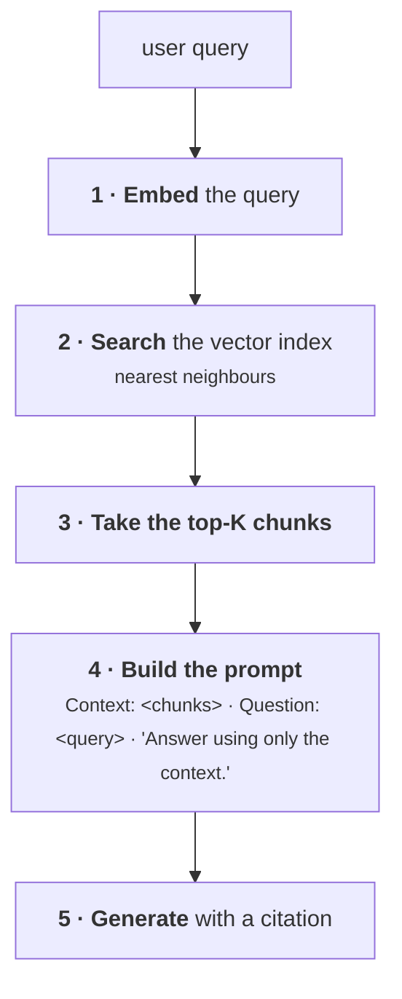
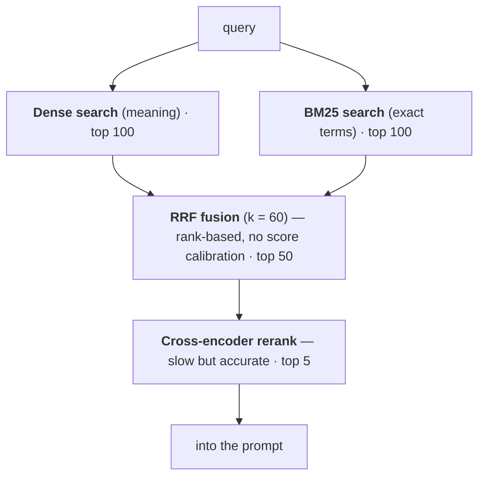
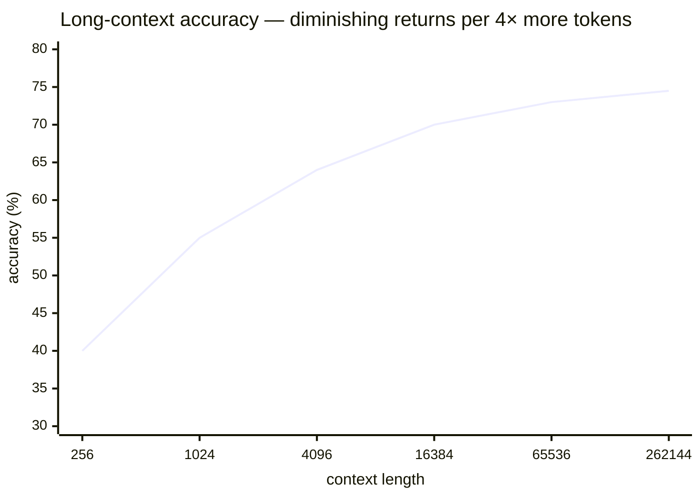
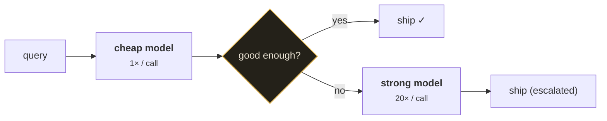
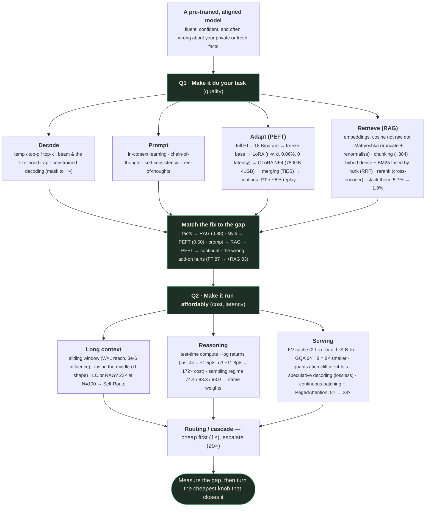

# Using & Serving LLMs: Seven Levers on Three Axes

*Decoding, prompting, PEFT, RAG, long context, reasoning at inference, and efficient serving.*

> ⚠️ **Capture note.** These notes were rebuilt against the verified slide extraction at
> `slides_deduped/Lecture_16 - Module 5 Generative AI and LLMs Part 3/` (**45 deduped slides**,
> against the earlier PDF-screenshot draft's 34 unique slides). Topic coverage against all 45
> slides is essentially complete — every slide maps to an existing section below. But the earlier
> draft's own claim of "no teaching content missing" concealed a **fidelity** problem, not a
> coverage one: this module's mandatory citation sweep found **three confirmed numeric errors**
> where the draft had transcribed a *different* interactive-slider state than the one actually
> preserved by deduplication (§13's Matryoshka example, §18's context-window reach and influence
> figures, and §24's KV-cache ledger) — corrected in this pass and documented in
> `QUALITY_REVIEW.md`. §18 specifically cross-checks both `slides_deduped/` (the slider's first
> state) and the full raw capture in `output/` (a second slider state dedup didn't keep), since
> both states are genuine, distinct, presented content.

---

## What you'll understand after reading this

By the end of this document you will be able to:

1. **Name the seven levers and the three axes** every technique in this lecture trades between —
   and say which knob any given technique actually turns.
2. **Explain temperature, top-k, and top-p** mathematically, and predict what each does to output
   for a confident prompt versus an open-ended one.
3. **Explain the likelihood trap** — why maximising probability produces looping text, and when
   beam search is nevertheless correct.
4. **Describe constrained decoding** and why "just ask for JSON" is not sufficient for tool calls.
5. **Explain what in-context learning actually learns from** — and defend the surprising finding
   that wrong labels barely hurt.
6. **Compute LoRA's parameter savings** for a real layer, and explain why the adapter adds zero
   inference latency.
7. **Calculate why full fine-tuning a 65B model needs ~1.17 TB**, and how QLoRA gets it onto one
   card.
8. **Choose between prompting, RAG, PEFT, and continual pre-training** by diagnosing the gap.
9. **Explain cosine similarity versus raw dot product** and the length bias that makes the
   difference matter.
10. **Design a production RAG system** with hybrid retrieval, reciprocal rank fusion, and reranking
    — and quantify what each layer buys.
11. **Explain "lost in the middle"** and why a buried document can be worse than no document.
12. **Decide between long context and RAG** using cost arithmetic, not intuition.
13. **Explain test-time compute scaling** and why a benchmark score is meaningless without its
    sampling regime.
14. **Quantify quantization's cliff**, speculative decoding's lossless speedup, and continuous
    batching's throughput gain.

---

## Before we start: what you need to know

### Prerequisite 1 — Logits

> **Logits** — the raw, unnormalised scores a model outputs for every token in its vocabulary,
> *before* they are turned into probabilities.
>
> *In everyday words:* the model's gut feeling about each candidate word, on an arbitrary scale
> that can be positive or negative.
>
> *Concretely:* for the prompt *"The capital of France is"*, the model might output logits
> `Paris: 8.2, France: 4.1, the: 3.7, a: 3.5, London: 1.2, …` — one number for each of ~100,000
> tokens. Softmax then converts these into probabilities summing to 1.
>
> *Why they matter here:* **every decoding technique in Part 1 manipulates logits before the
> softmax.** Temperature divides them. Top-k and top-p throw some away. Constrained decoding sets
> invalid ones to $-\infty$. If you understand logits, decoding is easy.

### Prerequisite 2 — Recap: what generation actually is

From lecture 1: a model produces text **autoregressively** — one token at a time, feeding each
output back in. At each step it produces a probability distribution over the whole vocabulary, and
something must **choose one token** from it.

That choosing step is called **decoding**, and it is entirely separate from the model. **The same
model with different decoding rules produces completely different text.** That is the subject of
Part 1.

### Prerequisite 3 — Matrix rank

Needed for LoRA (section 8). If you've not met it, this is the whole idea.

> **Rank** — the number of genuinely independent rows (or columns) in a matrix. It measures how
> much *real* information the matrix contains, as opposed to how big it is.
>
> *In everyday words:* how many distinct ideas are in the table, versus how many rows it has. A
> spreadsheet with 1,000 rows where every row is a multiple of the first one contains **one** idea.
>
> *Concretely:*
> ```
> A = [1  2]      row 2 = 2 × row 1  →  only ONE independent row
>     [2  4]                            rank = 1
>
> B = [1  2]      row 2 is NOT a multiple of row 1
>     [3  1]                            rank = 2
> ```
>
> *Why it matters:* a $1000 \times 1000$ matrix has a million numbers. But if its rank is only 8,
> it can be **reconstructed exactly** from a $1000 \times 8$ matrix times an $8 \times 1000$ matrix
> — that's $8{,}000 + 8{,}000 = 16{,}000$ numbers instead of 1,000,000. **A 62× saving with no
> information lost.** LoRA is that observation applied to fine-tuning.

> 📚 **Low-rank decomposition, visually.**
> ```
>    W (d × k)          ≈           B (d × r)  ×  A (r × k)
>  ┌───────────┐                  ┌───┐          ┌───────────┐
>  │███████████│                  │███│          │███████████│
>  │███████████│        =         │███│    ×     └───────────┘
>  │███████████│                  │███│           r rows only
>  │███████████│                  │███│
>  └───────────┘                  └───┘
>   d×k numbers                  d×r + r×k numbers
>                          the thin waist r is the whole story
> ```

### Prerequisite 4 — Vector norm and cosine

Needed for embeddings (section 12).

> **Norm ($\|u\|$)** — the length of a vector. Pythagoras, extended to any number of dimensions:
> square every component, add them, take the square root.
>
> *Concretely:* $\|[3, 4]\| = \sqrt{9 + 16} = \sqrt{25} = 5$.

> **Unit vector** — a vector whose norm is exactly 1. You make one by dividing a vector by its own
> norm. $[3,4] / 5 = [0.6, 0.8]$, and $\sqrt{0.36 + 0.64} = 1$ ✓.
>
> *Why it matters:* once vectors are unit length, only their **direction** remains — which is
> exactly what you want when comparing meaning.

### Prerequisite 5 — Bits, bytes, and precision

Needed for quantization (section 25).

> **Precision** — how many bits are used to store each number. More bits = finer distinctions =
> more memory.

| Format | Bits | Bytes | Values it can represent |
|---|---|---|---|
| **FP32** | 32 | 4 | ~4 billion distinct values. Old training default. |
| **FP16 / BF16** | 16 | 2 | ~65,000 distinct values. Today's standard for weights. |
| **INT8** | 8 | 1 | 256 distinct values. |
| **INT4 / NF4** | 4 | 0.5 | **16** distinct values. |

**The memory formula you'll use constantly:**

$$\text{model memory (bytes)} = \text{parameters} \times \text{bytes per parameter}$$

*Concretely:* a **70B** model in **FP16** = $70 \times 10^9 \times 2 = 1.4 \times 10^{11}$ bytes =
**140 GB**. That single calculation appears on three different slides in this lecture.

### Prerequisite 6 — Latency vs throughput

These are constantly confused and the lecture depends on the distinction.

> **Latency** — how long **one** request takes, start to finish. What a single user feels.
>
> **Throughput** — how many requests you complete **per second** across everyone. What your
> infrastructure bill feels.

*In everyday words:* latency is how long *your* coffee takes; throughput is how many coffees the
shop serves per hour. **Adding more baristas raises throughput but doesn't shorten your wait once
you're at the front.** Some techniques help one and hurt the other — continuous batching (section
27) is the clearest example.

---

## The big picture: seven levers, two questions, three axes

*(slide_002.jpg — Orientation, and slide_045.jpg — Summary)*

### The problem

The slide opens with the failure that motivates everything:

```
PROMPT
Summarise our refund policy.

OUTPUT
Most items can be returned within 30 days for a full refund …
```

> **It only continues text: fluent, confident, but invented.**

The model has never seen *your* refund policy. It produces something that *sounds* like a refund
policy, because that's what it does. The answer is fluent, confident, and **fabricated**.

### The two questions

> **First make it do your task, then make it run affordably.**

| | Question | Levers | Colour on slide |
|---|---|---|---|
| **1** | Make it **DO** your task | **Decode · Prompt · Adapt (PEFT) · Retrieve (RAG)** | orange (Block 3) |
| **2** | Make it **RUN** affordably | **Long context · Reasoning · Serving** | teal (Block 4) |

### The three axes

> **Every lever you reach for trades quality, cost and latency.**

The summary slide (41) gives the full matrix. **Orange = the axis a lever primarily moves; teal =
side effects it also moves.**

| Lever | **Quality** | **Cost** | **Latency** |
|---|---|---|---|
| **Decode** | ● **primary** | — | side effect |
| **Prompt** | ● **primary** | side effect | — |
| **Adapt (PEFT)** | ● **primary** | — | side effect |
| **Retrieve (RAG)** | ● **primary** | side effect | side effect |
| **Long context** | side effect | ● **primary** | side effect |
| **Reasoning** | side effect | side effect | ● **primary** |
| **Serve** | — | ● **primary** | side effect |

> 💡 **Read the shape of that table, because it's the thesis of the whole lecture.** The first four
> levers (Block 3) are **quality** moves — they make the model do the job. The last three (Block 4)
> are **cost and latency** moves — they make it affordable. Almost every lever touches all three
> axes; the skill is knowing which one it *primarily* moves.

The summary slide's closing statement is the sentence to memorise:

> **The whole skill is: measure the gap, then turn the cheapest knob that closes it.**

Note the order — **measure first**. The most common engineering error in this space is reaching for
fine-tuning (expensive) when a better prompt (free) would have closed the gap, or building RAG when
the real problem was decoding parameters.

> **Next: the model stops being text-only — multimodal and diffusion.** *(That is lecture 4.)*

---

# PART 1 · Choosing the next token

*Decoding strategies and structured output: turning logits into text you can use.*

## 1. Temperature, top-k, and nucleus (top-p) sampling

*(slide_004.jpg and slide_005.jpg — the same slide in two states)*

> **One model, one prompt: the decoding rule alone decides what comes out.**

### Start with the simplest rule: greedy

> **Greedy decoding** — always pick the single highest-probability token.
>
> *In everyday words:* always ordering the most popular dish. Reliable, and eventually boring.

The slide's first bullet states the problem:

> **Always taking the most likely word turns bland and loops.**

Why does it *loop*? Because greedy decoding is **deterministic**. If the model ever returns to a
state resembling an earlier one, it produces the same continuation, which returns it to that state
again. It has no mechanism to escape. You'll see this concretely in section 2.

> **A little randomness escapes the loop, without picking junk.**

That sentence contains the whole design problem: **enough randomness to avoid loops, not so much
that you sample nonsense.** The three controls below are three different answers to it.

### Temperature

> **Temperature ($T$)** — a number that reshapes the probability distribution before sampling,
> making it flatter (more random) or sharper (more deterministic).
>
> *In everyday words:* a confidence dial. Low temperature makes the model more sure of itself; high
> temperature makes it more willing to consider outsiders.

**In words, the formula says: divide every logit by the temperature, then softmax as usual.**

$$p_i = \frac{\exp(z_i / T)}{\sum_j \exp(z_j / T)}$$

| Symbol | Read it as | What it means |
|---|---|---|
| $p_i$ | "p sub i" | Final probability of token $i$. |
| $z_i$ | "z sub i" | The **logit** (raw score) for token $i$. |
| $T$ | "T" | **Temperature.** $T=1$ leaves the distribution unchanged. |
| $\sum_j$ | "sum over j" | Over every token in the vocabulary, to normalise. |

**🧪 Worked example — the same logits at three temperatures.** Logits $z = [4.0,\ 2.0,\ 1.0]$.

```
T = 1.0  (unchanged)
  z/T   = [4.0, 2.0, 1.0]
  exp   = [54.598, 7.389, 2.718]      sum = 64.705
  p     = [0.844, 0.114, 0.042]

T = 0.5  (sharper — divide by 0.5 = multiply by 2)
  z/T   = [8.0, 4.0, 2.0]
  exp   = [2980.96, 54.598, 7.389]    sum = 3042.95
  p     = [0.980, 0.018, 0.002]       ← top token now near-certain

T = 2.0  (flatter)
  z/T   = [2.0, 1.0, 0.5]
  exp   = [7.389, 2.718, 1.649]       sum = 11.756
  p     = [0.629, 0.231, 0.140]       ← outsiders now real candidates
```

| $T$ | Top token | Effect |
|---|---|---|
| **0.5** | 98.0% | Sharper. Nearly deterministic. |
| **1.0** | 84.4% | The model's honest distribution. |
| **2.0** | 62.9% | Flatter. Much more adventurous. |

> 💡 **Understand *why* dividing sharpens.** Dividing by a small $T$ **multiplies** the logits,
> which magnifies the *gaps* between them. Softmax exponentiates, so magnified gaps become
> dramatically magnified probability ratios. $T \to 0$ approaches greedy decoding exactly;
> $T \to \infty$ approaches uniform random.

### Top-k

> **Top-k sampling** — keep only the $k$ highest-probability tokens, discard the rest, renormalise,
> and sample.
>
> *Concretely, $k=3$:* keep the top 3 tokens; every other token's probability becomes exactly 0.
>
> *Why it exists:* even at moderate temperature, the long tail of 100,000 tokens holds a lot of
> total probability mass made of pure junk. Truncating removes it.

**Its flaw — and this is why top-p was invented.** $k$ is fixed, but the model's confidence is not.
For *"The capital of France is"*, one token deserves nearly all the mass, and $k=3$ needlessly
admits two wrong answers. For *"Today the weather is"*, twenty words are genuinely plausible, and
$k=3$ arbitrarily throws away seventeen good options.

### Top-p (nucleus sampling)

> **Top-p keeps the smallest set reaching mass $p$.**

> **Top-p / nucleus sampling** — sort tokens by probability, then keep adding them to the "kept
> set" until their probabilities sum to at least $p$. Discard everything else.
>
> *In everyday words:* "keep whatever accounts for the top 90% of the model's belief, however many
> tokens that turns out to be." The set size **adapts** to how confident the model is.

**🧪 Worked example — top-p = 0.9.**

```
Sorted probabilities: [0.60, 0.20, 0.09, 0.05, 0.03, 0.02, 0.01]

cumulative after token 1:  0.60   < 0.9  → keep, continue
cumulative after token 2:  0.80   < 0.9  → keep, continue
cumulative after token 3:  0.89   < 0.9  → keep, continue
cumulative after token 4:  0.94   ≥ 0.9  → keep, STOP

Kept set = 4 tokens. Renormalise over [0.60, 0.20, 0.09, 0.05]:
  sum = 0.94
  → [0.638, 0.213, 0.096, 0.053]
```

### The slide's two states — this is the point of the whole slide

The slide has two toggle states demonstrating **the same $p = 0.9$** behaving completely
differently:

**State 1 — confident prompt.**
```
PROMPT: The capital of France is ___
        → likely next token "Paris" · confident step:
          one token owns almost all the mass

kept set = 2 of 8 tokens · top-p = 0.9 · T = 1.60
Paris ~83%, France ~8%, then the/a/London/Lyon/Nice/Rome ≈ 0
```

**State 2 — open-ended prompt.**
```
PROMPT: Today the weather is ___
        → likely next token "nice" · open-ended step:
          many tokens are plausible, mass is spread

kept set = 11 of 12 tokens · top-p = 0.9 · T = 1.00
nice/great/lovely/good/warm/sunny/calm/fine/mild/clear/pleasant all ~8-12%
```

```interactive
type: slider
title: Temperature and top-p, live
concept: How decoding parameters reshape a probability distribution before sampling
control: A temperature slider (0.1–2.0) and a top-p slider (0.1–1.0), applied to a chosen prompt (toggle between "confident" and "open-ended" examples)
observe: The bar chart of token probabilities reshapes live as temperature changes (sharper/flatter), and the "kept set" highlighting shrinks or grows as top-p changes
insight: The same p=0.9 keeps 2 tokens on a confident prompt but 11 tokens on an open-ended one — top-p isn't a fixed token count, it's a fixed probability mass, so it automatically adapts its aggressiveness to how confident the model already is
fallback: The two worked states above (Paris ~83%/France ~8%, kept set 2 of 8; vs. eleven weather adjectives all ~8-12%, kept set 11 of 12) are exactly the two frozen endpoints this slider would let you interpolate between.
```

The slide's caption states the principle exactly:

> **Same $p = 0.9$: the kept set shrinks when the model is sure, swells when it is not.**

> 💡 **This is why top-p beat top-k and became the default.** It is not a fixed rule — it is a rule
> that reads the model's own confidence and adapts. When the answer is obvious, it refuses to
> gamble. When many answers are fine, it keeps them all in play. Top-k cannot do this because $k$
> doesn't know anything about the distribution.

### Practical settings

| Task | Temperature | Top-p | Why |
|---|---|---|---|
| Factual Q&A, extraction | 0.0–0.3 | 1.0 | You want the most likely answer, reproducibly. |
| Code generation | 0.0–0.2 | 0.95 | Correctness beats creativity; low temp is standard. |
| General chat | 0.7–1.0 | 0.9 | The common default. |
| Creative writing | 1.0–1.3 | 0.95 | Diversity is the point. |

### Where people get confused

**You might think** temperature 0 and greedy decoding differ. **Actually** they are the same thing
in the limit — most APIs implement `temperature=0` as greedy. (Note that even at $T=0$, output can
vary slightly across runs on GPUs because floating-point reduction order isn't deterministic.)

**You might think** you should tune both temperature and top-p. **Actually** they interact
confusingly and most practitioners fix one. Common practice: set top-p to 0.9–1.0 and tune
temperature only.

**You might think** higher temperature makes the model "more creative". **Actually** it makes it
**more random**. Those overlap at moderate values and diverge badly at high ones — at $T = 2$ you
get genuine incoherence, not creativity.

### 🎯 Interview question

*Your model gives inconsistent answers to factual questions in production. First thing to check?* →
Decoding parameters. If temperature > 0, you're sampling from a distribution rather than taking the
model's best answer. Set temperature to 0 for factual tasks. This is far more often the cause than
anything about the model itself.

---

## 2. Beam search and the likelihood trap

*(slide_006.jpg)*

> **Why maximising probability is the wrong target for open-ended text.**

### What beam search does

> **Beam search** — instead of committing to one token at a time, keep the $B$ most promising
> partial sequences ("beams") alive at every step, and at the end return the complete sequence with
> the highest total probability.
>
> *In everyday words:* chess players considering several lines of play simultaneously rather than
> committing to the first good-looking move. A locally-worse word can lead to a globally-better
> sentence.

**In words, the objective says: among all possible sequences, find the one whose summed
log-probabilities are highest.**

$$\arg\max_{w_{1:T}} \sum_t \log P(w_t \mid w_{<t})$$

| Symbol | Read it as | What it means |
|---|---|---|
| $\arg\max_{w_{1:T}}$ | "the argument that maximises, over sequences w-1 to w-T" | Return the **sequence** that makes the total largest — not the value, the sequence itself. |
| $w_{1:T}$ | "w one through T" | A whole candidate output sequence of length $T$. |
| $\sum_t \log P(w_t \mid w_{<t})$ | "sum of log probabilities" | Total log-probability of the sequence. |

> 📚 **Background: why logs are summed instead of probabilities being multiplied.**
> A sequence's probability is the **product** of each token's probability. Multiply 200 numbers
> each below 1 and you underflow to zero in floating point. Taking logs converts the product into a
> sum — mathematically equivalent (the same sequence wins), numerically stable.

### When beam search is right

> **Right when the input fixes the answer: translation, speech-to-text.**

If you're translating *"Le chat est noir"*, there is essentially **one correct output**, and finding
the highest-probability sequence is exactly finding it. Beam search dominates in machine translation
and speech recognition for precisely this reason.

### The likelihood trap

> **Open-ended prose is not high probability: the likelihood trap.**

This is the counter-intuitive result, and it's worth stating carefully.

> **The likelihood trap** — for open-ended generation, the *most probable* sequence is not the
> *best* sequence. Maximising probability produces degenerate, repetitive text.

The slide's demonstration — the same prompt, two decoders:

```
PROMPT:  The best way to learn is to ___

OUTPUT · GREEDY / BEAM · most probable                        [looping ↻]
  The best way to learn is to practice.
  The best way to learn is to practice.
  The best way to learn is to practice.
  The best way to learn is to practi…

OUTPUT · TOP-p SAMPLED · natural                              [reads well ✓]
  Practise a little every day, then teach what you learned to
  someone else, and stay curious about why it works.
```

**Why does maximising probability cause loops?** Repetition is *self-reinforcing*. Once
`"The best way to learn is to practice."` has appeared, the model has strong evidence — from its
own training on real documents that repeat — that this exact string is likely to appear again. Each
repetition raises the probability of the next. Beam search, hunting the highest-probability
sequence, **walks straight into that basin and cannot climb out**, because every alternative is
locally less probable.

> 💡 **The deep point, and the reason this slide exists:** human language is **not** maximally
> probable. When you speak, you don't emit the most predictable possible sentence — you'd be
> unbearably boring. Real text carries a certain level of surprise. **Sampling reproduces that
> surprise; maximisation eliminates it.** Optimising probability is optimising the wrong objective
> for anything open-ended.

The slide cites the evidence:

> **What beam optimises vs what loops — GPT-2 Large, Holtzman et al. 2019, Table 1.**

The chart compares **human**, **greedy**, and **beam-16** on two measures: **perplexity** (lower =
more probable) and **repetition %** (higher = loops).

> ⚠️ **The exact bar values on this chart are not legible in the capture.** The published finding
> from Holtzman et al. (2019) is the durable part: **human text has *higher* perplexity than
> beam-search text, yet beam search has dramatically higher repetition.** In other words, beam
> search produces text that is *more probable than human writing* and *worse than human writing* —
> which is the entire argument. Verify exact figures against the paper (linked in *Going deeper*).

### Where people get confused

**You might think** beam search is strictly better than greedy because it searches more.
**Actually** for open-ended text it's often **worse** — a wider beam finds an even more probable
(and therefore even more repetitive) sequence. **Searching harder for the wrong objective makes
things worse, not better.**

**You might think** repetition penalties solve this. **Actually** they patch the symptom: they
manually reduce the logit of already-used tokens. Useful in practice, but they don't address the
cause, and set too high they suppress legitimately repeated words ("the", a character's name).

### 🎯 Interview question

*When would you use beam search over sampling?* → When the input determines the output: machine
translation, speech-to-text, and constrained structured generation. Not for chat, creative writing,
or any open-ended task, where the likelihood trap makes the most probable sequence degenerate.

---

## 3. Constrained decoding and structured output

*(slide_007.jpg)*

> **Mask invalid tokens to $-\infty$ so a tool call cannot come out malformed.**

### The problem

> **A tool call is JSON: one bad token and it fails to parse.**
> **Just asking for JSON isn't enough: the model silently breaks it.**

When an LLM agent calls a tool, it does so by **writing JSON**:

```json
{"name":"get_weather","args":{"city":"Paris","unit":"celsius"}}
```

That string is parsed by a program. A single wrong character — a missing brace, an unquoted string,
an invalid enum value — and the parse **fails**. There is no partial credit.

### The failure, from the slide

The slide walks a token-by-token emission and shows exactly where it breaks. At the `"unit"` slot,
the sampler is free to emit anything:

```
Valid options:      celsius        fahrenheit
Invalid it may emit: Celcius        C        sunny        centigrade  ← chosen ✗

no mask: a high-temperature sample lands on "centigrade", the parse dies
```

> 💡 **Note how *reasonable* the failure is.** "centigrade" is a genuine synonym for celsius. A
> human would accept it. The model isn't being stupid — it's being *plausible*. But the parser
> accepts exactly two strings, and this isn't one of them. **Plausibility and validity are
> different things**, and the sampler only knows about plausibility.

Note also that at any nonzero temperature, this is a matter of *when*, not *if*. A 1-in-500 failure
rate is invisible in testing and catastrophic in production.

### The fix

> **Mask every invalid logit to $-\infty$: it cannot be malformed.**

> **Constrained decoding (structured output / grammar-constrained decoding)** — at every generation
> step, compute which tokens could legally come next according to a schema or grammar, and set every
> other token's logit to $-\infty$ before the softmax.
>
> *In everyday words:* instead of asking the model to please stay on the road, you **build walls**.
> Leaving the road stops being something it chooses not to do and becomes something it cannot do.
>
> *Why $-\infty$ specifically:* recall softmax exponentiates. $e^{-\infty} = 0$ **exactly**. Not
> "very unlikely" — impossible. The token cannot be sampled at any temperature, with any random
> seed. (In practice implementations use a large negative number like $-10^{9}$, which is
> numerically equivalent.)

**Concretely, at the `"unit"` slot:**

```
Before masking:
  celsius     logit  4.2
  fahrenheit  logit  3.8
  centigrade  logit  3.1     ← plausible but invalid
  Celcius     logit  2.4
  sunny       logit  0.9

After masking to the schema {"celsius","fahrenheit"}:
  celsius     logit   4.2
  fahrenheit  logit   3.8
  centigrade  logit  -inf  →  probability EXACTLY 0
  Celcius     logit  -inf  →  probability EXACTLY 0
  sunny       logit  -inf  →  probability EXACTLY 0

softmax over survivors:
  e^4.2 = 66.686,  e^3.8 = 44.701,  sum = 111.387
  celsius    = 66.686 / 111.387 = 0.599
  fahrenheit = 44.701 / 111.387 = 0.401

Malformed output is now impossible, not merely unlikely.
```

> 💡 **The guarantee is structural, not statistical.** This is the difference between "we prompt-
> engineered it and it's 99.8% reliable" and "it is 100% reliable by construction". For anything
> feeding a parser — tool calls, function calling, structured extraction — that difference is the
> whole ballgame.

### Where people get confused

**You might think** constrained decoding makes the model smarter. **Actually** it constrains
*form*, not *content*. The model can still choose `celsius` when the user asked for Fahrenheit —
it just can't produce something unparseable. **Valid ≠ correct.**

**You might think** it's free. **Actually** computing the valid token set at each step costs
something, though good implementations precompute grammar transitions and the overhead is small.
There's also evidence that heavy constraints can slightly reduce answer quality, by forcing the
model off its preferred phrasing.

### 🎯 Interview question

*Your agent's tool calls fail to parse about 1 in 500 times. How do you get to zero?* → Constrained
decoding: mask logits to the JSON schema at each step so invalid tokens have probability exactly
zero. Prompt engineering and retries reduce the rate but cannot reach zero; masking makes malformed
output structurally impossible. Lowering temperature also helps but is also not a guarantee.

---

# PART 2 · Talking to the model

*Prompt engineering and in-context learning: steering behaviour with no weight changes.*

## 4. In-context learning

*(slide_009.jpg and slide_010.jpg — two states)*

> **Show a few examples and the model does the task. Is it learning from them?**

### The phenomenon

> **In-context learning (ICL)** — putting a few solved examples in the prompt causes the model to
> perform the task, **with no training and no weight changes whatsoever**.
>
> *In everyday words:* showing someone three solved puzzles and they get the fourth — except
> nothing about them changed. They just saw the pattern.
>
> *Concretely:*
> ```
> Review: "loved every minute"        → positive
> Review: "two hours wasted"          → negative
> Review: "beautifully shot"          → positive
> Review: "a waste of a great cast"   → ?
> ```
> The model outputs `negative`. It was never fine-tuned on sentiment.
>
> *Why it's remarkable:* **the model's weights are frozen.** Nothing was learned in the usual
> sense. Whatever adaptation happened, happened inside a single forward pass. This was not
> predicted; it was discovered in GPT-3, and it is a large part of why prompting became a
> discipline.

**Terminology you'll see everywhere:**

| Name | Meaning |
|---|---|
| **Zero-shot** | No examples. Just the instruction. |
| **One-shot** | One solved example. |
| **Few-shot** | Several solved examples (typically 2–32). |

### The experiment — and the surprise

The slide describes a genuinely startling result:

> **Test it: scramble the labels so the demos are wrong.**
> **Wrong labels barely hurt; only off-task labels break it (Min 2022).**

Read that again. If you replace the correct labels with *wrong* ones —

```
Review: "loved every minute"      → negative     ← WRONG
Review: "two hours wasted"        → positive     ← WRONG
Review: "beautifully shot"        → negative     ← WRONG
Review: "a waste of a great cast" → ?
```

— the model **still mostly gets it right.**

### What actually breaks it

The slide's chart plots held-out accuracy against the share of example labels corrupted, with three
lines:

| Condition | Accuracy | Reading |
|---|---|---|
| **Gold** (correct labels) | **86%** (dashed reference) | The baseline. |
| **Wrong labels** (teal) | stays near 86% across all corruption levels | *"looks broken, isn't"* |
| **Out-of-task label set** (orange) | falls steadily to **21%** at 100% corruption | *"really broken"* |

The slide's annotation on the collapse:

> **Label set broken · 21%. gold 86% → 21%: collapse. The label SET was the contract.**

And the failing prompt:

```
Review: "loved every minute"        → blah
Review: "two hours wasted"          → zorp
Review: "beautifully shot"          → blah
Review: "a waste of a great cast"   → ?

OUTPUT: label set lost → the model no longer knows what to answer
```

> 💡 **This is the key insight, and it reframes what prompting *is*.** The examples are not
> teaching the model how to do sentiment analysis — it already knows that from pre-training. They
> are teaching it **what the task is and what the output space looks like**:
>
> - *"The answers are drawn from {positive, negative}"* ← **this matters enormously**
> - *"The format is `Review: X → label`"* ← **this matters**
> - *"Which specific review maps to which specific label"* ← **this matters much less**
>
> Swap `positive`/`negative` for `blah`/`zorp` and the model has no idea what the valid answers
> even are. **The label set was the contract.** Break the contract and everything collapses; scramble
> the individual answers and the contract still holds.

> ⚠️ **Don't over-generalise this.** The finding (Min et al., 2022) is robust for classification
> tasks with a small fixed label set. For generative and reasoning tasks, correctness of the
> demonstrations matters considerably more — you cannot show wrong worked arithmetic and expect
> right answers. The slide's chart is also marked *"illustrative shape (Min et al. 2022)"*, meaning
> the curve is redrawn rather than copied.

### Practical implications

Because format and label space dominate:

1. **Make the format impeccably consistent.** Same separator, same casing, same structure in every
   example. Inconsistency in *form* costs you more than an error in *content*.
2. **Cover the label space.** Every possible answer should appear in your examples. A class the
   model never sees demonstrated is a class it will under-predict.
3. **Watch example order.** ICL is sensitive to it, and recency bias is real — examples near the end
   carry more weight. This is a known source of irreproducibility.
4. **Balance your classes.** If 9 of 10 examples are `positive`, the model infers a prior toward
   positive and will over-predict it.

### 🔬 Research opportunity

**What ICL actually is mechanistically** remains genuinely open. Leading hypotheses: the forward
pass implements something equivalent to gradient descent on the examples ("in-context gradient
descent"); or attention heads perform pattern-completion ("induction heads"); or the examples
simply locate a task the model already learned during pre-training. Mechanistic interpretability
work on this is active, tractable on small models, and one of the most interesting open questions
in the field.

---

## 5. Chain-of-thought prompting

*(slide_011.jpg)*

> **Hard problems need working-out; give the model room to write its reasoning before it answers.**

### The problem

> **In one forward pass the model blurts a fluent but wrong answer.**

Here is the mechanical reason, and it's important. To answer *"What is 17 × 24?"* directly, the
model must produce the correct answer token **immediately** — using exactly one forward pass worth
of computation, no matter how hard the question is. It has a **fixed compute budget per token**,
and hard problems need more than that.

### The fix

> **Let it show its working: one line, "Let's think step by step."**

> **Chain-of-thought (CoT) prompting** — prompt the model to produce intermediate reasoning steps
> before its final answer.
>
> *In everyday words:* showing your working in a maths exam. Not for the examiner's benefit — for
> your own. You cannot hold a five-step calculation in your head at once, so you write down step
> one, then use it for step two.
>
> *Why it works, mechanically:* **each generated token gets its own forward pass.** By writing 200
> tokens of reasoning, the model spends 200 forward passes' worth of computation on the problem
> instead of 1. The intermediate tokens act as **external working memory** — once written, they're
> in the context, and every later step can attend to them. **CoT converts a hard one-step prediction
> into a sequence of easy one-step predictions.**

### The evidence

> **Same model, that phrase: GSM8K jumps 10.4 → 40.7 (Kojima).**

**A 4× improvement from adding one sentence to the prompt.** No retraining, no new data, no
architecture change.

> 📚 **Background — what GSM8K is.**
> **G**rade **S**chool **M**ath **8K**: 8,500 word problems at roughly primary-school level, each
> needing 2–8 arithmetic steps. It became the standard reasoning benchmark because it requires
> genuine multi-step work while the individual operations are trivial — so it isolates *reasoning*
> from *knowledge*.

The finding is from **Kojima et al. (2022)**, whose contribution was showing that the magic phrase
**"Let's think step by step"** works **zero-shot** — you don't even need worked examples.

### The slide's worked example

```
PROMPT
I had 10 apples, gave 2 to a neighbour and 2 to the repairman,
bought 5 more, ate 1. How many left?
Let's think step by step.

OUTPUT  10 apples
```

Let's verify the arithmetic:

```
Start:                    10
Gave 2 to neighbour:      10 - 2 = 8
Gave 2 to repairman:       8 - 2 = 6
Bought 5 more:             6 + 5 = 11
Ate 1:                    11 - 1 = 10

Answer: 10 apples  ✓
```

The slide contrasts this against the direct answer:

```
DIRECT: ANSWER AT ONCE          +  WRITE THE WORKING FIRST
   one forward pass                "Let's think step by step."

      11 apples                          10 apples
      ✗ wrong                            ✓ right
```

> 💡 **Look at the wrong answer: 11.** That is the value after `bought 5 more` but before
> `ate 1` — the model got four of five steps right and dropped the last one. This is the
> characteristic failure of direct answering: not random nonsense, but a **truncated
> calculation**. It ran out of computation before finishing.

### CoT is not a uniform win

The slide is careful here, and this is the sophisticated part:

> **CoT gain is not one number (accuracy pts, Sprague et al.)**

The chart shows CoT's benefit **by task category**, with bars of very different lengths:

| Task type | CoT gain |
|---|---|
| **Symbolic** | Largest |
| **Math** | Large |
| **Logic** | Moderate |
| **All other tasks** | Small |

> ⚠️ **The exact point values on this chart are not legible in the capture.** The finding from
> Sprague et al. is the durable claim: **CoT's benefit is concentrated in math, symbolic
> manipulation, and formal logic — tasks with discrete multi-step structure. On most other tasks
> (commonsense QA, reading comprehension, summarisation) the gain is small or absent.**

> 💡 **The rule this gives you:** CoT helps when the task decomposes into steps that must be
> executed in order. It helps little when the answer is a single retrieval or judgement. And it
> always costs you: more tokens means more money and more latency. **"Add CoT to everything" is a
> real anti-pattern** — you pay 5–10× the output tokens for no gain on tasks that don't need it.

### Where people get confused

**You might think** the model is genuinely reasoning like a person. **Actually** what's certain is
narrower and still remarkable: it generates text that *looks like* reasoning, and generating it
makes the final answer more accurate. Whether the written chain reflects the actual computation is
contested — there is evidence of **unfaithful CoT**, where models produce a plausible chain that
does not match the reasoning that actually drove the answer.

**You might think** the exact phrase matters mystically. **Actually** many phrasings work. The
phrase's job is to shift the model into a distribution of text where working is shown — training
data full of worked solutions makes that distribution available.

**You might think** modern reasoning models made CoT prompting obsolete. **Actually** they
**internalised** it: models like o1 and R1 are *trained* to produce long chains automatically. The
mechanism is the same; the trigger moved from your prompt into the weights. Understanding CoT is
how you understand what those models are doing.

---

## 6. Sampling and searching over thoughts

*(slide_012.jpg — category label "Reasoning at inference"; deck's own page footer "10/39", hence the earlier draft's "Slide 10")*

> **One reasoning chain can slip; sample several and let them vote.**

### The problem

> **A single chain is one lucky path: one slip and it's wrong.**

CoT has a fragility: it's a chain, and a chain fails at its weakest link. One arithmetic slip in
step 3 propagates to a wrong final answer, no matter how sound the other steps were. And because
sampling is stochastic, running the same prompt again might not slip.

### Self-consistency

> **Sample several times, keep the majority: self-consistency, 56.5 → 74.4% on GSM8K.**

> **Self-consistency** — sample multiple independent reasoning chains at nonzero temperature, then
> take a **majority vote** over their final answers.
>
> *In everyday words:* asking five people to do the calculation separately and going with the
> answer most of them reached. Individual mistakes are random and don't agree with each other;
> correct reasoning converges.
>
> *Why it works:* there are many valid routes to the right answer but errors scatter. Correct chains
> **agree with each other** (they all reach 18); wrong chains disagree (one says 22, another 15,
> another 19). Majority voting exploits that asymmetry.

**The slide's worked example:**

```
PROMPT
Maya buys 6 packs of 4 pens, gives away 9, then buys 3 more.
How many pens? Think step by step.

path 1: 6×4=24, −9=15, +3 →                          18   ✓
path 2: 24 pens, −9=15, then +3 →                    18   ✓
path 3: 6×4=24, −9=13 (slip), +9 →                   22   ✗ lone slip
path 4: 24−9=15, 15+3 →                              18   ✓
path 5: 6 packs=24, −9=15, +3 →                      18   ✓

Majority: 18 (4 votes) vs 22 (1 vote)   →  answer 18
```

Verify: $6 \times 4 = 24$; $24 - 9 = 15$; $15 + 3 = \mathbf{18}$ ✓

The slide's caption: *"five sampled chains, one majority answer"* — and note path 3's error is
labelled **"a lone slip, outvoted"**.

**The gain: 56.5% → 74.4% on GSM8K.** An 18-point improvement with **no change to the model** — you
simply run it five times and count.

> 💡 **Note the required interaction with Part 1.** Self-consistency **needs temperature > 0**. At
> temperature 0 the model is deterministic, so all five samples are identical and the vote is
> meaningless. This is a direct dependency between two sections of this lecture: the decoding
> strategy is what makes the reasoning strategy possible.

### Tree-of-thoughts

> **Tree-of-thoughts searches and backtracks over branches (4 → 74% on Game-of-24).**

> **Tree-of-Thoughts (ToT)** — instead of sampling independent complete chains, explore a **tree**
> of partial reasoning states: generate several candidate next steps, **evaluate** which are
> promising, expand the good ones, and **backtrack** from dead ends.
>
> *In everyday words:* self-consistency is five people working alone and comparing answers.
> Tree-of-thoughts is one person exploring a maze — trying a route, recognising a dead end, going
> back, trying another.
>
> *Why it's stronger:* self-consistency cannot recover from a bad start. Once a chain commits to a
> wrong first step, that entire sample is wasted. ToT can **abandon** a branch mid-way and reuse the
> good prefix.

> 📚 **Background — what Game-of-24 is.**
> Given four numbers, use each exactly once with $+ - \times \div$ to make 24. E.g. from
> `4, 9, 10, 13`: $(10 - 4) \times (13 - 9) = 6 \times 4 = 24$.
> It's the ideal test case for ToT because it demands **search**: most attempted combinations fail,
> you discover failure only partway through, and backtracking is the natural strategy. A linear
> chain has no way to recover from a bad first operation.

**The gain: 4% → 74% on Game-of-24.** An 18× improvement — vastly larger than self-consistency's,
because this task is pure search.

### Comparing the three

| | **CoT** | **Self-consistency** | **Tree-of-thoughts** |
|---|---|---|---|
| Structure | One chain | $N$ independent chains | A searched tree |
| Cost | 1× | $N$× (e.g. 5×) | Much higher — many partial expansions + evaluations |
| Can recover from a bad start? | ❌ | ❌ (that sample is wasted) | ✅ backtracks |
| Needs temperature > 0? | No | **Yes** | Yes |
| Best for | Any multi-step task | Tasks with a single checkable answer | Search problems (puzzles, planning) |
| Reported gain | GSM8K 10.4 → 40.7 | GSM8K 56.5 → 74.4 | Game-of-24 4 → 74 |

> 💡 **All three are the same trade, at increasing intensity: spend more compute at answer time to
> get a better answer, without touching the weights.** That is exactly the "test-time compute" idea
> that section 21 formalises — this slide is where it first appears.

### Where people get confused

**You might think** self-consistency works for any task. **Actually** it needs a **discrete,
comparable final answer** to vote on. You cannot majority-vote five different essays. It's ideal
for math, multiple choice, and classification; useless for open-ended generation.

**You might think** more samples always help. **Actually** returns diminish sharply — the gain from
5→10 samples is much smaller than 1→5, while cost scales linearly. And if the model is *reliably*
wrong (a systematic misconception rather than a random slip), the majority converges on the wrong
answer with high confidence. **Voting fixes noise, not bias.**

### 🎯 Interview question

*Self-consistency costs 5× per query. When is that worth it?* → When answers are discrete and
checkable, errors are random rather than systematic, and correctness is worth more than 5× the
inference cost — math, structured extraction, high-stakes classification. Not worth it for
open-ended generation (nothing to vote on), or where the model's errors are systematic (voting
amplifies a consistent misconception rather than cancelling it).

---

# PART 3 · Adapting the weights (PEFT)

## 7. Why full fine-tuning is a memory problem

*(slide_014.jpg and slide_015.jpg — the same slide in two states)*

> **The memory tax is never the weights; it is the optimiser state and gradients you keep for every
> weight.**

### The claim

> **Full fine-tuning a 65 B model will not fit on one GPU.**

```
CODE
trainer.fit( model_65B, my_data )    # on one GPU

RESULT  CUDA out of memory: full fine-tune needs ~1.17 TB
```

### Where 1.17 TB comes from

The slide gives the accounting:

$$\underbrace{6}_{\text{weights}} + \underbrace{12}_{\text{optimiser + grads}} = 18\ \text{B/param}$$

That is **18 bytes per parameter**. Break it down:

| Component | Bytes/param | What it is |
|---|---|---|
| **Weights** (fp16) | 2 | The model itself. |
| **Weights** (fp32 master copy) | 4 | A full-precision copy kept for stable updates. |
| **Gradients** | 4 | One gradient per parameter, computed each step. |
| **Adam momentum ($m$)** | 4 | Running average of past gradients. |
| **Adam variance ($v$)** | 4 | Running average of past *squared* gradients. |
| **Total** | **18** | |

> 📚 **Background the slide assumed — why Adam needs two extra copies.**
> Plain gradient descent updates `param -= lr × gradient` and stores nothing. **Adam** (the standard
> optimiser) keeps two running statistics **per parameter**:
> - **Momentum $m$** — an average of recent gradients, so updates keep moving in a consistent
>   direction and don't jitter.
> - **Variance $v$** — an average of recent squared gradients, so each parameter gets its own
>   effective learning rate: parameters with consistently large gradients get smaller steps.
>
> Both are *the same size as the model*. **This is why the optimiser, not the model, dominates
> training memory** — and it's the single fact that makes PEFT necessary.

> 👉 *See also:* [Deep Neural Networks Part 1, §20–21](../Deep%20Neural%20Networks/deep-neural-networks-01.md)
> derives Adam from momentum + RMSProp and covers AdamW's decoupled weight decay in full — the
> memory accounting here assumes that derivation rather than repeating it.

**🧪 Worked example — the full calculation for 65B:**

```
Weights (fp16):          65e9 × 2  = 130 GB
Master weights (fp32):   65e9 × 4  = 260 GB
Gradients (fp32):        65e9 × 4  = 260 GB
Adam momentum:           65e9 × 4  = 260 GB
Adam variance:           65e9 × 4  = 260 GB
                                     ───────
Total                    65e9 × 18 = 1,170 GB = 1.17 TB   ✓
```

The slide's chart labels it slightly differently but reaches the same place:

> **65B full fine-tune: 1.17 TB of GPU memory — weights 390 GB + optimiser & grads 780 GB
> (67% is NOT weights).**

> ⚠️ **Note the internal split differs from my table above** (the slide groups fp16 + fp32 master +
> something into "weights 390 GB" = 6 B/param, and gradients + Adam states into 780 GB = 12
> B/param). **The total, 18 B/param and 1.17 TB, is identical and is the number that matters.**
> Exact per-component splits vary with implementation (mixed-precision recipe, whether gradients
> are fp16 or fp32).

> 💡 **Say the headline out loud: two-thirds of the memory is not the model.** People assume "the
> model is too big". The model is 390 GB of a 1.17 TB problem. **780 GB is bookkeeping that exists
> only because you are training.** That reframing is what makes the fix obvious.

### The fix

> **Freeze the base: no optimiser state, no gradients, tiny adapter.**

The second slide state shows the result:

> **65B frozen base: 390 GB (780 GB deleted). 6 B weights stay; optimiser + grads now live on a
> 0.06% adapter only.**

**If a parameter is frozen, it needs no gradient and no optimiser state.** All 12 bytes per
parameter of bookkeeping vanish for every frozen weight. You keep only the weights themselves —
which you needed anyway just to run the model.

> **Parameter-Efficient Fine-Tuning (PEFT)** — the family of methods that freeze the pre-trained
> model and train only a small number of new or selected parameters.
>
> *In everyday words:* instead of repainting the whole house to change the trim, you repaint the
> trim.

From **1.17 TB → 391 GB** just by freezing. Section 8 shows how to make the trainable part
*useful*, and section 9 gets the remaining 391 GB onto a single card.

---

## 8. Low-rank adaptation (LoRA)

*(slide_016.jpg)*

> **Freeze the base, train a thin low-rank update, then fold it back in.**

### The problem with full fine-tuning, restated

> **Full fine-tuning retrains billions of weights, a full copy per task.**

Beyond memory, there's a deployment problem. Fine-tune a 65B model for five customers and you have
**five 130 GB models**. You cannot hold them all in memory, so switching tasks means reloading 130
GB from disk.

### The insight

> **The needed change is small, so freeze $W_0$, learn a thin update beside it.**

The observation (Hu et al., 2021): when you fine-tune, the **change** to the weights —
$\Delta W = W_{\text{finetuned}} - W_{\text{original}}$ — turns out to have **very low rank**. The
model already knows almost everything; adaptation nudges it in a handful of directions.

So don't store $\Delta W$ as a full matrix. Store it as a product of two thin ones.

**In words, the formula says: the new weight is the frozen original, plus a scaled product of two
thin matrices.**

$$W' = W_0 + \frac{\alpha}{r} BA, \qquad B \in \mathbb{R}^{d \times r},\ A \in \mathbb{R}^{r \times k},\ r \ll d$$

| Symbol | Read it as | What it means |
|---|---|---|
| $W'$ | "W prime" | The effective weight matrix used at inference. |
| $W_0$ | "W nought" | The original pre-trained matrix. **Frozen — never updated.** |
| $B$ | "B" | A $d \times r$ matrix. **Trained.** Usually initialised to **zeros**. |
| $A$ | "A" | An $r \times k$ matrix. **Trained.** Usually initialised randomly. |
| $BA$ | "B A" | Their product — a $d \times k$ matrix, the same shape as $W_0$. This *is* $\Delta W$. |
| $r$ | "r", the **rank** | The thin waist. Typically 4, 8, 16, or 64. |
| $\alpha$ | "alpha" | A scaling constant, so changing $r$ doesn't change the update's magnitude. |
| $r \ll d$ | "r much less than d" | The whole point. $r=8$ while $d=4096$. |

> 💡 **Why $B$ starts at zero.** At initialisation $BA = 0$, so $W' = W_0$ **exactly**. The adapted
> model starts *identical* to the pre-trained one and departs from it gradually as training
> proceeds. No initial shock, no destroyed pre-trained behaviour. It's a small detail with a large
> effect on stability.

The slide's diagram, which is worth internalising:

```svg
<svg viewBox="0 0 560 180" role="img" aria-label="LoRA: a frozen weight plus a low-rank update" font-family="system-ui,sans-serif">
  <style>.frz{fill:#2C2820;stroke:#4C4739}.upd{fill:#1E3025;stroke:#8CDCA6}.op{fill:#EDE6D7;font-size:20px}
    .lab{fill:#B4AA95;font-size:11px}.note{fill:#8CDCA6;font-size:11px}</style>
  <rect class="frz" x="14" y="30" width="90" height="90"/>
  <text class="op" x="122" y="82">+</text>
  <rect class="upd" x="146" y="30" width="26" height="90"/>
  <text class="op" x="184" y="82">×</text>
  <rect class="upd" x="206" y="66" width="90" height="26"/>
  <text class="op" x="314" y="82">=</text>
  <rect class="frz" x="338" y="30" width="90" height="90" stroke="#8CDCA6"/>
  <g class="lab" text-anchor="middle">
    <text x="59" y="140">W₀ (d×k) · frozen</text>
    <text x="159" y="140">B (d×r)</text>
    <text x="251" y="106">A (r×k)</text>
    <text x="383" y="140">ΔW = BA (d×k)</text>
  </g>
  <text class="note" x="280" y="164" text-anchor="middle">the thin waist r is the whole story — trainable params drop from d·k to r·(d+k)</text>
</svg>
```

The slide's caption: **"BA has $W_0$'s footprint, built from those two slivers."**

### 🧪 Worked example — the slide's own numbers

The slide states: **trainable params = 4,000 (250× fewer)**.

Reconstruct it. Take a layer with $d = k = 1000$ and $r = 2$:

```
Full fine-tuning this layer:
  d × k = 1000 × 1000 = 1,000,000 trainable parameters

LoRA with r = 2:
  B is d × r = 1000 × 2 = 2,000
  A is r × k = 2 × 1000 = 2,000
                          ─────
  total                 = 4,000 trainable parameters      ✓ matches the slide

Reduction: 1,000,000 / 4,000 = 250×                       ✓ matches the slide
```

**Now a realistic case — Llama-2-7B with $r = 8$ on Q and V:**

```
Llama-2-7B: 32 layers, hidden dimension d = 4096
LoRA applied to the Q and V projection matrices (both 4096 × 4096)

Per matrix, r = 8:
  B: 4096 × 8 = 32,768
  A: 8 × 4096 = 32,768
  total       = 65,536 params

Per layer (Q and V):  2 × 65,536 = 131,072
All 32 layers:        32 × 131,072 = 4,194,304 ≈ 4.19 M trainable params

As a fraction of the model:
  4.19e6 / 7e9 = 0.0599% ≈ 0.06%       ✓ matches the slide's "0.062%"

Adapter file size (fp16):
  4.19e6 × 2 bytes = 8.4 MB            ✓ matches the slide's "8 MB adapter"
```

The slide's summary and code result:

> **At $r=8$ on Q,V: just 0.062% of weights, zero added latency.**

```
CODE
lora_finetune( Llama-2-7B, support_tickets )

RESULT  shipped an 8 MB adapter · base untouched
```

> 💡 **An 8 MB file instead of a 13 GB model.** You can email it. You can keep a thousand of them
> on one machine. You can hot-swap customers by loading 8 MB instead of reloading 13 GB. **This is
> what made per-customer and per-task fine-tuning economically ordinary.**

### Zero added latency — why this matters and how it works

The phrase **"zero added latency"** is the part people miss, and it's what makes LoRA better than
earlier PEFT methods.

Because the update is **additive**, you can compute $W' = W_0 + \frac{\alpha}{r}BA$ **once, before
serving**, and store the merged matrix. At inference there is no $A$, no $B$, no extra
multiplication — just an ordinary weight matrix of the ordinary shape.

```
During training:   W₀ frozen,  A and B trained separately     (2 extra matmuls)
Before serving:    W' = W₀ + (α/r)BA   ← computed once, offline
During inference:  just W'                                     (0 extra matmuls)
```

> 💡 **Contrast with adapter layers**, the earlier PEFT approach, which inserted small extra modules
> **between** existing layers. Those cannot be folded away — they add a sequential operation at
> every layer, every token, forever. LoRA's additive form is exactly what lets it vanish at
> inference. That structural difference is why LoRA won.

**The trade-off:** merging gives zero latency but means one model per adapter in memory. Keeping
them unmerged lets you serve many adapters from one base (this is how multi-tenant LoRA serving
works) at the cost of a small per-token overhead. You choose per deployment.

### Choosing $r$

| $r$ | Trainable params | Use when |
|---|---|---|
| **1–4** | Tiny | Style, tone, simple format changes. |
| **8–16** | Small | The common default. Most task adaptation. |
| **32–64** | Moderate | Larger behaviour shifts, harder domains. |
| **128+** | Large | Approaching full fine-tuning; diminishing returns. |

The consistent empirical finding: **which matrices you adapt matters more than $r$.** Applying LoRA
to more matrices (Q, K, V, O, and the FFN) at low rank generally beats a high rank on Q and V alone.

### Where people get confused

**You might think** LoRA is an approximation that costs quality. **Actually** on most task
adaptation it matches full fine-tuning closely. It struggles when you need to teach genuinely *new
knowledge* — but so does full fine-tuning (see section 11), so that's not a LoRA-specific weakness.

**You might think** LoRA saves inference memory. **Actually** it saves **training** memory and
**storage**. At inference you still load the full base model; the adapter adds 8 MB to 13 GB.

**You might think** you can merge many LoRAs by adding them. **Actually** naive addition often
degrades — this is exactly the sign-conflict problem section 10 addresses.

### 🎯 Interview questions

- *Why does LoRA add no inference latency, when adapter layers do?* → LoRA's update is additive to
  an existing matrix, so it can be folded into $W_0$ offline. Adapter layers are new sequential
  modules and cannot be folded away.
- *Why initialise $B$ to zero and $A$ randomly?* → So $BA = 0$ at the start and the model is exactly
  the pre-trained one. If both were random, training would begin with an untrained perturbation to
  every adapted weight. If both were zero, the gradient would be zero and nothing would ever learn.

---

## 9. QLoRA: fine-tuning a 65B model on one GPU

*(slide_017.jpg)*

> **Store the frozen base in 4-bit, train 16-bit adapters on top.**

### The remaining problem

> **LoRA's adapter is tiny, but the frozen base sits in memory in full.**

Section 7 got 65B from 1.17 TB to 391 GB by freezing. Section 8 made the trainable part tiny. But
391 GB still needs a cluster — the frozen base has to be *somewhere*.

### The fix

> **Store the frozen base in 4-bit (NF4), train the adapter on top.**

The observation is simple once stated: **the base is frozen. It is never updated. So why store it at
full precision?** Precision matters for *accumulating small updates* — and a frozen matrix
accumulates nothing.

> **NF4 (4-bit NormalFloat)** — a 4-bit number format designed specifically for neural network
> weights.
>
> *In everyday words:* ordinary 4-bit integers space their 16 available values evenly. But neural
> network weights aren't spread evenly — they cluster near zero in a bell curve. NF4 places its 16
> values so that **an equal number of weights falls into each bucket**, which puts fine resolution
> where the weights actually are.
>
> *Why it matters:* it gets meaningfully better accuracy than naive 4-bit at identical size.

### The numbers

> **65B: 780 GB → 41 GB, one card. Guanaco hit 99.3% of ChatGPT in 24h.**

The chart shows three bars against a **48 GB single-GPU budget** line:

| Method | Training memory | Fits one 48 GB GPU? |
|---|---|---|
| **FP16 full** | **> 780 GB** | ❌ needs a cluster |
| **LoRA** | **130 GB** ⚠️ *(slide marks this "illustrative")* | ❌ needs a cluster |
| **QLoRA** | **41 GB** | ✅ **fits, with 7 GB to spare** |

> **65B once needed >780 GB, a cluster. 4-bit base now fits one card.**

**Verify the QLoRA figure:**

```
Base weights in NF4:   65e9 × 0.5 bytes = 32.5 GB
LoRA adapters (fp16):  small, well under 1 GB
Activations, gradients for the adapter, workspace:  the remainder

Total ≈ 41 GB          ✓ fits inside 48 GB with ~7 GB spare
```

> 💡 **Sit with what this did to the field.** Before QLoRA, fine-tuning a 65B model required a
> multi-GPU cluster — a capability restricted to well-funded labs. After QLoRA, it required **one
> 48 GB GPU for 24 hours**, which anyone can rent for a few dollars an hour. **Guanaco** was the
> demonstration: a 65B model fine-tuned that way reached **99.3% of ChatGPT's score** on a
> head-to-head evaluation.
>
> This is arguably the single most **democratising** result in this entire lecture series.

The slide itself is a **Model × Method** picker: two rows of pill buttons — **Model** (7B / 13B /
65B) and **Method** (FP16 full / LoRA / QLoRA) — that redraw the bar chart for whichever combination
you select.

```interactive
type: simulator
title: QLoRA memory picker
concept: How model size and fine-tuning method jointly determine whether a fine-tune fits on one GPU
control: The deck's own two button rows — Model (7B / 13B / 65B) and Method (FP16 full / LoRA / QLoRA)
observe: The training-memory bar redraws for the chosen combination, against a fixed 48 GB single-GPU budget line
insight: Model size and method compound — 65B+FP16 full is the worst case (>780 GB, needs a cluster) and 65B+QLoRA is the best (41 GB, fits with room to spare); the same QLoRA method that barely matters at 7B (already small enough) is what makes 65B tractable at all — the technique's payoff scales with the model you apply it to
fallback: The three-row table above (FP16 full > 780 GB, LoRA 130 GB illustrative, QLoRA 41 GB, all at 65B) is the single Model=65B column this picker would let you compare against the 7B and 13B columns.
```

> ⚠️ **Read "99.3% of ChatGPT" carefully.** It refers to a specific comparison (the Vicuna
> benchmark, GPT-4 as judge) on *conversational quality*, not general capability. LLM-as-judge
> evaluations are known to be noisy and to favour certain styles. The result is real and was
> genuinely important; it does not mean Guanaco equalled ChatGPT in general.

### Why doesn't 4-bit destroy quality?

Two reasons, and both matter:

1. **The base is frozen.** Quantization error is a *fixed, constant* distortion. Nothing accumulates.
2. **The adapter compensates.** $A$ and $B$ are trained in 16-bit **on top of the quantized base**,
   so gradient descent sees the quantized weights and learns an update that works with them —
   partially correcting the quantization error as a side effect of training.

Note that quantization is applied to the **frozen base only**. The adapters stay in 16-bit precisely
because they *are* being updated.

### 🎯 Interview question

*You have one A100 (80 GB) and want to fine-tune Llama-70B on your support tickets. Approach?* →
QLoRA. Load the base in NF4 (~35 GB), attach LoRA adapters at $r$=16 on Q, K, V, O and the FFN
projections, train in bf16. Total lands around 45–55 GB, fitting comfortably. Ship the resulting
adapter (tens of MB), not a 140 GB model. Full fine-tuning would need ~1.26 TB and is not an option.

---

## 10. Combining fine-tunes: model merging

*(slide_018.jpg — only one deduped slide exists for this topic; the earlier draft's claim of two
states does not hold against this deck's actual capture)*

> **Arithmetic on weight deltas, no training, no GPU.**

### The goal

> **Want one model with every skill, without retraining or serving all of them.**

You have three LoRA fine-tunes: one for medical text, one for legal, one for code. You want **one**
model with all three skills. Retraining on the union is expensive. Serving three models is
expensive. Is there a cheaper option?

### Task vectors

> **Task vector ($\tau$)** — the difference between a fine-tuned model's weights and the
> pre-trained weights: $\tau = \theta_{\text{ft}} - \theta_{\text{pre}}$.
>
> *In everyday words:* the *diff*. Not the model — the **change** the fine-tune made. Like a git
> patch rather than the whole repository.
>
> *Why it's useful:* task vectors turn out to behave like vectors in a meaningful way. You can add
> them, scale them, even subtract them (subtracting a toxicity task vector reduces toxicity). **A
> skill becomes an object you can do arithmetic with.**

### The problem with plain averaging

> **Plain averaging cancels sign-conflicted weights: silent signal loss.**

The slide's worked example, for one shared weight $w_0$:

```
ONE SHARED WEIGHT, THREE FINE-TUNES
For weight w₀ the task vectors τ disagree:
  model A:  +0.8
  model B:  +0.7
  model C:  -0.6

Naive average:  (0.8 + 0.7 - 0.6) / 3 = 0.9 / 3 = 0.30
                                    "the − eats the +"
```

**Two out of three models want this weight to go up, decisively.** One wants it down. Averaging
gives **0.30** — a weak signal that satisfies nobody. The slide's phrase: *"the − eats the +."*

The slide also quantifies the aggregate damage across all weights:

> **TIES (elect sign) · magnitude lost to cancellation: 29%**

**Nearly a third of the total update magnitude is destroyed by sign conflicts** under naive
averaging. That's the "silent signal loss" — silent because nothing errors, nothing warns you; the
merged model is just quietly worse than it should be.

### TIES

> **TIES elects the dominant sign, averages only the agreeing ones.**

> **TIES-Merging** — for each weight, hold an **election** on the sign, then average **only** the
> task vectors that voted with the winner. The dissenters are excluded, not averaged in.

```
TIES on the same weight:

Step 1 — elect the sign.
  Positive camp: A (+0.8), B (+0.7)   total magnitude = 1.5
  Negative camp: C (-0.6)             total magnitude = 0.6
  → POSITIVE wins.

Step 2 — average only the winners.
  (0.8 + 0.7) / 2 = 1.5 / 2 = 0.75          ✓ matches the slide

Naive average: 0.30      TIES: 0.75      2.5× stronger signal preserved
```

> 💡 **The principle generalises well beyond merging: when combining conflicting signals, resolve
> the conflict rather than averaging through it.** Averaging treats a disagreement as if it were
> uncertainty about magnitude. It isn't — it's a genuine disagreement about *direction*, and the
> right answer is to pick one, not to split the difference and end up somewhere neither party wanted.

> 📚 **The full TIES method has three steps**, of which the slide shows one. **(1) Trim** — keep
> only the largest-magnitude entries of each task vector, zeroing the rest (most of a task vector is
> noise). **(2) Elect sign** — the step above. **(3) Disjoint merge** — average only the agreeing
> entries. The trimming step matters: it removes most spurious conflicts before the election even
> happens.

### Why merging is remarkable

Look at what this technique needs:

| | Retraining | Merging |
|---|---|---|
| GPU required | ✅ Yes, many | ❌ **None** |
| Training data required | ✅ Yes, the union | ❌ **None** |
| Time | Hours to days | **Seconds** |
| Cost | Substantial | **Essentially zero** |

**No training. No GPU. No data.** Merging is arithmetic on files. That is why it's ubiquitous on the
open-weight model hub — a large share of the models there are merges rather than trained models.

> ⚠️ **The honest caveat.** Merging works best when the models being merged share a **common
> ancestor** (all fine-tuned from the same base) and the tasks aren't in direct conflict. Merging
> models with different base models, or with genuinely opposed objectives, degrades badly. It is
> also poorly understood theoretically — it's an empirical technique that works better than anyone
> can fully explain.

---

## 11. Continual pre-training: teaching a new subject

*(slide_019.jpg)*

> **One medical question, three different machines: knowledge, behaviour, retrieval.**

### Three tools, three jobs

The slide poses one question and asks which tool answers it:

```
QUESTION
"What is the 2024 contribution limit, and how should I phrase the patient note?"
```

Notice this question has **two halves**, needing two different tools:

| Tool | What it changes | The slide's description |
|---|---|---|
| **Continual PT** | **Knowledge** | Learns the **subject**: a 2nd self-supervised phase on a domain corpus, knowledge baked into weights. |
| **Fine-tune** | **Behaviour** | Changes **behaviour**: format, tone, the note style, on labelled examples. |
| **RAG** | **Retrieval** | Hands it an **open book**: fresh facts injected at inference, weights untouched. |

> **Continual pre-training** — running more *pre-training* (unlabelled next-token prediction) on a
> domain corpus, after the original pre-training but before any fine-tuning.
>
> *In everyday words:* sending a graduate back to university to read an entire medical library. Not
> teaching them a task — teaching them a **subject**.
>
> *Concretely:* take Llama-3-8B, train it on 50 billion tokens of medical literature with the same
> next-token objective. It emerges knowing medical terminology, drug names, and clinical writing
> conventions natively.
>
> *Why it exists:* fine-tuning teaches *behaviour* on thousands of labelled examples. It cannot
> efficiently install a whole domain's vocabulary and background knowledge — for that you need
> volume, and volume means unlabelled text, and unlabelled text means pre-training.

### Fine-tuning does not teach facts

> **New fact: RAG 0.88 vs fine-tuning 0.50. Fine-tuning teaches manner, not facts.**

This is the most practically important line on the slide, and it contradicts most people's
instincts.

For a **new fact** the model has never seen:

| Method | Score |
|---|---|
| **RAG** | **0.88** |
| **Fine-tuning** | **0.50** |

> 💡 **Why fine-tuning is bad at facts.** A fact appears in your fine-tuning set a handful of times.
> During pre-training, a well-known fact appeared thousands of times across millions of documents.
> Gradient descent weights evidence by frequency — so a few examples produce a weak, unreliable
> memory that's easily overwritten. Worse, fine-tuning on facts **teaches the model the *style* of
> confidently asserting facts of that kind**, which measurably **increases hallucination** on
> related questions it doesn't actually know.
>
> **Fine-tuning teaches manner, not matter.** If you need the model to know something, retrieve it.

### Catastrophic forgetting

> **Train only on the domain and old skills are lost: catastrophic forgetting.**

> **Catastrophic forgetting** — when training on new data destroys previously learned capabilities.
>
> *In everyday words:* studying only medicine for a year and discovering you can no longer do
> arithmetic.
>
> *Concretely:* continually pre-train Llama on pure medical text and it becomes excellent at
> medicine and measurably worse at general reasoning, coding, and everyday conversation.
>
> *Why it happens:* gradient descent optimises for the data in front of it, with **no term in the
> loss for preserving old behaviour**. Weights encoding general skill are freely repurposed for
> medical skill, because nothing penalises that.

### The fix: replay

> **Replay a fraction $\rho$ of general data, $(1-\rho)\,\text{domain} + \rho\,\text{general}$, to
> keep both.**

| Symbol | Read it as | What it means |
|---|---|---|
| $\rho$ | "rho" | The **replay ratio** — the share of the training mix that is general data. |
| $(1-\rho)$ | "one minus rho" | The share that is new domain data. |

*Concretely, at $\rho = 5\%$:* every batch is 95% medical text and 5% general web text. That 5%
keeps producing gradients that maintain general ability while the 95% installs domain knowledge.

### Reading the chart

The chart plots **% of upper bound** against **general-replay ratio $\rho$** (0–30%), with two
curves:

- **Teal — retained general skill:** starts around 55% at $\rho = 0$, climbs steeply, and is inside
  the target band by $\rho \approx 5\%$.
- **Orange — new domain skill:** starts high (~90%+) and declines very slowly as $\rho$ increases.
- **Dashed — upper bound:** training from scratch on the union of both corpora.
- **Shaded — the recommended band**, centred near $\rho = 5\%$, where the annotation reads **99%**.

The slide's annotations:

> **$\rho = 5\%$ · weak shift · knee ≈ 5%** — *"inside the band both reach the upper bound; the band
> moves right as the shift hardens."*

Two toggle states: **weak shift (Pile → SlimPajama)** and **strong shift (English → German)**.

> 💡 **Three things to take from this chart.**
> **(1) The curve has a knee.** Most of the retention benefit arrives by $\rho \approx 5\%$ and
> flattens after. You are not trading off smoothly — there's a cheap sweet spot.
> **(2) 5% is astonishingly cheap.** Devoting one-twentieth of your training mix to old data
> recovers nearly all general capability, at almost no cost to domain learning.
> **(3) The band moves right as the shift hardens.** English→German is a much bigger distribution
> shift than Pile→SlimPajama, and needs more replay. **$\rho$ should scale with how different your
> domain is from the original pre-training data.**

### The decision guide

| Your gap | Reach for | Why |
|---|---|---|
| Model doesn't know a **fact** | **RAG** | 0.88 vs 0.50. Facts belong in context, not weights. |
| Wrong **format, tone, or style** | **Fine-tune (PEFT)** | This is exactly what fine-tuning is good at. |
| Doesn't understand the **domain's language** at all | **Continual PT** | Needs volume and unlabelled text. |
| Facts change **frequently** | **RAG** | Update the index, not the weights. |
| Need **all** of the above | Continual PT → fine-tune → RAG, in that order | Each layer addresses a different gap. |

### 🎯 Interview question

*Your legal-domain chatbot cites the wrong statute. Fine-tune on legal documents?* → No — that's a
**knowledge** gap, and fine-tuning teaches behaviour, not facts (0.50 vs 0.88). Build RAG over the
statute corpus so the model reads the actual text and cites it. Fine-tuning is the right tool for a
*different* gap: if it cites correctly but in the wrong format or register, fine-tune for that. If
it doesn't understand legal language at all, continual pre-training on a legal corpus — with ~5%
general-data replay to avoid catastrophic forgetting.

---

# PART 4 · Knowledge it was never trained on

*Embeddings, vector search, and retrieval-augmented generation.*

## 12. Embeddings: meaning as geometry

*(slide_021.jpg — the `normalise: on` state; the `normalise: off` state didn't survive deduplication
but is recoverable from the raw capture at `output/Lecture_16 - Module 5 Generative AI and LLMs
Part 3/slide_044.jpg`, which shows the same query/doc geometry with unnormalised dot product picking
the long off-topic document as top-1 — the length-bias trap the bullet above describes)*

> **Closeness in direction is closeness in meaning.**

### The problem

> **Search must see two sentences mean the same, sharing no words.**

Keyword search fails on this pair:

```
Query:    "how do I reset my password?"
Document: "Steps to recover account access after forgetting credentials"
```

**Not one meaningful word in common.** Keyword search returns nothing. Yet they mean the same thing.

### The fix

> **A model maps text to a point; same meaning, small angle.**

From lecture 1: an **embedding** is a vector where geometric closeness means semantic similarity.
Here we make that precise — closeness means **small angle**, and the tool for measuring angle is
cosine similarity.

**In words, the formula says: take the dot product of the two vectors, then divide by both of their
lengths — which removes length from the answer and leaves only the angle between them.**

$$\cos(u, v) = \frac{u \cdot v}{\|u\|\,\|v\|}$$

| Symbol | Read it as | What it means |
|---|---|---|
| $u, v$ | "u and v" | Two embedding vectors — say, the query and a document. |
| $u \cdot v$ | "u dot v" | Dot product: multiply element-wise, sum. Grows with both similarity **and** length. |
| $\|u\|$ | "norm of u" | Length of $u$. |
| $\frac{\cdot}{\|u\|\|v\|}$ | "divided by both lengths" | **Divides the length out.** What remains depends only on direction. |

**Range and interpretation:**

| $\cos$ | Angle | Meaning |
|---|---|---|
| **1.0** | 0° | Identical direction — same meaning. |
| **0.0** | 90° | Unrelated. |
| **−1.0** | 180° | Opposite direction. |

**🧪 Worked example.**

```
u = [3, 4]        v = [4, 3]

Dot product:  u·v = 3×4 + 4×3 = 12 + 12 = 24
Norms:        ‖u‖ = √(9+16)  = √25 = 5
              ‖v‖ = √(16+9)  = √25 = 5

cos(u,v) = 24 / (5 × 5) = 24 / 25 = 0.96      →  very similar (~16° apart)
```

### The length bias — the point of the slide's two states

> **Raw dot product rewards length; normalise to 1 and that trap closes.**

The two slide states show the **same four documents** ranked two different ways.

**State 1 — `normalise: off` (raw dot product):**

```
Top-1 under dot product: "off-topic (long)"
  dot ranks by length: the long off-topic doc wins on reach, not on angle.
```

The chart shows an **off-topic (long)** document as a **long orange arrow** pointing away from the
query, and the **on-topic (short)** document as a short teal arrow pointing almost exactly along the
query. **The long off-topic document wins.**

**State 2 — `normalise: on` (cosine):**

```
Top-1 under dot product: "on-topic (short)"
  on the unit circle cosine = dot = euclidean: all three pick the same doc.
```

All vectors now sit on the unit circle. Only direction remains, and the **on-topic short document
wins**.

**🧪 Worked example showing the failure numerically:**

```
Query:                q         = [1, 0]

On-topic, short doc:  d_short   = [0.9, 0.1]   (nearly parallel — right meaning)
Off-topic, long doc:  d_long    = [3.0, 4.0]   (way off angle — but long)

RAW DOT PRODUCT:
  q · d_short = 1×0.9 + 0×0.1 = 0.90
  q · d_long  = 1×3.0 + 0×4.0 = 3.00       ← the WRONG doc wins

COSINE:
  ‖d_short‖ = √(0.81 + 0.01) = √0.82 = 0.9055
  ‖d_long‖  = √(9 + 16)      = √25   = 5.0
  ‖q‖       = 1

  cos(q, d_short) = 0.90 / (1 × 0.9055) = 0.9939   ← the RIGHT doc wins
  cos(q, d_long)  = 3.00 / (1 × 5.0)    = 0.6000
```

> 💡 **Why this happens in practice, not just in a toy example.** Embedding models tend to produce
> **larger-norm vectors for longer documents** — more content, more magnitude. Under raw dot product,
> **length is a free ranking boost**. Your retrieval system quietly develops a bias toward long
> documents regardless of relevance, and this is invisible unless you look for it. Normalising
> removes the bias entirely.

The slide's second caption contains a genuinely useful fact:

> **On the unit circle, cosine = dot = euclidean: all three pick the same doc.**

**Once vectors are normalised, all three metrics rank identically.** This is why production systems
normalise at **index time** and then use plain dot product for search — dot product is the fastest
operation, and after normalisation it *is* cosine. You get correctness and speed together.

> 📚 **The algebra, if you want it:** for unit vectors,
> $\|u - v\|^2 = \|u\|^2 + \|v\|^2 - 2u{\cdot}v = 2 - 2u{\cdot}v$. Euclidean distance is a
> monotonically decreasing function of the dot product, so ranking by one is exactly ranking by the
> other.

### 🎯 Interview question

*Your semantic search keeps returning long documents regardless of relevance. Cause?* → Almost
certainly raw dot product without normalisation. Longer documents get larger-norm embeddings, and
dot product rewards magnitude. Fix: L2-normalise all vectors at index time and at query time; dot
product then equals cosine and the bias disappears at no cost.

---

## 13. Matryoshka embeddings: truncate without retraining

*(slide_022.jpg)*

> **Train so the first $k$ numbers of a big vector are already a usable small vector.**

### The problem

> **Big vectors retrieve accurately but are costly to store and search.**

**🧪 Worked example of the cost.** 100 million documents, 3072-dimensional embeddings, fp32:

```
100e6 docs × 3072 dims × 4 bytes = 1.229e12 bytes = 1.23 TB

Search cost per query (brute force):
  100e6 × 3072 = 3.07e11 multiply-adds per query
```

Storage *and* search both scale linearly with dimension. Halving dimensions halves both. But a
smaller embedding model means retraining, re-embedding everything, and worse quality.

### The idea

> **Train every nested prefix $v_{1:k}$: the first $k$ numbers are already usable.**

> **Matryoshka Representation Learning (MRL)** — train the embedding model so that **every prefix**
> of the output vector is itself a valid embedding. The first 64 numbers work as a 64-d embedding,
> the first 512 as a 512-d embedding, and so on — all inside one vector.
>
> *In everyday words:* **Matryoshka dolls** — the Russian nesting dolls the method is named after.
> Every doll inside is a complete doll. Here every prefix is a complete embedding.
>
> *How it's trained:* the loss is computed at **multiple truncation lengths simultaneously** — at
> 8, 16, 32, … 3072 dimensions — and summed. Gradient descent is therefore forced to pack the most
> important information into the earliest dimensions, because those dimensions are graded in every
> single term of the loss.
>
> *Why it exists:* it turns "which embedding size?" from a **training-time commitment** into a
> **runtime slider**.

The slide's visual:

```svg
<svg viewBox="0 0 560 90" role="img" aria-label="Matryoshka embedding truncation" font-family="system-ui,sans-serif">
  <style>.keep{fill:#8CDCA6}.drop{fill:#37332B}.lab{fill:#B4AA95;font-size:11px}</style>
  <rect class="keep" x="10" y="24" width="300" height="24"/>
  <rect class="drop" x="310" y="24" width="240" height="24"/>
  <text class="lab" x="160" y="66" text-anchor="middle">keep the first 512 dims — important information is packed on the left</text>
  <text class="lab" x="430" y="66" text-anchor="middle">discard the rest</text>
</svg>
```

> **Slice to any size, zero retraining; re-normalise after the cut.**

> 💡 **Don't skip "re-normalise after the cut."** Truncating changes the vector's norm — you dropped
> components that contributed to its length. Cosine similarity assumes unit vectors, so you must
> divide by the *new* norm. Forgetting this reintroduces exactly the length bias from section 12,
> and it's a common bug.

### The result

```
PROMPT
retrieve: How do I reset my password?

OUTPUT
support/reset-password.md · cos 0.84 · 64-d, 48× smaller, still correct
```

The chart plots **MTEB average score** against **kept dimensions** (log axis, 8 → 3k), with:

- **Teal — MRL truncation:** already ~40 at 8 dims, climbing steeply, essentially flat past ~256.
- **Orange — naive cut (no MRL):** starts around 22 at 8 dims and needs far more dimensions to catch
  up.
- **Dashed — previous-generation full model = 61.0.**

The annotation, at the slider's own position of **64 of 3072 kept dimensions**: **"right doc still
nearest · cos 0.84"**.

> 💡 **Read the two curves against each other — that comparison *is* the method.** Naively chopping
> a normal embedding destroys it, because information is spread evenly across all dimensions and you
> threw most of it away. MRL trained the model to **front-load** importance, so the same chop keeps
> the signal. **Same operation, wildly different outcome, purely because of how the model was
> trained.**
>
> And note the practical headline: **a 64-d truncation of the new model — 48× smaller than its full
> 3072-d embedding — still lands the right document as nearest neighbour, at the point where both
> curves are already approaching the previous generation's full-size-model dashed line.** Even a
> drastic 48× truncation, done with MRL, remains usable.

> ⚠️ The chart is marked *"illustrative shape"*, so treat the exact curve values as indicative. The
> published MRL results support the qualitative claim strongly.

```interactive
type: slider
title: Truncating a Matryoshka embedding
concept: Slicing a nested embedding to any size with zero retraining
control: A "kept dimensions" slider (8 to 3072, log scale — the deck's own control)
observe: The MTEB-average curve position updates live for both MRL truncation and naive-cut baselines, and the retrieval demo's cosine similarity and "still correct?" readout update as the slider moves
insight: MRL and naive truncation start at the same two endpoints (full 3072-d, and near-random at 8-d) but diverge enormously in between — MRL stays usable at drastic cuts (64-d, 48× smaller, cos 0.84, still retrieves the right document) precisely because training front-loaded importance into the early dimensions
fallback: The worked example above (cos 0.84 at 64-d, 48× smaller, still correct) is one frozen position of this slider; the MTEB chart's teal-vs-orange gap at any other kept-dimension value is what the slider would reveal at that position.
```

### Why this matters in practice

| | Without MRL | With MRL |
|---|---|---|
| Change embedding size | Retrain + re-embed everything | **Slice the vector** |
| Storage/quality trade-off | Fixed at training time | **Tunable at runtime** |
| Two-stage retrieval | Needs two separate models | **One vector, two prefixes** |

That last row is the strongest use. **Coarse-to-fine retrieval from a single index:**

```
Stage 1: search all 100M docs using the first 64 dimensions   (48× cheaper)
         → shortlist the top 1,000
Stage 2: re-rank those 1,000 using the full 3072 dimensions   (only 1,000 comparisons)
         → return the top 10
```

You get near-full-dimensional accuracy at a small fraction of the search cost, **from one stored
vector**.

### 🔬 Research opportunity

MRL's interaction with **quantization** is under-explored: is it better to truncate to 512 dims at
fp32, or keep 3072 dims at int8? Both are 6× compression. Nobody has mapped that trade-off
carefully, and it's directly testable on public benchmarks with modest resources.

---

## 14. Retrieval-augmented generation (RAG)

*(slide_023.jpg)*

> **The model never saw your private or fresh facts, so put the right text in the prompt.**

### The problem

> **Ask a model about a private or recent fact and it will confidently invent one.**

```
USER PROMPT
What is the maximum contribution to a Roth IRA in 2024?
```

The model's training data has a cutoff. It may know the 2022 limit, or nothing. **It will answer
anyway**, fluently and confidently, because that's what next-token prediction does. This is exactly
the failure from the orientation slide.

### The fix

> **Instead, fetch the text into the prompt and answer with a citation.**

> **Retrieval-Augmented Generation (RAG)** — before answering, search a document collection for
> relevant passages and paste them into the prompt. The model answers **from the provided text**
> rather than from memory.
>
> *In everyday words:* an **open-book exam**. You don't need to have memorised the tax code; you
> need to find the right page and read it.
>
> *Why it exists:* it solves four problems that weight-based methods cannot. **(1) Freshness** —
> update the index, not the model. **(2) Privacy** — your documents never enter training data.
> **(3) Citation** — you know which passage produced the answer, so it's auditable. **(4) Cost** —
> adding a document is an index write, not a training run.

### The pipeline



The slide's constructed prompt:

```
PROMPT
Context:
  [chunk 1]  $7,000 / $8,000 if 50+
  [chunk 2]  phase-out MAGI $146k
  [chunk 3]  contribute by tax day
Question: max Roth IRA contribution in 2024?
Answer using only the context.
```

> 💡 **The instruction "Answer using only the context" is doing real work.** Without it, the model
> blends retrieved text with its own (possibly outdated) memory, and you cannot tell which produced
> the answer. With it — and with the model trained to respect it — you get answers that are
> traceable to a source, and the model can say "the context doesn't cover this" instead of inventing.

### The line that should govern how you build RAG

> **Quality rides on retrieval, not the generator: no span in, no answer out.**

> 💡 **This is the most actionable sentence in the whole RAG section.** If the passage containing
> the answer never makes it into the prompt, **no model can answer correctly** — GPT-5, Claude,
> anything. The generator cannot recover information that isn't there.
>
> The practical consequence: when RAG underperforms, **people upgrade the generator**. That is
> almost always the wrong move. **Measure retrieval recall first** — what fraction of queries have
> the correct passage somewhere in the top-k? If that number is 70%, your ceiling is 70% and a better
> generator buys you nothing. Sections 15 and 16 are entirely about raising it.

### Chunking

The slide notes: **"recall peaks near 384-token chunks (illustrative)."**

> **Chunking** — splitting documents into passages small enough to embed and retrieve individually.

The trade-off:

| Chunk size | Problem |
|---|---|
| **Too small** (~50 tokens) | A chunk loses its context and becomes ambiguous — see section 16's example. |
| **Too large** (~2000 tokens) | One embedding must represent many topics, so it represents none of them sharply. Retrieval gets fuzzy and you waste prompt space. |
| **~384 tokens** | The slide's stated sweet spot. |

> ⚠️ The slide explicitly marks 384 as **illustrative**. Optimal chunk size depends heavily on your
> documents and embedding model — 128–512 tokens is the usual range, and **overlapping** chunks
> (each sharing ~50 tokens with its neighbours) are standard practice to avoid splitting an answer
> across a boundary.

### 🎯 Interview question

*Your RAG system answers correctly 60% of the time. You have budget for one improvement. What do you
measure first?* → **Retrieval recall@k** — how often the correct passage appears in the retrieved
set at all. If it's ~60%, retrieval is the ceiling and no generator upgrade helps; invest in hybrid
search, reranking, and chunking. If recall is 95% but answers are still 60% right, *then* the
problem is generation or prompt construction.

---

## 15. Hybrid retrieval and reranking

*(slide_024.jpg)*

> **One search alone misses things; two complementary searches fused by rank catch both.**

### The two failure modes

> **Paraphrase and exact-ID queries break search in opposite ways: run dense + BM25.**

```
PROMPT
A: how to fix a slow router        ← paraphrase query
B: error code E-4042               ← exact-ID query
```

> 📚 **Background the slide assumed — dense vs sparse retrieval.**
>
> **Dense retrieval** (what sections 12–13 described): embed query and documents into vectors,
> find nearest neighbours. **Understands meaning.** Handles paraphrase beautifully.
>
> **Sparse retrieval / BM25**: a refined keyword-matching score. It ranks documents by how often the
> query's terms appear, weighted so that **rare terms count for much more than common ones** and
> long documents don't win automatically. **Understands exact strings.** No notion of meaning at all.
>
> *"BM25" stands for "Best Match 25", the 25th formula in a research series. The name means nothing
> useful; it's the decades-old workhorse of search engines.*

**They fail in exactly opposite ways:**

| Query | Dense | BM25 |
|---|---|---|
| *"how to fix a slow router"* | ✅ Excellent — matches "improve WiFi performance" | ❌ Poor — no shared keywords |
| *"error code E-4042"* | ❌ **Poor** — `E-4042` is a rare token the embedder smears into meaninglessness | ✅ **Excellent** — exact rare-term match |

> 💡 **Why dense retrieval is bad at exact IDs.** An embedding is a *compression of meaning*. Rare
> tokens like `E-4042` or `SKU-88231` appear too infrequently in training for the model to learn a
> distinctive representation, so they land in a generic region of the space near other
> alphanumeric strings. **The very precision you need is what the embedding destroys.**

The slide's chart shows exactly this, plotting where each gold document lands under **dense only**:

| Query type | Gold doc rank | Outcome |
|---|---|---|
| **paraphrase doc** | **#1** | ✅ reaches the prompt |
| **exact-ID doc** | **#180** | ❌ **silent miss** — far below the top-k cut-off (k=10) |

The annotation: *"nails the paraphrase, but smears the unseen code to rank 180."*

> 💡 **"Silent miss" is the phrase to remember.** Nothing errors. No warning is logged. The retriever
> returns ten confident-looking documents, none of which contains the answer, and the model produces
> a fluent wrong answer from them. **RAG failures are silent by default**, which is why measuring
> recall (section 14) is non-negotiable.

### Fusing them

> **Their scores are not comparable, so fuse by rank position, not score.**

This is a subtle and important point. Dense similarity might be 0.87; BM25 might be 14.2. **Those
numbers live on unrelated scales.** Averaging them is meaningless, and normalising them is fragile
(the ranges shift per query).

**The fix: throw away the scores and use only the ordering.** Rank 1 means the same thing in both
systems.

> **Reciprocal Rank Fusion (RRF)** — score each document by summing $1/(k + \text{rank})$ across
> every retriever, then re-sort by that total.

**In words, the formula says: for each retriever, take one divided by a constant plus the document's
rank in that retriever; add those up across retrievers.**

$$\mathrm{RRF}(d) = \sum_{r} \frac{1}{k + \mathrm{rank}_r(d)}, \qquad k = 60$$

| Symbol | Read it as | What it means |
|---|---|---|
| $\mathrm{RRF}(d)$ | "RRF of d" | The fused score for document $d$. Higher = better. |
| $\sum_r$ | "sum over r" | Over every retriever (dense, BM25, …). |
| $\mathrm{rank}_r(d)$ | "rank of d in retriever r" | $d$'s position in retriever $r$'s list. 1 = top. |
| $k = 60$ | "k equals sixty" | A damping constant. **Standard value, not tuned.** |

> 💡 **What $k = 60$ is for.** Without it, rank 1 scores 1.0 and rank 2 scores 0.5 — a 2× gap that
> lets one retriever's top hit dominate everything. With $k=60$: rank 1 gives $1/61 = 0.0164$ and
> rank 2 gives $1/62 = 0.0161$, a 2% gap. **The damping means agreement between retrievers matters
> more than either retriever's confidence** — which is exactly what you want, since a document both
> systems like is far more likely to be relevant.

**🧪 Worked example — two retrievers, four documents:**

```
Dense ranking:   1. docA    2. docB    3. docC    4. docD
BM25 ranking:    1. docC    2. docA    3. docD    4. docB

RRF with k = 60:

docA:  1/(60+1) + 1/(60+2) = 0.016393 + 0.016129 = 0.032522   ← highest
docC:  1/(60+3) + 1/(60+1) = 0.015873 + 0.016393 = 0.032266
docB:  1/(60+2) + 1/(60+4) = 0.016129 + 0.015625 = 0.031754
docD:  1/(60+4) + 1/(60+3) = 0.015625 + 0.015873 = 0.031498

Fused order: docA, docC, docB, docD
```

Note the outcome: **docA wins because both retrievers ranked it highly** (1st and 2nd), even though
docC was BM25's outright top hit. Broad agreement beats a single strong vote. That's the design
working.

> 💡 **RRF's great practical virtue: no tuning, no training, no calibration.** It has one constant,
> conventionally 60, that essentially nobody changes. You can add a third or fourth retriever and
> the formula is unchanged. For a technique this cheap, its effectiveness is remarkable — it is the
> default fusion method in production search systems.

### Reranking

The slide's fourth toggle is **Rerank**.

> **Reranker (cross-encoder)** — a model that reads the query and a candidate document **together**
> and outputs a relevance score. Applied only to the top ~50–100 candidates from the fast retrievers.
>
> *In everyday words:* the retriever is a librarian who finds fifty plausible books from the
> catalogue in a second. The reranker is a researcher who actually opens each one and judges it.
> Slow, but far better.
>
> *Why it's better:* a **bi-encoder** (normal embedding search) embeds query and document
> *separately*, so it can never let them interact — the document's vector was computed before your
> query existed. A **cross-encoder** processes `[query] [SEP] [document]` in one forward pass, so
> attention runs *between* them and it can judge whether this specific document answers this
> specific question.
>
> *Why you can't use it for everything:* it needs a forward pass **per document**. Over 10 million
> documents that's 10 million forward passes per query — completely infeasible. Over 50 candidates
> it's trivial. **Hence the two-stage design: fast recall, then slow precision.**

### The full production pipeline



### 🎯 Interview question

*Why fuse by rank rather than normalising scores?* → Dense cosine (~0–1) and BM25 (unbounded,
typically 0–30) are incomparable scales, and their per-query distributions shift, so normalisation
is unstable. Ranks are directly comparable across systems by construction. RRF also needs no tuning
and extends to any number of retrievers unchanged.

---

## 16. Advanced RAG: stacking the fixes

*(slide_025.jpg)*

> **Basic retrieval still misses about one query in seventeen; each trick patches a different miss.**

$1/17 \approx 5.9\%$ — matching the slide's **5.7%** baseline failure rate.

### The two root causes

> **If the passage never reaches the prompt, retrieval caps the answer.**
> **A chunk read alone is ambiguous: filed wrong, buried below the cut.**

The slide's example of the ambiguity problem is excellent and worth studying:

```
PROMPT
retrieve for: "ACME Q2 2023 revenue growth"

OUTPUT
chunk: "The company's revenue grew 3% over the previous quarter."
       which company? which quarter? -> never retrieved
```

**That chunk contains the exact answer.** It will never be retrieved, because on its own it doesn't
mention ACME, Q2, or 2023. The document it came from did — in a heading, three pages earlier. **The
chunking step destroyed the context that made the chunk findable.**

> **Contextual embeddings** — before embedding a chunk, prepend a short generated description of
> where it sits in its document.
>
> *Concretely:* rewrite the chunk as
> `"From ACME Corp's Q2 2023 earnings report, revenue section: The company's revenue grew 3% over
> the previous quarter."`
> Now the embedding contains the company, quarter, and year, and the query matches it.
>
> *How it's produced:* run a cheap model over each chunk with its surrounding document to generate
> the situating sentence, once, at index time.

### Stacking

> **No single trick wins. Stack them and the gains compound: $5.7\% \to 1.9\%$ failures, a 67% cut.**

Verify: $(5.7 - 1.9) / 5.7 = 3.8/5.7 = 0.667 = \mathbf{66.7\%}$ ✓

The chart is a waterfall of failure rate (measured as $1 - \text{recall@20}$), with each layer
removing a different slice:

| Layer added | Failures removed | Running failure rate | What it fixes |
|---|---|---|---|
| **base** | — | **5.7%** | — |
| **+ contextual embeddings** | **−2.0 pts** | **3.7%** | *ambiguous chunks — no document context* |
| **+ contextual BM25** | **−0.8 pts** | **2.9%** | *exact term / ID miss — dense smears rare tokens* |
| **+ rerank** | **−1.0 pts** | **1.9%** | *ranked too low — right doc buried* |

The slide's annotation: *"cumulative reduction 35%... the layers fix different misses and compound."*
and *"totals verified; per-mode split is illustrative."*

> 💡 **The reason stacking works is the whole lesson of this slide: each layer fixes a *different*
> failure mode.**
> - **Contextual embeddings** fix chunks that were *unfindable* — nothing about ranking, the chunk
>   simply didn't contain the words that would match.
> - **Contextual BM25** fixes *exact-token* misses — rare IDs and codes that dense retrieval smears.
> - **Reranking** fixes chunks that *were* retrieved but ranked below the cut-off.
>
> Because they address disjoint problems, their gains **add** rather than overlap. If you stacked
> three techniques that all fixed ranking, the second and third would buy almost nothing.

> ⚠️ **Two honest caveats.** The slide marks the per-layer split as illustrative (only the totals are
> verified), so treat the individual −2.0 / −0.8 / −1.0 as indicative. And note the metric is
> **recall@20**, i.e. *did the right passage reach the prompt* — not *did the model answer
> correctly*. Retrieval quality sets the ceiling; it isn't the whole story.

### Cost

Each layer costs something, and the ordering matters:

| Layer | Cost |
|---|---|
| Contextual embeddings | One-time indexing cost (LLM call per chunk). **Zero query-time cost.** |
| Contextual BM25 | Cheap. A second index, negligible query latency. |
| Reranking | **Per-query latency** — a cross-encoder pass over ~50 candidates. |

> 💡 **Notice the ordering advice this implies:** the first two are paid **once at index time** and
> cost nothing per query, while reranking is paid on **every single query, forever**. So add
> contextual embeddings and BM25 first — they're strictly cheaper in the long run — and reach for
> reranking when you still need the last point of recall.

---

## 17. Prompt vs RAG vs fine-tune vs continual

*(slide_026.jpg)*

> **Match the add-on to the gap, not to the hype.**

### The rule

> **Match the fix to the gap: facts want RAG, style wants fine-tuning.**

This restates section 11's finding with a fresh example:

```
PROMPT
Who won the Aug 2023 election? [retrieved: ...result announced 27 Aug...]

OUTPUT
on this new fact: RAG 0.875, fine-tune only 0.504
```

**RAG 0.875 vs fine-tuning 0.504 on a new fact.** Consistent with the 0.88 / 0.50 from section 11.

### The warning

> **The fanciest add-on isn't free: it can hurt the task it was meant to help.**

This is the slide's real contribution, and it's a genuinely useful corrective. The chart shows two
scenarios where **bolting RAG onto a fine-tuned model** is tested:

**Behaviour gap — Icelandic grammar (BLEU):**

| Setup | Score |
|---|---|
| Fine-tuned baseline | **87** |
| **+ RAG** | **83** ← **worse** |

**Knowledge gap — TensorFlow QA (RAFT):**

| Setup | Score |
|---|---|
| Domain fine-tuned | **87** |
| **+ RAG** (naively bolted on) | **60** ← **much worse** |
| **RAFT** (fine-tuned *for* retrieval) | **86.9** (dashed reference) |

> 💡 The slide's own headline states the precise figures fully legibly (slide_028.jpg): **"Same
> +RAG toggle: 87→83 on style, 86.6→60.3 on facts."** So the knowledge-gap bars are more precisely
> 86.6 (domain fine-tuned) → 60.3 (+RAG), against a RAFT reference of 86.9 — rounded to 87/60/86.9
> in the table above for readability. The conclusion holds exactly: **naively adding retrieval to a
> fine-tuned model can degrade it substantially, while RAFT (a model fine-tuned specifically to use
> retrieved context, including distractors) recovers the performance.**

> 💡 **Why does adding retrieval *hurt*?** Two mechanisms, both worth knowing:
> **(1) Wrong gap.** For Icelandic grammar, the model's problem was never missing facts — it was
> *behaviour*. Retrieved passages are irrelevant noise that crowd the prompt and distract attention
> away from the task.
> **(2) The model wasn't trained to handle retrieval.** A model fine-tuned on clean inputs has never
> seen a prompt containing partly-irrelevant retrieved chunks. It doesn't know to ignore the
> distractors. **RAFT** fixes this by fine-tuning *with* retrieved context — including deliberately
> irrelevant documents — so the model learns to sift.
>
> **The general lesson: adding a technique that doesn't address your actual gap is not neutral. It
> is negative.** More machinery is not more quality.

### The escalation ladder

> **Start cheap, escalate on a measured gap: prompt → RAG → PEFT → continual.**

| Step | Cost | Fixes | Try it when |
|---|---|---|---|
| **1. Prompt** | ~Free | Format, task framing, reasoning | **Always first.** Include few-shot examples and CoT. |
| **2. RAG** | Index + retrieval infra | Missing/fresh/private **facts** | The model doesn't *know* something. |
| **3. PEFT** | One GPU, hours | **Behaviour**: format, tone, style | Prompting can't reliably produce the behaviour. |
| **4. Continual PT** | Many GPUs, days | Whole-**domain** language and knowledge | The model doesn't understand the domain's vocabulary at all. |

> 💡 **The word "measured" is the load-bearing one.** Escalate on evidence, not on ambition. Before
> moving to the next rung, you should be able to say *"prompting gets us to 71% and the residual
> errors are X"*. Teams routinely jump to fine-tuning — expensive, slow, and, per the chart above,
> sometimes harmful — for a gap a better prompt would have closed for free.

### The complete decision table

| Symptom | Gap type | Fix |
|---|---|---|
| Invents facts about your business | Knowledge | **RAG** |
| Facts are out of date | Knowledge (freshness) | **RAG** |
| Right content, wrong format | Behaviour | **PEFT** |
| Too verbose / wrong tone | Behaviour | **PEFT** (or a better prompt first) |
| Doesn't understand domain jargon | Domain | **Continual PT** (+ ~5% replay) |
| Fails multi-step reasoning | Reasoning | **CoT prompt**, then self-consistency |
| Output won't parse | Format guarantee | **Constrained decoding** |
| Inconsistent answers to factual queries | Decoding | **Temperature → 0** |

### 🎯 Interview question

*A team says "our model hallucinates, let's fine-tune it on our docs." What do you say?* →
Fine-tuning teaches manner, not matter — on new facts it scores ~0.50 versus RAG's ~0.88, and it can
*increase* hallucination by teaching the model to assert facts of that kind confidently. Hallucination
about your documents is a **knowledge** gap: build RAG, measure retrieval recall, and instruct the
model to answer only from context and cite. Fine-tuning is right if the residual problem turns out
to be format or tone — and if you do combine them, use a RAFT-style recipe that fine-tunes *with*
retrieved context, since naively bolting RAG onto a fine-tuned model can make things worse.

---

# PART 5 · Long context

## 18. Growing the context window

*(slide_030.jpg — the deduped state, at 10 layers; the 32-layer state only survives in the full raw
capture as `output/.../slide_064.jpg` — see the capture note above)*

> **From a couple of thousand tokens to a whole book, without paying the full quadratic price.**

### The tension

> **Reading a whole book, attention compares all pairs: cost is $O(n^2)$.**
> **Yet windows grew ~1000× in two years, to over a million tokens.**

From lecture 1: attention is quadratic. Yet context windows went from ~2K (GPT-3, 2020) to 1M+
(Gemini). A 1000× increase in $n$ would be a **1,000,000×** increase in attention cost. That
obviously didn't happen. So what did?

### Sliding-window attention

> **A window $W$ per layer is $O(nW)$; $L$ layers compound reach to $W \times L$.**

> **Sliding-window attention** — each token attends only to the $W$ nearest previous tokens, not to
> all of them.
>
> *In everyday words:* reading with a ruler under the line. You see a fixed span around your
> position, not the whole page at once.
>
> *Concretely:* with $W = 4096$, the token at position 50,000 attends to positions 45,904–50,000 —
> 4,096 tokens — instead of all 50,000.
>
> *The cost change:* from $O(n^2)$ to $O(nW)$. Since $W$ is a **constant**, this is **linear in $n$**.
> At $n = 1{,}000{,}000$ and $W = 4096$, that's $4.1\times10^9$ operations per layer instead of
> $10^{12}$ — **244× cheaper.**

### The compounding trick

Here's the clever part, and the reason the slide has two states.

If each layer only sees 4,096 tokens back, how can the model use information from 100,000 tokens
ago? **Because layers compose.**

```
Layer 1: token at position n attends back to n − 4096
Layer 2: that token already absorbed info from n − 4096,
         and now attends back another 4096 → reaches n − 8192
Layer 3: → reaches n − 12,288
...
Layer L: → reaches n − (4096 × L)
```

Information **hops** its way backwards, one window per layer. The slide calls this **effective
reach**:

$$\text{effective reach} = W \times L$$

**The slide's two states** (slide_030.jpg, the only state preserved by the deduplication pipeline,
and slide_064.jpg from the full raw capture, a second slider position of the same interactive
slide — see the capture note for why this file cross-checks both `slides_deduped/` and `output/`):

**State 1 — $L = 10$ layers (slide_030.jpg):**
```
Effective reach = W × L = 4,096 × 10 = 40,960 tokens
A token 100K back is OUT of reach: needs 25 layers, only 10 stacked.
```

**State 2 — $L = 32$ layers (slide_064.jpg, raw capture only):**
```
Effective reach = W × L = 4,096 × 32 = 131,072 tokens
A token 100K back CAN reach the output, via 25 hops, NOT direct attention.
```

Verify: $4096 \times 10 = 40{,}960$ ✓ and $4096 \times 32 = 131{,}072$ ✓. And to reach 100,000
tokens back you need $100{,}000 / 4{,}096 = 24.4$, so **25 layers** ✓ — exactly as the slide says.

### The catch — read this bit carefully

The slide displays a measurement that the enthusiastic version of this story leaves out, unchanged
across both slider states:

```
Influence reaching the output:  ~3.0e-8 of a direct link
```

**A token reachable only through 25 hops contributes about three hundred-millionths of what a
directly attended token would.**

> 💡 **"Reachable" and "usable" are not the same thing, and this number is the proof.** Each hop
> passes information through an attention-weighted average, and at every hop that information is
> diluted among thousands of competing tokens. After 25 hops, the signal is essentially noise.
>
> So the honest summary of sliding-window long context is: **the architecture permits information
> from 100K tokens back to influence the output; in practice its influence is negligible.** This is
> precisely why models advertise huge context windows and still fail at genuinely long-range tasks —
> and it sets up the next two sections.

```interactive
type: slider
title: Stacking sliding-window layers
concept: How stacked local-attention layers compound into a larger effective reach, and why "reachable" isn't "usable"
control: A "stacked layers" slider (the deck's own control, 1 to 32)
observe: The effective-reach readout (W × L) grows linearly with the slider, and a marker shows whether a token 100K back is currently in or out of reach; the "influence reaching the output" readout stays pinned near ~3.0e-8 regardless of slider position
insight: Effective reach and actual usable influence are two completely different quantities — reach grows exactly linearly with stacked layers (moving the slider from 10 to 32 takes reach from 40,960 to 131,072, bringing a 100K-back token from "out of reach" to "technically reachable"), but the influence figure barely moves, because 25 hops of attention-weighted dilution destroys the signal regardless of how many layers you stack
fallback: The two worked states above (L=10 → 40,960 tokens reach, 100K back out of reach; L=32 → 131,072 tokens reach, 100K back technically reachable via 25 hops) are exactly the two endpoints this slider moves between — both showing the same ~3.0e-8 influence figure.
```

### Other approaches

Beyond sliding windows (all covered in lecture 1's terms):

| Approach | Idea |
|---|---|
| **RoPE scaling / interpolation** | Stretch the rotary position frequencies so a model trained at 8K works at 128K. The main practical method. |
| **Sparse / dilated attention** | Attend to a strided or structured subset of positions rather than a contiguous window. |
| **Global tokens** | A few designated tokens that *every* position attends to, giving a shortcut across the whole sequence. |
| **FlashAttention** | Doesn't reduce $O(n^2)$ but makes the constant far smaller — often enough on its own. |

---

## 19. Lost in the middle

*(slide_031.jpg)*

> **A giant context window does not mean the model reads all of it equally.**

### The finding

> **Paste a million-token dossier and you assume it weighs every line. It doesn't.**
> **It reads the start and end sharply, skims the middle: position decides.**

### The experiment

```
PROMPT
Question: who won the 1998 final?
Context: doc 1  doc 2  ...  [answer doc]  ...  doc 19  doc 20

OUTPUT: buried at position 10, the model misses it
```

The setup: give the model 20 documents, exactly one of which contains the answer, and **vary only
its position**. Everything else — the same 20 documents, the same question, the same total context
length — is held constant.

### The chart: a U-shape

| Position of answer doc (of 20) | Accuracy |
|---|---|
| **1** (first) | **75.0%** |
| **5** | ~62% |
| **10** (middle) | **~54%** ← the trough |
| **15** | ~60% |
| **20** (last) | ~71% |
| **Closed-book (no documents at all)** | **56.1%** (dashed line) |

The slide's annotations: *"Position 1: accuracy 75.0% — above the no-document baseline by 18.9
points"* and *"illustrative U-shape, 5 measured positions (1, 5, 10, 15, 20)."*

### The devastating detail

> **Buried mid-context, the answer helps less than no document at all.**

Read the numbers again:

```
Answer document at position 10:   ~54%
No documents whatsoever:          56.1%

Giving the model the correct answer, buried in the middle,
performed WORSE than giving it nothing.
```

> 💡 **This is the most counter-intuitive result in the lecture, and it has a real mechanism.** When
> you paste 20 documents, 19 are irrelevant. Those 19 are **distractors** — they consume attention,
> they contain plausible-looking but wrong content, and they dilute the signal. If the model doesn't
> *find* the right one, you have handed it 19 pieces of misleading context and one piece it ignored.
> **The net effect is negative.**
>
> The practical rule that falls out: **more retrieved context is not better.** Retrieving 20 chunks
> when 3 would do actively hurts. This is why reranking (section 15) matters so much — it isn't just
> about finding the right document, it's about **not including the wrong ones**.

### Why the U-shape happens

Three contributing mechanisms, all plausible and probably all real:

1. **Recency.** Causal attention and RoPE both favour nearby tokens, so the end of the context is
   structurally advantaged.
2. **Primacy.** The start of the context is attended to by *every* subsequent token, so it gets more
   total attention mass than any middle position.
3. **Training distribution.** Documents in training data put important information at the beginning
   (titles, abstracts, topic sentences) and the end (conclusions). Middles are elaboration. The model
   learned that prior.

### Practical implications

| Do | Why |
|---|---|
| **Put the most important context first or last** | The U-shape is real; exploit it. |
| **Rerank, and pass fewer chunks** | 3 well-chosen chunks beat 20 unsorted ones — the distractors cost you. |
| **Order retrieved chunks by relevance, best at the edges** | Some systems interleave: best at the start, second-best at the end, weakest in the middle. |
| **Don't trust "1M context" marketing** | The window is what it *accepts*, not what it *uses*. |
| **Test position sensitivity yourself** | Run this exact experiment on your own data and model. It's cheap and the results vary by model. |

### 🎯 Interview question

*You increased retrieved chunks from 5 to 20 and accuracy dropped. Why?* → Lost in the middle. The
extra 15 chunks are mostly distractors that dilute attention and push relevant content into the
weakly-attended middle. A buried answer document can score *below* the closed-book baseline. Fix:
rerank and pass fewer, better chunks, positioning the strongest at the start and end.

---

## 20. Long context or RAG?

*(slide_032.jpg)*

> **The window is huge, so why not stuff the whole document in every time?**

### The lazy move

> **A 1M-token window fits the whole book: the lazy move is to paste it in.**

```
PROMPT
Q1: [entire 100k-token book]  Who wrote chapter 3?
Q2: [entire 100k-token book]  What year was it set?

OUTPUT: always-LC re-pays the full 100k window for every single question
```

### The problem

> **But you pay the whole window every query: 100 questions, 100 re-reads.**

There is no memory between API calls. Every question re-sends the entire book and the model
re-processes it from scratch. **You pay 100,000 tokens of prefill for a question whose answer is one
sentence.**

### The arithmetic

> **RAG indexes once, sends small chunks; Self-Route escalates only when needed.**

The chart plots cumulative cost against number of queries on one document, both on log axes:

```
always-LC:  N × full window        (orange, steeper)
RAG:        index once + N × chunk (teal, shallower)
```

The slide's stated result:

> **At N=100 queries: always-LC 10M vs RAG 450k units → LC costs 22× more.**

Verify the shape of that:

```
always-LC:  100 queries × 100,000 tokens              = 10,000,000  ✓ "10M"
RAG:        one-time indexing (embed 100k tokens)     ≈    100,000
          + 100 queries × ~3,500 tokens of chunks     ≈    350,000
                                                        ──────────
                                                        ≈   450,000  ✓ "450k"

Ratio: 10,000,000 / 450,000 = 22.2×                              ✓ "22×"
```

> 💡 **Read the two lines' *shapes*, not just the ratio at N=100.** RAG pays a fixed indexing cost up
> front, so at **N = 1** long context is actually *cheaper* — the slide labels this *"LC dearer from
> query 1"* on the orange line and marks RAG's one-time index. But RAG's per-query slope is ~30×
> shallower, so the lines cross almost immediately and the gap widens without bound. **The
> break-even is at a handful of queries.** Anything you'll query repeatedly should be indexed.

### Self-Route

> **Self-Route** — let the model **decide per query** whether RAG's retrieved chunks are sufficient.
> If it can answer from them, it does. If not, it escalates to full long context.
>
> *In everyday words:* check your notes first; go back to the full textbook only when the notes
> don't cover it.
>
> *Concretely:* run RAG. Include an instruction allowing the model to reply `INSUFFICIENT` if the
> retrieved chunks don't contain the answer. On that signal, re-issue the query with the full
> document.
>
> *Why it works:* most queries are **local** — they concern one passage, and RAG handles them for
> ~3,500 tokens. A minority are **global** ("summarise the themes", "how does chapter 2 relate to
> chapter 9") and genuinely need everything. Paying long-context prices only for the minority
> captures most of the savings.

The slide's reported numbers:

> **Self-Route keeps LC accuracy while cutting cost 65% (Gemini-1.5-Pro) and 39% (GPT-4o).**

### The decision guide

| Situation | Choose |
|---|---|
| One document, one or two questions | **Long context** — indexing isn't worth it |
| One document, many questions | **RAG** — break-even arrives within a few queries |
| Millions of documents | **RAG** — long context isn't even an option |
| Queries need global understanding (themes, cross-references) | **Long context** — no chunk contains the answer |
| Mixed query types at scale | **Self-Route** — best of both |
| Documents change often | **RAG** — re-index the changed part only |

> 💡 **The framing worth carrying away:** long context and RAG are not competitors. **Long context
> is a capability; RAG is an optimisation.** You need the capability for genuinely global questions;
> you need the optimisation for everything you'll ask more than twice.

---

# PART 6 · Reasoning and test-time compute

## 21. Scaling at inference, not training

*(slide_034.jpg)*

> **A second compute knob: spend it on a bigger model, or on thinking longer.**

### The new axis

> **For years the only "smarter" knob was a bigger model, trained longer.**
> **Now spend compute at answer-time: think longer, no retraining.**

Lecture 1's scaling laws had one dial: **training compute**. Sections 5–6 of this lecture showed a
second: **inference compute** — CoT, self-consistency, tree-of-thoughts. This slide formalises it as
a genuine allocation problem.

> **Test-time compute (inference-time compute)** — computation spent when answering a question,
> rather than when training the model.
>
> *In everyday words:* the difference between hiring a smarter employee and giving your current
> employee more time to think. Both improve the answer. They cost different things.
>
> *Concretely:* the model emits `<think> let me set up the distance equation... </think>` for 5,000
> tokens before its final answer. Those 5,000 tokens are forward passes you pay for — and they are
> what makes the answer better.

### The allocation question

> **Same FLOP budget, so where to spend it? The best split moves with difficulty.**

The chart plots accuracy against the **split** between bigger model (0%) and more thinking (100%),
for three difficulty levels:

| Difficulty | Ceiling | Best split |
|---|---|---|
| **Easy** | ~85% | Further right — **more thinking** |
| **Medium** | ~75% | Middle |
| **Hard** | **~50%** | **40% thinking** (i.e. shifted **left**, toward a bigger model) |

The slide's annotation for the selected (hard) case:

> **Difficulty: hard · ceiling 50% · best split = 40% on thinking.**
> *"hard: best slides LEFT to 40% (bigger model), and the ceiling stays low."*

> 💡 **This is genuinely counter-intuitive, so make sure the logic lands.** You might expect *harder
> problems need more thinking*. The chart says the opposite: on hard problems the optimum shifts
> **toward the bigger model**.
>
> **Why:** thinking longer only helps if the model is *capable* of the required reasoning and merely
> needs room to execute it. If the problem is beyond the model's ability, more thinking produces
> more elaborate wrong reasoning — you cannot think your way to a concept you don't possess. **Extra
> thinking amplifies existing capability; it does not create new capability.** For hard problems you
> need more capability, which means a bigger model.
>
> Note the ceiling too: on hard problems it stays at ~50% **regardless of the split**. No allocation
> of a fixed budget rescues you.

### Where people get confused

**You might think** test-time compute replaces bigger models. **Actually** they're complements with
different domains of usefulness. The chart's whole point is that the **optimal mix depends on the
difficulty of your workload** — so measure your workload before choosing.

**You might think** this is free. **Actually** you now pay per query, forever, instead of once at
training. For high-volume workloads that can be far *more* expensive than a bigger model in total.

---

## 22. Test-time compute scaling

*(slide_035.jpg)*

> **Letting a model think longer before answering buys accuracy, but with sharply diminishing
> returns.**

### The curve

> **Thinking longer lifts accuracy, so why not always think more?**
> **Because accuracy grows with the log of tokens: it soon plateaus.**

**In words: to gain a fixed number of accuracy points, you must *multiply* your thinking budget, not
add to it.**

$$\text{accuracy} \propto \log(\text{thinking tokens})$$

The chart's measured points:

| Thinking-token budget | Accuracy |
|---|---|
| 256 | ~40% |
| 1k | ~55% |
| 4k | ~64% |
| 16k | ~70% |
| 66k | ~73% |
| **262k** | **74.5%** |

The slide's annotations: *"262k tokens → 74.5% accurate"* and — the sentence that matters —
*"log axis: that last 4× of tokens bought only +1.5 points."*

Verify: from 66k to 262k is a **4×** increase in tokens, for **73% → 74.5% = +1.5 points** ✓

**Compare that against the early part of the curve:**



Each step is 4× the tokens: +15, then +9, +6, +3, +1.5 points. The marginal value of context collapses.

**Every 4× costs the same money and buys roughly half as much as the previous one.** That is what a
logarithmic curve means in practice.

### The extreme case

> **o3 on ARC-AGI: the last +11.8 pts cost 172× compute ($26 → $4,560/task).**

```
Low-compute setting:   ~$26 per task
High-compute setting:  ~$4,560 per task

Cost multiplier:   4560 / 26   = 175×  (the slide says 172×; same order)
Accuracy gained:   +11.8 points

Cost per accuracy point at the margin:
  ($4,560 − $26) / 11.8 = $384 per accuracy point, per task
```

> 💡 **$4,560 to answer one puzzle.** This is the number that reframes the "AI solved ARC-AGI"
> headlines from 2024–25. The result was real — and it was purchased at a cost per task that makes
> it a **demonstration of what's possible**, not a deployable capability. When you see a benchmark
> record, **ask what it cost per task.** That question is now as important as the score.

> 📚 **Background — ARC-AGI.** A benchmark of visual grid puzzles designed by François Chollet to
> measure *abstraction and reasoning* rather than recalled knowledge. Each task shows a few
> input→output grid examples and asks you to apply the inferred rule to a new grid. Humans score
> ~85%; it was designed to be hard for systems that pattern-match on training data.

### The practical rule

| Budget | When |
|---|---|
| **Low (~1k thinking tokens)** | Most production traffic. You're on the steep part of the curve — cheap and most of the gain. |
| **Medium (~16k)** | Genuinely hard queries, identified by a router. |
| **High (100k+)** | Research, benchmarks, or tasks where a correct answer is worth hundreds of dollars. |

> 💡 **Because the curve is logarithmic, an adaptive budget beats a fixed one by a wide margin.**
> Spending 262k tokens on every query wastes almost all of it on easy questions that were solved at
> 1k. Detect difficulty, allocate accordingly — which is exactly the routing idea in section 28.

---

## 23. Reasoning models and the sampling-regime asterisk

*(slide_036.jpg)*

> **One model can score 93% or 74% on the same exam, depending only on how many tries we let it
> have.**

### The claim

> **Same frozen weights: 93% or 74% on one exam, only the tries changed.**

The slide's demonstration on **AIME 2024** with **o1**:

```
PROMPT
Solve, then box the answer: find n ...            [AIME 2024, o1]

OUTPUT
draw 1 answer                    PASS@1        74.4%
draw 64, majority vote           CONS@64       83.3%
draw 1000, keep best-scored      RERANKED@1000 93.0%
```

**Identical weights. No retraining. A 74.4% model and a 93.0% model are the same model.**

The chart compares two models across the three regimes:

| Regime | What it means | **o1** | **R1-Zero** |
|---|---|---|---|
| **pass@1** | One sample, take it | **74.4** | **71.0** |
| **cons@64** | 64 samples, majority vote | **83.3** | **86.7** |
| **reranked@1000** | 1,000 samples, keep best-scored | **93.0** | *not reported* |

Reference line: **GPT-4o (no RL reasoning) = 13.4%**.

The slide's annotation: *"best of 1000 inflates it to 93%, +18.6 with no new weights."*

Verify: $93.0 - 74.4 = \mathbf{18.6}$ ✓

### The lesson

> **A score is meaningless without its sampling regime: how many tries, how picked.**

> 💡 **This is the most practically important slide for reading the literature and vendor
> marketing.** "Model X scores 93% on AIME" is not a claim about the model. It is a claim about
> **model + sampling regime + selection method**, and the last two can move the number by 19 points.
>
> Always ask three questions:
> 1. **How many samples?** pass@1, cons@64, and best-of-1000 are different experiments.
> 2. **How was the final answer picked?** Majority vote needs no extra information. "Best-scored"
>    needs a **verifier or reward model** — and if that scorer had access to ground truth, the number
>    is close to meaningless (it becomes pass@1000, "did any attempt succeed").
> 3. **What did it cost?** cons@64 costs 64× a single sample. Section 22's economics apply.

Note also the honest comparison the chart enables: at **cons@64**, **R1-Zero (86.7) actually beats
o1 (83.3)** — even though o1 leads at pass@1. **Which model is "better" depends on the regime you
deploy in.**

### The other claim

> **Reward only the correct answer, and reasoning emerges (DeepSeek R1-Zero).**

This links straight back to lecture 2. **R1-Zero** was trained with **GRPO** and a **verifier
reward** — no reward model, no human preference data, no supervised reasoning examples. Just: *did
you get the right answer?*

And long chain-of-thought reasoning — self-checking, backtracking, trying alternative approaches —
**emerged** from that alone. Nobody demonstrated it; the model discovered that thinking longer
raised its reward.

> 💡 **Connect the two lectures explicitly, because this is the payoff of lecture 2's final
> sections.** STaR generated its own rationales and filtered by correctness. GRPO does the same
> thing with reinforcement learning and a group baseline. R1-Zero is that engine run at scale, and
> what came out was a model that reasons. **Verifiable rewards turn the model into its own teacher**
> — that was lecture 2's closing line, and this slide is the result.

### 🎯 Interview question

*A vendor claims 93% on AIME versus your model's 74%. What do you ask?* → The sampling regime.
93% at reranked@1000 versus 74% at pass@1 is not a comparison — it's 1,000 samples with a scorer
against a single sample. Ask for both models at the same regime, ask how the final answer was
selected (majority vote vs a verifier, and whether the verifier saw ground truth), and ask the cost
per task. At matched pass@1 the gap frequently collapses.

---

# PART 7 · Serving it efficiently

*Quantization, the KV-cache wall, speculative decoding, and routing.*

## 24. The KV cache

*(slide_038.jpg)*

> **Reuse every past token's attention state instead of recomputing it, but that state piles up in
> GPU memory.**

Lecture 1 introduced the KV cache. This slide gives the serving view.

> **Keys and values never change: store once, and $O(n^2)$ recompute becomes $O(n)$.**

```
PROMPT
The cat

OUTPUT  to write "cat", the new query reads all 1 cached rows,
        then appends 1 new row. Nothing is recomputed.
```

### The memory formula

> **But it grows every token, $\text{bytes} = 2\,L\,n_{kv}\,d_h\,S\,B\,b$, and fills the GPU.**

| Symbol | Read it as | What it means |
|---|---|---|
| $2$ | "two" | One copy for Keys, one for Values. |
| $L$ | "L" | Number of layers. |
| $n_{kv}$ | "n-K-V" | Number of **KV heads** (the quantity GQA reduces). |
| $d_h$ | "d-head" | Dimension per head. |
| $S$ | "S" | Sequence length — **grows with every token generated**. |
| $B$ | "B" | Batch size — **grows with every concurrent user**. |
| $b$ | "b" | Bytes per number (2 for fp16). |

> 💡 **The two variables that make this a serving problem are $S$ and $B$.** Weights are **fixed** —
> 140 GB is 140 GB whether you serve one user or a thousand. The KV cache is the **only** part that
> grows, and it grows in *two* dimensions at once: longer conversations and more users. That is why
> it, not the weights, is what actually limits how many customers a GPU can serve.

### The slide's ledger

```
GPU memory ledger
70B · 32K tokens · batch 1 · n_kv = 8 (GQA)

  WEIGHTS     140 GiB    ← fixed
  KV CACHE     10 GiB    ← grows

  GPU HBM      80 GiB    (dashed line — weights already exceed it)
```

**Verify the 10 GiB:**

```
70B-class model:  L = 80 layers, d_h = 128, n_kv = 8 (GQA), b = 2, S = 32,768, B = 1

bytes = 2 × 80 × 8 × 128 × 32768 × 1 × 2
      = 2 × 80                  = 160
      × 8                       = 1,280
      × 128                     = 163,840
      × 32,768                  = 5,368,709,120
      × 1                       = 5,368,709,120
      × 2                       = 10,737,418,240 bytes

      = 10.0 GiB       ✓ matches the slide
```

### GQA's effect, exactly

> **GQA: query heads share one KV head, cutting $n_{kv}$ and the cache.**
> **GQA cut $n_{kv}$ 64 → 8 = exactly 8× smaller cache.**

Because $n_{kv}$ appears once, linearly, in the formula, the saving is **exactly** proportional:

```
MHA  (n_kv = 64):  10.0 GiB × (64/8) = 80.0 GiB
GQA  (n_kv =  8):                       10.0 GiB      ← 8× smaller
```

**Now scale to real serving.** The GPU has 80 GiB and the weights need 140 GiB (already requiring
2 GPUs). Suppose you have 2×80 = 160 GiB, leaving ~20 GiB for cache:

```
With GQA (10.0 GiB/user at 32K):   20 / 10.0 =  2 concurrent users
With MHA (80 GiB/user at 32K):     20 / 80   =  0 concurrent users — one doesn't fit
```

> 💡 **That is the KV-cache wall.** Not a quality limit, not a speed limit — a hard ceiling on
> **concurrency**. Every technique in the rest of this part exists to push it back: quantization
> shrinks the weights so more room is left for cache; PagedAttention (section 27) stops the cache
> being wasted; GQA shrinks the cache itself.

---

## 25. Quantization

*(slide_039.jpg)*

> **Fewer bits per weight is nearly free, until it falls off a cliff.**

### The problem

> **A 70B model in 16-bit is 140 GB, too big for one GPU.**

```
PROMPT
load Llama-3.1-70B  on 1x 80GB GPU

OUTPUT  FP16 weights = 140 GB > 80 GB · out of memory
OUTPUT  4-bit weights = ~37 GB · fits, quality nearly unchanged
```

### The method

> **Store each weight in fewer bits: $\hat{x} = s \cdot \mathrm{round}(x/s)$.**

**In words, the formula says: divide the weight by a scale factor, round to the nearest whole
number, then multiply the scale back — so the stored value is one of a small set of steps.**

| Symbol | Read it as | What it means |
|---|---|---|
| $x$ | "x" | The original full-precision weight. |
| $\hat{x}$ | "x hat" | The quantized (reconstructed) weight. The hat means "approximated". |
| $s$ | "s" | The **scale** — the size of one step on the quantized grid. |
| $\mathrm{round}(\cdot)$ | "round" | To the nearest integer. **This is where information is lost.** |

**🧪 Worked example, 4-bit (16 levels) over the range −1 to +1:**

```
Range: -1 to +1, 16 levels
Step size s = 2 / 15 = 0.1333

Quantize x = 0.37:
  x / s          = 0.37 / 0.1333  = 2.7757
  round(2.7757)  = 3
  x̂ = 3 × 0.1333 = 0.4000

  Error = |0.4000 - 0.37| = 0.0300

Quantize x = 0.02:
  0.02 / 0.1333  = 0.1500
  round(0.15)    = 0
  x̂ = 0 × 0.1333 = 0.0000

  Error = 0.02   ← small weights get crushed to exactly zero
```

**Storage saving:**

```
70B in FP16:   70e9 × 2    bytes = 140 GB
70B in INT4:   70e9 × 0.5  bytes =  35 GB     (slide says ~37 GB with overhead)

4× smaller.  Fits on one 80 GB card with room for KV cache.
```

> 📚 **Why ~37 GB rather than exactly 35 GB.** Real quantization stores a **scale factor per
> group** of weights (typically per 32, 64, or 128 weights) rather than one global scale, because
> weight ranges differ across a matrix. Those scales are stored at higher precision and add a few
> percent of overhead. It buys markedly better accuracy for a small size cost.

### The cliff — the point of the slide

> **Quality holds to ~4 bits, then collapses: a cliff, not a slope.**

The chart plots **model size** (bars) and **perplexity** (orange line) across precision levels:

| Precision | Bits/weight | Size | Perplexity | Δ vs F16 |
|---|---|---|---|---|
| **F16** | 16 | ~13 GB | ~5.91 (reference) | — |
| **Q6_K** | ~6.6 | ~5.1 GB | ≈ F16 | negligible |
| **Q5_K_M** | ~5.7 | ~4.5 GB | ≈ F16 | negligible |
| **Q4_K_M** | ~4.8 | ~3.8 GB | slightly above | small |
| **Q3_K_M** | ~3.9 | ~3.1 GB | ~6.15 | noticeable |
| **Q2_K** | **3.16** | **2.7 GB** (4.9× smaller) | **6.7764** | **+0.8698** |

The slide's annotation on the last row: *"Q2_K · 3.16 bits/w · 2.7 GB (4.9× smaller) — perplexity
6.7764 (+0.8698 vs F16) · off the CLIFF."*

> 💡 **"A cliff, not a slope" is the entire engineering lesson, and it changes how you make the
> decision.** If quality degraded smoothly, you'd trade bits for quality continuously and pick a
> point on a curve. It doesn't. From 16 bits down to about 4, quality is **essentially flat** — you
> get a 4× size reduction for nearly nothing. Below 4 bits it **falls off**.
>
> So the decision isn't "how much quality will I trade?" It's **"stay above the cliff."** 4-bit is
> nearly free; 2-bit is not a slightly worse 4-bit, it's a different quality tier.

> 📚 **Background — perplexity as the metric here.** From lecture 1: perplexity is exponentiated
> cross-entropy, "how many options is the model effectively choosing between". Lower is better. It's
> used for quantization evaluation because it's cheap, sensitive, and doesn't require a benchmark —
> you just measure loss on held-out text. Note the chart is marked *"illustrative pairing · the
> cliff shape is the point"*, so treat individual values as indicative.

### Outlier channels

The slide's second toggle is **"Outlier channels"**.

> **Outlier channels** — a small number of dimensions in an LLM's activations carry values
> **hundreds of times larger** than the rest.
>
> *Why they wreck naive quantization:* the scale $s$ must cover the largest value in a group. One
> outlier of 500 among values of ±1 forces a huge step size, and every ordinary weight then rounds
> to zero. **A handful of dimensions can destroy the whole layer's precision.**
>
> *The fix:* modern methods (LLM.int8(), AWQ, GPTQ, and the `_K` variants above) keep outlier
> channels at higher precision and quantize the rest aggressively. That mixed strategy is why 4-bit
> works as well as it does — the "K" in `Q4_K_M` refers to exactly this kind of per-block,
> mixed-precision scheme.

```interactive
type: slider
title: The quantization cliff
concept: How model size and perplexity trade off as bit-width drops, and why the trade-off isn't linear
control: A bit-width dial (16 → 8 → 4 → 3 → 2 bits, the deck's own control)
observe: Model size (GB) shrinks steadily as bits drop, while perplexity stays essentially flat from 16 down to ~4 bits, then rises sharply below that
insight: Quality degradation is a cliff, not a slope — there is a wide, safe operating range (16 down to 4 bits) where you get memory savings almost for free, and then a specific point past which further shrinking costs real accuracy; knowing where that cliff sits (not just that quantization "helps") is the actual engineering decision
fallback: The static numbers already in this section (Q2_K at 3.16 bits/weight showing perplexity +0.87 versus F16, against near-flat quality from 16 down through 4 bits) are the two ends of the same cliff this dial would let you trace continuously.
```

### Where people get confused

**You might think** quantization speeds up generation proportionally. **Actually** it mainly reduces
**memory**. It *does* speed up decoding — which is memory-bandwidth-bound, so moving 4× fewer bytes
helps a lot — but it doesn't reduce arithmetic, so compute-bound phases (prefill on long prompts)
benefit much less.

**You might think** you should quantize during training. **Actually** training needs precision to
accumulate small updates (section 9's reasoning). Quantization is a post-training or
inference-time technique; QLoRA is the special case that works precisely *because* the quantized
part is frozen.

### 🎯 Interview question

*Serve Llama-70B on one 80 GB A100. Feasible?* → Not at FP16: weights alone are 140 GB. Quantize to
4-bit → ~37 GB of weights, leaving ~40 GB for the KV cache and activations. With GQA at ~10 GiB per
user at 32K context (§24's own worked figure), that supports a handful of concurrent users. Stay at
4 bits, not 2 — below 4 you go off the quality cliff.

---

## 26. Speculative decoding

*(slide_040.jpg — only one deduped slide exists for this topic; the earlier draft's claim of two
states does not hold against this deck's actual capture)*

> **A small fast model guesses ahead; the big model checks the guesses all at once.**

### The waste

> **The big model does one token per pass, reloading all weights: the GPU waits.**

Here is the inefficiency, and it's severe. To generate **one** token, the GPU must read **all 140 GB
of weights** from memory. On an A100 with ~2 TB/s of bandwidth:

```
Time to read 140 GB at 2 TB/s = 140 / 2000 = 0.07 seconds = 70 ms per token
```

And the actual arithmetic performed with those weights is tiny — a single token's worth. **The GPU's
compute units sit almost entirely idle while memory is read.** Decoding is
**memory-bandwidth-bound**, not compute-bound.

> 💡 **That imbalance is the opportunity.** If reading the weights costs the same whether you process
> 1 token or 6, then **processing 6 tokens per weight-read is nearly free.** You just need 6 tokens
> to check. That's the entire idea.

### The method

> **Most tokens are easy: a draft model guesses ahead, the big model checks in one pass.**

> **Speculative decoding** — a small fast **draft model** generates several tokens ahead; the large
> **target model** then verifies all of them in a **single forward pass**, keeping the longest
> correct prefix.
>
> *In everyday words:* a junior drafts the paragraph; the senior reads the whole draft at once and
> marks where it first goes wrong. Reading a paragraph takes the senior barely longer than reading
> one word.
>
> *Concretely:* many tokens are trivially predictable — completing *"The apple never falls far from
> the ___"*, or closing brackets, or common phrases. A 1B model gets these right nearly always. The
> 70B model is only needed to *confirm*.

### The slide's example

```
PROMPT
The apple never falls ___

Draft model guesses 6 tokens ahead:
   far    from    the    tree    by    near
   ────   ────    ───    ────    ──    ────

ONE big-model pass checks them all:
   far ✓   from ✓   the ✓   tree ✓   by ✗   near —
   kept    kept     kept    kept     rejected, fixed

4 of 6 guesses kept, one fixed, still 5 tokens in one pass.
```

**5 tokens produced in the time of 1 big-model pass** (plus 6 cheap draft passes). If the draft
model is ~20× smaller, the drafting cost is a small fraction of one target pass.

```
Standard decoding:      5 tokens = 5 big-model passes  ≈ 350 ms
Speculative decoding:   5 tokens = 1 big-model pass    ≈  70 ms
                                 + 6 draft passes      ≈  20 ms
                                                       ─────────
                                                       ≈  90 ms

Speedup ≈ 3.9×
```

### The guarantee

> **Lossless: a guess is kept only if the big model agrees. Same output.**

> 💡 **This is what makes speculative decoding remarkable rather than merely clever.** Almost every
> inference optimisation trades quality for speed — quantization does, smaller models do, aggressive
> decoding parameters do. Speculative decoding **does not**. The output distribution is provably
> identical to running the big model alone.
>
> **Why:** a drafted token is accepted only if it passes a check against the target model's own
> distribution, and when a token is rejected, the replacement is sampled from a corrected
> distribution that exactly compensates for the rejection. The draft model influences **speed
> only** — never *what* is produced. A poor draft model makes you slower (fewer accepted guesses),
> never wrong.

### What determines the speedup

| Factor | Effect |
|---|---|
| **Acceptance rate** | The dominant factor. A well-matched draft model (same family, same tokenizer) achieves high acceptance. A mismatched one gives little speedup. |
| **Draft model size** | Too big → drafting costs too much. Too small → poor guesses. Typically ~10–20× smaller than the target. |
| **Speculation length** | How many tokens to guess. Too many and later guesses are usually wrong and wasted. Typically 4–8. |
| **Predictability of the text** | Boilerplate, code, and formulaic prose accept well. Creative or high-entropy text accepts poorly. |

### Where people get confused

**You might think** the draft model must be accurate to preserve quality. **Actually** it only
affects **speed**. Quality is guaranteed by the verification step regardless of how bad the draft
model is.

**You might think** it always helps. **Actually** if acceptance is low, you pay for drafting and
still need a target pass per token — it can be a net **slowdown**. It also helps latency more than
throughput: with large batches the GPU is already compute-saturated, so the spare capacity
speculative decoding exploits doesn't exist.

---

## 27. Continuous batching

*(slide_041.jpg — static batching, and slide_043.jpg — continuous batching; slide_042.jpg is a
near-duplicate transitional frame of the static-batching state, not a third distinct state)*

> **Keep the GPU busy: the moment a request finishes, pull the next one in from the queue.**

### The problem

> **Replies vary in length: a short one frees its slot, which then sits idle.**

> 📚 **Background — why batching at all?**
> Generating one token requires reading all the weights. If you process **four users' tokens
> together**, you read the weights **once** and do four times the arithmetic — which was nearly free
> (section 26). **Batching is how you get throughput from a memory-bound workload.** Four users cost
> barely more than one.

**Static batching's flaw.** Traditionally you collect a batch, run it to completion, then start the
next. But requests finish at different times:

```
STATIC BATCHING: every slot held 8 steps, until the longest finishes

slot 1  ████░░░░░░░░░░░░   done at step 3, then idle for 5
slot 2  ██████░░░░░░░░░░   done at step 5, then idle for 3
slot 3  ██████░░░░░░░░░░   done at step 5, then idle for 3
slot 4  ████████████████   done at step 8

        0  1  2  3  4  5  6  7  8

queue: 4 waiting  ▓▓▓▓        ← cannot start until the whole batch ends

11 GPU-steps wasted, and 4 requests stuck in the queue · throughput 1×
```

Verify the waste: slot 1 idles 5 steps, slots 2 and 3 idle 3 each. $5 + 3 + 3 = \mathbf{11}$ wasted
GPU-steps ✓ — out of $4 \times 8 = 32$ total, so **34% of the GPU was doing nothing**.

### The fix

> **Continuous batching refills each freed slot every step, never waiting.**

> **Continuous batching (in-flight batching)** — instead of batching at the request level, batch at
> the **token-generation-step** level. At every step, check which sequences finished, evict them, and
> admit waiting requests into the freed slots immediately.

```
CONTINUOUS BATCHING: freed slots refilled from the queue, no idle tails

GPU     ██████████████████████████████   (fully utilised throughout)

slot 1  ████████████████████░░░▓▓▓
slot 2  ████████████░░░░░░▓▓▓▓▓▓▓
slot 3  ████████████████████░░▓▓▓
slot 4  ████████████░░░░░░▓▓▓▓▓▓▓

        0    5    10   15   20   25   30

wasted GPU-steps ≈ 0 · queue: drained ✓ · throughput 8×
```

```interactive
type: simulator
title: Static vs continuous batching
concept: Why refilling freed GPU slots immediately eliminates idle time
control: A toggle between "Static batching" and "Continuous batching" (the deck's own two buttons)
observe: Four GPU-slot timelines animate token-by-token; in static mode, finished slots visibly sit idle (grey) until the longest request finishes; in continuous mode, a finished slot is immediately replaced by a queued request with no idle gap
insight: The same four GPU slots and the same queue of waiting requests produce dramatically different total throughput purely from a scheduling policy change — no new hardware, no model change, just refilling slots at the granularity of one decoding step instead of one whole batch
fallback: The two static ASCII timelines above (static: 11 of 32 GPU-steps wasted, throughput 1×; continuous: ~0 wasted, throughput 8×) are exactly the two toggle states this control switches between.
```

### PagedAttention

> **Throughput 8×, up to 23× when PagedAttention packs the KV cache.**

Continuous batching alone hits a wall: **KV-cache fragmentation**. Traditionally you pre-allocate
each slot's cache for the *maximum* possible sequence length. A request that generates 50 tokens
holds a 4,096-token allocation, wasting 99% of it.

> **PagedAttention** — allocate the KV cache in small fixed-size **blocks** (like operating-system
> virtual memory pages) rather than one contiguous slab per sequence, with a table mapping logical
> positions to physical blocks.
>
> *In everyday words:* the difference between reserving a whole hotel floor per guest in case they
> bring friends, versus assigning rooms as guests actually arrive.
>
> *Concretely:* a sequence needing 50 tokens with a block size of 16 gets 4 blocks (64 slots) —
> ~22% waste instead of 99%. Blocks are returned to a shared pool the moment a sequence ends.
>
> *A bonus that matters:* blocks can be **shared**. Several requests with the same system prompt
> point at the *same* physical blocks for that prefix — one copy, not $N$.

**The combined effect: 8× from continuous batching, up to 23× with PagedAttention.** This is the
core of **vLLM**, and it is why open-source serving throughput improved by an order of magnitude in
2023.

> 💡 **Note that this is a pure *systems* win, with no model change at all.** Same weights, same
> outputs, same quality — 23× the throughput from better scheduling and memory management. It is
> the clearest illustration of the lecture's framing that some levers move **cost** without touching
> **quality**.

### Latency versus throughput

Recall Prerequisite 6, because this is where the distinction bites:

| | Static batching | Continuous batching |
|---|---|---|
| **Throughput** | 1× | **8–23×** |
| **Time-to-first-token** | Poor — wait for the current batch to finish | **Good** — admitted at the next step |
| **Per-token latency under load** | Lower per request | Slightly higher (you share the GPU with more requests) |

> 💡 **Continuous batching trades a little per-token latency for enormous throughput.** For almost
> every production deployment that is overwhelmingly the right trade — and it *improves*
> time-to-first-token, which is what users actually perceive as responsiveness.

---

## 28. Routing, cascading and distillation

*(slide_044.jpg)*

> **Most questions are easy, so why pay for the expensive model every time?**

### The observation

> **A cheap model nails most queries; the strong one wastes money on easy ones.**

The slide's batch of 8:

```
A BATCH OF 8 QUERIES
  2 + 3 = ?                     Capital of France?         Summarise this email
  Translate "good morning"      Fix this off-by-one bug    Define entropy
  Prove a maths olympiad problem                                    ↑hard
  Debug a subtle race condition                                     ↑hard

OUTPUT  6 easy, a hard tail of 2: most never need the strong model
```

**Six of eight queries are trivial.** Sending all eight to a frontier model means paying a premium
on 75% of your traffic for no benefit.

### Cascading

> **Cascade: try cheap first, escalate only when its answer looks weak.**

> **Cascading** — route every query to a cheap model first. Assess whether the answer is good enough.
> Escalate only the ones that aren't.



The slide's cost anchors: **cheap model 1× per call, strong model 20× per call** (marked
*illustrative*).

**🧪 Worked example on the slide's own batch of 8:**

```
Always-strong:
  8 queries × 20 units = 160 units

Cascade (6 easy answered by cheap, 2 escalated):
  8 cheap attempts    ×  1 =   8      (everything tries cheap first)
  2 escalations       × 20 =  40
                             ────
                              48 units

Saving: (160 - 48) / 160 = 70% cheaper
```

> ⚠️ The slide's own cost readout (*"cost vs always-strong (=168)"*) is partly obscured in the
> capture, so I've worked the arithmetic from its stated 1× and 20× anchors rather than quoting its
> total. The **structure** — most traffic served cheaply, a small tail escalated — is the point and
> is unambiguous.

**The critical question: how do you know the cheap answer is "good enough"?** Common approaches:

| Method | How |
|---|---|
| **Model confidence** | Use the log-probability of the generated answer. Low confidence → escalate. |
| **Self-assessment** | Ask the cheap model whether it's confident. Cheap, but poorly calibrated. |
| **A router model** | Train a small classifier on (query → which model succeeded). Best quality, needs data. |
| **Verifier** | If the task is checkable (code, math), run the check. Best of all — but only sometimes available. |

> 💡 **The router's own errors set the ceiling.** Escalate too eagerly and you pay strong-model
> prices anyway; escalate too rarely and quality drops on the hard tail. Routing quality is the whole
> game, and it's where the engineering effort actually goes.

### Distillation

> **No cheap model? Distil the strong one into a small student.**

From lecture 2: a strong **teacher** generates outputs that train a smaller **student**. Here the
motive is purely economic — you need a cheap model for the cascade's first tier, and a distilled
student is one you can build yourself, specialised to your traffic.

The slide's second toggle, **"Distil vs RL"**, points at the choice: distillation copies a teacher's
behaviour (cheap, capped by the teacher), while RL with verifiable rewards (lecture 2's GRPO) lets a
model improve past its teacher on checkable tasks.

### 🎯 Interview question

*Your LLM bill is $50k/month on a frontier API. First move?* → Measure the difficulty distribution
of your traffic. Almost certainly most queries are easy. Build a cascade: a cheap or open-weight
model first, escalating on low confidence or a router's judgement. With ~75% of traffic served
cheaply at ~1/20th the price, a 60–70% cost reduction is realistic with no quality loss on the hard
tail. Layer in prompt caching for shared system prompts, and continuous batching if you self-host.

---

## Putting it together

### The dependency structure



### Walking through it

You begin with a model that is **fluent, confident, and wrong** about anything private or recent.
Two questions follow, and the lecture is organised around them.

**Question 1: make it do the task.** Four levers, in ascending order of cost.

**Decoding** is free and comes first. Temperature reshapes the logits, top-p keeps the smallest set
reaching mass $p$ — adapting to the model's own confidence in a way top-k cannot. Beam search
maximises probability, which is right for translation and **wrong for prose**, because the most
probable text is repetitive text: the **likelihood trap**. And when output must parse, **constrained
decoding** masks invalid logits to $-\infty$, making malformed output impossible rather than merely
unlikely.

**Prompting** is also free. **In-context learning** works from a few examples with frozen weights —
and the striking finding is that *wrong* labels barely hurt while a *broken label set* collapses
accuracy from 86% to 21%. The examples teach the task's contract, not its content.
**Chain-of-thought** gives the model more forward passes to spend (GSM8K 10.4 → 40.7), though the
gain concentrates in math, symbolic, and logic tasks. **Self-consistency** votes across sampled
chains (56.5 → 74.4), and **tree-of-thoughts** searches and backtracks (4 → 74 on Game-of-24). All
three are the same trade: more compute at answer time, no weight changes.

**PEFT** costs a GPU. The memory problem isn't the model — at 18 bytes per parameter, **two-thirds
is optimiser state and gradients**, which is why freezing the base deletes 780 GB of a 1.17 TB
problem. **LoRA** then makes the trainable part tiny by exploiting the low rank of the update:
0.06% of weights, an 8 MB adapter, and — because the update is additive — **zero added latency**
once folded in. **QLoRA** stores the frozen base in NF4 and puts a 65B fine-tune on one card.
**Merging** combines fine-tunes with pure arithmetic, where **TIES** elects the dominant sign rather
than averaging conflicts into mush. **Continual pre-training** installs a whole domain, at the cost
of catastrophic forgetting unless you replay ~5% general data.

**RAG** addresses the gap none of those can. Embeddings make meaning geometric, and you compare by
**cosine, not raw dot product**, or long documents win on length rather than relevance.
**Matryoshka** embeddings let you slice a vector to any size without retraining. Retrieval quality
is the ceiling — **no span in, no answer out** — so production systems run **dense + BM25** (which
fail in opposite ways) fused by **rank** via RRF, then **rerank** with a cross-encoder. Each fix
patches a different miss, so they compound: 5.7% → 1.9% failures.

And over all four: **match the fix to the gap.** Facts want RAG (0.88), style wants fine-tuning
(0.50). Escalate cheap-to-expensive on measured evidence. **The wrong add-on is not neutral — it
hurts.**

**Question 2: make it run affordably.** **Long context** grows through sliding windows whose reach
compounds as $W \times L$ — though a token reachable only via 25 hops contributes ~3 hundred-millionths
of a direct link, and **lost in the middle** shows a buried document can be worse than no document.
Against RAG, long context costs 22× at 100 queries, so **Self-Route** escalates only when needed.
**Reasoning** is a second compute knob, but its returns are logarithmic — o3's last 11.8 points cost
172× — and **a score is meaningless without its sampling regime**: the same frozen weights score
74.4 or 93.0. **Serving** fights the KV-cache wall with GQA, quantization (a **cliff at ~4 bits**,
not a slope), **lossless** speculative decoding, and continuous batching with PagedAttention for
8–23× throughput. **Routing** sends the easy majority to a cheap model and escalates the hard tail.

### The summary slide's closing frame

*(slide_045.jpg)*

> **Seven techniques, one decision: which knob does this move, and is it worth it?**
>
> **The whole skill is: measure the gap, then turn the cheapest knob that closes it.**
>
> **Next: the model stops being text-only — multimodal and diffusion.**

---

## Interview prep — Amazon Applied Scientist

### Core questions

<details>
<summary><b>1. (Easy)</b> Why does the same top-p = 0.9 keep only 2 tokens on one prompt but 11 on another?</summary>

Top-p (nucleus sampling) keeps the smallest set of tokens whose cumulative probability reaches $p$
— it's a fixed **probability mass**, not a fixed **token count**. On a confident prompt ("The
capital of France is ___"), one token (`Paris`) already carries most of the mass, so very few
tokens are needed to reach 0.9. On an open-ended prompt ("Today the weather is ___"), probability is
spread thinly across many plausible words, so far more tokens must be included to reach the same
0.9 threshold. The mechanism automatically adapts its aggressiveness to how confident the
distribution already is — that's precisely why it's preferred over a fixed top-k.
</details>

<details>
<summary><b>2. (Easy)</b> Why is comparing two answers cheaper and more reliable than writing an ideal answer, and where else in the LLM pipeline does this same idea appear?</summary>

Writing a genuinely good answer requires real expertise and time; picking the better of two already
written answers is fast and needs no special skill. In this lecture, self-consistency (§6) uses the
same underlying idea in a different form: sampling several reasoning chains and taking the majority
vote is cheaper and more reliable than trying to get one chain perfectly right on the first try. Both
are instances of a general pattern — aggregating multiple cheap, imperfect signals beats relying on
one expensive, perfect one.
</details>

<details>
<summary><b>3. (Medium)</b> Explain why LoRA adds zero inference latency, using the actual math.</summary>

LoRA replaces a weight update $\Delta W$ (full rank, expensive) with a low-rank product $BA$ (two
small matrices). During training, only $A$ and $B$ are updated; $W$ stays frozen. At inference,
rather than keeping $W$, $A$, and $B$ as three separate objects and running the forward pass through
all of them, you **merge**: compute $W' = W + BA$ once, offline, and deploy $W'$ as a single
ordinary weight matrix. The forward pass is then identical in shape and cost to the original dense
matrix multiply — there is no separate adapter computation happening at serving time, hence zero
added latency, unlike techniques that keep the adapter as a live, separate computation path.
</details>

<details>
<summary><b>4. (Medium)</b> A colleague wants to fine-tune on your documentation "so the model stops hallucinating about our API." What's wrong with this plan?</summary>

This confuses a **behaviour gap** with a **knowledge gap** (§17's central distinction). Fine-tuning
teaches format, tone, and task behaviour efficiently; it is a poor and expensive way to inject fresh
factual knowledge, and it doesn't naturally expire when the documentation changes — you'd need to
re-fine-tune on every doc update. RAG is the correct fix for "the model doesn't know this specific,
changing fact": retrieve the current documentation at query time and let the model read it directly,
which also means updates take effect immediately with no retraining. The demonstrated numeric
evidence for exactly this confusion (§17): a knowledge-gap task where naive fine-tune-then-add-RAG
dropped score from 86.6 to 60.3, while RAFT (fine-tuned specifically to use retrieved context)
recovered to 86.9 — the fix isn't "avoid RAG," it's "match the technique to which gap you actually
have."
</details>

<details>
<summary><b>5. (Hard — combines two concepts)</b> You increase RAG's retrieved-chunk count from 5 to 20 and accuracy drops. Explain using two distinct findings from this lecture, and give three fixes.</summary>

Two independent mechanisms, both covered separately in this lecture, compound here. **(1) Lost in
the middle** (§19): information placed in the middle of a long context is attended to less reliably
than information at the start or end — a U-shaped accuracy curve, not a flat one — so simply adding
more chunks pushes the genuinely relevant one further from either edge. **(2) Retrieval precision**:
more retrieved chunks means more irrelevant or distractor content mixed in with the useful one, and
an LLM asked to synthesize an answer from a noisier context makes more errors, independent of where
the good chunk sits. **Three fixes:** (a) rerank the top-k retrieved chunks and keep only the
highest-precision few, rather than dumping all 20 into context (§15's hybrid retrieval + reranking
pipeline); (b) deliberately place the most relevant chunk at the start or end of the context window,
exploiting rather than fighting the U-shape; (c) reduce back toward the chunk count that empirically
maximized accuracy on a held-out set, rather than assuming "more retrieval = more accurate."
</details>

<details>
<summary><b>6. (Hard — combines two concepts)</b> Serve Llama-3.1-70B on a single 80 GB A100 with 32K context. Show the memory arithmetic at FP16 and at 4-bit, and state how many concurrent users you can support with GQA ($n_{kv}=8$).</summary>

**FP16:** weights alone are $70\text{e}9 \times 2 = 140$ GB — already exceeds the 80 GB card before
any KV cache, so this configuration does not fit at all. **4-bit:** weights shrink to
$70\text{e}9 \times 0.5 \approx 35$ GB (≈37 GB with per-group scales), leaving roughly
$80 - 37 = 43$ GB for KV cache and activations. **KV cache per user at 32K context, GQA $n_{kv}=8$:**
$2 \times 80 \times 8 \times 128 \times 32{,}768 \times 1 \times 2 = 10.7\text{e}9$ bytes ≈ 10 GiB.
**Concurrent users** ≈ $43 / 10 \approx 4$ (fewer in practice once activations and fragmentation are
accounted for). This combines the quantization arithmetic (§25) with the KV-cache formula (§24) —
neither alone answers "how many users," only the combination does.
</details>

<details>
<summary><b>7. (Hard — combines two concepts)</b> Compare speculative decoding and continuous batching on what bottleneck each one attacks, and explain why you'd want both simultaneously in production.</summary>

**Speculative decoding** attacks the fact that decoding is memory-**bandwidth**-bound per token: a
small draft model proposes several tokens cheaply, and the big model verifies them all in one pass,
converting several slow sequential steps into one batched verification — it speeds up *a single
request's* generation. **Continuous batching** attacks a completely different bottleneck: idle GPU
capacity caused by static, request-level batch scheduling — it improves *aggregate throughput across
many concurrent requests*, not the latency of any one of them. Because they solve different problems
(single-request latency vs. multi-request GPU utilization), production serving stacks run both at
once: continuous batching keeps the GPU full of work across users, while speculative decoding makes
each unit of that work cheaper per output token.
</details>

### Depth probes

- *You said top-p adapts to model confidence — what happens if you also drop the temperature to
  near 0 at the same time?* → Temperature near 0 sharpens the distribution so much that top-p's
  kept set collapses toward 1 token regardless of prompt openness, effectively reducing to greedy
  decoding — the two controls interact, they don't operate independently.
- *Chain-of-thought and self-consistency both improve reasoning — why isn't self-consistency always
  strictly better?* → It costs $k\times$ the inference compute for $k$ sampled chains, and it only
  helps when errors are somewhat independent across samples; on tasks where the model makes the
  *same* systematic mistake every time, majority voting doesn't fix anything.
- *Why does RAFT recover the RAG-induced score drop but naive RAG doesn't?* → RAFT is fine-tuned
  specifically to use retrieved passages correctly (including learning to ignore irrelevant
  "distractor" documents), whereas a model only ever fine-tuned without retrieval has never learned
  how to weigh a retrieved passage against its parametric knowledge.
- *If PagedAttention gets you from 8× to 23× throughput, why doesn't everyone always use the maximum
  possible batch size?* → Larger batches mean more concurrent KV caches resident simultaneously,
  and GPU memory is finite — beyond some batch size you either run out of memory or degrade
  per-request latency by over-subscribing compute.

### Whiteboard-ready derivations

**D1 — Top-p (nucleus) sampling.**
```
sorted probabilities: [0.60, 0.20, 0.09, 0.05, 0.03, 0.02, 0.01]
p = 0.9

cumulative: 0.60 → 0.80 → 0.89 → 0.94 (crosses p=0.9, STOP)
kept set = 4 tokens: [0.60, 0.20, 0.09, 0.05]

renormalise: sum = 0.94
  → [0.60/0.94, 0.20/0.94, 0.09/0.94, 0.05/0.94]
  = [0.638, 0.213, 0.096, 0.053]
```

**D2 — KV-cache memory formula, applied.**
```
bytes = 2 × L × n_kv × d_h × S × B × b

70B-class: L=80, n_kv=8 (GQA), d_h=128, S=32,768, B=1, b=2 (fp16)

bytes = 2 × 80 × 8 × 128 × 32,768 × 1 × 2
      = 10,737,418,240 bytes ≈ 10.0 GiB per user

GQA saving vs MHA (n_kv=64): 10.0 GiB × (64/8) = 80.0 GiB
  ⇒ GQA is exactly 8× smaller, because n_kv appears once, linearly, in the formula.
```

**D3 — Static vs. continuous batching, GPU-step accounting.**
```
4 slots, 8-step batch, static scheduling:
  slot finishes at step 3, 5, 5, 8
  idle steps = (8-3) + (8-5) + (8-5) + 0 = 5+3+3+0 = 11
  total slot-steps = 4 × 8 = 32
  utilization = (32-11)/32 = 65.6%  ⇒  34.4% wasted

Continuous batching: each freed slot refilled from queue immediately
  ⇒ idle steps → 0 (aside from unavoidable final drain)
  ⇒ throughput multiplier ≈ 1 / utilization_static ≈ 8× (deck's own measured figure)
```

### Applied scenario — a customer-support assistant over a 2-million-document knowledge base

**The problem.** Build an assistant answering customer questions against a 2-million-document
internal knowledge base, where answers must cite sources, some queries need exact facts (a specific
policy number) and others need paraphrased understanding, and the system must serve many concurrent
support agents affordably.

**Framing.** This directly matches §17's own decision tree: **prompt → RAG → PEFT → continual**,
escalating only on a measured gap, not by default reaching for the most sophisticated tool. Given 2M
documents (too large for any context window) and a need for citations, RAG is the load-bearing
choice from the start, not fine-tuning.

**Model / method.** Hybrid retrieval + reranking (§15) rather than single-vector search alone, since
exact-fact queries (policy numbers) favour lexical/BM25-style matching while paraphrased queries
favour dense embeddings — combining both and reranking the merged candidate set (e.g. Reciprocal Rank
Fusion) covers both query types better than either alone. Use **Matryoshka embeddings** (§13) for the
2M-document index: truncate to a small dimension (e.g. 64–128-d) for the first-pass retrieval over
the full corpus — 48× smaller storage and faster search — then optionally re-score the top candidates
at full dimension for precision. For citation-worthy generation, prefer a **prompted, non-fine-tuned**
model initially (§17's "start cheap" principle); only fine-tune (or add continual pre-training on
internal terminology) if a *measured, specific* behaviour gap shows up in evaluation — not
speculatively.

**Serving.** Given many concurrent support agents, **continuous batching with PagedAttention** (§27)
is non-negotiable for throughput, and **GQA plus 4-bit quantization** (§24–§25) keeps per-user KV
cache and weight memory low enough to serve many sessions per GPU. **Speculative decoding** (§26) is
a good add-on if response latency (not just throughput) matters to agents waiting on an answer.

**Metric.** Retrieval precision/recall on a held-out query set with known correct source documents
(not just end-to-end answer quality), since a wrong citation is arguably worse than a slightly
awkward paraphrase — track "did we cite the right document" separately from "was the answer good."

**Failure modes.** Lost-in-the-middle (§19) if too many retrieved chunks are stuffed into context
without reranking down to the most relevant few. Retrieval degrading silently as the document set
grows without a plan to re-evaluate hybrid-retrieval weightings periodically. Over-eager escalation to
fine-tuning for problems that are actually retrieval-precision problems, wasting engineering effort on
the wrong fix (§17's central warning).

**What I'd ship first.** Hybrid retrieval + reranking over Matryoshka-truncated embeddings, a prompted
(not fine-tuned) generation model with mandatory citation formatting, served with continuous batching
and GQA + 4-bit quantization — instrumented on retrieval precision/recall from day one, escalating to
PEFT only if a specific, measured behavioural gap (not a knowledge gap) shows up later.

### Leadership Principles tie-in

**Frugality.** §17's entire decision tree — "start cheap, escalate on a measured gap: prompt → RAG →
PEFT → continual" — is a direct, technical expression of this principle: don't reach for the most
expensive tool (fine-tuning, continual pre-training) until a cheaper one (prompting, RAG) has been
tried and measurably falls short.

**Dive Deep.** The RAG-degradation finding (§17: naive +RAG dropping a knowledge-gap score from 86.6
to 60.3) is exactly the kind of surprising result that rewards digging into *why* rather than
reverting the change and moving on — the root cause (a model never trained to weigh retrieved context
against its own knowledge) leads directly to the correct fix (RAFT), which a shallower "RAG made it
worse, remove RAG" response would have missed entirely.

> 🎯 **stretch — nice to know, not expected for an intern:** PagedAttention's exact virtual-memory-style
> paging algorithm for the KV cache; the full derivation of speculative decoding's acceptance-rate
> mathematics; GPTQ's and AWQ's precise outlier-preserving quantization algorithms; the formal
> Reciprocal Rank Fusion scoring formula.

---

## Glossary

| Term | One-line definition |
|---|---|
| **ARC-AGI** | Grid-puzzle benchmark measuring abstraction and reasoning rather than recalled knowledge. |
| **Beam search** | Keeps the $B$ most probable partial sequences alive and returns the highest-probability complete one. |
| **Bi-encoder** | Embeds query and document separately; fast, used for first-stage retrieval. |
| **BM25** | Classic sparse keyword-ranking function that weights rare terms heavily. |
| **Cascading** | Try a cheap model first; escalate to a strong one only when the answer looks weak. |
| **Catastrophic forgetting** | Training on new data destroying previously learned capabilities. |
| **Chain-of-thought (CoT)** | Prompting the model to write intermediate reasoning before its answer. |
| **Chunking** | Splitting documents into passages small enough to embed and retrieve. |
| **Constrained decoding** | Masking invalid logits to $-\infty$ so output cannot violate a schema or grammar. |
| **Continual pre-training** | A second self-supervised pre-training phase on a domain corpus. |
| **Continuous batching** | Refilling each freed GPU slot every decoding step rather than per batch. |
| **Contextual embeddings** | Prepending a chunk's document context before embedding it, so it is findable. |
| **Cosine similarity** | Dot product divided by both norms; measures angle only, ignoring length. |
| **Cross-encoder** | Reads query and document together in one pass; accurate, used for reranking. |
| **Decoding** | The rule for choosing one token from the model's output distribution. |
| **Dense retrieval** | Embedding-based nearest-neighbour search. Understands meaning. |
| **Distillation** | Training a small student model on a strong teacher's outputs. |
| **Effective reach** | $W \times L$ — how far back stacked sliding-window layers can propagate information. |
| **Few-shot / one-shot / zero-shot** | Prompting with several / one / no solved examples. |
| **Greedy decoding** | Always take the highest-probability token. Deterministic; prone to loops. |
| **GSM8K** | 8.5k grade-school math word problems; the standard multi-step reasoning benchmark. |
| **In-context learning (ICL)** | Performing a task from prompt examples with no weight changes. |
| **Latency** | Time for one request. Contrast throughput. |
| **Likelihood trap** | For open-ended text, the most probable sequence is degenerate and repetitive. |
| **Logits** | Raw unnormalised per-token scores, before softmax. |
| **LoRA** | Low-Rank Adaptation — freeze $W_0$, train thin matrices $B$ and $A$ whose product is the update. |
| **Lost in the middle** | Models attend sharply to the start and end of context and skim the middle. |
| **Matryoshka (MRL)** | Embeddings trained so every prefix is itself a usable embedding. |
| **NF4** | 4-bit NormalFloat — a 4-bit format with levels placed to match neural weight distributions. |
| **Nucleus sampling** | See top-p. |
| **Outlier channels** | Activation dimensions with far larger values, which wreck naive quantization. |
| **PagedAttention** | Allocating the KV cache in small shared blocks like OS memory pages. |
| **PEFT** | Parameter-Efficient Fine-Tuning — freeze the base, train a small number of parameters. |
| **Perplexity** | Exponentiated cross-entropy; "how many options is the model effectively choosing between". |
| **QLoRA** | LoRA with the frozen base stored in 4-bit NF4. |
| **Quantization** | Storing weights in fewer bits: $\hat{x} = s \cdot \mathrm{round}(x/s)$. |
| **RAFT** | Fine-tuning a model specifically to use retrieved context, including distractors. |
| **RAG** | Retrieval-Augmented Generation — fetch relevant text into the prompt before answering. |
| **Rank (matrix)** | The number of genuinely independent rows/columns; how much real information a matrix holds. |
| **Reranking** | Second-stage scoring of retrieved candidates with a slower, more accurate model. |
| **Replay ratio ($\rho$)** | Fraction of general data mixed into continual pre-training to prevent forgetting. |
| **RRF** | Reciprocal Rank Fusion — combine retrievers by $\sum_r 1/(k + \text{rank}_r)$, $k=60$. |
| **Self-consistency** | Sample several reasoning chains and majority-vote the final answers. |
| **Self-Route** | Use RAG by default; escalate to full long context only when retrieval is insufficient. |
| **Sliding-window attention** | Each token attends only to the $W$ nearest previous tokens. |
| **Speculative decoding** | A draft model guesses ahead; the target model verifies in one pass. Lossless. |
| **Static batching** | Running a fixed batch to completion before starting the next. Wastes slots. |
| **Task vector ($\tau$)** | $\theta_{\text{ft}} - \theta_{\text{pre}}$ — the change a fine-tune made, treated as a vector. |
| **Temperature ($T$)** | Divides logits before softmax; low = sharper, high = flatter. |
| **Test-time compute** | Computation spent answering rather than training. |
| **Throughput** | Requests completed per second across all users. Contrast latency. |
| **TIES-Merging** | Trim, elect the dominant sign, then average only agreeing task vectors. |
| **Top-k sampling** | Keep only the $k$ highest-probability tokens. |
| **Top-p sampling** | Keep the smallest set of tokens whose probabilities sum to $p$. Adapts to confidence. |
| **Tree-of-Thoughts (ToT)** | Search and backtrack over a tree of partial reasoning states. |
| **vLLM** | Serving engine built on continuous batching and PagedAttention. |

---

## Check yourself

Twelve questions, easy → hard. Questions **9–12** combine two or more concepts.

1. Name the seven levers and the three axes. Which axis does each lever *primarily* move?

2. Compute the softmax of logits $[3.0,\ 1.0,\ 0.0]$ at $T = 1.0$ and at $T = 0.5$. What changed?

3. Why does top-p adapt to the model's confidence when top-k cannot? Use the slide's two prompts.

4. A model given `The best way to learn is to ___` under beam search outputs the same sentence four
   times. Name the phenomenon and explain the mechanism.

5. You applied LoRA with $r = 4$ to a $2048 \times 2048$ matrix. How many trainable parameters, and
   what is the reduction factor?

6. Why does full fine-tuning cost 18 bytes per parameter? Break it down.

7. Your semantic search returns long, irrelevant documents. What is the bug and the one-line fix?

8. What does "no span in, no answer out" mean, and what should you measure because of it?

9. **(Combines two concepts)** You increase retrieved chunks from 5 to 20 and accuracy *drops*.
   Explain using two distinct findings from this lecture, and give three fixes.

10. **(Combines two concepts)** Serve Llama-3.1-70B on a single 80 GB A100 with 32K context. Show
    the memory arithmetic at FP16 and at 4-bit, state how many concurrent users you can support with
    GQA ($n_{kv}=8$), and say why you would not use 2-bit.

11. **(Combines three concepts)** A colleague says "we should fine-tune on our documentation so the
    model stops hallucinating about our API, and add RAG on top for good measure." Give three
    separate reasons this plan is wrong, with numbers, and state what you would do instead.

12. **(Combines four concepts)** You run a legal-research product. Queries arrive over 2 million
    documents; some ask for a specific statute number, some are paraphrases; answers must cite
    sources and must parse as JSON; the bill is $80k/month; and lawyers complain answers are
    inconsistent between identical queries. Design the full system and justify every choice.

<details><summary><b>Answers</b></summary>

**1.** **Levers:** Decode, Prompt, Adapt (PEFT), Retrieve (RAG) — *make it DO your task*; Long
context, Reasoning, Serving — *make it RUN affordably*. **Axes:** Quality, Cost, Latency.
Primary axis: **Decode → quality; Prompt → quality; PEFT → quality; RAG → quality; Long context →
cost; Reasoning → latency; Serving → cost.** Most levers touch all three; the skill is knowing which
one they *primarily* move.

**2.**
```
T = 1.0:
  e^3.0 = 20.086,  e^1.0 = 2.718,  e^0.0 = 1.000     sum = 23.804
  p = [0.844, 0.114, 0.042]

T = 0.5  (logits become [6.0, 2.0, 0.0]):
  e^6.0 = 403.429, e^2.0 = 7.389, e^0.0 = 1.000      sum = 411.818
  p = [0.9796, 0.0179, 0.0024]
```
Halving the temperature **doubles the logits**, magnifying the gaps between them; softmax then
turns magnified gaps into dramatically magnified probability ratios. The top token went from 84.4%
to 98.0% — much sharper, closer to greedy.

**3.** Top-k keeps a **fixed** number of tokens regardless of the distribution's shape. Top-p keeps
the **smallest set whose probabilities sum to $p$**, so its size is determined by the distribution
itself. On *"The capital of France is"* one token owns almost all the mass, and $p=0.9$ keeps
**2 of 8** tokens. On *"Today the weather is"* the mass is spread across many plausible words, and
the same $p=0.9$ keeps **11 of 12**. Same parameter, opposite behaviour — *"the kept set shrinks
when the model is sure, swells when it is not."*

**4.** The **likelihood trap**. Beam search maximises $\sum_t \log P(w_t \mid w_{<t})$ — total
sequence probability. Repetition is **self-reinforcing**: once a phrase has appeared, the model's
training on real repetitive documents makes recurrence highly probable, and each repetition raises
the probability of the next. Beam search, hunting the most probable sequence, walks into that basin
and cannot leave, because every alternative is locally less probable. The deeper issue is that
**human text is not maximally probable** — real language carries surprise. Sampling reproduces that;
maximisation eliminates it. Beam search is right when the input determines the output (translation,
speech-to-text) and wrong for open-ended prose.

**5.**
```
Full fine-tuning:  2048 × 2048 = 4,194,304 trainable parameters

LoRA, r = 4:
  B: 2048 × 4 = 8,192
  A: 4 × 2048 = 8,192
              ────────
  total       = 16,384 trainable parameters

Reduction: 4,194,304 / 16,384 = 256×
```

**6.** Per parameter, using Adam with mixed precision:
```
fp16 weights            2 bytes
fp32 master weights     4 bytes
gradients               4 bytes
Adam momentum (m)       4 bytes
Adam variance (v)       4 bytes
                       ─────────
                       18 bytes/param
```
For 65B: $65\times10^9 \times 18 = 1.17$ TB. **Two-thirds is not the model** — it's optimiser state
and gradients, which exist only because you're training. That's why freezing the base deletes ~780
GB, and why PEFT works.

**7.** The bug is ranking by **raw dot product without normalisation**. Embedding models produce
larger-norm vectors for longer documents, and the dot product rewards magnitude, so length becomes a
free ranking boost. **Fix: L2-normalise all vectors at index time and query time.** Dot product then
equals cosine, which depends only on angle. Bonus: on unit vectors, cosine, dot, and Euclidean all
rank identically, so you keep dot product's speed.

**8.** If the passage containing the answer never reaches the prompt, **no generator can answer
correctly** — the information simply isn't there. Therefore **measure retrieval recall@k** (what
fraction of queries have the correct passage in the retrieved set) before touching anything else. If
recall is 70%, your accuracy ceiling is 70% and upgrading the generator buys nothing. Invest in
hybrid retrieval, contextual embeddings, chunking, and reranking instead.

**9.** Two findings combine.

**(a) Lost in the middle.** Models attend sharply to the start and end of context and skim the
middle. With 20 documents, the answer is likely to land in the weakly-read middle. At position 10 of
20 the measured accuracy was **~54%**, *below* the **56.1%** closed-book baseline.

**(b) Distractors.** 19 of the 20 documents are irrelevant. They consume attention and contain
plausible-but-wrong content. So you have handed the model 19 misleading passages and one it barely
reads — a **net negative**.

**Three fixes:** (1) **Rerank** with a cross-encoder and pass only the top 3–5. (2) **Order by
relevance with the best at the edges** — strongest chunk first, second-strongest last, weakest in
the middle. (3) **Improve retrieval precision** (hybrid dense+BM25, contextual embeddings) so fewer
chunks are needed to cover the answer.

**10.**
```
FP16:
  weights = 70e9 × 2 = 140 GB  >  80 GB     → does not fit at all

4-bit:
  weights = 70e9 × 0.5 = 35 GB (≈37 GB with per-group scales)
  remaining for KV cache + activations ≈ 80 − 37 = 43 GB

KV cache per user at 32K context, GQA n_kv = 8:
  2 × 80 × 8 × 128 × 32768 × 1 × 2 = 10.7e9 bytes = 10.0 GiB

Concurrent users ≈ 43 / 10.0 ≈ 4  (fewer in practice — activations,
                                   fragmentation, workspace)
```
**Why not 2-bit:** quality degradation is a **cliff, not a slope**. From 16 bits down to ~4, quality
is essentially flat. Below 4 it collapses — Q2_K at 3.16 bits/weight showed perplexity **+0.87**
versus F16. The extra ~18 GB saved is not worth dropping a quality tier; use the headroom for KV
cache instead, which buys you concurrency.

**11.** Three separate errors.

**(a) Wrong tool for the gap.** Hallucinating about their API is a **knowledge** gap. Fine-tuning
teaches *manner, not matter* — on new facts it scores **0.50 versus RAG's 0.88** (0.504 vs 0.875 in
the second measurement). Facts belong in the context window, not the weights.

**(b) Fine-tuning on facts can make hallucination *worse*.** It teaches the model the **style of
confidently asserting facts of that kind**, without reliably installing the facts. The model becomes
more fluent and more assured about API details it still doesn't know.

**(c) "RAG on top for good measure" is not free.** Bolting RAG onto a fine-tuned model **degraded**
performance in both of the slide's measurements — Icelandic grammar **87 → 83**, and the knowledge
task fell to **60**, while **RAFT** (fine-tuned *with* retrieved context, including distractors)
recovered **86.9**. A model trained on clean inputs has never learned to ignore irrelevant retrieved
chunks. **The wrong add-on is negative, not neutral.**

**What to do instead:** build **RAG** over the API documentation; instruct the model to answer only
from the retrieved context and cite it; **measure retrieval recall** first. Then escalate only on
measured evidence: `prompt → RAG → PEFT → continual`. If, *after* RAG works, the residual complaint
is format or tone, fine-tune for that — and if you fine-tune a model that will be served with
retrieval, use a **RAFT-style recipe** so it learns to handle retrieved context including
distractors.

**12.** Working through the levers in order.

**Retrieval (the core of the system).** 2M documents rules out long context; this is RAG. Queries
split into two types that **fail in opposite ways**, so run both retrievers:
- **Dense** for paraphrase queries ("cases about landlord obligations").
- **BM25** for exact-ID queries (statute numbers, case citations) — dense retrieval *smears* rare
  tokens; the slide's example put an exact-ID gold doc at **rank 180**, a silent miss.
Fuse by **rank, not score** (the scales are incomparable) with **RRF**, $k = 60$. Then **rerank**
the top ~50 with a cross-encoder. Add **contextual embeddings** at index time so chunks like *"the
court held for the defendant"* carry their case name and year. Expect the stack to compound —
5.7% → 1.9% failure in the slide's measurement.

**Context assembly.** Pass **few, well-ranked chunks** — not twenty. Because of **lost in the
middle**, place the strongest chunk first and the second-strongest last. Chunk at roughly 384 tokens
with overlap.

**Citations.** RAG gives these structurally: you know which chunk produced the answer. Instruct
*"answer using only the context, and cite the source for each claim."*

**JSON output.** Prompting for JSON is not sufficient — the model *silently* breaks it, and one bad
token fails the parse. Use **constrained decoding**: mask logits to the schema so invalid tokens
have probability **exactly zero**. Malformed output becomes structurally impossible, not merely
unlikely.

**The inconsistency complaint.** Identical queries giving different answers means **temperature > 0**
— you're sampling. Set **temperature to 0** for this workload. Legal research wants the model's best
answer, reproducibly. (This is also the cheapest fix on the list; check it first.)

**The $80k bill.** Most legal queries are routine lookups; a minority need deep reasoning. Build a
**cascade**: a cheap or open-weight model first, escalating on low confidence or a router's
judgement. With ~75% of traffic served at ~1/20th the cost, a 60–70% reduction is realistic. If
self-hosting, add **continuous batching + PagedAttention** (8–23× throughput), **4-bit
quantization** (staying above the cliff), and **GQA** to keep the KV cache small. **Speculative
decoding** is worth adding for latency since it is **lossless**.

**Order of work:** temperature → 0 (free, fixes the loudest complaint), then measure **retrieval
recall** (sets the ceiling on everything else), then constrained decoding (correctness guarantee),
then the retrieval stack, then cost work. **Measure the gap, then turn the cheapest knob that closes
it.**

</details>

---

## Going deeper

### Tier 1 — read these

1. **"The Curious Case of Neural Text Degeneration"** — Holtzman et al., 2019.
   [arxiv.org/abs/1904.09751](https://arxiv.org/abs/1904.09751)
   *The likelihood trap and the paper that introduced nucleus (top-p) sampling — sections 1–2.*
   **Difficulty: easy-medium.** Figure 1 alone justifies the read; it shows human text is *less*
   probable than beam-search text.

2. **"LoRA: Low-Rank Adaptation of Large Language Models"** — Hu et al., 2021.
   [arxiv.org/abs/2106.09685](https://arxiv.org/abs/2106.09685)
   *Section 8.* **Difficulty: medium.** Short and unusually clear. Section 4 has the "why low rank
   is enough" evidence.

3. **"QLoRA: Efficient Finetuning of Quantized LLMs"** — Dettmers et al., 2023.
   [arxiv.org/abs/2305.14314](https://arxiv.org/abs/2305.14314)
   *Section 9, including NF4 and Guanaco.* **Difficulty: medium.** One of the most practically
   consequential papers in the open-weight ecosystem.

4. **"Lost in the Middle: How Language Models Use Long Contexts"** — Liu et al., 2023.
   [arxiv.org/abs/2307.03172](https://arxiv.org/abs/2307.03172)
   *Section 19.* **Difficulty: easy.** A clean, well-designed experiment whose finding should change
   how you build every RAG system.

5. **"Chain-of-Thought Prompting Elicits Reasoning in Large Language Models"** — Wei et al., 2022.
   [arxiv.org/abs/2201.11903](https://arxiv.org/abs/2201.11903)
   and **"Large Language Models are Zero-Shot Reasoners"** — Kojima et al., 2022.
   [arxiv.org/abs/2205.11916](https://arxiv.org/abs/2205.11916)
   *Section 5 — the second is where "Let's think step by step" and 10.4 → 40.7 come from.*
   **Difficulty: easy.** Read as a pair.

### Tier 2 — retrieval and reasoning

6. **"Rethinking the Role of Demonstrations: What Makes In-Context Learning Work?"** — Min et al.,
   2022. [arxiv.org/abs/2202.12837](https://arxiv.org/abs/2202.12837)
   *Section 4 — the wrong-labels result.* **Difficulty: easy-medium.** Genuinely surprising and
   carefully done.

7. **"Self-Consistency Improves Chain of Thought Reasoning"** — Wang et al., 2022.
   [arxiv.org/abs/2203.11171](https://arxiv.org/abs/2203.11171)
   *Section 6 — 56.5 → 74.4 on GSM8K.* **Difficulty: easy.** Simple idea, large effect.

8. **"Tree of Thoughts: Deliberate Problem Solving with LLMs"** — Yao et al., 2023.
   [arxiv.org/abs/2305.10601](https://arxiv.org/abs/2305.10601)
   *Section 6 — the 4% → 74% Game-of-24 result.* **Difficulty: medium.**

9. **"Matryoshka Representation Learning"** — Kusupati et al., 2022.
   [arxiv.org/abs/2205.13147](https://arxiv.org/abs/2205.13147)
   *Section 13.* **Difficulty: medium.** The training-objective section is the interesting part.

10. **"RAFT: Adapting Language Model to Domain Specific RAG"** — Zhang et al., 2024.
    [arxiv.org/abs/2403.10131](https://arxiv.org/abs/2403.10131)
    *Section 17 — why bolting RAG onto a fine-tune fails and how to fix it.* **Difficulty: medium.**
    Read this before combining fine-tuning with retrieval.

11. **"Reciprocal Rank Fusion Outperforms Condorcet and Individual Rank Learning Methods"** —
    Cormack et al., SIGIR 2009.
    *Section 15 — where RRF and $k=60$ come from.* **Difficulty: easy.** Two pages. A remarkable
    effort-to-value ratio.

12. **"TIES-Merging: Resolving Interference When Merging Models"** — Yadav et al., 2023.
    [arxiv.org/abs/2306.01708](https://arxiv.org/abs/2306.01708)
    *Section 10.* **Difficulty: medium.** The sign-conflict analysis is the valuable bit.

### Tier 3 — serving and systems

13. **"Efficient Memory Management for LLM Serving with PagedAttention"** (vLLM) — Kwon et al., 2023.
    [arxiv.org/abs/2309.06180](https://arxiv.org/abs/2309.06180)
    *Section 27.* **Difficulty: medium.** A genuinely elegant application of an OS idea to ML
    serving.

14. **"Fast Inference from Transformers via Speculative Decoding"** — Leviathan et al., 2022.
    [arxiv.org/abs/2211.17192](https://arxiv.org/abs/2211.17192)
    *Section 26.* **Difficulty: medium-hard.** The acceptance-sampling proof is what makes the
    losslessness claim rigorous — worth working through.

15. **"Scaling LLM Test-Time Compute Optimally"** — Snell et al., 2024.
    [arxiv.org/abs/2408.03314](https://arxiv.org/abs/2408.03314)
    *Sections 21–22 — the difficulty-dependent optimal split.* **Difficulty: medium.**

16. **"Retrieval Augmented Generation or Long-Context LLMs? A Comprehensive Study and Hybrid
    Approach"** — Li et al., 2024. [arxiv.org/abs/2407.16833](https://arxiv.org/abs/2407.16833)
    *Section 20 — this is the Self-Route paper.* **Difficulty: easy-medium.**

### Tier 4 — build it

17. **vLLM** — [github.com/vllm-project/vllm](https://github.com/vllm-project/vllm)
    *Continuous batching, PagedAttention, speculative decoding, quantization — sections 24–27 in
    working code.* **Difficulty: medium.** Serving one model with vLLM and watching throughput
    against a naive loop teaches Part 7 faster than any paper.

18. **Hugging Face PEFT** — [github.com/huggingface/peft](https://github.com/huggingface/peft)
    *LoRA and QLoRA in a few lines.* **Difficulty: easy.** **Do this one.** Fine-tune a 7B model
    with QLoRA on a free Colab GPU, then check the adapter's file size against section 8's
    arithmetic.

19. **Outlines** — [github.com/dottxt-ai/outlines](https://github.com/dottxt-ai/outlines)
    *Constrained decoding — section 3, as a library.* **Difficulty: easy.** Watch invalid tokens get
    masked in real time.

20. **"Anthropic — Introducing Contextual Retrieval"**
    [anthropic.com/news/contextual-retrieval](https://www.anthropic.com/news/contextual-retrieval)
    *Section 16's stacking result, with the measurement methodology.* **Difficulty: easy.** The
    engineering write-up behind the 5.7% → 1.9% figure.

> 💡 **If you only do three things:** fine-tune a 7B model with QLoRA on a free Colab GPU (PEFT
> library) and verify the adapter size against section 8's arithmetic; build a hybrid dense+BM25
> retriever with RRF over a few thousand documents and **measure recall@k** before and after adding
> reranking; and serve a model with vLLM to watch continuous batching's throughput gain directly.
> That covers the practical heart of this lecture in a weekend.


