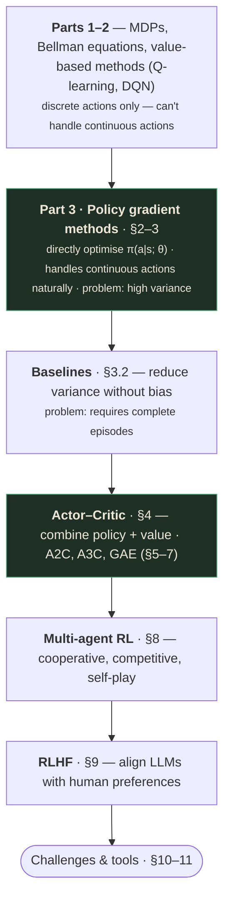
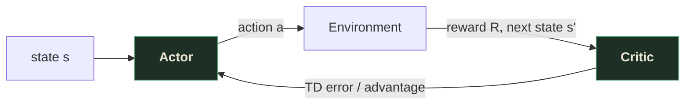
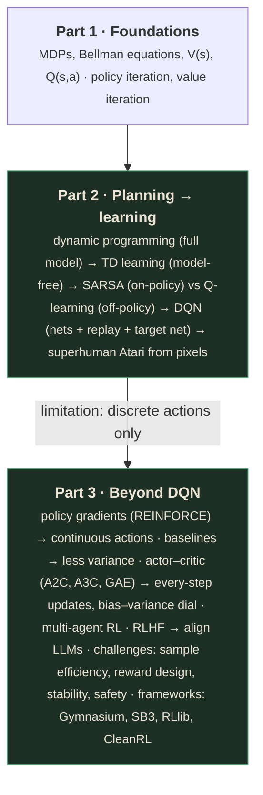

# Reinforcement Learning — Part 3: From Policy Gradients to Human Feedback

> Runtime ~40:00. Originally drafted from `slides_deduped/` (31 slides) with OCR + transcript
> verification, then **audited against the raw 83-frame capture** in
> `output/Lecture_26 - Module 8 Reinforcement Learning Part 3/` per this project's standard
> methodology (see project memory `slides-deduped-is-lossy`) — PPO's own definition (now §7.3) and
> the real DQN-vs-PPO demo numbers (now §12) were found missing and added. Instructor: **Vijay
> Neeluru**, Applied Scientist, Amazon — confirmed from the slide nameplate. This is the final
> lecture in the RL series, covering what DQN can't do (continuous actions), modern actor-critic
> methods, multi-agent RL, RLHF for LLM alignment, and practical challenges.

---

## What you'll understand after reading this

1. **Explain why value-based methods (DQN) fail on continuous action spaces** and why policy
   gradient methods solve this by directly parameterizing the policy.
2. **Derive the policy gradient theorem** (log-likelihood trick) and explain why the gradient
   is proportional to the discounted return times the score function ∇_θ log π_θ(a|s).
3. **Implement the REINFORCE algorithm** and explain its strengths (simplicity, direct
   optimization, compatibility) and weaknesses (high variance, sample inefficiency, complete
   episodes required).
4. **Explain how baselines reduce variance** in policy gradients without introducing bias, and
   name common baselines (average reward, state value V(s)).
5. **Describe the actor-critic architecture** — actor (policy network) + critic (value network)
   — and explain why combining them gives lower variance + flexible policy.
6. **Implement A2C** (Advantage Actor-Critic) using the advantage function A(s,a) = Q(s,a) − V(s)
   ≈ R + γV(s') − V(s), and write the actor and critic loss functions.
7. **Explain A3C** (Asynchronous Advantage Actor-Critic) and why asynchronous updates decorrelate
   experience like a replay buffer.
8. **Derive GAE** (Generalized Advantage Estimation) and explain how the λ parameter trades off
   bias vs. variance between 1-step TD (λ=0) and Monte Carlo (λ=1).
8a. **Explain PPO's clipped objective** — why it caps how far a single update can move the policy,
    and why that makes it the practical default for both RL control and RLHF fine-tuning.
9. **Distinguish cooperative, competitive, and self-play multi-agent settings** and name the
   CTDE paradigm (QMIX, MAPPO) for cooperative tasks.
10. **Explain self-play's auto-curriculum** and why it leads to superhuman performance
    (AlphaGo/AlphaZero).
11. **Describe the RLHF five-stage pipeline** (pretrain → SFT → collect preferences → train
    reward model → PPO fine-tuning) and the Bradley-Terry model for preference learning.
12. **Name three alternatives to RLHF** (DPO, RLAIF, Constitutional AI) and explain what each
    changes.
13. **Catalog the nine core challenges of RL** (sample efficiency, reward shaping, sparse rewards,
    stability, exploration, credit assignment, sim-to-real transfer, safety, reproducibility) and
    name a mitigation for each.

---

## Before we start: what you need to know

### Prerequisite 1 — Parts 1–2 vocabulary

This lecture assumes familiarity with MDPs, Bellman equations, Q-learning, DQN, and the
on/off-policy distinction from Parts 1–2. If Q(s,a), TD error, or experience replay are
unfamiliar, read Parts 1–2 first.

### Prerequisite 2 — Neural network basics

Actor-critic methods use neural networks for both the policy (actor) and value function (critic).
You need to understand: forward pass, backpropagation, loss functions, and gradient descent.

### Prerequisite 3 — The limitation this lecture solves

DQN (Part 2 §10) uses argmax over a finite set of Q-values to select actions. This requires
**discrete actions.** For continuous actions (robot joint angles, steering wheel, investment
allocation), you can't enumerate all options — this is the gap Part 3 fills.

---

## The big picture

Parts 1–2 covered value-based methods (Q-learning, DQN) which work brilliantly for discrete
actions. This lecture fills the gaps they leave:



Two threads:
1. **Every algorithm is still the same core idea** — update toward reward + discounted future
   value — but the *mechanism* changes (table → neural net → policy gradient → actor-critic).
2. **The bias-variance tradeoff is everywhere** — Monte Carlo has zero bias but high variance;
   TD has low variance but bias; GAE lets you dial between them.

---

## 1. Why Policy Gradients?

### 1.1 Value-based methods' limitations

DQN operates by learning Q(s,a) and deriving the policy implicitly: π(s) = argmax_a Q(s,a).

| Limitation | Why it's a problem | Example |
|-----------|-------------------|---------|
| **Only discrete actions** | argmax over continuous space is intractable | Robot arm: precise torque is continuous |
| **Deterministic policies** | Can't learn stochastic policies directly | Need exploration via randomness |
| **Discretization loses precision** | Converting continuous to discrete loses information | Torque quantization introduces error |

### 1.2 The policy gradient alternative

Instead of learning values first, **directly learn the policy** π(a|s; θ) that maps states to
action probabilities:

$$\pi(a_1|s; \theta), \quad \pi(a_2|s; \theta), \quad \ldots$$

Or for continuous actions: output distribution parameters (μ, σ) of a Gaussian.

**Objective:** maximize the expected cumulative reward:

$$J(\theta) = \mathbb{E}_{\tau \sim \pi_\theta}\left[\sum_{t=0}^{T} \gamma^t R_t\right]$$

**Why it's better for continuous actions:** the policy network directly outputs action
distribution parameters — no argmax needed. The gradient ∇_θ J(θ) tells us how to adjust θ
to increase expected reward.

---

## 2. The Policy Gradient Theorem

### 2.1 The derivation (log-likelihood trick)

The challenge: differentiating J(θ) requires differentiating through the unknown environment
transition dynamics. The **policy gradient theorem** proves you don't need to:

$$\nabla_\theta J(\theta) = \mathbb{E}_{\tau \sim \pi_\theta}\left[\sum_{t=0}^{T} \nabla_\theta \log \pi_\theta(a_t|s_t) \cdot G_t\right]$$

**Words before symbols:** the gradient of expected return equals the expected value, over entire
trajectories, of a sum — for every time step, the direction that makes the action actually taken
more likely, scaled by how good the rest of the episode turned out to be.

| Symbol | Read it as | What it means |
|---|---|---|
| $\theta$ | "the policy's parameters" | Weights of the neural network defining $\pi_\theta$ |
| $\tau$ | "a trajectory" | One full episode: $(s_0,a_0,r_0,s_1,a_1,r_1,\ldots,s_T)$ |
| $\pi_\theta(a_t\vert s_t)$ | "the policy" | Probability the current policy assigns to the action actually taken at step $t$ |
| $\nabla_\theta \log \pi_\theta(a_t\vert s_t)$ | "the score function" | The direction in parameter space that increases the probability of that action |
| $G_t$ | "the return from $t$" | $\sum_{k=t}^{T} \gamma^{k-t} R_k$ — the discounted return earned from step $t$ onward |

where G_t = Σ_{k=t}^T γ^{k-t} R_k is the discounted return from time t.

**Derivation steps (from the slide):**

1. Define J(θ) = ∫ P(τ|θ) R(τ) dτ (integral over all trajectories, weighted by their probability
   under θ).
2. Take gradient: ∇_θ J(θ) = ∫ ∇_θ P(τ|θ) R(τ) dτ.
3. Use the identity ∇_θ P(τ|θ) = P(τ|θ) ∇_θ log P(τ|θ) (the **log-likelihood trick**).
4. Substitute: ∇_θ J(θ) = ∫ P(τ|θ) ∇_θ log P(τ|θ) R(τ) dτ = E_τ[∇_θ log P(τ|θ) · R(τ)].
5. Expand P(τ|θ) = p(s₀) Π_t π_θ(a_t|s_t) P(s_{t+1}|s_t, a_t).
6. Take log: log P(τ|θ) = log p(s₀) + Σ_t [log π_θ(a_t|s_t) + log P(s_{t+1}|s_t, a_t)].
7. Take gradient: the first and third terms vanish (don't depend on θ), leaving only
   Σ_t ∇_θ log π_θ(a_t|s_t).
8. Substitute back: ∇_θ J(θ) = E_τ[Σ_t ∇_θ log π_θ(a_t|s_t) · R(τ)].

**Intuition:** "if an action led to a good return G_t, increase its probability; if bad,
decrease it." The gradient ∇_θ log π_θ(a|s) points in the direction that makes action a more
probable in state s. Scaling by G_t amplifies good actions and suppresses bad ones.

### 2.2 The REINFORCE algorithm

**Monte Carlo policy gradient** — use sampled returns instead of the true expectation:

```
Initialize policy π(a|s; θ) with random θ
For each episode:
  1. Run π to generate complete episode: (s₀,a₀,R₀), (s₁,a₁,R₁), ..., (s_T,a_T,R_T)
  2. For each time step t = 0 to T-1:
     a. Compute return G_t = Σ_{k=t}^{T-1} γ^{k-t} R_k
     b. Compute update direction: ∇_θ log π_θ(a_t|s_t) · G_t
  3. Update: θ ← θ + α · Σ_t ∇_θ log π_θ(a_t|s_t) · G_t
```

**If G_t is large positive:** the update pushes θ to make action a_t more likely.
**If G_t is large negative:** the update pushes θ to make action a_t less likely.

### 2.3 REINFORCE strengths and weaknesses

| Strength | Weakness |
|----------|----------|
| **Simplicity** — straightforward update rule | **High variance** — Monte Carlo returns from single trajectories are noisy |
| **Direct optimization** — optimizes policy directly, not via Q-values | **Sample inefficiency** — requires many episodes to converge |
| **Compatibility** — works with discrete AND continuous actions, learns stochastic policies | **Complete episodes required** — updates only after episode finishes (problematic for long/non-terminating tasks) |

---

## 3. Reducing Variance: Baselines

### 3.1 The problem

REINFORCE's Monte Carlo returns have high variance — different episodes from the same policy
can produce wildly different G_t values, making gradient estimates noisy.

### 3.2 The solution: subtract a baseline

**Words before symbols:** the gradient is the same expectation as before, except every return is
first re-centered by subtracting a state-dependent baseline before it scales the score function.

$$\nabla_\theta J(\theta) = \mathbb{E}\left[\sum_t \nabla_\theta \log \pi_\theta(a_t|s_t) \cdot (G_t - b(s_t))\right]$$

| Symbol | Read it as | What it means |
|---|---|---|
| $\nabla_\theta \log \pi_\theta(a_t\vert s_t)$ | "the score function" | Same as §2.1 — the direction in parameter space that makes action $a_t$ more probable |
| $G_t$ | "the return from $t$" | Same discounted return as §2.1: $\sum_{k=t}^{T}\gamma^{k-t}R_k$ |
| $b(s_t)$ | "the baseline" | Any function of the state *alone* (never the action) subtracted to reduce variance; commonly $V(s_t)$ |
| $G_t - b(s_t)$ | "the centered return" | How much better the actual return was than the baseline expected — this, not raw $G_t$, is what scales the update |

**Key insight:** subtracting a baseline b(s_t) that doesn't depend on the action a_t **reduces
variance without introducing bias.**

**Derivation — why the baseline term's expectation is exactly zero:** for a fixed state $s_t$,
since $b(s_t)$ doesn't depend on the action, it can be pulled out of the sum over actions:

$$\mathbb{E}_{a_t \sim \pi_\theta}\big[\nabla_\theta \log \pi_\theta(a_t|s_t)\cdot b(s_t)\big]
= b(s_t) \sum_{a_t} \pi_\theta(a_t|s_t) \nabla_\theta \log \pi_\theta(a_t|s_t)$$

Using $\nabla_\theta \log \pi_\theta(a|s) = \nabla_\theta \pi_\theta(a|s) / \pi_\theta(a|s)$, the
$\pi_\theta(a_t|s_t)$ factors cancel:

$$= b(s_t) \sum_{a_t} \nabla_\theta \pi_\theta(a_t|s_t) = b(s_t)\, \nabla_\theta \sum_{a_t} \pi_\theta(a_t|s_t) = b(s_t) \, \nabla_\theta (1) = 0$$

(the last step uses $\sum_{a_t}\pi_\theta(a_t|s_t)=1$ for every $\theta$, since $\pi_\theta(\cdot|s_t)$
is always a valid probability distribution — so its gradient with respect to $\theta$ is exactly
zero). Subtracting *any* state-dependent $b(s_t)$ therefore adds zero to the gradient's
**expectation** while changing the **variance** of individual samples — which is exactly what a
baseline is for.

**Common baselines:**
- **Constant baseline:** average reward (simple but doesn't adapt to state value).
- **State-value baseline:** b(s_t) = V(s_t) — the most common. The advantage G_t − V(s_t)
  measures "how much better was this action compared to average?"

> 💡 **Key insight — baselines center the reward signal.** Without a baseline, every update is
> relative to zero. With baseline V(s), updates become relative to "what was expected in this
> state." Actions that are merely average get zero gradient; only truly good or bad actions
> generate learning signals.

---

## 4. Actor-Critic Methods

### 4.1 The core idea

Actor-critic solves REINFORCE's biggest flaw (waiting for full episodes) by combining:
- **Actor** (policy network π(a|s; θ)): decides **what to do** — learns the policy.
- **Critic** (value network V(s; φ)): evaluates **how good it is** — learns the value function.

### 4.2 Why both?

| | Actor alone | Critic alone | Together |
|---|---|---|---|
| Variance | High (pure policy gradient) | — | **Low** (bootstrapping) |
| Continuous actions | ✓ | ✗ | **✓** |
| Updates | End of episode | Every step | **Every step** |
| Sample efficiency | Low | — | **High** |

### 4.3 The loop



**Key advantages over REINFORCE:**
1. **Updates every step** — no waiting for episode end.
2. **Lower variance** — bootstrapping replaces long-term path randomness with smooth critic
   estimates.
3. **Stable training** — combines policy optimization flexibility with value function stability.

---

## 5. A2C — Advantage Actor-Critic

### 5.1 The advantage function

**Words before symbols:** the advantage of an action is simply how much better it did than the
state's own average action-value.

$$A(s_t, a_t) = Q(s_t, a_t) - V(s_t)$$

"How much better was this specific action compared to the average action in this state?"

**Practical approximation** (avoids needing two value functions):

$$A(s_t, a_t) \approx R_t + \gamma V(s_{t+1}) - V(s_t) = \delta_t$$

| Symbol | Read it as | What it means |
|---|---|---|
| $A(s_t,a_t)$ | "the advantage" | How much better action $a_t$ was than the state's average action |
| $Q(s_t,a_t)$ | "action-value" | Expected return from taking $a_t$ in $s_t$ then following the policy |
| $V(s_t)$ | "state-value / baseline" | Expected return from $s_t$, averaged over the policy's own actions (§3's $b(s_t)$) |
| $R_t$ | "immediate reward" | Reward received at step $t$ |
| $\delta_t$ | "TD error" | The one-step bootstrapped stand-in for the advantage — reuses only the critic, no separate $Q$ network needed |

The TD error δ_t IS the advantage estimate.

### 5.2 The updates

**Words before symbols:** the critic is trained like ordinary supervised regression — minimize the
squared gap between its prediction and its own one-step-ahead target — while the actor takes an
ordinary policy-gradient step, just scaled by the advantage instead of the raw return.

**Critic update** (minimize MSE between predicted value and TD target):

$$L_{\text{critic}}(\phi) = \frac{1}{T}\sum_t \big(G_t - V(s_t; \phi)\big)^2$$

where G_t = R_t + γV(s_{t+1}; φ) is the TD target.

**Actor update** (scale policy gradient by advantage):

$$\theta \leftarrow \theta + \alpha \sum_t \nabla_\theta \log \pi_\theta(a_t|s_t) \cdot A_t$$

| Symbol | Read it as | What it means |
|---|---|---|
| $\phi$ | "critic's parameters" | Weights of the value network $V(s;\phi)$ |
| $G_t$ | "TD target" (reused notation) | $R_t + \gamma V(s_{t+1};\phi)$ — here it's the critic's own regression target, not §2's Monte Carlo return |
| $L_{\text{critic}}$ | "critic loss" | Mean squared error between the critic's prediction and its bootstrapped target |
| $\theta$ | "actor's parameters" | Weights of the policy network $\pi_\theta$ |
| $\alpha$ | "learning rate" | Step size for the actor's gradient-ascent update |
| $A_t$ | "advantage at step $t$" | From §5.1 — scales the policy-gradient step by how good the action actually was |

**Shared architecture:** initial layers shared between actor and critic, with separate output
heads.

---

## 6. A3C — Asynchronous Advantage Actor-Critic

### 6.1 Key innovation

Multiple parallel workers, each exploring simultaneously.

**Architecture:**
- **Global network:** central parameters for actor and critic.
- **Worker threads:** each with a local copy of the global network.

### 6.2 The workflow

1. Workers interact independently with their own environment copies.
2. Each worker computes gradients from its collected experience.
3. Workers send gradients to update the global network **asynchronously** (don't wait for others).
4. Workers sync local parameters to the updated global network and continue.

### 6.3 Why async works

- **Decorrelated experience** — each worker uses a slightly different policy version, creating
  diversity similar to experience replay.
- **Faster wall-clock training** on multi-core CPUs.
- **Natural exploration** through diverse worker experiences.

> ⚠️ **A3C is largely superseded by A2C + GPU parallelism.** A2C batches experiences from
> parallel actors for a single larger update, leveraging GPU parallelism more effectively than
> A3C's asynchronous updates.

---

## 7. GAE — Generalized Advantage Estimation

### 7.1 The bias-variance tradeoff

| Method | Bias | Variance |
|--------|------|----------|
| 1-step TD (A2C) | High | Low |
| Monte Carlo (REINFORCE) | Zero | High |

GAE bridges this with a single parameter λ:

$$\hat{A}_t^{\text{GAE}(\gamma,\lambda)} = \sum_{l=0}^{\infty} (\gamma\lambda)^l \delta_{t+l}$$

**Words before symbols:** the advantage at time $t$ is an exponentially-weighted sum of every TD
error from $t$ onward, with the weight shrinking by a factor of $\gamma\lambda$ at each further
step — near-term surprises count almost fully, distant ones fade out.

| Symbol | Read it as | What it means |
|---|---|---|
| $\hat{A}_t^{\text{GAE}(\gamma,\lambda)}$ | "the GAE advantage estimate" | How much better state-action pair at $t$ did than expected, blending many horizons |
| $\delta_{t+l}$ | "the TD error $l$ steps ahead" | $R_{t+l} + \gamma V(s_{t+l+1}) - V(s_{t+l})$ |
| $\gamma$ | "discount factor" | Same discount factor as everywhere else in this module |
| $\lambda$ | "the GAE trace parameter" | Dials how much weight distant TD errors keep; $\lambda=0$ keeps only the first term |

where δ_t = R_t + γV(s_{t+1}) − V(s_t) is the TD error.

### 7.2 How λ controls the tradeoff

| λ | Effect | Equivalent to |
|---|--------|--------------|
| 0 | Only 1-step TD | A2C (low variance, high bias) |
| 1 | Full Monte Carlo | REINFORCE (high variance, zero bias) |
| 0.95–0.99 | **Sweet spot** | Balanced bias-variance |

> 💡 **Key insight — λ is a dial, not a switch.** You can smoothly interpolate between the
> two extremes. λ = 0.95 is typical — you get most of Monte Carlo's low bias while keeping most
> of TD's low variance.

### 7.3 PPO — Proximal Policy Optimization

PPO is used throughout the rest of this lecture (the hands-on demo in §12, the RLHF fine-tuning
step in §9.5) but deserves its own definition first, since everything after this point assumes it.

> **PPO (Proximal Policy Optimization)** — an on-policy, actor-critic algorithm that updates the
> policy using ordinary policy-gradient/advantage machinery (§2–§5, GAE from §7.1–7.2 for the
> advantage estimate), but **clips** how far a single update is allowed to move the policy, so one
> bad batch of data can't destabilize training.

**The problem PPO solves:** a plain policy-gradient step (§2.2's REINFORCE, or A2C's actor update
in §5.2) can occasionally take a *too-large* step — a batch of unusually good or bad returns pushes
$\theta$ far enough that the policy changes dramatically in one update, sometimes catastrophically.
Trust-region methods fix this by explicitly constraining how much the policy is allowed to change
per update; PPO is the practical, easy-to-implement approximation of that idea.

**The clipped objective, in words first:** measure how much the *new* policy's probability of the
action taken differs from the *old* policy's probability of that same action — call this ratio
$r(\theta)$. If the advantage was positive (the action was good), increasing $r(\theta)$ increases
the objective — but PPO **clips** this benefit once $r(\theta)$ moves too far from 1, so the update
can't over-reward a single lucky batch. Symmetrically for negative advantages.

$$r(\theta) = \frac{\pi_\theta(a\mid s)}{\pi_{\theta_{\text{old}}}(a\mid s)} \qquad L^{\text{CLIP}}(\theta) = \mathbb{E}\Big[\min\big(r(\theta)\,\hat A,\ \text{clip}(r(\theta),\,1-\epsilon,\,1+\epsilon)\,\hat A\big)\Big]$$

| Symbol | Read it as | What it means |
|---|---|---|
| $r(\theta)$ | "probability ratio" | How much more (or less) likely the new policy is to take the same action, vs. the old policy |
| $\hat A$ | "advantage estimate" | From GAE (§7.1), positive if the action beat expectations |
| $\epsilon$ | "clip range" | Typically 0.1–0.2; how far $r(\theta)$ is allowed to move from 1 before the benefit is capped |
| $\min(\cdot,\cdot)$ | "take the more conservative estimate" | Prevents the objective from rewarding an update that moved $r(\theta)$ *outside* the clip range, in either direction |

**Why this makes training stable without a hard trust-region constraint:** the $\min$ with the
clipped term means that once $r(\theta)$ exceeds $1+\epsilon$ (for a positive-advantage action), the
objective's gradient with respect to $\theta$ in that direction goes to zero — there's no more
incentive to push the policy further in that update. This achieves, cheaply and without a second-order
constrained optimization step, roughly the same effect a full trust-region method achieves with much
more machinery.

> 💡 **Key insight — PPO is a safety rail on top of everything already covered, not a new learning
> signal.** It still uses the actor-critic architecture (§4), the advantage function (§5.1), and GAE
> (§7.1–7.2) exactly as described — the only change is capping how much a single batch of data is
> allowed to move $\theta$. This is why PPO shows up as *the* practical default across so much of
> modern RL (§12's hands-on demo, §9.5's RLHF fine-tuning step) — it's the same machinery, made safe
> to run unattended on noisy, real-world reward signals.

---

## 8. Multi-Agent RL

### 8.1 The challenge: non-stationarity

When multiple agents learn simultaneously, each agent's environment includes the other agents'
policies — which are changing. This breaks single-agent RL's assumption of a stationary
environment.

### 8.2 Three paradigms

| Setting | Goal | Example |
|---------|------|---------|
| **Cooperative** | Maximize common reward | Warehouse robots collaborating on package delivery |
| **Competitive** | Maximize own reward by minimizing opponent's | Chess, poker, self-driving competition |
| **Self-Play** | Agent plays against copies of itself | AlphaGo, AlphaZero |

### 8.3 Cooperative: CTDE (Centralized Training, Decentralized Execution)

**During training:** give access to everything (all observations, all actions, global state).
This makes credit assignment easier.

**During execution:** each agent acts independently using only its own observations.

**Algorithms:** QMIX, MAPPO.

### 8.4 Self-play: the auto-curriculum

The agent plays against its current best policy. As it improves, its opponent automatically
improves too. The difficulty scales perfectly with the agent's skill level — never too easy, never
too hard.

**The virtuous cycle:** self-play → policy improvement → harder opponent → more improvement → ...
→ superhuman.

> This is exactly how AlphaGo Zero achieved 100-0 against AlphaGo after 3 days of self-play
> with no human data.

---

## 9. RL with Human Feedback (RLHF)

### 9.1 The problem: aligning LLMs

Language models trained on raw internet can generate fluent text but may produce harmful,
unhelpful, or misaligned outputs. The problem: it's hard to specify a reward function for human
concepts like "politeness" or "helpfulness."

### 9.2 The solution: learn reward from preferences

Humans can easily compare two outputs and say which is better, even without writing an explicit
formula. RLHF learns a reward model from these comparisons, then optimizes the policy against
the learned reward.

### 9.3 The five-stage pipeline

```
1. Pretrain: LM on large text corpus
        ↓
2. SFT (Supervised Fine-Tuning): Fine-tune on curated demonstrations
        ↓
3. Collect Preferences: Generate response pairs from SFT, humans label A > B
        ↓
4. Train Reward Model: Learn R(prompt, response) from preference data
        ↓
5. RL Fine-Tuning: Optimize LLM with PPO using learned reward + KL penalty
```

### 9.4 The reward model

**Bradley-Terry model:**

$$P(A \succ B) = \sigma\big(r(A) - r(B)\big)$$

**Words before symbols:** the probability that a human prefers response A over response B is the
sigmoid of the *difference* in their learned reward scores — the bigger the reward gap, the more
confidently A should be preferred.

| Symbol | Read it as | What it means |
|---|---|---|
| $P(A \succ B)$ | "probability A beats B" | Predicted chance a human labels A as the better response |
| $r(A)$, $r(B)$ | "the reward model's scores" | Scalar quality scores the reward model assigns to each response |
| $\sigma(\cdot)$ | "sigmoid" | $\sigma(x) = 1/(1+e^{-x})$; squashes any real number into a valid probability in $(0,1)$ |

where σ is the sigmoid function. The loss maximizes the likelihood of human preferences:

$$L = -\mathbb{E}_{(A,B,y)}\big[y \log \sigma(r(A)-r(B)) + (1-y) \log \sigma(r(B)-r(A))\big]$$

### 9.5 PPO fine-tuning

**Words before symbols:** the reward PPO actually optimizes is the learned reward-model score,
minus a penalty that grows the further the current policy's outputs drift from the supervised
fine-tuned model's.

$$R_{\text{total}} = R_{\text{model}}(\text{response}) - \beta \cdot \text{KL}(\pi_\theta \| \pi_{\text{SFT}})$$

| Symbol | Read it as | What it means |
|---|---|---|
| $R_{\text{total}}$ | "the reward PPO optimizes" | Learned reward minus the drift penalty — what §7.3's PPO objective actually maximizes here |
| $R_{\text{model}}(\text{response})$ | "reward model score" | Output of the Bradley-Terry-trained reward model (§9.4) on the generated response |
| $\beta$ | "KL coefficient" | Controls how strongly the policy is anchored to $\pi_{\text{SFT}}$; higher $\beta$ = more conservative |
| $\text{KL}(\pi_\theta\|\pi_{\text{SFT}})$ | "KL divergence" | How far the current policy's output distribution has drifted from the supervised fine-tuned model's |

The KL penalty prevents the model from diverging too far from the pre-trained behavior — acts
as a "rubber band" connecting back to the supervised fine-tuning policy.

### 9.6 Beyond RLHF

| Method | What it changes |
|--------|----------------|
| **DPO (Direct Preference Optimization)** | Skips the reward model entirely; directly optimizes policy from preferences |
| **RLAIF** | Uses AI feedback instead of human feedback |
| **Constitutional AI** | Self-critique and revision against a set of principles |

> 👉 *See also:* [GenAI & LLM Part 2](../GenAI%20%26%20LLM/genai-llm-02.md) covers this entire
> pipeline in far more depth from the LLM-alignment side — the same Bradley-Terry reward model and
> KL-penalized PPO objective above, plus a full derivation of DPO's closed-form reward
> reparameterization and a worked GRPO example (the algorithm behind DeepSeek-R1).

---

## 10. Challenges in RL

| Challenge | Problem | Mitigations |
|-----------|---------|-------------|
| **Sample efficiency** | Millions of interactions needed | Model-based RL, offline RL, transfer learning |
| **Reward shaping** | Designing good reward functions is hard | Inverse RL, RLHF, reward decomposition |
| **Sparse rewards** | Agent rarely gets feedback | Curiosity-driven exploration, hindsight experience replay |
| **Stability** | Training oscillates or diverges | Target networks, gradient clipping, PPO clipping |
| **Exploration vs. exploitation** | Balancing trying new things vs. using known strategies | (Covered in Part 2 §4) |
| **Credit assignment** | Which action in a long sequence caused the reward? | Temporal difference methods, attention mechanisms |
| **Sim-to-real transfer** | Policies trained in simulation fail in real world | Domain randomization, system identification |
| **Safety & constraints** | How to explore safely (self-driving car can't run a red light) | Constrained MDPs, safe RL, conservative policy optimization |
| **Reproducibility** | High variance across random seeds, sensitive to hyperparameters | Multiple seeds, hyperparameter sweeps, reporting variance |

> 👉 *See also:* [Causal Inference Part 3, §12.3](../Causal%20Inference/causal-inference-03.md)
> frames credit assignment as a specifically *counterfactual* question — "what would the reward
> have been had a different action been taken at that step?" — the same off-policy-evaluation
> machinery from §8's on/off-policy distinction, viewed from the causal-inference side.

---

## 11. RL Frameworks & Tools

| Framework | Best for | Key feature |
|-----------|---------|-------------|
| **Gymnasium** (OpenAI Gym) | Single-agent environments | The standard API |
| **PettingZoo** | Multi-agent environments | Clean interfaces for cooperative/competitive tasks |
| **Stable-Baselines3** | Quick prototyping (PyTorch) | Production-ready, reliable implementations |
| **RLlib (Ray)** | Scalable distributed RL | Multi-agent support, multi-GPU training |
| **CleanRL** | Education & research | Single-file implementations, great for learning |

**Choosing the right tool:**
- Learning/research → CleanRL
- Production scale → RLlib
- LLM fine-tuning → TRL + transformers + PEFT
- Environments → Gymnasium (single-agent), PettingZoo (multi-agent), MuJoCo (continuous control)

---

## 12. Hands-on Demo Summary

**Environment:** CartPole. **Library:** Stable-Baselines3.

🧪 **The actual head-to-head result** [slide 73, "Demo Code — Evaluation & Visualization"]:

| Algorithm | Type | Key hyperparameters | Result |
|-----------|------|---|---|
| **DQN** | Off-policy, value-based | `learning_rate=1e-3`, `buffer_size=50000`, `exploration_fraction=0.2` (20% of training spent exploring) | **~9.2 avg reward** — failed to learn in 20k steps |
| **PPO** | On-policy, policy gradient (§7.3) | `learning_rate=3e-4`, `gae_lambda=0.95`, `clip_range=0.2` | **500.0 avg reward** — perfect score, after ~9k steps |

> ⚠️ **A previous version of this table read "−9.2 avg reward" and "~8k steps."** The source slide
> reads **"~9.2 avg reward"** (an *approximately-equal* sign misread as a minus sign — CartPole's
> reward is +1 per step the pole stays up, so a negative average reward isn't possible in this
> environment at all, which is a strong sanity check that "−9.2" was wrong) and **"~9k steps"** for
> PPO's convergence point. The "roughly 40%" figure below is corrected to **~45%** accordingly
> ($9\text{k}/20\text{k}=0.45$).

Slide 80's pole-angle-over-time chart shows DQN's line (dashed, "DQN (9 steps)") rising **smoothly
and monotonically** from near 0° past the ±12° failure threshold over its 9 recorded steps — a
predictable, rapid climb straight to failure, not noise or instability. PPO's line (solid, "PPO
(500 steps)") stays flat and near zero for the full 500-step run. PPO reaches the environment's
maximum possible score in roughly **45%** of the training steps DQN was given, and DQN still hadn't
learned a working policy by the end.

> 💡 **Why this specific matchup, on this specific environment, favors PPO so sharply.** CartPole's
> action space is technically discrete (`push_left`/`push_right`), so DQN *can* run on it — but this
> result isn't really about discrete-vs-continuous (§1's usual DQN-vs-policy-gradient framing). It's
> that PPO's clipped, stable updates (§7.3) converge reliably within a small hyperparameter budget,
> while this particular DQN configuration's exploration schedule (`exploration_fraction=0.2`) simply
> didn't give it enough time to find the rewarding region of policy space in 20k steps. A longer DQN
> run or different exploration schedule would likely do better — the takeaway is about training
> stability and sample efficiency in practice, not a fundamental limitation of value-based methods.

**Code pattern:**
```python
from stable_baselines3 import DQN, PPO
model = PPO("MlpPolicy", "CartPole-v1", verbose=1)
model.learn(total_timesteps=100_000)
```

---

## 13. Putting it together



**Five key takeaways:**
1. Policy gradients unlock what value-based methods cannot — continuous actions and stochastic
   policies.
2. Actor-critic is the backbone of modern RL — combines policy flexibility with value stability.
3. Multi-agent RL extends RL to real-world complexity — cooperative (CTDE), competitive, self-play.
4. RLHF is how modern LLMs are aligned — learn reward from human preferences, optimize with PPO.
5. RL has significant practical challenges — but frameworks and tools make them tractable.

---

## Interview prep — Amazon Applied Scientist

### Core questions

<details><summary><b>1. Why can't DQN handle continuous actions, and how do policy gradients solve this?</b></summary>

DQN selects actions by taking argmax over Q-values: π(s) = argmax_a Q(s,a). With discrete
actions, this is just a lookup. With continuous actions (e.g., robot joint torque), argmax
becomes an intractable optimization problem — you'd need to search over an infinite set.
Policy gradients sidestep this entirely: the policy π(a|s; θ) directly outputs action
distribution parameters (e.g., mean and variance of a Gaussian), and the gradient ∇_θ J(θ)
tells us how to adjust θ to increase expected reward — no argmax needed.
</details>

<details><summary><b>2. Derive the policy gradient theorem. Why is the log-likelihood trick key?</b></summary>

J(θ) = E_τ[P(τ|θ) · R(τ)]. Taking gradient: ∇_θ J(θ) = E[∇_θ P(τ|θ)/P(τ|θ) · P(τ|θ) · R(τ)]
= E[∇_θ log P(τ|θ) · R(τ)]. The log-likelihood trick ∇_θ P = P · ∇_θ log P converts the
gradient of a probability into a form where we can take the expectation — the key step that
lets us avoid differentiating through the environment dynamics. Expanding log P(τ|θ) shows
only the policy terms π_θ(a_t|s_t) depend on θ; the dynamics P(s'|s,a) vanish.
</details>

<details><summary><b>3. What is REINFORCE's main weakness and how does the actor-critic architecture fix it?</b></summary>

REINFORCE's main weakness is high variance — it uses full Monte Carlo returns G_t from single
episodes, which are extremely noisy. This makes learning unstable and slow. Actor-critic fixes
this by replacing G_t with a critic's bootstrapped estimate. The critic V(s) provides a
low-variance baseline for every step, enabling: (1) every-step updates (no waiting for episode
end), (2) lower variance through bootstrapping, and (3) higher sample efficiency. The tradeoff:
introducing some bias from the critic's imperfect estimates.
</details>

<details><summary><b>4. Explain the advantage function and why A2C uses it instead of raw Q-values.</b></summary>

The advantage A(s,a) = Q(s,a) − V(s) measures "how much better was action a compared to the
average action in state s." Using advantage instead of raw Q-values centers the learning signal:
actions that are merely average get zero gradient. A2C approximates this as A ≈ R + γV(s') − V(s)
(the TD error), which avoids needing two separate networks. The advantage function stabilizes
learning by reducing the variance of gradient estimates — the critic's V(s) acts as a learned
baseline.
</details>

<details><summary><b>5. How does GAE bridge the bias-variance tradeoff, and what λ value is typical?</b></summary>

GAE defines Â_t = Σ_{l=0}^∞ (γλ)^l δ_{t+l}, where δ_t is the TD error. λ controls the
tradeoff: λ=0 gives 1-step TD (low variance, high bias — same as A2C); λ=1 gives full Monte
Carlo (zero bias, high variance — same as REINFORCE). Typical value: λ = 0.95, which gets most
of Monte Carlo's low bias while retaining most of TD's low variance. The exponential weighting
(γλ)^l means distant TD errors contribute less, naturally truncating the variance explosion.
</details>

<details><summary><b>6. What is CTDE and why is it the standard paradigm for cooperative multi-agent RL?</b></summary>

CTDE = Centralized Training, Decentralized Execution. During training, agents have access to
everything (all observations, all actions, global state) — making credit assignment much easier.
During execution, each agent acts independently using only its own local observations. This
breaks the non-stationarity problem (other agents' policies are fixed during training) while
still producing decentralized policies that can be deployed. QMIX and MAPPO are standard CTDE
algorithms.
</details>

<details><summary><b>7. Describe self-play's "auto-curriculum" and why it leads to superhuman performance.</b></summary>

In self-play, the agent plays against copies of its current policy. As the agent improves, its
opponent automatically improves too — the difficulty scales perfectly with the agent's skill
level. This creates a virtuous cycle: self-play → policy improvement → harder opponent → more
improvement → superhuman. AlphaGo Zero used this to achieve 100-0 against AlphaGo after 3 days
of self-play with zero human data. The key insight: the agent generates its own training data,
and the opponent is always at exactly the right difficulty level — never too easy (no learning)
or too hard (no signal).
</details>

<details><summary><b>8. Explain the RLHF pipeline and why the KL penalty is necessary.</b></summary>

RLHF has 5 stages: pretrain → SFT → collect human preferences → train reward model (Bradley-Terry)
→ PPO fine-tune. The KL penalty β · KL(π_θ ‖ π_SFT) prevents the policy from diverging too far
from the supervised fine-tuned model. Without it, the agent might find reward model exploits —
outputs that score high on the learned reward but are nonsensical to humans. The KL penalty acts
as a "rubber band" keeping the model anchored to reasonable outputs. β controls the strength:
higher β = more conservative (closer to SFT), lower β = more aggressive optimization.
</details>

<details><summary><b>9. Name three alternatives to RLHF and explain what each changes.</b></summary>

(1) DPO (Direct Preference Optimization): skips the reward model entirely — directly optimizes
the policy from preference pairs, reducing the pipeline from 5 stages to 3. (2) RLAIF: uses AI
feedback instead of human feedback — reduces annotation cost by having a strong AI model generate
preferences instead of humans. (3) Constitutional AI: the model self-critiques and revises its
outputs against a set of written principles — reduces the need for human labelers while
maintaining alignment with explicit values.
</details>

<details><summary><b>10. [Combines concepts] A self-driving car needs to learn a policy. Which RL approach would you use and why? What challenges are most critical?</b></summary>

I'd use PPO (actor-critic with clipped objective) because: (1) the action space is continuous
(steering angle, acceleration), ruling out DQN. (2) PPO is stable — critical for safety. (3)
The advantage function with GAE provides good bias-variance balance. Most critical challenges:
safety (can't explore by running red lights → constrained MDPs), sim-to-real transfer (train in
simulation, deploy on real roads → domain randomization), sparse rewards (most driving is
uneventful → reward shaping), and credit assignment (which action in a 30-minute drive caused
the accident?). RLHF could be used for human preference alignment — "which driving style do
humans find safer/more comfortable?"
</details>

### Depth probes

- *"Why does the log-likelihood trick work? What mathematical property makes ∇_θ P = P · ∇_θ log P
  true?"* — This follows from the chain rule: d/dx log f(x) = f'(x)/f(x), so f'(x) = f(x) ·
  d/dx log f(x). Applying this to P(τ|θ): ∇_θ P(τ|θ) = P(τ|θ) · ∇_θ log P(τ|θ). The trick
  converts the gradient of a probability (which is hard to estimate) into a product of the
  probability times the gradient of its log (which is easy — just the score function).

- *"Why can't on-policy methods like REINFORCE use experience replay?"* — REINFORCE computes
  G_t by running the current policy π_θ to completion. Old experiences were generated by a
  different policy π_{θ_old}, so their returns G_t are computed under the wrong policy — using
  them would bias the gradient estimate. Q-learning is off-policy because its target
  max_a' Q(s',a') doesn't depend on what action was actually taken, making old data always valid.
  REINFORCE's G_t depends on the full trajectory under the current policy, so old data is stale.

- *"The lecture mentions 'conservative policy optimization' for safe RL. How does this relate to
  PPO's clipping mechanism?"* — PPO clips the probability ratio r(θ) = π_θ(a|s)/π_{θ_old}(a|s)
  to [1-ε, 1+ε], preventing the policy from changing too much in a single update. Conservative
  policy optimization extends this idea to safety: only accept a new policy if it's provably not
  worse than the old one (with high probability). Both use the same core idea — constraining the
  policy update magnitude — but PPO optimizes for performance stability while safe RL adds
  explicit safety constraints.

### Whiteboard-ready derivations

1. **The policy gradient theorem** — §2.1: derive from J(θ) = E_τ[P(τ|θ)R(τ)] through the
   log-likelihood trick to ∇_θ J(θ) = E[Σ_t ∇_θ log π_θ(a_t|s_t) · G_t].

2. **The advantage function approximation** — §5.1: show A(s,a) = Q(s,a) − V(s) ≈ R + γV(s')
   − V(s), explaining why this avoids needing two networks and how it centers the learning signal.

3. **GAE formula** — §7.1: derive Â_t = Σ_{l=0}^∞ (γλ)^l δ_{t+l} from the k-step advantage
   estimator, showing how it exponentially weights distant TD errors.

### Applied scenario — Amazon robotic warehouse

**Framing:** Amazon wants to train robots to pick and place items in a warehouse — a continuous
control problem with multi-agent coordination.

**Why policy gradients:** the action space is continuous (robot joint angles, gripper force), so
DQN is out. PPO handles this naturally by outputting action distribution parameters.

**Why actor-critic:** A2C/A3C with GAE provides stable, efficient learning with good
bias-variance balance. Shared network architecture between actor and critic.

**Multi-agent:** CTDE (QMIX/MAPPO) for cooperative coordination — all robots share the team
reward (packages delivered per hour), with centralized training and decentralized execution.

**Challenges:**
- **Sim-to-real transfer:** train in MuJoCo simulation, deploy on physical robots → domain
  randomization (randomize friction, lighting, object positions in sim).
- **Sparse rewards:** robots rarely complete full pick-and-place → reward shaping (incremental
  rewards for approaching, grasping, lifting).
- **Safety:** robots can't collide with each other → constrained MDPs.
- **Credit assignment:** which robot's action caused the team reward? → CTDE with shared critic.

**What you'd ship:** MAPPO with GAE (λ=0.95), trained in simulation with domain randomization,
deployed with safety constraints, evaluated on packages-per-hour and collision rate.

**Leadership Principle tie-in:** **Invent and Simplify** — CTDE simplifies the multi-agent
problem by making training centralized (easy) while keeping execution decentralized (deployable).
**Insist on the Highest Standards** — safe RL ensures robots don't harm humans or damage
inventory during exploration.

---

## Glossary

- **A2C (Advantage Actor-Critic)** — synchronous actor-critic using advantage function for
  stable policy updates.
- **A3C (Asynchronous Advantage Actor-Critic)** — parallel workers with async global updates;
  decorrelates experience like replay.
- **Actor** — the policy network π(a|s; θ) that decides what action to take.
- **Advantage function** — A(s,a) = Q(s,a) − V(s); measures how much better an action is
  compared to average.
- **Baseline** — a function subtracted from returns to reduce variance without introducing bias;
  typically V(s).
- **Bradley-Terry model** — P(A ≻ B) = σ(r(A) − r(B)); used to model pairwise preferences.
- **CTDE (Centralized Training, Decentralized Execution)** — cooperative MARL paradigm with
  full information during training, local info during execution.
- **Constitutional AI** — self-critique and revision against written principles; reduces human
  annotation need.
- **Credit assignment** — determining which action in a sequence caused the observed reward.
- **DPO (Direct Preference Optimization)** — skips reward model; directly optimizes policy from
  preferences.
- **GAE (Generalized Advantage Estimation)** — exponentially weighted sum of TD errors with
  parameter λ controlling bias-variance tradeoff.
- **Log-likelihood trick** — ∇_θ P = P · ∇_θ log P; enables policy gradient derivation without
  differentiating through environment dynamics.
- **Multi-agent RL (MARL)** — multiple agents interacting in a shared environment.
- **PPO (Proximal Policy Optimization)** — clips policy updates to prevent large changes; stable
  and widely used.
- **REINFORCE** — Monte Carlo policy gradient algorithm; updates after complete episodes using
  sampled returns.
- **RLAIF** — RL with AI feedback instead of human feedback.
- **RLHF (RL with Human Feedback)** — aligns models with human preferences via learned reward
  model + PPO.
- **Reward shaping** — designing intermediate rewards to guide learning toward sparse final goals.
- **Score function** — ∇_θ log π_θ(a|s); the direction in parameter space that makes action a
  more probable.
- **Self-play** — agent plays against copies of itself, creating an auto-curriculum.
- **Sim-to-real transfer** — deploying policies trained in simulation to real-world environments.
- **Sparse rewards** — episodes where the agent receives little or no feedback until the end.

---

## Check yourself

1. Why can't DQN handle continuous action spaces? What specific operation fails? *(§1)*
2. State the policy gradient theorem and explain what each term means. *(§2)*
3. What is the log-likelihood trick and why is it necessary for the policy gradient derivation?
   *(§2.1)*
4. List three strengths and three weaknesses of REINFORCE. *(§2.3)*
5. How do baselines reduce variance without introducing bias? What is the most common baseline?
   *(§3)*
6. Describe the actor-critic loop: what does the actor do? What does the critic do? How does
   the critic's feedback update the actor? *(§4)*
7. Write the A2C actor and critic loss functions. What is the advantage function and how is it
   approximated? *(§5)*
8. Why does A3C use asynchronous updates? How does this decorrelate experience? *(§6)*
9. Write the GAE formula and explain how λ=0, λ=1, and λ=0.95 affect the bias-variance
   tradeoff. *(§7)*
9a. Write PPO's clipped objective and explain what happens to the gradient once $r(\theta)$ moves
    outside $[1-\epsilon, 1+\epsilon]$. *(§7.3)*
10. What is CTDE and why is it the standard paradigm for cooperative multi-agent RL? *(§8.3)*
11. Explain self-play's "auto-curriculum" using AlphaGo as an example. *(§8.4)*
12. Describe the five stages of the RLHF pipeline. Why is the KL penalty necessary in stage 5?
    *(§9.3, §9.5)*
13. Name three alternatives to RLHF and explain what each changes. *(§9.6)*
14. For each of the seven core RL challenges, name one mitigation strategy. *(§10)*
15. Which RL framework would you choose for: (a) learning/research, (b) production, (c) LLM
    fine-tuning? *(§11)*

---

## Going deeper

1. **Sutton & Barto (2018), "Reinforcement Learning: An Introduction"** — ⚠️ **named on the
   slides** (Part 1 reference, still relevant). `solid`. Chapters 13–14 cover policy gradients
   and actor-critic.

2. **Schulman et al. (2017), "Proximal Policy Optimization Algorithms" (PPO)** — ⚠️ not named
   on slides but used in the hands-on demo and RLHF pipeline. `hard`. The foundational PPO paper.

3. **Mnih et al. (2016), "Asynchronous Methods for Deep Reinforcement Learning" (A3C)** —
   ⚠️ **named on the slides** [slide 34, "A3C — Asynchronous Advantage Actor-Critic" — corrected
   from a previous citation to slide 11, which numbered against the lossy `slides_deduped/` set and
   in the raw capture is actually the policy-gradient-theorem derivation]. `hard`. The original A3C
   paper.

4. **Ouyang et al. (2022), "Training language models to follow instructions with human
   feedback" (InstructGPT/RLHF)** — ⚠️ not named on slides but directly described in §9. `solid`.
   The foundational RLHF paper.

5. **Rafailov et al. (2023), "Direct Preference Optimization: Your Language Model Is Secretly
   a Reward Model" (DPO)** — ⚠️ **named on the slides** [slide 54, "Beyond RLHF" — corrected from a
   previous citation to slide 19, which in the raw capture is unrelated content]. `solid`. The DPO
   paper.

6. **CleanRL (github.com/vwxyzjn/cleanrl)** — ⚠️ **named on the slides** [slide 66, "Popular RL
   Frameworks" — corrected from a previous citation to slide 23, which in the raw capture is
   unrelated content]. `solid`. Single-file implementations of all algorithms covered here.

> ⚠️ **verify this** — items 1, 3, 5, 6 are explicitly named on the lecture's slides. Items
> 2, 4 are referenced implicitly through the algorithms/pipelines described — treat as suggested
> background reading.
>
> ✅ **Citation check (enhancement pass).** Independently verified against primary sources:
> Schulman et al. (2017), "Proximal Policy Optimization Algorithms," is arXiv:1707.06347 (authors:
> Schulman, Wolski, Dhariwal, Radford, Klimov — confirmed exact); Mnih et al. (2016), "Asynchronous
> Methods for Deep Reinforcement Learning," is ICML 2016, pp. 1928–1937 (arXiv:1602.01783); Ouyang
> et al. (2022), "Training Language Models to Follow Instructions with Human Feedback," is NeurIPS
> 2022 (arXiv:2203.02155); Rafailov et al. (2023), "Direct Preference Optimization," is NeurIPS
> 2023 (arXiv:2305.18290). All titles, author lists, venues, and years confirmed exact — no
> corrections needed to any citation in this file.
