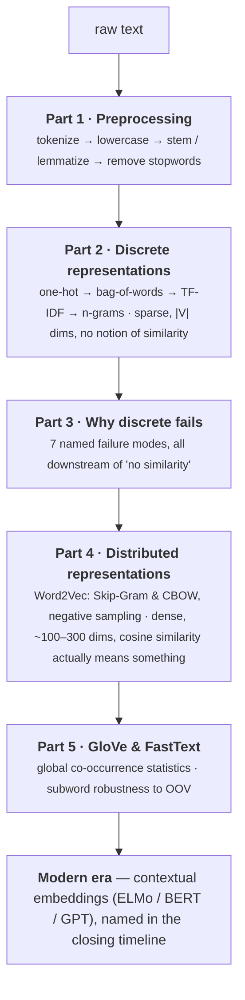
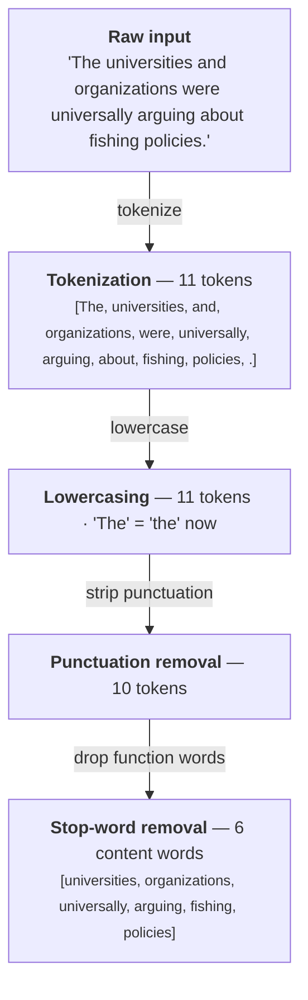
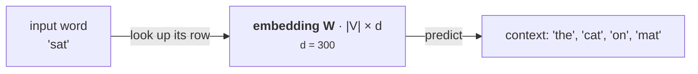
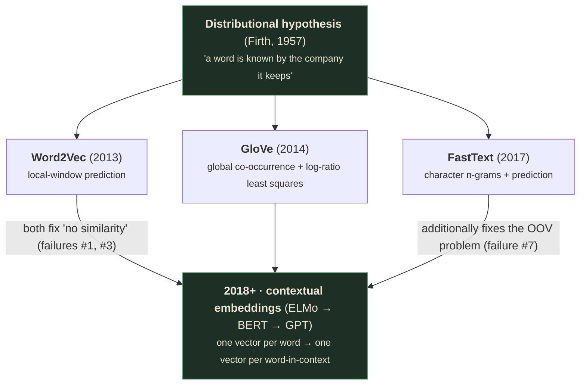

# Sequential Learning — Part 1: Text Representations

> Instructor: **Sayambhu Sen**. Runtime 57:24. Built from the raw capture in `output/Lecture_18 -
> Module 6 Sequential Learning Part 1/` (150 raw frames), not `slides_deduped/` (83 images) — the
> dedup step is known to merge and drop distinct slides (see project memory `slides-deduped-is-lossy`).
> The deck is a clean, self-contained five-part arc — nothing was found truncated or missing.

---

## What you'll understand after reading this

1. **Tokenize text three different ways** (word, subword/BPE, character) and explain exactly which
   problem each one solves and which it creates.
2. **Run Byte-Pair Encoding by hand** on a small corpus and explain why GPT-2 and GPT-4 have
   different vocabulary sizes as a direct consequence of this algorithm.
3. **Build a Bag-of-Words and TF-IDF vector by hand**, and explain in one sentence why TF-IDF
   downweights "the" and upweights "fish."
4. **List all seven reasons discrete text representations fail**, with a concrete example for each,
   and explain why they all trace back to one root cause.
5. **Derive the Skip-Gram and CBOW objectives**, explain why they're mirror images of each other,
   and explain why "faster" doesn't mean "better" when comparing them.
6. **Explain negative sampling from first principles** — why softmax over a 100K-word vocabulary is
   too expensive, and how turning the problem into K+1 binary classifications fixes it.
7. **Derive why GloVe uses co-occurrence ratios instead of raw counts**, and read a ratio table the
   way the lecture does.
8. **Explain how FastText represents a word it has never seen**, using character n-grams, and why
   this makes it the only one of the three algorithms robust to typos.
9. **Choose the right embedding method for a task** — general embeddings, corpus-statistics
   analysis, or noisy/morphologically rich text — and justify the choice.

---

## Before we start: what you need to know

### Prerequisite 1 — What a word embedding actually is

> **Word embedding** — a mapping from a word to a fixed-length vector of real numbers, chosen so
> that words with similar meaning end up at nearby points in that vector space.
>
> *In everyday words:* imagine giving every word in the English language a set of GPS coordinates.
> "Cat" and "dog" would sit close together (both pets, both animals); "cat" and "refrigerator" would
> sit far apart. The lecture spends its entire second half explaining how you'd *learn* those
> coordinates from raw text, with no dictionary and no human labeling.
>
> *Concretely:* a 300-dimensional embedding turns the word "cat" into something like
> `[0.21, -0.55, 0.83, 0.12, -0.41, ..., 0.67]` — 300 numbers, not a name.
>
> *Why it exists:* every machine learning model needs numbers as input, not strings. The entire
> question this lecture answers is: **what numbers, and chosen how?**

### Prerequisite 2 — Cosine similarity

> **Cosine similarity** — a measure of how "aligned" two vectors are, ignoring their length.
> Formally $\cos(\theta) = \dfrac{\mathbf{a}\cdot\mathbf{b}}{\|\mathbf{a}\|\|\mathbf{b}\|}$, ranging
> from $-1$ (opposite directions) through $0$ (perpendicular, i.e. "unrelated") to $1$ (identical
> direction, i.e. "as similar as possible").
>
> *In everyday words:* point two flashlights from the same spot. If they point in the same
> direction, similarity is high, regardless of how bright either one is.
>
> *Concretely:* $\mathbf{a} = [1, 0]$, $\mathbf{b} = [0, 1]$. Dot product $= 1\times0 + 0\times1 = 0$.
> Cosine similarity $= 0$ — perpendicular, i.e. "no relationship." This exact calculation is why
> one-hot vectors are useless for meaning: **any two distinct one-hot vectors have a dot product of
> zero**, no matter which two words they represent.
>
> *Why it exists:* it's the standard way to ask "how similar are these two vectors" without caring
> whether one of them just happens to be a bigger number (e.g. because a document is longer).

### Prerequisite 3 — What a neural network's "hidden layer" does, minimally

You don't need the full theory of deep networks for this lecture (that's Module 2), but Word2Vec is
described as "a simple neural network," so you need this much: a neural network layer is a matrix
multiplication. If $W$ is a $|V| \times d$ matrix (one row of $d$ numbers per vocabulary word) and
you multiply a one-hot vector for word $w$ by $W$, you get back exactly **row $w$ of $W$** — nothing
more. This trivial fact is the entire mechanism behind "looking up an embedding": the embedding
*is* a row of a matrix, and training the network *is* adjusting those rows until they encode
meaning.

### Prerequisite 4 — Logarithms, briefly

Several formulas here use $\log$. All you need: $\log$ turns very large or very small numbers into
a manageable, roughly linear scale, and $\log(1) = 0$. So $\text{idf}(t) = \log(N/n_t)$ is **zero**
exactly when a term appears in *every* document ($n_t = N$) — the formula is built so that
"appears everywhere" mathematically means "contributes nothing."

---

## The big picture

This lecture answers one question, in five acts: **how do you turn a word into numbers a model can
learn from?**

Act 1 (Preprocessing) gets raw text into clean, comparable units — tokens. Acts 2–3 (Discrete
Representations, then their Limitations) show the *obvious* first answer — count things, one-hot
them — and then systematically demolish it: every discrete scheme turns out to lose similarity,
word order, or both. Acts 4–5 (Distributed Representations: Word2Vec, then GloVe & FastText) show
the fix that dominates the field from 2013 onward: **stop hand-designing the vector, and learn it
from data instead**, using the assumption that words appearing in similar contexts must mean
similar things.



Every later lecture in this course that touches text (sequence models, LLMs) assumes you already
have some numeric representation of a word sitting at the input. This lecture is where that
representation comes from.

---

## 1. Tokenization — turning a string into units

> **Tokenization** — segmenting raw text into discrete units, called tokens, that a model will treat
> as its atomic vocabulary.
>
> *In everyday words:* deciding what counts as "one thing." Is "don't" one token or two? Is
> "COVID-19" one token or three? Tokenization is the set of rules that answers these questions
> consistently.
>
> *Why it exists:* every downstream representation in this lecture (one-hot, BoW, TF-IDF, Word2Vec)
> starts from a fixed list of tokens. Get the tokenization wrong and every later step inherits the
> mistake.

The lecture presents three levels [slide 7]:

| Level | Example | What it captures |
|---|---|---|
| **Word-level** | `"The cat sat on the mat."` → `["The", "cat", "sat", "on", "the", "mat", "."]` | Whole words, split on whitespace/punctuation |
| **Subword (BPE)** | `"lowest"` → `["low", "est"]` | Word *pieces* — handles words never seen during training |
| **Character-level** | `"hello"` → `["h", "e", "l", "l", "o"]` | Individual characters |

> 💡 **Key insight — this is a trade-off, not a ranking.** Word-level tokens are the most
> semantically meaningful unit but produce huge vocabularies and can't handle a word the tokenizer
> has never seen (the **out-of-vocabulary**, or **OOV**, problem — this comes back as failure #7 in
> Part 3). Character-level tokens can represent *any* string with a tiny vocabulary (~100 characters)
> but produce very long sequences and lose word-level meaning entirely. **Subword tokenization is the
> engineered middle ground** every modern large language model actually uses.

### Worked example — Byte Pair Encoding (BPE)

> **Byte Pair Encoding (BPE)** — an algorithm that builds a subword vocabulary by starting from
> individual characters and iteratively merging the most frequent adjacent pair into a new token.
>
> *Why it exists:* you want a vocabulary that's word-like for common words (so "the" is one token,
> not four) but can still fall back to smaller pieces for rare or unseen words (so "unhappiness" can
> be built from "un" + "happi" + "ness" even if the whole word never appeared during training).

The algorithm [slide 10]:

1. Initialize vocabulary = all individual characters
2. Count all adjacent token pairs in the corpus
3. Merge the most frequent pair → new token
4. Repeat until desired vocabulary size is reached

🧪 **Worked example** — corpus `"low lower lowest"`, starting from characters:

```
Start:  l  o  w  ␣  l  o  w  e  r  ␣  l  o  w  e  s  t
```

- Round 1: the pair `("l", "o")` is the most frequent adjacent pair (appears 3 times, once per
  word). Merge → new token `"lo"`.
- Round 2: now `("lo", "w")` is most frequent (still 3 times). Merge → new token `"low"`.
- Continue: eventually `("e", "r")` merges to `"er"`, and so on, until the vocabulary reaches its
  target size.

The slide's shorthand for this: `("l","o") → "lo" → ("lo","w") → "low" → ...` [slide 10].

> 📚 **Background the slide assumed — why vocabulary size is a design choice, not a fact.** You stop
> merging whenever you hit a target vocabulary size, and that target is a **hyperparameter** chosen
> by whoever trains the tokenizer. This is exactly why **GPT-2 uses ~50,257 tokens** and **GPT-4 uses
> ~100,258 tokens** [slide 10] — they are BPE vocabularies trained with different stopping points
> (and different training corpora), not two different mathematical objects. A bigger BPE vocabulary
> means: more common words get their own single token (shorter sequences, cheaper to process) at the
> cost of a bigger embedding table to store.

> ⚠️ **Where people get confused.** BPE does *not* care about linguistic correctness — it does not
> know "est" is an English superlative suffix. It only tracks raw co-occurrence frequency. It merges
> "est" because the *characters* e-s-t happen to co-occur often in this corpus, not because it
> understands grammar. That it often *lands* on linguistically sensible units (like "est" as a
> suffix) is an emergent, statistical accident, not a designed rule.

```interactive
type: simulator
title: BPE Merge Walkthrough
concept: Byte Pair Encoding vocabulary construction
control: Step through merge rounds one at a time on a small toy corpus
observe: The token boundaries redraw after each merge; frequency counts update live
insight: Vocabulary size and "wordiness" are a dial, not a fixed property of the language
fallback: The static worked example above (low/lower/lowest merging into lo → low → er) shows the
  same three rounds by hand.
```

---

## 2. Stemming vs. Lemmatization

Both reduce a word to a "base" form so that, e.g., "walking" and "walked" can be treated as the same
underlying concept — but they do it very differently [slide 23]:

| | **Stemming** (Porter, 1980) | **Lemmatization** |
|---|---|---|
| What it does | Strips suffixes with fixed rules → root form | Returns the dictionary form (**lemma**), context-aware |
| Validity of output | May **not** be a real word | Always a valid word |
| Speed | Fast, no context needed | Slower — uses part-of-speech tags |
| Examples | `"walking"→"walk"` ✓ · `"argued"→"argu"` ✗ · `"universal"→"univers"` ✗ | `"better"→"good"` ✓ · `"ran"→"run"` ✓ · `"am/are/is"→"be"` ✓ |

> **Stemming** — chopping off word endings using hand-written suffix-stripping rules (e.g. drop
> "-ing", drop "-ed"), with no guarantee the result is a real word.
>
> *In everyday words:* a blunt pair of scissors that always cuts at roughly the same spot on every
> word, regardless of what the word actually is.
>
> *Why it exists:* it's cheap (no dictionary lookups, no grammar model) and, for many downstream
> tasks (e.g. building a bag-of-words for search), the exact surface form doesn't matter — you just
> need "argue," "argued," and "arguing" to collapse to *the same token*, even if that token is the
> nonsense string "argu."

> **Lemmatization** — mapping a word to its dictionary headword, using knowledge of part-of-speech
> and irregular forms.
>
> *In everyday words:* a linguist who actually knows "ran" is the past tense of "run" and "better" is
> the comparative of "good," and returns the correct root instead of a mechanical guess.
>
> *Why it exists:* whenever the output itself needs to be readable, or the task needs to distinguish
> "worse" (comparative of "bad") from a stem-mangled non-word, lemmatization's slower, dictionary-
> and grammar-aware approach is worth the cost.

> 🎯 **Interview framing.** "Stemming is fast and rule-based but can produce invalid words; lemmatization
> is slower and dictionary/POS-based but always returns a real word. Use stemming when speed matters
> more than readability (e.g., building an inverted search index); use lemmatization whenever the
> output is shown to a human or fed into something that needs valid words (e.g., a downstream
> language model)."

### The full preprocessing pipeline, traced on one real sentence

The lecture runs an interactive demo on the sentence *"The universities and organizations were
universally arguing about fishing policies"* [slide 34], and the pipeline stages compound in this
order:



> 💡 **Key insight — order matters, and each stage narrows what the next stage can see.** You must
> tokenize before you can lowercase individual tokens; you must remove punctuation before stop-word
> removal (`"."` isn't a stop word, it's punctuation — a different filter); and stemming/lemmatization
> is applied *last*, to the already-cleaned content words, so a stemmer never has to deal with
> capitalization or trailing punctuation. Getting the order wrong (e.g. stemming before lowercasing)
> silently produces two different stems for "Fishing" and "fishing."

> **Stop word** — an extremely common function word (the, and, of, is, ...) that carries little
> topic-specific meaning and is often removed before building a discrete text representation.
>
> *Why it exists:* stop words appear in almost every document, so they add noise to similarity and
> frequency-based representations without adding information about *what a document is about*. Note
> — this is also exactly the intuition TF-IDF formalizes mathematically in §4 below, rather than
> handling it with a hand-written stopword list.

```interactive
type: animation
title: Preprocessing Pipeline, Stage by Stage
concept: The five-stage NLP preprocessing pipeline
control: Step through Raw → Tokenize → Lowercase → Strip Punctuation → Remove Stopwords → Stem/Lemmatize
observe: Tokens highlight, gray out, or transform at each stage; a running token count updates
insight: Preprocessing is a strict pipeline where each stage's output is the next stage's only input —
  order is not arbitrary
fallback: The traced example above walks the same five stages on one real sentence with an explicit
  token count at each step.
```

---

## 3. Discrete Representations

With clean tokens in hand, Part 2 asks: how do we turn a *token* into a *number*? The lecture builds
up four schemes in order of sophistication, each one patching a flaw in the last — while foreshadowing
that all four still share one fatal flaw, addressed fully in Part 3.

### 3.1 One-Hot Encoding

> **One-hot encoding** — representing each word as a binary vector of length $|V|$ (the vocabulary
> size), with a single 1 at that word's assigned index and 0s everywhere else.
>
> *In everyday words:* giving every word its own numbered locker, and representing the word as "the
> locker is open" (1) vs. "every other locker is closed" (0).
>
> *Concretely* [slide 41], with $V = \{\text{cat}, \text{dog}, \text{fish}, \text{bird}\}$:
> $\text{cat}=[1,0,0,0]$, $\text{dog}=[0,1,0,0]$, $\text{fish}=[0,0,1,0]$, $\text{bird}=[0,0,0,1]$.

> 🧪 **Worked example — why this breaks similarity.** Take the dot product of "cat" and "dog":
> $[1,0,0,0]\cdot[0,1,0,0] = 1\times0+0\times1+0\times0+0\times0 = 0$. Cosine similarity is therefore
> $\cos(\text{cat},\text{dog}) = 0$. Now compute $\cos(\text{cat},\text{refrigerator})$ — also $0$,
> by the exact same reasoning, since *any* two distinct one-hot vectors are orthogonal by
> construction. **Every word is equidistant from every other word** [slide 41] — the representation
> mathematically cannot tell you that "cat" is more related to "dog" than to "refrigerator."

> ⚠️ **This isn't a tuning problem — it's structural.** No matter how you assign locker numbers, one-
> hot vectors are always mutually orthogonal, by the definition of "one 1, rest 0s." This is the seed
> of every limitation covered formally in Part 3.

### 3.2 Bag of Words (BoW)

> **Bag of Words** — representing a *document* (not just a word) as a vector counting how many times
> each vocabulary word appears in it, discarding word order entirely.
>
> *In everyday words:* dumping every word from a document into a bag, then only reporting the count
> of each word type — like a grocery receipt with quantities but no purchase order.

🧪 **Worked example** [slide 44]:

- Doc 1: *"John likes to watch movies"*
- Doc 2: *"Mary also likes to watch football"*
- Vocabulary: `[John, likes, to, watch, movies, Mary, also, football]`
- Doc 1 = `[1, 1, 1, 1, 1, 0, 0, 0]`
- Doc 2 = `[0, 1, 1, 1, 0, 1, 1, 1]`

> ⚠️ **Fatal flaw: word order is lost.** "Dog bites man" and "Man bites dog" produce the *identical*
> BoW vector [slide 44] — completely different meanings (one is mundane, the other newsworthy),
> mapped to the same representation. Note this is a *different* failure from one-hot's "no
> similarity" problem — BoW does let you compare two documents by their overlapping words, but it
> throws away structure within each document.

### 3.3 TF-IDF

BoW's raw counts have a subtler problem: a word like "the" gets a huge count in every document,
drowning out the words that actually distinguish one document from another. TF-IDF fixes this.

> **TF-IDF (Term Frequency × Inverse Document Frequency)** — a weighting scheme where a term gets a
> high score exactly when it's **frequent in this document but rare across the corpus**.
>
> *Why it exists:* raw counts can't distinguish "important to this document" from "common in
> English." TF-IDF is a formula that mathematically encodes "distinctive," not just "frequent."

The words say it before the symbols do: **term frequency measures how much this document talks
about the word; inverse document frequency measures how rare that word is corpus-wide; multiplying
them rewards words that are both.**

$$\text{tf}(t,d) = \frac{f(t,d)}{|d|} \qquad \text{idf}(t) = \log\!\left(\frac{N}{n_t}\right) \qquad \text{tfidf}(t,d) = \text{tf}(t,d)\times \text{idf}(t)$$

| Symbol | Read it as | What it means |
|---|---|---|
| $f(t,d)$ | "count of $t$ in $d$" | Raw occurrences of term $t$ in document $d$ |
| $\lvert d\rvert$ | "length of $d$" | Total number of tokens in document $d$ |
| $N$ | "corpus size" | Total number of documents in the corpus |
| $n_t$ | "document frequency of $t$" | Number of documents containing term $t$ at least once |

🧪 **Worked example** [slides 50, 53] — corpus of 1000 documents, document $d = $ *"cat cat dog cat
fish"* (5 tokens):

- **"cat"**: appears 3 times in $d$, appears in 100 documents corpus-wide.
  $\text{tf} = 3/5 = 0.6$. $\text{idf} = \log(1000/100) = \log(10) = 2.30$.
  $\text{tfidf} = 0.6 \times 2.30 = \mathbf{1.38}$.
- **"the"**: appears in 990 of 1000 documents (almost everywhere).
  $\text{idf} = \log(1000/990) \approx 0.01 \approx 0$, so $\text{tfidf}\approx 0$ regardless of tf —
  **suppressed**.
- **"fish"**: appears once in $d$, appears in only 5 documents corpus-wide.
  $\text{tf} = 1/5 = 0.2$. $\text{idf} = \log(1000/5) = \log(200) = 5.30$.
  $\text{tfidf} = 0.2 \times 5.30 = \mathbf{1.06}$ — high, because "fish" is *rare* even though it
  appeared only once.

> 💡 **Key insight.** "The" appears far more often in $d$ (implicitly, in real text) than "fish," but
> ends up with essentially *zero* weight, while rare-but-present "fish" gets a high score. **Common
> words → idf ≈ 0 → weight suppressed. Rare, topical words → idf high → weight boosted** [slide 50]
> — this is the formula doing exactly what its plain-English description promised.

> 🎯 **Interview check** [slide 57] — corpus of 1000 docs, term "neural" appears in 10 docs; in
> document $d$, "neural" appears 4 times out of 20 tokens. What's the TF-IDF weight?
> <details><summary>Work it, then check</summary>
>
> $\text{tf} = 4/20 = 0.2$. $\text{idf} = \log(1000/10) = \log(100) = 2.0$ (using $\log_{10}$, matching
> the slide's convention). $\text{tfidf} = 0.2 \times 2.0 = \mathbf{0.40}$.
>
> The wrong-answer options on the actual quiz slide are worth naming because they're the exact bugs
> people write in real code: inverting the idf ratio ($\log(n_t/N)$ instead of $\log(N/n_t)$, which
> gives a *negative* weight — nonsensical, since weights should reward rarity, not penalize it),
> forgetting to normalize tf by document length, and swapping $n_t$ and $N$ inside the log entirely.
> </details>

### 3.4 N-grams

> **N-gram** — a contiguous sequence of $n$ tokens.
>
> *Why it exists:* BoW and TF-IDF as described so far are built from single tokens (**unigrams**),
> which is exactly what loses word order. Using n-grams as your "vocabulary units" instead of single
> words recovers *some* local order — cheaply.

🧪 **Worked example** [slide 55] — text: `"to be or not to be"`

| $n$ | Name | Units produced |
|---|---|---|
| 1 | Unigram | `to`, `be`, `or`, `not`, `to`, `be` |
| 2 | Bigram | `to be`, `be or`, `or not`, `not to`, `to be` |
| 3 | Trigram | `to be or`, `be or not`, `or not to`, `not to be` |

> 💡 **Key insight.** A bigram like `"not good"` is a genuinely different unit from the unigrams "not"
> and "good" separately — bigram BoW *can* distinguish "not good" from "good," which unigram BoW
> cannot. This is n-grams capturing local word order that plain Bag-of-Words loses [slide 55]. Note
> also: **character** n-grams (n-grams of characters rather than words) are the exact mechanism
> FastText uses in Part 5 to handle unseen words — the same idea, one level down.

```interactive
type: slider
title: TF-IDF Weight as Document Frequency Changes
concept: How idf suppresses common words and boosts rare ones
control: Slide n_t (number of documents containing the term) from 1 to 1000
observe: idf and the final tfidf score update live; a marker shows where "the" (n_t≈990) and "fish"
  (n_t≈5) sit on the curve
insight: idf isn't a small correction — it swings the final weight by orders of magnitude between a
  ubiquitous word and a rare one
fallback: The worked "cat"/"the"/"fish" example above gives three concrete points on this same curve.
```

---

## 4. Why Discrete Representations Fall Short

The lecture consolidates every gap seen so far — plus a few not yet shown — into seven named failure
modes [slide 68]:

| # | Failure | Concrete instance |
|---|---|---|
| 1 | **No similarity** | $\cos(\text{cat},\text{dog}) = \cos(\text{cat},\text{table}) = 0$ |
| 2 | **Curse of dimensionality** | $\lvert V\rvert = $ 50K–500K dimensions, extremely sparse |
| 3 | **No generalization** | "cat" teaches the model nothing about "kitten" |
| 4 | **Word order lost** | "Dog bites man" = "Man bites dog" |
| 5 | **No compositionality** | "hot dog" ≠ "hot" + "dog" |
| 6 | **Data sparsity** | $O(\lvert V\rvert^2)$ co-occurrence entries, mostly zeros |
| 7 | **OOV problem** | New words, misspellings fail outright |

Failures #1, #4, and #7 you've already met (one-hot, BoW, and word-level tokenization respectively).
Two are worth unpacking further because the deck develops them with extra detail.

### No compositionality, worked in full [slide 73]

> **Compositionality** — the property that the meaning of a combination of words should be derivable
> from (though not always a simple sum of) the meanings of its parts.

Discrete vectors add by literally turning on more bits — which cannot manufacture new meaning:

$$\text{vec}(\text{hot}) = [0,0,0,1,0,0,\ldots] \quad\text{(temperature dimension)}$$
$$\text{vec}(\text{dog}) = [0,1,0,0,0,0,\ldots] \quad\text{(animal dimension)}$$
$$\text{vec}(\text{hot}) + \text{vec}(\text{dog}) = [0,1,0,1,0,0,\ldots] \quad\text{"hot animal"?? NOT food!}$$

But the real meaning of "hot dog" is a **food** (a sausage in a bun), not "a warm animal." Three more
examples the slide gives, each showing the same structural failure: `"kick" + "bucket"` should mean
*to die*, not *foot-motion + container*; `"red" + "herring"` should mean *a misleading clue*, not
*color + fish*; `"break" + "ice"` should mean *start a conversation*, not *shatter + frozen water*.

> 💡 **Key insight.** In one-hot/BoW, adding vectors just sets more bits to 1 — it structurally
> *cannot* create new meaning, because addition of indicator vectors is a union of "is present" flags,
> not a semantic operation. Dense embeddings (Part 4 onward) can learn that "hot dog" maps to the
> **food** region of vector space directly from data, rather than trying to compose it from "hot" and
> "dog" separately — the problem doesn't disappear with embeddings so much as get *routed around*, by
> treating idioms as things to be learned as units in context, not decomposed.

### The root cause, named explicitly

> 🎯 **Key question the whole deck is building to** [slide 68]: *"Can we get DENSE, LOW-DIMENSIONAL
> vectors where similar words are NEARBY?"* Every remaining slide in this lecture is an answer to
> exactly this question.

```interactive
type: diagram
title: Seven Failures, One Root Cause
concept: Why discrete representations fail
control: Click each of the 7 failure modes to expand its concrete example
observe: A shared annotation highlights that failures #1, #3, #5 all stem from "no notion of
  distance/similarity between symbols"
insight: These are not seven independent bugs — they are one structural property (discreteness) of
  the representation, surfacing seven different ways
fallback: The failure table above lists all seven with their concrete instances; the compositionality
  section works one of them in full detail.
```

---

## 5. Distributed Representations — the fix

### 5.1 Sparse vs. Dense

| | **Sparse (One-hot / BoW)** | **Dense (Embeddings)** |
|---|---|---|
| Dimensions | $\lvert V\rvert$ (50K–500K) | $d$ (50–300) |
| Values | Binary / integer | Continuous reals |
| Active entries | $<0.01\%$ non-zero | **All** dimensions active |
| Similarity | Not possible (cos ≈ 0 for all pairs) | Cosine similarity works |
| Example | `[0,0,0,0,0,0,1,0,0,0,0,0,0,...]` | `[0.21, -0.55, 0.83, 0.12, -0.41, 0.67, ...]` |

[slide 78] These are learned "from data" via Word2Vec, GloVe, or FastText — the arrow at the bottom
of that slide literally reads *"learn from data → Word2Vec / GloVe / FastText,"* which is the
roadmap for the rest of this lecture.

### 5.2 The Distributional Hypothesis

> **Distributional Hypothesis** — J.R. Firth's (1957) principle: *"A word is characterized by the
> company it keeps."* Words that occur in similar contexts tend to have similar meanings.
>
> *In everyday words:* if you don't know what a word means but you always see it plugged into the
> same kind of sentence as another familiar word, you can guess it means something similar — the way
> you can guess an unfamiliar word's rough meaning from context when reading.
>
> *Concretely* [slide 76]: `"I adopted a ___ from the shelter"`, `"The ___ curled up on the sofa"`,
> `"I took the ___ to the vet"` — both "cat" and "dog" fit all three blanks. Since they fit the same
> contexts, the hypothesis predicts their representations should be similar.
>
> *Why it exists:* this single linguistic observation is the theoretical foundation for **every**
> embedding method in the rest of this lecture. Word2Vec, GloVe, and FastText disagree on *how* to
> exploit context statistically, but every one of them is built on this same assumption.

### 5.3 Word Analogy: Vector Arithmetic

The famous empirical payoff of the distributional hypothesis, once embeddings are learned [slide 80]:

$$v(\text{king}) - v(\text{man}) + v(\text{woman}) \approx v(\text{queen})$$

The offset $v(\text{king}) - v(\text{man})$ captures a "royalty" direction; adding it to $v(\text{woman})$
lands near $v(\text{queen})$. Also: $v(\text{Paris}) - v(\text{France}) + v(\text{Italy}) \approx v(\text{Rome})$
— a "capital-of" direction, transferred across a different pair.

> ⚠️ **Where people get confused.** This isn't magic and it isn't guaranteed for every pair of words
> — it's an *emergent* property of vectors trained to predict context well, and it works best on
> well-known, frequently co-occurring relationship types (gender, capital cities) in well-trained
> embeddings. It's presented here as the single most convincing piece of evidence that these vectors
> really do encode *relationships*, not just similarity.

---

## 6. Word2Vec (Mikolov et al., 2013)

Word2Vec is "two architectures for learning word vectors" [slide 82], both trained as simple neural
networks on billions of words, both producing the *same kind* of artifact: an embedding matrix
$W \in \mathbb{R}^{\lvert V\rvert \times d}$, one row per vocabulary word.



**Skip-gram**: the centre word predicts its context. (CBOW is the mirror image — the context predicts the centre word.)

### 6.1 Skip-Gram

> **Skip-Gram** — a Word2Vec architecture that takes the **center word** and tries to predict its
> **surrounding context words**.
>
> *Concretely* [slide 82]: input `"sat"` → predict `"the", "cat", "on", "the"`.

**Objective, in words first:** for every position $t$ in the text, and for every nearby position
$t+j$ within a window of size $m$, maximize the probability the model assigns to the true context
word given the center word — averaged over the whole corpus.

$$J(\theta) = \frac{1}{T}\sum_{t=1}^{T}\ \sum_{\substack{-m\le j\le m\\ j\ne 0}} \log P(w_{t+j}\mid w_t)$$

$$P(o\mid c) = \frac{\exp(u_o^\top v_c)}{\sum_{w=1}^{\lvert V\rvert} \exp(u_w^\top v_c)}$$

| Symbol | Read it as | What it means |
|---|---|---|
| $T$ | "corpus length" | Total number of word positions in the training corpus |
| $m$ | "window size" | How many words on each side of the center word count as "context" |
| $w_t$ | "center word" | The word at position $t$ |
| $v_c$ | "center vector" | The embedding of word $c$ *when it is the center word* |
| $u_o$ | "outside/context vector" | The embedding of word $o$ *when it is a context word* |
| $P(o\mid c)$ | "probability of context given center" | A softmax over the whole vocabulary, scored by dot-product compatibility |

> 📚 **Background the slide assumed — softmax.** The formula $\dfrac{\exp(u_o^\top v_c)}{\sum_w \exp(u_w^\top v_c)}$
> is a **softmax**: it turns a set of raw compatibility scores (dot products) into a valid probability
> distribution — every term is positive (thanks to $\exp$), and they sum to exactly 1 (thanks to the
> denominator summing over the whole vocabulary). A larger dot product $u_o^\top v_c$ means "more
> compatible," and the softmax turns "more compatible" into "higher probability."

> 💡 **Key insight — two vectors per word.** Word2Vec deliberately gives every word **two** separate
> vectors: $v_c$ for when it's acting as a center word, and $u_o$ for when it's acting as a context
> word [slide 85]. This decouples "predicting" from "being predicted," which is what keeps the math
> well-behaved (a word predicting itself as its own context would otherwise be a strange edge case).
> After training, only $v$ (or an average of $v$ and $u$) is typically kept as "the" embedding.

> 🧪 **The lecture's own live demo** [slide 112]: *"Click any word to set it as center. Adjust window
> size to see how training pairs change."* With `"The cat sat on the mat"` and center word `'sat'`,
> the demo lists the resulting `(center, context)` training pairs live — `(sat, The)`, `(sat, cat)`,
> `(sat, on)`, `(sat, the)` — and a companion network diagram shows the one-hot input, hidden
> embedding, and softmax output lighting up for whichever word is currently the active center.

```interactive
type: simulator
title: Skip-Gram Window Explorer
concept: How window size m controls which (center, context) training pairs get generated
control: Click any word in a sentence to set it as the center word, then adjust the window size m
  (1, 2, or 3)
observe: The list of (center, context) training pairs updates live for the chosen center word, and
  the network diagram highlights which input/hidden/output nodes are active for that pair
insight: The pairs a corpus actually trains on are concrete and enumerable, not just an abstract sum
  in the objective formula — every $(w_t, w_{t+j})$ term in §6.1's $J(\theta)$ corresponds to one
  literal clickable pair here
fallback: The `(sat, The), (sat, cat), (sat, on), (sat, the)` training-pair list above is the exact
  live output the demo produces for this sentence with `'sat'` as the center word.
```

### 6.2 CBOW (Continuous Bag of Words)

> **CBOW** — the mirror image of Skip-Gram: takes the **context words** and tries to predict the
> single **center word**.
>
> *Concretely* [slide 88]: context `"The [cat] ___ [on] the mat"` → predict `"sat"`.

Mechanism, in three steps [slide 88]:

1. Look up the embedding for each context word: $W[\text{"the"}], W[\text{"cat"}], W[\text{"on"}], W[\text{"the"}]$
2. **Average** them: $h = \dfrac{1}{2m}\sum W[\text{context}_i]$
3. Predict the center word: $P(\text{center}\mid\text{context}) = \text{softmax}(W'\cdot h)$

Objective — maximize: $J = \sum \log P(w_{\text{center}}\mid w_{\text{context}_{-m}},\ldots,w_{\text{context}_{+m}})$.

> **Faster than Skip-Gram: one prediction per window** (predict a single center word), **not $2m$**
> (predict every one of the $2m$ context words separately) [slide 88, 94]. Same embedding matrix $W$
> either way — just a different training signal.
>
> *Notation note:* `slide 94`'s own table literally labels this row "Slower (**2C** preds/window),"
> using $C$ for window size. This file uses $m$ throughout (established in §6.1's objective formula)
> for consistency — $2C$ on the slide and $2m$ here denote the identical quantity.

### 6.3 CBOW vs. Skip-Gram, side by side [slide 94]

| | CBOW | Skip-Gram |
|---|---|---|
| Input | Context words (averaged) | Single center word |
| Output | Predict center word | Predict each context word |
| Speed | Faster (1 prediction/window) | Slower ($2m$ predictions/window) |
| Strength | Frequent words | Rare words + analogies |
| Objective | $P(\text{center}\mid\text{context})$ | $P(\text{context}\mid\text{center})$ |
| Usage | Less common | More widely used in practice |

> ⚠️ **Where people get confused.** "Faster" (CBOW) is not "better." Skip-Gram is *slower per window*
> but generates far more individual (center, context) training pairs from the same corpus (since it
> makes $2m$ predictions instead of one), which is exactly why it tends to learn better representations
> for **rare words** and captures analogies better — this is why Skip-Gram is the more widely-used
> architecture in practice [slide 94] despite being the computationally heavier one per window.

### 6.4 Negative Sampling — making Skip-Gram actually trainable

> ⚠️ **The problem the softmax above quietly hides.** $P(o\mid c)$'s denominator sums over the
> **entire vocabulary** — for $\lvert V\rvert = 100{,}000+$ words, that's 100,000+ exponentials
> computed *per training example*, for every single word in a corpus of billions. This is far too
> expensive to run at scale [slide 96].

> **Negative sampling** — replacing the expensive $\lvert V\rvert$-way softmax with a cheap **binary
> classification**: is this (center, context) pair real, or fake?
>
> *In everyday words:* instead of asking "which of these 100,000 words is the true context word?"
> (one huge multiple-choice question), you ask $K+1$ small yes/no questions: "is *this specific* word
> the true context?" (yes, for the one real pair) and "is *this specific* word the true context?"
> (no, for $K$ randomly sampled fake pairs) [slide 96].

$$J = -\log\sigma(u_o^\top v_c) - \sum_{k=1}^{K}\log\sigma(-u_{w_k}^\top v_c)$$

| Symbol | Read it as | What it means |
|---|---|---|
| $\sigma$ | "sigmoid" | Squashes a dot product into a $(0,1)$ probability |
| $u_o^\top v_c$ | "real-pair score" | Dot product for the **true** context word — pushed *up* (want $\sigma(\cdot)\to 1$) |
| $u_{w_k}^\top v_c$ | "negative-pair score" | Dot product for a **randomly sampled fake** context word — pushed *down* (want $\sigma(-\cdot)\to 1$, i.e. $\sigma(\cdot)\to 0$) |
| $K$ | "number of negatives" | 5–20 negative samples per positive pair |

🧪 **Worked example** [slide 96]: center word `'king'`. Positive pair `('king','crown')` scores
$\sigma(u\cdot v) = 0.89$ — want it pushed toward $1$. Negative pairs `('king','banana')`,
`('king','table')`, and `('king','purple')` — you want $\sigma(-u\cdot v)\approx 0.9$, i.e. the raw
dot product pushed *down* toward $0$ or negative, since "banana," "table," and "purple" have nothing
to do with "king." The gradient literally **pushes $v_{\text{king}}$ toward $u_{\text{crown}}$ and
away from the negative words' vectors** [slide 96] — this is the mechanical, per-example update that,
repeated billions of times, sculpts the embedding space.

> 🟡 **Note on the slide's own two K-ranges.** `slide_96`'s fine print reads "K = 5-15 negatives
> sampled from $P_n(w)\propto f(w)^{3/4}$," while its headline bullet reads "K = 5-20 negatives per
> positive → ~100x faster!" — two different ranges on the same slide. This note follows the headline
> figure ("5–20") throughout.

> 💡 **Key insight — the payoff.** Push center toward true context, away from random words. Using
> $K = 5$–$20$ negatives per positive pair instead of computing a full $\lvert V\rvert$-way softmax
> gives roughly a **~100× speedup** [slide 96], with negligible loss in embedding quality for most
> downstream uses. This single trick is why Word2Vec could actually be trained on billions of words
> on 2013-era hardware.

### 6.5 Noise Distribution — how negatives are actually sampled

Sampling negatives *uniformly at random* from the vocabulary would oversample common words like "the"
and undersample useful rare words. The fix [slide 110]:

$$P_n(w) = \frac{f(w)^{3/4}}{\sum_{w'} f(w')^{3/4}}$$

| Symbol | Read it as | What it means |
|---|---|---|
| $f(w)$ | "raw frequency" | How often word $w$ appears in the corpus |
| $3/4$ | "smoothing exponent" | Compresses the frequency distribution before renormalizing |

> **Words before symbols:** raising frequency to the power $3/4$ (a number less than 1) *compresses*
> the gap between common and rare words — a common word's already-large frequency grows more slowly
> under this exponent than a rare word's small frequency does, relatively speaking. The net effect,
> shown directly on the slide's before/after bar chart: **common words ("the", "of") get sampled
> *less* than their raw frequency alone would suggest; rare words ("cat", "quasar") get sampled
> *more*.** Result: a better learning signal for rare-word embeddings, since they now actually show up
> often enough as negatives to get useful gradient updates [slide 110].

> 🎯 **Interview-ready one-liner:** "Word2Vec doesn't sample negatives uniformly or by raw frequency —
> it samples by frequency raised to the $3/4$ power, which dampens common words and boosts rare ones,
> because uniform or raw-frequency sampling would waste almost all negative samples on function words
> like 'the' that provide little useful gradient signal."

```interactive
type: simulator
title: Negative Sampling, Live
concept: How Skip-Gram + Negative Sampling updates embeddings
control: Pick a center word and a corpus; step through one training update showing the positive pair
  and K sampled negatives
observe: The center vector visibly moves toward the true context word's vector and away from the
  negative words' vectors after each step
insight: Embedding training is thousands of tiny nudges like this, not one global optimization —
  "learning a word's meaning" is literally the accumulation of these local pushes and pulls
fallback: The worked 'king'/'crown'/'banana'/'table'/'purple' example above shows one such update by
  hand, including the direction of the gradient push.
```

---

## 7. GloVe (Pennington et al., 2014)

Word2Vec learns from **local** context windows, one small window at a time. GloVe takes a different
starting point: use **global**, corpus-wide co-occurrence statistics directly.

> **GloVe ("Global Vectors")** — an algorithm that first reads the *entire* corpus once to build a
> full word-word co-occurrence table, then learns vectors whose dot products reconstruct the
> *logarithm* of those co-occurrence counts [slide 129].

### 7.1 The Ratio Insight

Before the objective, the key empirical observation the slide leads with [slide 131]:

| Probe word $k$ | $P(k\mid\text{ice})$ | $P(k\mid\text{steam})$ | Ratio | Interpretation |
|---|---|---|---|---|
| solid | $1.9\times10^{-4}$ | $2.2\times10^{-5}$ | **8.9** | → related to ice |
| gas | $6.6\times10^{-5}$ | $7.8\times10^{-4}$ | **0.08** | → related to steam |
| water | $3.0\times10^{-3}$ | $2.2\times10^{-3}$ | **1.36** | → related to both |
| fashion | $1.7\times10^{-5}$ | $1.8\times10^{-5}$ | **0.96** | → related to neither |

**Large ratio → related to ice. Small ratio → related to steam. ≈1 → related to both or neither.**
[slide 131]

> 💡 **Key insight — why ratios, not raw probabilities.** Raw co-occurrence probabilities $P(k\mid
> \text{ice})$ are dominated by how frequent $k$ is overall — "water" will have a relatively high
> $P(\cdot\mid\text{ice})$ *and* a relatively high $P(\cdot\mid\text{steam})$, simply because "water"
> is a common word near lots of things. **Taking the ratio cancels out $k$'s overall frequency**,
> isolating the part of the signal that's actually about ice-vs-steam. This ratio insight — not raw
> counts — is what GloVe's objective is built to reconstruct.

### 7.2 The Objective

$$w_i^\top \tilde{w}_j + b_i + \tilde{b}_j \approx \log(X_{ij})$$

$$J = \sum_{i,j=1}^{\lvert V\rvert} f(X_{ij})\left(w_i^\top \tilde{w}_j + b_i + \tilde{b}_j - \log X_{ij}\right)^2$$

| Symbol | Read it as | What it means |
|---|---|---|
| $X_{ij}$ | "co-occurrence count" | Number of times word $j$ appears in word $i$'s context, corpus-wide |
| $w_i, \tilde{w}_j$ | "word vector, context vector" | The two vectors being learned for word $i$ and word $j$ |
| $b_i, \tilde{b}_j$ | "bias terms" | Per-word scalars absorbing word-specific frequency effects |
| $f(X_{ij})$ | "weighting function" | Down-weights the contribution of very frequent pairs |

**Words before symbols:** the model is trained so that the dot product of two words' vectors, plus
two correction terms, approximately equals the **log** of how often those two words co-occur —
literally trying to reconstruct the co-occurrence statistics table using nothing but a
low-dimensional dot product. $J$ is the squared error between the prediction and $\log(X_{ij})$,
summed over every pair of words in the vocabulary, weighted by $f(X_{ij})$.

$$f(x) = (x/x_{\max})^{3/4} \text{ prevents frequent pairs from dominating}$$

> ⚠️ **Notice the recurring $3/4$ exponent.** This is the *same* smoothing idea as Word2Vec's noise
> distribution in §6.5 — dampen the influence of very-frequent items so rare items still get a fair
> learning signal. Two different algorithms, independently reaching for the same $3/4$-power fix, is
> a strong signal this is a genuinely useful trick, not an arbitrary coincidence.

🧪 **Worked co-occurrence example** [slide 129] — a small $4\times4$ slice of the co-occurrence
matrix $X$:

|  | ice | steam | cat |
|---|---|---|---|
| **solid** | 42 | 3 | 1 |
| **gas** | 5 | 87 | 0 |
| **water** | 96 | 81 | 12 |
| **fish** | 2 | 4 | 53 |

GloVe scans the entire corpus once ("Wikipedia, news, books... billions of words"), counts every
pair to build this table, computes the ratios shown in §7.1, and then learns vectors $w_i \in
\mathbb{R}^d$ so that $w_i \cdot \tilde{w}_j$ reconstructs $\log(X_{ij})$ — i.e., the vectors end up
*encoding* the ratio relationships directly [slide 129].

> 🎯 **Interview framing — GloVe vs. Word2Vec in one sentence.** "Word2Vec is *prediction-based*: it
> slides a small local window across the corpus and trains a classifier per window. GloVe is
> *count-based*: it builds one global co-occurrence table from the whole corpus first, then fits
> vectors to reconstruct the log of that table via weighted least squares — so GloVe explicitly uses
> corpus-wide statistics that Word2Vec only ever sees a local window's worth of at a time."

```interactive
type: graph
title: The Ratio Insight, Interactively
concept: Why GloVe reconstructs log co-occurrence ratios rather than raw counts
control: Pick two probe words (e.g. "solid" vs "gas") and a target word; watch P(target|probe1) /
  P(target|probe2) compute live from an editable toy co-occurrence table
insight: The ratio is large exactly for words related to probe1, small for probe2, and ≈1 for words
  related to both or neither — this pattern is what the objective is built to preserve
fallback: The ice/steam ratio table above shows the same four rows (solid, gas, water, fashion)
  computed by hand.
```

---

## 8. FastText (Bojanowski et al., 2017)

Both Word2Vec and GloVe treat each word as an **atomic** unit — "environment" and "enviroment"
(misspelled) are two completely unrelated vocabulary entries with two unrelated vectors, and a word
never seen during training gets *no vector at all* (the OOV problem, failure #7 from Part 3, still
unsolved). FastText fixes this by going one level below the word.

> **FastText** — represents each word as a **bag of its own character n-grams**, plus the whole word
> itself, and builds the word's embedding by summing the embeddings of all those pieces.
>
> *Concretely* [slide 136]: `"where"` → padded to `<where>`, then broken into character n-grams
> ($n=2$ to $6$ characters): `<wh, whe, her, ere, re>, <whe, wher, here, ere>, ...`

$$v_w = \sum_{g\in G(w)} z_g \qquad\qquad s(w,c) = \left(\sum_{g\in G(w)} z_g\right)^\top u_c$$

| Symbol | Read it as | What it means |
|---|---|---|
| $G(w)$ | "n-gram set of $w$" | All character n-grams of word $w$, for $n$ in some range (here 2–6), plus the whole padded word |
| $z_g$ | "n-gram vector" | A learned embedding for the character n-gram $g$ itself |
| $v_w$ | "final word vector" | The *sum* of all its n-grams' vectors |
| $s(w,c)$ | "compatibility score" | Same skip-gram-style dot product as Word2Vec, but with $v_w$ built from pieces instead of looked up directly |

**Words before symbols:** a word's embedding is not looked up in a table — it's *computed* on the fly
by adding together the embeddings of all its character-level pieces. This is the entire mechanism
that lets FastText handle a word it has never seen.

🧪 **Worked example — OOV robustness** [slide 136]: `"environment"` shares most of its character
n-grams with the misspelling `"enviroment"` — both contain `env`, `envi`, `iron` (mostly), `ment`,
etc. Because the final vector is a *sum* over shared pieces, `v_{\text{enviroment}}` ends up close to
`v_{\text{environment}}` even though `"enviroment"` may never have appeared in training data as a
whole word.

> 💡 **Key advantage, stated directly on the slide:** "works for ANY word — even misspellings!
> 'enviroment' shares n-grams with 'environment' → close vectors" [slide 136]. This is the one
> structural capability neither Word2Vec nor GloVe has, because both treat "environment" and
> "enviroment" as two entirely unrelated vocabulary entries — if one never appeared in training, it
> simply has no vector.

### 8.1 Word2Vec vs. GloVe vs. FastText, side by side [slide 138]

| | **Word2Vec (2013)** | **GloVe (2014)** | **FastText (2017)** |
|---|---|---|---|
| Method | Prediction (local windows) | Count + Prediction (global co-occur) | Prediction + Subword n-grams |
| Architecture | Skip-gram / CBOW | Weighted least squares | Skip-gram + char n-grams |
| OOV handling | No ✗ | No ✗ | **Yes ✓** |
| Morphology | Ignores | Ignores | **Captures ✓** |
| Training data | Local context windows | Global co-occurrence matrix | Local windows + subword decomposition |
| Best for | General embeddings, analogies | When corpus statistics matter | Noisy text, rare words, rich morphology |

> 🎯 **Interview check** [slide 145]: *Which embedding method can handle misspelled or unseen words?*
> <details><summary>Answer</summary>
>
> **FastText** — because it decomposes words into character n-grams, so a novel or misspelled word
> still gets a vector built from n-grams it *has* seen, even if the exact whole-word string is new.
> Neither Word2Vec (local context windows over whole-word tokens) nor GloVe (a co-occurrence matrix
> indexed by whole words) has any mechanism to produce a vector for a word absent from their training
> vocabulary [slide 146].
> </details>

> 🎯 **Choosing between them, practically:** default to Word2Vec (specifically Skip-Gram) for general
> embeddings and analogy-style tasks; reach for GloVe when you specifically want embeddings that
> reflect measurable corpus-wide statistics (e.g. for a corpus-analysis or information-retrieval
> setting where global co-occurrence *is* the signal you care about); reach for FastText whenever
> your text is noisy, contains rare or misspelled words, or is in a morphologically rich language
> (e.g. agglutinative languages where a single word carries many meaningful sub-parts) [slide 138].

```interactive
type: simulator
title: FastText: Word From Pieces
concept: Character n-gram decomposition and OOV robustness
control: Type any word, including a misspelling or a made-up word; watch it decompose into
  character n-grams and sum into a vector
observe: The resulting vector's nearest neighbors among a small fixed vocabulary, shown live
insight: A word never seen during training still lands near its correctly-spelled relatives, because
  most of its character pieces are shared and already have learned vectors
fallback: The 'enviroment' → close to 'environment' example above walks the same mechanism by hand.
```

---

## 9. Evolution of Word Representations

The lecture closes Part 5 by placing everything just covered on a timeline [slide 147]:

| Era | Method | Idea |
|---|---|---|
| 1960s | Vector Space Model | TF-IDF for information retrieval |
| 1990s | LSA | SVD on the term-document matrix |
| 2003 | Bengio | Neural Probabilistic Language Model |
| 2013 | **Word2Vec** | Fast, scalable embeddings |
| 2014 | **GloVe** | Global + prediction hybrid |
| 2017 | **FastText** | Subword-aware embeddings |
| 2018 | ELMo → BERT | Contextual embeddings |
| 2020+ | GPT, T5 | Embeddings as a byproduct of LLMs |

**Static embeddings → Contextual embeddings** [slide 147].

> ⚠️ **The one gap the whole lecture is honest about, by omission.** Every method covered here —
> Word2Vec, GloVe, FastText — produces a **static** embedding: one fixed vector per word, regardless
> of the sentence it appears in. "Bank" gets the *same* vector whether the sentence is about a river
> bank or a savings bank. The 2018-onward row (ELMo → BERT → GPT) is where that limitation gets
> fixed, by making the embedding a function of the whole sentence — but that mechanism (the
> Transformer's self-attention) is out of scope for this lecture and is presumably where a later
> lecture in this module picks up.

---

## Putting it together



Three threads run through this lecture:

1. **Every representation scheme is a response to a specific, nameable failure of the previous one.**
   One-hot → no similarity. BoW → adds document-level counting but loses order. TF-IDF → adds
   distinctiveness weighting but still discrete. Word2Vec/GloVe/FastText → dense vectors that finally
   make cosine similarity meaningful. FastText → additionally fixes OOV. Contextual embeddings
   (named but not covered) → additionally fix "one vector per word regardless of context."
2. **The $3/4$-power smoothing trick appears twice, independently** — in Word2Vec's negative-sampling
   noise distribution (§6.5) and in GloVe's weighting function $f(x)$ (§7.2). Both exist to prevent
   very frequent items from dominating a learning signal that should also serve rare items — the same
   underlying problem (frequency imbalance), solved the same way, in two independently designed
   systems.
3. **"Local window" vs. "global statistics" is the axis that actually separates these methods**, more
   than any surface-level architecture difference. Word2Vec (both variants) only ever sees a small
   sliding window at a time; GloVe deliberately steps back and uses the entire corpus's co-occurrence
   table up front. FastText is a variant *of* Word2Vec's local-window approach, with subword
   decomposition layered on top — it does not change the local-vs-global axis at all.

---

## Interview prep — Amazon Applied Scientist

### Core questions

<details><summary><b>1. Why can't you compute meaningful cosine similarity between two one-hot vectors?</b></summary>

Any two distinct one-hot vectors are orthogonal by construction — each has a single 1 in a different
position, so their dot product is always exactly 0, giving cosine similarity 0 for *every* pair of
distinct words. This isn't a property of any particular vocabulary; it's structural to how one-hot
vectors are built.
</details>

<details><summary><b>2. Derive why TF-IDF assigns a near-zero score to stopwords without any hand-written stopword list.</b></summary>

$\text{idf}(t) = \log(N/n_t)$. As $n_t \to N$ (the term appears in nearly every document), the ratio
$N/n_t \to 1$, and $\log(1) = 0$. Since $\text{tfidf} = \text{tf}\times\text{idf}$, this drives the
score to zero regardless of how high tf is. So words appearing in almost every document — exactly the
definition of a stopword — get automatically suppressed by the formula itself.
</details>

<details><summary><b>3. Why does BPE produce different vocabulary sizes for GPT-2 (~50K) and GPT-4 (~100K)?</b></summary>

BPE vocabulary size is a hyperparameter: the algorithm merges the most frequent adjacent pair
repeatedly until it hits a target vocabulary size, chosen by whoever trains the tokenizer (also
depends on training corpus). It's not a property of the English language — it's a stopping point
chosen for a trade-off between sequence length (bigger vocab → shorter sequences) and embedding table
size (bigger vocab → more parameters just to store the embedding matrix).
</details>

<details><summary><b>4. Explain why Skip-Gram uses two separate vectors per word instead of one.</b></summary>

One vector ($v_c$) represents the word acting as the center/input; a second ($u_o$) represents the
same word acting as a possible context/output. Decoupling these avoids the awkward case of a word
needing to predict itself as its own context, and keeps the softmax's dot-product-based
"compatibility" score well-defined between two conceptually different roles.
</details>

<details><summary><b>5. Why is negative sampling roughly 100× faster than full softmax, and what's the trade-off?</b></summary>

Full softmax requires computing and normalizing over the whole vocabulary ($|V|=100K+$ exponentials)
per training example. Negative sampling replaces this with $K+1$ binary sigmoid classifications
($K$=5–20 typically), a constant, tiny cost independent of vocabulary size. The trade-off: you're no
longer optimizing an exact probability distribution over the full vocabulary, just a local
approximation — in practice this loses little quality for the massive speedup.
</details>

<details><summary><b>6. A colleague samples negative words uniformly at random for negative sampling. What will go wrong, and how does Word2Vec actually do it?</b></summary>

Uniform sampling wastes most negative examples on common function words ("the", "of") that provide
weak gradient signal (the model quickly learns these are unrelated to almost everything and stops
learning much from them), while rare, informative words are undersampled. Word2Vec instead samples
proportional to $f(w)^{3/4}$, a smoothed frequency distribution that dampens common words and boosts
rare ones, producing a better learning signal — the same problem GloVe's $f(x)=(x/x_{\max})^{3/4}$
weighting solves in a different part of the pipeline.
</details>

<details><summary><b>7. What does GloVe's objective actually optimize, in plain language, and why use log co-occurrence rather than raw co-occurrence?</b></summary>

GloVe fits vectors so that $w_i^\top \tilde w_j + b_i + \tilde b_j \approx \log(X_{ij})$ — the dot
product (plus bias terms) should approximate the log of how often words $i$ and $j$ co-occur. Using
the log compresses the huge dynamic range of raw counts (which can span many orders of magnitude) into
something a bounded dot product can realistically reconstruct, and it's consistent with the ratio
insight — since $\log(a/b) = \log a - \log b$, differences of log co-occurrences correspond to
co-occurrence *ratios*, which is the signal GloVe is actually trying to capture.
</details>

<details><summary><b>8. How does FastText produce a vector for a word it has never seen during training?</b></summary>

FastText represents every word as the sum of its character n-gram embeddings (e.g. "where" →
`<wh, whe, her, ere, re>` plus the whole word). An unseen word is decomposed into the same kind of
n-grams; if it shares enough n-grams with words the model *has* seen (which is common for
misspellings and morphological variants), it gets a vector by summing those known n-gram embeddings
— no lookup table entry for the whole word is required.
</details>

<details><summary><b>9. [Combines #4 concepts] Why does Skip-Gram tend to produce better embeddings for rare words than CBOW, even though CBOW is faster?</b></summary>

CBOW averages multiple context words into a single input to predict one center word — one training
signal per window, and that signal is dominated by whichever context words are most frequent
(informative gradient gets diluted by averaging). Skip-Gram instead makes a separate prediction for
*each* context word from the single center word — $2m$ training signals per window instead of 1 — so
a rare center word still gets $2m$ chances to have its vector nudged, rather than being averaged away
inside someone else's context. The cost is $2m\times$ more predictions per window, which is exactly
CBOW's speed advantage running in reverse.
</details>

<details><summary><b>10. [Combines concepts] You need a text representation for a search engine over a corpus of scanned, OCR'd legal documents with frequent OCR typos. Which representation would you choose, and why not the others?</b></summary>

FastText, because OCR typos are exactly the kind of near-miss spelling variation its character
n-gram decomposition is designed to be robust to — a misrecognized character still shares most
n-grams with the correct word. TF-IDF/BoW would treat each OCR error as an entirely separate,
unrelated vocabulary entry, fragmenting the term-frequency signal across many near-duplicate
"words." Word2Vec and GloVe would both simply fail to produce a vector at all for any typo variant
absent from training data (the OOV problem) — only FastText's subword mechanism degrades gracefully
here.
</details>

<details><summary><b>11. [Combines concepts] Why do both Word2Vec's negative-sampling distribution and GloVe's weighting function independently use the same 3/4 exponent?</b></summary>

Both are solving the identical underlying problem from two different angles: a small number of very
frequent items (common words as negative samples in Word2Vec; frequent co-occurrence pairs in GloVe)
threaten to dominate the training signal and starve rare items of useful gradient updates. Raising to
a power less than 1 compresses the frequency distribution — large values grow relatively slower than
small ones under this transform — which dampens the dominant items and relatively boosts the rare
ones in both settings. The exponent's specific value (3/4) is an empirically tuned choice from the
original papers, not derived from first principles, but the reason for using *some* sub-linear
exponent is the same reasoning in both cases.
</details>

<details><summary><b>12. What structural limitation do Word2Vec, GloVe, and FastText all still share, and what later approach fixes it?</b></summary>

All three produce a single, fixed ("static") vector per word regardless of the sentence it appears
in — "bank" gets the same vector in "river bank" and "savings bank." Contextual embeddings (ELMo,
then BERT and GPT-family models, from 2018 onward) fix this by computing a word's representation as a
function of the entire input sentence via self-attention, so the same word gets different vectors in
different contexts.
</details>

### Depth probes

- *"Why does the softmax denominator make full Skip-Gram intractable at scale, precisely?"* — because
  it requires $O(|V|)$ exponentials and a normalization sum **per training example**, and with
  billions of training examples and $|V|>100K$, this multiplies out to a cost that dominates training
  time; negative sampling reduces the per-example cost to $O(K)$, independent of $|V|$.
- *"When would GloVe's global co-occurrence matrix actually be a disadvantage compared to Word2Vec's
  streaming local windows?"* — GloVe requires materializing and storing the full $|V|\times|V|$
  co-occurrence matrix before training can start, which is memory-expensive for very large
  vocabularies, and it can't easily be updated incrementally as new text streams in, unlike
  Word2Vec's online, window-by-window training.
- *"What would happen to FastText's embeddings for a word if you set the n-gram range to n=1 only?"*
  — it would degenerate toward a bag of single characters, losing almost all the morphological
  signal that makes FastText useful (n=1 grams are just individual letters, shared by huge numbers of
  unrelated words, so the resulting vector wouldn't discriminate between words at all).

### Whiteboard-ready derivations

1. **TF-IDF's "stopword suppression" property** — shown in Q2 above: as $n_t\to N$, $\log(N/n_t)\to
   \log(1)=0$, driving $\text{tfidf}\to 0$ regardless of tf.
2. **Negative sampling's loss function, term by term** — $J = -\log\sigma(u_o^\top v_c) -
   \sum_{k=1}^K \log\sigma(-u_{w_k}^\top v_c)$: minimizing $J$ means maximizing $\sigma(u_o^\top v_c)$
   (push the true-pair score toward 1) and maximizing each $\sigma(-u_{w_k}^\top v_c)$, i.e. minimizing
   $\sigma(u_{w_k}^\top v_c)$ (push each negative-pair score toward 0) — two simultaneous, opposite
   pushes on $v_c$.
3. **The GloVe ratio-cancellation argument** — for probe word $k$ and target words $i,j$: $\dfrac{P(k
   \mid i)}{P(k\mid j)}$ cancels $k$'s marginal frequency (which appears in both the numerator and
   denominator's normalization), isolating the part of the co-occurrence signal specific to the
   relationship between $i$ and $j$ (e.g. ice vs. steam), which is exactly why GloVe's objective is
   built around this ratio rather than raw counts.

### Applied scenario — Amazon product search

**Framing:** Amazon's product search needs to match a customer's typed query (e.g. "kids waterproof
sneekers" — note the typo) against product titles and descriptions, ranking the most relevant
products first.

**Data:** Millions of product titles/descriptions, historical query logs, click-through data as an
implicit relevance signal.

**Model:** A hybrid, informed directly by this lecture's content. TF-IDF (or BM25, a close cousin) on
title/description text gives a strong, cheap, interpretable baseline for exact and near-exact term
matches — useful because e-commerce search still rewards literal keyword matches heavily. Layer
FastText-style subword embeddings on top specifically to handle the "sneekers" typo case and other
misspellings/rare-brand-name matches that a pure TF-IDF term-match would miss entirely (TF-IDF has no
notion that "sneekers" and "sneakers" are related — they're different tokens with unrelated document
frequencies). Dense embeddings additionally let you retrieve semantically related products even
without exact keyword overlap ("sneakers" query surfacing "trainers"-titled products).

**Metric:** Not raw cosine similarity in isolation — measure downstream **click-through rate** and
**conversion rate** on ranked results, since a semantically "close" embedding match doesn't guarantee
a customer actually wants that product.

**Failure modes:** A pure dense-embedding approach can "hallucinate" relevance for semantically
similar but practically wrong substitutions (e.g. "kids sneakers" surfacing "adult sneakers" because
the words are embedding-close). A pure TF-IDF approach fails completely on the typo case and can't
generalize to true synonyms with no character overlap ("trainers" vs "sneakers" — FastText's
character n-grams wouldn't help here at all, since the two words share almost no substrings; only a
genuinely learned semantic embedding, e.g. Word2Vec/GloVe-style, captures that relationship).

**What you'd ship:** A staged retrieval pipeline — cheap TF-IDF/BM25 keyword retrieval as a fast
first-pass filter over millions of products, FastText-based subword matching specifically to catch
typos and rare terms, and a dense semantic embedding re-ranking stage on the smaller shortlisted
candidate set, tuned against click-through data rather than embedding similarity alone.

**Leadership Principle tie-in:** **Customer Obsession** — the typo-robustness motivation (FastText
over plain Word2Vec/GloVe) exists entirely because real customers make typos, and a search system
that silently fails on "sneekers" is optimizing for a clean-text assumption that doesn't match how
customers actually type. **Dive Deep** — diagnosing *why* a keyword-only system fails a specific
query (missing subword robustness, not "the model is bad") requires exactly the mechanism-level
understanding (OOV handling row of the comparison table) this lecture builds.

---

## Glossary

- **Bag of Words (BoW)** — document representation counting word occurrences, discarding order.
- **BPE (Byte Pair Encoding)** — subword tokenization built by iteratively merging the most frequent
  adjacent character/token pair.
- **CBOW (Continuous Bag of Words)** — Word2Vec variant predicting the center word from averaged
  context word vectors.
- **Character n-gram** — a contiguous sequence of $n$ characters within a word; FastText's building
  block.
- **Cosine similarity** — $\cos(\theta)=\frac{a\cdot b}{\|a\|\|b\|}$; measures vector alignment,
  independent of magnitude.
- **Curse of dimensionality** — problems arising from extremely high-dimensional, sparse vector
  spaces (here: $|V|=$50K–500K).
- **Distributional Hypothesis** — Firth's (1957) principle that words in similar contexts have
  similar meanings.
- **Document frequency ($n_t$)** — number of documents containing a given term at least once.
- **Embedding** — a dense, learned, fixed-length vector representation of a word.
- **FastText** — Word2Vec-style embeddings built from summed character n-gram vectors; handles OOV
  words.
- **GloVe** — embedding method fitting vectors to reconstruct log co-occurrence counts from a global
  co-occurrence matrix.
- **Lemmatization** — reducing a word to its dictionary form using grammar/POS information; always
  valid.
- **N-gram** — a contiguous sequence of $n$ tokens.
- **Negative sampling** — approximating softmax training with $K$ random "fake" (negative) examples
  plus 1 true example, as binary classification.
- **Noise distribution** — the (frequency$^{3/4}$-weighted) distribution used to sample negative
  examples.
- **OOV (Out-of-Vocabulary)** — a word absent from the model's training vocabulary; unrepresentable
  by discrete/atomic-word methods.
- **One-hot encoding** — binary vector of length $|V|$ with a single 1 marking the word's index.
- **Sigmoid ($\sigma$)** — function squashing any real number into $(0,1)$; used in negative
  sampling's binary classification.
- **Skip-Gram** — Word2Vec variant predicting context words from the center word.
- **Softmax** — normalizes a set of scores into a probability distribution summing to 1.
- **Stemming** — rule-based suffix stripping to a root form; may produce invalid words.
- **Stopword** — a very common, low-information word (the, and, of, ...), often removed or
  down-weighted.
- **TF-IDF (Term Frequency × Inverse Document Frequency)** — weighting rewarding terms frequent in a
  document but rare corpus-wide.
- **Tokenization** — segmenting raw text into discrete units (tokens): word, subword, or character
  level.
- **Word2Vec** — Mikolov et al.'s (2013) family of shallow neural network embedding methods (Skip-Gram,
  CBOW).

---

## Check yourself

1. Why is $\cos(\text{cat},\text{dog})=0$ under one-hot encoding, no matter how the vocabulary is
   ordered? *(§3.1)*
2. Compute the TF-IDF of a term appearing 2 times in a 10-token document, when it appears in 50 of
   2000 corpus documents. *(§3.3)*
3. Why does BPE's stopping point (vocabulary size) directly trade off sequence length against
   embedding table size? *(§1)*
4. Name the failure mode that "Dog bites man" = "Man bites dog" demonstrates, and explain which
   representations in this lecture do and don't have it. *(§4)*
5. Write out Skip-Gram's softmax formula for $P(o\mid c)$ and identify what each of the two vectors
   $v_c$ and $u_o$ represents. *(§6.1)*
6. Why does CBOW average context word embeddings before predicting the center word, and what
   information does averaging discard? *(§6.2)*
7. In negative sampling's loss $J$, what happens to $J$ as $\sigma(u_o^\top v_c)\to 1$ and each
   $\sigma(u_{w_k}^\top v_c)\to 0$? *(§6.4)*
8. Why is $f(w)^{3/4}$ used instead of $f(w)$ directly when sampling negatives? *(§6.5)*
9. Explain, using the ice/steam ratio table, why GloVe uses ratios of co-occurrence probabilities
   rather than raw co-occurrence counts. *(§7.1)*
10. Walk through how FastText would represent the misspelled word "recieve" using n-grams shared with
    "receive." *(§8)*
11. Fill in the comparison table from memory: for each of Word2Vec, GloVe, FastText — method,
    architecture, OOV handling, best-for. *(§8.1)*
12. What single limitation do all three algorithms in this lecture (Word2Vec, GloVe, FastText) share,
    and what later technique (named but not derived here) fixes it? *(§9)*

---

## Going deeper

1. **Mikolov et al. (2013), "Efficient Estimation of Word Representations in Vector Space"** — the
   original Word2Vec paper introducing Skip-Gram and CBOW. `solid` · essential primary source for
   §6.
2. **Mikolov et al. (2013), "Distributed Representations of Words and Phrases and their
   Compositionality"** — the companion paper introducing negative sampling and the $3/4$-power noise
   distribution. `solid` · directly underlies §6.4–6.5.
3. **Pennington, Socher, Manning (2014), "GloVe: Global Vectors for Word Representation"** — the
   original GloVe paper. `solid` · primary source for §7.
4. **Bojanowski et al. (2017), "Enriching Word Vectors with Subword Information"** — the original
   FastText paper. `solid` · primary source for §8.
5. **Jay Alammar, "The Illustrated Word2Vec"** — a widely used visual walkthrough of Skip-Gram and
   negative sampling. `intro` · best paired with §6 before attempting the derivations yourself.
6. **Jurafsky & Martin, Speech and Language Processing, 3rd ed., Ch. 6** — the textbook chapter this
   lecture cites directly as its reference [slide 150]; covers vector semantics and embeddings in
   more mathematical depth. `solid`.
7. **Stanford CS224N, Lectures 1–2** — cited directly on the lecture's own references slide [slide
   150] as the course-level treatment of this exact material, including a fuller derivation of the
   Skip-Gram gradient than this lecture has time for. `hard` · best after this lecture, not instead
   of it.
8. **A from-scratch NumPy or PyTorch Skip-Gram + negative sampling implementation** (many open
   tutorials reproduce this) — the single most effective way to convert the derivations in §6 into
   real understanding: implement the loss in §6.4 and watch $v_{\text{king}}$ actually move toward
   $u_{\text{crown}}$ over training steps. `hard`, hands-on.

> **Externally verified** (module enhancement pass, 2026-08-30) — all four citations above checked
> against their primary listings and confirmed exact: Mikolov, Chen, Corrado & Dean, arXiv 2013
> ("Efficient Estimation..."); Mikolov, Sutskever, Chen, Corrado & Dean, NeurIPS 2013 ("Distributed
> Representations..."); Pennington, Socher & Manning, EMNLP 2014 (GloVe); Bojanowski, Grave, Joulin &
> Mikolov, TACL 2017 (FastText). The lecture's own references slide [slide 150] cites Word2Vec
> generically as a single "Mikolov et al. (2013)" line — it does not separately distinguish the two
> real, distinct 2013 Mikolov papers listed above as #1–2; that split is correct per the external
> check, not per slide-level detail. Pennington (2014) and Bojanowski (2017) are each named
> individually on the slide and match.
