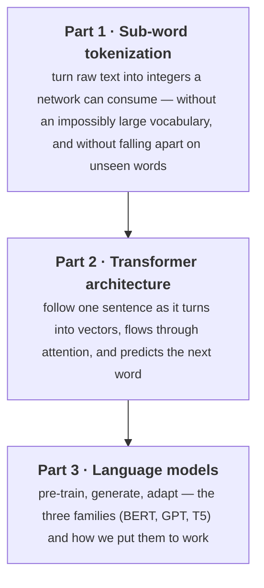
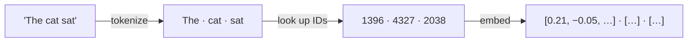
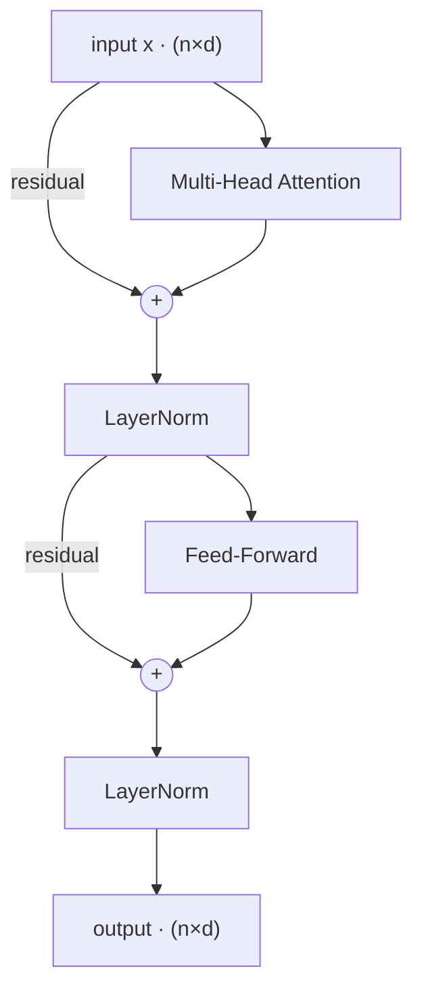
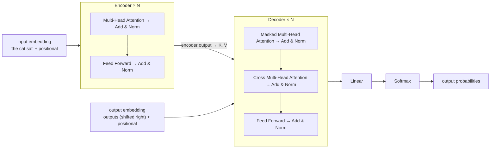
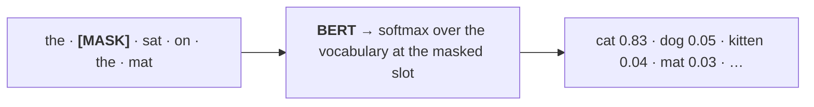
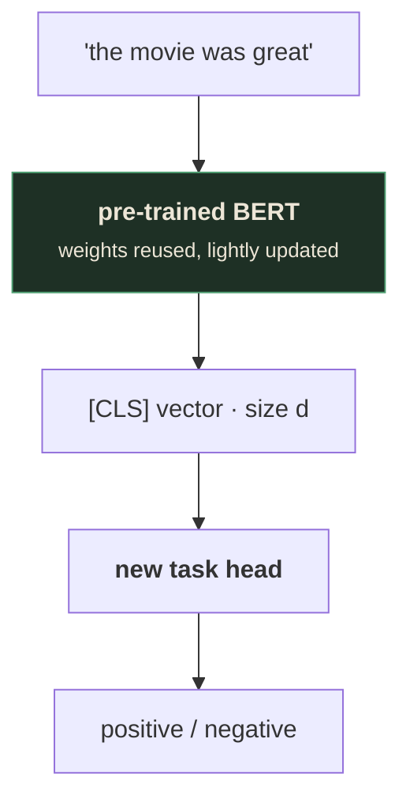
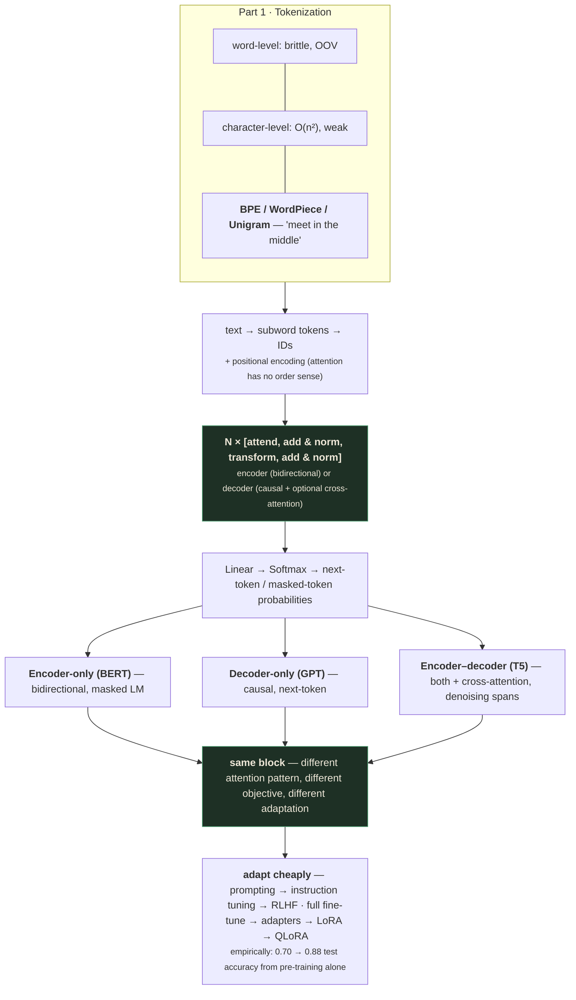

# Sequential Learning — Part 3: Tokenizers, Transformers, and Language Models

> Instructor: **Ahmed Sanin MV** (different instructor from Parts 1–2; a different, more code-heavy,
> interactive-demo-driven deck style). Runtime ~1:03:45. Built from the raw capture in
> `output/Lecture_20 - Module 6 Sequential Learning Part 3/` (160 raw frames), not `slides_deduped/`
> — see project memory `slides-deduped-is-lossy`. The deck is organized into three explicit,
> navigable tabs — **1 Sub-word Tokenization, 2 Transformer Architecture, 3 Language Models** — and
> this file follows that structure. It closes with a hands-on notebook (text classification,
> from-scratch vs. pre-trained), which this file summarizes rather than reproduces line-by-line.

---

## What you'll understand after reading this

1. **Explain why word-level and character-level tokenization both fail**, and derive subword
   tokenization as the engineered middle ground between them.
2. **Run BPE, WordPiece, and Unigram/SentencePiece by hand** on a small corpus, and explain precisely
   how each one's *selection rule* differs, even though all three share the same "keep merging/keep
   splitting" outer loop.
3. **Derive the positional encoding problem** — why attention alone is a bag-of-tokens operation —
   and compare sinusoidal, learned, and relative (RoPE/ALiBi) position schemes.
4. **Assemble a full Transformer block from its five components** (attention, add & norm,
   feed-forward, add & norm) and explain what each component contributes.
5. **Compute causal masking by hand**, and explain precisely why a decoder must never see future
   tokens during training, not just at inference.
6. **Distinguish encoder-only, decoder-only, and encoder-decoder architectures** by their attention
   pattern, pre-training objective, and adaptation method — and name BERT, GPT, and T5 as concrete
   instances of each.
7. **Derive BERT's masked-language-model objective**, including the 80/10/10 trick, and explain
   exactly what problem that trick solves.
8. **Explain GPT's autoregressive objective and next-token prediction head**, and compute a sampling
   decision by hand under greedy, temperature, top-k, and top-p strategies.
9. **Order the parameter-efficient fine-tuning ladder** (full fine-tuning → adapters → LoRA → QLoRA)
   by what each step fixes about the one before it.
10. **State, with a real number, how much pre-training actually buys you** on a downstream task.

---

## Before we start: what you need to know

### Prerequisite 1 — What this lecture assumes from Parts 1–2

This lecture assumes self-attention, scaled dot-product attention, and multi-head attention
(all derived from scratch in [`sequential-learning-02.md`](sequential-learning-02.md) §7–§10) as
settled background. It does not re-derive $\text{Attention}(Q,K,V)=\text{softmax}(QK^\top/\sqrt{d_k})V$
from first principles — it uses it immediately as a building block. If any of that formula feels
unfamiliar, read Part 2 first.

### Prerequisite 2 — Notation this lecture fixes and reuses throughout

The lecture explicitly names a small vocabulary of symbols used in every remaining slide [slide 48]:

| Symbol | Meaning |
|---|---|
| $n$ | number of tokens in the sequence |
| $d$ | size of each token vector ($d_{\text{model}}$) |
| $h$ | number of attention heads |
| $d_k$ | size of each head's vectors, $d/h$ |
| $d_{ff}$ | hidden width of the feed-forward layer (often $4d$) |
| $N$ | how many transformer blocks are stacked |
| $V$ | vocabulary size |

Its running toy example throughout the Transformer Architecture section uses tiny numbers so every
matrix fits on screen: $n=3$ (tokens "the", "cat", "sat"), $d=4$, $h=2$, $d_k=2$, $d_{ff}=8$, $N=6$
[slide 48]. *"Real models are far larger (d in the thousands, N in the dozens), but the wiring is
identical"* [slide 48] — the toy numbers are a teaching device, not a claim about real model sizes.

### Prerequisite 3 — LayerNorm, briefly

> **LayerNorm (Layer Normalization)** — rescales a single vector so its components have mean 0 and
> unit variance, then applies a learned scale and shift.
>
> *Why it matters here:* the Transformer block (§4) applies LayerNorm after every residual addition
> ("Add & Norm"). You don't need its formula derived to follow this lecture — just that it's a
> per-vector rescaling step that keeps values in a stable numeric range as they pass through many
> stacked blocks, distinct from the residual addition it follows.

### Prerequisite 4 — Cross-entropy loss, briefly

Several sections here (BERT's MLM loss, GPT's next-token loss) say "loss = cross-entropy between the
predicted distribution and the true word." All you need: cross-entropy loss is $-\log(p)$, where $p$
is the probability the model assigned to the *correct* answer. If the model gives the right word 91%
probability, the loss is $-\log(0.91)\approx0.094$ — low, because the model was confident and
correct. If it had given the right word only 10% probability, the loss would be $-\log(0.10)\approx
2.3$ — much higher. Minimizing this loss during training literally means: push probability mass onto
the correct word.

---

## The big picture

This lecture closes the arc from tokens to a working, adaptable language model in three acts, and its
own section titles make the arc explicit:



Each act ends exactly where the next act's first sentence needs it to: tokenization produces the
integer token IDs that become the Transformer's input embeddings; the Transformer produces a generic
architecture that BERT, GPT, and T5 each configure differently (same block, different attention
pattern and pre-training objective) to become an actual usable model.

---

# Part 1 — Sub-word Tokenization

## 1. Why Word-Level and Character-Level Both Fail

### 1.1 Attempt 1 — word-level: split on spaces, give every word an ID [slide 10]

`"the cats are playing"` → `["the", "cats", "are", "playing"]`. Short sequences, easy to read. But
three questions break it:

1. What happens when a word shows up that wasn't in the training data, like *"tokenization"*?
2. What about a small typo like *"playng"*, or related forms like *play, plays, playing, played*?
3. How large does the vocabulary grow if we keep adding every new word?

> **Verdict** [slide 10]: **brittle (OOV, typos), blind to morphology, unbounded in size.**

### 1.2 Attempt 2 — character-level: one token per character [slide 12]

`"playing"` → `[p,l,a,y,i,n,g]`.

| ✓ What it fixes | ✗ What it costs |
|---|---|
| Tiny vocabulary — a few hundred characters cover everything | **Sequences get very long: attention is $O(n^2)$, so 6× longer ≈ 36× the compute** |
| No OOV — any word is a sequence of known characters | Weak units — a single character means nothing alone; layers are wasted re-assembling words |
| Typos and rare words degrade gracefully | Long-range dependencies span more steps |

> ⚠️ **The tension, stated directly** [slide 12]: *"Words: short & meaningful, but huge vocab + OOV.
> Characters: tiny vocab & no OOV, but long sequences & weak units. The fix is to meet in the
> middle."* This single sentence is the thesis of the entire tokenization section — every remaining
> algorithm (BPE, WordPiece, Unigram) is a different answer to *how* to meet in the middle.

## 2. Method 1 — Byte Pair Encoding (BPE)

> **BPE** — originally a 1994 compression trick (Gage); brought to NLP by Sennrich, Haddow & Birch
> (2016). Used by **GPT-2/3/4 (byte-level), RoBERTa, BART** [slide 17].

**Training — learning the merges** [slide 17]:
1. **Base vocabulary** = all individual characters. Split every word into characters.
2. **Count** every adjacent symbol pair across the corpus (weighted by word frequency).
3. **Merge** the most frequent pair into one new symbol; add it to the vocab and record the merge
   rule.
4. **Repeat** until the vocabulary reaches the target size (a fixed number of merges).

Training outputs a **vocabulary** (characters + merged subwords) and an **ordered list of merge
rules**, replayed at inference.

🧪 **Worked example — tokenizing a new word** [slide 22]. With merge rules `u+g→ug`, `u+n→un`,
`h+ug→hug`, `p+un→pun`, `p+ug→pug` already learned, tokenizing `"bug"`:

```
split into characters:   b  u  g
apply u+g → ug:          b  [ug]
(no further rules apply to "b" + "ug")
Result: ["b", "ug"]
```

*"No recounting at inference: split into characters, then apply the learned merge rules in order"*
[slide 22].

> ⚠️ **A genuine OOV case inside "OOV-free" BPE.** *"Try mug: the letter m never appeared in our
> tiny corpus → no base token → [UNK]"* [slide 22]. Even BPE's character-level base vocabulary isn't
> automatically complete if the training corpus never contained a given character. **Real systems fix
> this with byte-level BPE (GPT-2): the base vocab is the 256 raw bytes, so every possible character
> is representable. There is no [UNK], ever** [slide 22] — this is *why* GPT's tokenizer specifically
> operates on raw bytes rather than Unicode characters: it makes the "missing base character" failure
> mode structurally impossible.

```interactive
type: simulator
title: BPE Tokenizer, Live
concept: Applying learned BPE merge rules to a new word at inference time
control: Type any word (including one containing an unseen character) and step through the learned
  merge rules being applied in order
observe: The word splits into characters, then progressively fuses into subword pieces as each
  applicable merge rule fires; an unrepresentable character falls back to [UNK]
insight: Tokenization at inference is mechanical rule-replay, not re-counting — and byte-level BPE's
  256-byte base vocabulary is what makes [UNK] structurally impossible for GPT's tokenizer specifically
fallback: The "bug" → ["b","ug"] and "mug" → [UNK] worked examples above trace the identical
  rule-application steps by hand.
```

## 3. Method 2 — WordPiece

> **WordPiece** — BERT's tokenizer. Runs the **same** character-merging loop as BPE, with two
> changes [slide 24].

**Change 1 — the `##` marker.** A piece that *continues* a word gets a `##` prefix, so a word-start
piece can be separated from a word-internal one and the word rebuilt exactly. This is the standard
BERT convention: `hugs` → `[h, ##u, ##g, ##s]`; `play` + `##ing` → `playing`.

**Change 2 — the merge rule.** Instead of merging the most *frequent* pair, WordPiece merges the
pair with the highest **score**:

$$\text{score}(a,b) = \frac{\text{freq}(a,b)}{\text{freq}(a)\cdot\text{freq}(b)}$$

🧪 **Worked example, same corpus scored both ways** [slide 24]:

| Pair | Freq | Score |
|---|---|---|
| `##g + ##s` | 5 | **0.050** |
| `##u + ##g` | 20 | 0.028 |
| `p + ##u` | 17 | 0.028 |
| `##u + ##n` | 16 | 0.028 |
| `h + ##u` | 15 | 0.028 |
| `b + ##u` | 4 | 0.028 |

**BPE merges `u+g`: the most *frequent* pair (count 20). WordPiece merges `g+s`: the highest
*score* (0.050), even though it appears only 5 times.**

> 💡 **Key insight — why the difference.** *"Dividing by the two piece frequencies favours pieces
> that are individually rare but keep showing up together. That pairing is more informative than
> fusing two already-common pieces"* [slide 24]. This is directly analogous to TF-IDF's logic
> (Lecture 18 §3.3) and to GloVe's ratio insight (Lecture 18 §7.1): a raw count conflates "frequent
> pair" with "frequent components," while dividing by the components' individual frequencies isolates
> how much *more* often the pair co-occurs than chance would predict from their individual
> commonness.

## 4. Method 3 — Unigram LM / SentencePiece

> **Unigram LM (SentencePiece)** — used by **T5, ALBERT, XLNet**. SentencePiece doesn't split on
> spaces first: it reads raw text and turns each space into a visible `_` marker, so spacing becomes
> part of the tokens. This makes it **language-agnostic** (works even for languages written without
> spaces) and fully reversible: `"I love ML"` → `[_I, _love, _ML]` [slide 30].

**The Unigram idea** [slide 30]:
- Every subword in the vocabulary carries a **probability**.
- To tokenize a word, the model looks at *all* the ways it could be split and keeps the one with the
  **highest combined probability** (found efficiently with the Viterbi algorithm).
- Training works **top-down**: start with a large set of candidate pieces, then repeatedly drop the
  ones the corpus needs least, until the vocabulary reaches the target size. *(BPE and WordPiece do
  the opposite: they build up from characters.)*

🧪 **Worked example — segmenting "dogs"** [slide 30]. Vocabulary probabilities: `dog .40, s .20, do
.10, g .10, gs .05, o .05, d .05`.

| Segmentation | Probability |
|---|---|
| **`dog \| s`** | $.40\times.20=\mathbf{.0800}$ |
| `do \| gs` | $.10\times.05=.0050$ |
| `do \| g \| s` | $.10\times.10\times.20=.0020$ |
| `d \| o \| g \| s` | $.05\times.05\times.10\times.20=.00005$ |

*"`dog \| s` is the highest-probability path. The model prefers the split that best explains the
word under its learned piece probabilities"* [slide 30].

## 5. Comparison — Same Goal, Three Different Strategies [slide 32]

| | **BPE** | **WordPiece** | **Unigram / SentencePiece** |
|---|---|---|---|
| Direction | bottom-up merge | bottom-up merge | top-down prune |
| Selection rule | most frequent pair | highest score, freq/(freq·freq) | max-likelihood split (probabilistic) |
| Piece marker | space pre-token | `##` on continuation | `_` on space |
| OOV | none (byte-level) | `[UNK]` possible | none (char fallback) |
| Used by | GPT-2/3/4, RoBERTa | BERT, DistilBERT | T5, ALBERT, XLNet |

> 💡 **Key insight, stated directly and worth taking as the section's thesis:** *"All three keep
> frequent text whole and break rare text into reusable pieces. They only differ in **how they choose
> the pieces**: by count, by score, or by probability"* [slide 32].

**What's next in Sequence Learning:** *"these tokens become the input IDs that flow into the
Transformer: embeddings, positional encoding, and attention"* [slide 36] — `text → subword tokens →
IDs → Transformer`. This is the exact handoff into Part 2.

---

# Part 2 — Transformer Architecture

## 6. A Model Sees Numbers, Not Text [slide 7]

> *A note on ordering:* `slide 7` is actually the deck's 2nd slide overall, displayed while the tab
> bar still shows **"1 Sub-word Tokenization"** as active — several slides before "Attempt 1 —
> word-level" (`slide 10`), which is the real start of that tab's content. This file places this
> slide's content at the *start* of Part 2 instead, as a deliberate pedagogical bridge (it's the
> sentence that motivates *why* tokenization matters — "a Transformer only sees integers" — so it
> reads best right before the Transformer section, not buried inside Part 1). If you check `slide
> 7.jpg` directly, expect to see tab 1 highlighted, not tab 2.

*"A Transformer sees a sequence of integer IDs and looks one up in an embedding table. So before any
learning happens, we split into pieces (tokens), and map each piece to an ID. That splitting step is
tokenization."*



This is the literal continuation of Part 1's closing sentence — tokenization's output (integer IDs)
is the Transformer's input.

## 7. Positional Encoding — the Problem

> ⚠️ **Attention has no built-in sense of order** [slide 51]. *"A token is a weighted sum of value
> vectors, order is irrelevant. If a token gets shuffled around, its attention output stays
> unchanged, even if the sentence's meaning changed completely."* Two example sentences that
> attention alone treats identically: `"dog bites man"` vs. `"man bites dog"` [slide 51] — the exact
> same failure mode identified in Lecture 18 §4.2's Bag-of-Words discussion, now shown to apply to
> raw self-attention too, because self-attention is fundamentally a *weighted sum* over the sequence,
> and weighted sums don't care about order.

### 7.1 The Fix — give every position its own vector, and add it in [slide 53]

$$x_i = \underbrace{e(\text{token}_i)}_{\text{what}} + \underbrace{p_i}_{\text{where}}$$

Position $i$ gets a vector $p_i$ of the same size $d$ as the token embedding. Add it onto the token
embedding, so the input now carries both *what* the token is and *where* it sits.

### 7.2 Method 1 — Sinusoidal (absolute) [slide 57]

$$p_{(\text{pos},2i)} = \sin\!\left(\frac{\text{pos}}{10000^{2i/d}}\right) \qquad p_{(\text{pos},2i+1)} = \cos\!\left(\frac{\text{pos}}{10000^{2i/d}}\right)$$

*"Each dimension is one sine or cosine wave. Early dimensions are fast waves, later dimensions are
slow waves. Read down a column to see one wave; read across a row to get one position's vector. The
combined pattern is unique to each position"* [slide 57]. *"The intuition. Each position is like a
clock reading: [a vertical slice through all the waves] picks one value off every wave"* [slide 57].

### 7.3 Method 2 — Learned (absolute) [slide 59]

No formula — keep a trainable table with one row per position, learned by gradient descent like any
other weight. **This is what the original BERT and GPT used.**

| ✓ Strengths | ✗ Limits |
|---|---|
| Simple; the model tunes positions to whatever helps | Needs a **fixed maximum length** chosen up front |
| Matches sinusoidal quality within the trained length | No row exists for positions **beyond training**, so it cannot extrapolate |
| | Encodes absolute index only, with no notion of distance |

### 7.4 The field's move: RoPE and ALiBi [slide 63]

> 🔬 **Research opportunity — this is an active area.** *"What if distance matters more than absolute
> index?"* [slide 61] — a query at position 5 attending to a key at position 8 should encode "gap of
> 3," regardless of whether it's the sentence's 1st-vs-4th token or 100th-vs-103rd. *"This is
> genuinely in practice: Transformer-XL, T5 (a relative position bias), and DeBERTa"* [slide 61].
>
> *"Why modern LLMs moved to RoPE and ALiBi: because to fit longer context lengths (modern context
> lengths often reach far into the tens of thousands), the fixed vocabulary/window of the older
> methods runs out. Second, generalizing to context lengths longer than what the embedding was
> trained on"* [slide 63]:
>
> - **RoPE (rotary position embedding)** — rotates each query and key by an angle that depends on its
>   *relative* distance; the embedding is rotated, not added. Used by LLaMA, GPT-NeoX, PaLM, Qwen.
> - **ALiBi (attention with linear biases)** — adds a penalty proportional to how far apart the
>   scores go, with the distance embedded via linear biases. No learned position parameters, and
>   strong length extrapolation. Used by BLOOM and MPT.

The specific model lists attributed to RoPE (LLaMA, GPT-NeoX, PaLM, Qwen) and ALiBi (BLOOM, MPT) are
stated directly in `slide 63`'s plain body text — *"Used by LLaMA, GPT-NeoX, PaLM, Qwen"* and *"Used
by BLOOM and MPT"* — not small print, and quoted verbatim above.

## 8. Inside One Transformer Block [slide 66]

> *"Two sub-layers: attention, then a feed-forward network. After **each** one we add a residual
> shortcut and apply LayerNorm ('Add & Norm'). Shape stays $n\times d$ the whole way, so blocks stack
> cleanly."*



- **Attention sub-layer** — lets every token gather information from the other tokens. This is where
  words interact.
- **Feed-forward sub-layer** — processes each token on its own, expanding to a wider hidden size and
  back to add capacity.
- **Add & Norm** — after each sub-layer, the dashed shortcut adds its input back to its output (so
  gradients flow and nothing is lost), then LayerNorm rescales each vector. *"This 'Add then Norm' is
  the original Transformer; some modern variants normalize first instead."*
- *"Output shape equals input shape, so we just stack this block **N** times."*

## 9. Self-Attention — Query, Key, Value: a Soft Lookup [slide 67]

*"Think of a search. Each token sends out a **Query** ('what am I looking for?'). Every token also
advertises a **Key** ('what I am about') and carries a **Value** ('what I will pass on'). A token
compares its query to every key, and blends the values of whoever matches best."*

- **Query (Q)** — what this token wants to find in the others.
- **Key (K)** — a label each token offers, matched against queries.
- **Value (V)** — the content a token contributes once it is matched.

*"All three (Q, K, V) come from the same input vector, each multiplied by its own learned matrix. The
entire mechanism is this one formula"*:

$$\text{Attention}(Q,K,V) = \text{softmax}\!\left(\frac{QK^\top}{\sqrt{d_k}}\right)V$$

*(This is identical to Lecture 19 §9's scaled dot-product attention formula — this section is
reusing, not re-deriving, that result.)*

### 9.1 Multi-Head Attention — combining the heads [slide 71]

$$\text{head}_i = \text{Attention}(XW_Q^i, XW_K^i, XW_V^i) \qquad \text{MultiHead}(X) = \text{Concat}(\text{head}_1,\ldots,\text{head}_h)\,W_O$$

🧪 **Worked example, real numbers** [slide 71]: two 3×2 head outputs (`out₁`, `out₂`) are lined up
side by side into a 3×4 concatenated matrix, then multiplied by a learned $4\times4$ matrix $W_O$ to
produce the final 3×4 output. *"What is $W_O$, and why? The heads were computed completely
independently, so the concatenation just stacks their outputs with no interaction. $W_O$ is a
learned matrix that **mixes information across the heads** and projects the result back to size $d$.
Without it, the heads could never combine what each one found."*

> 💡 **Key insight — this is the exact answer to a question left open in Lecture 19 §10.** Lecture 19
> showed multi-head attention runs $h$ independent attention computations; this slide supplies the
> missing final step — *why* the concatenation alone isn't enough, and what $W_O$ specifically
> contributes (cross-head mixing) that concatenation cannot.

```interactive
type: simulator
title: Multi-Head Attention, Head by Head
concept: Independent per-head attention, concatenation, and the W_O mixing projection
control: Step through computing head_1 and head_2 independently, then concatenating their outputs,
  then applying W_O
observe: Each head's 3×2 output appears side by side (no interaction between them) until the W_O
  step, where the final 3×4 output visibly blends values from both heads' columns
insight: Concatenation alone is just stacking — W_O is the one step where information actually
  crosses between heads
fallback: The worked out₁/out₂ → concatenate → ×W_O example above shows the identical three stages
  with real numbers.
```

## 10. Finishing the Block — the Feed-Forward Network [slide 75]

*"This runs on **each token separately**. Attention moved information *between* tokens; the
feed-forward layer lets each token *transform its own features*. It widens the $d=4$ vector to a
roomier $d_{ff}=8$, applies a non-linearity, then projects back to $d=4$."*

$$\text{FFN}(x) = \text{GELU}(x\,W_1)\,W_2 \qquad \text{GELU}(x) = x\cdot\Phi(x)$$

> **GELU** — a smooth gate. $\Phi$ is the standard normal CDF, so GELU keeps large positive values
> almost unchanged and smoothly pushes negatives toward zero (a softer ReLU). This non-linearity is
> what lets the network compute more than a plain weighted sum. In practice a fast tanh approximation
> is used [slide 75].

*"Dimensions go up, then down: expand $4\to8$ (the wider hidden layer gives room to combine
features); project $8\to4$, back to the model size"* [slide 75].

## 11. Encoder vs. Decoder — Two Kinds of Stack [slide 81]

*"The block we just built is reused in two ways. The only real difference is **what each token is
allowed to attend to**."*

| | **Encoder — understand the input** | **Decoder — generate the output** |
|---|---|---|
| Sees | The whole input at once | Produces tokens left to right, one at a time (autoregressive) |
| Attends to | **all** tokens, left and right (bidirectional) | **itself and earlier** tokens only (causal / masked) |
| Also | — | May also attend to the encoder output (cross-attention) |
| Goal | A rich understanding of the input | — |
| Example | **BERT is encoder-only** | **GPT is decoder-only** |

*"Both together = sequence-to-sequence (translation, summarization; T5)."*

### 11.1 Why the Decoder Must Not Look at the Future [slide 83]

*"In training the decoder sees the whole target sentence at once (for speed). But to predict word
$i$ it may use only words $1{...}i$. If it could peek at word $i{+}1$ it would just copy the answer
and learn nothing. At generation the future does not exist yet. So we block every position to the
right."*

$$\text{score}_{ij} = -\infty \ \text{for } j>i, \ \text{then softmax}$$

*"The upper triangle (future positions) is set to $-\infty$, so after softmax those weights are
exactly 0. Each row becomes a distribution over itself and earlier tokens only. The result is a
lower-triangular attention matrix. Everything else (multi-head, values, Add & Norm) is unchanged.
Only the mask is added."*

🧪 **Worked example** [slide 83] — raw scores for the sentence "the cat sat":

$$\begin{bmatrix}1.4&0.0&1.4\\0.0&4.2&1.4\\1.4&2.1&2.1\end{bmatrix} \xrightarrow{\text{apply causal mask}} \begin{bmatrix}1.4&-\infty&-\infty\\0.0&4.2&-\infty\\1.4&2.1&2.1\end{bmatrix}$$

After softmax, every $-\infty$ entry becomes exactly 0 — "the" can only attend to "the"; "cat" can
attend to "the" and "cat"; "sat" can attend to all three.

> ⚠️ **This is the exact mechanism, made concrete, that Lecture 19's "why the decoder must not look
> at the future" discussion left implicit.** Setting scores to $-\infty$ *before* the softmax, rather
> than zeroing the *output* weights after, is what guarantees the blocked positions get exactly zero
> gradient and exactly zero influence — the mask is baked into the same score-then-softmax pipeline
> as ordinary attention, not bolted on afterward.

```interactive
type: simulator
title: Apply Causal Mask, Live
concept: Setting future-position scores to -infinity before softmax
control: Toggle the causal mask on/off over the "the cat sat" raw score matrix and watch the softmax
  output change
observe: With the mask off, every row's softmax spreads weight across all three positions; with the
  mask on, each row's weight collapses to zero for every future position, producing a
  lower-triangular attention matrix
insight: The mask is applied before softmax, not after — this is what makes the blocked positions
  receive exactly zero gradient, not just zero weight in the final output
fallback: The worked score matrix → masked matrix example above shows the identical before/after
  transformation with real numbers.
```

### 11.2 The Decoder Block — Same Block Plus Two Changes [slide 85]

**Change 1 — masked self-attention.** The self-attention is causal: each token attends only to itself
and earlier tokens (§11.1).

**Change 2 — cross-attention.** An extra sub-layer where the **queries come from the decoder** but
the **keys and values come from the encoder output**. This is how each output token reads the input
— for example, aligning a translated word to its source word.

*"Everything else (Add & Norm, residual, feed-forward) is identical to the encoder block. The encoder
block is just self-attention + feed-forward, with no mask and no cross-attention."*

## 12. The Full Transformer Architecture [slide 91]

*"Encoder stack on the left, decoder stack on the right. Inputs become embeddings plus positional
encodings; the decoder's masked and cross attention feed a final Linear and Softmax that give the
next-word probabilities."*



## 13. The Decoder — the Prediction Head [slide 93]

*"This is the last step of any of the top of the decoder. Take the last token's vector $h_{\text{last}}$,
multiply by $W_{\text{vocab}}$ to score every word, then softmax over the vocabulary. Only the
decoder builds this understanding, the decoder does the prediction. We read only the last position's
row because that's where the next word comes from."*

---

# Part 3 — Language Models

## 14. Three Families, One Paradigm [slide 97]

| | **Encoder-only** | **Decoder-only** | **Encoder-decoder** |
|---|---|---|---|
| e.g. | BERT, RoBERTa | GPT, LLaMA | T5, BART |
| Reads | both directions, for understanding | left to right, for generation | reads then writes, for translation |

*"Pre-train, generate, adapt: the three families and how we put them to work."* Two-step recipe,
shared by all three [slide 97]: **1 · Pre-train on raw text** (billions of words, no labels, done
once) → **2 · Adapt to your task** (little data, fast, one base into many specialists).

*"The text is its own label"* [slide 99] — the single sentence that explains why pre-training needs
no human annotation at all: hiding a word and predicting it (BERT family) or hiding the next word and
predicting it (GPT family) both derive supervision directly from raw text, at effectively unlimited
scale.

## 15. Family 1 — Encoder-Only: BERT

### 15.1 Inside the Encoder — Every Token Reads the Whole Sentence [slide 102]

*"Bidirectional is the whole point. Every token mixes with tokens on its left and right, so each
output vector is rich with context. BERT produces one vector per token, contextual representations —
it does not generate raw text."*

*"Here is the puzzle. If it already sees the whole sentence, what can we hide and ask it to predict
from raw text?"*

### 15.2 Every Input Token Is a Sum of Three Embeddings [slide 104]

BERT wraps the input in special tokens: `[CLS]` (start), the sentence itself, `[SEP]` (separator),
and a second segment. Each position's input is the sum of three learned embeddings: **token**
embedding + **segment** embedding (which of two sentences this token belongs to) + **position**
embedding. *"[CLS] is a summary slot. Its final vector stands for the whole input, and BERT feeds it
to a classifier. [SEP] ends each sentence."*

### 15.3 BERT Pre-training Objective 1 of 2 — Masked Language Model [slide 106]

*"Pick about **15%** of tokens at random and replace each. Because attention is bidirectional, every
blank is predicted from the full left and right context. The original word is the free label."*



**loss = cross-entropy between this distribution and the true word "cat", averaged over the masked
positions.**

**The 80/10/10 trick:**
- **80%** of chosen tokens become `[MASK]`.
- **10%** become a random word.
- **10%** are left unchanged.

> 💡 **Key insight — why not always mask.** *"Fine-tuning never shows a `[MASK]` token, so always
> masking would create a train and test mismatch. The random and unchanged cases force BERT to build
> a good vector for every token, not only the masked ones"* [slide 106]. This is the same category of
> reasoning as GPT's causal masking (§11.1) and the negative-sampling noise distribution in Lecture
> 18 §6.5: a training procedure engineered to specifically avoid a distribution mismatch between what
> the model sees during training and what it will actually face in use.

### 15.4 BERT Pre-training Objective 2 of 2 — Next Sentence Prediction [slide 108]

*"Half the pairs are true neighbors, half pair A with a random sentence B. BERT reads the `[CLS]`
slot and answers IsNext or NotNext, learning how sentences relate (useful for question answering and
retrieval)."*

```
real pair:   [CLS] the cat sat [SEP] it purred        → IsNext
random pair: [CLS] the cat sat [SEP] stocks fell       → NotNext
```

*"Trained **together** with masked LM: the token loss plus this sentence-pair loss, summed into
one."*

> ⚠️ **Aside for later, flagged by the slide itself:** *"RoBERTa dropped NSP entirely and did better
> by training longer on more data. Details come in a later lecture"* [slide 108] — the lecture is
> explicit that NSP's necessity is not settled; it's presented as BERT's original design choice, not
> as a proven-necessary component.

### 15.5 BERT — Fine-Tuning: Reuse the Body, Add a Small Task Head [slide 111]



*"Why so little data is enough. BERT already understands language from pre-training. The head only
maps its features to your labels, so a few thousand examples and a few minutes of training are
enough."*

**One body, many heads** — Sentiment: read the `[CLS]` vector, classify the sentence. NER: classify
*each* token's vector (person, place, ...). QA: predict the start and end token of the answer span.

## 16. Family 2 — Decoder-Only: GPT

### 16.1 Step Inside the Decoder — Predict the Next Token, Never Peek Ahead [slide 112]

$$p(x_1,\ldots,x_n) = \prod_{t=1}^n p(x_t\mid x_1,\ldots,x_{t-1})$$

*"A sentence's probability factors into one next-token prediction per position. For this to be
honest, position $t$ must not see tokens after it. A **causal mask** enforces that inside attention.
Same block as the encoder, one rule changed."*

> 💡 **Key insight — why this objective is so powerful, stated directly.** *"To guess the next word
> well across all of the web, the model is pushed to learn grammar, facts and a bit of reasoning. One
> objective, and the same model then handles many tasks straight from a prompt"* [slide 112]. This is
> the single sentence that explains why GPT-style pre-training scales into general-purpose
> capability: predicting the next token well, at web scale, forces the model to implicitly encode far
> more than surface grammar.

### 16.2 The Prediction Head — Hidden Vector → Logits → Probabilities [slide 119]

*"Take the block output of the **last** token. Multiply by the vocabulary matrix to score every word,
then softmax. Under the causal mask the last token already sees the whole prefix, so this is the
genuine next-token distribution."*

$$\text{logits} = h\,W_{\text{vocab}} \qquad p_i = \frac{e^{\text{logit}_i}}{\sum_j e^{\text{logit}_j}}$$

🧪 **Worked example, toy 6-word vocabulary** [slide 119]: block output of "sat" is a $1\times4$
vector `[-0.07, -0.26, 1.56, -1.23]`; multiplying by $W_{\text{vocab}}$ gives scores
`[-0.16, 0.10, 0.16, 4.02, 0.21, -0.14]` over the vocabulary `{the, cat, sat, on, mat, dog}`; softmax
gives probabilities with **"on" at 0.91** the clear winner. *"Prediction: 'on' at 0.91. If the true
next word is 'on', the loss is $-\log(0.91)\approx0.094$. Training nudges the weights to push this
probability higher across billions of such predictions."*

### 16.3 Choosing the Next Word — How Do We Add Variety? [slide 121]

*"The model gives a probability to every next word. **Greedy** takes the single highest (argmax), so
it never changes. To get varied text we **sample**, after reshaping the distribution."*

| Method | Mechanism |
|---|---|
| **Temperature $T$** | Scale logits by $1/T$ before softmax: $p_i\propto e^{z_i/T}$. $T<1$ sharpens the peak (focused, safe). $T>1$ flattens it (creative, riskier). $T$ near 0 is greedy. |
| **Top-k** | Keep the $k$ most likely words (a fixed count), drop the rest, renormalize, then sample. Simple, but uses the same $k$ whether the model is sure or not. |
| **Top-p (nucleus)** | Keep the smallest set whose probabilities sum to $p$ (an adaptive count). The set shrinks when the model is confident, grows when it's unsure. |

🧪 **Worked example, temperature effect** [slide 121-126]: with base probabilities `mat=0.31,
rug=0.23, sofa=0.17, floor=0.15, chair=0.08, table=0.06`, drawing 20 samples at **$T=1.6$**: *"above 1
flattens the bars, so the draws spread across more words"* — the demo shows 5 distinct words drawn
out of 6, roughly matching the flattened distribution, versus greedy always picking "mat."

```interactive
type: slider
title: Sampling Strategy Comparison
concept: How temperature, top-k, and top-p reshape a next-token probability distribution
control: Drag a temperature slider, or switch to a top-k or top-p mode with its own adjustable
  parameter, over the mat/rug/sofa/floor/chair/table base distribution
observe: Higher temperature flattens the bar heights; top-k truncates to a fixed-size bar set; top-p's
  kept-bar count visibly grows or shrinks depending on how peaked the base distribution already is
insight: Top-p is the only one of the three whose candidate-set size adapts automatically to model
  confidence — top-k always keeps exactly k words regardless of how sure the model is
fallback: The temperature/top-k/top-p mechanism table and the T=1.6 worked example above describe the
  same three behaviors in words and one concrete run.
```

## 17. Adapting a Pre-Trained Decoder [slide 126]

*"A pre-trained decoder already knows a lot. Often you can steer it with words alone, and change
weights only when you need to."*

| | **1 · Prompting** | **2 · Instruction tuning** | **3 · RLHF** |
|---|---|---|---|
| What it does | Describe the task in the input; the model answers from what it already knows | Fine-tune on thousands of tasks written as instruction and answer pairs | Humans rank answers, a reward model learns the ranking, the model is tuned to score higher |
| Example | `Review: "great film" → Sentiment: positive` | `"Summarize in one line: ..." → learns to follow orders it never saw` | `prefer helpful, honest, harmless replies` |
| Weight change | **weights unchanged** (zero-shot: no examples; few-shot: a few in the prompt / in-context learning) | **all weights updated** | **weights tuned by reward** |

*"Prompting touches no weights. Instruction tuning and RLHF do, and when you change weights you
rarely need to touch **all** of them"* [slide 126] — the sentence that directly motivates §18's
parameter-efficient fine-tuning ladder.

## 18. Parameter-Efficient Fine-Tuning — Shrinking What You Train [slide 132]

*"Each step keeps the win of the last one and fixes its biggest cost."*

**1 · Full fine-tuning.** Update **every** weight in the model for your task. *"Three problems:
**huge** compute and memory, a **full copy** saved per task, and it can **overwrite** the language
learned in pre-training"* [slide 132].

**2 · Adapter tuning.** Freeze the model, insert small trainable **adapter** layers inside each
block, train only those. (Relatives: prefix and prompt tuning.) *"Far fewer trained parameters, but
the extra layers add **inference latency**, and you still backprop through the whole model, so
compute stays high"* [slide 133].

**3 · LoRA (Low-Rank Adaptation).** Instead of inserting new layers in the forward path (adapters'
latency cost), freeze the original weight matrix and add a small, separately-trained **low-rank**
update `B·A` alongside it — visible directly in the QLoRA diagram [slide 134] as the `"LoRA: B·A
trained"` module added to the frozen base. Because the update is added to (not inserted into) the
existing weights, it can be merged back in after training, adding **no extra inference latency** —
the specific cost adapters still carry.

> ⚠️ **Capture gap, disclosed.** The interactive 4-step walkthrough this section follows has a
> captured frame for step 1/4 ("Full fine-tuning," `slide 132`) and step 2/4 ("Adapters," `slide
> 133`), then jumps straight to step 4/4 ("QLoRA," `slide 134`) — **step 3/4 ("LoRA") was never
> captured as its own frame** in this lecture's raw output (only 58 seconds elapse between `slide
> 133` and `slide 134` per `timestamps.txt`, versus 1.5 minutes for the previous step — the
> presenter evidently clicked through this step too quickly for a stable frame to be grabbed). The
> description above is not fabricated — it's corroborated by `GenAI & LLM Part 1` (`genai-llm-03.md`
> §8), which independently derives the identical mechanism with real Llama-2-7B numbers — but it is
> not verifiable from this lecture's own slides, unlike every other claim in this section.

**4 · QLoRA.** *"Quantize the frozen base to **4-bit** so it barely uses memory, then train a LoRA
adapter on top. This is how a model with **tens of billions** of parameters is fine-tuned on a
**single GPU**"* [slide 134].

> 💡 **Key insight — read this ladder as a chain of fixes, not four unrelated techniques.** Full
> fine-tuning's cost is compute+memory+storage+catastrophic forgetting. Adapters fix storage (only
> save the small adapter, not a full model copy) but add inference latency. LoRA fixes the latency
> (the update merges back into the frozen weights) while keeping the storage win. QLoRA fixes the
> *memory* problem LoRA still has (the frozen base still has to sit in memory at full precision) by
> quantizing that frozen base to 4-bit. Each step's motivation is stated on its own slide as *"fixes
> its biggest cost"* — this is the same rhetorical pattern Lecture 19 used throughout (name a
> concrete failure, then the fix for exactly that failure).

```interactive
type: simulator
title: The PEFT Ladder, Step by Step
concept: Full fine-tuning → adapters → LoRA → QLoRA, each fixing the previous step's biggest cost
control: Step through all 4 rungs of the ladder; at each step, a diagram shows what's frozen vs.
  trained, and a callout names the one cost that step removes and the one it still has
observe: The trained-parameter footprint shrinks at each step, while the diagram highlights whether
  the frozen base is full-precision or 4-bit quantized
insight: Each rung keeps every previous rung's win and fixes exactly one remaining cost — this is a
  chain of targeted fixes, not four independent techniques competing for the same job
fallback: The four-rung description above (with each step's named "fixes its biggest cost" callout)
  states the same progression in words; note the step-3/4 (LoRA) frame itself has a capture gap,
  flagged above.
```

## 19. Family 3 — Encoder-Decoder: T5 [slide 136]

*"It bolts together the two halves you just saw: a bidirectional **encoder** to read (like BERT) and
a causal **decoder** to write (like GPT), joined by **cross-attention**."*

*"The encoder reads the whole input both ways into context vectors. The decoder writes the output
left to right, and at each step its **cross-attention** looks back at those encoder vectors (their K
and V). Use it when a full input maps to a full output."*

**Denoising, then text-to-text.** Pre-train by masking whole **spans** with sentinels `<X>`, `<Y>` and
regenerating them. Then every task is text in, text out:

```
translate to German: the cat sat  →  die Katze saß
summarize: a long review ...       →  one-line summary
```

## 20. Recap — One Block, Three Families, One Paradigm [slide 138]

*"Pre-train once on raw text with a self-supervised objective, then adapt cheaply. The attention
pattern picks the family, the family picks the objective, the objective picks what it is good at."*

| | Attention | Pre-training | Adapt with | Best at | Examples |
|---|---|---|---|---|---|
| **Encoder-only** | bidirectional | masked LM (+ NSP) | head fine-tuning | understanding | BERT, RoBERTa |
| **Decoder-only** | causal | next-token | prompt, instruct, RLHF, LoRA | generation | GPT, LLaMA |
| **Encoder-decoder** | both + cross | denoising spans | text-to-text fine-tuning | seq to seq | T5, BART |

**Masked** hides random tokens and predicts from both sides. **Autoregressive** blocks the future and
predicts the next token. **Adapt beats retrain**: reuse language, learn only the task.

---

## 21. The Hands-On Notebook — Fine-Tuning a Text Classifier, Step by Step

The lecture closes with a Colab notebook (`text-classification-step-by-step.ipynb`) that fine-tunes a
sentiment classifier and, critically, **runs the exact same architecture and training procedure
twice** — once with randomly initialized weights ("from scratch") and once starting from a
pre-trained checkpoint — to isolate the effect of pre-training empirically.

**Setup** [slides 139-142]: load a product-review dataset, check class balance and review-length
distribution, and tokenize with the DistilBERT/BERT family's subword tokenizer (WordPiece, §3) or the
GPT family's BPE tokenizer, mapping text to IDs the same way real systems do.

**The controlled experiment** [slides 145-152]: *"We reuse the same training setup for both, so the
only thing that changes is whether the model starts from random weights or pre-trained."* Two
`Trainer` runs, identical hyperparameters, differing only in the starting checkpoint — a "from
scratch" `AutoModelForSequenceClassification` initialized with random weights, and the same
architecture loaded from a pre-trained checkpoint.

🧪 **Result — the value of pre-training, made concrete** [slide 155]:

| | Test accuracy |
|---|---|
| From scratch | **0.70** |
| Pre-trained | **0.88** |

> 💡 **Key insight — this is the empirical payoff of the entire "pre-train, then adapt" paradigm
> (§14).** Both models are the *same architecture*, trained with the *same* fine-tuning procedure, on
> the *same* small labeled dataset. The only difference is whether the weights started from
> pre-training on billions of words of raw text or from random initialization. An 18-percentage-point
> accuracy gap is the direct, measured cost of skipping pre-training — not a theoretical argument, a
> number from an actual run.

**Confusion matrix and qualitative check** [slides 156-160]: *"Where does the pre-trained model get
the test set right and wrong?"* — the notebook closes by inspecting specific misclassified examples,
grounding the aggregate accuracy number in individual cases the reader can reason about directly.

---

## Putting it together



Three threads run through this lecture:

1. **"Meet in the middle" is the same move, made three times at three different levels of the
   stack.** Subword tokenization meets word-level and character-level in the middle (§1). Attention
   with positional encoding meets "no order at all" and "hand-coded fixed-order rules" in the middle
   (§7). Parameter-efficient fine-tuning meets "retrain everything" and "touch nothing" in the middle
   (§18). Recognizing this pattern makes each new technique in the field easier to place: ask what
   two extremes it's balancing.
2. **Every algorithm in Part 1 shares one outer loop (merge-or-prune-repeatedly) and differs only in
   one selection rule** (§5) — frequency, score, or probability. This is the same insight as Lecture
   18's closing comparison of Word2Vec/GloVe/FastText: different statistical formulas solving the
   same structural problem, not fundamentally different mechanisms.
3. **"Same block, different mask, different objective" is the entire content of Part 3.** BERT, GPT,
   and T5 are not three different neural network architectures — they are the *identical* Transformer
   block from Part 2, configured differently along exactly two axes: which attention pattern
   (bidirectional / causal / both+cross) and which self-supervised pre-training objective (masked LM
   / next-token / denoising spans). Internalizing this collapses what looks like three separate
   models to learn into one architecture plus two configuration choices.

---

## Interview prep — Amazon Applied Scientist

### Core questions

<details><summary><b>1. Why does word-level tokenization fail, and why doesn't character-level tokenization simply replace it?</b></summary>

Word-level tokenization is brittle to out-of-vocabulary words and typos, and its vocabulary grows
unboundedly as new words appear. Character-level tokenization fixes OOV entirely (any word is a
sequence of known characters) but makes sequences far longer — since attention cost is $O(n^2)$, a
6× longer sequence costs roughly 36× more compute — and individual characters are weak, uninformative
units that force the model to spend capacity re-assembling words from scratch.
</details>

<details><summary><b>2. Walk through how BPE tokenizes a word it has never seen at inference time.</b></summary>

BPE does no recounting at inference. It splits the new word into individual characters, then applies
its learned, ordered list of merge rules in sequence — each rule merges a specific adjacent pair if
present. If a rule's pair never appears in the new word, it's simply skipped. The result is whatever
sequence of learned subword pieces (falling back to individual characters where no merge applies)
best covers the new word.
</details>

<details><summary><b>3. What's the actual difference between BPE's and WordPiece's merge rule, given they run the same outer loop?</b></summary>

BPE merges whichever adjacent pair is most *frequent* in the corpus. WordPiece merges whichever pair
has the highest *score*, $\text{freq}(a,b)/(\text{freq}(a)\cdot\text{freq}(b))$ — dividing by each
piece's individual frequency. This means WordPiece can merge a pair that appears only 5 times over one
that appears 20 times, if the 5-times pair is disproportionately more common *together* than its
individual pieces' frequencies would predict — favoring pairs that are individually rare but
consistently co-occur, over pairs that are merely both common on their own.
</details>

<details><summary><b>4. Why does attention need a positional encoding at all — what specifically breaks without one?</b></summary>

Self-attention's output for a given token is a weighted sum over value vectors, and a weighted sum is
invariant to the order of its inputs — if the tokens in a sentence were shuffled, and their embeddings
shuffled along with them, each token's attention output would be identical. This means "dog bites
man" and "man bites dog" would produce indistinguishable representations under attention alone.
Positional encoding fixes this by adding a position-dependent vector to each token's embedding before
attention runs, so the input itself — not the attention mechanism — carries order information.
</details>

<details><summary><b>5. What specifically does the learned positional encoding method lose relative to sinusoidal, and why?</b></summary>

Learned positional encoding is a trainable table with one row per position, with no fixed maximum
length built into a formula — so it needs a chosen maximum sequence length upfront and has literally
no row (hence no defined behavior) for positions beyond that trained length, meaning it cannot
extrapolate to longer sequences. Sinusoidal encoding, by contrast, is defined by a formula that
produces a valid vector for *any* position, including ones never seen during training, though in
practice its extrapolation quality also degrades.
</details>

<details><summary><b>6. Derive why a causal mask sets scores to negative infinity rather than simply zeroing the attention weights after softmax.</b></summary>

Setting the raw score $\text{score}_{ij}$ to $-\infty$ for every future position $j>i$ *before* the
softmax guarantees that $e^{-\infty}=0$, so those positions get exactly zero weight *and* the softmax
correctly renormalizes over only the allowed (current and earlier) positions, preserving a valid
probability distribution that sums to 1. Zeroing weights *after* an ordinary softmax would leave the
remaining weights not summing to 1, and would not prevent gradient from flowing back through the
(nonzero, pre-masking) score computation for future positions during training.
</details>

<details><summary><b>7. What exactly does the output projection W_O in multi-head attention accomplish, and why can't concatenation alone do that job?</b></summary>

Each attention head is computed completely independently, using its own $W_Q^i, W_K^i, W_V^i$, so
simply concatenating the heads' outputs side by side stacks information with zero interaction between
heads. $W_O$ is a learned matrix applied to that concatenation specifically to mix information
*across* heads and project the result back down to the model's dimension $d$ — without it, whatever
each head separately discovered could never be combined into a single unified representation for the
next layer.
</details>

<details><summary><b>8. Explain BERT's 80/10/10 masking trick and the specific failure it prevents.</b></summary>

Of the ~15% of tokens selected for masking, 80% become the literal `[MASK]` token, 10% become a random
other word, and 10% are left unchanged (but still counted in the loss). If every selected token were
always replaced with `[MASK]`, the model would only ever need to build good representations for
masked positions — but fine-tuning never presents a `[MASK]` token at all, creating a train/inference
mismatch where the model has never had to build a good vector for an ordinary, unmasked, "used
normally" token. The random and unchanged cases force BERT to produce useful representations at
every position, not just the artificially masked ones.
</details>

<details><summary><b>9. [Combines concepts] Compare how BERT and GPT each turn "predicting a hidden/next word" into unlimited free training data, and connect this to why their attention patterns must differ.</b></summary>

Both exploit that raw text is its own label: BERT hides ~15% of tokens and asks the model to recover
them, while GPT asks the model to predict each next token given everything before it — neither needs
human annotation, just running text. But this drives a hard constraint on attention pattern: BERT's
objective is only valid with *bidirectional* attention, since predicting a masked token from context
on both sides is the entire point (and is impossible to game, because the masked token itself is
hidden from the model). GPT's objective would be trivially "solved" by copying under bidirectional
attention (position $i{+}1$ would be directly visible when predicting position $i$), so it strictly
requires causal (masked) attention, where each position only ever sees strictly earlier tokens.
</details>

<details><summary><b>10. [Combines concepts] Order the parameter-efficient fine-tuning ladder and, for each step, name specifically what problem it introduces even as it solves the previous step's problem.</b></summary>

Full fine-tuning → updates all weights: huge compute/memory, a full model copy per task, and it can
overwrite pre-trained knowledge. Adapters → freeze the base, train small inserted layers: fixes the
storage-per-task problem (save only the small adapter), but the inserted layers add inference latency
and you still backprop through the whole frozen model, so training compute stays high. LoRA → freeze
the base, train a low-rank update added alongside existing weights (not inserted into the forward
path): keeps the storage win and removes the adapter's inference-latency cost, since the update can be
merged back into the frozen weights after training — but the frozen base itself still has to be held
in memory at full precision. QLoRA → additionally quantizes that frozen base to 4-bit: fixes the
remaining memory problem, enabling fine-tuning of tens-of-billions-of-parameter models on a single
GPU.
</details>

<details><summary><b>11. [Combines concepts] A colleague sees "0.70 vs. 0.88 test accuracy, from-scratch vs. pre-trained" and asks whether this proves pre-training is always worth an 18-point gain. What's the correct, more careful answer?</b></summary>

The 0.70-vs-0.88 result (§21) isolates one specific comparison — the same architecture, same
fine-tuning procedure, same small labeled dataset, differing only in initialization — and the gap
reflects how much *this particular* small dataset benefits from language understanding transferred
from pre-training. The size of that gap is expected to shrink as the labeled fine-tuning dataset grows
large enough for a from-scratch model to learn language structure on its own, and would differ for
other task types, dataset sizes, or domains far from the pre-training corpus (e.g. highly specialized
technical text) — so this specific number demonstrates the *existence and direction* of pre-training's
value, not a universal 18-point constant.
</details>

### Depth probes

- *"Why is byte-level BPE (GPT-2's tokenizer) specifically immune to the `[UNK]` problem that
  character-level BPE isn't?"* — because its base vocabulary is the 256 possible raw bytes, and every
  possible Unicode character decomposes into some sequence of bytes, so there is no character that
  can fail to have a representable base token — unlike character-level BPE trained on a specific
  corpus, whose base vocabulary is only the characters that corpus happened to contain.
- *"WordPiece's score formula divides by freq(a)·freq(b) — what happens to this score for two pieces
  that are each individually very rare but never co-occur?"* — freq(a,b) would be at or near zero, so
  the score would also be near zero regardless of how small the denominator is; the formula rewards
  pairs that co-occur *more than their individual frequencies predict*, not merely pairs that are
  individually rare.
- *"If RoPE rotates queries and keys by an angle depending on relative distance, what property does
  this guarantee that a simple additive positional encoding does not?"* — the dot product between a
  rotated query and rotated key depends only on their relative position (the difference in rotation
  angles), not their absolute positions, so the same relative distance produces the same attention
  score contribution regardless of where in the sequence it occurs — this is precisely the "distance
  matters more than absolute index" property motivating the RoPE/ALiBi section (§7.4).

### Whiteboard-ready derivations

1. **WordPiece's score formula, contrasted with BPE's selection rule** — §3's worked example, showing
   BPE picks `u+g` (count 20) while WordPiece picks `g+s` (score 0.050 from count 5), and why dividing
   by individual frequencies produces the reversal.
2. **The causal mask's effect on softmax** — §11.1's derivation: setting $\text{score}_{ij}=-\infty$
   for $j>i$ before softmax forces $e^{-\infty}=0$ for those entries, producing an exactly
   lower-triangular, still-valid (rows summing to 1) attention weight matrix.
3. **Cross-entropy loss from a single worked prediction** — §16.2's example: predicted probability
   0.91 for the true next word "on" gives loss $-\log(0.91)\approx0.094$; reproduce this and explain
   why a wrong-but-confident prediction (e.g. 0.05 probability on the true word) produces a much
   larger loss ($-\log(0.05)\approx3.0$).

### Applied scenario — Amazon customer-support ticket triage

**Framing:** Amazon needs to automatically classify incoming customer-support messages (order issue,
billing question, product defect, general inquiry, ...) and route them to the right team, with only a
few thousand labeled historical tickets available per category.

**Data:** Free-text customer messages — short, often with typos, abbreviations, and product-specific
terminology (SKU codes, brand names) not present in general web text.

**Model:** This is squarely an **encoder-only** problem (§15) — the task is *understanding* a fixed
input and producing a classification, not generating new text, so BERT-family bidirectional attention
is the natural fit over GPT's causal, generation-oriented design (§20's summary table makes this
mapping directly: encoder-only → understanding; decoder-only → generation). Given the small labeled
set (a few thousand tickets), fine-tune a pre-trained BERT/RoBERTa checkpoint with a new classification
head on the `[CLS]` vector (§15.5) rather than training from scratch — the notebook's own 0.70-vs-0.88
result (§21) is the direct empirical argument for why. Given the typo-heavy, jargon-heavy text, a
WordPiece or subword tokenizer (§3) handles unseen SKU-like tokens more gracefully than a word-level
scheme would, falling back to subword pieces rather than `[UNK]`.

**Metric:** Per-class F1 (not just accuracy), since ticket categories are likely imbalanced (far more
"order status" tickets than rare categories), echoing the class-imbalance concern the notebook itself
checks with a class-balance plot (§21).

**Failure modes:** A model fine-tuned only on historical ticket text may fail on genuinely new issue
types (e.g. a new product launch introducing new failure modes) — this is exactly the kind of
distribution shift full fine-tuning risks *overwriting* general language understanding to overfit to,
which is one of full fine-tuning's three named problems in §18; a LoRA-based fine-tune, which touches
far fewer parameters, is less prone to this kind of catastrophic overwriting while still adapting to
the ticket domain.

**What you'd ship:** A pre-trained BERT-family encoder fine-tuned via LoRA (§18) on the labeled ticket
set, with a lightweight classification head over `[CLS]`, monitored with per-class F1 and periodic
re-evaluation as new ticket types emerge.

**Leadership Principle tie-in:** **Customer Obsession** — correctly routing a ticket the first time,
including one full of typos or unfamiliar product jargon, is the entire point of choosing a
subword tokenizer robust to exactly that kind of text over a brittle word-level scheme. **Insist on
the Highest Standards** — using per-class F1 rather than aggregate accuracy, and explicitly
stress-testing the confusion matrix (as the notebook itself does in §21) rather than accepting a
single headline accuracy number, is what catches a model that looks good on average but silently
fails one important minority category.

---

## Glossary

- **ALiBi** — attention with linear biases; adds a distance-proportional penalty to attention scores
  instead of modifying embeddings, for strong length extrapolation.
- **Add & Norm** — the residual-connection-then-LayerNorm pattern applied after each Transformer
  sub-layer.
- **Adapter tuning** — freezing the base model and inserting small trainable layers inside each
  block; fewer trained parameters but added inference latency.
- **BPE (Byte Pair Encoding)** — subword tokenizer built by iteratively merging the most *frequent*
  adjacent pair; used by GPT.
- **Causal mask** — setting attention scores for future positions to $-\infty$ before softmax, so a
  decoder token can only attend to itself and earlier tokens.
- **Cross-attention** — an attention sub-layer where queries come from one sequence (the decoder) and
  keys/values come from another (the encoder output).
- **Decoder-only** — a Transformer configuration using only causal (masked) self-attention; the GPT
  family.
- **Encoder-decoder** — a Transformer configuration with a bidirectional encoder and a causal decoder
  joined by cross-attention; the T5/BART family.
- **Encoder-only** — a Transformer configuration using only bidirectional self-attention; the BERT
  family.
- **Feed-forward network (FFN)** — the per-token sub-layer that expands to a wider hidden dimension,
  applies GELU, and projects back down.
- **GELU** — a smooth non-linearity, $x\cdot\Phi(x)$, used in the Transformer feed-forward layer.
- **LoRA (Low-Rank Adaptation)** — freezing the base weights and training a small low-rank update
  added alongside them; no added inference latency, since it merges back after training.
- **Masked Language Model (MLM)** — BERT's pre-training objective: hide ~15% of tokens, predict them
  from bidirectional context.
- **Next Sentence Prediction (NSP)** — BERT's second pre-training objective: classify whether sentence
  B truly follows sentence A.
- **PEFT (Parameter-Efficient Fine-Tuning)** — the family of techniques (adapters, LoRA, QLoRA)
  training far fewer than all of a model's parameters.
- **Positional encoding** — a position-dependent vector added to each token embedding, giving
  attention a sense of order it otherwise lacks.
- **QLoRA** — LoRA applied on top of a 4-bit-quantized frozen base, enabling fine-tuning of very large
  models on a single GPU.
- **RoPE** — rotary position embedding; rotates queries and keys by an angle dependent on relative
  distance.
- **Sinusoidal positional encoding** — the original Transformer's fixed sine/cosine formula for
  building position vectors.
- **Top-k sampling** — keep only the $k$ most likely next tokens, renormalize, then sample.
- **Top-p (nucleus) sampling** — keep the smallest set of next tokens whose probabilities sum to $p$,
  then sample.
- **Temperature** — a scalar dividing logits before softmax; $T<1$ sharpens the distribution, $T>1$
  flattens it.
- **Unigram LM / SentencePiece** — subword tokenizer that prunes a large candidate piece set down,
  keeping the maximum-likelihood segmentation; used by T5.
- **WordPiece** — subword tokenizer merging the pair with the highest score
  (freq(a,b)/(freq(a)·freq(b))); used by BERT.

---

## Check yourself

1. State the three-way tension word-level and character-level tokenization each fall into, and
   explain how subword tokenization resolves it. *(§1)*
2. Work through BPE tokenizing an unseen word using a small set of learned merge rules, then explain
   why byte-level BPE specifically eliminates the `[UNK]` case. *(§2)*
3. Compute WordPiece's score for a pair appearing 5 times when its two components appear 20 and 25
   times individually, and compare it to a pair appearing 20 times whose components each appear 100
   times. Which does WordPiece prefer? *(§3)*
4. Explain the Unigram/SentencePiece training direction (top-down pruning) and how it differs from
   BPE and WordPiece's direction. *(§4)*
5. Why does self-attention alone treat "dog bites man" and "man bites dog" identically, and what
   fixes this? *(§7)*
6. Name one strength and one limitation of learned (absolute) positional encoding, and explain why
   RoPE/ALiBi were developed as alternatives. *(§7.3–7.4)*
7. Diagram a single Transformer block from input to output, labeling both Add & Norm steps and both
   sub-layers. *(§8)*
8. Derive why setting future-position scores to $-\infty$ before softmax (rather than zeroing weights
   after) is necessary for causal masking. *(§11.1)*
9. Explain the two changes that turn an encoder block into a decoder block. *(§11.2)*
10. State BERT's two pre-training objectives and explain why NSP's necessity is flagged as unsettled
    by the lecture itself. *(§15.3–15.4)*
11. Derive GPT's autoregressive factorization formula in words, then explain why next-token
    prediction alone is described as "so powerful." *(§16.1)*
12. Compare temperature, top-k, and top-p sampling — which one adapts its candidate-set size to the
    model's confidence, and how? *(§16.3)*
13. Order the four-step parameter-efficient fine-tuning ladder and state, for each step, the specific
    cost of the previous step that it fixes. *(§18)*
14. State the from-scratch vs. pre-trained test accuracy result from the hands-on notebook, and
    explain what specifically was held constant to make that comparison meaningful. *(§21)*

---

## Going deeper

1. **Sennrich, Haddow, Birch (2016), "Neural Machine Translation of Rare Words with Subword Units"**
   — brought BPE to NLP; named directly on the lecture's own slide [slide 17]. `solid` · primary
   source for §2.
2. **Devlin et al. (2018/2019), "BERT: Pre-training of Deep Bidirectional Transformers for Language
   Understanding"** — the original BERT paper, source of WordPiece's use, MLM, and NSP. `solid` ·
   primary source for §3 and §15.
3. **Kudo & Richardson (2018), "SentencePiece"** and **Kudo (2018), "Subword Regularization"** — the
   Unigram LM / SentencePiece tokenizer, named directly [slide 30]. `solid` · primary source for §4.
4. **Vaswani et al. (2017), "Attention Is All You Need"** — the Transformer paper; primary source for
   the full architecture in §6–§12, sinusoidal positional encoding, and the encoder-decoder structure.
   `solid` · essential, continues directly from Lecture 19's closing pointer.
5. **Radford, Narasimhan, Salimans, Sutskever (2018), "Improving Language Understanding by
   Generative Pre-Training"** (GPT-1) and **Radford, Wu, Child, Luan, Amodei, Sutskever (2019),
   "Language Models are Unsupervised Multitask Learners"** (GPT-2) — two separate papers, not one:
   GPT-1 established the decoder-only, autoregressive pre-training paradigm taught in §16; GPT-2
   scaled it up and introduced the byte-level BPE tokenizer referenced in §2. `solid`.
6. **Raffel et al. (2020), "Exploring the Limits of Transfer Learning with a Unified Text-to-Text
   Transformer" (T5)** — the encoder-decoder, text-to-text paradigm and span-denoising objective in
   §19. `solid`.
7. **Hu et al. (2021), "LoRA: Low-Rank Adaptation of Large Language Models"** and **Dettmers et al.
   (2023), "QLoRA: Efficient Finetuning of Quantized LLMs"** — primary sources for §18's final two
   rungs of the PEFT ladder. `hard` · read after full fine-tuning and adapters are clear.
8. **Su et al. (2021), "RoFormer" (RoPE)** and **Press, Smith, Lewis (2021), "ALiBi"** — primary
   sources for §7.4's relative-position methods, named directly on the lecture's slides. `hard`.

> **Externally verified** (module enhancement pass, 2026-08-30) — titles, full author lists, years,
> and venues for #1–8 above were independently checked against each paper's primary listing
> (arXiv/ACL Anthology/JMLR) and confirmed exact: Sennrich, Haddow & Birch, ACL 2016; Devlin, Chang,
> Lee & Toutanova, arXiv 2018 / NAACL 2019; Kudo & Richardson, EMNLP 2018 (SentencePiece); GPT-1
> (Radford, Narasimhan, Salimans & Sutskever, 2018) and GPT-2 (Radford, Wu, Child, Luan, Amodei &
> Sutskever, 2019) confirmed as two separate papers with two separate titles — previously stated here
> as one paper covering both, now corrected; Raffel et al., JMLR 2020 (T5); Hu et al., arXiv 2021
> (LoRA); Dettmers, Pagnoni, Holtzman & Zettlemoyer, arXiv 2023 (QLoRA); Su, Lu, Pan, Wen & Liu, arXiv
> 2021 (RoFormer/RoPE); Press, Smith & Lewis, arXiv 2021 (ALiBi). The lecture's own slides gave only
> short in-line citations (author + year), not full bibliographic detail — the fuller detail above
> comes from this external check, not from the slides themselves.
