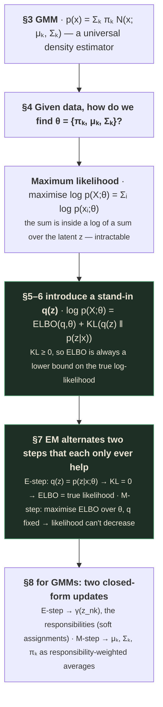
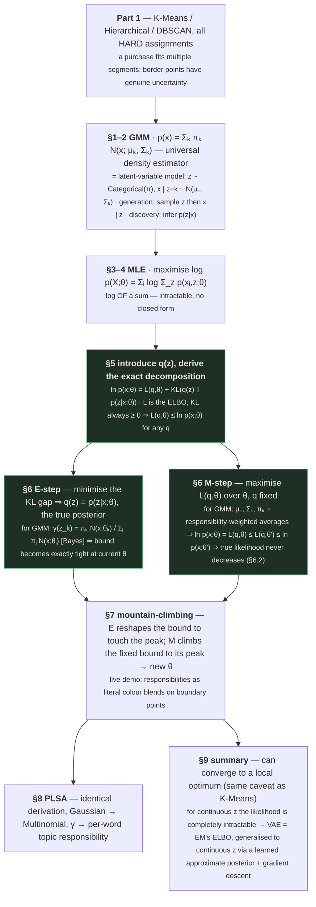

# Unsupervised Learning — Part 2
### Gaussian Mixture Models & the EM Algorithm: soft clustering, derived properly

---

## 📋 About this lecture and its capture

[Part 1's](unsupervised-learning-01.md) closing slide previewed this lecture twice — once directly
("Next: Gaussian Mixture Models — P(point ∈ cluster k) instead of hard assignment") and once through
its Mahalanobis-distance slide ("GMM learns one Mahalanobis ellipse per cluster — the only real
difference from K-Means"). Both previews are honoured here, but this lecture is narrower and deeper
than either preview suggests: it is **52 minutes spent entirely on one derivation**, done properly,
rather than a broad tour.

> ⚠️ **The deck's own Table of Contents promises more than this video delivers — read this before you
> go looking for content that isn't here.**
>
> ```
> Table of Contents
> 1. Notation
> 2. Gaussian Mixture Models & EM Algorithm    ← this lecture covers ONLY these two
> 3. Generative Modeling Overview
> 4. Variational Autoencoders
> 5. GANs
> 6. Diffusion Models
> 7. Flow Matching
> ```
>
> This video's captured content ends at the **GMM/EM summary slide**, whose final bullet reads
> *"Variational AutoEncoders (VAE) are a deep learning framework to optimize ELBO for continuous
> latents"* — a one-sentence forward pointer, not covered content. Sections 3–7 are not in this
> recording. This is the same pattern already seen twice in
> [Dimensionality Reduction](../Dimensionality%20Reduction/README.md): **a deck's own table of
> contents is a plan, not a guarantee of what one specific video actually delivers.** Sections 3–7 are
> presumably covered in Lecture 12 and/or 13, to be verified against those decks directly rather than
> assumed.

| | Section | Runtime | Covers |
|---|---|---|---|
| **A** | Notation | 0:00 – 9:23 | Shared notation for the rest of the Unsupervised Learning module |
| **B** | Gaussian Mixture Models | 9:23 – 21:00 | GMMs as a universal density estimator · GMMs as a latent-variable model · generation vs. discovery |
| **C** | Expectation-Maximization, derived | 21:00 – 45:40 | The likelihood-maximization problem · the ELBO/KL decomposition, derived in full · the E-step and M-step, derived · the mountain-climbing intuition · a live responsibility-visualization demo |
| **D** | Related topics & summary | 45:40 – 52:16 | Probabilistic Latent Semantic Analysis (PLSA) as GMM's discrete-data counterpart · closing summary |

Note on this table's own Section **A**: unlike Sections B–D, which each get a numbered `# PART` heading
in the body below, Section A's content (shared notation) is folded into **Prerequisite 1** instead —
notation is exactly the kind of thing a reader should have in view *before* the first numbered concept,
not a standalone teaching section in its own right. This is a deliberate structural choice, not a
missing section; the body accordingly runs `# PART B` → `# PART C` → `# PART D` with no `# PART A`.

Reconstructed from the raw capture in `output/`, the deck contains **50 distinct slide states**.

> ✅ **Capture quality: excellent, and unusually rigorous.** 50 raw frames over 52 minutes. Every
> content slide has a fully-built state, and — genuinely unusual for this course — **every major
> equation is captured with the instructor's live handwritten derivation annotations still visible on
> screen**: circled terms, arrows connecting symbols to their meaning, and a hand-drawn sketch of the
> monotonic-improvement guarantee. Where the deck's own printed slide gives an equation, and the
> instructor's live annotation adds an explanation of *why* that step holds, both are transcribed here.
> **No content gaps within what was captured.**
>
> The two instructors are **Dhruv Bhardwaj** (Applied Scientist II) and **Ayush Raj** (Applied
> Scientist) — both named on the title slide, continuing the recent trend of instructor attribution in
> this course after several unnamed decks in the Dimensionality Reduction and Unsupervised Learning
> modules.

---

## How to read this document

This lecture is a single, continuous argument, not a collection of independent topics — everything
after §3 (the GMM setup) exists to answer one question: **"How do you fit a GMM's parameters to data,
given that you never observe which Gaussian generated each point?"** The answer, Expectation-
Maximization, is derived from first principles rather than presented as a recipe, and the derivation is
the entire substance of the lecture.



If you are revising under time pressure: **§5–§8 are the interview core.** "Derive the EM algorithm
from the ELBO/KL decomposition" is one of the most commonly asked derivations in applied-scientist
interviews, and this lecture is an unusually clean source for it — reproduce the derivation, not just
the final formulas.

Everything in a `🧪 Worked example` block should be reproducible by you on paper.

---

## What you'll understand after reading this

- You'll be able to write the Gaussian Mixture Model as both a density estimator and a latent-variable
  generative model, and explain why those are the same object viewed two ways.
- You'll be able to **derive** the ELBO/KL decomposition of the log-likelihood from the definition of
  KL divergence, in full, symbol by symbol.
- You'll be able to explain, and prove, why the ELBO is always a lower bound on the true
  log-likelihood — and why that single fact is what makes EM's convergence guarantee possible.
- You'll be able to **derive the E-step and M-step from the ELBO/KL decomposition itself**, rather than
  quoting them as a memorized recipe, and explain precisely why each step can only ever help (not
  hurt) the true likelihood.
- You'll be able to state the closed-form E-step and M-step update equations for a GMM specifically,
  and explain what each symbol means in terms of soft cluster "responsibilities."
- You'll be able to explain the "mountain-climbing" intuition for EM, and connect every part of that
  analogy back to a specific term in the ELBO/KL decomposition.
- You'll be able to explain why EM guarantees monotonic non-decrease in likelihood but not convergence
  to a global optimum — the exact structural parallel to K-Means' own convergence guarantee.
- You'll be able to explain PLSA as GMM's counterpart for discrete (text) data, and map every piece of
  its E-step and M-step onto the corresponding GMM formula.

---

## Before we start: what you need to know

### Prerequisite 1 — The notation this entire module now shares

The deck opens with a shared notation slide explicitly intended to serve the *rest* of the
Unsupervised Learning module, not just this lecture — worth learning once and carrying forward:

> - *"$X$ is the set of training data, with $x_i, i=1,2,3,\ldots N$ and $x_i \in \mathcal{R}^d$ be the
>   training samples"*
> - *"$Y$ is the label or target set, with $y_i \in \mathcal{R}$ being the target/label corresponding
>   to $i^{th}$ training sample"*
> - *"Similar to $y_i$, we use $z_i$ to denote latent variables"*
> - *"We use $p(x), p(y)\ldots$ to denote the probability density functions (or distributions) of
>   their respective arguments"*
> - *"We use the words 'density' and 'distributions' interchangeably — both will mean probability
>   density functions"*
> - *"A distribution with parameters (like mean and variance of a gaussian) is denoted by $p(x;\theta)$
>   where $\theta$ are all the set of parameters"*
> - *"We denote $x \sim p(x)$ to mean that we sample a value (like generating a new image) from a
>   given distribution $p(x)$"*
> - *"Expectation is denoted (and defined) as $\mathbb{E}_{p(x)}[f(x)] := \int f(x)p(x)dx$"*
> - *"Expectation would usually be computed as
>   $\mathbb{E}_{p(x)}[f(x)] \approx \frac{1}{N}\sum_{i=1}^{N}f(x_i)$ with $x_i \sim p(x)$"*

> 💡 **The one notational choice worth internalising before anything else: $z$ is a first-class citizen
> of this module's vocabulary, on equal footing with $y$.** In supervised learning, $y$ is the thing
> you're given and trying to predict. In this module, $z$ is the thing you're *never* given and trying
> to infer anyway — a **latent variable**. Every algorithm from here through Variational Autoencoders
> (whenever that's covered) is, at bottom, a different strategy for inferring $z$ without ever
> observing it directly.

### Prerequisite 2 — KL divergence (recap)

[Dimensionality Reduction Part 2 §23–§24](../Dimensionality%20Reduction/dimensionality-reduction-02.md)
derived this in full; the one fact you need fresh here is the **non-negativity property**, because it
is the entire load-bearing mechanism of this lecture's central derivation:

$$\mathrm{KL}(q\,\|\,p) = \sum_z q(z)\log\frac{q(z)}{p(z)} \ge 0, \qquad \text{with equality iff } q = p$$

*Why it matters here:* §6 below builds an equation of the form
$\text{[true quantity]} = \text{[a lower bound]} + \mathrm{KL}(\cdot\|\cdot)$. Because that KL term can
never be negative, the lower bound can never exceed the true quantity — which is the single fact that
makes the entire EM algorithm's convergence guarantee possible. Everything else in the derivation is
bookkeeping around this one non-negativity fact.

### Prerequisite 3 — Marginalization and joint distributions

> **Marginalization** — recovering the distribution of one variable by summing (or integrating) a
> joint distribution over all values of another variable.
>
> $$p(x) = \sum_z p(x, z)$$
>
> *In everyday words:* if you know the *joint* probability of "it's raining AND I brought an umbrella"
> for every combination of weather and umbrella-carrying, you can recover "the probability it's
> raining" alone by adding up that joint probability across every umbrella-carrying possibility.
>
> *Why it matters here:* the entire GMM likelihood computation problem, in one sentence, is that you
> can easily write down the *joint* distribution $p(x, z; \theta)$ (which Gaussian, and which point,
> together) but you only ever *observe* $x$ — so computing $p(x;\theta)$ requires marginalizing $z$
> out, and that marginalization sum is exactly what makes direct likelihood maximization intractable
> (§4).

### Prerequisite 4 — Jensen's inequality and concavity of log (recap)

You met the *consequence* of this fact in
[Dimensionality Reduction Part 2 §23.3](../Dimensionality%20Reduction/dimensionality-reduction-02.md)
(Gibbs' inequality, proving $\mathrm{KL}\ge0$). The one-line statement worth having ready: for a
concave function like $\log$, and any probability distribution $q$,

$$\log\left(\mathbb{E}_q[f]\right) \ge \mathbb{E}_q[\log f]$$

*Why it matters here:* this inequality is the standard *alternative* route to deriving the ELBO bound
(via "Jensen's inequality applied directly to the log-likelihood"), and you will see it referenced in
other treatments of EM. This lecture instead derives the identical bound via the KL-divergence route
(§6), which is algebraically more transparent about exactly *how tight* the bound is at any given $q$
— but the two derivations arrive at the same inequality, and recognising that they're the same result
by two routes is worth being able to say in an interview.

---

## The big picture

[Part 1](unsupervised-learning-01.md) built three clustering algorithms — K-Means, Hierarchical,
DBSCAN — all of which produce **hard** assignments: every point belongs to exactly one cluster, full
stop. The closing slide of that lecture named the cost of that choice directly: *"a purchase fits
multiple segments. A document spans multiple topics. Border points have genuine uncertainty."* Real
ambiguity gets forced into an artificial, overconfident single label.

**This lecture's entire purpose is to remove that limitation, and to do it by turning clustering into
genuine probabilistic inference.** A Gaussian Mixture Model doesn't ask "which cluster does this point
belong to?" — it asks **"what is the probability this point was generated by each cluster?"**, and
answers with a full probability distribution over cluster membership rather than one hard label. That
single reframing is what §3's Mahalanobis-distance connection from Part 1 already told you was coming:
K-Means assumes one shared, spherical distance metric for every cluster; GMM lets every cluster learn
its own full covariance — its own **Mahalanobis ellipse** — and, crucially, assigns *soft, fractional*
membership rather than a hard vote.

**But making that reframing work requires solving a genuinely hard estimation problem, and that
problem — not the GMM formula itself — is what consumes the bulk of this lecture.** You can write down
a GMM's density formula in one line (§3). Fitting its parameters to data is a different matter
entirely, because the natural thing you'd want to do — maximize the likelihood of the observed data
directly — turns out to be **computationally intractable**, for a structural reason (§4): the unknown
cluster assignment $z$ sits *inside* a logarithm of a sum, and there is no closed-form way to
differentiate that and solve for the optimal parameters directly.

**Expectation-Maximization is the general answer to this exact structural problem**, and this lecture's
real achievement is deriving it properly rather than handing you the two update formulas as a recipe
to memorize. The derivation has a genuinely elegant shape: introduce a placeholder distribution $q(z)$
for the thing you don't know, decompose the true log-likelihood into **a lower bound you can actually
optimize** plus **a KL-divergence penalty term that is always non-negative**, and then alternate two
steps — one that makes the bound tight (the E-step), one that raises the bound (the M-step) — each of
which can only ever help, never hurt, the true quantity you actually care about. **The GMM's specific
E-step and M-step formulas (§8) are simply what this general machinery produces when you plug in a
mixture-of-Gaussians model** — the same derivation, specialized.

### The whole lecture in one diagram

```mermaid
flowchart TD
    P1["<b>Part 1 closing</b> — K-Means / Hierarchical / DBSCAN, all HARD assignments"]
    P1 --> Q["<b>What if cluster membership is genuinely uncertain?</b><br/><small>model it as a probability, not a label</small>"]
    Q --> G["<b>§3 GMM</b> · p(x) = Σₖ πₖ N(x; μₖ, Σₖ)<br/><small>a universal density estimator · also a latent-variable model: z ~ Categorical(π), x | z=k ~ N(μₖ, Σₖ)<br/>generation: sample z then x | z · discovery: given x, infer p(z|x) — the soft cluster</small>"]
    G --> ML["<b>§4 fit θ by maximum likelihood</b> · log p(X;θ) = Σᵢ log Σ_z p(xᵢ,z;θ)<br/><small>log OF a sum — no closed form, intractable</small>"]
    ML --> DEC["<b>§5–6 introduce q(z), decompose exactly</b> · ln p(X;θ) = L(q,θ) + KL(q(z) ‖ p(z|x))<br/><small>KL always ≥ 0 ⇒ L(q,θ) is always a lower bound (the ELBO)</small>"]
    DEC --> EM["<b>§7 EM — two provably non-decreasing moves</b><br/><small>E-step: q(z) = p(z|x;θ) → KL → 0 → bound = true likelihood<br/>M-step: maximise L(q,θ) over θ, q fixed → likelihood can't drop<br/>'mountain-climbing': reshape the bound to touch the peak (E), then climb the bound (M)</small>"]
    EM --> CF["<b>§8 for GMMs, closed form</b><br/><small>E-step → γ(z_nk), the responsibility: soft P(point n ∈ cluster k)<br/>M-step → μₖ, Σₖ, πₖ re-estimated as responsibility-weighted averages</small>"]
    CF --> PLSA["<b>§9 PLSA</b> — the same derivation on discrete text (Gaussian → Multinomial; γ → per-word topic responsibility)"]
    classDef k fill:#1E3025,stroke:#4FA073,color:#EDE6D7
    class DEC,EM k
```



---

# PART B — Gaussian Mixture Models

*9:23 – 21:00*

---

## 1. GMMs as an estimate of an arbitrary density

> *"Real life data will likely have arbitrary distributions. Unlikely to be modelled by known
> statistical distributions. We can produce complex distributions by combining arbitrary number of
> Gaussians, and adjusting their means and (co)variances."* [slide 12]

$$\boxed{p(x) = \sum_{k=1}^{K} w_k\,\mathcal{N}(x; \mu_k, \Sigma_k)}$$

| Symbol | Read it as | What it means |
|---|---|---|
| $p(x)$ | "p of x" | The **mixture density** — the total probability density at point $x$ |
| $K$ | "K" | Number of Gaussian components (mixture components), a hyperparameter you choose |
| $w_k$ | "w sub k" | **Mixture weight** — how much of the total density component $k$ contributes. Must satisfy $\sum_k w_k = 1$, $w_k \ge 0$ |
| $\mathcal{N}(x; \mu_k, \Sigma_k)$ | "Gaussian of x with mean mu k, covariance Sigma k" | The $k$-th Gaussian component's density at $x$ |
| $\theta$ | "theta" | Every parameter of the model, collected together: all the means, covariances, and weights |

> *"Here, $\theta = \{\mu_k, \Sigma_k, w_k\}; k=1,2,\ldots K$ are the parameters of the model, which
> need to be estimated."*
>
> *"Given a few samples from the dataset $\mathcal{D} := \{x_i; i=1,2,\ldots N\}$, we estimate the
> parameters $\theta$ using Maximum Likelihood Estimation (MLE), which leads to the
> Expectation-Maximization (EM) algorithm."*

The deck's own figure shows exactly what this buys you: an arbitrary, genuinely bimodal density
$p(x)$ — a tall narrow peak near $x{=}0$ and a shorter, wider bump near $x{=}4$ — that no single named
distribution (Gaussian, exponential, uniform) could represent, but which is exactly reproducible as a
weighted sum of two ordinary Gaussians.

> 💡 **This is the "universal approximator" framing, and it's worth being explicit about why it
> works.** A single Gaussian is a very restrictive shape — one hump, symmetric, fully described by a
> mean and a covariance. But *nothing* stops you from adding several of them together with different
> means, shapes, and weights. With enough components $K$, a Gaussian mixture can approximate
> essentially **any** smooth density to arbitrary accuracy — the same universality argument that
> [Deep Neural Networks Part
> 1](../Deep%20Neural%20Networks/deep-neural-networks-01.md)'s Universal Approximation discussion made
> for neural networks, here applied to probability densities instead of functions.

---

## 2. GMMs as latent variable models

> *"We assume that the data we observe is only part of the true picture. There is an underlying true
> state of nature, which is hidden, and we model this by a latent variable $z$ with distribution
> $p(z)$. It is the latent which generates the observable data, and together both form 'complete'
> data."* [slide 17]
>
> *"We now look at $p(x)$ as $p(x) = \sum_z p(z)p(x|z)$"*
>
> *"So, for example, we can write $p(x) := \sum_{k=1}^{K}\pi_k\mathcal{N}(x;\mu_k,\Sigma_k)$, where
> $z \sim \mathrm{Categorical}(\pi_1,\pi_2,\ldots,\pi_K)$, $\sum_{k=1}^{K}\pi_k = 1$"*
>
> *"This is again a GMM, with weights $w_k$ being $\pi_k$ or $p(z=k)$"*

**This is the same GMM formula from §1, rewritten to expose its generative story.** The weight $w_k$
from §1 is now understood as $\pi_k = p(z=k)$ — the *prior probability* that a random point comes from
component $k$ at all, **before** you've seen anything about $x$. The deck's own hand-drawn annotation
sketches exactly this: a discrete probability distribution over $z \in \{0, 1\}$ (or more generally
$\{1,\ldots,K\}$) with example values like $0.2$ and $0.8$ marked directly on a number line — literally
$p(z)$, drawn as a bar chart over discrete outcomes.

> *"Modelling with this abstraction allows two things: **Generation**, and **Discovery**."*
>
> - *"**Generation:** $z$ is discrete, it can only take one of the $K$ values. Sample $z$. If $z=k$,
>   choose $k^{th}$ gaussian and sample $x$ from $\mathcal{N}(x;\mu_k,\Sigma_k)$"*
> - *"**Discovery:** We use dataset $\mathcal{D}$ to learn $p(z)$, which gives us a compressed/
>   structured form of $X$ itself (useful when $z$ is a vector)"*
>
> *"This model also simplifies the mathematics behind the EM algorithm"*

> 💡 **"Generation" and "Discovery" are the two directions of the exact same model, and naming both
> explicitly is the whole point of this reframing.** Forward (generation): flip a $K$-sided weighted
> coin to pick a component, then sample from that component's Gaussian — this is how you'd draw new
> synthetic data from a fitted GMM. Backward (discovery): given an observed $x$, infer how likely each
> component is to have been the one that generated it — this is the "soft clustering" that makes GMM
> more expressive than K-Means, and it is exactly $p(z|x)$, the quantity §7's E-step computes.
>
> This same generation/discovery duality — a model that can both sample new data *and* infer latent
> structure from observed data — is the organising idea behind everything the deck's own Table of
> Contents lists next (VAEs, GANs, diffusion models). GMM is the simplest possible instance of that
> pattern, which is exactly why it's the right place to build the intuition properly before those
> larger models arrive.

### 📚 Background the slide assumed — the Categorical distribution

> **Categorical distribution** — the generalization of a coin flip (Bernoulli) to $K$ possible
> outcomes instead of 2.
>
> *In everyday words:* a $K$-sided weighted die. Roll it, and outcome $k$ comes up with probability
> $\pi_k$.
>
> *Concretely:* $z \sim \mathrm{Categorical}(0.2, 0.5, 0.3)$ means $z=1$ with probability 0.2, $z=2$
> with probability 0.5, $z=3$ with probability 0.3 — and these three numbers must sum to exactly 1.
>
> *Why it exists here:* it's the natural discrete distribution for "which of $K$ clusters generated
> this point," and it's the distribution that gets swapped for a Multinomial when the deck later
> connects this to text data (§9's PLSA).

---

# PART C — Expectation-Maximization, Derived

*21:00 – 45:40*

---

## 3. Expectation Maximization (EM) — I: the problem

> *"In supervised learning, neural networks learn by maximizing the likelihood of observed data (the
> training set) — the parameters of the output distribution are encoded in the neural network."*
> [slide 24]
>
> *"In unsupervised learning, if we model our observed data as a $p(x;\theta)$ it is not always
> possible to compute exact likelihood, let alone maximize it."*
>
> *"Latent variable modelling along with EM allows us to approximate this likelihood, and atleast not
> decrease it."*
>
> *"Thus, we look at EM as a general technique for ML estimation of parameters of latent variable
> models ($\theta$ in case of GMMs we saw before)."*
>
> *"While closed-form iterates for EM on GMMs can be derived, this view drives a better intuition."*

**What "maximize the likelihood" means, made precise:**

$$\mathcal{L}(\theta) = \prod_{i=1}^{N} p(x_i;\theta) \qquad\qquad \log\mathcal{L}(\theta) = \sum_{i=1}^{N}\log p(x_i;\theta)$$

| Symbol | Read it as | What it means |
|---|---|---|
| $\mathcal{L}(\theta)$ | "the likelihood of theta" | How probable the *entire observed dataset* is, under a specific choice of parameters $\theta$ — the product of every individual point's density, since points are assumed independent |
| $\log\mathcal{L}(\theta)$ | "the log-likelihood" | The same quantity, but with the product turned into a sum via $\log$, which is what you actually differentiate in practice |

> 📚 **Background the slide assumed — why take the log at all?** Products of many small probabilities
> underflow numerically (multiply a thousand numbers each around 0.1 and you hit the limits of
> floating-point representation almost immediately), and products are awkward to differentiate term by
> term. $\log$ is **monotonically increasing**, so maximizing $\log\mathcal{L}(\theta)$ and maximizing
> $\mathcal{L}(\theta)$ have the exact same maximizer $\theta^*$ — you lose nothing by working with the
> log, and gain both numerical stability and a sum (via $\log$ of a product $=$ sum of $\log$s) that's
> vastly easier to differentiate.

**Why this is easy in supervised learning and hard here.** In supervised learning, you observe both
$x$ and $y$, and the neural network directly parameterizes $p(y|x;\theta)$ — a single, known
distribution with no missing piece. Here, per §2, the true generative story involves a *latent* $z$ you
never observe. The next slide shows exactly what that costs you.

---

## 4. Expectation Maximization (EM) — II: complete data

> *"We again assume observed data $X$ is generated by an underlying latent variable $Z$. So
> $(x,z) \sim p(x,z)$ is complete data sampled from its joint distribution. We are interested in
> $p(x;\theta)$, and for the correct $\theta$, we want to generate new samples from $p(x;\theta)$."*
> [slide 26]
>
> *"We can also write the following by marginalisation:"*
>
> $$p(x;\theta) = \sum_z p(x,z;\theta)$$

**This is the crux of the whole difficulty, and it's worth being completely explicit about why.**
Substitute this marginalization into the log-likelihood sum from §3:

$$\log\mathcal{L}(\theta) = \sum_{i=1}^{N}\log\left(\sum_z p(x_i, z;\theta)\right)$$

**The sum over $z$ is trapped *inside* the logarithm.** For a single Gaussian (no latent variable at
all), $\log p(x;\theta)$ is a clean, differentiable expression you can maximize with calculus directly.
But $\log$ of a *sum* has no such clean form — you cannot distribute the $\log$ across the sum's terms
(that identity only works for products, not sums), so there is no closed-form expression for
$\partial/\partial\theta$ of this quantity that you can simply set to zero and solve. **This is the
precise, structural reason direct maximum-likelihood estimation is intractable for latent-variable
models, and it's why an entirely different algorithmic strategy — EM — is needed.**

---

## 5. Expectation Maximization (EM) — III: introducing $q(z)$

> *"Now for a dataset $X := \{x_i, i=1,2,\ldots N\}$, we can write:"* [slide 32]
>
> $$\underbrace{\ln p(X;\theta) = \sum_i \ln \sum_z p(x,z;\theta)}_{\text{Log-likelihood (Evidence)}}$$
>
> *"We know nothing about $p(z)$, but let us say we think it is $q(z)$. We introduce this in above
> equation and simplify as:"*
>
> $$\underbrace{\ln p(X;\theta) = \mathcal{L}(q,\theta) + \mathrm{KL}(q(z)\|p(z|x))}_{\text{Log likelihood}}$$
>
> $$\underbrace{\mathcal{L}(q,\theta) = \sum_z q(z)\log\frac{p(x,z;\theta)}{q(z)} = \mathbb{E}_{q(z)}\left[\log\frac{p(x,z;\theta)}{q(z)}\right]}_{\text{ELBO (Evidence Lower Bound)}}$$
>
> *"Since the second term in (1) is a KL divergence ($\ge 0$), we always have
> $\mathcal{L}(q,\theta) \le \ln p(X;\theta)$."*

**This is the single most important equation in the lecture. Derive it in full**, because being able
to reproduce this derivation from scratch is the actual interview-tested skill, not just quoting the
result.

**Start from the true log-likelihood for one data point** (the sum over $i$ works identically for
every point, so drop the index for clarity):

$$\ln p(x;\theta) = \ln \sum_z p(x,z;\theta)$$

**Introduce $q(z)$ by multiplying and dividing by it inside the sum** — a step that changes nothing
algebraically, since $q(z)/q(z) = 1$ everywhere $q(z) > 0$:

$$= \ln \sum_z q(z)\,\frac{p(x,z;\theta)}{q(z)}$$

**Recognise the sum as an expectation under $q(z)$**, and apply the fact that $\ln$ is a concave
function (Prerequisite 4's Jensen's inequality would take you directly to a lower bound here — but the
deck's derivation instead proceeds by an *exact* algebraic decomposition, which is more informative
because it tells you exactly what's being lost, not just that something is):

$$\ln p(x;\theta) = \ln\mathbb{E}_{q(z)}\left[\frac{p(x,z;\theta)}{q(z)}\right]$$

**Now split $p(x,z;\theta)$ using the chain rule of probability**, $p(x,z;\theta) = p(z|x;\theta)p(x;\theta)$:

$$\ln p(x;\theta) = \sum_z q(z)\log\frac{p(x,z;\theta)}{q(z)} + \sum_z q(z)\log\frac{q(z)}{p(z|x;\theta)}$$

**Verify this split is exact by adding the two terms back together:**

$$\sum_z q(z)\log\frac{p(x,z;\theta)}{q(z)} + \sum_z q(z)\log\frac{q(z)}{p(z|x;\theta)} = \sum_z q(z)\log\left[\frac{p(x,z;\theta)}{q(z)}\cdot\frac{q(z)}{p(z|x;\theta)}\right]$$

$$= \sum_z q(z)\log\frac{p(x,z;\theta)}{p(z|x;\theta)} = \sum_z q(z)\log p(x;\theta) = \log p(x;\theta)\underbrace{\sum_z q(z)}_{=1} = \log p(x;\theta) \quad\checkmark$$

using $p(x,z;\theta)/p(z|x;\theta) = p(x;\theta)$ (Bayes' rule, rearranged) and the fact that $q(z)$ is a
valid probability distribution, so it sums to 1. **The decomposition is exact — an identity, not an
approximation.** $\blacksquare$

**Now name the two terms.** The first is the **ELBO** (Evidence Lower BOund), $\mathcal{L}(q,\theta)$.
The second is, by inspection, exactly the definition of $\mathrm{KL}(q(z)\|p(z|x;\theta))$ — the KL
divergence between your chosen stand-in distribution $q(z)$ and the *true* posterior $p(z|x;\theta)$.

**And here is where Prerequisite 2 does all the remaining work.** Since KL divergence is always
$\ge 0$:

$$\boxed{\mathcal{L}(q,\theta) \le \ln p(x;\theta), \text{ for ANY choice of } q(z)}$$

**The ELBO is a lower bound on the true log-likelihood, no matter what distribution $q(z)$ you pick.**
And the *gap* between the bound and the truth is exactly $\mathrm{KL}(q(z)\|p(z|x;\theta))$ — which
means the bound becomes **exactly tight** (gap of zero) precisely when $q(z)$ equals the true posterior
$p(z|x;\theta)$.

### 🧪 The picture that makes this concrete

The deck's own figure draws this decomposition as a physical picture, and it's worth holding onto: two
horizontal bars, the top one (red) labeled $\ln p(X|\theta)$ (the true log-likelihood — a fixed
quantity, given $\theta$), the bottom one (blue) labeled $\mathcal{L}(q,\theta)$ (the ELBO — a movable
quantity, depending on your choice of $q$). The vertical gap between them, marked $\mathrm{KL}(q\|p)$,
is always $\ge 0$, so the blue bar can never rise above the red one. Moving $q(z)$ around slides the
blue bar up and down; it can get arbitrarily close to touching the red bar (when $q$ matches the true
posterior exactly) but never cross above it.

> 💡 **This single picture is the entire conceptual payload of EM, and being able to redraw it from
> memory is worth more than memorizing either update formula.** Everything in §7 is just: *"pick a
> clever sequence of moves for the blue bar and for $\theta$ (which moves the red bar too) such that
> the red bar's height — the thing you actually care about — never goes down."*

---

## 6. Expectation Maximization (EM) — IV: the E-step and M-step

> *"Finally we are define the iterative E and M steps for EM Algorithm"* [slide 40]
>
> $$\ln p(x;\theta) = \mathcal{L}(q,\theta) + \mathrm{KL}(q(z)\|p(z|x))$$
>
> *"**E Step:** For current $\theta$, reduce $\mathrm{KL}(q\|p)$ to 0. So $q(z) = p(z|x)$"*
>
> $$\underbrace{\gamma(z_k) := p(z_k=1|x;\theta) = \frac{p(z_k=1)p(x|z_k=1;\theta)}{\sum_{j=1}^{K}p(z_j=1)p(x|z_j=1;\theta)} = \frac{\pi_k\mathcal{N}(x;\theta_k)}{\sum_{j=1}^{K}\pi_j\mathcal{N}(x;\theta_j)}}_{\text{E step for GMMs (compute latent posterior)}}$$
>
> *"At the end of E step, you have found a $q(z)$ which makes ELBO equal to the actual data (log)
> likelihood"*
>
> *"**M Step:** Find new $\theta'$, at which ELBO (of previous E step) has maxima"*
>
> $$\underbrace{\mu_k = \frac{1}{N_k}\sum_{n=1}^{N}\gamma(z_{nk})x_n;\quad \Sigma_k = \frac{1}{N_k}\sum_{n=1}^{N}\gamma(z_{nk})(x_n-\mu_k)(x_n-\mu_k)^T}_{\text{M step for GMMs (compute new parameters }\theta'\text{)}}$$
>
> $$N_k = \sum_{n=1}^{N}\gamma(z_{nk}); \qquad \pi_k = \frac{N_k}{N}$$
>
> *"Since ELBO was made equal to likelihood at E step, and then maximized w.r.t. $\theta$, true
> likelihood could not have decreased."*

### 6.1 Derive the E-step's logic from the decomposition itself

**This is not a separate idea — it is a direct, mechanical consequence of §5's identity.** Fix $\theta$
at its current value. The true log-likelihood $\ln p(x;\theta)$ **does not depend on $q(z)$ at all** —
only $\mathcal{L}(q,\theta)$ and $\mathrm{KL}(q\|p)$ do, and they must always sum to that same fixed
value. So: **to make the ELBO as large as possible without changing $\theta$, you must make the KL
term as small as possible** — and since KL is minimized (at exactly zero) precisely when the two
distributions being compared are equal, the optimal choice is

$$q(z) = p(z|x;\theta)$$

**the true posterior, computed at the current $\theta$.** For a GMM specifically, computing this
posterior is Bayes' rule applied directly: the probability that component $k$ generated point $x$,
given the current parameter estimates, is the prior $\pi_k$ times the likelihood
$\mathcal{N}(x;\mu_k,\Sigma_k)$ of $x$ under that specific component, normalized by summing the same
quantity over every possible component $j$. This quantity is named $\gamma(z_k)$ — the
**responsibility** — and it is the *soft* cluster assignment GMM promised: not "point $x$ belongs to
cluster $k$" but "cluster $k$ is $\gamma(z_k)$-responsible for point $x$," a real number in $[0,1]$.

### 6.2 Derive the M-step's logic from the decomposition itself

**Now the roles reverse.** With $q(z)$ fixed at the posterior just computed in the E-step, find the new
$\theta'$ that **maximizes the ELBO** $\mathcal{L}(q,\theta)$ over $\theta$. Because we just made
$\mathcal{L}(q,\theta) = \ln p(x;\theta)$ *exactly* (the KL gap was driven to zero), and because
$\mathcal{L}(q,\theta') \le \ln p(x;\theta')$ always holds (§5's boxed inequality, true for *any* $q$,
including this one), you get a chain of inequalities that is the entire convergence guarantee:

$$\ln p(x;\theta) = \mathcal{L}(q,\theta) \le \mathcal{L}(q,\theta') \le \ln p(x;\theta')$$

*Read left to right:* the true likelihood at the old $\theta$ equals the ELBO at the old $\theta$
(because the E-step just made that gap zero); the ELBO can only get **larger or equal** at the new
$\theta'$, because $\theta'$ was chosen specifically to maximize it; and the ELBO at the new $\theta'$
is, by §5's universal inequality, still a lower bound on the true likelihood at $\theta'$. **Chain all
three together and the true likelihood at $\theta'$ must be at least as large as the true likelihood at
$\theta$.** $\blacksquare$

$$\boxed{\ln p(x;\theta') \ge \ln p(x;\theta) \quad\text{— the true likelihood never decreases, across any single EM iteration}}$$

### 🧪 Worked example — one E-step and one M-step, by hand

Everything above has been symbols. Here are actual numbers, so the responsibility formula and the
M-step updates stop being abstract.

**Setup.** $K=2$ components in 1-D, $\pi_1=\pi_2=0.5$, $\mu_1=0,\ \sigma_1^2=1$, $\mu_2=3,\
\sigma_2^2=1$. Four data points: $x = \{-1,\ 0,\ 1,\ 4\}$. Write $\phi = \frac{1}{\sqrt{2\pi}}
\approx 0.39894$, so $\mathcal{N}(x;\mu,1) = \phi\, e^{-(x-\mu)^2/2}$.

**E-step — compute $\gamma(z_1)$ for every point, using §6.1's formula.**

| $x_n$ | $\mathcal{N}(x_n;0,1)$ | $\mathcal{N}(x_n;3,1)$ | $\gamma(z_{n1}) = \frac{\pi_1\mathcal{N}_1}{\pi_1\mathcal{N}_1+\pi_2\mathcal{N}_2}$ | $\gamma(z_{n2})=1-\gamma(z_{n1})$ |
|---|---|---|---|---|
| $-1$ | $\phi e^{-0.5}=0.24197$ | $\phi e^{-8}=0.000134$ | $\mathbf{0.9994}$ | $0.0006$ |
| $0$ | $\phi e^{0}=0.39894$ | $\phi e^{-4.5}=0.00443$ | $\mathbf{0.9890}$ | $0.0110$ |
| $1$ | $\phi e^{-0.5}=0.24197$ | $\phi e^{-2}=0.05399$ | $\mathbf{0.8176}$ | $0.1824$ |
| $4$ | $\phi e^{-8}=0.000134$ | $\phi e^{-0.5}=0.24197$ | $\mathbf{0.0006}$ | $0.9994$ |

Because $\pi_1=\pi_2$, the $\pi$'s cancel and $\gamma(z_{n1})$ reduces to the *relative* likelihood of
$x_n$ under component 1 versus component 2 — exactly why $x=-1$ and $x=0$ (both much closer to $\mu_1=0$
than to $\mu_2=3$) get responsibilities near 1, $x=4$ (far closer to $\mu_2$) gets a responsibility near
0, and $x=1$ (roughly equidistant, but still nearer 0 than 3) lands at a genuinely intermediate
$0.8176$ — a real fractional, "mostly-but-not-entirely" assignment, which is the entire point of soft
clustering.

**M-step — plug these responsibilities into §6's boxed update formulas.**

$$N_1 = \sum_n \gamma(z_{n1}) = 0.9994+0.9890+0.8176+0.0006 = 2.8066, \qquad N_2 = 4-N_1 = 1.1934$$

$$\mu_1' = \frac{1}{N_1}\sum_n\gamma(z_{n1})x_n = \frac{0.9994(-1)+0.9890(0)+0.8176(1)+0.0006(4)}{2.8066} = \frac{-0.1794}{2.8066} = \mathbf{-0.064}$$

$$\mu_2' = \frac{1}{N_2}\sum_n\gamma(z_{n2})x_n = \frac{0.0006(-1)+0.0110(0)+0.1824(1)+0.9994(4)}{1.1934} = \frac{4.1794}{1.1934} = \mathbf{3.502}$$

$$\pi_1' = N_1/4 = \mathbf{0.702}, \qquad \pi_2' = N_2/4 = \mathbf{0.298}$$

**Read the result.** Both means barely moved ($\mu_1: 0\to-0.064$, $\mu_2: 3\to3.502$) — this
particular starting guess was already close to the data's real structure, so one iteration mostly
confirms it rather than dramatically correcting it. The more interesting number is $\pi_1'=0.702$: even
though the true generating mixture might be closer to 50/50, three of the four points in this tiny
sample ($-1,0,1$) sit nearer component 1, and the M-step's weighted count $N_1=2.81$ (out of 4 points)
faithfully reflects that — a concrete instance of "$N_k$ is the *effective number of points* softly
belonging to component $k$," not a hard count. (A full covariance update, $\Sigma_k'$, follows the
identical weighted-average pattern and is omitted here only for brevity — every weight is already
computed above.)

### 🧪 Why the specific GMM M-step formulas are what they are

The M-step formulas ($\mu_k$, $\Sigma_k$, $\pi_k$) look like ordinary weighted averages, and that is
exactly what they are — but it's worth seeing *why*. Maximizing the ELBO
$\mathbb{E}_{q(z)}[\log p(x,z;\theta)]$ over $\theta$, for a Gaussian mixture, reduces to a **weighted
maximum-likelihood** problem: each data point $x_n$ contributes to component $k$'s parameter estimates
in proportion to how *responsible* component $k$ was for generating it, $\gamma(z_{nk})$. That's
precisely a weighted mean ($\mu_k$), a weighted covariance ($\Sigma_k$), and a weighted count
($N_k$, the "effective number of points" softly belonging to component $k$) — with the weights being
exactly the responsibilities the E-step just computed.

> 💡 **Compare this directly to K-Means' own update rule, from
> [Part 1 §5](unsupervised-learning-01.md).** K-Means' centroid update is $\mu_k = \frac{1}{|C_k|}
> \sum_{x\in C_k}x$ — a plain, unweighted average over points **hard**-assigned to cluster $k$. GMM's
> M-step is $\mu_k = \frac{1}{N_k}\sum_n\gamma(z_{nk})x_n$ — a **soft**-weighted average over *every*
> point, weighted by how responsible cluster $k$ is for each one. **K-Means is the special case of
> GMM's M-step where every responsibility $\gamma(z_{nk})$ has collapsed to exactly 0 or 1** — hard
> assignment is soft assignment with all the softness squeezed out. This equivalence is provable
> rigorously (it emerges as the limit of GMM with shared, shrinking-to-zero covariance across all
> components), and it's an excellent thing to be able to state precisely in an interview.

---

## 7. Expectation Maximization: what is actually happening?

> *"The mountain-climbing analogy:"* [slide 44]
>
> - *"We want to climb the log-likelihood mountain $\ln p(x;\theta)$, but it is too rugged to climb
>   directly."*
> - *"ELBO $\mathcal{L}(q,\theta)$ is a **lower bound** — imagine a curve that always sits below the
>   mountain and touches it from below."*
> - *"**E-step:** re-shape the lower bound (by choosing a new $q$) so that it touches the mountain at
>   our current $\theta$."*
> - *"**M-step:** holding the lower bound fixed, climb to its highest point — that gives us a new
>   $\theta$."*
> - *"Because the bound was touching at start, the new $\theta$ has likelihood at least as high as
>   before — the monotonic non-decrease guarantee."*
> - *"**GMM-specific reading:** the responsibilities $\gamma(z_{nk})$ are 'soft cluster assignments' —
>   what fraction of point $n$ belongs to cluster $k$. The M-step then re-fits each Gaussian to its
>   weighted points."*

**This analogy maps onto every symbol in §5–§6's derivation, and tracing the map explicitly is worth
doing once, carefully:**

| Analogy term | Formal object | What it's doing |
|---|---|---|
| The mountain | $\ln p(x;\theta)$ | The true log-likelihood, as a (generally non-convex, "rugged") function of $\theta$ — the actual quantity you want to maximize |
| The lower-bound curve | $\mathcal{L}(q,\theta)$ | The ELBO, as a function of $\theta$ for a *fixed* $q$ — always sits at or below the mountain, per §5's boxed inequality |
| Re-shaping the curve to touch at the current point | The E-step | Choosing $q(z) = p(z|x;\theta)$, which drives the KL gap to exactly zero *at the current $\theta$* |
| Climbing the (now-fixed) curve to its peak | The M-step | Maximizing $\mathcal{L}(q,\theta)$ over $\theta$, with $q$ held fixed from the E-step |
| "The new θ has likelihood at least as high as before" | The monotonic non-decrease guarantee | Exactly the three-inequality chain proven in §6.2 |

The deck's own hand-drawn sketch at the bottom of this section — a jagged, rising curve plotted against
successive values of $\theta, \theta', \theta'', \ldots$ — is a small picture of this guarantee playing
out over multiple iterations: the true likelihood value never dips, step after step, even though it
may climb in uneven-sized jumps and may plateau for a while before jumping again.

### 🧪 Live demo — GMM responsibilities visualised

The deck's own figure, captioned *"GMM responsibilities — each point's color is its soft
assignment,"* shows three roughly-Gaussian blobs of points (blue, green, orange), with three white ✕
markers at their fitted centroids, and — critically — **individual points near the boundary between
two blobs are coloured as visible blends** rather than one solid colour, directly visualising a
fractional responsibility (e.g. a point that is 60% blue-cluster, 40% green-cluster gets drawn as a
genuine blend of the two colours, not forced to pick one).

> 💡 **This is the single clearest visual demonstration of "soft vs hard clustering" available, and
> it's worth contrasting directly against [Part 1's](unsupervised-learning-01.md) hard-clustering
> figures.** Every K-Means/Hierarchical/DBSCAN figure in Part 1 shows points as solid, single-coloured
> dots — every point has exactly one home. Here, a point sitting genuinely between two clusters is
> drawn as *genuinely* between two colours, because its responsibility vector $\gamma(z_n) =
> [\gamma(z_{n1}), \gamma(z_{n2}), \gamma(z_{n3})]$ is genuinely split, e.g. $[0.55, 0.40, 0.05]$ rather
> than a one-hot $[1, 0, 0]$. **The visualization is not a stylistic choice — it's a direct, faithful
> rendering of what the E-step actually computed for that point.**

---

# PART D — Related Topics & Summary

*45:40 – 52:16*

---

## 8. Related topics: Probabilistic Latent Semantic Analysis (PLSA)

> *"PLSA a discrete mixture model trained with EM. It is a GMM's counterpart for discrete (text)
> data."* [slide 47]
>
> *"Each document $d$ is a mixture of $K$ topics; each topic $k$ is a distribution over words $w$."*
>
> $$\underbrace{p(w|d) = \sum_{k=1}^{K}p(z=k|d)\,p(w|z=k)}_{\text{PLSA}}$$
>
> *"**Compare with GMM:** $p(x) = \sum_{k=1}^{K}\pi_k\mathcal{N}(x;\mu_k,\Sigma_k)$. (Gaussian is
> replaced with Multinomial distribution)."*
>
> *"Training uses EM with identical logic:"*
>
> *"**E Step:** compute topic responsibility for each word in each document:"*
>
> $$\gamma(z_k) := p(z=k|w,d) = \frac{p(z=k|d)\,p(w|z=k)}{\sum_j p(z=j|d)\,p(w|z=j)}$$
>
> *"**M Step:** re-estimate topic-word and document-topic distributions from responsibilities:"*
>
> $$p(w|z=k) \propto \sum_d n(d,w)\gamma(z_k) \qquad\qquad p(z=k|d) \propto \sum_w n(d,w)\gamma(z_k)$$

**This is the identical derivation from §5–§6, applied to a different observation model — and being
able to see that instantly, rather than treating PLSA as a separate algorithm to memorize, is the whole
point of this section.**

| | **GMM** | **PLSA** |
|---|---|---|
| Observed data | A continuous point $x \in \mathbb{R}^d$ | A word $w$, observed within a specific document $d$ |
| Latent variable | $z$ = which Gaussian component generated $x$ | $z$ = which topic generated this particular word occurrence |
| Component/topic prior | $\pi_k = p(z=k)$, shared across all data | $p(z=k\|d)$ — **document-specific**: each document has its own mixture of topics |
| Component/topic distribution | $\mathcal{N}(x;\mu_k,\Sigma_k)$ — a Gaussian over continuous space | $p(w\|z=k)$ — a **Multinomial** over the discrete vocabulary |
| E-step output | $\gamma(z_k)$ — responsibility of component $k$ for point $x$ | $\gamma(z_k)$ — responsibility of topic $k$ for this word occurrence |
| M-step | Weighted mean/covariance, weighted by responsibility | Weighted word-counts, weighted by responsibility |

**The one genuine structural difference worth naming explicitly:** GMM has a **single, shared** set of
mixture weights $\pi_k$ across the entire dataset — every point is drawn from the same underlying
mixture proportions. PLSA instead gives **every document its own** mixture-over-topics distribution
$p(z|d)$ — this is what "each document is a mixture of $K$ topics" means, and it's the feature that
makes PLSA a genuine *topic model* rather than just "GMM with word-counts instead of Gaussians": one
document can be mostly about topic A, another mostly about topic B, and PLSA learns a *different*
topic-mixture for each one, while still sharing the same $K$ underlying topic-word distributions
$p(w|z=k)$ across all documents.

> 📚 **Background the slide assumed — connecting this forward to Dimensionality Reduction.**
> [Dimensionality Reduction Part 2 §19.2](../Dimensionality%20Reduction/dimensionality-reduction-02.md)
> already introduced PLSA — from the opposite direction, as the probabilistic interpretation that
> **NMF with KL-divergence loss is provably equivalent to**, and named the lineage LSI → NMF → pLSA →
> LDA. This lecture arrives at the identical algorithm from the *EM-derivation* direction instead of
> the *matrix-factorization* direction. **Seeing the same object reached by two completely different
> routes — one purely linear-algebraic (truncated SVD → NMF), one purely probabilistic (latent-variable
> MLE → EM) — and recognising they coincide is exactly the kind of connection that separates genuine
> understanding from memorized facts**, and it's worth being able to state both routes in an interview
> if PLSA comes up.

> 💡 **And notice what's *not* mentioned here, which the summary slide names explicitly:** LDA (Latent
> Dirichlet Allocation) is PLSA's direct successor, adding a Dirichlet prior over each document's
> topic-mixture $p(z|d)$ — which fixes PLSA's tendency to overfit (PLSA learns a *separate, unconstrained*
> $p(z|d)$ per document, with no shared structure regularizing it, so it has no principled way to
> assign topic proportions to a brand-new, unseen document). This lecture doesn't derive LDA, but
> knowing the one-sentence reason it exists — "PLSA overfits per-document topic mixtures; LDA
> regularizes them with a shared prior" — is a strong thing to have ready.

---

## 9. Summary

> *"**Summary**"* [slide 50]
>
> - *"GMMs can be used to model arbitrary densities, and can be seen as latent variable models."*
> - *"Other forms of mixture models exist."*
> - *"Expectation Maximization is an iterative method for Maximum Likelihood Estimation of models with
>   latent variables."*
> - *"EM guarantees a *monotonic non-decrease* in likelihood (the likelihood never decreases), and can
>   converge to a local optima."*
> - *"We looked at GMMs and EM in context of discrete latents $z$. For continuous latents, the
>   likelihood is completely intractable."*
> - *"PLSA models discrete (text) data as a mixture of Multinomials."*
> - *"Variational AutoEncoders (VAE) are a deep learning framework to optimize ELBO for continuous
>   latents."*

**Two bullets here deserve to be unpacked, because they are quietly doing a lot of work and are easy
to read past.**

### 🧪 "EM... can converge to a local optima" — the exact structural parallel to K-Means

**This is not a new caveat — it is the identical structural fact
[Part 1 §5.2](unsupervised-learning-01.md) proved for K-Means, now proven for the strictly more general
EM algorithm that K-Means is a special case of.** §6.2's proof showed the true likelihood is
non-decreasing across iterations — but a non-decreasing sequence that's also **bounded above** (a
log-likelihood cannot exceed 0, since probabilities are $\le 1$) is guaranteed to *converge*, in the
same sense K-Means' distortion $J$ was guaranteed to converge. And exactly as with K-Means, **nothing
in that convergence proof says anything about *which* fixed point you converge to.** EM can and does
get stuck at local optima determined by initialization — which is why, in practice, GMM fitting (like
K-Means) is typically run from multiple random initializations and the best result kept, and why
GMM initialization is frequently *seeded from a K-Means run* specifically, since K-Means' hard clusters
are a fast, reasonable starting point for GMM's soft ones.

### 🧪 "For continuous latents, the likelihood is completely intractable" — why this line matters more than it looks

**This single sentence is the entire reason the deck's Table of Contents needed sections 3–7 at all,
and understanding it is understanding why this specific lecture stopped exactly where it did.** GMM's
latent variable $z$ is **discrete** — it takes one of $K$ values — so the marginalization sum from §4,
$p(x;\theta) = \sum_z p(x,z;\theta)$, is a finite sum over $K$ terms, entirely tractable to compute
exactly, and the E-step's posterior $\gamma(z_k)$ has a clean closed form (§6).

**Now imagine $z$ is instead continuous** — a real-valued vector, as it is in a Variational Autoencoder
(the deck's own named next topic). The marginalization becomes an *integral*,
$p(x;\theta) = \int p(x,z;\theta)\,dz$, over a space with no finite enumeration — and for anything but
the simplest models, that integral has **no closed form at all**. The exact E-step (compute the true
posterior $p(z|x;\theta)$ and plug it in) becomes impossible to carry out exactly, for the same
structural reason the original log-likelihood was intractable in §4 — you've just pushed the
intractability one level deeper, from "summing over cluster assignments" to "integrating over a
continuous latent space."

**This is precisely the gap Variational Autoencoders exist to close** — hence the summary's very last
line, connecting directly forward: *"Variational AutoEncoders (VAE) are a deep learning framework to
optimize ELBO for continuous latents."* A VAE does not solve the intractable integral exactly (nobody
can); instead it **approximates** the true posterior $p(z|x;\theta)$ with a learned, tractable
distribution $q(z|x;\phi)$ — a neural network's output — and optimizes the *same* ELBO objective this
lecture just derived in full, via gradient descent on $\phi$ and $\theta$ jointly, rather than via
exact alternating E/M steps. **Every symbol in a VAE's loss function — the reconstruction term, the KL
regularization term — is the direct continuous-latent generalization of exactly the ELBO decomposition
derived symbol-by-symbol in §5.** Whenever this course does cover VAEs (Lecture 12 or 13), this
lecture's derivation is the prerequisite that makes that content legible rather than a wall of new
notation.

> 🎯 **This connection is worth stating explicitly and unprompted if a VAE question ever comes up in an
> interview.** *"A VAE is EM, generalized to continuous latents by replacing the exact E-step
> (intractable) with a learned approximate posterior, and replacing exact coordinate-ascent
> optimization with joint gradient descent on both the approximate-posterior network and the generative
> model simultaneously — but the objective being optimized, the ELBO, is the exact same quantity GMM's
> EM algorithm optimizes."* That answer demonstrates you understand the *lineage*, not just two
> unrelated acronyms.

---

## Putting it together



### Walking the diagram

**This entire lecture is one derivation with three acts, and recognising the shape of the argument
matters more than memorising any individual formula in it.** Act one (§1–§2) sets up the *object*: a
GMM is simultaneously a flexible density estimator and a generative story involving an unobserved
latent variable $z$. Act two (§3–§6) confronts the *problem* that object creates: the natural thing you
want to do — maximize the likelihood of your data directly — is structurally intractable the moment a
latent variable sits inside a logarithm of a sum, and the fix is not a trick but a genuinely elegant
piece of mathematics: introduce a placeholder $q(z)$, decompose the log-likelihood *exactly* into a
bound you can optimize plus a KL-divergence penalty that can never be negative, and then alternate two
moves — tighten the bound (E), climb the bound (M) — each provably unable to hurt the thing you
actually care about. Act three (§7–§9) shows the payoff and the limits: a live visualisation of what
"soft" cluster membership actually looks like, an exact discrete-data analogue (PLSA) that makes the
*generality* of the EM machinery concrete rather than GMM-specific, and an honest closing statement of
where this specific technique stops working (continuous latents) and what replaces it (VAEs).

**The single thread worth carrying out of this lecture, and connecting backward and forward at once:**
every "it always converges, but only to a local optimum" guarantee you meet in this course is the same
proof shape, applied to a different objective. K-Means' alternating assignment/update steps
([Part 1 §5.2](unsupervised-learning-01.md)) are individually non-increasing on the distortion $J$;
EM's E-step and M-step are individually non-decreasing on the true log-likelihood (§6.2) — and in fact
**K-Means is literally the special case of EM/GMM where every responsibility has collapsed to exactly 0
or 1** (§6.2's boxed comparison). The mathematical machinery that makes both algorithms work — alternate
two locally-optimal moves, prove neither move can make the tracked quantity worse, conclude convergence
(but not global optimality) from monotonicity plus a bound — is a single reusable proof template you
will meet again the moment continuous latents and VAEs enter the picture.

---

## Interview prep — Amazon Applied Scientist

### Core questions

<details>
<summary><b>1. (Easy)</b> What is a Gaussian Mixture Model, and in what two ways can you view it?</summary>

A GMM is $p(x) = \sum_{k=1}^{K}\pi_k\mathcal{N}(x;\mu_k,\Sigma_k)$ — a weighted sum of $K$ Gaussian
components, with weights summing to 1.

**View 1 — as a density estimator.** Real data rarely follows a single named distribution, but a
weighted sum of enough Gaussians can approximate essentially any smooth density to arbitrary accuracy —
the same universal-approximation idea neural networks use, applied to probability densities.

**View 2 — as a latent-variable generative model.** Introduce a discrete latent $z \sim
\mathrm{Categorical}(\pi_1,\ldots,\pi_K)$; given $z=k$, sample $x \sim \mathcal{N}(\mu_k,\Sigma_k)$.
Marginalizing $z$ out recovers exactly the same mixture density. This view is what makes **generation**
(sample $z$, then $x|z$) and **discovery** (infer $p(z|x)$ — the soft cluster assignment) both
meaningful operations on the model.

**Connect it to K-Means:** GMM is K-Means with a full learned covariance per cluster (a Mahalanobis
ellipse, not a shared spherical distance) and *soft* rather than hard cluster membership.
</details>

<details>
<summary><b>2. (Easy)</b> Why can't you fit a GMM by direct maximum likelihood the way you would a single Gaussian?</summary>

The log-likelihood of the observed data, once you marginalize out the unobserved latent $z$, is

$$\log\mathcal{L}(\theta) = \sum_i \log\left(\sum_z p(x_i,z;\theta)\right)$$

**The sum over $z$ sits inside the logarithm.** For a single Gaussian with no latent variable, the
log-likelihood is a clean, directly-differentiable expression. Here, $\log$ of a sum has no closed
form you can differentiate and solve for $\theta$ directly — there is no algebraic identity that lets
you distribute the log across a sum's terms the way it distributes across a product's. This structural
fact — not any lack of cleverness — is precisely why an entirely different algorithmic strategy
(Expectation-Maximization) is required.
</details>

<details>
<summary><b>3. (Medium)</b> Derive the ELBO/KL decomposition of the log-likelihood.</summary>

Start from $\ln p(x;\theta) = \ln\sum_z p(x,z;\theta)$. Introduce any distribution $q(z)$ by
multiplying and dividing by it: $= \ln\sum_z q(z)\frac{p(x,z;\theta)}{q(z)}$.

Split $p(x,z;\theta) = p(z|x;\theta)p(x;\theta)$ (chain rule of probability) and separate into two
sums:

$$\ln p(x;\theta) = \underbrace{\sum_z q(z)\log\frac{p(x,z;\theta)}{q(z)}}_{\text{ELBO},\ \mathcal{L}(q,\theta)} + \underbrace{\sum_z q(z)\log\frac{q(z)}{p(z|x;\theta)}}_{\mathrm{KL}(q(z)\|p(z|x;\theta))}$$

**Verify it's exact** by adding the two terms: the $q(z)$'s cancel inside the log's argument, leaving
$\sum_z q(z)\log p(x;\theta) = \log p(x;\theta)\cdot\sum_z q(z) = \log p(x;\theta)$ (since $q$ sums to
1). It's an identity, not an approximation.

**Since KL divergence is always $\ge 0$:** $\mathcal{L}(q,\theta) \le \ln p(x;\theta)$, for *any* choice
of $q(z)$ — the ELBO is always a lower bound, with the gap to the true value being exactly that KL
term. Setting $q(z) = p(z|x;\theta)$ makes the gap exactly zero.
</details>

<details>
<summary><b>4. (Medium)</b> Derive the E-step and M-step from the ELBO/KL decomposition, and explain why EM's likelihood never decreases.</summary>

**E-step.** Fix $\theta$. The true log-likelihood doesn't depend on $q$ at all, but it always equals
$\mathcal{L}(q,\theta) + \mathrm{KL}(q\|p)$. To maximize the ELBO without touching $\theta$, minimize
the KL term — which is minimized (at exactly 0) when $q(z) = p(z|x;\theta)$, the true posterior. For a
GMM, this posterior is Bayes' rule applied directly:
$\gamma(z_k) = \pi_k\mathcal{N}(x;\theta_k) / \sum_j\pi_j\mathcal{N}(x;\theta_j)$ — the "responsibility."

**M-step.** With $q$ fixed at that posterior, maximize $\mathcal{L}(q,\theta)$ over $\theta$ to get a
new $\theta'$. For a GMM this reduces to responsibility-weighted averages:
$\mu_k = \frac{1}{N_k}\sum_n\gamma(z_{nk})x_n$, and similarly for $\Sigma_k$ and $\pi_k = N_k/N$.

**Why the likelihood never decreases — the chain of inequalities:**

$$\ln p(x;\theta) = \mathcal{L}(q,\theta) \le \mathcal{L}(q,\theta') \le \ln p(x;\theta')$$

The first equality holds because the E-step just drove the KL gap to zero. The middle inequality holds
because $\theta'$ was chosen specifically to maximize the ELBO. The last inequality holds because the
ELBO is *always* a lower bound (§5's decomposition, true for any $q$, including this fixed one).
Chaining all three: $\ln p(x;\theta') \ge \ln p(x;\theta)$.
</details>

<details>
<summary><b>5. (Medium)</b> Explain the "mountain-climbing" intuition for EM, mapping every term to the formal derivation.</summary>

The true log-likelihood $\ln p(x;\theta)$, as a function of $\theta$, is the "mountain" — generally
rugged/non-convex, impossible to climb directly by gradient methods because you can't even evaluate it
in closed form (§4's intractability). The ELBO $\mathcal{L}(q,\theta)$, for a *fixed* $q$, is a "lower
bound curve" that always sits at or below the mountain (§5's proven inequality).

**E-step = reshape the curve to touch the mountain at the current $\theta$** — choosing $q(z)=
p(z|x;\theta)$ makes the KL gap zero exactly at that point, so the bound and the truth coincide there.

**M-step = climb the now-fixed curve to its own peak** — maximizing $\mathcal{L}(q,\theta)$ over $\theta$
with $q$ held constant gives a new $\theta'$.

**Because the curve touched the mountain at the start and you only ever moved *up* along the curve**,
the new point on the mountain (at $\theta'$) can only be at least as high as where you started — the
monotonic non-decrease guarantee, derived formally in §4.
</details>

<details>
<summary><b>6. (Medium)</b> How is K-Means related to GMM/EM, precisely?</summary>

**K-Means is the limiting special case of GMM's EM algorithm** where every responsibility
$\gamma(z_{nk})$ has collapsed to exactly 0 or 1, rather than a genuine fraction. Concretely: shrink
every component's covariance in a GMM toward a shared, vanishingly small, spherical $\Sigma$; in that
limit, the E-step's responsibility formula (a softmax-like ratio of Gaussian densities) sharpens into a
hard argmax — the point gets assigned entirely to whichever component's mean it's nearest to — and the
M-step's responsibility-weighted mean collapses into K-Means' ordinary unweighted mean over hard-assigned
points.

This also explains, from the algorithm side, exactly what
[Part 1's](unsupervised-learning-01.md) Mahalanobis-distance framing said from the geometry side: GMM
generalizes K-Means by (a) learning a full covariance (Mahalanobis ellipse) per cluster instead of
assuming one shared spherical metric, and (b) replacing hard argmax assignment with a genuine soft
probability distribution over cluster membership.
</details>

<details>
<summary><b>7. (Medium–hard)</b> Explain PLSA, and how it relates to both GMM and to the matrix-factorization view of topic modeling from Dimensionality Reduction.</summary>

PLSA is GMM's counterpart for discrete text data: $p(w|d) = \sum_k p(z=k|d)\,p(w|z=k)$ — each document
$d$ is a mixture over $K$ topics, and each topic $k$ is a distribution (Multinomial, not Gaussian) over
the vocabulary. It is trained with the *identical* EM logic: an E-step computing per-word topic
responsibilities via Bayes' rule, and an M-step re-estimating the topic-word and document-topic
distributions as responsibility-weighted word counts.

**The one structural difference from GMM worth naming:** GMM shares one set of mixture weights $\pi_k$
across the whole dataset; PLSA gives **each document its own** $p(z|d)$ — that's what makes it a genuine
topic model rather than "GMM with word counts."

**The connection to Dimensionality Reduction, worth raising unprompted:**
[Dimensionality Reduction Part 2](../Dimensionality%20Reduction/dimensionality-reduction-02.md) showed
that NMF with a KL-divergence loss is provably equivalent to PLSA — the same object, reached from the
*linear-algebra* direction (truncated SVD → NMF) rather than the *probabilistic latent-variable*
direction (MLE → EM) this lecture takes. Seeing both routes converge on the same algorithm is a strong
signal of genuine understanding rather than memorized facts.
</details>

<details>
<summary><b>8. (Hard — combines two concepts)</b> Why does EM only guarantee a local optimum, and what does GMM practice typically do about it — connecting to K-Means' identical limitation?</summary>

The monotonic non-decrease proof (§6.2) only shows the true log-likelihood sequence is non-decreasing
and bounded above (log-likelihoods can't exceed 0), so it must *converge* — but nothing in the proof
compares the sequence against a *different* starting point. The algorithm can and does get stuck at
whichever local optimum its initialization happens to lead it toward, exactly the same structural
limitation proven for K-Means' alternating assignment/update steps
([Part 1 §5.2](unsupervised-learning-01.md)) — indeed, since K-Means is EM's own hard-assignment limit
(question 6), this isn't merely an analogy, it's closer to the same fact appearing at two levels of
generality.

**What practice does about it, directly analogous to K-Means' `n_init` restarts:** fit GMM from
multiple random initializations and keep the run with the highest final log-likelihood (or use
model-selection criteria like BIC/AIC across runs, since GMM's likelihood, unlike K-Means' distortion,
isn't monotonic in $K$ in the same trivially-exploitable way). A very common practical trick,
specifically because of the K-Means-is-a-special-case relationship: **initialize GMM's means and
covariances from a K-Means fit** on the same data — K-Means is fast, has no local-optimum-avoidance
machinery of its own to speak of beyond its own restarts, but gives GMM a far better starting point
than pure random initialization, since it's already found a reasonable hard partition that GMM can then
soften.
</details>

<details>
<summary><b>9. (Hard — combines two concepts)</b> A colleague proposes fitting a GMM with a continuous, vector-valued latent variable instead of a discrete cluster index, to model a more complex data-generating process. What breaks, and what's the standard fix?</summary>

**What breaks:** the entire tractability of the E-step (§6) depended on $z$ being **discrete** — the
marginalization $p(x;\theta) = \sum_z p(x,z;\theta)$ is then a finite sum over $K$ terms, computable
exactly, and Bayes' rule gives a closed-form posterior $\gamma(z_k)$. Make $z$ continuous and that sum
becomes an integral, $p(x;\theta) = \int p(x,z;\theta)\,dz$, over a space with no finite enumeration —
for anything beyond the simplest linear-Gaussian special cases, this integral has **no closed form**,
and neither does the exact posterior $p(z|x;\theta)$ the E-step would need to compute. You've pushed
the same structural intractability that motivated EM in the first place (§4) one level deeper, into the
inference step itself.

**The standard fix — this is precisely what a Variational Autoencoder is.** Rather than computing the
true posterior exactly (impossible), approximate it with a separate, tractable distribution
$q(z|x;\phi)$ — typically a Gaussian whose mean and variance are the output of a neural network (the
"encoder"). Optimize the *same* ELBO objective this lecture derived in §5 — reconstruction term plus KL
regularization toward a prior — but instead of exact alternating coordinate-ascent E/M steps, optimize
$\phi$ and $\theta$ **jointly via gradient descent**, using the reparameterization trick to make sampling
from $q(z|x;\phi)$ differentiable. **The objective is identical; what changes is that the E-step's exact
optimization is replaced by a learned approximation, and the M-step's exact optimization is replaced by
one gradient step shared with the encoder's.** Being able to state this precisely — not just "use a
VAE" — is what separates a memorized answer from a derived one.
</details>

### Depth probes

| Your good answer | The probe | What they want |
|---|---|---|
| "EM alternates E and M steps" | *"What exactly is being held fixed in each step, and what's being optimized?"* | E-step: $\theta$ fixed, optimize over $q$ (analytically, via Bayes' rule). M-step: $q$ fixed, optimize over $\theta$. |
| "The ELBO is a lower bound" | *"Lower bound on what, and how do you know the bound is ever *tight*?"* | On the true log-likelihood $\ln p(x;\theta)$. Tight (gap exactly zero) precisely when $q(z) = p(z|x;\theta)$ — because the gap *is* $\mathrm{KL}(q\|p(z|x))$, which is zero iff the two distributions are equal. |
| "GMM is K-Means with soft assignment" | *"Prove it, not just assert it."* | Shrink every component's covariance to a shared, vanishing, spherical $\Sigma$; the responsibility formula's softmax-like ratio sharpens to a hard argmax, and the weighted-mean M-step collapses to an unweighted mean over hard-assigned points. |
| "EM converges" | *"Converges to what, and why can't you just check that the algorithm has 'found the answer'?"* | A local optimum only — the monotonic-non-decrease + bounded-above argument proves convergence of the *sequence*, not optimality of the *limit*. No stopping criterion internal to the algorithm can distinguish a local from a global optimum. |
| "PLSA is GMM for text" | *"What's the one thing PLSA has that GMM doesn't?"* | A separate, unconstrained $p(z|d)$ per document, rather than one shared mixture-weight vector across the whole dataset — which is also PLSA's overfitting weakness that LDA's Dirichlet prior fixes. |
| "VAEs handle continuous latents" | *"What specifically becomes intractable, and what does the VAE actually approximate?"* | The marginalization integral and the exact posterior $p(z|x;\theta)$ — both become closed-form-free once $z$ is continuous. The VAE approximates the *posterior* with a learned $q(z|x;\phi)$, not the marginal likelihood itself. |

### Whiteboard-ready derivations

**D1 — The ELBO/KL decomposition, from scratch.**
```
ln p(x;θ) = ln Σ_z p(x,z;θ)                          (marginalize latent z)
          = ln Σ_z q(z) · p(x,z;θ)/q(z)               (introduce ANY q(z), mult/div by it)

split p(x,z;θ) = p(z|x;θ)·p(x;θ)                      (chain rule of probability)

ln p(x;θ) = Σ_z q(z) log[p(x,z;θ)/q(z)]  +  Σ_z q(z) log[q(z)/p(z|x;θ)]
            └──────────── ELBO L(q,θ) ────────────┘   └────── KL(q‖p(z|x)) ──────┘

verify exact:  add both terms, the q(z)'s cancel inside the log:
  Σ_z q(z) log[p(x,z;θ)/p(z|x;θ)] = Σ_z q(z) log p(x;θ) = log p(x;θ) · Σ_z q(z) = log p(x;θ)  ✓
  (using p(x,z;θ)/p(z|x;θ) = p(x;θ) by Bayes' rule, and Σ_z q(z) = 1)

KL ≥ 0 (always)  ⇒  L(q,θ) ≤ ln p(x;θ)  for ANY q          ∎  — the boxed inequality
```

**D2 — The monotonic non-decrease guarantee.**
```
E-STEP:  q ← p(z|x;θ)          ⇒  KL(q‖p(z|x;θ)) = 0  exactly
         ⇒  L(q,θ) = ln p(x;θ)                                    (bound TOUCHES truth)

M-STEP:  θ' = argmax_θ L(q,θ), with q FIXED from the E-step
         ⇒  L(q,θ') ≥ L(q,θ)                                      (θ' chosen to maximize)

chain:   ln p(x;θ)  =  L(q,θ)  ≤  L(q,θ')  ≤  ln p(x;θ')
         (E-step)      (M-step optimality)   (D1's bound, ALWAYS true, any q)

∴  ln p(x;θ') ≥ ln p(x;θ)     — true likelihood NEVER decreases, one full iteration    ∎
```

**D3 — GMM's E-step, as Bayes' rule.**
```
γ(z_k) := p(z=k | x; θ)
        = p(z=k) · p(x | z=k; θ) / p(x; θ)              (Bayes' rule)
        = π_k · N(x; μ_k, Σ_k) / Σ_j p(z=j)·p(x|z=j;θ)  (marginalize denominator)
        = π_k · N(x; μ_k, Σ_k) / Σ_j π_j · N(x; μ_j, Σ_j)

"responsibility" = prior × likelihood, normalized over every possible component
                 = exactly Bayes' rule, nothing more exotic
```


### Applied scenario — customer segmentation with genuinely overlapping behaviour

**The problem.** [Part 1's](unsupervised-learning-01.md) own named Amazon use case — *"Customer
Segmentation — group millions of shoppers by behavior, purchase patterns, and browsing habits to
personalize recommendations"* — was solved there with K-Means. Revisit it now with the tool this
lecture built: a customer who splits their spending genuinely evenly between "budget household
essentials" and "premium electronics enthusiast" is not a modeling edge case to explain away — it's
exactly the kind of person real e-commerce data is full of, and a hard partition forces them into
whichever segment their spending happens to lean 51% toward, discarding real information a downstream
personalization system could use.

**Why GMM over K-Means here, made concrete rather than asserted.** Two specific properties matter for
this use case: **(1)** behavioural features (spend per category, session frequency, price sensitivity)
are rarely spherical and equally-scaled across segments — a "bargain hunter" segment might be tightly
clustered on price-sensitivity but loosely spread on category diversity, while a "loyalist" segment is
the reverse; GMM's per-component covariance (§2's Mahalanobis-ellipse framing) captures this directly,
where K-Means' shared spherical assumption cannot. **(2)** the responsibility vector $\gamma(z_n)$ for
each customer is itself a *usable downstream feature* — "this customer is 60% bargain-hunter, 35%
loyalist, 5% gift-shopper" is strictly more informative to a recommendation ranker than a single hard
label, and costs nothing extra to compute since the E-step already produces it.

**Fitting at scale.** Initialize from a K-Means run on the same data (§6's convergence-caveat answer,
made practical) — fast, gives GMM's EM iterations a sensible starting point rather than random
initialization, and directly exploits the K-Means-is-a-limiting-case relationship (question 6) rather
than treating the two algorithms as unrelated. Run EM to convergence from several such initializations
and keep the highest-likelihood result, exactly mirroring K-Means' own `n_init` practice.

**Choosing $K$ (number of segments).** Unlike K-Means' distortion, GMM's log-likelihood is not
trivially maximized by $K=N$ in the same exploitable way — but it still generally improves with more
components, so a raw-likelihood comparison across $K$ needs a complexity penalty. Standard practice:
compare **BIC or AIC** across candidate $K$ values, which explicitly trade off log-likelihood against
the number of free parameters (which grows with $K$ *and* with covariance flexibility — a full
covariance matrix per component has $O(d^2)$ parameters, versus $O(d)$ for a diagonal one, a real cost
at high feature dimensionality that's worth raising unprompted).

**Evaluation.** Log-likelihood on a held-out validation split is the natural intrinsic metric (the
direct analogue of [Part 1's](unsupervised-learning-01.md) distortion/silhouette, but here it's the
quantity the algorithm is *literally* optimizing, so it's an unusually direct fit-quality check).
Cross-check against business outcomes the segments are meant to serve — does personalizing based on
soft segment membership actually move a downstream metric (click-through, conversion) versus the
existing hard-K-Means-based system — since, per [Part 1 §27's](unsupervised-learning-01.md) closing
warning, a metric that looks better in isolation isn't automatically better for the task it's meant to
serve.

**Failure modes to flag proactively.** GMM with unconstrained full covariances can **overfit
individual points** — a component can collapse onto a single data point with vanishing covariance,
driving that point's likelihood contribution to infinity (a well-known degenerate solution). The
standard defenses are a minimum-covariance floor (regularization) or restricting to diagonal
covariances when $d$ is large relative to $N$ per cluster. And exactly as with K-Means
([Part 1 §8](unsupervised-learning-01.md)), a genuinely non-Gaussian true segment shape (e.g. a
naturally ring-shaped or highly skewed behavioural cluster) will still be poorly modeled by a mixture
of Gaussians, however many components you allow — the modeling *family* still has to be a reasonable
match to the true data shape, soft assignment alone doesn't fix a fundamentally wrong parametric form.

### Leadership Principles tie-in

**Dive Deep.** The entire EM derivation (§5–§6) is the model for this LP. The shallow answer to "how
does EM work?" is reciting the two update formulas. The deep answer derives the ELBO/KL decomposition
from the definition of KL divergence, shows the decomposition is an *exact identity* rather than an
approximation, and proves the monotonic-non-decrease guarantee as a three-term inequality chain.
*"Rather than treat EM as a black-box recipe, I derived why each step provably cannot decrease the
likelihood — which let me correctly diagnose that a stalled fit was hitting a local optimum rather than
a bug, since the derivation predicts exactly that limitation and no other failure mode from the
algorithm itself."*

**Are Right, A Lot** fits question 8/9's territory precisely: knowing in advance, from the structure of
the derivation, that GMM's EM will converge to *a* local optimum but never guarantees *the* global
one — and building multi-restart or K-Means-seeded initialization into a pipeline from day one, rather
than discovering the local-optimum problem empirically after a production model underperforms — is
exactly the kind of foresight this LP rewards.

**Invent and Simplify** fits the PLSA connection (§8) and the K-Means-as-limiting-case relationship
(question 6): recognising that two apparently different algorithms (a continuous-data mixture model and
a discrete topic model; a hard-clustering algorithm and a soft one) are the *same* underlying machinery
specialized two different ways means you can often reuse one well-tested implementation, one
convergence proof, and one set of practical lessons (multi-restart, initialization strategy) across
problems that look superficially unrelated — rather than building and debugging two separate systems
from scratch.

> 🎯 **stretch — nice to know, not expected for an intern:** the formal Bayesian-Information-Criterion
> derivation for choosing $K$ in a GMM; the exact conditions under which EM's fixed points are proper
> local maxima versus saddle points; the generalized EM (GEM) variant that only requires the M-step to
> *improve* the ELBO rather than fully maximize it, while retaining the same convergence guarantee; the
> full derivation of PLSA's M-step update formulas from its own ELBO; the reparameterization trick that
> makes a VAE's approximate E-step differentiable. Knowing these exist and roughly what they claim is
> enough.

---

## Glossary

| Term | Definition |
|---|---|
| **Categorical distribution** | The $K$-outcome generalization of a Bernoulli coin flip — a weighted $K$-sided die. GMM's latent $z$ is drawn from one. §2 |
| **Complete data** | The pair $(x, z)$ — observed data plus the latent variable that (in the model's story) generated it. §4 |
| **Discovery** | Using the E-step's posterior $p(z|x)$ to infer a compressed/structured representation of observed data — the "soft clustering" direction of a GMM. §2 |
| **ELBO (Evidence Lower BOund)** | $\mathcal{L}(q,\theta) = \mathbb{E}_{q(z)}[\log p(x,z;\theta)/q(z)]$ — always a lower bound on the true log-likelihood, for any $q(z)$. The quantity EM actually optimizes. §5 |
| **EM (Expectation-Maximization)** | An iterative algorithm for maximum-likelihood estimation of latent-variable models. Alternates an E-step (tighten the ELBO to the true likelihood) and an M-step (maximize the ELBO over parameters). Guarantees monotonic non-decrease of the true likelihood; converges only to a local optimum. §3–§7 |
| **E-step** | Set $q(z) = p(z|x;\theta)$ — the true posterior at the current $\theta$ — which drives the KL gap to exactly zero. For GMMs, computed via Bayes' rule as the "responsibility." §6 |
| **Generation** | Sampling $z$, then $x|z$, from a fitted GMM — producing new synthetic data. The forward direction of the latent-variable model. §2 |
| **GMM (Gaussian Mixture Model)** | $p(x) = \sum_k \pi_k \mathcal{N}(x;\mu_k,\Sigma_k)$. A universal density estimator and a latent-variable generative model at once. §1–§2 |
| **KL divergence** | (Recap) $\mathrm{KL}(q\|p) = \sum_z q(z)\log(q(z)/p(z)) \ge 0$, equal to 0 iff $q=p$. The non-negativity is what forces the ELBO to always be a lower bound. Prereq 2 |
| **Latent variable** | An unobserved variable, denoted $z$, assumed to underlie and generate the observed data $x$. Prereq 1 |
| **LDA (Latent Dirichlet Allocation)** | PLSA's successor, adding a Dirichlet prior over each document's topic mixture to fix PLSA's per-document overfitting. Named but not derived in this lecture. §8 |
| **Marginalization** | Recovering $p(x)$ from a joint $p(x,z)$ by summing (or integrating) over every value of $z$. Prereq 3 |
| **Maximum Likelihood Estimation (MLE)** | Choosing model parameters $\theta$ to maximize the probability the model assigns to the observed data. Intractable in closed form for latent-variable models — the problem EM solves. §3–§4 |
| **Mixture weight** | $\pi_k$ (or $w_k$) — the prior probability, or proportion, of mixture component $k$. Must be non-negative and sum to 1 across components. §1–§2 |
| **M-step** | Maximize the ELBO over $\theta$, holding $q(z)$ fixed at the E-step's result. For GMMs, closed-form responsibility-weighted averages for $\mu_k$, $\Sigma_k$, $\pi_k$. §6 |
| **Mountain-climbing analogy** | The lecture's own intuition for EM: the true log-likelihood is a rugged mountain; the ELBO is a movable lower-bound curve; E-step reshapes the curve to touch the mountain, M-step climbs the (now fixed) curve to its peak. §7 |
| **PLSA (Probabilistic Latent Semantic Analysis)** | GMM's discrete-data counterpart: a mixture-of-Multinomials model over words, with a separate topic-mixture per document. Trained with the identical EM logic. Provably equivalent to NMF with KL-divergence loss ([Dimensionality Reduction Part 2](../Dimensionality%20Reduction/dimensionality-reduction-02.md)). §8 |
| **Responsibility** $\gamma(z_{nk})$ | The E-step's output for GMMs: the posterior probability that component $k$ generated point $n$, given current parameters. A soft, fractional cluster assignment in $[0,1]$, computed via Bayes' rule. §6 |

---

## Check yourself

Work these before reading the answers. Questions 9–12 require combining two concepts.

1. Write the GMM density formula, and name every symbol.
2. Why is direct maximum-likelihood estimation intractable for a GMM, structurally?
3. What distribution must $q(z)$ equal to make the ELBO/KL gap exactly zero, and why?
4. A GMM's E-step computes $\gamma(z_k) = 0.7$ for component 1 and $\gamma(z_k) = 0.3$ for component 2,
   for a given point $x$. What does this mean, and how does it differ from what K-Means would output
   for the same point?
5. In the mountain-climbing analogy, what does "the bound touches the mountain" correspond to formally?
6. State, in one sentence each, what breaks about EM's exact E-step once the latent variable $z$
   becomes continuous instead of discrete, and what a VAE does about it.
7. Is GMM's log-likelihood monotonically non-increasing (or non-decreasing) in the number of components
   $K$, the way K-Means' distortion is monotonic in $K$? Why does this matter for choosing $K$?
8. What is the one structural difference between PLSA and GMM that makes PLSA a genuine "topic model"?
9. **(Combines two)** Explain precisely how K-Means emerges as a limiting special case of GMM's EM
   algorithm — not just that it does, but the specific limit that produces it.
10. **(Combines two)** You fit a GMM and, after many EM iterations, the log-likelihood has clearly
    plateaued but two of the components have nearly identical means and covariances. Diagnose what's
    likely happening, connecting to both the local-optimum guarantee and the specific structure of the
    GMM density formula.
11. **(Combines two)** A colleague says "EM and gradient descent are basically the same kind of
    algorithm." Evaluate this claim using the specific convergence guarantee each provides.
12. **(Combines two)** Explain why PLSA is described as provably equivalent to NMF with KL-divergence
    loss, connecting the probabilistic (EM) view of PLSA from this lecture to the matrix-factorization
    view from Dimensionality Reduction.

<details>
<summary><b>Answers</b></summary>

**1.** $p(x) = \sum_{k=1}^{K} w_k\,\mathcal{N}(x;\mu_k,\Sigma_k)$. $K$ = number of components; $w_k$
(or $\pi_k$) = mixture weight of component $k$, with $\sum_k w_k=1$, $w_k\ge0$; $\mathcal{N}(x;\mu_k,
\Sigma_k)$ = the $k$-th Gaussian's density at $x$, parameterized by mean $\mu_k$ and covariance
$\Sigma_k$.

**2.** The log-likelihood, after marginalizing out the latent $z$, is
$\sum_i\log(\sum_z p(x_i,z;\theta))$ — the sum over $z$ is trapped *inside* a logarithm. Unlike
$\log$ of a product (which distributes into a sum of logs), $\log$ of a sum has no such identity, so
there is no closed-form expression to differentiate and solve for $\theta$ directly.

**3.** $q(z) = p(z|x;\theta)$ — the true posterior, at the current value of $\theta$. Because the gap
between the ELBO and the true log-likelihood *is* exactly $\mathrm{KL}(q(z)\|p(z|x;\theta))$, and KL is
zero if and only if the two distributions being compared are identical, setting $q$ equal to the true
posterior is the unique choice that closes the gap to zero.

**4.** It means point $x$ is estimated to be **70% generated by component 1 and 30% by component 2** —
a genuine, fractional soft assignment, not a hard label. K-Means, given the same point, would output a
single hard assignment to whichever centroid is nearest — effectively forcing the responsibility
vector to $[1, 0]$ or $[0, 1]$ regardless of how close the point actually is to the boundary between
the two clusters. GMM's $[0.7, 0.3]$ preserves the genuine ambiguity; K-Means discards it.

**5.** It corresponds to the **E-step**: choosing $q(z) = p(z|x;\theta)$ makes
$\mathrm{KL}(q\|p(z|x;\theta)) = 0$ exactly, which — via the decomposition
$\ln p(x;\theta) = \mathcal{L}(q,\theta) + \mathrm{KL}(q\|p(z|x))$ — forces
$\mathcal{L}(q,\theta) = \ln p(x;\theta)$: the ELBO curve and the true log-likelihood mountain coincide
exactly at the current $\theta$.

**6.** **What breaks:** the marginalization $p(x;\theta) = \sum_z p(x,z;\theta)$ becomes an integral
$\int p(x,z;\theta)\,dz$ over a continuous space with no finite enumeration, and for anything beyond
simple special cases this integral — and the exact posterior $p(z|x;\theta)$ the E-step needs — has no
closed form. **What a VAE does:** approximates the intractable true posterior with a learned,
tractable distribution $q(z|x;\phi)$ (a neural network's output), and optimizes the same ELBO objective
via joint gradient descent on $\phi$ and $\theta$ rather than exact alternating E/M steps.

**7.** **No — and this is a genuine difference worth being precise about, not a false parallel.**
K-Means' distortion $J$ is provably monotonically non-increasing in $K$ because any $K$-cluster
solution can always be turned into an equally-good $(K{+}1)$-cluster solution by splitting one cluster
into identical copies ([Part 1 §7](unsupervised-learning-01.md)'s derivation). GMM's log-likelihood
*generally* improves with more components too, but does not have the identical trivial-splitting
argument in quite the same closed-form way, and in practice with real (finite) data can behave less
smoothly — which is exactly why choosing $K$ for a GMM standardly uses a complexity-penalized criterion
like BIC or AIC rather than a pure elbow-on-raw-likelihood approach the way K-Means' elbow method
works on raw distortion.

**8.** PLSA gives **each document its own, separate mixture-over-topics distribution** $p(z|d)$, rather
than one shared set of mixture weights across the entire dataset the way GMM's $\pi_k$ is shared across
all points. This per-document topic-mixture is what makes "each document is a mixture of $K$ topics" a
meaningful, document-specific statement rather than a single global constant.

**9.** Shrink every GMM component's covariance $\Sigma_k$ toward a shared, vanishingly small, spherical
matrix (i.e. all components become tight, identically-shaped spheres). In that limit, the
responsibility formula $\gamma(z_k) = \pi_k\mathcal{N}(x;\theta_k)/\sum_j\pi_j\mathcal{N}(x;\theta_j)$ —
which is a softmax-like ratio of Gaussian densities — sharpens into a **hard argmax**: whichever
component's mean $x$ is nearest to receives responsibility 1, and every other component receives
responsibility 0 (because the Gaussian density falls off so sharply with distance in this limit that
the nearest one completely dominates the ratio). With responsibilities collapsed to exactly 0 or 1, the
M-step's responsibility-weighted mean $\mu_k = \frac{1}{N_k}\sum_n\gamma(z_{nk})x_n$ becomes exactly
K-Means' ordinary unweighted mean over hard-assigned points — K-Means is the zero-covariance limit of
GMM/EM.

**10.** This is a well-known GMM degeneracy, not a bug in the EM implementation. **The likelihood
plateau is consistent with the monotonic-non-decrease guarantee (§6.2)** — EM has converged to *a*
fixed point, exactly as promised, but that fixed point is a **local optimum**, and this particular one
happens to have two components that have essentially merged into duplicates of each other (a
"redundant component" local optimum, a common failure mode when $K$ is set larger than the true number
of underlying clusters, or from an unlucky initialization). **What I'd do:** first confirm it's genuine
convergence and not a numerical issue (check the log-likelihood trace is actually flat, not just slow).
Then try re-initializing from several different starting points (ideally K-Means-seeded, per question
8's practical fix) and keep the highest-likelihood result — if a run without the duplicate components
achieves equal or higher likelihood, the duplicate-component result was simply a worse local optimum.
If duplicates persist across multiple good initializations, consider that $K$ may genuinely be set too
high for the data, and a BIC/AIC comparison across smaller $K$ values may select a more parsimonious
(and non-degenerate) model.

**11.** **Partially true, but the specific guarantees differ in an important way worth stating
precisely rather than accepting or rejecting the claim wholesale.** Both are iterative, local
optimization procedures that can only guarantee convergence to *a* local optimum, not the global one —
that much of the claim is correct. But **EM's specific guarantee is stronger in one respect**: each
full EM iteration is proven to never *decrease* the true objective (the monotonic non-decrease
guarantee, §6.2's chained inequality) — this is a property of the specific alternating-optimization
structure (exact E-step tightening the bound, exact or partial M-step maximizing it), not a generic
property of iterative optimization. Plain gradient descent, with a badly-chosen learning rate, genuinely
*can* overshoot and decrease the objective on some step — EM's alternating structure rules that out by
construction. So: same *category* of algorithm (local, iterative, no global guarantee), but EM carries
an extra, provable monotonicity property that generic gradient descent does not automatically have.

**12.** From this lecture's route: PLSA is derived as a discrete-latent-variable model trained by
maximum-likelihood via EM — the exact same ELBO/KL machinery (§5–§6) as GMM, with the Gaussian swapped
for a Multinomial over words. From [Dimensionality Reduction Part
2's](../Dimensionality%20Reduction/dimensionality-reduction-02.md) route: NMF factorizes a
term-document matrix $X \approx WH$ under a non-negativity constraint, and when the reconstruction
objective is chosen to be the **generalized KL divergence** (rather than squared Frobenius error)
between $X$ and $WH$, the resulting optimization problem is provably identical to maximizing PLSA's own
likelihood — $W$'s columns correspond to PLSA's topic-word distributions $p(w|z=k)$, and $H$'s columns
correspond to PLSA's per-document topic mixtures $p(z|d)$. **The two derivations — one purely
probabilistic (latent-variable MLE via EM), one purely linear-algebraic (constrained matrix
factorization) — converge on the identical algorithm and the identical fixed points**, which is a
genuinely satisfying and non-obvious equivalence, and being able to state it from both directions is a
strong signal of connected, rather than siloed, understanding.

</details>

---

## Going deeper

Ranked by importance. Difficulty markers: `intro` / `solid` / `hard`.

1. **Dempster, Laird & Rubin, "Maximum Likelihood from Incomplete Data via the EM Algorithm"
   (Journal of the Royal Statistical Society, Series B, 1977)** — `hard`. The original EM paper. Dense
   and general (it doesn't focus on GMMs specifically), but it's the primary source for the algorithm
   this entire lecture derives a special case of.
2. **Bishop, *Pattern Recognition and Machine Learning*, Chapter 9 ("Mixture Models and EM")** —
   `solid`. The canonical textbook treatment. Chapter 9.4 derives the general EM algorithm via the
   identical ELBO/KL decomposition this lecture uses, and 9.2 works the GMM special case in full detail
   with the same notation conventions. The single best next read after this lecture.
3. **Neal & Hinton, "A View of the EM Algorithm that Justifies Incremental, Sparse, and Other Variants"
   (1998)** — `hard`. The paper that formalizes the "free energy" / ELBO view of EM used throughout
   this lecture, and proves the generalized-EM (GEM) variant's convergence guarantee — where the
   M-step only needs to *improve*, not fully maximize, the ELBO.
4. **Hofmann, "Probabilistic Latent Semantic Indexing" (SIGIR 1999)** — `solid`. The original PLSA
   paper. Already cited in
   [Dimensionality Reduction Part 2](../Dimensionality%20Reduction/dimensionality-reduction-02.md); read
   it now from the EM-derivation side to see the same reference from the angle this lecture takes.
5. **Blei, Ng & Jordan, "Latent Dirichlet Allocation" (JMLR 2003)** — `hard`. LDA — PLSA's Bayesian
   successor, named but not derived in this lecture's summary. The natural next read for understanding
   exactly what the Dirichlet prior over $p(z|d)$ fixes about PLSA's per-document overfitting.
6. **Kingma & Welling, "Auto-Encoding Variational Bayes" (ICLR 2014)** — `hard`. The original VAE paper.
   Read it specifically for §2's ELBO derivation — it is close to word-for-word the same decomposition
   this lecture derives, now with a neural network standing in for the approximate posterior $q(z|x)$.
   The natural next step once this lecture's derivation is solid.
7. **scikit-learn User Guide, "Gaussian Mixture Models" (§2.1)** — `intro`, hands-on. Covers
   `GaussianMixture`, initialization strategies (including K-Means seeding), and BIC/AIC-based model
   selection for $K$, with runnable code. The fastest way to see every formula in §6 implemented and
   verified.
8. **Distill.pub-style: Ben Lambert / StatQuest, "Expectation Maximization" (YouTube)** — `intro`,
   video. A gentler, slower-paced walkthrough of the same E-step/M-step logic for anyone who wants a
   second pass at the intuition before returning to this lecture's more rigorous derivation.
9. **Xu & Jordan, "On Convergence Properties of the EM Algorithm for Gaussian Mixtures"
   (Neural Computation, 1996)** — `hard`. A rigorous treatment of exactly *when* and *how fast* EM
   converges for GMMs specifically, including the local-optimum and degenerate-solution issues raised
   in Check-yourself question 10.
10. **Murphy, *Machine Learning: A Probabilistic Perspective*, Chapter 11 ("Mixture Models and the
    EM Algorithm")** — `solid`. A second full textbook treatment, with a slightly different notational
    convention than Bishop's — useful for confirming you understand the *concepts* rather than one
    specific notation.

---

## 📊 Summary

| | |
|---|---|
| **Source** | `output/Lecture_11 - Module 4 Unsupervised Learning Part 2` — 50 raw frames, 50 distinct slide states |
| **Runtime** | 52:16 · **Dhruv Bhardwaj** (Applied Scientist II) and **Ayush Raj** (Applied Scientist) |
| **Sections** | 9, across three numbered parts (GMM setup §1–§2 · EM derived §3–§7 · PLSA & summary §8–§9), plus Notation taught as Prerequisite 1 ahead of them |
| **Derivations** | The ELBO/KL decomposition of the log-likelihood, derived symbol-by-symbol from the definition of KL divergence and verified as an exact identity · the E-step derived as the unique KL-minimizing choice of $q$ · the M-step's responsibility-weighted GMM formulas motivated from the ELBO's structure · the full three-inequality chain proving monotonic non-decrease of the true likelihood across one EM iteration · K-Means shown to be GMM/EM's zero-covariance limiting case · §6's fully numeric worked example (one E-step + one M-step, four 1-D points, by hand) |
| **Interactive blocks** | 0 *(this deck's interactivity is a single live-coded responsibility-visualization figure, reproduced in §7)* |
| **Interview questions** | 9 with model answers (2 combining concepts), 6 depth probes, 3 whiteboard derivations, 1 applied scenario (soft customer segmentation), 3 Leadership Principles |
| **Cross-references** | To [Part 1](unsupervised-learning-01.md) (K-Means' convergence proof and its exact structural parallel to EM's; the Mahalanobis-distance preview of GMM) and to [Dimensionality Reduction Part 2](../Dimensionality%20Reduction/dimensionality-reduction-02.md) (KL divergence, and PLSA's provable equivalence to NMF with KL loss) |
| **⚠️ Flags left in the file** | **The deck's own Table of Contents promises 5 more sections (Generative Modeling Overview, VAEs, GANs, Diffusion, Flow Matching) that this specific video does not deliver** — stated explicitly in the front matter and not claimed as covered anywhere in this document; those sections are presumed to belong to Lecture 12 and/or 13, to be verified once those decks are read rather than assumed |
