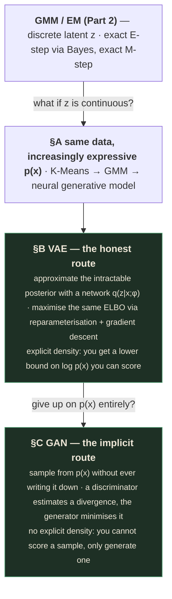
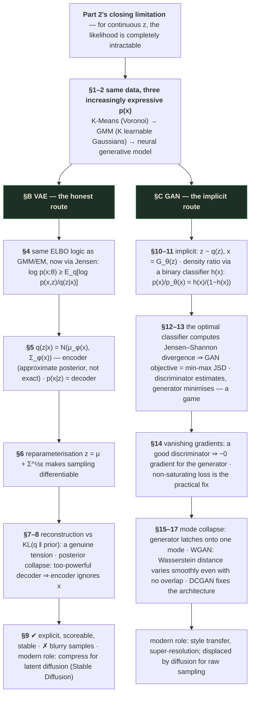
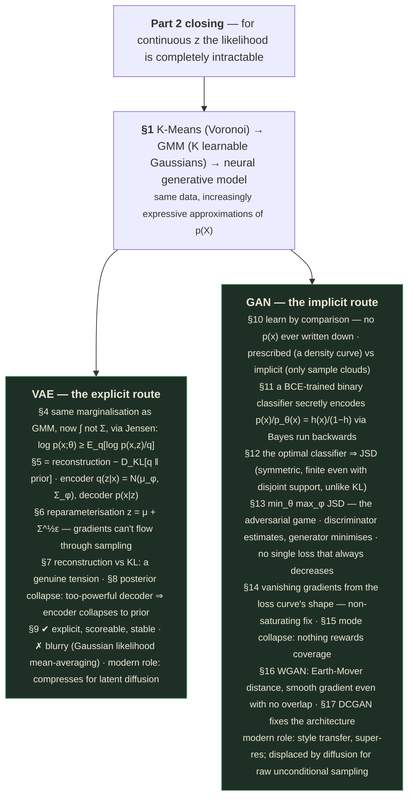

# Unsupervised Learning — Part 3
### Generative Modeling: from GMM to neural networks, via Variational Autoencoders and GANs

---

## 📋 About this lecture and its capture

[Part 2's](unsupervised-learning-02.md) own Table of Contents promised five sections beyond GMM/EM
that its captured video didn't deliver: Generative Modeling Overview, Variational Autoencoders, GANs,
Diffusion Models, Flow Matching. **This lecture delivers the first three of those five, in full, and
stops cleanly.** It does not cover Diffusion Models or Flow Matching — the leading hypothesis, to be
verified once [Part 4](unsupervised-learning-04.md) is scanned, is that those two sections belong
there.

| | Section | Runtime | Covers |
|---|---|---|---|
| **A** | Generative Modeling Overview | 0:00 – ~4:00 | What "learning $p(x)$" buys you · conditional generative models · the K-Means → GMM → Neural Generative Model progression |
| **B** | Variational Autoencoders | ~4:00 – ~21:00 | The VAE derived from the identical ELBO machinery as GMM/EM, now for continuous latents · reparameterization · posterior collapse · strengths, weaknesses, and VAEs' modern role inside latent diffusion |
| **C** | Generative Adversarial Networks | ~21:00 – 49:57 | Implicit generative models · density-ratio estimation via a binary classifier · the JSD connection · the minimax game · vanishing gradients and mode collapse · WGAN · DCGAN |

Reconstructed from the raw capture in `output/`, the deck contains **59 distinct slide states**, ending
cleanly on a GANs summary slide (the deck's own internal page counter reads 38/58 at that point,
confirming this is the deck's actual final content slide, not a truncated capture).

> ✅ **Capture quality: excellent.** 59 raw frames over 50 minutes. Every content slide has a
> fully-built state, and — continuing [Part 2's](unsupervised-learning-02.md) pattern — **every major
> equation is captured with live handwritten derivation annotations still visible**: circled terms,
> arrows, and worked substitutions. **No content gaps.** This lecture is the direct continuation of
> Part 2's derivation, and assumes it throughout — read Part 2 first if you haven't.
>
> **The instructor is not named** anywhere in the recording — the webcam tile carries no label —
> matching [Lecture 10](unsupervised-learning-01.md) and
> [Dimensionality Reduction Part 1](../Dimensionality%20Reduction/dimensionality-reduction-01.md).

---

## How to read this document

This lecture has a genuinely elegant three-act shape, and it is worth seeing the whole shape before
diving into any one act:



If you are revising under time pressure: **§B's VAE derivation and §C's density-ratio-via-classifier
trick are the interview core.** Both are genuinely non-obvious ideas made rigorous, and both are asked
about constantly in applied-scientist interviews.

Everything in a `🧪 Worked example` block should be reproducible by you on paper.

---

## What you'll understand after reading this

- You'll be able to place K-Means, GMM, and a neural generative model on one spectrum of increasingly
  expressive density approximations, and say precisely what each one buys you over the last.
- You'll be able to **derive** the VAE's ELBO objective from the identical marginalization-and-
  lower-bound logic used for GMM's EM algorithm, now applied to a continuous latent variable.
- You'll be able to explain the reparameterization trick, derive why it's necessary, and state
  precisely what problem it solves (gradient flow through a sampling operation).
- You'll be able to diagnose **posterior collapse** mechanistically — not just name it — and explain
  why an overly powerful decoder causes it.
- You'll be able to explain why GANs are called "implicit" generative models, and contrast that
  explicitly against VAEs' explicit lower bound.
- You'll be able to **derive** how a binary classifier, trained with ordinary BCE loss, can be used to
  estimate the ratio of two unknown densities using only samples from each.
- You'll be able to state the connection between an optimal GAN discriminator and the Jensen-Shannon
  divergence, and explain why that connection is what makes the GAN objective principled rather than
  ad hoc.
- You'll be able to explain vanishing gradients and mode collapse mechanistically, using the actual
  shape of the discriminator's loss surface, and state what WGAN and DCGAN each specifically fix.

---

## Before we start: what you need to know

### Prerequisite 1 — Everything from Part 2, assumed fresh

This lecture does not re-derive the ELBO/KL decomposition, the E-step/M-step logic, or KL divergence's
non-negativity — it uses all three immediately and without re-explanation. If
[Part 2's](unsupervised-learning-02.md) §5–§6 derivation isn't fresh, this lecture will feel like a
list of formulas rather than a continuation of one argument.

### Prerequisite 2 — Jensen's inequality, used directly this time

[Part 2 Prerequisite 4](unsupervised-learning-02.md) named Jensen's inequality as the "alternative
route" to the ELBO bound that lecture didn't take. This lecture's VAE derivation (§4) **does** take
that route directly:

$$\log\left(\mathbb{E}_q[f]\right) \ge \mathbb{E}_q[\log f]$$

*Why it matters here:* the VAE derivation moves faster than Part 2's GMM derivation did, applying
Jensen directly to $\log\int q(z|x)\frac{p(x,z;\theta)}{q(z|x)}dz$ rather than deriving the exact KL
decomposition symbol-by-symbol. The lecture's own handwritten annotation traces exactly this move —
worth having the inequality itself memorized before you meet it in §4.

### Prerequisite 3 — Binary Cross-Entropy loss (recap)

> **Binary Cross-Entropy (BCE) loss** — the standard loss for training a binary classifier
> $h(x) \to [0,1]$ to output the probability of class 1:
>
> $$\mathcal{L}_{BCE} = -\left[y\log h(x) + (1-y)\log(1-h(x))\right]$$
>
> *In everyday words:* if the true label is $y=1$, you're penalized by $-\log h(x)$ — small if the
> classifier confidently said "1," huge if it confidently said "0." Symmetric for $y=0$.
>
> *Why it matters here:* §5's entire density-ratio-estimation trick, and the whole of GAN training,
> rests on training an ordinary binary classifier with this exact loss — nothing exotic is introduced
> to make GANs work; the machinery is a completely standard classifier, repurposed.

### Prerequisite 4 — Bayes' rule (recap)

$$p(y=1|x) = \frac{p(x|y=1)p(y=1)}{p(x)} = \frac{p(x|y=1)p(y=1)}{p(x|y=1)p(y=1) + p(x|y=0)p(y=0)}$$

*Why it matters here:* [Part 2 §6.1](unsupervised-learning-02.md) used this to derive GMM's E-step
responsibility. §5 of this lecture uses the *identical* algebraic move, now to show that a trained
binary classifier's output secretly encodes the ratio of two class-conditional densities.

### Prerequisite 5 — The transformation of random variables (recap)

> **Sampling by transformation** — instead of sampling directly from a complicated distribution, sample
> from a *simple* one and pass the sample through a deterministic function.
>
> *Concretely:* to sample from a distribution with mean 5 and standard deviation 2, sample
> $\epsilon \sim \mathcal{N}(0,1)$ (trivial — every framework can do this) and compute
> $x = 5 + 2\epsilon$. The result $x$ is distributed exactly as $\mathcal{N}(5, 4)$.
>
> *Why it matters here:* this is the entire mechanism behind both the reparameterization trick (§6) and
> a GAN's generator (§9) — "sample simple noise, transform it deterministically into something
> complicated" is the one shared idea underlying both architectures, arrived at from two different
> directions.

---

## The big picture

[Part 2's](unsupervised-learning-02.md) closing summary ended on a precise, honest limitation: *"For
continuous latents, the likelihood is completely intractable."* GMM's exact E-step depends on $z$ being
discrete, so that the marginalization $p(x;\theta)=\sum_z p(x,z;\theta)$ is a finite, computable sum.
The moment $z$ becomes a continuous vector — which is what you'd want if you're modeling something as
rich as "the space of all plausible face images" — that sum becomes an integral with no closed form,
and the exact posterior $p(z|x;\theta)$ the E-step needs becomes uncomputable.

**This lecture is the direct answer to that limitation, and it delivers the answer in two genuinely
different flavors.** The deck's own opening figure states the whole arc in one image: the same data,
approximated by three methods of increasing expressiveness — **K-Means** (density approximated by $K$
Voronoi regions around hard centroids — the crudest possible density model), **GMM** ($K$ Gaussians
with learnable covariance — Part 2's answer, still limited to a fixed number of Gaussian "lumps"), and
a **Neural Generative Model** (density learned directly, with no parametric shape assumption at all,
capable of representing arbitrarily complex, multi-modal, non-Gaussian structure). Every algorithm in
this lecture is a specific way of building that third, most expressive box.

**Variational Autoencoders (§B) take the honest route.** They keep the *exact* ELBO machinery from
Part 2 — introduce a stand-in distribution, derive a provable lower bound on the true log-likelihood,
maximize that bound — but replace the *exact* E-step (Bayes' rule, computable because $z$ was discrete)
with an *approximate* one: a neural network, $q(z|x;\phi)$, trained to output a good-enough
approximation to the true (now intractable) posterior. You still get an explicit, if approximate,
handle on $p(x)$ — you can still *score* how likely a sample is, at least approximately, which is
exactly the capability the deck's opening slide names as the whole point of learning $p(x)$ in the
first place.

**Generative Adversarial Networks (§C) give up on that honesty entirely, and gain something else in
exchange.** A GAN never writes down any expression for $p(x)$ — not even an approximate one. It is an
**implicit** generative model: you can sample from it, but you cannot ask "how likely is this specific
image?" The trade is direct and stated by the deck itself: in exchange for abandoning an explicit
density, GANs sidestep the tractability problems VAEs still wrestle with (blurry reconstructions,
posterior collapse), typically producing sharper samples — at the cost of a training procedure that is
a genuine two-player game, with no single loss that reliably goes down, and failure modes (vanishing
gradients, mode collapse) that have no analogue in either GMM/EM or VAE training.

### The whole lecture in one diagram



---

# PART A — Generative Modeling Overview

*0:00 – ~4:00*

---

## 1. What generative models are, and why learn $p(x)$

> *"Models (deep or not) that learn or encode the distribution $p(x)$ are generative models. In some
> cases, models learn the distribution $p(x|c)$. Then they are conditionally generative."* [slide 3]
>
> *"A classifier (learnt in a supervised manner) learns $p(y|x)$, then is it generative? Why or why
> not?"*
>
> *"An example of (conditionally) generative model: a text to image model which generates images based
> on prompts."*

> *"Why do we want to learn $p(x)$? **Sampling:** $x \sim p(x)$, helps us generate novel data which is
> similar to existing data. **Likelihood:** Given a sample $x$, we may want to evaluate if it comes
> from a given distribution. **Generative modeling problem:** Given samples from an underlying input
> distribution $p(x)$ as dataset $\mathcal{D} := \{x_1,x_2,\ldots\}$, estimate $p(x)$."* [slide 6]

> 💡 **The classifier question is worth answering explicitly, because it's a genuinely good discriminator
> of understanding.** A classifier learns $p(y|x)$ — the distribution of *labels*, conditioned on
> input. It is **not** generative in the sense this lecture means, because it never models $p(x)$
> itself — the distribution over the *inputs*. You cannot sample a new $x$ from a classifier; you can
> only ask it to label an $x$ you already have. This is precisely why "discriminative" and "generative"
> are named as opposites: a discriminative model draws a *boundary* through $x$-space; a generative
> model describes the *density* of $x$-space itself.

### 🧪 The three-panel figure — density approximations of increasing expressiveness

> *"Same data — increasingly expressive approximation of $P(X)$."* [slide 4]

| | K-Means | GMM | Neural Generative Model |
|---|---|---|---|
| Caption | *"$P(X)$ approximated by K centroid regions (Voronoi)"* | *"$P(X)$ approximated by K Gaussians with learnable covariance"* | *"$P(X)$ learned directly — no parametric assumption, full density in any region"* |
| What it captures | Only *where* the K cluster centers are — no notion of spread or shape at all | Both location and covariance-shaped spread, but still constrained to $K$ Gaussian "lumps" | Arbitrary shape, arbitrary number of modes, no parametric commitment whatsoever |

**This is the module's own three-lecture arc, drawn as a single figure.**
[Part 1's](unsupervised-learning-01.md) K-Means gives you a *hard-partition* density — every point in
a Voronoi cell is treated identically, with no notion of "more or less typical." [Part 2's](unsupervised-learning-02.md)
GMM is a genuine improvement — it captures spread and shape via each component's covariance (the
Mahalanobis-ellipse framing from Part 1 §2, cashed out at last) — but is still bound to a small,
fixed number of Gaussian bumps, which cannot represent genuinely complex, high-dimensional structure
like "the space of natural face photographs." The **Neural Generative Model** column is where this
lecture spends the rest of its time: replace the parametric assumption entirely with a neural network's
learned, unconstrained flexibility.

> 💡 **Read the progression as "relaxing one assumption per step," exactly as Part 1's own three
> clustering algorithms relaxed one K-Means assumption each.** K-Means→GMM relaxes the *shape*
> assumption (spherical, uniform spread → arbitrary covariance per component). GMM→Neural relaxes the
> *parametric family* assumption entirely (a fixed, finite sum of Gaussians → an unconstrained function
> approximator). Each step in this course's own narrative arc is "keep the previous idea's honest
> machinery, but remove one more constraint on what shape the answer is allowed to take."

---

## 2. Conditional generative models

> *"$c$ = text prompt, $x$ = image. This is a text-to-image model. $c$ = image, $x$ = text. This is an
> image-to-text model, useful for image captioning. $c$ = image, $x$ = image. This is an image-to-image
> model, used for colorization, inpainting, uncropping, JPEG artefact restoration, etc. $c$ = sequence
> of sounds, $x$ = sequence of words. This is a speech-to-text model, useful for automatic speech
> recognition (ASR). $c$ = sequence of English words, $x$ = sequence of French words. This is a
> sequence-to-sequence model, useful for machine translation."* [slide 8]

**This is worth reading as one unifying pattern, not five unrelated examples.** Every one of these
famous, apparently-different systems is the *identical* mathematical object — learn $p(x|c)$ — with
only $c$ and $x$'s data types swapped: text→image, image→text, image→image, audio→text, and text→text
across languages. **Conditional generative modeling is the single framework underlying image
generation, captioning, restoration, speech recognition, and translation all at once**; the systems
look unrelated only because their input/output *modalities* differ, not because their underlying
mathematics does.

> 🎯 **A strong interview move: when asked to design any system that maps one modality to another, name
> this pattern explicitly.** "This is a conditional generative modeling problem — learn $p(x|c)$" is a
> genuinely useful framing, because it immediately tells you the toolkit (conditional VAEs, conditional
> GANs, conditional diffusion) rather than starting from architecture-specific first principles.

---

# PART B — Variational Autoencoders

*~4:00 – ~21:00*

---

## 3. Why VAEs

> *"Where you have already seen them: **Latent diffusion (Stable Diffusion)** — the VAE compresses
> images into a small latent space, where the diffusion model actually trains. **Anomaly detection** —
> reconstruction error is a natural outlier score for fraud, manufacturing defects, medical scans.
> **Image / signal compression** — the encoder produces a compact, structured representation of the
> input. **Drug discovery and molecule design** — VAEs learn smooth latent spaces over molecules so you
> can interpolate or optimize properties."* [slide 11]
>
> *"**Two questions a VAE answers in one model:** can I sample new data? and can I score how typical a
> new sample is?"*

> 💡 **This closing line is the sharpest possible statement of what §Big Picture called "the honest
> route," and it's worth memorising verbatim.** A VAE is built to answer *both* of generative modeling's
> §1 motivations — sampling *and* likelihood-evaluation — simultaneously, in one trained model. Keep
> this in mind through §7–§9: every one of VAE's named weaknesses (blurriness, posterior collapse) is a
> cost paid specifically to keep *both* of these questions answerable at once, and a GAN's decision to
> abandon the second question entirely is precisely what buys it out of paying that cost.

> *"Remember that we introduced GMMs as latent variable models. We first sample a discrete (latent)
> random variable $z$, if $z=k$, we take the $k^{th}$ gaussian and sample $x$ from it. VAEs extend this
> idea to continuous latent variable $z$, with a simple density $p(z)$. VAEs are 'variational' because
> the optimisation involves Calculus of Variations. VAEs are 'Auto-Encoders' because they include a
> re-construction loss (output should match the input)."* [slide 12]

**This slide is the single most direct bridge between Part 2 and this lecture — read it as a literal
sentence-by-sentence generalization:**

| GMM ([Part 2](unsupervised-learning-02.md)) | VAE (this lecture) |
|---|---|
| $z$ is **discrete** — one of $K$ values | $z$ is **continuous** — a real-valued vector |
| Sample $z \sim \mathrm{Categorical}(\pi)$ | Sample $z \sim p(z)$, a continuous prior |
| Given $z=k$, sample $x \sim \mathcal{N}(\mu_k,\Sigma_k)$ | Given $z$, sample $x$ from a distribution parameterized by a **neural network** |
| The posterior $p(z|x;\theta)$ is exactly computable (Bayes' rule, finite sum) | The true posterior $p(z|x;\theta)$ is **intractable**; approximated by another neural network |

Every symbol in the right column is doing the identical *job* the left column's symbol does — only the
computational machinery behind it has changed from "closed-form" to "learned, approximate."

---

## 4. VAE — I: problem formulation

> *"Recall that we are given a dataset $\mathcal{D} := \{x_1,x_2,\ldots N\}$ sampled from the input set
> $X$. We need to estimate $p(x)$, or atleast learn to sample new samples from it. Let us suppose we
> denote our distribution to be learnt as $p(x;\theta)$ ($\theta$ are the parameters to be learnt),
> then:"* [slide 14]
>
> $$\underbrace{\log[p(x;\theta)] = \log\left[\int p(x,z;\theta)dz\right]}_{\text{Marginalisation of } z}$$
>
> *"This integral is not easy to compute (we know nothing about $z$). But let us assume we have a
> distribution $q(z|x)$, from which we can sample some meaningful $z$ given training samples $x$. We
> write:"*
>
> $$\log[p(x;\theta)] = \log\left[\int q(z|x)\frac{p(x,z;\theta)}{q(z|x)}dz\right] \ge \int q(z|x)\log\left[\frac{p(x,z;\theta)}{q(z|x)}\right]dz$$

**This is exactly Part 2 §4–§5's setup, restated for a continuous $z$.** The marginalization sum
$\sum_z p(x,z;\theta)$ becomes an integral $\int p(x,z;\theta)dz$ — the precise, structural change
[Part 2 §9's](unsupervised-learning-02.md) closing warning predicted. And exactly as before, you
"know nothing about $p(z|x)$" so you introduce a stand-in, $q(z|x)$ — the only new notational choice is
writing it as $q(z|x)$ rather than bare $q(z)$, making explicit from the start that this approximate
posterior will be a function *of* $x$ (computed by a neural network, per §5) rather than a free
distribution chosen independently per data point.

**Derive the inequality directly via Jensen** (Prerequisite 2), the faster route this lecture takes
compared to Part 2's exact-decomposition route:

$$\log\int q(z|x)\frac{p(x,z;\theta)}{q(z|x)}dz = \log\,\mathbb{E}_{q(z|x)}\left[\frac{p(x,z;\theta)}{q(z|x)}\right] \ge \mathbb{E}_{q(z|x)}\left[\log\frac{p(x,z;\theta)}{q(z|x)}\right]$$

using $\log(\mathbb{E}[f]) \ge \mathbb{E}[\log f]$ directly (Jensen's inequality for the concave $\log$
function). $\blacksquare$

> ⚠️ **Note precisely what this derivation gives up relative to Part 2's.** Jensen's inequality gives
> you the bound in one line, but — unlike Part 2's exact KL decomposition — it doesn't automatically
> hand you a name for the *gap* between the bound and the truth. Part 2's route showed the gap is
> exactly $\mathrm{KL}(q\|p(z|x))$; that identical gap is *still true here* (Jensen's inequality applied
> this way is mathematically equivalent to the KL decomposition — they're the same bound, reached by two
> routes, exactly as [Part 2's Prerequisite 4](unsupervised-learning-02.md) flagged in advance) — this
> lecture's slides simply don't re-derive that equivalence explicitly, so it's worth stating yourself if
> asked.

---

## 5. VAE — II: the optimisation objective

> *"Again, we have a lower bound on the log-likelihood, which we hope to maximize (thus maximizing
> likelihood). Simplifying ELBO:"* [slide 16]
>
> $$\mathrm{ELBO} := \mathbb{E}_{q(z|x)}\{\log[p(x|z;\theta)]\} - D_{KL}[q(z|x)\|p(z;\theta)]$$
>
> *"So we have arrived at the VAE optimisation objective."*
>
> - *"$p(z;\theta) := \mathcal{N}(z;0,I)$ is the latent prior, constrained to be gaussian normal in a
>   VAE."*
> - *"$q(z|x)$ is the **Encoder** neural network, which converts input data samples $x$ to latents
>   $z$."*
> - *"$p(x|z)$ is the **Decoder** neural network, which given a gaussian sample $z$ creates a
>   meaningful $x$."*

### 🧪 Derive the simplified ELBO from §4's bound

Start from §4's Jensen bound and split $p(x,z;\theta) = p(x|z;\theta)p(z;\theta)$ (chain rule of
probability, the same move Part 2 §5 made in the opposite direction):

$$\mathbb{E}_{q(z|x)}\left[\log\frac{p(x,z;\theta)}{q(z|x)}\right] = \mathbb{E}_{q(z|x)}\left[\log\frac{p(x|z;\theta)p(z;\theta)}{q(z|x)}\right] = \mathbb{E}_{q(z|x)}[\log p(x|z;\theta)] + \mathbb{E}_{q(z|x)}\left[\log\frac{p(z;\theta)}{q(z|x)}\right]$$

**The first term is the expected log-likelihood of reconstructing $x$ from a sampled $z$** — call it
the *reconstruction* term. **The second term, by definition, is** $-D_{KL}[q(z|x)\|p(z;\theta)]$ —
verify by expanding the KL definition: $D_{KL}[q\|p] = \mathbb{E}_q[\log(q/p)]$, so
$-D_{KL}[q\|p] = \mathbb{E}_q[\log(p/q)]$, exactly matching the second term. $\blacksquare$

$$\boxed{\mathrm{ELBO} = \underbrace{\mathbb{E}_{q(z|x)}[\log p(x|z;\theta)]}_{\text{reconstruction}} - \underbrace{D_{KL}[q(z|x)\|p(z;\theta)]}_{\text{regularisation}}}$$

| Symbol | Read it as | What it means |
|---|---|---|
| $q(z\|x)$ | "q of z given x" | The **encoder** — approximates the true (intractable) posterior; converts $x$ into a distribution over latents |
| $p(x\|z;\theta)$ | "p of x given z" | The **decoder** — given a sampled latent, produces (a distribution over) reconstructions of $x$ |
| $p(z;\theta) = \mathcal{N}(z;0,I)$ | "the prior" | Fixed, chosen in advance to be a standard Gaussian — **not learned** |
| Reconstruction term | — | How well the decoder recreates $x$ from a latent sampled via the encoder |
| Regularisation term | — | How close the encoder's output distribution is kept to the fixed Gaussian prior |

> 💡 **The word "Auto-Encoder" in VAE is earned by exactly this equation.** An ordinary autoencoder
> minimizes only a reconstruction loss. A VAE maximizes reconstruction **and** simultaneously keeps its
> latent distribution close to a known, fixed shape — which is precisely what makes the *sampling*
> question from §3 answerable: because the encoder is regularized toward $\mathcal{N}(0,I)$, at
> inference time you can throw the encoder away entirely and sample $z \sim \mathcal{N}(0,I)$ directly,
> confident the decoder has learned to produce something meaningful from exactly that distribution.

---

## 6. VAE — III: architecture and the reparameterization trick

> *"$\mathbb{E}_{q(z\|x)}\{\log[p(x\|z;\theta)]\}$ is the **reconstruction** term. For a given sample
> $x$, encode it to a $z$. Pass that latent through the decoder to recreate similar $x$ ⇒ minimize:
> $\|x - \hat{x}(z)\|^2$. $D_{KL}[q(z\|x)\|\mathcal{N}(z;0,I)]$ is the **regularisation** term ⇒ keep
> the encoder latents as close to Gaussian as possible (tractability)."* [slide 18–19]
>
> *"**Reparameterization:** For reasons of gradient flow during learning the encoder network, $q(z|x)$
> is modelled as:"*
>
> $$z = \mu_\phi(x) + \Sigma_\phi(x)^{1/2}\epsilon, \qquad \epsilon \sim \mathcal{N}(0,I)$$
>
> *"During actual use, we throw away the encoder. Sample latents from a normal gaussian, pass through
> the decoder to generate realistic samples."*

The deck's own architecture figure: an input digit "0" flows into a green trapezoid labeled $q(z|x)$
(the encoder), which compresses to a small latent code $z$, which flows into a blue trapezoid labeled
$p(x|z)$ (the decoder), producing an output digit "3" (illustrating: the *specific* output depends on
the specific $z$ sampled, not necessarily matching the class of the input during generative sampling
from the prior $p(z)$).

### 🧪 Derive why the reparameterization trick is necessary

**The problem, precisely.** Training the encoder means computing $\partial\,\mathrm{ELBO}/\partial\phi$
and taking a gradient step — but the ELBO's reconstruction term is an *expectation over
$z \sim q(z|x;\phi)$*, and $z$ is obtained by **sampling**, an operation with no well-defined gradient
with respect to the distribution's own parameters. You cannot backpropagate through
`z = sample_from(Normal(mu_phi(x), sigma_phi(x)))` directly — the sampling step is not a differentiable
function of $\phi$.

**The fix.** Rewrite the sampling operation as a **deterministic, differentiable function of $\phi$**,
with all the randomness pushed into a separate variable that carries *no* trainable parameters:

$$z = \mu_\phi(x) + \Sigma_\phi(x)^{1/2}\epsilon, \qquad \epsilon \sim \mathcal{N}(0,I)$$

Now $z$ is an ordinary deterministic function of $\phi$ (through $\mu_\phi$ and $\Sigma_\phi$) *and* of
the random input $\epsilon$ — and $\epsilon$ itself has no learnable parameters attached to it at all,
so there is nothing to differentiate through on that side. **Backpropagation flows straight through
$\mu_\phi(x)$ and $\Sigma_\phi(x)^{1/2}$, exactly as it would through any other layer of a neural
network**, because the one genuinely random step ($\epsilon \sim \mathcal{N}(0,I)$) has been moved
entirely outside the computational graph that gradients need to traverse.

> 💡 **This is Prerequisite 5's "sampling by transformation" idea, applied for a completely different
> purpose than usual.** It's normally introduced as a *convenience* (draw from a standard distribution,
> transform to the one you actually want). Here it's a *necessity* — without it, the entire VAE
> training procedure would have no way to compute a gradient for the encoder at all, because gradient
> descent fundamentally cannot differentiate through a stochastic sampling node.

### 🧪 The demo — full pipeline, one MNIST digit worked through

The deck's own hand-drawn annotation on this slide sketches the full pipeline for one input:
$x \to$ (encoder) $\to z_1$ (a sampled latent) $\to$ (decoder) $\to \hat{x}(z_1)$, with the loss term
$\sum\|\hat{x} - \hat{x}(z_i)\|^2$ written beneath it — a direct, concrete trace of exactly the
reconstruction term from §5's boxed ELBO, applied to one real digit image end to end.

```python
import torch, torch.nn as nn

class VAE(nn.Module):
    def __init__(self, dim=784, latent=20):
        super().__init__()
        self.enc = nn.Linear(dim, 400)
        self.mu = nn.Linear(400, latent)
        self.logvar = nn.Linear(400, latent)
        self.dec1 = nn.Linear(latent, 400)
        self.dec2 = nn.Linear(400, dim)

    def encode(self, x):
        h = torch.relu(self.enc(x))
        return self.mu(h), self.logvar(h)

    def reparameterize(self, mu, logvar):
        std = torch.exp(0.5 * logvar)          # Sigma_phi(x)^{1/2}
        eps = torch.randn_like(std)              # epsilon ~ N(0, I) — NO gradient needed here
        return mu + std * eps                    # z = mu + Sigma^0.5 * epsilon

    def decode(self, z):
        h = torch.relu(self.dec1(z))
        return torch.sigmoid(self.dec2(h))

    def forward(self, x):
        mu, logvar = self.encode(x)
        z = self.reparameterize(mu, logvar)      # THE reparameterization trick, in one line
        return self.decode(z), mu, logvar

def vae_loss(x_hat, x, mu, logvar):
    recon = nn.functional.binary_cross_entropy(x_hat, x, reduction='sum')      # reconstruction term
    kl = -0.5 * torch.sum(1 + logvar - mu.pow(2) - logvar.exp())               # -D_KL[q(z|x)||N(0,I)]
    return recon + kl        # minimize the NEGATIVE ELBO
```

> ⚠️ **Note the sign flip in the code, since it trips people up.** The ELBO is *maximized*; deep
> learning frameworks *minimize* a loss. So `vae_loss` above is $-\mathrm{ELBO}$, and the closed-form
> KL term for two Gaussians (`-0.5 * sum(1 + logvar - mu^2 - exp(logvar))`) is the standard analytic
> formula for $D_{KL}[\mathcal{N}(\mu,\sigma^2)\|\mathcal{N}(0,1)]$ — worth knowing exists as a
> closed-form expression, since it's one of the few KL divergences with an exact formula rather than
> requiring Monte Carlo estimation.

```interactive
type: diagram
title: The reparameterization pipeline, traced live
concept: Why z = μ + Σ^½ε lets gradients flow where direct sampling would block them
control: Step through the pipeline x → encoder → (μ,Σ) → sample ε → z → decoder → x̂, toggling
  between "direct sampling" (blocked) and "reparameterized" (flows) at the z step
observe: A gradient arrow animating backward from the reconstruction loss through the decoder,
  through z, and — only in the reparameterized view — continuing through μ and Σ into the
  encoder; in the direct-sampling view the arrow stops dead at z
insight: The *only* thing that changes between the two views is where the randomness sits in the
  computational graph — moving ε outside the part gradients must traverse is the entire trick
fallback: The deck's own hand-drawn pipeline trace (§6, one MNIST digit end to end) plus the
  "why the reparameterization trick is necessary" derivation above already state every step in
  words.
```

---

## 7. VAE objective: a balance of two competing objectives

> *"VAE objective is a balance of two competing objectives. **Minimize reconstruction error:** May
> ship each input $x_i$ to a compressed but informational latent $z_i$. **Distribute:** as a simple
> Gaussian Normal, so that sampling at inference is easy."* [slide 24]

**These two goals genuinely pull against each other, and naming the tension explicitly is worth doing,
because it's the direct cause of §8's failure mode.** Reconstruction alone wants every input mapped to
a *distinctive*, information-rich latent — the more each $z_i$ uniquely encodes its own $x_i$, the
easier reconstruction becomes. But the regularization term wants *every* $q(z|x_i)$ pulled toward the
*same* fixed distribution $\mathcal{N}(0,I)$, regardless of which $x_i$ it came from — which actively
works against letting latents carry input-specific information. **The ELBO is the sum of these two
opposed pressures, and where the trained model lands depends on their relative strength — which is
exactly what §8 shows breaking down at one extreme.**

---

## 8. Posterior collapse

> *"VAE objective is a balance of two competing objectives... However, if the decoder is sufficiently
> powerful: **Learns each input datapoint $x_i$ exactly. Reconstruction error becomes 0 because decoder
> memorizes each input. Encoder $q(z|x)$ then becomes $\mathcal{N}(z;0,I)$ — independent of $x$. No
> meaningful latents to generate from."*** [slide 23–24]

### 🧪 Derive the mechanism, don't just name the symptom

**Walk through exactly what happens when the decoder becomes powerful enough to memorize its inputs.**
If the decoder $p(x|z;\theta)$ is expressive enough that it can reconstruct *any* $x_i$ well **regardless
of what $z$ it's given** — think of a decoder so large it has effectively memorized a lookup table
indexed by which training example it's currently processing, leaking through some other channel — then
the reconstruction term $\mathbb{E}_{q(z|x)}[\log p(x|z;\theta)]$ can be driven to (near) its maximum
possible value **without the encoder needing to encode anything useful about $x$ into $z$ at all**.

**Once that happens, the ELBO's balance from §7 tips entirely toward the second term.** With
reconstruction already near-optimal regardless of $z$'s content, the *only* remaining pressure on the
encoder is the KL regularization term, which is minimized (driven to exactly zero) by setting
$q(z|x) = \mathcal{N}(0,I)$ for **every** $x$ — the encoder's output distribution becomes literally
**independent of its input**. The latent code carries zero information about which datapoint produced
it. **The model still reconstructs training data perfectly (via decoder memorization), and generates
plausible-*looking* new samples (because the prior is Gaussian and the decoder is powerful) — but the
latent space itself has become meaningless**, and none of the §3-promised capabilities (interpolation,
structured latent manipulation, meaningful anomaly scoring via the latent) survive.

> 💡 **The diagnostic signature to remember: near-zero reconstruction loss *combined with* a KL term
> that has also collapsed to (near) zero.** A healthy VAE has a KL term that is small but genuinely
> positive and *varies meaningfully across different inputs* — different $x$'s should produce
> genuinely different encoder outputs. A KL term that has gone to exactly zero for every input, even
> while reconstruction looks fine, is the tell that the encoder has stopped listening to its input
> entirely.

---

## 9. VAE takeaways

> *"VAEs extend the GMM idea to continuous latents and neural-network-parameterized encoder/decoder.
> Training maximizes the ELBO: a reconstruction term + a KL regularizer that keeps latents close to
> $\mathcal{N}(0,I)$. Reparameterization makes the encoder differentiable — the trick that turned a
> probabilistic idea into a working deep model. Two failure modes worth knowing: posterior collapse
> (decoder ignores the latent) and blurry samples (an artifact of the Gaussian likelihood). Strengths:
> explicit latent space, easy to score new data, stable training. Weaknesses: lower sample sharpness
> than GANs/Diffusion. Modern role: VAEs rarely sample images directly anymore — they compress images
> for latent diffusion (Stable Diffusion) and act as priors elsewhere."* [slide 25–27]

> 📚 **Background the slide assumed — why "blurry samples" is specifically an artifact of the Gaussian
> likelihood, not a generic weakness.** When a VAE's decoder output is modeled as a Gaussian (or, in
> the common practical simplification used in the code above, treated via a per-pixel BCE/MSE
> reconstruction loss), the *optimal* reconstruction for genuine ambiguity — several plausible outputs
> consistent with the same latent, e.g. several equally valid ways to complete an ambiguous stroke in a
> handwritten digit — is their **average**, not any one of them sharply. Averaging several sharp,
> plausible images together produces a blurry one. This is a direct, structural consequence of the
> reconstruction loss's own mathematical form (squared error's minimizer is the mean, exactly as
> [Part 1's K-Means centroid-update proof](unsupervised-learning-01.md) established for a completely
> different purpose), **not** a symptom of insufficient training or a bug to be tuned away.

> 🎯 **The "modern role" bullet is worth being able to state precisely in an interview, since it's a
> genuinely current (2026) fact about production systems.** Stable Diffusion and similar systems do
> **not** run their expensive diffusion process directly on raw pixels — that would be prohibitively
> costly at high resolution. Instead, a VAE **compresses** images into a small latent space first (this
> is exactly what slide 11's opening bullet named), the diffusion model does all its expensive
> iterative denoising work entirely *inside* that compressed latent space, and the same VAE's decoder
> then **decompresses** the final denoised latent back into a full-resolution image. **The VAE in a
> modern text-to-image system is not the generative model users interact with — it's the compression
> layer that makes the actual generative model (diffusion) computationally tractable.** This is the
> single fact that ties this lecture's VAE section directly forward to whatever
> [Part 4](unsupervised-learning-04.md) covers on diffusion. 👉 *See also:* the actual compute
> arithmetic behind that compression step — the 48× saving that makes Stable Diffusion's latent
> space tractable — is worked out in
> [GenAI & LLM Part 4](../GenAI%20%26%20LLM/genai-llm-04.md), not here.

---

# PART C — Generative Adversarial Networks

*~21:00 – 49:57*

---

## 10. GANs — the implicit generative model

> *"Where you have already seen them: **StyleGAN** - photorealistic faces, the source of
> thispersondoesnotexist.com. **Deepfakes and face-swap apps** — GAN-style generators are at the core.
> **Image-to-image translation** (pix2pix, CycleGAN) — sketches to photos, day-to-night, horses to
> zebras. **Super-resolution** (SRGAN, ESRGAN) — upscale low-resolution images while keeping textures
> crisp. **Synthetic data for downstream training** — augmenting datasets when real data is scarce or
> sensitive."* [slide 29]
>
> *"**Key idea:** Instead of writing down $p(x)$, **learn by comparison** — produce samples and let a
> critic judge how realistic they look."* [slide 31]

> *"GANs can be seen as **implicit** generative networks, in the sense that they generate data
> directly, instead of specifying $p(x)$. GANs also do not explicitly model data likelihood (unlike
> VAEs that construct a lower bound). The fundamental idea is: **learning by comparison** and
> **transformation of random variables**."* [slide 32–33]
>
> *"**Transformation of Random Variables:** Sample a random vector from a known distribution,
> $z \sim q(z), z \in \mathbb{R}^k$. Transform $z$ to produce a desired distribution,
> $x = G_\theta(z), x \in \mathbb{R}^d$."*

**This is Prerequisite 5's "sampling by transformation" idea, now used for a genuinely different
purpose than the VAE's reparameterization trick used it for.** In the VAE, transformation-of-random-
variables was a *fix* — a way to make an otherwise-necessary sampling step differentiable. Here, it
**is** the entire generative model: the generator network $G_\theta$ is nothing more than a learned
deterministic function that transforms simple noise $z$ into something that looks like real data.
There is no probability density written down anywhere in this description — $G_\theta$ never computes
or outputs a likelihood, only a sample.

> 💡 **The word "implicit" is precise, and worth contrasting explicitly against the VAE.** A VAE gives
> you an *explicit*, if approximate, expression: the ELBO is a genuine lower bound on $\log p(x)$, so
> you can plug in a specific $x$ and get a number back — a score. A GAN's generator has **no such
> expression anywhere in its definition**. You can ask $G_\theta$ to produce a sample; you cannot ask it
> "how likely is this specific image?" — the question is not merely hard to answer, it is not even
> *defined* for a vanilla GAN. This is the single sharpest dividing line between the two families this
> lecture covers, and it is worth being able to state without hesitation.

### 🧪 The two-panel figure — prescribed vs. implicit generative models

> *"Parametric or **Prescribed** models (like GMMs) may first define a density $p_\theta(x)$, and then
> learn the parameters $\theta$ by fitting on data samples."* [slide 34]
>
> *"**Implicit** models (like GANs) iteratively generate data and then compare with given data
> samples."*
>
> *"Since we do not model $p_\theta(x)$, we cannot minimize KL divergence (or maximize likelihood) as
> in other methods. However, the model provides samples which can be compared with other real samples.
> Most given divergences (or distances) between distributions cannot be computed with just samples."*

The deck's own figure, adapted from the standard GAN literature, shows two panels: **(a) Prescribed
generative model** — a smooth blue curve labeled "model density" sitting over a scatter of red dots
labeled "data," directly overlapping and comparable, because the model genuinely has a density function
to plot. **(b) Implicit generative model** — no blue curve at all; instead, blue dots labeled "model
samples" scattered alongside the red "data" dots, with nothing to compare except the two point clouds
themselves.

> ⚠️ **This figure names the exact problem the rest of §C exists to solve, and it's worth stating the
> problem precisely before seeing the solution.** Every method you've met so far in this course for
> comparing two distributions — KL divergence
> ([Dimensionality Reduction Part 2](../Dimensionality%20Reduction/dimensionality-reduction-02.md)),
> the ELBO ([Part 2](unsupervised-learning-02.md) and §4–§5 of this lecture) — requires you to be able
> to *evaluate* both densities at a point. **A GAN's generator has no density to evaluate.** So how do
> you train it to produce samples that "look like" real data, if you cannot write down any expression
> comparing the two distributions directly? §11's answer is genuinely clever: **use a classifier as a
> proxy for a divergence you cannot compute directly.**

---

## 11. Binary classifiers and density ratio estimation

> *"We look at binary classifiers $h(x)$ (trained on Binary Cross Entropy, BCE Loss) as way to compare
> two distributions $p(x)$ and $p_\theta(x)$. Assume $p(x) := p(x|y=1)$ (all samples from $p(x)$
> belong to class-1). Assume $p_\theta(x) := p(x|y=0)$ (all samples from $p_\theta(x)$ belong to
> class-0). Then we have (assuming prior $\pi := p(y=1) = 0.5$):"* [slide 38]
>
> $$\frac{p(x)}{p_\theta(x)} = \frac{p(x|y=1)}{p(x|y=0)} = \frac{\frac{p(y=1|x)p(x)}{p(y=1)}}{\frac{p(y=0|x)p(x)}{p(y=0)}} = \frac{p(y=1|x)}{p(y=0|x)} = \frac{h(x)}{1-h(x)}$$
>
> *"Hence we can compute the ratio of two densities, using just samples, with the help of a binary
> classifier and just samples."*

### 🧪 Derive this in full — this is the interview-tested trick

**The setup:** you have samples from two distributions, real data $p(x)$ and generated (fake) data
$p_\theta(x)$. You cannot evaluate either density directly — you only have samples. But you *can* train
an ordinary binary classifier $h(x)$ to distinguish "did this sample come from $p$ or from $p_\theta$?"
using nothing but standard BCE loss (Prerequisite 3) — this is a completely routine supervised learning
problem, requiring no exotic machinery whatsoever.

**Label the classes.** Say every sample from $p(x)$ is labeled class-1, every sample from $p_\theta(x)$
is labeled class-0, and assume a 50/50 prior: $\pi := p(y=1) = 0.5$, so $p(y=0)=0.5$ too.

**Apply Bayes' rule (Prerequisite 4) in the reverse direction — this is the key move.** Rather than
using Bayes' rule to compute $p(y|x)$ from $p(x|y)$ as you normally would, run it *backwards*: solve for
$p(x|y)$ in terms of $p(y|x)$:

$$p(x|y=1) = \frac{p(y=1|x)\,p(x)}{p(y=1)}$$

**Take the ratio of the two class-conditional densities**, which is exactly the ratio you actually want
($p(x)/p_\theta(x)$, since $p(x) \equiv p(x|y=1)$ and $p_\theta(x) \equiv p(x|y=0)$ by construction):

$$\frac{p(x|y=1)}{p(x|y=0)} = \frac{p(y=1|x)\,p(x)\,/\,p(y=1)}{p(y=0|x)\,p(x)\,/\,p(y=0)} = \frac{p(y=1|x)}{p(y=0|x)}\cdot\frac{p(y=0)}{p(y=1)}$$

With the 50/50 prior assumption, $p(y=0)/p(y=1) = 1$, and the unknown $p(x)$ in numerator and
denominator has **already cancelled** before that step — an important thing to notice: the two
occurrences of $p(x)$ (the *unconditional* mixture density over both classes together, not the target
density itself) cancel algebraically, which is exactly *why* this trick works despite neither $p(x)$ nor
$p_\theta(x)$ ever being written down explicitly. What remains is:

$$\frac{p(x)}{p_\theta(x)} = \frac{p(y=1|x)}{p(y=0|x)} = \frac{h(x)}{1-h(x)}$$

using $h(x) := p(y=1|x)$ (the classifier's own output — by construction, a well-trained binary
classifier's output *is* an estimate of this posterior) and $p(y=0|x) = 1-h(x)$ (the two class
probabilities sum to 1). $\blacksquare$

> 💡 **The result to hold onto: a trained classifier's output secretly encodes a density ratio, purely
> as a side effect of how binary classification works — no special training objective was needed to
> make this true.** Train $h(x)$ with completely ordinary BCE loss to separate real from fake samples,
> and the *ratio* $h(x)/(1-h(x))$ automatically estimates $p(x)/p_\theta(x)$, **using only samples from
> each distribution and no explicit density expressions anywhere.** This is precisely the tool that
> lets you compare two distributions you can only sample from, and it is the mathematical foundation
> everything else in §C is built on.

---

## 12. From density ratio to Jensen-Shannon divergence

> *"Is the ratio enough for our comparison? It can be shown that an **optimal** binary classifier
> computes **Jensen-Shannon divergence** between two distributions:"* [slide 38]
>
> $$JSD(p,p_\theta) = \frac{1}{2}D_{KL}\left(p\,\Big\|\,\frac{p+p_\theta}{2}\right) + \frac{1}{2}D_{KL}\left(p_\theta\,\Big\|\,\frac{p+p_\theta}{2}\right)$$

> 📚 **Background the slide assumed — what Jensen-Shannon divergence is, and why it's the natural next
> step beyond a raw density ratio.** JSD is a *symmetrized*, always-finite variant of KL divergence: it
> compares both $p$ and $p_\theta$ against their own midpoint mixture, $\frac{p+p_\theta}{2}$, and
> averages the two resulting KL terms. Unlike plain KL divergence
> ([Dimensionality Reduction Part 2 §23](../Dimensionality%20Reduction/dimensionality-reduction-02.md)),
> **JSD is symmetric** — $JSD(p,p_\theta) = JSD(p_\theta,p)$ — and it is always well-defined and finite
> even when $p$ and $p_\theta$ have completely disjoint support, which plain KL divergence is not (KL
> diverges to infinity if $Q$ assigns zero probability anywhere $P$ has mass — exactly the
> "zero-avoiding" behaviour that same source derived for forward KL). **This is exactly the property that
> makes JSD the natural choice for comparing a generator's (initially very poor) samples against real
> data** — early in training, a generator's outputs and real data may barely overlap at all, and plain
> KL would be undefined or infinite in that regime while JSD stays finite and gives a usable gradient.
>
> *Why a raw density ratio alone isn't the full answer:* the ratio $h(x)/(1-h(x))$ tells you, pointwise,
> how much more (or less) likely a specific $x$ is under $p$ than under $p_\theta$ — useful, but you
> need a single *scalar* training objective to actually optimize the generator against, not a
> pointwise function. JSD is that scalar summary, and — as §13 shows — it emerges directly from the
> *same* classifier machinery you already have.

---

## 13. The generator and discriminator, together

> *"An optimal binary classifier computes the JSD between $p(X)$ and $p_\theta(X)$. **We do not have an
> optimal classifier yet.** We learn it **on the fly** as new samples are generated with a
> **Discriminator** neural network $D_\phi(X)$, using BCE Loss. We again assume samples from $p(X)$ are
> labelled class-1, and those from $p_\theta(X)$ are class-0:"* [slide 41–44]
>
> $$V(p_\theta,p) = \max_\phi\ \mathbb{E}_{p(x|y)p(y)}\left[y\log D_\phi(x) + (1-y)\log(1-D_\phi(x))\right] = \max_\phi\ \tfrac{1}{2}\mathbb{E}_{p(x)}\log D_\phi(x) + \tfrac{1}{2}\mathbb{E}_{p_\theta(x)}\log(1-D_\phi(x))$$
>
> *"Once Discriminator is trained enough to approximate $JSD(p,p_\theta)$, we minimize it by updating
> **Generator** network $G_\theta(z)$, which produce synthetic/fake $x$:"*
>
> $$\boxed{\min_\theta JSD(p,p_\theta) = \min_\theta \max_\phi\ \tfrac{1}{2}\mathbb{E}_{p(x)}[\log D_\phi(x)] + \tfrac{1}{2}\mathbb{E}_{q(z)}[\log(1-D_\phi(G_\theta(z)))]}$$

| Symbol | Read it as | What it means |
|---|---|---|
| $D_\phi(x)$ | "the Discriminator, parameterized by phi" | A neural network estimating $h(x) = p(y=1|x)$ from §11 — "how likely is this specific $x$ to be real?" |
| $G_\theta(z)$ | "the Generator, parameterized by theta" | A neural network transforming noise $z$ into a synthetic sample — Prerequisite 5's transformation, now the entire generative model |
| $\max_\phi$ | "maximize over the discriminator's parameters" | Train $D_\phi$ to become as good as possible at telling real from fake — the **inner** loop |
| $\min_\theta$ | "minimize over the generator's parameters" | Train $G_\theta$ to fool the (already-good) discriminator — the **outer** loop |

**This boxed equation is the entire GAN objective, and it's worth reading it as two nested optimization
problems, one inside the other — because that nesting *is* the "adversarial" in Generative Adversarial
Network.**

**Read the inner maximization first, because it's just §11's classifier training, written out
explicitly.** $\max_\phi\, \mathbb{E}_{p(x)}[\log D_\phi(x)] + \mathbb{E}_{p_\theta(x)}[\log(1-D_\phi(x))]$
is exactly BCE loss (Prerequisite 3), applied to the two-class problem "real vs. generated" — maximizing
it is training an ordinary binary classifier, no different from any other classifier you've trained in
this course.

**Now read the outer minimization.** Once $D_\phi$ has been trained close to optimal (i.e. it's
computing something close to the true JSD, per §12), the **generator's** parameters $\theta$ are updated
to *minimize* that same JSD — pushing $p_\theta$ (the distribution of the generator's outputs) to look
more like $p$ (real data), as measured by however well the discriminator can currently tell them apart.

**The two players are trained in alternation, each affecting what the other sees next**, and that
alternation is the entire "adversarial" training procedure: better discriminator ⇒ a sharper, more
informative divergence estimate for the generator to minimize ⇒ better generator ⇒ harder classification
task for the discriminator next round ⇒ repeat.

### 🧪 The forger-and-detective analogy

> *"**The forger and the detective analogy:** $G_\theta$ is a forger who paints fake currency from a
> random scribble $z$. $D_\phi$ is a detective who looks at a note and decides real or fake? Each round,
> the detective gets better at spotting fakes, and the forger improves to fool the detective. **At
> equilibrium**, even the best detective is reduced to a coin flip — the forger's notes are
> indistinguishable from real ones."* [slide 47]
>
> *"**Why the math works:** the detective's optimal score is exactly the Jensen-Shannon divergence
> between real and fake distributions. Minimizing it forces the two distributions to match. The
> catch: unlike GMM/VAE training, there is no single loss that always goes down. It is a game, and games
> can oscillate, collapse, or never converge."*

> 💡 **This last sentence is the single most important practical fact about GAN training, and it's
> worth holding onto through §14–§16.** Every other training procedure in this entire course — gradient
> descent on a supervised loss, K-Means' distortion, EM's monotonically-non-decreasing log-likelihood,
> a VAE's ELBO — has **one scalar quantity that the training procedure provably improves, or at worst
> never worsens, over time.** A GAN has **no such quantity.** The discriminator's loss going down is
> good for the discriminator and (usually, but not always) bad for the generator, and vice versa — there
> is no single number you can plot and say "training is working if this goes down." This is the direct
> structural reason GAN training is notoriously more finicky to get right than anything else in this
> course, and it's the reason §14–§16 exist at all.

### 🧪 The live demo — a 2-D toy GAN, watched failing in real time

The deck's own figure shows three snapshots of a GAN being trained on a genuinely multi-modal 2-D toy
dataset (several separated clusters of true data points, shown in gray): **Step 1a — exploring**,
generated samples (orange) scattered roughly across the whole space, covering all the true modes
loosely; **Step 5a — half the modes**, generated samples now concentrated on only about half the true
clusters, having abandoned the rest; **Step 10a — mode collapse**, generated samples piled almost
entirely onto a single one of the true clusters, having abandoned every other mode of the true
distribution entirely. This is the exact failure §15 names and explains mechanistically.

```interactive
type: animation
title: Watching a GAN collapse onto one mode
concept: Mode collapse as a structural risk of the minimax objective, not a training bug
control: A "train step" slider scrubbing through the deck's own three snapshots (step 1, 5, 10)
  and beyond, on the same multi-modal 2-D toy dataset
observe: The orange generated-sample cloud contracting from "covers every gray mode loosely" to
  "piled onto a single mode," while a small readout tracks the discriminator's current accuracy
  on that one over-represented mode
insight: There is no point in the animation where a single scalar loss visibly "goes wrong" —
  the collapse is only visible in the *sample distribution*, which is exactly why §13's "no single
  number to watch" warning matters in practice, not just in theory
fallback: The three-snapshot description above (Step 1a / 5a / 10a) already gives the same
  progression as three static frames.
```

---

## 14. Challenges in training — vanishing gradients

> *"The GAN objective is an adversarial game: Two networks are trying to minimize and maximize the same
> objective at the same time. There are challenges in training and convergence due to this nature of
> objective."* [slide 52]
>
> *"**Vanishing Gradients:** We expect the discriminator to be good so that it actually measures
> divergence. However, a good discriminator easily distinguishes between real and fake samples and
> provides not gradient to the generator. We can use a non-saturating loss:
> $-\mathbb{E}_{q(z)}[\log(D_\phi(G_\theta(z)))]$, instead of the original loss term on Generator
> samples. It is also possible to restrict capacity of Discriminator. Other GAN variants, such as
> Wasserstein GAN provide stable/smooth gradients, even for optimal Discriminators."*

### 🧪 Derive the vanishing-gradient mechanism from the loss's actual shape

**The problem, precisely.** The generator's original loss term (from the boxed objective in §13,
restricted to the terms involving $\theta$) is
$\mathbb{E}_{q(z)}[\log(1-D_\phi(G_\theta(z)))]$, minimized over $\theta$. Once the discriminator
$D_\phi$ has become genuinely good — meaning it confidently assigns $D_\phi(G_\theta(z)) \approx 0$ to
every generated sample, correctly recognizing them as fake — look at what happens to
$\log(1-D_\phi(G_\theta(z)))$ **as a function of $D_\phi(G_\theta(z))$** near that point: it flattens
out toward its minimum-slope region.

The deck's own figure plots exactly this: three loss curves against $D(G(z))$, the discriminator's
score on a *generated* sample. The **blue "Minimax" curve** (the original loss above) is nearly flat
near $D(G(z)) \approx 0$ — precisely the regime a well-trained discriminator puts every generated sample
into — meaning $\partial\,\mathrm{loss}/\partial\theta \approx 0$ there: **the generator receives almost
no gradient signal to learn from, at exactly the moment training would most need it (when it's
currently losing badly).**

**The fix — the non-saturating loss.** Replace the generator's objective with
$-\mathbb{E}_{q(z)}[\log D_\phi(G_\theta(z))]$ — note this is a *different* function of
$D_\phi(G_\theta(z))$, not merely a sign-flipped version of the original. The deck's own plot shows the
**green "Non-saturating heuristic" curve** staying steep precisely in the $D(G(z)) \approx 0$ region
where the original blue curve went flat — providing a strong, usable gradient exactly where the
generator needs it most.

> 💡 **The intuitive reading, worth having ready:** the original loss asks the generator to minimize
> "how confidently does the discriminator call this fake" — and once the discriminator is very
> confident, that quantity is already near its floor, with little room left to improve, so gradients
> vanish. The non-saturating version instead asks the generator to **maximize** "how confidently does
> the discriminator call this real" — a quantity that starts near zero when the generator is doing
> badly and has plenty of room (and gradient signal) to grow. **Same underlying goal (fool the
> discriminator), restated as a different quantity to optimize, with a completely different gradient
> landscape near the region that matters in practice.**

---

## 15. Mode collapse and mode hopping

> *"In case of multi-modal input data, it is possible that the Generator latches on to a mode (or
> small set of samples) that it has learnt and keeps generating those only. Additionally, Generator may
> output samples from a given mode. When Discriminator becomes good at that mode, Generator simply
> hops to a new mode."* [slide 52]

### 🧪 Derive why mode collapse is a structural risk, not a training bug

**Walk through the mechanism the toy-GAN demo (§13) just showed happening.** The generator's objective
is to fool the discriminator — it is **never directly rewarded for covering every mode of the true
distribution**, only for producing *individual samples* the discriminator currently can't distinguish
from real. If the generator discovers that concentrating *all* of its output on one particular true mode
(one cluster of real data) is enough to consistently fool the current discriminator — because, say, that
one mode happens to be easy to imitate convincingly — **nothing in the objective directly punishes it
for having completely abandoned every other mode.**

**Mode hopping is the natural next step once the discriminator catches up.** As training continues, the
discriminator eventually learns to distinguish the generator's over-concentrated output from real
samples of that *same* mode (since real data genuinely does contain other modes too, and the
discriminator can learn to use that as a signal). At that point the generator's easiest escape is often
not "cover all the modes properly" but simply "abandon this mode and jump to a *different* single mode
that currently fools the discriminator" — producing the oscillating, never-quite-converging behaviour
the "forger and detective" analogy's closing line warned about (*"games can oscillate, collapse, or
never converge"*).

> 💡 **The connection worth drawing explicitly: mode collapse is a direct consequence of the generator
> having no term in its loss that measures *coverage* or *diversity* — only per-sample plausibility.**
> Contrast this against a VAE, whose reconstruction term is computed per-training-example (§5's boxed
> ELBO sums an expectation over every $x_i$ in the dataset) — a VAE is structurally forced to attempt
> reconstructing *every* training point, so it cannot simply ignore whole regions of the data the way a
> GAN's generator can. **This is the flip side of the VAE-vs-GAN trade named in the Big Picture**: VAEs
> pay for their per-example accountability with blurriness (§9); GANs pay for their sharper samples with
> a structural risk of mode collapse that has no VAE analogue.

---

## 16. Wasserstein GAN (WGAN)

> *"Recall that the original GAN minimizes the JSD, which gives near-zero gradients when real and fake
> distributions barely overlap (causing vanishing gradients). WGAN instead minimizes the **Wasserstein
> (Earth-Mover) distance:** the minimum 'cost' of moving mass to turn one distribution into the
> other."* [slide 56]
>
> *"This distance varies smoothly even when distributions do not overlap, so the Generator always
> receives a useful gradient."*
>
> $$\min_\theta \max_\phi\ \mathbb{E}_{p(x)}[f_\phi(x)] - \mathbb{E}_{q(z)}[f_\phi(G_\theta(z))]$$
>
> *"The Discriminator is now a **Critic** $f_\phi$, that outputs a real-valued score (not a
> probability). **Result:** more stable training, less mode collapse, and a loss that correlates with
> sample quality."*

> 📚 **Background the slide assumed — the Earth-Mover intuition, and why it fixes the exact problem
> §14 diagnosed.** Picture each distribution as a pile of dirt (probability mass) spread over the
> plane. The Wasserstein distance is the minimum total amount of "dirt × distance moved" required to
> reshape one pile into the other. **Crucially, this quantity is well-defined and varies smoothly even
> when the two piles don't overlap at all** — moving a pile of dirt 5 units to the left costs a
> well-defined, finite amount regardless of whether it currently sits under the other pile or ten miles
> away. Contrast this against JSD, which — despite being finite everywhere (§12) — can still have
> **near-zero gradient** in exactly the regime §14 identified (once the discriminator confidently
> separates the two distributions), because JSD's *value* stays informative but its *local slope*
> flattens out. Wasserstein distance's defining property is that it keeps a genuinely useful *slope*
> even in that same regime — solving §14's vanishing-gradient problem at its root, rather than working
> around it with a loss reformulation the way the non-saturating trick did.
>
> **Why the "Critic" name change matters.** The original discriminator's output $D_\phi(x) \in [0,1]$
> was interpreted as a *probability* — "how likely is this real?" WGAN's critic $f_\phi(x) \in
> \mathbb{R}$ outputs an unconstrained real-valued **score** with no probabilistic interpretation at
> all — it's not answering "is this real," only "how real does this *seem*, on some learned scale."
> ⚠️ This reformulation requires an additional technical constraint (that $f_\phi$ be
> **Lipschitz-continuous**, typically enforced via weight clipping or a gradient penalty) for the
> Wasserstein-distance interpretation to hold rigorously — a detail this deck names in its own closing
> summary ("Wasserstein distance + Lipschitz critic") but does not derive in depth. Worth knowing the
> term exists; the full derivation of why the Lipschitz constraint is required is beyond this lecture's
> scope.

---

## 17. Deep Convolutional GAN (DCGAN)

> *"WGAN stabilizes the **objective**; DCGAN stabilizes the **architecture** by giving simple, robust
> design rules for image GANs."* [slide 57]
>
> *"**Key architectural guidelines:** Replace pooling with strided convolutions (Discriminator) and
> transposed convolutions (Generator). Use Batch Normalization in both networks to keep activations
> well-scaled. Remove fully-connected hidden layers for deeper architectures. Use ReLU in the Generator
> (tanh at output) and LeakyReLU in the Discriminator."*
>
> *"These choices make training reliable and produce sharp, realistic images, becoming the standard
> backbone for later GAN variants."*

**Read this as the direct architectural analogue of the entire training-stability story §14–§16 just
told — a different failure mode, a different fix.** WGAN fixed the *objective function itself* (what
quantity is being optimized, and whether it provides usable gradients). DCGAN instead fixes the
*network architecture* through which that objective is optimized — and every one of its four guidelines
is a specific, empirically-discovered answer to "what architectural choices make image-GAN training
converge reliably in practice, as opposed to merely being mathematically well-posed."

> 💡 **Connect two of DCGAN's guidelines back to material earlier in this course, rather than treating
> them as new, unrelated facts.** *"Strided convolutions instead of pooling"* is exactly
> [Deep Neural Networks Part 2's](../Deep%20Neural%20Networks/deep-neural-networks-02.md) own
> observation that learned downsampling (a strided conv) can outperform fixed downsampling (pooling) —
> here applied specifically because a GAN's generator and discriminator both benefit from every
> operation in the network being *learnable*, with no fixed, non-parametric steps in the pipeline.
> *"Batch Normalization in both networks"* is
> [Deep Neural Networks Part 2's](../Deep%20Neural%20Networks/deep-neural-networks-02.md) own BatchNorm
> derivation, applied here for the same underlying reason it helps anywhere: keeping activations
> well-scaled stabilizes training — and stability is at an especially high premium in a GAN's already-
> fragile two-player training dynamic (§13's closing line: *"games can oscillate, collapse, or never
> converge"*).

---

## 18. GAN takeaways

> *"GANs are **implicit** generative models — they sample from $p(x)$ without ever writing it down.
> Training is a min-max game: the discriminator estimates a divergence; the generator minimizes it.
> Sharp samples and fast generation, but training is delicate — vanishing gradients, mode collapse, no
> stable loss curve. *WGAN* fixed the gradient/divergence problem (Wasserstein distance + Lipschitz
> critic). *DCGAN* fixed the architecture problem (strided convs, BatchNorm, tanh/LeakyReLU). **Modern
> role:** still dominant for style transfer, super-resolution, and identity preserving generation;
> mostly displaced by diffusion for unconditional sampling."* [slide 58–59]

> 🎯 **The "modern role" bullet closes this lecture on the identical honest note VAE's own summary
> closed on (§9), and the parallel is worth drawing explicitly in an interview.** Neither VAEs nor GANs
> are, in 2026, the default choice for raw, unconditional, high-fidelity image sampling — that role has
> largely been taken by diffusion models (whichever of [Part 4](unsupervised-learning-04.md)'s remaining
> sections covers them). But **neither technique became obsolete** — VAEs became diffusion's essential
> *compression layer* (§9), and GANs remain the practical tool of choice for specific, narrower tasks
> where their particular strengths (sharp, fast, single-forward-pass generation; strong performance on
> *conditional*, structured tasks like style transfer and super-resolution where the "which mode"
> question is largely already answered by the conditioning input) still outperform diffusion's slower,
> iterative alternative. **Knowing the current, honest state of a technique's practical relevance — not
> just its historical mechanics — is exactly the kind of judgment an applied-scientist interview is
> testing for.** 👉 *See also:* [GenAI & LLM Part 4](../GenAI%20%26%20LLM/genai-llm-04.md) makes the
> "why diffusion beat GANs" case explicitly, in engineering terms this lecture doesn't cover — a
> single-network MSE objective with no adversarial game, critic, or instability to fight with.

---

## Putting it together



### Walking the diagram

**This lecture is the direct, honest continuation of the exact problem Part 2 closed on.** GMM's exact
EM algorithm depends entirely on the latent variable $z$ being discrete — the moment you want $z$ to be
a rich, continuous vector (necessary for modeling anything as complex as natural images), the exact
machinery breaks, and this lecture shows two genuinely different ways of responding to that break.

**The VAE's response is to keep every piece of Part 2's honest machinery, and approximate only the one
piece that became intractable.** The marginalization is still there (now an integral). The lower-bound
argument is still there (now reached via Jensen's inequality directly, rather than the exact KL
decomposition — but, as flagged in Prerequisite 2, the two routes are secretly the same bound). The
E-step is still conceptually there — but where GMM computed the true posterior *exactly*, via Bayes'
rule, a VAE trains a **neural network** to approximate it, because the true posterior is no longer
computable in closed form. Everything that follows — the reparameterization trick, the reconstruction/
regularization tension, posterior collapse — is a consequence of that one substitution (exact → learned
approximate posterior) working through the machinery Part 2 already built.

**The GAN's response is to abandon the honest machinery altogether, and build something new on a
completely different foundation: comparison rather than density estimation.** Instead of ever writing
down an expression for $p(x)$ — exact or approximate — a GAN trains an ordinary binary classifier to
distinguish real samples from generated ones, and exploits a genuinely elegant piece of mathematics
(§11's density-ratio derivation) to show that this classifier's output secretly encodes a comparison
between the two distributions, without either distribution ever needing to be written down explicitly.
Everything that follows in §C — the minimax game, vanishing gradients, mode collapse, WGAN, DCGAN — is
the practical fallout of building a generative model on an adversarial *game* rather than a single
optimizable objective: you gain the freedom to never need a tractable density, and you pay for it with
a training procedure that has no single number guaranteed to improve monotonically, unlike every other
training procedure met in this entire module.

**The single thread worth carrying out of this lecture, tying it directly back to Part 1 and Part 2:**
every method in this three-lecture arc is, at bottom, answering "what is the simplest explanation of
this data?" — [Part 1's](unsupervised-learning-01.md) own framing, quoted at the top of that lecture —
and each successive method relaxes exactly one more constraint on what "simplest" is allowed to mean.
K-Means: a handful of points. GMM: a handful of Gaussian shapes. VAE: an unconstrained neural network,
but one still honestly bounded below by a real number you can compute. GAN: an unconstrained neural
network with no density at all, judged purely by whether a second network can tell its output from the
real thing. **The story of this entire module is the story of what you gain, and what you must give up,
each time you relax one more assumption about what a "model of the data" is required to look like.**

---

## Interview prep — Amazon Applied Scientist

### Core questions

<details>
<summary><b>1. (Easy)</b> What is a generative model, and why isn't an ordinary classifier one?</summary>

A generative model learns (or encodes) the distribution $p(x)$ over the *inputs* themselves — not
merely a mapping from inputs to labels. Learning $p(x)$ buys you two capabilities: **sampling**
($x \sim p(x)$, generating novel data similar to what you've seen) and **likelihood evaluation**
(scoring how typical a given $x$ is under the learned distribution).

An ordinary classifier learns $p(y|x)$ — the distribution of *labels* conditioned on input — and never
models $p(x)$ at all. You cannot sample a new $x$ from a classifier (there's no mechanism to generate
inputs, only to label ones you already have), so it is **discriminative**, not generative — it draws a
boundary through $x$-space rather than describing the density of $x$-space itself.
</details>

<details>
<summary><b>2. (Easy)</b> Place K-Means, GMM, and a neural generative model on one spectrum, and say what each buys over the last.</summary>

All three approximate the same underlying density $p(x)$, with increasing expressiveness. **K-Means**
approximates it with $K$ Voronoi regions around hard centroids — only *location* information, no notion
of spread or shape. **GMM** ([Part 2](unsupervised-learning-02.md)) adds learnable covariance per
component — now spread and shape are captured, but still constrained to a fixed, small number of
Gaussian "lumps." A **neural generative model** removes the parametric-family constraint entirely,
learning the density's shape directly with no assumption about how many modes it has or what shape they
take. Each step relaxes exactly one assumption of the previous method: K-Means→GMM relaxes the shape
assumption; GMM→neural relaxes the parametric-family assumption altogether.
</details>

<details>
<summary><b>3. (Medium)</b> Derive the VAE's ELBO objective, and explain what each of its two terms does.</summary>

Start from the marginal log-likelihood, $\log p(x;\theta) = \log\int p(x,z;\theta)\,dz$ — intractable
because $z$ is continuous. Introduce an approximate posterior $q(z|x)$, and apply Jensen's inequality
directly to the concave $\log$:

$$\log p(x;\theta) = \log\,\mathbb{E}_{q(z|x)}\left[\frac{p(x,z;\theta)}{q(z|x)}\right] \ge \mathbb{E}_{q(z|x)}\left[\log\frac{p(x,z;\theta)}{q(z|x)}\right]$$

Split $p(x,z;\theta) = p(x|z;\theta)p(z;\theta)$ and separate the expectation into two terms:

$$\mathrm{ELBO} = \underbrace{\mathbb{E}_{q(z|x)}[\log p(x|z;\theta)]}_{\text{reconstruction}} - \underbrace{D_{KL}[q(z|x)\|p(z;\theta)]}_{\text{regularisation}}$$

**Reconstruction term:** how well the decoder $p(x|z)$ recreates $x$ from a latent sampled via the
encoder $q(z|x)$ — in practice minimized as $\|x - \hat{x}(z)\|^2$. **Regularisation term:** how close
the encoder's output distribution is kept to the fixed prior $p(z) = \mathcal{N}(0,I)$ — this is what
makes pure-prior sampling at inference time meaningful (discard the encoder, sample
$z\sim\mathcal{N}(0,I)$ directly, pass through the decoder).
</details>

<details>
<summary><b>4. (Medium)</b> Explain the reparameterization trick — what problem does it solve, and how?</summary>

**The problem:** training the encoder requires computing $\partial\,\mathrm{ELBO}/\partial\phi$, but the
reconstruction term is an expectation over $z$ obtained by *sampling* from $q(z|x;\phi)$ — and sampling
has no well-defined gradient with respect to the distribution's own parameters. You cannot backpropagate
through a stochastic node directly.

**The fix:** rewrite the sampling operation as a deterministic, differentiable function of $\phi$, with
all randomness pushed into a separate, parameter-free variable:

$$z = \mu_\phi(x) + \Sigma_\phi(x)^{1/2}\epsilon, \qquad \epsilon \sim \mathcal{N}(0,I)$$

Now $z$ is an ordinary function of $\phi$ (through $\mu_\phi$, $\Sigma_\phi$) and of the random input
$\epsilon$, which carries no trainable parameters at all — nothing to differentiate through on that
side. Gradients flow straight through $\mu_\phi$ and $\Sigma_\phi^{1/2}$ exactly as through any other
layer, because the genuinely random step has been moved entirely outside the part of the graph gradients
need to traverse.
</details>

<details>
<summary><b>5. (Medium)</b> Diagnose posterior collapse mechanistically — what causes it, and what's the observable signature?</summary>

The ELBO balances two competing pressures: reconstruction wants each input mapped to a *distinctive*,
information-rich latent; regularization wants every encoder output pulled toward the *same* fixed prior,
regardless of input. **If the decoder is powerful enough to reconstruct any $x_i$ well regardless of
what latent it's given** (effectively memorizing training examples through some other channel), the
reconstruction term can be driven near-optimal without the encoder needing to encode anything useful
about $x$ into $z$ — at which point the *only* remaining pressure on the encoder is the KL term, which
is minimized by setting $q(z|x) = \mathcal{N}(0,I)$ for every input. **The encoder's output becomes
literally independent of $x$**; the latent carries zero information.

**Observable signature:** near-zero reconstruction loss *combined with* a KL term that has also
collapsed to (near) zero for every input, even though a healthy VAE's KL term should be small but
genuinely positive and varying meaningfully across different inputs.
</details>

<details>
<summary><b>6. (Medium)</b> Derive how a binary classifier can be used to estimate the ratio of two densities you can only sample from.</summary>

Label samples from $p(x)$ as class-1 and samples from $p_\theta(x)$ as class-0, with a 50/50 prior. Run
Bayes' rule *backwards* — solve for the class-conditional density in terms of the posterior:

$$p(x|y=1) = \frac{p(y=1|x)\,p(x)}{p(y=1)}$$

Take the ratio of the two class-conditional densities (exactly $p(x)/p_\theta(x)$, by construction):

$$\frac{p(x|y=1)}{p(x|y=0)} = \frac{p(y=1|x)}{p(y=0|x)}\cdot\frac{p(y=0)}{p(y=1)} = \frac{p(y=1|x)}{p(y=0|x)}$$

with the last step using the 50/50 prior. Since a well-trained classifier's output *is* an estimate of
$p(y=1|x)$, and $p(y=0|x) = 1-h(x)$:

$$\frac{p(x)}{p_\theta(x)} = \frac{h(x)}{1-h(x)}$$

**The key insight:** the unknown, unwritten densities cancel out algebraically during the derivation —
you never need to evaluate either density directly, only train an ordinary classifier with standard BCE
loss on labeled samples from each.
</details>

<details>
<summary><b>7. (Medium–hard)</b> Explain why GANs are called "implicit" generative models, contrasting explicitly against VAEs.</summary>

A GAN's generator $G_\theta(z)$ is a learned deterministic function transforming simple noise into a
sample — nowhere in its definition is any expression for a probability density written down. You can
query $G_\theta$ for a sample; you cannot ask "how likely is this specific $x$?" — the question isn't
merely hard, it's undefined for a vanilla GAN. This is what "implicit" means: the model implicitly
defines a distribution (via the pushforward of the noise distribution through $G_\theta$) without ever
representing that distribution explicitly.

**Contrast with a VAE:** the ELBO is a genuine, if approximate, lower bound on $\log p(x)$ — plug in a
specific $x$, get back a number. VAEs are explicit generative models (approximately — they give a
provable bound, not the exact likelihood); GANs are implicit (no expression at all). This is the
sharpest structural line between the two families this lecture covers, and it's the direct cause of
their respective trade-offs: VAEs' explicit bound makes them stable to train and easy to score, at the
cost of the bound's own looseness (blurriness); GANs' complete abandonment of an explicit density frees
them from that looseness (sharper samples) at the cost of a training procedure with no single quantity
guaranteed to improve.
</details>

<details>
<summary><b>8. (Hard — combines two concepts)</b> Derive why the original GAN generator loss suffers vanishing gradients once the discriminator becomes good, and explain the non-saturating fix.</summary>

The generator's original loss term is $\mathbb{E}_{q(z)}[\log(1-D_\phi(G_\theta(z)))]$, minimized over
$\theta$. Once $D_\phi$ is well-trained, it confidently assigns $D_\phi(G_\theta(z)) \approx 0$ to
generated samples (correctly recognizing them as fake). Examine $\log(1-D_\phi(G_\theta(z)))$ as a
function of $D_\phi(G_\theta(z))$ near that point: the function is nearly flat there (its derivative
with respect to its argument is small near 0) — so $\partial\,\mathrm{loss}/\partial\theta \approx 0$,
via the chain rule, **exactly when the generator most needs a strong learning signal** (when it's losing
badly, which is the whole point of early and mid training).

**The fix:** replace the objective with $-\mathbb{E}_{q(z)}[\log D_\phi(G_\theta(z))]$ — a genuinely
different function of $D_\phi(G_\theta(z))$, not a sign-flip of the original. This function is steep
precisely in the $D(G(z)) \approx 0$ region where the original went flat, because it asks the generator
to *maximize* "how confidently does the discriminator call this real" (a quantity starting near zero
with room to grow) rather than *minimize* "how confidently does it call this fake" (a quantity already
near its floor once the discriminator is good). Same underlying goal, restated as a different quantity
to optimize, with a completely different — and far more usable — gradient landscape in the regime that
matters in practice.
</details>

<details>
<summary><b>9. (Hard — combines two concepts)</b> A colleague proposes using a plain GAN to generate synthetic training data across all customer segments in a highly imbalanced dataset (one segment is 95% of the data, four others share the remaining 5%). Predict the likely failure and justify your recommendation.</summary>

**Predicted failure: mode collapse onto the dominant segment, or at best severe under-representation of
the minority segments.** The generator's objective (§13's boxed min-max game) rewards it purely for
producing individual samples the *current* discriminator can't distinguish from real — there is no term
in the loss that directly rewards *covering every mode* of the true distribution. With one segment
comprising 95% of real training examples, a discriminator trained on this data will spend most of its
capacity learning to distinguish real-vs-fake within that dominant mode (since that's where most of its
training signal comes from), giving the generator every incentive to concentrate its output there too —
exactly the mode-collapse mechanism derived in §15, here amplified by the severe class imbalance rather
than triggered by symmetric multi-modality alone.

**What I'd recommend instead, in order of preference:**

1. **A conditional GAN, conditioned on segment identity.** Rather than one unconditioned generator
   learning $p(x)$ over the whole imbalanced population, condition on $c=$ segment label and train
   $p(x|c)$ (§2's conditional generative modeling framework) — this forces the generator to produce
   samples for *each* segment on demand, sidestepping the imbalance-driven mode-collapse risk entirely,
   since the "which mode" question is answered by the conditioning input rather than left to the
   generator's own incentives.
2. **WGAN as the underlying objective**, regardless — its Wasserstein-distance formulation is
   specifically noted (§16) to provide "more stable training, less mode collapse" even in the
   unconditioned case, so it's a reasonable default hedge on top of the conditioning fix.
3. **Evaluate per-segment, not in aggregate.** Whatever generator is trained, I would explicitly check
   sample diversity and quality *within each minority segment separately* — an aggregate metric across
   the whole imbalanced population would be dominated by the majority segment's quality and could easily
   mask a complete failure on the minority ones, the generative-modeling analogue of
   [Part 1's](unsupervised-learning-01.md) own warning about metrics hiding pathologies a direct
   inspection would reveal instantly.

**What I would not do:** train a single, unconditioned, vanilla-objective GAN directly on the raw
imbalanced dataset and hope oversampling the minority segments in the *training data* alone is
sufficient — that leaves the generator's fundamental lack of a coverage-rewarding term completely
unaddressed, and is very likely to reproduce the mode-collapse failure regardless of how the input data
was balanced.
</details>

### Depth probes

| Your good answer | The probe | What they want |
|---|---|---|
| "VAEs use the ELBO, like GMM's EM" | *"What specifically changed between the two?"* | The E-step: exact (Bayes' rule, discrete $z$) in GMM vs. learned-approximate (a neural network, continuous $z$) in a VAE. Same bound, same overall logic, different tractability of one piece. |
| "The reparameterization trick makes sampling differentiable" | *"Differentiable with respect to what, specifically?"* | With respect to $\phi$, the encoder's parameters — $\epsilon$ itself carries no trainable parameters, so nothing needs to be (or can be) differentiated through on that side. |
| "VAE samples are blurry" | *"Why, mechanistically — not just 'known weakness'?"* | The reconstruction loss's optimal solution, under genuine ambiguity, is the *average* of several plausible outputs (a direct consequence of squared-error's minimizer being the mean) — averaging sharp images produces a blurry one. |
| "A classifier can estimate a density ratio" | *"Why does that work — what cancels?"* | The unconditional mixture density $p(x)$ (over both classes together) appears in both numerator and denominator of the Bayes'-rule expansion and cancels algebraically — neither $p(x)$ nor $p_\theta(x)$ ever needs to be evaluated directly. |
| "An optimal GAN discriminator computes JSD" | *"Why JSD specifically, and not plain KL?"* | JSD is symmetric and stays finite even with disjoint support — exactly the regime early GAN training operates in, where generated and real samples may barely overlap at all. Plain KL diverges to infinity in that regime. |
| "GAN training can suffer vanishing gradients" | *"Vanishing with respect to what specific quantity, and why does the fix work?"* | With respect to the generator's parameters, once $D(G(z))\approx0$ puts the original loss in its flat region. The non-saturating fix asks the generator to maximize a *different* function of $D(G(z))$ that stays steep in exactly that regime. |
| "WGAN fixes vanishing gradients" | *"Fixes it how, mechanistically — what's different about the Wasserstein distance?"* | It varies smoothly (has a well-defined, useful gradient) even when the two distributions have no overlap at all — unlike JSD, whose *value* stays finite in that regime but whose *local gradient* can still vanish. |

### Whiteboard-ready derivations

**D1 — The VAE's ELBO, via Jensen directly (contrast with Part 2's exact-KL route).**
```
log p(x;θ) = log ∫ p(x,z;θ) dz                              (marginalize continuous z)
           = log ∫ q(z|x) · p(x,z;θ)/q(z|x) dz               (introduce q(z|x))
           = log E_{q(z|x)}[ p(x,z;θ)/q(z|x) ]
          ≥ E_{q(z|x)}[ log(p(x,z;θ)/q(z|x)) ]               (Jensen: log(E[f]) ≥ E[log f])
          =: ELBO

split p(x,z;θ) = p(x|z;θ)·p(z;θ):

ELBO = E_{q(z|x)}[log p(x|z;θ)]  −  D_KL[q(z|x) ‖ p(z;θ)]
       └── reconstruction ──┘     └──── regularisation ────┘
```

**D2 — Density ratio estimation via a binary classifier.**
```
label: samples from p(x) → y=1     samples from p_θ(x) → y=0     prior π=p(y=1)=0.5

Bayes' rule, SOLVED BACKWARDS:
  p(x|y=1) = p(y=1|x)·p(x) / p(y=1)
  p(x|y=0) = p(y=0|x)·p(x) / p(y=0)

ratio:
  p(x|y=1)/p(x|y=0) = [p(y=1|x)/p(y=0|x)] · [p(y=0)/p(y=1)]
                     = p(y=1|x)/p(y=0|x)                     (50/50 prior cancels)
                     = h(x) / (1 − h(x))                     (h(x) := classifier output)

⇒ p(x)/p_θ(x) = h(x)/(1−h(x))   — using ONLY samples and an ordinary BCE-trained classifier
```

**D3 — The GAN minimax objective, and why an optimal discriminator gives JSD.**
```
Discriminator (inner max) — ordinary BCE classifier training:
  max_φ  E_{p(x)}[log D_φ(x)]  +  E_{p_θ(x)}[log(1 − D_φ(x))]

  (an OPTIMAL D_φ, by D2's logic, computes exactly JSD(p, p_θ) — stated, not re-derived here)

Generator (outer min) — minimize that same JSD, via the SAME expression:
  min_θ max_φ  ½E_{p(x)}[log D_φ(x)]  +  ½E_{q(z)}[log(1 − D_φ(G_θ(z)))]
       └─────────────── discriminator estimates ───────────────┘
  └──────────────── generator minimizes ────────────────────────────┘

⇒ ONE objective, TWO players, opposite optimization directions — no single loss
  guaranteed to always decrease, unlike every other method in this module
```


### Applied scenario — synthetic product imagery for catalog augmentation

**The problem.** Amazon's catalog team wants synthetic product photos — new camera angles, alternate
lighting, background variations — to augment a training set for a downstream product-recognition model,
particularly for long-tail categories where genuine photos are scarce. Two candidate approaches are on
the table: VAE-based and GAN-based generation. Choose one, and justify it against the specific
requirements.

**Framing.** This is a conditional generative modeling problem (§2): $c$ = product category (and
possibly desired camera angle / lighting condition), $x$ = the generated image. The choice between VAE
and GAN should follow directly from what the augmented data actually needs to be *for*, not from which
technique is more fashionable.

**The case for a GAN here, made concrete rather than asserted.** Downstream recognition-model training
benefits most from **sharp, realistic** synthetic images — a blurry synthetic product photo (§9's named
VAE weakness, derived mechanistically from squared-error's mean-averaging) risks teaching the downstream
model to recognize blur artifacts rather than genuine product features, actively harming rather than
helping. A conditional GAN, conditioned on category, sidesteps §15's mode-collapse risk by construction
(the "which mode" question is answered by the category conditioning, exactly the fix proposed in
question 9 above) while delivering the sharper samples GANs are specifically noted to excel at.
**DCGAN's architectural guidelines (§17)** — strided convolutions, BatchNorm, the specific
activation choices — are precisely the "standard backbone" the deck itself names for exactly this kind
of image-generation task, and are a sensible starting architecture rather than something to design from
scratch.

**The case for caution, raised proactively.** GAN training's lack of a single reliably-improving loss
(§13's closing line) means this project carries real engineering risk that a VAE-based approach would
not — training can oscillate or fail to converge, and diagnosing *why* is genuinely harder than
diagnosing a VAE's ELBO failing to improve. I would budget explicit time for **WGAN's more stable
objective** (§16) as the default choice over a vanilla GAN specifically to reduce this risk, even though
it adds the Lipschitz-constraint implementation detail flagged as a caveat in §16 — the training-
stability trade is worth it for a production pipeline that needs to run repeatedly (new products
arriving continuously) rather than as a one-off research exercise.

**Where a VAE would be the better choice instead, stated honestly.** If the actual downstream need were
*likelihood scoring* rather than sample sharpness — for instance, an **anomaly-detection** use case
flagging product photos that don't look like typical listings for their category, one of §3's own
named VAE use cases — a VAE's explicit (if approximate) $\log p(x)$ lower bound is directly the tool
for that job, and a GAN's complete inability to score a sample (§10's "implicit" distinction) would rule
it out entirely regardless of sample sharpness. **The right tool follows from whether the downstream
task needs to *generate* plausible data or *evaluate* how plausible given data is** — and this is worth
stating as the actual decision criterion, rather than defaulting to whichever technique is currently
more prominent in the literature.

**Evaluation, regardless of which is chosen.** Do not rely solely on visual inspection of generated
samples — measure whether the downstream recognition model's accuracy on *real* held-out product
photos actually improves when trained with the synthetic augmentation added, split out per category
(especially the long-tail ones this project is meant to help), exactly mirroring
[Part 1's](unsupervised-learning-01.md) repeated warning that an isolated metric (or, here, a
qualitatively pleasing sample) can mask whether a technique is actually serving its intended downstream
purpose.

### Leadership Principles tie-in

**Dive Deep.** §11's density-ratio derivation is the model. The shallow answer to "how do GANs compare
distributions they can't evaluate?" is "the discriminator learns to tell them apart." The deep answer
derives, from Bayes' rule run backwards, *exactly* what quantity the trained classifier's output
represents, and shows algebraically why the unwritten densities cancel out. *"Rather than accept 'the
discriminator estimates a divergence' as a black-box fact, I derived the density-ratio identity from
Bayes' rule, which let me correctly predict that our discriminator's output could be repurposed as an
approximate likelihood-ratio anomaly score for a separate downstream task, at zero additional training
cost."*

**Are Right, A Lot** fits question 9's territory precisely: predicting mode collapse on an imbalanced
dataset *before* running the expensive experiment, from the structural properties of the GAN objective
alone, rather than discovering the failure empirically after a costly training run — exactly the kind
of foresight that separates a strong technical judgment call from a plausible-sounding guess.

**Insist on the Highest Standards** fits GAN training's own honest summary (§13, §18): knowing that
"the loss curve looks fine" is not sufficient evidence a GAN is training well — since no single loss is
guaranteed to always decrease — and insisting on checking sample diversity, mode coverage, and
downstream task performance directly, rather than trusting an aggregate training curve, is precisely
the discipline this LP rewards.

> 🎯 **stretch — nice to know, not expected for an intern:** the full Lipschitz-constraint derivation
> behind WGAN's critic; the formal proof that an optimal GAN discriminator computes exactly JSD (this
> lecture states the result; deriving it in full requires calculus of variations, which the "VAE" name
> itself references); conditional VAE (CVAE) architectures; the spectral normalization technique for
> enforcing Lipschitz continuity in practice; StyleGAN's specific architectural innovations beyond
> DCGAN's baseline. Knowing these exist and roughly what they claim is enough.

---

## Glossary

| Term | Definition |
|---|---|
| **Adversarial training** | A two-player game where a discriminator and generator are trained in alternation with opposing objectives — no single loss is guaranteed to always decrease. §13 |
| **BCE (Binary Cross-Entropy) loss** | The standard loss for training a binary classifier. Trains a GAN's discriminator with no exotic machinery required. Prereq 3 |
| **Conditional generative model** | Learns $p(x|c)$ rather than $p(x)$ alone. Unifies text-to-image, image captioning, translation, and speech recognition as one framework. §2 |
| **Critic** | WGAN's renamed discriminator — outputs an unconstrained real-valued score rather than a probability. §16 |
| **DCGAN (Deep Convolutional GAN)** | Fixes GAN training's *architecture* problem with specific design rules: strided convolutions, BatchNorm, ReLU/LeakyReLU. §17 |
| **Decoder** | A VAE's $p(x|z;\theta)$ — given a sampled latent, produces (a distribution over) reconstructions of $x$. §5 |
| **Density ratio estimation** | Using a binary classifier's output to estimate $p(x)/p_\theta(x)$ from samples alone, via Bayes' rule run backwards. §11 |
| **Discriminator** | A GAN's classifier network, $D_\phi(x)$, trained to distinguish real from generated samples. Its optimum estimates JSD. §13 |
| **Encoder** | A VAE's approximate posterior $q(z|x;\phi)$ — a neural network converting input $x$ into a distribution over latents. §5 |
| **Generator** | A GAN's network $G_\theta(z)$, transforming noise into a synthetic sample. Trained to minimize the divergence the discriminator estimates. §13 |
| **Implicit generative model** | A model (like a GAN) that can be sampled from but never writes down any expression for $p(x)$ — no likelihood can be evaluated. §10 |
| **Jensen's inequality** | $\log(\mathbb{E}[f]) \ge \mathbb{E}[\log f]$ for the concave log. The route this lecture's VAE derivation uses to reach the ELBO bound. Prereq 2 |
| **Jensen-Shannon divergence (JSD)** | A symmetric, always-finite divergence: $\tfrac12 D_{KL}(p\|\tfrac{p+p_\theta}{2}) + \tfrac12 D_{KL}(p_\theta\|\tfrac{p+p_\theta}{2})$. What an optimal GAN discriminator computes. §12 |
| **Mode collapse** | A GAN generator latching onto one (or few) modes of a multi-modal true distribution, ignoring the rest. Caused by the objective's lack of a coverage-rewarding term. §15 |
| **Mode hopping** | Once the discriminator catches up to a collapsed mode, the generator jumps to a different single mode rather than covering all of them. §15 |
| **Neural Generative Model** | The most expressive point on the K-Means→GMM→neural spectrum: density learned directly with no parametric-family assumption. §1 |
| **Non-saturating loss** | $-\mathbb{E}_{q(z)}[\log D_\phi(G_\theta(z))]$ — the generator loss reformulation that fixes vanishing gradients by staying steep where the original loss goes flat. §14 |
| **Posterior collapse** | A VAE failure mode: an overly powerful decoder drives reconstruction to near-zero without the encoder needing to encode anything, so $q(z|x)$ collapses to the prior, independent of $x$. §8 |
| **Prescribed generative model** | A model (like a GMM) that defines an explicit density $p_\theta(x)$ and fits its parameters to data. Contrast with implicit. §10 |
| **Prior** $p(z)$ | The fixed, chosen-in-advance distribution latents are regularized toward — $\mathcal{N}(0,I)$ in a standard VAE, not learned. §5 |
| **Reconstruction term** | The ELBO's first piece: how well the decoder recreates $x$ from a sampled latent. §5 |
| **Regularisation term** | The ELBO's second piece: $D_{KL}[q(z|x)\|p(z)]$, keeping the encoder's output close to the fixed prior. §5 |
| **Reparameterization trick** | $z = \mu_\phi(x) + \Sigma_\phi(x)^{1/2}\epsilon$, $\epsilon\sim\mathcal{N}(0,I)$ — makes the encoder differentiable by moving all randomness into a parameter-free variable. §6 |
| **Transformation of random variables** | Sample simple noise, transform it deterministically into something complex. The shared mechanism behind both reparameterization and a GAN generator. Prereq 5 |
| **VAE (Variational Autoencoder)** | GMM's idea extended to continuous latents and neural-network-parameterized encoder/decoder, trained by maximizing the ELBO. §3–§9 |
| **Vanishing gradients (GAN)** | The generator receiving near-zero learning signal once the discriminator becomes confidently good, due to the original loss's flat region near $D(G(z))\approx0$. §14 |
| **Wasserstein (Earth-Mover) distance** | The minimum cost of reshaping one distribution's probability mass into another's. Varies smoothly even with disjoint support — WGAN's fix for vanishing gradients. §16 |
| **WGAN (Wasserstein GAN)** | Fixes GAN training's *objective* problem by minimizing Wasserstein distance via a Lipschitz-constrained critic. §16 |

---

## Check yourself

Work these before reading the answers. Questions 9–12 require combining two concepts.

1. A classifier learns $p(y|x)$. Why is that not the same thing as a generative model?
2. Write the VAE's ELBO, and name what each of its two terms optimizes for.
3. What specific problem does the reparameterization trick solve, and how?
4. A VAE's training log shows reconstruction loss near zero and KL loss also near zero, for every
   training example. Diagnose this.
5. A binary classifier is trained to distinguish samples from $p(x)$ (label 1) from samples of
   $p_\theta(x)$ (label 0), with a 50/50 prior. If the classifier outputs $h(x) = 0.8$ for a specific
   $x$, what is the estimated density ratio $p(x)/p_\theta(x)$ at that point?
6. Why is JSD used instead of plain KL divergence to compare a GAN's real and generated distributions?
7. In the original (non-saturating-fixed) GAN objective, why does the generator's gradient vanish once
   the discriminator becomes very good?
8. What does WGAN's critic output, and how does that differ from the original GAN's discriminator
   output?
9. **(Combines two)** Explain, using both the ELBO's structure and the reconstruction loss's
   mathematical form, why VAE samples tend to be blurry — not just "known weakness," the actual
   mechanism.
10. **(Combines two)** A GAN's discriminator loss is decreasing steadily over training. Is this good
    news for the generator? Justify using both the minimax structure of the objective and the
    vanishing-gradient mechanism.
11. **(Combines two)** Compare a VAE and a GAN on exactly one axis: can each one answer "how likely is
    this specific sample?" Explain why, tracing back to how each model is defined.
12. **(Combines two)** You need synthetic data for a downstream anomaly-detection system that will flag
    inputs it judges atypical. Would you reach for a VAE or a GAN, and why — connecting to both models'
    fundamental capabilities from this lecture.

<details>
<summary><b>Answers</b></summary>

**1.** A classifier's $p(y|x)$ describes the distribution of *labels*, conditioned on a given input — it
tells you nothing about how likely any particular *input* $x$ is, and provides no mechanism to *sample*
new inputs. A generative model learns $p(x)$ itself — the distribution over inputs — which is what
enables both sampling novel data and evaluating how typical a given input is. A classifier is
discriminative (draws a boundary through $x$-space); a generative model describes the density of
$x$-space itself.

**2.** $\mathrm{ELBO} = \mathbb{E}_{q(z|x)}[\log p(x|z;\theta)] - D_{KL}[q(z|x)\|p(z;\theta)]$. The
first term (**reconstruction**) optimizes for the decoder faithfully recreating $x$ from a latent
sampled via the encoder. The second term (**regularisation**) optimizes for keeping the encoder's
output distribution close to the fixed prior $\mathcal{N}(0,I)$, which is what makes pure-prior sampling
at inference meaningful.

**3.** It solves the problem that gradients cannot flow through a stochastic sampling operation — you
cannot backpropagate $\partial\,\mathrm{ELBO}/\partial\phi$ through
`z = sample_from(N(mu_phi(x), sigma_phi(x)))` directly. The fix rewrites sampling as a deterministic
function of $\phi$ plus a separate, parameter-free random variable:
$z = \mu_\phi(x) + \Sigma_\phi(x)^{1/2}\epsilon$, $\epsilon\sim\mathcal{N}(0,I)$ — gradients flow through
$\mu_\phi$ and $\Sigma_\phi^{1/2}$ normally, since $\epsilon$ carries nothing to differentiate.

**4.** This is **posterior collapse** (§8). Near-zero reconstruction loss combined with a
near-zero-everywhere KL term is the exact diagnostic signature: the decoder has become powerful enough
to reconstruct inputs regardless of the latent's content (likely via some form of memorization), so the
only remaining pressure on the encoder — the KL regularization term — has driven it to output the prior
$\mathcal{N}(0,I)$ for every input, independent of $x$. The latent space carries no information.

**5.** $\dfrac{p(x)}{p_\theta(x)} = \dfrac{h(x)}{1-h(x)} = \dfrac{0.8}{0.2} = \mathbf{4.0}$ — this point
is estimated to be **4 times more likely** under the real distribution $p(x)$ than under the generated
distribution $p_\theta(x)$.

**6.** Plain KL divergence diverges to infinity whenever $Q$ assigns (near) zero probability somewhere
$P$ has mass — exactly the regime early GAN training operates in, where the generator's output
distribution and real data may barely overlap at all. JSD is symmetric and stays **finite everywhere**,
including with completely disjoint support, because it compares both distributions against their own
midpoint mixture rather than against each other directly — giving a usable, well-defined training signal
throughout training rather than only once the two distributions have already come close.

**7.** The generator's original loss term is $\mathbb{E}_{q(z)}[\log(1-D_\phi(G_\theta(z)))]$. Once the
discriminator is well-trained, it confidently assigns $D_\phi(G_\theta(z)) \approx 0$ to generated
samples. Near that point, $\log(1-D_\phi(G_\theta(z)))$, viewed as a function of $D_\phi(G_\theta(z))$,
is nearly flat — its derivative is small — so via the chain rule,
$\partial\,\mathrm{loss}/\partial\theta \approx 0$: the generator receives almost no learning signal
precisely when it most needs one (early/mid training, when it's losing badly).

**8.** WGAN's critic $f_\phi(x)$ outputs an **unconstrained real-valued score**, with no probabilistic
interpretation — it answers "how real does this seem, on some learned scale" rather than "what's the
probability this is real." The original discriminator $D_\phi(x) \in [0,1]$, by contrast, is
interpreted as an actual probability estimate, $p(y=1|x)$. This reformulation, paired with a Lipschitz-
continuity constraint on $f_\phi$, is what makes the Wasserstein-distance interpretation valid.

**9.** From the ELBO's structure: the reconstruction term is (in practice) a squared-error loss,
$\|x - \hat{x}(z)\|^2$, whose *optimal* solution — under genuine ambiguity, where several plausible
outputs are consistent with the same latent $z$ — is the *average* of those plausible outputs, not any
one of them sharply (this is a direct consequence of squared error's minimizer being the mean, the same
fact [Part 1's K-Means centroid-update proof](unsupervised-learning-01.md) established for an entirely
different purpose). Averaging several sharp, plausible reconstructions together produces a blurry image.
This is a structural consequence of the Gaussian-likelihood/squared-error reconstruction term's own
mathematical form — not a symptom of undertraining, and not something more training time alone fixes.

**10.** **Not necessarily good news for the generator, and possibly the opposite.** The GAN objective is
a minimax game: the discriminator's loss decreasing generally means it's getting *better* at
distinguishing real from fake — which, per §14's derived mechanism, is precisely the condition that
pushes the generator's original loss term into its flat, vanishing-gradient region
($D_\phi(G_\theta(z)) \approx 0$ for generated samples). A steadily-improving discriminator loss can
therefore directly correlate with a generator that is receiving *less* useful training signal over time,
not more — which is exactly why §13 states there is no single loss curve in GAN training that
straightforwardly indicates "training is working," unlike every other method in this module.

**11.** **A VAE can (approximately) answer this question; a GAN cannot answer it at all.** A VAE's ELBO
is an explicit, computable lower bound on $\log p(x)$ — plug in a specific $x$, evaluate the
reconstruction and KL terms, get back a number that approximates how likely that $x$ is under the
learned model. A GAN's generator $G_\theta(z)$ is defined purely as a sampling mechanism — a
deterministic transformation of noise into an output — with no density expression anywhere in its
definition. There is no operation you can perform on a trained vanilla GAN that returns "how likely is
this $x$"; the question is not merely hard, it is undefined for the model as specified. This traces
directly back to §10's prescribed-vs-implicit distinction: a VAE is (approximately) prescribed, a GAN is
purely implicit.

**12.** **A VAE**, and the reasoning follows directly from question 11's distinction. Anomaly detection
fundamentally requires *scoring* how typical a given input is — exactly the capability §3 named as one
of VAE's two defining questions ("can I score how typical a new sample is?") and exactly the capability
a GAN structurally cannot provide (question 11). A VAE's ELBO gives a direct, computable
(approximate) likelihood score: low reconstruction quality plus a poor fit to the learned latent
distribution for a given input is a natural, principled outlier signal — precisely the "reconstruction
error is a natural outlier score" use case §3 names explicitly. A GAN's discriminator *could* in
principle be repurposed as a crude real-vs-fake detector, but that is a fundamentally different signal
from a calibrated likelihood score, and was never what the discriminator was trained to provide once
training has converged (at convergence, an ideal discriminator outputs $\approx 0.5$ everywhere,
carrying no information about typicality at all).

</details>

---

## Going deeper

Ranked by importance. Difficulty markers: `intro` / `solid` / `hard`.

1. **Kingma & Welling, "Auto-Encoding Variational Bayes" (ICLR 2014)** — `hard`. The original VAE
   paper. Already flagged at the end of
   [Part 2's](unsupervised-learning-02.md) resources; now the natural next read, since this lecture's
   §4–§6 derivation follows it closely — read it to see the ELBO derivation and reparameterization
   trick in the authors' own words, with the full experimental validation this lecture's slides
   summarize.
2. **Goodfellow et al., "Generative Adversarial Networks" (NeurIPS 2014)** — `hard`. The original GAN
   paper. Contains the formal proof (via calculus of variations, referenced but not carried out in this
   lecture) that an optimal discriminator's value function equals JSD — the result §12 states and this
   lecture uses without full derivation.
3. **Arjovsky, Chintala & Bottou, "Wasserstein GAN" (ICML 2017)** — `hard`. The original WGAN paper.
   Derives the Earth-Mover distance's advantages over JSD rigorously, and works through exactly why the
   Lipschitz constraint (flagged as a caveat in §16) is necessary for the Kantorovich-Rubinstein duality
   the objective relies on.
4. **Radford, Metz & Chintala, "Unsupervised Representation Learning with Deep Convolutional Generative
   Adversarial Networks" (ICLR 2016)** — `solid`. The original DCGAN paper. Short, practical, and the
   direct source of every architectural guideline in §17.
5. **Doersch, "Tutorial on Variational Autoencoders" (arXiv 2016)** — `intro`. Consistently cited as the
   single most accessible full derivation of the VAE, with more worked intermediate steps than the
   original paper. The best second read after this lecture if any step in §4–§6 felt rushed.
6. **Goodfellow, "NIPS 2016 Tutorial: Generative Adversarial Networks" (arXiv 2017)** — `solid`. A
   comprehensive tutorial by the original GAN author, covering mode collapse, training instability, and
   the non-saturating loss in far more depth than any single lecture slide can. Directly addresses §14
   and §15's failure modes.
7. **Bowman et al., "Generating Sentences from a Continuous Space" (CoNLL 2016)** — `solid`. The paper
   that named and characterized **posterior collapse** in the specific context of text generation,
   where the phenomenon is especially severe (a powerful autoregressive text decoder is exactly the
   "too-powerful decoder" §8's mechanism describes).
8. **Distill.pub, "A Visual Exploration of Gaussian Processes" and related interactive VAE
   visualizations** — `intro`, hands-on. Several interactive browser demos exist letting you drag
   points through a trained VAE's 2-D latent space and watch reconstructions change smoothly — the
   fastest way to build intuition for what "a smooth, structured latent space" (§3's opening promise)
   actually feels like.
9. **PyTorch official VAE and DCGAN tutorials** (pytorch.org/tutorials) — `intro`, hands-on. Complete,
   runnable implementations of both architectures covered in this lecture, with the exact
   reparameterization-trick and DCGAN-guideline code patterns shown in §6 and §17.
10. **Salimans et al., "Improved Techniques for Training GANs" (NeurIPS 2016)** — `hard`. A widely-cited
    collection of practical tricks (feature matching, minibatch discrimination, historical averaging)
    for stabilizing GAN training beyond WGAN and DCGAN alone — the natural next read once §16–§17's
    fixes are understood, for anyone actually training GANs in practice.

---

## 📊 Summary

| | |
|---|---|
| **Source** | `output/Lecture_12 - Module 4 Unsupervised Learning Part 3` — 59 raw frames, 59 distinct slide states |
| **Runtime** | 49:57 · instructor not named in the recording |
| **Sections** | 18, across three parts (Generative Modeling Overview §1–§2 · VAEs §3–§9 · GANs §10–§18) |
| **Derivations** | The VAE's ELBO derived via Jensen's inequality applied directly to the marginal log-likelihood (contrasted against Part 2's exact-KL route) · the reparameterization trick's necessity derived from the non-differentiability of sampling · posterior collapse derived mechanistically from the ELBO's two competing terms · the density-ratio-via-classifier identity derived in full from Bayes' rule run backwards · the GAN minimax objective connected to JSD · vanishing gradients derived from the actual shape of the original generator loss · mode collapse derived from the objective's lack of a coverage term |
| **Interactive blocks** | 2 (§6 the reparameterization pipeline, traced step by step; §13 watching a toy GAN collapse onto one mode over training steps) |
| **Interview questions** | 9 with model answers (2 combining concepts), 7 depth probes, 3 whiteboard derivations, 1 applied scenario (synthetic catalog imagery, VAE vs. GAN), 3 Leadership Principles |
| **Cross-references** | To [Part 1](unsupervised-learning-01.md) (the K-Means centroid-update mean-minimization proof, reused to explain VAE blurriness) and [Part 2](unsupervised-learning-02.md) (the ELBO/KL machinery this entire lecture generalizes and builds on directly) and to [Deep Neural Networks Part 2](../Deep%20Neural%20Networks/deep-neural-networks-02.md) (strided convolutions and BatchNorm, reused in DCGAN's architectural guidelines) |
| **⚠️ Flags left in the file** | This lecture does **not** cover Diffusion Models or Flow Matching, despite both being named in [Part 2's](unsupervised-learning-02.md) original Table of Contents — presumed to belong to [Part 4](unsupervised-learning-04.md), unverified until that deck is scanned · the WGAN Lipschitz-constraint requirement is named but not derived in depth (flagged in §16) · the formal proof that an optimal GAN discriminator computes exactly JSD is stated, not derived, in this lecture (flagged in §12 and in *Going deeper* item 2) |
